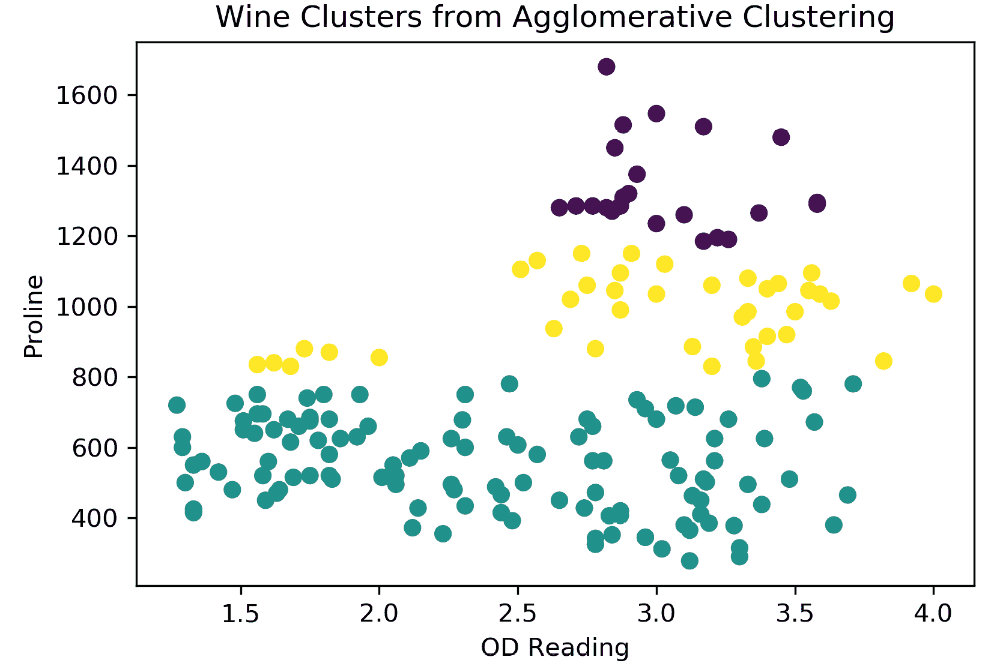
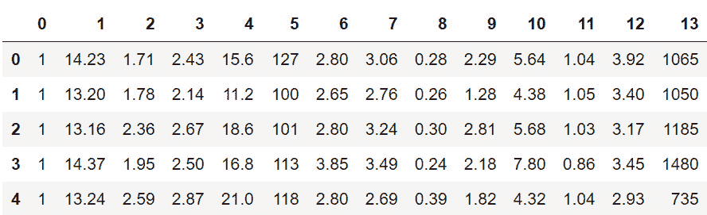
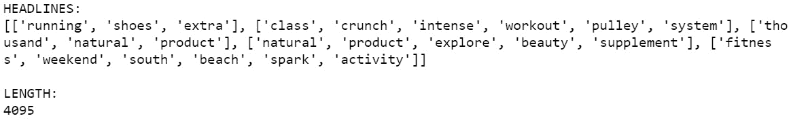
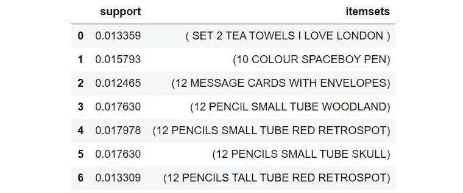
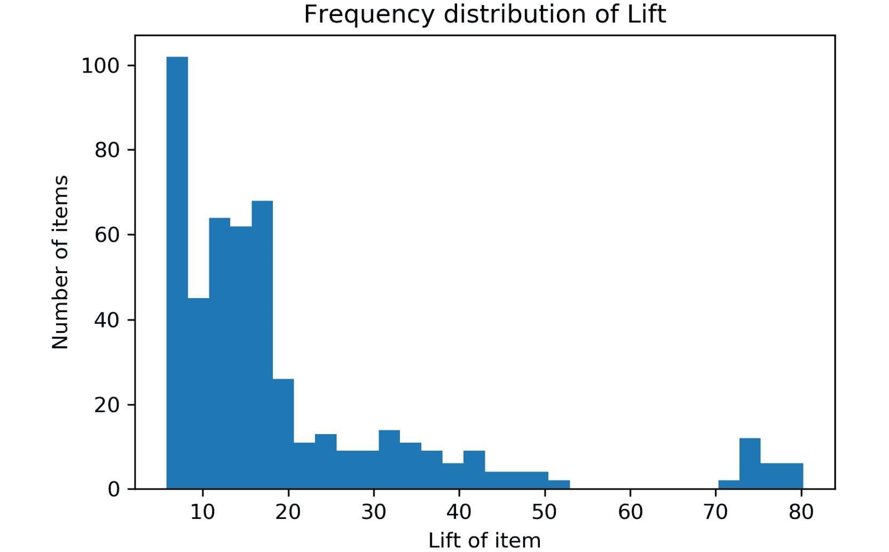
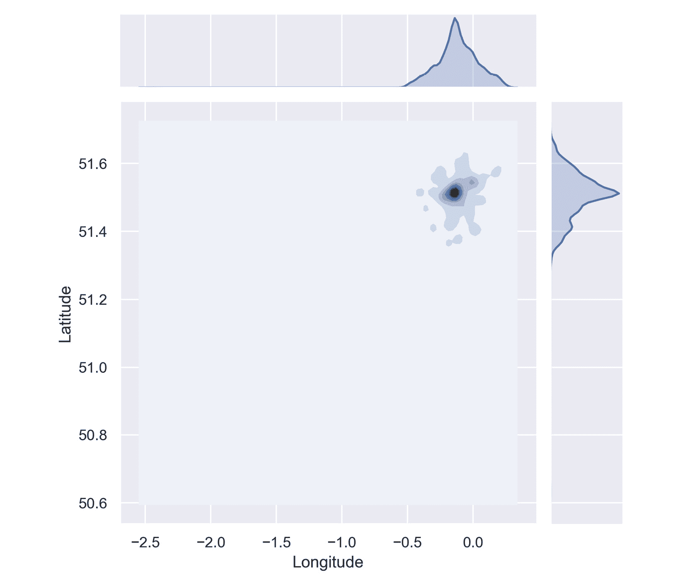
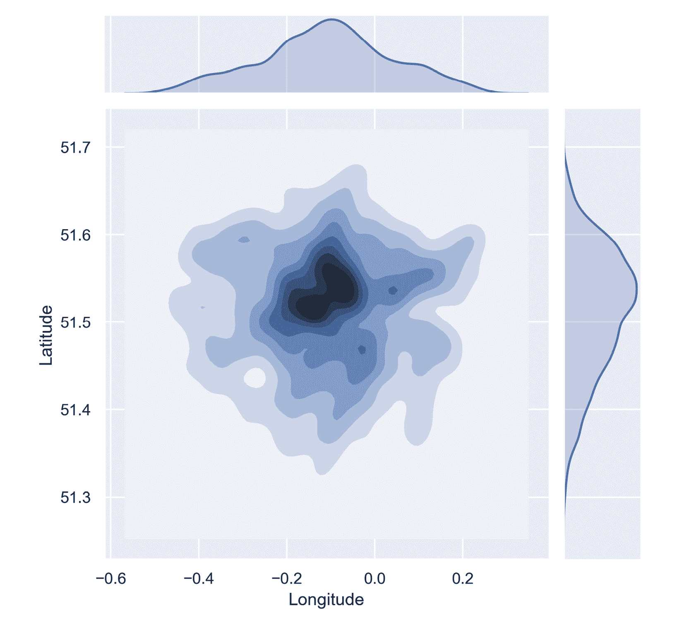

# 附录

# 1\. 聚类简介

## 活动 1.01：实现 k-means 聚类

解决方案：

1.  导入所需的库：

    ```py
    from sklearn.datasets import make_blobs
    from sklearn.cluster import KMeans
    from sklearn.metrics import accuracy_score, silhouette_score
    import matplotlib.pyplot as plt
    import pandas as pd
    import numpy as np
    from scipy.spatial.distance import cdist
    import math
    np.random.seed(0)
    %matplotlib inline
    ```

1.  使用 `pandas` 加载种子数据文件：

    ```py
    seeds = pd.read_csv('Seed_Data.csv')
    ```

1.  返回数据集的前五行，如下所示：

    ```py
    seeds.head()
    ```

    输出如下：

    

    图 1.25：显示数据集的前五行

1.  按如下方式分离 `X` 特征：

    ```py
    X = seeds[['A','P','C','LK','WK','A_Coef','LKG']]
    y = seeds['target']
    ```

1.  按如下方式检查特征：

    ```py
    X.head()
    ```

    输出如下：

    

    图 1.26：打印特征

1.  定义 `k_means` 函数，如下所示，并随机初始化 k-质心。使用 `while` 循环重复此过程，直到新旧 `centroids` 之间的差值为 `0`：

    ```py
    Activity 1.01.ipynb
    def k_means(X, K):
        # Keep track of history so you can see K-Means in action
        centroids_history = []
        labels_history = []

        # Randomly initialize Kcentroids
        rand_index = np.random.choice(X.shape[0], K)  
        centroids = X[rand_index]
        centroids_history.append(centroids)
    The complete code for this step can be found at https://packt.live/2JPZ4M8.
    ```

1.  将 pandas DataFrame 转换为 NumPy 矩阵：

    ```py
    X_mat = X.values
    ```

1.  将我们的种子矩阵传递给之前创建的 `k_means` 函数：

    ```py
    centroids, labels, centroids_history, labels_history = \
    k_means(X_mat, 3)
    ```

1.  打印标签：

    ```py
    print(labels)
    ```

    输出如下：

    

    图 1.27：打印标签

1.  按如下方式绘制坐标：

    ```py
    plt.scatter(X['A'], X['LK'])
    plt.title('Wheat Seeds - Area vs Length of Kernel')
    plt.show()
    plt.scatter(X['A'], X['LK'], c=labels, cmap='tab20b')
    plt.title('Wheat Seeds - Area vs Length of Kernel')
    plt.show()
    ```

    输出如下：

    

    图 1.28：绘制坐标

1.  按如下方式计算轮廓系数：

    ```py
    silhouette_score(X[['A','LK']], labels)
    ```

    输出如下：

    ```py
    0.5875704550892767
    ```

通过完成此活动，您已经获得了在实际数据集上调优 k-means 聚类算法的实践经验。种子数据集被视为数据科学领域经典的“Hello World”类型问题，对于测试基础技术非常有帮助。

注意

要访问此特定部分的源代码，请参考 [`packt.live/2JPZ4M8`](https://packt.live/2JPZ4M8)。

您还可以在 [`packt.live/2Ocncuh`](https://packt.live/2Ocncuh) 上在线运行此示例。

# 2\. 层次聚类

## 活动 2.01：将 k-means 与层次聚类进行比较

解决方案：

1.  从 scikit-learn 导入必要的包（`KMeans`，`AgglomerativeClustering` 和 `silhouette_score`），如下所示：

    ```py
    from sklearn.cluster import KMeans
    from sklearn.cluster import AgglomerativeClustering
    from sklearn.metrics import silhouette_score
    import pandas as pd
    import matplotlib.pyplot as plt
    ```

1.  将酒类数据集读取到 Pandas DataFrame 中并打印一个小样本：

    ```py
    wine_df = pd.read_csv("wine_data.csv")
    print(wine_df.head())
    ```

    输出如下：

    

    图 2.25：酒类数据集的输出

1.  可视化酒类数据集以理解数据结构：

    ```py
    plt.scatter(wine_df.values[:,0], wine_df.values[:,1])
    plt.title("Wine Dataset")
    plt.xlabel("OD Reading")
    plt.ylabel("Proline")
    plt.show()
    ```

    输出如下：

    

    图 2.26：原始酒类数据的绘图

1.  在酒类数据集上使用 `sklearn` 实现 k-means 聚类，已知有三种酒类：

    ```py
    km = KMeans(3)
    km_clusters = km.fit_predict(wine_df)
    ```

1.  使用 `sklearn` 实现层次聚类，应用于酒类数据集：

    ```py
    ac = AgglomerativeClustering(3, linkage='average')
    ac_clusters = ac.fit_predict(wine_df)
    ```

1.  按如下方式绘制 k-means 的预测聚类：

    ```py
    plt.scatter(wine_df.values[:,0], \
                wine_df.values[:,1], c=km_clusters)
    plt.title("Wine Clusters from K-Means Clustering")
    plt.xlabel("OD Reading")
    plt.ylabel("Proline")
    plt.show()
    ```

    输出如下：

    

    图 2.27：k-means 聚类的聚类图

1.  如下所示绘制层次聚类的预测聚类：

    ```py
    plt.scatter(wine_df.values[:,0], \
                wine_df.values[:,1], c=ac_clusters)
    plt.title("Wine Clusters from Agglomerative Clustering")
    plt.xlabel("OD Reading")
    plt.ylabel("Proline")
    plt.show()
    ```

    输出如下：

    

    图 2.28：聚合聚类的聚类图

    注意

    在*图 2.23*和*图 2.24*中，每种颜色代表一个单独的聚类。每次执行代码时，聚类的颜色都会发生变化。

1.  比较每种聚类方法的轮廓分数：

    ```py
    print("Silhouette Scores for Wine Dataset:\n")
    print("K-Means Clustering: ", silhouette_score\
         (wine_df, km_clusters))
    print("Agg Clustering: ", silhouette_score(wine_df, ac_clusters))
    ```

    输出将如下所示：

    ```py
    Silhouette Scores for Wine Dataset:
    K-Means Clustering:  0.5809421087616886
    Agg Clustering:  0.5988495817462
    ```

从前面的轮廓指标可以看出，在按平均簇内距离分离聚类时，聚合聚类稍微优于 k-means 聚类。然而，这并不是每个聚合聚类版本的情况。相反，尝试不同的连接类型，并检查每种类型下的轮廓分数和聚类的变化。

注意

要访问该特定部分的源代码，请参考[`packt.live/2AFA60Z`](https://packt.live/2AFA60Z)。

你也可以在线运行此示例，访问[`packt.live/3fe2lTi`](https://packt.live/3fe2lTi)。

# 3. 邻域方法和 DBSCAN

## 活动 3.01：从零实现 DBSCAN

解决方案：

1.  生成一个随机的聚类数据集，如下所示：

    ```py
    from sklearn.cluster import DBSCAN
    from sklearn.datasets import make_blobs
    import matplotlib.pyplot as plt
    import numpy as np
    %matplotlib inline
    X_blob, y_blob = make_blobs(n_samples=500, \
                                centers=4, n_features=2, \
                                random_state=800)
    ```

1.  可视化生成的数据：

    ```py
    plt.scatter(X_blob[:,0], X_blob[:,1])
    plt.show()
    ```

    输出如下所示：

    

    图 3.15：生成的数据的绘图

1.  从头开始创建函数，允许你在数据集上调用 DBSCAN：

    ```py
    Activity3.01.ipynb
    def scratch_DBSCAN(x, eps, min_pts): 
        """
        param x (list of vectors): your dataset to be clustered
        param eps (float): neighborhood radius threshold 
        param min_pts (int): minimum number of points threshold for 
        a neighborhood to be a cluster
        """
        # Build a label holder that is comprised of all 0s
        labels = [0]* x.shape[0]
        # Arbitrary starting "current cluster" ID
        C = 0
    The complete code for this step can be found at https://packt.live/3c1rONO.
    ```

1.  使用你创建的 DBSCAN 实现来查找生成数据集中的聚类。根据需要调整超参数，并根据它们在*第 5 步*中的表现进行调优：

    ```py
    labels = scratch_DBSCAN(X_blob, 0.6, 5)
    ```

1.  可视化你实现的 DBSCAN 聚类性能：

    ```py
    plt.scatter(X_blob[:,0], X_blob[:,1], c=labels)
    plt.title("DBSCAN from Scratch Performance")
    plt.show()
    ```

    输出如下所示：

    

图 3.16：DBSCAN 实现的绘图

在前面的输出中，你可以看到我们生成的数据中有四个明确定义的聚类。未突出显示的点超出了邻域范围，因此被视为噪声。尽管这可能不是理想的，因为不是每个点都被考虑在内，但对于大多数商业案例来说，这种噪声是可以接受的。如果在你的场景中不能接受，你可以调整提供的超参数，使得距离容忍度更高。

正如你可能已经注意到的，定制实现的运行时间较长。这是因为我们为了清晰起见，探索了非向量化版本的算法。在大多数情况下，你应该使用 scikit-learn 提供的 DBSCAN 实现，因为它经过高度优化。

注意

要访问该特定部分的源代码，请参考[`packt.live/3c1rONO`](https://packt.live/3c1rONO)。

你也可以在线运行此示例，访问[`packt.live/2ZVoFuO`](https://packt.live/2ZVoFuO)。

## 活动 3.02：将 DBSCAN 与 k-means 和层次聚类进行比较

解决方案：

1.  导入必要的包：

    ```py
    from sklearn.cluster \
    import KMeans, AgglomerativeClustering, DBSCAN
    from sklearn.metrics import silhouette_score
    import pandas as pd
    import matplotlib.pyplot as plt
    %matplotlib inline
    ```

1.  从*第二章*，*层次聚类*中加载葡萄酒数据集，并再次熟悉数据的外观：

    ```py
    # Load Wine data set
    wine_df = pd.read_csv("wine_data.csv")
    # Show sample of data set
    print(wine_df.head())
    ```

    输出如下所示：

    

    图 3.17：葡萄酒数据集的前五行

1.  可视化数据：

    ```py
    plt.scatter(wine_df.values[:,0], wine_df.values[:,1])
    plt.title("Wine Dataset")
    plt.xlabel("OD Reading")
    plt.ylabel("Proline")
    plt.show()
    ```

    输出结果如下：

    

    图 3.18：数据图示

1.  使用 k-means、凝聚聚类和 DBSCAN 生成聚类：

    ```py
    # Generate clusters from K-Means
    km = KMeans(3)
    km_clusters = km.fit_predict(wine_df)
    # Generate clusters using Agglomerative Hierarchical Clustering
    ac = AgglomerativeClustering(3, linkage='average')
    ac_clusters = ac.fit_predict(wine_df)
    ```

1.  评估不同的 DSBSCAN 超参数选项及其对轮廓得分的影响：

    ```py
    db_param_options = [[20,5],[25,5],[30,5],[25,7],[35,7],[40,5]]
    for ep,min_sample in db_param_options:
        # Generate clusters using DBSCAN
        db = DBSCAN(eps=ep, min_samples = min_sample)
        db_clusters = db.fit_predict(wine_df)
        print("Eps: ", ep, "Min Samples: ", min_sample)
        print("DBSCAN Clustering: ", \
              silhouette_score(wine_df, db_clusters))
    ```

    输出结果如下：

    

    图 3.19：打印聚类的轮廓得分

1.  根据最高的轮廓得分生成最终聚类（`eps`：`35`，`min_samples`：`3`）：

    ```py
    # Generate clusters using DBSCAN
    db = DBSCAN(eps=40, min_samples = 5)
    db_clusters = db.fit_predict(wine_df)
    ```

1.  可视化使用三种方法生成的聚类：

    ```py
    plt.title("Wine Clusters from K-Means")
    plt.scatter(wine_df['OD_read'], wine_df['Proline'], \
                c=km_clusters,s=50, cmap='tab20b')
    plt.show()
    plt.title("Wine Clusters from Agglomerative Clustering")
    plt.scatter(wine_df['OD_read'], wine_df['Proline'], \
                c=ac_clusters,s=50, cmap='tab20b')
    plt.show()
    plt.title("Wine Clusters from DBSCAN")
    plt.scatter(wine_df['OD_read'], wine_df['Proline'], \
                c=db_clusters,s=50, cmap='tab20b')
    plt.show()
    ```

    输出结果如下：

    

    图 3.20：使用不同算法绘制聚类图

1.  评估每种方法的轮廓得分：

    ```py
    # Calculate Silhouette Scores
    print("Silhouette Scores for Wine Dataset:\n")
    print("K-Means Clustering: ", \
           silhouette_score(wine_df, km_clusters))
    print("Agg Clustering: ", \
          silhouette_score(wine_df, ac_clusters))
    print("DBSCAN Clustering: ", \
          silhouette_score(wine_df, db_clusters))
    ```

    输出结果如下：

    ```py
    Silhouette Scores for Wine Dataset:
    K-Means Clustering:  0.5809421087616886
    Agg Clustering:  0.5988495817462
    DBSCAN Clustering:  0.5739675293567901
    ```

如你所见，DBSCAN 并不是自动适合你聚类需求的最佳选择。与其他算法的一个关键区别在于它将噪声视为潜在的聚类。在某些情况下，这很有帮助，因为它能够去除异常值；然而，也可能会出现它调整得不够好，导致过多的点被分类为噪声的情况。你可以通过在拟合聚类算法时调整超参数进一步提高轮廓得分——尝试几种不同的组合，看看它们如何影响得分。

注意

要获取此特定部分的源代码，请参考 [`packt.live/2BNSQvC`](https://packt.live/2BNSQvC)。

你也可以在网上运行这个示例，链接地址为 [`packt.live/3iElboS`](https://packt.live/3iElboS)。

# 4\. 降维技术与 PCA

## 活动 4.01：手动 PCA 与 scikit-learn

解决方案：

1.  导入 `pandas`、`numpy` 和 `matplotlib` 绘图库以及 scikit-learn 的 `PCA` 模型：

    ```py
    import pandas as pd
    import numpy as np
    import matplotlib.pyplot as plt
    from sklearn.decomposition import PCA
    ```

1.  加载数据集，并按照之前的练习仅选择花萼特征。显示数据的前五行：

    ```py
    df = pd.read_csv('../Seed_Data.csv')
    df = df[['A', 'LK']]
    df.head()
    ```

    输出结果如下：

    

    图 4.36：数据的前五行

1.  计算数据的`协方差`矩阵：

    ```py
    cov = np.cov(df.values.T)
    cov
    ```

    输出结果如下：

    ```py
    array([[8.46635078, 1.22470367],
           [1.22470367, 0.19630525]])
    ```

1.  使用 scikit-learn API 转换数据，并仅使用第一个主成分。将转换后的数据存储在 `sklearn_pca` 变量中：

    ```py
    model = PCA(n_components=1)
    sklearn_pca = model.fit_transform(df.values)
    ```

1.  使用手动 PCA 转换数据，并仅使用第一个主成分。将转换后的数据存储在 `manual_pca` 变量中：

    ```py
    eigenvectors, eigenvalues, _ = \
    np.linalg.svd(cov, full_matrices=False)
    P = eigenvectors[0]
    manual_pca = P.dot(df.values.T)
    ```

1.  在同一图上绘制 `sklearn_pca` 和 `manual_pca` 值，以可视化差异：

    ```py
    plt.figure(figsize=(10, 7)) 
    plt.plot(sklearn_pca, label='Scikit-learn PCA')
    plt.plot(manual_pca, label='Manual PCA', linestyle='--')
    plt.xlabel('Sample')
    plt.ylabel('Transformed Value')
    plt.legend()
    plt.show()
    ```

    输出结果如下：

    

    图 4.37：数据图示

1.  注意，两个图几乎一模一样，只是一个是另一个的镜像，且两者之间有偏移。显示 `sklearn_pca` 和 `manual_pca` 模型的组件：

    ```py
    model.components_
    ```

    输出结果如下：

    ```py
    array([[0.98965371, 0.14347657]])
    ```

1.  现在，打印 `P`：

    ```py
    P
    ```

    输出结果如下：

    ```py
    array([-0.98965371, -0.14347657])
    ```

    注意符号上的差异；数值是相同的，但符号不同，产生镜像结果。这只是约定上的差异，没有实际意义。

1.  将`manual_pca`模型乘以`-1`并重新绘制：

    ```py
    manual_pca *= -1
    plt.figure(figsize=(10, 7))
    plt.plot(sklearn_pca, label='Scikit-learn PCA')
    plt.plot(manual_pca, label='Manual PCA', linestyle='--')
    plt.xlabel('Sample')
    plt.ylabel('Transformed Value')
    plt.legend()
    plt.show()
    ```

    输出如下：

    

    图 4.38：重新绘制的数据

1.  现在，我们只需处理两者之间的偏移。scikit-learn API 会在转换之前先减去数据的均值。在进行手动 PCA 转换之前，从数据集中减去每列的均值：

    ```py
    mean_vals = np.mean(df.values, axis=0)
    offset_vals = df.values - mean_vals
    manual_pca = P.dot(offset_vals.T)
    ```

1.  将结果乘以`-1`：

    ```py
    manual_pca *= -1
    ```

1.  重新绘制各个`sklearn_pca`和`manual_pca`值：

    ```py
    plt.figure(figsize=(10, 7))
    plt.plot(sklearn_pca, label='Scikit-learn PCA')
    plt.plot(manual_pca, label='Manual PCA', linestyle='--')
    plt.xlabel('Sample')
    plt.ylabel('Transformed Value')
    plt.legend()
    plt.show()
    ```

    输出如下：

    

图 4.39：重新绘制数据

最终图将展示两种方法完成的降维实际上是相同的。差异体现在`covariance`矩阵符号上的不同，因为两种方法仅使用不同的特征作为基准进行比较。最后，两个数据集之间也存在偏移，这归因于在执行 scikit-learn PCA 转换之前已减去均值样本。

注意

要访问此特定部分的源代码，请参考[`packt.live/2O9MEk4`](https://packt.live/2O9MEk4)。

你也可以在线运行此示例，访问[`packt.live/3gBntTU`](https://packt.live/3gBntTU)。

## 活动 4.02：使用扩展的种子数据集进行 PCA

解决方案：

1.  导入`pandas`和`matplotlib`。为了启用 3D 绘图，你还需要导入`Axes3D`：

    ```py
    import pandas as pd
    import numpy as np
    import matplotlib.pyplot as plt
    from sklearn.decomposition import PCA
    from mpl_toolkits.mplot3d import Axes3D #Required for 3D plotting
    ```

1.  读取数据集并选择`A`、`LK`和`C`列：

    ```py
    df = pd.read_csv('../Seed_Data.csv')[['A', 'LK', 'C']]
    df.head()
    ```

    输出如下：

    

    图 4.40：内核的面积、长度和紧凑性

1.  在三维空间中绘制数据：

    ```py
    fig = plt.figure(figsize=(10, 7))
    # Where Axes3D is required
    ax = fig.add_subplot(111, projection='3d')
    ax.scatter(df['A'], df['LK'], df['C'])
    ax.set_xlabel('Area of Kernel')
    ax.set_ylabel('Length of Kernel')
    ax.set_zlabel('Compactness of Kernel')
    ax.set_title('Expanded Seeds Dataset')
    plt.show()
    ```

    输出如下：

    

    图 4.41：扩展的种子数据集绘图

1.  创建一个不指定主成分数量的`PCA`模型：

    ```py
    model = PCA()
    ```

1.  将模型拟合到数据集：

    ```py
    model.fit(df.values)
    ```

    输出如下：

    ```py
    PCA(copy=True, iterated_power='auto', n_components=None, 
        random_state=None,
        svd_solver='auto', tol=0.0, whiten=False)
    ```

1.  显示特征值或`explained_variance_ratio_`：

    ```py
    model.explained_variance_ratio_
    ```

    输出如下：

    ```py
    array([9.97794495e-01, 2.19418709e-03, 1.13183333e-05])
    ```

    我们希望减少数据集的维度，但仍保留至少 90%的方差。为了保留 90%的方差，最少需要多少个主成分？

    至少需要第一主成分以保留 90%以上的方差。第一主成分提供了数据集 99.7%的方差。

1.  创建一个新的`PCA`模型，这次指定所需的主成分数量，以保留至少 90%的方差：

    ```py
    model = PCA(n_components=1)
    ```

1.  使用新模型转换数据：

    ```py
    data_transformed = model.fit_transform(df.values)
    ```

1.  将转换后的数据恢复到原始数据空间：

    ```py
    data_restored = model.inverse_transform(data_transformed)
    ```

1.  在一个子图中绘制恢复后的三维数据，在第二个子图中绘制原始数据，以可视化去除部分方差的效果：

    ```py
    fig = plt.figure(figsize=(10, 14))
    # Original Data
    ax = fig.add_subplot(211, projection='3d')
    ax.scatter(df['A'], df['LK'], df['C'], label='Original Data');
    ax.set_xlabel('Area of Kernel');
    ax.set_ylabel('Length of Kernel');
    ax.set_zlabel('Compactness of Kernel');
    ax.set_title('Expanded Seeds Dataset');
    # Transformed Data
    ax = fig.add_subplot(212, projection='3d')
    ax.scatter(data_restored[:,0], data_restored[:,1], \
               data_restored[:,2], label='Restored Data');
    ax.set_xlabel('Area of Kernel');
    ax.set_ylabel('Length of Kernel');
    ax.set_zlabel('Compactness of Kernel');
    ax.set_title('Restored Seeds Dataset');
    ```

    输出如下：

    

图 4.42：扩展和恢复后的 Seeds 数据集的绘图

从前面的图表中可以看出，我们已经去除了数据中的大部分噪声，但保留了关于数据趋势的最重要信息。你可以看到，通常情况下，小麦粒的紧密度随着面积的增大而增加。

注意

在应用 PCA 时，必须考虑所建模数据的大小以及可用的系统内存。奇异值分解过程涉及将数据分离为特征值和特征向量，这可能会占用大量内存。如果数据集过大，可能会导致无法完成处理、性能显著下降或系统崩溃。

要访问此特定部分的源代码，请参考 [`packt.live/2ZVpaFc`](https://packt.live/2ZVpaFc)。

你也可以在线运行这个示例，网址：[`packt.live/3gIrR3D`](https://packt.live/3gIrR3D)。

# 5. 自编码器

## 活动 5.01：MNIST 神经网络

解决方案：

在这个活动中，你将训练一个神经网络来识别 MNIST 数据集中的图像，并强化你在训练神经网络方面的技能：

1.  导入 `pickle`、`numpy`、`matplotlib` 以及 Keras 中的 `Sequential` 和 `Dense` 类：

    ```py
    import pickle
    import numpy as np
    import matplotlib.pyplot as plt
    from keras.models import Sequential
    from keras.layers import Dense
    import tensorflow.python.util.deprecation as deprecation
    deprecation._PRINT_DEPRECATION_WARNINGS = False
    ```

1.  加载 `mnist.pkl` 文件，该文件包含来自 MNIST 数据集的前 10,000 张图像及其对应标签，这些数据可在随附的源代码中找到。MNIST 数据集是包含 0 到 9 手写数字的 28 x 28 灰度图像系列。提取图像和标签：

    ```py
    with open('mnist.pkl', 'rb') as f:
        data = pickle.load(f)
    images = data['images']
    labels = data['labels']
    ```

1.  绘制前 10 个样本及其相应的标签：

    ```py
    plt.figure(figsize=(10, 7))
    for i in range(10):
        plt.subplot(2, 5, i + 1)
        plt.imshow(images[i], cmap='gray')
        plt.title(labels[i])
        plt.axis('off')
    ```

    输出结果如下：

    

    图 5.40：前 10 个样本

1.  使用独热编码对标签进行编码：

    ```py
    one_hot_labels = np.zeros((images.shape[0], 10))
    for idx, label in enumerate(labels):
        one_hot_labels[idx, label] = 1
    one_hot_labels
    ```

    输出结果如下：

    ```py
    array([[0., 0., 0., ..., 0., 0., 0.],
           [1., 0., 0., ..., 0., 0., 0.],
           [0., 0., 0., ..., 0., 0., 0.],
           ...,
           [0., 0., 0., ..., 0., 0., 0.],
           [0., 0., 0., ..., 0., 0., 1.],
           [0., 0., 0., ..., 1., 0., 0.]])
    ```

1.  准备好输入神经网络的图像。作为提示，这个过程分为两个独立的步骤：

    ```py
    images = images.reshape((-1, 28 ** 2))
    images = images / 255.
    ```

1.  在 Keras 中构建一个神经网络模型，接受已准备好的图像，具有 600 个单元的隐藏层并使用 ReLU 激活函数，输出层的单元数与类别数相同。输出层使用 `softmax` 激活函数：

    ```py
    model = Sequential([Dense(600, input_shape=(784,), \
                        activation='relu'), \
                        Dense(10, activation='softmax'),])
    ```

1.  使用多类交叉熵、随机梯度下降和准确率性能指标来编译模型：

    ```py
    model.compile(loss='categorical_crossentropy', \
                  optimizer='sgd', metrics=['accuracy'])
    ```

1.  训练模型。需要多少个 epoch 才能在训练数据上达到至少 95% 的分类准确率？我们来看看：

    ```py
    model.fit(images, one_hot_labels, epochs=20)
    ```

    输出结果如下：

    

图 5.41：训练模型

需要 15 个 epoch 才能在训练集上达到至少 95% 的分类准确率。

在这个示例中，我们使用分类器训练的数据来衡量神经网络分类器的性能。通常情况下，不应该使用这种方法，因为它通常报告比你期望的模型准确度更高。在监督学习问题中，应使用若干 **交叉验证** 技术。由于这是一本关于无监督学习的课程，交叉验证超出了本书的范围。

注意

要访问此特定部分的源代码，请参考 [`packt.live/2VZpLnZ`](https://packt.live/2VZpLnZ)。

你也可以在网上运行这个示例，访问 [`packt.live/2Z9ueGz`](https://packt.live/2Z9ueGz)。

## 活动 5.02：简单的 MNIST 自动编码器

解决方案：

1.  导入 `pickle`、`numpy` 和 `matplotlib`，以及 Keras 中的 `Model`、`Input` 和 `Dense` 类：

    ```py
    import pickle
    import numpy as np
    import matplotlib.pyplot as plt
    from keras.models import Model
    from keras.layers import Input, Dense
    import tensorflow.python.util.deprecation as deprecation
    deprecation._PRINT_DEPRECATION_WARNINGS = False
    ```

1.  从提供的 MNIST 数据集样本中加载图像，样本随附有源代码 (`mnist.pkl`)：

    ```py
    with open('mnist.pkl', 'rb') as f:
        images = pickle.load(f)['images']
    ```

1.  准备将图像输入到神经网络中。作为提示，这个过程有 **两个** 独立的步骤：

    ```py
    images = images.reshape((-1, 28 ** 2))
    images = images / 255.
    ```

1.  构建一个简单的自动编码器网络，将图像大小在编码阶段压缩至 10 x 10：

    ```py
    input_stage = Input(shape=(784,))
    encoding_stage = Dense(100, activation='relu')(input_stage)
    decoding_stage = Dense(784, activation='sigmoid')(encoding_stage)
    autoencoder = Model(input_stage, decoding_stage)
    ```

1.  使用二元交叉熵损失函数和 `adadelta` 梯度下降法编译自动编码器：

    ```py
    autoencoder.compile(loss='binary_crossentropy', \
                        optimizer='adadelta')
    ```

1.  拟合编码器模型：

    ```py
    autoencoder.fit(images, images, epochs=100)
    ```

    输出如下：

    

    图 5.42：训练模型

1.  计算并存储编码阶段前五个样本的输出：

    ```py
    encoder_output = Model(input_stage, encoding_stage)\
                     .predict(images[:5])
    ```

1.  将编码器的输出重塑为 10 x 10（10 x 10 = 100）像素，并乘以 255：

    ```py
    encoder_output = encoder_output.reshape((-1, 10, 10)) * 255
    ```

1.  计算并存储解码阶段前五个样本的输出：

    ```py
    decoder_output = autoencoder.predict(images[:5])
    ```

1.  将解码器的输出重塑为 28 x 28，并乘以 255：

    ```py
    decoder_output = decoder_output.reshape((-1, 28, 28)) * 255
    ```

1.  绘制原始图像、编码器输出和解码器：

    ```py
    images = images.reshape((-1, 28, 28))
    plt.figure(figsize=(10, 7))
    for i in range(5):
        plt.subplot(3, 5, i + 1)
        plt.imshow(images[i], cmap='gray')
        plt.axis('off')
        plt.subplot(3, 5, i + 6)
        plt.imshow(encoder_output[i], cmap='gray')
        plt.axis('off')
        plt.subplot(3, 5, i + 11)
        plt.imshow(decoder_output[i], cmap='gray')
        plt.axis('off')
    ```

    输出如下：

    

图 5.43：原始图像、编码器输出和解码器

到目前为止，我们已经展示了如何使用编码和解码阶段的简单单隐层将数据降维。我们还可以通过向编码和解码阶段添加额外的层，使该模型更加复杂。

注意

要访问此特定部分的源代码，请参考 [`packt.live/3f5ZSdH`](https://packt.live/3f5ZSdH)。

你也可以在网上运行这个示例，访问 [`packt.live/2W0ZkhP`](https://packt.live/2W0ZkhP)。

## 活动 5.03：MNIST 卷积自动编码器

解决方案：

1.  导入 `pickle`、`numpy`、`matplotlib` 和 `keras.models` 中的 `Model` 类，导入 `keras.layers` 中的 `Input`、`Conv2D`、`MaxPooling2D` 和 `UpSampling2D`：

    ```py
    import pickle
    import numpy as np
    import matplotlib.pyplot as plt
    from keras.models import Model
    from keras.layers \
    import Input, Conv2D, MaxPooling2D, UpSampling2D
    import tensorflow.python.util.deprecation as deprecation
    deprecation._PRINT_DEPRECATION_WARNINGS = False
    ```

1.  加载数据：

    ```py
    with open('mnist.pkl', 'rb') as f:
        images = pickle.load(f)['images']
    ```

1.  将图像缩放至 0 到 1 之间：

    ```py
    images = images / 255.
    ```

1.  我们需要重塑图像，以添加一个深度通道，以便用于卷积阶段。将图像重塑为 28 x 28 x 1：

    ```py
    images = images.reshape((-1, 28, 28, 1))
    ```

1.  定义输入层。我们将使用与图像相同形状的输入：

    ```py
    input_layer = Input(shape=(28, 28, 1,))
    ```

1.  添加一个具有 16 层或滤波器的卷积阶段，使用 3 x 3 的权重矩阵，ReLU 激活函数，并使用相同的填充，这意味着输出与输入图像的长度相同：

    ```py
    hidden_encoding = \
    Conv2D(16, # Number of layers or filters in the weight matrix \
           (3, 3), # Shape of the weight matrix \
           activation='relu', \
           padding='same', # How to apply the weights to the images \
           )(input_layer)
    ```

1.  为编码器添加一个最大池化层，使用 2 x 2 的卷积核：

    ```py
    encoded = MaxPooling2D((2, 2))(hidden_encoding)
    ```

1.  添加解码卷积层：

    ```py
    hidden_decoding = \
    Conv2D(16, # Number of layers or filters in the weight matrix \
           (3, 3), # Shape of the weight matrix \
           activation='relu', \
           padding='same', # How to apply the weights to the images \
           )(encoded)
    ```

1.  添加上采样层：

    ```py
    upsample_decoding = UpSampling2D((2, 2))(hidden_decoding)
    ```

1.  添加最后一个卷积阶段，按照初始图像的深度使用一层：

    ```py
    decoded = \
    Conv2D(1, # Number of layers or filters in the weight matrix \
           (3, 3), # Shape of the weight matrix \
           activation='sigmoid', \
           padding='same', # How to apply the weights to the images \
           )(upsample_decoding)
    ```

1.  通过将网络的第一层和最后一层传递给 `Model` 类来构建模型：

    ```py
    autoencoder = Model(input_layer, decoded)
    ```

1.  显示模型结构：

    ```py
    autoencoder.summary()
    ```

    输出如下：

    

    图 5.44: 模型结构

1.  使用二元交叉熵损失函数和 `adadelta` 梯度下降法编译自编码器：

    ```py
    autoencoder.compile(loss='binary_crossentropy', \
                        optimizer='adadelta')
    ```

1.  现在，让我们拟合模型；再次，将图像作为训练数据和期望的输出。由于卷积网络的计算时间较长，因此训练 20 个 epoch：

    ```py
    autoencoder.fit(images, images, epochs=20)
    ```

    输出如下：

    

    图 5.45: 训练模型

1.  计算并存储前五个样本的编码阶段输出：

    ```py
    encoder_output = Model(input_layer, encoded).predict(images[:5])
    ```

1.  为了可视化，重塑编码器输出，每个图像的大小为 X*Y：

    ```py
    encoder_output = encoder_output.reshape((-1, 14 * 14, 16))
    ```

1.  获取解码器对前五个图像的输出：

    ```py
    decoder_output = autoencoder.predict(images[:5])
    ```

1.  将解码器输出重塑为 28 x 28 的大小：

    ```py
    decoder_output = decoder_output.reshape((-1, 28, 28))
    ```

1.  将原始图像重塑回 28 x 28 的大小：

    ```py
    images = images.reshape((-1, 28, 28))
    ```

1.  绘制原始图像、平均编码器输出和解码器：

    ```py
    plt.figure(figsize=(10, 7))
    for i in range(5):
        # Plot the original digit images
        plt.subplot(3, 5, i + 1)
        plt.imshow(images[i], cmap='gray')
        plt.axis('off')
        # Plot the encoder output
        plt.subplot(3, 5, i + 6)
        plt.imshow(encoder_output[i], cmap='gray')
        plt.axis('off')
        # Plot the decoder output
        plt.subplot(3, 5, i + 11)
        plt.imshow(decoder_output[i], cmap='gray')
        plt.axis('off')
    ```

    输出如下：

    

图 5.46: 原始图像、编码器输出和解码器

在本次活动结束时，您将开发一个包含卷积层的自编码器神经网络。注意解码器表示的改进。与全连接神经网络层相比，这种架构在性能上有显著优势，并且在处理基于图像的数据集和生成人工数据样本时极为有用。

注意

要访问此特定部分的源代码，请参见 [`packt.live/2CdpIxY`](https://packt.live/2CdpIxY)。

您还可以在在线运行此示例 [`packt.live/3iKz8l2`](https://packt.live/3iKz8l2)。

# 6. t-分布随机邻域嵌入

## 活动 6.01: 葡萄酒 t-SNE

解决方案：

1.  导入 `pandas`、`numpy` 和 `matplotlib`，以及来自 scikit-learn 的 `t-SNE` 和 `PCA` 模型：

    ```py
    import pandas as pd
    import numpy as np
    import matplotlib.pyplot as plt
    from sklearn.decomposition import PCA
    from sklearn.manifold import TSNE
    ```

1.  使用随附源代码中的 `wine.data` 文件加载葡萄酒数据集，并显示数据的前五行：

    ```py
    df = pd.read_csv('wine.data', header=None)
    df.head()
    ```

    输出如下：

    

    图 6.25: 葡萄酒数据集的前五行

1.  第一列包含标签；提取该列并将其从数据集中移除：

    ```py
    labels = df[0]
    del df[0]
    ```

1.  执行 PCA，将数据集降到前六个主成分：

    ```py
    model_pca = PCA(n_components=6)
    wine_pca = model_pca.fit_transform(df)
    ```

1.  确定这六个成分描述的数据中的方差量：

    ```py
    np.sum(model_pca.explained_variance_ratio_)
    ```

    输出如下：

    ```py
    0.99999314824536
    ```

1.  创建一个使用指定随机状态并设置`verbose`值为 1 的 t-SNE 模型：

    ```py
    tsne_model = TSNE(random_state=0, verbose=1)
    tsne_model
    ```

    输出如下：

    

    图 6.26：创建 t-SNE 模型

1.  将 PCA 数据拟合到 t-SNE 模型：

    ```py
    wine_tsne = tsne_model.fit_transform\
                (wine_pca.reshape((len(wine_pca), -1)))
    ```

    输出如下：

    

    图 6.27：将 PCA 数据拟合到 t-SNE 模型

1.  确认 t-SNE 拟合数据的形状是二维的：

    ```py
    wine_tsne.shape
    ```

    输出如下：

    ```py
    (178, 2)
    ```

1.  创建二维数据的散点图：

    ```py
    plt.figure(figsize=(10, 7))
    plt.scatter(wine_tsne[:,0], wine_tsne[:,1])
    plt.title('Low Dimensional Representation of Wine')
    plt.show()
    ```

    输出如下：

    

    图 6.28：二维数据的散点图

1.  创建带有类别标签的二维数据二次散点图，以可视化可能存在的聚类：

    ```py
    MARKER = ['o', 'v', '^',]
    plt.figure(figsize=(10, 7))
    plt.title('Low Dimensional Representation of Wine')
    for i in range(1, 4):
        selections = wine_tsne[labels == i]
        plt.scatter(selections[:,0], selections[:,1], \
                    marker=MARKER[i-1], label=f'Wine {i}', s=30)
        plt.legend()
    plt.show()
    ```

    输出如下：

    

图 6.29：二维数据的二次图

请注意，尽管不同种类的葡萄酒存在重叠，但也可以看到数据中存在一些聚类。第一种葡萄酒类别主要位于图表的左上角，第二种葡萄酒类别位于右下角，而第三种葡萄酒类别位于前两者之间。这种表示方式肯定不能用来高信心地分类单个葡萄酒样本，但它展示了一个总体趋势以及我们之前无法看到的高维数据中的一系列聚类。

本节中，我们介绍了生成 SNE 图的基础知识。将高维数据表示为低维空间的能力至关重要，尤其是为了更全面地理解手头的数据。有时，这些图表可能很难解读，因为其中的确切关系有时是矛盾的，有时会导致误导性的结构。

注意

要访问此特定部分的源代码，请参考[`packt.live/2ZSVKrf`](https://packt.live/2ZSVKrf)。

你也可以在线运行这个例子，访问[`packt.live/2CgAWBE`](https://packt.live/2CgAWBE)。

## 活动 6.02：t-SNE 葡萄酒与困惑度

解决方案：

1.  导入`pandas`、`numpy`和`matplotlib`，以及从 scikit-learn 导入`t-SNE`和`PCA`模型：

    ```py
    import pandas as pd
    import numpy as np
    import matplotlib.pyplot as plt
    from sklearn.decomposition import PCA
    from sklearn.manifold import TSNE
    ```

1.  加载葡萄酒数据集并检查前五行：

    ```py
    df = pd.read_csv('wine.data', header=None)
    df.head()
    ```

    输出如下：

    

    图 6.30：葡萄酒数据集的前五行

1.  第一列提供了标签；从 DataFrame 中提取它们并存储到单独的变量中。确保将该列从 DataFrame 中删除：

    ```py
    labels = df[0]
    del df[0]
    ```

1.  对数据集执行 PCA 并提取前六个成分：

    ```py
    model_pca = PCA(n_components=6)
    wine_pca = model_pca.fit_transform(df)
    wine_pca = wine_pca.reshape((len(wine_pca), -1))
    ```

1.  构建一个循环，遍历困惑度值（1、5、20、30、80、160、320）。对于每个循环，生成一个带有相应困惑度的 t-SNE 模型，并打印带标签的葡萄酒类别的散点图。注意不同困惑度值的影响：

    ```py
    MARKER = ['o', 'v', '^',]
    for perp in [1, 5, 20, 30, 80, 160, 320]:
        tsne_model = TSNE(random_state=0, verbose=1, perplexity=perp)
        wine_tsne = tsne_model.fit_transform(wine_pca)
        plt.figure(figsize=(10, 7))
        plt.title(f'Low Dimensional Representation of Wine. \
                  Perplexity {perp}');
        for i in range(1, 4):
            selections = wine_tsne[labels == i]
            plt.scatter(selections[:,0], selections[:,1], \
                        marker=MARKER[i-1], label=f'Wine {i}', s=30)
            plt.legend()
    plt.show()
    ```

    困惑度值为 1 无法将数据分离成任何特定结构：

    ![图 6.31：困惑度为 1 的图]

    ](img/B15923_06_31.jpg)

图 6.31：困惑度为 1 的图

增加困惑度到 5 会导致非常非线性的结构，难以分离，并且很难识别任何簇或模式：

![图 6.32：困惑度为 5 的图]

](img/B15923_06_32.jpg)

图 6.32：困惑度为 5 的图

困惑度为 20 时，最终开始显示某种马蹄形结构。虽然在视觉上很明显，但实现起来仍然很棘手：

![图 6.33：困惑度为 20 的图]

](img/B15923_06_33.jpg)

图 6.33：困惑度为 20 的图

困惑度值为 30 显示了相当不错的结果。投影结构之间存在一定的线性关系，且葡萄酒类型之间有一定的分隔：

![图 6.34：困惑度为 30 的图]

](img/B15923_06_34.jpg)

图 6.34：困惑度为 30 的图

最后，活动中的最后两张图展示了随着困惑度（perplexity）增加，图表变得越来越复杂和非线性的程度：

![图 6.35：困惑度为 80 的图]

](img/B15923_06_35.jpg)

图 6.35：困惑度为 80 的图

这是困惑度值为 160 时的图：

![图 6.36：困惑度为 160 的图]

](img/B15923_06_36.jpg)

图 6.36：困惑度为 160 的图

最后，这是困惑度值为 320 时的图：

![图 6.37：困惑度为 320 的图]

](img/B15923_06_37.jpg)

图 6.37：困惑度为 320 的图

通过查看每个困惑度值的单独图表，困惑度对数据可视化的影响立刻显而易见。非常小或非常大的困惑度值会产生一系列不寻常的形状，这些形状无法表示任何持久的模式。最合适的值似乎是 30（*图 6.35*），它产生了最线性的图表。

在这个活动中，我们展示了在选择困惑度时需要小心，并且可能需要一些迭代才能确定正确的值。

注意

要访问此特定部分的源代码，请参阅 [`packt.live/3faqESn`](https://packt.live/3faqESn)。

你还可以在线运行此示例，网址为 [`packt.live/2AF12Oi`](https://packt.live/2AF12Oi)。

## 活动 6.03：t-SNE 葡萄酒和迭代

解决方案：

1.  导入 `pandas`、`numpy` 和 `matplotlib`，以及来自 scikit-learn 的 `t-SNE` 和 `PCA` 模型：

    ```py
    import pandas as pd
    import numpy as np
    import matplotlib.pyplot as plt
    from sklearn.decomposition import PCA
    from sklearn.manifold import TSNE
    ```

1.  加载葡萄酒数据集并检查前五行：

    ```py
    df = pd.read_csv('wine.data', header=None)
    df.head()
    ```

    输出如下：

    ![图 6.38：葡萄酒数据集的前五行]

    ](img/B15923_06_38.jpg)

    图 6.38：葡萄酒数据集的前五行

1.  第一列提供标签；从 DataFrame 中提取这些标签并将它们存储在一个单独的变量中。确保从 DataFrame 中删除该列：

    ```py
    labels = df[0]
    del df[0]
    ```

1.  对数据集执行 PCA 并提取前六个组件：

    ```py
    model_pca = PCA(n_components=6)
    wine_pca = model_pca.fit_transform(df)
    wine_pca = wine_pca.reshape((len(wine_pca), -1))
    ```

1.  构建一个循环，遍历迭代值（`250`、`500`、`1000`）。对于每个循环，生成具有相应迭代次数和相同进展值但不同迭代次数的 t-SNE 模型：

    ```py
    MARKER = ['o', 'v', '1', 'p' ,'*', '+', 'x', 'd', '4', '.']
    for iterations in [250, 500, 1000]:
        model_tsne = TSNE(random_state=0, verbose=1, \
                          n_iter=iterations, \
                          n_iter_without_progress=iterations)
        wine_tsne = model_tsne.fit_transform(wine_pca)
    ```

1.  绘制标记的葡萄酒类别散点图。注意不同迭代值的影响：

    ```py
        plt.figure(figsize=(10, 7))
        plt.title(f'Low Dimensional Representation of Wine \
    (iterations = {iterations})')
        for i in range(10):
            selections = wine_tsne[labels == i]
            plt.scatter(selections[:,0], selections[:,1], \
                        alpha=0.7, marker=MARKER[i], s=10);
            x, y = selections.mean(axis=0)
            plt.text(x, y, str(i), \
                     fontdict={'weight': 'bold', 'size': 30})
    plt.show()
    ```

    输出如下：

    

图 6.39：带有 250 次迭代的葡萄酒类别散点图

这是 500 次迭代的情况图：


图 6.40：带有 500 次迭代的葡萄酒类别散点图

这是 1,000 次迭代的情况图：


图 6.41：带有 1,000 次迭代的葡萄酒类别散点图

同样，我们可以看到随着迭代次数的增加，数据结构得到了改善。即使在这样一个相对简单的数据集中，250 次迭代也不足以将数据结构投射到低维空间中。

正如我们在本活动中观察到的，设置迭代参数是一个平衡点。在本例中，250 次迭代不足，至少需要 1,000 次迭代才能稳定数据。

注意

要访问此特定部分的源代码，请参阅[`packt.live/2ZOJuYv`](https://packt.live/2ZOJuYv)。

您还可以在[`packt.live/2Z8wEoP`](https://packt.live/2Z8wEoP)上线上运行此示例。

# 7\. 主题建模

## 活动 7.01：加载和清洗 Twitter 数据

解决方案：

1.  导入必要的库：

    ```py
    import warnings
    warnings.filterwarnings('ignore')
    import langdetect 
    import matplotlib.pyplot 
    import nltk
    nltk.download('wordnet')
    nltk.download('stopwords')
    import numpy 
    import pandas 
    import pyLDAvis 
    import pyLDAvis.sklearn 
    import regex 
    import sklearn 
    ```

1.  从[`packt.live/2Xje5xF`](https://packt.live/2Xje5xF)加载 LA Times 健康 Twitter 数据（`latimeshealth.txt`）。

    ```py
    path = 'latimeshealth.txt' 
    df = pandas.read_csv(path, sep="|", header=None)
    df.columns = ["id", "datetime", "tweettext"]
    ```

1.  运行快速的探索性分析来确定数据的大小和结构：

    ```py
    def dataframe_quick_look(df, nrows):
        print("SHAPE:\n{shape}\n".format(shape=df.shape))
        print("COLUMN NAMES:\n{names}\n".format(names=df.columns))
        print("HEAD:\n{head}\n".format(head=df.head(nrows)))
    dataframe_quick_look(df, nrows=2)
    ```

    输出如下：

    

    图 7.49：数据形状、列名和数据头

1.  提取推文文本并将其转换为列表对象：

    ```py
    raw = df['tweettext'].tolist() 
    print("HEADLINES:\n{lines}\n".format(lines=raw[:5])) 
    print("LENGTH:\n{length}\n".format(length=len(raw))) 
    ```

    输出如下：

    

    图 7.50：标题及其长度

1.  编写一个函数，在空格上执行语言检测和分词，然后将屏幕名称和网址分别替换为`SCREENNAME`和`URL`。该函数还应删除标点符号、数字以及`SCREENNAME`和`URL`的替换内容。将所有内容转换为小写，除了`SCREENNAME`和`URL`之外。它应该移除所有停用词，执行词形归并，并仅保留五个或更多字母的单词。

    ```py
    Activity7.01-Activity7.03.ipynb
    def do_language_identifying(txt): 
        try: 
            the_language = langdetect.detect(txt) 
        except: 
            the_language = 'none' 
        return the_language 
    def do_lemmatizing(wrd): 
        out = nltk.corpus.wordnet.morphy(wrd)
        return (wrd if out is None else out)
    The complete code for this step can be found at https://packt.live/3e3VifV.
    ```

1.  将第 5 步定义的函数应用于每条推文：

    ```py
    clean = list(map(do_tweet_cleaning, raw)) 
    ```

1.  删除输出列表中等于 `None` 的元素：

    ```py
    clean = list(filter(None.__ne__, clean)) 
    print("HEADLINES:\n{lines}\n".format(lines=clean[:5]))
    print("LENGTH:\n{length}\n".format(length=len(clean)))
    ```

    输出结果如下：

    

    ](img/B15923_07_51.jpg)

    图 7.51: 移除 None 后的标题和长度

1.  将每条推文的元素重新转换为字符串。使用空格连接：

    ```py
    clean_sentences = [" ".join(i) for i in clean]
    print(clean_sentences[0:10])
    ```

    输出列表的前 10 个元素应类似于以下内容：

    

    ](img/B15923_07_22.jpg)

图 7.52: 已清理用于建模的推文

保持笔记本打开，便于未来的活动。完成此活动后，你现在应该能够相当自如地处理文本数据并为主题建模做好准备。一个重要的提示是，要注意练习和活动之间在数据清理需求上的细微差别。建模不是一成不变的过程，如果你在开始建模工作前花足够的时间探索数据，这一点会非常明显。

注意

要访问此特定部分的源代码，请参考[`packt.live/3e3VifV`](https://packt.live/3e3VifV)。

你也可以在[`packt.live/3fegXlU`](https://packt.live/3fegXlU)在线运行这个示例。你必须执行整个笔记本，才能得到期望的结果。

## 活动 7.02: LDA 和健康推文

解决方案：

1.  指定 `number_words`、`number_docs` 和 `number_features` 变量：

    ```py
    number_words = 10
    number_docs = 10
    number_features = 1000
    ```

1.  创建一个词袋模型并将特征名称赋值给另一个变量，以便后续使用：

    ```py
    vectorizer1 = sklearn.feature_extraction.text\
                  .CountVectorizer(analyzer="word", \
                                   max_df=0.95, \
                                   min_df=10, \
                                   max_features=number_features)
    clean_vec1 = vectorizer1.fit_transform(clean_sentences)
    print(clean_vec1[0]) 
    feature_names_vec1 = vectorizer1.get_feature_names()
    ```

    输出结果如下：

    ```py
    (0, 320)    1 
    ```

1.  确定最优主题数量：

    ```py
    Activity7.01-Activity7.03.ipynb
    def perplexity_by_ntopic(data, ntopics): 
        output_dict = {"Number Of Topics": [], \
                       "Perplexity Score": []}
        for t in ntopics: 
            lda = sklearn.decomposition\
                  .LatentDirichletAllocation(n_components=t, \
                                             learning_method="online", \
                                             random_state=0)
            lda.fit(data)
            output_dict["Number Of Topics"].append(t) 
            output_dict["Perplexity Score"]\
            .append(lda.perplexity(data))
    The complete code for this step can be found at https://packt.live/3e3VifV.
    ```

    输出结果如下：

    

    ](img/B15923_07_53.jpg)

    图 7.53: 主题数量与困惑度分数的数据框

1.  使用最优主题数量拟合 LDA 模型：

    ```py
    lda = sklearn.decomposition.LatentDirichletAllocation\
          (n_components=optimal_num_topics, \
           learning_method="online", \
           random_state=0)
    lda.fit(clean_vec1) 
    ```

    输出结果如下：

    

    ](img/B15923_07_54.jpg)

    图 7.54: LDA 模型

1.  创建并打印词汇-主题表：

    ```py
    Activity7.01-Activity7.03.ipynb
    def get_topics(mod, vec, names, docs, ndocs, nwords):
        # word to topic matrix 
        W = mod.components_ 
        W_norm = W / W.sum(axis=1)[:, numpy.newaxis] 
        # topic to document matrix 
        H = mod.transform(vec) 
        W_dict = {} 
        H_dict = {} 
    The complete code for this step can be found at https://packt.live/3e3VifV.
    ```

    输出结果如下：

    

    ](img/B15923_07_55.jpg)

    图 7.55: 健康推文数据的词汇-主题表

    注意

    由于支持 LDA 和 NMF 的优化算法，结果可能与所示略有不同。许多函数没有设置种子值的功能。

1.  打印文档-主题表：

    ```py
    print(H_df)
    ```

    输出结果如下：

    

    ](img/B15923_07_56.jpg)

    图 7.56: 文档主题表

1.  创建一个双变量图可视化：

    ```py
    lda_plot = pyLDAvis.sklearn.prepare(lda, clean_vec1, \
                                        vectorizer1, R=10)
    pyLDAvis.display(lda_plot)
    ```

    输出结果如下：

    

    ](img/B15923_07_39.jpg)

    图 7.57: LDA 模型对健康推文的直方图和双变量图

1.  保持笔记本打开，以便进行未来的建模。

在讨论下一个主题建模方法之前——非负矩阵分解，我们先通过另一个词袋建模方法。你还记得 `CountVectorizer` 算法是如何返回每个词在每个文档中出现次数的简单计数的吧？在这个新方法中，称为 TF-IDF（词频-逆文档频率），返回的是代表每个词在每个文档中重要性的权重，而不是原始的计数。

`CountVectorizer` 和 `TfidfVectorizer` 两种方法同样有效。何时以及如何使用它们，取决于语料库、使用的主题建模方法以及文档中的噪声量。在接下来的练习中，我们将使用 `TfidfVectorizer`，并利用输出构建本章稍后出现的 NMF 模型。

注意

要访问该特定部分的源代码，请参考 [`packt.live/3e3VifV`](https://packt.live/3e3VifV)。

您还可以在 [`packt.live/3fegXlU`](https://packt.live/3fegXlU) 在线运行此示例。您必须执行整个 Notebook 才能获得期望的结果。

## 活动 7.03：非负矩阵分解

解决方案：

1.  创建适当的词袋模型，并将特征名称作为另一个变量输出：

    ```py
    vectorizer2 = sklearn.feature_extraction.text.TfidfVectorizer\
                  (analyzer="word", \
                   max_df=0.5,\
                   min_df=20,\
                   max_features=number_features,\
                   smooth_idf=False)
    clean_vec2 = vectorizer2.fit_transform(clean_sentences)
    print(clean_vec2[0]) 
    feature_names_vec2 = vectorizer2.get_feature_names() 
    ```

1.  使用 *活动 7.02* 中的主题数（`n_components`）值来定义并拟合 NMF 算法，*LDA 和健康推文*：

    ```py
    nmf = sklearn.decomposition.NMF(n_components=optimal_num_topics, \
                                    init="nndsvda", \
                                    solver="mu", \
                                    beta_loss="frobenius", \
                                    random_state=0, \
                                    alpha=0.1, \
                                    l1_ratio=0.5)
    nmf.fit(clean_vec2) 
    ```

    输出如下：

    

    图 7.58：定义 NMF 模型

1.  获取主题-文档表和词-主题表。花几分钟探索词汇分组，并尝试定义抽象的主题：

    ```py
    W_df, H_df = get_topics(mod=nmf, vec=clean_vec2, \
                            names=feature_names_vec2, \
                            docs=raw, \
                            ndocs=number_docs, \
                            nwords=number_words)
    print(W_df)
    ```

    输出如下：

    

    ```py
    print(H_df)
    ```

    输出如下：

    

    图 7.60：带有概率的主题-文档表

1.  调整模型参数，并重新运行 *步骤 3* 和 *步骤 4*。

在这个活动中，我们使用 TF-IDF 词袋模型和非负矩阵分解进行了一个主题建模示例。这里真正重要的是理解这些算法在做什么——而不仅仅是如何拟合它们——并理解结果。处理文本数据通常是复杂的，必须认识到并非每个算法每次都会返回有意义的结果。有时，结果根本就没有用。这不是对算法或从业者的反映，而是从数据中提取洞察的挑战之一。

注意

要访问该特定部分的源代码，请参考 [`packt.live/3e3VifV`](https://packt.live/3e3VifV)。

您还可以在 [`packt.live/3fegXlU`](https://packt.live/3fegXlU) 在线运行此示例。您必须执行整个 Notebook 才能获得期望的结果。

# 8\. 市场篮分析

## 活动 8.01：加载和准备完整的在线零售数据

解决方案：

1.  导入所需的库：

    ```py
    import matplotlib.pyplot as plt
    import mlxtend.frequent_patterns
    import mlxtend.preprocessing
    import numpy
    import pandas
    ```

1.  加载在线零售数据集文件：

    ```py
    online = pandas.read_excel(io="./Online Retail.xlsx", \
                               sheet_name="Online Retail", \
                               header=0)
    ```

1.  清理并准备数据用于建模，包括将清理后的数据转换为列表的列表：

    ```py
    online['IsCPresent'] = (online['InvoiceNo'].astype(str)\
                            .apply(lambda x: 1 \
                                   if x.find('C') != -1 else 0))
    online1 = (online.loc[online["Quantity"] > 0]\
                     .loc[online['IsCPresent'] != 1]\
                     .loc[:, ["InvoiceNo", "Description"]].dropna())
    invoice_item_list = []
    for num in list(set(online1.InvoiceNo.tolist())):
        tmp_df = online1.loc[online1['InvoiceNo'] == num]
        tmp_items = tmp_df.Description.tolist()
        invoice_item_list.append(tmp_items)
    ```

1.  对数据进行编码并将其重新构建为数据框。由于数据量相当大，因此为了确保一切顺利执行，请使用至少具有 8 GB 内存的计算机：

    ```py
    online_encoder = mlxtend.preprocessing.TransactionEncoder()
    online_encoder_array = \
    online_encoder.fit_transform(invoice_item_list)
    online_encoder_df = pandas.DataFrame(\
                        online_encoder_array, \
                        columns=online_encoder.columns_)
    online_encoder_df.loc[20125:20135, \
                          online_encoder_df.columns.tolist()\
                          [100:110]]
    ```

    输出结果如下：

    

图 8.34：从完整的在线零售数据集构建的清理、编码和重构后的数据框的一个子集

注：

要访问此特定部分的源代码，请参阅 [`packt.live/2Wf2Rcz`](https://packt.live/2Wf2Rcz)。

本节目前没有在线交互示例，需要在本地运行。

## 活动 8.02：在完整在线零售数据集上运行 Apriori 算法

解决方案：

1.  在完整数据上运行 Apriori 算法，使用合理的参数设置：

    ```py
    mod_colnames_minsupport = mlxtend.frequent_patterns\
                              .apriori(online_encoder_df, \
                                       min_support=0.01, \
                                       use_colnames=True)
    mod_colnames_minsupport.loc[0:6]
    ```

    输出结果如下：

    

    图 8.35：使用完整在线零售数据集的 Apriori 算法结果

1.  将结果过滤到包含 `10 COLOUR SPACEBOY PEN` 的项集。将支持度值与 *练习 8.06* 中的结果进行比较，*执行 Apriori 算法*：

    ```py
    mod_colnames_minsupport[mod_colnames_minsupport['itemsets'] \
    == frozenset({'10 COLOUR SPACEBOY PEN'})]
    ```

    输出结果如下：

    

    图 8.36：包含 10 COLOUR SPACEBOY PEN 的项集结果

    支持度值确实发生了变化。当数据集扩展到包含所有交易时，该项集的支持度从 0.0178 降到 0.015793。也就是说，在用于练习的简化数据集里，该项集出现在 1.78% 的交易中，而在完整数据集中，它出现在大约 1.6% 的交易中。

1.  添加另一列，包含项集的长度。然后，过滤掉那些长度为 2 且支持度在 [`0.02`, `0.021`] 范围内的项集。与 *练习 8.06* 中的项集相同吗？*执行 Apriori 算法*，*第 6 步*？

    ```py
    mod_colnames_minsupport['length'] = (mod_colnames_minsupport\
                                         ['itemsets']\
                                         .apply(lambda x: len(x)))
    mod_colnames_minsupport[(mod_colnames_minsupport['length'] == 2) \
                            & (mod_colnames_minsupport['support'] \
                               >= 0.02)\
                            &(mod_colnames_minsupport['support'] \
                               < 0.021)]
    ```

    输出结果如下：

    

    图 8.37：基于长度和支持度过滤的结果

    结果确实发生了变化。在查看特定项集及其支持度值之前，我们发现这个过滤后的数据框比前一个练习中的数据框少了项集。当我们使用完整数据集时，符合过滤条件的项集更少；也就是说，只有 17 个项集包含 2 个项目，并且支持度值大于或等于 `0.02`，小于 `0.021`。在上一个练习中，有 32 个项集符合这些标准。

1.  绘制 `support` 值：

    ```py
    mod_colnames_minsupport.hist("support", grid=False, bins=30)
    plt.xlabel("Support of item")
    plt.ylabel("Number of items")
    plt.title("Frequency distribution of Support")
    plt.show()
    ```

    输出结果如下：

    

图 8.38：支持度值的分布

该图显示了完整交易数据集的支持度分布。如你所料，分布呈右偏；即，大多数项集的支持度较低，并且在分布的高端有一长尾。鉴于存在如此多的独特项集，单一项集出现在大多数交易中的比例并不高也不足为奇。有了这些信息，我们可以告诉管理层，即使是最显著的项集，也仅出现在约 10% 的交易中，而绝大多数项集出现在不到 2% 的交易中。这些结果可能无法支持店面布局的调整，但却可以为定价和折扣策略提供很好的参考。通过形式化一系列关联规则，我们可以获得更多关于如何制定这些策略的信息。

注意

要访问该特定部分的源代码，请参见 [`packt.live/2Wf2Rcz`](https://packt.live/2Wf2Rcz)。

目前本节没有在线互动示例，需在本地运行。

## 活动 8.03：在完整在线零售数据集上寻找关联规则

解决方案：

1.  在完整数据集上拟合关联规则模型。使用置信度度量和最小阈值 `0.6`：

    ```py
    rules = mlxtend.frequent_patterns\
            .association_rules(mod_colnames_minsupport, \
                               metric="confidence", \
                               min_threshold=0.6, \
                               support_only=False)
    rules.loc[0:6]
    ```

    输出如下：

    

    图 8.39：基于完整在线零售数据集的关联规则

1.  计算关联规则的数量。这个数字与 *练习 8.07*、*推导关联规则*、*步骤 1* 中的结果有区别吗？

    ```py
    print("Number of Associations: {}".format(rules.shape[0]))
    ```

    有 `498` 条关联规则。是的，数量有所不同。

1.  绘制置信度与支持度的关系图：

    ```py
    rules.plot.scatter("support", "confidence", \
                       alpha=0.5, marker="*")
    plt.xlabel("Support")
    plt.ylabel("Confidence")
    plt.title("Association Rules")
    plt.show()
    ```

    输出如下：

    

    图 8.40：置信度与支持度的关系图

    该图揭示了该数据集中一些关联规则具有较高的支持度和置信度值。

1.  查看提升值、杠杆值和信念值的分布：

    ```py
    rules.hist("lift", grid=False, bins=30)
    plt.xlabel("Lift of item")
    plt.ylabel("Number of items")
    plt.title("Frequency distribution of Lift")
    plt.show()
    ```

    输出如下：

    

图 8.41：提升值的分布

绘制杠杆值，如下所示：

```py
rules.hist("leverage", grid=False, bins=30)
plt.xlabel("Leverage of item")
plt.ylabel("Number of items")
plt.title("Frequency distribution of Leverage")
plt.show()
```

输出如下：


图 8.42：杠杆值的分布

绘制信念值，如下所示：

```py
plt.hist(rules[numpy.isfinite(rules['conviction'])]\
         .conviction.values, bins = 3)
plt.xlabel("Conviction of item")
plt.ylabel("Number of items")
plt.title("Frequency distribution of Conviction")
plt.show()
```

输出如下：


图 8.43：信念值的分布

在推导出关联规则后，我们可以为管理层提供附加信息，其中最重要的是大约有七个项目集在支持度和置信度方面都有合理的较高值。查看置信度与支持度的散点图，看看这七个项目集与其他所有项目集是如何分开的。这七个项目集也有较高的提升值，如提升直方图所示。看来我们已经识别出了一些可操作的关联规则——这些规则可以用来推动商业决策。

注意

若要访问此特定部分的源代码，请参阅[`packt.live/2Wf2Rcz`](https://packt.live/2Wf2Rcz)。

本节目前没有在线交互式示例，需要在本地运行。

# 9\. 热点分析

## 活动 9.01：一维密度估计

解决方案：

1.  打开一个新的笔记本并安装所有必要的库。

    ```py
    get_ipython().run_line_magic('matplotlib', 'inline')
    import matplotlib.pyplot as plt
    import numpy
    import pandas
    import seaborn
    import sklearn.model_selection
    import sklearn.neighbors
    seaborn.set()
    ```

1.  从标准正态分布中抽取 1,000 个数据点。将 3.5 加到样本中最后 625 个值（即索引在 375 到 1,000 之间的值）。使用`numpy.random.RandomState`设置随机状态为 100，以保证采样值一致，然后使用`rand.randn(1000)`调用随机生成数据点：

    ```py
    rand = numpy.random.RandomState(100)
    vals = rand.randn(1000)  # standard normal
    vals[375:] += 3.5
    ```

1.  将 1,000 个数据点样本绘制成直方图，并在其下方添加一个散点图：

    ```py
    fig, ax = plt.subplots(figsize=(14, 10))
    ax.hist(vals, bins=50, density=True, label='Sampled Values')
    ax.plot(vals, -0.005 - 0.01 * numpy.random.random(len(vals)), \
            '+k', label='Individual Points')
    ax.legend(loc='upper right')
    plt.show()
    ```

    输出如下：

    

    图 9.30：带有散点图的随机样本直方图

1.  定义一组带宽值的网格。然后，定义并拟合一个网格搜索交叉验证算法：

    ```py
    bandwidths = 10 ** numpy.linspace(-1, 1, 100)
    grid = sklearn.model_selection.GridSearchCV\
           (estimator=sklearn.neighbors.KernelDensity(kernel="gaussian"),
            param_grid={"bandwidth": bandwidths}, cv=10)
    grid.fit(vals[:, None])
    ```

    输出如下：

    

    图 9.31：交叉验证模型的输出

1.  提取最优带宽值：

    ```py
    best_bandwidth = grid.best_params_["bandwidth"]
    print("Best Bandwidth Value: {}".format(best_bandwidth))
    ```

    最优带宽值大约为`0.4`。

1.  重新绘制*第 3 步*中的直方图，并叠加估计的密度：

    ```py
    fig, ax = plt.subplots(figsize=(14, 10))
    ax.hist(vals, bins=50, density=True, alpha=0.75, \
            label='Sampled Values')
    x_vec = numpy.linspace(-4, 8, 10000)[:, numpy.newaxis]
    log_density = numpy.exp(grid.best_estimator_.score_samples(x_vec))
    ax.plot(x_vec[:, 0], log_density, \
            '-', linewidth=4, label='Kernel = Gaussian')
    ax.legend(loc='upper right')
    plt.show()
    ```

    输出如下：

    

图 9.32：带有最优估计密度的随机样本直方图

注意

若要访问此特定部分的源代码，请参阅[`packt.live/2wmh5yj`](https://packt.live/2wmh5yj)。

您也可以在网上运行此示例，网址为[`packt.live/2W0EAGK`](https://packt.live/2W0EAGK)。

## 活动 9.02：伦敦犯罪分析

解决方案：

1.  加载犯罪数据。使用保存下载目录的路径，创建一个年份-月份标签的列表，使用`read_csv`命令迭代加载各个文件，然后将这些文件合并在一起：

    ```py
    # define the file base path
    base_path = "./metro-jul18-dec18/{yr_mon}/{yr_mon}\
    -metropolitan-street.csv"
    print(base_path)
    ```

    输出如下：

    ```py
    ./metro-jul18-dec18/{yr_mon}/{yr_mon}-metropolitan-street.csv
    ```

1.  定义年份和月份组合的列表如下：

    ```py
    yearmon_list = ["2018-0" + str(i) if i <= 9 else "2018-" + str(i) \
                    for i in range(7, 13)]
    print(yearmon_list)
    ```

    输出如下：

    ```py
    ['2018-07', '2018-08', '2018-09', \
     '2018-10', '2018-11', '2018-12']
    ```

1.  加载数据并打印一些基本信息，如下所示：

    ```py
    data_yearmon_list = []
    # read each year month file individually
    #print summary statistics
    for idx, i in enumerate(yearmon_list):
        df = pandas.read_csv(base_path.format(yr_mon=i), \
                             header=0)
        data_yearmon_list.append(df)
        if idx == 0:
            print("Month: {}".format(i))
            print("Dimensions: {}".format(df.shape))
            print("Head:\n{}\n".format(df.head(2)))
    # concatenate the list of year month data frames together
    london = pandas.concat(data_yearmon_list)
    ```

    输出如下：

    

    图 9.33：单个犯罪文件的示例

    打印出的信息仅适用于加载的第一个文件，即 2018 年 7 月来自大都会警察局的犯罪数据。该文件包含近 10 万个条目。你会注意到，这个数据集中有大量有趣的信息，但我们将重点关注`Longitude`（经度）、`Latitude`（纬度）、`Month`（月份）和`Crime type`（犯罪类型）。

1.  打印完整且合并的数据集的诊断信息：

    ```py
    Activity9.01-Activity9.02.ipynb
    print("Dimensions - Full Data:\n{}\n".format(london.shape))
    print("Unique Months - Full Data:\n{}\n".format(london["Month"].unique()))
    print("Number of Unique Crime Types - Full Data:\n{}\n"\
          .format(london["Crime type"].nunique()))
    The complete code for this step can be found at https://packt.live/2wmh5yj.
    ```

    输出结果如下：

    

    图 9.34：完整犯罪数据集的描述符

1.  将数据框缩小为四个变量（`Longitude`、`Latitude`、`Month`和`Crime type`）：

    ```py
    london_subset = london[["Month", "Longitude", "Latitude", \
                            "Crime type"]]
    london_subset.head(5)
    ```

    输出结果如下：

    

    图 9.35：以数据框格式展示的犯罪数据

1.  使用`seaborn`中的`jointplot`函数，拟合并可视化 2018 年 7 月、9 月和 12 月的自行车盗窃案件的三种核密度估计模型：

    ```py
    crime_bicycle_jul = london_subset\
                        [(london_subset["Crime type"] \
                          == "Bicycle theft") \
                         & (london_subset["Month"] == "2018-07")]
    seaborn.jointplot("Longitude", "Latitude", \
                      crime_bicycle_jul, kind="kde")
    ```

    输出结果如下：

    

    ```py
    crime_bicycle_sept = london_subset\
                         [(london_subset["Crime type"] 
                           == "Bicycle theft") 
                          & (london_subset["Month"] == "2018-09")]
    seaborn.jointplot("Longitude", "Latitude", \
                      crime_bicycle_sept, kind="kde")
    ```

    输出结果如下：

    

    ```py
    crime_bicycle_dec = london_subset\
                        [(london_subset["Crime type"] \
                          == "Bicycle theft") 
                         & (london_subset["Month"] == "2018-12")]
    seaborn.jointplot("Longitude", "Latitude", \
                      crime_bicycle_dec, kind="kde")
    ```

    输出结果如下：

    

    图 9.38：2018 年 12 月自行车盗窃案件的联合与边际密度估计

    从一个月到另一个月，自行车盗窃的密度保持相对稳定。密度之间有些许差异，这是可以预期的，因为这些估计密度的基础数据是三个一个月的样本。根据这些结果，警方或犯罪学家应当对预测未来自行车盗窃事件最可能发生的地方有较高的信心。

1.  重复*步骤 4*；这一次，使用 2018 年 8 月、10 月和 11 月的扒窃犯罪数据：

    ```py
    crime_shoplift_aug = london_subset\
                         [(london_subset["Crime type"] \
                           == "Shoplifting") 
                          & (london_subset["Month"] == "2018-08")]
    seaborn.jointplot("Longitude", "Latitude", \
                      crime_shoplift_aug, kind="kde")
    ```

    输出结果如下：

    

    ```py
    crime_shoplift_oct = london_subset\
                         [(london_subset["Crime type"] \
                           == "Shoplifting") \
                          & (london_subset["Month"] == "2018-10")]
    seaborn.jointplot("Longitude", "Latitude", \
                      crime_shoplift_oct, kind="kde")
    ```

    输出结果如下：

    

    ```py
    crime_shoplift_nov = london_subset\
                         [(london_subset["Crime type"] \
                           == "Shoplifting") \
                          & (london_subset["Month"] == "2018-11")]
    seaborn.jointplot("Longitude", "Latitude", \
                      crime_shoplift_nov, kind="kde")
    ```

    输出结果如下：

    

    图 9.41：2018 年 11 月扒窃案件的联合与边际密度估计

    与自行车盗窃的结果类似，商店扒窃的密度在几个月内相当稳定。2018 年 8 月的密度看起来与其他两个月不同；但是，如果您查看经度和纬度值，您会注意到密度非常相似——只是偏移和缩放了。其原因是可能存在一些离群值，迫使创建一个更大的绘图区域。

1.  重复*步骤 5*；这次使用 2018 年 7 月、10 月和 12 月的入室盗窃犯罪数据：

    ```py
    crime_burglary_jul = london_subset\
                        [(london_subset["Crime type"] == "Burglary") \
                         & (london_subset["Month"] == "2018-07")]
    seaborn.jointplot("Longitude", "Latitude", \
                      crime_burglary_jul, kind="kde")
    ```

    输出如下：

    

图 9.42：2018 年 7 月入室盗窃的联合和边际密度的估计

对于 2018 年 10 月，用于入室盗窃的核密度估计模型的拟合和可视化代码如下：

```py
crime_burglary_oct = london_subset\
                     [(london_subset["Crime type"] == "Burglary")\
                      & (london_subset["Month"] == "2018-10")]
seaborn.jointplot("Longitude", "Latitude", \
                  crime_burglary_oct, kind="kde")
```

输出如下：


图 9.43：2018 年 10 月入室盗窃的联合和边际密度的估计

对于 2018 年 12 月，用于入室盗窃的核密度估计模型的拟合和可视化代码如下：

```py
crime_burglary_dec = london_subset\
                     [(london_subset["Crime type"] == "Burglary")\
                      & (london_subset["Month"] == "2018-12")]
seaborn.jointplot("Longitude", "Latitude", \
                  crime_burglary_dec, kind="kde")
```

输出如下：



图 9.44：2018 年 12 月入室盗窃的联合和边际密度的估计

再次可以看到，这些分布在几个月内非常相似。唯一的区别是密度似乎从 7 月到 12 月扩展或分散。总是由于样本数据中的噪声和固有信息不足导致估计密度的小变化。

注意

要访问此特定部分的源代码，请参阅[`packt.live/2wmh5yj`](https://packt.live/2wmh5yj)。

您还可以在[`packt.live/2W0EAGK`](https://packt.live/2W0EAGK)上在线运行此示例。
