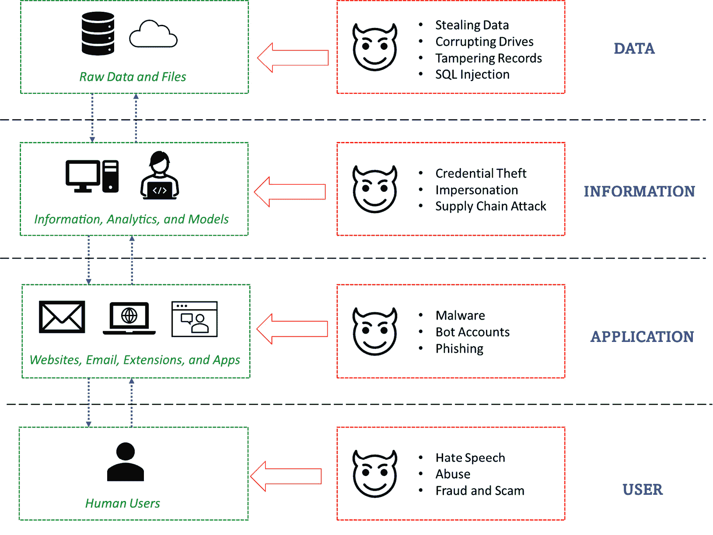
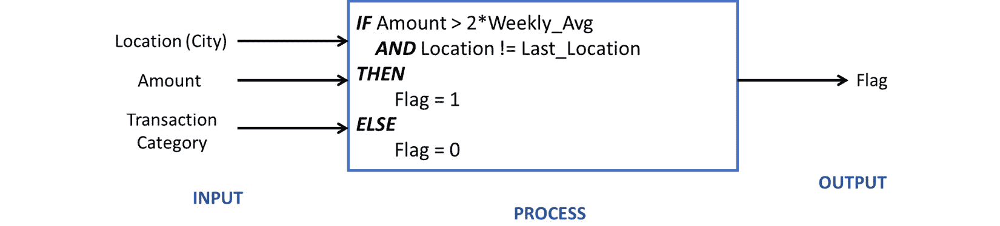
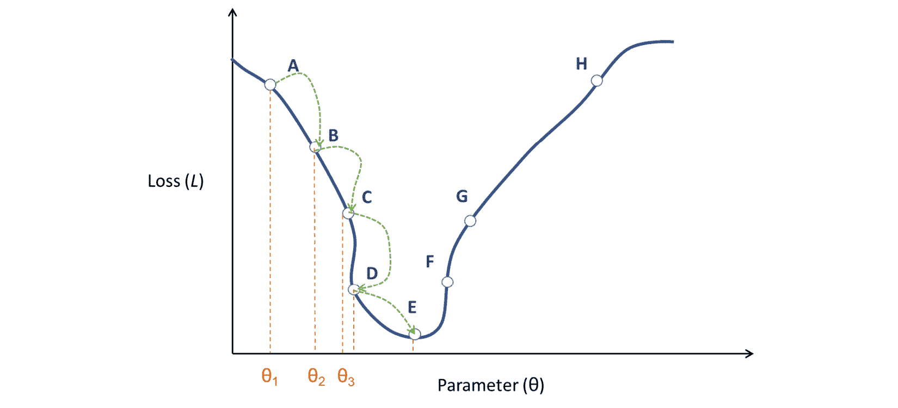
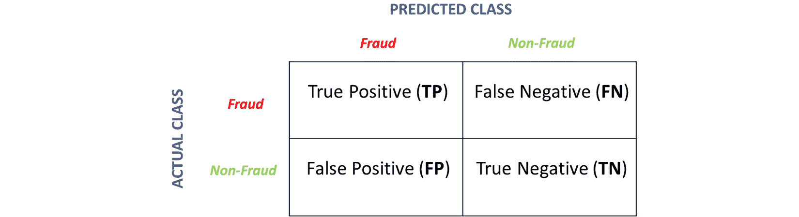
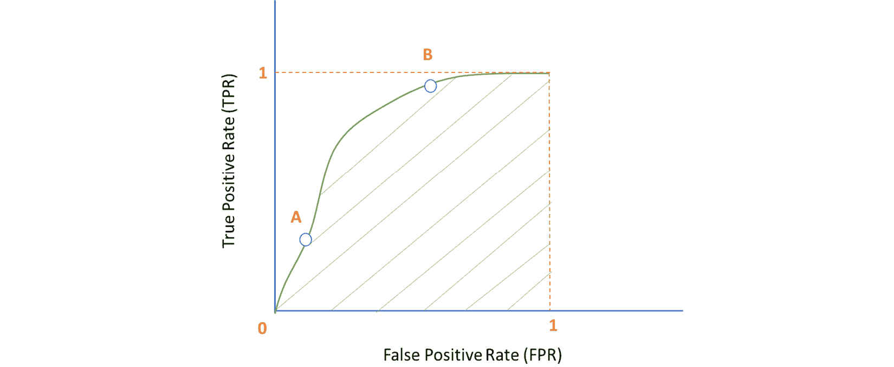

# 1

# 关于网络安全与机器学习

随着信息时代的到来，网络安全已成为当今社会的一个紧迫问题，并且在工业界非常受欢迎的技能。企业、政府和个人用户都面临着安全攻击和泄露的风险。网络安全的根本目标是保护用户及其数据安全。网络安全是一个多方面的难题，从高度技术性的领域（密码学和网络攻击）到面向用户的领域（检测仇恨言论或欺诈信用卡交易）。它有助于防止敏感信息被篡改，避免金融欺诈和损失，并保护用户及其设备免受有害行为者的侵害。

网络安全分析、调查和检测的大部分工作现在都是由**机器学习**（ML）和“智能”系统驱动的。将数据科学和机器学习应用于安全领域带来了一系列独特的挑战：缺乏足够标记的数据，由于需要可解释性而对强大模型的限制，以及由于高风险场景而需要几乎完美的精确度。随着我们继续阅读本书，您将学习如何处理这些关键任务，并将您的机器学习和数据科学技能应用于网络安全问题。

在本章中，我们将涵盖以下主要内容：

+   网络安全基础知识

+   机器学习概述

+   机器学习——网络安全与其他领域

到本章结束时，您将为后续项目打下基础。

# 网络安全基础知识

本书旨在将两个重要的研究领域结合起来：网络安全和机器学习（ML）。我们将简要介绍网络安全，它的定义，最终目标是什么，以及会出现什么问题。

## 网络安全传统原则

网络安全的基本目标是保护用户和数据安全。传统上，网络安全的目的是三方面的：**保密性、完整性和可用性**，即**CIA**三要素。

让我们现在深入探讨这些问题。

### 保密性

保密性目标旨在使数据对未经授权的各方保密。只有授权实体才能访问数据。

通过加密数据可以实现保密性。加密是一个过程，其中使用加密密钥将明文数据编码成密文。密文是不可读的；需要相应的解密密钥来解码数据。通过网络发送的信息加密可以防止攻击者读取内容，即使他们截获了通信。静态数据的加密确保即使物理数据存储被破坏（例如，如果攻击者闯入办公室并窃取硬盘），对手也无法读取您的数据。

确保机密性的另一种方法是访问控制。控制对信息的访问是防止未经授权泄露或共享数据（无论是有意还是无意）的第一步。数据访问应遵循最小权限原则；个人或应用程序必须有权访问执行其功能所需的最小数据。例如，公司中的财务部门应该有权访问收入和交易信息。只有系统管理员应该能够查看网络和访问日志。

机器学习可以帮助检测异常访问、可疑的行为模式或恶意来源的流量，从而确保机密性得到维护。例如，假设管理员突然开始在他们自己或一般管理员常规模式之外访问机密/特权文件。机器学习模型可能会将其标记为异常并触发警报，以便对管理员进行调查。

### 完整性

完整性目标确保数据是可信的且不受篡改。如果数据可以被篡改，那么其真实性和准确性就无法保证；这样的数据是不可信的。

可以使用哈希和校验和来确保完整性。校验和是通过应用哈希函数到数据上计算出的数值。即使数据的一个比特发生变化，校验和也会改变。数字签名和证书也有助于确保完整性；一旦用户对电子邮件或代码库进行了数字签名，它就不能更改；任何更改都需要新的数字签名。

攻击者可能为了自己的利益而希望破坏系统或服务的完整性。例如，攻击者可能会拦截对银行服务器的入站请求，并更改任何转账的目的账户。恶意浏览器扩展可能会将用户重定向到用于游戏流量和广告统计的网站；用户输入的原始目标 URL 已被篡改。通过分析数据模式结合其他信号，机器学习模型可以检测到完整性破坏。

### 可用性

前两个目标确保数据保持秘密、不受篡改，并免受攻击者的侵害。然而，如果授权用户无法按需访问数据，这些保证就毫无意义。可用性目标确保信息始终对系统的合法用户可用。

攻击者可能会通过执行**拒绝服务**（**DoS**）攻击来尝试破坏可用性，在这种攻击中，目标服务会被来自未经授权或虚假节点的入站请求所淹没。例如，攻击者可能会向数据库服务器发送数百万个虚假查询。虽然攻击者可能无法实际提取任何有用的信息，但服务器如此繁忙，以至于合法用户的合法查询永远不会被执行。或者，攻击者也可能通过物理破坏数据来降低可用性。

通过在数据和服务中实施冗余可以保证可用性。定期备份数据确保即使一个副本被破坏或篡改，数据仍然可用。如果存在多个 API 端点以实现相同的功能，合法用户可以切换到另一个端点，从而保持可用性。类似于机密性和完整性，模式分析和分类算法可以帮助检测拒绝服务攻击。一种新兴的范式，图神经网络，可以帮助检测被称为**分布式拒绝服务**（DDoS）的协调机器人攻击。

## 现代网络安全 – 一个多方面的问题

中央情报局的三要素主要关注数据的网络安全。然而，今天的网络安全已经远远超出了仅仅数据和服务器。存储在服务器中的数据变成了组织使用的信息，这些信息最终被人类使用的应用程序所转换。网络安全涵盖了所有这些方面，并且每个方面都有不同的问题区域。

*图 1.1* 展示了网络安全问题的多样性和多面性，以及它所包含的各种元素：

图 1.1 – 网络安全中的各种问题区域

在接下来的几节中，我们将讨论四个广泛类别中一些常见的与安全相关的问题和研究领域：数据安全、信息安全、应用安全和用户安全。

### 数据安全

原始数据以原始格式存储在办公室的硬盘驱动器上或在云端，最终存储在数据中心物理机器中。在数据层面，网络安全的作用是确保数据安全。因此，重点是保持数据的机密性、完整性和可用性（CIA 三要素的目标）。这一层面的网络安全问题主要集中在新型加密方案、轻量级加密算法、容错系统和遵守数据保留法规。

### 信息安全

数据中心和企业云中的数据被转换成信息，这些信息被公司用来构建各种服务。在信息层面，网络安全的作用是确保信息被员工正确访问和处理。这一层面的问题主要集中在网络安全管理、检测政策违规和内部威胁，以及确保没有无意中泄露的私人数据。

### 应用安全

信息通过各种服务被转换成适合消费者使用的形式。这方面的一个例子是将 Facebook 用户的信息转换成顶级朋友推荐列表。在应用层面，网络安全的角色是确保应用程序不会被破坏。这一层次的问题主要集中在恶意软件检测、供应链攻击检测、异常检测、检测机器人账户和自动化账户，以及标记钓鱼邮件和恶意 URL。

### 用户安全

最后，应用程序由人类最终用户使用，网络安全在这里的角色是确保这些用户的安全。这一层次的问题包括检测仇恨言论、内容审查、标记欺诈交易、描述侮辱性行为，以及保护用户免受数字犯罪（身份盗窃、诈骗和勒索）的侵害。请注意，这一方面超出了网络安全的技术要素，进入了人文、法律和社会科学的领域。

现在，我们将通过一个案例研究来更清楚地解释在每一层（数据、信息、应用和用户）如何产生安全问题。

### Twitter 研究

*图 1**.1* 展示了我们描述的四个广泛层次上的威胁模型。让我们通过 Twitter 的例子具体理解这一点。Twitter 是一个社交媒体平台，用户可以发布简短的意见、照片和视频，并与他人的帖子互动。

在数据层面，所有数据（帖子、登录凭证等）都以原始形式存储。对手可能会试图物理闯入数据中心或尝试使用恶意注入查询获取对数据的访问。在信息层面，Twitter 本身正在使用这些数据来进行分析和训练其预测模型。对手可能会通过钓鱼邮件窃取员工凭证或用恶意数据毒害模型。

在应用层面，分析正在被转换成可由最终用户消费的行动洞察：推荐列表、新闻源和排名靠前的帖子。对手可能会创建机器人账户来传播虚假信息或恶意扩展，将用户重定向到 Twitter 之外。最后，在用户层面，最终用户实际上使用该应用程序来发推文。在这里，对手可能会试图通过仇恨言论或侮辱性内容攻击用户。

到目前为止，我们已经讨论了网络安全，并探讨了各种网络安全问题。现在，我们将转向一个相关但略有不同的话题：隐私。

## 隐私

安全和隐私这两个术语经常被混淆并互换使用。然而，安全和隐私的目标非常不同。虽然安全旨在保护数据和系统，但隐私指的是个人对其数据的完全控制。当谈到隐私时，每个人都应该了解以下内容：

+   正在收集哪些数据（位置、应用使用、网络跟踪和健康指标）

+   它将被保留多长时间（立即删除或在一周/月/年内删除）

+   谁可以访问它（广告商、研究机构和政府）

+   如何删除它（如何向应用提出请求）

安全性和隐私性是相互关联的。如果一个攻击者黑入医院或医疗数据库（安全漏洞），那么他们可能有权访问敏感的患者数据（隐私漏洞）。世界各地有许多法律，例如欧洲的**通用数据保护条例**（**GDPR**），要求实施严格的安全控制，以确保用户隐私。

由于 ML 依赖于大量的收集数据，因此推动了隐私保护 ML 的发展。我们将在后面的章节中讨论一些相关技术。

这完成了我们对网络安全的讨论。我们首先描述了传统的安全概念，然后介绍了多个层面的各种网络安全问题。我们还提供了一个 Twitter 案例研究，帮助将这些问题置于背景中。最后，我们探讨了与网络安全紧密相关的隐私问题。

接下来，我们将转向本书的第二个要素：机器学习。

# 机器学习概述

在本节中，我们将简要介绍机器学习（ML）的原则和技术。传统的计算范式定义算法有三个要素：输入、输出以及一个指定如何从输入推导输出的过程。例如，在一个信用卡检测系统中，一个标记可疑交易的模块可能将交易元数据（位置、金额、类型）作为输入，将标记（可疑或不）作为输出。过程将定义基于输入设置标记的规则，如图*1**.2*所示：

图 1.2 – 欺诈检测的传统输入-处理-输出模型

机器学习（ML）是对输入-处理-输出哲学的巨大变革。传统的做法将计算定义为通过将过程应用于输入来推导输出。在 ML 中，我们被给出输入和输出，任务是推导连接两者的过程。

继续我们关于信用卡欺诈检测系统的类比，现在我们将提供一个包含输入特征和输出标记的数据集。我们的任务是学习如何根据输入计算标记。一旦我们学会了过程，我们就可以将其推广到以传统输入-处理-输出方式到来的新数据。本书中我们将处理的绝大多数与安全相关的问题都是*分类*问题。分类是一个将数据点分配为离散的、分类的标签（欺诈/非欺诈或低风险/中风险/高风险）的任务。

机器学习不是一个一步到位的过程。它涉及多个步骤，例如以正确的形式清理和准备数据，训练和调整模型，部署它们，并监控它们。在下一节中，我们将查看工作流程中涉及的主要步骤。

## 机器学习工作流程

现在，我们将看到一些端到端机器学习的基本步骤。它从预处理数据开始，使其适合机器学习模型使用，并以监控和调整模型结束。

### 数据预处理

任何机器学习实验的第一步是将数据处理成适合机器学习的格式。由于两个主要原因，现实世界的数据通常不适合直接由模型使用。

第一个原因是数据格式的多样性。我们周围的数据以多种格式存在，如数字、图像、文本、音频和视频。所有这些都需要转换为数值表示，以便模型能够消费它们。预处理会将图像转换为矩阵，文本转换为词嵌入，音频流转换为时间序列。数据的一些特征是离散的；它们代表分类变量。例如，在一个关于用户的数据集中，`Country`字段会采用如`India`、`Canada`、`China`等字符串值。预处理会将这样的分类变量转换为模型可以消费的数值向量形式。

第二个原因是现实世界数据中的噪声。测量不准确、处理错误和人为错误可能导致记录了错误值。例如，一个数据录入员可能错误地按了两次*3*键，将你的年龄输入为 233 而不是 23。一个收集数据的网络爬虫可能遇到网络问题，无法发出请求；数据中的一些字段将缺失。

简而言之，预处理去除噪声，处理缺失数据，并将数据转换成适合机器学习模型消费的格式。

### 训练阶段

在数据经过适当的预处理之后，我们训练一个模型从数据中学习。模型表达了预处理特征与某些目标变量之间的关系。例如，用于检测钓鱼邮件的模型将根据我们定义的输入特征输出一个电子邮件是否恶意的概率。将恶意软件分类为 10 个恶意软件家族之一的模型将输出一个 10 维的概率分布向量，表示 10 个类别。在训练阶段，模型将学习这种关系参数，以使训练数据上的误差最小化（即，它能够尽可能准确地预测训练数据的标签）。在训练阶段，数据的一个子集被保留作为验证数据，以检查训练模型在未见数据上的误差。

模型可能面临的一个问题是过拟合；如果模型学习的参数过于特定于训练数据，它就不能很好地推广到新数据。这可以通过比较模型在训练数据和验证数据上的性能来诊断；过拟合的模型将在训练数据上显示损失或错误的减少，但在验证数据上损失不会减少。这个问题也存在相反的情况——模型可能遭受欠拟合，这意味着它根本无法从训练数据中学习。

### 推理阶段

一旦模型被训练，我们希望用它来对新数据、未见过的数据进行预测。在这个阶段没有参数学习；我们只是将数据中的特征插入，并检查模型做出的预测。推理通常在实时发生。例如，每次你使用信用卡时，你的交易参数（金额、位置和类别）都会用于在欺诈检测模型上运行推理。如果模型将交易标记为可疑，则该交易将被拒绝。

### 维护阶段

机器学习模型需要持续的监控和调整，以确保其性能不会下降。随着时间的推移，模型在预测上可能变得更加容易出错，因为它是在旧数据上训练的。例如，2019 年训练的用于检测虚假信息的模型从未接触过关于 COVID-19 大流行的虚假新闻帖子。因此，它从未学习到与 COVID 相关的虚假新闻的特征，并且可能无法识别此类文章为虚假信息。为了避免这种情况，模型必须定期在新的数据上重新训练，以便从中学习。

此外，可能还有新的特征可用，这有助于提高模型的性能。然后我们需要用新的特征集训练模型，并检查性能提升。在不同的数据切片中，不同的分类阈值可能显示出更高的准确率。然后模型必须调整以在每个切片中使用不同的阈值。监控模型是一个持续的过程，并且有自动化的工具（称为 MLOps 工具）提供持续监控、训练、调整和模型警报的功能。

现在，我们将探讨基本的机器学习范式：监督学习和无监督学习。

## 监督学习

机器学习有两种主要类型：监督学习和无监督学习。在**监督学习**中，我们有标签数据的访问权限。从标签数据中，我们可以学习数据与标签之间的关系。监督学习算法的最基本例子是**线性回归**。

### 线性回归

线性回归假设目标变量可以表示为特征的一个线性函数。我们最初从一个具有任意系数的线性方程开始，并在从数据中学习时调整这些系数。从高层次和最简单的形式来看，线性回归的工作原理如下：

1.  设 *y* 为目标变量，*x*1、*x*2 和 *x*3 为预测特征。假设存在线性关系，我们的模型是 *y = a0 + a1x1 + a2x2 + a3x3*。在这里，*a*0、*a*1、*a*2 和 *a*3 是最初设置为随机的参数。

1.  考虑训练集中的第一个数据点。它将有自己的预测器集（*x*1、*x*2 和 *x*3）和作为真实值的目标（*y*）。使用之前定义的方程计算目标变量的预测值；称这个预测值为 *y′*。

1.  计算一个表示预测误差的*损失*。通常，我们使用**普通最小二乘法**（**OLS**）误差作为损失函数。它简单地是实际值和预测值之间差异的平方：L = (y − y′)²。

1.  损失 *L* 告诉我们我们的预测与实际值有多远。我们使用损失来修改我们模型中的参数。这部分是我们从数据中*学习*的部分。

1.  对训练集中的每个数据点重复*步骤 2*、*步骤 3* 和 *步骤 4*，并在过程中更新参数。这完成了一次*时期*的训练。

1.  对多个时期重复前面的步骤。

1.  最后，你的参数将被调整以捕捉特征和目标之间的线性关系。

我们现在将探讨梯度下降，这是线性回归（以及许多其他算法）的核心和灵魂。

### 梯度下降

上述指令中的关键步骤是*步骤 4*；这是基于损失更新参数的步骤。这通常是通过称为**梯度下降**的算法来完成的。设 *θ* 为模型的参数；我们希望选择 *θ* 的最佳值，使得损失尽可能小。我们计算梯度，即损失相对于参数的导数。我们根据梯度将参数 *θ* 更新为其新值 *θ′*，如下所示：

θ′= θ − η δL/δθ

δL/δθ 梯度表示在特定值 *θ* 处损失曲线的切线斜率。梯度的符号将告诉我们需要改变 θ 的方向，以便在损失上达到最小值。我们总是朝着梯度下降的方向移动以最小化损失。为了更清楚地理解，请仔细观察以下图表中针对参数绘制的损失曲线：

图 1.3 – 使用梯度下降遍历损失曲线

假设由于我们的随机选择，我们选择了 *θ*1 参数。当我们计算曲线的梯度（曲线在点 A 处的切线斜率）时，它将是负的。应用前面的梯度下降方程，我们将必须计算梯度并将其添加到 *θ*1 以获得新值（例如 *θ*2）。

我们继续这个过程，直到达到点 E，此时梯度非常小（几乎为 0）；这是我们能够达到的最小损失，即使我们继续梯度下降过程，更新也会微不足道（因为梯度的值非常小且接近于零）。如果我们从点 H 而不是点 A 开始，我们计算出的梯度将是正的。在这种情况下，根据梯度下降方程，我们必须减小*θ*以达到最小损失。梯度下降确保我们始终沿着曲线向下移动以到达最小值。

我们之前没有讨论的方程中的一个重要元素是*η*。这个参数被称为**学习率**。梯度告诉我们我们想要改变*θ*的方向。学习率告诉我们我们想要改变*θ*的程度。*η*的值越小，我们做出的改变就越小，因此我们采取的小步骤就越少，以到达最小值；可能需要很长时间才能找到最优值。另一方面，如果我们选择一个非常大的学习率，我们可能会错过最小值。

例如，由于学习率很大，我们可能会直接从点 D 跳到点 F，而从未到达点 E。在点 F，梯度的方向发生变化，我们可能会跳回相反的方向回到点 D。我们将在这两个点之间不断振荡，而无法达到最小值。

在之前讨论的线性回归算法中，我们对训练数据中的每个数据点都执行了梯度下降过程。这被称为**随机梯度下降**。在算法的另一个更有效的版本中，我们考虑数据批次，汇总损失值，并在汇总的损失上应用梯度下降。这被称为**批量****梯度下降**。

梯度下降是大多数现代机器学习算法的核心。虽然我们是在线性回归的背景下描述它的，但它仅仅是一个优化算法，并且在其他模型如深度神经网络中也被广泛使用。

## 无监督学习

在监督学习中，我们有真实数据来学习特征和标签之间的关系。无监督学习的目标是发现数据中的模式、趋势和关系。无监督学习允许我们在训练期间没有访问标签的情况下进行预测和检测异常。让我们看看聚类，这是一个流行的无监督学习问题。

### 聚类

如其名所示，聚类是将数据分组到簇中的过程。它允许我们检查数据点是如何组合在一起的，这些组中的共同特征是什么，以及数据中的隐藏趋势是什么。聚类过程中不涉及*学习*。理想的聚类是簇内相似度高，簇间相似度低。这意味着簇内的点彼此非常相似，与其他簇中的点非常不同。

最基本的聚类算法称为**K-means 聚类**。它将数据点划分为*k*个簇，其中*k*是一个必须预先设置的参数。K-means 算法的一般过程如下：

1.  从训练数据中随机选择*K*个点。这些点将成为我们簇的质心。

1.  对于每个点，计算到每个质心的距离。通常使用的距离度量是**欧几里得距离**。

1.  根据距离将每个点分配到*K*个簇中的一个。一个点将被分配到离它最近的质心（最小距离）。

1.  现在，每个*K*个质心都将与一组点相关联；这形成了一个簇。对于每个簇，计算分配给该簇的所有点的平均值，作为更新后的簇质心。

1.  重复*步骤 2-4*，直到以下情况之一发生：

    +   第*3*步中的簇分配不会改变

    +   步骤的重复次数达到固定数量

该算法背后的核心概念是优化簇分配，使得每个点到其所属簇质心的距离尽可能小；也就是说，簇应该尽可能紧密。

我们已经研究了监督学习和无监督学习。第三种变体，半监督学习，位于两者之间。

## 半监督学习

如其名所示，半监督学习介于监督学习和无监督学习之间。通常（尤其是在关键安全应用的情况下），标签不可用或数量非常少。手动标记既耗时又需要专业知识，因此我们只能从这些有限的标签中训练一个模型。

半监督学习技术通常基于自训练方法。首先，我们基于小部分标记数据训练一个监督模型。然后，我们对这个模型进行推理，以获得未标记数据的预测标签。我们使用原始标签和高置信度的预测标签一起训练最终的模型。这个过程可以重复固定次数的迭代，或者直到我们达到一个点，即模型性能没有显著变化。

半监督学习的另一种方法是称为**协同训练**，其中我们使用数据的不同视图（特征集）共同训练两个模型。我们首先基于不同的特征集和可用的标签独立地训练两个模型。然后，我们将这些模型应用于对未标记数据进行预测，并获取伪标签。我们将第一个模型中的高置信度标签添加到第二个模型的训练集中，反之亦然。我们重复训练模型的过程，并在固定数量的迭代或直到我们达到一个点，即两个模型的表现没有显著变化。

现在我们已经涵盖了机器学习中的主要范式，我们可以转向评估模型的性能。

## 评估指标

到目前为止，我们只是提到了模型性能。在本节中，我们将定义用于评估模型性能的正式指标。由于我们处理的大部分问题将是基于分类的，我们将讨论仅针对分类的指标。

### 混淆矩阵

分类涉及预测特定数据点的标签。以欺诈检测模型为例。如图*图 1.4*所示，如果一个数据点的实际标签和预测标签都是**欺诈**，那么我们称该例子为**真正例（TP）**。如果两者都是**非欺诈**，我们称它为**真正例（TN）**。如果预测标签是**欺诈**，但实际标签（来自真实情况的预期）是**非欺诈**，那么我们称它为**假正例（FP）**。最后，如果预测标签是**非欺诈**，但实际标签（来自真实情况的预期）是**欺诈**，我们称它为**假负例（FN）**。

基于预测标签和实际标签的数据，我们可以构建所谓的**混淆矩阵**：

图 1.4 – 混淆矩阵

混淆矩阵提供了一种快速查看模型性能的方法。一个好的模型将显示出最高的真正例和真正例，而其他两个将具有较小的值。混淆矩阵使我们能够方便地计算与分类相关的指标，即准确率、精确率、召回率和 F-1 分数。让我们按以下方式了解更多关于这些指标的信息：

+   **准确率**：这是衡量模型在两个类别中预测准确性的指标。简单来说，它是模型能够正确预测标签的例子数量，即数据中真正例和真正例的比例。它可以按以下方式计算：

准确率 = TP + TN __________________ TP + TN + FP + FN

+   **精确率**：这是衡量模型在正预测中的置信度的指标。简单来说，它是所有预测为正的例子中真正正例的比例。精确率回答的问题是：在所有预测为欺诈的例子中，有多少实际上是欺诈的？精确率可以按以下公式计算：

**精确率** = TP _ TP + FP

+   **召回率**：这是衡量模型在正类中完整性的一个指标。召回率回答的问题是：在所有被认为是欺诈的例子中，模型正确检测出欺诈的有多少？召回率可以按以下方式计算：

召回率 = TP _ TP + FN

当一个模型具有高精度时，这意味着大多数预测为欺诈的实际上是欺诈。当一个模型具有高召回率时，这意味着在数据中的所有欺诈中，大部分都被模型预测为欺诈。考虑一个预测**所有**内容为欺诈的模型。这个模型具有高召回率；由于所有内容都被标记为欺诈，自然地，所有的实际欺诈也被捕捉到了，但代价是大量误报（低精度）。另一方面，考虑一个预测**没有**内容为欺诈的模型。这个模型具有高精度；由于它没有标记任何内容为欺诈，因此没有误报，但代价是大量漏报（低召回率）。这种精度和召回率之间的权衡是机器学习中的一个经典问题。

+   **F-1 分数**：这个度量捕捉了精度和召回率的程度。高精度是以低召回率为代价的，反之亦然。F-1 分数用于识别具有最高精度和召回率的模型。从数学上讲，它被定义为精度和召回率的调和平均值，计算如下：

F1 分数 = 2 × 精度 × 召回率 / (精度 + 召回率)

+   **接收者操作特征（ROC）曲线**：我们已经看到分类模型会给数据点分配一个标签。然而，实际上，模型计算的是数据点属于特定类别的概率。这个概率与阈值进行比较，以确定该例子是否属于该类别。通常，使用 0.5 的阈值。因此，在我们的欺诈检测模型示例中，如果模型输出的值大于 0.5，我们将把数据点分类为**欺诈**。较小的值将导致我们将其分类为**非欺诈**。

阈值概率是一个参数，我们可以调整这个参数以实现高精度或高召回率。如果你设置一个非常低的阈值，那么一个例子被判定为欺诈的标准就非常低；例如，在 0.1 的阈值下，几乎所有例子都会被分类为欺诈。这意味着我们将捕捉到所有的欺诈；我们具有高召回率。

另一方面，如果你设置一个非常高的阈值，达到标准的要求将会非常高。并不是所有的欺诈都会被捕捉到，但你可以确信，被标记为欺诈的任何内容确实都是欺诈。换句话说，你具有高精度。这种精度和召回率之间的权衡在 ROC 曲线上得到体现，如下面的图表所示：

图 1.5 – ROC 曲线

ROC 曲线绘制了每个阈值从 0 到 1 的**真正率**（**TPR**）与**假正率**（**FPR**）的对比图。它使我们能够观察为了达到一定的召回率而必须容忍的精确度，反之亦然。在前面的 ROC 图中，点**A**和**B**表示在两个不同阈值下我们必须容忍的真正率和假正率。**ROC 曲线下的面积**（**AUC**），由阴影区域表示，提供了模型在所有阈值下的整体性能指标。AUC 可以解释为模型将随机正例（欺诈）评分高于随机负例（非欺诈）的概率。在比较多个模型时，我们选择 AUC 值最高的模型。

我们已经探讨了机器学习背后的基本概念、底层工作流程和评估方法。现在，我们将探讨为什么机器学习在网络安全领域的应用与其他领域不同，以及它带来的新颖挑战。

# 机器学习——网络安全与其他领域

今天的机器学习被应用于广泛的领域，其中一些将在以下列表中详细说明：

+   在销售和市场营销中，为了确定可能购买特定产品的客户群体

+   在在线广告中，用于点击预测和相应地展示广告

+   在气候和天气预报中，基于数百年的数据预测趋势

+   在推荐系统中，找到与用户最相关的最佳项目（电影、歌曲、帖子和人）

虽然今天每个可想象的行业都应用了机器学习，但将其应用于网络安全与其他领域的细微差别是不同的。在以下小节中，我们将看到一些原因，为什么将机器学习应用于网络安全领域比应用于其他领域（如销售或广告）更具挑战性。

### 高风险

安全问题通常涉及做出可能影响金钱、资源和甚至生命的重大决策。表现良好的欺诈检测模型有可能节省数百万美元的欺诈损失。网络或恶意软件检测模型可以保护关键系统（如军事系统）或敏感数据（如医疗保健数据）免受损害。一个用于标记社交媒体上的滥用用户的模型有可能拯救某人的生命。由于风险如此之高，精确度-召回率权衡变得尤为重要。

在点击欺诈检测中，我们必须保持高精度（否则我们可能会将真实点击标记为欺诈），这以牺牲召回率为代价。同样，在滥用检测中，我们必须保持高召回率（我们希望捕捉到所有滥用者），这以高误报率（低精度）为代价。在使用案例，如点击预测或定位中，由于模型表现不佳，最糟糕的情况可能是几个未转化的点击或定位错误的广告。另一方面，由于安全领域的风险远高于其他领域，因此安全模型必须经过彻底调整和勤勉监控。

### 缺乏真实情况

大多数研究广泛的机器学习方法本质上是监督性的。这意味着它们依赖于真实标签来学习模型。在安全问题上，真实情况并不总是可用，与其他领域不同。例如，在客户定位或天气预报等任务中，历史信息可以告诉我们客户是否真的购买了产品，或者是否真的下雨了；这可以用作真实情况。

然而，在诸如欺诈或僵尸网络检测等安全问题上，并不总是存在如此明显的真实情况。我们依赖于专家标注和人工调查来标记数据，这是一项资源密集型任务。此外，标签是基于人类知识和启发式方法（例如，这看起来像是欺诈吗？）而不是基于绝对的真实性，例如我们描述的客户定位或天气预报中的那些。由于缺乏高置信度的标签，我们通常不得不依赖于无监督或半监督技术在安全应用中。

### 用户隐私的需求

近年来，人们一直在努力维护用户隐私。正如我们之前讨论的，随着隐私的增加，实用性会减少。这在安全任务中尤其具有挑战性。无法跨网站跟踪用户阻碍了我们检测点击欺诈的能力。缺乏收集位置信息的权限肯定会减少我们用于检测信用卡欺诈的信号。所有这些措施都通过避免过度跟踪和画像来保护用户隐私；然而，它们也降低了安全模型的表现，而安全模型实际上是为了用户的利益。我们可用的信号越少，我们模型预测的保真度就越低。

### 解释性的需求

大多数强大的机器学习模型（神经网络、转换器和基于图的学习模型）作为黑盒运行。模型做出的预测缺乏可解释性。因为这些模型学习高阶特征，所以人类无法理解和解释为什么某个特定示例被分类成这种方式。

然而，在安全应用中，可解释性很重要。我们需要为每个预测提供理由，至少对于正类来说是这样。如果一笔交易被标记为欺诈，银行或信用卡公司需要了解预测中涉及的内容，以便确定真相。如果用户被阻止或禁止，平台可能需要充分的理由，比模型预测更有说服力。像决策树和逻辑回归这样的经典机器学习算法分别基于树结构和系数提供一些解释。模型中这种可解释性的需求是使用最先进的深度学习方法在安全领域的一个障碍。

### 数据漂移

网络安全领域是一个不断变化的领域，每天都有新的攻击策略出现。攻击者和攻击向量本质上是不断演变的。因此，如果推理时的数据在本质上与模型训练时的数据显著不同，模型期望的特征也会发生变化。例如，一个全新的恶意软件变种可能不会被模型检测到，因为在训练数据中没有这个变种的示例。一个在 2019 年训练的假新闻检测模型可能无法识别与 COVID-19 相关的错误信息，因为它从未在那些数据上训练过。这种数据漂移使得构建在野外具有持续性能的模型具有挑战性。

这些问题（缺乏标签、数据漂移和隐私问题）也出现在机器学习的其他应用中。然而，在网络安全系统的案例中，风险很高，错误预测的后果可能是灾难性的。因此，这些问题在网络安全中处理起来更具挑战性。

# 摘要

这本入门章节简要概述了网络安全和机器学习。我们研究了传统网络安全的根本目标，以及这些目标是如何演变以涵盖其他任务，如假新闻、深度伪造、点击垃圾邮件和欺诈。用户隐私，作为一个在世界上日益重要的话题，也被介绍。在机器学习方面，我们从基础开始讲解：从机器学习与传统计算的区别开始，然后介绍机器学习中使用的各种方法、方法和常用术语。最后，我们还强调了网络安全中机器学习的关键差异，这使得它比其他领域更具挑战性。接下来的章节将专注于将这些概念应用于设计和实现用于安全问题的机器学习模型。在下一章中，我们将讨论如何使用机器学习检测异常和网络攻击。
