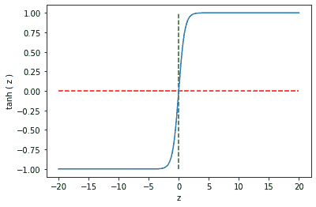

# 2

# 检测可疑活动

在网络安全中，许多问题都构建为异常检测任务，因为攻击者的行为通常与良好行为者的行为不同。异常是任何不寻常的事物——一个不符合正常行为的事件，因此被认为是可疑的。例如，如果一个人一直在班加罗尔使用他们的信用卡，那么在巴黎使用同一张卡进行交易可能就是一个异常。如果一个网站每天大约有 10,000 次访问，那么一天内它收到 2000 万次访问可能就是异常的。

异常情况很少见，表明行为异常且可疑。异常检测算法是**无监督的**；我们没有标记的数据来训练模型。我们学习正常预期的行为，并将任何偏离正常的行为标记为异常。由于在安全相关领域，标记数据非常罕见，因此异常检测方法对于识别攻击、欺诈和入侵至关重要。

本章我们将涵盖以下主要主题：

+   异常检测的基础

+   用于入侵检测的统计算法

+   **机器学习**（**ML**）算法用于入侵检测

到本章结束时，您将了解如何使用统计和机器学习方法检测异常值和异常。

# 技术要求

本章（以及本书）的所有实现都使用 Python 编程语言。大多数标准计算机都将允许您在没有内存或运行时问题的情况下运行所有代码。

在本书中运行代码有两种选择，如下所示：

+   **Jupyter Notebook**：一个带有 GUI 的交互式代码和文本笔记本，允许您在本地运行代码。"Real Python"有一个非常好的入门教程，介绍如何开始使用[Jupyter Notebook：一个介绍](https://realpython.com/jupyter-notebook-introduction/)。

+   **Google Colab**：这是 Jupyter Notebook 的在线版本。您可以使用免费层，因为这是足够的。确保下载您创建的任何数据或文件，因为它们在运行时清理后会消失。

您需要安装一些我们实验和分析所需的库。库的列表以文本文件的形式提供，并且可以使用以下命令使用`pip`实用程序安装所有库：

```py
pip install –r requirements.txt
```

如果您遇到特定库未找到或未安装的错误，您可以使用`pip` `install <library_name>`命令简单地安装它。

您可以在 GitHub 上找到本章的代码文件，链接为[`github.com/PacktPublishing/10-Machine-Learning-Blueprints-You-Should-Know-for-Cybersecurity/tree/main/Chapter%202`](https://github.com/PacktPublishing/10-Machine-Learning-Blueprints-You-Should-Know-for-Cybersecurity/tree/main/Chapter%202)。

# 异常检测的基础

在本节中，我们将探讨异常检测，它是检测入侵和可疑活动的基础。

## 什么是异常检测？

“异常”一词的意思是“偏离标准、正常或预期的事物”。异常是不符合其他数据的事件或数据点。它们代表了数据中预期趋势的偏差。异常是罕见事件，因此数量很少。

例如，考虑一个用于社交媒体网站如 Twitter 的机器人或欺诈检测模型。如果我们检查每天发送给用户的关注请求数量，我们可以得到趋势的一般感觉并绘制这些数据。假设我们为一个月的数据绘制了图表，并得到了以下趋势：


图 2.1 – 一个月内关注请求数量的趋势

你注意到了什么？用户似乎每天大约有 30-40 个关注请求。然而，在第 8 天和第 18 天，我们看到一个明显偏离日常趋势的峰值。这两天是异常值。

异常也可以在二维空间中直观地观察到。如果我们绘制数据集中的所有点，异常值应该会明显地与其他数据不同。例如，继续使用相同的例子，假设我们有一个用户发送的消息数量、点赞、转发等特征。使用所有这些特征，我们可以为用户构建一个*n*-维特征向量。通过应用降维算法，如**主成分分析**（PCA）（在较高层次上，该算法可以将数据转换为较低维度并保留其属性），我们可以将其降低到二维并绘制数据。假设我们得到以下图表，其中每个点代表一个用户，维度代表原始数据的主成分。用红色着色的点明显与其他数据不同——这些是异常值：


图 2.2 – 数据的二维表示，异常值用红色表示

注意，异常并不一定代表恶意事件——它们只是表明趋势偏离了通常预期的模式。例如，一个用户突然收到大量好友请求是异常的，但这可能是因为他们发布了一些非常吸引人的内容。当异常被标记时，必须进行调查以确定它们是恶意的还是良性的。

异常检测被认为是网络安全领域的一个重要问题。不寻常或异常事件通常可以表明安全漏洞或攻击。此外，异常检测不需要标记数据，这在安全问题上很难获得。

## 介绍 NSL-KDD 数据集

现在我们已经足够详细地介绍了什么是异常检测，我们将查看一个现实世界的数据集，这将帮助我们观察和检测异常的实际操作。

### 数据

在我们跳入任何异常检测算法之前，让我们谈谈本章中将使用的数据集。在异常和入侵检测任务中广泛使用的数据集是**网络安全实验室-数据库知识发现**（**NSL-KDD**）数据集。这个数据集最初是在 1999 年为了在*第 5 届国际知识发现和数据挖掘会议（KDD）*上的比赛而创建的。比赛的任务是开发一个网络入侵检测器，这是一个预测模型，可以区分恶意连接，称为入侵或攻击，和良性的正常连接。这个数据库包含了一组标准数据，用于审计，其中包括在军事网络环境中模拟的广泛多样的入侵。

### 探索性数据分析（EDA）

这个活动包括几个步骤，我们将在下一小节中探讨。

#### 下载数据

实际的 NSL-KDD 数据集相当大（近 400 万条记录）。我们将使用数据的一个较小版本，它是从整个数据中随机抽取的 10%的子集。这将使我们的分析变得可行。当然，您可以通过下载完整数据并重新运行我们的实验来实验。

首先，我们导入必要的 Python 库：

```py
import pandas as pd
import numpy as np
import os
from requests import get
```

然后，我们设置了训练数据和测试数据的位置路径，以及包含数据特征（名称）标题的标签文件的路径：

```py
train_data_page = "http://kdd.ics.uci.edu/databases/kddcup99/kddcup.data_10_percent.gz"
test_data_page = "http://kdd.ics.uci.edu/databases/kddcup99/kddcup.testdata.unlabeled_10_percent.gz"
labels ="http://kdd.ics.uci.edu/databases/kddcup99/kddcup.names"
datadir = "data"
```

接下来，我们使用 Python 中的`wget`命令下载数据和列名。由于这些文件是压缩的，我们必须首先使用`gunzip`命令提取内容。以下 Python 代码片段为我们完成了这项工作：

```py
# Download training data
print("Downloading Training Data")
os.system("wget " + train_data_page)
training_file_name = train_data_page.split("/")[-1].replace(".gz","")
os.system("gunzip " + training_file_name )
with open(training_file_name, "r+") as ff:
  lines = [i.strip().split(",") for i in ff.readlines()]
ff.close()
# Download training column labels
print("Downloading Training Labels")
response = get(labels)
labels = response.text
labels = [i.split(",")[0].split(":") for i in labels.split("\n")]
labels = [i for i in labels if i[0]!='']
final_labels = labels[1::]
```

最后，我们从下载的数据流中构建一个 DataFrame：

```py
data = pd.DataFrame(lines)
labels = final_labels
data.columns = [i[0] for i in labels]+['target']
for i in range(len(labels)):
  if labels[i][1] == ' continuous.':
    data.iloc[:,i] = data.iloc[:,i].astype(float)
```

这就完成了我们下载数据并从中创建 DataFrame 的步骤。DataFrame 是一种表格数据结构，它将允许我们按需操纵、切片、切块和过滤数据。

#### 理解数据

一旦数据下载完成，您可以通过简单地打印前五行来查看 DataFrame：

```py
data.head()
```

这应该会给你一个类似以下输出的结果：


图 2.3 – NSL-KDD 数据集的前五行

如您所见，数据显示了前五行。该数据集有 42 列。最后一列，命名为`target`，标识了数据中每一行的网络攻击类型。为了检查网络攻击的分布（即每种攻击类型的示例数量），我们可以运行以下语句：

```py
data['target'].value_counts()
```

这将列出所有网络攻击及其计数（每条攻击的行数），如下所示：


图 2.4 – 标签（攻击类型）的数据分布

我们可以看到数据中存在多种攻击类型，其中`smurf`和`neptune`类型占据了最大部分。接下来，我们将探讨如何使用统计算法来建模这些数据。

# 入侵检测的统计算法

现在我们已经查看过数据，让我们看看可以帮助我们隔离异常并因此识别入侵的基本统计算法。

## 单变量异常检测

在最基本的异常检测形式，称为*单变量异常检测*中，我们构建一个模型，该模型考虑趋势，并基于每次一个特征来检测异常。我们可以构建多个这样的模型，每个模型操作数据的一个单独特征。

### Z 值

这是检测异常的最基本方法，也是统计异常检测的基石。它基于**中心极限定理**（**CLT**），该定理表明，在大多数观察到的分布中，数据都围绕着平均值聚集。对于每个数据点，我们计算一个*Z 值*，以指示它距离平均值的远近。由于绝对距离会依赖于数据的规模和性质，我们测量点距离平均值的多少个标准差。如果一个特征的均值和标准差分别是μ和σ，那么点*x*的*Z 值*计算如下：

z = x− μ / σ

*Z*的值是*x*相对于平均值的标准差数。中心极限定理（CLT）表明，大多数数据（99%）都位于平均值两侧两个标准差（任意一侧）的范围内。因此，*Z*的值越高，该点为异常点的可能性就越高。

回顾我们定义异常的特征：它们是罕见的，数量很少。为了模拟这种设置，我们从数据集中采样。我们只选择那些目标为`正常`或`泪滴`的行。在这个新的数据集中，标记为`泪滴`的示例是异常。我们将`0`标签分配给正常数据点，将`1`标签分配给异常点：

```py
data_resampled = data.loc[data["target"].isin(["normal.","teardrop."])]
def map_label(target):
  if target == "normal.":
    return 0
  return 1
data_resampled["Label"] = data_resampled ["target"].apply(map_label)
```

由于单变量异常检测一次只操作一个特征，让我们选择`wrong_fragment`作为演示的特征。为了计算每个数据点的*Z 值*，我们首先计算`wrong_fragment`的均值和标准差。然后，我们从每行的`wrong_fragment`值中减去整个组的均值，并除以标准差：

```py
mu = data_resampled ['wrong_fragment'].mean()
sigma = data_resampled ['wrong_fragment'].std()
data_resampled["Z"] = (data_resampled ['wrong_fragment'] – mu) / sigma
```

我们可以绘制*Z 值*的分布，以直观地识别分布的性质。以下代码行可以生成密度图：

```py
data_resampled["Z"].plot.density()
```

它应该给出类似这样的结果：


图 2.5 – Z 值的密度图

我们在`0`附近观察到密度的一个尖锐峰值，这表明大部分数据点都有一个大约为 0 的*Z 值*。此外，注意`10`附近的非常小的波动；这些是具有高*Z 值*的少量异常点。

现在，我们只需要过滤掉那些具有超过`2`或小于`-2`的*Z 分数*的行。我们希望将这些行的标签分配为`1`（预测异常），而将其他行的标签分配为`0`（预测正常）：

```py
def map_z_to_label(z):
    if z > 2 or z < -2:
      return 1
    return 0
data_resampled["Predicted_Label"] = data_resampled["Z"].apply(map_z_to_label)
```

现在我们有了每行的实际标签和预测标签，我们可以使用混淆矩阵（如*第一章*“关于网络安全和机器学习”中所述）来评估我们模型的性能。幸运的是，Python 中的 `scikit-learn` 包提供了一个非常方便的内置方法，允许我们计算矩阵，另一个名为 `seaborn` 的包允许我们快速绘制它。以下代码片段展示了代码：

```py
from sklearn.metrics import confusion_matrix
from matplotlib import pyplot as plt
import seaborn as sns
confusion = confusion_matrix(data_resampled["Label"],
                data_resampled["Predicted_Label"])
plt.figure(figsize = (10,8))
sns.heatmap(confusion, annot = True, fmt = 'd', cmap="YlGnBu")
```

这将生成一个如所示的混淆矩阵：


图 2.6 – 混淆矩阵

仔细观察混淆矩阵，并将其与*第一章*“关于网络安全和机器学习”中的骨架混淆矩阵进行比较。我们可以看到，我们的模型能够表现出色；所有数据点都被正确分类。我们只有真正的正例和负例，没有假正例或假负例。

## 椭圆包

椭圆包是一种检测高斯数据中异常的算法。从高层次来看，该算法将数据建模为高维高斯分布。目标是构建一个覆盖大部分数据的椭圆——落在椭圆外的点是异常或离群值。使用特征协方差矩阵等统计方法来估计椭圆的大小和形状。

椭圆包的概念在二维空间中更容易可视化。*图 2.7*展示了非常理想化的表示。蓝色着色的点位于椭圆边界内，因此被认为是正常或良性的。红色点位于边界外，因此是异常：


图 2.7 – 椭圆包如何检测异常

注意，坐标轴被标记为**维度 1**和**维度 2**。这些维度可以是您从数据中提取的特征；或者在高维数据的情况下，它们可能代表主成分特征。

在 Python 中实现椭圆包作为异常检测器非常简单。我们将使用之前使用的重采样数据（仅包含`normal`和`teardrop`数据点）并丢弃分类特征：

```py
from sklearn.covariance import EllipticEnvelope
actual_labels = data4["Label"]
X = data4.drop(["Label", "target",
                "protocol_type", "service",
                "flag"], axis=1)
clf = EllipticEnvelope(contamination=.1,random_state=0)
clf.fit(X)
predicted_labels = clf.predict(X)
```

算法的实现方式是，如果点位于椭圆外，则输出`-1`，如果位于椭圆内，则输出`1`。为了与我们的真实标签一致，我们将`-1`重新分配为`1`，将`1`重新分配为`0`：

```py
predicted_labels_rescored =
[1 if pred == -1 else 0 for pred in predicted_labels]
```

按照前面描述的方式绘制混淆矩阵。结果应该类似于以下内容：


图 2.8 – 椭圆包的混淆矩阵

注意，这个模型有显著的假阳性和假阴性。虽然数字可能看起来很小，但请记住，我们的数据最初正类（标记为 1）的例子非常少。混淆矩阵告诉我们有 931 个假阴性，只有 48 个真阳性。这表明该模型具有极低的精确度，并且无法正确地隔离异常。

## 局部离群因子

**局部离群因子**（也称为**LOF**）是一种基于密度的异常检测算法。它检查一个点的局部邻域中的点，以检测该点是否异常。虽然其他算法考虑的是点相对于全局数据分布的情况，但 LOF 只考虑局部邻域，并确定该点是否合适。这对于识别可能不是全局异常的点的簇中的隐藏异常特别有用。例如，看看*图 2**.9*：


图 2.9 – 本地异常值

在这个图中，黄色的点显然是一个异常值。用红色标记的点，如果你考虑整个数据集，它们并不是真正的异常值。然而，观察这些点的邻域；它们离得很远，并且与它们所在的局部簇相分离。因此，它们是该区域局部的异常。LOF 可以检测这样的局部异常，除了全局异常。

简而言之，算法的工作原理如下。对于每个点*P*，我们执行以下操作：

1.  计算从*P*到数据中每个其他点的距离。这个距离可以使用称为*曼哈顿距离*的度量来计算。如果(x1, y1)和(x2, y2)是两个不同的点，它们之间的曼哈顿距离是|x1 – x2| + |y1 – y2|。这可以推广到多个维度。

1.  根据距离，计算*K*个最近点。这是点*P*的邻域。

1.  计算局部可达密度，这实际上就是*P*与*K*个最近点之间的平均距离的倒数。局部可达密度衡量邻域点与*P*的接近程度。密度值越小，表示*P*离其邻居越远。

1.  最后，计算 LOF。这是从*P*到邻近点的距离之和，并按邻域点密度之和加权。

1.  基于 LOF（局部离群因子），我们可以确定*P*是否代表数据中的异常。

高 LOF 值表示*P*远离其邻居，并且邻居的密度很高（即，它们靠近它们的邻居）。这意味着*P*是其邻域中的局部异常值。

低 LOF 值表示*P*远离邻居，或者邻居本身的密度可能很低。这意味着它在该邻域中不是异常值。

注意，我们模型在这里的性能取决于邻居数量*K*的选择，这是形成邻域的数量。如果我们把*K*设置得过高，我们基本上会在全局数据集级别上寻找异常值。这会导致假阳性，因为远离高密度区域的簇内点（所以不是局部异常）也会被分类为异常。另一方面，如果我们把*K*设置得非常小，我们的邻域会非常稀疏，我们就会在非常小的点区域中寻找异常，这也会导致误分类。

我们可以在 Python 中使用内置的现成实现尝试这个。我们将使用之前使用过的相同数据和特征：

```py
from sklearn.neighbors import LocalOutlierFactor
actual_labels = data["Label"]
X = data.drop(["Label", "target",
                "protocol_type", "service",
                "flag"], axis=1)
k = 5
clf = LocalOutlierFactor(n_neighbors=k, contamination=.1)
predicted_labels = clf.fit_predict(X)
```

在如前所述重新评分预测标签以保持一致性之后，我们可以绘制混淆矩阵。你应该会看到类似这样的：


图 2.10 – 使用 K = 5 的 LOF 混淆矩阵

显然，模型有极多的假阴性。我们可以通过改变*K*的值来检查性能如何变化。注意，我们首先选择了一个非常小的值。如果我们用*K* = 250 重新运行相同的代码，我们得到以下混淆矩阵：


图 2.11 – 使用 K = 250 的 LOF 混淆矩阵

第二个模型略优于第一个。为了找到最佳的*K*值，我们可以尝试对所有可能的*K*值进行测试，并观察我们的指标如何变化。我们将从 100 到 10,000 变化*K*，并对每个迭代计算准确率、精确率和召回率。然后我们可以绘制随着*K*增加的指标趋势图，以检查哪个表现最好。

下面的代码列表展示了完整的代码。首先，我们定义空列表，将保存我们对每个测试的*K*值的测量（准确率、精确率和召回率）。然后我们拟合一个 LOF 模型并计算混淆矩阵。回想一下*第一章*中关于网络安全和机器学习的混淆矩阵的定义，并注意矩阵中的哪些条目定义了真正的正例、假正例和假负例。

使用该矩阵，我们计算准确率、精确率和召回率，并将它们记录在数组中。注意精确率和召回率的计算；我们通过在分母中添加`1`稍微偏离了公式。我们为什么要这样做？在极端情况下，我们可能会有零真正的或错误的正例，我们不希望分母为`0`以避免除以零错误：

```py
from sklearn.neighbors import LocalOutlierFactor
actual_labels = data4["Label"]
X = data4.drop(["Label", "target","protocol_type", "service","flag"], axis=1)
all_accuracies = []
all_precision = []
all_recall = []
all_k = []
total_num_examples = len(X)
start_k = 100
end_k = 3000
for k in range(start_k, end_k,100):
  print("Checking for k = {}".format(k))
  # Fit a model
  clf = LocalOutlierFactor(n_neighbors=k, contamination=.1)
  predicted_labels = clf.fit_predict(X)
  predicted_labels_rescored = [1 if pred == -1 else 0 for pred in predicted_labels]
  confusion = confusion_matrix(actual_labels, predicted_labels_rescored)
  # Calculate metrics
  accuracy = 100 * (confusion[0][0] + confusion[1][1]) / total_num_examples
  precision = 100 * (confusion[1][1])/(confusion[1][1] + confusion[1][0] + 1)
  recall = 100 * (confusion[1][1])/(confusion[1][1] + confusion[0][1] + 1)
  # Record metrics
  all_k.append(k)
  all_accuracies.append(accuracy)
  all_precision.append(precision)
  all_recall.append(recall)
```

一旦完成，我们可以绘制三个序列来展示*K*的值如何影响指标。我们可以使用`matplotlib`这样做，如下所示：

```py
plt.plot(all_k, all_accuracies, color='green', label = 'Accuracy')
plt.plot(all_k, all_precision, color='blue', label = 'precision')
plt.plot(all_k, all_recall, color='red', label = 'Recall')
plt.show()
```

这就是输出看起来像什么：


图 2.12 – 随 K 变化的准确率、精确率和召回率趋势

我们可以看到，虽然准确率和召回率大致相似，但随着*K*的增加，精确率的值显示出下降趋势。

这完成了我们对异常检测的统计量和方法的讨论，以及它们在入侵检测中的应用。在下一节中，我们将探讨一些用于执行相同任务的先进无监督方法。

# 入侵检测的机器学习算法

本节将介绍如聚类、自编码器、SVM 和隔离森林等 ML 方法，这些方法可用于异常检测。

## 基于密度的扫描（DBSCAN）

在上一章中，我们介绍了**无监督机器学习**（**UML**），我们通过 K-Means 聚类算法研究了聚类的概念。然而，请记住*K*是一个超参数，必须手动设置；没有好的方法可以事先知道理想簇的数量。**DBSCAN**是一种基于密度的聚类算法，不需要预先指定的簇数量。

DBSCAN 依赖于两个参数：将一组点称为簇所需的最小点数和ξ（它指定了两个点之间的最小距离，以将它们称为邻居）。在内部，算法将每个数据点分类为以下三个类别之一：

+   **核心点**是指在半径为ξ的圆内至少有最小数量的点的那些点

+   **边界点**，不是核心点，但位于之前描述的核心点的邻域区域或簇中

+   一个**异常点**，既不是核心点，也不能从其中一个点到达（也就是说，也不是边界点）

简而言之，这个过程如下所示：

1.  设置参数值、最小点数和ξ。

1.  随机选择一个起点（比如说，*A*），并找到距离该点ξ或更近的所有点。

1.  如果点的数量达到最小点数阈值，则*A*是一个核心点，并且可以围绕它形成一个簇。距离ξ或更近的所有点都是边界点，并添加到以*A*为中心的簇中。

1.  对每个点重复这些步骤。如果一个点（比如说，*B*）被添加到簇中，结果也证明它是一个核心点，我们首先形成它自己的簇，然后将其与以*A*为中心的原始簇合并。

因此，DBSCAN 能够识别特征空间中的高密度区域并将点分组到簇中。不在簇中的点被确定为异常或离群点。DBSCAN 比之前讨论的 K-Means 聚类具有两个强大的优势：

+   我们不需要指定簇的数量。在分析数据时，尤其是在无监督设置中，我们可能不知道数据中的类别数量。因此，我们不知道异常检测应该有多少个簇。DBSCAN 消除了这个问题，并基于密度适当地形成簇。

+   DBSCAN 能够找到具有任意形状的簇。因为它基于核心点周围的区域密度，所以簇的形状不必是圆形的。另一方面，K-Means 聚类无法检测重叠或任意形状的簇。

作为 DBSCAN 形成任意形状簇的例子，考虑以下图。点的颜色代表它们所属类别的真实标签。如果使用 K-Means，则会形成圆形簇，这并不能将两个类别分开。另一方面，如果我们使用 DBSCAN，它能够根据密度正确地识别簇，并且以更好的方式将两个类别分开：


图 2.13 – K-Means（左）和 DBSCAN（右）在处理不规则形状簇时的表现

DBSCAN 的 Python 实现如下：

```py
from sklearn.neighbors import DBSCAN
actual_labels = data4["Label"]
X = data4.drop(["Label", "target","protocol_type", "service","flag"], axis=1)
epsilon = 0.2
minimum_samples = 5
clf = DBSCAN( eps = epsilon,  min_samples = minimum_samples)
predicted_labels = clf.fit_predict(X)
```

在重新评分标签后，我们可以绘制混淆矩阵。你应该会看到类似这样的：


图 2.14 – DBSCAN 的混淆矩阵

这呈现了一个有趣的混淆矩阵。我们看到所有异常值都被检测到了——但随之而来的是，大量内点也被错误地分类为异常值。这是一个低精确度和高召回率的经典案例。

我们可以尝试如何通过改变其两个参数来测试这个模型的性能。例如，如果我们用`minimum_samples = 1000`和`epsilon = 0.8`运行相同的代码块，我们将得到以下混淆矩阵：


图 2.15 – DBSCAN 的混淆矩阵

这个模型比之前的模型更差，是低精确度和高召回率的极端案例。所有预测都被认为是异常值。

如果你将`epsilon`设置为高值——比如说，`35`？你最终会得到以下混淆矩阵：


图 2.16 – 改进后的 DBSCAN 的混淆矩阵

比之前有所改善！你可以尝试其他参数值来找出什么效果最好。

## 单类支持向量机

**支持向量机**（**SVM**）是一种广泛用于分类任务的算法。**单类支持向量机**（**OC-SVM**）是用于异常检测的版本。然而，在我们转向 OC-SVM 之前，了解 SVM 是什么以及它是如何实际工作的会有所帮助。

### 支持向量机

SVM 的基本目标是计算两个类别之间的最优决策边界，也称为分离超平面。数据点根据它们落在超平面或决策边界的哪一侧被分类到某个类别。

例如，如果我们考虑二维空间中的点，如图中所示，橙色和黄色线是可能超平面。请注意，这里的可视化很简单，因为我们只有两个维度。对于三维数据，决策边界将是一个平面。对于*n*-维数据，决策边界将是一个*n-1*-维超平面：


图 2.17 – OC-SVM

我们可以在*图 2**.17*中看到这一点。橙色和黄色线都是可能的超平面。但 SVM 是如何选择最佳超平面的呢？它会根据以下标准评估所有可能超平面：

+   这个超平面将两个类别分得多好？

+   数据点（在任一侧）与超平面之间的最小距离是多少？

理想情况下，我们希望找到一个超平面，它最好地分离两个类别，并且与两个类别中的数据点都有最大的距离。

在某些情况下，点可能不是线性可分的。SVM 使用*核技巧*；通过使用核函数，点被投影到更高维的空间。由于复杂的变换，原始低维空间中不可线性分离的点可能在更高维空间中变得可分离。*图 2**.18*（来自[`sebastianraschka.com/faq/docs/select_svm_kernels.html`](https://sebastianraschka.com/faq/docs/select_svm_kernels.html)）展示了核变换的一个例子。在原始二维空间中，类别不能通过超平面线性分离。然而，当投影到三维空间时，它们变得线性可分。在三维空间中计算的超平面被映射回二维空间以进行预测：


图 2.18 – 核变换

SVM 在高维特征空间中非常有效，并且由于它们使用少量点进行训练，因此内存效率也很高。

### OC-SVM 算法

现在我们已经对 SVM 是什么以及它是如何工作的有了足够的背景知识，让我们来讨论 OC-SVM 以及它是如何用于异常检测的。

OC-SVM 基于**支持向量数据描述**（也称为**SVDD**）的概念。虽然 SVM 采用平面方法，但 SVDD 的目标是构建一个包围数据点的*超球体*。请注意，由于这是异常检测，我们没有标签。我们构建超球体并优化它以尽可能小。背后的假设是异常值将从常规点中移除，因此将落在球面边界之外。

对于每个点，我们计算其到球心距离。如果距离小于半径，该点位于球内，因此是良性的。如果距离大于半径，该点位于球外，因此被分类为异常。

OC-SVM 算法可以用以下方式在 Python 中实现：

```py
from sklearn import svm
actual_labels = data4["Label"]
X = data4.drop(["Label", "target","protocol_type", "service","flag"], axis=1)
clf = svm.OneClassSVM(kernel="rbf")
clf.fit(X)
predicted_labels = clf.predict(X)
```

绘制混淆矩阵，我们看到如下：


图 2.19 – OC-SVM 的混淆矩阵

好吧——这似乎是一个改进。虽然我们的真正阳性减少了，但我们的假阳性也减少了——而且减少了很多。

## 隔离森林

为了理解隔离森林是什么，有必要对决策树和随机森林有一个概述。

### 决策树

决策树是一种机器学习算法，它创建一个规则层次结构以对数据点进行分类。树的叶子节点代表分类的标签。所有内部节点（非叶子节点）代表规则。对于规则的每一个可能结果，定义一个不同的子节点。规则通常是二进制输出的。对于连续特征，规则将特征与某个值进行比较。例如，在我们的欺诈检测决策树中，`Amount > 10,000` 是一个输出为 `1`（是）或 `0`（否）的规则。在分类变量的情况下，没有顺序，因此大于或小于比较是没有意义的。分类特征的规则检查集合中的成员资格。例如，如果有一个涉及一周中某天的规则，它可以检查交易是否发生在周末，使用 *Day € {Sat, Sun}* 规则。

树定义了用于分类的规则集；我们从根节点开始，根据规则的输出遍历树。

随机森林是一组多个决策树，每个决策树在不同的数据子集上训练，因此具有不同的结构和不同的规则。在为数据点做出预测时，我们独立地在每棵树上运行规则，并通过多数投票选择预测标签。

### 隔离森林算法

现在我们已经对随机森林的背景知识做了很多介绍，让我们转向隔离森林。隔离森林是一种无监督的异常检测算法。它基于异常的潜在定义；异常是罕见发生且与正常数据点显著偏离的事件。因此，如果我们以树状结构（类似于我们对决策树所做的那样）处理数据，非异常点需要越来越多的规则（这意味着在树中深入遍历）来分类，因为它们彼此之间都很相似。异常可以根据数据点从树根到路径的长度来检测。

首先，我们构建一组类似于决策树的 *隔离树*，如下所示：

1.  对数据进行随机抽样以获得用于训练隔离树的子集。

1.  从可用的特征集中选择一个特征。

1.  为特征选择一个随机阈值（如果它是连续的），或一个随机成员测试（如果它是分类的）。

1.  根据 *步骤 3* 中创建的规则，数据点将被分配到树的左侧分支或右侧分支。

1.  递归重复 *步骤 2-4*，直到每个数据点被孤立（单独位于叶节点）。

在隔离树构建完成后，我们有一个训练好的隔离森林。为了进行推理，我们使用集成方法来检查隔离特定点所需的路径长度。可以用最少规则（即接近根节点）隔离的点更有可能是异常点。如果我们有 *n* 个训练数据点，点 *x* 的异常分数计算如下：

s(x, n) = 2 − E(h(x)) _ c(n)

在这里，*h(x)* 代表路径长度（在到达点 *x* 被孤立之前树遍历的边数）。因此，*E(h(x))* 代表隔离森林中多个树中所有路径长度的期望值或平均值。常数 *c(n)* 是在二叉搜索树中未成功搜索的平均路径长度；我们用它来标准化 *h(x)* 的期望值。它依赖于训练样本的数量，可以使用调和数 *H(n)* 计算如下：

c(n) = 2H(n − 1) − 2(n − 1) / n

s(x, n) 的值用于确定点 *x* 是否是异常点。接近 `1` 的较高值表示点是异常点，较小的值表示它们是正常的。

`scikit-learn` 包为我们提供了一个隔离森林的高效实现，这样我们就不必自己进行任何困难的工作。我们只需拟合一个模型并使用它进行预测。为了分析简单，让我们只使用连续值变量，并暂时忽略分类字符串变量。

首先，我们将使用我们构建的原始 DataFrame 并选择我们感兴趣的列。请注意，我们必须事先记录标签，因为在模型训练期间不能使用标签。然后我们在我们的特征上拟合一个隔离森林模型，并使用它进行预测：

```py
from sklearn.ensemble import IsolationForest
actual_labels = data["Label"]
X = data.drop(["Label", "target","protocol_type", "service","flag"], axis=1)
clf = IsolationForest(random_state=0).fit(X)
predicted_labels = clf.predict(X)
```

这里的 `predict` 函数计算异常分数，并根据该分数返回预测。预测值为 `-1` 表示示例被确定为异常，预测值为 `1` 表示不是。回想一下，我们的实际标签是 `0` 和 `1` 的形式，而不是 `-1` 和 `1`。为了进行苹果对苹果的比较，我们将重新编码预测标签，将 `1` 替换为 `0`，将 `-1` 替换为 `1`：

```py
predicted_labels_rescored =
[1 if pred == -1 else 0 for pred in predicted_labels]
```

现在，我们可以使用实际和预测标签绘制混淆矩阵，就像我们之前做的那样。这样做后，你应该得到以下图表：


图 2.20 – 隔离森林的混淆矩阵

我们看到，虽然这个模型正确预测了大多数良性类别，但它也有一大部分的误报和漏报。

## 自编码器

**自编码器**（**AEs**）是**深度神经网络**（**DNNs**），可用于异常检测。由于这不是一本入门书籍，我们假设您有一些背景知识和对**深度学习**（**DL**）以及神经网络如何工作的初步了解。作为复习，我们将在下面介绍一些基本概念。这并不是一个关于神经网络的全面教程。

### 神经网络入门

让我们现在来探讨一些神经网络的基本知识，它们是如何形成的，以及它们是如何工作的。

#### 神经网络 – 结构

神经网络的基本构建块是*神经元*。这是一个计算单元，它接收多个数值输入，并对它们应用数学变换以产生输出。每个神经元的输入都有一个与之相关的*权重*。神经元首先计算输入的加权和，然后应用一个*激活函数*，将这个和转换成输出。权重代表我们神经网络的参数；训练模型本质上意味着找到权重的最优值，以减少分类误差。

在*图 2.21*中描述了一个示例神经元。它可以推广到具有任意数量输入的神经元，每个输入都有自己的权重。在这里，σ代表激活函数。这决定了如何将输入的加权和转换成输出：


图 2.21 – 神经元的基本结构

一组神经元共同构成一个*层*，多个这样的层连接在一起形成一个神经网络。层的数量越多，网络就被说成是越*深*。输入数据（以特征的形式）被馈送到第一层。在神经网络的最简单形式中，一个层中的每个神经元都与下一层的每个神经元相连；这被称为**全连接神经网络**（**FCNN**）。

最终层是输出层。在二分类的情况下，输出层只有一个具有*sigmoid*激活函数的神经元。这个神经元的输出表示数据点属于正类的概率。如果是一个多分类问题，那么最终层包含与类别数量相等的神经元，每个神经元都有一个*softmax*激活。输出被归一化，使得每个输出代表输入属于特定类别的概率，并且它们的总和为 1。除了输入层和输出层之外的所有层从外部是不可见的；它们被称为*隐藏层*。

将所有这些放在一起，*图 2.22*显示了神经网络的架构：


图 2.22 – 一个神经网络

让我们快速浏览四种常用的激活函数：sigmoid、tanh、**修正线性单元**（**ReLU**）和 softmax。

#### 神经网络 – 激活函数

*sigmoid* 函数将实值输入归一化到 0 到 1 之间的值。其定义如下：

f(z) = 1 / (1 + e^(-z))

如果我们绘制这个函数，我们最终得到如下图形：


图 2.23 – sigmoid 激活

如我们所见，任何数字都被压缩到 0 到 1 的范围内，这使得 sigmoid 函数成为输出概率的理想候选者。

双曲正切函数，也称为*tanh*函数，定义为以下：

tanh(z) = 2 / (1 + e^(-2z)) - 1

绘制这个函数，我们看到如下图形：



图 2.24 – tanh 激活

这看起来非常类似于 sigmoid 图形，但请注意细微的差异：在这里，函数的输出范围从`-1`到`1`，而不是从`0`到`1`。负数被映射到负值，正数被映射到正值。由于函数以`0`为中心（与 sigmoid 以`0.5`为中心相反），它提供了更好的数学便利性。通常，我们使用*tanh*作为隐藏层的激活函数，而使用 sigmoid 作为输出层的激活函数。

*ReLU* 激活函数的定义如下：

ReLU(z) = {max(0, z); z ≥ 0 0 ; z < 0

基本上，如果输出是正数，则输出与输入相同；否则，输出为 0。图形看起来是这样的：


图 2.25 – ReLU 激活

*softmax* 函数可以被认为是 sigmoid 的归一化版本。虽然 sigmoid 作用于单个输入，但 softmax 将作用于输入向量并产生输出向量。输出向量中的每个值将在 0 到 1 之间。如果向量`Z`定义为[z1, z2, z3 …… zK]，则 softmax 定义为以下：

σ(z_i) = e^(z_i) / ∑(j=1 to K) e^(z_j)

基本上，我们首先计算向量中每个元素的 sigmoid 值，形成一个 sigmoid 向量。然后，我们通过总和来归一化这个向量，使得每个元素都在`0`到`1`之间，并且它们的总和为`1`（代表概率）。这可以通过一个具体的例子更好地说明。

假设我们的输出向量`Z`有三个元素：`Z` = [2, 0.9, 0.1]。那么，我们有*z*1= 2, *z*2 = 0.9, 和*z*3 = 0.1；因此，我们有 e^z_1 = e² = 7.3890, e^z_2 = e⁰.9 = 2.4596, 和 e^z_3 = e⁰.1 = 1.1051。应用前面的方程，分母是这三个数的总和，即 10.9537。现在，输出向量简单地是每个元素与这个总和的比值——即[7.3890 / 10.9537, 2.4596 / 10.9537, 1.1051 / 10.9537]，这等于[0.6745, 0.2245, 0.1008]。这些值分别代表输入属于每个类的概率（由于舍入误差，它们的总和不为 1）。

现在我们已经了解了激活函数，让我们讨论一下神经网络从端到端是如何实际工作的。

#### 神经网络 – 操作

当一个数据点通过神经网络时，它会在每一层的神经元中经历一系列的转换。这个阶段被称为正向传递。由于初始时权重是随机分配的，每个神经元的输出都不同。最后一层将给出该点属于特定类别的概率；我们将其与我们的真实标签（`0`或`1`）进行比较，并计算损失。正如线性回归中的**均方误差**（**MSE**）是一个表示误差的损失函数一样，神经网络中的分类使用*二元交叉熵*和*分类交叉熵*作为二元和多类分类的损失函数。

一旦计算了损失，它就会通过一个称为*反向传播*的过程反向通过网络。每个权重参数都会根据其对损失的贡献进行调整。这个阶段被称为反向传递。我们之前学过的相同梯度下降法也适用于这里！一旦所有数据点都通过网络一次，我们就说一个训练*周期*已经完成。我们继续这个过程多次，权重会改变，损失（希望）在每次迭代中都会减少。训练可以在固定数量的周期后停止，或者如果我们达到一个损失变化仅略微的点。

### 自编码器 – 神经网络的一个特殊类别

虽然标准神经网络旨在学习一个决策函数，该函数将预测输入数据点的类别（即分类），但自编码器的目标仅仅是*重建*一个数据点。在训练自编码器时，我们提供给自编码器的输入和输出是相同的，即数据点的特征向量。其背后的原理是，因为我们只在对正常（非异常）数据进行训练，所以神经网络将学习如何重建它。然而，对于异常数据，我们期望它失败；记住——模型从未接触过这些数据点，我们期望它们与正常数据有显著差异。因此，重建误差预计对于异常数据点会很高，我们使用这个误差作为指标来确定一个点是否是异常。

自编码器有两个组件：编码器和解码器。编码器接收输入数据并将其降低到低维空间。编码器的输出可以被认为是输入的降维版本。这个输出被送入解码器，解码器然后将它投影到一个更高维的子空间（类似于输入）。

下面是一个自编码器的样子：


图 2.26 – 自编码器

我们将使用名为 `keras` 的框架在 Python 中实现这一点。这是一个建立在 TensorFlow 框架之上的库，它允许我们轻松直观地设计、构建和定制神经网络模型。

首先，我们导入必要的库并将数据分为训练集和测试集。请注意，虽然我们只在对正常或非异常数据上训练自动编码器，但在现实世界中，不可能有一个 100%干净的数据库集；总会有些污染。为了模拟这种情况，我们在正常和异常示例上训练，其中异常示例的比例非常小。`stratify` 参数确保训练和测试数据具有相似的标签分布，以避免数据集不平衡。以下代码片段展示了这一点：

```py
from tensorflow import keras
from tensorflow.keras import layers
from sklearn.model_selection import train_test_split
X_train, X_test, y_train, y_test = train_test_split(X,
                        actual_labels,
                        test_size=0.33,
                        random_state=42,
                        stratify=actual_labels)
X_train = np.array(X_train, dtype=np.float)
X_test = np.array(X_test, dtype=np.float)
```

然后，我们使用 `keras` 构建我们的神经网络。对于每一层，我们指定神经元的数量。如果我们的特征向量有 *N* 维度，输入层将需要 *N* 个神经元。同样，因为这是一个自动编码器，输出层也会有 *N* 个神经元。

我们首先构建编码器部分。我们从输入层开始，然后是三个维度递减的完全连接层。我们将前一层输出作为输入输入到每一层：

```py
input = keras.Input(shape=(X_train.shape[1],))
encoded = layers.Dense(30, activation='relu')(input)
encoded = layers.Dense(16, activation='relu')(encoded)
encoded = layers.Dense(8, activation='relu')(encoded)
```

现在，我们逐步回到更高的维度并构建解码器部分：

```py
decoded = layers.Dense(16, activation='relu')(encoded)
decoded = layers.Dense(30, activation='relu')(decoded)
decoded = layers.Dense(X_train.shape[1], activation='sigmoid')(encoded)
```

现在，我们将所有这些组合起来形成自动编码器：

```py
autoencoder = keras.Model(input, decoded)
```

我们还分别定义了编码器和解码器模型，以便稍后进行预测：

```py
# Encoder
encoder = keras.Model(input_img, encoded)
# Decoder
encoded_input = keras.Input(shape=(encoding_dim,))
decoder_layer = autoencoder.layers[-1]
decoder = keras.Model(encoded_input,decoder_layer(encoded_input))
```

如果我们想检查自动编码器的结构，我们可以编译它并打印出模型的摘要：

```py
autoencoder.compile(optimizer='adam', loss='mse')
autoencoder.summary()
```

你应该能看到网络中的哪些层以及它们的维度：


图 2.27 – 自动编码器模型摘要

最后，我们实际上开始训练模型。通常，我们提供用于训练的特征和真实值，但在这个案例中，我们的输入和输出是相同的：

```py
autoencoder.fit(X_train, X_train,
                epochs=10,
                batch_size=256,
                shuffle=True)
```

让我们看看结果：


图 2.28 – 训练阶段

现在模型已经拟合，我们可以用它来做出预测。为了评估这个模型，我们将对每个输入数据点进行预测，并计算重建误差：

```py
from sklearn.metrics import mean_squared_error
predicted = autoencoder.predict(X_test)
errors = [np.linalg.norm(X_test[idx] - k[idx]) for idx in range(X_test.shape[0])]
```

现在，我们需要为重建误差设置一个阈值，超过这个阈值后，我们将数据点称为异常。最简单的方法是利用重建误差的分布。在这里，我们说当误差超过 99 百分位数时，它表示一个异常：

```py
thresh = np.percentile(errors, 99)
predicted_labels = [1 if errors[idx] > thresh else 0 for idx in range(X_test.shape[0])]
```

当我们生成混淆矩阵时，我们会看到类似这样的结果：


图 2.29 – 自动编码器的混淆矩阵

如我们所见，这个模型非常糟糕；这里完全没有真正的正例。

# 摘要

本章深入探讨了异常检测的细节。我们首先学习了什么是异常以及它们的出现可能表明什么。使用 NSL-KDD 这个基准数据集，我们首先探索了用于检测异常的统计方法，例如 z 分数、椭圆包络、LOF 和 DBSCAN。然后，我们考察了用于同一任务的机器学习方法，包括隔离森林、OC-SVM 和深度自编码器。

使用本章介绍的技术，你将能够检查数据集并检测异常数据点。在许多安全问题上，如入侵和欺诈检测，识别异常是关键。

在下一章中，我们将学习关于恶意软件的内容，以及如何使用称为变换器的最先进模型来检测恶意软件。
