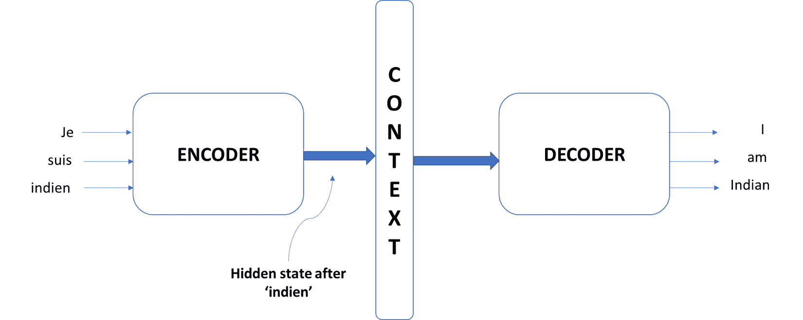
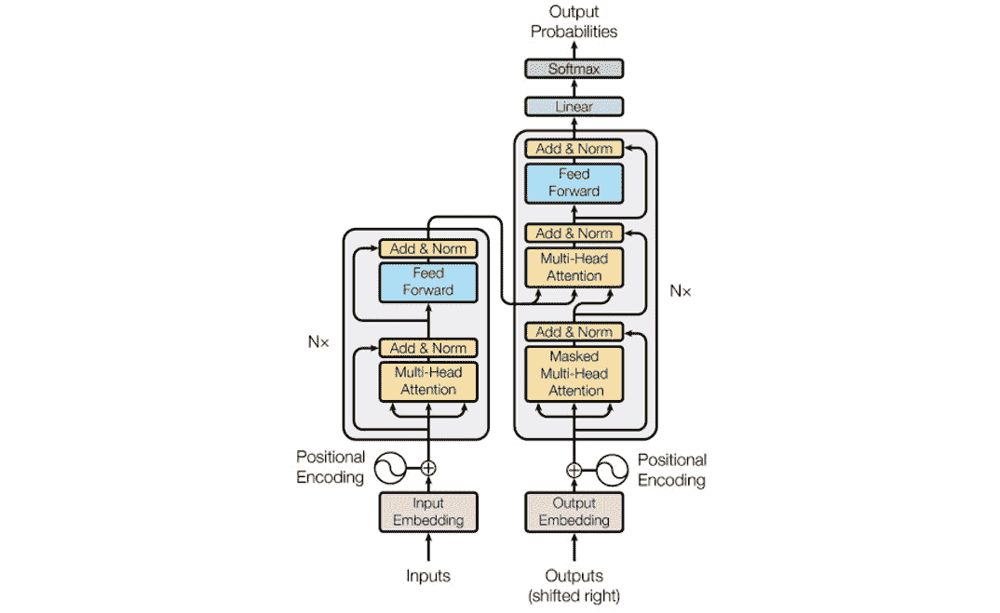

# 第三章：使用 Transformer 和 Bert 进行恶意软件检测

恶意软件是指运行在计算机、智能手机和其他设备上，用于邪恶目的的恶意软件应用。它们在后台秘密执行，通常用户甚至不知道他们的设备已被恶意软件感染。它们可以用来窃取敏感用户信息（如密码或银行信息）并与对手分享，使用您的设备资源进行加密货币挖掘或点击欺诈，或者破坏您的数据（如删除照片和电子邮件）并索要赎金以恢复它们。在 21 世纪，智能手机是我们的生命线，恶意软件可能产生灾难性的影响。学习如何识别、检测和删除恶意软件是网络安全中的一个重要且新兴的问题。

由于其识别和学习行为模式的能力，机器学习技术已被应用于检测恶意软件。本章将从恶意软件的概述开始，包括其生命周期和运行特性。然后，我们将介绍一种即将到来且处于最前沿的架构，称为**transformer**，它通常用于**自然语言处理**（NLP）应用。最后，我们将结合两者，展示如何使用 BERT 构建一个极高精度的恶意软件分类器，BERT 是一个建立在 Transformer 架构之上的模型。

在本章中，我们将涵盖以下主要主题：

+   恶意软件的基础知识

+   Transformer 和注意力机制

+   使用 Bert 检测恶意软件

到本章结束时，您将更好地理解恶意软件的工作原理。最重要的是，您将能够根据我们在这里学习到的概念，将 Transformer 和 Bert 应用于各种与安全相关的分类问题。

# 技术要求

您可以在 GitHub 上找到本章的代码文件：[`github.com/PacktPublishing/10-Machine-Learning-Blueprints-You-Should-Know-for-Cybersecurity/tree/main/Chapter%203`](https://github.com/PacktPublishing/10-Machine-Learning-Blueprints-You-Should-Know-for-Cybersecurity/tree/main/Chapter%203)。

# 恶意软件的基础知识

在我们学习如何**检测**恶意软件之前，让我们简要了解恶意软件究竟是什么以及它是如何工作的。

## 什么是恶意软件？

恶意软件简单地指任何*恶意*软件。它将自行安装在您的设备上（如计算机、平板电脑或智能手机）并在后台运行，通常在您不知情的情况下。它被设计为在您的设备上悄悄更改文件，从而窃取或破坏敏感信息。恶意软件通常伪装成其他无恶意的应用程序。例如，一个提供免费表情符号的浏览器扩展实际上可能是一种恶意软件，它秘密读取您的密码并将它们偷走传递给第三方。

设备可以通过多种方式被恶意软件感染。以下是攻击者用来将恶意软件传递给用户设备的一些流行向量：

+   利用“免费”软件的前提，例如破解版本的昂贵软件，如 Adobe Photoshop

+   安装了恶意软件的 USB 设备插入到用户的计算机中

+   欺诈电子邮件，攻击者假装是雇主或 IT 支持，要求下载和安装恶意软件

+   提示用户安装恶意扩展以继续的网站

这里展示了提示用户安装扩展的网站的一个例子（[`www.myantispyware.com/2017/02/20/remove-to-continue-the-work-of-your-browser-you-should-install-the-extension-pop-ups/`](https://www.myantispyware.com/2017/02/20/remove-to-continue-the-work-of-your-browser-you-should-install-the-extension-pop-ups/)）：


图 3.1 – 一个提示下载恶意软件的可疑网站

恶意软件应用有多种形式和口味，每种都有不同的攻击策略。在下一小节中，我们将研究一些流行的恶意软件变体。

## 恶意软件类型

现在，让我们简要地看看各种恶意软件。

### 病毒

病毒是一种恶意软件应用，其功能类似于其生物对应物——真正的病毒。病毒程序是一种通过创建自身多个副本并占用所有系统资源来复制的程序。病毒隐藏在计算机文件中，一旦文件被运行，它们就可以开始复制和传播。病毒可以是引导型感染（直接针对操作系统并作为引导过程的一部分安装）或文件型感染（那些隐藏在可执行文件中，如从可疑网站下载的软件免费版本）。一些应用还允许第三方扩展与之交互。例如，宏或扩展。病毒也可以作为这些宏的一部分运行。

### 蠕虫

蠕虫在操作方式上与病毒相似，其操作模式是复制和传播。然而，蠕虫是独立的应用程序；它们不像病毒那样嵌入到文件中。虽然病毒需要用户执行文件（如`.exe`文件或宏），但蠕虫更危险，因为它们可以自行执行。一旦它们感染了计算机，它们就可以在整个网络上自动复制。蠕虫通常通过增加资源使用量来使设备崩溃或网络过载。

### 根套件

根套件是一种恶意软件应用程序，其工作目标是让攻击者获得对您系统的完整管理权限（术语**root**指的是操作系统中的管理员或主用户，这是一个可以控制权限和其他用户账户的用户账户）。根套件可以使攻击者完全控制用户的计算机，而用户却毫不知情。这意味着攻击者可以读取和写入所有文件，执行恶意应用程序，并将合法用户锁定在系统之外。攻击者还可以执行非法活动，例如发起 DDoS 攻击，并避免被抓住（因为犯罪将被追溯到用户的机器）。虽然大多数情况下是恶意的，但一些根套件也被用于好的目的。例如，如果一个包含高度敏感数据（如涉及国家安全的情报）的系统被攻击者访问，可以使用根套件作为**后门**（一个秘密或隐藏的系统入口点，可以用来绕过安全机制并获取对系统或数据的未授权访问）来访问它并将其擦除，以防止信息落入错误的手中。

### 勒索软件

勒索软件是阻止用户访问数据的恶意软件应用程序。勒索软件可能会加密数据，使得用户无法对其设备进行任何操作。攻击者要求支付赎金，并威胁如果不支付赎金，数据将被永久删除或发布到互联网上。支付赎金后，攻击者实际上是否履行承诺没有保证。勒索软件攻击呈上升趋势，加密货币（如 BTC）的出现使得攻击者可以匿名地接收和花费金钱。

### 键盘记录器

键盘记录器是一种记录用户键盘活动的应用程序。所有输入的信息都被记录为按键并传输给攻击者。攻击者可以提取诸如用户名、密码、信用卡号码和安全的 PIN 码等信息。由于键盘记录器不会造成任何明显的损害（如删除或锁定文件），因此从用户的角度来看很难检测到。它们安静地存在于后台，并将您的按键信息发送给攻击者。

现在我们已经探讨了不同种类的恶意软件，让我们转向了解恶意软件检测器是如何工作的。

# 恶意软件检测

随着恶意软件的普遍存在，检测恶意软件的需求也在增加。常规的系统扫描和恶意软件检测算法的分析可以帮助用户保持安全并保持系统清洁。

## 恶意软件检测方法

恶意软件检测可以大致分为三大类：基于签名、基于行为和启发式方法。在本节中，我们将简要介绍这些方法，并讨论分析技术。

#### 基于签名的检测方法

这些方法旨在通过存储已知恶意软件示例的数据库来检测恶意软件。所有应用程序都会与这个数据库进行比对，以确定它们是否恶意。算法检查每个应用程序，并使用哈希函数计算一个签名。在计算机安全中，文件的哈希值可以被视为其唯一标识。除非两个文件完全相同，否则几乎不可能有两个相同的哈希值。因此，这种方法在检测已知恶意软件方面非常有效。尽管这种技术的简单性无与伦比，但它很容易被挫败；可执行文件中即使只改变一个比特，也会导致哈希值完全不同，从而无法通过其签名检测到。

#### 基于行为的方法

这些方法旨在通过寻找某些恶意活动的证据来检测恶意软件。基于签名的检测方法根据应用程序所说的内容来检测恶意软件，但基于行为的方法则是根据应用程序的行为来检测。它可以从应用程序的行为中收集各种特征，例如：

+   应用程序发出了多少个 GET 请求？

+   它连接了多少个可疑的 URL？

+   应用程序是否有文件存储的访问权限？

+   在过去七天中，应用程序联系了多少个不同的 IP 地址？

使用这些功能，可以构建常识性规则来标记恶意行为。已知恶意软件的过去例子也被详细研究，以识别可以检查的策略。基于行为的方法对规避攻击更具鲁棒性，因为攻击者必须明确改变应用程序的行为以避免检测。

#### 启发式方法

这些是我们已知的最强大的方法。它们不是寻找特定的行为，而是使用数据挖掘和机器学习模型来学习恶意应用程序的外观。这些方法利用应用程序的 API 调用、OpCode 序列、调用图和其他特征来训练分类模型。神经网络和随机森林已被证明能够实现高准确性和高精度的恶意软件分类器。启发式方法甚至比基于行为的方法更鲁棒，因为改变特定参数不一定能欺骗模型。

## 恶意软件分析

在上一节中，我们讨论了恶意软件检测方法。一旦标记出潜在的恶意软件应用程序，就需要对其进行检查，以确定其行为、传播方式、来源以及任何潜在的影响。研究人员经常剖析恶意软件，因为它可以提供有关攻击者可用技能和策略的见解。详细检查恶意软件文件的过程被称为恶意软件分析。恶意软件分析有两种方法：静态和动态。

### 静态分析

此方法通过收集有关应用程序的信息而不实际运行它来检查恶意软件文件。检查应用程序的哈希值是否与已知的恶意软件样本匹配。可执行文件被反编译，代码被详细分析；这提供了对恶意软件目标以及攻击者所寻找内容的深入了解。代码中的常见模式也可能表明恶意软件的来源或开发者。现在可以找到的策略现在可以用来开发更强大的检测机制。

### 动态分析

动态分析涉及通过实际执行恶意软件来研究恶意软件。创建一个受保护的沙盒环境，并允许恶意软件在其中执行。这使研究人员有机会观察恶意软件的实际运行情况。某些行为可能在代码中不明显，或可能在运行时动态演变。当恶意软件实际运行时，可以观察到这种行为。此外，允许应用程序运行可以收集 API 调用序列和其他行为特征，这些特征可用于启发式方法。

重要的是要注意，处理恶意软件可能是一项危险的任务。无意中运行它可能导致病毒或特洛伊木马控制您的系统。有几种商业工具可以以安全的方式促进恶意软件分析。在后面的章节中，我们将使用此类工具生成的文件。 

# 变换器和注意力

变换器是一种席卷机器学习世界的架构，尤其是在自然语言处理领域。它是经典 **循环神经网络**（**RNN**）在序列建模方面的改进，基于注意力的原理工作。在本节中，我们将讨论注意力机制、变换器和 BERT 架构。

## 理解注意力

现在我们将探讨 *注意力*，这是一种最近在自然语言处理领域取得重大进展的深度学习范式。

### 序列到序列模型

大多数自然语言任务都严重依赖于序列到序列模型。虽然传统方法用于对特定数据点进行分类，但序列到序列架构将一个域中的序列映射到另一个域中的序列。语言翻译是这种应用的绝佳例子。自动机器翻译器将接收源语言的标记序列（句子和单词），并将它们映射到目标语言的句子。

序列到序列模型通常有两个组件：编码器和解码器。编码器接收源序列作为输入，并将它们映射到一个称为 **上下文向量**或嵌入的中间向量。解码器接收嵌入并将其映射到目标域的序列。整个模型是端到端训练的，而不是像 *图 3.2* 所示的那样分别训练编码器和解码器：



图 3.2 – 传统的序列到序列架构

编码器和解码器通常是 RNN，它们保持一个内部状态（隐藏状态），该状态对过去的输入有一些记忆。在传统的序列到序列模型中，上下文向量将简单地是输入句子在向量空间中的高维表示。在*图 3*.*2*中，从法语句子中的单词逐个传递到模型中（每次一个时间步）。编码器包含一个 RNN，它在每个时间步保持一些记忆。在最后一个时间步之后，RNN 的隐藏状态成为上下文向量。

这与之前讨论的自动编码器类似，但有一个主要区别：在序列到序列模型中，输入和输出序列可以是不同长度的。这在语言翻译中通常是这种情况。例如，法语句子“Ca va?”翻译成英语是“你好吗？”。序列到序列模型之所以强大，是因为它们学习标记之间的关系和顺序，并将它们映射到目标语言中的标记。

### 注意力机制

在标准的编码器/解码器架构中，关键挑战是由上下文向量造成的瓶颈。作为一个固定大小的向量，它对可以压缩进其中的信息量有限制。因此，它无法保留较长序列中的信息，也无法捕捉到 RNN 编码器经过的多个时间步长的信息。RNN 有遗忘它们所学习信息的倾向。在较长的序列中，它们会记住序列的后期部分，并开始忘记早期部分。

注意力机制旨在解决长期依赖问题，并允许解码器访问它解码序列所需的所有信息。通过注意力，解码器只关注输入序列的相关部分，以产生输出序列。模型检查编码器的多个时间步，并“关注”它认为重要的那些。

具体来说，虽然传统的序列到序列模型只会将 RNN 的最后一个隐藏状态传递给解码器，但注意力模型会传递所有隐藏状态。例如，在一个英语-法语翻译模型中，输入句子是英语句子。每当 RNN 编码器遍历序列时，就会在每个单词位置创建一个隐藏状态，所有这些都会传递给解码器。

解码器现在可以在输入的每个时间步访问上下文向量。在解码过程中，它将尝试关注对解码这个时间步有意义的输入部分。它将检查编码器的隐藏状态（记住，所有隐藏状态都已传递）并对每个隐藏状态进行评分。评分表示该隐藏状态对当前解码单词的相关性；评分越高，相关性越大。每个状态的评分都使用`softmax`函数进行归一化处理。最后，每个隐藏状态都乘以`softmax`变换后的评分。评分高的隐藏状态（与当前时间步的解码相关）在数值上被放大，而评分低的隐藏状态则被减弱。利用这些向量的值，可以生成解码输出的单词。

### 注意力在行动

我们讨论了注意力解码器能够选择性地关注源序列中的相关单词。为了证明模型不会无意识地逐词翻译，我们在这里展示了一个例子，该例子首次提出了注意力的想法（[`arxiv.org/abs/1409.0473`](https://arxiv.org/abs/1409.0473))。

考虑将法语句子翻译成英语的问题。这是演示注意力的完美领域。法语语言中词素的顺序（副词、形容词和名词）与英语不同。如果一个模型在翻译时不考虑注意力，翻译后的输出将是语法错误的。

这里有一个混淆矩阵，展示了模型在生成输出中的特定标记时对输入中特定标记的关注。颜色越亮，关注越强：


图 3.3 – 表示注意力的混淆矩阵

在法语中，形容词通常放在名词之后。因此，“欧洲经济区”变为“Zone économique européenne”。查看混淆矩阵，注意模型如何关注正确的单词对，而不考虑它们的顺序。如果模型只是映射单词，句子将被从法语版本翻译为“Area Economic European”。混淆矩阵显示，无论顺序如何，模型在解码某些时间步时都知道应该关注哪些单词。

这是注意力的基本概念。实际的机制（如何评分隐藏状态以及如何构建特征向量）在这里不涉及。然而，对那些感兴趣的人来说，可以参考注意力背后的基础论文，以获得对机制的详细描述。

## 理解 Transformer

在上一节中，我们讨论了注意力机制以及它是如何帮助序列到序列应用，例如神经机器翻译的。现在，我们将探讨变换器：一种利用多种形式和阶段的注意力以获得最佳效果的架构。

为了方便起见，变换器模型的基本架构在 2017 年的一篇论文中（*Figure 3**.4*）重现了（[`arxiv.org/pdf/1706.03762.pdf`](https://arxiv.org/pdf/1706.03762.pdf)）：



图 3.4 – 变换器架构

该模型有两个组件：编码器（由左侧的块表示）和解码器（由右侧的块表示）。左侧块的目的是接收输入序列并将其转换为解码器输入的上下文向量。右侧的解码器块接收编码器的输出以及前一时间步的解码器输出以生成输出序列。现在让我们更详细地看看编码器和解码器块。

### 编码器

编码器由两个模块组成：一个多头注意力模块和一个全连接前馈神经网络。多头注意力模块将应用一种称为自注意力的技术，这使得模型能够将输入中的每个词与其他词关联起来。例如，考虑这个句子，“我无法喝汤，因为它太热了”。在这里，句子后半部分的词“它”指的是前半部分的词“汤”。自注意力能够发现这样的关系。正如其名所示，多头注意力包括多个块（或头）用于注意力。预期每个头将学习不同的关系。多头注意力模块计算输入序列的注意力权重，并生成一个向量作为输出，指示序列中的每个词应该如何*关注*其他词。

注意力模块的输出被加回到输入中，然后通过一个归一化层。归一化有助于控制参数的范围并保持模型稳定。归一化后的输出传递到第二个模块，这是一个前馈神经网络。这可以是任何神经网络，但一般来说，它由多个全连接层和一个 ReLU 激活组成。加法和归一化过程再次重复，最终产生编码器的输出。

### 解码器

解码器的作用是接收编码器的输出并生成一个输出序列。请注意，通用模块保持不变，但结构略有不同。

解码器有两个注意力模块。其中一个模块接收先前产生的输出的嵌入，并对其应用注意力机制。此模块应用*掩码注意力*。在训练过程中，我们将有一对输入和输出序列，模型将从这些序列中学习。解码器学会通过仅查看过去标记来产生下一个输出是很重要的。它不应该关注未来标记（否则，开发预测模型的全局目标就毫无意义）。掩码注意力模块将未来标记的注意力权重置零。

第二个注意力模块接收两个输入：第一个模块的标准化输出和编码器的输出。注意力模块有三个输入，称为*查询*、*键*和*值*向量。然而，我们不会深入探讨这些的具体细节。

最后，请注意，解码器在末尾还有一个额外的线性层和一个`softmax`层。解码器的目标是产生目标语言的序列（主要是文本）。因此，生成的嵌入必须以某种方式映射到单词。`softmax`层输出一个关于标记词汇表的概率分布。具有最大概率的标记被选为输出单词。

## 理解 BERT

到目前为止，我们已经了解了注意力机制的工作原理以及如何利用它进行有效的序列到序列建模。作为最后一步，我们将学习 BERT，这是一个使用 transformers 和一套新颖的训练方法的模型。BERT 的有效性和在下游任务中使用预训练模型的有用性对于我们进行恶意软件检测任务至关重要。

**BERT**代表**来自 Transformers 的双向编码器表示**。自从 2018 年引入以来，它对自然语言处理领域产生了巨大影响。这是一个重要的发现，使得研究人员和科学家能够利用大规模机器学习语言模型的力量，而无需大量数据或广泛的计算资源。

### BERT 架构

从架构角度来看，BERT 利用 transformers 来创建结构。BERT 基础模型由 12 个堆叠在一起的 transformers 组成，每个 transformers 有 12 个自注意力头。BERT 大型模型有 24 个 transformer 层和 16 个自注意力头。这两个模型都*非常大*（分别有 1100 万和 400 万个参数）。

这两个模型都已由谷歌作为开源软件发布，任何人都可以免费使用。

### MLM 作为训练任务

传统语言模型只从单一方向检查文本序列：从左到右或从右到左。这种方法对于生成句子来说效果很好。在语言模型中的总体目标是，给定到目前为止出现的单词，预测下一个可能出现的单词。

然而，BERT 更进一步。它不仅从左到右或从右到左查看序列，而是从两个方向都查看序列。它在名为`token`的任务上进行训练。现在，目标不再是预测句子中的下一个单词。模型现在将学会根据两个方向的周围单词预测被掩码的单词。

传统模型生成的词嵌入在数值空间中表示单词，使得意义相似的单词在向量空间中彼此靠近。然而，BERT 将根据单词的上下文为单词生成嵌入。在这些嵌入中，单词的向量表示会随着单词使用的上下文而变化。

在传统的词嵌入中，一个单词的嵌入将不受上下文的影响。单词“match”在这句话“他们是一个完美的匹配”和“我昨晚点燃了一根火柴”中都有相同的嵌入。我们清楚地看到，尽管单词相同，但上下文很重要，并且会改变意义。BERT 认识到这一点，并根据上下文条件化嵌入。在这两个句子中，match 单词有不同的嵌入。

### 微调 BERT

如前所述，BERT 的力量在于微调。原始 BERT 模型使用 BooksCorpus 数据（包含 8 亿个单词）和维基百科数据（包含 25 亿个单词）进行了掩码语言模型任务的训练。模型从大规模数据集中学习，这种训练我们无法轻易复制。为了说明，BERT 大型模型需要 4 天和 16 个云 TPU 进行训练。

转移学习的概念帮助我们利用这个已经训练好的模型来完成我们的下游任务。这个想法是我们取一个通用的语言模型，并针对我们的特定任务对其进行微调。高级概念已经被模型学习；我们只需要教它更多关于特定任务的知识。

为了做到这一点，我们使用预训练模型，并在其上方添加一个单层（通常是单层神经网络）。该层的性质将取决于我们微调的任务。对于任何任务，我们只需将特定任务的输入和输出以正确的格式插入到 BERT 中，并端到端微调所有参数。随着微调的进行，我们将实现两个任务：

+   变换器的参数将迭代更新以细化嵌入并生成特定于任务的上下文嵌入

+   新增的层将被训练（即学习适当的参数）以分类新的嵌入类别

微调 BERT 在时间和资源方面都是一个低成本的任务。分类模型可以在 TPU 上使用一个小时，在 GPU 上大约 4 小时，在普通 CPU 上 8-10 小时。BERT 在微调了多个任务（如问答、句子补全和文本理解）之后被使用。

# 使用 BERT 检测恶意软件

到目前为止，我们已经看到了注意力机制、Transformer 和 BERT。但所有这些都非常特定于与语言相关的任务。我们所学到的所有内容如何与我们的恶意软件检测任务相关，这个任务与语言无关呢？在本节中，我们将首先讨论如何利用 BERT 进行恶意软件检测，然后演示相应的实现。

## 恶意软件作为语言

我们看到 BERT 在句子相关任务上表现出色。句子仅仅是单词的序列。请注意，我们作为人类，我们能在序列中找到意义，因为我们理解语言。与单词不同，标记可以是任何东西：整数、符号或图像。因此，BERT 在序列任务上表现良好。

现在，想象一下，如果我们用应用程序的调用代替单词作为标记。应用程序的生命周期可以描述为一系列它所发出的 API 调用。例如，`<START>` `<REQUEST-URL>` `<DOWNLOAD-FILE>` `<EXECUTE-FILE>` `<OPEN-CONTACTS>` `<POST-URL>` `<END>` 可以代表一个应用程序的行为。就像句子是单词的序列一样，一个应用程序可以被看作是 API 调用的序列。

## BERT 的相关性

请记住，BERT 学习了一个单词的上下文嵌入。如果我们用恶意软件数据（以 API 调用作为单词，它们的序列作为句子）使用 BERT，该模型将能够为每个 API 调用学习嵌入表示，并基于上下文进行条件化。这对于恶意软件检测是有用的，因为单个 API 调用不能确定一个应用程序是否是恶意软件，但它在被调用的上下文中可能可以。例如，单独的 API 调用请求第三方 URL 可能不是恶意的，但与访问存储的密码和联系人相结合，可能表明正在运行恶意软件。这是我们选择 BERT 作为恶意软件检测模型背后的动机。

我们将在恶意软件分类任务上使用 BERT，就像句子分类任务一样。这里我们有两种选择：

+   从头开始训练一个新的 BERT 模型

+   在基于语言数据的预训练 BERT 模型上微调现有的 BERT 模型以进行恶意软件分类

由于预训练模型的领域与恶意软件不同（即，恶意软件 API 序列中的标记不会出现在维基百科或 BooksCorpus 数据集中），第一个选项可能看起来更好。然而，请记住，预训练的数据集是庞大的，我们没有访问到如此规模的恶意软件数据。

先前的研究表明，即使是用英语预训练的 BERT 模型，也是恶意软件检测的一个优秀候选者。这是因为预训练产生了一组最优参数，这些参数使得任何下游任务（如恶意软件检测）的收敛速度更快。在接下来的章节中，我们将采取这种方法。我们首先预处理数据，将其读入 DataFrame，然后在预训练的 BERT 模型上进行微调。

## 获取数据

如前所述，恶意软件可以通过静态和动态方法进行分析。存在一些商业工具用于反编译恶意软件二进制文件、理解其行为和检查其活动。其中一种用于恶意软件分析的工具有 WildFire（[`www.paloaltonetworks.com/products/secure-the-network/wildfire`](https://www.paloaltonetworks.com/products/secure-the-network/wildfire)），由帕洛阿尔托网络公司开发。它是一个云恶意软件保护引擎，利用先进的机器学习模型实时检测定向恶意软件攻击。

为恶意软件检测创建自己的数据集具有挑战性。首先，使用 WildFire 等工具生成动态分析文件是一项昂贵的任务（商业工具通常是专利的，需要许可证），而且超出了本书的范围。其次，恶意软件的示例，尤其是那些在野外看到的，很难找到。最后，对恶意软件可执行文件进行实验可能会无意中感染您的系统。因此，我们将使用商业可用的恶意软件数据集。

2018 年，帕洛阿尔托网络公司发布了一篇研究论文（[`arxiv.org/pdf/1812.07858.pdf`](https://arxiv.org/pdf/1812.07858.pdf)），讨论了常见的网络安全问题，其中详细讨论了恶意软件检测。与论文一起，他们发布了一个包含超过 18 万个不同应用程序分析文件的数据集。该数据集由帕洛阿尔托网络公司在特定时期内识别的恶意软件样本组成。对于每个恶意软件，他们提供了标识符和文件访问的域名，以及应用程序发出的 API 调用序列。

该数据集对学生和研究人员免费开放，可以通过在论文中描述的方式联系帕洛阿尔托网络公司获取。然而，我们提出的方法相当通用，可以应用于您能够访问的任何恶意软件数据集。

## 预处理数据

帕洛阿尔托网络公司数据集包含每个应用程序的几个特征，包括静态和动态分析文件。然而，对我们来说特别感兴趣的是 API 调用序列。这是因为我们想利用变换器的力量。变换器的一个定义特征是它们擅长通过注意力机制处理序列数据。

动态分析文件将为我们提供应用程序发出的 API 调用序列。每个 API 调用由两部分组成：`GET`请求。键指的是传递给 API 调用的参数（例如应用程序连接的实际域名）。在检查参数的同时，也会揭示有关应用程序是否恶意的重要信息，但在这里我们只关注 API 调用的动作。

每个应用程序（无论是恶意软件还是良性软件）都有一个相关的 XML 文件，其中包含 API 调用日志。一旦提取出来，我们将能够访问应用程序采取的动作集。一个示例片段可能如下所示：


图 3.5 – API 调用序列

我们首先提取所有应用程序的序列。现在我们有了序列，它必须被转换为适合由机器学习模型消费的标记。一旦我们有了所有序列，我们就可以计算已知的 API 调用集，并为每个 API 调用分配一个唯一的整数。现在，每个应用程序都可以表示为整数的序列。

注意，到目前为止所讨论的步骤并不特定于帕洛阿尔托网络数据集，这也是我们没有引入任何特定函数或代码进行预处理的原因。您可以将此相同技术应用于从任何恶意软件数据集中构建特征向量。

为了方便和简单，我们将提供数据集的预处理版本。请注意，API 调用序列由整数表示，因为我们不能公开分享确切的 API 调用。对了解更多感兴趣的读者可以参考原始论文和数据。

## 构建分类器

我们将利用 BERT 模型来构建我们的分类器。这里的大部分代码是从谷歌在 2019 年发布 BERT 模型时发布的官方笔记本中借用的。一些代码可能看起来令人畏惧；然而，请不要担心。其中很多只是样板环境设置和函数定义，您绝对不需要详细了解。我们将审查代码并讨论在您自己实现或希望为不同问题使用此设置时需要更改的部分。

首先，我们将导入所需的库。如果其中任何一个尚未安装（Python 会抛出错误），则可以使用`pip`实用程序进行安装：

```py
import bert
from bert import run_classifier
from bert import optimization
from bert import tokenization
import tensorflow as tf
import numpy as np
import pandas as pd
import tensorflow_hub as hub
```

我们将利用预训练的 BERT 模型来构建我们的分类器。TensorFlow Hub 包含了所有这些预训练模型，并且它们对公众开放。此函数读取模型及其词汇表并生成一个标记器。标记器负责将我们看到的单词转换为机器学习模型可以理解的标记：

```py
BERT_MODEL_HUB = "https://tfhub.dev/google/bert_cased_L-12_H-768_A-12/1"
def create_tokenizer_from_hub_module():
  with tf.Graph().as_default():
    bert_module = hub.Module(BERT_MODEL_HUB)
    tokenization_info = bert_module(signature="tokenization_info", as_dict=True)
  with tf.Session() as sess:
    vocab_file, do_lower_case = sess.run([tokenization_info["vocab_file"],
                                                 tokenization_info["do_lower_case"]])
  return bert.tokenization.FullTokenizer(
      vocab_file=vocab_file, do_lower_case=do_lower_case)
tokenizer = create_tokenizer_from_hub_module()
```

现在，我们实际上创建分类模型。此函数将创建一个 BERT 模块并定义输入和输出结构。然后我们将获取输出层并找到那里的参数；这些参数将用于运行推理。我们对这一层应用 dropout 并计算 logits（即层的`softmax`输出）。在训练阶段，`softmax`输出用于计算相对于真实值的损失。在推理阶段，输出可以用来根据`softmax`输出中哪个概率最高来预测标记。请注意，真实值以分类标记的形式存在（在我们的情况下，是 API 调用），因此需要使用 one-hot 编码将其转换为数值形式：

```py
def create_model(is_predicting, input_ids, input_mask, segment_ids, labels,num_labels):
  """Creates a classification model."""
  bert_module = hub.Module(
      BERT_MODEL_HUB,
      trainable=True)
  bert_inputs = dict(
      input_ids=input_ids,
      input_mask=input_mask,
      segment_ids=segment_ids)
  bert_outputs = bert_module(
      inputs=bert_inputs,
      signature="tokens",as_dict=True)
  output_layer = bert_outputs["pooled_output"]
  hidden_size = output_layer.shape[-1].value
  output_weights = tf.get_variable("output_weights", [num_labels, hidden_size],      initializer=tf.truncated_normal_initializer(stddev=0.02))
  output_bias = tf.get_variable("output_bias",[num_labels], initializer=tf.zeros_initializer())
  with tf.variable_scope("loss"):
    # Dropout helps prevent overfitting
  output_layer = tf.nn.dropout(output_layer, keep_prob=0.9)
    logits = tf.matmul(output_layer, output_weights, transpose_b=True)
    logits = tf.nn.bias_add(logits, output_bias)
    log_probs = tf.nn.log_softmax(logits, axis=-1)
    # Convert labels into one-hot encoding
    one_hot_labels = tf.one_hot(labels, depth=num_labels, dtype=tf.float32)
    predicted_labels = tf.squeeze(tf.argmax(log_probs, axis=-1, output_type=tf.int32))
    # If we're predicting, we want predicted labels and the probabilties.
    if is_predicting:
      return (predicted_labels, log_probs)
    # If we're train/eval, compute loss between predicted and actual label
    per_example_loss = -tf.reduce_sum(one_hot_labels * log_probs, axis=-1)
    loss = tf.reduce_mean(per_example_loss)
    return (loss, predicted_labels, log_probs)
```

到目前为止的代码主要是设置参数的样板函数。现在，我们将创建一个实际定义我们的训练和推理设置的函数。回想一下，之前的函数定义了创建模型的步骤。这个函数将利用之前的函数进行训练和推理。

首先，我们读取对训练至关重要的输入特征和标签。这些将被作为参数传递给函数。如果正在进行训练阶段，该函数将使用`create_model`函数计算一个损失，该损失将用于训练优化。如果不进行训练，它将简单地根据模型对数据点进行评分并返回一个预测标签和输出概率。

此函数还定义了一个度量计算函数。这对于分析和比较我们模型的表现至关重要。TensorFlow 内置了计算常见度量（如精确率、召回率、假阳性、假阴性、F1 分数等）的函数。我们利用这些内置函数并返回一个字典，其中包含各种度量：

```py
def model_fn_builder(num_labels, learning_rate, num_train_steps,num_warmup_steps):
  def model_fn(features, labels, mode, params):
    input_ids = features["input_ids"]
    input_mask = features["input_mask"]
    segment_ids = features["segment_ids"]
    label_ids = features["label_ids"]
    is_predicting = (mode == tf.estimator.ModeKeys.PREDICT)
    # TRAIN and EVAL
    if not is_predicting:
      (loss, predicted_labels, log_probs) = create_model(is_predicting, input_ids, input_mask, segment_ids, label_ids, num_labels)
      train_op = bert.optimization.create_optimizer(loss, learning_rate, num_train_steps, num_warmup_steps, use_tpu=False)
    # Calculate evaluation metrics.
    def metric_fn(label_ids, predicted_labels):
       accuracy = tf.metrics.accuracy(label_ids, predicted_labels)
        f1_score = tf.contrib.metrics.f1_score(
            label_ids,
            predicted_labels)
        auc = tf.metrics.auc(
            label_ids,
            predicted_labels)
        recall = tf.metrics.recall(
            label_ids,
            predicted_labels)
        precision = tf.metrics.precision(
            label_ids,
            predicted_labels)
        true_pos = tf.metrics.true_positives(
            label_ids,
            predicted_labels)
        true_neg = tf.metrics.true_negatives(
            label_ids,
            predicted_labels)
        false_pos = tf.metrics.false_positives(
            label_ids,
            predicted_labels)
        false_neg = tf.metrics.false_negatives(
            label_ids,
            predicted_labels)
        return {
            "eval_accuracy": accuracy,
            "f1_score": f1_score,
            "auc": auc,
            "precision": precision,
            "recall": recall,
            "true_positives": true_pos,
            "true_negatives": true_neg,
            "false_positives": false_pos,
            "false_negatives": false_neg
        }
      eval_metrics = metric_fn(label_ids, predicted_labels)
      if mode == tf.estimator.ModeKeys.TRAIN:
        return tf.estimator.EstimatorSpec(mode=mode,
          loss=loss,
          train_op=train_op)
      else:
        return tf.estimator.EstimatorSpec(mode=mode,
            loss=loss,
            eval_metric_ops=eval_metrics)
      else:
        (predicted_labels, log_probs) = create_model(
        is_predicting, input_ids, input_mask, segment_ids, label_ids, num_labels)
      predictions = {
          'probabilities': log_probs,
          'labels': predicted_labels
      }
     return tf.estimator.EstimatorSpec(mode, predictions=predictions)
  # Return the actual model function in the closure
return model_fn
```

现在所有用于初始化模型、计算损失和训练以及推理的函数都准备好了，我们可以通过插入我们的恶意数据来使用这个设置。请注意，到目前为止的过程是通用的，适用于任何你试图使用 BERT 解决的微调问题；没有任何东西是硬编码的或特定于恶意数据的。如果你想使用 BERT 的微调方法来处理其他任务（情感分析、仇恨言论检测或虚假信息检测），我们之前完成的所有步骤仍然有效。

现在我们将定义一些用于训练的参数。第一组参数是标准的机器学习参数。批大小定义了每次计算损失时将使用的示例数量，而学习率定义了参数在梯度下降优化算法中更新的速率。这里将 epoch 数设置为`3`，这是一个较小的数字。这是因为我们并不是从头开始训练模型；我们只是在使用一个已经训练好的模型，并对其进行微调以在我们的数据集上运行。

下一个参数集是为了优化和简化训练而存在的。它定义了在多少步之后应该保存模型的新版本。在这里，我们将其设置为`500`，这意味着每 500 步之后，将保存一个新的模型。这有助于我们在遇到意外错误或崩溃时；模型只需读取最新的保存模型并从该点继续训练。

最后，最后一组参数定义了正样本比例。这是训练数据中恶意样本的比例。在这里我们将其设置为 0.001，相当于 0.1%：

```py
BATCH_SIZE = 32
LEARNING_RATE = 2e-5
NUM_TRAIN_EPOCHS = 3.0
WARMUP_PROPORTION = 0.1
SAVE_CHECKPOINTS_STEPS = 500
SAVE_SUMMARY_STEPS = 100
POSRATIO=0.001 # 0.1%
NPOS=10000*POSRATIO
```

现在，我们读取包含我们数据的数据帧。回想一下，`VERDICT`列包含一个 0/1 标签，表示该特定数据点是否为恶意软件。我们将恶意软件和良性样本分开，从正类中采样所需的分数，然后与负类结合。这样，我们就有一个只包含所需比例的恶意软件样本的数据集：

```py
df_a=pd.read_csv('dataset.csv')
df_a_1=df_a[df_a['VERDICT']==1]
df_a_0=df_a[df_a['VERDICT']==0]
df_a_sampled=pd.concat([df_a_1[:nPos],df_a_0[:NPOS]])
```

现在，我们将我们的数据分为训练集和测试集。请注意，在这里我们的样本数据中恶意软件的比例非常小。如果我们随机分割，我们可能会在训练集或测试集中完全包含所有恶意软件。为了避免这种情况，我们应用分层抽样。在分层抽样中，标签的比例在训练集和测试数据集中大致相同：

```py
from sklearn.model_selection import train_test_split
df_train_n,df_test_n=train_test_split(df_a_sampled,stratify=df_a_sampled['VERDICT'])
```

记住，我们拥有的数据是以 API 调用序列的形式。这必须转换为 BERT 可以消费的形式。我们在下一步中这样做，并将训练数据和测试数据转换为所需格式。

首先，我们使用`InputExample`类将我们的 API 序列字符串和标签一起包装：

```py
DATA_COLUMN='API_CALL_SEQ'
LABEL_COLUMN='VERDICT'
train_InputExamples_a = df_train_n.apply(lambda x: bert.run_classifier.InputExample(guid=None,
                        text_a = x[DATA_COLUMN],
                        text_b = None,
                        label = x[LABEL_COLUMN]),
                        axis = 1)
test_InputExamples_a = df_test_n.apply(lambda x: bert.run_classifier.InputExample(guid=None,
                        text_a = x[DATA_COLUMN],
                        text_b = None,
                        label = x[LABEL_COLUMN]),
                        axis = 1)
```

然后，我们使用我们的分词器将序列转换为特征：

```py
label_list=[0,1]
MAX_SEQ_LENGTH = 128
train_features_a = bert.run_classifier.convert_examples_to_features(
                train_InputExamples_a,
                label_list,
                MAX_SEQ_LENGTH,
                tokenizer)
test_features_a = bert.run_classifier.convert_examples_to_features(
                test_InputExamples_a,
                label_list,
                MAX_SEQ_LENGTH,
                tokenizer)
```

现在我们有了特征和标签。我们准备好训练模型了！我们将使用我们之前定义的模型函数构建器来创建模型，并将其传递给 TensorFlow 估计器，它会为我们处理训练。我们在运行配置中指定了保存训练模型的输出目录以及我们之前定义的参数（摘要和检查点步骤），这也传递给了估计器：

```py
OUTPUT_DIR='saved_models/rate_'+str(posRatio*100)
num_train_steps = int(len(train_features_a) / BATCH_SIZE * NUM_TRAIN_EPOCHS)
num_warmup_steps = int(num_train_steps * WARMUP_PROPORTION)
run_config = tf.estimator.RunConfig(
    model_dir=OUTPUT_DIR,
    save_summary_steps=SAVE_SUMMARY_STEPS,
    save_checkpoints_steps=SAVE_CHECKPOINTS_STEPS)
model_fn = model_fn_builder(
  num_labels=len(label_list),
  learning_rate=LEARNING_RATE,
  num_train_steps=num_train_steps,
  num_warmup_steps=num_warmup_steps)
estimator_android = tf.estimator.Estimator(
  model_fn=model_fn,
  config=run_config,
  params={"batch_size": BATCH_SIZE})
train_input_fn_a = bert.run_classifier.input_fn_builder(
    features=train_features_a,
    seq_length=MAX_SEQ_LENGTH,
    is_training=True,
    drop_remainder=False)
import time
print(f'Beginning Training!')
current_time = time.time()
estimator_android.train(input_fn=train_input_fn_a, max_steps=num_train_steps)
print("Training took time ", time.time() - current_time)
```

这将产生大量的输出，其中大部分你不需要理解。训练时间将取决于你使用的处理器、GPU（如果有）以及系统使用情况。如果没有 GPU，微调大约需要 29,000 秒，这相当于大约八小时。

最后，我们希望使用这个微调模型对新数据进行预测并评估其性能。我们可以使用相同的估计器在推理模式下：

```py
test_input_fn_a = bert.run_classifier.input_fn_builder(
    features=test_features_a,
    seq_length=MAX_SEQ_LENGTH,
    is_training=False,
    drop_remainder=False)
metrics = estimator_android.evaluate(input_fn=test_input_fn_a, steps=None)
```

这应该会显示一个输出，打印出指标。请注意，你的数字可能与我这里看到的有轻微差异：

```py
{'auc': 0.95666675,
 'eval_accuracy': 0.99920094,
 'f1_score': 0.49999997,
 'false_negatives': 2.0,
 'false_positives': 0.0,
 'loss': 0.0076462436,
 'precision': 0.974,
 'recall': 0.871,
 'true_negatives': 2500.0,
 'true_positives': 1.0,
 'global_step': 703}
```

回想一下，我们之前定义了一个模型评估函数。变量 metrics 将包含包含各种评估指标的字典。如果你打印出来，你应该能够检查准确率、精确率、召回率和 F-1 分数。

这完成了我们的实验！我们成功使用了一个在语言任务上预训练的 BERT 模型，并将其微调以根据 API 调用序列对恶意应用程序进行分类。请随意实验代码。以下是一些需要思考的事情：

+   如果你使用 BERT 大型模型而不是 BERT 基础模型会发生什么？

+   性能如何随着正样本率分数的变化而变化？

+   如果你改变架构（添加更多层）会发生什么？

就这样，我们来到了这一章的结尾。

# 摘要

本章介绍了恶意软件及其使用变压器进行检测的实战蓝图。首先，我们讨论了恶意软件的概念及其各种形式（如 rootkits、病毒和蠕虫）。然后，我们讨论了注意力机制和变压器架构，这些是近年来在机器学习领域引起轰动的前沿进展。我们还研究了 BERT 模型，该模型在句子分类和问答等任务中击败了多个基线。我们通过在 API 调用序列数据上微调预训练模型，利用 BERT 进行恶意软件检测。

恶意软件是一个紧迫的问题，它使手机和电脑用户面临巨大的风险。对安全领域感兴趣的数据科学家和机器学习从业者需要深入了解恶意软件的工作原理以及可用于检测的模型架构。本章提供了所需的所有知识，对于 SecML 专业人士来说，掌握这些知识是必不可少的。

在下一章中，我们将转换方向，转向一个不同的问题：虚假在线评论。
