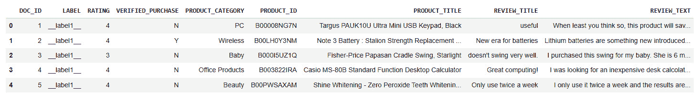
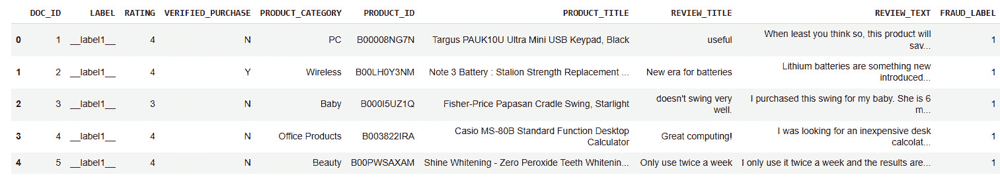
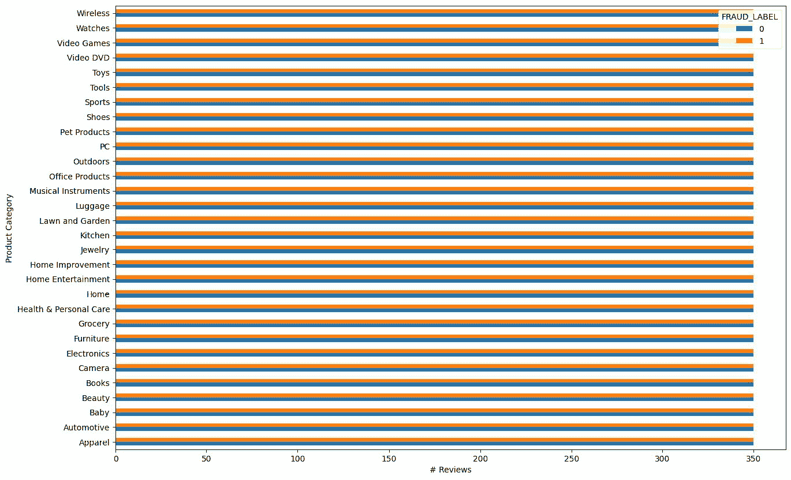
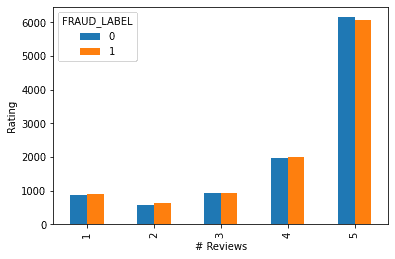
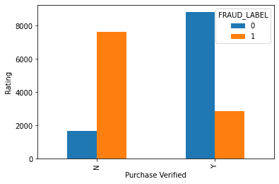
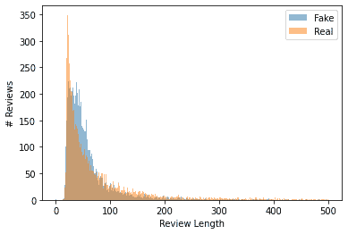
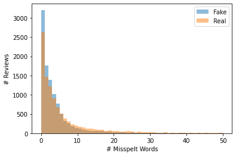
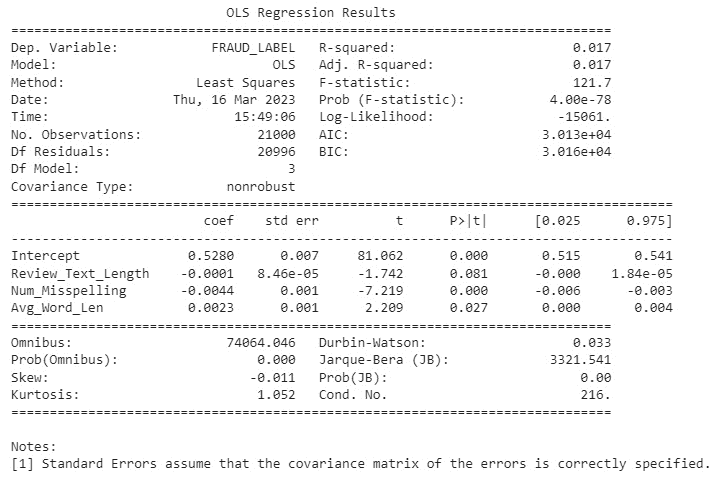
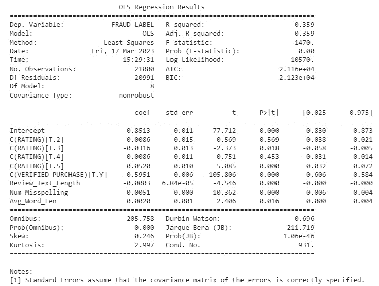

# 4

# 检测虚假评论

评论是在线市场中的一个重要元素，因为它们传达了顾客的体验和对产品的看法。顾客高度依赖评论来确定产品的质量、描述中各种声明的真实性，以及其他顾客的体验。然而，在最近一段时间里，虚假评论的数量有所增加。虚假评论具有误导性和欺诈性，对消费者造成伤害。它们不仅存在于购物网站上，还存在于任何有通过评论建立信誉概念的地方，如谷歌地图、Yelp、Tripadvisor，甚至谷歌应用商店。

欺诈性评论损害了平台的完整性，并允许骗子获利，而真正的用户（卖家和顾客）则受到伤害。作为安全领域的数据科学家，了解信誉操纵及其表现形式，以及检测它的技术是至关重要的。本章重点在于通过虚假评论来考察信誉操纵。

在本章中，我们将涵盖以下主要内容：

+   评论与诚信

+   统计分析

+   使用回归模型建模虚假评论

到本章结束时，你将清楚地了解通过虚假评论进行的信誉操纵以及如何检测它们。你还将了解统计测试及其在分析和如何使用回归模型对评论数据进行建模的应用。

# 技术要求

你可以在 GitHub 上找到本章的代码文件，网址为[`github.com/PacktPublishing/10-Machine-Learning-Blueprints-You-Should-Know-for-Cybersecurity/tree/main/Chapter%204`](https://github.com/PacktPublishing/10-Machine-Learning-Blueprints-You-Should-Know-for-Cybersecurity/tree/main/Chapter%204)。

# 评论与诚信

让我们先看看在线评论的重要性以及虚假评论存在的原因。

## 虚假评论存在的原因

电子商务网站总是对产品有评论。评论在在线世界中扮演着重要角色。评论允许消费者发布他们的体验，并促进同侪间的信誉建立。评论在在线平台上之所以重要，有以下几个原因：

+   在线评论为潜在顾客提供了关于产品或服务质量和性能的有价值信息。顾客在决定是否购买之前，可以阅读其他人关于产品或服务的体验。

+   其他顾客的评论有助于建立卖家和买家之间的信任。正面评论可以安慰潜在顾客，让他们相信产品或服务值得购买，而负面评论则可以警告他们可能存在的问题。

+   在线评论可以为商家提供关于其产品和服务有价值的反馈。这种反馈可以帮助商家改进他们的产品和服务。

+   在线评论还可以帮助企业改善其搜索引擎排名。搜索引擎如谷歌在搜索结果中对网站的评论数量和质量进行考量。

因此，更好的评论意味着更好的销售和更高的利润，这对于卖家来说是自然的。卖家有动力尽可能多地获得关于他们产品的优秀评价，这导致了虚假评论的问题。

虚假评论是有意编写来误导或欺骗读者的评论。它们可以是正面的或负面的，通常由对操纵产品或服务声誉有既得利益的个人或公司编写。以下是一些常见的虚假评论类型：

+   **付费评论**：一些个人或公司支付他人撰写关于他们产品或服务的正面评论，即使他们没有使用过这些产品或服务

+   **虚假负面评论**：竞争对手或怀有怨恨的个人可能会写虚假负面评论来损害企业或产品的声誉

+   **评论交换**：一些个人或公司提供与其他企业或个人交换正面评论，以提升自己的评分

+   **评论机器人**：一些企业使用自动化软件程序快速生成大量虚假评论

虚假评论是有问题的，因为它们可能会误导潜在客户做出糟糕的购买决定。它们还可能损害依赖真实客户反馈来改进其产品和服务的企业。许多在线平台都有政策来检测和删除虚假评论，以保护其评论系统的完整性。例如，亚马逊明确禁止评论者因评论而获得任何补偿或免费产品。 

## 虚假评论的演变

虚假评论和声誉操纵的问题并非新问题——它已经存在了几十年。然而，虚假评论的性质已经发生了显著变化，从机器人生成的评论到众包评论，再到激励性评论。

### 机器人生成的评论

这些是卖家可以大规模上线的第一种虚假评论形式。机器人生成的评论是使用自动化软件程序创建的评论，也称为评论机器人。这些机器人被设计成快速生成和发布大量评论，而不需要任何人为干预。这些评论有几个明显的特征：

+   它们通常是通用的，缺乏关于被评论的产品或服务的具体细节

+   他们可能使用类似的语言和句子结构，并且通常拥有很高的正面评价数量

+   它们也表现出来自相同 IP 地址、子网和网络的特点

许多在线平台已经实施了检测和移除机器人生成评论的措施，以维护其评论系统的完整性。这些措施包括使用机器学习算法来识别评论中的模式，监控可疑的 IP 地址和活动，以及要求评论者验证其身份。

### 群智评论

了解机器人生成评论很容易通过标记 IP 地址和其他自动化活动的症状来检测后，恶意卖家转向了群智评论。这种类型的虚假评论是通过雇佣众包工作者简单地为他们撰写数百条产品评论。这些个人通常是网络市场或平台的成员，这些平台提供以换取撰写关于产品或服务的正面评论的报酬。众包工作者可能实际上并没有使用被评论的产品或服务，他们可能只是被提供基本信息来撰写评论。这些众包工作者在自由职业和众包工作网站上，如 Amazon MTurk 或 Fiverr 上工作，他们按佣金制度工作，并为每条发布的评论收取费用。值得注意的是，这些评论也有某些特殊特征。由于许多评论是由同一用户撰写的，它们显示出非常高的评论间相似性。它们还显示出高度突发性（即，评论数量的突然增加，对应于众包工作者被雇佣的时间）。这些信号可以用作特征来检测这种类型的评论。

### 激励性评论

这些是当前在线虚假评论的最新趋势。激励性评论是由收到某种形式的补偿或奖励以换取其评论的客户撰写的评论。这种补偿可以以各种形式出现，例如免费产品、折扣、礼品卡、退款或其他激励措施。激励性评论通常被公司用作营销策略，以提高其产品或服务的正面评论和评分。通过向客户提供激励，公司希望鼓励他们撰写正面评论，从而吸引更多客户并促进销售。

然而，激励性评论可能会引起争议，因为它们可能会产生对正面评论的偏见，并且可能无法准确反映客户的真实意见。这是因为收到激励的客户可能会觉得有义务写一个正面评论，即使他们并没有与产品或服务有愉快的体验。因此，许多评论平台和网站都有严格的反激励性评论政策，并可能将其从其平台上移除，以确保其评论系统的完整性。

与机器人生成或群智评论相比，激励性评论更难检测。这些评论是由人类用户撰写的，因此不会显示出机器人活动的症状。由于这些是真实用户而不是众包工作者，这些评论也显示出较少的相似性。

# 统计分析

在本节中，我们将尝试理解一些评论数据，并检查真实评论和虚假评论之间是否存在任何差异。我们将使用亚马逊在 Kaggle 上发布的亚马逊虚假评论数据集。这是一个大约有 20,000 条评论的数据集，这些评论由亚马逊领域的专家标注为真实或虚假。

## 探索性数据分析

我们首先加载数据，并对它进行初步浏览，以了解特征及其分布。

我们首先导入必要的库：

```py
import numpy as np
import pandas as pd
import matplotlib.pyplot as plt
```

然后，我们将读取`reviews`数据。尽管它是一个文本文件，但由于它是结构化的，因此可以使用 Pandas 中的`read_csv`函数读取：

```py
reviews_df = pd.read_csv("amazon_reviews.txt", sep="\t")
reviews_df.head()
```

这应该是输出应该看起来像的：



图 4.1 – 评论数据集的概览

注意数据中的**标签**列。它不仅仅是一个简单的标签，而是有**__label1__**和**__label2__**这样的标签。查看这个数据集的文档，我们可以看到**__label1__**对应真实评论，而**__label2__**对应虚假评论。

为了更容易理解，我们将转换这些标签。我们希望`0`对应真实评论，而`1`对应虚假评论。以下代码片段为我们完成了这项工作：

```py
def label_to_int(label):
    if label == "__label2__":
        # Real Review
        return 0
    else:
        # Fake Review
        return 1
reviews_df["FRAUD_LABEL"] = reviews_df["LABEL"].apply(label_to_int)
reviews_df.head()
```

以下代码的输出如下。您可以看到创建了一个新的列，**FRAUD_LABEL**，其值为**0**和**1**。



图 4.2 – 添加了清晰标签的数据集

首先，我们想查看真实和虚假评论的分布情况。这将告诉我们数据集是否平衡。如果数据集不平衡，我们可能在构建分类器时遇到问题。如果高度不平衡（例如只有 1%的评论是虚假的），我们可能希望从分类转向异常检测方法。

注意数据集中有一个产品类别特征。我们想检查评论在不同类别中的分布情况。我们这样做是因为不同类型的产品可能会有不同类型的评论。家居服装的虚假评论的性质可能与电子产品不同。我们想查看分布情况，以预测任何偏差或泛化问题。

为了做到这一点，我们将按类别对评论进行分组，并计算每个类别的评论数量。以条形图形式的输出将显示分布：

```py
axes = reviews_df.groupby("FRAUD_LABEL").PRODUCT_CATEGORY\
       .value_counts()\
       .unstack(0)\
       .plot.barh()
axes.set_xlabel("# Reviews")
axes.set_ylabel("Product Category")
```

输出应该如下所示。我们可以看到有大约 30 个产品类别，每个类别都有 350 条真实和 350 条虚假评论。因此，这个数据集是平衡的，我们不需要担心来自评论类别特征的偏差。



图 4.3 – 评论在不同类别中的分布

接下来，我们想要检查真实和虚假评论在评分上的分布情况。这是一个重要的考虑因素，未能做到这一点可能会导致模型有偏差。例如，如果数据集被设置为所有虚假评论都是四星和五星，而所有真实评论都是一星和二星，那么我们的模型将学会检测情感而不是评论的真实性。情感将引入偏差到我们的模型中，这违背了建立模型本身的实际目的。

我们将按评分对评论进行分组，并计算每个评分的真实和虚假评论数量。请注意，这是可行的，因为评分只有五个类别，它们是离散的：

```py
axes = reviews_df.groupby("FRAUD_LABEL").RATING\
      .value_counts()\
      .unstack(0)\
      .plot.bar()
axes.set_xlabel("# Reviews")
axes.set_ylabel("Rating")
```

输出如下所示。我们可以看到，在评分类别（只有 2,000 条一星评论，而大约有 12,000 条五星评论）的数量上存在一些差异。然而，在每个类别中，真实和虚假评论的数量大致相等。因此，数据在评分方面也分布得很好。



图 4.4 – 评论在不同评分中的分布

最后，我们将根据评论是否经过验证来审查真实和虚假评论的分布。一个评论被验证意味着电子商务平台保证评论者确实购买了该产品，通常是在平台本身上。我们可以通过以下代码片段来观察分布：

```py
axes = reviews_df.groupby("FRAUD_LABEL").VERIFIED_PURCHASE\
      .value_counts()\
      .unstack(0)\
      .plot.bar()
axes.set_xlabel("Purchase Verified")
axes.set_ylabel("Rating")
```

输出如下所示，以下条形图显示了结果：



图 4.5 – 评论在不同验证标签中的分布

观察它，我们发现两个有趣的现象：

+   在验证评论中，真实（真实）评论的百分比高于虚假评论。有近 9,000 条真实评论，但只有大约 3,000 条虚假评论。这意味着只有 25% 的验证评论是虚假的。

+   在非验证评论中，我们看到趋势是相反的。有近 7,000 条虚假评论和大约 1,800 条真实评论。因此，几乎 80% 的非验证评论是虚假的。

这种趋势是自然的。对于机器人或评论服务来说，简单地生成非验证评论要简单得多。然而，生成一个验证评论实际上需要购买产品，这会产生额外的费用。

## 特征提取

在本节中，我们将从 `reviews` 数据中提取一些特征。目标是通过对某些信号或趋势的特征化来表征虚假评论。在这里，我们利用直觉以及该领域的先前研究来构建这些特征。

首先，我们将编写一个函数来提取评论的长度。这个函数首先检查评论文本是否为空。如果是，则返回 `0`。如果不是，则返回评论中的单词数量：

```py
def review_length(text):
    if text is None:
        return 0
    else:
        words = text.split(" ")
        return len(words)
```

接下来，我们将编写一个函数来计算评论中平均单词长度。为此，我们将评论拆分成单个单词，将它们的长度相加，然后除以单词总数来计算平均值。当然，我们必须首先检查评论是否为空：

```py
def average_word_length(text):
    if text is None or text == "":
        return 0
    else:
        words = text.split(" ")
        total_lengths = 0
        for word in words:
            total_lengths = total_lengths + len(word)
        avg_len = total_lengths/len(words)
        return avg_len
```

我们将推导出的另一个特征是评论中拼写错误的单词数量。我们将使用`enchant` Python 库来完成这项工作。`enchant` Python 库是一个模块，它提供了一个到`enchant`拼写检查系统的接口。`enchant`是一个 C/C++库，它为几个不同的拼写检查引擎提供了一个统一的接口，包括 Aspell、Hunspell 和 MySpell。`enchant`可以从你的 Python 代码中用来对文本进行拼写检查。`enchant`为拼写检查提供了一些有用的功能，包括对拼写错误的单词的建议、能够从用户字典中添加和删除单词，以及能够处理多种语言。

在你的 Python 代码中使用`enchant`，首先需要在你的系统上安装`enchant`库。这可以通过 Python 的`pip`工具完成。安装完成后，你可以将`enchant`模块导入到你的 Python 代码中，并使用提供的函数来执行拼写检查。

为了推导我们的特征，我们将评论拆分成单词，并计算拼写错误的单词数量：

```py
import enchant
def count_misspellings(text):
    english_dict = enchant.Dict("en_US")
    if text is None or text == "":
        return 0
    else:
        misspelling = 0
        words = text.split(" ")
        for word in words:
            if word != "" and not english_dict.check(word.lower()):
                misspelling = misspelling + 1
        return misspelling
```

最后，现在我们已经定义了提取特征的功能，是时候将它们投入使用。我们将使用 Pandas 库中的`apply()`函数高效地计算 DataFrame 中每个评论的特征。

pandas 库中的`apply()`函数用于将给定的函数应用于 pandas DataFrame、Series 或列中的每个元素。它可以用来转换、过滤或聚合 DataFrame 中的数据，是数据操作的一个强大工具。

`apply()`函数接受一个函数作为参数，该函数应用于 DataFrame 中的每个元素。该函数可以由用户定义，也可以是内置的 Python 函数。在这种情况下，我们将使用我们之前定义的自定义函数。`apply()`函数还有一些可选参数，可以用来自定义其行为，例如其轴（指定是按行还是按列应用函数）和参数（向函数传递额外的参数）。

这是我们将如何使用它的方法：

```py
reviews_df["Review_Text_Length"] = reviews_df["REVIEW_TEXT"].apply(review_length)
reviews_df["Avg_Word_Len"] = reviews_df["REVIEW_TEXT"].apply(average_word_length)
reviews_df["Num_Misspelling"] = reviews_df["REVIEW_TEXT"].apply(count_misspellings)
```

这完成了我们的特征工程代码。当然，如果你想进行实验，你可以添加更多特征！

## 统计测试

现在我们有了我们的特征，我们想要检查它们在真实和虚假评论之间是否有差异。测试差异的过程被称为假设检验。

### 假设检验

假设检验是一种统计方法，用于确定关于总体参数的声明或假设是否得到样本数据的证据支持。换句话说，这是一种基于样本数据测试关于总体的假设或声明的有效性的方法。

被测试的假设通常被称为零假设（H0），而备择假设（H1）是作为零假设的替代假设。零假设通常代表现状或默认假设，而备择假设代表研究者试图支持的假设。

从上一节中，我们有属于两个不同组的数据：真实评论和假评论。以下是假设检验过程将如何为我们工作：

1.  **制定零假设和备择假设**：零假设代表现状或默认假设，而备择假设代表研究者试图支持的假设。在这种情况下，零假设将是假评论组和真实评论组之间的特征没有差异。备择假设将是两组之间的特征存在差异。

1.  **收集和分析数据**：收集一组数据，并使用描述性统计和推断统计来分析数据。收集一组评论样本，包括假评论和真实评论。对样本中的每个评论计算感兴趣的特征（如长度或平均词长），并对每个评论组计算描述性统计，包括特征的均值和标准差。

1.  **选择显著性水平**：显著性水平代表我们在零假设实际上为真时拒绝零假设的概率。显著性水平越低，错误拒绝零假设的可能性就越低，这意味着我们对估计的信心更高。最常用的显著性水平是 0.05，这意味着当零假设实际上为真时，有 5%的概率会拒绝零假设。

1.  **计算检验统计量**：根据样本数据计算检验统计量，该统计量衡量样本统计量与零假设的距离。检验统计量取决于所进行的测试类型。例如，如果我们正在比较两组的均值，我们可以使用 t 检验来计算 t 值，该值衡量假评论和真实评论的均值差异相对于数据的变异性。

1.  **确定 p 值**：p 值是在零假设为真的情况下，获得一个与观察到的测试统计量一样极端或更极端的统计量的概率。在这种情况下，零假设是虚假评论组和真实评论组的特征之间没有差异。如果 p 值小于 0.05，我们拒绝零假设，并得出结论，两组特征之间存在显著差异。如果 p 值大于或等于 0.05，我们未能拒绝零假设，并得出结论，没有足够的证据来得出存在显著差异的结论。请注意，我们只能简单地拒绝或不拒绝零假设——我们永远不能得出接受备择假设的结论。

1.  **做出决定**：根据 p 值和显著性水平，决定是否拒绝零假设。如果 p 值小于 0.05，我们拒绝零假设，并得出结论，虚假评论组和真实评论组特征之间存在显著差异。如果 p 值大于或等于 0.05，我们未能拒绝零假设，并得出结论，没有足够的证据来得出存在显著差异的结论。

1.  **得出结论**：最后一步是根据假设检验的结果得出结论，并确定证据是否支持备择假设。在这种情况下，如果我们拒绝零假设，我们得出结论，虚假评论组和真实评论组特征之间存在显著差异。如果我们未能拒绝零假设，我们得出结论，没有足够的证据来得出两组特征之间存在显著差异的结论。

总的来说，假设检验是一种强大的统计方法，用于使用样本数据来测试关于总体的声明。通过遵循这些给定的步骤，我们可以根据数据做出明智的决定，并得出关于虚假评论组和真实评论组特征之间是否存在显著差异的有效结论。

注意，在这里我们使用了真实和虚假评论作为例子。从理论上讲，这个实验可以针对任何两组数据和任何特征进行重复。在接下来的章节中，我们将看到包含图像、文本、视频和恶意软件等不同数据集的几个示例。我们还将收集不同种类的特征（图像特征向量、语言特征和 API 调用序列）。虽然我们不会每次都进行假设检验，但我们强烈鼓励您这样做，以加强您对概念的理解。

既然我们已经清楚地定义了假设检验中涉及的步骤，让我们来看看其最关键的部分：实际进行的测试。

### t 检验

t 检验是一种用于比较两组均值并确定它们之间是否存在统计学上显著差异的统计方法。t 检验是基于 t 分布的假设检验，与正态分布类似，但尾部更重。

t 检验主要有两种类型：

+   **独立样本 t 检验**：此检验用于当我们想要比较两个独立组（如治疗组和对照组，或男性和女性组）的均值时。零假设是两组均值的差异不存在。

+   **配对样本 t 检验**：此检验用于当我们想要比较两个相关组（如同一个体的前后测量，或来自两个匹配组的测量）的均值时。零假设是两个相关组的均值之间没有差异。

t 检验计算 t 值，这是衡量两组均值差异相对于每组内部变异性的度量。t 值是通过将两组均值之间的差异除以差异的标准误来计算的。差异的标准误考虑了两组的样本量和方差。

t 检验可以是单侧的或双侧的：

+   **单侧 t 检验**：单侧 t 检验，也称为方向性 t 检验，在我们对两组均值之间差异的方向有特定假设时使用。例如，我们可能假设一个组的均值大于另一个组的均值。在这种情况下，我们会使用单侧 t 检验来检验这个假设。单侧 t 检验的零假设是在假设的方向上两组均值的差异不存在。

+   **双侧 t 检验**：双侧 t 检验，也称为非方向性 t 检验，在我们对两组均值之间差异的方向没有特定假设时使用。例如，我们可能只想检验两组均值是否不同。在这种情况下，我们会使用双侧 t 检验。双侧 t 检验的零假设是两组均值的差异不存在。

一旦计算出 t 值，我们可以确定 p 值，这是在零假设为真的情况下，获得一个与观察到的 t 值一样极端或更极端的 t 值的概率。如果 p 值小于显著性水平（通常为 0.05），我们拒绝零假设，并得出结论，两组均值之间存在统计学上显著的差异。

t 检验在许多领域中被广泛使用，如心理学、生物学、经济学和工程学，用于比较两组的平均值并做出统计推断。请注意，在 t 检验中，我们总是根据 p 值来决定是否拒绝零假设。如果 p 值高于我们选择的阈值，我们永远不会说我们*接受*备择假设；我们只是说我们*未能拒绝*零假设。

#### 进行 t 检验

现在，我们将看到如何在 Python 中实际进行 t 检验以及它提供了哪些信息。我们将使用 t 检验来比较虚假和真实评论组中*评论文本长度*特征的分部。因此，我们的假设如下：

+   零假设（H0）是真实和虚假评论的平均评论长度相同

+   备择假设（H1）是两组之间的平均评论长度不同

注意，这是一个非配对 t 检验，因为两组的样本都是独立的。这也是一个双尾 t 检验，因为我们的假设不是方向性的。让我们首先绘制两组评论长度的分布图。我们将获得一个表示两组中评论长度的数组，然后在同一网格上绘制它们的直方图：

```py
import matplotlib.pyplot as plt
# Separate real and fake reviews
fake_reviews = reviews_df[reviews_df['FRAUD_LABEL'] == 1]['Review_Text_Length'].values
real_reviews = reviews_df[reviews_df['FRAUD_LABEL'] == 0]['Review_Text_Length'].values
# Plot the two histograms
bins = np.linspace(0, 500, 500)
plt.hist(fake_reviews, bins, alpha=0.5, label='Fake')
plt.hist(real_reviews, bins, alpha=0.5, label='Real')
# Label the plot
plt.xlabel("Review Length")
plt.ylabel("# Reviews")
plt.legend()
# Display the plot
plt.show()
```

下面是输出结果：



图 4.6 – 真实和虚假评论的评论长度分布

因此，我们可以看到两组之间存在一些分布差异。真实评论在特征的较低值处有一个尖锐的峰值，而虚假评论有几个中间峰值。现在我们将进行 t 检验，以查看这种差异是否具有统计学意义。我们将使用 Python 中的`scipy`模块来完成这项工作。

`scipy`是 Python 编程语言的一个强大且广泛使用的科学计算库。它为科学和技术计算提供了广泛的功能，包括优化、积分、插值、线性代数、信号和图像处理等。它建立在`NumPy`库之上，该库为大型、多维数组和矩阵提供支持，并扩展了其高级数学函数的能力。

`scipy`的一个关键优势是其子模块，它们为科学计算的不同领域提供了专门的功能：

+   `optimization`子模块提供了寻找函数最小值或最大值、根查找、曲线拟合等功能

+   `integration`子模块提供了数值积分和求解微分方程的函数

+   `interpolate`子模块提供了插值和平滑数据的函数

+   `linalg`子模块提供了线性代数函数，包括矩阵分解、求解线性方程组等

+   `signal` 子模块提供了信号处理的功能，包括滤波、傅里叶变换等

+   `sparse` 子模块提供了稀疏矩阵实现和相关操作

以下代码将执行 t-test 并打印出一些统计数据：

```py
from scipy.stats import ttest_ind
# Conduct t-test
t_stat, p_value = ttest_ind(fake_reviews, real_reviews)
# Print group means
print("Mean in Fake Reviews: ", np.mean(fake_reviews))
print("Mean in Real Reviews: ", np.mean(real_reviews))
# Print t-test statistics
print("T-statistic value: ", t_stat)
print("P-Value: ", p_value)
```

运行此操作后，你将看到以下输出：

```py
Mean in Fake Reviews:  59.62095238095238
Mean in Real Reviews:  80.63780952380952
T-statistic value:  -17.56360707600074
P-Value:  1.4478425823590511e-68
```

这告诉我们一些事情：

+   虚假评论中的平均评论长度为 59.62，而在真实评论中为 80.63。因此，平均虚假评论比平均真实评论短近 21 个单词。

+   我们的 p 值为 1.447e-68，这个值在 10-68 的数量级，因此非常小。由于这个值远小于 0.05，我们可以得出结论，我们之前看到的差异在统计学上是显著的。

+   由于 p < 0.05，这意味着我们可以拒绝零假设。因此，我们可以得出结论，真实评论和虚假评论的平均评论长度之间存在差异，并且这种差异在统计学上是显著的。

我们可以为任何我们选择的特征重复这个练习。例如，以下是我们是怎样对拼写错误的单词数量进行操作的。代码大致相同，但请注意 bins 的变化。bins 取决于考虑中的特征的取值范围。为了绘制数据，我们使用以下代码：

```py
import matplotlib.pyplot as plt
# Separate real and fake reviews
fake_reviews = reviews_df[reviews_df['FRAUD_LABEL'] == 1]['Num_Misspelling'].values
real_reviews = reviews_df[reviews_df['FRAUD_LABEL'] == 0]['Num_Misspelling'].values
# Plot the two histograms
bins = np.linspace(0, 50, 50)
plt.hist(fake_reviews, bins, alpha=0.5, label='Fake')
plt.hist(real_reviews, bins, alpha=0.5, label='Real')
# Label the plot
plt.xlabel("Review Length")
plt.ylabel("# Misspelt Words")
plt.legend()
# Display the plot
plt.show()
```

这显示了以下分布：



图 4.7 – 真实评论和虚假评论中拼写错误单词的分布

分布看起来相当相似。让我们进行 t-test：

```py
from scipy.stats import ttest_ind
# Conduct t-test
t_stat, p_value = ttest_ind(fake_reviews, real_reviews)
# Print group means
print("Mean in Fake Reviews: ", np.mean(fake_reviews))
print("Mean in Real Reviews: ", np.mean(real_reviews))
# Print t-test statistics
print("T-statistic value: ", t_stat)
print("P-Value: ", p_value)
```

下面是我们看到的内容：

```py
Mean in Fake Reviews:  4.716952380952381
Mean in Real Reviews:  7.844952380952381
T-statistic value:  -18.8858003626682
P-Value:  6.730184744054038e-79
```

因此，这也表明这两个特征之间也存在统计学上的显著差异。

假设检验是一个有用的工具，它帮助我们检查区分组之间的信号，以及这些信号的统计显著性。它帮助数据科学家和统计学家对数据进行声明，并为他们提供数学支持。

### 关于 ANOVA 测试的说明

在上一节中，我们学习了如何使用 t-test 来比较两组相关或不相关的平均值。当你有一个干净的二元分类问题时，这很有帮助。然而，通常可能有多个类别。例如，可能有真实评论、机器人评论、激励评论和众包评论，都被单独标记。在这种情况下，我们使用方差分析（**ANOVA**）测试来比较平均值。

**ANOVA** 是一种统计方法，用于测试两个或多个组之间均值没有显著差异的假设。ANOVA 比较组内变异和组间变异，以确定均值之间是否存在显著差异。ANOVA 有几种类型，但最常见的是单因素 ANOVA。单因素 ANOVA 用于比较两个或多个独立组的均值。例如，你可能会使用单因素 ANOVA 来比较三个不同班级学生的平均考试成绩。

方差分析（ANOVA）背后的基本思想是将数据的总变异分为两个来源：组间差异引起的变异和组内差异引起的变异。然后，使用这两个变异来源的比率来确定组均值之间是否存在显著差异。ANOVA 的结果通常报告为 F 统计量，它是组间变异与组内变异比率的度量。如果 F 统计量足够大（即，如果组间变异远大于组内变异），则拒绝组间无差异的零假设，可以得出结论，组均值之间存在显著差异。

由于我们这里只有两个类别，我们不会实现方差分析（ANOVA）或看到它在实践中。然而，`scipy`库包含了 ANOVA 的实现，就像它对 t 检验一样，我鼓励你亲自去了解它。

现在我们已经看到了如何检查特征差异，让我们转向使用最基础的机器学习算法——线性回归来模拟我们的数据。

# 使用回归模型模拟虚假评论

在本节中，我们将使用我们考察的特征，尝试用线性回归来模拟我们的数据。

## 普通最小二乘法回归

**普通最小二乘法**（**OLS**）线性回归是一种统计方法，用于模拟因变量与一个或多个自变量之间的关系。OLS 的目标是通过最小化观测值与因变量预测值之间的平方误差之和，找到最佳拟合数据的线性函数。

线性函数通常表示为：

Y = β 0+ β 1 X 1+ β 2 X 2+ ... + β n X n+ ε

其中，*Y* 是因变量，X1, X2, ..., Xn 是自变量，β0, β1, β2, ..., βn 是系数（或参数），它们衡量每个自变量对因变量的影响，ε 是误差项（或残差），它捕捉了因变量中未被自变量解释的部分。

OLS 方法通过找到最小化平方误差之和的值来估计系数：

损失 = Σ( y i − ŷ i)²

其中，yi 是因变量的观测值，ŷi 是基于线性函数的因变量预测值，求和是对样本中所有观测值进行的。

一旦估计了系数的值，可以将它们代入方程中，根据定义的方程计算基于预测的输出值。在本节中，我们将探讨如何使用线性回归来检测给定的评论是否为虚假评论。

## OLS 假设

OLS 回归对数据做出了一些假设，违反这些假设可能导致回归系数的估计有偏或效率低下。以下是 OLS 回归的主要假设：

+   **线性**：因变量与自变量之间的关系是线性的。这意味着每个自变量对因变量的影响在自变量值的范围内是恒定的。在虚假评论检测的背景下，这个假设意味着文本特征（如情感得分或词频）与评论为虚假的可能性之间的关系是线性的。

+   **独立性**：观测值之间相互独立，意味着一个观测值的值不依赖于另一个观测值的值。例如，在虚假评论检测中，这个假设意味着评论不是系统性地相互关联的，例如不是由同一个人撰写或关于同一产品。

+   **同方差性**：误差（残差）的方差在所有自变量值上都是恒定的。这意味着残差的分布不会随着自变量值的改变而改变。在虚假评论检测的背景下，这个假设意味着评论为虚假的可能性的变化在所有文本特征水平上是相同的。

+   **正态性**：误差是均值为零的正态分布。这意味着残差的分布围绕 0 对称，并遵循钟形曲线。在虚假评论检测的背景下，这个假设意味着预测评论为虚假的概率的误差是正态分布的。

+   **无多重共线性**：任何一对自变量之间没有完美的相关性。这意味着自变量不是冗余的或彼此高度相关的。在虚假评论检测的背景下，这个假设意味着文本特征之间不太相似，因为这可能导致多重共线性并使识别哪些特征在驱动评论为虚假的概率变得困难。

为了确保这些假设在实践中得到满足，重要的是要仔细预处理数据，并在建模过程中及之后检查这些假设的违反情况。例如，在虚假评论检测的背景下，我们可能会通过删除由同一个人或关于同一产品撰写的评论来检查独立性，我们可能会通过绘制残差并检查正态分布来检查正态性。

## 解释 OLS 回归

在本节中，我们将探讨我们用来评估 OLS 回归模型的指标，即**决定系数**（**R-squared**，**R²**）、F 统计量和回归系数。

### R²

在 OLS 线性回归中，R² 是一个统计量，表示模型中自变量可以解释的因变量方差的比例。它提供了回归线拟合数据的度量。R² 的值介于 0 和 1 之间，0 表示因变量的变化没有由自变量解释，而 1 表示因变量的所有变化都由自变量解释。

调整后的 R² 是 OLS 线性回归中 R² 值的修改版，它考虑了模型中的自变量数量。它是使用以下公式计算的：

Adj(R²) = 1− (1 − R²)(n − 1) / (n − k − 1)

在这里，*n* 是样本中的观测数，*k* 是模型中的自变量数。调整后的 R² 值比 R² 值提供了更保守的模型拟合优度估计。与 R² 值不同，R² 值随着模型中自变量数量的增加而增加，而调整后的 R² 值惩罚那些具有额外自变量但并未显著改善模型拟合的模型。

### F 统计量

F 统计量是 OLS 回归中用于确定整体回归模型是否在统计上显著的统计检验。它是通过比较回归模型解释的方差与模型未解释的方差来计算的。特别是，F 统计量衡量的是回归均方（**MSR**）与均方误差（**MSE**）的比率。MSR 代表由模型中的自变量解释的因变量的变化，而 MSE 代表模型未解释的因变量的未解释变化。

一个高 F 统计量伴随着低的相关 p 值表明，回归模型整体上在统计上显著，并且模型中至少有一个自变量与因变量相关。相反，一个低 F 统计量伴随着高的相关 p 值表明，模型在统计上不显著，并且自变量没有显著解释因变量的变化。

### 回归系数

回归系数表示在保持所有其他自变量不变的情况下，因变量因自变量单位变化而产生的变化。更具体地说，在线性回归中，系数表示回归线的斜率，这代表了自变量和因变量之间的关系。正系数意味着随着自变量的增加，因变量也增加。负系数意味着随着自变量的增加，因变量减少。系数的大小表示自变量对因变量影响的大小。较大的系数表示自变量和因变量之间有更强的关系，而较小的系数表示较弱的关系。

需要注意的是，系数的解释可能受到变量缩放的影响。例如，如果一个自变量以美元为单位测量，而另一个自变量以百分比为单位测量，由于它们不在同一尺度上，因此系数不能直接比较。此外，系数也可能受到自变量之间的共线性影响，这可能会使得区分每个自变量对因变量的独特影响变得困难。因此，在解释回归系数时，重要的是要考虑变量的尺度、研究的背景和潜在的混杂因素。

## 实施 OLS 回归

我们将尝试使用`statsmodels`包来构建一个 OLS 回归模型来模拟虚假评论问题，`statsmodels`是一个提供广泛数据分析统计工具和模型的综合 Python 包。它旨在与其他科学计算库如`NumPy`、`sciPy`和`pandas`一起使用。`statsmodels`的一个关键特性是其能够估计不同类型数据的统计模型。例如，它提供了一系列线性回归、广义线性模型、时间序列分析和多层次模型的模型。这些模型可用于各种任务，如预测、分类和推断。

除了模型估计能力之外，`statsmodels`还包括一系列的统计测试和诊断工具。这些工具可以用来评估模型的质量，并确定其假设是否被违反。`statsmodels`提供的统计测试包括假设检验、拟合优度检验以及平稳性和协整性检验。`statsmodels`还包括一系列可视化工具，用于探索数据和模型结果。这些工具可以帮助用户深入了解他们的数据，并有效地传达他们的发现。`statsmodels`提供的可视化工具包括散点图、折线图、直方图和 QQ 图。

为了实现 OLS 回归，你需要指定一个公式，该公式表明了因变量以及我们想要建模的独立变量。以下是在`statsmodels`库中如何实现的方法：

```py
import statsmodels.formula.api as smf
model = smf.ols(formula = 'FRAUD_LABEL ~ Review_Text_Length + Num_Misspelling + Avg_Word_Len',
                data = reviews_df).fit()
print(model.summary())
```

输出如下：



图 4.8 – OLS 回归结果

让我们来解释这些结果：

+   R-squared 值为 0.017，这表明只有 1.7%的因变量（**FRAUD_LABEL**）的方差可以通过独立变量（**Review_Text_Length**、**Num_Misspelling**和**Avg_Word_Len**）来解释。这意味着该模型在根据提供的独立变量预测欺诈方面并不十分有效。一般来说，R-squared 值越高越好。

+   独立变量的系数可以表明每个变量如何影响因变量。**Review_Text_Length**的系数为负值，但并不具有统计学意义（P>|t| = 0.081）。这表明，评论文本的长度与欺诈的可能性之间可能存在弱负相关关系，但这种关系并不足够强，以至于具有统计学意义。

+   **Num_Misspelling**的系数为负值，且具有统计学意义（P>|t| = 0.000）。这表明，在评论中的拼写错误数量与欺诈的可能性之间存在强烈的负相关关系。具体来说，每增加一个拼写错误，欺诈的可能性会降低 0.0044。

+   **Avg_Word_Len**的系数为正值，且具有统计学意义（P>|t| = 0.027）。这表明，在评论中平均单词长度与欺诈的可能性之间存在弱正相关关系。具体来说，每增加一个平均单词长度的单位，欺诈的可能性会增加 0.0023。

+   Omnibus 测试表明，残差不是正态分布的（Omnibus 概率 < 0.05），这表明模型的正态性假设可能不成立。Durbin-Watson 值为 0.033，表明残差中可能存在自相关，而 Jarque-Bera 测试表明残差可能存在一些小的正态性偏差。这些结果应进一步调查，以确定它们是否对分析造成问题。

总体而言，回归模型表明，评论中的拼写错误数量是欺诈的最重要预测因素，而评论文本长度和平均单词长度是较弱的预测因素。然而，R²值较低，表明该模型在总体上不是欺诈的强预测因素。

在我们之前的例子中，我们只使用了我们推导出的连续特征。然而，也可以使用分类特征。我们传递给 OLS 回归函数的公式可以修改如下：

```py
import statsmodels.formula.api as smf
model = smf.ols(formula = """FRAUD_LABEL ~ Review_Text_Length + Num_Misspelling + Avg_Word_Len + C(RATING) + C(VERIFIED_PURCHASE)""", data = reviews_df).fit()
print(model.summary())
```

你可以看到以下结果：



图 4.9 – 带有分类特征的 OLS 回归

从这个输出中，我们可以看到 R²现在是 0.359，这表明独立变量解释了因变量变化的约 36%。这比我们之前的模型有所改进，之前的模型中独立变量只能解释因变量变化的不到 2%。

尽管其他变量（如评论文本长度、平均单词长度和拼写错误数量）的解释保持不变，但我们也在分析中增加了分类变量。在这个 OLS 回归模型中，**RATING**和**VERIFIED_PURCHASE**的系数对应于对应类别和参考类别中因变量**FRAUD_LABEL**的均值估计差异。

对于**RATING**，参考类别假定是最低评分（1）。**RATING**的估计系数表明，与最低评分相比，**FRAUD_LABEL**的均值如下：

+   评分为 2 时，比平均值低 0.0086 个单位（不显著，p > 0.05）

+   评分为 3 时，比平均值低 0.0316 个单位（显著，p < 0.05）

+   评分为 4 时，比平均值低 0.0086 个单位（不显著，p > 0.05）

+   评分为 5 时，比平均值高 0.0520 个单位（显著，p < 0.05）

对于**VERIFIED_PURCHASE**，参考类别假定是非验证购买（N）。**VERIFIED_PURCHASE**的估计系数表明，与未验证购买相比，验证购买的**FRAUD_LABEL**均值低 0.5951 个单位（显著，p < 0.05）。这表明验证购买与较低的欺诈概率相关。

值得注意的是，该模型中分类变量的系数是相对于参考类别进行估计的。因此，如果你要更改**RATING**或**VERIFIED_PURCHASE**的参考类别，估计的系数将会改变，但整体模型的拟合度和显著性水平将保持不变。

# 摘要

在本章中，我们通过统计和机器学习模型的角度来审视电子商务平台上虚假评论的问题。我们首先理解了评论生态系统和虚假评论的本质，包括它们随时间的变化。然后，我们探索了一个虚假评论的数据集，并进行了统计测试，以确定它们是否显示出与真实评论显著不同的特征。最后，我们使用 OLS 回归模型来模拟评论的完整性，并考察了各种因素如何影响评论是虚假的可能性。

本章向您介绍了数据科学的基础，包括探索性数据分析、统计学和机器学习的初步知识。

在下一章中，我们将讨论检测深度伪造的技术，这些技术目前困扰着互联网和社交媒体。
