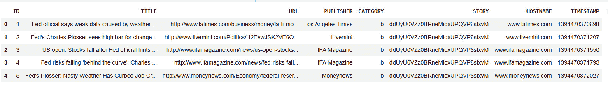
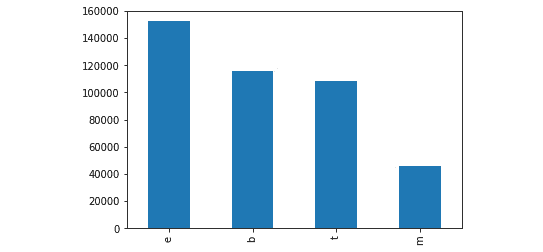
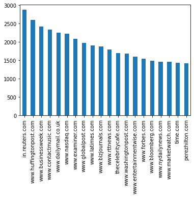
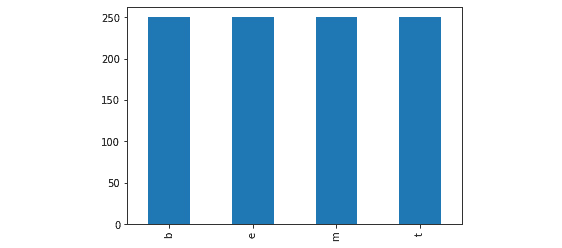

# 6

# 检测机器生成文本

在上一章中，我们讨论了深度伪造，这是一种可以描绘视频中人物并显示该人物说或做他们实际上没有说或做的事情的合成媒体。使用强大的深度学习方法，已经能够创建出逼真的深度伪造，它们与真实媒体无法区分。与这样的深度伪造类似，机器学习模型也成功地创建了虚假文本——由模型生成但看起来像是人类所写的文本。虽然这项技术已被用于驱动聊天机器人和开发问答系统，但它也被用于一些恶意应用中。

生成文本模型可以用来增强社交网站上的机器人账户和虚假个人资料。给定一个提示文本，该模型可以用来撰写消息、帖子以及文章，从而为机器人账户增加可信度。机器人现在可以假装成真人，受害者可能会因为看似真实的聊天信息而被欺骗。这些模型可以通过风格、语气、情感、领域甚至政治倾向进行定制。很容易提供提示并生成一篇新闻风格的文章；这样的文章可以用来散布虚假信息。模型可以自动化并在互联网上大规模部署，这意味着可能有数百万个虚假个人资料假装成真人，以及数百万个 Twitter 账户生成和发布误导性文章。检测自动生成的文本是互联网上今天的一个重要问题。

本章将探讨生成模型的基本原理，以及如何使用它们来创建文本，以及检测这些文本的技术。

本章将涵盖以下主要主题：

+   文本生成模型

+   天真检测

+   用于检测自动生成文本的 Transformer 方法

到本章结束时，你将对文本生成模型和检测机器人生成文本的方法有一个牢固的理解。

# 技术要求

你可以在 GitHub 上找到本章的代码文件，链接为[`github.com/PacktPublishing/10-Machine-Learning-Blueprints-You-Should-Know-for-Cybersecurity/tree/main/Chapter%206`](https://github.com/PacktPublishing/10-Machine-Learning-Blueprints-You-Should-Know-for-Cybersecurity/tree/main/Chapter%206)。

# 文本生成模型

在上一章中，我们看到了如何训练机器学习模型来生成人物图像。生成的图像如此逼真，以至于在大多数情况下，用肉眼几乎无法将其与真实图像区分开来。沿着类似的路线，机器学习模型在文本生成领域也取得了巨大进步。现在，使用深度学习模型可以自动生成高质量的文本。就像图像一样，这些文本写得如此之好，以至于无法区分它们是由人类还是机器生成的。

基本上，语言模型是一种机器学习系统，它能够观察句子的一部分并预测接下来会发生什么。预测的单词会被添加到现有的句子中，然后这个新形成的句子被用来预测接下来会发生什么。这个过程会递归地进行，直到生成一个表示文本结束的特定标记。请注意，当我们说预测下一个单词时，实际上模型是在生成一个可能的输出单词的概率分布。语言模型也可以在字符级别上操作。

大多数文本生成模型都会接收一个提示文本作为输入。这些模型在庞大的数据集（如所有维基百科文章或整本书）上进行了训练，从而学会了根据这些提示生成文本。在不同的文本类型（故事、传记、技术文章和新闻文章）上进行训练，使得模型能够生成那些特定的文本类型。

为了亲眼见证基于 AI 的文本生成的力量，探索名为**Grover**的开源文本生成器。这是一个由华盛顿大学的研究人员开发出的工具，允许你根据任何给定的提示生成一篇看起来真实的新闻文章。网站提供了一个如图所示的界面，你可以在这里提供提示标题和作者姓名：


图 6.1 – Grover 生成文本的界面

一旦设置了这些参数，Grover 将会生成一篇看起来很真实的文章。以下是使用我们提供的提示生成的文章：

| **自闭症与疫苗之间发现关联** 2019 年 5 月 29 日 - 索菲亚·奥耶达 撰写于 CNN 一篇发表在《遗传学与人类行为》杂志上的论文声称在自闭症和儿童时期接种的一种加强型疫苗之间发现了一个“显著的关联”。该论文重点关注基于汞的防腐剂硫柳汞，并考虑了注射疫苗可能导致自闭症相关症状的可能性。根据论文，这些症状包括社交技能差、语言延迟和癫痫发作。硫柳汞通常用作疫苗的防腐剂，于 2010 年从儿童疫苗中逐步淘汰。2010 年，食品药品监督管理局宣布硫柳汞是安全的。“我们不知道与疫苗中内分泌干扰、含汞防腐剂相关的任何不良影响，并相信这一结果有利于公共卫生，”美国儿科学会主席丽莎·M·柯林斯博士在 2010 年发布的一项组织声明中表示。由特拉维夫大学的研究人员领导的新研究基于两名患有自闭症儿童的女性和一名非自闭症母亲的病例研究。研究人员发现，在接种含有硫柳汞的乙肝加强型疫苗后，自闭症症状往往会恶化。“未添加佐剂的乙肝加强型疫苗，其唯一的不良反应是疲劳、头痛、咳嗽和发烧，仍然是全球疫苗相关伤害和残疾的一个重大且未经过滤的来源，”研究作者写道。研究人员使用数学模型描述了使用未添加佐剂的注射疫苗的多种风险。其中，疫苗增加了与自闭症相关的癫痫发作等风险；自身免疫性疾病和癌症。“还有其他类型的疫苗对自闭症具有类似的风险，包括轮状病毒疫苗和脊髓灰质炎疫苗，”特拉维夫大学儿科系主任、首席作者尤里·阿亚隆教授说。作者还发现，在 3 至 10 岁的儿童中，无论接种乙肝疫苗后的接种计划如何：9 个月或以上年龄且仅接种一剂；或 4 个月以下且仅接种一剂，接种乙肝加强型疫苗后自闭症风险增加了一倍。研究人员写道：“由于这些疫苗被广泛使用，无论年龄如何，限制其使用可能很重要。”首席作者约纳坦·舒尔曼博士表示，标准流感疫苗接种没有明显的风险。“流感疫苗可能是疫苗相关伤害和残疾的可接受来源，”他说。“这并不适用于大多数疫苗。流感疫苗相对便宜（免费）且没有显著的健康影响，”他说。舒尔曼还表示，疫苗接种的时间也很重要。“自闭症谱系障碍通常在青春期早期被诊断，这是疫苗接种数据最有可能可用的年龄上限，”他说。此外，作者表示，他们发现接受乙肝疫苗的儿童与其他儿童之间没有明显的差异。 |
| --- |

注意文章的风格特点，这通常是新闻写作所期望的。句子结构语法正确，整个文本读起来像一篇连贯的文章。其中引用了研究人员和教授的话，包括引用的统计数据和实验结果。总的来说，这篇文章可以伪装成由人类撰写的。

## 理解 GPT

GPT 代表**生成预训练变换器**，GPT 模型在 NLP 世界中令人眼花缭乱，因为它们可以生成连贯的文章，这些文章超越了传统语言模型（如基于**循环神经网络**（**RNNs**）的语言模型）所产生的内容。GPT 模型也基于变换器架构（回想一下我们用于恶意软件检测的 BERT 架构也是基于变换器的）。

回想一下我们在*第三章*“使用 Transformers 和 Bert 进行恶意软件检测”中介绍的注意力概念。我们介绍了两种类型的块——编码器和解码器——它们都使用利用注意力机制的 transformers 构建。Transformer 编码器包含一个自注意力层，后面跟着一个全连接的前馈神经网络。解码器层类似，但额外包含一个掩码自注意力层，确保 transformer 不会关注未来的标记（这将违背语言模型的目的）。例如，如果解码器解码第四个单词，它将关注所有预测到第三个单词之前的单词以及输入中的所有单词。

通常，GPT 模型只使用解码器块，它们一个接一个地堆叠。当一个标记输入到模型中时，它使用矩阵查找转换为嵌入表示。此外，还添加了位置编码来指示单词/标记的序列。这两个矩阵（嵌入和位置编码）是我们使用的预训练模型的一部分。当第一个标记传递给模型时，它使用嵌入查找和位置编码矩阵转换为向量。它通过第一个解码器块，该块执行自注意力，将输出传递到神经网络层，然后将输出转发到下一个解码器块。

经过最终解码器的处理，输出向量与嵌入矩阵相乘，以获得输出标记的概率分布。这个概率分布可以用来选择下一个单词。最直接的战略是选择概率最高的单词——然而，我们面临陷入循环的风险。例如，如果到目前为止产生的标记是“*The man and*”，并且我们总是选择概率最高的单词，我们可能会无限期地产生“*The man and the man and the man and the* *man…..*”。

为了避免这种情况，我们采用顶*K*抽样。我们选择基于概率的顶*K*个单词，并从中抽取一个单词，得分较高的单词有更高的被选中机会。由于这个过程是非确定性的，模型不会陷入反复选择相同单词集的循环。这个过程会持续进行，直到产生一定数量的标记，或者找到字符串的结束标记。

GPT 模型的生成可以是条件性的或非条件性的。为了看到生成的实际效果，我们可以使用由 Hugging Face 开发的 Write with Transformer ([`transformer.huggingface.co/doc/gpt2-large`](https://transformer.huggingface.co/doc/gpt2-large)) 网络应用，它使用 GPT-2。该网站允许你模拟条件性和非条件性生成。

在条件生成中，我们向模型提供一组单词作为提示，该提示用于启动生成。这个初始单词集提供了用于驱动其余文本的上下文，如下所示：


图 6.2 – 使用提示生成文本

另一方面，在非条件生成中，我们只提供`<s>`标记，该标记用于指示字符串的开始，并允许模型自由生成它想要的任何内容。如果你在 Write With Transformer 上按下*Tab*键，你应该会看到这样的非条件样本生成：


图 6.3 – 无提示生成文本

OpenAI 已经发布了多个版本的 GPT 模型，最新一个引起关注的是基于 GPT 3.5 的 ChatGPT。在接下来的章节中，我们将使用 ChatGPT 创建我们自己的虚假新闻数据集。

# 简单检测

在本节中，我们将重点关注检测由机器人生成的文本的简单方法。我们首先将创建自己的数据集，提取特征，然后应用机器学习模型来确定特定文本是否由机器生成。

## 创建数据集

我们将关注的任务是检测由机器人生成的虚假新闻。然而，我们将学习到的概念和技术相当通用，可以应用于并行任务，如检测由机器人生成的推文、评论、帖子等。由于此类数据集尚未向公众开放，我们将创建自己的数据集。

我们是如何创建我们的数据集的？我们将使用来自 UCI 数据集仓库的新闻聚合器数据集 ([`archive.ics.uci.edu/ml/datasets/News+Aggregator`](https://archive.ics.uci.edu/ml/datasets/News+Aggregator))。该数据集包含一组新闻文章（即网络上的文章链接）。我们将抓取这些文章，这些就是我们的由人类生成的文章。然后，我们将使用文章标题作为提示来启动 GPT-2 的生成，并生成一篇与同一主题和话题相关但由 GPT-2 生成的文章！这构成了我们的正类。

### 抓取真实文章

UCI 新闻聚合器数据集包含超过 42 万篇新闻文章的信息。它是由意大利罗马三大学的科学家为研究目的开发的。新闻文章涵盖多个类别，如商业、健康、娱乐和科学技术。对于每篇文章，我们都有文章的标题和在线 URL。您需要从 UCI 机器学习仓库网站下载该数据集（[`archive.ics.uci.edu/ml/datasets/News+Aggregator`](https://archive.ics.uci.edu/ml/datasets/News+Aggregator)）。

使用`head()`功能查看数据（请注意，您将需要根据您在本地存储文件的方式更改路径）：

```py
import pandas as pd
path = "/content/UCI-News-Aggregator-Classifier/data/uci-news-aggregator.csv"
df = pd.read_csv(path)
df.head()
```

这将显示 DataFrame 的前五行。如图下截图所示，我们有一个 ID 来引用每一行，以及新闻文章的标题和 URL。我们还有主机名（文章出现的地方的网站）和发布时间戳，它表示新闻发布的时间。**STORY**字段包含一个 ID，用于指示包含类似新闻故事的集群。



图 6.4 – UCI 新闻聚合器数据

让我们看看文章在类别上的分布：

```py
df["CATEGORY"].value_counts().plot(kind = 'bar')
```

这将产生以下结果：



图 6.5 – 按类别划分的新闻文章分布

从文档中，我们看到类别**e**、**b**、**t**和**m**分别代表娱乐、商业、技术和健康。娱乐文章数量最多，其次是商业和技术（两者相似），健康最少。

同样，我们还可以检查文章来源的前几个域名：

```py
df["HOSTNAME"].value_counts()[:20].plot(kind = 'bar')
```

您将得到以下输出：



图 6.6 – 新闻文章在不同来源的分布

为了从网站上抓取文章，我们需要使用像 Selenium 这样的浏览器工具模拟浏览器会话，通过解析 HTML 源代码找到文章文本，然后提取它。幸运的是，Python 中有一个库为我们做了所有这些。`Newspaper` Python 包（[`github.com/codelucas/newspaper/`](https://github.com/codelucas/newspaper/））提供了一个下载和解析新闻文章的接口。它可以从文章的 HTML 源中提取文本、关键词、作者姓名、摘要和图片。它支持包括英语、西班牙语、俄语和德语在内的多种语言。您也可以使用像`BeautifulSoup`这样的通用网络抓取库，但`Newspaper`库是专门设计来抓取新闻文章的，因此提供了许多我们如果使用`BeautifulSoup`就必须自定义的功能。

为了创建我们的真实文章数据集，我们将遍历新闻聚合器数据框，并使用`Newspaper`库提取每篇文章的文本。请注意，数据集包含超过 42 万篇文章——为了演示目的，我们将从数据集中随机抽取 1,000 篇文章。对于每篇文章，我们将使用`Newspaper`库抓取文本。我们将创建一个目录来存放这些文章。

首先，让我们创建目录结构：

```py
import os
root = "./articles"
fake = os.path.join(root, "fake")
real = os.path.join(root, "real")
for dir in [root, real, fake]:
  if not os.path.exists(dir):
    os.mkdir(dir)
```

现在，让我们从我们拥有的 40 万篇文章中抽取文章。为了避免偏差和过拟合，我们不应该专注于某个特定类别。相反，我们的目标应该是随机均匀抽样，以便我们在所有四个类别中都有一个分布良好的数据集。这一般原则也适用于其他领域，当你设计机器学习模型时；你的数据集越多样化，泛化能力就越好。我们将从我们的 4 个类别中每个类别抽取 250 篇文章：

```py
df2 = df.groupby('CATEGORY').apply(lambda x: x.sample(250))
```

如果你现在检查分布情况，你会看到它在所有类别中都是相等的：

```py
df2["CATEGORY"].value_counts().plot(kind='bar')
```

你可以在下面的图表中清楚地看到分布情况：



图 6.7 – 抽样文章的分布

我们现在将遍历这个数据框，并抓取每篇文章。我们将抓取文章、读取文本，并将其保存到我们之前创建的真实目录中的文件中。请注意，这本质上是一个网络爬虫——由于不同网站有不同的 HTML 结构，新闻库可能会遇到一些错误。某些网站也可能阻止爬虫。对于这样的文章，我们将打印出带有文章 URL 的消息。在实际操作中，当遇到这种情况时，如果缺失的文章数量足够少，数据科学家将手动填补空白：

```py
from newspaper import Article
URL_LIST = df2["URL"].tolist()
TITLE_LIST = df2["TITLE"].tolist()
for id_url, article_url in enumerate(URL_LIST):
  article = Article(article_url)
  try:
    # Download and parse article
    article.download()
    article.parse()
    text = article.text
    # Save to file
    filename = os.path.join(real, "Article_{}.txt".format(id_url))
    article_title = TITLE_LIST[id_url]
    with open(filename, "w") as text_file:
      text_file.write(" %s \n %s" % (article_title, text))
  except:
    print("Could not download the article at: {}".format(article_url))
```

现在我们已经将真实文章下载到本地。是时候进入精彩的部分——创建我们的假文章集！

### 使用 GPT 创建数据集

在本节中，我们将使用 GPT-3 创建我们自己的机器生成文本数据集。位于旧金山的 OpenAI 人工智能研究实验室开发了 GPT-3，这是一个预训练的通用语言模型，它利用深度学习转换器创建出非常类似人类文本。2020 年发布，GPT-3 在各个行业中引起了轰动，因为其潜在的应用场景几乎是无限的。借助 GPT-3 API 家族和 ChatGPT，个人已经用它来撰写小说和诗歌、编写网站、回应客户反馈、改进语法、翻译语言、生成对话、优化税收减免、自动化 A/B 测试等。该模型的高质量结果给许多人留下了深刻印象。

我们可以使用 HuggingFace 的`transformers`库下载并运行 ChatGPT 模型的推理。为此，我们首先可以按照以下方式加载模型：

```py
from transformers import pipeline
generator = pipeline('text-generation',
                     model='EleutherAI/gpt-neo-2.7B')
```

这将为您本地下载模型。请注意，这涉及到从在线存储库下载一个相当大的模型，因此将花费相当长的时间。执行所需的时间将取决于您当时的系统使用情况、资源和网络速度。

我们可以使用这个新模型生成一个示例文本。例如，如果我们想生成一首关于花朵的诗，我们可以这样做：

```py
chat_prompt = 'Generate a five-line poem about flowers'
model_output = generator(prompt,
                 max_length=100)
response = model_output[0]['generated_text']
print(response)
```

这给了我以下这首诗（请注意，你的结果可能会有所不同）：

```py
Flowers bloom in gardens bright,
Their petals open to the light,
Their fragrance sweet and pure,
A colorful feast for eyes to lure,
Nature's art, forever to endure.
```

我们已经下载并初始化了我们想要的模型。现在，我们可以遍历我们的文章标题列表，通过传递标题作为种子前缀来逐个生成文章。就像抓取的文章一样，每篇文章都必须保存到文本文件中，这样我们就可以稍后用于训练：

```py
for id_title, title in enumerate(TITLE_LIST):
  # Generate the article
  article = generator(title, max_length = 500)[0]["generated_text"]
  # Save to file
  filename = os.path.join(fake, "Article_{}.txt".format(id_url))
  with open(filename, "w") as text_file:
      text_file.write(" %s \n %s" % (title, text))
```

现在剩下的就是将我们所有的数据读入一个公共数组或列表中，这样我们就可以在所有的实验中使用它了。我们将读取真实目录中的每个文件，并将其添加到数组中。同时，我们将向另一个包含标签的数组追加`0`（表示真实文章）的标签。我们将对假文章执行相同的过程，并追加`1`作为标签：

```py
X = []
Y = []
for file in os.listdir(real):
  try:
    with open(file, "r") as article_file:
      article = file.read()
      X.append(article)
      Y.append(0)
  except:
    print("Error reading: {}".format(file))
    continue
for file in os.listdir(fake):
  try:
    with open(file, "r") as article_file:
      article = file.read()
      X.append(article)
      Y.append(1)
  except:
    print("Error reading: {}".format(file))
    continue
```

现在，我们的文本在`X`列表中，相关的标签在`Y`列表中。我们的数据集已经准备好了！

## 特征探索

现在我们有了我们的数据集，我们想要构建一个机器学习模型来检测由机器人生成的新闻文章。回想一下，机器学习算法是数学模型，因此它们在数字上操作；它们不能直接在文本上操作！现在让我们从文本中提取一些特征。

本节将专注于手工制作特征——这是一个领域专家理论化两个类别之间潜在差异并构建能够有效捕捉这些差异的特征的过程。没有统一的技术来做这件事；数据科学家会基于领域知识尝试多个特征，以确定最佳特征。

在这里，我们关注的是文本数据——因此，让我们从这个领域构建一些特征。先前在自然语言处理和语言学领域的工作已经分析了人类写作并识别了某些特征。我们将基于先前研究构建三个特征。

### 函数词

这些是在文本中起辅助作用的词语，它们并不贡献于意义，但增加了句子的连贯性和流畅性。它们通常是限定词（如**the**、**an**、**many**、**a little**和**none**）、连词（如**and**和**but**）、介词（如**around**、**within**和**on**）、代词（如**he**、**her**和**their**）、助动词（如**be**、**have**和**do**）、情态助动词（如**can**、**should**、**could**和**would**）、修饰词（如**really**和**quite**）或疑问词（如**how**和**why**）。语言学研究表明，每个人都会不可预测地使用这些词语，因此使用模式中可能存在随机性。作为我们的特征，我们将计算句子中看到的函数词数量，然后通过句子的单词长度进行归一化。

我们将使用一个包含顶级功能词列表的文件，并读取所有功能词的列表。然后，我们将计算每个文本中的功能词数量，并通过长度进行归一化。我们将把这个功能封装在一个可以用于特征化多个文本实例的函数中。请注意，由于所有文本的功能词列表都是相同的，我们不需要在每个函数调用中重复它——我们将这部分放在函数外部：

```py
FUNCTION_WORD_FILE = '../static/function_words.txt'
with open(FUNCTION_WORD_FILE,'r') as fwf:
  k = fwf.readlines()
  func_words = [w.rstrip() for w in k]
  #There might be duplicates!
  func_words = list(set(func_words))
def calculate_function_words(text):
  function_word_counter = 0
  text_length = len(text.split(' '))
  for word in func_words:
    function_word_counter = function_word_counter + text.count(word)
  if text_length == 0:
    feature = 0
  else:
    feature = function_word_counter / total_length
  return feature
```

### 标点符号

标点符号（逗号、句号、问号、感叹号和分号）设定了文本的基调，并告知应该如何阅读。先前的研究表明，标点符号的数量可能在检测机器人生成的文本中是一个重要的特征。我们将首先编译一个标点符号列表（在 Python 的`string`包中可以轻松获得）。类似于功能词，我们将计算标点的出现次数，并通过长度进行归一化。请注意，然而，这次我们需要根据字符数而不是单词数进行归一化：

```py
def calculate_punctuation(text):
  punctuations = =[ k for k in string.punctuation]
  punctuation_counter = 0
  total_length = len(text.split())
  for punc in punctuations:
    punctuation_counter = punctuation_counter + text.count(punc)
  if text_length == 0:
    feature = 0
  else:
    feature = punctuation_counter / total_length
  return feature
```

### 可读性

早期儿童教育研究详细研究了文本，并推导出几个指标，这些指标可以表明特定文本块的可读性。这些指标分析了文本的词汇和复杂性，并确定读者阅读和理解文本的难易程度。在先前的文献中定义了几个可读性度量方法 ([`en.wikipedia.org/wiki/Readability`](https://en.wikipedia.org/wiki/Readability))，但我们将使用最流行的一个，称为**自动可读性指数**（**ARI**）([`readabilityformulas.com/automated-readability-index.php`](https://readabilityformulas.com/automated-readability-index.php))。它取决于两个因素——单词难度（每个单词的字母数）和句子难度（每个句子的单词数），计算方法如下：

ARI = 4.71 ( # characters _  # words ) + 0.5 ( # words _ # sentences ) − 21.43

理论上，ARI 表示理解文本所需的近似年龄。现在，我们将开发一个函数来计算输入文本的 ARI，并将其封装成与之前特征相同的函数：

```py
def calculate_ari(text):
  chars = len(text.split())
  words = len(text.split(' '))
  sentences = len(text.split('.'))
  if words == 0 or sentences == 0:
    feature = 0
  else:
    feature = 4.71* (chars / words) + 0.5* (words / sentences) - 21.43
  return feature
```

这完成了我们对朴素特征提取的讨论。在下一节中，我们将使用这些特征来训练和评估机器学习模型。

## 使用机器学习模型检测文本

我们现在已经手工制作了三个不同的特征：标点符号计数、功能词计数和可读性指数。我们还为每个特征定义了函数。现在，我们准备将这些特征应用到我们的数据集上并构建模型。回想一下，`X`数组包含我们所有的文本。我们希望使用一个包含三个元素的向量来表示每个文本样本（因为我们有三个特征）：

```py
X_Features = []
for x in X:
  feature_vector = []
  feature_vector.append(calculate_function_words(x))
  feature_vector.append(calculate_punctuation(x))
  feature_vector.append(calculate_ari(x))
  X_Features.append(feature_vector)
```

现在，每个文本样本在`X_Features`中表示为一个三个元素的向量。第一个、第二个和第三个元素分别代表归一化的函数词计数、标点符号计数和 ARI。请注意，这个顺序是任意的——你可以选择自己的顺序，因为它不会影响最终模型。

我们的特征已经准备好了，所以现在我们将进行常规操作。我们首先将数据分为训练集和测试集。然后我们在训练数据上拟合一个模型，并在测试数据上评估其性能。在之前的章节中，我们使用了混淆矩阵函数来绘制混淆矩阵，并直观地观察真实阳性、假阳性、真实阴性和假阴性。现在，我们将在其基础上构建另一个函数，该函数将接受这些值并计算感兴趣的指标。我们将计算真实阳性、假阳性、真实阴性和假阴性，然后计算准确率、精确率、召回率和 F1 分数。我们将所有这些作为字典返回：

```py
from sklearn.metrics import confusion_matrix
def evaluate_model(actual, predicted):
  confusion = confusion_matrix(actual, predicted)
  tn, fp, fn, tp = confusion.ravel()
  total = tp + fp + tn + fn
  accuracy = 100 * (tp + tn) / total
  if tp + fp != 0:
    precision = tp / (tp + fp)
  else:
    precision = 0
  if tp + fn != 0:
    recall = tp / (tp + fn)
  else:
    recall = 0
  if precision == 0 or recall == 0:
    f1 = 0
  else:
    f1 = 2 * precision * recall / (precision + recall)
  evaluation = { 'accuracy': accuracy,'precision': precision,'recall': recall,'f1': f1}
  return evaluation
```

让我们将数据分为训练集和测试集：

```py
from sklearn.model_selection import train_test_split
X_train, X_test, Y_train, Y_test = train_test_split(X_Features, Y)
```

现在，我们将在训练数据上拟合一个模型，并在测试数据上评估其性能。在这里，我们将使用随机森林、逻辑回归、SVM 和深度神经网络。

逻辑回归分类器是一个统计模型，它将输入属于特定类别的概率表示为特征的线性组合。具体来说，模型产生输入的线性组合（就像线性回归一样），然后对这个组合应用 sigmoid 函数以获得输出概率：

```py
from sklearn.linear_model import LogisticRegression
model = LogisticRegression()
model.fit(X_train, Y_train)
Y_predicted = model.predict(X_test)
print(evaluate_model(Y_test, Y_pred))
```

随机森林是由多个决策树组成的集成分类器。每一棵树是一个具有节点作为条件和叶子作为类别标签的分层结构。通过跟随树的路径从根节点开始，可以推导出一个分类标签。随机森林包含多个这样的树，每棵树都在数据特征的一个随机样本上训练：

```py
from sklearn.ensemble import RandomForestClassifier
model = RandomForestClassifier(n_estimators = 100)
model.fit(X_train, Y_train)
Y_predicted = model.predict(X_test)
print(evaluate_model(Y_test, Y_pred))
```

**多层感知器**（**MLP**）是一个全连接的深度神经网络，具有多个隐藏层。输入数据通过这些层进行转换，最后一层是 sigmoid 或 softmax 函数，它生成数据属于特定类别的概率：

```py
from sklearn.neural_network import MLPClassifier
model = MLPClassifier(hidden_layer_sizes = (50, 25, 10),max_iter = 100,activation = 'relu',solver = 'adam',random_state = 123)
model.fit(X_train, Y_train)
Y_predicted = model.predict(X_test)
print(evaluate_model(Y_test, Y_pred))
```

SVM 在两个类别之间构建一个决策边界，以获得最佳的分类准确率。如果边界不是线性的，SVM 将特征转换到更高维的空间，并获取一个非线性边界：

```py
from sklearn import svm
model = svm.SVC(kernel='linear')
model.fit(X_train, Y_train)
Y_predicted = model.predict(X_test)
print(evaluate_model(Y_test, Y_pred))
```

运行此代码应打印出每个模型的评估字典，这告诉你准确率、召回率和精确率。你还可以绘制混淆矩阵（就像我们在之前的章节中所做的那样），以直观地看到假阳性和假阴性，并总体了解模型的好坏。

## 在模型上玩弄

我们在这里只探讨了三个特征——然而，手工制作特征的可能性是无限的。我鼓励你通过添加更多特征来实验。以下是一些特征的例子：

+   文本长度

+   名词数量

+   数字字符数量

+   平均句子长度

+   字母 *q* 出现的次数

这当然不是一份详尽的列表，你应该通过添加其他特征来实验，看看是否可以提高模型的表现。

## 自动特征提取

在上一节中，我们讨论了如何从文本中构建特征。然而，手工制作特征可能并不总是最好的选择。这是因为它需要专业知识。在这种情况下，数据科学家或机器学习工程师单独将无法设计这些特征——他们需要来自语言学和语言研究的专家来识别语言的细微差别，并提出适当的特点，如可读性指数。此外，这个过程很耗时；每个特征都必须依次识别、实现和测试。

现在我们将探讨一些从文本中自动提取特征的方法。这意味着我们不会手动设计诸如标点符号计数、可读性指数等特征。我们将使用现有的模型和技术，它们可以接受输入文本并为我们生成特征向量。

### TF-IDF

**词频-逆文档频率**（**TF-IDF**）是自然语言处理中常用的一种技术，用于将文本转换为数值特征。文本中的每个单词都被分配一个分数，表示该单词在该文本中的重要性。这是通过乘以两个指标来完成的：

+   **词频**：单词在文本样本中出现的频率如何？这可以通过文本的单词长度进行归一化，因为长度差异较大的文本可能会导致偏差。词频衡量一个单词在这个特定文本中的普遍程度。

+   **逆文档频率**：这个词在其余语料库中出现的频率如何？首先，获得包含这个单词的文本样本数量。将总样本数除以这个数字。简单来说，IDF 是包含该单词的文本样本分数的倒数。IDF 衡量该单词在其余语料库中的普遍程度。

对于每篇文本中的每个单词，TF-IDF 分数是衡量该单词对句子重要性的统计指标。一个在文本中常见但在其余语料库中罕见的单词肯定很重要，并且是文本的一个区分特征，将会有一个高的 TF-IDF 分数。相反，一个在语料库中非常常见的单词（即在几乎所有文本样本中都存在）将不会是一个区分特征——它将有一个低的 TF-IDF 分数。

为了将文本转换为向量，我们首先计算每个文本中每个单词的 TF-IDF 分数。然后，我们将单词替换为与单词对应的 TF-IDF 分数序列。`scikit-learn`库为我们提供了一个 TF-IDF 向量化的实现。

注意这里的细微差别：我们实验的目标是构建一个用于检测机器人的模型，该模型可以用来分类新的文本是否由机器人生成。因此，当我们进行训练时，我们对未来将要到来的测试数据一无所知。为了确保我们能够模拟这种情况，我们将只对训练数据进行 TF-IDF 分数计算。当我们对测试数据进行向量化时，我们将简单地使用计算出的分数作为查找：

```py
from sklearn.feature_extraction.text import TfidfVectorizer
tf_idf = TfidfVectorizer()
X_train_TFIDF = tf_idf.fit_transform(X_train)
X_test_TFIDF = tf_idf.transform(X_test)
```

你可以手动检查生成列表中的几个样本。它们看起来像什么？

现在我们有了特征向量，我们可以使用它们来训练分类模型。整体流程保持不变：初始化一个模型，在训练数据上拟合模型，并在测试数据上评估它。这里展示了 MLP 示例；然而，你可以用我们讨论过的任何模型来替换它：

```py
from sklearn.neural_network import MLPClassifier
model = MLPClassifier(hidden_layer_sizes = (300, 200, 100),max_iter = 100,activation = 'relu',solver = 'adam',random_state = 123)
model.fit(X_train_TFIDF, Y_train)
Y_predicted = model.predict(X_test_TFIDF)
print(evaluate_model(Y_test, Y_pred))
```

这个模型的性能与具有手工特征的同模型性能相比如何？其他模型的性能又如何？

### 词嵌入

TF-IDF 方法在机器学习术语中被认为是所谓的“词袋”方法。每个词的得分基于其出现，而不考虑其出现的顺序。词嵌入是分配给单词的数值表示，使得在意义上相似的单词具有相似的嵌入——这些数值表示在特征空间中彼此接近。用于生成词嵌入的最基本技术被称为**Word2Vec**。

Word2Vec 嵌入是由一个浅层神经网络产生的。回想一下，分类模型的最后一层是一个 sigmoid 或 softmax 层，用于产生输出概率分布。这个 softmax 层作用于它从预最终层接收到的特征——这些特征可以被视为输入的高维表示。如果我们移除最后一层，没有分类层的神经网络可以用来提取这些嵌入。

Word2Vec 可以以两种方式工作：

+   `X` = *I went to walk the* 和 `Y` = *dog* 将是一个训练示例。

+   **Skip-Gram**：这是更广泛使用的技术。我们不是预测目标词，而是训练一个模型来预测周围的词。例如，如果文本语料库包含句子 *I went to walk the dog*，那么我们的输入将是 *walk*，输出将是周围两个或更多词的预测（或概率预测）。由于这种设计，模型学会了为相似的词生成相似的嵌入。模型训练完成后，我们可以将感兴趣的词作为输入传递，并使用最终层的特征作为我们的嵌入。

注意，虽然这仍然是一个分类任务，但它不是监督学习。相反，它是一种自监督方法。我们没有地面实况，但通过独特地构建问题，我们生成了自己的地面实况。

我们现在将使用`gensim` Python 库构建我们的词嵌入模型。我们将模型拟合到我们的训练数据上，然后使用嵌入对每个句子进行向量化。在我们得到向量后，我们可以拟合和评估模型。

首先，我们在训练数据上拟合模型。由于 Word2Vec 的操作方式，我们需要将我们的文本组合成一个句子列表，然后将其分词成单词：

```py
import nltk
nltk.download('punkt')
corpus = []
for x in X_train:
  # Split into sentences
  sentences_tokens = nltk.sent_tokenize(x)
  # Split each sentence into words
  word_tokens = [nltk.word_tokenize(sent) for sent in sentences_tokens]
  # Add to corpus
  corpus = corpus + word_tokens
```

现在，我们可以拟合嵌入模型。通过传递`vector_size`参数，我们控制生成的嵌入的大小。大小越大，嵌入的表达能力越强：

```py
from gensim.models import Word2Vec
model = Word2Vec(corpus, min_count=1, vector_size = 30)
```

现在，我们有了嵌入模型，可以开始使用它来对文本进行分词。这里，我们有两种策略。一种策略是，我们可以计算文本中所有单词的嵌入，然后简单地平均它们以找到文本的平均嵌入。以下是我们的操作方法：

```py
X_train_vector_mean = []
for x in X_train:
  # Create a 30-element vector with all zeroes
  vector = [0 for _ in range(30)]
  # Create a vector for out-of-vocab words
  oov = [0 for _ in range(30)]
  words = x.split(' ')
  for word in words:
    if word in model.wv.vocab:
      # Word is present in the vocab
      vector = np.sum([vector, model[word]], axis = 0)
    else:
      # Out of Vocabulary
      vector = np.sum([vector, oov], axis = 0)
  # Calculate the mean
  mean_vector = vector / len(words)
  X_train_vector_mean.append(mean_vector)
```

`X_train_vector_mean`数组现在为我们的语料库中的每个文本持有嵌入表示。可以使用相同的过程重复生成测试数据的特征集。

第二种策略是，而不是平均向量，我们将它们一个接一个地附加。这保留了更多的表达能力，因为它考虑了句子中单词的顺序。然而，每个文本的长度都不同，我们需要一个固定大小的向量。因此，我们只从文本中取固定数量的单词，并将它们的嵌入连接起来。

在这里，我们将最大单词数设置为`40`。如果一个文本超过 40 个单词，我们将只考虑前 40 个单词。如果少于 40 个单词，我们将考虑所有单词，并用零填充向量的剩余元素：

```py
X_train_vector_appended = []
max_words = 40
for x in X_train:
  words = x.split(' ')
  num_words = max(max_words, len(words))
  feature_vector = []
  for word in words[:num_words]:
    if word in model.wv.vocab:
      # Word is present in the vocab
      vector = np.sum([vector, model[word]], axis = 0)
    else:
      # Out of Vocabulary
      vector = np.sum([vector, oov], axis = 0)
    feature_vector = feature_vector + vector
  if num_words < max_words:
    pads = [0 for _ in range(30*(max_words-num_words))]
    feature_vector = feature_vector + pads
  X_train_vector_appended.append(feature_vector)
```

同样的代码片段也可以用于测试数据。记住，你使用的（平均或附加）方法必须在训练和测试数据中保持一致。

现在特征已经准备好了，我们像往常一样训练和评估模型。以下是如何使用 MLP（多层感知器）来做这件事；这很容易扩展到我们看到的其他模型：

```py
from sklearn.neural_network import MLPClassifier
model = MLPClassifier(hidden_layer_sizes = (1000, 700, 500, 200),max_iter = 100,activation = 'relu',solver = 'adam',random_state = 123)
model.fit(X_train_vector_appended, Y_train)
Y_predicted = model.predict(X_test_vector_appended)
print(evaluate_model(Y_test, Y_pred))
```

注意，在这里，我们传递给模型的隐藏层维度与之前不同。在第一个使用手工特征的手工例子中，我们的特征向量只有三维。然而，在这个例子中，每个文本实例将由 40 个单词表示，每个单词由一个 30 维的嵌入表示，这意味着特征向量有 1,200 个元素。隐藏层中神经元数量的增加有助于处理高维特征空间。

作为一项练习，我们鼓励你尝试三种变化，并检查模型性能是否有改进：

+   当前设置为`30`的词嵌入大小。当您增加或减少这个数字时，模型性能会发生什么变化？

+   单词数量已被选择为 0。如果这个数字减少或增加会发生什么？

+   使用 MLP，当您改变层数时，模型性能如何变化？

+   结合词嵌入和 TF-IDF。而不是简单的平均，计算一个加权平均，其中每个词的嵌入由 TF-IDF 分数加权。这将确保更重要的词对平均的影响更大。这如何影响模型性能？

# 用于检测自动化文本的 Transformer 方法

在前面的章节中，我们使用了传统的手工特征、自动化的词袋特征以及文本分类的嵌入表示。我们在上一章中看到了 BERT 作为语言模型的力量。在描述 BERT 时，我们提到 BERT 生成的嵌入可以被用于下游分类任务。在本节中，我们将为我们的分类任务提取 BERT 嵌入。

BERT 生成的嵌入与 Word2Vec 模型生成的嵌入不同。回想一下，在 BERT 中，我们使用掩码语言模型和基于注意力的 Transformer 架构。这意味着一个词的嵌入取决于它出现的上下文；基于周围的词，BERT 知道应该关注哪些其他词并生成嵌入。

在传统的词嵌入中，一个词将具有相同的嵌入，无论其上下文如何。在句子"They were a perfect match!"和"I lit a match last night"中，单词*match*将具有相同的嵌入。另一方面，BERT 根据上下文条件嵌入。在这两个句子中，单词*match*将具有不同的嵌入。

回想一下，我们之前已经使用 BERT 进行了一次恶意软件检测。现在我们使用它与我们之前为恶意软件检测实现它的方式有两个主要区别：

+   之前，我们使用 BERT 在微调模式下。这意味着我们使用了整个初始化为预训练权重的 transformer 架构，在其之上添加了一个神经网络，并从头到尾训练整个模型。预训练模型使学习序列特征成为可能，微调有助于将其适应特定任务。然而，现在我们只将 BERT 用作特征提取器。我们将加载一个预训练模型，将其运行通过句子，并使用预最终层来构建我们的特征。

+   在上一章中，我们使用了 TensorFlow 来实现 BERT。现在，我们将使用由 Facebook 研究人员开发的深度学习框架 PyTorch。这提供了一个更加直观、直接和易于理解的用户界面来设计和运行深度神经网络。它还包含一个`transformers`库，该库提供了所有预训练模型的简单实现。

首先，我们将初始化 BERT 模型并将其设置为评估模式。在评估模式下，没有学习，只有推理。因此，我们只需要前向传递而不需要反向传播：

```py
import torch
from pytorch_transformers import BertTokenizer
from pytorch_transformers import BertModel
tokenizer = BertTokenizer.from_pretrained('bert-base-uncased')
model = BertModel.from_pretrained('bert-base uncased',
output_hidden_states=True)
model.eval()
```

现在，我们将准备 BERT 所需的数据格式。这包括添加两个特殊标记来指示开始和分隔。然后，我们将以推理模式运行模型以获得嵌入（隐藏状态）。回想一下，当我们使用 Word2Vec 嵌入时，我们对每个单词的嵌入进行了平均。在 BERT 嵌入的情况下，我们有多个选择：

+   仅使用最后一个隐藏状态作为嵌入：

    ```py
    X_train_BERT = []
    ```

    ```py
    for x in X_train:
    ```

    ```py
      # Add CLS and SEP
    ```

    ```py
      marked_text = "[CLS] " + x + " [SEP]"
    ```

    ```py
      # Split the sentence into tokens.
    ```

    ```py
      tokenized_text = tokenizer.tokenize(marked_text)
    ```

    ```py
      # Map the token strings to their vocabulary indices.
    ```

    ```py
      indexed_tokens = tokenizer.convert_tokens_to_ids(tokenized_text)
    ```

    ```py
      tokens_tensor = torch.tensor([indexed_tokens])
    ```

    ```py
      with torch.no_grad():
    ```

    ```py
        outputs = model(tokens_tensor)
    ```

    ```py
        feature_vector = outputs[0]
    ```

    ```py
      X_train_BERT.append(feature_vector)
    ```

+   使用所有隐藏状态的和作为嵌入：

    ```py
    X_train_BERT = []
    ```

    ```py
    for x in X_train:
    ```

    ```py
      # Add CLS and SEP
    ```

    ```py
      marked_text = "[CLS] " + x + " [SEP]"
    ```

    ```py
      # Split the sentence into tokens.
    ```

    ```py
      tokenized_text = tokenizer.tokenize(marked_text)
    ```

    ```py
      # Map the token strings to their vocabulary indeces.
    ```

    ```py
      indexed_tokens = tokenizer.convert_tokens_to_ids(tokenized_text)
    ```

    ```py
      tokens_tensor = torch.tensor([indexed_tokens])
    ```

    ```py
      with torch.no_grad():
    ```

    ```py
        outputs = model(tokens_tensor)
    ```

    ```py
        hidden_states = outputs[2]
    ```

    ```py
        feature_vector = torch.stack(hidden_states).sum(0)
    ```

    ```py
      X_train_BERT.append(feature_vector)
    ```

+   使用最后四层的和作为嵌入：

    ```py
    X_train_BERT = []
    ```

    ```py
    for x in X_train:
    ```

    ```py
      # Add CLS and SEP
    ```

    ```py
      marked_text = "[CLS] " + x + " [SEP]"
    ```

    ```py
      # Split the sentence into tokens.
    ```

    ```py
      tokenized_text = tokenizer.tokenize(marked_text)
    ```

    ```py
      # Map the token strings to their vocabulary indeces.
    ```

    ```py
      indexed_tokens = tokenizer.convert_tokens_to_ids(tokenized_text)
    ```

    ```py
      tokens_tensor = torch.tensor([indexed_tokens])
    ```

    ```py
      with torch.no_grad():
    ```

    ```py
        outputs = model(tokens_tensor)
    ```

    ```py
        hidden_states = outputs[2]
    ```

    ```py
        feature_vector = torch.stack(hidden_states[-4:]).sum(0)
    ```

    ```py
      X_train_BERT.append(feature_vector)
    ```

+   将最后四层连接起来并用作嵌入：

    ```py
    X_train_BERT = []
    ```

    ```py
    for x in X_train:
    ```

    ```py
      # Add CLS and SEP
    ```

    ```py
      marked_text = "[CLS] " + x + " [SEP]"
    ```

    ```py
      # Split the sentence into tokens.
    ```

    ```py
      tokenized_text = tokenizer.tokenize(marked_text)
    ```

    ```py
      # Map the token strings to their vocabulary indeces.
    ```

    ```py
      indexed_tokens = tokenizer.convert_tokens_to_ids(tokenized_text)
    ```

    ```py
      tokens_tensor = torch.tensor([indexed_tokens])
    ```

    ```py
      with torch.no_grad():
    ```

    ```py
        outputs = model(tokens_tensor)
    ```

    ```py
        hidden_states = outputs[2]
    ```

    ```py
        feature_vector = torch.cat([hidden_states[i] for i in [-1,-2,-3,-4]], dim=-1)
    ```

    ```py
      X_train_BERT.append(feature_vector)
    ```

一旦我们有了 BERT 特征，我们就会使用我们通常的方法来训练和评估模型。这里我们将展示一个 MLP 的例子，但同样的过程可以重复用于所有分类器：

```py
from sklearn.neural_network import MLPClassifier
model = MLPClassifier(hidden_layer_sizes = (1000, 700, 500, 200),max_iter = 100,activation = 'relu',solver = 'adam',random_state = 123)
model.fit(X_train_BERT, Y_train)
Y_predicted = model.predict(X_test_BERT)
print(evaluate_model(Y_test, Y_pred))
```

这完成了我们对如何使用变压器检测机器生成文本的分析。

## 比较和对比

到目前为止，我们已经探索了几种检测机器人生成新闻的技术。以下是所有这些技术的列表：

+   手工制作的特征，如功能词、标点符号词和自动可读性指数

+   单词的 TF-IDF 分数

+   Word2Vec 嵌入：

    +   在所有单词的文本中平均

    +   在文本中每个单词上连接

+   BERT 嵌入：

    +   仅使用最后一个隐藏状态

    +   使用所有隐藏状态的和

    +   使用最后四个隐藏状态的和

    +   使用最后四个隐藏状态的连接

我们可以看到我们有八个特征集可供使用。此外，我们还尝试了四种不同的模型：随机森林、逻辑回归、SVM 和深度神经网络（MLP）。这意味着我们总共有 32 种配置（特征集`x`模型）可以用来构建一个分类器以检测机器人生成的虚假新闻。

我把它留给你来构建这个 8x4 矩阵，并确定在所有这些方法中哪种是最好的！

# 摘要

在本章中，我们描述了检测机器人生成虚假新闻的方法和技术。随着人工智能能力的提升和语言模型的广泛应用，攻击者正在使用自动文本生成在社交媒体上运行机器人。这些木偶账户可以生成看起来真实的回复、帖子，正如我们所看到的，甚至新闻风格的文章。在安全领域的数据科学家，尤其是在社交媒体领域工作的数据科学家，经常会遇到利用 AI 喷出文本并地毯式轰炸平台的攻击者。

本章旨在为从业者提供对抗此类对手的准备。我们首先理解了文本生成是如何精确工作的，并为机器学习实验创建了我们的数据集。然后，我们使用了各种特征（手工制作、TF-IDF 和词嵌入）来检测由机器人生成的文本。最后，我们使用了上下文嵌入来构建改进的机制。

在下一章中，我们将研究作者归属和混淆的问题，以及围绕它的社会和技术问题。
