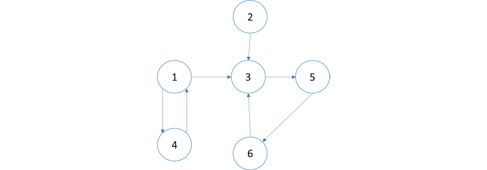
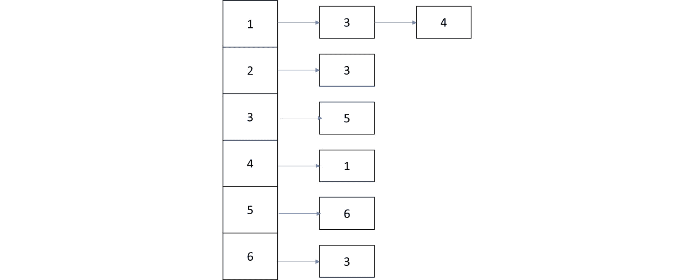
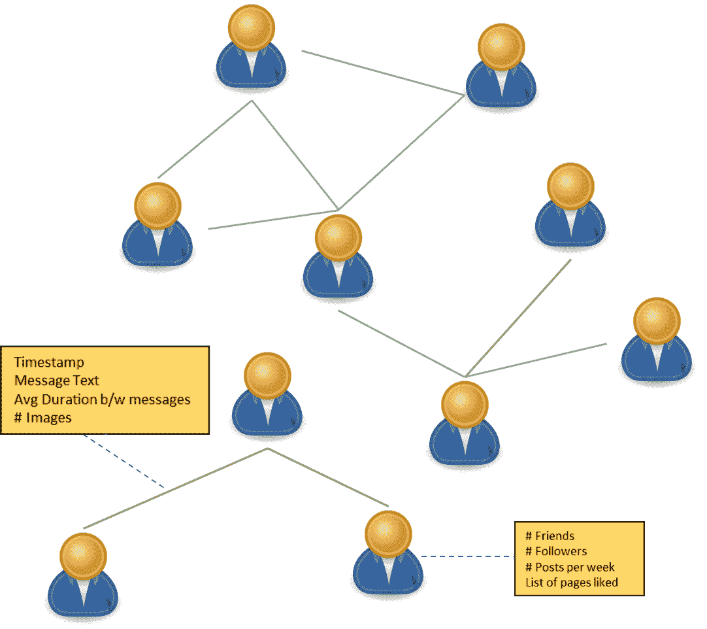
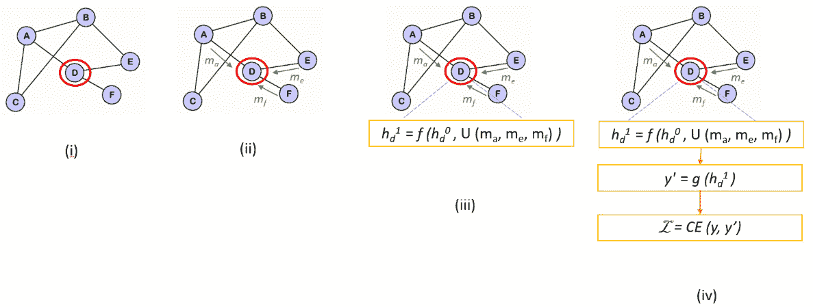
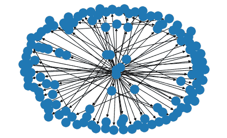
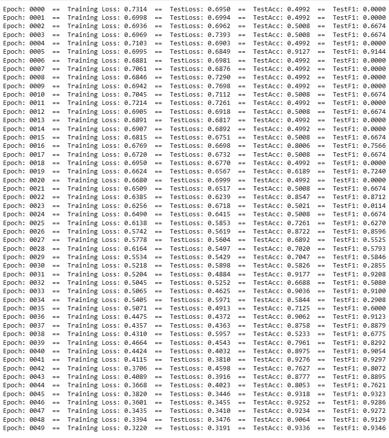
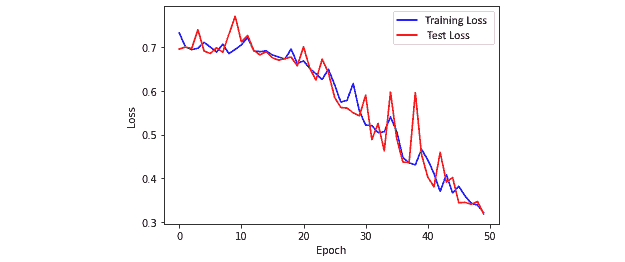

# 第八章：使用图神经网络检测假新闻

在前面的章节中，我们研究了表格数据，它由具有自己特征的独立数据点组成。在建模和运行我们的实验时，我们没有考虑数据点之间关系的任何特征。在现实世界的许多数据中，尤其是在网络安全领域的数据，可以自然地以图的形式出现，并以一组节点表示，其中一些节点通过边连接。例如，社交网络，用户、照片和帖子可以通过边连接。另一个例子是互联网，它是由相互连接的计算机组成的大型图。

传统的机器学习算法不能直接从图中学习。例如，回归、神经网络和树以及梯度下降等优化技术都是为操作欧几里得（平面）数据结构而设计的。这导致了**图神经网络**（**GNNs**）这一机器学习领域新兴研究领域的开发。这在网络安全领域得到了巨大的应用，尤其是在僵尸网络、假新闻检测和欺诈分析等领域。本章将专注于使用 GNNs 检测假新闻。我们将首先介绍图论的基础知识，然后介绍如何将图机器学习用作工具来构建安全问题。虽然我们将学习如何使用 GNN 模型来检测假新闻，但我们介绍的技术是通用的，可以应用于多个问题。

在本章中，我们将涵盖以下主要主题：

+   图的简介

+   图上的机器学习

+   使用 GNNs 检测假新闻

在本章结束时，您将了解某些数据如何被建模为图，以及如何应用图机器学习进行有效的分类。

# 技术要求

您可以在 GitHub 上找到本章的代码文件，网址为 [`github.com/PacktPublishing/10-Machine-Learning-Blueprints-You-Should-Know-for-Cybersecurity/tree/main/Chapter%208`](https://github.com/PacktPublishing/10-Machine-Learning-Blueprints-You-Should-Know-for-Cybersecurity/tree/main/Chapter%208)。

# 图的简介

首先，让我们了解什么是图以及与图相关的关键术语。

## 什么是图？

图是一种数据结构，它由一组节点通过一组边连接而成。在数学上，我们指定一个图 *G* 为 (*V, E*)，其中 *V* 代表节点或顶点，而 *E* 代表它们之间的边，如图 *8.1* 所示。1*：


图 8.1 – 一个简单的图

在前面的图中，我们有以下内容：

V = {1, 2, 3, 4, 5, 6}

E = {(1,3), (2,3), (2,5), (3,6), (4,6), (5,6)}

注意，提及节点和边的顺序并不重要。图 8.1 中所示的图是无向图，这意味着边的方向并不重要。也可以有定义边具有某些含义的有向图，这赋予了边的方向重要性。例如，表示从各个城市流向的水流的图会有有向边，因为从城市 A 流向城市 B 的水流并不意味着水从 B 流向 A。

这里展示了一个有向图的示例：


图 8.2 – 有向图的示例

这里，我们将定义图如下：

V = {1, 2, 3, 4, 5, 6, 7, 8}

E = {(1,4), (4,1), (1,3), (2,3), (3,5), (5,7), (6,2), (7,3), (8,3)}

注意，在这里，由于这是一个有向图，每个边元中节点指定的顺序很重要。我们添加了`(1,4)`和`(4,1)`。

在这个图中，边没有标记（也就是说，边没有关联的权重）。这样的图称为无权图。如果边有关联的权重，则称为加权图。边权重可以表示节点之间关系的属性，或关系的强度。例如，在高速公路运输网络中，其中节点代表城市，边权重可以表示高速公路上的距离或平均穿越所需的时间。

## 图的表示

如前所述，图可以通过顶点集和顶点之间的边来表示。在计算机或程序内部，图可以通过两种方式之一来表示 – 邻接矩阵或邻接表。

邻接矩阵是一个 *N* x *N* 矩阵，其中 *N* 是图中节点总数。矩阵中的条目表示节点之间的边关系。如果 *A* 是邻接矩阵，那么 *A*ij = 1 如果节点 *i* 和 *j* 之间存在边。如果图是无向的，那么我们就有 *A*ij = *A*ji；如果图是有向的，那么 *A*ij = 1 表示从节点 *i* 到节点 *j* 有边。

考虑以下有向图：



图 8.3 – 一个示例有向图

对于这个有向图，邻接矩阵的定义如下：

| 0 | 0 | 1 | 1 | 0 | 0 |
| --- | --- | --- | --- | --- | --- |
| 0 | 0 | 1 | 0 | 0 | 0 |
| 0 | 0 | 0 | 0 | 1 | 0 |
| 1 | 0 | 0 | 0 | 0 | 0 |
| 0 | 0 | 0 | 0 | 0 | 1 |
| 0 | 0 | 0 | 0 | 0 | 0 |

表 8.1 – 对应图 8.3 的邻接矩阵

或者，如果图是加权的，那么邻接矩阵中的条目可以修改以表示权重。

虽然邻接矩阵可解释且易于理解，但它们在计算上非常昂贵。随着图中节点数量的增加，邻接矩阵的大小也会增加。从技术角度讲，空间复杂度是 *O(N²)*，其中 *N* 是节点的数量。较大的邻接矩阵难以存储，并且需要大量的处理开销。

表示图的另一种方法是邻接表。在这种表示形式中，图被存储为字典或哈希表。键代表节点，值是键节点相连的节点列表。节点列表在内存中以链表的形式表示。对于 *图 8.3* 中的图，邻接表表示如下：



图 8.4 – 图 8.3 中所示图的邻接表表示

在这里，我们可以清楚地看到给定节点与之相连的节点。即使节点数量很大且边稀疏，邻接表仍然是一种有效的表示。

## 现实世界中的图

几乎所有科学领域的真实世界数据都可以自然地使用图表示网络。在化学和医学科学中，药物可以表示为分子网络，而这些分子本身又是原子网络。在信息系统和互联网中，可以构建一个图来表示机器及其之间的连接。在工程领域，可以构建一个图来表示城市、国家和它们内部的交通网络。

图为我们提供了数据的汇总和丰富的视图。而传统上，每个数据点都会独立检查，现在图允许我们检查各个数据点之间的关系。关系和邻域包含有价值的信息，这些信息可以在推荐、聚类、欺诈检测和其他分析任务中发挥作用。

图迅速成为网络安全领域的重要分析工具。与其他领域类似，几个安全应用可以表示为图，如下所示：

+   社交媒体网络可以表示为图，其中用户作为节点。节点之间的边标识友谊和家庭关系。

+   网络流量可以建模为图，节点为 IP 地址，边为通信消息。

+   领域、URL 或网站可以表示为图，其中边表示两个网站或领域之间的链接存在。

+   恶意软件文件可以表示为图，其中节点是函数，边表示它们之间的调用。

节点代表感兴趣的实体，边代表它们之间的关系。并非所有节点都必须属于同一类别 – 例如，社交网络图可以同时包含帖子和用户作为节点。同样，边也可以存在异质性。一种类型的边可以连接朋友用户，而另一种类型的边可以连接至少有 10 个共同朋友的用户。第三种类型的边可以连接在相同帖子上发表评论的用户。

图中的每个节点都可以有与之关联的特征。这些特征代表了节点所代表的实体的特性。与用户关联的特征可以是他们的年龄、账户年龄、朋友数量、分享的帖子数量等。同样，边也可以有特征。例如，如果边代表两个用户是朋友，那么边的特征可以是共同朋友数量、友谊的年龄、共同关注的页面等。

考虑到图 *8.5* 中所示的示例社交网络图：



图 8.5 – 社交网络图

在这个图中，节点代表用户。每个用户都有与之关联的特征 – 朋友数量、每周帖子数量以及喜欢的页面列表。这些成为节点属性。有两种类型的边，用不同的颜色标记。如果两个用户通过消息交流过，则会在他们之间构建一条绿色边。如果两个用户有超过五个共同朋友，则添加一条灰色边。请注意，边也可以有特征。在这种情况下，表示两个用户通过消息交流的绿色边具有与该关系相关的属性，例如消息时间戳、文本、消息之间的平均持续时间以及交换的图片数量。这些成为边属性。

这就结束了我们对图的基本原理以及现实世界数据如何自然地以图形式表示的讨论。在下一节中，我们将探讨机器学习如何应用于图。

# 图上的机器学习

现今，机器学习技术（如分类或聚类）可以应用于节点、边或整个图。概念保持不变，但我们将这些算法应用于图实体，因此，一些任务可以表述为节点、链接或子图分类。例如，在社交媒体用户网络中，识别滥用或机器人用户将是一个节点分类任务。识别恶意消息或交易将是一个边分类问题。检测仇恨言论传播者群体将是一个图分类问题。

在图机器学习中，挑战在于从图中提取特征。一种可能的方法是使用邻接矩阵和节点特征作为属性向量，并将其输入到传统的机器学习算法中。然而，生成的模型将不具有排列不变性，因为图中节点的内部没有固有的顺序；基于图的模型应该是排列不变的，因为节点的顺序实际上并不重要。已经提出了几种方法来处理这些挑战，我们将简要地看一下。

## 传统图学习

在图上的机器学习简单方法中，我们将解析图并提取我们感兴趣的实体的特征。如果任务是节点级别的，我们将为每个节点提取一组特征。如果是边级别的，我们将为每条边提取一组特征。然而，先前的研究表明，这种方法最适合节点级别的任务，如节点分类或聚类。这些特征通常基于标准的基于图的度量。

例如，考虑一个社交媒体网络，其中节点是用户，用户之间的边表示某种关系（例如，用户是朋友，他们共享一定数量的共同连接，他们有共同或相似的活动，或者他们通过评论或消息互动）。

首先，你可以为每个用户提取常见的图度量，例如以下内容：

+   节点的入度（指向节点的入边数量）

+   节点的出度（从节点出发的出边数量）

+   出边权重的总和

+   入边权重的总和

+   到最近邻居的距离（由边权重定义）

+   最近的邻居的入度

+   到根的距离（某些预定义的邻居）

+   节点是否是循环子图的一部分（即形成循环）

此外，我们可以使用在传统机器学习中会使用的节点特定特征，例如朋友数量、点赞页面数量、登录次数、帖子数量、用户撰写的关键主题以及每篇帖子的平均点赞数。这些特征集将形成我们的特征向量。

一旦创建了特征向量，就可以为分类训练任何标准的机器学习模型（逻辑回归、随机森林、SVM 或深度神经网络）。

虽然这种方法很简单，但它有一个主要的缺点——它单独检查每个节点，并且不考虑节点内部的相互关系。此外，特征必须手工制作。并非所有图度量在所有用例中都适用，因此你可能需要想出更多创造性的度量方法。

## 图嵌入

上一节描述了图上的传统特征提取及其带来的缺点。在本节中，我们将探讨一种稍微高级的技术——节点嵌入，它与词嵌入类似。

### 节点嵌入

在上一章中，我们使用了 Word2Vec 算法来查看词嵌入。嵌入是单词的数学表示，使得具有相似意义或语义上更接近的单词在嵌入空间中彼此更接近。例如，单词 *king* 和 *queen* 将会有非常相似的嵌入，同样，单词 *banana* 和 *apple* 也会如此。节点嵌入在类似的概念下运行；为每个节点生成嵌入，使得相似的节点具有相似的嵌入。

例如，请参见以下来自斯坦福大学图神经网络课程（CS224W）的图表：


图 8.6 – 一个图及其对应的节点嵌入

在左侧，你可以看到一个节点着色的图，在右侧，你可以看到在嵌入空间中（生成一个高维嵌入后，通过主成分分析将其降低到二维）绘制的相同节点。我们可以清楚地看到，具有相似颜色的节点在嵌入空间中聚集在一起。

节点嵌入是基于从节点开始的随机游走来生成的。随机游走基本上是遍历节点的序列，从源节点开始。给定一个源节点，我们随机选择一个邻居并移动到它。在这个邻居处，我们再次选择另一个邻居（这个新节点的邻居）并移动到它。我们这样做固定数量的步骤。访问的节点序列形成一个随机游走。

我们使用随机游走来生成节点嵌入。其基本原理是，如果一个从 *u* 开始的随机游走以高概率访问 *v*，那么节点 *u* 和 *v* 很可能是相似的。在相同随机游走中访问的节点将在嵌入空间中彼此靠近。

为了生成我们的嵌入，我们估计在从节点 *u* 开始的随机游走中访问节点 *v* 的概率。我们学习从节点到嵌入空间的映射。我们希望学习能够预测随机游走中节点的特征表示。我们首先为每个节点随机初始化一个嵌入。然后我们运行固定长度的短随机游走，并为每个游走计算一个损失。通常使用的损失函数是对数似然。如果 *u* 是感兴趣的节点，损失函数定义如下：

L =  ∑ u ∈V ∑ v ∈ N R(u)− log( P | z u)

这里，*z* 表示嵌入表示。*N*R(u)* 表示节点 *u* 的邻域。我们估计两个节点在相同随机游走中共同出现的概率 *P* 为它们嵌入的点积的 softmax。邻域集可以通过任何标准（如一跳、两跳的邻居，或满足某些相似性标准）形成。

我们使用梯度下降来优化损失函数，就像我们优化任何其他算法（如神经网络或线性回归）的参数一样。嵌入*z*首先初始化为某个随机值。对于每个节点，都计算损失以及损失相对于*z*的偏导数。最后，根据梯度建议的正确方向进行调整，更新*z*。经过多次迭代后，*z*将具有导致损失最小的嵌入。

到目前为止所描述的方法是基于随机游走的。然而，一个流行的算法 Node2Vec 是基于有偏游走的原则。它不是随机选择下一个要跳转的节点，而是基于两个参数——*p*，表示返回之前跳转的节点的概率，以及*q*，表示移动到另一个节点的概率。当*p*的值较低时，随机游走充当**广度优先搜索**（**BFS**）（一种图遍历算法，在移动到下一级节点之前，先探索与起始节点相同距离的所有顶点）。另一方面，当*q*的值较低时，它充当**深度优先搜索**（**DFS**）（一种图遍历算法，在回溯之前尽可能沿着每个分支探索）。

### 从节点嵌入到图嵌入

随机游走和 Node2Vec 方法描述了如何为单个节点获得嵌入表示。然而，很多时候，我们希望解决图级别的问题，例如分类子图或整个图。有两种方法可以计算图的嵌入。

第一种方法是对每个节点分别计算嵌入，然后将它们聚合以获得图级别的表示。聚合可以是简单的求和或平均。求和或平均可以按节点重要性、标签或其他特征进行加权。虽然这种方法相当直接，但它模糊了每个单独节点的嵌入；它没有考虑到节点之间的结构和连接。

另一种流行的方法是在图或子图中引入一个虚拟节点。这个节点被认为是与图中所有其他节点都有边相连。然后我们使用学习到的模型来计算这个虚拟节点的嵌入。由于这个节点与所有其他节点相连，它捕捉了它们之间的结构关系，并可以代表整个图。

## GNNs

图上机器学习现有方法面临以下两个问题：

+   如果我们使用基于图分析的常规方法提取特征，我们将失去结合节点级特征及其关系的机会。在图或子图级别聚合度量会导致信息损失，因为模型中的数据噪声。

+   如果我们使用节点嵌入，我们只使用节点之间的互连，而不是节点特征。可能对分类模型有意义的节点特征中的有价值信号将会丢失。

这导致了图神经网络（GNNs）的发展。使用 GNN 模型，可以将深度学习算法（如卷积、反向传播、自编码器和基于注意力的转换器）直接应用于图。它们接受整个图作为输入（而不是向量）并为每个节点学习嵌入表示。每个节点都有一个内部状态（最初设置为空向量，或基于节点的特征）。节点从其邻居聚合信息，然后通过神经消息传递来传播这些信息。

神经消息传递是 GNN 操作的基本原则。考虑以下图，说明了在节点分类上下文中消息传递和 GNN 的操作：



图 8.7 – GNN 中的消息传递

考虑图 **（i）** 中显示的具有节点和边的图。设 **D** 为考虑的初始节点。这是一个任意选择，任何节点都可以作为起点。每个节点都有一个内部状态表示。最初，内部状态被设置为节点的特征向量。

现在 **D** 的每个邻居都向 **D** 传递消息，如图 **（ii）** 所示。消息仅仅是内部状态，或者内部状态的某个函数。在 **D** 收到消息后，它执行两个操作，如图 **（iii）** 所示：

+   聚合即将到来的消息，以得出一个统一表示。聚合可以是状态的求和、平均值或 min/max 池化。

+   通过在原始状态和前一步产生的聚合状态上应用聚合函数 *f* 来更新其自身的内部状态。

最后，应用一个函数 *g*，例如 sigmoid 或 softmax，以获得节点 **D** 的预测。将此与节点的真实标签进行比较，我们可以计算一个损失，如**（iv）**中所示，这可以反向传播。

所有这些步骤（**（i）**–**（iv）**）在每个节点上同时发生。消息传递首先发生，然后状态更新同时发生。这个过程可以重复多次迭代。

注意消息传递的一个有趣后果。在 *t = 0*（第一步的非常开始），节点只有关于自己的信息（基于其自身的特征）。在 *t = 1*（消息传递的第一步完成后），节点已经从其邻居那里收到了特征信息，因此它对其第一邻居有了知识。在 *t = 2*，节点将收到其邻居的消息，但这些消息已经包含了 *他们* 的邻居的信息；因此，节点将对其两跳邻居也有知识。随着步骤的重复，信息传播得越来越远。

现在我们已经充分描述了图，并掌握了 GNN 背后的概念，是时候将它们付诸实践了。

# 假新闻检测与 GNN

在本节中，我们将学习如何使用 GNN 检测假新闻。

## 建模 GNN

虽然一些问题可以自然地被视为图，但作为数据科学家，你需要概念化和构建一个图。数据可能仍然以表格形式提供给你，但构建一个有意义的图将取决于你。

使用 GNN 解决任何任务涉及以下高级步骤：

1.  确定将成为你的节点的实体。

1.  定义一个规则或指标来通过边连接节点。

1.  定义节点和边的特征集。

1.  确定给定问题可以转换成的图任务类型（节点分类、边分类或子图分类）。

在社交媒体相关领域，如朋友推荐、帖子病毒性和假新闻检测中，我们有多个选择节点、它们的特征以及它们之间边的构建方法，如下所示：

+   节点可以是用户、他们的帖子或评论

+   特征可以是用户历史行为或内容中的文本相关特征

+   边可以基于它们是否有共同的朋友或关注相同的页面

有越来越多的研究探索了 GNN 在网络安全中的这些方法和应用。

## UPFD 框架

对于我们的实验，我们将遵循**用户偏好感知假新闻检测**（UPFD）框架（[2104.12259] *用户偏好感知假新闻检测* – [arxiv.org](http://arxiv.org)）。在这个 UPFD 框架中，每篇新闻文章都被转换成一个图。任务是检测新闻文章是否为假新闻。由于新闻文章是一个图，这本质上是一个图分类问题。

对于每篇新闻文章，我们获得用户之间的信息扩散图。简而言之，这个过程如下。对于每篇新闻文章，我们做以下事情：

1.  识别参与传播新闻文章的用户集合（通过点赞或转发）。这些成为图的节点。

1.  爬取每个用户的最近 200 条推文（这是一个设计选择；根据你的用例，你可能决定爬取更多或更少的推文！）。

1.  使用预训练的 BERT 嵌入和词向量，将新闻文章编码成一个特征向量。这个特征向量代表每个用户的节点特征。

1.  根据新闻文章的转发顺序，构建一个信息扩散路径，表明新闻文章是如何从一个用户传播到另一个用户的。这些构成了图的边。

1.  最后，使用 GNN 训练一个分类模型，根据图结构和用户表示来将每个图（即每篇文章）分类为假新闻或非假新闻。

UPFD 所使用的数据集已经公开提供。这个数据集包含经过预处理、特征提取和信息扩散的新闻文章的图表示，使用这个数据集可以直接节省我们实现数据准备管道的麻烦。

## 数据集和设置

我们首先将安装所需的库。正如前几章所讨论的，PyTorch 是由 Facebook 开发的一个深度学习框架，可以帮助我们灵活且容易地实现大多数机器学习模型，包括神经网络。PyTorch Geometric 是 PyTorch 的图对应框架，可以用来实现 GNN。它是基于 PyTorch 构建的，并包含用于图上深度学习的几种方法。以下命令将安装 PyTorch 和 PyTorch Geometric：

```py
pip install torch
pip install -q torch-scatter -f https://pytorch-geometric.com/whl/torch-${TORCH}+${CUDA}.html
pip install -q torch-sparse -f https://pytorch-geometric.com/whl/torch-${TORCH}+${CUDA}.html
pip install -q git+https://github.com/rusty1s/pytorch_geometric.git
```

我们可以检查安装是否成功：

```py
import torch
import torch_geometric
version = torch.__version__
print("Torch version is {}".format(version))
```

这将显示你正在使用的 PyTorch 版本。

我们现在将从 UPFD 论文中下载假新闻数据集。这个数据集已经与 PyTorch Geometric 数据集集成：

```py
from torch_geometric.datasets import UPFD
DATA_ROOT = "/content/FakeNewsNet/dataset"
train_data = UPFD(root = DATA_ROOT,
                  name="gossipcop", feature="content",
                  split="train")
test_data = UPFD(root = DATA_ROOT,
                 name="gossipcop", feature="content",
                 split="test")
```

我们可以检查我们的训练集和测试集的大小：

```py
print("# Training Examples: {}".format(len(train_data)))
print("# Test Examples: {}".format(len(test_data)))
```

这应该给出以下输出：

```py
# Training Examples: 1092
# Test Examples: 3826
```

训练数据看起来是什么样子？让我们看看第一个元素：

```py
train_data[0]
Data(x=[76, 310], edge_index=[2, 75], y=[1])
```

这表示第一个元素是 `Data` 类的对象。`x` 属性表示节点的特征。

我们可以使用 `networkx` 库来可视化其中一个图。首先，使用包管理器安装库：

```py
pip install networkx
```

现在，我们可以使用这个库来可视化图：

```py
nx.draw(to_networkx(train_data[1]))
```

它将产生以下结果：



图 8.8 – UPFD 数据集的一个示例图

在某些系统上，或者如果你使用 Google Colab，`networkx` 依赖项可能无法正确加载，你可能会在可视化图时遇到错误，显示该函数未定义。如果发生这种情况，你需要手动复制该函数的代码片段。为了方便，函数定义如下：

```py
def to_networkx(data, node_attrs=None, edge_attrs=None, to_undirected=False,
                remove_self_loops=False):
    if to_undirected:
        G = nx.Graph()
    else:
        G = nx.DiGraph()
    G.add_nodes_from(range(data.num_nodes))
    node_attrs, edge_attrs = node_attrs or [], edge_attrs or []
    values = {}
    for key, item in data(*(node_attrs + edge_attrs)):
        if torch.is_tensor(item):
            values[key] = item.squeeze().tolist()
        else:
            values[key] = item
        if isinstance(values[key], (list, tuple)) and len(values[key]) == 1:
            values[key] = item[0]
    for i, (u, v) in enumerate(data.edge_index.t().tolist()):
        if to_undirected and v > u:
            continue
        if remove_self_loops and u == v:
            continue
        G.add_edge(u, v)
        for key in edge_attrs:
            G[u][v][key] = values[key][i]
    for key in node_attrs:
        for i, feat_dict in G.nodes(data=True):
            feat_dict.update({key: values[key][i]})
    return G
```

将此复制到你的脚本中应该可以解决错误。

现在我们已经熟悉了数据的内部结构，我们可以开始我们的实验。

## 实现基于 GNN 的假新闻检测

首先，我们将数据读入 `DataLoader` 对象中，以便它可以轻松地被我们的模型消费。`batch_size` 参数表示将在同一批次中处理的示例数量：

```py
from torch_geometric.loader import DataLoader
train_loader = DataLoader(train_data, batch_size=128, shuffle=True)
test_loader = DataLoader(test_data, batch_size=128, shuffle=False)
```

现在，我们将定义实际的 GNN：

```py
from torch_geometric.nn import global_max_pool as gmp
from torch_geometric.nn import GATConv
from torch.nn import Linear
class GNN(torch.nn.Module):
    def __init__(self,
                 n_in, n_hidden, n_out):
        super().__init__()
        # Graph Convolutions
        self.convolution_1 = GATConv(n_in, n_hidden)
        self.convolution_2 = GATConv(n_hidden, n_hidden)
        self.convolution_3 = GATConv(n_hidden, n_hidden)
        # Readout Layers
        # For news features
        self.lin_news = Linear(n_in, n_hidden)
        # For processing graph features
        self.lin0 = Linear(n_hidden, n_hidden)
        # For pre-final layer for softmax
        self.lin1 = Linear(2*n_hidden, n_out)
    def forward(self, x, edge_index, batch):
        # Graph Convolutions
        h = self.conv1(x, edge_index).relu()
        h = self.conv2(h, edge_index).relu()
        h = self.conv3(h, edge_index).relu()
        # Pooling
        h = gmp(h, batch)
        # Readout
        h = self.lin0(h).relu()
        # Following the UPFD paper, we include raw word2vec embeddings of news
        root = (batch[1:] - batch[:-1]).nonzero(as_tuple=False).view(-1)
        root = torch.cat([root.new_zeros(1), root + 1], dim=0)
        news = x[root]
        news = self.lin_news(news).relu()
        out = self.lin1(torch.cat([h, news], dim=-1))
        return torch.sigmoid(out)
```

让我们稍微分解一下这段代码。从高层次来看，我们编写一个类来定义我们的 GNN。该类有两个函数——一个构造函数（`__init__`），用于创建对象并设置初始参数，以及一个方法，通过逐步展开神经网络前向传递中发生的转换来定义网络的结构。

构造函数接受三个参数。这些是超参数，用于获得最佳性能。第一个参数是输入特征的数目。第二个参数定义了隐藏层的大小。最后一个参数定义了输出层中的神经元数目（通常，在二分类的情况下为 1，在多分类的情况下等于类别数目）。

构造函数定义了我们将需要用于处理数据的神经网络层。首先，我们定义了三个卷积层。然后，我们定义了我们的输出层。我们需要三个独立的输出层：

+   一个用于新闻特征

+   一个用于图特征

+   一个用于获得 softmax 概率分布

`forward()`函数定义了神经网络正向传播中采取的步骤。换句话说，它描述了输入特征如何转换为输出标签。

首先，我们看到特征通过第一个卷积层进行处理。输出传递到第二个卷积，然后这个输出的结果传递到第三个。然后，一个池化层聚合了最后一个卷积的输出。第一个输出层将处理池化输出。这完成了图特征的加工。

我们将遵循 UPFD 论文中概述的相同哲学。我们还将提取新闻特征。根据数据集的设计，图中的第一个节点是根节点。我们从该节点提取特征，并通过我们为新闻特征定义的输出层传递它们。

最后，我们将这两个输出连接起来——图特征的输出层和新闻特征的输出层。这个连接向量通过一个最终的输出层。我们使用 sigmoid 函数（因为它是一个二分类）转换这个输出，以获得输出类标签的概率。

现在我们已经定义了 GNN 的类和结构，我们实际上可以训练模型了！我们首先定义一些我们需要的重要术语：

```py
if torch.cuda.is_available():
  device = 'cuda'
else:
  device = 'cpu'
model = GNN(train_data.num_features, 128, 1).to(device)
optimizer = torch.optim.Adam(model.parameters(),
                            lr=0.01, weight_decay=0.01)
loss_fnc = torch.nn.BCELoss()
```

首先，我们通过 CUDA 检查 GPU 是否可用。如果可用，我们将设备设置为`'cuda'`，而不是通常的`'cpu'`。使用 CUDA 或任何 GPU 可以显著加快模型训练速度，因为矩阵乘法、梯度计算和反向传播可以解耦并并行化。

然后，我们定义了三个我们需要的关键对象：

+   **模型**：我们定义了描述模型结构和正向传播操作的 GNN 类。我们使用这个类来创建一个 GNN 对象。

+   **优化器**：在正向传播中，我们将计算输出，计算损失，并使用梯度进行反向传播。优化器将帮助我们执行梯度下降以最小化损失。

+   **损失**：神经网络（或任何机器学习模型）的核心是使损失最小化，以便预测值尽可能接近实际值。在这里，对于损失函数，我们将使用二元交叉熵损失，因为这是一个二元分类问题。

现在，我们编写实际的训练函数：

```py
def train(epoch):
    model.train()
    total_loss = 0
    for data in train_loader:
        data = data.to(device)
        optimizer.zero_grad()
        out = model(data.x, data.edge_index, data.batch)
        loss = loss_fnc(torch.reshape(out, (-1,)), data.y.float())
        loss.backward()
        optimizer.step()
        total_loss += float(loss)   data.num_graphs
    return total_loss / len(train_loader.dataset)
```

让我们分解我们在训练函数中编写的代码。回想一下，神经网络的基本步骤如下：

1.  将特征输入传递给神经网络。

1.  将特征通过各个层处理，直到达到输出。

1.  一旦得到输出，通过将其与真实标签进行比较来计算损失。

1.  通过梯度下降反向传播损失并调整各层的参数。

1.  对每个示例重复 *步骤 1–4* 以完成一个 epoch。

1.  重复 *步骤 1–5* 多次以最小化损失。

之前的训练代码仅仅重复了这些步骤。我们读取输入特征，并在需要时将它们复制到 GPU 上。当我们通过模型运行它们时，我们基本上进行正向传播。根据输出，我们计算损失，然后启动反向传播。

我们还将定义一个函数来计算我们的指标。回想一下，我们之前已经使用混淆矩阵来计算某些指标，例如准确率、精确率、召回率和 F-1 分数。在这个例子中，我们将使用 scikit-learn 提供的内置模块。这些函数将接受预测值和实际值的列表，并将它们进行比较以计算给定的指标。

我们的指标函数如下：

```py
from sklearn.metrics import accuracy_score, f1_score
def metrics(predicted, actuals):
    preds = torch.round(torch.cat(predicted))
    acts = torch.cat(actuals)
    acc = accuracy_score(preds, acts)
    f1 = f1_score(preds, acts)
    return acc, f1
```

我们已经编写了一个训练模型的函数。现在我们将编写一个类似的函数，但仅用于推理。我们首先使用 `eval()` 函数将模型设置为评估模式。在评估模式下，没有梯度计算（因为没有涉及训练，我们不需要梯度进行反向传播；这也节省了计算时间和内存）。

与训练函数类似，评估函数读取一批数据，并在需要和可用时将其移动到 GPU 上。它将数据通过模型运行，并计算预测输出类别。模型输出的预测标签和来自真实标签的实际标签被附加到两个单独的列表中。根据模型输出和真实标签，我们计算损失。我们对每个批次重复此操作并汇总损失值。

最后，当所有数据都处理完毕后，我们得到平均损失（总损失除以数据点数）。我们使用实际和预测列表，使用之前定义的指标函数来计算指标：

```py
@torch.no_grad()
def test(epoch):
    model.eval()
    total_loss = 0
    all_preds = []
    all_labels = []
    for data in test_loader:
        data = data.to(device)
        out = model(data.x, data.edge_index, data.batch)
        loss = loss_fnc(torch.reshape(out, (-1,)), data.y.float())
        total_loss += float(loss)   data.num_graphs
        all_preds.append(torch.reshape(out, (-1,)))
        all_labels.append(data.y.float())
    # Calculate Metrics
    accuracy, f1 = metrics(all_preds, all_labels)
    avg_loss = total_loss/len(test_loader.dataset)
    return avg_loss, accuracy, f1
```

最后，是时候将这些函数投入使用了！到目前为止，我们有以下内容：

+   一个定义我们 GNN 结构的类

+   一个将在 GNN 模型上运行训练迭代的函数

+   一个将在模型上运行评估/推理迭代的函数

+   一个将计算常用指标的函数

我们现在将使用所有这些来运行我们的 GNN 实验。我们首先运行训练函数，并得到一个损失。然后运行测试函数，得到测试损失。我们重复这个过程多个 epoch。随着 epoch 的进行，我们可以观察到训练和测试数据中的损失如何变化：

```py
NUM_EPOCHS = 50
train_losses = []
test_losses = []
for epoch in range(NUM_EPOCHS):
    train_loss = train(epoch)
    test_loss, test_acc, test_f1 = test(epoch)
    train_losses.append(train_loss)
    test_losses.append(test_loss)
    print(f'Epoch: {epoch:04d}  ==  Training Loss: {train_loss:.4f}  ==  '
          f'TestLoss: {test_loss:.4f}  ==  TestAcc: {test_acc:.4f}  ==  TestF1: {test_f1:.4f}')
```

这应该会产生类似以下的结果：



图 8.9 – GNN 的训练循环

我们可以手动观察损失趋势。然而，如果我们能将其可视化为 epoch 的时间序列，那就更容易了：

```py
import matplotlib.pyplot as plt
plt.plot(list(range(NUM_EPOCHS)),
      train_losses,
      color = 'blue', label = 'Training Loss')
plt.plot(list(range(NUM_EPOCHS)),
      test_losses,
      color = 'red', label = 'Test Loss')
plt.xlabel("Epoch")
plt.ylabel("Loss")
plt.legend()
```

你将得到以下结果：



图 8.10 – epoch 跨度的损失趋势

我们看到，随着 epoch 的进行，训练数据的损失稳步下降。测试损失也有所下降，但有一些峰值，可能是过拟合造成的。

## 模型实验

与前几章一样，这个模型也做出了几个影响其性能的设计选择。我们将把这个选择权交给你，尝试一些变化并观察模型性能。以下是一些需要考虑的事项：

+   **超参数**：训练函数中的学习率和 epoch 的数量只是设计选择。如果它们被改变会发生什么？训练和测试损失趋势如何变化？准确率和 F-1 分数如何变化？

+   **图层**：前面的例子使用了**GATConv**层；然而，我们同样可以轻松地使用 PyTorch Geometric 库中可用的其他类型的层。了解这些层——哪些其他层是合适的？使用不同的层如何影响性能？

+   **架构**：我们在模型中使用了三个卷积层和三个图层。然而，我们可以选择更高的层数。如果我们使用五个层？十个层？二十个层呢？如果我们只增加卷积层而不增加图层，或者相反呢？

这完成了我们对如何将数据建模为图以及如何使用 GNN 检测假新闻的讨论。

# 摘要

许多现实世界的数据可以自然地表示为图。在多个实体（用户、帖子或媒体）相互连接形成自然图的社会网络环境中，图尤为重要。近年来，错误信息和假新闻的传播成为一个日益关注的问题。本章重点介绍了使用 GNN 检测假新闻。

我们首先学习了一些关于图和图学习技术的基本概念。这包括使用从图分析中提取的静态特征（如度和路径长度）、节点和图嵌入，最后使用 GNN 进行神经消息传递。我们研究了 UPFD 框架以及如何为新闻文章构建一个图，包括结合历史用户行为的节点特征。最后，我们训练了一个 GNN 模型来构建一个图分类器，用于检测新闻文章是否为假。

在网络安全领域，图特别重要。这是因为攻击通常是由不同的实体协调进行的，或者针对一组相似的目标。为图设计并实现基于 GNN 的分类器是安全领域数据科学家的一项宝贵技能。

在下一章中，我们将探讨对抗性机器学习以及它如何被用来欺骗或攻击机器学习模型。
