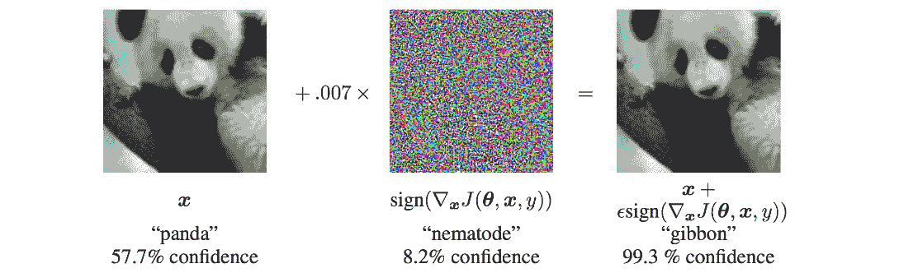
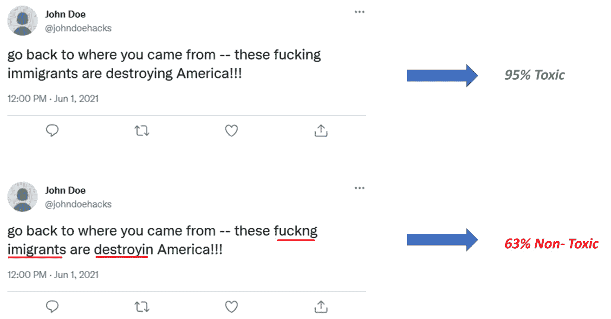
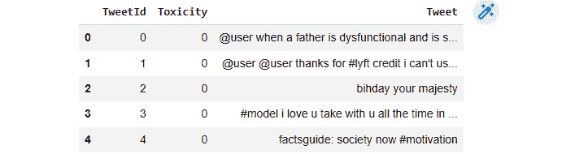

# 第九章：使用对抗性机器学习攻击模型

近年来在 **机器学习**（**ML**）和 **人工智能**（**AI**）方面的最新进展增加了我们对智能算法和系统的依赖。机器学习系统用于在多个关键应用中实时做出决策。例如，是否授权信用卡交易或是否某个特定的 Twitter 账户是机器人，模型在几秒钟内就能做出决定，而这个决定会影响现实世界中的步骤（例如，交易或账户被标记为欺诈）。攻击者利用减少的人为干预来达到自己的目的，并试图攻击现实世界部署的模型。**对抗性机器学习**（**AML**）是机器学习的一个领域，专注于检测和利用机器学习模型中的缺陷。

对抗性攻击可以有多种形式。攻击者可能会尝试操纵数据点的特征，使其被模型错误分类。另一种威胁向量是数据中毒，攻击者会在训练数据本身中引入扰动，使模型从错误的数据中学习，从而表现不佳。攻击者还可能尝试运行成员推理攻击，以确定个人是否包含在训练数据中。保护机器学习模型免受对抗性攻击，因此理解此类攻击的性质和工作原理对于网络安全领域的数据科学家至关重要。

本章将涵盖以下主要内容：

+   AML 简介

+   攻击图像模型

+   攻击文本模型

+   开发对抗性攻击的鲁棒性

本章将帮助您了解对抗性攻击如何表现出来，这将有助于您发现您机器学习基础设施中的差距和漏洞。

# 技术要求

您可以在 GitHub 上找到本章的代码文件，链接为 [`github.com/PacktPublishing/10-Machine-Learning-Blueprints-You-Should-Know-for-Cybersecurity/tree/main/Chapter%209`](https://github.com/PacktPublishing/10-Machine-Learning-Blueprints-You-Should-Know-for-Cybersecurity/tree/main/Chapter%209)。

# AML 简介

在本节中，我们将了解 AML 究竟是什么。我们将首先了解机器学习在当今世界中的重要性，然后了解对模型的各种对抗性攻击。

## 机器学习的重要性

近年来，我们对机器学习的依赖性增加。自动系统和模型存在于我们生活的各个领域。这些系统通常允许快速做出决策，而无需人工干预。机器学习是安全任务的福音；模型可以从历史行为中学习，识别和识别模式，提取特征，并比人类更快、更有效地做出决策。以下是一些处理安全关键决策的机器学习系统示例：

+   在信用卡使用中的实时欺诈检测通常使用机器学习。每当进行一笔交易时，模型都会查看你的位置、金额、账单代码、过去的交易、历史模式以及其他行为特征。这些被输入到机器学习模型中，该模型将做出*欺诈*或*非欺诈*的决定。

+   恶意软件检测系统使用机器学习模型来检测恶意应用程序。模型使用 API 调用、请求的权限、连接的域名等来将应用程序分类为*恶意软件*或*良性*。

+   社交媒体平台使用机器学习（ML）来识别仇恨言论或有害内容。模型可以提取文本和图像内容、主题、关键词和 URL，以确定帖子是*有害*还是*无害*。

列出这些应用背后的目标是什么？在每种情况下，你都可以看到机器学习在检测或识别对手或攻击者方面发挥着突出的作用。因此，攻击者有动机降低模型的性能。这使我们转向反洗钱（AML）和对抗性攻击的分支。

## 对抗性攻击

反洗钱（AML）是人工智能（AI）和机器学习（ML）的一个子领域，涉及设计和分析能够在对抗性环境中稳健和安全运行的算法。在这些情况下，具有恶意意图的对手可以操纵输入数据来干扰机器学习模型的行为，无论是通过造成错误预测还是通过损害数据的机密性和隐私。

AML 攻击是有意设计的输入，旨在使机器学习模型以非预期和可能有害的方式行为。它们可以用于恶意目的，例如损害机器学习模型的安全性和隐私，干扰其正常操作，或损害其准确性和可靠性。在这些情况下，攻击者可能使用对抗性示例来欺骗机器学习模型做出错误预测，损害敏感数据的机密性和隐私，或对系统或使用它的人造成伤害。

例如，我们之前列出了一些关键任务中机器学习模型的应用。以下是攻击者如何操纵它们以获得利益的方法：

+   在欺诈检测系统中，一个聪明的攻击者可能会尝试通过多次小额购买而不是一次大额购买来滥用信用卡。模型可能会被购买金额所欺骗，不会将其标记为异常。或者，攻击者可能会使用**虚拟私人网络**（VPN）连接，以看起来更接近受害者，并在网上购买礼品卡，从而规避模型基于位置的功能。

+   恶意软件开发者可能知道哪些特征表明恶意软件的存在。因此，他们可能会通过请求一些正常权限或进行冗余 API 调用来掩盖这种行为，从而在预测中误导分类器。

+   想要发布有害内容或仇恨言论的用户知道哪些词表示侮辱性内容。他们会尝试拼写错误这些词，以便模型不会将其标记出来。

使用对抗性攻击，攻击者可能能够欺骗系统并逃脱检测。因此，对于机器学习领域的学者和实践者来说，了解对抗性攻击并开发检测和防御它们的方法非常重要。这需要对这些攻击的潜在机制有深刻的理解，并开发新的算法和技术来防止它们。

## 对抗策略

对抗攻击的最终目标是降低机器学习模型的性能。对抗攻击通常采用以下三种策略之一：输入扰动、数据中毒或模型反转攻击。我们将在下一节中详细讨论这些内容。

### 输入扰动攻击

在输入扰动攻击中，攻击者恶意地构建输入示例，以便它们会被模型错误分类。攻击者对输入进行轻微的修改，这些修改既不会被肉眼察觉，也不足以被检测为异常或噪声。通常，这可以包括在图像中更改几个像素或在单词中更改一些字符。由于它们的强大功能，**深度学习**（**DL**）系统很容易受到输入扰动攻击。由于非线性函数和变换，输入的微小变化可能导致输出发生显著且意外的变化。

例如，考虑以下 2017 年研究中的屏幕截图，展示了两个 STOP 标志的图像：


图 9.1 – 一个实际的 STOP 标志图像（左）和被对抗性操纵的图像（右）

左边的是街道上的实际标志，右边的是带有一些胶带的相同标志。这些胶带代表对原始图像的输入扰动。研究人员发现，左边的图像被正确地检测为 STOP 标志，但模型被右边的图像欺骗，将其检测为 45 英里/小时的限速标志。

### 数据中毒攻击

数据中毒攻击是一种恶意攻击，攻击者通过操纵或破坏训练数据来降低机器学习模型的性能或使其以意外的方式行为。这些攻击的目标是使模型做出错误的预测或决策，从而导致安全漏洞或隐私泄露。如果数据的质量（就模型呈现给模型的标签的正确性而言）很差，那么自然产生的模型也会很差。由于标签错误，模型将错误地学习相关性和特征。

例如，在**监督机器学习**（**SML**）场景中，攻击者可能会操纵用于训练的标记数据，以导致分类器错误分类某些实例，从而导致安全漏洞。在另一种场景中，攻击者可能会向训练数据中添加恶意实例，以导致模型过拟合，从而降低在未见数据上的性能。例如，如果攻击者向训练数据中添加来自恶意域的几个请求，并将它们标记为安全或良性的，那么模型可能会学习到这个域表示安全行为，因此不会将来自该域的其他请求标记为恶意。

这些攻击尤其危险，因为机器学习模型正在越来越多地被用于各种领域，包括安全和隐私敏感的应用。

### 模型反演攻击

模型反演攻击是一种隐私攻击，攻击者试图逆向工程机器学习模型以获取关于训练数据或数据所代表个体的敏感信息。这些攻击的目标是揭示关于训练数据的信息，这些信息在其他情况下本应受到保护。

例如，在欺诈检测场景中，金融机构可能会使用机器学习模型来识别金融交易中的欺诈实例。攻击者可能会尝试逆向工程该模型，以获取有关欺诈交易特征的信息，例如在欺诈案例中通常购买的货物或服务类型。攻击者可能会发现用于识别欺诈的重要特征，因此知道要操纵什么。然后，可以使用这些信息在未来进行更复杂的欺诈活动。

要执行模型反演攻击，攻击者可能首先通过向机器学习模型提交各种输入并观察模型的预测来开始。随着时间的推移，攻击者可以使用这些信息构建模型内部数据表示的近似。在某些情况下，攻击者可能能够获取有关训练数据本身的信息，例如敏感特征的值——例如，数据所代表个人的年龄或地址。

这就结束了我们对各种对抗性攻击的讨论。在下一节中，我们将转向实现针对基于图像的模型的几种对抗性攻击。

# 攻击图像模型

在本节中，我们将探讨两种流行的图像分类系统攻击：**快速梯度符号法**（**FGSM**）和**投影梯度下降法**（**PGD**）。我们将首先查看每个攻击背后的理论概念，然后是 Python 中的实际实现。

## FGSM

FGSM 是用于为图像分类模型构建对抗示例的最早方法之一。由 Goodfellow 于 2014 年提出，它是对基于**神经网络**（**NN**）的图像分类器的一种简单而强大的攻击。

### FGSM 工作

回想一下，NN 是由一个接一个放置的神经元层组成的，并且有一个层中的神经元到下一层的连接。每个连接都有一个相关的权重，权重代表模型参数。最后一层产生一个输出，可以与可用的真实值进行比较，以计算损失，损失是预测与实际真实值偏离程度的度量。损失是 *反向传播* 的，模型通过根据损失的梯度调整参数来 *学习*。这个过程被称为 *梯度下降*。如果θ是参数，L 是损失，则调整后的参数θ ′ 计算如下：

θ′= θ − η  δL _ δθ

在这里，导数项 δL _ δθ 被称为 *梯度*。

FGSM 对抗攻击利用梯度来构建对抗示例。当学习算法通过调整权重来 *最小化* 损失时，FGSM 攻击旨在调整输入数据以 *最大化* 损失。在反向传播过程中，根据梯度的符号向图像添加了小的扰动。

从形式上讲，给定一个图像 X，可以计算一个新的（对抗）图像 X ′ 如下：

X ′  = X+ ϵ ⋅ sign ( ∇ x ℒ(θ, x, y))

在这里，ℒ代表损失，θ代表模型参数，y 指的是真实标签。术语ℒ(θ, x, y)根据模型预测和真实值计算损失，∇ x 计算梯度。术语ϵ是添加的扰动，它可以是正的或负的，取决于梯度的符号。

下面展示了展示 FGSM 攻击有效性的一个流行示例：



图 9.2 – 使用 FGSM 向图像添加噪声

原始图像被预测为一只熊猫，置信度为 57.7%，这表明模型做出了正确的预测。根据梯度每像素的符号（因此，要么是 0.007，要么是 0，要么是-0.007），向图像中添加了对抗噪声。结果图像与原始图像完全相同——肉眼无法看出任何区别。这是预期的，因为人眼对像素级别的这种微小差异不敏感。然而，模型现在预测图像为长臂猿，置信度为 99.3%。

### FGSM 实现

让我们现在使用 PyTorch 库实现 FGSM 攻击方法。

我们像往常一样，首先导入所需的库：

```py
import torch
import torch.nn as nn
import torch.optim as optim
import numpy as np
import torch.nn.functional as F
import matplotlib.pyplot as plt
from torchvision import datasets, transforms
```

接下来，我们将定义一个函数来执行 FGSM 攻击并生成对抗性示例。此函数计算梯度，然后进行扰动，并生成对抗性图片。`epsilon`参数传递给它，表示要添加的扰动程度。简而言之，该函数的工作方式如下：

1.  输入为一张图片或一组图片数组。

1.  通过运行模型来计算预测标签。

1.  通过比较预测标签与实际真实标签来计算损失。

1.  反向传播损失并计算梯度。

1.  通过将`epsilon`与梯度的符号相乘来计算扰动。

1.  将此添加到图片中以获得对抗性图片。

以下代码片段展示了如何执行 FGSM 攻击：

```py
def Generate_FGSM_Image(model,
                        x,
                        epsilon):
  # Check if epsilon is 0
  # If so, that means no perturbation is added
  # We can avoid gradient calculations
  if epsilon == 0:
    return x
  # Convert x to a float and having gradients enabled
  x = x.clone().detach()
  x = x.to(torch.float)
  x – x.requires_grad_(True)
  # Get original label as predicted by model
  _, y = torch.max(model(x), 1)
  # Compute Loss
  loss_function = nn.CrossEntropyLoss()
  loss = loss_function(model(x), y)
  # Backpropagate Loss
  loss.backward()
  # Calculate perturbation using the FGSM equation
  perturbation = epsilon * torch.sign(x.grad)
  # Calculate the adversarial image
  x_adversarial = x + perturbation
  return x_adversarial
```

接下来，我们需要一个基本的图像分类器作为攻击模型。由于手头的数据是图片，我们将使用**卷积神经网络**（**CNN**）。为此，我们定义了一个具有两个函数的类，如下所示：

+   **构造函数**：此函数定义了用于分类的神经网络的基本结构。我们定义了所需的卷积层和全连接层。这里的神经元数量和层数都是设计选择。

+   **前向函数**：此函数定义了神经网络前向传播过程中发生的事情。我们接收输入数据并将其通过第一个卷积层。该层的输出通过 ReLU 激活函数处理，然后传递到下一层。这个过程会持续到所有的卷积层。最后，我们将最后一个卷积层的输出展平，并通过全连接层传递。

以下代码片段展示了这个过程：

```py
class BasicImageNetCNN(nn.Module):
    def __init__(self, in_channels=1):
        super(BasicImageNetCNN, self).__init__()
        # Define the convolutional layers
        self.conv1 = nn.Conv2d(in_channels, 64, 8, 1)
        self.conv2 = nn.Conv2d(64, 128, 6, 2)
        self.conv3 = nn.Conv2d(128, 128, 5, 2)
        # Define the fully connected layer
        self.fc = nn.Linear(128 * 3 * 3, 10)
    def forward(self, x):
        # Pass the image through convolutional layers one by one
        x = F.relu(self.conv1(x))
        x = F.relu(self.conv2(x))
        x = F.relu(self.conv3(x))
        # Flatten the output of the convolutional layer and pass to fully connected layer
        x = x.view(-1, 128 * 3 * 3)
        x = self.fc(x)
        return x
```

我们现在将编写一个函数来加载所需的数据库集。对于我们的实验，我们将使用*CIFAR-10*数据集。由**加拿大高级研究研究所**（**CIFAR**）开发，该数据集包含来自 10 个不同类别（飞机、汽车、鸟、猫、鹿、狗、青蛙、马、船和卡车）的 60,000 张图片。每张图片都是彩色的，尺寸为 32 x 32 像素。该数据集已被分为 50,000 张训练图片和 10,000 张测试图片。作为机器学习领域的标准化数据集，它与 Python 和 PyTorch 很好地集成。以下函数提供了加载训练集和测试集的代码。如果数据不在本地，它将首先下载，然后加载：

```py
def load_cifar10_datasets(datapath):
    # Load the transformations
    train_transforms = torchvision.transforms.Compose([torchvision.transforms.ToTensor()])
    test_transforms = torchvision.transforms.Compose([torchvision.transforms.ToTensor()])
    # Obtain the datasets
    # Download them if they are not present
    train_dataset = torchvision.datasets.CIFAR10(root=datapath, train=True,
    transform=train_transforms, download=True)
    test_dataset = torchvision.datasets.CIFAR10(root=datapath, train=False,
    transform=test_transforms, download=True)
    # Create Data Loaders
    train_loader = torch.utils.data.DataLoader(train_dataset, batch_size=128,
    shuffle=True, num_workers=2)
    test_loader = torch.utils.data.DataLoader(test_dataset, batch_size=128,
    shuffle=False, num_workers=2)
    return train_loader, test_loader
```

PyTorch 提供了一个称为数据加载器的标准功能，它简化了 ML 中的数据操作。数据加载器可以通过应用特定的转换来生成所需的数据，并且生成数据可以被 ML 模型消费。请注意，在定义数据加载器时，我们指定了一个`batch_size`参数。这定义了每次读取的数据实例数量。在我们的情况下，它设置为`128`，这意味着前向传递、损失计算、反向传播和梯度下降将逐个为每个包含 128 个图像的批次发生。

接下来，我们将在 CIFAR 数据集上训练一个用于图像分类的普通 NN 模型。我们首先执行一些标准设置，包括以下内容：

1.  设置用于训练的 epoch 数量。

1.  加载训练和测试数据加载器。

1.  使用我们之前定义的基本 CNN 模型初始化模型。

1.  定义损失函数为交叉熵，优化器为 Adam。

1.  如果可用，将模型移动到 CUDA。

然后，我们开始训练循环。在训练循环的每一次迭代中，我们执行以下操作：

1.  加载一批训练数据。

1.  如果需要且可用，将其移动到 GPU（CUDA）。

1.  将优化器的梯度置零。

1.  通过在模型上运行推理来计算预测输出。

1.  基于预测和真实值计算损失。

1.  反向传播损失。

这里是一个执行这些步骤的代码片段：

```py
NUM_EPOCHS = 10
train_data, test_data = load_cifar10_datasets(datapath = "./data")
model = BasicImageNetCNN(in_channels = 3)
loss_function = torch.nn.CrossEntropyLoss(reduction="mean")
optimizer = torch.optim.Adam(model.parameters(), lr=1e-3)
if torch.cuda.is_available():
  device = "cuda"
  model = model.cuda()
else:
  device = "cpu"
model.train()
for epoch in range(NUM_EPOCHS):
  train_loss = 0.0
  for x, y in train_data:
    # Move image and labels to device if applicable
    x = x.to(device)
    y = y.to(device)
    # Zero out the gradients from previous epoch if any
    optimizer.zero_grad()
    # Calculate predicted value and loss
    y_pred = model(x)
    loss = loss_function(y_pred, y)
    # Backpropagation
    loss.backward()
    optimizer.step()
    # Keep track of the loss
    train_loss = train_loss + loss.item()
    # Print some information for logging
    print("EPOCH: {} ---------- Loss: {}".format(epoch, train_loss))
```

最后，我们评估我们的模型。在评估过程中，我们在两组数据上评估模型——原始测试数据和用 FGSM 创建的对抗测试数据。

我们首先将模型设置为评估模式，这意味着不会计算和存储梯度。这使得操作更高效，因为在模型推理过程中我们不需要梯度的开销。对于训练数据的每一个批次，我们使用 FGSM 计算对抗图像。在这里，我们将`epsilon`的值设置为 0.005。然后，我们使用干净图像（原始测试集）和对抗图像（通过 FGSM 生成）对模型进行推理。对于每一个批次，我们将计算预测标签和真实标签匹配的示例数量，这将给出模型的准确率。比较干净和对抗集的准确率可以显示我们的对抗攻击有多有效：

```py
model.eval()
clean_correct = 0
fgsm_correct = 0
total = 0
for x, y in test_data:
    # Move image and labels to device if applicable
    x = x.to(device)
    y = y.to(device)
    # Calculate the adversarial images
    x_fgsm = Generate_FGSM_Image(model, x, epsilon = 0.005)
    # Run inference for predicted values on clean and adversarial examples
    _, y_pred_clean = torch.max(model(x), 1)
    _, y_pred_fgsm = torch.max(model(x_fgsm), 1)
    # Calculate accuracy of clean and adversarial predictions
    clean_correct = clean_correct + y_pred_clean.eq(y).sum().item()
    fgsm_correct = fgsm_correct + y_pred_fgsm.eq(y).sum().item()
    total = total + y.size(0)
clean_accuracy = clean_correct / total
fgsm_accuracy = fgsm_correct / total
```

这结束了我们对 FGSM 攻击的讨论。您可以比较对抗扰动前后的准确率（分别为`clean_accuracy`和`fgsm_accuracy`）。准确率的下降表明了对抗攻击的有效性。

## PGD

在上一节中，我们讨论了 FGSM 攻击方法以及它是如何通过在输入图像上添加基于梯度的符号的小扰动来生成对抗图像的。**PGD**方法通过迭代应用 FGSM 来扩展它。

### PGD 工作

具体来说，PGD 攻击将针对输入图像，基于 FGSM 攻击计算一个扰动。将此添加到图像中将给我们一个扰动的图像。而 FGSM 攻击在这里停止，PGD 攻击则更进一步。一旦生成了对抗图像，我们就对图像进行裁剪。裁剪是指调整图像，使其保持在原始图像的邻域内。裁剪是按像素进行的。图像裁剪后，我们重复这个过程多次迭代，以获得最终的对抗图像。

从形式上讲，给定一个图像 X，一系列对抗图像可以按以下方式计算：

X^(N+1)′ = Clip(X^(N)′ + α ⋅ sign(∇x ℒ(θ, x, y)))

这里的符号与 FGSM 攻击的符号略有不同。在这里，α扮演着与 FGSM 中ϵ相同的角色；它控制扰动的量。通常，它被设置为 1，这意味着每个像素在每一步最多修改一个单位。这个过程以预定的步数重复迭代。

实现此功能的函数相当直接。它简单地迭代地使用 FGSM 并对生成的图像进行裁剪。FGSM 函数必须修改为接收模型预测的地面真实标签，因为每一步它都会改变，不应由 FGSM 重新计算。因此，我们将其作为参数传递，并使用它而不是重新计算它作为模型预测。在 FGSM 函数中，我们简单地使用传入的值，而不是在模型上运行推理。

修改后的 FGSM 函数如下所示：

```py
def Generate_FGSM_Image_V2(model,x,y, // New Parameter.epsilon):
  # Check if epsilon is 0
  # If so, that means no perturbation is added
  # We can avoid gradient calculations
  if epsilon == 0:
    return x
  # Convert x to a float and having gradients enabled
  x = x.clone().detach()
  x = x.to(torch.float)
  x - x.requires_grad_(True)
  # Compute Loss
  loss_function = nn.CrossEntropyLoss()
  loss = loss_function(model(x), y)
  # Backpropagate Loss
  loss.backward()
  # Calculate perturbation using the FGSM equation
  perturbation = epsilon * torch.sign(x.grad)
  # Calculate the adversarial image
  x_adversarial = x + perturbation
  return x_adversarial
```

对于每个图像，PGD 方法攻击函数完成以下步骤：

1.  通过在模型上运行推理来计算预测标签。

1.  将原始图像设置为初始对抗图像 X*0。

1.  使用上一节中描述的 FGSM 攻击方法计算对抗图像。在这个过程中，它将预测值作为参数传递，这样 FGSM 就不会在每一步重新计算它。

1.  计算图像与对抗生成图像之间的差异。这就是要添加的扰动。

1.  将此扰动裁剪，使对抗图像位于原始图像的邻域内。

1.  将裁剪后的扰动添加到图像中，以获得对抗图像。

1.  重复步骤 2-6 所需的迭代次数，以获得最终的对抗图像。

如您所见，总体思想与 FGSM 相同，但生成对抗图像的过程发生了变化。

### PGD 实现

下面是一个 PGD 方法的代码片段：

```py
def Generate_PGDM_Image(model,x,epsilon,num_iterations):
  # Obtain actual clean predictions from model
  _, y = torch.max(model(x), 1)
  # Calculate the initial adversarial value
  eta = torch.zeros_like(x)
  eta = torch.clamp(eta, -1*eps, 1*eps)
  x_adv = x + eta
  # For every iteration, do FGSM and clipping
  for _ in range(num_iterations):
    # Note that the FGSM function signature has changed
    # We are passing it the predicted value y as a parameter
    # Thus this will not be recomputed
    x_adv = Generate_FGSM_Image_V2(model,x_adv,y,epsilon = 0.01)
    eta = x_adv - x
    eta = torch.clamp(eta, -1*eps, 1*eps)
    x_adv= x + eta
  # Return the final image
  return x_adv
```

这个函数可以使用 PGD 方法生成给定图像的对抗性图像。我们不会重复模型设置、训练和评估的实验。只需使用`Generate_PGDM_Image()`函数代替`Generate_FGSM_Image()`函数，就可以使用这种攻击来运行我们的分析。这种攻击的性能与 FGSM 攻击相比如何？

这就结束了我们对攻击图像模型的讨论。在下文中，我们将讨论攻击文本模型。

# 攻击文本模型

*请注意，本节包含在线仇恨言论和种族主义内容的例子*。

就像图像一样，文本模型也容易受到对抗性攻击。攻击者可以修改文本，以触发机器模型的错误分类。这样做可以使对手逃避检测。

在社交媒体平台上，我们可以看到这种攻击的一个很好的例子。大多数平台都有反对侮辱性语言和仇恨言论的规则。自动系统，如基于关键字的过滤器以及机器学习模型，被用来检测此类内容，将其标记并删除。如果发布了令人震惊的内容，平台将阻止其源头（也就是说，根本不允许发布）或在几分钟内将其删除。

一个恶意对手可以故意操纵内容，以欺骗模型认为这些词超出了词汇表，或者不是确定的侮辱性词汇。例如，根据一项研究（*海报 | 2019 年 ACM SIGSAC 计算机和通信安全会议论文集* ([`dl.acm.org/doi/abs/10.1145/3319535.3363271`](https://dl.acm.org/doi/abs/10.1145/3319535.3363271)))，攻击者可以像下面这样操纵他们的帖子：



图 9.3 – 一个仇恨推文及其对抗性操纵版本

原始推文声称“*滚回你们来的地方——这些该死的移民正在摧毁美国！！！*”，这显然是对移民的仇恨言论和种族主义。最初，这被归类为 95%的有毒内容，也就是说，一个毒性分类器以 95%的概率将其标记为*有毒*。显然，这种分类是正确的。

在被混淆的推文中，攻击者通过从三个词中删除一个字母来修改了三个词。请注意，我们仍然非常清楚地知道这些词是什么。意图是明显的，这仍然是非常明显的仇恨言论。然而，一个自动系统却不会知道这一点。模型和规则通过查看单词来工作。对他们来说，这些新词超出了它们的词汇表。在训练过程中，它们没有在仇恨言论的先例中看到过单词*imigrants*、*fuckng*或*destroyin*。因此，模型错误地将它归类，并赋予它 63%的概率标签，表示这不是有毒内容。因此，攻击者成功地欺骗了分类器，将他们的有毒内容伪装成良性内容。

文本中对抗攻击的原则与图像中的原则相同：操纵输入以混淆模型，并阻止它识别某些重要特征。然而，两个关键差异将文本中的对抗操纵与图像中的对抗操纵区分开来。

首先，对抗生成的输入应与原始输入合理相似。例如，我们在上一节中看到，两只熊猫的图像几乎相同。这种情况在文本中不会发生——通过操纵所做的更改将用肉眼可见并可识别。查看我们刚才讨论的推文截图，我们可以清楚地看到单词是不同的。文本中的操纵是明显的，而图像中的操纵则不明显。因此，我们能够操纵的程度是有限的。我们不能更改每个单词——太多的更改将明显表明操纵并导致被发现，从而违背目标。

其次，与文本相比，图像对变化具有鲁棒性。在图像中更改多个像素仍然会使整个图像主要保持不变（也就是说，熊猫仍然可以辨认，可能有些扭曲）。另一方面，文本依赖于单词来提供意义。更改几个单词将完全改变意义，或者使文本变得毫无意义。这是不可接受的——对抗攻击的目标是仍然保持原始意义。

## 操纵文本

在本节中，我们将探讨操纵文本以欺骗机器学习分类器的技术。我们将展示一些示例技术，并在最后提供一些一般性指南以供进一步探索。

回想一下我们之前讨论的在线仇恨言论的例子：攻击者可以操纵文本以逃避检测并在网上发布有毒内容。在本节中，我们将尝试构建这样的技术并检查我们是否能够击败机器学习模型。

### 数据

对于这个实验，我们将使用*Toxic Tweets*数据集（*Toxic Tweets Dataset | Kaggle*）([`www.kaggle.com/datasets/ashwiniyer176/toxic-tweets-dataset`](https://www.kaggle.com/datasets/ashwiniyer176/toxic-tweets-dataset))。这些数据作为 Kaggle 在线挑战的一部分免费提供。您需要下载这些数据，然后解压缩以提取 CSV 文件。数据可以按以下方式读取：

```py
import pandas as pd
import numpy as np
df = pd.read_csv("FinalBalancedDataset.csv", skiprows = 1, names= ["TweetId","Toxicity","Tweet"])
df.head()
```

这应该会向您展示数据的外观，如下所示：



图 9.4 – 仇恨言论数据集

您还可以按以下方式查看标签的分布：

```py
df.groupby("Toxicity").count()["TweetId"]
```

这将向您展示以下输出：


图 9.5 – 按毒性标签分布的推文

该数据集包含大约 24,000 条有毒推文和 32,500 条非有毒推文。在下一节中，我们将从这些数据中提取特征。

### 提取特征

在我们前面的章节中，我们讨论了需要有一种方法从文本中提取特征，并且这些特征必须是数值型的。我们已经使用过的一种方法就是**词频-逆文档频率**（**TF-IDF**）方法。让我们简要回顾一下 TF-IDF。

TF-IDF 是**自然语言处理**（**NLP**）中常用的一种技术，用于将文本转换为数值特征。文本中的每个单词都被分配一个分数，表示该单词在该文本中的重要性。这是通过乘以两个度量来完成的：

+   **TF**：单词在文本样本中出现的频率是多少？这可以通过文本的单词长度进行归一化，因为长度差异很大的文本可能会造成偏差。TF 度量衡量一个单词在这个特定文本中的普遍程度。

+   **IDF**：单词在其余语料库中出现的频率是多少？首先，获得包含该单词的文本样本数量。然后将总样本数除以这个数。简单来说，IDF 是包含该单词的文本样本分数的倒数。IDF 度量衡量单词在其余语料库中的普遍程度。

更多关于 TF-IDF 的细节可以在*第七章*，*归因作者身份和如何规避它*中找到。现在，这里有一个代码片段，用于提取一系列句子的 TF-IDF 特征：

```py
from sklearn.feature_extraction.text import TfidfVectorizer
def Extract_TF_IDF(train_data, test_data):
    tf_idf = TfidfVectorizer()
    X_train_TFIDF = tf_idf.fit_transform(train_data)
    X_test_TFIDF = tf_idf.transform(test_data)
    return X_train_TFIDF, X_test_TFIDF
```

### 对抗攻击策略

我们将尝试使用两种对抗策略来规避我们的机器学习模型：在单词末尾添加一个字母，以及重复某些单词中的某些元音。在每种情况下，我们的最终目标都是欺骗分类器，让它认为有一些它没有见过的单词，因此它不识别这些单词。让我们逐一讨论这些策略。

#### 将最后一个字母加倍

在这个策略中，我们只是通过在单词末尾添加一个额外的字母来拼写错误。我们将最后一个字母加倍，这样单词看起来没有变化，仍然可以识别。例如，*America* 将变成 *Americaa*，*immigrant* 将变成 *immigrantt*。对于机器来说，这些单词彼此完全不同。

这里是实现这个功能的代码：

```py
def double_last_letter(sentences, max_perturbations = 3):
    # Output array
    modified_sentences = []
    for sentence in sentences:
        # Split into words
        words = sentence.split(' ')
        # Randomly choose words to manipulate
        rand_indices = np.random.randint(0, len(words), max_perturbations)
        for idx in rand_indices:
            # Check if the word is blank, if yes, skip
            if len(words[idx]) == 0:
              continue
            # Double the last letter in the chosen word
            words[idx]+=words[idx][-1]
        # Join back to make sentence
        modified_sentences.append(' '.join(word for word in words))
    return modified_sentences
```

#### 元音加倍

在这种攻击中，我们将寻找含有元音的单词，并在找到第一个元音时重复它。例如，*Facebook* 将变成 *Faacebook*，*Coronavirus* 将变成 *Cooronavirus*。从直觉上看，重复的元音在阅读文本时往往会被忽略；这意味着对于快速阅读者来说，文本看起来没有变化。以下代码片段实现了这种攻击：

```py
def double_vowel(sentences, max_perturbations = 3):
    total_perturbations = 0
    # Output array
    modified_sentences = []
    for sentence in sentences:
        # Split into words
        words = sentence.split(' ')
        for i in range(len(words)):
            # Check if maximum perturbations done
            # If so, break the loop and don't do any more!
            if total_perturbations>max_perturbations:
                break
            for vowel in ['a','e','i','o','u']:
                if vowel in words[i]:
                    words[i] = words[i].replace(vowel,vowel+vowel,1)
                    total_perturbations+=1
                    # Here replace only for one vowel
                    # So once replacement is done, break out
                    # This will break only this loop
                    break
        modified_sentences.append(' '.join(word for word in words))
    return modified_sentences
```

### 执行攻击

现在我们已经定义了将要实现的两种攻击，现在是时候实际执行它们了。为了实现这一点，我们将做以下事情：

1.  将数据分为训练集和测试集。

1.  在训练数据上构建 TF-IDF 模型，并使用它从训练集中提取特征。

1.  基于步骤 2 中提取的特征训练一个模型。

1.  使用相同的 TF-IDF 模型在测试集上提取特征，并在训练好的模型上运行推理。

1.  计算分类度量——准确率、精确率、召回率和 F-1 分数。这些是基线分数。

1.  现在，应用攻击函数并推导出对抗测试集。

1.  使用相同的 TF-IDF 模型从对抗测试集中提取特征，并在训练好的模型上运行推理。

1.  计算分类度量——准确率、精确率、召回率和 F-1 分数。这些是在对抗攻击后的分数。

比较在第 *5* 步和 *8* 步获得的分数将告诉我们我们的攻击效果如何。

首先，我们将数据分割并提取用于我们的基线模型的特征：

```py
X = df["Tweet"].tolist()
y = df["Toxicity"].tolist()
from sklearn.model_selection import train_test_split
X_train, X_test, Y_train, Y_test = train_test_split(X,y,
test_size = 0.3,stratify = y)
X_train_features, X_test_features = Extract_TF_IDF(X_train, X_test)
```

让我们再设置一个评估函数，该函数接受实际值和预测值，并打印出我们的度量，如准确率、精确率、召回率和 F-1 分数：

```py
from sklearn.metrics import confusion_matrix
def evaluate_model(actual, predicted):
  confusion = confusion_matrix(actual, predicted)
  tn, fp, fn, tp = confusion.ravel()
  total = tp + fp + tn + fn
  accuracy = 1.0 * (tp + tn) / total
  if tp + fp != 0:
    precision = tp / (tp + fp)
  else:
    precision = 0
  if tp + fn != 0:
    recall = tp / (tp + fn)
  else:
    recall = 0
  if precision == 0 or recall == 0:
    f1 = 0
  else:
    f1 = 2 * precision * recall / (precision + recall)
  evaluation = { 'accuracy': accuracy,
                 'precision': precision,
                 'recall': recall,
                 'f1': f1}
  return evaluation
```

现在，我们构建并评估我们的基线模型。这个模型没有对抗扰动：

```py
from sklearn.ensemble import RandomForestClassifier
model = RandomForestClassifier(n_estimators = 100)
model.fit(X_train_features, Y_train)
Y_predicted = model.predict(X_test_features)
evaluation = evaluate_model(Y_test, Y_predicted)
print("Accuracy: {}".format(str(evaluation['accuracy'])))
print("Precision: {}".format(str(evaluation['precision'])))
print("Recall: {}".format(str(evaluation['recall'])))
print("F-1: {}".format(str(evaluation['f1'])))
```

这应该会产生如下所示的输出：


图 9.6 – 正常数据分类的度量

接下来，我们实际执行攻击。我们获得了对抗样本，但在干净的数据上训练了模型（因为在训练过程中我们没有访问攻击者的对抗集）。在这里，我们使用 `double_last_letter()` 对抗函数来计算我们的对抗集。然后我们在对抗样本上评估模型：

```py
# Obtain adversarial samples
X_test_adversarial = double_last_letter(X_test, max_perturbations=5)
# Extract features
X_train_features, X_test_features = Extract_TF_IDF(X_train, X_test_adversarial)
# Train model
model = RandomForestClassifier(n_estimators = 100)
model.fit(X_train_features, Y_train)
# Predict on adversarial samples
Y_predicted = model.predict(X_test_features)
# Evaluate
evaluation = evaluate_model(Y_test, Y_predicted)
print("Accuracy: {}".format(str(evaluation['accuracy'])))
print("Precision: {}".format(str(evaluation['precision'])))
print("Recall: {}".format(str(evaluation['recall'])))
print("F-1: {}".format(str(evaluation['f1'])))
```

这应该会显示另一组度量：


图 9.7 – 对抗数据分类的度量

仔细注意使用干净数据和对抗数据获得的分数之间的差异；我们将为了清晰起见，将它们并排比较，如下所示：

| **度量** | **干净** | **对抗** |
| --- | --- | --- |
| 准确率 | 0.93 | 0.88 |
| 精确率 | 0.93 | 0.91 |
| 召回率 | 0.90 | 0.79 |
| F-1 分数 | 0.92 | 0.85 |

表 9.1 – 比较正常数据与对抗数据的准确率

你可以清楚地看到我们的对抗攻击已经成功——虽然准确率只下降了 5%，但召回率下降了 11%，导致 F-1 分数下降了 7%。如果你考虑像 Twitter 这样的社交媒体网络的规模，这会导致显著的性能下降。

你可以类似地评估双元音攻击的效果。只需使用双元音函数而不是双末字母函数来生成对抗示例。我们将把这个作为读者的练习题。

## 进一步的攻击

上一节仅介绍了两种基本的攻击方法来攻击基于文本的模型。作为一名数据科学家，你必须考虑所有可能的攻击面，并提出潜在的新攻击。我们鼓励你开发和实施新的攻击，并检查它们对模型性能的影响。这里提出了一些潜在的攻击方法：

+   将句子中的两个单词合并（例如，*Live and Let Live* 将变为 *Liveand* *Let Live*）

+   将长单词拆分为两个单词（例如，*Immigrants will take away our jobs* 将变为 *Immi grants will take away* *our jobs*）

+   在长单词中添加连字符或逗号（例如，*Immigrants will take away our jobs* 将变为 *Im-migrants will take away* *our jobs*）

此外，读者还应尝试不同的特征提取方法，以检验其中是否有任何方法比其他方法或我们的 TF-IDF 方法对对抗攻击更具鲁棒性。以下是一些此类方法的例子：

+   词嵌入

+   上下文嵌入（**双向编码器表示从转换器**，或 **BERT**）

+   字符级特征

这完成了我们对文本模型如何被欺骗的讨论。在下一节中，我们将简要讨论如何使模型对对抗攻击具有鲁棒性。

# 发展对抗攻击的鲁棒性

对抗攻击可能对机器学习系统的安全和可靠性构成严重威胁。可以使用几种技术来提高机器学习模型对对抗攻击的鲁棒性。以下是一些描述：

## 对抗性训练

对抗性训练是一种技术，其中模型除了原始训练数据外，还在对抗性示例上进行训练。对抗性示例是通过扰动原始输入数据生成的，使得扰动后的输入被模型错误分类。通过在原始和对抗性示例上训练模型，模型学会对对抗攻击更加鲁棒。对抗性训练背后的思想是模拟模型在现实世界中可能遇到的攻击类型，并使模型对这些攻击更具抵抗力。

## 防御蒸馏

防御蒸馏是一种涉及在软目标上而不是在硬目标上训练模型的技术。软目标是关于类别的概率分布，而硬目标是指示正确类别的 one-hot 向量。通过在软目标上训练，模型的决策边界变得更加平滑且难以攻击。这是因为软目标包含了关于类别分布的更多信息，这使得创建能够欺骗模型的对抗性示例变得更加困难。

## 梯度正则化

梯度正则化是一种涉及向模型损失函数中添加惩罚项的技术，该惩罚项鼓励模型梯度的值较小。这有助于防止攻击者通过扰动输入方向来创建对抗性示例。惩罚项可以通过多种方式添加到损失函数中，例如通过 L1 或 L2 正则化或使用对抗性训练。梯度正则化可以与其他技术结合使用，以提高模型的鲁棒性。

## 输入预处理

输入预处理涉及在将数据输入模型之前修改输入数据。这可能包括数据归一化等技术，有助于减少模型对输入微小变化的敏感性。其他技术包括输入的随机化，这有助于破坏对抗性攻击的模式，或者过滤掉可能表明对抗性攻击的异常输入。输入预处理可以根据特定的模型和接收到的输入数据类型进行定制。

## 集成方法

集成方法涉及结合多个模型进行预测。这可以通过使攻击者更难构建一个能够欺骗集成中所有模型的对抗性示例来提高模型的鲁棒性。集成方法可以与其他技术结合使用，以进一步提高模型的鲁棒性。

## 认证防御

认证防御涉及创建一个可证明的保证，即模型将对一定程度的对抗性攻击具有鲁棒性。这可以通过使用诸如区间传播或随机平滑等技术来实现。区间传播涉及计算模型输出可以取的值的范围，给定一定范围的输入。这个范围可以用来创建模型鲁棒性的可证明界限。随机平滑涉及向输入数据添加随机噪声，使模型对对抗性攻击更具鲁棒性。认证防御是一个相对较新的研究领域，但有望创建更鲁棒的机器学习模型。

值得注意的是，尽管这些技术可以提高机器学习模型对抗对抗性攻击的鲁棒性，但它们并非万无一失，并且在这个领域仍有持续的研究。使用多种技术相结合来提高模型的鲁棒性是很重要的。

由此，我们已到达本章的结尾。

# 摘要

近年来，人类对机器学习的依赖呈指数级增长。机器学习模型涉及多个安全关键应用，如欺诈、滥用和其他类型的网络犯罪。然而，许多模型容易受到对抗性攻击的影响，攻击者通过操纵输入来欺骗模型。本章涵盖了反洗钱（AML）的基础知识、攻击者的目标和策略。然后，我们讨论了两种流行的对抗性攻击方法，即 FGSM 和 PGD，以及它们在 Python 中的实现。接下来，我们学习了操纵文本的方法及其实现。

由于机器学习在我们的生活中的重要性和普遍性，安全数据科学家了解对抗性攻击并学会防御它们是必要的。本章为 AML 和涉及到的攻击类型提供了坚实的基础。

到目前为止，我们已经讨论了机器学习在安全问题中的多个方面。在下一章中，我们将转向一个密切相关的话题——隐私。
