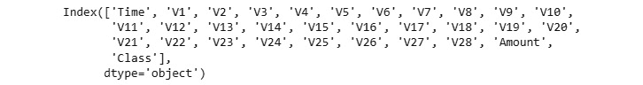
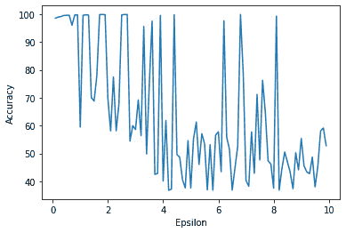
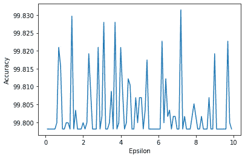
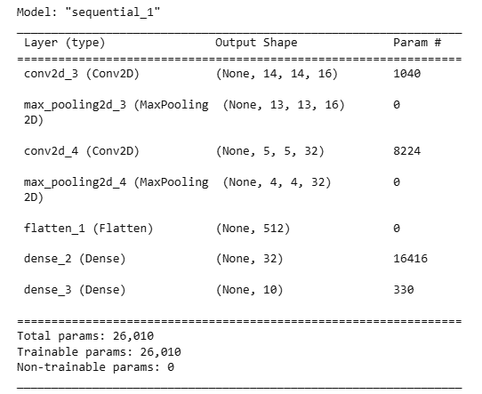
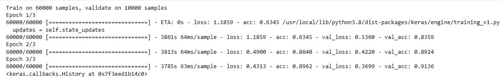

# 10

# 使用差分隐私保护用户隐私

随着机器学习的日益普及，人们对其可能对用户隐私构成的风险提出了担忧。先前的研究表明，即使是经过仔细匿名化的数据集也可能被攻击者分析，并使用模式分析或背景知识进行去匿名化。隐私建立的核心思想是用户有权控制其数据的收集、存储和使用。此外，隐私法规规定，不应泄露任何关于用户的敏感信息，并且也限制了可用于机器学习任务（如广告定位或欺诈检测）的用户信息。这导致了人们对用户数据用于机器学习的担忧，隐私是每个数据科学家都需要了解的关键话题。

本章介绍了差分隐私，这是一种在保持用户隐私的同时进行数据分析的技术。差分隐私旨在向数据和查询结果添加噪声，以保持查询的准确性，同时不泄露任何用户数据。这可以帮助进行简单的分析任务以及机器学习。我们将首先了解隐私的基础以及它对用户、工程师、科学家和开发者的意义。然后，我们还将探讨隐私设计以及违反隐私法规的法律影响。最后，我们将实现机器学习和深度学习模型中的差分隐私。

在本章中，我们将涵盖以下主要内容：

+   隐私基础

+   差分隐私

+   差分隐私机器学习

+   差分隐私深度学习

到本章结束时，你将更好地理解隐私的重要性以及如何将其纳入机器学习系统。

# 技术要求

你可以在 GitHub 上找到本章的代码文件，网址为 https://github.com/PacktPublishing/10-Machine-Learning-Blueprints-You-Should-Know-for-Cybersecurity/tree/main/Chapter%2010。

# 隐私基础

隐私是指个人或一组个人控制其个人信息的能力，并能够决定何时、如何以及与谁分享这些信息。它涉及免受不受欢迎或不正当的侵扰个人生活的权利，以及维护个人数据机密性的权利。

隐私是个体自主性的重要方面，对于维护个人自由、尊严以及个人关系中的信任至关重要。它可以通过各种手段得到保护，例如法律保障、技术措施和社会规范。

随着技术在日常生活中的日益普及，隐私问题变得越来越重要，尤其是在组织和国家机关收集、使用和共享个人数据方面。因此，人们越来越关注制定有效的政策和法规来保护个人隐私。在本节中，我们将介绍隐私的基本概念、相关法律措施以及其对机器学习的影响。

## 数据隐私的核心要素

数据隐私背后的基本原则是用户应该能够回答并控制以下问题：

+   正在收集关于我的哪些数据？

+   那些数据将用于什么目的？

+   谁将有权访问数据？

+   数据将如何得到保护？

在本节中，我们将详细探讨这些概念。

### 数据收集

**数据收集**指的是从个人收集个人信息或数据的过程。这些数据可以包括任何可以识别个人的信息，例如姓名、地址、电话号码、电子邮件、出生日期、社会保险号等。收集个人数据的组织必须确保数据只用于具体、合法的目的，并且个人应了解正在收集哪些数据以及为什么收集。在欺诈检测或其他安全应用的情况下，数据收集可能显得过于侵入（例如收集私人消息以检测滥用，或计算机进程以检测恶意软件）。此外，数据收集必须遵守适用的法律和法规，并且组织在收集个人数据之前必须获得个人的明确同意。

### 数据使用

**数据使用**指的是组织或个人如何使用收集到的数据。组织必须确保他们只将个人数据用于收集该数据的具体、合法目的，并且未经个人明确同意，不得将数据用于其他任何目的。此外，组织必须确保他们不以歧视个人的方式使用个人数据，例如根据个人的特征拒绝他们服务或机会。数据使用还包括将数据用于机器学习模型的训练——一些用户可能不希望他们的数据被用于训练或分析。

### 数据访问

**数据访问**指的是个人对其个人数据的控制。个人有权了解有关他们的数据正在被收集什么，谁在收集它，以及为什么收集它。他们也有权访问自己的个人数据并纠正任何不准确之处。此外，个人还有权了解他们的数据与谁共享以及用于什么目的。这还包括与其他组织、应用程序和服务的共享数据（例如，一个购物网站将您的搜索历史与营销公司共享）。个人数据仅应在个人明确同意的情况下共享，并且仅应共享于特定、合法的目的。组织必须确保他们有适当的安保措施来保护个人数据免受未经授权的访问、披露、更改或破坏。

### 数据保护

**数据保护**指的是为防止个人数据被未经授权的访问、披露、更改或破坏而采取的措施。这包括技术、物理和行政措施，以确保个人数据的安全和保密性。组织必须确保他们有适当的安保措施来保护个人数据，例如加密、访问控制和防火墙。此外，组织必须确保他们有政策和程序来检测和应对安全事件或泄露。

## 隐私与 GDPR

虽然隐私与用户对数据的同意有关，但它不仅仅是纯粹伦理或道德问题——组织必须遵守法律要求和法规。**GDPR**代表**通用数据保护条例**。这是一项全面的数据保护法律，于 2018 年 5 月 25 日在**欧洲联盟**（**EU**）生效。

GDPR 规范了欧盟内个人的个人数据处理，以及个人数据向欧盟外部的出口。它赋予个人对其个人数据的更多控制权，并要求组织对其如何收集、使用和存储个人数据保持透明。

GDPR 规定了几个关键原则，包括以下内容：

+   合法性、公平性和透明度

+   目的限定

+   数据最小化

+   准确性

+   存储限制

+   完整性和保密性（安全性）

+   责任制

根据《通用数据保护条例》（GDPR），个人有权访问他们的个人数据，纠正不准确的数据，在特定情况下删除他们的数据，并反对处理他们的数据。未能遵守 GDPR 的组织可能面临重大罚款和其他制裁。

例如，2019 年 1 月，法国数据保护机构 CNIL（法国数据保护机构）因谷歌公司广告个性化实践违反 GDPR 而对其处以 5000 万欧元罚款。CNIL 发现谷歌在两个方面违反了 GDPR：

+   **缺乏透明度**：法国国家信息与自由委员会发现，谷歌没有向用户提供关于其个人数据如何用于广告个性化清晰且易于访问的信息。这些信息散布在几份不同的文件中，使得用户难以理解。

+   **缺乏有效同意**：法国国家信息与自由委员会发现，谷歌没有从用户那里获得关于广告个性化的有效同意。同意并不充分知情，因为用户没有被告知具体收集哪些数据以及如何使用这些数据。

法国国家信息与自由委员会的调查是在 2018 年 5 月 25 日，即 GDPR 生效的同一天，由隐私倡导组织**None Of Your Business**（NOYB）和 La Quadrature du Net 提交的两项投诉后开始的。

除了罚款外，法国国家信息与自由委员会（CNIL）还命令谷歌修改其广告个性化实践，包括让用户更容易访问和理解他们数据被使用的信息，以及获取有效同意。

谷歌的罚款数额巨大，因为这是当时最大的 GDPR 罚款，表明监管机构愿意对大型科技公司采取执法行动以违反 GDPR。罚款还强调了在 GDPR 下数据处理中透明度和有效同意的重要性。

GDPR 对组织处理个人数据的方式产生了重大影响，不仅限于欧盟，而且全球范围内，因为许多公司不得不更新其政策和实践以符合该法规。

## 隐私设计

**隐私设计**是一种隐私保护方法，旨在从一开始就将隐私和数据保护嵌入到系统、产品和服务的架构中。这一概念最初由加拿大安大略省的信息和隐私专员在 20 世纪 90 年代提出，此后已被全球隐私监管机构和组织采纳为最佳实践。

隐私设计方法涉及主动识别和解决隐私风险，而不是在系统或产品开发后再尝试添加隐私保护。它要求组织在设计过程的每个阶段考虑隐私影响，从最初的规划和概念化阶段到实施和持续运营。

作为数据科学家和机器学习工程师，如果您在设计任何大规模系统，理解隐私问题很重要。您应该在开发任何系统时遵循隐私设计原则。有五个关键原则定义了隐私设计：主动性、默认隐私、隐私嵌入到设计中、完整功能和端到端安全。

### 积极而非被动

积极而非被动原则意味着组织应预测潜在的隐私风险，并在它们成为问题之前采取措施减轻这些风险。这包括在项目初期进行**隐私影响评估**（**PIAs**）以识别和解决潜在的隐私问题。通过采取积极的隐私方法，组织可以降低隐私泄露的可能性，保护个人权利，并与客户建立信任。

### 隐私作为默认设置

隐私作为默认设置原则意味着个人不应需要采取任何行动来保护他们的隐私。这意味着隐私保护应默认集成到系统和产品中，个人不应被要求选择退出数据共享。通过将隐私设置为默认设置，个人可以有权就其个人信息做出明智的决定，而无需导航复杂的隐私设置或政策。

### 隐私嵌入到设计中

将隐私嵌入到设计中的原则意味着隐私应从系统、产品和服务的开发之初就是一个核心考虑因素。这包括将这些产品和服务的设计中纳入隐私功能和控制，如匿名化、加密和数据最小化。通过将隐私构建到产品和服务的设计中，组织可以帮助确保隐私默认得到保护，而不是作为事后考虑。

### 完全功能

完全功能原则意味着隐私保护不应以牺牲功能或可用性为代价。这意味着隐私保护应集成到系统和产品中，而不会损害其性能或功能。通过采用积极的隐私方法，组织可以与客户建立信任，并表明他们认真对待隐私。

### 端到端安全

端到端安全原则意味着应在整个产品或服务的生命周期内实施全面的安全措施，从开发到废弃。这包括实施一系列安全措施，如访问控制、加密和监控，以防止未经授权的访问、使用和披露个人信息。通过采取全面的安全方法，组织可以帮助确保个人信息在生命周期的每个阶段都得到保护，并与客户建立信任。

## 隐私与机器学习

我们为什么花费这么多时间讨论隐私背后的概念、数据隐私的要素以及 GDPR？在安全领域（如欺诈、滥用和虚假信息），会收集大量和多种类型用户数据。其中一些可能被认为是侵扰性的，例如以下内容：

+   浏览器收集用户的鼠标移动和点击模式以检测点击欺诈和机器人

+   安全软件收集系统进程信息以检测恶意软件的存在

+   社交媒体公司从私信和图片中提取信息以检测儿童色情

对于安全领域的数据科学家来说，最终目标是构建一个具有最高精确度和召回率的系统，以提供最大的用户安全性。然而，在设计系统时，了解您在数据收集和使用过程中将面临哪些限制同样重要。例如，如果您正在构建一个用于欺诈检测的系统，您可能无法在法国使用 cookie 数据。此外，如果收集的数据来自欧洲用户，GDPR 将适用。

根据司法管辖权，您可能无法收集某些数据，或者即使收集到了，也可能无法将其用于机器学习模型。在设计系统和算法时，必须考虑这些因素。

此外，我们知道机器学习是基于从数据中识别趋势和模式。隐私考虑和法规将严重限制您收集数据、提取特征和训练模型的能力。

现在您已经了解了隐私的基本知识，我们将探讨差分隐私，它被认为是隐私领域的最先进技术，并被许多科技巨头所采用。

# 差分隐私

在本节中，我们将介绍差分隐私的基本知识，包括数学定义和现实世界示例。

## 什么是差分隐私？

**差分隐私**（**DP**）是在对数据集进行统计分析或机器学习时保护数据集中个人隐私的框架。DP 的目标是确保对数据集进行计算的结果不会泄露数据集中任何个人的敏感信息。这是通过向计算中添加受控噪声来实现的，以掩盖任何单个数据点的贡献。

差分隐私（DP）通过量化攻击者通过观察计算输出所能了解的关于个人的信息量，提供了一个对隐私保护的数学严格定义。具体来说，DP 要求从计算中观察到特定输出的概率，无论特定个人是否包含在数据集中，大致相同。

严格来说，设 D 和 D′是两个最多只相差一个元素的数据集，设 f 是一个以数据集为输入并在某个范围 R 中产生输出的函数。那么，f 函数对于任何两个数据集 D 和 D′都满足ε-差分隐私：

Pr[f(D) ∈ S] ≤ e ε . Pr[f(D′) ∈ S]

其中 S 是 *R* 的任何子集，*δ* 是一个很小的正数，用于考虑低概率事件发生的概率。换句话说，f 函数在数据集 D 上的输出落在集合 S 内的概率应该与 f 函数在数据集 D' 上的输出落在同一集合 S 内的概率非常相似，直到一个乘以 exp(ε) 的因子。ε 的值越小，隐私保护越强，但结果也越不准确。*δ* 参数通常设置为一个非常小的值，例如 10^-9，以确保整体隐私保证是强大的。

差分隐私背后的关键思想是以一种保留数据统计属性的同时掩盖任何个人贡献的方式向计算中添加随机噪声。添加的噪声量由一个称为**隐私预算**的参数控制，该参数决定了计算过程中可能发生的最大隐私损失量。

实现差分隐私有几种机制，包括以下几种：

+   **拉普拉斯机制**：拉普拉斯机制根据计算的敏感性向计算输出添加随机噪声。添加的噪声量与计算的敏感性成正比，与隐私预算成反比。

+   **指数机制**：指数机制用于从一组可能的输出中选择一个输出，以最小化关于任何个人的信息泄露量。此机制选择具有最高效用分数的输出，其中效用分数是衡量输出满足计算所需属性程度的一个指标。

+   **随机响应**：随机响应是一种用于在保护隐私的同时获得二元数据准确估计的机制。该机制涉及以一定概率翻转数据点的值，该概率由隐私预算决定。

由于数据在机器学习和统计分析中的广泛应用，差分隐私在近年来变得越来越重要。差分隐私可用于在敏感数据上训练机器学习模型，同时确保数据集中个人的隐私得到保护。它还用于其他应用，如人口普查数据和医学研究。

## 差分隐私 – 一个现实世界的例子

可以使用一个实际例子详细阐明差分隐私的概念。假设一家信用卡公司有一个包含其客户交易金额和时间信息的数据库，他们想识别潜在的欺诈案例。然而，信用卡公司担心保护其客户的隐私，并希望确保分析不能用于识别任何个别客户的交易金额或时间。

为了实现这一点，信用卡公司可以使用差分隐私来向分析中添加噪声。具体来说，他们可以在保持数据整体统计特性的同时，向计算出的统计数据添加随机噪声，使得确定任何单个客户的交易金额或时间变得困难。

例如，信用卡公司可以使用拉普拉斯机制向计算出的统计数据添加噪声。假设信用卡公司想要计算特定时间段的交易总额，计算的敏感性为*1*，这意味着改变一笔交易的金额最多可以改变计算出的总额 1 美元。信用卡公司希望实现隐私预算*epsilon = 1*，这意味着观察特定计算输出的概率应该在大约相同，无论特定客户是否包含在数据集中。

使用这些参数的拉普拉斯机制，信用卡公司可以向计算出的总额添加来自拉普拉斯分布的噪声，其尺度参数为*1/epsilon = 1*。这将以保持数据整体统计特性的方式向计算出的总额添加随机噪声，但使得确定任何单个客户的交易金额或时间变得困难。

例如，计算出的总交易金额可能是$10,000，但添加噪声后，可能会报告为$10,100。这确保了分析不能被用来以高置信度识别任何单个客户的交易金额或时间，同时仍然提供了关于特定时间段的总体交易金额的有用信息。

然而，假设信用卡公司想要实现更高的隐私保护水平，并将隐私预算设置为*epsilon = 10*而不是*epsilon = 1*。这意味着添加的噪声将更大，分析将更加私密，但也将更不准确。例如，当*epsilon = 10*时，计算出的总交易金额可能会报告为$15,000，这比真实值$10,000 更远。

总结来说，差分隐私可以在欺诈检测的背景下使用，以保护数据集中个人的隐私，同时仍然允许进行有用的统计分析。然而，隐私预算（epsilon）的选择很重要，应该与隐私保护水平和分析所需的准确性相平衡。

## 差分隐私的好处

为什么要使用差分隐私？它将为用户带来哪些好处？它将为工程师、研究人员和科学家带来哪些好处（如果有）？差分隐私提供了几个关键好处，包括强大的用户隐私保障、分析的灵活性、隐私与效用的平衡、弹性以及透明度。这些在网络安全领域比其他领域更为重要，正如我们在*第一章*中讨论的，*关于网络安全与机器学习*。

### 用户隐私保障

差分隐私提供了一个严格的数学定义的隐私保护，提供了强大的隐私保障。它确保个人的个人数据在数据集中不能与其他人的数据区分开来。

在网络安全环境中，差分隐私可以用来保护安全日志中用户数据的隐私。例如，假设一个安全分析师正在检查用户登录尝试的日志。差分隐私可以通过向日志数据添加随机噪声来保护个别用户的隐私，使得无法确定是否特定用户尝试登录。

### 灵活性

差分隐私可以应用于广泛的数据分析技术，包括查询、机器学习算法和统计模型。在网络安全中，它可以应用于各种与安全相关的数据分析技术。例如，它可以用来保护入侵检测系统中用户数据的隐私。它还可以应用于这些系统用于检测异常网络活动并确保保护个别用户隐私的算法。

### 隐私与效用权衡

差分隐私提供了一种平衡隐私和效用以进行准确统计分析的方法，同时最大限度地降低泄露敏感信息的风险。它可以在网络安全应用中用来保护敏感数据的隐私，同时仍然允许获得有用的见解。例如，它可以用来保护威胁情报共享系统中用户数据的隐私。它还可以用来保护个别用户的隐私，同时允许组织分享有关威胁和漏洞的信息。

### 弹性

差分隐私对各种类型的攻击具有鲁棒性，包括统计攻击和推理攻击。差分隐私旨在抵御广泛的攻击，包括统计攻击和推理攻击。例如，在网络安全环境中，差分隐私可以用来保护调查中用户数据的隐私。它还可以用来确保即使攻击者访问了大量其他数据，也无法从调查证据中推断出敏感数据。

### 透明度

差分隐私提供了一种量化特定技术提供的隐私保护程度的方法，这使得个人和组织能够就他们数据所需的隐私保护水平做出明智的决定。

它提供了一种衡量隐私保护技术有效性的方法，这在做出关于网络安全中数据保护的决定时可能很有用。例如，它可以用于保护威胁建模中用户数据的隐私。它还可以帮助组织了解他们需要保护以抵御各种类型威胁的隐私保护水平，并衡量他们现有隐私保护措施的有效性。

到目前为止，我们已经探讨了隐私和差分隐私。现在，让我们看看它在机器学习环境中的实际应用。

# 差分隐私机器学习

在本节中，我们将探讨如何将差分隐私集成到欺诈检测模型中。我们将首先查看我们用于实现差分隐私的库，然后是信用卡欺诈检测机器学习模型如何变得差分隐私。

## IBM Diffprivlib

`Diffprivlib` 是一个开源的 Python 库，提供了一系列差分隐私工具和算法，用于数据分析。该库旨在帮助数据科学家和开发者以简单高效的方式将差分隐私技术应用于他们的数据。

`Diffprivlib` 的一个关键特性是其广泛的差分隐私机制。这些包括向数据添加噪声的机制，如高斯、拉普拉斯和对数机制，以及更高级的机制，如分层和子样本机制。该库还包括用于计算差分隐私参数的工具，如敏感性（sensitivity）和隐私预算（epsilon），以及评估给定数据集隐私性的工具。

`Diffprivlib` 的另一个重要特性是它的易用性。该库提供了一个简单直观的 API，使用户只需几行代码即可将差分隐私应用于他们的数据。该 API 设计为与 `scikit-learn` 兼容，这是一个流行的 Python 机器学习库，这使得将差分隐私集成到现有的数据分析工作流程中变得容易。

除了其核心功能外，`Diffprivlib` 包含了一系列高级功能和工具，可用于提高差分隐私应用程序的准确性和效率。例如，该库包括用于生成差分隐私合成数据集的工具，这些数据集可用于测试和验证差分隐私机制。它还包括用于差分隐私机器学习的工具，可用于构建既准确又保护隐私的模型。

总体而言，`Diffprivlib`提供了一套强大的数据隐私工具，可用于各种应用，从医疗保健和金融到社交媒体和在线广告。其广泛的不同隐私机制、易用性和高级功能使其成为任何希望提高其数据分析工作流程隐私和安全性的宝贵资源。

在以下章节中，我们将使用`Diffprivlib`来训练和评估不同的差分隐私机器学习模型。

## 带有差分隐私的信用卡欺诈检测

如我们所知，差分隐私是一个框架，用于在允许对个人数据进行统计分析的同时保护个人的隐私。今天许多应用都是通过机器学习分析来实现的，因此，DP 在机器学习中的应用已经成为一个日益增长的兴趣和重要领域。

要将差分隐私应用于机器学习技术，我们将执行以下步骤：

1.  **定义隐私预算**：第一步是定义隐私预算，它决定了将提供的隐私保护水平。隐私预算通常表示为ε，它是一个小的正数。ε的值越小，隐私保护越强，但结果也越不准确。

1.  **向数据添加噪声**：为了确保差分隐私，在执行逻辑回归之前向数据添加噪声。具体来说，对每个数据点添加随机噪声，以便在数据聚合时噪声相互抵消。

1.  **训练模型**：一旦数据被随机化，机器学习模型将在随机化数据上训练。这个模型的准确性将低于在原始数据上训练的模型，但它仍然可以用于预测。

1.  **评估模型**：一旦模型训练完成，就可以用它对新数据进行预测。模型的准确性将取决于所选择的ε值，以及数据集的大小和复杂性。

在以下章节中，我们将探讨如何将这些方法应用于实践中的两种流行的分类模型：逻辑回归和随机森林。

### 差分隐私逻辑回归

首先，我们将导入所需的库：

```py
from sklearn.model_selection import train_test_split 
from sklearn.linear_model import LogisticRegression
from diffprivlib.models import LogisticRegression as dpLogisticRegression
import pandas as pd
```

作为模拟，我们将使用 Kaggle 的信用卡欺诈检测数据集。你可以使用任何你选择的数据集。我们将数据分为训练集和测试集，其中 2%保留用于测试：

```py
import pandas as pd
url = "https://raw.githubusercontent.com/nsethi31/Kaggle-Data-Credit-Card-Fraud-Detection/master/creditcard.csv"
df = pd.read_csv(url)
```

要打印列，你可以简单地运行以下命令：

```py
print(df.columns)
```

你应该看到以下内容：



图 10.1 – 数据集列

我们希望使用列`V1`至`V28`和`Amount`作为特征，`Class`作为标签。然后我们希望将数据分为训练集和测试集：

```py
Y = df['Class'].values
X = df.drop('Time', axis = 1).drop('Class', axis = 1).values
# Split into train and test sets
X_train, X_test, y_train, y_test = train_test_split(X,Y,
test_size=0.2,random_state=123)
```

接下来，我们训练一个逻辑回归模型来预测数据的类别。请注意，这是一个来自 scikit-learn 的普通逻辑回归模型，其中不涉及任何差分隐私：

```py
# Train a regular logistic regression model
model = LogisticRegression()
model.fit(X_train, y_train)
```

现在，我们评估这个模型在测试集上的性能：

```py
# Evaluate the model on the test set
score = model.score(X_test, y_test)
print("Test set accuracy for regular logistic regression: {:.2f}%".format(score*100))
```

这应该会打印出类似的内容：

```py
Test set accuracy for regular logistic regression: 99.90%
```

太好了！我们在测试集上几乎达到了 99.9%的准确率。

现在，我们在相同的数据上拟合一个差分隐私逻辑回归模型。在这里，我们将`epsilon`参数的值设置为`1`。你可以将其设置为任何你想要的值，只要它不是零（零 epsilon 表示没有差分隐私，模型将与普通模型等效）：

```py
# Train a differentially private logistic regression model
dp_model = dpLogisticRegression(epsilon=1.0, data_norm=10)
dp_model.fit(X_train, y_train)
```

然后，像之前模型那样在测试集上评估它：

```py
# Evaluate the model on the test set
score = dp_model.score(X_test, y_test)
print("Test set accuracy for differentially private logistic regression: {:.2f}%".format(score*100))
```

你应该看到类似这样的输出：

```py
Test set accuracy for differentially private logistic regression: 63.73%
```

哇——这是一个巨大的下降！测试集上的准确率从 99.9%下降到大约 64%。这是增加隐私所伴随的效用成本。

### 差分隐私随机森林

作为一项有趣的实验，让我们尝试用随机森林来做同样的实验。代码几乎相同，只是将两个分类器都切换为随机森林。以下是代码片段：

```py
from sklearn.ensemble import RandomForestClassifier
from diffprivlib.models import RandomForestClassifier as dpRandomForestClassifier
# Train a regular logistic regression model
model = RandomForestClassifier()
model.fit(X_train, y_train)
# Evaluate the model on the test set
score = model.score(X_test, y_test)
print("Test set accuracy for regular RF: {:.2f}%".format(score*100))
# Train a differentially private logistic regression model
dp_model = dpRandomForestClassifier(epsilon=1.0, data_norm=10)
dp_model.fit(X_train, y_train)
# Evaluate the model on the test set
score = dp_model.score(X_test, y_test)
print("Test set accuracy for differentially private RF: {:.2f}%".format(score*100))
```

这给出了以下输出：

```py
Test set accuracy for regular RF: 99.95%
Test set accuracy for differentially private RF: 99.80%
```

有趣的是，随机森林中的准确率下降并不明显，并且小于 1%。因此，如果既要增加隐私又要提高效用，随机森林将是这个场景中更好的分类器。

### 检查ϵ的影响

现在，我们将检查随着`epsilon`值的改变，分类器在测试集上的准确率如何变化。对于从`0`到`5`的多个`epsilon`值，我们将训练一个差分隐私分类器，并在测试集上计算准确率：

```py
import numpy as np
EPS_MIN = 0.1
EPS_MAX = 10
STEP_SIZE = 0.1
scores = []
epsilons = np.arange(EPS_MIN, EPS_MAX, STEP_SIZE)
for eps in epsilons:
  # Train a differentially private logistic regression model
  dp_model = dpLogisticRegression(epsilon= eps,data_norm=10)
  dp_model.fit(X_train, y_train)
  # Evaluate the model on the test set
  score = dp_model.score(X_test, y_test)
  scores.append(100.0*score)
```

在运行此块之后，我们可以将分数与相应的`epsilon`值相对应：

```py
import matplotlib.pyplot as plt
plt.plot(epsilons, scores)
```

这应该会显示一个像这样的图表：



图 10.2 – 逻辑回归的 epsilon 值与准确率的变化

对于随机森林，同样的评估结果如何？只需将实例化的模型替换为随机森林而不是逻辑回归。以下是完整的代码片段：

```py
import numpy as np
EPS_MIN = 0.1
EPS_MAX = 10
STEP_SIZE = 0.1
scores = []
epsilons = np.arange(EPS_MIN, EPS_MAX, STEP_SIZE)
for eps in epsilons:
  # Train a differentially private logistic regression model
  dp_model = dpRandomForestClassifier(epsilon= eps,
data_norm=10)
  dp_model.fit(X_train, y_train)
  # Evaluate the model on the test set
  score = dp_model.score(X_test, y_test)
  scores.append(100.0*score)
```

绘制这个图表给你以下结果：



图 10.3 – 随机森林的 epsilon 值与准确率的变化

图表*看起来*波动很大——但请注意，准确率始终在 99.8%和 99.83%之间。这意味着更高的`epsilon`值不会在准确率上造成有意义的变化。这个模型比逻辑回归模型更适合差分隐私。

# 差分隐私深度学习

在前面的章节中，我们介绍了如何在标准的机器学习分类器中实现差分隐私。在本节中，我们将介绍如何将其应用于神经网络。

## DP-SGD 算法

**差分隐私随机梯度下降**（**DP-SGD**）是一种机器学习技术，用于在不泄露数据本身的情况下在敏感或私有数据上训练模型。该技术基于差分隐私的概念，该概念保证即使添加或删除个别数据，算法的输出也基本保持不变。

DP-SGD 是 **随机梯度下降**（**SGD**）算法的一种变体，通常用于训练深度神经网络。在 SGD 中，算法通过计算训练数据的小随机子集（或“批次”）上的损失函数的梯度来更新模型参数。这个过程迭代进行，直到算法收敛到损失函数的最小值。

在 DP-SGD 中，SGD 算法被修改以引入隐私机制。具体来说，在每一迭代中都会向梯度添加一小部分随机噪声，这使得攻击者难以从算法的输出中推断出单个数据点。

添加到梯度中的噪声量由一个称为隐私预算 ε 的参数控制，该参数决定了关于单个数据点可能泄露的最大信息量。ε 的值越小，隐私保证就越强，但也会降低模型的准确性。

添加到梯度中的噪声量是通过一种称为 Laplace 机制的技术来计算的。Laplace 机制添加从 Laplace 分布中采样的随机噪声，其概率密度函数与 *exp(-|x|/b)* 成正比，其中 *b* 是尺度参数。*b* 的值越大，添加的噪声量就越小。

为了确保在整个训练过程中隐私预算 ε 不会超过，使用了一种称为 **矩估计器**的技术。矩估计器估计算法多次迭代的累积隐私损失，并确保隐私预算不会超过。

DP-SGD 与标准 SGD 的区别仅在于梯度计算步骤。首先，计算批次的梯度作为损失函数相对于参数的偏导数。然后，对梯度进行裁剪，以确保它们保持在固定窗口内。最后，向梯度添加随机噪声以形成最终的梯度。这个最终梯度用于梯度下降中的参数更新步骤。

总结来说，DP-SGD 是 SGD 的一个变体，通过在每一迭代中向梯度添加随机噪声来引入隐私机制。隐私级别由一个称为隐私预算 ε 的参数控制，该参数决定了添加到梯度中的噪声量。Laplace 机制用于添加噪声，而矩估计技术用于确保隐私预算不会超过。

DP-SGD 相比于传统的 SGD 算法具有几个优点：

+   **隐私保护**：DP-SGD 的主要优势在于它保护了单个数据点的隐私。当处理敏感或机密数据，如医疗记录或财务数据时，这一点尤为重要。

+   **对重新识别攻击的鲁棒性**：DP-SGD 对重新识别攻击具有鲁棒性，这些攻击试图将算法的输出与单个数据点相匹配。通过向梯度添加随机噪声，DP-SGD 使得攻击者难以区分单个数据点。

+   **提高公平性**：DP-SGD 还可以通过确保模型不过度依赖任何单个数据点来提高机器学习模型的公平性。这有助于防止模型中的偏差，并确保模型在不同人口群体中表现良好。

+   **可扩展性**：DP-SGD 可以扩展到大型数据集和复杂模型。通过使用随机梯度下降（SGD），DP-SGD 可以通过一次处理小批量数据来在大数据集上训练模型。这允许高效地使用计算资源。

+   **准确度与隐私权衡**：最后，差分隐私随机梯度下降（DP-SGD）在准确度和隐私之间提供了一个权衡。通过调整隐私预算ε，用户可以在保持合理准确度的同时控制隐私保护的水平。这使得 DP-SGD 成为机器学习应用的灵活和适应性工具。

## 实现方法

我们将像往常一样，首先实现必要的库。除了常用的处理和深度学习库之外，我们还将使用一个新的库，称为`tensorflow-privacy`。这个库提供了为 TensorFlow 模型添加差分隐私的工具，包括用于使用差分隐私训练深度学习模型的 TensorFlow 隐私算法的实现。该库还包括测量模型隐私属性的工具，如其`epsilon`值，该值量化了差分隐私机制提供的隐私保护水平：

```py
import tensorflow as tf
import numpy as np
import tensorflow_privacy
from tensorflow_privacy.privacy.analysis import compute_dp_sgd_privacy
```

现在，我们将编写一个函数来加载和预处理我们的 MNIST 数据。MNIST 数据集是一个包含大量手写数字的大型集合，通常用作测试机器学习算法的基准数据集，特别是与图像识别和计算机视觉相关的算法。该数据集包括 60,000 个训练图像和 10,000 个测试图像，每个图像都是一个 28x28 像素的手写数字（0-9）的灰度图像。

我们的功能将首先从这个数据中加载训练和测试集。然后，数据被缩放到其值的 1/255，随后调整为图像尺寸。标签，即从`0`到`9`的整数，被转换为 one-hot 向量：

```py
def load_and_process_MNIST_Data():
    # Define constants
    SCALE_FACTOR = 1/255
    NUM_CLASS = 10
    # Load train and test data
    train, test = tf.keras.datasets.mnist.load_data()
    train_data, train_labels = train
    test_data, test_labels = test
    print("----- Loaded Train and Test Raw Data -----")
    # Scale train and test data
    train_data = np.array(train_data, dtype=np.float32) * SCALE_FACTOR
    test_data = np.array(test_data, dtype=np.float32) * SCALE_FACTOR
    print("----- Scaled Train and Test Data -----")
    # Reshape data for Convolutional NN
    train_data = train_data.reshape(train_data.shape[0], 28, 28, 1)
    test_data = test_data.reshape(test_data.shape[0], 28, 28, 1)
    print("----- Reshaped Train and Test Data -----")
    # Load train and test labels
    train_labels = np.array(train_labels, dtype=np.int32)
    test_labels = np.array(test_labels, dtype=np.int32)
    print("----- Loaded Train and Test Labels -----")
    # One-Hot Encode the labels
    train_labels = tf.keras.utils.to_categorical(train_labels, num_classes=NUM_CLASS)
    test_labels = tf.keras.utils.to_categorical(test_labels, num_classes=NUM_CLASS)
    print("----- Categorized Train and Test Labels -----")
    return train_data, train_labels, test_data, test_labels
```

接下来，我们将定义一个创建分类模型的函数。在这种情况下，我们将使用卷积神经网络（CNNs）。我们在前面的章节中已经看到并使用过 CNNs；然而，我们在这里将简要回顾一下。

CNN（卷积神经网络）是一种专门为图像识别和计算机视觉任务设计的神经网络。CNNs 因其能够检测图像中的局部模式和特征而非常有效地处理和分析图像。从高层次来看，CNN 由一系列层组成，包括卷积层、池化层和全连接层。在卷积层中，网络通过将一组滤波器应用于图像来学习检测输入图像中的局部特征和模式。然后，池化层将卷积层获得的特征图下采样，以减少输入的大小并使网络更高效。最后，全连接层处理卷积层和池化层的输出以生成预测。

CNN 的关键创新是卷积层的使用，这使得网络能够从输入图像中学习空间不变特征。这是通过在不同图像部分之间共享权重来实现的，这使得网络能够检测到无论其在图像中的位置如何都相同的模式。CNN 在广泛的计算机视觉任务中实现了最先进的性能，包括图像分类、目标检测和语义分割。它们已被用于许多实际应用，如自动驾驶汽车、医学图像分析和面部识别系统。

我们的模型创建函数初始化一个空列表，并逐个添加层来构建 CNN 结构：

```py
def MNIST_CNN_Model (num_hidden = 1):
    model_layers = list()
    # Add input layer
    # Convolution
    model_layers.append(tf.keras.layers.Conv2D(16, 8,
                        strides=2,
                        padding='same',
                        activation='relu',
                        input_shape=(28, 28, 1)))
    # Pooling
    model_layers.append(tf.keras.layers.MaxPool2D(2, 1))
    # Add Hidden Layers
    for _ in range(num_hidden):
        # Convolution
        model_layers.append(tf.keras.layers.Conv2D(32, 4,
                           strides=2,
                           padding='valid',
                           activation='relu'))
        # Pooling
        model_layers.append(tf.keras.layers.MaxPool2D(2, 1))
    # Flatten to vector
    model_layers.append(tf.keras.layers.Flatten())
    # Final Dense Layer
    model_layers.append(tf.keras.layers.Dense(32, activation='relu'))
    model_layers.append(tf.keras.layers.Dense(10))
    # Initialize model with these layers
    model = tf.keras.Sequential(model_layers)
    return model
```

所需的所有核心函数都已定义。现在，我们使用我们之前实现的加载数据和标签的数据加载器来加载训练数据和测试数据：

```py
train_data, train_labels, test_data, test_labels = load_and_process_MNIST_Data()
```

在这里，我们将设置一些模型将使用的超参数：

+   `NUM_EPOCHS`：这定义了模型在训练过程中将经历的 epoch 数量（一个 epoch 是对训练数据的完整遍历）。

+   `BATCH_SIZE`：这定义了在一次批次中将被处理的数据实例数量。处理涉及将数据通过网络，计算预测标签、损失和梯度，然后通过梯度下降更新权重。

+   `MICRO_BATCHES`：数据集被划分为更小的单元，称为微批次，默认情况下每个微批次包含一个训练示例。这允许我们对每个单独的示例剪裁梯度，从而减少剪裁对梯度信号的不利影响并最大化模型的效用。然而，增加微批次的大小可以减少计算开销，但这涉及到跨多个示例剪裁平均梯度。需要注意的是，无论微批次的大小如何，批次中消耗的训练示例总数保持不变。为了确保适当的划分，微批次的数量应该能够均匀地除以批次大小。

+   `L2_NORM_CLIP`：这指的是相对于模型参数的损失函数梯度的最大 L2-范数。在训练过程中，对数据的小批量计算的梯度被剪裁以确保其 L2-范数不超过 `L2_NORM_CLIP` 值。这种剪裁操作是 DP-SGD 算法中的一个重要步骤，因为它有助于将梯度相对于输入数据的敏感性绑定起来。更高的值可能导致更好的准确度，但可能会降低隐私保证，而较低的值可以提供更强的隐私保证，但可能会导致收敛速度变慢和准确度降低。

+   `NOISE_MULTIPLIER`：这控制了在训练过程中添加到梯度更新中的噪声量，以提供隐私保证。在 DP-SGD 中，每个梯度更新都通过一个随机噪声向量进行扰动，以掩盖单个训练示例对梯度的贡献。更高的值会增加添加到梯度中的噪声量，这反过来又提供了更强的隐私保证，但可能会降低模型的准确度。

+   `LEARN_RATE`：这是学习率，正如前几章所见，它控制了梯度更新的程度。

注意，我们为这些超参数设置的以下值是通过实验得出的。没有确定最佳参数的方法。实际上，我们鼓励您尝试不同的值，并检查它们如何影响模型的隐私和准确度保证：

```py
NUM_EPOCHS = 3
BATCH_SIZE = 250
MICRO_BATCHES = 250
L2_NORM_CLIP = 1.5
NOISE_MULTIPLIER = 1.3
LEARN_RATE = 0.2
```

我们将使用之前定义的函数初始化模型，并打印出摘要以验证结构：

```py
model = MNIST_CNN_Model()
model.summary()
```

这将显示如下内容：



图 10.4 – 模型结构

现在，我们将定义用于训练的损失函数和优化器。虽然损失函数是分类交叉熵（对于多类分类问题这是预期的），但在这里我们不会使用标准的 Adam 优化器，而是将使用一个专门用于差分隐私的优化器。

`DPKerasSGDOptimizer` 是 TensorFlow `Privacy` 库中的一个类，它提供了一个带有差分隐私保证的 SGD 优化器的实现。它使用 DP-SGD 算法，该算法在 SGD 优化过程的每一步中向梯度添加随机噪声。添加的噪声量由两个参数控制：噪声乘数和剪裁范数。噪声乘数决定了添加到梯度中的噪声量，而剪裁范数限制了梯度的幅度以防止大的更新：

```py
optimizer = tensorflow_privacy.DPKerasSGDOptimizer(
             l2_norm_clip = L2_NORM_CLIP,
             noise_multiplier = NOISE_MULTIPLIER,
             num_microbatches = MICRO_BATCHES,
             learning_rate = LEARN_RATE)
loss = tf.keras.losses.CategoricalCrossentropy(
       from_logits=True,
       reduction=tf.losses.Reduction.NONE)
```

最后，我们将构建模型并开始训练过程：

```py
model.compile(optimizer=optimizer,
              loss=loss,
              metrics=['accuracy'])
model.fit(train_data,
          train_labels,
          epochs = NUM_EPOCHS,
          validation_data = (test_data, test_labels),
          batch_size = BATCH_SIZE)
```

这应该显示以下训练循环：



图 10.5 – 训练循环

模型现在已训练。`compute_dp_sgd_privacy`函数用于分析使用 DP-SGD 算法训练的差分隐私机器学习模型的隐私属性。通过计算隐私预算，我们可以确保模型满足所需的隐私保护水平，并相应地调整算法的参数。该函数使用矩估计方法来估计 DP-SGD 算法的隐私预算。这种方法通过分析隐私损失分布的矩来计算隐私预算的上限：

```py
compute_dp_sgd_privacy.compute_dp_sgd_privacy(
                  n = train_data.shape[0],
                  batch_size = BATCH_SIZE,
                  noise_multiplier = NOISE_MULTIPLIER,
                  epochs = NUM_EPOCHS,
                  delta=1e-5)
```

这应该会展示以下隐私度量：

```py
DP-SGD with sampling rate = 0.417% and noise_multiplier = 1.3 iterated over 720 steps satisfies differential privacy with eps – 0.563 and delta = 1e-05.
The optimal RDP order is 18.0.
(0.5631726490328062, 18.0)
```

## 差分隐私的实际应用

理解差分隐私的重要性和实用性，技术巨头已经开始在其产品中实施它。两个流行的例子是苹果和微软。

苹果通常会本地收集用户的打字历史和行为记录——这有助于支持诸如自动纠错和消息自动完成等功能。然而，这也带来了收集个人和敏感信息的风险。用户可能会谈论医疗问题、财务细节或其他他们希望保护的信息，因此直接使用这些信息将构成隐私侵犯。差分隐私在这里发挥了救星的作用。苹果实现了**本地差分隐私**，这保证了在将数据共享给苹果进行计算和处理之前，通过向数据添加噪声，很难确定某个用户是否通过贡献计算聚合特征而参与了计算。

另一家在差分隐私领域一直处于领先地位的技术巨头是微软。Windows 操作系统需要收集遥测数据以了解使用模式、诊断故障和检测恶意软件。微软在将收集到的数据聚合并发送给微软之前，通过添加噪声来应用差分隐私。Microsoft Office 有一个*建议回复*功能，该功能可以在 Outlook 和 Word 中实现自动完成和回复建议。由于模型训练所依赖的电子邮件/文档中可能包含敏感数据，因此微软使用差分隐私来确保模型不会从或泄露任何此类信息。

这些算法通常需要更长的时间来训练，并且通常需要调整以提高准确性，但根据微软的说法，由于差分隐私提供的更严格的隐私保证，这种努力是值得的。

# 摘要

近年来，用户隐私已成为一个重要的研究领域。用户应完全控制自己的数据，包括其收集、存储和使用。这可能会阻碍机器学习，尤其是在网络安全领域，隐私的增加可能导致效用降低，进而可能导致欺诈、网络攻击、数据盗窃或滥用。

本章首先介绍了隐私的基本方面——它包含的内容、为什么它很重要、与之相关的法律要求，以及如何通过隐私设计框架将其融入实践。然后，我们介绍了差分隐私，这是一种向数据添加噪声的统计技术，以便在保持用户隐私的同时进行数据分析。最后，我们探讨了如何将差分隐私应用于信用卡欺诈检测领域的机器学习以及深度学习模型。

这标志着我们构建用于网络安全机器学习解决方案的旅程的结束！现在，是时候进行反思并在这个领域发展更多技能了。下一章，其中包含一系列与面试相关的问题和额外的蓝图，将帮助你实现这一点。
