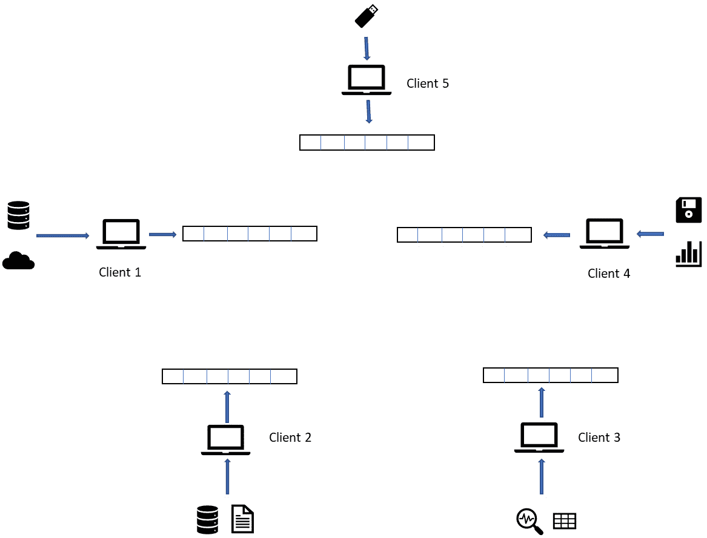
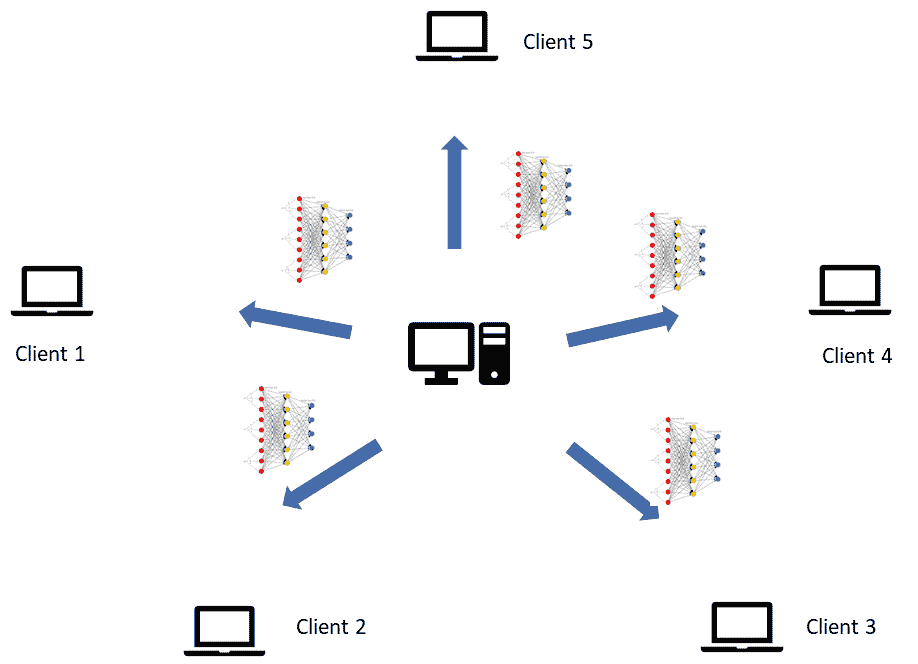
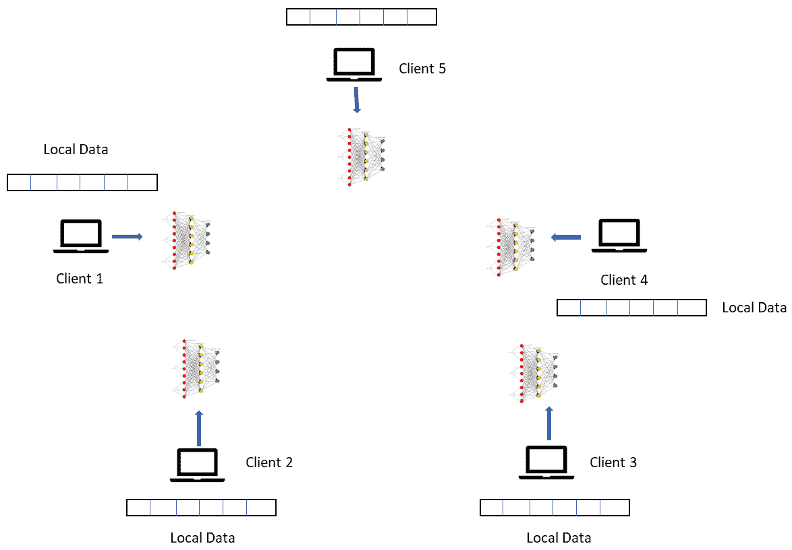
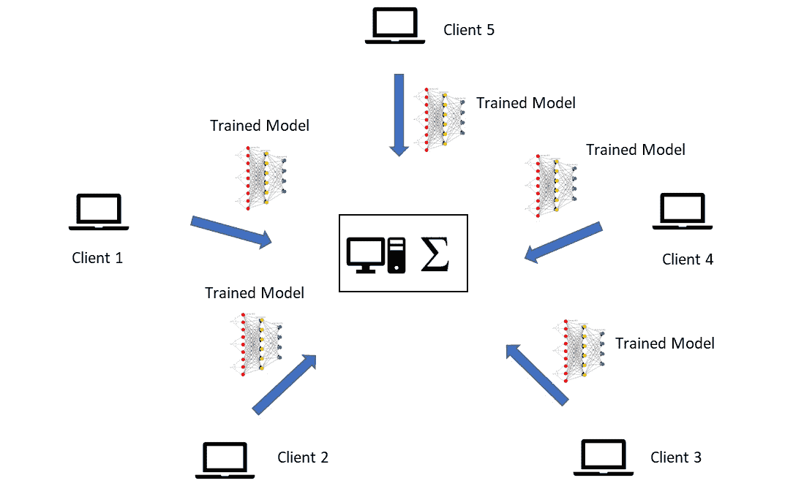
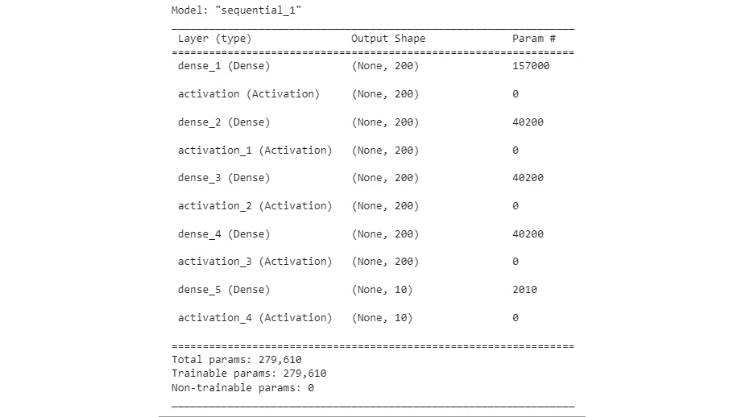
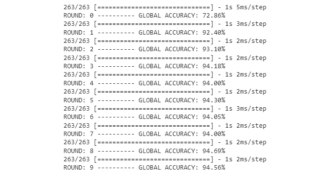
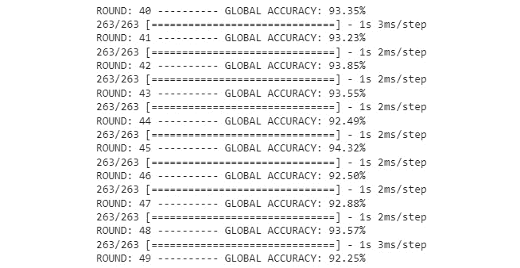
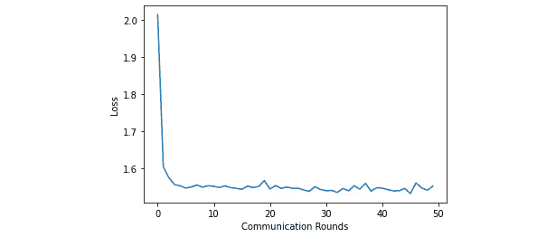
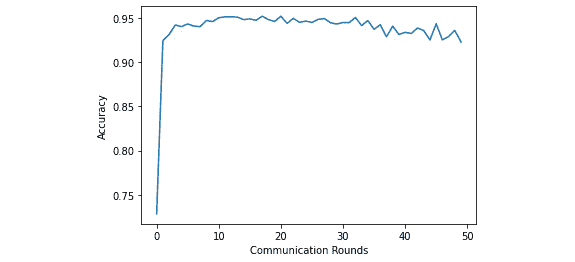
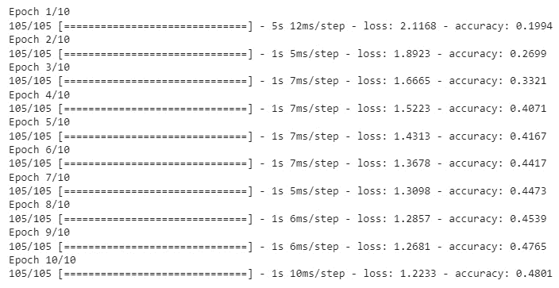

# 第十一章：使用联邦机器学习保护用户隐私

近年来，用户隐私问题在信息技术领域引起了广泛关注。隐私意味着用户对其数据拥有完全的控制权——他们可以选择如何收集、存储和使用数据。通常，这也意味着数据不能与其他实体共享。除此之外，公司可能还有其他不愿共享数据的原因，例如保密性、缺乏信任和保护知识产权。这可能会对机器学习模型造成巨大的障碍；大型模型，尤其是深度神经网络，如果没有足够的数据，就无法进行适当的训练。

在本章中，我们将了解一种名为**联邦机器学习**（**FML**）的隐私保护机器学习技术。许多类型的欺诈数据是敏感的；它们包含用户特定的信息，同时也揭示了公司在检测措施中的弱点。因此，公司可能不愿意相互分享这些数据。FML 使得仅通过共享学习到的模型本身，就可以从数据中学习，而无需访问数据。

本章我们将涵盖以下主要内容：

+   联邦机器学习的介绍

+   实现联邦平均

+   回顾联邦学习中的隐私-效用权衡**（联邦** **学习** **（FL**））

到本章结束时，你将详细理解联邦机器学习，并能够将任何任务（安全或非安全相关）作为联邦学习任务来实施。

# 技术要求

你可以在 GitHub 上找到本章的代码文件，网址为[`github.com/PacktPublishing/10-Machine-Learning-Blueprints-You-Should-Know-for-Cybersecurity/tree/main/Chapter%201`](https://github.com/PacktPublishing/10-Machine-Learning-Blueprints-You-Should-Know-for-Cybersecurity/tree/main/Chapter%2010)1。

# 联邦机器学习的介绍

让我们先看看联邦学习是什么以及为什么它是一个有价值的工具。我们将首先探讨在应用机器学习时面临的隐私挑战，然后讨论我们如何以及为什么应用联邦学习。

## 机器学习中的隐私挑战

传统机器学习涉及一系列我们之前多次讨论的步骤：数据预处理、特征提取、模型训练以及调整模型以获得最佳性能。然而，这涉及到数据暴露给模型，因此基于数据可用的前提。我们拥有的数据越多，模型就越准确。

然而，在现实世界中，数据往往很稀缺。标签难以获得，也没有集中聚合的数据源。相反，数据是由多个实体收集和处理的，而这些实体可能不愿意共享它们。

在安全领域，这种情况更为常见。因为涉及的数据是敏感的，风险很高，收集数据的实体可能不愿意与他人分享它或公开发布。

以下是一些例子：

+   考虑一家信用卡公司。该公司对已报告为欺诈的交易进行了标记。然而，它可能不想分享数据，因为暴露数据可能会无意中暴露实施细节或知识产权。数据中的用户级信息也可能是个人身份信息，与分享它相关的隐私风险可能存在。因此，每家信用卡公司都能访问一小部分数据——但没有公司愿意与其他公司分享。

+   考虑一个网络安全或杀毒公司，它使用统计和机器学习来检测恶意软件。它将拥有它已分析并手动标记为恶意软件的应用程序示例。然而，共享数据可能会泄露有关攻击的信息，损害公司的公众形象。它也可能向攻击者提供绕过检测的线索。因此，所有杀毒公司都会有数据，但不会公开分享。

你几乎可以在网络安全的所有领域找到类似的平行关系：点击欺诈检测、识别虚假新闻、在社交媒体上标记滥用和仇恨言论内容，等等。

拥有数据的实体并不愿意分享数据，这使得训练机器学习模型变得更加困难。此外，没有任何实体可以从其他实体获取的数据中学习。在这个过程中，可能会丢失有价值的知识和信号，建立在数据子集上的模型将具有固有的偏差。

因此，在保持隐私的同时构建一个足够好的数据集来训练机器学习模型，这极具挑战性，甚至可能是不可能的。联邦学习是一种用来克服这一挑战的方法。

## 联邦机器学习是如何工作的

FML（或简称 FL）是一种机器学习方法，它允许多个设备或组织在不需要共享数据的情况下协作构建共享的机器学习模型。在传统的机器学习中，所有数据都集中在中央位置进行聚合和处理，但在 FML 中，数据分布在多个设备或位置，模型以去中心化的方式进行训练。

联邦学习的基本概念是共享学习到的模型，而不是共享数据。正因为如此，各个实体可以共享关于模式和参数的知识，而无需披露数据。我们现在将逐步了解这是如何实现的。

### 第 1 步 - 数据分区

数据被分配到多个设备或位置，每个设备或位置被称为一个客户端。每个客户端都有自己的本地数据，这些数据不会与其他设备共享。例如，在医疗环境中，每家医院可能都有不愿意与其他医院共享的患者数据。在欺诈检测的情况下，每家信用卡公司都会有欺诈的例子。请注意，每个客户端将具有不同大小和分布的数据；然而，所有客户端必须以相同的方式进行数据预处理，以生成统一的数据输入向量。一个示例场景如图*图 11.1*所示；显示了多个客户端，每个客户端从不同的来源（U 盘、云服务器、本地文件、数据库等）获取数据。然而，在每个客户端，数据都被处理成相同的标准形式：



图 11.1 – 每个客户端将数据处理成标准形式

### 第 2 步 – 全局模型初始化

一个中央服务器或客户端，称为聚合器，初始化一个全局模型。在这一步中，模型以随机方式初始化，参数和权重来自均匀正态分布。全局模型定义了每个客户端将使用的结构和架构。全局模型被分发到每个客户端进行训练，如图*图 11.2*所示：



图 11.2 – 全局模型分发至客户端

### 第 3 步 – 本地训练

在接收到全局模型后，每个客户端将使用他们拥有的数据进行本地模型训练。本地模型使用标准的机器学习技术进行训练，例如随机梯度下降，并使用该设备上可用的数据进行本地模型的更新。到目前为止，我们遵循的步骤与传统机器学习中的单个客户端所做的工作类似。每个客户端将训练并生成自己的本地模型，如图*图 11.3*所示：



图 11.3 – 客户端进行本地模型训练

### 第 4 步 – 模型聚合

更新的本地模型随后被发送回中央服务器或云端，在那里它们被聚合以创建更新的全局模型。这个聚合过程可以采取不同的形式，例如平均本地模型或使用更复杂的方法。为了计算更新的聚合模型，接收到的参数被平均并分配给新的模型。回想一下，我们将全局模型分发给每个客户端；因此，每个客户端都将具有底层模型的相同结构，这使得聚合成为可能。在大多数情况下，使用的是被称为**联邦平均**的策略。我们根据数据的大小计算加权平均值；数据量更多的客户端更有可能产生更好的模型，因此它们的权重在平均中分配得更加重要；这个过程在*图 11**.4*中得到了演示：



图 11.4 – 模型聚合

### 第 5 步 – 模型分发

在上一步计算出的聚合模型被分发给每个客户端。客户端现在使用本地客户端数据对这个模型进行微调，从而再次更新它。然而，这次初始化不是随机的。模型参数是聚合的，这意味着它们包含了所有客户端节点的学习成果。更新模型后，将其发送回中央服务器进行聚合。这个过程会持续进行固定数量的通信轮次。

总结来说，联邦机器学习允许多个设备或组织在不共享数据的情况下协作构建共享的机器学习模型。这种方法可以提高数据隐私、安全和效率，同时仍然提供准确和有用的模型。

## 联邦学习的优势

在本节中，我们将讨论联邦学习的关键优势。

### 数据隐私

数据隐私是联邦机器学习最显著的优势之一。在传统的机器学习方法中，数据被收集并存储在中央位置，这可能导致对数据隐私和安全的担忧。然而，在联邦学习中，数据保留在本地设备或服务器上，模型训练过程中从未将原始数据与中央服务器共享。这意味着数据保持安全，没有数据泄露的风险。此外，数据所有者保留对其数据的控制权，这在医疗保健或金融等敏感行业中尤为重要，在这些行业中，隐私至关重要。

### 成本降低

联邦机器学习可以成为组织的一种经济有效的解决方案，因为它允许它们利用多个设备或服务器的计算能力，而无需投资昂贵的硬件或云计算服务。这是因为用于训练模型的设备或服务器已经存在，且无需购买额外的基础设施。此外，将大量数据传输到中央服务器进行分析的相关成本也降低了，因为数据保留在本地设备或服务器上。

### 速度

联邦机器学习还可以加快训练过程，因为每个设备或服务器都可以为训练过程做出贡献。这是因为模型在每个设备或服务器上本地训练，然后将更新发送回中央服务器，在那里它们被合并以创建全局模型。由于每个设备或服务器只负责训练数据的一个子集，因此训练过程可能比传统的机器学习方法更快。此外，由于数据保留在本地设备或服务器上，因此无需将大量数据传输到中央服务器，从而减少了网络延迟并加快了训练过程。

### 性能

FML 允许模型在更多样化的数据集上训练，从而提高模型精度。这是因为数据分布在多个设备或服务器上，每个设备或服务器可能具有略微不同的数据特征。通过在多样化的数据集上训练模型，模型变得更加健壮，并能更好地泛化到新的数据。此外，使用 FL 训练的模型可以更好地解释数据的可变性，并在实际场景中表现更佳。

## 联邦学习的挑战

尽管联邦机器学习提供了显著的益处，例如保护数据隐私，但必须解决一些挑战，才能使其实用且有效。

### 通信和网络延迟

联邦机器学习涉及多个参与者协作训练一个模型，而无需相互共享数据。然而，这需要参与者之间频繁的通信和大量数据及模型更新的交换。通信开销和网络延迟可能很大，尤其是在参与者位于不同地理位置且带宽有限的情况下。这可能会减慢训练过程，并使协调模型训练变得困难。

### 数据异构性

联邦机器学习涉及不同方使用自己的数据和硬件来训练模型。这可能导致数据和硬件的异质性，使得设计一个能够有效利用各方的优势同时减轻弱点的模型变得困难。例如，一些方可能拥有高质量的数据，而其他方可能拥有噪声数据。一些方可能拥有强大的硬件，而其他方可能处理能力有限。设计一个能够适应这些差异并确保训练过程公平无偏的模型是重要的。

### 数据不平衡和分布偏移

在联邦学习中，不同方使用的数据可能高度不平衡，并且可能具有不同的统计特性。这可能导致分布偏移和模型偏差，使得确保模型公平和无偏变得困难。例如，如果一个方比其他方拥有显著更多的数据，模型可能会偏向该方的数据。通过仔细选择用于训练的数据以及使用数据增强和样本加权等技术来减轻数据不平衡和分布偏移的影响，这些问题是重要的。

### 免费搭车者和恶意客户端

联邦学习旨在保护不同方拥有的数据的隐私。然而，这也使得在训练过程中确保模型和数据的安全和隐私变得具有挑战性。例如，可能难以确保每个方发送的模型更新是真实的且未被篡改或损坏。此外，可能难以确保每个方拥有的数据保持私有和安全，尤其是在各方不完全信任的情况下。开发用于联邦学习的安全且隐私保护的技术以减轻这些风险是重要的。

### 联邦优化

联邦机器学习需要使用能够处理训练过程分布式特性的新颖优化技术。这些技术必须能够聚合来自多个方的模型更新，同时保护数据的隐私和安全。这可能会很具挑战性，尤其是在处理大规模数据集时。此外，联邦学习中使用的优化技术必须高效且可扩展，因为训练过程可能涉及大量方和大量数据。

总体而言，解决这些挑战需要结合高级算法、技术和基础设施。尽管存在这些挑战，联邦机器学习仍有潜力开启一个协作机器学习的新时代，同时保护隐私和安全。

这结束了我们对联邦学习理论的讨论。现在，你已经很好地理解了该过程是如何工作的以及涉及到的陷阱，让我们来实际实施它。

# 实施联邦平均化

在本节中，我们将使用 Python 实现具有实际用例的联邦平均。请注意，虽然我们在这里使用 MNIST 数据集作为示例，但这可以轻松地复制到您选择的任何数据集。

## 导入库

我们首先导入必要的库。我们需要我们的标准 Python 库，以及一些来自 Keras 的库，这将允许我们创建我们的深度学习模型。以下代码片段导入了这些库：

```py
import numpy as np
import random
import cv2
from imutils import paths
import os
# SkLearn Libraries
from sklearn.model_selection import train_test_split
from sklearn.preprocessing import LabelBinarizer
from sklearn.utils import shuffle
from sklearn.metrics import accuracy_score
# TensorFlow Libraries
import tensorflow as tf
from tensorflow.keras.models import Sequential
from tensorflow.keras.layers import Flatten
from tensorflow.keras.layers import Dense
from tensorflow.keras import backend as K
```

让我们转向我们正在使用的数据。

## 数据集设置

我们将要使用的数据集是 MNIST 数据集。MNIST 数据集是一个在机器学习研究中广泛使用的流行基准数据集。它包含 70,000 个灰度手写数字图像的集合，每个图像大小为 28 x 28 像素。这些图像被分为 60,000 个示例的训练集和 10,000 个示例的测试集。

数据集的目标是训练一个机器学习模型，以正确地将每张图像分类为 0 到 9 之间的相应数字。该数据集已被广泛用于训练和测试各种机器学习算法，如神经网络、支持向量机和决策树。MNIST 数据集已成为评估图像识别算法性能的标准基准，它已被用作许多新机器学习研究者的起点。它还用于许多教程和在线课程，以教授图像识别和机器学习的基础知识：

```py
def load_mnist_data(dataroot):
    X = list()
    y = list()
    for label in os.listdir(dataroot):
      label_dir_path = dataroot + "/"+label
      for imgFile in os.listdir(label_dir_path):
        img_file_path = label_dir_path + "/" + imgFile
        image_gray = cv2.imread(img_file_path, cv2.IMREAD_GRAYSCALE)
        image = np.array(image_gray).flatten()
        X.append(image/255)
        y.append(label)
    return X, y
```

这完成了加载和预处理数据的代码。

## 客户端设置

接下来，我们需要编写一个初始化客户端节点的函数。请注意，在现实世界中，每个客户端或实体都将有自己的数据。然而，由于我们正在模拟这个场景，我们将手动实现它。该函数接收数据并将其作为输入进行标记，然后返回分区的数据作为输出。它将数据分成大致相等的块，并将每个块分配给一个客户端：

```py
def create_client_nodes(X,y,num_clients=10,
prefix='CLIENT_'):
    #create a list of client names
    client_names = []
    for i in range(num_clients):
      client_names.append(prefix + str(i))
    #randomize the data
    data = list(zip(X, y))
    random.shuffle(data)
    #shard data and place at each client
    per_client = len(data)//num_clients
    client_chunks = []
    start = 0
    end = 0
    for i in range(num_clients):
      end = start + per_client
      if end > len(data):
        client_chunks.append(data[start:])
      else:
        client_chunks.append(data[start:end])
        start = end
    return {client_names[i] : client_chunks[i] for i in range(len(client_names))}
```

我们还将编写一个辅助函数，当给定一个数据块时，将对其进行洗牌，按需将其准备成张量，并将其返回给我们：

```py
def collapse_chunk(chunk, batch_size=32):
    X, y = zip(*chunk)
    dataset = tf.data.Dataset.from_tensor_slices((list(X), list(y)))
    return dataset.shuffle(len(y)).batch(batch_size)
```

现在是转向建模的时候了。

## 模型实现

现在，我们将编写一个函数来创建我们的实际分类模型。该函数将隐藏层大小作为参数以数组的形式传入。从高层次来看，此函数将执行以下步骤：

1.  初始化一个顺序 Keras 模型。

1.  根据输入数据的形状创建输入层。在这里，它已知为`784`，因为我们使用的是 MNIST 数据。

1.  将输入层的激活函数设置为**线性整流**（**ReLU**）。

1.  解析作为参数传入的隐藏层大小列表，并逐个创建隐藏层。例如，`[200, 200, 200]`参数表示有三个隐藏层，每个层有 200 个神经元。

1.  创建最终层。这将具有与类别数量相等的节点数，在这种情况下是`10`。

1.  将最终层的激活设置为`softmax`，以便返回归一化的输出概率。

这里是实现这些步骤的一个示例：

```py
def MNIST_DeepLearning_Model(hidden_layer_sizes = [200, 200, 200]):
  input_dim = 784
  num_classes = 10
  model = Sequential()
  model.add(Dense(200, input_shape=(input_dim,)))
  model.add(Activation("relu"))
  for hidden in hidden_layer_sizes:
    model.add(Dense(hidden))
    model.add(Activation("relu"))
  model.add(Dense(num_classes))
  model.add(Activation("softmax"))
  return model
```

此函数将初始化并返回所需结构的模型。

## 权重缩放

接下来，我们将编写一个函数来缩放权重。请注意，作为联邦学习的一部分，我们将聚合权重。如果数据大小之间存在很大差异，它将反映在模型性能中。具有较小训练数据的模型必须对聚合的贡献更少。因此，我们为每个客户端或节点计算一个缩放因子。这个因子简单地是这个客户端可以访问的全球训练数据比例。如果全球有 1,000 条记录，而客户端 A 有 210 条记录，则缩放因子为 0.21：

```py
def scale_weights(all_clients,this_client,weights):
  # First calculate scaling factor
  # Obtain batch size
  batch_size = list(all_clients[this_client])[0][0].shape[0]
# Compute global data size
  sizes = []
  for client in all_clients.keys():
    sizes.append(tf.data.experimental.cardinality(all_clients[client]).numpy())
  global_data_size = np.sum(sizes)*batch_size
  # Compute data size in this client
  this_client_size = tf.data.experimental.cardinality(all_clients[this_client]).numpy()*batch_size
  # Scaling factor is the ratio of the two
  scaling_factor = this_client_size / global_data_size
  scaled_weights = []
  for weight in weights:
    scaled_weights.append(scaling_factor * weight)
  return scaled_weights
```

## 全球模型初始化

现在，让我们初始化全局模型。这将是一个共享的中心模型，在每一轮通信中都会保存更新的参数：

```py
global_model = MNIST_DeepLearning_Model(hidden_layer_sizes = [200, 200, 200])
global_model.summary()
```

这将显示创建的模型的结构：



图 11.5 – 模型结构

到目前为止，我们已经编写了帮助我们的数据和模型的功能。现在是我们将它们付诸实践的时候了！

## 设置实验

现在，我们将使用我们之前定义的函数来加载训练数据。在将标签二值化（即，将它们转换为 one-hot 编码形式）后，我们将数据分为训练集和测试集。我们将保留 20%的数据用于测试：

```py
dataroot = './trainingSet'
X, y = load_mnist_data(dataroot)
y_binarized = LabelBinarizer().fit_transform(y)
X_train, X_test, y_train, y_test = train_test_split(X,
                                      y_binarized,
                                      test_size=0.2,
                                      random_state=123)
```

我们将看到我们之前定义的将数据分配给客户端的函数。这将返回一个客户端和数据对的字典，我们将应用我们编写的块折叠函数：

```py
clients = create_client_nodes(X_train, y_train, num_clients=10)
clients_data = {}
for client_name in clients.keys():
    clients_data[client_name] = collapse_chunk(clients[client_name])
#process and batch the test set
test_batched = tf.data.Dataset.from_tensor_slices((X_test, y_test)).batch(len(y_test))
```

接下来，我们将为我们的实验设置一些参数。请注意，由于我们有一个多类分类问题，选择交叉熵作为损失是显而易见的。学习率和通信轮数是超参数 - 您可以尝试调整它们：

```py
learn_rate = 0.01
num_rounds = 40
loss='categorical_crossentropy'
metrics = ['accuracy']
```

现在我们已经设置好了一切，我们可以真正执行联邦学习了。

## 整合所有内容

现在，我们将实际上在多个通信轮次中执行联邦学习过程。从高层次来看，以下是我们在每个通信轮次中执行的操作：

1.  从全局模型中获取权重并打乱客户端块。

1.  对于每个客户端：

    1.  初始化用于训练的本地模型。

    1.  将本地模型的权重设置为当前全局模型的权重。

    1.  使用来自此客户端的数据训练本地模型。

    1.  根据客户端可用的数据量，从新训练的模型中获取缩放权重。

1.  为了内存管理，清除本地 Keras 会话。

1.  计算在第 2 步中获得的所有权重的平均值。由于这些是缩放权重，平均值是加权平均值。

1.  将平均权重设置为新的全局模型的权重。

1.  评估此模型的准确性（具有新分配权重的全新全局模型）。

1.  打印有关损失和准确性的信息。

1.  对于每个通信轮次重复*步骤 1-7*。在每一轮中，全局模型都会逐渐更新。

下面是实现这些步骤的代码：

```py
 for round in range(num_rounds):
    # Get the weights of the global model
    global_weights = global_model.get_weights()
    scaled_local_weights = []
    # Shuffle the clients
    # This will remove any inherent bias
    client_names= list(clients_data.keys())
    random.shuffle(client_names)
    # Create initial local models
    for client in client_names:
        # Create the model
        local_client_model = MNIST_DeepLearning_Model(hidden_layer_sizes = [200])
        # Compile the model
        local_client_model.compile(loss=loss,
        optimizer=
             tf.keras.optimizers.Adam(learning_rate=0.01),
        metrics=metrics)
        # The model will have random weights
        # We need to reset it to the weights of the current global model
        local_client_model.set_weights(global_weights)
        # Train local model
        local_client_model.fit(clients_data[client],
epochs=1,verbose = 0)
        # Scale model weights
        # Based on this client model's local weights
        scaled_weights = scale_weights(clients_data, client,local_client_model.get_weights())
        # Record the value
        scaled_local_weights.append(scaled_weights)
        # Memory management
        K.clear_session()
    # Communication round has ended
    # Need to compute the average gradients from all local models
    average_weights = []
    for gradients in zip(*scaled_local_weights):
        # Calculate mean per-layer weights
        layer_mean = tf.math.reduce_sum(gradients, axis=0)
        # This becomes new weight for that layer
        average_weights.append(layer_mean)
    # Update global model with newly computed gradients
    global_model.set_weights(average_weights)
    # Evaluate performance of model at end of round
    losses = []
    accuracies = []
    for(X_test, Y_test) in test_batched:
        # Use model for inference
        Y_pred = global_model.predict(X_test)
        # Calculate loss based on actual and predicted value
        loss_fn = tf.keras.losses.CategoricalCrossentropy(from_logits=True)
        loss_value = loss_fn(Y_test, Y_pred)
        losses.append(loss_value)
        # Calculate accuracy based on actual and predicted value
        accuracy_value = accuracy_score(tf.argmax(Y_pred, axis=1),tf.argmax(Y_test, axis=1))
        accuracies.append(accuracy_value)
    # Print Information
    print("ROUND: {} ---------- GLOBAL ACCURACY: {:.2%}".format(round, accuracy_value))
```

这里将显示一系列语句，说明损失和准确率是如何从一轮到下一轮变化的。以下是前 10 轮的样子：



图 11.6 – 训练循环中的前 10 轮

而这是最后 10 轮的样子：



图 11.7 – 训练循环中的最后 10 轮

注意

由于初始权重的随机初始化和洗牌，每次运行时结果都会改变。因此，当你尝试重新创建时获得的数字将不同于这里所示。这是预期的。

我们可以通过一个图表来可视化这些趋势，该图表将显示轮次中的损失：

```py
import matplotlib.pyplot as plt
plt.plot(range(num_rounds), losses)
plt.xlabel("Communication Rounds")
plt.ylabel("Loss")
```

输出将类似于以下内容：



图 11.8 – 轮次中的损失趋势

同样，我们可以绘制准确率：

```py
import matplotlib.pyplot as plt
plt.plot(range(num_rounds), accuracies)
plt.xlabel("Communication Rounds")
plt.ylabel("Accuracy")
```

这将生成以下图表：



图 11.9 – 轮次中的准确率趋势

因此，通过联邦机器学习，我们能够将全局模型的准确率从大约 72%提高到超过 92%。有趣的是，你可以看到准确率在大约第 25 轮或 0.时有所下降。这可能是由于某些特定客户端的本地训练数据上过度拟合了数据。

# 检查联邦学习中的隐私-效用权衡

在上一节中，我们检查了联邦学习的有效性，并查看了几轮通信中的模型性能。然而，为了量化有效性，我们需要将其与两个基准进行比较：

+   无联邦参与的在整个数据上训练的模型

+   仅在其自己的数据上训练的本地模型

这三种情况（联邦、仅全局和仅本地）的准确率差异将表明我们正在做出的权衡和获得的收益。在上一节中，我们查看通过联邦学习获得的准确率。为了了解效用-隐私权衡，让我们讨论两个极端情况 – 一个完全全局和一个完全本地模型。

## 全局模型（无隐私）

当我们直接训练一个全局模型时，我们使用所有数据来训练一个单一模型。因此，所有相关方都会相互公开共享他们的数据。中央聚合器将能够访问所有数据。在这种情况下，由于数据被共享，客户无法获得隐私保护。

要在全部数据上训练全局模型，我们将重新初始化全局模型，并用全部训练数据（而不是单个客户端数据）进行拟合。以下是相应的代码片段：

```py
# Initialize global model
global_model = MNIST_DeepLearning_Model(hidden_layer_sizes = [200, 200, 200])
global_model.compile(loss=loss,optimizer=tf.keras.optimizers.Adam(learning_rate=0.01),metrics=metrics)
# Create dataset from entire data
full_dataset = tf.data.Dataset.from_tensor_slices((X_train, y_train))\.shuffle(len(y_train))\.batch(32)
# Fit the model
global_model.fit(full_dataset, epochs = 10)
```

你应该看到以下输出，它显示了每个 epoch 的准确率和损失：


图 11.10 – 全局模型训练

我们看到，完全全局模型在仅几个 epoch 内就表现出色（起始点为 92%，结束点为 95%）。这意味着它比联邦模型更强大。这就是我们在联邦学习中做出的权衡；我们必须为了隐私而牺牲性能和准确性。

## 本地模型（完全隐私）

现在，为了评估我们本地模型的表现，我们将随机选择一个客户端（比如说客户端 8）并仅在该客户端的数据上训练一个模型：

```py
# Initialize local client
local_client_model = MNIST_DeepLearning_Model(hidden_layer_sizes = [200, 200, 200])
local_client_model.compile(loss=loss,optimizer=tf.keras.optimizers.Adam(learning_rate=0.01),metrics=metrics)
# Train on only one client data
local_client_model.fit(clients_data['CLIENT_8'],epochs=10)
```

结果如下：



图 11.11 – 本地模型训练

在这里，我们看到模型一开始表现非常糟糕（准确率低于 20%，甚至比随机猜测分类器还差）。在 epochs 过程中，模型性能有所提高。然而，最终准确率略高于 48%，比联邦模型差。

## 理解权衡

我们从前两个小节中获得的结果告诉我们两件事：

+   一个执行联邦学习的模型比仅在客户端本地数据上训练的模型表现更好。因此，客户端能够通过参数共享和聚合从其他客户端学习到的模型中受益，而这可以在不共享数据的情况下实现。

+   在整个数据上训练的全局模型比联邦学习模型表现更好。

这清楚地展示了隐私与效用之间的权衡。随着我们提高隐私性（应用联邦学习），数据的有效性会降低，这反映在模型性能上。在没有隐私（所有客户端共享数据并使用它来训练全局模型）的情况下，效用是最高的。

考虑到我们这里使用的数据集（毕竟，在共享手写数字图像时，我们面临哪些隐私问题？），这种权衡可能更难以理解。然而，当我们进入安全领域时，它变得更加明显。回想一下，在第一章中，我们讨论了安全领域中的机器学习与其他领域（如图像识别或广告定位）的不同之处，因为这里的赌注更高。

而不是图像识别，考虑这是一个信用卡欺诈检测场景。客户端节点是各种银行和信用卡公司。每个公司都有他们不想分享的欺诈标记示例。

如果公司相互之间共享所有数据，这将使他们能够训练一个全局模型。由于不同的公司会有不同的欺诈模式和示例，生成的模型将能够检测多种攻击模式。这将惠及所有参与的公司；即使公司 *A* 之前从未见过，它也能检测到某种类型的欺诈，如果另一个公司，*B*，曾经观察过它。然而，同时，公司也面临着其专有数据泄露和个人信息暴露的风险。如果欺诈事件被曝光，还可能造成声誉损害。因此，高性能和泛化能力是以隐私损失为代价的。

另一方面，考虑一下公司完全不共享任何数据的情况。因此，每个公司都将能够在其可访问的数据上训练一个模型。在这种情况下，公司 *A* 将无法检测到分布之外的欺诈或之前未见过的新的攻击模式。这将导致检测欺诈的召回率低，可能会给公司造成严重的损失。因此，高隐私和保密性是以降低性能和潜在的财务损失为代价的。

联邦学习能够解决这两个问题，并在隐私和效用之间提供完美的平衡点。因为联邦学习涉及共享模型参数而不是数据，所以可以保持隐私，个人信息不会被泄露。同时，由于模型是共享和汇总的，一个客户端的学习成果将对其他客户端也有益。

## MNIST 数据集之外

在本章中，我们选择了 MNIST 数据集进行实验。虽然 MNIST 是图像处理的流行基准，但它并不适合安全应用。然而，我们选择它的两个原因是：首先，它是一个相当大且分布良好的数据集，这使得联邦学习变得简单。其他公共数据集相对较小，这意味着当分片时，客户端只有少量数据，不足以产生一个合理的模型。其次，作为一个图像数据集，它自然适合由神经网络处理。

联邦学习的应用不仅限于图像。鼓励你探索本书迄今为止所探讨的所有问题（恶意软件、假新闻和入侵检测）并将它们以联邦方式实现。为此，只需要两个更改：

+   将数据加载机制更改为从适当的数据源读取，而不是 MNIST

+   将深度学习模型结构更改为反映特定数据集的输入和输出维度

其余的步骤（初始化模型、数据分片、通信轮次等）都保持不变。你应该在各个网络安全领域实施联邦学习，并观察隐私-效用权衡。

# 摘要

在本章中，我们了解了一种名为联邦学习的机器学习隐私保护机制。在传统的机器学习中，所有数据都聚集并处理在中央位置，但在 FML 中，数据保留在多个设备或位置上分布式，模型以去中心化的方式进行训练。在 FML 中，我们共享模型而不是数据。

我们讨论了 FML 的核心概念和工作原理，随后在 Python 中进行了实现。我们还对联邦学习与传统机器学习方法的性能进行了基准测试，以考察隐私与效用之间的权衡。本章为机器学习的一个重要方面提供了介绍，这个方面在以隐私为中心的当今技术世界中正迅速获得关注。

在下一章中，我们将更进一步，探讨当前机器学习隐私领域的热门话题——差分隐私。
