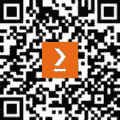

# 前言

欢迎阅读 *使用 Python 进行主动学习*，这是一本全面指南，旨在向您介绍主动机器学习的力量。本书坚信，尽管数据丰富，但其质量和相关性是构建既高效又稳健且富有洞察力的模型的关键。

主动机器学习是一种机器学习方法，其中算法可以查询一个预言者来标记新的数据点以获得期望的输出。它位于优化和人与计算机交互的十字路口，使机器能够用更少的数据更有效地学习。这在数据标记成本高、耗时或需要专业知识的情况下尤其有价值。

在整本书中，我们利用 Python，这是数据科学和机器学习领域的领先编程语言，以其简洁和强大的库而闻名。Python 是探索主动机器学习概念的绝佳媒介，为初学者和经验丰富的从业者提供实施复杂模型所需的工具。

# 本书面向对象

本书旨在面向数据科学家、机器学习工程师、研究人员以及任何对优化机器学习工作流程感兴趣的人。无论你是主动学习的初学者还是希望提升现有模型，本书都能通过战略查询和学习技术帮助你充分利用数据。

# 本书涵盖内容

*第一章*, *介绍主动机器学习*，探讨了主动机器学习的基本原理，这是一种高度有效的方法，与被动方法有显著不同。本章还提供了关于其独特策略和优势的见解。

*第二章*, *设计查询策略框架*，全面探讨了主动机器学习中最为有效和广泛使用的查询策略框架，包括不确定性采样、委员会查询、期望模型变化、期望误差减少和密度加权方法。

*第三章*, *管理闭环中的人类*，讨论了设计交互式主动机器学习系统的最佳实践和技术，重点在于优化闭环中的人类标记。涵盖了标记界面设计、有效工作流程的构建、解决模型与标记差异的策略、合适标记者的选择以及他们的有效管理等方面。

*第四章*, *将主动学习应用于计算机视觉*，涵盖了利用主动机器学习的力量来增强计算机视觉模型在图像分类、目标检测和语义分割等任务中的性能的各种技术，同时也讨论了它们应用中的挑战。

*第五章*，*利用主动学习处理大数据*，探讨了用于管理大数据（如视频）的主动机器学习技术，并承认了由于视频分析模型的大尺寸和基于每秒帧率的频繁数据重复导致的开发挑战，并演示了一种主动机器学习方法，用于选择用于标记的最具信息量的帧。

*第六章*，*评估和增强效率*，详细介绍了主动机器学习系统的评估，包括指标、自动化、高效标注、测试、监控和停止标准，旨在进行准确的评估和深入了解系统效率，指导该领域的明智改进。

*第七章*，*利用主动机器学习工具和包*，讨论了用于主动学习的常用 Python 库、框架和工具，突出了它们在实施各种主动学习技术中的价值，并为初学者和经验丰富的程序员提供了一个概述。

# 要充分利用本书

您应具备熟练的 Python 编程技能，熟悉 Google Colab，并具备机器学习和深度学习原理的基础知识。您还需要熟悉像 PyTorch 这样的机器学习框架。

本书面向那些对机器学习和深度学习有基本理解，并希望获取有关主动学习知识以优化其机器学习数据集标注过程的人。这种优化将使他们能够训练出最有效的模型。

| **本书涵盖的软件** |
| --- |
| Python 包：`scikit-learn`、`matplotlib`、`numpy`、`datasets`、`transformers`、`huggingface_hub`、`torch`、`pandas`、`torchvision`、`roboflow`、`tqdm`、`glob`、`pyyaml`、`opencv-python`、`ultralytics`、`lightly`、`docker`、`encord`、`clearml`、`pymongo`和`modAL-python` |
| Jupyter 或 Google Colab 笔记本（Python 版本 3.10.12 及以上） |

您需要为各种工具创建账户：**Encord**、**Roboflow**和**Lightly**。您还需要访问**AWS EC2 实例**以进行*第六章**，评估和*提高效率*。

如果您使用的是本书的数字版，我们建议您亲自输入代码或从本书的 GitHub 仓库（下一节中有一个链接）获取代码。这样做将帮助您避免与代码复制粘贴相关的任何潜在错误。

# 下载示例代码文件

您可以从 GitHub（[`github.com/PacktPublishing/Active-Machine-Learning-with-Python`](https://github.com/PacktPublishing/Active-Machine-Learning-with-Python)）下载本书的示例代码文件。如果代码有更新，它将在 GitHub 仓库中更新。

我们还有其他来自我们丰富图书和视频目录的代码包，可在[`github.com/PacktPublishing/`](https://github.com/PacktPublishing/)找到。查看它们吧！

# 使用的约定

在这本书中使用了多种文本约定。

`文本中的代码`: 表示文本中的代码单词、数据库表名、文件夹名、文件名、文件扩展名、路径名、虚拟 URL、用户输入和 Twitter 昵称。以下是一个示例：“我们定义`x_true`和`y_true`。”

代码块设置如下：

```py
y_true = np.array(small_dataset['label'])
x_true = np.array(small_dataset['text'])
```

**粗体**: 表示新术语、重要单词或您在屏幕上看到的单词。例如，菜单或对话框中的单词以**粗体**显示。以下是一个示例：“**异常检测**是主动学习证明高度有效的另一个领域。”

小贴士或重要提示

看起来像这样。

# 联系我们

我们始终欢迎读者的反馈。

**一般反馈**: 如果您对这本书的任何方面有疑问，请通过 mailto:customercare@packtpub.com 给我们发邮件，并在邮件主题中提及书名。

**勘误**: 尽管我们已经尽最大努力确保内容的准确性，但错误仍然可能发生。如果您在这本书中发现了错误，如果您能向我们报告，我们将不胜感激。请访问 [www.packtpub.com/support/errata](http://www.packtpub.com/support/errata) 并填写表格。

**盗版**: 如果您在互联网上以任何形式发现我们作品的非法副本，如果您能向我们提供位置地址或网站名称，我们将不胜感激。请通过 mailto:copyright@packt.com 与我们联系，并提供材料的链接。

**如果您有兴趣成为作者**：如果您在某个领域有专业知识，并且您有兴趣撰写或为书籍做出贡献，请访问 [authors.packtpub.com](http://authors.packtpub.com)。

# 分享您的想法

一旦您阅读了《使用 Python 的主动机器学习》，我们很乐意听到您的想法！请[点击此处直接转到该书的 Amazon 评论页面](https://packt.link/r/1835464947)并分享您的反馈。

您的评论对我们和科技社区都至关重要，并将帮助我们确保我们提供高质量的内容。

# 下载这本书的免费 PDF 副本

感谢您购买这本书！

您喜欢在路上阅读，但无法携带您的印刷书籍到处走？

您的电子书购买是否与您选择的设备不兼容？

请放心，现在，随着每本 Packt 书籍，您都可以免费获得该书的 DRM 免费 PDF 版本。

在任何地方、任何设备上阅读。直接从您最喜欢的技术书籍中搜索、复制和粘贴代码到您的应用程序中。

优惠远不止于此，您还可以获得独家折扣、时事通讯和每日收件箱中的精彩免费内容。

按照以下简单步骤获取好处：

1.  扫描二维码或访问以下链接



[`packt.link/free-ebook/9781835464946`](https://packt.link/free-ebook/9781835464946)

1.  提交您的购买证明

1.  就这样！我们将直接将您的免费 PDF 和其他优惠发送到您的邮箱
