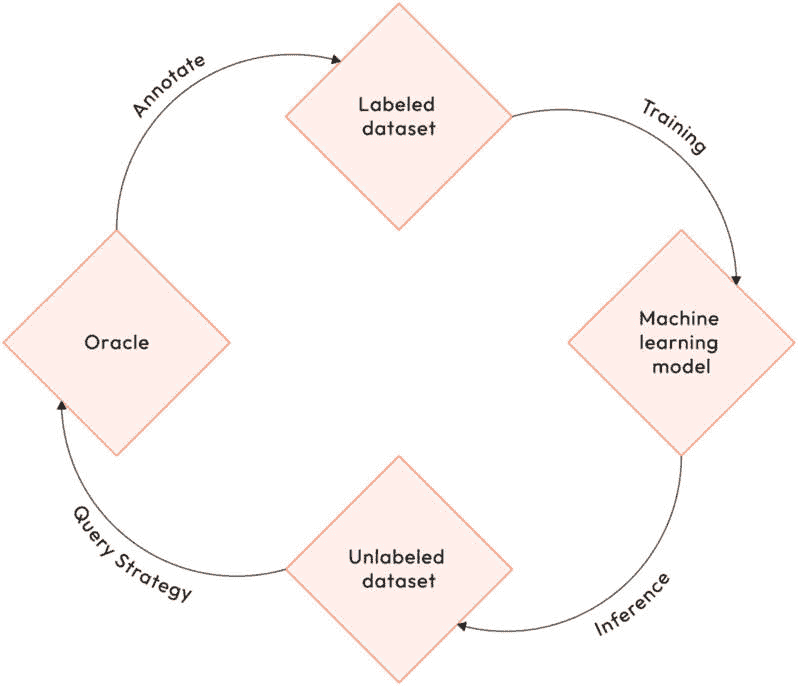

# 1

# 介绍主动机器学习

机器学习模型需要大量标记的数据集，这可能既昂贵又耗时。**主动机器学习**（**主动 ML**）通过智能地选择人类应该标记的数据点来最小化所需的标记工作。在本书中，你将获得理解主动学习所需的知识，包括其机制和应用。有了这些基础知识，后续章节将为你提供具体技能，以便你能够自己实现主动学习技术。

在本书结束时，你将拥有使用最先进策略来最小化标记成本和最大化模型性能的实践经验。你将能够将主动学习应用于提高模型在不同应用领域的效率和适应性，例如视觉和语言。

首先，本章介绍了主动机器学习，并解释了它是如何使用更少的标记示例来提高模型准确性的。到本章结束时，你将涵盖以下内容：

+   理解主动机器学习系统

+   探索查询策略场景

+   比较主动学习和被动学习

# 理解主动机器学习系统

**主动机器学习**（**主动 ML**）是一种强大的方法，旨在创建具有非凡准确性的预测模型，同时最大限度地减少所需的标记训练示例数量。这是通过采用一种巧妙策略来实现的，该策略涉及选择最有信息量的数据点由知识渊博的预言者进行标记，例如人类标注者。通过这样做，主动学习使模型能够从相对较少的数据中提取所需的知识。

现在，让我们探讨一些定义和构成主动机器学习基础的基本概念。

## 定义

**主动学习**可以被定义为一种动态和迭代的机器学习方法，其中算法智能地与一个**预言者**互动来标记新的数据点。预言者是一个为主动学习查询的数据点提供标签的来源。预言者充当教师角色，通过为其最有信息量的查询提供标签来指导模型。通常，预言者是能够手动为新数据点分配标签的人类标注者或专家。然而，预言者也可以是模拟引擎、众包服务或其他能够标记的系统。

主动机器学习的关键目标是选择并优先考虑对模型最有信息量的数据点。目标是实现更高的准确率，同时最大限度地减少对大量训练标签的需求，与传统的监督学习方法相比，后者依赖于大量预标记的示例数据集来训练模型以预测结果。另一方面，无监督学习方法与未标记的数据一起工作，寻求模式或结构，而不需要关于结果的明确指导。主动学习通过专注于半监督学习策略来连接这些方法。这个过程允许模型通过利用最相关和最重要的数据点，随着时间的推移主动学习和适应，持续提高其预测能力。通过积极与数据互动并仔细选择哪些样本进行标记，主动机器学习优化了整个学习过程。它允许算法专注于最相关和最有信息量的实例，从而减少了对大量标签工作的需求。因此，主动机器学习不仅节省了时间和资源，而且使机器学习模型能够实现更高的准确率和更好的泛化。通过有效地优先考虑数据标签，主动机器学习为更高级和智能的机器学习系统打开了大门。

## 潜在的应用范围

主动学习是一种高度灵活的技术，可以显著提高各种应用中的效率和模型性能。它通过将人工标签工作引导到它们可以产生最大影响的地方来实现这一点。

这种方法在**计算机视觉应用**中已被证明特别有效，例如图像分类、目标检测和图像分割。通过选择性地获取传统采样方法经常错过的模糊图像的标签，主动学习可以降低成本并提高准确率。它是通过识别最具有信息量的边缘案例进行查询来实现的，允许在更少的标记样本下获得准确的结果。例如，如果我们考虑一个需要识别各种对象（如人、树木和其他汽车）的自动驾驶汽车目标检测模型，我们可以利用主动学习来优先考虑它可能难以学习的类别。

在**自然语言处理任务**中，例如文档分类和翻译，主动学习者在填补语言覆盖范围缺口方面发挥着至关重要的作用。通过查询涵盖罕见词汇和结构的句子，主动学习提高了适应性和整体性能。标签过程仅关注最有用的示例，最大限度地减少了对大量标签工作的需求。

**异常检测**是另一个活动学习证明高度有效的领域。通过针对罕见异常值和异常，这些对于识别欺诈等问题至关重要，活动学习提高了这些重要但罕见的示例的检测。通过将人工审查集中在异常案例上，活动学习提高了异常检测系统的整体准确性。

**推荐系统**高度依赖用户反馈，而活动学习提供了一个智能获取这种反馈的框架。通过查询用户对某些内容的偏好，活动学习收集了可以用于微调推荐的专注信号。例如，流媒体服务可以使用活动学习技术来提高其视频建议的准确性和相关性。

在**医学诊断**领域，活动学习技术在最小化医生在常见诊断上花费的时间方面发挥着至关重要的作用。通过识别需要专家输入的挑战性案例，活动学习确保了努力集中在可以显著提高诊断模型性能的模糊示例上。

活动学习提供了在各个应用中高效聚焦人力在有用区域的算法和机制。通过选择性获取标签，它克服了与监督机器学习相关的固有成本和挑战，使其成为人工智能领域的一项宝贵工具。在科学、工程和技术领域，智能引导数据收集和标注的能力可以以最小的人力加速进步。

现在，让我们继续讨论活动学习系统的关键组成部分以及它们如何应用于我们刚刚提到的所有应用。

## 活动学习系统的关键组成部分

活动机器学习系统由四个关键元素组成：

+   **未标记数据集**：这个未标记数据点的集合是活动学习器可以查询的。它可能包含数十、数百甚至数百万个示例。

+   **查询策略**：这是活动学习的核心机制。它指导系统选择哪些数据点查询标签。可以使用不同的标准，我们将在稍后探讨。

+   **机器学习模型**：正在训练的底层预测模型，例如神经网络、随机森林或 SVM。

+   **预言者**：提供标签的来源。这通常是能够手动标注查询数据点的人工标注员。

提到的关键组件是如何相互作用的？*图 1.1*描绘了活动机器学习循环中各个组件之间的相互作用：

图 1.1 – 活动机器学习循环

模型参与以下迭代循环：

1.  查询策略确定了最需要标记的数据点。

1.  这些标签由预言者（人工标注员）提供。

1.  新标记的数据用于训练机器学习模型。

1.  然后使用更新后的模型来指导下一轮的查询和标记。

这个循环允许主动学习模型智能地探索数据集，获取新的训练标签，以最大化信息增益。

在下一节中，我们将通过首先检查可以选择的各种场景来深入探讨查询策略步骤。

# 探索查询策略场景

主动学习可以根据未标记数据的性质和查询的执行方式以不同的方式实现。在实施主动学习时，需要考虑三个主要场景：

+   成员查询合成

+   基于流的选样

+   基于池的采样

这些场景提供了不同的方法来优化和改进主动学习过程。理解这些场景可以帮助你做出明智的决定，并选择最适合你特定需求的方案。在本节中，我们将探讨这些场景中的每一个。

## 成员查询合成

在**成员查询合成**中，主动学习器有能力创建自己的未标记数据点以改进其训练。这是通过从头生成新的数据点，然后请求预言者提供标签来完成的，如图*图 1**.2*所示。通过将这些新标记的数据点纳入其训练集，模型变得更加稳健和准确：

图 1.2 – 成员查询合成工作流程

让我们以图像分类器为例。借助合成的力量，主动学习器可以通过在不同组合中结合各种形状、纹理和颜色来创建新的图像。这允许模型探索广泛的可能性和学习识别在原始标记数据中可能不存在模式和特征。

类似地，文本分类器也可以从成员查询合成中受益。通过生成包含特定单词或结构的新的句子和段落，模型可以扩展其对不同语言模式的理解，并提高其准确分类文本的能力。

成员查询合成的优点有几个：

+   模型对其查询的数据点有完全的控制权，允许它专注于正常采样可能忽略的边缘情况和异常示例。这有助于减少过拟合，并通过增加数据的多样性来提高模型的一般化能力。

+   通过合成数据，模型可以主动探索其弱点，而不是依赖于训练数据中的内容。

+   这对于数据合成简单的问题很有用，例如简单的表格数据和序列。

然而，使用这种场景也存在一些缺点：

+   这需要能够准确合成新的有用数据点的能力。对于图像、音频和视频等复杂现实世界数据，这可能极其困难。

+   数据综合对于高维、细微的数据效果不佳。生成的点往往不够自然。

+   与基于池的采样相比，在今天的实际应用中，数据综合的实用性较低。生成模型的发展可以提高综合效果。

+   从头开始反复生成完整数据点在计算上非常昂贵，尤其是对于多媒体数据。

+   过度生成合成示例可能导致过拟合，其中模型过于专注于分类合成实例而不是实际数据。因此，当模型面对不熟悉和未见过的数据时，其准确性可能会受到影响。

总体而言，成员查询综合在理论研究中占主导地位，而在今天的实践中应用很少。然而，生成模型的发展可能会增加其在未来实际应用中的可行性。

## 基于流的选择性采样

在**基于流的选择性采样**中，接收未标记数据点的过程是持续和动态的，而不是静态和预定的批量。*图 1.3*展示了激活学习者如何被呈现为一系列连续的数据点：

图 1.3 – 基于流的选择性采样工作流程

激活学习者在每个单独的点是否请求标签的问题上需要做出即时决策。这个实时决策过程为学习算法增加了灵活性和适应性。这使得它可以根据传入数据流的演变特征即时调整其采样策略。通过主动选择查询标签的数据点，激活学习者可以优化学习过程，并最大限度地利用有限的标签资源。

基于流的选择性采样在包括用户活动、实时传感器数据以及新闻推送、社交媒体等多个来源的数据中找到其应用。

用户活动以点击、搜索和帖子等形式产生的大量数据。通过选择性地标记网站和应用程序上用户行为的部分以训练模型（例如，预测流失和参与度），基于流的选择性采样避免了存储所有用户行为的庞大日志。

另一方面，来自设备或机械的实时传感器数据需要持续监控。为了最小化这种疏忽，仅在自主系统的最关键传感器事件上执行标签查询。

在新闻推送、社交媒体流和内容推荐系统中，基于流的选择性采样有助于获取用户反馈，以推荐一小部分内容项。这种专注的用户输入改善了建议，而不会让用户感到不知所措。

在这些情况下，数据以实时方式不断到达。活跃学习模型评估每个新的数据点，并选择性地查询预言机对最有用的示例进行标记。不那么有用的点被丢弃而不是存储。

基于流的精选采样的主要优势如下：

+   它非常适合实时应用，因为需要处理不断变化的实时数据流

+   它在存储效率上很高效，因为不需要保存完整的数据流，只需保存查询的点

+   它是可扩展的，因为它涉及高效管理大量传入数据，而无需存储所有数据

然而，它也有一些缺点，如下列所示：

+   模型必须在数据流到达时即时评估和做出查询决策。没有进行深入分析的机会。

+   被丢弃的点不能在以后重新访问或重新查询。

+   没有从头开始重新训练，适应数据分布随时间的变化变得更加困难。

+   如果模型只对特定数据类型进行标记，可能会引入偏差。这可能导致模型针对这些特定数据类型进行了优化，但面对新数据时可能表现不佳。

+   该方法的有效性可能因流平台及其限制而异，这可能会限制其有用性。

总体而言，基于流的精选采样在存储需求和实时响应至关重要时是一种有效的方法。当流分布相对稳定时，它效果良好。如果流随时间变化，基于池的采样可能更有效，因为早期点可以被重新分析。

## 基于池的采样

在 **基于池的采样** 的背景下，活跃学习者可以访问一个大型未标记数据点集合，这些数据点随时间保持静态。在这种情况下，数据点通常来自现有的未标记数据集或标记数据集，其中标签暂时被隐藏。它们也可以通过抓取公共来源收集。

活跃学习从静态数据池中选择数据点并将其发送到预言机进行标记。与基于流的采样场景不同，没有数据点被丢弃。

*图 1**.4* 展示了一个基于池的采样工作流程：

图 1.4 – 基于池的采样工作流程

静态池作为数据集，学习者可以从中反复抽取样本，目的是获取最有信息量的标记示例。通过利用这个池，学习者可以探索并提取有助于学习过程的有价值见解。通过多次迭代采样，学习者可以加深理解并提高做出明智决策的能力。

样本池旨在为用户提供最大的灵活性，使他们能够在任何给定时间查询池中的任何点。这一功能允许无缝访问数据点，确保查询过程中的便利性和多功能性。池的大小基于计算约束确定，常见的大小从 10,000 到 1,000,000 个数据点不等。池的大小选择取决于各种因素，例如可用的计算资源和所使用模型的特定要求。

需要强调的是，在整个迭代过程中，样本池保持固定。模型持续查询并从样本池中选择最有价值的点，优化其性能并细化其结果。这种池与模型之间的动态互动对于在数据分析中实现最佳效率和准确性至关重要。

通过在迭代查询有价值点的同时保持固定的池大小，模型确保可以根据分析需求的变化进行适应和演变。这种迭代方法允许模型持续完善其理解并提高其预测，从而得出更有洞察力和更准确的结果。

例如，潜在的池数据集可能包括以下内容：

+   一个带有许多未标记行的数据库表

+   一组图像、音频剪辑或文档

+   一个带有标签暂时移除的现有机器学习数据集

基于池的采样具有以下优点：

+   样本具有最大的灵活性。任何点都可以被多次查询

+   样本策略可以在多次迭代中进行调整和改进

+   能够在模型变化时重新查询点并随着时间的推移进行微调

同样存在一些挑战：

+   需要有足够的存储空间来容纳完整的未标记样本池数据集

+   在大型、高维数据池中搜索最佳查询是计算密集型的

+   样本池不会像实时数据流那样随时间适应。

+   模型的准确性取决于用于识别最有信息量样本的选择方法，这可能会降低模型的准确性

总体而言，基于池的采样为许多现实世界的应用提供了最实用的主动学习方法。在足够的存储和计算能力下，它提供了迭代查询的完全灵活性。在实时性能至关重要的场合，流式采样可以补充。

探索了三种不同的主动机器学习场景后，我们现在可以评估它们与传统被动学习方法的不同之处。

# 比较主动学习和被动学习

在传统的被动机器学习中，模型是在固定和预先存在的标注数据集上训练的，这些数据集被精心组装以包括数据点和它们各自的地面真实标签。然后，模型一次性遍历数据集，没有任何迭代或交互，学习特征和标签之间的模式和关系。这就是被动学习的方法。重要的是要注意，模型只在其提供的有限数据上训练，不能主动寻求新信息或根据新输入修改其训练。此外，被动学习方法所需的标注数据集是有成本的。

传统机器学习中标注昂贵的原因有几个：

+   **人工标注需要专家**：准确标注数据通常需要领域专家如医生或生态学家的专业知识。然而，他们的时间是有限的且宝贵的，这使得他们的参与变得昂贵。

+   **耗时过程**：手动标注图像、音频剪辑或文本等数据是一项缓慢且繁琐的任务，扩展性不佳。准确标注单个数据点可能需要几分钟到几小时。虽然几个标注平台集成了功能和工具以使标注过程更加顺畅和快速，但它仍然很慢。

+   **标注错误**：由于过度劳累、匆忙或非专家标注员，一些标签可能质量较低。这些错误和噪声标签可能会对模型的性能产生负面影响。为了防止这种情况，通常需要额外的监督和一或多个审查步骤。

+   **累积标注成本**：当每小时标注成本乘以所需示例数量时，数据标注的整体费用可能会迅速变得难以承受，尤其是如果需要多个审查步骤。现代深度学习模型通常需要大量的标注示例，这可能非常昂贵。

+   **扩展模型能力**：随着新案例的出现，不断获取新的标注数据是一个持续的需求。持续标注不断变化的数据是一个挑战。

所有这些原因使得被动标注成为一个昂贵的瓶颈。最小化这些成本对于开发可扩展且准确的 AI 系统至关重要。

另一方面，主动学习采取了一种交互和迭代的途径。主动学习模型不是接收一个预定义的标注数据集，而是动态地选择它想要标注的数据点。它分析一个未标注数据池，并智能地选择最有用的点向专家查询标签。然后，新标注的数据被纳入其训练集中。

这引入了数据采样、人工标注和模型训练之间的反馈循环。模型通过获取专门针对改进其弱点的新训练数据来引导自己的学习。通过选择性采样，人力仅集中在最有信息量的示例上：

图 1.5 – 被动学习和主动学习 – 对比

主动学习的一个关键优势是它减少了所需的总标记数据量。被动学习者在达到期望性能时通常需要大量的标记示例，这可能会耗费大量成本和时间来收集和准备。主动学习通过仅获取提供最大信息价值的示例来最小化前期标记工作。

此外，主动学习系统可以在多次查询迭代中适应和调整。模型可以根据前几轮的结果改变其采样策略，重新查询某些示例，或增加对其最薄弱领域的关注。相比之下，被动学习涉及一个静态数据集，没有调整的空间。

总体而言，主动学习提供了降低标记成本和灵活、自适应训练的关键好处。通过自行引导数据收集，主动机器学习实现了更高的预测性能，同时显著减少了对大量标记数据集的依赖。

# 摘要

在本章的介绍中，我们涵盖了主动机器学习的基础以及它与被动学习方法的对比。

你已经学习了什么是主动学习以及其通过更少的标记训练示例来最大化预测性能的目标。我们讨论了主动学习系统的核心组件：未标记数据池、查询策略、机器学习模型和预言标签器。

你现在理解了成员查询综合、基于流的采样和基于池的采样场景之间的区别。我们比较了主动学习和被动学习，突出了主动学习中交互式、迭代方法的好处。

重要的是，你现在知道主动学习可以产生具有相等或更高准确性的模型，同时需要远少于标记训练数据。这对于降低建模成本至关重要，因为标记通常是成本最高的部分。

在本介绍中你获得的能力将使你能够确定何时主动学习适用于一个问题。你现在可以正确选择在实现主动学习系统时所需的正确组件。

现在我们已经介绍了主动学习的基础、查询场景和应用，下一步是深入了解特定的查询策略。在下一章中，我们将探讨设计有效查询的框架，以识别最有价值的标记数据点。
