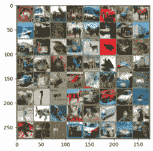
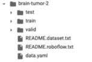
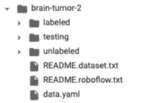
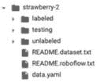
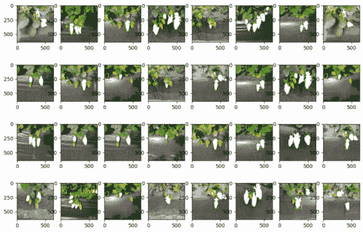

# 4

# 将主动学习应用于计算机视觉

在本章中，我们将深入探讨使用主动学习技术进行计算机视觉任务。计算机视觉涉及分析图像和视频等视觉数据以提取有用信息。它严重依赖于卷积神经网络等机器学习模型。然而，这些模型需要大量的标记训练集，这可能既昂贵又耗时。主动机器学习通过交互式查询用户仅对最有信息量的示例进行标记来提供解决方案。本章演示了如何为各种计算机视觉任务实现不确定性采样。到本章结束时，您将拥有使用优化标记努力高效训练计算机视觉模型的工具。所提出的主动机器学习方法为在更少的数据需求下构建鲁棒的视觉系统开辟了新的可能性。

到本章结束时，您将能够做到以下事项：

+   在图像分类项目中实现主动机器学习

+   将主动机器学习应用于目标检测项目

+   使用主动机器学习进行实例分割项目

# 技术要求

在本章中，您需要安装 Ultralytics、PyYAML 和 Roboflow 包。

Ultralytics 是一个流行的开源 Python 库，用于构建高性能计算机视觉和深度学习模型。它提供了包括 YOLO 在内的最先进的对象检测和图像分割模型的实现，这些模型可以在自定义数据集上训练。

PyYAML 是一个 Python 库，用于读取和写入 YAML 文件。YAML 是一种人类可读的数据序列化格式。PyYAML 允许将 YAML 数据从文件或字符串加载到 Python 数据类型，如字典和列表。它还可以将 Python 对象转储回 YAML 字符串。

如前几章所述，Roboflow 是一个帮助准备和管理计算机视觉模型数据集的平台。它提供了注释图像、创建训练/测试分割以及以 PyTorch 等深度学习框架可用的格式导出标记数据集的工具。Roboflow 还与 Ultralytics 等库集成，以简化训练流程。主要目标是简化开发 CV 模型的数据集管理方面。

要安装这些包，我们可以运行以下代码：

```py
pip install ultralytics && pip install pyyaml && pip install roboflow
```

您还需要以下导入：

```py
import torch
from torch.utils.data import DataLoader, Subset
import torch.nn as nn
import torch.nn.functional as F
from torchvision import transforms
import torchvision
import torch.optim as optim
import matplotlib.pyplot as plt
import numpy as np
from tqdm import tqdm
from roboflow import Roboflow
import glob
import os
import yaml
import cv2
```

此外，您还需要一个 Roboflow 账户以获取 Roboflow API 密钥。您可以在以下链接创建账户：[`app.roboflow.com/`](https://app.roboflow.com/).

# 在图像分类项目中实现主动机器学习

在本节中，我们将指导您实现图像分类项目的主动机器学习技术。图像分类在计算机视觉领域有各种应用，从为电子商务网站识别产品到检测地理空间瓦片上的森林砍伐模式。然而，创建准确的图像分类器需要大量的标记图像数据集，这可能会非常昂贵且耗时，如第一章中所述，*介绍主动机器学习*。主动机器学习通过交互式请求仅对最有信息量的示例进行标记，为这一标记瓶颈提供了解决方案。

我们将构建一个图像分类模型，该模型能够准确地对从 CIFAR-10 数据集中获得的各类图像进行分类。这个数据集在计算机视觉领域广为人知，包含了一个多样化的 60,000 张图像集合，每张图像属于 10 个不同的类别之一。我们将从 CIFAR-10 数据集中的 2,000 张小批量的标记图像开始，然后采用主动机器学习策略来选择最佳图像展示给标记者进行标记。具体来说，我们将使用不确定性采样来查询模型最不确定的示例。我们在这里使用不确定性采样，因为它比我们之前讨论的其他方法更简单且计算成本更低。例如，委员会查询需要训练多个模型，这计算成本较高。

随着获取的标签越来越多，模型精度随着训练样本数量的减少而提高。这展示了主动学习如何以显著较低的数据需求创建高性能的计算机视觉模型。

## 为 CIFAR 数据集构建 CNN

实现将包括初始化一个**卷积神经网络**（**CNN**）分类器，使用小批量的标记数据集训练我们的模型，使用主动机器学习选择下一标记步骤的未标记图像，获取新的标签，重新训练模型，并跟踪模型性能。

快速提醒

CNN 分类器以图像为输入，使用卷积提取特征图，在完全连接层中整合特征，并根据训练期间学习到的内容输出预测的类别概率。卷积允许它自动学习相关的视觉模式，这使得 CNN 对于图像分类任务非常有效。您可以在 PyTorch 官方教程中找到构建神经网络模型的说明，请参阅[`pytorch.org/tutorials/beginner/blitz/neural_networks_tutorial.html#sphx-glr-beginner-blitz-neural-networks-tutorial-py`](https://pytorch.org/tutorials/beginner/blitz/neural_networks_tutorial.html#sphx-glr-beginner-blitz-neural-networks-tutorial-py)。

让我们创建一个简单的图像分类模型：

```py
class Net(nn.Module):
    def __init__(self):
        super().__init__()
# First convolutional layer with 6 output channels, 5x5 kernel
        self.conv1 = nn.Conv2d(3, 6, 5)
# Max pooling layer with 2x2 window and default stride
        self.pool = nn.MaxPool2d(2, 2)
# Second convolutional layer with 16 output channels, 5x5 kernel
        self.conv2 = nn.Conv2d(6, 16, 5)
# First fully connected layer
# Flattened input size determined by conv2 output shape
        self.fc1 = nn.Linear(16 * 5 * 5, 120)
# Second fully connected layer with 84 nodes
        self.fc2 = nn.Linear(120, 84)
# Final fully connected output layer
# 10 nodes for 10 image classes
        self.fc3 = nn.Linear(84, 10)
    def forward(self, x):
# Pass input through first conv and activation
        x = self.pool(F.relu(self.conv1(x)))
# Second conv and activation, then pool
        x = self.pool(F.relu(self.conv2(x)))
# Flatten input for first fully connected layer
        x = torch.flatten(x, 1)
# Pass through all fully connected layers and activations
        x = F.relu(self.fc1(x))
        x = F.relu(self.fc2(x))
        x = self.fc3(x)
        return x
```

注意，我们使用这个模型是因为它是一个运行快速且高效的较小 CNN。这对于运行简单的概念验证很有帮助。然而，接下来，我们可以使用预训练模型之一（例如`torchvision`，如下所示：

```py
from torchvision import models
model = models.resnet18(pretrained=True)
model = models.mobilenet_v2(pretrained=True)
```

您可以在库的模型页面上找到所有`torchvision`预训练模型：[`pytorch.org/vision/stable/models.html`](https://pytorch.org/vision/stable/models.html)。

现在，我们使用适当的转换函数加载 CIFAR-10 数据集。转换函数定义了一系列在从 PyTorch 数据集中获取样本时自动应用的数据处理和增强操作。在下面的代码中，我们将图像转换为张量并对它们进行归一化：

```py
transform = transforms.Compose(
[transforms.ToTensor(),
transforms.Normalize((0.5, 0.5, 0.5), (0.5, 0.5, 0.5))])
full_dataset = torchvision.datasets.CIFAR10(
    root='cifar10', train=True, download=True, transform=transform)
print(len(full_dataset))
```

这个打印结果显示，完整训练数据集的长度是 50,000 张图像。我们使用 CIFAR-10 训练数据集是因为我们将`train=True`的布尔值设置为 True。稍后，我们将使用 CIFAR-10 的测试集，并将`train=False`设置为 False。

现在，我们将创建一个包含 2,000 个标记图像的小型数据集。这里的目的是模拟存在一个小型标记图像集，而其余图像未标记。我们的目标是使用主动机器学习识别和选择下一个标记的最具信息量的图像：

```py
init_indices = list(range(2000)) # indices for initial our "labeled" set
labeled_set = Subset(full_dataset, init_indices)
```

因此，我们已经创建了一个小型标记数据集，现在需要初始化我们的训练 PyTorch 数据加载器。**PyTorch 数据加载器**用于加载和迭代用于训练神经网络的数据集。它接受包含实际图像和标签的数据集，并负责将这些样本分批并馈送到模型。数据加载器允许您指定批大小，这决定了多少个样本被一起分批 – 这通常设置为 64 或 128 等。此外，如果您使用它作为训练集，数据加载器默认会打乱数据。这种样本顺序的随机化有助于模型在训练期间更好地泛化：

```py
# Data loaders
labeled_loader = DataLoader(labeled_set, batch_size=64, shuffle=True)
```

下一步是初始化我们的模型。我们知道 CIFAR-10 有 10 个类别：

```py
classes = ('plane', 'car', 'bird', 'cat', 'deer', 'dog', 'frog', 
    'horse', 'ship', 'truck')
model = Net(n_classes=len(classes))
```

一个好的做法是可视化我们正在处理的数据：

```py
def imshow(img):
    img = img / 2 + 0.5     # unnormalize
    npimg = img.numpy()
    plt.imshow(np.transpose(npimg, (1, 2, 0)))
    plt.show()
# get some random training images
dataiter = iter(labeled_loader)
images, labels = next(dataiter)
# show images
imshow(torchvision.utils.make_grid(images))
```

*图 4.1*展示了 CIFAR-10 数据集图像的一个样本。



图 4.1 – 一些 CIFAR-10 数据集图像的随机可视化

最好也看一下这些标签，所以让我们打印前五个标签：

```py
print(' '.join(f'{classes[labels[j]]:5s}' for j in range(5)))
```

前面的代码返回以下标签列表作为输出：

```py
frog  truck truck deer  car
```

我们可以通过将这些标签与*图 4.1*中的前五张图像进行交叉引用来验证这是否正确。

什么是反归一化？

**反归一化**一张图像意味着反转之前应用于图像像素值的任何归一化，以便恢复原始像素值分布（从 0-1 范围到原始 0-255 范围）。

现在我们有了数据加载器，我们可以开始训练循环；我们首先定义我们的损失函数和优化器。**损失函数**衡量模型预测与一批图像的真实标签匹配的程度。它计算预测标签和真实标签之间的误差。常见的分类损失函数包括交叉熵损失和负对数似然损失。如果模型预测了错误的标签，这些损失函数将输出一个高数值，如果预测准确，则输出一个低数值。训练的目标是通过更新模型参数来最小化损失。有关 PyTorch 中可用的损失函数的更多信息，可以在此处找到：[`pytorch.org/docs/stable/nn.html#loss-functions`](https://pytorch.org/docs/stable/nn.html#loss-functions)。

**优化器**负责参数更新。它使用损失值执行反向传播并更新模型的权重和偏差以减少损失。**随机梯度下降**（**SGD**）是一种流行的优化算法，其中参数的更新与损失函数的梯度成比例。学习率控制更新的大小。其他如**Adam**和**RMSProp**等优化器也常用于深度学习模型（有关 PyTorch 中可用的优化函数的更多信息，您可以访问此链接：[`pytorch.org/docs/stable/optim.html`](https://pytorch.org/docs/stable/optim.html)）：

```py
criterion = nn.CrossEntropyLoss()
optimizer = optim.SGD(model.parameters(), lr=0.001, momentum=0.9)
```

我们将训练我们的模型 100 个 epoch。Epoch 表示在模型训练过程中通过完整训练数据集的次数。我们定义一个`train`函数如下以运行我们的训练：

```py
def train(model, data_loader, epochs = 100):
    criterion = nn.CrossEntropyLoss()
    optimizer = optim.SGD(model.parameters(), lr=0.01, momentum=0.9)
    for epoch in range(epochs):  # loop over the dataset multiple times
        running_loss = 0.0
        for i, data in enumerate(data_loader, 0):
# get the inputs; data is a list of [inputs, labels]
            inputs, labels = data
# zero the parameter gradients
            optimizer.zero_grad()
# forward + backward + optimize
            outputs = model(inputs)
            loss = criterion(outputs, labels)
            loss.backward()
            optimizer.step()
# print statistics
            running_loss += loss.item()
            if i % 10 == 9:    # print every 10 mini-batches
                print(f'[{epoch + 1}, {i + 1:5d}] loss: {
                    running_loss / 2000:.3f}')
                running_loss = 0.0
    print('Finished Training')
    return model
```

然后，我们开始训练：

```py
model = train(model, labeled_loader)
```

我们现在在我们的小型数据集上有一个初始训练好的模型，我们想用它来选择下一个要标记的图像。但首先，让我们在 CIFAR-10 测试集上评估这个模型。我们定义一个评估函数：

```py
def evaluate(model, test_dataset, batch_size=1):
    # Testing
    model.eval()
    test_loader = torch.utils.data.DataLoader(test_dataset, 
        batch_size)
    correct = 0
    total = 0
    with torch.no_grad():
        for images, labels in tqdm(test_loader):
            outputs = model(images)
            _, predicted = torch.max(outputs.data, 1)
            total += labels.size(0)
            correct += (predicted == labels).sum().item()
    print('\nAccuracy of the model on the test images: {} 
        %'.format(100 * correct / total))
```

我们可以定义测试集后使用此函数与我们的训练好的模型：

```py
test_set = torchvision.datasets.CIFAR10(
    root='data', train=False, transform=transform, download=True)
print(len(test_set))
```

测试集的长度是 10,000。

让我们使用我们的评估函数与这个测试集：

```py
evaluate(model, test_set)
```

这给我们以下结果：

```py
Accuracy of the model on the test images: 40.08 %
```

因此，我们现在已经测试了我们第一个训练好的模型，该模型是在我们的初始小型标记集的 2,000 个图像上训练的。模型在测试集上的准确率为 40.08%。我们的目标是通过标记更多图像来提高这个准确率。这就是我们的主动机器学习选择策略发挥作用的地方。

## 应用不确定性采样以改进分类性能

我们将从我们的数据集中选择最具信息量的图像进行标记，即模型最不自信的帧，这是在第*第二章*，*设计查询策略框架*中讨论的方法。

我们首先定义一个函数来获取模型的不确定性分数：

```py
def least_confident_score(predicted_probs):
    return 1 - predicted_probs[np.argmax(predicted_probs)]
```

然后，我们为未标记集定义我们的数据加载器。由于我们将遍历所有图像以获取不确定性分数，我们将使用批大小为 1：

```py
unlabeled_loader = DataLoader(full_dataset, batch_size=1)
```

我们收集了我们一组**未标记**图像的置信度分数：

```py
least_confident_scores = []
for image, label in unlabeled_loader:
    probs = F.softmax(model(image), dim=1)
    score = least_confident_score(probs.detach().numpy()[0])
    least_confident_scores.append(score)
print(least_confident_scores)
```

这返回了以下结果：

```py
[0.637821763753891, 0.4338147044181824, 0.18698161840438843, 0.6028554439544678, 0.35655343532562256, 0.3845849633216858, 0.4887065887451172, ...]
```

这些值代表模型预测的**最低置信度分数**。分数越高，模型越不自信。因此，接下来，我们想知道分数最高的图像索引。我们决定要选择 200 张图像（查询）：

```py
num_queries = 200
```

然后，我们按不确定性排序：

```py
sorted_uncertainties, indices = torch.sort(
    torch.tensor(least_confident_scores))
```

我们获取最不确定样本的原始索引并打印结果：

```py
most_uncertain_indices = indices[-num_queries:]
print(f"sorted_uncertainties: {sorted_uncertainties} \
    nmost_uncertain_indices selected: {most_uncertain_indices}")
```

这返回了以下结果：

```py
sorted_uncertainties: tensor([0.0000, 0.0000, 0.0000,  ..., 0.7419, 0.7460, 0.7928], dtype=torch.float64)
most_uncertain_indices selected: tensor([45820, 36802, 15912,  8635, 32207, 11987, 39232,  6099, 18543, 29082, 42403, 21331,  5633, 29284, 29566, 23878, 47522, 17097, 15229, 11468, 18130, 45120, 25245, 19864, 45457, 20434, 34309, 10034, 45285, 25496, 40169, 31792, 22868, 35525, 31238, 24694, 48734, 18419, 45289, 16126, 31668, 45971, 26393, ... 44338, 19687, 18283, 23128, 20556, 26325])
```

现在我们有了使用我们的主动 ML 最不自信策略选择的图像索引。这些是会被发送到我们的预言机进行标记，然后用于再次训练模型的图像。

让我们看看这五张选定的图像：

```py
fig, axs = plt.subplots(1, 5)
for i in range(5):
    image, label = full_dataset[most_uncertain_indices[i]]
    image = image.squeeze().permute(1, 2, 0) / 2 + 0.5
    axs[i].imshow(image)
    axs[i].axis('off')
plt.show()
```


图 4.2 – 下一个要标记的五张选择的图像

我们现在有了需要标记的图像。由于这是一个演示，我们已经有标签了，所以让我们用这些新标记的图像重新训练我们的模型。首先，我们需要将这些图像添加到我们的标记集中：

```py
init_indices.extend(most_uncertain_indices)
labeled_set_2 = Subset(full_dataset, init_indices)
labeled_loader_2 = DataLoader(labeled_set, batch_size=64)
print(len(labeled_set_2))
```

这返回了 2,200，这是正确的，因为我们首先从我们的数据集中选择了 2,000 张图像，然后使用我们的主动 ML 采样查询了 200 张。

让我们从 100 个 epoch 开始重新从头开始训练：

```py
model_2 = Net(n_classes=len(classes))
model_2 = train(model_2, labeled_loader_2)
```

然后，在测试集上运行评估：

```py
evaluate(model_2, test_set)
```

这返回了以下结果：

```py
Accuracy of the model on the test images: 41.54 %
```

通过将使用我们的主动 ML 策略选择的图像添加到训练数据集中，我们将测试集上的准确率从 40.08%提高到了 41.54%。我们还可以按照以下方式微调最初训练的模型：

```py
model = train(model, labeled_loader_2)
evaluate(model, test_set)
```

这给出了以下结果：

```py
Accuracy of the model on the test images: 40.84 %
```

这里有一个有趣的结果：微调模型的表现不如从头开始使用更大数据集训练的模型。总体而言，当添加由主动 ML 选择的图像时，模型的表现有所提高。

这种方法可以应用于现实世界的问题。然而，需要注意的是，这只是一个如何使用最不自信采样方法进行分类的基本演示。在实际项目中，你需要有预言机对所选图像进行标记。此外，你可能会需要查询超过 200 张图像，并使用一个更大的预训练模型，如前所述。

虽然前面的例子展示了主动 ML 在图像分类中的应用，但相同的原理也可以应用于其他计算机视觉任务，例如目标检测，我们将在下面看到。

# 将主动 ML 应用于目标检测项目

在本节中，我们将指导您实现针对目标检测项目的主动机器学习技术。目标检测项目指的是开发一个计算机视觉模型，用于在图像或视频中检测和定位对象。数据集是一组包含您想要检测的对象示例的图像（视频帧），以及其他内容。数据集需要以对象周围的边界框形式包含标签。用于此目的的流行数据集包括**COCO** ([`cocodataset.org/`](https://cocodataset.org/))、**PASCAL VOC** ([`host.robots.ox.ac.uk/pascal/VOC/`](http://host.robots.ox.ac.uk/pascal/VOC/))和**OpenImages** ([`storage.googleapis.com/openimages/web/index.html`](https://storage.googleapis.com/openimages/web/index.html))。模型架构使用专为对象检测设计的神经网络，如 Faster R-CNN、YOLO 等。这种架构可以自动在视觉数据中识别和定位现实世界中的对象。最终结果是能够检测并在对象周围绘制边界框的模型，例如汽车、人、家具等。

目标检测项目面临与分类项目相同的问题：创建数据集既困难又耗时。实际上，对于目标检测任务来说，这更具挑战性，因为它涉及到手动在对象周围绘制边界框。再次强调，主动机器学习通过将最有信息量的图像发送到仲裁者进行标记，为这个标记瓶颈提供了解决方案。我们将构建一个能够定位脑肿瘤的目标检测模型。我们将使用的数据集来自 Roboflow Universe ([`universe.roboflow.com/`](https://universe.roboflow.com/))，被称为*脑肿瘤计算机视觉项目*。为了下载这个数据集，我们使用 Roboflow API：

```py
rf = Roboflow(api_key="your_key")
project = rf.workspace("roboflow-100").project("brain-tumor-m2pbp")
dataset = project.version(2).download("yolov8")
```

这将在本地下载数据集。数据集以*图 4.3*中所示的结构作为一个文件夹下载。



图 4.3 – Roboflow Universe 数据集的文件夹结构，brain-tumor-m2pbp

## 准备和训练我们的模型

接下来，我们需要修复`data.yaml`文件，以便在 Google Colab 中正常工作，并为我们的主动机器学习演示组织数据。`data.yaml`文件在`ultralytics`训练中用于指定不同的集合（`train`、`valid`和`test`）的位置。我们假设原始训练集是我们的未标记图像集，验证集是我们的测试数据，测试集是我们的标记数据，因为它包含的示例最少。因此，首先，我们定义一个函数来相应地重命名文件夹：

```py
def rename_folders(current_folder_name, new_folder_name):
    # Check if the folder exists
    if os.path.exists(current_folder_name):
        # Rename the folder
        os.rename(current_folder_name, new_folder_name)
    else:
        print(f'The folder {current_folder_name} does not exist.')
# Now let's run it on our three folders train, valid, and test:
rename_folders(current_folder_name='/content/brain-tumor-2/train',
    new_folder_name='/content/brain-tumor-2/unlabeled')
rename_folders(current_folder_name='/content/brain-tumor-2/valid',
    new_folder_name='/content/brain-tumor-2/testing')
rename_folders(current_folder_name='/content/brain-tumor-2/test',
    new_folder_name='/content/brain-tumor-2/labeled')
```



图 4.4 – 重命名子文件夹后数据集的结构

*图 4**.4*显示了我们在对演示中的文件夹进行重命名后，现在在我们脑肿瘤数据集中拥有的结构。然后我们修改`data.yaml`文件：

```py
path_data_yaml = '/content/brain-tumor-2/data.yaml'
with open(path_data_yaml, 'r') as file:
    data = yaml.safe_load(file)
data['train'] = 'labeled/images'
data['val'] = ''
data['test'] = 'testing/images'
with open(path_data_yaml, 'w') as file:
    yaml.dump(data, file)
```

在这里，我们在`data.yaml`文件中重命名了子文件夹路径，这是我们用于训练的文件。我们目前不想在训练中使用`val`文件夹。

现在我们来看看我们的子文件夹，以确定其中一个文件夹中的图片数量：

```py
unlabeled_files = glob.glob('/content/brain-tumor-2/unlabeled/images/*.jpg')
labeled_files = glob.glob('/content/brain-tumor-2/labeled/images/*.jpg')
testing_files = glob.glob('/content/brain-tumor-2/testing/images/*.jpg')
print(f"For our demo, we have {len(unlabeled_files)} unlabeled files,
    {len(labeled_files)} labeled files, and {len(testing_files)} 
    testing files")
```

上述代码返回以下内容：

```py
For our demo, we have 6930 unlabeled files, 990 labeled files, and 1980 testing files
```

我们现在可以开始在我们的`labeled`数据集上进行初始训练。为此训练，我们将使用一个广泛使用的 Python 计算机视觉包，称为`ultralytics` ([`github.com/ultralytics/ultralytics`](https://github.com/ultralytics/ultralytics))，并使用`yolov8`模型。`yolov8`模型能够执行检测和跟踪、实例分割、图像分类和姿态估计等任务。为了演示目的，我们将只训练我们的模型 10 个 epoch。我们使用`detect`任务类型，因为我们想训练模型进行目标检测：

```py
from ultralytics import YOLO
model = YOLO('yolov8s.pt')
print('Start training ')
results = model.train(data=path_data_yaml,
    batch=32,
    task='detect',
    mode='train',
    epochs=10
    )
```

## 分析评估指标

一旦训练完成，我们就在测试集上对其进行评估。以下是评估模型的方法：

```py
metrics = model.val(data=path_data_yaml, split='test')
print(metrics.results_dict)
```

上述代码返回以下输出：

```py
{'metrics/precision(B)': 0.6022637781613859,
'metrics/recall(B)': 0.4763619681952341,
'metrics/mAP50(B)': 0.4953616848732552,
'metrics/mAP50-95(B)': 0.2252478418006819,
'fitness': 0.25225922610793927}
```

让我们分析这些指标：

+   `precision(B)`衡量预测的边界框中有多少是正确的。0.60 的值意味着 60%的预测框与真实框匹配。

+   `recall(B)`衡量有多少真实框被正确检测到。0.48 的值意味着模型检测到了 48%的真实框。

+   `mAP50(B)`是在**交并比**（**IoU**）阈值为 50%时的平均精度，它衡量了模型在不同置信度阈值下的精度。如果预测与真实框的 IoU 至少为 50%，则认为预测是正确的。0.50 的值意味着模型在这个 IoU 阈值下有 50%的 mAP。

+   `mAP50-95(B)`是在 50%到 95%的 IoU 阈值之间的平均精度，这是一个更严格的指标，它期望与真实框有更高的重叠才能被认为是正确的。0.23 的较低值表明在更高的 IoU 阈值下性能下降。

+   `fitness`结合了精度和召回率。一个在精度上得分高但在召回率上得分低的模型会有较差的适应性。同样，高召回率但低精度也会导致适应性差。高适应性分数需要在精度和召回率指标上都有良好的表现。这鼓励模型在训练过程中提高检测的准确性和完整性。这里 0.25 的具体适应性值表明在精度、召回率或两者方面都有很大的改进空间。

指标显示精度相当好，但召回率较低，这意味着模型难以检测到所有真实框。高精度但低 mAP 表明许多检测偏离了真实框。总体而言，指标显示在检测的对齐和完整性方面仍有改进空间。

下一步是使用我们的主动机器学习（ML）方法选择最具有信息量的图像进行标注。

## 实施主动机器学习策略

我们将使用`ultralytics`包，这个包非常有用，可以帮助我们选择具有信息量的图像。这可以帮助我们提高我们刚才讨论的指标。此包为每个边界框预测提供置信度分数，我们将在这里使用它。

我们使用置信度阈值`0.15`将模型应用于未标注集中的每个图像。这意味着任何置信度分数低于 0.15 的预测将被丢弃。你可以根据你的具体需求和用例选择这个值。重要的是要记住，选择一个低的置信度分数阈值允许选择模型缺乏信心的图像：

```py
results = model(os.path.join('/content/brain-tumor-2/', 
    'unlabeled/images'), verbose=False, conf=0.15)
```

让我们看看一些这些图像和预测到的边界框：

```py
plt.figure(figsize=(12, 8))
for i in range(1, 33):
    plt.subplot(4,8,i)
    image = results[i].orig_img
    for b in results[i].boxes.xywhn:
        x, y, w, h = b.tolist()
# Convert YOLO format coordinates to OpenCV format coordinates
        dh, dw, _ = image.shape
        l = int((x - w / 2) * dw)
        r = int((x + w / 2) * dw)
        t = int((y - h / 2) * dh)
        b = int((y + h / 2) * dh)
        cv2.rectangle(image, (l, t), (r, b), (0, 255, 0), 1)
    plt.imshow(image)
plt.show()
```


图 4.5 – 未标注集图像上的模型预测样本

我们可以在*图 4.5**.5*中看到模型正在检测未标注的脑部图像中的肿瘤。

让我们收集所有预测边界框的置信度分数：

```py
confidences = []
for result in results:
    confidences.append(result.boxes.conf)
```

我们只为每张图像保留最低的置信度值。如果没有预测到的边界框，我们添加一个置信度分数为`10`（一个高值，将这些图像放在潜在图像列表的末尾）。置信度分数是介于 0 到 1 之间的值，其中 1 表示高：

```py
confidence_scores = []
for confidence in confidences:
    if len(confidence) > 0:
        confidence_scores.append(np.min(np.array(confidence.cpu())))
    else:
        confidence_scores.append(10)
print(confidence_scores)
```

我们有 6,930 个置信度分数，这是正确的，因为我们有 6,930 个未标注的文件。

接下来，我们选择 500 张置信度分数最低的图像：

```py
num_queries = 500
# Sort by uncertainty
sorted_uncertainties, indices = torch.sort(torch.tensor(confidence_scores))
# Get original indices of most uncertain samples
most_uncertain_indices = indices[-num_queries:]
 print(f"sorted_uncertainties: {sorted_uncertainties[0:num_queries]} \
    nmost_uncertain_indices selected: {most_uncertain_indices}")
```

这返回以下结果：

```py
sorted_uncertainties: tensor([0.1500, 0.1500, 0.1501, 0.1501, 0.1501, 0.1501, ..., 0.1598, 0.1598, 0.1598, 0.1599, 0.1599, 0.1599, 0.1599, 0.1599, 0.1600])
most_uncertain_indices selected: tensor([4714, 4713, 4712, 4304, 4305, 4306,  ...., 5554, 5553, 5552, 5551, 5550, 5549, 5548, 5547, 3135, 5544, 5543])
```

现在我们得到了以下选定的图像：

```py
images_selected = np.array(
    glob.glob(os.path.join('/content/brain-tumor-2/', 
        'unlabeled/images', '*.jpg'))
)[np.array(most_uncertain_indices)]
```

我们将这些选定的图像（及其相应的标签文件）移动到我们的标注集中 – 这模拟了我们将有神谕标注这些图像的步骤：

```py
import shutil
for image_path in images_selected:
    shutil.move(image_path, image_path.replace('unlabeled', 
        'labeled'))
    label_file = image_path.replace('images', 'labels').replace('.jpg', '.txt')
    shutil.move(label_file, label_file.replace('unlabeled', 
        'labeled'))
```

让我们检查我们是否正确地移动了图像和标签文件：

```py
images_labeled = glob.glob('/content/brain-tumor-2/labeled/images/*.jpg')
labels_labeled = glob.glob('/content/brain-tumor-2/labeled/labels/*.txt')
print(len(images_labeled))
print(len(labels_labeled))
```

这两个`print`命令都返回 1,490，这是我们预期的，因为我们有 990 个标注图像，然后添加了 500 个新的图像/标签对。

我们可以使用这个更新后的数据集再次训练我们的模型：

```py
model = YOLO('yolov8s.pt')
print('Start training ')
results = model.train(data=path_data_yaml,
    batch=32,
    task='detect',
    mode='train',
    epochs=10
    )
```

然后，我们在测试集上评估这个模型：

```py
metrics = model.val(data=path_data_yaml, split='test')
metrics.results_dict
```

现在我们得到了以下指标：

```py
{'metrics/precision(B)': 0.6469528069030884,
'metrics/recall(B)': 0.5106541285546612,
'metrics/mAP50(B)': 0.543579045283473,
'metrics/mAP50-95(B)': 0.26662268193511757,
'fitness': 0.29431831826995314}
```

将这些指标与我们之前得到的指标进行比较，我们可以看到，精确度从 0.60 提高到 0.65，召回率从 0.48 提高到 0.51，mAP50 从 0.50 提高到 0.54，mAP50-95 从 0.22 提高到 0.27，适应性从 0.25 提高到 0.29。因此，将 500 张最具信息量的图像添加到我们的标注集中，提高了我们各项指标。

我们可以使用类似的方法进行实例分割，我们将在下一节中介绍。

# 使用主动机器学习进行分割项目

在本节中，我们将重复我们在对象检测任务中做的事情，但我们将使用`yolov8`的`segment`任务的实例分割数据集，而不是使用对象检测数据集。

`person`、`car`等。实例分割将那些类别的单个实例分开 – 1 号人 versus 2 号人，或 1 号车 versus 2 号车。

定位、分类和实例分离的组合使得可以精确分析图像直到像素级别。这使得实例分割在需要精细级别理解场景的应用中非常有用，例如自动驾驶、医学成像和机器人技术。一些流行的实例分割算法和模型包括**Mask R-CNN** ([`arxiv.org/abs/1703.06870`](https://arxiv.org/abs/1703.06870))、**Panoptic FPN** ([`arxiv.org/abs/1901.02446`](https://arxiv.org/abs/1901.02446))和**YOLACT** ([`arxiv.org/abs/1904.02689`](https://arxiv.org/abs/1904.02689))。

让我们从 Roboflow 宇宙下载`strawberry`数据集

```py
rf = Roboflow(api_key="your_key")
project = rf.workspace("5060tanapoowapat-yumsarn").project("strawberry-2vs5u")
dataset = project.version(2).download("yolov8")
```

然后，我们按照前面章节中针对对象检测数据集所遵循的相同步骤进行操作。我们为我们的演示用例重命名子文件夹并更新 YAML 文件。最终我们得到了*图 4**.6*中所示的架构。



图 4.6 – 重命名子文件夹后的草莓数据集结构，用于我们的演示

对于这个数据集，在重命名文件夹并更新 YAML 文件后，代码返回以下内容：

```py
For our demo, we have 3006 unlabeled files, 184 labeled files, and 659 testing files
```

由于我们现在正在训练实例分割，我们更新训练代码如下：

```py
model = YOLO('yolov8n-seg.pt')
print('Start training ')
results = model.train(data=path_data_yaml,
    batch=16,
    task='segment',
    mode='train',
    epochs=10
    )
```

一旦训练完成，我们使用与上一个项目相同的代码评估模型，并得到以下指标：

```py
{'metrics/precision(B)': 0.673169825129636,
'metrics/recall(B)': 0.7297833796885302,
'metrics/mAP50(B)': 0.7664149988792639,
'metrics/mAP50-95(B)': 0.533442993245899,
'metrics/precision(M)': 0.7415224838967787,
'metrics/recall(M)': 0.7482014388489209,
'metrics/mAP50(M)': 0.8165979711704425,
'metrics/mAP50-95(M)': 0.5967313838152124,
'fitness': 1.175458236359971}
```

带有`(B)`的指标代表目标检测的指标，而带有`(M)`的指标指的是实例分割，其中`M`代表蒙版。两种类型的指标相同；唯一的区别是`M`指标是在蒙版的像素上计算的，而不是在边界框的像素上。

按照相同的逻辑，我们然后选择要标记的图像以提高我们的指标。

当我们在未标记集中的每张图像上运行模型时，代码略有不同：

```py
results = model(os.path.join(f'/content/{dataset_name}/',
    'unlabeled/images'), verbose=False, conf=0.25, task='segment')
```

我们必须指定我们正在进行分割任务，并选择一个更高的置信度阈值，以避免在 Colab 中发生内存问题。

让我们看看模型对一些未标记图像的预测：

```py
plt.figure(figsize=(12, 8))
# Generate a list of 32 random integers between 0 and 100
random_integers = [random.randint(0, 100) for _ in range(32)]
for i, index in enumerate(random_integers):
    plt.subplot(4,8,i+1)
    image = results[index].orig_img
    for b in results[index].boxes.xywhn:
        x, y, w, h = b.tolist()
        # Convert YOLO format coordinates to OpenCV format coordinates
        dh, dw, _ = image.shape
        l = int((x - w / 2) * dw)
        r = int((x + w / 2) * dw)
        t = int((y - h / 2) * dh)
        b = int((y + h / 2) * dh)
    cv2.rectangle(image, (l, t), (r, b), (0, 255, 0), 2)
    if results[index].masks:
        overlayed_image = image.copy()
        for m in results[index].masks:
            # Make sure both images are of data type uint8
            mask = np.array(m.data.cpu()[0])
            mask = cv2.cvtColor(mask, cv2.COLOR_GRAY2BGR)
            image = image.astype(np.uint8)
            mask = mask*255
            mask = mask.astype(np.uint8)
            # Overlay the mask on the RGB image
            overlayed_image = cv2.addWeighted(overlayed_image, 1, 
                mask, 0.8, 0)
    plt.imshow(cv2.cvtColor(overlayed_image, cv2.COLOR_BGR2RGB))
plt.show()
```

这返回了*图 4**.7*中所示的照片。



图 4.7 – 从未标记集图像上的模型预测样本

在**图 4**.7 中，我们可以看到模型正确地检测到了大部分的草莓。图像中的绿色边界框表示目标检测，而白色叠加的蒙版表示分割。

然后，我们遵循前面章节中讨论的对象检测步骤，选择了 500 张图像进行标记，并得到以下结果：

```py
sorted_uncertainties: tensor([0.2500, 0.2501, 0.2501, 0.2501, 0.2501, 0.2502, 0.2503, 0.2503, 0.2503, 0.2503, 0.2503,..., 0.2703, 0.2703, 0.2703, 0.2703, 0.2703, 0.2704, 0.2704, 0.2704, 0.2704, 0.2704])
most_uncertain_indices selected: tensor([2744,  806, 1822, 1025, 1486,  345,  743, 1374, 2329, 1381,  301, 2322, 2272, 1196, ..., 2127, 2004, 2119, 2118, 1401, 1402, 2666, 2105,  100,   47, 2093,   46, 2092, 2085,  970, 1422])
```

我们将这些图像移动到我们的标记集中，因此从标记集中的 184 张图像增加到 684 张。我们在更新后的标记集上运行训练，然后进行评估，并得到以下指标：

```py
{'metrics/precision(B)': 0.7522007556106134,
'metrics/recall(B)': 0.7570614064930203,
'metrics/mAP50(B)': 0.800552933790843,
'metrics/mAP50-95(B)': 0.6079730626509038,
'metrics/precision(M)': 0.8061734224988162,
'metrics/recall(M)': 0.8069544364508393,
'metrics/mAP50(M)': 0.8511208111235853,
'metrics/mAP50-95(M)': 0.6554160034789296,
'fitness': 1.3022175340082929}
```

让我们比较一下在添加了 500 张最有信息量的图像之前的指标：

```py
{'metrics/precision(B)': 0.673169825129636,
'metrics/recall(B)': 0.7297833796885302,
'metrics/mAP50(B)': 0.7664149988792639,
'metrics/mAP50-95(B)': 0.533442993245899,
'metrics/precision(M)': 0.7415224838967787,
'metrics/recall(M)': 0.7482014388489209,
'metrics/mAP50(M)': 0.8165979711704425,
'metrics/mAP50-95(M)': 0.5967313838152124,
'fitness': 1.175458236359971}
```

我们可以观察到所有指标都有所提高。

# 摘要

总结来说，本章展示了如何将主动机器学习应用于优化计算机视觉模型的训练。正如我们所见，图像分类、目标检测和实例分割等计算机视觉任务需要大量的标记数据集来训练**卷积神经网络**（**CNNs**）。手动收集和标记如此大量的数据既昂贵又耗时。

主动机器学习通过智能选择最具有信息量的示例由人类专家进行标记，从而为这一挑战提供了解决方案。例如，不确定性采样策略会查询模型以找到它最不确定的数据点。通过仅标记这些有用的数据点，我们可以用显著减少的数据标记工作来训练我们的模型。

在本章中，我们介绍了为各种计算机视觉应用实现主动机器学习方法的步骤。通过交互式查询模型和细化训练数据，我们可以以标记成本的一小部分快速提高模型性能。这些技术使得即使在有限数据的情况下开发计算机视觉系统也成为可能。

本章节中提出的主动机器学习实现提供了在无需大量数据集的情况下构建高性能和鲁棒的计算机视觉模型的新可能性。通过这些策略，您可以优化和针对数据收集和训练工作以实现高效的结果。展望未来，主动机器学习将成为开发现实世界计算机视觉系统的一个基本工具。

在下一章中，我们将探讨如何利用主动机器学习来处理使用大量数据的大数据项目，例如视频。
