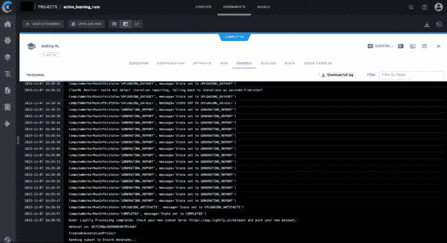
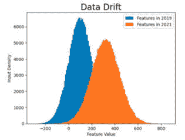
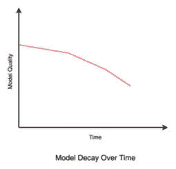

# 6

# 评估和提升效率

在本章中，我们将探讨严格评估主动机器学习系统性能的重要方面。我们将涵盖自动化、测试、监控和确定停止标准等各个主题。在本章中，我们将使用付费云服务，如 AWS，来演示如何在现实世界中实现自动、高效的主动学习管道。

通过彻底理解这些概念和技术，我们可以确保一个全面的主动机器学习过程，从而产生准确和可靠的结果。通过这次探索，我们将深入了解主动机器学习系统的有效性和效率，使我们能够做出明智的决定和改进。

到本章结束时，我们将涵盖以下内容：

+   创建高效的主动机器学习管道

+   监控主动机器学习管道

+   确定何时停止主动机器学习运行

+   通过主动机器学习增强生产模型监控

# 技术要求

对于本章，您需要以下内容：

+   MongoDB 账户：([`www.mongodb.com/`](https://www.mongodb.com/))

+   ClearML 账户：([`app.clear.ml/`](https://app.clear.ml/))

+   GPU：您可以从您将使用的工具的网页上检查具体的硬件要求

+   一个考虑成本因素的 EC2 实例

在本章中，您需要安装以下包：

```py
pip install clearml
pip install pymongo
```

您需要以下导入：

```py
import os
from clearml import Task, TaskTypes
import pymongo
import datetime
```

# 创建高效的主动机器学习管道

正如我们在上一章中看到的，高效的主动机器学习管道由端到端管道组成。这意味着主动机器学习算法需要能够访问未标记的数据，选择最有信息量的帧，然后将它们无缝发送到标记平台。所有这些步骤都需要依次自动进行，以减少人工干预。

此外，测试此管道以确保每个步骤正常工作至关重要。一个云托管主动机器学习管道的例子如下：

1.  未标记的数据存储在 AWS S3 桶中。

1.  一个主动机器学习算法在可以访问 S3 桶的 EC2 实例上运行。

1.  主动机器学习运行的成果保存在专门用于此目的的 S3 桶中，并与用于项目的标记平台相关联。

1.  主动机器学习运行的最后一步是将选定的帧链接到标记平台并创建注释项目，以便标记人员开始工作。

在选择和配置 EC2 实例以运行主动机器学习代码时，考虑效率是至关重要的。很可能需要 GPU 来执行推理和计算主动机器学习嵌入。例如，如果你使用 Lightly，你可以参考他们在此页面的硬件推荐（[`docs.lightly.ai/docs/hardware-recommendations`](https://docs.lightly.ai/docs/hardware-recommendations)）。此外，考虑所选 EC2 实例的成本并确定其是否符合你的预算也很重要。你可以在这里找到 AWS EC2 按需定价（[`aws.amazon.com/ec2/pricing/on-demand/`](https://aws.amazon.com/ec2/pricing/on-demand/)）。当你没有运行任何主动机器学习进程时，停止实例是一种良好的做法，可以节省金钱。

其他良好实践包括拥有一个 requirements.txt 文件，列出运行所需的软件包的所有版本。例如，对于在 *第五章*，*利用主动学习处理大数据* 中使用的软件包，`requirements.txt` 文件可能看起来是这样的。

```py
awscli==1.31.6
ultralytics==8.0.145
lightly==1.4.23
docker==6.1.3
encord==0.1.85
```

你可以用所需的任何版本替换任何版本；理想情况下，使用软件包的最新版本会更好。

此外，通过参数使管道可配置可以更容易地进行扩展。例如，通过 YAML 配置文件指定选项，如采样策略、模型选择和数据源。这允许在不更改代码的情况下更改管道行为，简化工作流程的集成。作为提醒，我们已经在 *第二章*，*设计查询策略框架* 中探讨了不同的采样策略，并在 *第四章*，*将主动学习应用于计算机视觉* 中探讨了计算机视觉任务的模型选择。

使用我们的 Lightly 示例配置 YAML 文件的简单示例，可以参考 *第五章*，*利用主动学习处理大数据*，可能看起来是这样的：

```py
model_path_in_s3: 's3://my-models-library/my-best-object-detection-model.pt'
inference_confidence_threshold: 0.3
proportionSamples: 0.20  # 20% of the samples
isSSLenabled: true
maxSSLepochs: 20
important_classes: {"person": 0, " sports ball": 32}
balance: true
balance_strategy:{ 'person': 0.50, 'sports ball': 0.50}
videos_folder_in_s3: "test"
s3_bucket_output: 'labeling-queue'
```

然后，可以使用此函数访问这些参数：

```py
def get_config_yaml(path_to_config_yaml="config.yaml"):
    # Open the YAML file
    with open(path_to_config_yaml, "r") as file:
        # Load the YAML content
        config = yaml.safe_load(file)
    file.close()
    return config
```

然后是以下内容：

```py
config = get_config_yaml(path_to_config_yaml="config.yaml")
model_path_in_s3 = config["model_path_in_s3"]
inference_confidence_threshold = config["inference_confidence_threshold"]
proportionSamples = config["proportionSamples"]
isSSLenabled = config["isSSLenabled"]
if isSSLenabled:
  maxSSLepochs = config['maxSSLepochs']
important_classes = config["important_classes"]
s3_bucket_output = config["s3_bucket_output"]
balance_strategy = config['balance_strategy']
if balance_strategy:
  balance = config['balance']
```

这些变量可以在 *第五章*，*利用主动学习处理大数据* 中使用，并将使其可扩展到所有工作流程和应用。

因此，对于你的项目，你只需要更改 YAML 文件，然后就可以使用这些脚本为所有项目服务，而无需修改脚本本身。

接下来，我们将探讨监控我们的主动机器学习运行并确保我们能够全面了解整个过程的解决方案。

# 监控主动机器学习管道

`logging`，这是一个多功能且内置的库。

引入如**ClearML**([`clear.ml/`](https://clear.ml/))这样的 MLOps 平台可以显著简化管道运行的监控。ClearML 提供实时统计、图形数据可视化、广泛的日志记录、模型工件以及以并排格式比较管道运行的能力。虽然 ClearML 传统上用于提高机器学习训练和部署管道的可观察性，但它对于活跃机器学习管道也非常有效，增强了其管理和监督。

```py
active_learning_runs and initialize a task within it, labeled testing-AL, which corresponds to a specific run. Once implemented, this configuration enables the automatic tracking of the run, as illustrated in *Figure 6**.1*, under the console tab of the ClearML project configured via this code snippet:
```



图 6.1 – 初始化 ClearML 运行后自动保存的控制台日志

这种集成不仅简化了监控和管理机器学习运行的过程，而且还确保所有相关数据和指标都能系统地捕获并可在 ClearML 平台上进行分析：

```py
Task.set_credentials(api_host='https://api.community.clear.ml',
                    web_host='https://app.community.clear.ml',
                    key='your_clearml_access_key',
                    secret='your_clearml_secret_key')
task = Task.init(project_name='active_learning_runs',
                task_name='testing-AL',
                task_type=TaskTypes.inference)
```

我们选择 ClearML 任务类型`TaskTypes.inference`，因为它专门设计用于促进机器学习中推理过程的全面日志记录和细致监控。此任务类型擅长细致跟踪输入数据、模型输出的预测以及一系列相关指标或性能指标，使其特别适合活跃的机器学习运行。确实，正如我们在前面的章节中看到的，活跃的机器学习运行包括进行推理以识别最有利于添加到标注队列的帧。因此，`TaskTypes.inference`是这里理想的选项。此任务类型对于系统地收集和彻底分析推理阶段特有的关键性能指标（如延迟）至关重要。此外，利用`TaskTypes.inference`使团队能够积累有关模型与实时数据交互时行为的宝贵见解——这是活跃机器学习系统成功的基本方面。对运行实时性能的详细了解对于优化活跃机器学习策略和增强整体模型效能至关重要。

监控活跃机器学习管道的另一项宝贵工具是**MongoDB**([`www.mongodb.com/`](https://www.mongodb.com/))，这是一个以用户友好著称的广泛使用的数据库。其灵活性使其成为机器学习管道的理想选择，因为机器学习管道通常会随着时间的推移而演变。在活跃机器学习管道的背景下，MongoDB 可以用于自动生成标注队列，例如。MongoDB 的这种应用不仅简化了数据处理过程，还有助于提高机器学习管道的整体效率和适应性。

```py
mongodb:
```

```py
username = 'your_mongodb_username'
password = 'your_mongodb_pwd'
cluster = 'your_mongodb_cluster'
uri = 'mongodb+srv://' + username + ':' + password + '@' + cluster
client = pymongo.MongoClient(uri)
```

接下来，我们为这个项目创建一个特定的 MongoDB 集合，我们将命名为`ml_demo_project`。在这个集合中，我们将创建一个名为`ml_labeling_queue_demo`的表格。这种在 MongoDB 中的组织结构将有助于高效管理和检索与我们的项目相关的数据：

```py
db = client['ml_demo_project']
collection = db['ml_labeling_queue_demo']
```

最后一步是将我们活跃机器学习运行得出的数据填充到我们的标注队列表中。这是一个通用示例，应针对个别项目的具体要求进行调整。通过整合这一步骤，我们确保了机器学习运行的信息被准确且高效地转移到标注队列中，为针对每个项目的独特需求进行的后续处理和分析奠定了基础：

```py
document = {'Name dataset': 'demo',
            'Labeler': 'TBD',
            'Reviewer': 'TBD',
            'Labeling status': 'In queue',
            'Reviewing status': 'None',
            'date': datetime.datetime.now()}
collection.insert_one(document)
```

这个 MongoDB 集合简化了监控标注队列进度的过程，便于与标注者就即将到来的项目进行有效沟通。这种设置消除了手动输入每个新标注项目需求，显著提高了工作流程效率。通过自动化跟踪和更新队列，它确保了管理标注任务更加顺畅和协调的方法。

通过日志、MLOps 平台、数据库和其他工具进行积极监控对于保持可见性和快速捕捉生产活跃机器学习管道中的任何问题至关重要。这有助于降低风险并提高系统可靠性。

为了确保这种监控在决策过程中得到有效利用，建立明确的临界行动标准至关重要，例如确定何时停止活跃的机器学习运行，我们将在下一部分进行讨论。

# 确定何时停止活跃机器学习运行

主动机器学习运行是动态和迭代的进程，需要仔细监控，正如我们之前所看到的。但它们还需要战略性的决策来决定停止的最佳时机。停止活跃机器学习运行的决定至关重要，因为它会影响学习模型的表现和效率。本节重点介绍有效确定何时停止活跃机器学习运行的关键考虑因素和策略。

在主动机器学习中，为项目建立明确的性能目标是至关重要的。例如，考虑一个旨在开发面部识别系统的项目。在这里，准确率和精确率可能是选择的表现指标。一个多样化的测试集，反映了现实世界的条件和不同的面部特征，对于评估模型至关重要。

假设我们在建立的测试集上预定义的准确率阈值为 95%，而对于精确度，则为 90%。活跃的机器学习过程应继续进行，直到模型在测试集上持续达到或超过这些指标。如果模型在测试集上显示出 95%或更高的准确率和 90%或更高的精确率，这表明模型已经学会了在不同面孔和场景中很好地泛化。这种在多样化的测试集上的一致表现表明，模型已经通过主动学习过程有效地进行了调整，可以应用于现实世界。

在决定何时停止活跃的机器学习过程时，额外的考虑因素起着至关重要的作用。在先前的面部识别示例中，在决定停止活跃的机器学习过程时，有几个简单但重要的额外因素需要考虑。以下是一些在决定停止活跃的机器学习过程之前可以采取的步骤：

+   **警惕过拟合**：当模型在训练数据上的表现远好于测试集时，就会发生这种情况。如果我们看到这种情况，那就是停止并调整模型以避免过拟合的时候了。

+   **考虑我们的资源**：时间、计算能力和金钱等资源是有限的。即使我们的模型还没有达到我们想要的 95%的准确率或 90%的精确度，如果我们资源不足，我们可能不得不停止。

+   **注意收益递减**：这意味着如果继续训练并不能真正提高我们的模型，那么它可能已经学到了它能学到的所有东西。在这种情况下继续训练它不会有所帮助。

+   **通过反馈循环持续重新评估模型**：随着世界和数据的改变，我们的模型的目标可能也需要改变。定期检查我们的模型是否仍然满足我们当前的需求有助于保持其相关性和有效性。

停止活跃的机器学习运行的决策应基于达到预定义的性能指标、在多样化的测试集上保持稳定性、监控资源限制以及警惕过拟合和收益递减。通过仔细考虑这些因素，我们可以确保活跃的机器学习模型既有效又高效，与项目的总体目标保持一致。

现在让我们讨论如何在生产环境中使用主动学习。

# 通过活跃的机器学习增强生产模型监控

已经对活跃的机器学习有了全面的理解，本节将重点转向其在生产环境中监控机器学习模型的实际应用。用户数据和市场条件的动态性为保持部署模型的准确性和相关性带来了独特的挑战。在此背景下，活跃的机器学习成为了一个关键工具，它提供了一种主动的方法来实时识别和适应变化。本节将探讨通过哪些方法和策略可以利用活跃的机器学习来持续改进和调整模型，根据不断变化的数据来确保这些模型保持稳健、高效，并与当前趋势和用户行为保持一致。

## 监控生产模型的挑战

在监控生产模型时存在几个挑战。首先，我们有数据漂移和模型退化的问题。

**数据漂移**指的是机器学习模型输入数据随时间的变化。这种变化可能由于各种原因而发生，例如用户行为的演变、季节性效应、经济变化或模型运行环境的更广泛环境的变化。数据漂移的关键特征是当前输入数据的统计特性与原始训练数据不同，如*图 6.2*所示。数据漂移可能会显著影响模型的性能，因为模型最初训练时所做的假设不再成立。它可能导致准确性和可靠性的下降，使模型在做出预测或分类时变得不那么有效：



图 6.2 – 数据漂移的示意图

**模型退化**，也称为模型降级或性能衰减，指的是机器学习模型随时间推移性能的下降。这一现象与数据漂移密切相关，如*图 6.3*所示。模型退化的一个主要原因是模型在真实环境中遇到的数据性质发生变化：



图 6.3 – 模型随时间退化的示意图

然而，模型退化也可能由于其他因素，例如以下因素：

+   **关系变化**：随着时间的推移，变量之间的关系可能会发生变化，使得模型学习到的模式过时

+   **反馈循环**：如果一个模型的预测被用作影响未来数据的决策过程的一部分，它可能会创建逐渐降低模型性能的反馈循环

+   **外部因素**：政策变化、自然灾害或全球事件等不可预见的外部因素也可能导致模型退化

数据漂移和模型退化都强调了在生产中对机器学习模型进行持续监控和更新的必要性。确定这些变化何时以及如何发生对于保持模型的有效性和准确性至关重要。

## 活跃的机器学习用于监控生产中的模型

由于主动机器学习具有动态和响应性，它特别适合对抗数据漂移和模型退化。确实，正如我们在章节中讨论的那样，主动机器学习在目标数据获取方面表现出色，能够识别和获取最具信息量的数据点。这种方法在解决数据漂移和模型退化问题时特别有利，因为算法主动查询新的数据，这些数据能够准确反映当前的环境或用户行为。这种方法不仅比被动收集大量数据集更有效率，而且确保数据的相关性，避免冗余。主动机器学习系统天生具有适应性，能够快速调整其理解和预测，以应对新的数据，这对于在数据分布变化中保持有效性至关重要。这种适应性通过系统的持续学习和改进能力得到增强。随着主动机器学习系统接收新的数据点和反馈，它们不断更新和优化其模型，从而减轻模型退化的影响，并确保模型随着数据和环境的改变而发展。

主动机器学习通过选择最具信息量的样本来解决数据标注成本高和时间密集的问题，这个过程在适应数据漂移时特别有益。在标注过程中对资源的有效利用确保了模型获得最大效益。此外，主动机器学习算法旨在**早期检测数据模式的变化**或**性能下降**，作为数据漂移和模型退化的早期预警系统。这种早期检测能力允许及时采取干预措施，如模型调整或重新训练，以防止性能显著下降。

在*第二章*《设计查询策略框架》中，我们也讨论了主动机器学习如何提供可定制的查询策略，包括不确定性采样和委员会查询，这些策略可以根据应用程序的具体需求进行定制。这种灵活性使得在应对各种场景中数据漂移和模型退化等独特挑战时，能够更加有效地做出响应，凸显了主动机器学习在动态数据环境中的全面适应性。

一旦机器学习模型部署后，早期检测漂移和退化对于维持模型的性能至关重要。主动机器学习在这里扮演着不可或缺的角色，有效地作为早期预警系统。这种能力对于在问题升级之前进行预先识别和缓解潜在问题至关重要，从而保护模型的完整性和准确性。

我们现在将探讨通过哪些机制和策略可以使用主动机器学习（ML）来实现这一目标，并强调其在动态环境中主动管理和维护机器学习模型的重要性。

在前几章中，我们已经看到了一些使用主动机器学习方法进行早期检测的机制：

1.  **不确定性采样**：主动机器学习算法通常采用不确定性采样，其中模型识别出对其预测信心最低的数据点。此类点数量的突然增加可能表明底层数据分布的变化，表明可能存在数据漂移。

1.  **异常检测**：主动机器学习系统可以配备异常检测功能，以识别传入数据中的异常模式。这些异常可能表明数据景观的变化，如果不加以解决，可能导致模型退化。

1.  **委员会查询**：这种方法涉及维护多个模型或模型的多个版本（委员会），并使用它们的分歧来识别具有挑战性的数据点。委员会成员预测之间的差异越来越大可能表明新兴的数据漂移或模型退化，因为它表明模型对当前数据的信心越来越低。

1.  **反馈循环**：在用户反馈或现实世界结果可用的情况下，主动机器学习可以使用此反馈来评估模型性能。用户反馈模式的变化可以提供早期迹象，表明数据趋势的变化或模型有效性的下降。

主动机器学习在早期问题检测方面的能力至关重要，它允许及时进行干预。这种主动策略比传统的被动方法更为有效，后者只有在性能明显下降后才会处理问题。通过早期发现问题，主动机器学习确保为模型重新训练或调整分配的资源得到高效和审慎的使用。在计算资源或标记数据稀缺的环境中，这一点尤为重要。此外，在面向最终用户的应用中，模型性能的一致性对于维持用户信任至关重要。通过早期检测和及时纠正数据漂移或模型退化，主动机器学习对提供可靠和一致的用户体验做出了重大贡献，凸显了其在维持机器学习模型在各种实际应用中的可信度和有效性的价值。

## 早期检测数据漂移和模型退化

在主动机器学习中，有效实施数据漂移和模型退化的早期检测需要考虑几个关键因素：

+   选择合适的监控指标是关键。这些指标应与模型的目标以及数据和应用的独特特征紧密一致。

+   设置合理的警报阈值也非常关键，在敏感性和实用性之间取得平衡，以避免频繁的误报或错过关键变化。

+   将活跃的机器学习系统与现有数据管道集成对于实时监控和对检测到的问题快速响应至关重要，从而提高系统效率和响应能力。对于实际实施，这意味着将活跃的机器学习算法直接链接到用户数据的存储，使系统能够在数据上传后立即自动参与和分析新数据。这种集成确保了持续、最新的监控，这对于及时检测和处理潜在的数据漂移或模型退化至关重要。

让我们考虑一个来自零售用例的例子，具体是在库存管理中使用的计算机视觉系统的背景下。想象一家零售店使用配备计算机视觉的活跃机器学习系统进行库存管理。该系统旨在通过摄像头监控商店的货架，跟踪库存水平，检测商品库存不足的情况，并确定何时需要补货。计算机视觉模型最初是在一个图像数据集上训练的，该数据集展示了货架库存的各种状态，从满载到几乎空。它学会了识别不同的产品、它们的位置和数量。随着时间的推移，商店引入了新产品并更改了一些商品的布局。在常规监控期间，活跃的机器学习系统开始检测图像中的异常；模型遇到了不熟悉的图像，导致其预测的不确定性。这种不确定性通常反映在较低的置信度分数上，表明潜在的异常。系统还采用统计方法来识别异常值——与产品排列的既定模式显著偏离的数据点。此外，它还分析随时间的变化，将当前图像与历史数据进行比较，以发现产品类型或排列中的偏差。当系统标记出异常时，它会提醒商店经理进行进一步检查。如果变化是有意的，例如新产品的引入，则此信息用于更新和重新训练模型，确保其适应新的商店布局和库存。如果变化是无意的，例如产品放置不当，则可以纠正以保持库存的准确性。这一自适应过程确保机器学习模型在实时库存管理中保持有效性，适应零售环境的渐进和突然变化。

在本例中，活跃的机器学习系统的异常检测能力对于维持库存管理系统的有效性至关重要。它确保计算机视觉模型在商店产品范围和布局发生变化时仍能保持准确性和可靠性，从而防止模型退化并确保运营效率。

总结来说，通过关注最有信息量的数据点并整合用户反馈，主动机器学习提供了一种动态的方法来维护模型在用户数据和市场条件变化中的相关性和准确性。这种方法带来的适应性和效率对于机器学习在各种领域的长期成功至关重要。

# 摘要

在本章中，我们深入探讨了严格评估主动机器学习系统性能的关键方面。我们首先理解了自动化流程以增强效率和准确性的重要性。然后，章节引导我们了解各种测试方法，强调它们在确保稳健和可靠的主动机器学习管道中的作用。

我们讨论的大部分内容集中在主动机器学习管道的持续监控的重要性上。这种监控不仅涉及观察性能，还涉及理解和解释结果，以便做出数据驱动的决策。

我们讨论的最重要的主题之一是确定主动机器学习运行的适当停止标准。我们探讨了如何设置预定义的性能指标，如准确性和精确度，对于指导这些决策至关重要。我们还强调了拥有多样性和代表性的测试集的重要性，以确保模型在实际场景中的适用性。

此外，我们还讨论了需要注意过度拟合、资源限制、回报递减以及实施反馈循环的重要性。这些考虑因素在确定何时停止机器学习运行以及确保模型在不断变化的环境中的整体成功和相关性方面发挥着关键作用。

最后，我们确定主动机器学习在监控生产环境中的模型方面非常擅长。其应用范围包括早期检测数据漂移和模型退化，尤其是在无缝集成到用户数据管道时。这种集成使得主动机器学习系统能够监控数据，确保任何偏差或异常都能被及时连续地检测到。此外，系统可以配置为在出现这些不规则性时触发警报，以便立即关注并采取行动。这种能力不仅增强了模型的可靠性和准确性，还确保了其在不断变化的数据景观面前具有适应性和弹性，使主动机器学习成为生产模型监控的有力工具。

在下一章，*利用工具和包进行主动机器学习*中，我们将关注在主动机器学习中常用到的各种 Python 库、框架和工具。我们将对这些资源进行概述，强调它们在实现各种主动机器学习技术中的价值。这将为您提供提升您的主动机器学习项目所需的知识和技能，并帮助您确定最适合它们的工具。这一章承诺将成为当前主动机器学习工具的全面指南。
