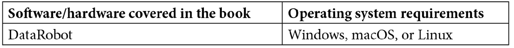

# 前言

DataRobot 使数据科学团队能够更加高效和富有生产力。本书帮助您利用 DataRobot 的企业平台解决**机器学习**（**ML**）挑战，让您能够从数据中提取商业价值，并为您的组织快速产生商业影响。

您将从学习如何使用 DataRobot 的功能来自动执行数据准备和清洗任务开始。本书涵盖了构建和部署机器学习模型的最佳实践，以及将它们扩展以处理复杂业务问题时所面临的挑战。接下来，您将执行**探索性数据分析**（**EDA**）任务，为构建机器学习模型做准备，并了解如何解释结果。您还将发现如何分析模型的预测，并将它们转化为面向业务用户的可操作见解。之后，您将为内部和合规目的创建模型文档，并学习模型如何作为 API 部署。此外，您还将了解如何使模型运行并监控其性能。最后，您将使用 DataRobot 的高级功能处理时间序列预测、自然语言处理、图像处理、MLOps 等示例。

在本书结束时，您将学会如何使用 DataRobot 提供的某些 AutoML 和 MLOps 功能，通过避免重复性任务和常见错误来扩展机器学习模型构建。

# 本书面向对象

本书面向寻找使用 DataRobot 构建和部署稳健机器学习模型实用指南的数据科学家、数据分析师和数据爱好者。经验丰富的数据科学家也会发现本书对快速探索、构建和部署更广泛的模型有所帮助。本书假设您对机器学习有基本了解。

# 本书涵盖内容

*第一章*，*什么是 DataRobot 以及为什么您需要它*，描述了构建和部署机器学习模型的当前实践和流程，以及这种方法在扩展时的一些挑战。然后，本章将描述 DataRobot 是什么，以及它是如何解决许多这些挑战的，从而让分析师和数据科学家能够快速为他们的组织增加价值。这也有助于高管了解他们如何使用 DataRobot 来高效地扩展他们的数据科学实践，而无需雇佣一支拥有难以找到的技能的大规模团队。本章还描述了 DataRobot 的各种组件，其架构方式，如何与其他工具集成，以及在不同地点或云中设置的不同选项。它还从高层次上描述了各种用户界面组件及其含义。

*第二章*，*机器学习基础*，涵盖了本书中将使用和引用的一些机器学习基本概念。这是您使用 DataRobot 有效所需的最基本知识。本章的意图不是让您全面了解机器学习，而是对一些关键思想进行复习。

*第三章*，*理解和定义商业问题*，将向您展示如何找到问题的根源并将其设定为一个机器学习项目。一个商业问题需要被仔细定义并转化为机器学习问题，以便使用 DataRobot 解决。这是一个经常被忽视的关键步骤，可能导致下游的问题和失败。请仔细阅读本章，以防止大量辛勤工作的浪费。本章不涉及工具和机器学习方法。

*第四章*，*为 DataRobot 准备数据*，涵盖了如何从多个不同的来源在高级别上拼接数据。根据数据，DataRobot 可能会自动执行数据准备和清洗任务，或者您可能需要自己执行其中的一些任务。本章涵盖了概念和示例，说明如何清洗和准备您的数据以及 DataRobot 提供的帮助这些任务的特性。

*第五章*，*使用 DataRobot 进行数据探索性分析*，将向您展示如何使用 DataRobot 进行各种数据分析，并将数据准备好以开始构建模型。我们提供了详细的示例，说明应该进行哪些分析以及需要注意哪些事项，以防止下游出现问题。如果做得正确，这种分析可以帮助发现数据问题，并产生有用的业务洞察。

*第六章*，*使用 DataRobot 构建模型*，展示了使用 DataRobot 构建不同类型模型的逐步示例。我们涵盖了在不同情况下应使用哪些设置、如何选择特定的模型类型、设置交叉验证、构建集成模型以及跟踪排行榜上表现最好的模型等细节。

*第七章*，*模型理解和可解释性*，将向您展示 DataRobot 提供的各种函数和输出示例，以帮助您理解模型并选择最佳解决商业问题的模型。在本章中，我们将通过示例介绍您需要注意的方面以及在模型选择中必须做出的权衡。

*第八章*，*模型评分和部署*，涵盖了如何使用模型对输入数据集进行评分、创建用于预期应用的预测、在生产中部署模型以及监控模型。

*第九章*, *预测和时间序列建模*，介绍了如何构建时间序列模型。这类模型通常用于预测应用。本章展示了如何使用 DataRobot 处理不同的时间序列问题。我们涵盖了单序列和多序列问题。

*第十章*, *推荐系统*，涵盖了如何使用 DataRobot 构建推荐系统的示例。这类模型通常用于向用户推荐产品或服务。本章涵盖了使用 DataRobot 处理推荐问题的策略和功能差异。我们讨论了构建不同推荐模型相关的权衡。

*第十一章*, *处理地理空间数据、NLP 和图像处理*，涵盖了与 DataRobot 相关的各种可视化和分析地理空间、文本和图像特征的功能，以及构建包含这些特征的人工智能模型。本章描述了 DataRobot 自动将文本和图像数据纳入人工智能模型的能力，从而提高这些模型的表现。

*第十二章*, *DataRobot Python API*，描述了何时以及如何使用 DataRobot Python API。虽然 DataRobot 自动化了许多模型构建的方面，但在许多场景中，您需要使用 Python 等编程语言来高效和可扩展地执行人工智能任务。DataRobot 提供了一个方便的 API，允许经验丰富的数据科学家以编程方式执行 DataRobot 功能。

*第十三章*, *模型治理和 MLOps*，涵盖了开始受到广泛关注的一些最新话题。一旦模型被开发和部署，就需要在一段时间内对其进行治理和维护。虽然这在许多方面与 IT 系统相似，但也有一些关键差异需要理解和实施。本章涵盖了 DataRobot 提供的几个特性和功能，以协助治理和维护人工智能模型。

*第十四章*, *结论*，涵盖了获取额外信息和本书范围之外的其他主题的地方。我们还描述了我们对自动化人工智能和 DataRobot 未来发展的看法。

# 为了充分利用这本书

为了充分利用本书，您将需要访问 DataRobot 软件。商业版本具有所有功能。如果您没有访问商业版本，您可以获取一个有限时间内有效且不具备所有讨论功能的评估版本。对于一些高级功能和 API 的正常工作，您需要了解一些 Python，并有权访问开源 Python 环境（例如 Anaconda 或 Jupyter Notebooks）。



尽管本书中描述的大部分内容可以在不知道 Python 的情况下完成，但我们强烈建议您学习 Python 作为下一步。了解像 Python 这样的编程语言将为您打开更多可能性，并使您能够更好地利用 DataRobot 等工具。

# **代码在行动**

本书的相关“代码在行动”视频可以在[`bit.ly/3cj2qp1`](https://bit.ly/3cj2qp1)查看。

# 下载彩色图像

我们还提供了一份包含本书中使用的截图和图表彩色图像的 PDF 文件。您可以从这里下载：[`static.packt-cdn.com/downloads/9781801076807_ColorImages.pdf`](https://static.packt-cdn.com/downloads/9781801076807_ColorImages.pdf)（_ColorImages.pdf）。

# **使用的约定**

本书中使用了多种文本约定。

**文本中的代码**: 表示文本中的代码单词、数据库表名、文件夹名、文件名、文件扩展名、路径名、虚拟 URL、用户输入和 Twitter 昵称。以下是一个例子：“为了我们的目的，我们简单地复制了我们的`imports-85-data.xlsx`数据集文件，并将其命名为`imports-85-data-score.xlsx`。”

代码块设置如下：

```py
deployment = dr.Deployment.create_from_learning_model(
    MODEL_ID, label='DEPLOYMENT_LABEL',
    description='DEPLOYMENT_DESCRIPTION',
    default_prediction_server_id=PREDICTION_SERVER_ID)
deployment
```

**粗体**: 表示新术语、重要单词或屏幕上显示的单词。例如，菜单或对话框中的单词会以粗体显示。以下是一个例子：“在选择选项后，我们可以点击**计算并下载预测**按钮。”

**提示或重要注意事项**

看起来像这样。

# **取得联系**

我们始终欢迎读者的反馈。

**一般反馈**: 如果您对本书的任何方面有疑问，请通过 customercare@packtpub.com 给我们发邮件，并在邮件主题中提及书名。

**勘误表**: 尽管我们已经尽一切努力确保内容的准确性，但错误仍然可能发生。如果您在这本书中发现了错误，我们将不胜感激，如果您能向我们报告这一点。请访问[www.packtpub.com/support/errata](http://www.packtpub.com/support/errata)并填写表格。

**盗版**: 如果你在互联网上以任何形式遇到我们作品的非法副本，如果你能提供位置地址或网站名称，我们将不胜感激。请通过版权@packt.com 与我们联系，并提供材料的链接。

**如果您有兴趣成为作者**：如果您在某个领域有专业知识，并且您有兴趣撰写或为书籍做出贡献，请访问[authors.packtpub.com](http://authors.packtpub.com)。

# 分享您的想法

一旦您阅读了《使用 DataRobot 的敏捷机器学习》，我们非常期待听到您的想法！请[点击此处直接访问亚马逊评论页面](https://packt.link/r/1801076804)并分享您的反馈。

您的评论对我们和科技社区都非常重要，它将帮助我们确保我们提供高质量的内容。
