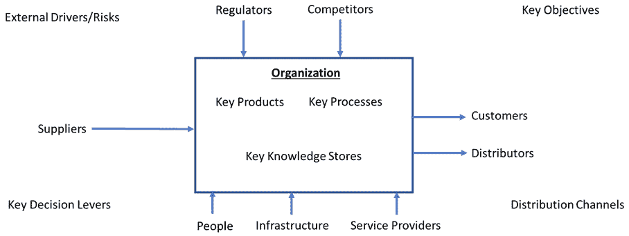
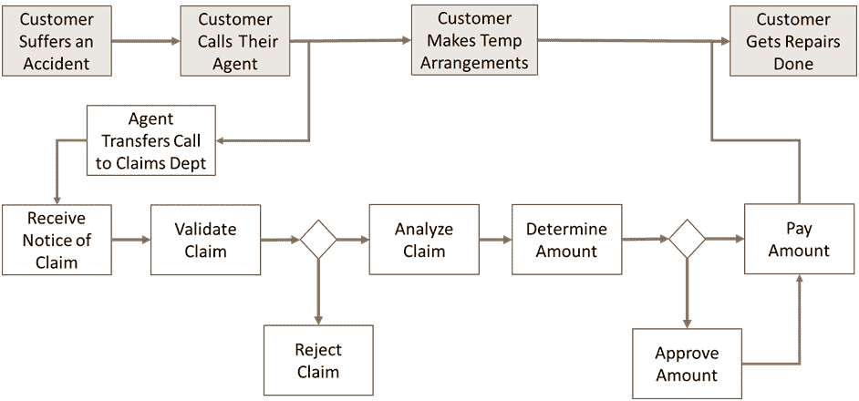
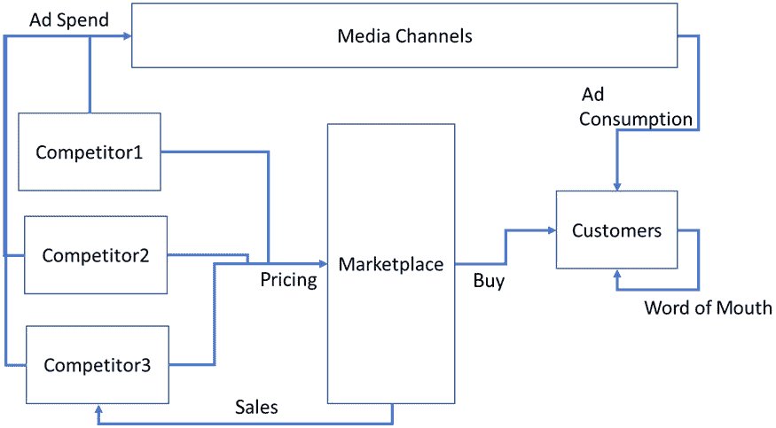
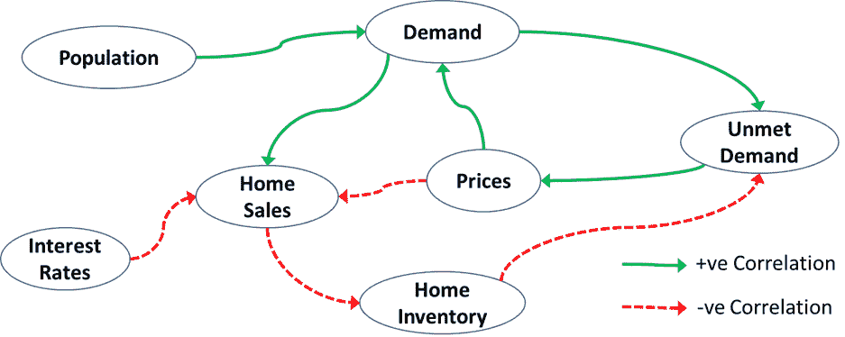
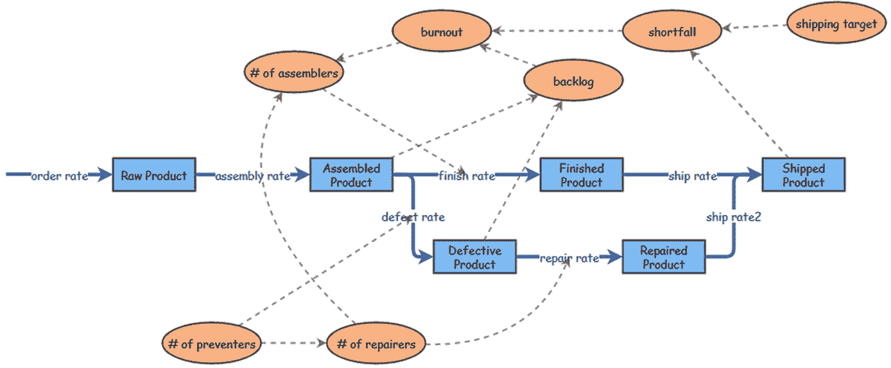
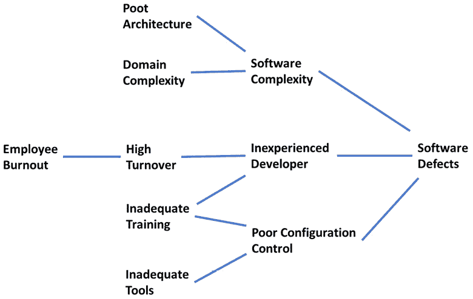
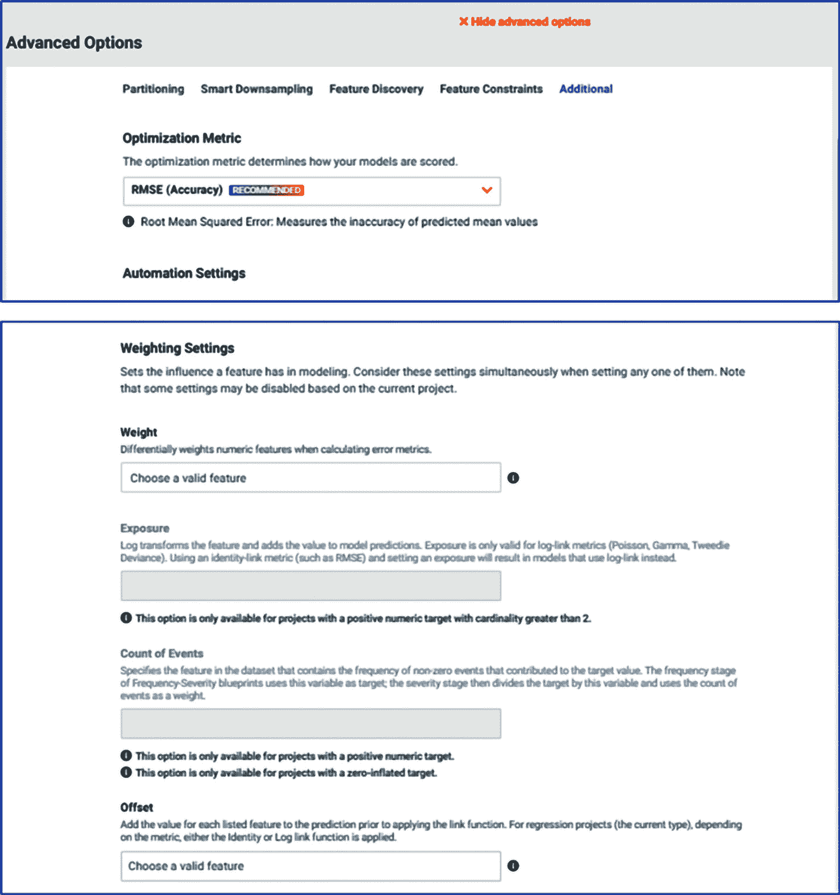

# 第三章：理解和定义商业问题

本章涵盖了成功最关键的主题，但在数据科学课程或书籍中并未详细讨论。尽管理解并定义商业问题的主题被简要提及，应该被执行，但讨论很少深入到如何正确执行。在本章中，我们将探讨具体工具和方法，这些工具和方法可以用来理解所考虑的系统，并确定需要解决的问题。

本节与 DataRobot 无关，因为 DataRobot 无法帮助你完成这个过程的一部分。这是数据分析师、业务分析师或数据科学家必须做的事情。正确定义商业问题很难——它无法自动化，而且大多数时候也没有得到妥善处理。如果你掌握了这项技能，你将变得无价。这是一个始终需要经验丰富的数据科学家（或未来他们可能被称作什么）的关键领域。

到本章结束时，你将了解到一些核心概念和方法，这些是确保你解决正确问题的必要条件。本书的其余部分将解释如何以正确的方式解决这些问题。

在本章中，我们将涵盖以下主要主题：

+   理解系统背景

+   理解**为什么**和**如何**

+   找到商业问题的根源

+   定义**机器学习**（**ML**）问题

+   确定负责任的**人工智能**（**AI**）的预测、行动和后果

+   实施和创造价值

# 理解系统背景

所有问题都出现在系统的背景下。系统可能是一个生物体的单个细胞、全球人口或整个经济。同样，所有解决方案都需要适应系统。技术解决方案（例如，人工智能解决方案）通常需要改变流程、人员、技能、其他 IT 系统，甚至商业模式才能有效。对于一个组织来说，系统可能是其整个供应链、竞争对手和客户。鉴于系统的定义可能非常广泛，通常建议你想象系统比你所考虑的问题更广泛。你希望你的问题所触及的所有组成部分或代理都成为系统背景的一部分。定义系统边界既是艺术又是科学，并且是一个迭代过程。鉴于你将从更广泛的视角审视系统，这也意味着相同的系统背景将适用于多个机器学习项目或用例。在这里获得的理解将在许多项目中带来回报。

在组织或行业中工作过的数据科学家或分析师可能会本能地学习到许多问题的系统性方面。他们可能会觉得他们不需要进一步调查，因为他们已经理解了关键问题。虽然这可能是对的，但人们也会发展出盲点，开始忽视关键缺失的部分或携带隐含的假设，这些假设大多数情况下是正确的，但有时是错误的。使用结构化方法来捕捉系统性理解有助于克服这些问题，并确保每个人都从共同的理解出发。这些问题通常是导致下游项目出现问题或延误的问题。让我们通过创建上下文图来看看我们如何构建这种理解。

上下文图是您系统的概览，显示了关键参与者和他们的互动，如图所示：

特定的图表绘制惯例并不那么重要；更重要的是，您需要理解和记录组件，并了解它们如何相互作用。有许多图表绘制惯例，所以请随意使用您喜欢的。确保在图表中捕捉到每个主题的三到五个重要实例。箭头不必是单向的。

当您查看这个简单的图表时，您会同意我们应该了解所有这些信息。当您尝试构建这个图表时，您可能会惊讶地发现找到和捕捉这些信息并不那么简单。组织中的大多数人都会对这些事物有所了解，但可能无法精确地指定最重要的客户或**关键绩效指标**（**KPI**）等。在大多数组织中，可能需要一些时间和讨论才能将这些内容整理出来。图表中的大多数组件都很容易理解，但有些可能有些令人困惑，因此值得稍作讨论，如下所述：

+   **关键目标**：关键目标是可衡量的指标，让您能够及时确定您是否正在实现目标。这些通常以财务表现、市场份额、客户满意度、声誉、质量水平和合规性等形式出现。拥有精确和可衡量的定义以及与组织目标的协调一致非常重要。这些对组织来说具有真正的价值，了解您的项目和模型如何影响这些因素也很重要。

+   **外部驱动因素/风险**：这些是影响关键目标但不受您控制的外部因素或驱动因素。请注意，我们不是在讨论具体事件，而是在讨论可能被视为事件的因素的价值观变化——例如，该因素可能是**国内生产总值**（**GDP**）的变化。这不在我们的控制范围内，-20%的值可能表明金融危机。因此，我们在这个案例中的驱动因素是 GDP 变化，而不是金融危机。

+   **关键决策杠杆**：这些也是影响关键目标的因素，但它们在我们可控范围内。例如，员工的数量是我们可控的因素（因为我们可以决定雇佣多少人）并且它将对结果产生影响。其他例子可能包括在新技术或市场营销上投入多少，等等。这些可能是战略决策或选择，例如创建新的分销渠道、捆绑产品等。无论类型如何，重要的是确保想法以精确的方式被捕捉——例如，如果新的分销渠道是一个驱动因素，你应该知道五个实际的选择是什么。

    警告提示

    请不要陷入哲学辩论。快速创建你的图表的第一版，并在需要时进行改进。在分析可能影响并改变当前思考的情况下，可以带着第一稿继续前进。

如你现在可能已经猜到的，强调这三个项目的原因是它们的历史数据对于任何数据科学项目都至关重要。你也会同意，关于这些因素的数据对于运营以及战略决策都至关重要，但你可能会发现这些数据可能不容易获得或可能存在质量问题。此外，特别关注关键知识库。这些将是包含您组织数据的数据库、数据仓库、数据湖或文件系统。我们将在以下章节中再次讨论这些项目。

现在我们已经了解了背景，我们想要了解我们的系统是如何运作的，以及为什么它以某种方式表现。这两个方面对于理解系统至关重要。在下一节中，我们将描述如何创建这种理解。

# 理解“为什么”和“如何”

理解一个系统的功能和其行为的关键在于以下方面：

+   **流程**：对象和信息是如何通过系统的流程流动的？

+   **交互**：不同的实体或系统组件之间是如何相互作用的？

+   **状态**：一个实体的状态是如何随时间演变的？

+   **因果关系**：有哪些因果关系？

每个这些方面都通过图表来表示。对于流程建模、因果建模和交互图，存在许多图表绘制规范。这些规范在不同的领域中应用方式不同。你可以遵循你喜欢的或已经熟悉的任何规范。在这本书中，我们将遵循某些适合计算建模的规范。这意味着这些图表可以与数据结合，转化为可用于分析的模型。这将在我们项目的后期阶段变得很重要。如何创建这些图表并将它们转化为计算模型的具体细节超出了本书的范围，但如果你对此感兴趣，可以寻找其他资源来学习这些技术。即使你不创建计算模型，这些图表也会提供有用的见解，你可以在你的机器学习项目中使用。可能你的组织中有一些人构建过——或者正在构建——这样的图表。你应该找到这些人，并请求他们在构建这些图表时提供帮助。让我们更详细地看看这些方面的每一个。

## 流程图

在组织的运营中，有几个功能具有定义良好的流程。对象、人员或信息通过这些流程流动，如下面的图表所示：

图 3.2 – 流程图

根据系统环境，你已经知道组织中最重要的流程。你可以开始为这些关键流程绘制图表——或者至少，与你的项目相关的那个流程。构建端到端流程流是非常重要的——例如，整个客户旅程，或者一个产品的整个开发流程。同样重要的是要从客户的角度（灰色框）理解流程，而不仅仅是内部流程（白色框）。确保捕捉到故障点或返工路径，或者一个流程可能突然结束而不是正常完成的地方。当实体通过这些流程流动时，会做出决策或进行计算，这些可能是机器学习问题的候选者。无论你从哪个项目开始，识别沿途的其他潜在机会都是一个好主意。结果可能表明，以不同的方式看待流程或构建不同的机器学习模型可能会带来更大的利益，或者可能预防当前项目的需求。无论结果如何，捕捉这些信息都是重要的。顺便说一句，你注意到在先前的流程图中客户没有收到拒绝消息吗？正如你可以想象的那样，这是客户体验中一个重要的部分，却被忽略了。我相信错误会在某个时候被发现，但使流程明确会增加尽早发现并考虑它在构建你的模型时的机会。

除了构建图表外，捕捉关于过程的数据也很重要。你经常会遇到有人已经构建了流程图，但没有捕捉任何数据的情况。如果你正在阅读这本书，那么我不需要告诉你收集这些数据对于准确理解过程有多么重要。需要捕捉的典型信息包括每个步骤中流动的对象的数量和类型、每个步骤所需的时间、每个步骤所需的劳动力和资源、采取特定路径的概率、质量指标等等。如果关键流程没有捕捉到此类信息，那么尽快开始收集这些信息是很重要的。这些信息对于构建项目商业案例、作为模型中的有用功能以及帮助识别可能被隐藏的问题可能至关重要。

重要的是再次指出，你不想陷入术语争论，而是快速创建一个图表，足以帮助你理解过程中的情况，而不是包含每一个细微差别的非常详细视图。如果需要深入了解过程中的某些特定方面，重新审视这是可以的。

实际过程通常比我们在*图 3.2*中展示的要复杂一些，但并不太多，而且发现许多外部特定部门中这些任务完成的人不知道的事情并不罕见。在我的经验中，发现没有一个人理解整个过程的情况也并不罕见。这个练习本身就有价值，因为它可以突出关键问题，但对于构建模型以自动化此过程一部分的数据科学团队来说，尤其有价值。然而，我惊讶地看到数据科学团队在不了解过程的情况下构建模型如此多次。

## 交互图

在一个系统中，有许多交互发生，并不遵循固定的流程。这些交互可以按不同的顺序发生，需要保持灵活性，并且最好通过交互图来理解。那些有软件开发背景的人可能熟悉这样的图表，它们显示了软件组件或对象之间的交互。在我们的案例中，我们感兴趣的是理解系统关键参与者之间的交互，如下面的图表所示：

图 3.3 – 交互图

该图显示了一个市场，其中几个竞争对手在销售他们的产品。客户来到这个市场购买产品。竞争对手在各个媒体渠道上花钱做广告，并设定他们的价格。消费者受到广告、定价和其他消费者口碑的影响。在任何给定时间，许多这些互动都在进行中，创造了一个复杂且动态的环境。如果你在构建定价模型，你必须考虑到所有这些因素，否则你的模型将对数据有很好的统计拟合，但在实际操作中却证明是无效的。

注意，关键参与者可以是人、组织、机器人、市场、欺诈者等等。构建这个和其他图背后的想法是将你所知道的内容编码化并使其明确化。这使每个人都能对系统有一个共同的认识，并质疑假设或指出缺失的信息。同样重要的是要确保你将这些图视为需要用数据来检验的假设。你必须不断地问自己，数据是否支持我们在这些图中所说的内容。如果不是，那么可能需要细化你的假设，或者可能缺少数据或其他数据质量问题。也许数据收集是有偏见的。我确信你听说过如何使用有偏见的预测数据导致完全错误的预测的故事。构建一个图并不能保证你将捕捉到有偏见的数据，但它确实提高了你捕捉到它的机会。

## 状态图

状态图捕捉了系统中某些重要实体或参与者状态的变化。典型的候选者包括客户和产品。与其他图一样，你只为系统中的重要或关键参与者构建这些图。

一个示例状态图可以在这里看到：

图 3.4 – 状态图

状态图在概念上与**马尔可夫链**非常相似（这个概念表示系统从一个状态转换到另一个状态的概率，这种概率是固定的，并且不依赖于任何先前历史），但在状态图中，你不必假设历史不重要。状态图是为特定代理构建的。*图 3.4*显示了一个人随时间通过各种状态的状态图。箭头代表从一个状态到另一个状态的转换，并且人在给定状态下停留，直到他们转换到下一个状态。转换通常被认为是瞬时的。你也可以从转换概率的角度来考虑转换（在这种情况下，它开始类似于马尔可夫链）。这些图可以是分层的，因为一个状态可以被分解为子状态，而这些子状态可以通过转换相互连接。

除了构建图之外，你还想了解是什么导致了状态的转变。这是确定性的还是随机的？你还想收集有关这些转变发生频率和时间的资料，因为这些数据对于进一步分析和构建机器学习模型非常有用。一个行为者的转变可能会引起另一个行为者状态的转变，因此状态图也与交互图相关联。每个转变都是机器学习模型的潜在候选者，你可以使用数据来预测何时（以及哪个）转变可能会触发。正如你可以想象的那样，构建这些图将导致识别出可能被忽视的机会。

使用这些图，你现在已经理解了系统是如何运作的。我们现在可以看看是什么决定了系统的行为。

## 因果图

因果图旨在捕捉系统中存在的因果关系。这种理解可能正确也可能不正确。实际上，你可能永远无法证明因果关系。抛开哲学辩论不谈，你可以通过使用本节中概述的方法，并结合数据，大大提高你的理解。

一个示例因果图如下所示：

图 3.5 – 因果图

上述图示展示了房地产市场中的关系（这只是一个例子——它并没有显示所有因果关系）。它表明，随着利率上升，房屋销售量下降。房屋销售还受到需求和价格的影响。随着价格上涨，价格上涨可以增加需求，因为更多的人想要购买房屋以赚钱，但价格本身是一个阻碍。你可以看到，在这个简单的图中存在相反的效果和反馈循环。难怪动态让我们感到困惑，这通常会导致系统出现混乱。每个人都认为他们理解房地产市场是如何运作的，但在复杂的动态面前，真正的理解很难实现。许多商业情况中也存在类似的动态。建立预测房价的机器学习模型很容易，但理解整体动态则要困难得多。这种缺乏理解可能导致你使用优秀的机器学习模型做出糟糕的决策，因此，构建这样的模型对于理解你试图解决的问题的真实本质至关重要。这样的图对于理解和处理混杂变量以及反事实分析也非常有用 [Pearl]。

系统动力学领域还提供了一种因果模型的表示方法。这种表示方法结合了其他图表的一些思想与因果图，以创建一个可以非常具有洞察力的视图，并且可以轻松地转换为动态模拟模型。系统动力学本身是一个庞大的学科，关于这个主题有许多优秀的书籍和论文[斯特曼]。在这里，我将仅介绍这个概念及其外观，以及它如何有用。以下是一个系统动力学（也称为库存和流量）图的示例：

图 3.6 – 系统动力学（库存和流量）图

该图将状态图、过程图和因果图中的思想捕捉到一个复合视图中，这种视图可以非常具有指导意义。想象一下产品的旅程，它随着状态的变化而变化，从*原材料*变为*已发货产品*。在这个例子中，每个方框代表特定状态下产品的数量——例如，**组装产品**方框代表所有已经组装并等待成为*成品*的产品。这发生在称为*完成率*的速率下。完成率取决于有多少组装员可以执行工作。你还会注意到，一些组装产品出现了缺陷。这些产品以称为*缺陷率*的速率流入**缺陷产品**方框。然后它们必须由维修人员修复。由于缺陷，无法达到发货目标，出现了短缺。这种短缺增加了对员工的压力，从而增加了倦怠。倦怠反过来又减少了组装员的人数（他们辞职或生病）。由于组装员人数减少，这减慢了完成率。这反过来又增加了压力，更多的人被转移到维修人员，因为维修可以更快地完成。这导致没有人担任预防工作，从而导致了恶性循环的持续，过程变得越来越积压。

这种动态在许多组织中都会发生，他们想知道为什么他们总是处于压力之下。一旦图表被布置出来，你就可以看到问题在于他们正在解决症状，而不是缺陷的根本问题。在这个简单的图表中很容易看出，但在更复杂的情况下，你可以对这些图表进行模拟以找到问题点。该图还有助于阐明过程、决策和商业目标之间的关系。这些图表可以模拟以了解决策的商业影响，以及部署机器学习模型的影响。这是以大多数人都能轻松理解的方式展示你努力价值的一种极好方式。

现在，让我们回到机器学习。如果这个分析没有完成，那么很可能是缺陷修复会被标记为问题，你很可能会构建一个模型来预测将产生多少缺陷或预测将发送多少物品。你会构建一个很好的模型，但这不会解决问题。关键问题是要找到导致缺陷的因素以及如何减少缺陷。这需要制造团队与数据科学团队紧密合作以找到解决方案。再次强调，关键点是除非有人进行这种分析，否则数据科学团队很可能会解决错误的问题。你可能认为这种情况不常发生，但我认为这种情况发生的频率比你想象的要高得多，因为真正的问题往往隐藏很长时间。

通常，最好将这些图中绘制的每个因果关系视为一个假设。这样，图就代表了一组假设。有一些统计和模拟方法可以用来验证这些假设。为此，你需要开始收集数据或开始发现数据存储的位置。现在我们已经了解了这些图，让我们看看我们是如何找到问题的根源的。

# 找到商业问题的根源

有些问题容易解决，而有些问题则证明非常难以解决。其中一个原因是，当问题的症状出现在其他地方并且经过一段时间后，很难知道问题真正在哪里。根据定义，症状是明显可见的——它们是明确的，你可以很容易地收集关于它们的数据。另一方面，潜在的问题可能发生在其他部门或建筑中，并且不可见，因为它不会立即引起疼痛。很可能是没有收集关于根本问题的数据，或者收集这些数据可能过于困难。鉴于机器学习的性质，几乎可以肯定的是，你得到的所有数据都是关于症状的。如果你很幸运，你可能会得到一些关于根本问题的数据（尽管你可能不知道）。

一种开始的方法是使用一种称为“五问法”的旧方法，它基本上涉及问“为什么？”五次以找到根本原因。很多时候，每个级别可能会有多个原因。因此，在实践中，许多人使用另一种称为“鱼骨图”的图来捕捉这些信息，如图所示：

图 3.7 – 鱼骨图

在前面的鱼骨图示例中，我们试图理解为什么会有软件缺陷问题。当你问“为什么”问题时，并捕捉到原因，你开始添加潜在的原因。你继续这个过程，直到你觉得你已经捕捉到了问题的本质。正如你所看到的，这部分是因果图，可以用作构建系统因果模型的开端，同时保持对特定问题的关注。然后可以收集数据来证实或拒绝假设。正如你所看到的，这个鱼骨图将告诉我们图 3.6 中看到的系统动态图。这个练习的关键是要理解根本原因，并着手解决这个问题。我希望你开始看到，准确预测某件事并不总是等同于解决真正的问题，你必须小心设置你的 ML 问题，以确保你的项目成功。此外，请注意，可能存在导致问题的多个原因，你可能必须解决多个问题才能看到问题的显著缓解。另一方面，如果不了解全貌，只解决一个方面（比如员工倦怠），可能会导致你得出倦怠不是问题的结论。在组织中，得出错误的结论，然后将其纳入组织的神话中——"*我们已经尝试过了，但不起作用。*"并不罕见。 

现在我们已经确定了需要解决的商业问题，让我们看看我们如何将其转化为一个 ML 问题。

# 定义机器学习问题

在我们深入探讨机器学习的细节之前，重要的是要注意，并非所有问题都适合用机器学习来解决。对于一个问题来说，要成为好的候选者，它应该具有以下特征（我们现在将只关注**监督学习**（**SL**）问题）：

+   如果一个算法能够预测它，那么有一个清晰的目标或标签值将是有用的。在没有算法的情况下，这个值仍然是未知的，需要人的判断，或者需要付出大量努力才能确定。有时，目标可能不是实际感兴趣的实际变量，而是计算中的关键组成部分。这部分并不总是显而易见，但你在本章前面部分所做的问题分析无疑将有助于阐明哪个变量是最佳的目标。

+   你可以访问一个足够大的历史数据集，其中包含你希望预测的目标或标签值。你需要创建一个包含相关数据的来源列表，并开始理解它们包含的数据。

+   确定哪种类型的 SL 问题最适合你的问题（回归、分类或时间序列）。有时，你可以将一种类型的问题转化为另一种类型。

+   通常在准确性、可解释性和可理解性之间存在权衡。对于你的业务问题，考虑什么更重要是很重要的。在许多情况下，我们愿意牺牲准确性以提高可理解性。这反过来又决定了你应该选择哪些算法和解释方法。

你将不得不审查你的数据集和业务问题定义，以确定你是否可以制定一个规范，以满足之前列出的条件。在这个过程中，可能需要进行几种转换，例如这些：

+   将目标进行转换，使其作为输出更有价值或更适合解决业务问题。以下是一些例子：

    (a) 如果数值目标值在一个非常大的值范围内，或者分布具有高度偏斜，那么你可以尝试将目标对数化作为新的目标。

    (b) 如果实际值不如范围重要，那么你可以创建分箱，并使用分箱值作为目标。

    (c) 有时，值的改变或变化率可以作为一个更好的目标。

+   根据因果图创建交互特征。以下是一些例子：

    (a) 在因果模型中，那些未直接观察到但可以通过组合其他各种特征来计算的中间变量。

    (b) 如果你的目标是日志形式，那么创建各种特征的日志可能是有意义的。

    (c) 类似地，如果你想要某些特征在业务问题中具有特殊意义，你可能想要对这些特征进行分箱。

    (d) 探索创建变化率特征是否对你的模型很重要。

+   识别出在因果图中出现但不在你的数据集中存在的缺失数据。根据其重要性和获取的难易程度，你可能希望在构建模型之前收集这些数据。另一个选择是与使用你已有的数据进行模型构建的过程并行启动数据收集。在后一种情况下，当你收集到数据后，你总是可以在下一次迭代中重新审视模型。

此外，你还必须考虑你将如何定义和评估错误。哪个指标最适合这个问题？我们在*第二章*，“机器学习基础”中介绍了指标，DataRobot 会自动为问题选择一个合适的指标。我发现大多数时候选择都非常好，所以除非你有充分的理由不这样做，否则遵循推荐是一个好主意。除了指标之外，你还需要考虑你是否更关心特定范围内的错误，而不是其他范围的错误——例如，你可能希望在高价值范围的特性上比在低价值范围内更准确。在这种情况下，你可以考虑使用这个数值特征（这必须是一个非目标特征）作为计算错误指标的权重。你可以在“附加”选项卡下的**高级选项**中找到这个设置，如下面的截图所示：

图 3.8 – 其他选项

上述截图显示了选择用作预测权重的特征的选项。请注意，这必须在项目开始时设置。一旦模型构建开始，就不能更改此设置。

一旦你定义了机器学习问题，DataRobot 就会开始构建模型。我们将在后面的章节中介绍这一点。现在，我们想要讨论模型构建并能够生成预测时会发生什么。

# 确定负责任的 AI 的预测、行动和后果

在模型在 DataRobot 中构建和部署之后，可能会觉得我们的工作已经完成——但并非如此。你应该开始分析预测概览的样子，并开始与用户和利益相关者讨论将要采取的行动的细节。你帮助构建的模型可能会在你的系统中引入许多变化，并影响其他人。因此，确保这些影响不是负面的非常重要。确保你的模型不会造成伤害被称为负责任的 AI。这将建立在你在理解阶段通过各种图表所做的工作之上。

正如在之前的章节中我们看到因果图如何帮助你将特征与目标相关联一样，我们也可以看到目标如何影响系统的其他部分。该图应揭示目标如何影响关键目标或结果；它还应揭示将改变系统其余部分行为的关键反馈循环，以及给出其他后果的暗示。这使得理解并计算模型的投资回报率（ROI）相对简单。数据科学团队表达的一个常见挑战是他们发现很难表达模型的影响。正如你现在所看到的，我们从因果角度理解系统所投入的工作也有助于确定模型的企业影响。

很常见的是，大多数系统并不提供免费的午餐——总是有权衡。你的行动可能会改善一个目标，但可能会损害另一个。理解这些权衡并确保你的利益相关者也理解它们非常重要。即使模型会提供正的投资回报率，它也可能在其他领域降低性能，以至于你可能不想继续进行。其中一些后果可能涉及监管或伦理问题。这些领域通常被忽视，直到后来（痛苦地）被发现。进行这种分析的一个关键好处是确保你能够尽早发现问题。

另一种常用的机制是模拟系统动态图。这使你能够理解你系统的动态行为，并可以作为虚拟实验。虚拟实验或模拟让你在发布模型之前，在一个安全的环境中测试不同的策略。这不仅可以帮助你避免代价高昂的错误——它还常常能提出改进或策略，以进一步优化收益。许多数据科学项目未能成功的原因是，数据科学团队很少这样做，通常没有进行这种分析所需的技能，并且历史上并没有非常重视这一部分。让我们来看一个系统中的机器学习模型的一个简单例子：

![图 3.9 – 影响分析

![图片 B17159_03_09.jpg]

图 3.9 – 影响分析

在这个例子中，你有一个使用一些特征生成促销价格的促销模型。该模型监控销售情况并相应地更新价格。由于某种原因（数据库更新、审批等），在电子商务网站上更新这些价格存在延迟。这导致销售数据出现滞后，建模团队并不知道，因为建模团队没有理解整个流程以及更新网站价格所需的时间。如果你对这个简单的图进行分析，你会发现这种带有延迟的反馈循环会产生振荡行为。这意味着定价将始终不准确——有时会更高，有时会更低。这种行为与你在大多数模型结果中看到的行为有些相似，因此这种影响可能会被忽略。即使模型本身没有问题，系统表现也可能不佳。我保持这个例子非常简单，以便说明问题。你可以想象，如果情况更复杂，大多数人可能无法自己发现问题，直到为时已晚。

反过来，您还可以评估与现状相比，您的模型将产生多少销售影响。这是展示投资回报率和您工作的商业价值的好方法。由于基于这些图表的模拟是您业务的视觉表示，大多数人发现它比叙述或电子表格更容易理解。这也帮助获得对您的机器学习模型的接受。

虽然 DataRobot 并不帮助处理这些方面的许多问题，但它确实提供了机制来确定您的模型是否在受保护特征上存在偏差，以及测量模型中存在的偏差量。结合前面的分析，这可以在很大程度上确保您的模型没有偏差，并且结果不会被用于违背您组织价值观的方式。现在我们对于模型的预期结果感到满意，我们可以开始部署过程。

# 运营和创造价值

在您的基础设施中实施模型可能是一项复杂的任务。DataRobot 简化了部署的一些方面，但还有其他部署部分超出了 DataRobot 的范围，可能相当具有挑战性。让我们讨论以下这一过程中的任务：

+   **将模型作为应用程序编程接口（API）部署**：非常早期的任务之一是将您的模型部署为 API，以便它可以根据需要提供预测。您将不得不决定这需要是批量操作还是实时操作。DataRobot 自动化了设置这一过程的大部分任务，您可以在几分钟内拥有一个提供预测的 API。

+   **与业务系统集成和测试**：拥有一个 API 只是故事的一部分——您现在需要将此 API 集成到您的业务系统中。有时，您可以通过独立的 Excel 文件或网页向用户提供预测，但对于许多用例，集成是必需的。这有时可能需要时间和精力，并可能减慢事情的发展。许多组织开始使用的另一个潜在途径是**机器人流程自动化**（**RPA**）。如果您的用例适合 RPA 实现，DataRobot 提供与多个 RPA 工具的集成，可以加快集成过程。

+   **构建最终用户界面**：如果您的用例需要完全自动化，则不需要此操作，但大多数用例将需要一定程度的用户参与。在集成完成之后，您仍然需要某种方式让用户与预测交互并做出适当的决策。您需要考虑用户如何适应新的业务方式，以及如何使这一体验尽可能无摩擦。实际上，在许多用例中，预测被特别设置以减少现有流程中的摩擦。

+   **用户培训**：确保你正在计划并为受新模型影响的用户提供培训做好准备。创建培训并提供这种培训是提高模型采用率和接受度的绝佳方法。很多时候，这都是在事后才考虑到的，可能会导致延误或降低接受度。

+   **用户接受度和变更管理**：这通常是一个持续的过程。通常来说，从一开始就涉及用户和利益相关者是一个好主意。如果用户觉得他们的声音被听到，这将提高接受的可能性。用户还可以帮助避免数据科学团队自己可能无法察觉的潜在问题。频繁地沟通你为什么要进行这个项目，它如何影响用户，以及他们的工作将如何改变（希望是变得更好），这些都是提高成功机会的好策略。与用户一起构建之前列出的图表是开始这种对话的好方法，并且最终为业务增加价值。正如你所看到的，在模型构建前后有许多事情要做，才能实现价值。难怪项目往往在增加价值方面并不总是成功。

+   **模型监控和维护**：一旦模型投入运行，你需要建立机制来监控预测服务和性能。随着时间的推移，性能往往会下降，或者你可能希望提高模型的表现。这需要用新数据更新或重新训练模型。幸运的是，DataRobot 使这些任务变得非常简单，因为它提供了设置模型监控和重新训练的机制。

# 摘要

在本章中，我们介绍了一些工具和方法，帮助你了解你的系统和你要尝试解决的问题的商业问题。其中一些方法即使是经验丰富的数据科学家也可能感到陌生，但花时间内化和在项目上实践这些方法是重要的。考虑到时间压力，其中一些可能感觉是不必要的。这就是为什么像 DataRobot 这样的工具是有益的，因为它们减少了你在重复性任务上花费的时间，让你可以专注于工具无法做到的事情。

希望我已经说服你们，数据科学团队更加专注于理解问题，并使用自动化工具进行一些模型构建和调优任务，这对组织提供了最佳的价值。在这里完成的大部分工作也将在项目后期派上用场，当我们准备将模型投入组织运营时。具体来说，在本章中，我们学习了如何理解更广泛的系统环境，系统是如何运作的，以及为什么它会以某种方式表现。我们还看到了如何找到企业需要解决的根源问题，并将业务问题转化为可以用机器学习解决的问题。然后我们学习了如何确保解决方案解决了正确的问题，并且不会产生意外的副作用。

最后，我们学习了如何确保解决方案被利益相关者接受并得到实施，从而实现商业价值。

我们现在已准备好开始使用一些示例数据集，并开始使用 DataRobot 来帮助我们解决我们发现的业务问题和定义的机器学习问题。

# 进一步阅读

+   《因果性：模型、推理与推断，第二版》，作者：Judea Pearl，出版社：剑桥大学出版社。

+   《商业动态：复杂世界的系统思维与建模》，作者：John D. Sterman，出版社：Irwin/McGraw-Hill。
