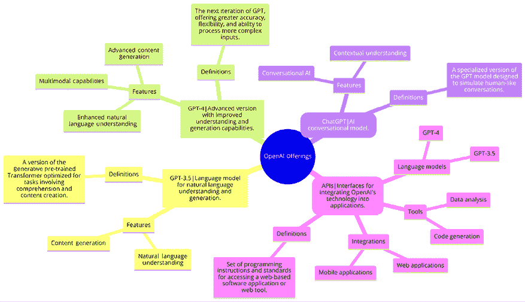
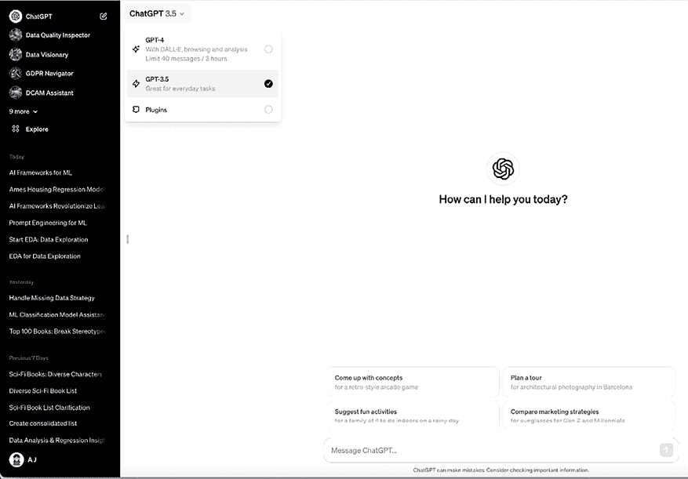
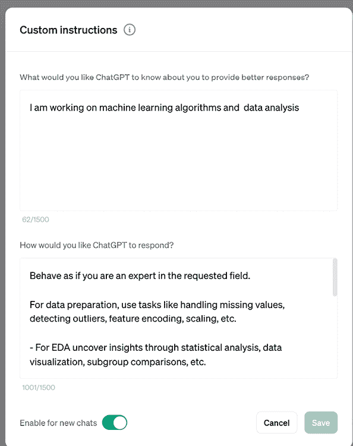
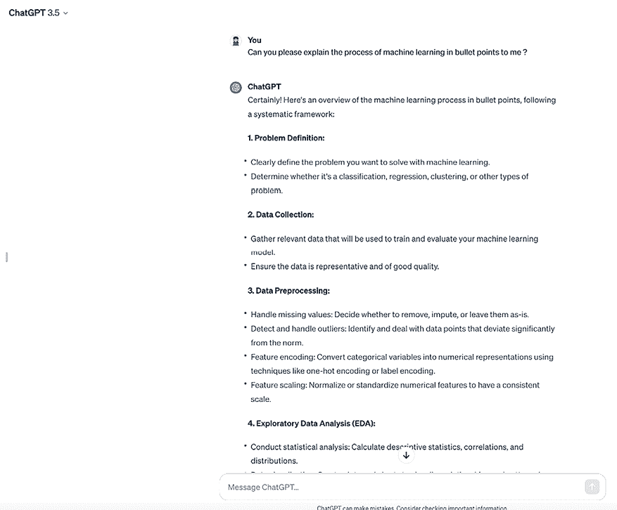

# 3

# 行业工具：介绍我们的 AI 助手

# 简介

编写代码或文本需要时间，至少如果你希望它组织良好且易于阅读的话。但如果你有一个可以帮助你更快、更轻松地编写代码的工具会怎样？这正是 GitHub Copilot 和 ChatGPT 的真正目的。

在开始使用 AI 助手之前，了解其能力和限制是一个好主意。你想要看到你能用它做什么，不能做什么，或者至少了解工具在哪些方面表现不佳。

在本章中，我们将涵盖以下内容：

+   理解 GitHub Copilot 和 ChatGPT 是什么以及它们是如何工作的

+   了解 Copilot 的功能和限制

+   安装 GitHub Copilot

+   通过 GitHub Copilot 生成代码补全

# 理解 Copilot

对接编程是（通常是两个）开发者一起工作的理念，通常在同一个屏幕前，有时也称为“对接”。GitHub Copilot 可以被视为一个“AI 对接程序员”，帮助你编写代码，让你能更快地完成更多工作。它基于 OpenAI 的 Codex 模型，这是一个在公开可用的源代码和自然语言上训练的新 AI 系统。但在现实中，它已经超越了这一点。让我们在本书的剩余部分将 GitHub Copilot 称为 Copilot。Copilot 可以直接在你的编辑器中建议整行或整个函数。

## Copilot 如何知道要生成什么

Copilot 背后的理念是，它从你和其他人编写的代码中学习，并使用这些知识在你键入时建议新的代码行。

Copilot 是如何工作的？它使用机器学习来构建你和其他人编写的代码模型，并为你提供最佳文本建议。有两个重要部分，即训练模型和所谓的内存上下文。模型是在 GitHub 的公共仓库上训练的，而上下文是它在运行时从查看你的文件中组装出来的。使用上下文和基础模型，它为你提供文本建议。Copilot 使用以下一些内容来构建其上下文（即，它与训练模型一起使用的内存能力，以提供建议）：

+   **你的活动文件**：你正在工作的代码。

+   **注释**：Copilot 使用注释来理解你代码的上下文。

+   **打开文件和你的工作区**：它不仅查看你活动文件中的代码，还查看你工作区中其他文件中的代码。

+   **导入语句**：甚至导入语句也被纳入 Copilot 的建议中。

+   **基础模型及其训练数据**：公开 GitHub 仓库中的代码构成了其训练的基础。

## Copilot 的能力和限制

那么，Copilot 能做什么？它能做很多事情，但这里是一个非详尽的特性列表：

+   **代码补全**：Copilot 可以为你补全代码行。

+   **代码生成**：Copilot 可以为你生成整个函数。

+   **测试**、**注释**和**文档**：Copilot 可以为你生成测试、注释和文档。

+   **建议改进**: Copilot 可以对你的代码提出改进建议。改进可以以多种形式出现，从建议更好的变量名或更好的函数编写方式到如何更好地组织代码。

+   **代码翻译**: Copilot 可以将一种语言的代码翻译成另一种语言。例如，它可以翻译 Python 代码到 JavaScript 代码。

+   **回答问题**：Copilot 可以回答有关你的代码的问题。例如，它可以告诉你一个函数的作用或一个变量的用途，并回答关于某个领域的问题，例如“什么是机器学习？”等。

## 设置和安装

如何开始？你可以从各种地方和编辑器中使用 Copilot，包括 Visual Studio、Visual Studio Code、GitHub Codespaces 和 GitHub 的基于网页的编辑器。在本章中，我们将使用 Visual Studio Code。

### 安装 Copilot

要安装 Copilot，你需要安装 GitHub Copilot 扩展并为 Visual Studio Code 允许访问。

让我们更详细地回顾一下步骤（如官方 Copilot 文档页面所述）。

你可以从 Visual Studio Code 市场或从 Visual Studio Code 内部安装 GitHub Copilot 扩展。这里我们将展示后者：

1.  在 Visual Studio Code 的 **扩展：GitHub Copilot** 选项卡中，选择 **安装**。

1.  如果你之前没有在 GitHub 账户中授权 Visual Studio Code，你将被提示在 Visual Studio Code 中登录 GitHub。

1.  如果你之前已经为 GitHub 上的你的账户授权了 Visual Studio Code，GitHub Copilot 将自动授权。

1.  如果你没有收到授权提示，请选择 Visual Studio Code 窗口底部的铃铛图标。

1.  在你的浏览器中，GitHub 将请求 GitHub Copilot 所需的权限。为了批准这些权限，请选择 **授权 Visual Studio Code**。

1.  为了确认认证，在 Visual Studio Code 中，选择 **Visual Studio Code** 对话框中的 **打开**。

如果你在设置 Copilot 时遇到任何问题，请参考此页面：[`docs.github.com/en/copilot/getting-started-with-github-copilot`](https://docs.github.com/en/copilot/getting-started-with-github-copilot)。

## 开始使用 Copilot

我们如何开始？好吧，只要你已经安装了 Copilot，并且 Visual Studio Code 窗口的右下角有 Copilot 图标，你就可以开始了。

这里有一个开始的建议：

1.  在 Visual Studio Code 中创建一个名为 `app.js` 的新文件。

1.  在文件顶部像这样作为注释开始输入文本提示“Express web api with routes products and customers”，然后按 *Enter*：

    ```py
    //Express web api with routes products and customers 
    ```

1.  等待几秒钟，你应该会看到 Copilot 的以下建议：

    ```py
    const express = require('express'); 
    ```

    如果没有出现任何内容，尝试按下 *Ctrl* + *Spacebar* 来触发建议或开始输入代码的开始部分，例如 *const*，并等待建议出现。

1.  你将需要按下 *Tab* 键来接受建议。在此阶段，Copilot 可以继续为你生成代码。为了确保它这样做，请按下 *Enter* 并观察 Copilot 为你生成更多代码。重复按下 *Enter* 并按下 *Tab* 来接受建议，直到你拥有类似以下代码：

    ```py
    const app = express();
    app.get('/products', (req, res) => {
      res.send('products');
    });
    app.get('/customers', (req, res) => {
      res.send('customers');
    });
    app.listen(3000, () => {
      console.log('Server listening on port 3000');
    }); 
    ```

1.  恭喜你，你刚刚用 Copilot 编写了你的第一行代码。请随意尝试使用 Copilot，并在代码中间添加注释，所谓的提示，看看会发生什么。还可以尝试改变提示，看看会发生什么。

## 作业：改进代码

作为一项作业，你被要求改进 Copilot 生成的代码。以下是一些建议：

+   为 Web API 的根添加一条路由。

+   为特定产品添加一条路由。

+   为其中一条路由添加文档。

## 解决方案

这里有一个可能的解决方案：

```py
const express = require('express');
app = express();
// add default route
app.get('/', (req, res) => {
  res.send('Hello world');
});
app.get('/products', (req, res) => {
  res.send('products');
});
// document route
/**
 * Get a product by id
 * @param {number} id - The id of the product
 */
app.get('/products/:id', (req, res) => {
  res.send(`product with id ${req.params.id}`);
});
app.get('/customers', (req, res) => {
  res.send('customers');
});
app.listen(3000, () => {
  console.log('Server listening on port 3000');
}); 
```

## 挑战

检查一下是否可以添加一条路由的测试。

在下一章中，我们将详细探讨如何使用 Copilot。要有效地使用任何 AI 助手，你需要了解它是如何工作的以及如何使用它。与这些工具的良好使用相关联的技能被称为提示工程。提示工程是一种艺术，不仅是为了让它理解你的意图，也是为了产生你满意的输出。这不仅仅是写注释；你可以指示你的 AI 助手解决问题，对其应用某种推理，等等。下一章将介绍本书的中心主题，即提示工程。

## 参考文献

+   Copilot 登录页面：[`github.com/features/copilot`](https://github.com/features/copilot)

+   Copilot 文档：[`docs.github.com/en/copilot/getting-started-with-github-copilot`](https://docs.github.com/en/copilot/getting-started-with-github-copilot)

# 理解 ChatGPT

ChatGPT，是 OpenAI 开发的一款产品，是 GPT 模型的专业版本，旨在模拟类似人类的对话。它在创建类似人类的对话文本方面表现出色，能够处理各种话题。它可以在 [chat.openai.com](http://chat.openai.com) 上免费使用，并提供高级 ChatGPT Plus 选项（也称为 GPT-4），可以撰写文章、生成艺术提示和编写代码。高级版本提供增强功能，如处理视觉和音频输入输出、文件上传、使用选定的 Python 库进行数据可视化，以及可定制的 GPT 功能。

你可以通过访问 [chat.openai.com](http://chat.openai.com) 并创建 OpenAI 账户来访问 ChatGPT。它也适用于 Android 和 iOS 的应用程序。更多详情可以在官方网站上找到（[`openai.com/`](https://openai.com/))。



图 3.1：OpenAI 的产品

## ChatGPT 是如何工作的？

ChatGPT 与 Copilot 的代码导向方法并行，但在自然语言处理方面，擅长内容生成，挑战传统搜索引擎。它在撰写文章和总结文本等任务上表现出色。ChatGPT 的回复质量很大程度上取决于它收到的提示。

ChatGPT 利用包括书籍、网站和多种文本来源在内的广泛训练数据，以实现全面的语言理解。

它采用复杂的机器学习算法，如基于 Transformer 架构的深度学习神经网络，以预测准确且与上下文相关的文本回复。

ChatGPT 通过高级技术磨练其上下文理解能力，使其能够智能地解释和回应不同的对话线程。这种方法与 Copilot 在代码中使用的原则相似，这里调整为细微、类似人类的文本交互。

## ChatGPT 的能力和限制

ChatGPT 的能力：

+   **内容创作**：生成包括营销材料、博客文章、故事和诗歌在内的创意内容

+   **教育解释**：为教育目的提供复杂主题的详细解释

+   **编码辅助**：帮助开发者进行代码优化、错误调试和算法设计

+   **学习辅助**：作为在线学习的伴侣，提供实时帮助和概念澄清

+   **对话式 AI**：通过自然语言交互增强虚拟助手和聊天机器人的用户体验

ChatGPT 的限制和担忧：

+   **准确性问题**：ChatGPT 可能会生成包含事实错误或来自训练数据的偏差的回复，也称为幻觉。这些输出通常源于 AI 模型固有的偏差、缺乏现实世界理解或训练数据限制。换句话说，AI 系统“幻觉”出它未明确训练过的信息，导致不可靠或误导性的回复。因此，用户应始终验证和核实回复，不应盲目使用。

+   **伦理影响**：对 AI 生成内容被用于欺诈活动或有害信息收集的滥用表示担忧。

+   **就业影响**：担心 AI 在某些领域取代人类工作。

+   **安全风险**：可能用于钓鱼、创建恶意软件和网络犯罪活动。

+   **数据隐私**：对在训练中使用大量互联网数据的担忧，影响用户隐私。

+   **信息限制**：在撰写本书时，GPT-4 被限制在 3 小时内最多提供 40 个回复。

+   **代码执行库有限**：ChatGPT 的代码解释器和高级数据分析功能使用有限的库，大量使用机器学习库，但对其他库的支持不佳，例如深度学习所需的 Keras 或 TensorFlow。

## 设置和安装

设置和安装 ChatGPT 涉及几个步骤：

1.  **创建 OpenAI 账户：** 访问 OpenAI 网站并注册账户。

1.  **API 访问：** 开发者需要通过在 OpenAI 平台上申请来获取 API 访问权限。

对于非开发者来说，使用 ChatGPT 就像访问 ChatGPT 网站或安装 Android 或 iOS 应用并使用您的 OpenAI 账户登录一样简单。一般使用不需要安装。有关更详细的步骤和信息，请参阅 OpenAI 的官方文档和网站。

## 开始使用 ChatGPT

一旦您在网站上的 ChatGPT 侧登录了您的 OpenAI 账户，就是时候了解 AI 工具的窗口了。以下是您将看到的内容概述：

+   **新建聊天和隐藏侧边栏按钮：** 在屏幕左侧，新建聊天按钮可以随时开始新的对话。它创建了一个没有上下文的新讨论。同时，您还可以选择隐藏侧边栏。

+   **聊天历史：** 左侧侧边栏使您之前的对话保持可访问。您可以编辑聊天标题、分享您的聊天历史或删除它。您可以选择关闭聊天历史。

+   **账户：** 点击左下角的您的名字以访问您的账户信息。这包括设置、登出、帮助和常见问题解答。如果您没有 ChatGPT Plus，您将在这里看到**升级**按钮。

+   **您的提示：** 您的问题或提示出现在聊天窗口的中间，旁边是您的账户照片或首字母缩写。

+   **ChatGPT 的回复：** ChatGPT 的回复在左侧显示标志。在右侧，您将看到复制、点赞和踩赞等选项。复制文本到您的剪贴板以在其他地方使用，并对回复的准确性提供反馈。

+   **重新生成回复：** 如果您遇到问题或对答案不满意，请点击重新生成回复。这将提示 ChatGPT 根据您最新的提示生成新的回复。

+   **文本区域：** 这是您输入提示和问题的位置。

+   **ChatGPT 版本：** 在文本输入区域下方，您将找到细印，包括免责声明：“ChatGPT 可能会出错。请考虑检查重要信息。”请注意，ChatGPT 模型版本的显示已被停止。

以下截图展示了其外观。

在左上角，如果您有高级版本，您可以看到您可以访问的 GPTs。

在底部是您之前的对话。

如果您有高级版本，您可以从下拉菜单中选择**GPT-4**以及插件。



图 3.2：选择不同的 ChatGPT 版本

如果您希望将配置应用到所有新的对话中，您甚至可以在个人资料级别设置自定义指令。



图 3.3：ChatGPT 自定义指令

### 提示

让我们用 ChatGPT 草拟我们的第一个提示。

您只需用自然语言提问，就像与人类交谈一样，它就会开始与您分享其知识。

**[提示]**

你能请用项目符号的形式向我解释机器学习的过程吗？

**[提示结束]**

你应该会看到一个类似于以下截图的响应。请注意，这些响应永远不会完全相同，你每次也不会得到完全相同的文本。



图 3.4：ChatGPT 提示屏幕

# 摘要

在本章中，我们探讨了 GitHub Copilot 和 ChatGPT，包括它们是什么，如何工作，以及如何开始使用它们。

我们还探讨了它们的一些功能和局限性。

最后，我们探讨了如何安装它们以及如何与它们一起工作。你也得到了一些关于如何通过提示使用它们的想法。3

# 加入我们的 Discord 社区

加入我们的 Discord 空间，与作者和其他读者进行讨论：

[`packt.link/aicode`](https://packt.link/aicode)


