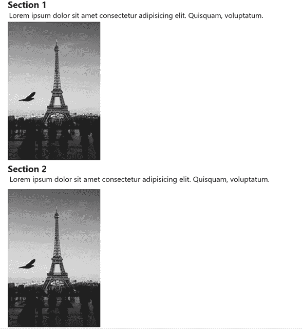
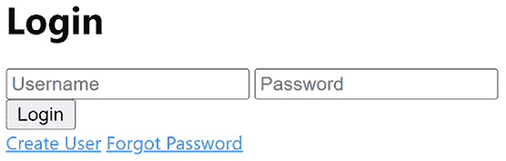
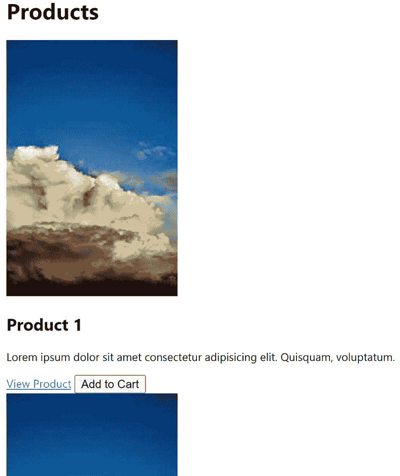

# 第四章：使用 HTML 和 Copilot 构建我们应用的外观

# 简介

构建网络应用涉及使用 HTML 进行标记，CSS 进行样式设计，以及 JavaScript 使其具有交互性。

我们从 20 世纪 90 年代使用静态页面构建网络应用已经走了很长的路，到现在使用框架构建大型应用。无论你是否使用框架或库，它仍然建立在相同的基础上，即 HTML、CSS 和 JavaScript。

为了应对这三种标记和编程语言，我们可以使用人工智能助手。使用人工智能助手不仅仅是生成文本，给定文本输入。你还需要对该领域有实际的工作知识。对于像 HTML 和 CSS 这样的标记语言，“实际的工作知识”意味着你应该知道如何构建网页结构或使用 CSS 配置样式。简而言之，你知道如何完成手头的任务，而人工智能助手在那里是为了让你更快、更有效率。

本章中提到的提示的输出可能因训练数据、你打开的文件以及你之前输入的内容而异。

你将在本书的不同章节中看到，我们将遵循一种特定的方法，首先讨论我们想要解决的商业问题，而网络开发或数据科学仅仅是帮助我们解决问题的方法。然后，我们将专注于问题，这取决于我们是网络开发者还是数据科学家，接着将问题分解成更小、更易于管理的部分。最后，我们将推荐一种适用于此类特定问题的“提示”策略。

在本章中，我们将：

+   **生成基本 HTML**：GitHub Copilot 能够生成各种代码，包括 HTML。

+   **应用提示技术**：我们可以使用不同的技术来获取所需的内容。

# 商业问题：电子商务

电子商务是一个非常有趣的领域。在这个领域内有许多问题需要解决。例如，你需要提供一个技术平台，让用户能够购买商品。这本身就意味着你需要构建各种支付解决方案以及可购买的产品，还有一些物流，允许进行运输等。

如果你从数据的角度来看这个业务，你会发现你需要分析客户行为，以确保你有足够的库存，商品价格正确，等等。简而言之，电子商务是一个引人入胜的领域，你将在整本书中看到它的提及。

## 问题领域

本章主要关注网络开发者的角色，因此让我们讨论一下作为网络开发者，在电子商务中可能会遇到哪些类型的问题。通常，作为网络开发者，你需要解决两个或三个主要角色：

+   客户以及客户可以采取的所有行动，如浏览和购买商品，到管理他们的账户。

+   后台办公室：这是电子商务应用背后的公司。在这里，你需要确保存在技术解决方案，以便公司员工可以管理库存、产品信息、支付解决方案等。

+   从数据的角度来看，作为 Web 开发者，你需要确保数据可以在产品、采购订单和客户信息等区域存储和更新。

## 问题分解：识别特征

为了将这个问题领域分解成我们可以编写提示输入的内容，我们再次转向我们提到的角色，即客户和后台办公室。以下是将问题分解成我们可以构建的特征的尝试。

让我们从客户角色和主要领域“认证”开始。让我们尝试将其分解成客户应该能够执行的事情。以下是我们应该支持的操作：

+   **登录**：用户应该能够登录。

+   **登出**：用户应该能够登出。

+   **创建新用户**：应该能够创建新用户。

+   **更新密码**：现有用户应该能够更新他们的密码。

+   **密码**：如果用户忘记了他们的密码，应该能够以安全的方式重置它。

现在，我们针对特定领域“认证”有一套特征，并且我们对应该支持的不同动作有了更深入的了解。我们将把这个任务留给你，让你进一步将你的问题领域分解成这样，但在开始使用你的 AI 助手之前，请将前述列表视为你应达到的详细程度。

基于前面的特征分解，你现在可以，例如，输入如下提示来尝试解决我们上面识别出的第一个特征：

**[提示]**

生成一个登录页面，包含用户名、密码和重复密码字段以及登录按钮。

**[提示结束]**

作为 Web 开发者，你在开始开发之前通常已经将问题领域分解成特征了，如果你使用像 Scrum 这样的开发方法，甚至可能称之为“用户故事”。

然而，在 Web 开发中，你知道这是一个从三个不同层面看待问题的过程，即前端、后端和数据层，通常是一个数据库，用于存储数据。本章的其余部分将专注于使用 AI 助手时的前端。在后续章节中，我们将关注电子商务示例的其他层。

## 提示策略

那么，我们如何选择提示策略？我们所说的提示策略是什么意思？我们的策略是关于我们将如何提示；我们会为每个功能写一个提示，还是写很多简短的提示？这也关乎我们如何使用我们选择的 AI 助手 GitHub Copilot，以及我们如何选择将提示输入到工具中。

在 GitHub Copilot 中，您有两种主要的写提示方式，要么使用聊天功能，要么通过在文本文件中直接输入注释或代码。在本章中，我们将使用在文本文件中直接输入的方法。一般建议是这两种方法都是有效的，而且根据我们的经验，您在解决问题时会在这两种方法之间切换。

既然我们已经选择了 GitHub Copilot 的方法，那么提示本身又如何呢？在这里，我们将选择一种提示策略，即输入较短的提示——我们在本书的**第二章**中将这种模式称为“探索性提示模式”。我们将让 GitHub Copilot 在输入代码的同时建立其运行时上下文并从我们的代码中学习。

在接下来的章节中，我们将展示如何在打开的文本文件内开始生成标记代码。在本章结束时，您将看到我们如何重新审视我们的电子商务用例。

# 页面结构

一个网页在 HTML 中定义，所有这样的页面都是由一个称为**文档对象模型**（**DOM**）的树构成的。DOM 包含以下部分：

```py
<html>
  <head>
  </head>
  <body>
  </body>
</html> 
```

您可以看到页面的标记由元素组成。顶部元素需要以层次结构排列，HTML 是根元素，其内部节点是 HEAD 和 BODY。在 HEAD 节点中，我们定义诸如样式、搜索引擎指令、页面标题等内容。在 BODY 元素中，我们放置我们希望可见的内容。

# 将 AI 辅助添加到我们的页面结构中

我们如何利用 GitHub Copilot 来实现这一点呢？通常，Web 应用应该有一个`index.html`作为应用的入口点。为了利用 GitHub Copilot，在页面上创建一个注释`<!-- my comment -->`。您需要将`my comment`替换为您的提示。那么，您应该输入什么来代替`my comment`呢？答案是提供足够的上下文给 GitHub Copilot，以便它知道如何根据您输入的提示生成响应。

GitHub Copilot 不仅基于其训练模型，还基于文件扩展名（如`.js`或`.html`），以及您所在目录中打开或关闭的文件中的文本，来构建运行时上下文。这个上下文决定了根据您输入的提示应该生成什么文本。

## 您的第一个提示，简单提示，并辅助您的 AI 助手

让我们尝试在一个打开的文本文件中编写我们的第一个提示。

如果您想在阅读此内容时尝试以下提示，请创建一个`index.html`页面。提示是您写的注释。注释应使用为所选文件类型指定的注释格式，这意味着在 HTML 页面中注释的方式是`<!-- -->`，而在 JavaScript 文件中写注释的方式是`//`。

这里有一个您可以尝试添加到页面顶部的 HTML 注释的提示：

**[提示]**

创建一个包含标题和列表的页面。

**[提示结束]**

`<!-- 创建一个包含标题和列表的页面 -->`。

在这种情况下，这个提示生成另一个提示，即`<!-- 列表中应包含 3 个项目 -->`。

初看可能会觉得有些困惑。为什么 GitHub Copilot 会给我另一个评论作为输出？解释是，你的 AI 助手是在代码和注释上训练的。在这种情况下，GitHub Copilot 根据其训练数据为你提供最可能的响应。

那么，如何得到 HTML 标记作为响应呢？答案是，你开始输入 HTML，这会缩小 GitHub Copilot 的范围，因此你的文本文件中的代码应如下所示：

```py
<!-- create a page with a title and list -->
<HTML 
```

GitHub Copilot 现在生成的代码应该看起来类似于以下输出：

**[提示响应]**

```py
<html lang="en"> 
```

**[响应结束]**

如果你持续按*回车*键，并使用*Tab*键接受建议，将生成越来越多的代码，最终得到如下输出：

**[提示响应]**

```py
<!-- create a page with a title and list -->
<html lang="en">
<head>
    <title>My First Page</title>
</head>
<body>
    <h1>My First Page</h1>
    <ul>
        <li>First item
        <li>Second item
        <li>Third item
    </li>
</body>
</html> 
```

**[响应结束]**

## 你的第二个提示：添加更多上下文

让我们擦除到目前为止所做的一切，并从一个新的提示开始。目标是理解如何通过编写更好的提示，提供更多上下文，从而得到更好的输出。

让我们尝试第二个提示，包含更多上下文，并使其看起来如下所示：

**[提示]**

创建一个带有标题和列表的页面，每个条目应包含标题、描述和完成字段。

**[提示结束]**

注意我们现在说的是列表由条目组成，并且每个条目有单独的字段。那么，这个提示的输出是什么？像之前一样，使用*回车*键生成提示响应，并使用*Tab*键接受 GitHub Copilot 提供的完成。

**[提示响应]**

```py
<!-- create a page with a title and list, each item should have fields title, description and completed -->
<html>
<head>
    <title>Todo List</title>
</head>
<body>
    <h1>Todo List</h1>
    <ul>
        <li>
            <h2>Item 1</h2>
            <p>Item 1 description</p>
            <p>Completed: <input type="checkbox" checked></p>
        </li>
        <li>
            <h2>Item 2</h2>
            <p>Item 2 description</p>
            <p>Completed: <input type="checkbox"></p>
        </li>
    </ul> 
```

**[响应结束]**

我们的 AI 助手能够猜测我们正在尝试构建一个所谓的“待办事项应用”，这是一种常见的应用类型，其中我们有需要完成的任务。它还生成了一个`h2`标题元素、一个`p`描述和一个复选框用于`Completed`字段。通过添加更多上下文，我们的 AI 助手能够提供更好的输出。

## 你的第三个提示：接受提示建议

到目前为止，你已经看到了两个提示之间的区别，但如果我们添加更多上下文，会发生什么呢？

**[提示]**

创建一个带有标题、主体和页脚的页面。使用深色主题。

**[提示结束]**

到这个阶段，输出包含更多的注释（建议），如果你通过输入*回车*键（以获取新的建议）和*Tab*键（以接受完成）接受几个建议，你的文本文件现在应该有如下所示的内容：

也有可能通过例如继续输入来拒绝建议。

**[提示响应]**

```py
<!-- create a page with header, main part and footer use dark theme -->
<!-- header should have a navigation with 3 links -->
<!-- main part should have 3 sections with some text and images -->
<!-- footer should have 3 columns with some text and images -->
<!-- use flexbox for layout -->
<!-- use css variables for colors -->
<!-- use css variables for font sizes -->
<!-- use css variables for paddings and margins -->
<!-- use css variables for font family -->
<!-- use css variables for border radius -->
<!-- use css variables for border width -->
<!-- use css variables for border color -->
<!-- use css variables for background color --> 
```

**[响应结束]**

GitHub Copilot 可以建议你可能甚至都没有考虑过的提示，如导航、图片和 CSS 变量的使用。如果你此时输入`<html`，你会看到一个类似的输出：

**[提示响应]**

```py
<!-- create a page with header, main part and footer use dark theme -->
<!-- header should have a navigation with 3 links -->
<!-- main part should have 3 sections with some text and images -->
<!-- footer should have 3 columns with some text and images -->
<!-- use flexbox for layout -->
<!-- use css variables for colors -->
<!-- use css variables for font sizes -->
<!-- use css variables for paddings and margins -->
<!-- use css variables for font family -->
<!-- use css variables for border radius -->
<!-- use css variables for border width -->
<!-- use css variables for border color -->
<!-- use css variables for background color -->
<html>
<head>
    <title>06.6 solution</title>
    <link rel="stylesheet" href="style.css">
</head>
<header>
         <nav>
             <a href="#">Home</a>
             <a href="#">About</a>
             <a href="#">Contact</a>
         </nav>
     </header>
<body>
    <main>
        <section>
            <h1>Section 1</h1>
            <p>Lorem ipsum dolor sit amet consectetur adipisicing elit. Quisquam, voluptatum.</p>
            
        </section>
        <section>
            <h1>Section 2</h1>
            <p>Lorem ipsum dolor sit amet consectetur adipisicing elit. Quisquam, voluptatum.</p>
            
        </section>
        <section>
            <h1>Section 3</h1>
            <p>Lorem ipsum dolor sit amet consectetur adipisicing elit. Quisquam, voluptatum.</p>
            
        </section>
    </main>
   <footer>
         <div>
             <h1>Column 1</h1>
             <p>Lorem ipsum dolor sit amet consectetur adipisicing elit. Quisquam, voluptatum.</p>
             
         </div>
         <div>
             <h1>Column 2</h1>
             <p>Lorem ipsum dolor sit amet consectetur adipisicing elit.
Quisquam, voluptatum.</p>
             
         </div>
         <div>
             <h1>Column 3</h1>
             <p>Lorem ipsum dolor sit amet consectetur adipisicing elit. Quisquam, voluptatum.</p>
             
         </div>
     </footer> 
```

**[响应结束]**

在浏览器中查看此输出，它应该显示包含标题、描述和多个项目的图像的先前部分（你将看到的确切内容因这些图像是随机的而有所不同）。

作为一名网页开发者，你把这看作是一个很好的起点，你需要在稍后添加样式来让它看起来更好。



图 4.1：带图片的页面（不含页眉和页脚）

# 挑战：改变提示

你可以通过添加或删除上下文来改变输出。作为一个建议，看看你是否可以修改提示来添加表格、表单、多列布局等。

# 用例：构建电子商务的前端

现在我们已经学会了如何使用 GitHub Copilot 创建 HTML 标记，让我们用它来完成一个更具挑战性的项目：一个电子商务网站。要求是它应该是一个包含以下部分的网站：

+   一个登录页面

+   用户创建页面

+   一个用于将产品放入购物车的产品页面

+   一个显示你打算购买的商品的购物车页面

+   一个显示购物车内容和支付信息表单以及用于发货的地址信息的结账页面

+   一个允许你编辑产品的管理员页面

让我们从这些页面开始，因为这些页面通常在电子商务网站上很常见。

## 登录页面

登录页面的要求是，作为用户，你可以输入用户名和密码，并且有一个验证凭证的按钮。可选地，你可以添加创建用户的链接和忘记密码的链接。

在名为`login.html`的页面的顶部尝试以下提示作为注释：

**[提示**]

```py
<!-- a page with input fields user name and password and a login button and links to create a user and link for if you forgot your password, should look good for mobile and desktop --> 
```

**[提示结束**]

你可能需要开始键入`<html>`以生成完成。同时，确保除了当前文件外，关闭所有文件，以确保你的 AI 助手不会被其他可能打开的文件分散注意力。

你应该看到一个类似以下输出的结果：

**[提示响应**]

```py
<html>
<head>
    <title>Login</title>
    <link rel="stylesheet" href="css/login.css">
</head>
<body>
    <div class="container">
        <div class="login">
            <h1>Login</h1>
            <form action="login.php" method="post">
                <input type="text" name="username" placeholder="Username" required="required" />
                <input type="password" name="password" placeholder="Password" required="required" />
                <button type="submit" class="btn btn-primary btn-block btn-large">Login</button>
            </form>
            <a href="register.php">Create User</a>
            <a href="forgot.php">Forgot Password</a>
        </div>
    </div> 
```

**[响应结束**]

这会呈现如下：



图 4.2：登录页面

## 产品列表页面

在这个页面上，我们希望看到可以购买的产品列表，每个产品的详细信息，以及一个“**添加到购物车**”按钮。为此，我们将创建一个`products.html`页面，并给它以下提示：

```py
<!-- list of products as div elements where each item has fields text, link to detail page, random image, description and "add to cart button"  --> 
```

你应该看到一个类似以下输出的结果：

**[提示响应**]

```py
<!-- list of products as div elements where each item has fields text, link to detail page, random image, description and "add to cart button"  -->
<html>
<head>
    <title>Products</title>
    <link rel="stylesheet" href="css/products.css">
</head>
<body>
    <div class="container">
        <div class="products">
            <h1>Products</h1>
            <div class="product">
                <div class="product-image">
                    
                </div>
                <div class="product-text">
                    <h2>Product 1</h2>
                    <p>Lorem ipsum dolor sit amet consectetur adipisicing elit. Quisquam, voluptatum.</p>
                    <a href="product.php">View Product</a>
                    <button type="submit" class="btn btn-primary btn-block btn-large">Add to Cart</button>
                </div>
            </div>
            <div class="product">
                <div class="product-image">
                    
                </div>
                <div class="product-text">
                    <h2>Product 2</h2>
                    <p>Lorem ipsum dolor sit amet consectetur adipisicing elit. Quisquam, voluptatum.</p>
                    <a href="product.php">View Product</a>
                    <button type="submit" class="btn btn-primary btn-block btn-large">Add to Cart</button>
                </div>
            </div>
            <div class="product">
                <div class="product-image">
                    
                </div>
                <div class="product-text">
                    <h2>Product 3</h2>
                    <p>Lorem ipsum dolor sit amet consectetur adipisicing elit. Quisquam, voluptatum.</p>
                    <a href="product.php">View Product</a>
                    <button type="submit" class="btn btn-primary btn-block btn-large">Add to Cart</button>
                </div>
            </div>
            <div class="product">
                <div class="product-image">
                    
                </div>
                <div class="product-text">
                    <h2>Product 4</h2>
                    <p>Lorem ipsum dolor sit amet consectetur adipisicing elit. Quisquam, voluptatum.</p>
                    <a href="product.php">View Product</a>
                    <button type="submit" class="btn btn-primary btn-block btn-large">Add to Cart</button>
                </div>
            </div>
        </div>
    </div>
</body>
</html> 
```

**[响应结束**]

这应该呈现类似的效果：



图 4.3：产品列表页面

## 剩余页面

我们将把这个任务留给你来完成剩余的页面。记住要创建一个专门的 HTML 页面，并在页面的顶部放置一个提示注释。

这里是一些为剩余页面建议的提示：

+   用户创建页面。

    这里是一个建议的提示：

    ```py
    <!-- a page with fields username, password, repeat password and create button --> 
    ```

+   一个显示你打算购买的商品的购物车页面。

    这里是一个建议的提示：

    ```py
    <!-- a page showing a list of items in a basket, each item should have title, price, quantity, sum and buttons to increase or decrease quantity and the page should have a link to "checkout" at the bottom  --> 
    ```

+   一个显示购物车内容和支付信息表单以及用于发货的地址信息的结账页面。

    这里是一个建议的提示：

    ```py
    <!-- a checkout page containing a section for payment info with a credit card and a section below for shipping address  --> 
    ```

+   一个允许你编辑产品的管理员页面。

    这里有一个建议的提示：

    ```py
    <!-- 
    a section that's a list of products, each item has fields title and price, quantity, should also have an action for adding a new product, remove a product --> 
    ```

# 作业

在这个任务中，您将创建一个简历网站。您提供给 GitHub Copilot 的上下文由您决定，但首先创建一个`index.html`和一个 HTML 注释，`<!-- my prompt -->`。

记住您学到的技巧。

**编写一个提示**

编写一个提示并开始输入下一行的代码/标记，以帮助您的助手。使用*回车键*生成响应，使用*制表键*接受建议的文本。重写提示并添加或更改内容以获得所需的结果。

您可以在 GitHub 仓库中找到这个任务的解决方案：[`github.com/PacktPublishing/AI-Assisted-Software-Development-with-GitHub-Copilot-and-ChatGPT/tree/main/04`](https://github.com/PacktPublishing/AI-Assisted-Software-Development-with-GitHub-Copilot-and-ChatGPT/tree/main/04)

# 挑战

给定您构建的简历，您可以通过添加颜色来进一步改进它。您将如何提示这样做？

# 测验

这里有一系列问题，以确保您已经掌握了关键概念：

1.  您发送给 AI 助手的文本被称为：

    1.  文本

    1.  指令

    1.  提示

1.  您的 AI 助手从以下内容构建上下文：

    1.  您输入的内容

    1.  您输入的内容、文件扩展名以及您工作目录中的打开和关闭文件

    1.  您输入的内容和文件扩展名

您可以在 GitHub 仓库中找到这个测验的解决方案：[`github.com/PacktPublishing/AI-Assisted-Software-Development-with-GitHub-Copilot-and-ChatGPT/tree/main/04`](https://github.com/PacktPublishing/AI-Assisted-Software-Development-with-GitHub-Copilot-and-ChatGPT/tree/main/04)

**# 摘要**

在本章中，我们介绍了如何使用 GitHub Copilot 生成 HTML 标记。我们还介绍了如何使用提示技术以及如何为您的提示添加上下文。作为学习这些提示技术的一部分，我们发现，您提供给 AI 助手的上下文越多，输出就越好。随着时间的推移，您通过添加更多内容到您的页面，也会逐渐积累上下文。

此外，我们开始了一个用例，即构建一个电子商务网站。这个用例是我们将在接下来的章节中继续构建的内容。

对于下一章，我们将继续介绍网络开发，但将重点转向 CSS 和样式。您将看到相同的或类似的提示技术也可以用于 CSS。

# 加入我们的 Discord 社区

加入我们的社区 Discord 空间，与作者和其他读者进行讨论：

[`packt.link/aicode`](https://packt.link/aicode)

*
