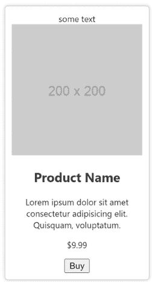
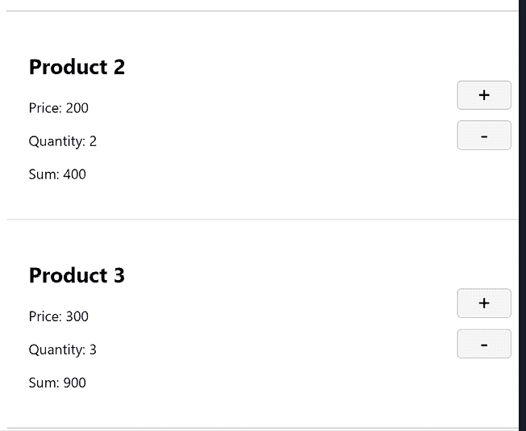

# 5

# 使用 CSS 和 Copilot 设计应用

# 简介

优雅地设计应用可以极大地改变用户对其的看法。周到的设计包括适应多个设备、智能使用图形和具有良好对比度的颜色。

CSS 样式化是一个很大的主题，我们不会详细讨论。然而，我们将展示如何开始使用它。就像在前一章中一样，我们将使用我们的 AI 助手来帮助我们生成代码。您将看到我们将继续使用基于注释的提示来生成代码，但也会展示一种新的技术，其中仅使用文件上下文来生成代码。

您还将看到我们将如何继续构建我们的电子商务项目并对其进行样式化。

在本章中，我们将看到如何生成所需的 CSS 以及如何继续应用我们在前几章中使用过的提示模式和策略。我们将继续构建电子商务项目，并使其外观吸引人。

在本章中，我们将：

+   **生成 CSS**：GitHub Copilot 可以生成样式，我们将展示如何通过查看文本文件中的周围代码以及基于 CSS 注释来生成 CSS 的 AI 辅助。

+   **应用提示技术**：我们可以使用不同的技术来获取所需的内容。

+   **将 CSS 添加到我们的电子商务项目中**：我们将选择电子商务项目中的几个页面来展示它如何从样式化中受益。

# 商业问题：电子商务

就像前一章一样，我们将继续在电子商务领域工作，并通过其许多有趣的问题。由于本章重点在于使用 CSS 进行可视化，您可能会想知道这与商业有什么联系？一个糟糕的用户体验（UX）、设计不良的网站（除了桌面设备外不工作或不符合无障碍性）可能会让您损失金钱，因为这样，客户可能会选择与您的竞争对手做生意。

# 问题和数据领域

本章将继续探讨电子商务业务领域，并具体深入到一个列出客户打算购买的产品页面的购物车页面。因此，数据是产品数据；不仅如此，从数据角度来看，我们需要考虑如何展示与产品相关的详细数据，例如数量和总成本，以便客户可以决定购买什么以及购买多少项。这些考虑应该反映在所选的设计中。

# 将问题分解为功能

在前一章中，我们选择识别一个更大的区域，“认证”，并将其分解为具体的功能。让我们回顾一下这个功能分解看起来是什么样子。之后，我们将看看是否需要将其改为更注重设计。但首先，让我们展示功能列表：

+   **区域**：认证

+   **登录**：用户应该能够登录。

+   **登出**：用户应该能够登出。

+   **创建新用户**：应该能够创建新用户。

+   **更新密码**：现有用户应该能够更新他们的密码。

+   **重置密码**：如果用户忘记了他们的密码，应该能够以安全的方式重置它。

上述功能列表构成了一个良好的高级列表，列出了我们需要支持的内容。然而，从设计角度来看，我们需要考虑诸如适应不同设备或支持辅助功能等问题。因此，对于第一个功能，可能需要调整提示以看起来像这样：

**[提示]**

生成一个登录页面。它应该有用户名、密码和重复密码字段，以及一个登录按钮。它还应支持通过工具提示和 ARIA 键的辅助功能，以便仅使用键盘和鼠标即可使用。

**[提示结束]**

如您从上面的提示中可以看到，我们的关注点不仅包括我们需要的 UI 元素，如输入和按钮，还包括它们应该如何工作。

与之前一样，我们建议您将您即将构建的 Web 应用程序分解为区域，并将每个区域分解为功能，以便更容易地进行提示。

# 提示策略

在上一章中，我们提到您可以使用 GitHub Copilot 的 Chat 模式，也可以在文件内部进行输入，并且建议您使用这两种方法。至于如何进行提示，建议您编写较短的提示，并在需要时添加上下文。这样做，您就依赖于 GitHub Copilot 的工作方式以及它如何根据其底层模型、您的开放目录和您的开放文件等构建运行时上下文。您还将看到提示的另一个方面，这并不依赖于提示的长短，而是取决于您特定的 AI 工具如何工作。在本章中，我们使用 *第二章* 中描述的“探索性提示模式”。

# CSS，或层叠样式表

CSS，或层叠样式表，用于美化 HTML 页面。它包含各种结构，允许您更改字体、大小、颜色和布局等。

要跟随下面提到的提示，建议您创建一个 `product.css` 文件，或者您也可以等到本章后面的 *作业* 部分；这取决于您。

## 首个 CSS

要利用我们的 AI 助手，我们可以在 CSS 文件中放置一个类似于代码的 CSS 类型的注释，例如：

```py
.product {
  /* apply padding and margin */  
  padding: 10px;
  margin: 10px;
} 
```

如前所述，注释样式根据文件类型而有所不同。HTML 注释看起来是这样的：`<!-- -->`。CSS 注释使用 `/**/`，而 JavaScript 可以理解 CSS 类型的注释和 `//`。在本章中，您将使用 `/**/`，因为您正在处理 CSS。

在 GitHub Copilot 中，您可以持续按下 *回车* 键，然后按下 *Tab* 键，以生成并接受新的建议，而无需输入新的提示。您的 AI 助手可以根据您输入的第一个提示和文件中存在的代码提供建议。

这如何影响我们上面的 CSS 文件，那就是一旦我们输入第一个 CSS 注释，我们就可以继续按*Enter*和*Tab*键，AI 助手将生成通常与填充和边距一起使用的 CSS 属性。以下输出是使用按*Enter*和*Tab*键的技术和依赖于打开文件上下文的结果。

这就是`product.css`的显示方式：

```py
.product {
    /* apply padding and margin */  
    padding: 10px;
    margin: 10px;
    /* apply border */
     border: 1px solid #ccc;
    /* apply border radius */
     border-radius: 5px; 
    /* apply background color */
     background-color: #fff; 
    /* apply box shadow */
     box-shadow: 0 0 5px #ccc; 
    /* apply display */
    display: inline-block; 
    /* apply width */
     width: 200px; 
    /* apply text align */
     text-align: center; 
    /* apply text decoration */
     text-decoration: none; 
    /* apply color */
     color: #333;  
} 
```

现在已经使用上述内容创建了`product.css`，我们可以在 HTML 文件中包含该 CSS 文件。切换到该 HTML 文件（如果你正在跟随输入，创建一个`index.html`文件），然后在文件的末尾添加以下提示：

**[提示]**

包含`product.css`的页面。

**[提示结束]**

**[提示响应]**

```py
<!-- page that includes product.css -->
<!DOCTYPE html>
<html lang="en">
<head>
    <meta charset="UTF-8">
    <title>Product</title>
    <link rel="stylesheet" href="product.css">
</head>
<body>
    <div class="product">
        some text
        <div class="product__image">
            
        </div>
        <div class="product__info">
            <h2 class="product__name">Product Name</h2>
            <p class="product__description">Lorem ipsum dolor sit amet consectetur adipisicing elit. Quisquam, voluptatum.</p>
            <p class="product__price">$9.99</p>
            <button class="product__buy">Buy</button>
        </div>
    </div>
</html> 
```

**[响应结束]**

观察它不仅正确地添加了链接标签以包含`product.css`，而且还生成了可能适合产品的 HTML。

以下为输出结果：



图 5.1：产品 CSS 显示产品图片、标题和描述

## 按名称排序的 CSS

到目前为止，我们已经添加了一个注释来生成建议。但还有一种方法可以生成 CSS 文件的建议，而不是为 Copilot 添加注释。这种方法包括创建一个空的 CSS 类`.product`，并将光标放在其中。然后使用*Enter*键和*Tab*键，看看 Copilot 生成什么，直到你满意为止。

这是你开始 CSS 文件的方式：

```py
.product {

} 
```

现在将光标放在花括号`{}`内，并使用*Enter*和*Tab*键为每个需要建议的新行。

这可能是最终结果的样子：

**[提示响应]**

```py
.product {
  display: flex;
  flex-direction: column;
  align-items: center;
  justify-content: center;
  width: 100%;
  margin: 0 auto;
  padding: 0 0 50px 0;
  background-color: #f5f5f5;
} 
```

**[响应结束]**

# 作业

在这个作业中，你将创建一个图片画廊应用。画廊应显示 10 张图片，每行 5 张。使用你在上一章中学到的知识来生成 HTML 文件和单独的 CSS 文件。

使用“占位符”作为关键词来获取图片。

你的 HTML 文件应该添加对生成的 CSS 文件的引用，以便正确应用 CSS。

# 解决方案

你可以在 GitHub 仓库中找到这个作业的解决方案：[`github.com/PacktPublishing/AI-Assisted-Software-Development-with-GitHub-Copilot-and-ChatGPT`](https://github.com/PacktPublishing/AI-Assisted-Software-Development-with-GitHub-Copilot-and-ChatGPT)

# 用例：为电子商务应用添加样式

现在你已经完成了一个作业，其中你创建了 CSS 文件和 HTML 文件，你应该对如何编写提示以及从 GitHub Copilot 生成和接受建议有了更好的理解。现在让我们回顾本章的开头，我们讨论了商业问题和电子商务领域。我们将继续在这个领域解决问题，但将重点放在使用 CSS 进行可视化。

我们将继续使用上一章中开始的使用案例：我们的电子商务商店。我们将专注于购物车页面，其余页面留给你来实现。

## 购物车页面

为了样式化我们的购物车 HTML 页面，我们创建一个 `basket.css` 文件，然后观察我们在 `basket.html` 文件中引入的 CSS 类。让我们看一下一个代表性的片段：

```py
<div class="container">
        <div class="basket">
            <h1>Basket</h1>
            <div class="basket-item">
                <div>
                    <h2>Product 2</h2>
                    <p>Price: 200</p>
                    <p>Quantity: 2</p>
                    <p>Sum: 400</p>
                </div> 
```

在前面的代码中，我们看到类 `basket` 和 `basket-item`。让我们在 `basket.css` 中为这些创建 CSS 类：

从一个空的 `basket.css` 开始，键入 `.basket`。当你使用 *Return* 和 *Tab* 键反复操作时，你应该会看到以下类似的输出。当你对输出满意时，键入 `}` 来完成 CSS 类。

**[提示响应]**

```py
.basket {
    width: 100%;
    height: 100%;
    display: flex;
    flex-direction: column;
    align-items: center;
    padding: 20px;
} 
```

**[响应结束]**

要创建 `basket-item` 类，键入 `.basket-item` 并反复使用 *Return* 和 *Tab* 键。像之前一样，当你对生成的 CSS 属性数量满意时，键入 `}`。你现在应该已经生成了一个类似于以下文本的 CSS 输出：

```py
.basket-item {
    width: 100%;
    height: 100%;
    display: flex;
    flex-direction: row;
    align-items: center;
    padding: 20px;
    border-bottom: 1px solid #ccc;
} 
```

如果我们继续查看我们的 HTML 文件，我们还会看到另一个有趣的片段：

```py
<div class="basket-item-buttons">
    <button type="submit" class="btn btn-primary btn-block btn-large">+</button>
    <button type="submit" class="btn btn-primary btn-block btn-large">-</button>
</div> 
```

使用之前相同的提示技术，通过键入 CSS 类名（`.basket-item` > `.basket-item-button`）并反复使用 `RETURN` 和 `TAB` 键来生成以下文本：

```py
.basket-item > .basket-item-buttons {
    display: flex;
    flex-direction: column;
    align-items: center;
    justify-content: center;
    margin-left: auto;
}
.basket-item-buttons button {
    margin: 5px;
    /* set width, large font size, business color background */
    width: 50px;
    font-size: 20px;
    background-color: #f5f5f5;
    border: 1px solid #ccc;
    border-radius: 4px;
} 
```

你可能需要单独键入 `.basket-item-buttons` 按钮类，并且像之前一样，反复使用 *Return* 和 *Tab* 键。

在浏览器中查看应用 CSS 的影响，你应该会看到以下类似的外观：



图 5.2：购物车中的项目列表

# 挑战

你会如何修改提示来创建一个深色主题的购物车页面？

# 测验

你如何使用你的 AI 助手生成 CSS？

1.  在 CSS 文件中创建一个评论。

1.  创建一个类并将光标放在类中。

1.  A 和 B 都可以。

你可以在 GitHub 仓库中找到这个测验的解决方案：[`github.com/PacktPublishing/AI-Assisted-Software-Development-with-GitHub-Copilot-and-ChatGPT`](https://github.com/PacktPublishing/AI-Assisted-Software-Development-with-GitHub-Copilot-and-ChatGPT)

# 摘要

在本章中，我们介绍了如何使用你的 AI 助手生成 CSS。你看到了上一章中引入的提示技术如何应用于 CSS。

此外，我们还展示了如何以两种不同的方式生成文本，通过在文件顶部放置注释或在我们需要帮助的区域附近放置注释，或者将光标放在 CSS 类内部，让它根据 CSS 类名生成 CSS。

在下一章中，我们将展示如何使用 JavaScript 为你的应用添加行为。你会看到从提示的角度来看，JavaScript 与 HTML 和 CSS 类似。然而，你仍然需要理解主题内容，这是你试图解决的潜在问题。

# 加入我们的 Discord 社区

加入我们社区的 Discord 空间，与作者和其他读者进行讨论：

[`packt.link/aicode`](https://packt.link/aicode)


