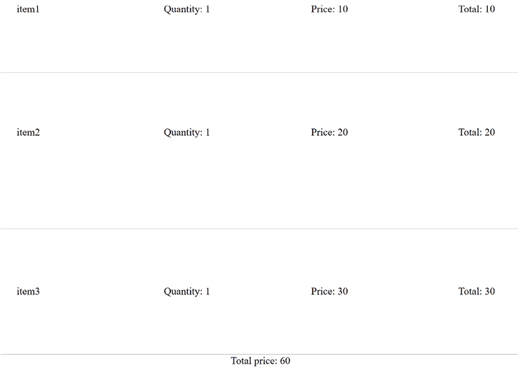
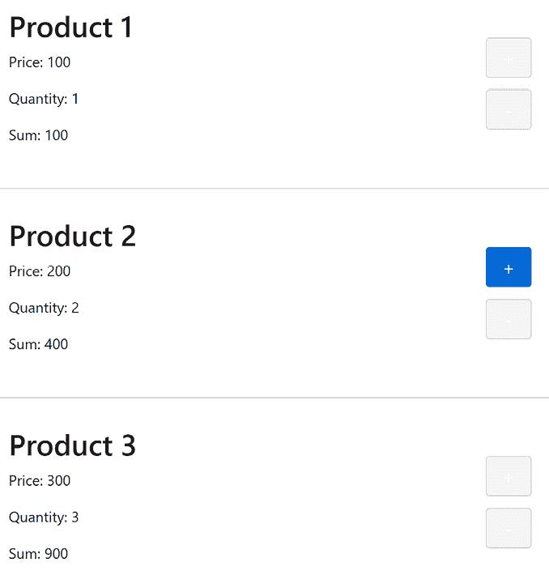
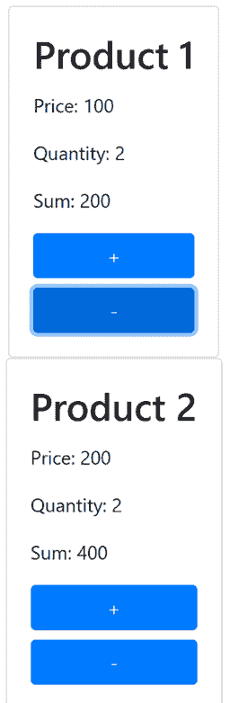

# 6

# 使用 JavaScript 添加行为

# 简介

一个只包含 HTML 标记和 CSS 的网页是完全可以接受的，但如果你想要交互性，你需要 JavaScript。

使用 JavaScript，你可以从少量应用，例如将表单发布到后端，到大量应用，如使用 Vue.js 或 React.js 这样的框架构建**单页应用**（SPA）。无论如何，有一个共同点，即你需要编写代码并从你的 HTML 标记中引用该代码或代码文件。

你会发现 Copilot 可以帮助完成从添加脚本标签到 HTML 标记这样的常见任务，到添加 Vue.js 这样的 JavaScript 框架到你的 Web 应用等更高级的任务。

在本章中，我们将：

+   使用提示生成 JavaScript 以添加应用的行为。

+   为我们的电子商务应用添加交互性。

+   介绍一个如 Vue 的 JavaScript 框架，以确保我们为自己打下坚实的基础。

# 业务问题：电子商务

在本章中，我们也将继续在电子商务领域工作。在前几章中，你看到了我们如何使用 HTML 来尝试确定每页应该包含哪些信息，并确定在过程中我们需要哪些页面。在本章中，我们添加了缺失的组件，即 JavaScript，这是使一切工作的关键。JavaScript 将扮演添加交互性和读取/写入数据的双重角色。

# 问题与数据域

需要解决几个问题，如下：

+   **数据流**：我们如何向我们的应用程序添加代码以便我们可以读取和写入数据？

+   **处理用户交互**：用户会希望与你的应用程序进行交互。你需要配置用户想要使用的网站部分，并确保它能正常工作。并非所有的用户交互都会导致数据的读取或写入，但很多都会，因此你需要弄清楚何时会发生这种情况，并“连接”用户交互与你的数据流，如上所述。

+   **数据**：数据将根据你针对的应用程序部分而变化。例如，如果你实现了一个购物车页面，你将需要处理产品数据以及订单，因为用户想要“结账”他们的购物车，以便他们可以购买产品并将它们送到所选地址。

# 将问题分解为功能

我们理解业务域以及我们可能遇到的类型的问题，那么我们如何将其分解为功能？从前几章，我们有一个如何做到这一点的想法，但主要区别是，我们不仅要创建一个看起来像能工作的购物车页面，例如，而应该是真正能工作的。因此，我们可以将购物车页面，例如，分解为以下功能：

+   从数据源读取购物车信息。

+   渲染购物车信息。

+   将商品添加到购物车。

+   调整购物车中特定商品的选择数量。

+   从购物车中移除商品。

+   支持检查购物车，将用户带到订单页面，在那里他们将需要提供购买信息和送货页面。

一个电子商务网站由许多不同的页面组成。因此，建议在处理特定页面时，为每个页面进行类似的特性分解。

# 提示策略

提示策略在一定程度上取决于所选的 AI 工具，它的工作方式以及我们如何进行提示。GitHub Copilot 是我们本章所选的 AI 工具，我们将主要关注其编辑器内的体验，即你在打开的文件中输入提示。本章中我们将展示的方法如下：

+   **内联注释**：这意味着我们将直接在打开的文件中编写提示。你可以这样在文件顶部添加提示，也可以在尝试让 AI 助手构建特定代码块的地方添加额外的支持提示。

+   **聊天**：我们不会过多展示这种方法，但我们确实建议使用聊天来比较和对比，或者如果你需要查找特定信息或需要关于如何实现某事的建议。

在整本书中的一般建议是，你使用直接在打开的文件中“在编辑器内”使用提示和在聊天窗口中输入提示的混合方法。这些方法都有其优缺点。至于提示模式，我们将使用*第二章*中描述的“探索性提示模式”。

# 添加 JavaScript

要向网页添加 JavaScript，有两种主要方法：

+   在`<head>`元素中使用`<script>`标签：在这个版本中，你将向现有的 HTML 页面添加一个`<script>`标签，例如，命名为`index.html`。

    ```py
    <!-- Alt1 -->
     <script>
      // JavaScript here
     </script> 
    ```

+   指向一个独立的文件：在这种情况下，你将在现有的文件中编写你的 JavaScript 代码，例如，命名为`my-javascript-file.js`：

    ```py
    <!-- Alt2 -->
    <script src="img/my-javascript-file.js"></script> 
    ```

## JavaScript 的作用

当 JavaScript 最初被添加到浏览器中时，它扮演了添加交互性的角色。今天，JavaScript 通常作为 Vue.js、React 和 Angular 等应用框架的一部分，扮演着扩展的角色。在这样的框架中，开发者现在可以声明性地定义模板，借助 JavaScript 的帮助，可以将这些模板转换为静态 HTML，并添加事件处理以响应用户交互。最终，所有这些都会发送到浏览器进行渲染。

## 向页面添加 JavaScript

让我们展示如何通过提供以下提示来向页面添加 JavaScript：

**[提示]**

使用`<script>`标签创建网页。

**[提示结束]**

我们最终得到一个包含`<script>`标签的网页。注意提示是如何作为注释添加到页面顶部的。这就是 GitHub Copilot 知道建议文本补全的方式：

**[提示响应]**

```py
<!-- create web page with a script tag -->
<html>
<head>
    <title>My First Web Page</title>
</head>
<body>
    <script>
        alert("Hello World!");
    </script>
</body> 
```

**[响应结束]**

在这种情况下，代码调用`alert("Hello World")`，这将显示一个包含文本“Hello World”的对话框。

## 第二个示例：添加一个 JavaScript 库/框架

第一个例子可能不是非常有用，但让我们添加一些你可能会做的事情，比如添加一个像 Vue.js 这样的框架。添加像 Vue.js 这样的框架的原因是，你想要构建一个由大量交互和许多不同页面组成的大型应用。为了保持事物有序，并使其他开发者容易贡献，你想要一个像 Vue.js 这样的框架。

**[提示]**

添加 Vue 3。

**[提示结束]**

这次，我们将自己放在标题标签中。请参见下面`HEAD`标签中的 HTML 注释，以指示我们用作 GitHub Copilot 输入的提示：

```py
<head>
<!-- add Vue 3 -->
</head> 
```

此提示导致以下建议：

**[提示响应]**

```py
<script src="img/vue@next"></script> 
```

**[响应结束]**

您可以通过添加一个提示来轻松构建，该提示要求设置入口点（大多数 SPA 框架都基于有一个入口点的理念，即应用将被渲染的元素）：

**[提示]**

添加 Vue 3 入口点。

**[提示结束]**

这将导致以下代码：

**[提示响应]**

```py
<!-- add Vue 3 entry point -->
<div id="app">
    <h1>{{ message }}</h1>
</div> 
```

**[响应结束]**

将光标放置在导入 Vue.js 的`script`标签下方，将导致我们的 AI 助手生成添加到进一步设置 Vue.js 的代码指令。仅仅添加到 Vue.js 的脚本是不够的；还需要一些额外的代码。

幸运的是，由于我们的光标放置如下，GitHub Copilot 能够从现有的 HTML 注释（提示）中理解缺少的代码，并将该代码建议放置在我们的光标位置（如果 Copilot 建议没有出现，请尝试按*空格键*或*回车键*）：

**[提示]**

没有给出提示

**[提示结束]**

**[提示响应]**

```py
<script src="img/vue@next"></script>
<!-- below is rendered by just placing cursor here -->
<script>
    // create Vue 3 instance
    const app = Vue.createApp({
        data() {
            return {
                message: 'Hello World!'
            }
        }
    })
    // mount Vue 3 instance to DOM element
    app.mount('#app')
</script> 
```

**[响应结束]**

再次强调，GitHub Copilot 有足够的上下文，仅通过使用 Tab 键和回车键就可以生成更多建议，而无需提供额外的提示。

在浏览器中运行此代码返回“Hello World”，这是根据上述代码预期的。如果你不熟悉 Vue.js，以下是代码工作的原因：它包含了使其可引用和配置所需的最小内容：

+   `script`标签，引用 Vue.js

+   创建一个定义了具有`message`属性的`data`函数的应用实例

+   调用`mount()`，确保识别的 HTML 标签（`id = app`）被插入，并将`HTML`标签替换为属性`message`的值

当构建更高级的 Vue.js 项目时，请使用 Vue CLI 而不是上述方法。对于较小的概念验证，这种方法可能是可行的。

# 挑战

作为挑战，要求 Copilot 添加一个增加计数器的按钮。你可以使用以下提示：

**[提示]**

添加一个按钮来增加计数器。

**[提示结束]**

建议您将光标放置在 HTML 标记中`DIV`元素`id="app"`所在的位置。

# 用例：添加行为

对于我们电子商务用例的这一部分，让我们来渲染一个商品购物车页面。在这种情况下，我们将模拟调用后端获取数据，并将数据放置在一个名为 `cart.json` 的文件中，其结构如下：

```py
{
  "cart": [

  ]
} 
```

上述 JSON 内容描述了一个 JSON 对象（由 `{}` 定义），具有 `cart` 属性，该属性为数组类型，如方括号 `[]` 所示。

实际上，让我们使用我们的 AI 助手生成我们所需的数据。让我们创建 `cart.json` 文件和以下结构和提示：

```py
{
  "cart": [
    // item with id name , quantity and price, total = quantity * price
  ]
} 
```

注意提示 `// item with id name, quantity and price, total = quantity * price`，它导致以下 JSON：

```py
{
    "id": "1",
    "name": "item1",
    "quantity": "1",
    "price": "10",
    "total": "10"
},
{
    "id": "2",
    "name": "item2",
    "quantity": "1",
    "price": "20",
    "total": "20"
},
{
    "id": "3",
    "name": "item3",
    "quantity": "1",
    "price": "30",
    "total": "30"
} 
```

当你尝试从 Copilot 生成更多 JSON 代码时，添加带有 `//` 的注释是可以的，但一旦你对输出满意，就应该将其删除。

接下来，我们需要一个文件，`app.js`，它调用此 JSON 文件并最终渲染。我们可以使用上一章中的 `basket.html` 文件。它应该看起来像这样：

```py
<!-- a page showing a list of items in a basket, each item should have title, price, quantity, sum and buttons to increase or decrease quantity and the page should have a link to "checkout" at the bottom  -->
<html>
<head>
    <title>Basket</title>
    <link rel="stylesheet" href="css/basket.css">

</head>
<body>
    <div class="container">
        <div id="basket" class="basket">
        </div>
    </div>
    <!-- add app.js  -->
    <!-- add app.js, type javascript -->

    <script src="img/app.js"></script>
</body> 
```

让我们在 `body` 标签的末尾添加 `app.js`，添加一个提示：

**[提示]**

添加 `app.js`。

**[提示结束]**

**[Copilot 响应**

```py
<!-- add app.js  -->
<script src="img/app.js"></script> 
```

**[响应结束]**

在 `app.js` 中添加以下提示：

**[提示]**

读取 `cart.json` 并将内容作为 `div` 元素渲染到具有 ID 购物车的元素上。为每个项目添加 CSS 类 `basket-item`。

**[提示结束]**

应该给出类似的结果：

**[提示响应]**

```py
fetch('cart.json')
    .then(response => response.json())
    .then(data => {
        let basket = document.getElementById('basket');
        data.forEach(item => {
            let div = document.createElement('div');
            div.classList.add('basket-item');
            div.innerHTML = item.name;
            basket.appendChild(div);
        });
    }); 
```

**[响应结束]**

上述代码定位到具有 ID `basket` 的 HTML 元素，然后继续遍历数组数据。对于数据中的每个元素，将创建一个新的 HTML 元素，类型为 `DIV`，以下是对该元素的操作：

+   将 CSS 类 `basket-item` 添加。

+   其 `innerHTML` 属性将被分配 `name` 属性的值。

+   将特定元素添加到父元素购物车中。

你需要调整代码中的 `forEach` 部分，将其改为 `data.cart.forEach`，以根据 JSON 文件的外观进行调整（如果你的 JSON 中说你有 `description` 属性而不是 `name`，那么这应该在 JavaScript 代码中得到反映等）。然而，最终的结果看起来并不多，只有三个标题：

```py
item1
item2
item3 
```

## 提高输出质量

为了提高输出质量，我们想做一些事情，比如：

+   为每个渲染的项目属性添加 CSS 类：

    ```py
    .basket-item > div {
      margin: 5px;
      /* 25% width */
      width: 25%;
    } 
    ```

    你并不总是需要输入提示来获取上述响应。有时，只需输入 `.basket-item` 就足够了，CSS 会为你提供建议，你可以使用 *Tab* 键接受它。不过，确保你在 style 标签或 `.css` 文件中编写此代码。

+   在 JavaScript 代码中添加提示，使其将每个项目属性作为单独的 `div` 元素渲染：

**[提示]**

//读取 `cart.json` 并将内容作为 `div` 元素渲染到具有 `id` 购物车的元素上，为每个项目添加 CSS 类 `basket-item`

**[提示结束]**

**[提示响应]**

```py
 fetch('cart.json')
 .then(response => response.json())
 .then(data => {
     let basket = document.getElementById('basket'); 
```

**[响应结束]**

+   到目前为止，上述提示已经成功调用了 `fetch` 方法从 `cart.json` 文件中检索数据。然后它继续将检索到的数据转换为 JSON 格式，并确定了我们将要在其上渲染 JSON 响应的 HTML 元素：

    ```py
     // render name, quantity, total and price for each item in separate div elements
         data.cart.forEach(item => {
             let div = document.createElement('div');
             div.classList.add('basket-item');
             // 1) render name as separate child div element
             let name = document.createElement('div');
             name.innerHTML = item.name;
             div.appendChild(name);
             // 2) render quantity, price and total as separate child div elements, add header and value for each element on this format, header: value
             let quantity = document.createElement('div');
             quantity.innerHTML = `Quantity: ${item.quantity}`;
             div.appendChild(quantity);
             let price = document.createElement('div');
             price.innerHTML = `Price: ${item.price}`;
             div.appendChild(price);
             let total = document.createElement('div');
             total.innerHTML = `Total: ${item.price * item.quantity}`;
             div.appendChild(total);
             basket.appendChild(div);
         }); 
    ```

+   在这段代码中，我们添加了关于我们想要从 JSON 内容中读取哪些字段（`name`、`quantity` 等）的上下文。从代码中，你可以看到这个提示指令反映在生成的代码中，并且每个字段都得到了自己的 `DIV` 元素和描述性文本：

    ```py
     // 3) calculate total price for all items and render it as separate div element, display as Total price: value
         let totalPrice = document.createElement('div');
         totalPrice.innerHTML = `Total price: ${data.cart.reduce((total, item) => total + item.price * item.quantity, 0)}`;
         basket.appendChild(totalPrice);
     }); 
    ```

+   在这个提示中，我们提供了特定的指令来乘以某些字段（价格 x 数量），以产生行的总价。同时，我们可以看到如何通过 `reduce` 调用来计算购物车的总价。

最终结果看起来是这样的。它远非完美，但看起来更接近我们预期的样子。



图 6.1：渲染的购物车显示名称、价格和总价

## 添加 Bootstrap

在上一节中，我们展示了如何向我们的购物车页面添加一些基本的 CSS。然而，为了真正改善我们的篮子页面的外观，我们认为添加一个如 Bootstrap 这样的 CSS 框架是一个好主意。Bootstrap 被世界各地的许多团队使用，并且有许多不同类型的内容，如“卡片”和“菜单”，这将使我们能够更快地构建我们的应用程序。

要添加 Bootstrap，我们在 `head` 元素中放置一个提示注释，如下所示：

**[提示]**

添加 Bootstrap。

**[提示结束]**

**[提示响应]**

```py
<!-- add bootstrap -->
  <link rel="stylesheet" href="https://stackpath.bootstrapcdn.com/bootstrap/4.5.2/css/bootstrap.min.css">
</head> 
```

**[响应结束]**

到目前为止，我们已经将 Bootstrap 添加到我们的 Web 应用中，但我们需要使用其类中的一个。之前，当我们讨论 Bootstrap 及其内容类型时，我们提到了“卡片”的概念，它是一种渲染得很好的布局。

要在网页上创建一个卡片，我们可以给出如下提示：

**[提示]**

创建一个包含名称、价格、数量和总价的卡片。

**[提示结束]**

我们得到了以下结果：

**[提示响应]**

```py
<!-- Create a card with the fields name, price, quantity and total -->
<div class="card">
    <div class="card-body">
        <h2 class="card-title">Product 1</h2>
        <p class="card-text">Price: 100</p>
        <p class="card-text">Quantity: 1</p>
        <p class="card-text">Sum: 100</p>
        <button type="submit" class="btn btn-primary btn-block btn-large">+</button>
        <button type="submit" class="btn btn-primary btn-block btn-large">-</button>
    </div>
</div> 
```

**[响应结束]**

在上面，我们将提示作为 HTML 注释放置在我们的开放文本文件中，并通过 *Tab* 键接受 Copilot 的建议。

好的，我们有一个良好的开始。我们已经将 Bootstrap 添加到我们的 Web 应用中。我们还使用 Copilot 创建了一个 HTML 卡片示例，我们可以使用它。下一步是更改我们的 JavaScript 代码。

要更改我们的 JavaScript 代码，我们将给 Copilot 提供比平时更多的上下文，即：

**[提示]**

见下文：

```py
// template:
// <div class="card">
//     <div class="card-body">
//         <h2 class="card-title">Product 1</h2>
//         <p class="card-text">Price: 100</p>
//         <p class="card-text">Quantity: 1</p>
//         <p class="card-text">Sum: 100</p>
//         <button type="submit" class="btn btn-primary btn-block btn-large">+</button>
//         <button type="submit" class="btn btn-primary btn-block btn-large">-</button>
//     </div>
// </div>
// for each item in cart.json, render name, quantity, total, use template above 
```

**[提示结束]**

这导致了以下代码：

**[提示响应]**

```py
 data.cart.forEach(item => {
  // target element with id basket
  let basket = document.getElementById('basket');
  let div = document.createElement('div');
  div.classList.add('card');
  basket.appendChild(div);
  let divBody = document.createElement('div');
  divBody.classList.add('card-body');
  div.appendChild(divBody);

  let name = document.createElement('h2');
  name.classList.add('card-title');
  name.innerHTML = item.name;
  divBody.appendChild(name);
  let price = document.createElement('p');
  price.classList.add('card-text');
  price.innerHTML = `Price: ${item.price}`;
  divBody.appendChild(price);
  let quantity = document.createElement('p');
  quantity.classList.add('card-text');
  quantity.innerHTML = `Quantity: ${item.quantity}`;
  divBody.appendChild(quantity);
  let total = document.createElement('p');
  total.classList.add('card-text');
  total.innerHTML = `Total: ${item.price * item.quantity}`;
  let buttonPlus = document.createElement('button');
  buttonPlus.classList.add('btn', 'btn-primary', 'btn-block', 'btn-large');
  buttonPlus.innerHTML = '+';
  divBody.appendChild(buttonPlus);
  let buttonMinus = document.createElement('button');
  buttonMinus.classList.add('btn', 'btn-primary', 'btn-block', 'btn-large');
  buttonMinus.innerHTML = '-';
  divBody.appendChild(buttonMinus);
}); 
```

**[响应结束]**

所有这些感觉有点复杂，在 JavaScript 和 HTML 之间来回切换。这就是为什么许多开发者会使用一个可以增强 HTML 的 JavaScript 框架，使用模板，并给它添加指令，就像你使用 Vue.js 这样的框架时那样。

## 添加 Vue.js

到目前为止，我们已经意识到我们的方法并不好。我们让 JavaScript 处理 HTML 元素的创建并从 JSON 响应中填充它们。我们正在寻找一个更干净的方法。因此，我们将从头开始。然而，因为我们一直在与 Copilot 合作，它“记得”我们正在处理`basket-type`数据，我们正在处理的文件`basket.html`帮助 Copilot 提供额外的上下文。这看起来可能有点像魔法，但你即将看到的是 Copilot 通过与你合作建立内存上下文的结果。

如果你刚刚打开 Visual Studio Code 并从头开始，你可能需要使用更详细的提示。

在这个阶段添加 JavaScript 框架可能听起来像是一个很大的变化，但实际上并不是。让我们一步一步地展示所需的变化。

首先，让我们在我们的`basket.html`文件中添加对 Vue.js 的支持。我们在`BODY`标签的末尾添加以下提示：

**[提示]**

添加 Vue 3。

**[提示结束]**

**[提示响应]**

```py
<!-- add Vue 3 -->
<script src="img/vue@next"></script> 
```

**[响应结束]**

下一步我们需要的是创建我们的 Vue 应用的代码。

**[提示]**

为 Vue 3 添加 Bootstrap 代码。

**[提示结束]**

以下代码是结果：

**[提示响应]**

```py
<!-- add bootstrap code for Vue 3 -->
<script>
let app = Vue.createApp({
    data() {
        return {
            basket: [
                {
                    id: 1,
                    name: 'Product 1',
                    price: 100,
                    quantity: 1
                },
                {
                    id: 2,
                    name: 'Product 2',
                    price: 200,
                    quantity: 2
                },
                {
                    id: 3,
                    name: 'Product 3',
                    price: 300,
                    quantity: 3
                },
                {
                    id: 4,
                    name: 'Product 4',
                    price: 400,
                    quantity: 4
                }
            ]
        }
    },
    methods: {
        increaseQuantity(index) {
            this.basket[index].quantity++;
        },
        decreaseQuantity(index) {
            if (this.basket[index].quantity > 0) {
                this.basket[index].quantity--;
            }
        }
    },
    computed: {
        total() {
            let total = 0;
            for (let i = 0; i < this.basket.length; i++) {
                total += this.basket[i].price * this.basket[i].quantity;
            }
            return total;
        }
    }
});
app.mount('#basket');
</script> 
```

**[响应结束]**

记住我们之前关于 Copilot 内存上下文的说法。Copilot 记得我们迄今为止提供的一切，包括购物车的字段，以及我们正在处理的文件`basket.html`的名称；这就是你看到的结果。

最后，我们需要说明我们想要如何渲染应用：

**[提示]**

使用 Vue 应用渲染购物车。

**[提示结束]**

**[提示响应]**

```py
<!-- render basket from Vue app -->
 <div v-for="(item, index) in basket" class="basket-item">
    <div class="basket-item-text">
        <h2>{{ item.name }}</h2>
        <p>Price: {{ item.price }}</p>
        <p>Quantity: {{ item.quantity }}</p>
        <p>Sum: {{ item.price * item.quantity }}</p>
    </div>
    <div class="basket-item-buttons">
        <button type="submit" class="btn btn-primary btn-block btn-large" @click="increaseQuantity(index)">+</button>
        <button type="submit" class="btn btn-primary btn-block btn-large" @click="decreaseQuantity(index)">-</button>
    </div>
</div> 
```

**[响应结束]**

购物车将看起来像这样：



图 6.2：使用 Vue.js 显示购物车

如果你此时尝试在浏览器中运行该页面，你会注意到**+**和**-**按钮如何增加和减少产品数量。

到目前为止，缺少的是确保我们的 Vue 应用使用 Bootstrap CSS 库。我们可以通过修改生成 HTML 标记的提示来实现这一点：

**[提示]**

使用 Vue 应用渲染购物车。

**[提示结束]**

我们可以将其更改为包含 Bootstrap 上下文信息的提示，如下所示：

**[提示]**

使用 Bootstrap 和卡片类从 Vue 应用渲染购物车。

**[提示结束]**

这会导致以下 HTML 标记：



图 6.3：HTML 标记中的购物车

# 任务

创建一个产品列表页面。页面应显示产品列表。每个产品应有一个**添加**按钮，该按钮将产品添加到购物车中。购物车应以页面右上角的购物车图标表示，点击后应显示购物车中的项目数量和总价值。

使用你所学的知识来构建一个提示，以创建页面、添加 JavaScript 等。是否添加 Vue.js 来解决这个问题，还是使用纯 JavaScript，取决于你。

# 解决方案

你可以在 GitHub 仓库中找到这个作业的解决方案：[`github.com/PacktPublishing/AI-Assisted-Software-Development-with-GitHub-Copilot-and-ChatGPT`](https://github.com/PacktPublishing/AI-Assisted-Software-Development-with-GitHub-Copilot-and-ChatGPT)*.*

# 摘要

在本章中，我们展示了如何将 JavaScript 添加到网页中。将 JavaScript 添加到网页是一个常见的任务，可以通过两种方式完成，要么在 `head` 元素中添加 `script` 标签，要么指向一个独立的文件。

我们还展示了如何通过向我们的应用添加行为来扩展前几章的使用案例。我们首先展示了如何让 JavaScript 生成标记，这可能会变得有些难以控制。然后，我们提出了使用 JavaScript 框架如 Vue.js 来简化管理的理由。

你也看到了如何添加一个 JavaScript 框架，例如 Vue.js。具体添加 JavaScript 框架的方法因框架而异，但通常建议添加一个包含如 setup 或 initialize 等关键词的提示，以确保你不仅添加了 `script` 标签，还添加了触发设置过程并使选定的框架准备就绪的代码。

在下一章中，我们将展示如何为我们的应用添加响应性，以适应许多不同的设备和视口。我们不能再假设每个人都在使用大屏幕的台式电脑。我们的大多数用户将使用屏幕较小的移动设备。

# 加入我们的 Discord 社区

加入我们社区的 Discord 空间，与作者和其他读者进行讨论：

[`packt.link/aicode`](https://packt.link/aicode)


