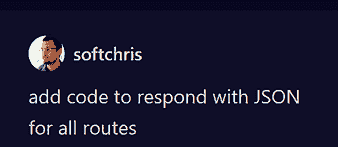
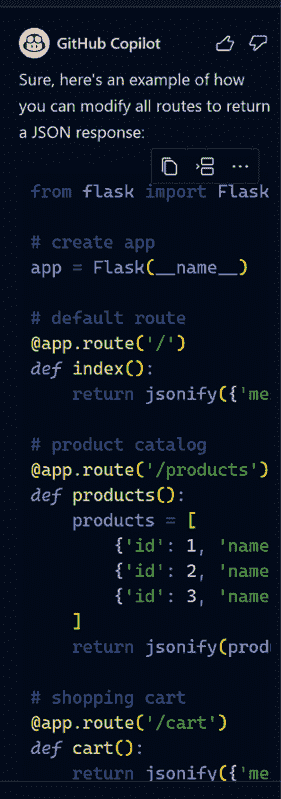
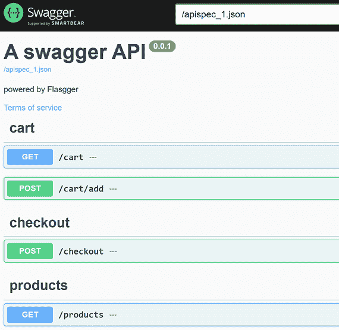

# 8

# 使用 Web API 构建后端

# 简介

当我们说 Web API 时，它是指我们开发的应用程序编程接口，旨在供客户端使用。该 API 使用 HTTP 进行通信。浏览器可以使用 Web API 向其他浏览器和应用程序公开数据和功能。

在开发 Web API 时，您可以使用您想要的任何编程语言和框架。无论选择哪种技术，都有一些您始终需要考虑的事情，比如数据存储、安全、身份验证、授权、文档、测试等等。

正是基于对需要考虑的事物的这种理解，我们可以使用 AI 助手帮助我们构建后端。

在本章中，我们将：

+   了解 Web APIs

+   使用 Python 和 Flask 创建 Web API

+   使用我们的 AI 助手回答问题、建议代码以及创建文档和测试

# 业务领域：电子商务

我们将在本章继续我们的电子商务示例。这次，重点是 API。API 允许您读取和写入电子商务领域中的重要数据。在开发此 API 时，您需要记住的是，它有几个重要的方面：

+   逻辑领域：将您的应用程序划分为不同的逻辑领域是有益的。在电子商务的背景下，这通常意味着产品、订单、发票等等。

+   哪个业务部分应该处理每个逻辑领域？

    +   **产品**：可能有一个专门的团队。同一个团队管理所有类型的折扣和可能发生的活动是很常见的。

    +   **发票和支付**：通常有一个专门的团队负责用户如何支付，例如，通过信用卡、发票和其他方式。

    +   **库存**：您需要有一定的商品库存。您如何知道有多少？您需要与业务分析师或数据专家合作，做出正确的预测。

# 问题与数据领域

我们已经提到了关于产品、订单、发票等的一些不同的逻辑领域。在这个领域，您会遇到的问题通常是：

+   读取和写入：您希望读取或写入哪些数据（或者可能两者都要）？

+   用户将如何访问您的数据（全部数据还是可能应用过滤器以限制输出）？

+   访问和角色：您可以预期不同的角色将需要访问您的系统。管理员角色可能需要访问大部分数据，而登录用户只能看到属于他们的数据部分。这不是本章要解决的问题，但在构建此 API 时，您应该考虑这一点。

# 功能分解

现在我们了解到既有业务问题也有数据问题，我们需要开始识别我们需要的功能。一旦达到这个细节水平，提出具体的提示应该会更容易。

进行这种功能分解的一种方法如下——例如，对于产品：

+   阅读所有产品。

+   根据过滤器阅读产品：通常，你不会想阅读所有产品，但可能只想阅读某一类别的所有产品，或者甚至限制为特定的值，例如 10 个产品或 20 个产品。

+   搜索产品：你应该支持用户通过类别、名称或可能是某个特定活动的部分来寻找特定的产品。

+   获取特定产品的详细信息。

我相信产品还有更多功能，但现在你有了在继续构建 API 之前应该具备的详细程度的概念。

# 提示策略

在本章中，你将看到我们如何使用 Copilot Chat 和编辑器内模式。我们将从 Chat 模式开始，因为它在需要生成起始代码的情况下非常有用。它也非常高效，因为它允许你选择某些代码行，并基于提示仅更新这些行。后者的例子可能是当你想改进这样的代码时。你将在本章后面改进读取数据库而不是从列表中读取静态数据的路由时看到这个用例。在本章中，我们还将使用编辑器内模式。当你正在积极编写代码并想进行小的调整时，这是推荐的方法。在本章中，我们将使用*第二章*中描述的“探索性提示模式”。 

# Web API

使用 Web API 是确保我们的前端应用程序能够访问它读取和写入数据所需的数据和功能的一种很好的方式。

Web API 的期望是：

+   它可以通过网络访问。

+   它利用 HTTP 协议和 HTTP 动词，如`GET`、`POST`、`PUT`、`DELETE`以及其他，来传达意图。

## 你应该选择什么语言和框架？

在本章中，我们已经决定将使用 Python 和 Flask。但为什么？我们使用什么标准来选择语言和框架？

你可以使用任何你想要的编程语言和框架，但以下是一些需要考虑的标准：

+   你知道哪些语言和框架？

+   它们是否容易学习？

+   它们是否有庞大的社区？

+   它们是免费和开源的吗？

+   它们多久更新一次？

+   它们是否有良好的文档？

+   它们是否有良好的工具？

这些只是需要考虑的一些标准。

选择 Python 和 Flask 的原因是它们符合许多上述条件（Node.js 的 Express 框架也是如此，但这里的目的是仅展示如何使用 AI 助手构建 Web API，所以请随意使用你喜欢的任何 Web 框架）。此外，本书的目的是展示 AI 助手如何帮助我们构建后端；使用什么提示、如何以及框架和语言不是重点。

## 规划 Web API

当你规划 Web API 时，你应该考虑以下因素：

+   你想公开哪些数据？例如，产品和订单。

+   你想公开哪些功能？例如，读取订单数据。

+   你将如何构建你的 Web API？

+   安全性和身份验证：你需要确定不仅哪些应用区域需要用户登录，还需要哪些部分应该限制给特定用户类型。

+   存储和数据库：常见的选项，例如，MySQL 和 Postgres。

当你计划你的 Web API 时，请使用上述点作为清单。

# 使用 Python 和 Flask 创建 Web API

与人工智能助手合作的一个关键见解是，我们可以用它来生成代码，*但是*我们需要对问题域和解决方案域有良好的理解。这意味着在我们请求人工智能助手帮助我们之前，我们应该知道如何使用 Python 和 Flask 创建一个 Web API。没有人工智能助手我们能创建它吗？是的，但我们可能会陷入困境，不知道下一步该做什么。

那么，我们谈论的是多少知识呢？如果你对 Python 有一般了解，并且知道如何用任何语言构建 Web API，你就准备好了。

让我们开始。

## 第一步：创建一个新项目

首先，我们需要创建一个新项目。如果你知道 Python，你就知道使用虚拟环境是一个好主意，因为它可以将项目与计算机上其他 Python 项目隔离开来。使用虚拟环境不是必需的，但推荐这样做，因为不同的 Python 版本和包可能会引起问题。

好的，所以我们知道我们需要一个虚拟环境。我们该如何创建一个呢？让我们依靠我们的人工智能助手来帮助我们记住语法。对于下面的提示，你可以打开一个文本文件或者使用 GitHub Copilot 中的聊天功能。

**[提示]**

我如何为 Python 创建虚拟环境？

**[提示结束]**

在编辑器中输入提示时，在打开的文本文件中，你更喜欢在句子的开头使用 `q:`。如果你使用聊天功能，则不需要添加 `q:`。

**[提示响应]**

答案就在 `a:` 同一行。

```py
python -m venv venv 
```

**[响应结束]**

下面是如何在一个包含提示和响应的 `app.py` 文件中查看输出：

```py
# q: How do I create a virtual environment for Python? a: python –m venv venv 
```

要使用人工智能助手给出的命令，我们需要打开一个终端，粘贴命令并运行它。

到这一点，你需要足够的概念知识来知道你需要激活虚拟环境才能使用它。但再次，让我们请求人工智能助手帮助我们。

**[提示]**

我如何在 Windows 中激活 Python 的虚拟环境？

**[提示结束]**

**[快速响应]**

```py
a: Venv\Scripts\activate 
```

**[响应结束]**

如果你使用的是 Mac 或 Linux，将上述提示更改为反映你的操作系统。

## 第二步：安装 Flask

你需要具备的概念知识是，你可以使用 `pip` 安装包——在这个例子中，是 Flask。让我们请求人工智能助手帮助我们。继续使用你的 `app.py` 文件，并将你的提示作为另一条注释添加。

**[提示]**

我如何使用 pip 安装 Flask？

**[提示结束]**

**[快速响应]**

```py
pip install Flask 
```

**[响应结束]**

你的 `app.py` 现在应该看起来像这样：

```py
# q: How do I create a virtual environment for Python? a: python –m venv venv
# q: How do I install Flask with pip? a: pip install Flask 
```

当你使用你的人工智能工具来快速获取如何做某事的答案时，是否清除文本文件中的问题和响应取决于你。

太好了，我们现在知道如何安装 Flask。

## 第 3 步：创建入口点

我们需要为我们的 Web API 创建一个入口点。这个文件将在我们运行 Web API 时被执行。对于 Python，你通常将这个文件命名为 `app.py`。

## 第 4 步：创建 Flask 应用

到目前为止，我们有了我们的项目，我们已经安装了 Flask，并且有一个入口点文件，但该应用还不是 Flask 应用，所以让我们创建一个。

让我们请 AI 助手帮助我们。

**[提示]**

我该如何创建 Flask 应用？

**[提示结束]**

如往常一样，在您的开放文本文件中，以 `q:` 开头的注释中输入您的问题。以下是您最新提示的响应：

**[提示响应]**

```py
from flask import Flask 
```

**[响应结束]**

我们从 AI 助手那里得到的反馈不多。但我们知道我们需要导入 Flask。让我们改进提示。

**[提示]**

我该如何创建一个具有默认路由和“hello”路由的 Flask 应用？

**[提示结束]**

现在，您将看到改进后的提示响应。提示包含更多明确的指令来创建应用中的路由和逻辑区域：

**[提示响应]**

```py
from flask import Flask
# create app
app = Flask(__name__)
# default route
@app.route('/')
def index():
    return 'Hello World!'
# hello route
@app.route('/hello')
def hello():
    return 'Hello World!'
# start app on port 5000
if __name__ == '__main__':
    app.run(debug=True, port=5000) 
```

**[响应结束]**

现在我们已经有了我们的 Flask 应用的起始代码。

接下来，让我们专注于我们的 Web API 的用例——电子商务。

# 用例：电子商务网站的 Web API

到目前为止，在这本书中，我们带您经历了为电子商务网站构建前端应用的过程。我们使用 AI 助手帮助构建前端应用。现在，我们将为电子商务网站构建 Web API。

在上一节中，我们使用 AI 助手帮助我们创建 Flask 应用。现在，我们将使用 AI 助手帮助我们创建电子商务网站的 Web API。

## 第 1 步：为电子商务网站创建一个 Web API

让我们先规划这个任务。根据前面的章节，电子商务网站有以下功能：

+   **产品目录**：包含我们打算出售的产品。

+   **购物车**：有了购物车，我们可以添加产品到购物车，从购物车中移除产品，并更新购物车中产品的数量。一旦我们对购物车中的产品满意，我们就可以结账，并支付和运输产品。

+   **结账流程**：在结账过程中，我们需要收集支付信息和运输信息。

考虑到以上信息，让我们为我们的 AI 助手制定一个提示。

**[提示]**

请给我一些代码示例，用于创建一个 Flask Web API，其中包括产品目录、购物车和结账流程的路由。

**[提示结束]**

**[提示响应]**

```py
from flask import Flask
# create app
app = Flask(__name__)
# default route
@app.route('/')
def index():
    return 'Hello World!'
# product catalog
@app.route('/products')
def products():
    return 'Products'
# shopping cart
@app.route('/cart')
def cart():
    return 'Cart'
# checkout
@app.route('/checkout')
def checkout():
    return 'Checkout'
# start app on port 5000
if __name__ == '__main__':
    app.run(debug=True, port=5000) 
```

**[响应结束]**

好的，所以我们已经有了我们的 Web API 的起始代码，但我们需要以下方面进行改进：

+   我们需要返回 JSON 而不是文本。

+   我们希望添加代码以读取和写入数据库。

+   我们希望添加测试。

+   我们希望记录 Web API。

## 第 2 步：返回 JSON 而不是文本

JSON 是一种常见的数据格式。它是一种既易于人类阅读和编写，也易于机器阅读和编写的数据格式。要在 Python 中使用 JSON，我们需要导入`json`包。我们将使用的方法是`jsonify()`，这是一个将 Python 字典转换为 JSON 的方法。

让我们看看我们如何在我们的 Web API 中使用`jsonify()`。对于这个操作，我们可以继续使用 AI 助手作为代码中的提示注释，或者我们可以使用 GitHub Copilot 的聊天功能（这是 GitHub Copilot 的一个独立扩展）。

让我们使用后者。要使用 GitHub Copilot 的聊天功能（有关更新的安装说明，请参阅此链接：[`docs.github.com/en/copilot/github-copilot-chat/using-github-copilot-chat-in-your-ide`](https://docs.github.com/en/copilot/github-copilot-chat/using-github-copilot-chat-in-your-ide))，我们需要选择我们想要改进的代码，并点击 Visual Studio Code 左侧的聊天图标（如果您使用的是默认方向，其中图标是垂直放置的——这取决于您安装的其他扩展）。这是我们要找的图标。确保 GitHub Copilot Chat 扩展已正确安装：


图 8.1：GitHub Copilot 的聊天图标

一旦我们点击**聊天**图标，并选择代码，我们就可以开始与 GitHub Copilot 聊天。让我们让 GitHub Copilot 帮助我们返回 JSON 而不是文本。

我们在聊天窗口中添加以下提示：

**[提示**]

为所有路由添加响应 JSON 的代码。

**[提示结束**]



图 8.2：Copilot 聊天窗口中的提示

聊天功能生成一个包含`jsonify()`方法的代码答案。



图 8.3：Copilot 聊天回复

这是 GitHub Copilot 生成的代码：

```py
from flask import Flask, jsonify
# create app
app = Flask(__name__)
# default route
@app.route('/')
def index():
    return jsonify({'message': 'Hello World!'})
# product catalog
@app.route('/products')
def products():
    products = [
        {'id': 1, 'name': 'Product 1', 'price': 10.99},
        {'id': 2, 'name': 'Product 2', 'price': 5.99},
        {'id': 3, 'name': 'Product 3', 'price': 7.99}
    ]
    return jsonify(products)
# shopping cart
@app.route('/cart')
def cart():
    return jsonify({'message': 'Cart'})
# checkout
@app.route('/checkout')
def checkout():
    return jsonify({'message': 'Checkout'})
# start app on port 5000
if __name__ == '__main__':
    app.run(debug=True, port=5000) 
```

## 第 3 步：添加代码以读取和写入数据库

好的，所以我们有一个返回 JSON 的 Web API。现在，我们需要添加代码以读取和写入数据库。让我们再次使用聊天功能来帮助我们完成这个任务。

**[提示**]

添加代码以读取和写入数据库，并将其应用于所有我们的路由。

**[提示结束**]

这是我们的最终代码：

**[提示回复**]

```py
import sqlite3
from flask import Flask, jsonify
# create app
app = Flask(__name__)
# connect to database
conn = sqlite3.connect('example.db')
# create table
conn.execute('''CREATE TABLE IF NOT EXISTS products
             (id INTEGER PRIMARY KEY AUTOINCREMENT,
             name TEXT NOT NULL,
             price REAL NOT NULL);''')
# insert data
conn.execute("INSERT INTO products (name, price) VALUES (?, ?)", ('Product 1', 10.99))
conn.execute("INSERT INTO products (name, price) VALUES (?, ?)", ('Product 2', 5.99))
conn.execute("INSERT INTO products (name, price) VALUES (?, ?)", ('Product 3', 7.99))
conn.commit()
# default route
@app.route('/')
def index():
    return jsonify({'message': 'Hello World!'})
# product catalog
@app.route('/products')
def products():
    cursor = conn.execute("SELECT id, name, price FROM products")
    products = []
    for row in cursor:
        product = {'id': row[0], 'name': row[1], 'price': row[2]}
        products.append(product)
    return jsonify(products)
# shopping cart
@app.route('/cart')
def cart():
    return jsonify({'message': 'Cart'})
# checkout
@app.route('/checkout')
def checkout():
    return jsonify({'message': 'Checkout'})
# close connection
conn.close()
# start app on port 5000
if __name__ == '__main__':
    app.run(debug=True, port=5000) 
```

**[回复结束**]

如您所见，我们得到了相当多的代码：

+   连接到数据库的代码——在这种情况下，我们得到了连接到常见 SQLite 数据库的连接。

+   在`/products`路由中创建表并从中读取的代码，但我们没有获取到写入数据库的代码。

+   我们也没有获取到读取和写入其他路由的代码。

根据上面的代码，我们意识到这是一个好的开始，但我们还有一些想要改进的地方，所以我们将更改提示以解决这些不足。我们需要确保所有路由都从数据库中读取数据，而不仅仅是其中一个。

因此，我们既可以自己调整代码，因为我们知道大部分代码已经就位，也可以尝试调整提示。让我们尝试后者。

**[提示**]

添加读取和写入数据库的代码，并将其应用于所有路由。

**[提示结束]**

**[提示响应]**

```py
import sqlite3
from flask import Flask, jsonify
# create app
app = Flask(__name__)
# connect to database
conn = sqlite3.connect('example.db')
# create table 
conn.execute('''CREATE TABLE IF NOT EXISTS products
             (id INTEGER PRIMARY KEY AUTOINCREMENT,
             name TEXT NOT NULL,
             price REAL NOT NULL);''')
# insert data
conn.execute("INSERT INTO products (name, price) VALUES (?, ?)", ('Product 1', 10.99))
conn.execute("INSERT INTO products (name, price) VALUES (?, ?)", ('Product 2', 5.99))
conn.execute("INSERT INTO products (name, price) VALUES (?, ?)", ('Product 3', 7.99))
conn.commit()
# default route
@app.route('/')
def index():
    return jsonify({'message': 'Hello World!'})
# product catalog
@app.route('/products')
def products():
    cursor = conn.execute("SELECT id, name, price FROM products")
    products = []
    for row in cursor:
        product = {'id': row[0], 'name': row[1], 'price': row[2]}
        products.append(product)
    return jsonify(products)
# shopping cart
@app.route('/cart')
def cart():
    cursor = conn.execute("SELECT id, name, price FROM products")
    products = []
    for row in cursor:
        product = {'id': row[0], 'name': row[1], 'price': row[2]}
        products.append(product)
    return jsonify(products)
# checkout
@app.route('/checkout')
def checkout():
    cursor = conn.execute("SELECT id, name, price FROM products")
    products = []
    for row in cursor:
        product = {'id': row[0], 'name': row[1], 'price': row[2]}
        products.append(product)
    return jsonify(products)
# close connection
conn.close()
# start app on port 5000
if __name__ == '__main__':
    app.run(debug=True, port=5000) 
```

**[响应结束]**

改进的提示带来了以下变化：

+   已将数据库代码添加到`/checkout`和`/cart`路由。

+   所有三个路由都从产品表中读取，这是不正确的。这是我们将在下一个提示中解决的问题。好消息是，我们只需通过提示告诉 Copilot Chat 问题所在，就可以期待 AI 助手相应地更改代码。

上述代码比我们最初的提示要好，但仍存在问题。

你可以在 Copilot Chat 中尝试调整提示，但让我们退回到我们的另一种方法——即在代码中使用提示。要添加这些提示，将光标放在代码中，并将提示作为注释添加。以下是我们添加的一些提示：

+   *# 创建表*：我们重复了已经使用的注释，但由于 Copilot 现在意识到了所有路由，这次它做得更好，建议创建三个数据库表而不是只有一个`products`表。

+   *# 添加产品到购物车，在 body 中包含 productId 和 quantity，如果需要则创建购物车，否则更新*：这个提示很详细，因为它询问应该将哪些信息添加到每个购物车条目中。

+   *# 产品目录* 和 *# 购物车* 也是重复的提示（我们移除旧的提示，并重新输入以切换新的建议）。这次，我们让 Copilot 建议正确的数据库表来读取。

注意以下如何通过代码中的各种提示（作为注释）来重塑代码：

```py
import sqlite3
import json
import flask
# create app
app = flask.Flask(__name__)
# connect to database
db = sqlite3.connect('example.db')
# create tables
db.execute('''CREATE TABLE IF NOT EXISTS products
             (id INTEGER PRIMARY KEY AUTOINCREMENT,
             name TEXT NOT NULL,
             price REAL NOT NULL);''')
db.execute('''CREATE TABLE IF NOT EXISTS cart
             (id INTEGER PRIMARY KEY AUTOINCREMENT,
             product_id INTEGER NOT NULL,
             quantity INTEGER NOT NULL);''')
db.execute('''CREATE TABLE IF NOT EXISTS checkout
             (id INTEGER PRIMARY KEY AUTOINCREMENT,
             cart_id INTEGER NOT NULL,
             total REAL NOT NULL);''')
db.commit()
db.close()
# default route
@app.route('/')
def index():
    return flask.jsonify({'message': 'Hello World!'})
# product catalog
@app.route('/products')
def products():
    db = sqlite3.connect('example.db')
    cursor = db.execute("SELECT id, name, price FROM products")
    products = []
    for row in cursor:
        product = {'id': row[0], 'name': row[1], 'price': row[2]}
        products.append(product)
    db.close()
    return flask.jsonify(products)
# shopping cart
@app.route('/cart')
def cart():
    db = sqlite3.connect('example.db')
    cursor = db.execute("SELECT id, product_id, quantity FROM cart")
    cart = []
    for row in cursor:
        item = {'id': row[0], 'product_id': row[1], 'quantity': row[2]}
        cart.append(item)
    db.close()
    return flask.jsonify(cart)
# add product to cart, productId and quantity in body, create cart if needed, else update
@app.route('/cart/', methods=['POST'])
def add_to_cart():
    db = sqlite3.connect('example.db')
    # get product id and quantity from body
    product_id = flask.request.json['productId']
    quantity = flask.request.json['quantity']
    # check if cart exists
    cursor = db.execute("SELECT id FROM cart")
    cart_id = None
    for row in cursor:
        cart_id = row[0]
    # if cart exists, update
    if cart_id:
        db.execute("UPDATE cart SET product_id = ?, quantity = ? WHERE id = ?", (product_id, quantity, cart_id))
    # else create
    else:
        db.execute("INSERT INTO cart (product_id, quantity) VALUES (?, ?)", (product_id, quantity))
    # close
    db.commit()
    db.close()
    return flask.jsonify({'message': 'Added to cart'})
# checkout POST, cartId in body
@app.route('/checkout', methods=['POST'])
def checkout():
    # insert cart into checkout
    conn = sqlite3.connect('example.db')
    # get cart id from body
    cart_id = flask.request.json['cartId']
    # write to checkout
    conn.execute("INSERT INTO checkout (cart_id, total) VALUES (?, ?)", (cart_id, 0))
    # close
    conn.commit()
    conn.close() 
```

这段代码足够好吗？或者我们需要进一步调整？

肯定有改进的空间，以下是你应该寻找的内容：

+   代码不是 DRY（不要重复自己）；我们有大量的重复代码。我们可以通过创建一个函数来解决，该函数接受一个查询并返回结果。

+   缺少身份验证和授权。我们应该将其添加到代码中。

+   缺少文档。

+   代码不安全。我们应该添加一些安全措施，尤其是在数据库方面。作为开发者，我们需要了解如何确保代码安全，我们可以使用预处理语句来防止 SQL 注入攻击，并验证我们从客户端接收的数据。

## 第 4 步：改进代码

提高代码的最佳方式是以我们已有的代码作为起点，首先尝试运行它。然后我们可以看到我们得到了什么错误以及我们需要修复什么。

之后，我们专注于架构和设计，并将代码分离到不同的文件中。

最后，我们添加身份验证、授权和安全措施。

### 运行代码

让我们运行代码。我们需要将 Flask 变量`FLASK_APP`设置为`app.py`然后运行应用程序。

如果你使用 Windows，你需要使用`set`而不是`export`来设置变量。

```py
# flask variable windows
set FLASK_APP=app.py
flask run 
```

应用程序正在运行！我们现在可以访问`http://localhost:5000`并看到消息**Hello World**！。

导航到`/products`、`/cart`和`/checkout`也正常，但我们数据库中还没有任何数据。让我们向数据库添加一些数据。通过在文件顶部插入上述代码并再次运行应用程序，我们可以这样做：

```py
db.execute("INSERT INTO products (name, price) VALUES (?, ?)", ('Apple', 1.99))
db.execute("INSERT INTO products (name, price) VALUES (?, ?)", ('Banana', 2.99)) 
```

现在，如果你重新运行应用程序并转到`/products`，你应该看到我们添加的产品，如下面的 JSON 输出所示：

```py
[
  {
    "id": 1,
    "name": "Apple",
    "price": 1.99
  },
  {
    "id": 2,
    "name": "Banana",
    "price": 2.99
  }
] 
```

### 重构代码

太棒了 - 到目前为止进展顺利！现在让我们重构代码，使其更加 DRY（不要重复自己，这是一个确保我们不过度重复代码的术语）。我们可以使用 Copilot 来帮助我们完成这项工作。

提供以下提示：

**[提示]**

通过将数据库部分分离到单独的模块`db.py`中并暴露以下函数来改进代码：get_products，get_cart，add_to_cart，checkout。

**[提示结束]**

我们得到了两个响应，一个是针对`db.py`文件的，另一个是针对`app.py`文件的。让我们从`db.py`文件开始。

**[提示响应]**

```py
import sqlite3
# connect to database
conn = sqlite3.connect('example.db')
# create tables
conn.execute('''CREATE TABLE IF NOT EXISTS products
             (id INTEGER PRIMARY KEY AUTOINCREMENT,
             name TEXT NOT NULL,
             price REAL NOT NULL);''')
conn.execute('''CREATE TABLE IF NOT EXISTS cart
             (id INTEGER PRIMARY KEY AUTOINCREMENT,
             product_id INTEGER NOT NULL,
             quantity INTEGER NOT NULL);''')
conn.execute('''CREATE TABLE IF NOT EXISTS checkout
             (id INTEGER PRIMARY KEY AUTOINCREMENT,
             cart_id INTEGER NOT NULL,
             total REAL NOT NULL);''')
conn.execute("INSERT INTO products (name, price) VALUES (?, ?)", ('Apple', 1.99))
conn.execute("INSERT INTO products (name, price) VALUES (?, ?)", ('Banana', 2.99))
conn.commit()
def get_products():
    cursor = conn.execute("SELECT id, name, price FROM products")
    products = []
    for row in cursor:
        product = {'id': row[0], 'name': row[1], 'price': row[2]}
        products.append(product)
    return products
def get_cart():
    cursor = conn.execute("SELECT id, product_id, quantity FROM cart")
    cart = []
    for row in cursor:
        item = {'id': row[0], 'product_id': row[1], 'quantity': row[2]}
        cart.append(item)
    return cart
def add_to_cart(product_id, quantity):
    # check if cart exists
    cursor = conn.execute("SELECT id FROM cart")
    cart_id = None
    for row in cursor:
        cart_id = row[0]
    # if cart exists, update
    if cart_id:
        conn.execute("UPDATE cart SET product_id = ?, quantity = ? WHERE id = ?", (product_id, quantity, cart_id))
    # else create
    else:
        conn.execute("INSERT INTO cart (product_id, quantity) VALUES (?, ?)", (product_id, quantity))
    conn.commit()
def checkout(cart_id):
    # insert cart into checkout
    conn.execute("INSERT INTO checkout (cart_id, total) VALUES (?, ?)", (cart_id, 0))
    conn.commit() 
```

**[响应结束]**

我们需要稍微改进上面的代码，因为它正在使用一个打开的数据库连接。我们应该在完成操作后关闭连接。确保你在提交后添加关闭连接的代码。还要确保每个路由都打开和关闭连接。

这看起来不错。让我们将其添加到我们的项目中。我们可以创建一个名为`db.py`的新文件并将代码复制到其中。

接下来，让我们看看它对`app.py`文件的建议：

```py
import flask
import db
# create app
app = flask.Flask(__name__)
# default route
@app.route('/')
def index():
    return flask.jsonify({'message': 'Hello World!'})
# product catalog
@app.route('/products')
def products():
    products = db.get_products()
    return flask.jsonify(products)
# shopping cart
@app.route('/cart')
def cart():
    cart = db.get_cart()
    return flask.jsonify(cart)
# add product to cart, productId and quantity in body, create cart if needed, else update
@app.route('/cart', methods=['POST'])
def add_to_cart():
    # get product id and quantity from body
    product_id = flask.request.json['productId']
    quantity = flask.request.json['quantity']
    db.add_to_cart(product_id, quantity)
    return flask.jsonify({'message': 'Added to cart'})
# checkout POST, cartId in body
@app.route('/checkout', methods=['POST'])
def checkout():
    # get cart id from body
    cart_id = flask.request.json['cartId']
    db.checkout(cart_id)
    return flask.jsonify({'message': 'Checkout successful'})
# start app on port 5000
if __name__ == '__main__':
    app.run(debug=True, port=5000) 
```

如你所见，它已经将数据库代码分离到`db.py`文件中，并且还添加了对`db.py`文件的导入。让我们将此代码复制到我们的`app.py`文件中，并替换其内容。

它工作了吗？让我们运行应用程序并看看。它没有错误地运行，当我们转到`/products`、`/cart`和`/checkout`时，我们得到了 JSON 输出。如果你想的话，你还可以向`/cart`发送一个`POST`请求来写入购物车内容 - 太棒了！

## 第 5 步：记录 API

我们可以使用 Copilot Chat 来帮助我们记录 API。让我们提供以下提示：

**[提示]**

使用 Swagger 记录 API。API 应该有以下端点：GET /products，GET /cart，POST /cart/add，POST /checkout。

**[提示结束]**

Swagger 或 OpenAPI 标准是记录你的 API 路由的一种方式。这些路由规范可以被可视化，你可以快速了解你的 API 能做什么。此外，还有一个叫做 Swagger UI 的网页，它不仅让你可以看到你的 API 中有哪些路由，你还可以进行请求等操作，以确保 API 按预期工作。

这是输出，它涉及代码和文档：

**[提示响应]**

```py
# app.py
import flask
import db
from flasgger import Swagger, swag_from
# create app
app = flask.Flask(__name__)
swagger = Swagger(app)
# default route
@app.route('/')
def index():
    return flask.jsonify({'message': 'Hello World!'})
# product catalog
@app.route('/products', methods=['GET'])
@swag_from('swagger/products.yml')
def products():
    products = db.get_products()
    return flask.jsonify(products)
# shopping cart
@app.route('/cart', methods=['GET'])
@swag_from('swagger/cart.yml')
def cart():
    cart = db.get_cart()
    return flask.jsonify(cart)
# add product to cart, productId and quantity in body, create cart if needed, else update
@app.route('/cart/add', methods=['POST'])
@swag_from('swagger/add_to_cart.yml')
def add_to_cart():
    # get product id and quantity from body
    product_id = flask.request.json['productId']
    quantity = flask.request.json['quantity']
    db.add_to_cart(product_id, quantity)
    return flask.jsonify({'message': 'Added to cart'})
# checkout POST, cartId in body
@app.route('/checkout', methods=['POST'])
@swag_from('swagger/checkout.yml')
def checkout():
    # get cart id from body
    cart_id = flask.request.json['cartId']
    db.checkout(cart_id)
    return flask.jsonify({'message': 'Checkout successful'})
# start app on port 5000
if __name__ == '__main__':
    app.run(debug=True, port=5000) 
```

**[响应结束]**

它告诉我们创建以下文件和文件夹：

```py
folder: swagger 
products.yml 
file: cart.yml 
file: add_to_cart.yml 
file: checkout.yml 
file: swagger.yml 
```

让我们手动创建这些文件并将内容复制到它们中。

```py
products.yml
---
tags:
  - products
responses:
  200:
    description: A list of products
    schema:
      type: array
      items:
        type: object
        properties:
          id:
            type: integer
          name:
            type: string
          price:
            type: number
cart.yml
---
tags:
  - cart
responses:
  200:
    description: A list of items in the cart
    schema:
      type: array
      items:
        type: object
        properties:
          id:
            type: integer
          product_id:
            type: integer
          quantity:
            type: integer
add_to_cart.yml
---
tags:
  - cart
parameters:
  - in: body
    name: body
    required: true
    schema:
      type: object
      properties:
        productId:
          type: integer
        quantity:
          type: integer
responses:
  200:
    description: Added to cart
checkout.yml
---
tags:
  - checkout
parameters:
  - in: body
    name: body
    required: true
    schema:
      type: object
      properties:
        cartId:
          type: integer
responses:
  200:
    description: Checkout successful 
```

缺少的是安装`flassger` Swagger 库：

```py
pip install flasgger 
```

导航到`http://localhost:5000/apidocs/`，你应该能看到 Swagger UI。



图 8.4：由 Swagger 生成的 API 文档

你应该通过与生成的文档交互来验证 API 是否按预期工作，并确保路由生成预期的输出。

在这个阶段，我们确实有可能继续改进，但请花点时间意识到我们仅通过提示和几行代码就创造了多少东西。我们有一个带有数据库和文档的工作 API。现在我们可以专注于改进代码和添加更多功能。

# 作业

这是本章的建议作业：一个好的作业是向 API 添加更多功能，例如：

+   添加一个新端点来获取单个产品。

+   添加一个新端点来从购物车中删除产品。

+   添加一个新端点来更新购物车中产品的数量。

你可以通过将上述内容添加到 Copilot Chat 作为提示并查看它生成的结果来解决这个问题。预期代码和文档都会有所变化。

# 解决方案

你可以在 GitHub 仓库中找到这个作业的解决方案：[`github.com/PacktPublishing/AI-Assisted-Software-Development-with-GitHub-Copilot-and-ChatGPT/tree/main/08`](https://github.com/PacktPublishing/AI-Assisted-Software-Development-with-GitHub-Copilot-and-ChatGPT/tree/main/08)

# 挑战

通过添加更多功能来改进这个 API。你可以使用 Copilot Chat 来帮助你完成这项工作。

# 摘要

在本章中，我们讨论了如何规划我们的 API。然后我们探讨了如何选择 Python 和 Flask 来完成这项工作，但强调了在实际构建 Web API 方面拥有上下文知识的重要性。一般来说，在请求 AI 助手帮助你之前，你应该至少在高级别上知道如何做某事。

然后，我们最终为 AI 助手制作了提示，以帮助我们处理 Web API。我们与我们的电子商务网站合作，创建了一个 Web API 来提供服务。

之后，我们讨论了如何改进代码并为 API 添加更多功能。

在下一章中，我们将讨论如何通过添加人工智能来改进我们的应用程序。

# 加入我们的 Discord 社区

加入我们社区的 Discord 空间，与作者和其他读者进行讨论：

[`packt.link/aicode`](https://packt.link/aicode)


