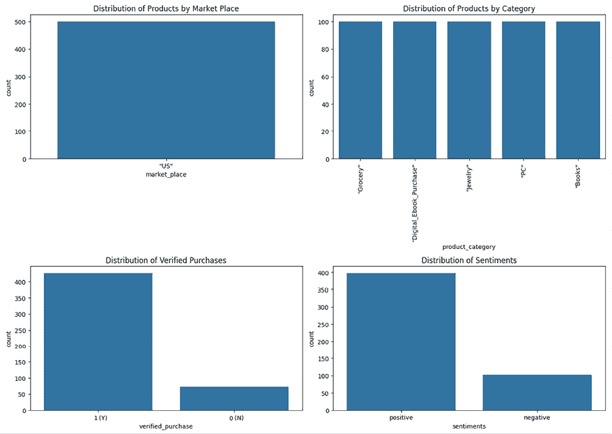
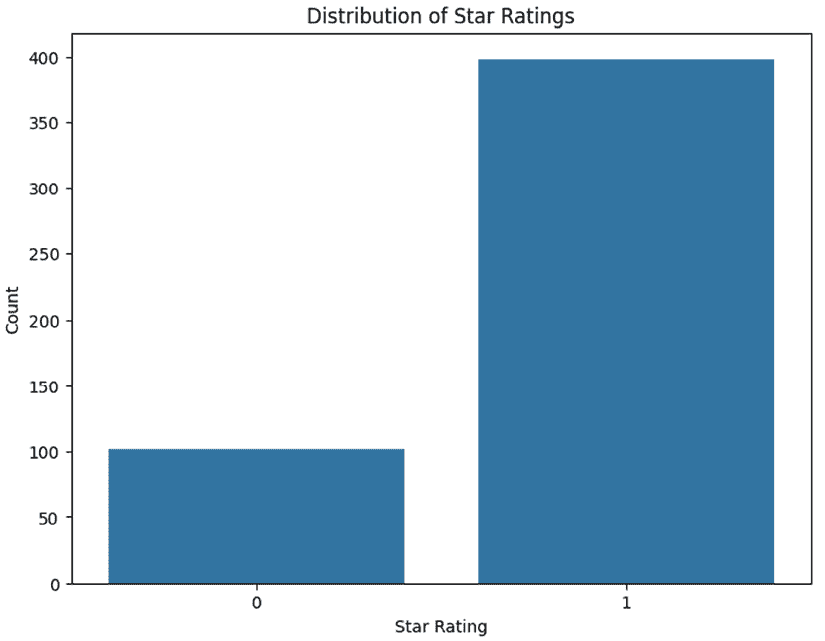
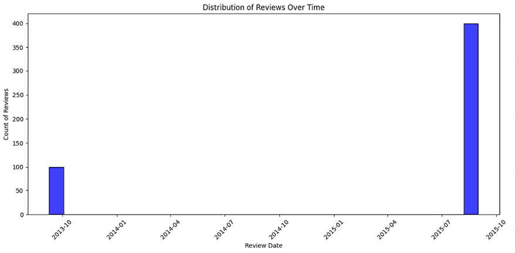
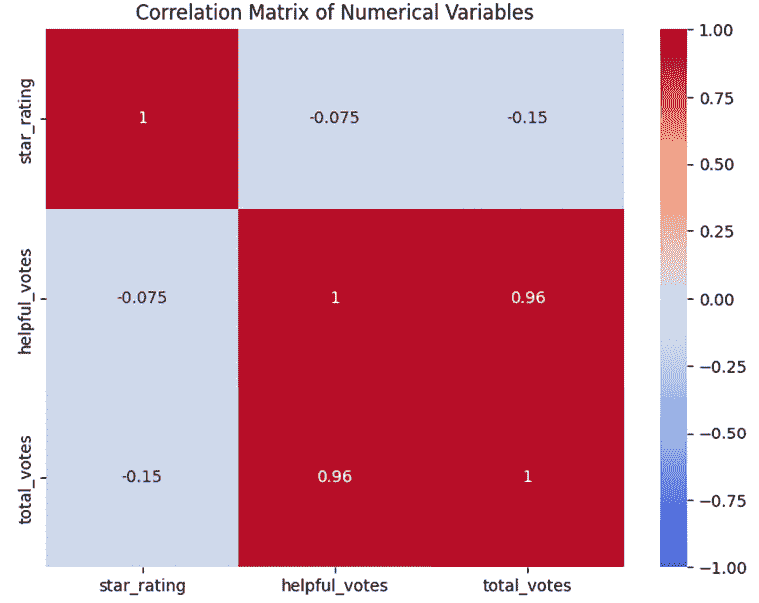
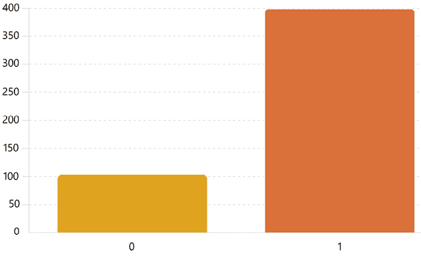
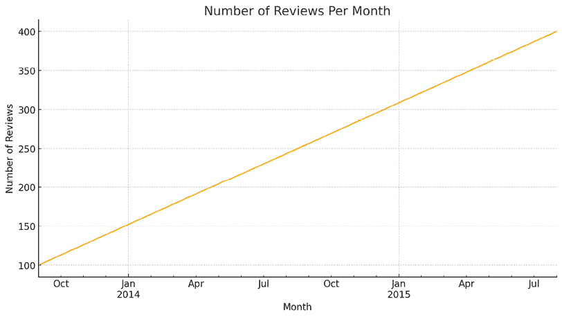
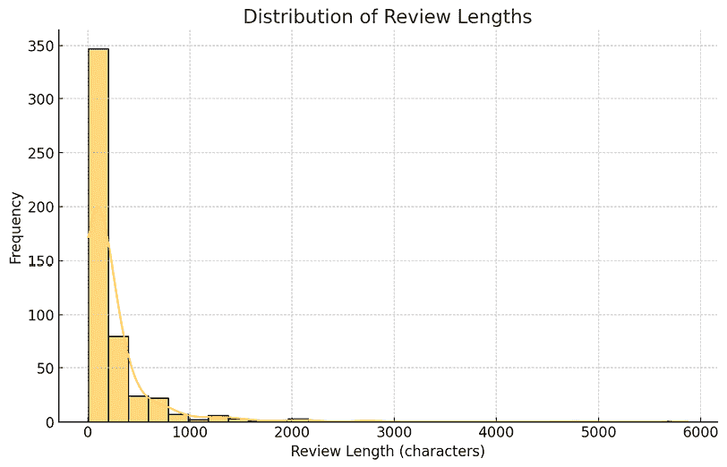
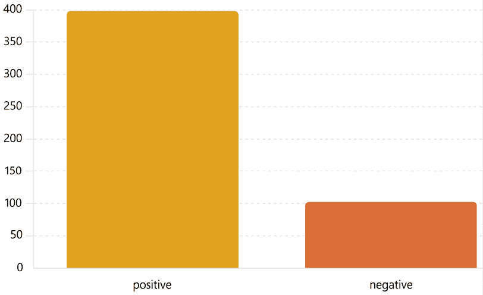
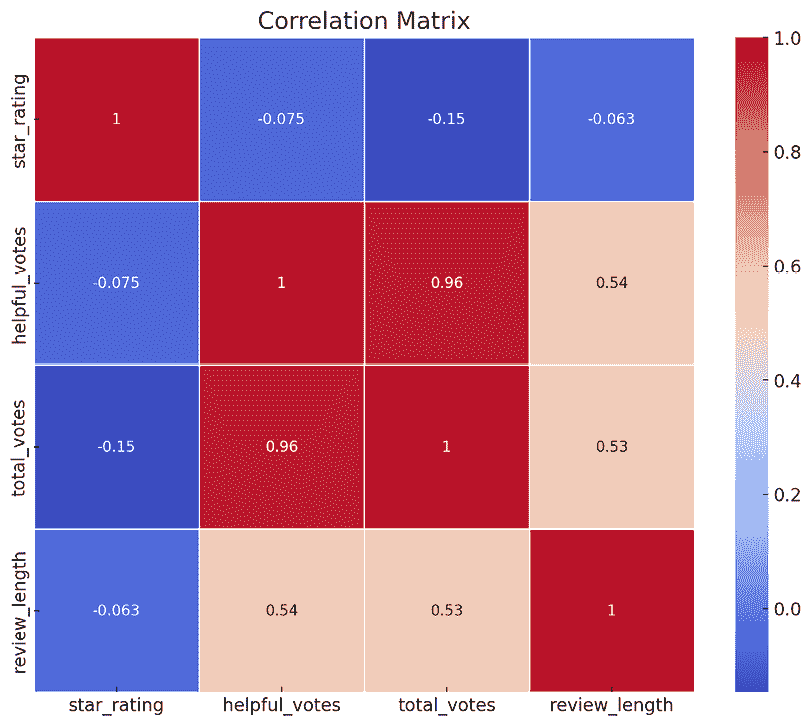

# 11

# 使用 ChatGPT 进行数据探索

# 简介

数据探索是机器学习的一个基本第一步，包括对数据集进行彻底检查，以识别其结构并揭示初始模式和异常。这个过程对于为任何进一步的详细统计分析以及机器学习模型的开发奠定基础至关重要。

在本章中，重点是阐述数据探索的过程，旨在巩固机器学习新手的理解，并为熟练者提供复习。本章将指导如何加载和检查由亚马逊书评组成的数据库，总结其特征，并探究其变量。

您将通过对分类数据评估、分布可视化和相关性分析的实际练习进行指导，这些练习得到了 Python 的 pandas 和`Matplotlib`库的支持。本章还将详细说明如何有效地使用 ChatGPT 进行数据探索，包括免费版本和基于订阅的增值版本，后者提供增强的功能。

需要注意的是，ChatGPT 的响应将取决于您通过提示如何有效地传达您的需求。这种可变性是学习曲线的一部分，并说明了与 AI 在数据探索中的互动性质。我们的目标是让您掌握自信地导航这些工具的知识，并开始做出基于数据的决策。

# 商业问题

在电子商务中，有效地分析客户反馈对于识别影响购买决策的关键因素至关重要。这种分析支持有针对性的营销策略，并有助于优化用户体验和网站设计，最终提升对客户的服务和产品供应。

# 问题与数据领域

在本章中，我们将专注于使用亚马逊产品评论数据集进行详细的数据探索。我们的目标是深入探索这个数据集，挖掘见解并发现可以增强决策的规律。我们将利用 ChatGPT 生成用于数据操作和可视化的 Python 代码，提供一种理解复杂数据分析技术的动手方法。此外，我们还将探讨如何有效地提示 ChatGPT 提供定制见解和代码片段，以帮助我们的探索任务。

## 数据集概述

我们将使用亚马逊产品评论数据集，该数据集包含广泛的信息，反映了消费者反馈和产品评估。该数据集的关键特征包括市场、客户、评论和产品细节等标识符，以及产品标题、类别、评分和评论的文本内容。对于这次探索，我们将专注于`review_body`和`review_headline`字段，这些字段提供了丰富的文本数据供分析。为了简化我们的关注点并提高发现结果的清晰度，我们将省略中性情感，仅分析正面和负面反馈。

数据集中的特征包括：

+   `marketplace` (`string`): 产品的位置。

+   `customer_id` (`string`): 客户的唯一标识符。

+   `review_id` (`string`): 评论的唯一标识符。

+   `product_id` (`string`): 产品的唯一标识符。

+   `product_parent` (`string`): 父产品标识符。

+   `product_title` (`string`): 被评论产品的标题。

+   `product_category` (`string`): 产品的类别。

+   `star_rating` (`int`): 产品在 1 到 5 的评分尺度上的评分。

+   `helpful_votes` (`int`): 评论收到的有用票数。

+   `total_votes` (`int`): 评论收到的总票数。

+   `review_headline` (`string`): 评论的标题。

+   `review_body` (`string`): 评论内容。

+   `review_date` (`string`): 评论的日期。

+   `sentiments` (`string`): 评论的情感（正面或负面）。

这次有针对性的探索将使我们能够进行深入的情感分析，评估产品评分的影响，并深入了解客户反馈动态。通过关注这些要素，我们旨在充分利用数据集，以改善电子商务环境中的战略决策。

# 特征分解

通过亚马逊产品评论数据集和详细数据探索的焦点，我们将概述以下功能，以指导用户有效地理解和分析客户反馈：

1.  **加载数据集**：我们将首先将数据集导入 pandas DataFrame。这是 Python 中一种强大的数据处理结构，便于方便地处理数据。

1.  **检查数据**：我们的初步探索将涉及显示 DataFrame 的前几条记录，以了解数据。我们将审查列名，了解每列包含的数据类型，并检查需要解决的任何缺失值。

1.  **摘要统计**：为了掌握数值数据的分布，我们将计算包括平均值、中位数、最小值、最大值和四分位数在内的摘要统计。这一步骤有助于理解数值数据的中心趋势和分布。

1.  **探索分类变量**: 对于市场、产品类别和情感等分类数据，我们将检查不同的类别并计算每个类别的条目数量。条形图等视觉辅助工具在这里特别有用，可以说明每个类别的频率。

1.  **评分分布**: 我们将使用直方图或条形图来可视化星级评分的分布。这种视觉表示有助于理解评论者的总体观点以及评分是如何偏斜的。

1.  **时间序列分析**: 通过分析`review_date`列，我们将探索数据中的任何趋势、季节性或其他时间模式。这种分析可以揭示情感或产品受欢迎程度随时间变化的情况。

1.  **评论长度分析**: 我们将检查`review_body`以了解评论中提供的信息量，通过计算评论长度的描述性统计，如平均值、中位数和最大长度来做到这一点。这一步骤提供了关于客户提供的反馈深度的见解。

1.  **相关性分析**: 最后，我们将使用相关矩阵或散点图来调查星级评分、有帮助的投票和总投票等数值变量之间的相关性。这种分析有助于识别数据不同定量方面的潜在关系。

通过系统地分解这些特征，我们将彻底理解数据集，揭示可以增强电子商务环境中决策制定和策略制定的见解。

# **提示策略**

为了有效地利用 ChatGPT 对亚马逊产品评论数据集进行数据探索，我们需要建立针对生成 Python 代码和数据见解的明确提示策略。以下是我们的方法。 

## **策略 1：任务-操作-指南（TAG）提示策略**

**1.1 – 任务**: 具体目标是使用各种统计和可视化技术彻底探索亚马逊产品评论数据集。

**1.2 – 操作**: 探索此数据集的关键步骤包括：

+   **数据加载**: 将数据集加载到 pandas DataFrame 中。

+   **数据检查**: 检查缺失数据，了解数据类型，并检查前几条记录。

+   **统计摘要**: 计算数值数据的摘要统计。

+   **分类分析**: 使用计数和可视化分析分类变量。

+   **评分分布**: 创建直方图或条形图来可视化星级评分的分布。

+   **时间趋势分析**: 检查从评论日期中得出的时间趋势。

+   **评论文本分析**: 分析评论文本的长度和情感。

+   **相关性研究**: 评估数值变量之间的相关性。

**1.3 – 指南**: 在我们的提示中，我们将向 ChatGPT 提供以下指南：

+   代码应与 Jupyter Notebook 兼容

+   确保每行代码都有详细的注释。

+   您必须详细解释每一行代码，涵盖代码中使用的每个方法。

## 策略 2：角色扮演-指令-背景（PIC）提示策略

**2.1 – 角色扮演**：假设一个数据分析师的角色，试图从亚马逊产品评论数据集中发现可操作的见解。

**2.2 – 指令**：请求 ChatGPT 为每个特定分析生成代码，按顺序进行，并在移动到下一个任务之前等待用户验证。

**2.3 – 背景**：鉴于重点是使用亚马逊产品评论数据集进行情感分析，ChatGPT 不了解数据集及其特征，因此需要额外的背景信息。

## 策略 3：学习-即兴发挥-反馈-评估（LIFE）提示策略

**3.1 – 学习**：

+   强调通过各种分析技术理解数据的重要性，从基本统计到复杂的相关性和时间序列分析。

**3.2 – 即兴发挥**:

+   根据初步发现调整分析。例如，如果某些产品类别显示出不寻常的趋势，则在这些领域深化分析。

**3.3 – 反馈**:

+   分享代码和模型输出以供反馈，以确保有效的学习和理解。

+   结合建议和批评来完善模型和方法。

+   提供错误以排除故障和解决问题。

**3.4 – 评估**：

+   执行 ChatGPT 提供的代码以确保准确性和有效性。这一点在整章中都有应用。

# 使用 ChatGPT 免费版对亚马逊评论数据集进行数据探索

ChatGPT 高级版具有代码解释器，但首先，我们将使用 ChatGPT 的免费版。我们将仔细构建初始提示，包括所有功能，但我们将指示它在提供每个功能的代码后等待用户反馈。

## 特性 1：加载数据集

让我们构建初始提示来加载数据集。

**[提示**]

我想使用各种统计和可视化技术（TAG 1.1）彻底探索亚马逊产品评论数据集，它包含以下字段（PIC 2.3）：

+   `marketplace` (`string`): 产品的位置。

+   `customer_id` (`string`): 客户的唯一标识符。

+   `review_id` (`string`): 评论的唯一标识符。

+   `product_id` (`string`): 产品的唯一标识符。

+   `product_parent` (`string`): 父产品标识符。

+   `product_title` (`string`): 评论产品的标题。

+   `product_category` (`string`): 产品的类别。

+   `star_rating` (`int`): 产品在 1 到 5 的评分尺度上的评分。

+   `helpful_votes` (`int`): 评论收到的有用投票数。

+   `total_votes` (`int`): 评论收到的总投票数。

+   `review_headline` (`string`): 评论的标题。

+   `review_body` (`string`): 评论的内容。

+   `review_date` (`string`): 评论的日期。

+   `sentiments` (`string`): 评论的情感（正面或负面）。

这应包括以下步骤（TAG 1.2）：

1.  **数据加载**：将数据集加载到 pandas DataFrame 中。

1.  **数据检查**：检查缺失数据，了解数据类型，并检查前几条记录。

1.  **统计摘要**：计算数值数据的摘要统计量。

1.  **分类分析**：使用计数和可视化分析分类变量。

1.  **评分分布**：创建直方图或条形图来可视化星级评分的分布。

1.  **时间趋势**：从评论日期中检查时间趋势。

1.  **评论文本分析**：分析评论文本的长度和情感。

1.  **相关性研究**：评估数值变量之间的相关性。

我是一名数据分析师，试图发现可操作的见解（图 2.1），因此请提供详细的代码，并严格遵循以下说明（标签 1.3）：

+   代码应与 Jupyter Notebook 兼容。

+   确保每行代码都有详细的注释。

+   您必须解释每一行代码，然后将其详细地复制到笔记本的文本块中，详细说明代码中使用的每个方法，在提供代码之前。请注意，数据集位于 Google Drive 的此路径：`./Chapter05/amazon_product_review_data.csv`。因此，添加挂载驱动器和加载数据集的代码（图 2.2）。

+   逐步提供，并等待用户反馈（图 2.2）。

**[提示结束]**

您应该收到类似以下的响应，其中 ChatGPT 为我们提供了第一步 - 数据加载的代码，以及详细的注释和解释。

**[提示响应]**

当然，让我们从第一步开始：将数据集从 Google Drive 加载到 pandas DataFrame 中。以下是我们可以如何进行：

**第一步：数据加载**

要将数据集从 Google Drive 加载到 pandas DataFrame，我们将遵循以下步骤：

+   **挂载 Google Drive**：连接到包含数据集的 Google Drive。

+   **加载数据集**：将数据集文件读取到 pandas DataFrame 中。

详细代码解释：

1.  **挂载 Google Drive**：此步骤允许我们从 Google Colab 或 Jupyter Notebook 环境直接访问存储在 Google Drive 中的文件：

    +   从 `google.colab` 导入 drive：从 `google.colab` 包中导入 drive 模块。

    +   `drive.mount` (`"/content/drive"`): 在指定的路径（在这种情况下为 `/content/drive`）挂载您的 Google Drive。按照说明进行授权并获取访问代码。

1.  **加载数据集**：

    +   `import pandas as pd`: 将 pandas 库导入为 `pd` 以进行数据处理。

    +   `file_path = '/content/drive/My Drive/Chapter05/amazon_product_review_data.csv'`: 定义 Google Drive 中 CSV 文件的路径。

    +   `df = pd.read_csv(file_path)`: 使用 `pd.read_csv()` 将 CSV 文件读取到名为 `df` 的 DataFrame 中。

这是完整的代码片段：

```py
# Mount Google Drive to access the dataset
from google.colab import drive
drive.mount('/content/drive')
# Import pandas for data manipulation
import pandas as pd
# Define the file path in your Google Drive
file_path = '/content/drive/My Drive/Chapter05/amazon_product_review_data.csv'
# Load the dataset into a pandas DataFrame
df = pd.read_csv(file_path)
# Display the first few rows of the dataframe to verify the data
df.head() 
```

用户反馈：

请在您的 Jupyter Notebook 环境中执行此代码，在将 `file_path` 替换为您的数据集的正确路径后。如果您遇到任何问题或准备好进行下一步，请告诉我！

**[响应结束]**

我们现在将应用评估提示策略（LIFE 3.4），并通过在 Google Colab 的每一步执行代码来验证代码。该代码从 Google Drive 加载数据集。它还将请求访问 Google Drive 的权限。

请参考“使用 ChatGPT 进行数据探索.ipynb”笔记本中的可执行代码片段，或从提示响应中复制代码。

你应该看到一条消息说“允许此笔记本访问 Google Drive”。

代码运行良好，没有应用任何修改或错误，并显示了数据集的前几行。

你应该看到笔记本内容和客户评价。

## 功能 2：检查数据

我们现在将指示 ChatGPT 进行下一步：

**[提示]**

让我们继续下一步。

[**提示结束**]

我们应该收到如下所示的响应：

**[提示响应]**

太好了！让我们继续下一步：

第 2 步：数据检查

在这一步，我们将检查加载的数据集以：

+   检查缺失数据。

+   理解每列的数据类型。

+   检查前几条记录以了解数据结构。

详细代码解释：

1.  **检查缺失数据**：

    +   `df.info()`：此方法提供了 DataFrame 的简洁摘要，包括每列的非空条目数。它还显示了每列的数据类型，这有助于我们了解如何操作数据。

1.  **理解数据类型**：

    +   通过检查`df.info()`的输出，我们可以确定是否有任何列的数据类型不正确（例如，数值列错误地存储为字符串）。

1.  **检查前几条记录**：

    +   **df.head()**：此方法显示 DataFrame 的前几行。它允许我们直观地检查列、它们的值，并初步了解数据集包含的内容。

这里是数据检查的代码：

```py
# Check for missing data and data types
df.info()
# Display the first few rows of the dataframe
df.head() 
```

用户反馈：

在你的 Jupyter Notebook 环境中执行此代码。运行此步骤后，你应该能够看到数据集的摘要和前几行。如果一切看起来正常，或者你有任何具体问题，请告诉我！

**[响应结束]**

我们评估了 ChatGPT 的输出，并在笔记本中执行了代码（LIFE 3.4），并显示了相关信息。

我们将利用提示策略为 ChatGPT（LIFE 3.3）提供输出以进行解释：

**[提示]**

```py
<class 'pandas.core.frame.DataFrame'>
RangeIndex: 500 entries, 0 to 499
Data columns (total 15 columns):
 #   Column             Non-Null Count  Dtype 
---  ------             --------------  ----- 
 0   market_place       500 non-null    object
 1   customer_id        500 non-null    object
 2   review_id          500 non-null    object
 3   product_id         500 non-null    object
 4   product_parent     500 non-null    object
 5   product_title      500 non-null    object
 6   product_category   500 non-null    object
 7   star_rating        500 non-null    int64 
 8   helpful_votes      500 non-null    int64 
 9   total_votes        500 non-null    int64 
 10  verified_purchase  500 non-null    object
 11  review_headline    500 non-null    object
 12  review_body        500 non-null    object
 13  review_date        500 non-null    object
 14  sentiments         500 non-null    object
dtypes: int64(3), object(12)
memory usage: 58.7+ KB
market_place    customer_id    review_id    product_id    product_parent    product_title    product_category    star_rating    helpful_votes    total_votes    verified_purchase    review_headline    review_body    review_date    sentiments
0    "US"    "42521656"    "R26MV8D0KG6QI6"    "B000SAQCWC"    "159713740"    "The Cravings Place Chocolate Chunk Cookie Mix...    "Grocery"    1    0    0    1 \t(Y)    "Using these for years - love them."    "As a family allergic to wheat, dairy, eggs, n...    2015-08-31    positive
1    "US"    "12049833"    "R1OF8GP57AQ1A0"    "B00509LVIQ"    "138680402"    "Mauna Loa Macadamias, 11 Ounce Packages"    "Grocery"    1    0    0    1 \t(Y)    "Wonderful"    "My favorite nut. Creamy, crunchy, salty, and ...    2015-08-31    positive
2    "US"    "107642"    "R3VDC1QB6MC4ZZ"    "B00KHXESLC"    "252021703"    "Organic Matcha Green Tea Powder - 100% Pure M...    "Grocery"    1    0    0    0 \t(N)    "Five Stars"    "This green tea tastes so good! My girlfriend ...    2015-08-31    positive
3    "US"    "6042304"    "R12FA3DCF8F9ER"    "B000F8JIIC"    "752728342"    "15oz Raspberry Lyons Designer Dessert Syrup S...    "Grocery"    1    0    0    1 \t(Y)    "Five Stars"    "I love Melissa's brand but this is a great se...    2015-08-31    positive
4    "US"    "18123821"    "RTWHVNV6X4CNJ"    "B004ZWR9RQ"    "552138758"    "Stride Spark Kinetic Fruit Sugar Free Gum, 14...    "Grocery"    1    0    0    1 \t(Y)    "Five Stars"    "good"    2015-08-31    positive 
```

**[提示结束]**

我们应该收到如下所示的响应，其中 ChatGPT 提供解释和发现：

[P**rompt response**]

看起来数据集已成功加载，我们可以从`df.info()`和`df.head()`的输出中推断出以下内容：

数据检查发现：

1.  **基本信息**：

    +   数据集包含 500 个条目（行）和 15 列。

    +   数据类型包括数值（`int64`）和分类（`object`）。

    +   所有列都有 500 个非空条目，表明没有缺失值。

1.  **列详细信息**：

    +   `market_place`、`customer_id`、`review_id`、`product_id`、`product_parent`、`product_title`、`product_category`、`verified_purchase`、`review_headline`、`review_body`、`review_date` 和 `sentiments` 都被识别为对象（字符串）类型，这与它们的描述中预期的内容相符。

    +   `star_rating`、`helpful_votes` 和 `total_votes` 被正确识别为 `int64`（整数）类型。

1.  **初始数据预览**：

    +   `df.head()` 的输出显示了数据集的前几行，让我们可以一窥每个列的结构和内容。我们可以看到 `market_place`、`customer_id`、`star_rating`、`helpful_votes`、`total_votes`、`review_headline`、`review_body`、`review_date` 和 `sentiments` 列的示例。

**下一步：**

根据这次检查：

+   数据集看起来很干净，没有缺失值。

+   我们对列及其数据类型有了清晰的理解。

接下来，我们可以进行第 3 步：统计摘要，以计算数值数据（`star_rating`、`helpful_votes` 和 `total_votes`）的摘要统计信息。你想继续吗？如果有什么具体的内容你想进一步探索，或者我们应该进行下一步，请告诉我！

**[响应结束]**

## 特征 3：摘要统计

由于没有缺失或空值，我们现在将指示 ChatGPT 进行下一步以显示摘要统计信息：

**[提示]**

让我们进行下一步。

**[提示结束]**

我们应该收到以下类似的响应，其中 ChatGPT 提供显示摘要统计信息的代码：

[提示响应]**

太好了！让我们继续到第 3 步：

**第 3 步：统计摘要**

在这一步，我们将计算数据集中数值列的摘要统计信息。具体来说，我们将关注：

+   `star_rating`：产品在 1 到 5 的评分尺度上的评分。

+   `helpful_votes`：收到的有用投票数。

+   `total_votes`：收到的总投票数。

详细代码解释：

1.  **使用** `describe()`：

    +   `df.describe()` 计算数值列的摘要统计信息。它提供：

        +   Count: 非空值的数量。

        +   Mean: 平均值。

        +   Std: 标准差。

        +   Min: 最小值。

        +   25%，50%，和 75%：百分位数。

        +   Max: 最大值。

1.  **选择特定列**：

    +   我们使用 `df[['star_rating', 'helpful_votes', 'total_votes']].describe()` 来限制输出只包含我们感兴趣的数值列（`star_rating`、`helpful_votes` 和 `total_votes`）。

这是计算和显示摘要统计信息的代码：

```py
# Calculate summary statistics for numerical columns
summary_stats = df[['star_rating', 'helpful_votes', 'total_votes']].describe()
# Display the summary statistics
print(summary_stats) 
```

用户反馈：

在你的 Jupyter Notebook 环境中执行此代码。它将为你数据集中的数值变量提供关于分布和中心趋势的统计洞察。如果你有任何问题或者你准备好了进行下一步，请告诉我！

**[响应结束]**

我们执行代码，显示汇总统计数据，并将输出提供给 ChatGPT 进行解释，以便理解统计数据：

**[提示]**

```py
star_rating  helpful_votes  total_votes
count   500.000000     500.000000   500.000000
mean      0.796000       0.764000     1.068000
std       0.403373       2.843321     3.698477
min       0.000000       0.000000     0.000000
25%       1.000000       0.000000     0.000000
50%       1.000000       0.000000     0.000000
75%       1.000000       1.000000     1.000000
max       1.000000      36.000000    47.000000 
```

**[提示结束]**

我们应该收到如下所示的响应，其中 ChatGPT 提供了对汇总统计数据的解释：

**[提示响应]**

根据数值列（`star_rating`、`helpful_votes`和`total_votes`）的汇总统计数据，以下是我们可以得出的见解：

汇总统计数据：

1.  **star_rating**：

    +   **平均值**：0.796

    +   **标准差**：0.403

    +   **最小值**：0（表示最低评分）

    +   **第 25 百分位数（Q1）**：1

    +   **中位数（第 50 百分位数）**：1

    +   **第 75 百分位数（Q3）**：1

    +   **最大值**：1（表示最高评分）

    +   **解释**：`star_rating`列主要包含单个值为 1（在二元情感数据中通常表示正面评论），表明大多数评论是正面的。这由接近 1 的平均值和低标准差得到支持，表明评分的变异性很小。

1.  **helpful_votes**：

    +   **平均值**：0.764

    +   **标准差**：2.843

    +   **最小值**：0

    +   **第 25 百分位数（Q1）**：0

    +   **中位数（第 50 百分位数）**：0

    +   **第 75 百分位数（Q3）**：1

    +   **最大值**：36

    +   **解释**：`helpful_votes`列的平均值为 0.764，表明平均而言，评论收到的有用投票少于一次。标准差为 2.843，表明收到的有用投票数量存在变化，有些评论收到了多达 36 次的有用投票。

1.  **total_votes**：

    +   **平均值**：1.068

    +   **标准差**：3.698

    +   **最小值**：0

    +   **第 25 百分位数（Q1）**：0

    +   **中位数（第 50 百分位数）**：0

    +   **第 75 百分位数（Q3）**：1

    +   **最大值**：47

    +   **解释**：`total_votes`列的平均值为 1.068，表明平均而言，评论收到的总票数略多于一次（有用或无用的票）。标准差为 3.698，表明收到的总票数存在变化，有些评论的总票数多达 47 票。

下一步：

根据这些统计数据，我们看到数据集主要由正面评论（`star_rating`为 1）组成。`helpful_votes`和`total_votes`指标显示了与评论的互动程度。

接下来，我们可以继续进行第 4 步：分类分析，我们将使用计数和可视化来分析分类变量（`market_place`、`product_category`、`verified_purchase`和`sentiments`）。你想继续进行吗？如果你有任何问题或准备好进行下一步，请告诉我！

**[响应结束]**

## 特征 4：探索分类变量

现在，我们将继续探索分类变量。

**[提示]**

让我们继续下一步。

**[提示结束]**

我们应该收到如下所示的响应，其中 ChatGPT 提供了可视化分类变量的代码：

**[提示响应]**

太好了！让我们继续进行第 4 步：

**第 4 步：分类分析**

在这一步，我们将使用计数和可视化来分析数据集中的分类变量。我们将关注的分类变量是：

+   `market_place`: 产品位置。

+   `product_category`: 产品类别。

+   `verified_purchase`: 购买是否经过验证（Y/N）。

+   `sentiments`: 评论的情感（正面或负面）。

详细代码解释：

1.  **计数唯一值**：

    +   `df['column_name'].value_counts()`: 此方法计算分类列中每个唯一值的出现次数。

1.  **可视化分类数据**：

    +   我们将使用柱状图（来自`matplotlib`库）来可视化分类变量的分布。

这是执行分类分析的代码：

```py
import matplotlib.pyplot as plt
import seaborn as sns
# Set up the matplotlib figure and axes
fig, axes = plt.subplots(nrows=2, ncols=2, figsize=(14, 10))
axes = axes.flatten()
# Plot for 'market_place'
sns.countplot(x='market_place', data=df, ax=axes[0])
axes[0].set_title('Distribution of Products by Market Place')
# Plot for 'product_category'
sns.countplot(x='product_category', data=df, ax=axes[1])
axes[1].set_title('Distribution of Products by Category')
axes[1].tick_params(axis='x', rotation=90)
# Plot for 'verified_purchase'
sns.countplot(x='verified_purchase', data=df, ax=axes[2])
axes[2].set_title('Distribution of Verified Purchases')
# Plot for 'sentiments'
sns.countplot(x='sentiments', data=df, ax=axes[3])
axes[3].set_title('Distribution of Sentiments')
# Adjust layout
plt.tight_layout()
plt.show() 
```

可视化解释：

+   **市场**：显示不同市场（`market_place`）中产品的分布。

+   **产品类别**：显示不同类别（`product_category`）中产品的分布。

+   **验证购买**：表示有多少条评论来自验证购买（Y/N）。

+   **情感**：说明评论情感（正面或负面）的分布。

用户反馈：

在您的 Jupyter Notebook 环境中执行此代码以可视化和分析数据集中的分类变量。这将为您提供有关评论和产品不同方面的分布和特征见解。如果您有任何问题或准备好进行下一步，请告诉我！

**[结束响应**]

我们执行代码，它运行得很好，然后可视化变量。



图 11.1：分类变量 – 可视化

我们可以看到，所有评论都来自单个市场，所有产品类别的评论数量相等，但正负评论以及验证购买分布也存在不平衡。

## 功能 5：评分分布

我们将继续进行评分分布，并指示 ChatGPT 进行下一步：

**[提示**]

让我们继续下一步。

**[结束提示**]

我们应该收到如下响应：

**[提示响应**]

太好了！让我们继续进行第 5 步：

第 5 步：评分分布

在这一步，我们将创建直方图或柱状图来可视化星级评分（`star_rating`）的分布。这将帮助我们了解评分在评论中的分布情况。

详细代码解释：

1.  **直方图或柱状图**：

    +   我们将使用 Seaborn 库中的`sns.countplot()`来创建柱状图。这对于可视化每个评分值（1 到 5）的计数是合适的。

1.  **可视化参数**：

    +   调整如图形大小（`figsize`）和标题（`set_title`）等操作是为了增强图表的清晰度和可读性。

这是可视化评分分布的代码：

```py
import matplotlib.pyplot as plt
import seaborn as sns
# Set up the matplotlib figure
plt.figure(figsize=(8, 6))
# Plotting the distribution of star ratings
sns.countplot(x='star_rating', data=df)
plt.title('Distribution of Star Ratings')
plt.xlabel('Star Rating')
plt.ylabel('Count')
# Show plot
plt.show() 
```

可视化解释：

+   使用`sns.countplot()`函数创建`star_rating`列的条形图。

+   *x*-轴表示星级评分（1 到 5），*y*-轴表示每个评分的评论数量。

+   添加标题、*x*-轴标签（`星级评分`）和*y*-轴标签（`数量`）以提供上下文和清晰度。

用户反馈：

在您的 Jupyter Notebook 环境中执行此代码。它将显示您数据集中评论星级评分的分布的可视化表示。这一步将提供关于通过评分表达的整体情感的见解。如果您有任何问题或准备好进行下一步，请告诉我！

**[响应结束**]

我们将执行代码，生成评分图。



图 11.2：评分分布

根据这些结果，主要的评分是正面的。我们将继续到下一个特征。

## 特征 6：时间趋势

现在，让我们了解数据集中评论日期列的时间趋势。我们的数据集变化不大，但这将帮助我们了解如何使用 ChatGPT：

**[提示**]

让我们继续到下一步。

**[提示结束**]

我们应该收到以下类似的响应：

**[快速响应**]

太好了！让我们继续到第 6 步：

**第 6 步：时间趋势**

在这一步，我们将从`review_date`列中检查时间趋势，以了解评论是如何随时间分布的。这将帮助我们识别任何评论活动中的模式或趋势。

详细代码解释：

1.  **转换** `review_date` **为** `datetime`：

    +   确保将`review_date`列设置为日期时间格式，以便进行适当的时间分析。

1.  **绘制时间趋势**：

    +   使用`sns.lineplot()`或`sns.histplot()`来可视化评论随时间的分布。

    +   根据分析目标，您可以选择按月、按年或任何其他相关的时间间隔绘制评论数量。

这是分析时间趋势的代码：

```py
import matplotlib.pyplot as plt
import seaborn as sns
# Convert 'review_date' to datetime format
df['review_date'] = pd.to_datetime(df['review_date'])
# Set up the matplotlib figure
plt.figure(figsize=(12, 6))
# Plotting the count of reviews over time
sns.histplot(df['review_date'], bins=30, kde=False, color='blue')
plt.title('Distribution of Reviews Over Time')
plt.xlabel('Review Date')
plt.ylabel('Count of Reviews')
# Show plot
plt.xticks(rotation=45)
plt.tight_layout()
plt.show() 
```

可视化解释：

+   **日期时间转换**：使用`pd.to_datetime()`函数将`review_date`列从字符串转换为日期时间格式，以确保准确的时间分析。

+   **直方图**：使用`sns.histplot()`创建随时间（`review_date`）变化的评论计数的直方图。这有助于可视化不同日期的评论分布和频率。

+   **调整**：进行调整，如设置图形大小（`figsize`）、标题（`title`）、*x*-轴标签（`xlabel`）、*y*-轴标签（`ylabel`）和旋转*x*-轴刻度（`xticks(rotation=45)`），以提高图表的清晰度和可读性。

用户反馈：

在您的 Jupyter Notebook 环境中执行此代码。它将提供关于评论随时间分布的见解，让您能够观察任何评论活动中的趋势或模式。如果您有任何问题或准备好进行下一步，请告诉我！

**[响应结束**]

我们将执行代码，它生成一个显示评论随时间分布的图表。



图 11.3：时间趋势

我们可以看到评论只显示了两个日期，所以让我们转到下一个特征。

## 特征 7：评论长度分析

**[提示]**

仅显示了两个日期的评论，分别是 2013 年 10 月和 2015 年 8 月。

**[提示结束]**

我们应该收到以下类似的响应，其中 ChatGPT 提供代码，解释评论日期的重要性，并继续进行评论长度分析的下一步。

**[快速响应]**

如果你的数据集中的评论仅集中在两个日期（2013 年 10 月和 2015 年 8 月），这表明数据集可能没有广泛的评论时间跨度。这个信息对于理解数据背景及其在时间分析方面的局限性至关重要。

基于这个观察，我们仍然可以按照计划在步骤 7 中继续分析评论文本和情感。这一步将专注于检查评论文本的长度和情感，这可以提供超越时间趋势的额外见解。

**步骤 7：评论文本分析**

在这一步，我们将分析评论文本（`review_body`），以：

+   计算每个评论的长度。

+   使用提供的`sentiments`列确定每个评论的情感。

详细代码解释：

1.  **评论长度计算**：

    +   在 DataFrame 中添加一个新列`review_length`来存储每个评论（`review_body`）的字符计数。

1.  **情感分析**：

    +   使用`sentiments`列根据提供的标签将评论分类为正面或负面。

这是执行评论文本分析的代码：

```py
# Calculate the length of each review text
df['review_length'] = df['review_body'].apply(len)
# Count the number of reviews classified as positive and negative
sentiment_counts = df['sentiments'].value_counts()
# Display the sentiment counts
print("Sentiment Counts:")
print(sentiment_counts)
# Calculate the average length of reviews
average_review_length = df['review_length'].mean()
print(f"\nAverage Review Length: {average_review_length:.2f} characters")
# Display the first few rows to verify the changes
df.head() 
```

代码解释：

+   **评论长度计算**：`df['review_body'].apply(len)`计算每个评论的字符长度并将其存储在新的列`review_length`中。

+   **情感分析**：`df['sentiments'].value_counts()`统计`sentiments`列中每个情感类别（`正面`或`负面`）的出现次数。

+   **平均评论长度**：`df['review_length'].mean()`计算数据集中评论的平均长度。

用户反馈：

在你的 Jupyter Notebook 环境中执行此代码。它将提供关于数据集中评论文本长度和情感分布的见解。如果你有任何问题或审查完输出后准备好进行下一步，请告诉我！

**[响应结束]**

我们在 Jupyter Colab 中执行代码，它运行良好，因此我们提供输出给 ChatGPT 进行解释：

**[提示]**

```py
Sentiment Counts:
sentiments
positive    398
negative    102
Name: count, dtype: int64
Average Review Length: 243.75 characters
market_place    customer_id    review_id    product_id    product_parent    product_title    product_category    star_rating    helpful_votes    total_votes    verified_purchase    review_headline    review_body    review_date    sentiments    review_length
0    "US"    "42521656"    "R26MV8D0KG6QI6"    "B000SAQCWC"    "159713740"    "The Cravings Place Chocolate Chunk Cookie Mix...    "Grocery"    1    0    0    1 \t(Y)    "Using these for years - love them."    "As a family allergic to wheat, dairy, eggs, n...    2015-08-31    positive    470
1    "US"    "12049833"    "R1OF8GP57AQ1A0"    "B00509LVIQ"    "138680402"    "Mauna Loa Macadamias, 11 Ounce Packages"    "Grocery"    1    0    0    1 \t(Y)    "Wonderful"    "My favorite nut. Creamy, crunchy, salty, and ...    2015-08-31    positive    92
2    "US"    "107642"    "R3VDC1QB6MC4ZZ"    "B00KHXESLC"    "252021703"    "Organic Matcha Green Tea Powder - 100% Pure M...    "Grocery"    1    0    0    0 \t(N)    "Five Stars"    "This green tea tastes so good! My girlfriend ...    2015-08-31    positive    60
3    "US"    "6042304"    "R12FA3DCF8F9ER"    "B000F8JIIC"    "752728342"    "15oz Raspberry Lyons Designer Dessert Syrup S...    "Grocery"    1    0    0    1 \t(Y)    "Five Stars"    "I love Melissa's brand but this is a great se...    2015-08-31    positive    85
4    "US"    "18123821"    "RTWHVNV6X4CNJ"    "B004ZWR9RQ"    "552138758"    "Stride Spark Kinetic Fruit Sugar Free Gum, 14...    "Grocery"    1    0    0    1 \t(Y)    "Five Stars"    "good"    2015-08-31    positive    6 
```

**[提示结束]**

我们应该收到 ChatGPT 解释结果的响应：

**[快速响应]**

看起来情感分析和评论长度计算已经成功执行。以下是分析中的见解：

情感分析：

+   **情感计数**：

    +   正面评论：398

    +   负面评论：102

    +   评论长度分析：

+   **平均评论长度**：243.75 个字符

解释：

+   **情感计数**：数据集包含主要是正面的评论，有 398 条正面评论和 102 条负面评论。

+   **平均评论长度**：数据集中评论的平均长度约为 243.75 个字符。

示例数据检查：

您提供的示例片段显示了数据集的样本，我们可以看到市场、客户 ID、评论 ID、产品详情、星级评分、评论文本、评论日期、情感和评论长度等详细信息。

下一步：

根据这项分析，我们获得了关于情感分布和评论平均长度的见解。如果您想进行特定的进一步分析或可视化，例如相关性研究或数据集的任何其他方面，请告诉我！我们可以相应地继续。

**[结束响应]**

## 特征 8：相关性研究

我们将进入最后一个特征，即相关性研究。

**[提示]**

让我们进行下一步。

**[结束提示]**

我们应该收到如下响应：

**[提示响应]**

当然！让我们进行到步骤 8：

**步骤 8：相关性研究**

在这一步，我们将评估数据集中数值变量之间的相关性。具体来说，我们将检查 `star_rating`、`helpful_votes` 和 `total_votes` 之间的相关性。这项分析将帮助我们了解这些变量之间是否存在任何关系或依赖。

详细代码解释：

1.  **相关性计算**：

    +   在 DataFrame 上使用 `.corr()` 方法来计算数值列之间的相关系数。

1.  **相关性可视化**：

    +   我们可以使用热图来可视化相关性，以提供清晰直观的关系表示。

这是执行相关性研究的代码：

```py
import matplotlib.pyplot as plt
import seaborn as sns
# Calculate the correlation matrix
correlation_matrix = df[['star_rating', 'helpful_votes', 'total_votes']].corr()
# Plotting the correlation heatmap
plt.figure(figsize=(8, 6))
sns.heatmap(correlation_matrix, annot=True, cmap='coolwarm', vmin=-1, vmax=1)
plt.title('Correlation Matrix of Numerical Variables')
plt.show() 
```

代码解释：

+   **相关矩阵**：`df[['star_rating', 'helpful_votes', 'total_votes']].corr()` 计算了 `star_rating`、`helpful_votes` 和 `total_votes` 之间的相关系数。

+   **热图可视化**：使用 Seaborn 库中的 `sns.heatmap()` 创建相关矩阵的热图。`annot=True` 参数为热图单元格添加了数字注释，以便于清晰。`cmap='coolwarm'` 参数设置了热图的颜色方案，其中颜色从蓝色（负相关）到红色（正相关）变化。

解释：

+   热图将显示从 -1 到 1 的相关性，其中：

+   接近 1 的值表示强烈的正相关。

+   接近 -1 的值表示强烈的负相关。

+   接近 0 的值表示没有显著的相关性。

用户反馈：

+   在您的 Jupyter Notebook 环境中执行此代码。它将提供关于 `star_rating`、`helpful_votes` 和 `total_votes` 在您的数据集中如何相关的见解。如果您有任何问题或审查完相关性热图后准备进行下一步，请告诉我！

**[结束响应]**

我们将执行代码，该代码绘制相关矩阵并打印结果。



图 11.4：相关矩阵

我们可以看到有帮助的投票和总投票高度相关，但评分不是。

这就完成了使用 ChatGPT-3.5 的数据探索；现在，让我们看看如何使用 ChatGPT-4o。

# 使用 ChatGPT-4o 对亚马逊评论数据集进行数据探索

ChatGPT 的付费版本有一个代码解释器，可以通过 ChatGPT-4o 和 ChatGPT 4 访问。在本节中，我们将使用 GPT-4o，这次我们将一次性获取代码。

ChatGPT 可以访问几个模型，目前，你可以使用 GPT-3.5、GPT-4 和 GPT-4o。

让我们构建我们的提示。

**[提示]**

我想使用各种统计和可视化技术（TAG 1.1）彻底探索附带的亚马逊产品评论数据集（PIC 2.3）。它应包括以下步骤（TAG 1.2）：

1.  **数据加载**：将数据集加载到 pandas DataFrame 中。

1.  **数据检查**：检查缺失数据，理解数据类型，并检查前几条记录。

1.  **统计摘要**：计算数值数据的摘要统计。

1.  **分类分析**：使用计数和可视化分析分类变量。

1.  **评分分布**：创建直方图或条形图来可视化星级评分的分布。

1.  **时间趋势**：检查评论日期的时间趋势。

1.  **评论文本分析**：分析评论文本的长度和情感。

1.  **相关性研究**：评估数值变量之间的相关性

我是一名数据分析师，寻求揭示可操作的见解（PIC 2.1），因此请提供详细的代码。

**[结束提示]**

我们应该收到一个类似于以下的响应，其中 ChatGPT 执行所有必要的步骤，进行数据探索，并生成相关图表：

**[提示响应]**

亚马逊产品评论数据集分析

我们将按照你概述的步骤彻底探索数据集。让我们一步一步来：

第 1 步：数据加载

+   我们已经将数据集加载到 pandas DataFrame 中。

第 2 步：数据检查

+   我们检查了缺失数据，理解了数据类型，并检查了前几条记录。数据集由 500 条记录和 15 列组成，没有缺失数据。以下是前几条记录：

    ```py
     market_place customer_id         review_id    product_id product_parent  \
    0         "US"  "42521656"  "R26MV8D0KG6QI6"  "B000SAQCWC"    "159713740"   
    1         "US"  "12049833"  "R1OF8GP57AQ1A0"  "B00509LVIQ"    "138680402"   
    2         "US"    "107642"  "R3VDC1QB6MC4ZZ"  "B00KHXESLC"    "252021703"   
    3         "US"   "6042304"  "R12FA3DCF8F9ER"  "B000F8JIIC"    "752728342"   
    4         "US"  "18123821"   "RTWHVNV6X4CNJ"  "B004ZWR9RQ"    "552138758"   
                                            product_title product_category  \
    0  "The Cravings Place Chocolate Chunk Cookie Mix...        "Grocery"   
    1          "Mauna Loa Macadamias, 11 Ounce Packages"        "Grocery"   
    2  "Organic Matcha Green Tea Powder - 100% Pure M...        "Grocery"   
    3  "15oz Raspberry Lyons Designer Dessert Syrup S...        "Grocery"   
    4  "Stride Spark Kinetic Fruit Sugar Free Gum, 14...        "Grocery"   
       star_rating  helpful_votes  total_votes verified_purchase  \
    0            1              0            0           1 \t(Y)   
    1            1              0            0           1 \t(Y)   
    2            1              0            0           0 \t(N)   
    3            1              0            0           1 \t(Y)   
    4            1              0            0           1 \t(Y)   
                             review_headline  \
    0  "Using these for years - love them."   
    1                           "Wonderful"   
    2                          "Five Stars"   
    3                          "Five Stars"   
    4                          "Five Stars"   
                                             review_body review_date sentiments  
    0  "As a family allergic to wheat, dairy, eggs, n...  2015-08-31   positive  
    1  "My favorite nut. Creamy, crunchy, salty, and ...  2015-08-31   positive  
    2  "This green tea tastes so good! My girlfriend ...  2015-08-31   positive  
    3  "I love Melissa's brand but this is a great se...  2015-08-31   positive  
    4                                             "good"  2015-08-31   positive 
    ```

第 3 步：统计摘要

+   让我们计算数值数据的摘要统计。你应该能看到数据的摘要，包括均值、标准差等统计信息。

第 4 步：分类分析

+   我们将使用计数和可视化分析分类变量。

第 5 步：评分分布

+   我们将创建直方图或条形图来可视化星级评分的分布。

第 6 步：时间趋势

+   我们将分析评论日期的趋势。

第 7 步：文本分析审查

+   我们将分析评论文本的长度和情感。

第 8 步：相关性研究

+   我们将评估数值变量之间的相关性。

让我们开始用 Python 代码实现这些步骤。

亚马逊产品评论数据集的详细分析

我们已按概述进行了详细分析。以下是每一步的关键发现和可视化。

第 3 步：统计摘要

我们计算了数值数据的摘要统计。以下是一些关键统计数据：

+   **星级评分：平均值 = 0.796，标准差 = 0.403，最小值 = 0，最大值 = 1**

+   **有帮助的投票数：平均值 = 0.764，标准差 = 2.843，最小值 = 0，最大值 = 36**

+   **总投票数：平均值 = 1.068，标准差 = 3.698，最小值 = 0，最大值 = 47**

第 4 步：分类分析

按评论数量排名最高的类别如下：

+   **杂货：100 条评论**

+   **数字电子书购买：100 条评论**

+   **珠宝：100 条评论**

+   **电脑：100 条评论**

+   **书籍：100 条评论**

第 5 步：评分分布

我们可视化了星级评分的分布：



图 11.5：星级评分的分布

第 6 步：时间趋势

我们考察了每月的评论数量：



图 11.6：每月评论数量

第 7 步：评论文本分析

我们分析了评论文本的长度和情感：

+   **评论长度分布：**



图 11.7：评论长度分布

+   **情感分布：**



图 11.8：情感分布

+   **正面评论：398 条**

+   **负面评论：102 条**

第 8 步：相关性研究

我们评估了数值变量之间的相关性，并可视化了相关矩阵：



图 11.9：相关矩阵

结论

此分析为数据集提供了有价值的见解，包括星级评分的分布、时间趋势和评论的情感。我们还探索了数值变量之间的相关性。这些见解有助于理解客户反馈并改进产品供应。

如果您需要进一步的分析或有具体问题，请随时提问！

**[结束回复]**

如您所见，GPT-4o 仅通过上传 CSV 文件并提供执行步骤或操作，就成功执行了数据探索。

# 任务

调查不同产品或类别在评分、有帮助的投票数和评论长度方面的表现。

# 挑战

使用自然语言处理（NLP）技术来分析评论的内容。提取经常提到的常见主题、关键词和短语。

# 摘要

在本章中，我们深入探讨了使用 Python 和 pandas 进行综合数据分析，利用亚马逊产品评论数据集。这次旅程从数据加载和检查开始，确保数据集格式正确且无缺失值。您在每个步骤中都得到了详细的解释和适合 Jupyter Notebooks 的代码示例，旨在帮助数据分析师有效地挖掘可操作的见解。

我们首先对数值数据计算了统计摘要，揭示了数据集主要由正面评论组成。随后进行了分类分析，我们探讨了不同市场、产品类别、验证购买和情感之间的分布。包括直方图和条形图在内的可视化提供了星级评分分布的清晰表示，强调了正面反馈的普遍性。

时间趋势分析揭示了评论的集中分布，主要在 2013 年 10 月和 2015 年 8 月，这为随着时间的推移的评论活动提供了洞察。然后我们进行了评论文本分析，计算评论长度并评估情感计数，以更深入地了解数据集的内容。最后，相关性研究考察了星级评分和评论参与度指标（如有用票数和总票数）之间的关系，提供了这些因素如何在数据集中相互作用的见解。

在下一章中，我们将学习如何使用 ChatGPT 利用相同的数据集构建分类模型。

# 加入我们的 Discord 社区

加入我们的 Discord 空间，与作者和其他读者进行讨论：

[`packt.link/aicode`](https://packt.link/aicode)


