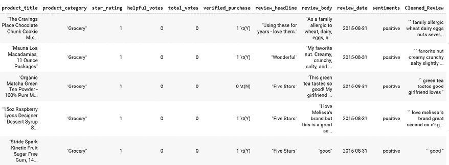

# 12

# 使用 ChatGPT 构建分类模型

# 引言

在前一章的基础上，我们使用 ChatGPT 对亚马逊书评进行数据探索，*第十二章*进一步深入到监督学习的领域，重点关注分类。在这里，我们继续利用 ChatGPT，应用其能力来增强我们对监督学习技术在客户评价背景下的理解和应用。

在电子商务领域，客户反馈在塑造商业策略和产品改进中起着至关重要的作用。正如比尔·盖茨恰如其分地所说：“你最不满意的客户是你最大的学习来源。”客户情感往往隐藏在大量的产品评价中。然而，手动审查这个包括产品 ID、标题、文本、评分和有帮助的投票等各种属性的产品评价海洋，是一项艰巨且往往难以管理的任务。

在本章中，我们专注于将客户评价分为两个不同的类别：正面和负面。我们将利用从 ChatGPT 处获得的见解来处理和分析客户评价数据。

我们的主要目标是展示 ChatGPT 如何简化机器学习的旅程，使其更加易于接近和减少恐惧，尤其是在处理像监督学习中的分类这样的复杂主题时。我们将探讨 ChatGPT 如何将复杂的概念分解成更易于消化的部分，提供解释，甚至生成代码片段，从而降低初学者或新进入该领域的人的学习曲线。

到本章结束时，你将牢固地理解监督学习及其在情感分析中的应用，并欣赏到 AI 工具如 ChatGPT 在有效学习和应用机器学习技术中的价值。

# 商业问题

在电子商务项目中，理解客户反馈有助于识别影响客户购买决策的关键因素，从而实现有针对性的营销策略。此外，它还允许优化用户体验和网站设计，以增加向客户提供改进服务和产品的可能性。

# 问题与数据领域

在本节中，我们旨在使用亚马逊产品评价数据集构建一个客户评价情感分析分类模型。利用 ChatGPT 的能力，我们将生成 Python 代码来构建分类模型，为读者提供一种实际的方法来处理数据集和理解分类技术。此外，我们还将探讨有效的提示技术，以引导 ChatGPT 提供针对数据分类任务的定制代码片段和见解。

## 数据集概述

亚马逊产品评论数据集包含了各种产品和它们相应的评论信息。通过利用这个数据集，我们可以执行各种分析，包括情感分析、客户反馈趋势分析和产品评级分析。最终目标是训练一个能够准确地将评论分类为正面或负面情感的分类模型，增强决策过程，并提高电子商务平台和相关行业中的客户满意度。

数据集中的特征包括：

+   `marketplace` (`string`): 产品的位置。

+   `customer_id` (`string`): 客户的唯一标识符。

+   `review_id` (`string`): 评论的唯一标识符。

+   `product_id` (`string`): 产品的唯一标识符。

+   `product_parent` (`string`): 父产品标识符。

+   `product_title` (`string`): 被评论产品的标题。

+   `product_category` (`string`): 产品类别。

+   `star_rating` (`int`): 产品在 1 到 5 的评分尺度上的评分。

+   `helpful_votes` (`int`): 评论收到的有用票数。

+   `total_votes` (`int`): 评论收到的总票数。

+   `review_headline` (`string`): 评论的标题。

+   `review_body` (`string`): 评论的内容。

+   `review_date` (`string`): 评论的日期。

+   `Sentiments` (`string`): 评论的情感（正面或负面）。

`review_body` 和 `review_headline` 中的文本数据对于自然语言处理任务，包括情感分析，尤其有价值。为了简化目的，我们已排除中性情感类别，以专注于构建分类模型和提示技术。

# 将问题分解为特征

鉴于亚马逊产品评论数据集和机器学习模型在情感分析中的应用，我们将概述以下特征，以指导用户构建和优化用于情感分类的模型：

+   **数据预处理和特征工程**：用户将开始对文本数据进行预处理，包括诸如分词、小写化、去除停用词和标点符号等任务。此外，还将应用诸如**词频-逆文档频率**（**TF-IDF**）编码或词嵌入等特征工程技术，以将文本数据表示为适合机器学习模型的格式。

+   **模型选择和基线训练**：用户将为情感分类选择基线机器学习模型，如逻辑回归、朴素贝叶斯或**支持向量机**（**SVMs**）。选定的模型将在预处理后的数据上训练，以建立情感分析的基线性能。

+   **模型评估和解释**：用户将使用准确率、精确率、召回率和 F1 分数等指标评估训练好的机器学习模型的性能。此外，还将探索解释模型预测的技术，如特征重要性分析或模型可解释性方法，以深入了解影响情感分类决策的因素。

+   **处理不平衡数据**：此功能通过实现过采样、欠采样或模型训练期间使用类权重等技术来解决数据集中类别分布不平衡的挑战。用户将探索减轻类别不平衡对模型性能影响的方法，并提高少数类别的分类准确率。

+   **超参数调整**：用户将学习如何通过调整正则化强度、学习率和核参数等超参数来优化机器学习模型的性能。通过网格搜索或随机搜索等技术，用户将尝试不同的超参数配置，以改善模型在验证集上的性能。

+   **实验特征表示**：用户将探索将文本数据表示为机器学习模型特征的不同方法。此功能侧重于比较使用不同特征表示（如词袋、TF-IDF 或词嵌入）训练的模型的性能，以确定情感分类中最有效的途径。

通过遵循这些特性，用户将获得构建、微调和优化用于亚马逊产品评论数据集进行情感分析任务的机器学习模型的实际见解。他们将学习如何系统地实验不同的预处理技术、特征表示、超参数配置和类别不平衡处理策略，以实现情感分类中的卓越性能和准确性。

# 提示策略

为了有效地利用 ChatGPT 生成用于情感分析机器学习任务的代码，我们需要开发一个针对使用亚马逊产品评论数据集进行情感分析的具体特征和要求的综合提示策略。

## 策略 1：任务-行动-指南（TAG）提示策略

**1.1 – 任务**：具体任务是构建和优化使用亚马逊产品评论数据集进行情感分析的机器学习模型。

**1.2 – 行动**：构建和优化用于情感分析的机器学习模型的关键步骤包括：

+   数据预处理：分词、小写化、去除停用词和标点符号，以及特征工程（例如，TF-IDF 编码、词嵌入）。

+   模型选择：选择基线机器学习模型，如逻辑回归、朴素贝叶斯或支持向量机（SVMs）。

**1.3 – 指南**：在我们的提示中，我们将为 ChatGPT 提供以下指南：

+   代码应与 Jupyter Notebook 兼容。

+   确保对每一行代码都有详细的注释。

+   您必须详细解释每行代码，然后将其复制到笔记本的文本块中，在提供代码之前，对每个使用的方法进行详细说明。

## 策略 2：人格-指令-上下文（PIC）提示策略

**2.1 – 人格**：采用一个需要逐步指导构建和优化用于亚马逊产品评论数据集情感分析任务的机器学习模型的初学者的角色。

**2.2 – 指令**：要求 ChatGPT 逐个生成代码功能，并在进行下一步之前等待用户反馈。同时，提供数据集的路径，从该路径加载数据。

**2.3 – 上下文**：鉴于重点是使用亚马逊产品评论数据集进行情感分析，ChatGPT 不了解数据集及其特征，因此需要额外的上下文。

## 策略 3：学习-即兴发挥-反馈-评估（LIFE）提示策略

**3.1 – 学习**:

+   强调理解机器学习模型及其组件的重要性，包括特征工程技术和模型选择。

**3.2 – 即兴发挥**：

+   请求 ChatGPT 提供代码片段以实现额外的功能，例如超参数调整、处理不平衡数据和模型评估技术。

**3.3 – 反馈**：

+   分享生成的代码和模型输出以供反馈，以确保有效的学习和理解。

+   结合用户建议和批评，以改进模型和方法。

+   提供错误信息以排除和解决在模型实现过程中遇到的任何问题。

**3.4 – 评估**：

+   执行 ChatGPT 提供的生成代码，以验证准确性和有效性，确保模型在情感分析任务中使用亚马逊产品评论数据集时表现有效。

# 使用 ChatGPT 的免费版构建一个情感分析模型，以准确分类亚马逊评论。

我们将利用 ChatGPT 的免费版来构建基线模型。

## 特征 1：数据预处理和特征工程

让我们为我们的基线模型制定初始提示。

[P**rompt**]

我想为亚马逊评论数据集（TAG 1.1）创建一个简单的分类模型，该数据集包含以下字段（PIC 2.3）

+   `marketplace` (`string`): 产品的位置。

+   `customer_id` (`string`): 客户的唯一标识符。

+   `review_id` (`string`): 评论的唯一标识符。

+   `product_id` (`string`): 产品唯一的标识符。

+   `product_parent` (`string`): 父产品标识符。

+   `product_title` (`string`): 被评论产品的标题。

+   `product_category` (`string`): 产品的类别。

+   `star_rating` (`int`): 产品在 1 到 5 的评分尺度上的评分。

+   `helpful_votes` (`int`): 评论收到的有用票数。

+   `total_votes` (`int`): 评论收到的总票数。

+   `review_headline` (`string`): 审查的标题。

+   `review_body` (`string`): 审查内容。

+   `review_date` (`string`): 审查日期。

+   `Sentiments` (`string`): 审查的情感（正面或负面）。

它应包括以下步骤（TAG 1.2）并一次提供一步，并等待用户反馈（PIC 2.2）。

+   数据预处理：分词、小写化、移除停用词和标点符号以及特征工程（例如，TF-IDF 编码，词嵌入）。

+   模型选择：选择基线机器学习模型，如逻辑回归、朴素贝叶斯或 SVMs。

我是一个初学者用户（PIC 2.1），所以请提供逐步代码并严格遵循以下说明（TAG 1.3）。

+   代码应与 Jupyter 笔记本兼容。

+   确保对每一行代码都有详细的注释。

+   您必须详细解释每一行代码，这些代码将被复制到笔记本的文本块中，在提供代码之前对每种使用的方法进行详细说明。同时，请注意，数据集位于 Google Drive 的此路径：`/Chapter05/amazon_product_review_data.csv`。因此，添加代码以挂载驱动器并加载数据集（PIC 2.2）。

[E**提示结束**]

您应该收到以下类似的响应，其中 ChatGPT 为我们提供了详细的评论和解释：

[P**提示响应**]

当然，让我们将这个过程分解成步骤。我们将从数据预处理开始。

**步骤 1：数据预处理**

数据预处理对于清理和准备文本数据以供情感分析模型使用至关重要。我们将执行以下步骤：

1.  **加载数据集**：从提供的路径加载 Amazon 审查数据集。

1.  **分词**：将文本分割成单个单词或标记。

1.  **小写化**：将所有文本转换为小写以确保一致性。

1.  **移除停用词**：移除没有太多意义的常见词。

1.  **移除标点符号**：从文本中移除标点符号。

1.  **特征工程**：将文本数据转换为适合机器学习模型的格式（例如，TF-IDF 编码）。

现在，在编写代码之前，让我们详细探讨每个步骤。

**分词**：

+   分词是将文本分割成单个单词或标记的过程。它是自然语言处理（NLP）任务中的关键步骤。标记是文本处理的基本单元。例如，句子“The quick brown fox jumps over the lazy dog”可以被分词为[‘The’，‘quick’，‘brown’，‘fox’，‘jumps’，‘over’，‘the’，‘lazy’，‘dog’]。

**小写化**：

+   小写化涉及将所有文本转换为小写。这有助于标准化文本数据并减少词汇量。例如，在转换为小写后，“Hello”和“hello”将被视为相同的单词。

**移除停用词：**

+   停用词是那些没有显著意义的常见词，例如“the”，“is”，“and”等。移除停用词有助于减少数据中的噪声并提高模型的性能。

**移除标点符号**：

+   标点符号，如逗号、句号和感叹号，对情感分析贡献不大，可以从文本中安全地移除。

**特征工程（TF-IDF 编码）：**

+   TF-IDF（词频-逆文档频率）编码是一种常用的技术，用于将文本数据数值化。它反映了在文档集合中一个词对文档的重要性。它是基于两个指标计算的：词频（TF）和逆文档频率（IDF）。TF 衡量一个词在文档中的频率，而 IDF 衡量该词在整个文档中的稀有度。TF-IDF 编码给那些在文档中频繁出现但在文档集合中稀有的词赋予更高的权重，这些词通常更有信息量。

**[End of response**]

我们现在将要求 ChatGPT 提供代码：

**[Prompt**]

好的，让我们继续。

**[End of prompt**]

我们应该收到以下类似的响应，其中 ChatGPT 应提供加载数据集的代码：

[P**rompt response**]

太好了！让我们从在 Jupyter Notebook 中从 Google Drive 加载数据集开始。首先，我们需要挂载 Google Drive，然后读取包含亚马逊评论数据的 CSV 文件。

**步骤 1：加载数据集**

我们将使用`pandas`库从 CSV 文件加载数据集。Pandas 为 Python 提供了强大的数据处理工具，使其适合处理如 CSV 文件这样的结构化数据。

**代码解释：**

+   `import pandas as pd`: 导入 pandas 库并将其别名设置为`pd`以方便使用。

+   `from google.colab import drive`: 从`google.colab`库导入`drive`模块以挂载 Google Drive。

+   `drive.mount('/content/drive')`: 挂载 Google Drive 以访问其中的文件。这将提示您授权访问您的 Google Drive。

+   `data_path = '/content/drive/My Drive/Chapter05/amazon_product_review_data.csv'`: 定义包含数据集的 CSV 文件的路径。

+   `df = pd.read_csv(data_path)`: 使用 pandas 的`read_csv()`函数读取 CSV 文件，并将其存储在名为`df`的 DataFrame 中。

让我们在代码中实现这一点：

```py
# Importing necessary libraries
import pandas as pd
from google.colab import drive
# Mount Google Drive
drive.mount('/content/drive')
# Path to the dataset
data_path = '/content/drive/My Drive/Chapter05/amazon_product_review_data.csv'
# Load the dataset into a DataFrame
df = pd.read_csv(data_path) 
```

在您的 Jupyter Notebook 中运行此代码，它将数据集加载到 DataFrame `df` 中。在我们进行下一步之前，如果有什么问题，请告诉我

**[End of response**]

我们现在将应用评估提示策略（LIFE 3.4）并通过在 Google Colab 的每一步执行代码来验证代码。代码将从 Google Drive 加载数据集。它将请求权限。代码运行良好，无需任何修改或错误。

*请参考“使用 ChatGPT 构建情感分析分类模型”的笔记本 Building a Classification Model for Sentiment Analysis with ChatGPT.ipynb 中的可执行代码片段，或从提示响应中复制代码。*


图 12.1：代码执行 – 数据预处理

我们现在将指示 ChatGPT 进行下一步：

[P**rompt**]

让我们进行下一步。

**[End of prompt**]

我们应该收到以下类似的响应，其中 ChatGPT 应提供数据预处理的代码：

[提示响应]**

太好了！在下一步中，我们将执行以下预处理任务：

1.  分词

1.  小写化

1.  移除停用词

1.  移除标点符号

我们将使用 NLTK 库进行分词和停用词移除，并利用字符串方法进行小写化和标点符号移除。

**步骤 2：数据预处理**

**分词：**

+   我们将评论文本分词成单个单词或标记。NLTK 提供了一个`word_tokenize`函数用于此目的。

**小写化：**

+   我们将使用 Python 字符串的`lower()`方法将所有文本转换为小写。

**移除停用词：**

+   NLTK 为各种语言提供了一组停用词。我们将使用这个列表来过滤掉评论文本中的停用词。

**移除标点符号：**

+   我们将使用字符串方法从评论文本中移除标点符号。

让我们用代码实现这些预处理步骤：

```py
# Importing necessary libraries
import nltk
import string
# Download NLTK resources (only need to do this once)
nltk.download('punkt')
nltk.download('stopwords')
# Get the list of stopwords
stopwords = nltk.corpus.stopwords.words('english')
# Function to preprocess text
def preprocess_text(text):
    # Tokenization
    tokens = nltk.word_tokenize(text)
    # Lowercasing
    tokens = [token.lower() for token in tokens]
    # Removing stopwords and punctuation
    tokens = [token for token in tokens if token not in stopwords and token not in string.punctuation]
    # Join tokens back into text
    preprocessed_text = ' '.join(tokens)
    return preprocessed_text
# Preprocess the review body
df['Cleaned_Review'] = df['review_body'].apply(preprocess_text)
# Display the preprocessed data
df.head() 
```

下面是对代码的解释：

+   我们导入必要的库，包括用于自然语言处理任务的 NLTK 库和用于处理标点的 string 模块。

+   我们使用`nltk.download()`函数下载 NLTK 资源，用于分词和停用词移除。

+   我们定义了一个名为`preprocess_text()`的函数来预处理每个评论文本。此函数执行分词、小写化、移除停用词和移除标点符号。

+   在函数内部，我们使用`nltk.word_tokenize()`对文本进行分词，将标记转换为小写，使用列表推导式移除停用词和标点符号，然后将标记重新组合成文本。

+   最后，我们将`preprocess_text()`函数应用于 DataFrame 的`review_body`列，并将预处理后的文本存储在一个名为`Cleaned_Review`的新列中。

在您的 Jupyter Notebook 中运行此代码，它将预处理 DataFrame 中的评论文本。如果您有任何问题或准备好进入下一步，请告诉我！

**[响应结束]**

我们在笔记本中执行代码，它运行得非常好，并打印出数据集摘要，以及一个名为`Cleaned_Review`的新列。



图 12.2：代码执行 – 数据集摘要

## 功能 2：模型选择和基线训练

现在数据预处理已完成，我们将进入下一个功能：模型选择。

我们现在将指示 ChatGPT 进入下一步，并给它提供上一步的输出：

**[提示]**

```py
market_place customer_id review_id product_id product_parent product_title product_category star_rating helpful_votes total_votes vine verified_purchase review_headline review_body review_date sentiments Cleaned_Review 0 "US" "42521656" "R26MV8D0KG6QI6" "B000SAQCWC" "159713740" "The Cravings Place Chocolate Chunk Cookie Mix... "Grocery" 1 0 0 0 \t(N) 1 \t(Y) "Using these for years - love them." "As a family allergic to wheat, dairy, eggs, n... 2015-08-31 positive `` family allergic wheat dairy eggs nuts sever... 1 "US" "12049833" "R1OF8GP57AQ1A0" "B00509LVIQ" "138680402" "Mauna Loa Macadamias, 11 Ounce Packages" "Grocery" 1 0 0 0 \t(N) 1 \t(Y) "Wonderful" "My favorite nut. Creamy, crunchy, salty, and ... 2015-08-31 positive `` favorite nut creamy crunchy salty slightly ... 2 "US" "107642" "R3VDC1QB6MC4ZZ" "B00KHXESLC" "252021703" "Organic Matcha Green Tea Powder - 100% Pure M... "Grocery" 1 0 0 0 \t(N) 0 \t(N) "Five Stars" "This green tea tastes so good! My girlfriend ... 2015-08-31 positive `` green tea tastes good girlfriend loves '' 3 "US" "6042304" "R12FA3DCF8F9ER" "B000F8JIIC" "752728342" "15oz Raspberry Lyons Designer Dessert Syrup S... "Grocery" 1 0 0 0 \t(N) 1 \t(Y) "Five Stars" "I love Melissa's brand but this is a great se... 2015-08-31 positive `` love melissa 's brand great second ca n't g... 4 "US" "18123821" "RTWHVNV6X4CNJ" "B004ZWR9RQ" "552138758" "Stride Spark Kinetic Fruit Sugar Free Gum, 14... "Grocery" 1 0 0 0 \t(N) 1 \t(Y) "Five Stars" "good" 2015-08-31 positive `` good '' 
```

[提示结束]**

我们应该收到以下类似的响应，其中 ChatGPT 应提供模型选择的代码：

[提示响应]**

看起来 DataFrame 现在包含了一个名为`Cleaned_Review`的新列，其中包含预处理后的文本数据。我们已经成功完成了数据预处理步骤。

现在，让我们进入下一步：模型选择。

**步骤 3：模型选择**

在这一步，我们将选择一个基准机器学习模型用于情感分析。常用于文本分类任务如情感分析的模型包括逻辑回归、朴素贝叶斯和支持向量机（SVM）。我们将从这些模型中选择一个作为基准并评估其性能。

**逻辑回归：**

+   逻辑回归是一种流行的线性分类算法，用于二元分类任务如情感分析。它通过使用逻辑函数来建模给定输入属于特定类的概率。

+   我们将使用 Python 中的强大机器学习库 scikit-learn 来实现逻辑回归进行情感分析。

让我们继续使用预处理数据实现逻辑回归进行情感分析。以下是代码：

```py
# Importing necessary libraries
from sklearn.model_selection import train_test_split
from sklearn.feature_extraction.text import TfidfVectorizer
from sklearn.linear_model import LogisticRegression
from sklearn.metrics import accuracy_score, classification_report
# Splitting the data into training and testing sets
X = df['Cleaned_Review']
y = df['sentiments']
X_train, X_test, y_train, y_test = train_test_split(X, y, test_size=0.2, random_state=42)
# TF-IDF vectorization
tfidf_vectorizer = TfidfVectorizer(max_features=5000)  # You can adjust max_features as needed
X_train_tfidf = tfidf_vectorizer.fit_transform(X_train)
X_test_tfidf = tfidf_vectorizer.transform(X_test)
# Initialize and train the logistic regression model
lr_model = LogisticRegression()
lr_model.fit(X_train_tfidf, y_train)
# Predictions
y_pred = lr_model.predict(X_test_tfidf)
# Evaluate the model
accuracy = accuracy_score(y_test, y_pred)
print("Accuracy:", accuracy)
print("\nClassification Report:")
print(classification_report(y_test, y_pred)) 
```

让我解释一下代码：

+   我们从 scikit-learn 导入必要的库以进行模型选择和评估，包括用于分割数据的 `train_test_split`，用于 TF-IDF 向量化的 `TfidfVectorizer`，用于逻辑回归的 `LogisticRegression`，以及用于模型评估的 `accuracy_score` 和 `classification_report`。

+   我们使用 `train_test_split` 将数据分为训练集和测试集。

+   我们使用 `TfidfVectorizer` 对训练数据和测试数据进行 TF-IDF 向量化。

+   我们使用训练数据初始化和训练一个逻辑回归模型。

+   我们在测试数据上做出预测。

+   最后，我们使用准确率和分类报告评估模型性能。

您可以在您的 Jupyter Notebook 中运行此代码来训练逻辑回归模型，并评估其在情感分析任务上的性能。如果您有任何问题或想探索其他模型选项，请告诉我！

**[End of response**]

我们执行代码，它运行无误，训练了模型，并评估了模型性能。

您应该会看到一个包含精确度、召回率等信息的表格。

我们将进入模型评估和解释的下一个特性。

## 特征 3：模型评估和解释

现在我们已经选择了逻辑回归模型，并评估了基准性能，我们可以解释结果。

我们现在将输出提供给 ChatGPT，并请求额外的技术，如特征重要性分析和模型可解释性：

[P**rompt**]

我想了解准确率、精确度、召回率和 F1 分数等指标。此外，我还想应用解释模型预测的技术，如特征重要性分析或模型可解释性方法，以深入了解影响情感分类决策的因素。以下是模型评估的输出。

```py
 Accuracy: 0.86
Classification Report:
              precision    recall  f1-score   support
    negative       0.00      0.00      0.00        14
    positive       0.86      1.00      0.92        86
    accuracy                           0.86       100
   macro avg       0.43      0.50      0.46       100
weighted avg       0.74      0.86      0.80       100 
```

[E**nd of prompt**]

我们应该收到以下类似的响应，其中 ChatGPT 解释了指标，并建议了一些模型可解释性的选项等：

[P**rompt response**]

当然！让我们分解模型评估输出中提到的指标，并讨论解释模型预测的技术。

**指标说明:**

+   **Accuracy:**

准确率衡量正确分类的实例占总实例的比例。计算公式为正确预测的数量与总预测数量的比率。然而，仅准确率可能无法完全反映模型性能，尤其是在类别不平衡的情况下。

+   **Precision:**

精确率衡量所有正面预测中真正例预测的比例。它表示模型避免假正例的能力。计算公式为真正例与真正例和假正例之和的比率。

+   **Recall:**

召回率，也称为灵敏度或真正例率，衡量了所有实际正面实例中真正例预测的比例。它表示模型捕捉所有正面实例的能力。计算公式为真正例与真正例和假反例之和的比率。

+   **F1-Score:**

F1 分数是精确率和召回率的调和平均数。它提供了一个平衡的度量，同时考虑了精确率和召回率。计算公式为 `2 * (precision * recall) / (precision + recall)`。

**解释:**

+   **Accuracy:**

准确率为 0.86 表示，模型正确分类了测试集中 86%的实例。然而，仅准确率并不能提供对类别特定性能的洞察。

+   **Precision:**

正类别的精确率为 0.86，表示当模型预测评论为正面时，它在 86%的时间内是正确的。负类别的精确率为 0.00，表示模型没有正确预测任何负面评论。

+   **Recall:**

正类别的召回率为 1.00，表示模型正确识别了所有正面评论。然而，负类别的召回率为 0.00，表示模型未能识别任何负面评论。

+   **F1-Score:**

正类别的 F1 分数为 0.92，这是正类别的精确率和召回率的调和平均数。它提供了一个平衡的度量，用于评估模型对正面评论的性能。

**解释模型预测的技术:**

+   **特征重要性分析:**

对于逻辑回归模型，我们可以通过检查与每个特征相关的系数来解释特征重要性。较大的系数表示对预测类别的更强影响。我们可以识别出对正面或负面情感有贡献的重要单词或特征。

+   **模型可解释性方法:**

如 SHAP（SHapley Additive exPlanations）值、LIME（局部可解释模型无关解释）或 ELI5（解释如我 5 岁孩子般简单）等技术可以提供关于单个特征如何贡献于模型预测的见解。这些方法有助于理解复杂模型（如逻辑回归）的决策过程。

你想深入了解这些技术中的任何一项，或者有任何具体问题吗？告诉我我能如何进一步帮助你！

**[回复结束]**

我们将要求 ChatGPT 应用**SHAP**（**SHapley Additive exPlanations**）技术：

[提示]

首先让我们尝试使用 SHAP。

**[提示结束]**

我们应该收到如下回复，其中 ChatGPT 理解了请求并提供了 SHAP 的代码：

**[提示回复]**

当然！SHAP（SHapley Additive exPlanations）是一种解释机器学习模型单个预测的方法。它提供了一种理解特定实例中每个特征对模型输出的贡献的方式。

这是我们如何使用 SHAP 来解释逻辑回归模型对情感分析的预测：

**使用 SHAP 进行模型解释：**

1.  **安装 SHAP：**

首先，让我们确保你已经安装了 SHAP。如果没有，你可以使用 pip 来安装它：

```py
!pip install shap 
```

1.  **准备数据：**

我们需要为 SHAP 分析准备数据。这涉及到将文本数据转换为适合逻辑回归模型格式的数据。

1.  **解释模型预测：**

我们将使用 SHAP 来解释测试集中单个实例的逻辑回归模型的预测。这将提供关于每个特征如何贡献于模型决策的见解。

让我们在代码中实现这些步骤：

```py
# Importing necessary libraries
import shap
# Initialize the SHAP explainer with the logistic regression model and training data
explainer = shap.Explainer(lr_model, X_train_tfidf)
# Explain the model's predictions for a specific instance (e.g., the first instance in the test set)
instance_index = 0  # You can choose any instance index from the test set
shap_values = explainer.shap_values(X_test_tfidf[instance_index])
# Visualize the SHAP values
shap.summary_plot(shap_values, features=X_test_tfidf[instance_index], feature_names=tfidf_vectorizer.get_feature_names()) 
```

代码解释：

+   我们导入 SHAP 库。

+   我们使用逻辑回归模型（`lr_model`）和 TF-IDF 转换后的训练数据（`X_train_tfidf`）初始化 SHAP 解释器。

+   我们使用解释器来计算测试集中特定实例的 SHAP 值（`X_test_tfidf[instance_index]`）。

+   最后，我们使用`shap.summary_plot()`可视化 SHAP 值。

这种可视化将提供关于哪些特征（单词）对所选实例的模型预测贡献最大的见解。

你可以在你的 Jupyter Notebook 中运行此代码来可视化单个预测的 SHAP 值。如果你有任何问题或需要进一步的帮助，请告诉我！

**[回复结束]**

我们执行代码，出现错误：`AttributeError: 'TfidfVectorizer' object has no attribute 'get_feature_names'`。


图 12.3：SHAP 的属性错误

我们将使用反馈提示策略（LIFE 3.3）并提供错误给 ChatGPT：

[提示]

```py
AttributeError: 'TfidfVectorizer' object has no attribute 'get_feature_names' 
```

**[提示结束]**。

我们应该收到一个包含建议正确代码的回复。

[提示回复]

看起来出现了一个 AttributeError，因为 `TfidfVectorizer` 对象没有 `get_feature_names()` 方法。对此表示歉意。我们可以直接从矢量器的词汇属性中访问特征名称。

让我们纠正代码以从 `TfidfVectorizer` 词汇中检索特征名称：

```py
# Get feature names from the TfidfVectorizer vocabulary
feature_names = tfidf_vectorizer.get_feature_names_out()
# Visualize the SHAP values
shap.summary_plot(shap_values, features=X_test_tfidf[instance_index], feature_names=feature_names) 
```

通过使用 `get_feature_names_out()`，我们可以从 `TfidfVectorizer` 的词汇中访问特征名称。

您可以根据需要更新代码，并在您的 Jupyter Notebook 中再次尝试运行它。如果您遇到任何进一步的问题，请告诉我！

**[结束响应**]

我们执行了纠正后的代码，它运行正常并生成了输出图表：


图 12.4：代码执行 – SHAP 对模型输出的影响

+   像诸如“great”和“love”这样的词具有正的 SHAP 值，这意味着它们在数据中的存在可能会推动预测向积极结果发展，可能表明在情感分析模型中存在积极情绪。

+   这些词按照它们 SHAP 值的绝对大小进行排序，其中“great”具有最大的积极影响。

+   列表中的大多数词对预测的影响非常小，接近零，这表明它们的存在相对于基线不会显著影响预测。

+   一些词如“360”和“xbox”可能与特定主题（如游戏）相关，它们的 SHAP 值略为负，表明它们可能会降低模型预测的积极结果的可能性。

我们现在将要求 ChatGPT 提供 ELI5（Explain Like I’m 5）的代码：

[P**提示**]

接下来，我想尝试 ELI5 并确保代码是正确的，并且没有因为应用了 SHAP 技术而受到影响。

**[结束提示**]。

我们应该会从 ChatGPT 那里收到 ELI5 的代码：

[P**提示响应**]

当然！ELI5（Explain Like I’m 5）是另一个流行的模型解释库，用于解释机器学习模型。我们可以使用 ELI5 来理解我们的逻辑回归模型是如何进行预测的，并检查特征的重要性。

让我们将 ELI5 集成到我们的代码中，以解释逻辑回归模型的预测：

**使用 ELI5 进行模型解释：**

1.  **安装 ELI5：**

如果您还没有安装 ELI5，可以使用 pip 进行安装：

```py
!pip install eli5 
```

1.  **解释模型预测：**

我们将使用 ELI5 来解释测试集中单个实例的逻辑回归模型的预测。ELI5 提供了不同的方法来解释模型预测，包括特征重要性和文本解释。

让我们更新我们的代码，以包括用于模型解释的 ELI5：

```py
# Importing necessary libraries
import eli5
# Explain the logistic regression model using ELI5
eli5.show_weights(lr_model, vec=tfidf_vectorizer, top=20)  # Show top 20 most important features 
```

代码的解释：

+   我们导入 ELI5 库。

+   我们使用 ELI5 的 `show_weights` 函数来解释逻辑回归模型的预测。此函数显示与每个特征相关的权重（系数），表明它们在模型决策过程中的重要性。

+   我们指定向量器（`vec`）参数，以确保 ELI5 能够根据 TF-IDF 向量化正确解释特征。

您可以在您的 Jupyter Notebook 中运行此更新后的代码，以查看对模型预测有贡献的前置特征。ELI5 提供了特征重要性的清晰可视化，使您能够深入了解模型的行为。

如果您有任何问题或遇到任何问题，请告诉我！

**[响应结束]**

我们执行 ChatGPT 提供的代码，该代码安装 eli5 库并生成以下输出：

输出完全无法理解，这很讽刺，因为它是应该被一个 5 岁孩子理解的。

让我们请 ChatGPT 至少提供一些代码，其中特征名称使用纯英文：

**[提示]**

我也能得到特征吗？X 个数字没有意义，并且肯定不是一个 5 岁孩子能理解的。

**[提示结束]**

我们应该收到以下类似的响应：

**[提示响应]**

当然！我们可以将特征索引（x 个数字）映射到 TF-IDF 向量器词汇表中的相应单词或术语，使它们更具可解释性。让我们更新代码以包括特征名称及其权重：

```py
# Explain the logistic regression model using ELI5 with feature names
eli5.show_weights(lr_model, vec=tfidf_vectorizer, top=20, feature_names=tfidf_vectorizer.get_feature_names_out()) 
```

通过包含 TF-IDF 向量器的词汇表中的`feature_names`参数，ELI5 将显示实际的单词或术语，而不是特征索引。

在您的 Jupyter Notebook 中运行此更新后的代码，您将看到对正类预测有贡献的前置特征及其权重。如果您有任何问题或需要进一步的帮助，请告诉我！

**[响应结束]**

我们执行提供的代码，现在它提供了英文的特征名称：

这结束了特征 3，但由于我们的数据明显不平衡，让我们继续到下一个特征。

## 特征 4：处理不平衡数据

现在我们已经有一个基线模型，并且学会了如何使用模型可解释性技术，我们将现在看看如何处理数据不平衡：

**[提示]**

我希望应用一些技术来减轻数据不平衡，这一点从模型性能中可以明显看出。

```py
Accuracy: 0.86
Classification Report:
              precision    recall  f1-score   support
    negative       0.00      0.00      0.00        14
    positive       0.86      1.00      0.92        86. 
```

**[提示结束]**

我们应该收到以下类似的响应，其中 ChatGPT 理解请求并提供减轻数据不平衡的建议和代码：

**[提示响应]**

解决数据不平衡对于提高模型性能至关重要，尤其是在一个类别相对于另一个类别显著代表性不足的情况下。以下是一些我们可以应用以减轻数据不平衡的技术：

**重采样技术**：

+   **过采样**：通过生成合成样本（例如，使用 SMOTE - 合成少数类过采样技术）增加少数类的实例数量。

+   **下采样**：通过随机删除样本来减少多数类的实例数量。

**算法技术**：

+   **类别权重**：在模型训练期间为少数类的实例分配更高的权重，以惩罚误分类。

+   **集成方法**：利用处理类别不平衡效果良好的集成方法，例如平衡随机森林或 Easy Ensemble。

**数据增强**：

+   通过对现有数据点应用变换或扰动来生成少数类的新样本。

**代价敏感学习**：

+   明确将误分类的成本纳入模型训练过程中，以优先考虑少数类的正确分类。

让我们实现这些技术之一，例如调整类别权重，以解决我们的逻辑回归模型中的数据不平衡问题：

```py
import numpy as np
# Calculate class weights
from sklearn.utils.class_weight import compute_class_weight
class_weights = compute_class_weight('balanced', classes=np.unique(y_train), y=y_train)
# Initialize and train the logistic regression model with class weights
lr_model_balanced = LogisticRegression(class_weight=dict(zip(np.unique(y_train), class_weights)))
lr_model_balanced.fit(X_train_tfidf, y_train)
# Predictions
y_pred_balanced = lr_model_balanced.predict(X_test_tfidf)
# Evaluate the model with balanced class weights
accuracy_balanced = accuracy_score(y_test, y_pred_balanced)
print("Accuracy with balanced class weights:", accuracy_balanced)
print("\nClassification Report with balanced class weights:")
print(classification_report(y_test, y_pred_balanced)) 
```

解释：

+   我们使用 scikit-learn 的 utils 中的`compute_class_weight`计算类别权重。设置平衡模式会自动根据输入数据中的类别频率调整权重。

+   我们使用计算出的类别权重初始化并训练一个新的逻辑回归模型（`lr_model_balanced`）。

+   我们使用平衡模型进行预测，并使用准确率和分类报告评估其性能。

运行此代码将训练带有平衡类别权重的逻辑回归模型，并在测试集上评估其性能。这应该有助于改善对不平衡数据的处理，并可能提高模型性能。如果你有任何问题或需要进一步的帮助，请告诉我！

[E**nd of response**]

我们将执行使用计算出的类别权重的代码，并查看它产生的影响。

你应该看到一个具有平衡权重的分类报告。

我们将输出结果给 ChatGPT，以便它为我们提供解释：

[P**rompt**]

带有平衡类别权重的准确率：0.81

带有平衡类别权重的分类报告：

```py
 precision    recall  f1-score   support
    negative       0.27      0.21      0.24        14
    positive       0.88      0.91      0.89        86
    accuracy                           0.81       100
   macro avg       0.57      0.56      0.57       100
weighted avg       0.79      0.81      0.80       100 
```

[E**nd of prompt**]

我们应该收到以下类似的响应，其中 ChatGPT 提供了输出结果的解释：

[P**rompt response**]

看起来应用平衡类别权重提高了模型性能，尽管准确率略有下降。让我们解释结果：

+   **准确率**：准确率为 0.81 表明，模型正确分类了测试集中 81%的实例。

+   **精确率和召回率**：对于负类别，精确率显著提升至 0.27，这意味着当模型预测一条评论为负面时，它在 27%的时间内是正确的。然而，召回率相对较低，为 0.21，这表明模型未能捕获许多负面实例。

对于正类别，精确率和召回率都很高，精确率为 0.88，召回率为 0.91。这表明模型在识别正实例方面表现良好。

+   **F1-score**: 负类别的 F1 分数略有提升至 0.24，而正类别的分数保持较高，为 0.89。

+   **支持**：支持表示每个类别中的实例数量。测试集中有 14 个负类实例和 86 个正类实例。

总体而言，虽然准确率有所下降，但模型正确分类少数类（负面评论）的能力在平衡类别权重后显著提高。这表明在两个类别之间，精确率和召回率的平衡更好，从而得到一个更稳健的模型。

如果你还有任何进一步的问题或需要额外的帮助，请随时提问！

[E**nd of response**]

我们已经减少了不平衡，现在我们将继续到超参数调整的下一个功能。

## 功能 5：超参数调整

现在我们已经学会了如何处理不平衡数据，我们可以通过调整正则化强度、学习率、核参数等超参数来优化性能，并应用网格搜索或随机搜索等技术：

[P**rompt**]

我希望通过调整正则化强度、学习率、核参数等超参数来优化性能，并应用网格搜索或随机搜索等技术。

[E**nd of prompt**]

我们应该收到以下类似的响应：

[P**rompt response**]

当然！超参数调整对于优化模型性能至关重要。我们可以使用网格搜索或随机搜索等技术来搜索一系列超参数值，找到最佳性能的组合。

让我们以逻辑回归为例，开始实现使用网格搜索的超参数调整：

```py
# Importing necessary libraries
from sklearn.model_selection import GridSearchCV
# Define hyperparameters grid
param_grid = {
    'C': [0.01, 0.1, 1.0, 10.0],  # Regularization strength (smaller values indicate stronger regularization)
    'solver': ['liblinear', 'lbfgs'],  # Optimization algorithm
}
# Initialize logistic regression model
lr_model_tuned = LogisticRegression()
# Initialize GridSearchCV with logistic regression model and hyperparameters grid
grid_search = GridSearchCV(lr_model_tuned, param_grid, cv=5, scoring='accuracy')
# Perform grid search
grid_search.fit(X_train_tfidf, y_train)
# Get the best hyperparameters
best_params = grid_search.best_params_
print("Best Hyperparameters:", best_params)
# Use the best model from grid search
best_lr_model = grid_search.best_estimator_
# Predictions
y_pred_tuned = best_lr_model.predict(X_test_tfidf)
# Evaluate the tuned model
accuracy_tuned = accuracy_score(y_test, y_pred_tuned)
print("Accuracy with tuned model:", accuracy_tuned)
print("\nClassification Report with tuned model:")
print(classification_report(y_test, y_pred_tuned)) 
```

说明：

+   我们定义了一个超参数网格（`param_grid`）来搜索。在这个例子中，我们改变了正则化强度（`C`）和求解算法。

+   我们初始化一个逻辑回归模型（`lr_model_tuned`）并使用 `GridSearchCV` 进行网格搜索。

+   网格搜索将使用交叉验证（`cv=5`）评估模型在不同超参数组合下的性能。

+   在网格搜索之后，我们检索最佳超参数（`best_params`）和最佳模型（`best_lr_model`）。

+   最后，我们使用最佳模型进行预测并评估其性能。

你可以调整超参数网格（`param_grid`）以包括其他超参数，如学习率和核参数，以适应不同的模型。此外，你还可以探索随机搜索或其他优化技术进行超参数调整。

随意在你的 Jupyter Notebook 中运行此代码，通过超参数调整优化逻辑回归模型的表现。如果你有任何问题或需要进一步的帮助，请告诉我！

[E**nd of response**]

我们执行代码，它运行正常，并使用 `GridSearchCV` 找到最佳参数。

你应该会看到一个带有调整模型的分类报告。

超参数调整在准确率和类别特定指标方面并没有显著提高模型性能。让我们来解释结果：

+   **最佳超参数**：网格搜索确定了最佳超参数为 `C=0.01` 和 `solver='liblinear'`。这些超参数表明了低正则化强度（`C=0.01`）以及使用了 liblinear 求解器算法。

+   **准确率**：调整后的模型的准确率保持在 0.86，与基线模型相同。这表明超参数调整没有导致整体准确率的显著提高。

+   **精确率和召回率**：正负类别的精确率、召回率和 F1 分数与基线模型保持不变。这表明在超参数调整后，模型正确分类每个类别的实例的能力没有提高。

+   **支持**：支持值表示测试集中每个类别的实例数量，与之前相同。

让我们继续到最后一个特征，并实验特征表示。

## 特征 6：实验特征表示

让我们指示 ChatGPT 为我们提供不同特征表示的代码：

[P**rompt**]

我想比较使用不同特征表示（如词袋、TF-IDF 或词嵌入）训练的模型的性能，以确定情感分类中最有效的途径。

[E**nd of prompt**]

我们应该收到以下类似的响应，其中 ChatGPT 提供了词袋、TF-IDF 和词嵌入的代码：

[P**rompt response**]

比较使用不同特征表示训练的模型的性能是确定情感分类中最有效方法的有价值方法。我们可以使用词袋、TF-IDF 和词嵌入表示来训练模型，并使用相同的评估指标来评估它们的性能。让我们一步一步地完成这个过程：

1.  **词袋表示法**：

    +   我们可以使用词袋方法表示文本数据，其中每个文档由一个向量表示，指示词汇表中每个词的频率。

1.  **TF-IDF 表示法**：

    +   TF-IDF（词频-逆文档频率）表示不仅考虑了文档中一个词的频率，还考虑了它在整个语料库中的重要性。

1.  **词嵌入表示法**：

    +   词嵌入将词表示为连续向量空间中的密集向量，捕捉词之间的语义关系。

下面是如何比较使用这些不同特征表示训练的模型性能的方法：

+   **预处理数据**：对每个特征表示方法进行分词、小写化、去除停用词，并执行任何必要的文本预处理步骤。

+   **训练模型**：使用每种特征表示方法（词袋、TF-IDF、词嵌入）训练逻辑回归模型。

+   **评估性能**：使用相同的评估指标（准确率、精确率、召回率、F1 分数）评估每个模型的性能。

+   **比较结果**：比较使用不同特征表示训练的模型的性能，以确定最有效的情感分类方法。

让我们首先通过使用词袋模型、TF-IDF 和词嵌入表示来实现逻辑回归模型：

**词袋模型表示：**

```py
from sklearn.feature_extraction.text import CountVectorizer
# Initialize CountVectorizer
bow_vectorizer = CountVectorizer(max_features=5000)  # You can adjust max_features as needed
# Transform text data into bag-of-words representation
X_train_bow = bow_vectorizer.fit_transform(X_train)
X_test_bow = bow_vectorizer.transform(X_test)
# Train logistic regression model with bag-of-words representation
lr_model_bow = LogisticRegression()
lr_model_bow.fit(X_train_bow, y_train)
# Evaluate model performance
y_pred_bow = lr_model_bow.predict(X_test_bow)
accuracy_bow = accuracy_score(y_test, y_pred_bow)
print("Accuracy with bag-of-words representation:", accuracy_bow)
# Add other evaluation metrics if needed 
```

**TF-IDF 表示：**

```py
from sklearn.feature_extraction.text import TfidfVectorizer
# Initialize TfidfVectorizer
tfidf_vectorizer = TfidfVectorizer(max_features=5000)  # You can adjust max_features as needed
# Transform text data into TF-IDF representation
X_train_tfidf = tfidf_vectorizer.fit_transform(X_train)
X_test_tfidf = tfidf_vectorizer.transform(X_test)
# Train logistic regression model with TF-IDF representation
lr_model_tfidf = LogisticRegression()
lr_model_tfidf.fit(X_train_tfidf, y_train)
# Evaluate model performance
y_pred_tfidf = lr_model_tfidf.predict(X_test_tfidf)
accuracy_tfidf = accuracy_score(y_test, y_pred_tfidf)
print("Accuracy with TF-IDF representation:", accuracy_tfidf)
# Add other evaluation metrics if needed 
```

**词嵌入表示：**

对于词嵌入表示，我们首先需要使用 Word2Vec、GloVe 或 fastText 等技术将文本数据转换为词嵌入。我们将为此目的使用预训练的词嵌入。

```py
# Assuming you have pre-trained word embeddings loaded (e.g., GloVe)
# Convert text data into word embeddings representation
# You may need to tokenize and pad sequences before applying word embeddings
# Train logistic regression model with word embeddings representation
lr_model_word_embeddings = LogisticRegression()
lr_model_word_embeddings.fit(X_train_word_embeddings, y_train)
# Evaluate model performance
y_pred_word_embeddings = lr_model_word_embeddings.predict(X_test_word_embeddings)
accuracy_word_embeddings = accuracy_score(y_test, y_pred_word_embeddings)
print("Accuracy with word embeddings representation:", accuracy_word_embeddings)
# Add other evaluation metrics if needed 
```

在使用不同的特征表示训练和评估模型后，您可以使用准确率或其他评估指标来比较它们的性能。根据结果，您可以确定哪种特征表示方法对于情感分类是最有效的。

随意在你的 Jupyter Notebook 中运行这些代码，如果需要进一步的帮助或有任何问题，请告诉我！

[响应结束]**

我们将执行代码并比较词袋模型、TF-IDF 和词嵌入的准确性。代码对前两种方法运行良好，但对于词嵌入则出现错误。


图 12.5：词袋模型


图 12.6：TF-IDF


图 12.7：词嵌入 – 错误

因此，我们将指示 ChatGPT 提供修正的词嵌入代码，我们还将提供我们之前已经进行了分词的上下文，但没有嵌入：

[提示]**

```py
NameError Traceback (most recent call last) <ipython-input-20-8a483831a6f9> in <cell line: 7>() 5 # Train logistic regression model with word embeddings representation 6 lr_model_word_embeddings = LogisticRegression() ----> 7 lr_model_word_embeddings.fit(X_train_word_embeddings, y_train) 8 9 # Evaluate model performance NameError: name 'X_train_word_embeddings' is not defined. We haven't pretrained word embeddings but have tokenized it earlier. We tokenized the text using nltk.word_tokenize(), converted tokens to lowercase, removed stopwords and punctuation using list comprehensions, and then joined the tokens back into text. Finally, we applied the preprocess_text() function to the 'Review_body' column of the DataFrame and stored the preprocessed text in a new column called 'Cleaned_Review'. 
```

[提示结束]**

我们应该收到类似以下修改后的代码的响应：

[提示响应]**

感谢您提供澄清。由于我们已经预处理了文本数据并进行了分词，我们可以使用词嵌入来表示它，而无需预训练的词嵌入。我们将使用 Word2Vec 或 Doc2Vec 等技术从分词文本生成词嵌入。

让我们继续使用 Word2Vec 来表示文本数据，然后训练一个逻辑回归模型：

**使用 Word2Vec 的词嵌入表示：**

```py
from gensim.models import Word2Vec
from sklearn.feature_extraction.text import CountVectorizer
from sklearn.base import BaseEstimator, TransformerMixin
# Define a custom transformer to tokenize the text data
class TokenizerTransformer(BaseEstimator, TransformerMixin):
    def fit(self, X, y=None):
        return self
    def transform(self, X):
        return [text.split() for text in X]
# Initialize and fit Word2Vec model on tokenized text data
w2v_model = Word2Vec(sentences=TokenizerTransformer().fit_transform(X_train), min_count=1)
# Define a function to average word vectors for each document
def average_word_vectors(words, model, vocabulary, num_features):
    feature_vector = np.zeros((num_features,), dtype="float64")
    nwords = 0.
    for word in words:
        if word in vocabulary:
            nwords = nwords + 1.
            feature_vector = np.add(feature_vector, model.wv[word])
    if nwords:
        feature_vector = np.divide(feature_vector, nwords)
    return feature_vector
# Define a custom transformer to convert tokenized text data into word embeddings representation
class WordEmbeddingsTransformer(BaseEstimator, TransformerMixin):
    def __init__(self, model):
        self.model = model
        self.num_features = model.vector_size
        self.vocabulary = set(model.wv.index_to_key)
    def fit(self, X, y=None):
        return self
    def transform(self, X):
        return np.array([average_word_vectors(words, self.model, self.vocabulary, self.num_features) for words in X])
# Convert tokenized text data into word embeddings representation
X_train_word_embeddings = WordEmbeddingsTransformer(w2v_model).fit_transform(TokenizerTransformer().fit_transform(X_train))
X_test_word_embeddings = WordEmbeddingsTransformer(w2v_model).transform(TokenizerTransformer().transform(X_test))
# Train logistic regression model with word embeddings representation
lr_model_word_embeddings = LogisticRegression()
lr_model_word_embeddings.fit(X_train_word_embeddings, y_train)
# Evaluate model performance
y_pred_word_embeddings = lr_model_word_embeddings.predict(X_test_word_embeddings)
accuracy_word_embeddings = accuracy_score(y_test, y_pred_word_embeddings)
print("Accuracy with word embeddings representation (Word2Vec):", accuracy_word_embeddings)
# Add other evaluation metrics if needed 
```

说明：

+   我们定义了一个自定义转换器 `TokenizerTransformer` 来分词文本数据。

+   我们使用 Word2Vec 模型从分词的文本数据生成词嵌入。

+   我们定义了一个函数 `average_word_vectors` 来计算每个文档的词向量平均值。

+   我们定义了另一个自定义转换器 `WordEmbeddingsTransformer` 来将分词的文本数据转换为词嵌入表示。

+   我们使用从 Word2Vec 获得的词嵌入表示来训练逻辑回归模型。

+   最后，我们评估模型的性能并打印准确率。

你可以在你的 Jupyter Notebook 中运行此代码，使用 Word2Vec 词嵌入表示文本数据，并训练一个逻辑回归模型。如果你需要进一步的帮助，请告诉我！

[响应结束]**

这次，代码运行正常：


图 12.8：使用词嵌入的准确率

这就结束了 ChatGPT 免费版本的最后特性。

现在，我们将尝试使用 ChatGPT-4 或 ChatGPT Plus 使用这些特征。

# 使用 ChatGPT-4 或 ChatGPT Plus 构建情感分析模型以准确分类亚马逊评论

ChatGPT Plus 或 GPT-4 包括上传数据集、分析数据集以及使用简单的库（如 Python 和 matplotlib）时产生结果的能力。在撰写本章时，它有一个名为**数据分析**的 AI 助手，由 OpenAI 在移动应用中使用或在使用浏览器版本选择 GPT-4 时提供。

让我们探索它与免费版本的区别，一个特性一个特性。

## 特性 1：数据预处理和特征工程

让我们为基线模型制定初始提示：

[提示]**

我想为亚马逊评论数据集（TAG 1.1）创建一个简单的分类模型进行情感分析。在这里上传 CSV 格式的数据集（PIC 2.3）

它应该包括以下步骤（TAG 1.2），而我是一个初级用户（PIC 2.1），所以请一次提供一个步骤，并等待用户反馈（PIC 2.2）

+   数据预处理：分词、小写化、去除停用词和标点符号，以及特征工程（例如，TF-IDF 编码，词嵌入）。

+   模型选择：选择基线机器学习模型，如逻辑回归、朴素贝叶斯或支持向量机（SVM）。

+   模型评估和解释。

+   处理不平衡数据。

+   超参数调整。

+   尝试特征表示。

[提示结束]**

你应该会收到以下类似的响应，其中 ChatGPT-4 已加载数据集：

[提示响应]**

太好了！我们将从预处理亚马逊评论数据集的数据开始。以下是我们可以如何处理预处理步骤：

+   **加载数据**：我们首先加载数据集以了解其结构。

+   **分词**：这涉及到将文本分解成单个单词或术语。

+   **小写化**：将所有文本转换为小写以确保一致性。

+   **去除停用词**：停用词是常见的单词（如“和”，“the”等），在处理自然语言数据之前通常会被过滤掉，因为它们携带的信息意义较小。

+   **去除标点符号**：标点符号在处理文本时通常不会增加太多额外信息。

+   **特征工程**：我们将应用 TF-IDF 编码，这有助于理解一个词在文档中相对于语料库的重要性。

让我们先加载数据并查看其结构。我将编写一个 Python 脚本来加载数据并显示前几条记录，以便更好地理解其列和内容。让我们继续这一步，一旦我们看到数据，我们就可以继续到下一个预处理任务。以下是脚本：

我们已成功加载数据集，以下是其结构的快速查看：

+   `market_place`，`customer_id`，`review_id`，`product_id`，`product_parent`：这些列是关于评论和产品的标识符和元数据。

+   `product_title`，`product_category`：关于产品的信息。

+   `star_rating`，`helpful_votes`，`total_votes`：评分和投票数据。

+   `verified_purchase`：购买是否经过验证。

+   `review_headline`，`review_body`：评论的实际文本。

+   `review_date`：评论的日期。

+   `sentiments`：这似乎是情感分析的标签（正面，负面）。

由于你的重点是情感分析，我们主要关注的列将是`review_body`和`sentiments`。

现在，让我们继续进行预处理步骤：

+   分词

+   转换为小写

+   去除停用词

+   去除标点符号

我们将使用 nltk 库来处理这些步骤，这是 Python 中用于文本处理的常用库。如果你准备好了，我会开始编写这些预处理步骤的代码！

[E**nd of response**]

我们可以看到数据集已成功加载，ChatGPT-4 正在等待下一步，用户的反馈（LIFE 3.3）。因此，我们将指示 ChatGPT-4 继续到下一步：

[P**rompt**]

让我们继续进行数据预处理。

[E**nd of prompt**]

我们应该收到以下类似的响应，其中 ChatGPT 理解请求并执行数据预处理的代码：

[P**rompt response**]

太好了！让我们逐一进行数据预处理任务。以下是我们的操作步骤：

+   **分词**：这将把`review_body`文本分割成单个单词或标记。

+   **转换为小写**：将所有标记转换为小写以标准化文本。

+   **去除停用词**：移除可能对情感分析无用的常见单词。

+   **去除标点符号**：去除标点符号，因为在基于文本的模型中通常不需要。

我将使用自然语言工具包（nltk）进行这些步骤。让我们首先安装必要的库并设置初始的预处理函数。以下是开始代码：

看起来由于这个环境中的网络限制，从 NLTK 库下载必要的资源出现了问题。我将修改方法，为了演示目的，手动定义一组常见的停用词。让我们继续简化版本的文本预处理：

+   分词

+   转换为小写

+   去除简化的停用词集

+   去除标点符号

这里是手动处理这些步骤而不需要下载额外资源的修改后的脚本：

文本预处理已成功使用简化方法应用。以下是原始文本和处理后文本的比较：

+   **原始**: “作为一个对小麦、乳制品、鸡蛋、坚果...过敏的家庭”

+   **处理**: [‘a’，‘family’，‘allergic’，‘wheat’，‘dairy’，‘eggs’，‘nuts’]

如您所见，我们已经移除了停用词、标点符号，并对文本进行了标记化和小写化处理。现在处理后的数据更适合输入到机器学习模型中进行情感分析。

下一步将涉及将这些标记转换为机器学习算法可以使用的数值特征。我们可以使用 TF-IDF 编码或词嵌入等方法来完成此操作。请告诉我你是否准备好进入特征工程步骤，或者是否有任何其他需要在预处理中调整的地方！

[响应结束]**

从响应中我们可以看到，ChatGPT-4 首先尝试使用 NLTK 库，但由于限制，它使用一组常见的单词简化了方法。它还提供了一个如何处理的示例。我们现在将指示 ChatGPT-4 继续操作：

[提示]**

让我们继续。

[提示结束]**

我们应该收到以下响应，其中 ChatGPT-4 已实现 TF-IDF：

[提示响应]**

太好了！让我们继续进行特征工程步骤。在情感分析中，将文本数据转换为机器学习算法可以理解的数值形式的一种常见技术是词频-逆文档频率 (TF-IDF) 方法。以下是一个简要的说明：

+   **词频 (TF)**: 衡量一个术语在文档中出现的频率。由于文档的长度可能不同，通常将其除以文档长度（文档中术语的总数）。

+   **逆文档频率 (IDF)**: 衡量一个术语在语料库（所有文档的集合）中的重要性。它有助于降低在文档中频繁出现且信息量较小的术语的权重。

**实现 TF-IDF 的步骤:**

+   **将标记列表转换为字符串**: 机器学习算法通常需要输入特征为字符串或数字。我们将把我们的标记列表转换回字符串格式。

+   **TF-IDF 向量化**: 使用 scikit-learn 中的 `TfidfVectorizer` 将文本文档转换为 TF-IDF 特征矩阵。

我将现在编写这些步骤，首先将我们的标记列表转换回字符串，然后应用 TF-IDF 向量化。让我们这样做：

我们已经成功将处理后的文本转换为一个 TF-IDF 特征矩阵。以下是一些详细信息：

+   **矩阵形状**: TF-IDF 矩阵包含 500 篇文档和 3778 个特征。这意味着在应用预处理和向量化步骤后，文档中有 3778 个独特的术语。

+   **示例特征**: 我们特征集中的前几个术语包括‘能力’，‘能’，‘关于’，‘以上’等。

现在可以使用这个 TF-IDF 矩阵作为各种机器学习模型的输入，以执行情感分析。

接下来，我们可以继续选择和训练使用此特征表示的基线模型。情感分析中初始模型的常见选择包括逻辑回归、朴素贝叶斯和支持向量机（SVM）。请告诉我您想从哪个模型开始，或者如果您有任何偏好，请告诉我！

[响应结束]**

我们可以看到 ChatGPT-4 已经实现了 TF-IDF，有 500 个文档和 3,778 个特征。我们现在将进入基线模型创建阶段。

## 功能 2：模型选择和基线训练

我们现在将指示 ChatGPT-4 继续进行模型选择：

[提示]**

让我们继续使用逻辑回归。

[提示结束]**

我们应该收到以下类似响应，其中 ChatGPT 理解请求并执行逻辑回归的代码。

[提示响应]**

完美！逻辑回归是分类任务（如情感分析）的一个很好的起点，因为它简单且通常为性能比较提供了一个良好的基线。

**实现逻辑回归的步骤**：

+   **准备数据**：我们将数据分为训练集和测试集以评估模型性能。

+   **训练模型**：我们将使用`scikit-learn`中的逻辑回归从训练集训练模型。

+   **评估模型**：我们将测试模型在测试集上的表现，以查看其预测情感的能力。

让我们从准备数据开始，然后训练逻辑回归模型。以下是执行此操作的代码：

逻辑回归模型已经训练和评估。以下是其性能的总结：

+   **准确度**：86%

+   **精确度、召回率和 F1 分数**：这些指标提供了更详细的视图。对于‘正面’类别，我们看到了 86%的精确度和 100%的召回率，分别导致 F1 分数为 92%。然而，对于‘负面’类别，精确度、召回率和 F1 分数都是 0。这表明模型未能正确预测任何‘负面’类别的实例。

这种差异通常是由于类别不平衡造成的，其中一个类别（在本例中为‘正面’）比另一个类别（‘负面’）频繁得多，导致模型偏向多数类别。

**下一步：**

+   **处理不平衡数据**：我们可以探索诸如对少数类别进行过采样、对多数类别进行欠采样或调整决策阈值等技术。

+   **超参数调整**：我们可以调整逻辑回归模型的参数，以潜在地提高性能。

+   **实验特征表示**：尝试 TF-IDF 的不同设置或使用其他类型的文本表示，如词嵌入。

您是否想进一步探索这些下一步，例如解决数据集中的不平衡问题，或者您想调整其他内容？

[响应结束]**

## 功能 3：模型评估和解释

现在我们已经选择了逻辑回归模型，并评估了基线性能，让我们来解释结果。

我们将要求 ChatGPT-4 解释指标并使用特征重要性分析和模型可解释性等技术提供结果解释：

[P**rompt**]

请解释指标并提供使用特征重要性分析和模型可解释性等技术的结果解释。

[E**nd of prompt**]

我们应该收到以下类似的响应，其中 ChatGPT 理解了请求并提供了解释和特征重要性分析：

[P**rompt 响应**]

让我们深入了解评估指标并探讨一些解释逻辑回归模型的技术：

**评估指标解释**：

+   **精确度**：这衡量了正面预测的准确性。形式上，它是真正预测到总预测正面的比率。高精确度表示假阳性率低。

+   **召回率（灵敏度）**：这是模型找到所有相关案例（所有真正正面）的能力。它是真正正面与实际总正面的比率。

+   **F1 分数**：F1 分数是精确度和召回率的调和平均数。当类别不平衡时，这是一个有用的度量，因为它在精确度和召回率之间取得平衡。

+   **准确度**：这是正确预测的观察值与总观察值的比率。对于不平衡的类别来说，它通常不是一个好的度量，因为它可能会误导。

**结果解释**：

+   **准确度为 86%**听起来不错，但这是误导性的，因为模型在少数类别（“负面”）上的表现很差。

+   该模型对“正面”类别的召回率（100%）很高，表明它识别了大多数正面实例，但它完全无法识别“负面”类别的实例（召回率为 0%）。

**特征重要性分析**：

+   在逻辑回归中，模型的系数可以提供对特征（在这种情况下为单词）重要性的洞察。系数的绝对值越高，表明该特征对模型所做的决策越重要。

让我们提取模型的系数，看看哪些单词（特征）对预测影响最大：

以下是影响情感分类的前 10 个特征（单词）及其相应的系数：

+   **“not”**：系数为-1.87，对情感预测有强烈的负面影响。它表明，在评论中出现“not”会显著地将预测推向负面情感。

+   **“great”**：系数为 1.65，具有强烈的正面影响，表明包含此词的评论很可能被分类为正面。

+   **“love”**：系数为 1.54，另一个强烈的正面指标。

+   **“good”**：系数为 0.99，对情感有正面影响。

+   **“but”**：系数为-0.95，对情感有负面影响。

+   **“very”**：系数为 0.88，通常用于积极语境中。

+   **“was”**：系数为-0.86，显示出负面的影响，可能在失望的语境中使用。

+   **“cheap”**：系数为-0.81，通常与负面情绪相关。

+   **“there”**：系数为-0.81，表明当使用这个词时，存在负面语境。

+   **“dont”**（可能是指“don’t”）：系数为-0.79，另一个强烈的负面指标。

**模型可解释性**：

这些系数直接揭示了模型如何根据文本中某些单词的存在来做出决策。具有正系数的单词会增加评论被分类为积极的可能性，而具有负系数的单词则推动向负面分类。

如果你想进行更深入的解读，可以应用 LIME（局部可解释模型无关解释）或 SHAP（SHapley 加性解释）等技术，以提供对特定预测的更细致的见解。

你是否想深入了解特定领域，例如处理数据不平衡或探索针对特定预测的模型可解释性技术，如 LIME 或 SHAP？

[E**nd of response**]

ChatGPT-4 无法安装新的库，如 SHAP，因此我们将在这里完成特征分析，并继续处理数据不平衡的下一步。

## 特征 4：处理数据不平衡

现在，我们将指示 ChatGPT-4 处理数据不平衡。

[P**rompt**]

让我们继续处理数据不平衡。

[E**nd of prompt**]

我们应该收到以下类似的响应：

[P**rompt response**]

在模型训练中处理数据不平衡至关重要，尤其是在像你这样的数据集严重偏向某一类的情况下。这种偏差可能导致模型主要预测多数类，正如我们在逻辑回归模型中看到的那样。

**处理数据不平衡的策略**

1.  **重采样技术**：

    +   **对少数类进行上采样**：这涉及随机复制少数类中的示例。

    +   **对多数类进行下采样**：这减少了多数类中的示例数量，以与少数类平衡。

1.  **合成数据生成**：

    +   **SMOTE（合成少数类过采样技术）**：这项技术从少数类生成合成样本，而不是创建副本。

1.  **修改算法**：

    +   **调整决策阈值**：移动决策阈值可以帮助提高少数类的召回率。

    +   使用天生擅长处理不平衡数据的算法，例如决策树或随机森林。

1.  **成本敏感学习**：

    +   给予少数类别的误分类更高的成本，使模型更加关注它。

鉴于我们正在使用逻辑回归，一个良好的起点可能是应用 SMOTE 为少数类生成合成样本，看看是否可以提高模型性能。我们还可以调整决策阈值，使其对少数类更加敏感。

首先，我们将对训练数据应用 SMOTE 方法，然后重新训练 Logistic Regression 模型。我将按照以下步骤进行：

看起来包含 SMOTE 的`imblearn`库在这个环境中不可用。鉴于这一限制，我们可以探索其他选项：

+   **减少多数类的样本量**：这将减少“正例”类的大小以匹配“负例”类的大小，尽管这可能导致丢失可能有用的数据。

+   **调整决策阈值**：而不是重采样，我们可以调整将评论分类为正例或负例的阈值，使模型对少数类更加敏感。

让我们继续调整决策阈值。这种方法涉及修改模型将样本分类为“正例”的概率阈值。默认情况下，此阈值设置为 0.5。降低此阈值可以帮助识别更多样本为“负例”，从而可能提高少数类的召回率。

我将计算类别预测的概率，然后调整阈值以观察其对分类指标的影响。让我们继续按照这种方法进行：

将决策阈值调整为 0.4 并没有改变分类结果。模型仍然预测所有评论为“正例”，并且与之前的指标相同，这表明我们可能需要显著降低阈值或考虑其他方法，因为对“正例”类的偏见很强。

**替代方案和考虑因素：**

+   **进一步降低阈值**：我们可以继续尝试更低的阈值，尽管这可能会导致更高的误报。

+   **更改模型或特征**：由于逻辑回归在处理这种不平衡性方面可能固有限制，因此尝试不同的模型或特征集可能有益。

+   **手动数据重采样**：如果像`imblearn`这样的自动化重采样库不可用，我们可以手动减少“正例”类的样本量或增加“负例”类的样本量，尽管后者没有 SMOTE 中合成样本生成的复杂性。

你想尝试进一步降低阈值，还是我们应该探索手动重采样或可能不同的建模方法？

[响应结束]

我们看到调整决策阈值并没有起到太大作用，因此我们将要求 ChatGPT-4 继续到超参数调整的下一个特征。

## 特征 5：超参数调整

我们将要求 ChatGPT-4 进行超参数调整：

[提示]

让我们继续进行超参数调整。

[提示结束]

我们应该收到以下类似的响应：

[提示响应]

超参数调整是提高机器学习模型性能的关键步骤。对于 Logistic Regression，一些可以调整的关键超参数包括：

+   **C（正则化强度的倒数）**：较小的值指定更强的正则化。

+   **求解器**：优化问题中使用的算法（例如，`liblinear`，`sag`，`saga`，`newton-cg`等）。

+   **惩罚项**：指定在惩罚中使用的范数（例如，`l1`，`l2`）。

我们可以使用带有交叉验证的网格搜索系统地探索多个参数值的组合。这种方法可以帮助确定这些超参数的最佳设置。

**实现超参数调整**

我们将使用`scikit-learn`中的`GridSearchCV`来执行超参数调整。我们将定义一个`C`和`penalty`的潜在值网格，然后使用这些值的组合来训练模型，以找到最佳组合。

让我们设置并执行网格搜索：

通过网格搜索进行的超参数调整已确定逻辑回归模型的最佳参数：

+   **C (正则化强度的逆)**: 100，表示正则化程度较低。

+   **惩罚项**：`l2`，这是正则化中使用的 L2 范数。

+   **求解器**：使用`sag`，这是一种适合大数据集的优化算法。

在这些设置下获得的最佳交叉验证准确率为 80.5%。这表明减少正则化（C 的值更高）有助于模型更好地拟合数据。

**下一步**：

+   **使用最佳参数评估模型**：我们现在可以在测试集上评估这个优化模型，以查看其性能与之前的配置相比如何。

+   **进一步实验**：根据结果，我们可能考虑进一步调整或尝试不同的建模技术。

我们是否应该通过在测试集上评估这些优化参数来继续进行，或者您是否想进一步探索任何特定内容？

[**响应结束**]**

我们将指示 ChatGPT-4 在测试集上使用优化参数评估模型：

[**提示**]**

当然，进行评估。

[**提示结束**]**

我们应该收到与以下类似的 ChatGPT-4 的响应：

[**响应提示**]**

使用最佳参数评估优化后的逻辑回归模型得到以下结果：

+   **总体准确率**：84%

+   **“负面”类别的精确率和召回率**：精确率为 33%，召回率为 14%。

+   **“正面”类别的精确率和召回率**：精确率为 87%，召回率为 95%。

**解释**：

+   与初始模型（准确率为 86%）相比，整体准确率略有下降，但我们看到在处理“负面”类别方面有所改进：

+   模型现在可以正确识别一些负面评论，尽管性能（14%召回率）仍然相当低，这表明模型可以检测到一些负面实例，但遗漏了许多。

+   负面评论的精确度为 33%，这意味着当模型预测评论为负面时，大约有三分之一的时间是正确的。

**关键点**：

+   **模型对负面评论的敏感性**：在识别负面评论方面略有改进，这可能是由于更少的正则化（更高的 C 值）允许模型更紧密地拟合少数类。

+   **类别之间的平衡**：对两个类别的敏感性（宏平均分数）仍然不理想，这表明可能需要进一步的调整或不同的建模方法，以充分捕捉少数类的特征。

**进一步行动：**

+   **实验其他模型**：鉴于逻辑回归在处理不平衡数据集时的固有局限性，考虑其他模型如决策树、随机森林或甚至集成方法可能会得到更好的结果。

+   **调整阈值或重新采样数据**：这些操作可以重新考虑或与不同的建模技术结合，以更好地处理类别不平衡问题。

你想探索替代模型或技术，还是想专注于项目的其他方面？

[回复结束]**

我们已经看到 ChatGPT-4 评估了性能并解释了结果。现在我们将转向特征表示。

## 特征 6：实验特征表示

让我们指示 ChatGPT 为我们提供不同特征表示的代码：

[提示]**

我想比较使用不同特征表示（如词袋、TF-IDF 或词嵌入）训练的模型性能，以确定情感分类中最有效的途径。

[提示结束]**

我们应该收到以下类似的回复，其中 ChatGPT 为我们提供了词袋、TF-IDF 和词嵌入的代码：

[提示回复]**

比较不同的特征表示是确定情感分类中最有效方法的一种优秀方法。让我们概述我们将评估的特征表示：

+   **词袋（BoW）**：计算文档中单词的频率。

+   **TF-IDF**：我们已经实现了这个。它不仅考虑了词频，还考虑了词对于一个文档的独特性。

+   **词嵌入**：使用 Word2Vec 或 GloVe 的预训练嵌入等模型，在密集向量空间中表示单词，捕获语义含义。

**逐步方法：**

+   **实现词袋**：我们将使用 scikit-learn 的`CountVectorizer`将文本文档转换为词计数的矩阵。

+   **使用词嵌入**：我们将使用 Gensim 的简单 Word2Vec 模型，或者使用预训练的 GloVe 嵌入以实现更直接的实现。

+   **在每个表示上训练逻辑回归**：为了保持一致性，我们将对每个特征集使用逻辑回归。

+   **比较性能**：使用准确率、精确率、召回率和 F1 分数评估每个模型。

让我们从实现词袋模型开始。之后，我们将继续到词嵌入。以下是词袋模型的代码：

使用词袋（BoW）特征表示训练的 Logistic Regression 模型具有以下性能指标：

+   **总体准确率**：86%

+   **“负面”类别的精确率和召回率**：精确率为 50%，召回率为 21%。

+   **“正面”类别的精确率和召回率**：精确率为 88%，召回率为 97%。

+   **BoW 性能解释：**

与初始的 TF-IDF 模型相比，BoW 模型在处理负面类别方面略有改进，尽管召回率仍然很低，但精确率有所提高。这表明，虽然模型比以前更准确地识别负面评论，但它仍然错过了许多负面案例。

接下来，为了简化，我们将使用预训练的 GloVe 词嵌入来实现词嵌入特征表示。这将为我们提供一个密集的表示，捕捉语义含义，这可能会提高分类效果，特别是对于负面评论。

**实现词嵌入：**

+   **加载预训练的 GloVe 词嵌入**：我们将使用嵌入将文本数据转换为密集向量形式。

+   **平均词嵌入**：对于每个评论，我们将计算词嵌入的平均值，形成一个代表整个评论的单个向量。

让我们继续加载和应用 GloVe 嵌入进行情感分类：

看起来我们遇到了一个限制，无法访问 Gensim 下载器，这是用于加载预训练的 GloVe 嵌入的，因为环境没有互联网访问。

**替代方法：**

由于我们无法使用预训练的 GloVe 词嵌入，让我们考虑一个更简单的词嵌入实现，直接在我们的数据集上使用 Word2Vec 模型。这将使我们能够根据评论中的词汇创建自己的嵌入。

让我们继续在处理过的评论上训练 Word2Vec 模型，然后使用嵌入来表示每个文档。我们将这样操作：

使用 Word2Vec 嵌入训练的 Logistic Regression 模型产生了以下结果：

+   **总体准确率**：86%

+   **“负面”类别的精确率和召回率**：精确率和召回率均为 0%。模型未能正确识别任何负面类别的实例。

+   **“正面”类别的精确率和召回率**：精确率为 86%，召回率为 100%。

**Word2Vec 模型的解释：**

Word2Vec 模型在准确率和类别特定指标方面与原始 TF-IDF 模型的表现相似。这种相似性表明，模型仍然严重偏向多数类（“正面”）。

负面类别的零召回率和精确率表明，尽管使用了语义丰富的词嵌入，但数据集的不平衡仍然严重影响了模型的预测。

**总结和建议：**

+   **BoW vs. TF-IDF vs. Word2Vec**: 在负类别的精确度方面，词袋模型（Bag-of-Words）相对于 TF-IDF 和 Word2Vec 模型略有提升。然而，所有模型在负类别的召回率方面都存在困难，突显了类别不平衡的影响。

+   **进一步改进**: 尝试集成方法、更复杂的神经网络（例如，用于文本的 LSTM、CNN）或进一步的平衡技术可能有必要来提高负类别的召回率。

+   **替代特征工程**: 可以探索额外的特征工程方法，如 n-gram，以捕捉更多上下文，这可能会帮助更准确地识别负面情绪。

您是否想进一步探索调整，例如尝试不同的机器学习模型或额外的平衡技术，或者您想专注于您项目的另一个方面？

[回复结束]

这就结束了我们关于如何使用 ChatGPT-4 或 ChatGPT Plus 来实现和执行亚马逊产品评论数据集的情感分析的章节。

# 作业

生成合成数据以处理数据不平衡。

# 挑战

尝试提高模型性能，使其超过 86%，并且请随意使用任何技术。

# 摘要

概述的策略提供了一个系统的方法来实验不同的技术，用于构建和训练使用亚马逊产品评论数据集的情感分析模型。每个步骤都详细说明，代码生成和用户交互都针对初学者友好，确保了一个全面的学习之旅。

任务从构建基线情感分析模型开始。初始步骤包括通过分词、小写化、去除停用词和标点符号来预处理文本数据，然后使用 TF-IDF 编码进行特征工程。

详细 Python 代码以 Jupyter Notebook 格式提供，包括每个操作的说明，确保即使是初学者也能舒适地跟随。

我们探索了基线机器学习模型，从逻辑回归开始。模型被训练和评估，揭示了显著的类别不平衡，导致预测偏向多数类。这一阶段包括详细的指标分析，如准确率、精确率、召回率和 F1 分数，增强了模型性能的理解，而不仅仅是准确率。

为了解决数据不平衡，讨论了调整决策阈值和实验合成数据生成方法（如 SMOTE）等技术。然而，环境中的限制促使转向手动方法，如欠采样和阈值调整，这些方法被实施并测试以细化模型对少数类的敏感性。

通过使用 GridSearchCV 进行超参数调整，学习过程得到了增强，重点关注优化正则化强度和求解器类型等参数。这一步骤提高了模型性能，并提供了模型配置对情感分类影响的认识。

实验扩展到比较不同的特征表示——词袋、TF-IDF 和词嵌入——以确定它们在情感分析中的有效性。每种技术都得到了实施，并且对其对模型性能的影响进行了批判性评估，揭示了不同文本表示如何影响辨别情感的能力。

在整个过程中，等待用户反馈后再进行下一步的策略确保了学习的节奏适当，并且每一步都很清晰。这种方法促进了情感分析技术的结构化探索，从基本的预处理到复杂的模型调整。

旅程以对构建和优化情感分析模型的全面理解结束。这种结构化的、迭代的途径——通过持续的用户参与和反馈得到增强——允许深入探索机器学习模型开发，从理论概念到实际应用。

这次经历不仅让用户掌握了处理文本数据和模型训练的知识，还突出了处理不平衡数据集以及选择合适的模型和特征进行情感分析时的挑战和考虑。

在下一章中，我们将学习如何使用 ChatGPT 生成线性回归的代码。

# 加入我们的 Discord 社区

加入我们的社区 Discord 空间，与作者和其他读者进行讨论：

[`packt.link/aicode`](https://packt.link/aicode)


