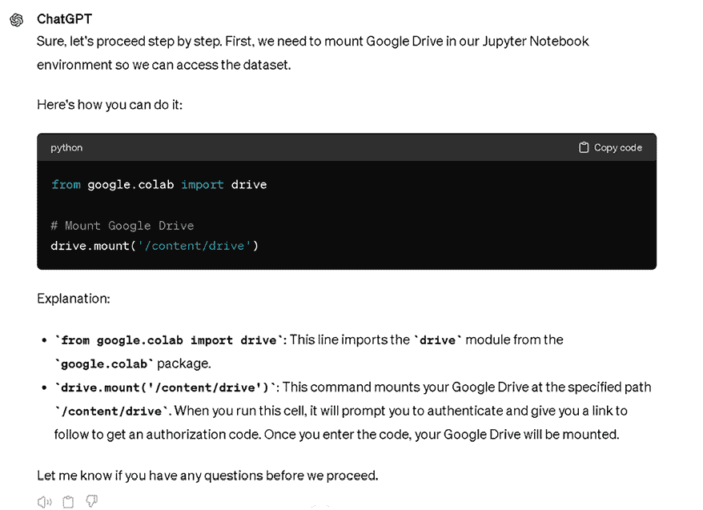
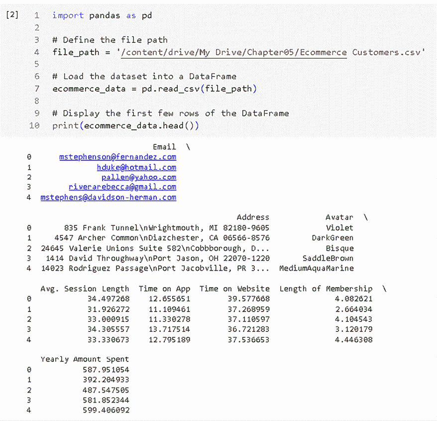
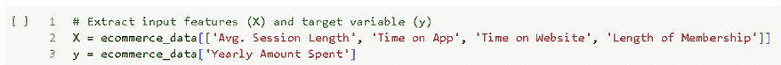
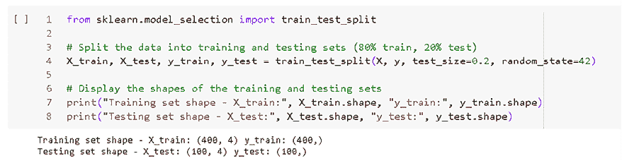
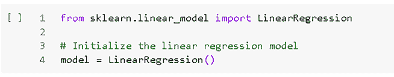
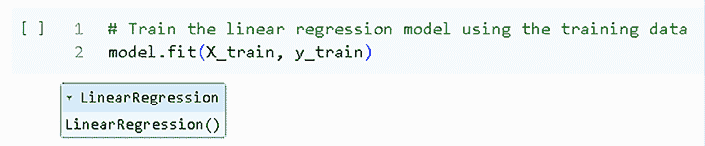
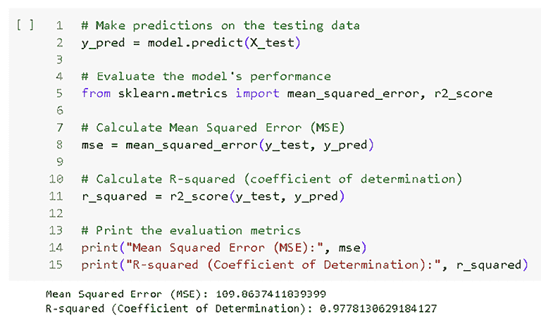
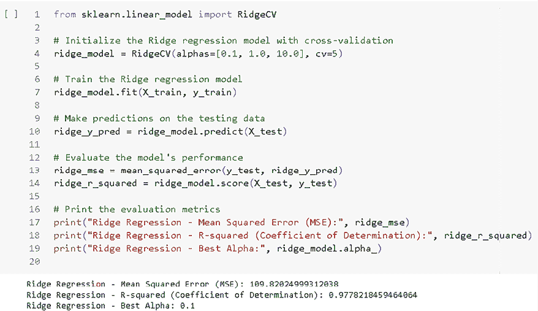
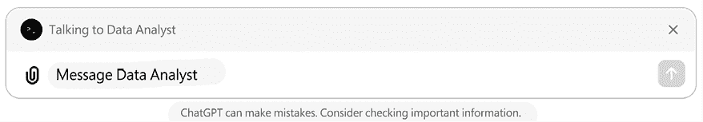

# 第十三章：使用 ChatGPT 构建客户消费回归模型

# 简介

在数据驱动决策的领域，理解客户行为对于优化商业策略至关重要。基于我们对分类技术的探索，本章将重点转向回归分析，特别是线性回归，以预测数值，例如客户的年度消费。线性回归帮助我们发现数据中的关系，使我们能够根据观察到的模式进行预测。

本章将指导您构建一个预测模型，该模型根据客户与数字平台的互动来估计客户的年度消费。我们旨在加深您对线性回归的理解，展示如何准备、处理和利用数据集来构建准确和可靠的模型。

随着我们前进，我们将探索各种技术来提高模型准确性和处理复杂数据场景：

+   **利用高级正则化技术**来提高模型稳定性和性能。

+   **生成合成数据集**以更好地理解模型在不同数据条件下的行为。

+   **通过综合、端到端的编码示例简化模型开发**。

到本章结束时，您将具备利用线性回归进行商业数据驱动决策所需的知识和技能。让我们开始这段回归分析的旅程，以优化我们应用程序或网站上的客户参与度和收入生成。

在本章中，我们将：

+   **使用 ChatGPT 构建回归模型**：读者将学习如何使用 ChatGPT 辅助生成用于构建回归模型的 Python 代码，以预测客户在我们的应用程序或网站上花费的年度金额，提供一种动手理解与交互数据集的方法。

+   **应用提示技术**：将介绍有效的技术来构建提示，引导 ChatGPT 提供最有用的代码片段和回归任务见解。

# 商业问题

一家电子商务商店希望通过深入了解客户行为和偏好来优化客户参与度和增加收入。通过分析各种客户属性及其购买模式，商店旨在定制其营销策略，提高客户保留率，并提升整体购物体验。

# 问题与数据领域

我们将使用回归技术来了解年度消费与其他参数之间的关系。**回归**是一种找出不同因素（如花在应用程序或网站上的时间）如何与客户在在线商店的消费金额相关联的方法。它帮助我们理解和预测客户行为。通过了解哪些因素对推动销售最有影响力，电子商务商店可以调整其策略来增强这些领域，并可能增加收入。

## 数据集概述

电子商务店铺从客户那里收集以下信息：

+   **电子邮件：** 这是客户的电子邮件地址。它是每个客户的唯一标识符，可用于通信，例如发送订单确认、时事通讯或个性化的营销优惠。

+   **地址：** 这指的是客户的物理地址。对于交付他们购买的产品至关重要。此外，地址数据有时可以提供关于销售和偏好的地理趋势的见解。

+   **头像：** 这可能是用户选择的数字表示或图像。它可能不会直接影响销售或客户行为，但它可以是客户互动策略的一部分，为用户资料增添个性化触感。

+   **平均会话时长：** 这是所有会话的平均持续时间，以分钟计算。这就像测量客户每次访问您的店铺时花费的时间。想象一下，有人平均花费 33 分钟在您的店铺里四处走动，查看产品。

+   **应用使用时间：** 这是指客户在店铺应用上的停留时长，以分钟计算。可以将其视为他们在应用中浏览的时间，比如在公交车上或咖啡店排队时。

+   **网站使用时间：** 这与应用使用时间类似，但这是针对您的网站。如果他们在家里或工作场所使用电脑查看您的店铺，他们会停留多久？

+   **会员时长：** 这表示这些客户在您的店铺中的时间长短。有些人可能是新顾客，而其他人可能已经与您合作多年。

+   **年度消费金额：** 这是指每位客户在您的店铺中一年内花费的总金额，以美元计算。

在我们的数据集背景下：

+   **电子邮件和地址：** 这些应主要用于交易目的，除非客户同意接收营销通讯。我们不会将它们用于分析。

+   **头像：** 这可以用于个性化用户体验，但对于销售预测的统计分析价值不大。

+   **其他数据：** 如“应用使用时间”和“网站使用时间”等变量可以进行分析，以改进用户体验和业务策略，同时不侵犯个人隐私。

总结来说，虽然像电子邮件、地址和头像这样的数据对于业务运营和客户互动很有价值，但它们必须以高度的责任心处理，优先考虑客户的隐私和偏好。

注意，所使用的数据不是真实的数据集，因此电子邮件、地址等都是虚构的。

# 将问题分解为特征

考虑到我们的数据集包括独立变量（如“平均会话时长”、“应用使用时间”、“网站使用时间”和“会员时长”）以及一个因变量（“年度消费金额”），我们将从使用 ChatGPT 和 ChatGPT Plus 或 GPT-4 的简单回归技术开始。这包括以下高级步骤：

1.  **逐步构建模型**：用户将逐步了解构建机器学习模型的过程，包括加载数据集、将其分为训练集和测试集、训练模型、进行预测以及评估其性能。

1.  **应用正则化技术**：用户将学习如何应用正则化技术，如岭回归和 Lasso 回归，并结合交叉验证来提高线性回归模型的表现。这包括初始化模型、使用训练数据训练它们以及评估它们的性能。

1.  **生成一个具有复杂性的合成数据集**：用户将发现如何使用 `sklearn.datasets` 模块中的 `make_regression` 函数生成具有附加复杂性的合成数据集。这涉及到指定样本数量、特征和噪声水平，以模拟真实世界的数据。

1.  **为合成数据集生成单步模型开发代码**：用户将看到如何通过单步编写端到端代码来加载合成数据集，将其分为训练集和测试集，训练线性回归模型，评估其性能，并打印评估指标。这允许采用简化的模型开发和评估方法。

# 提示策略

为了利用 ChatGPT 进行机器学习，我们需要清楚地了解如何实现针对代码生成的特定提示策略。

让我们头脑风暴一下在这个任务中我们想要实现的目标，以便更好地理解需要放入初始提示的内容。

## 策略 1：任务-行动-指南（TAG）提示策略

**1.1 – 任务**: 具体的任务或目标是创建一个简单的线性回归模型，根据数据集中的各种属性预测“**年度消费金额**”。

**1.2 – 行动**: 在这种情况下，策略是让 ChatGPT 决定步骤，因此没有提供具体的步骤。

**1.3 – 指南**：在我们的提示中，我们将为 ChatGPT 提供以下指南：

+   代码应与 Jupyter Notebook 兼容

+   确保对每一行代码都有详细的注释。

+   您必须解释每一行代码，然后将其详细地复制到笔记本的文本块中，以便在提供代码之前对代码中使用的每种方法进行说明。

## 策略 2：角色-指令-上下文（PIC）提示策略

**2.1 – 角色**：我们将扮演一个需要学习模型创建不同步骤的初学者的角色；因此，代码应逐步生成。

**2.2 – 指令**：我们明确包括了挂载 Google Drive 的步骤，因为这是一个常见的疏忽。

**2.3 – 上下文**: 最重要的是提供数据集的上下文和确切的字段名称，以生成可以直接执行的代码，或者在 ChatGPT Plus 的情况下提供数据集本身。

## 策略 3：学习-即兴创作-反馈-评估（LIFE）提示策略

**3.1 – 学习**:

+   我们想了解线性回归及其工作原理。

+   理解特征工程技术和模型评估指标。

+   我们想学习如何创建合成数据集。

**3.2 – 改进**:

+   我们将在应用正则化技术时使用它。

**3.3 – 反馈**:

+   如果提供的代码导致任何错误，则应向 ChatGPT 提供反馈。我们已在 ChatGPT Plus 中应用了 Lasso 和 Ridge 代码执行。

**3.4 – 评估**:

+   执行 ChatGPT 提供的代码以确保准确性和有效性。这一点在本章中一直被使用。

# 使用 ChatGPT 的免费版本构建一个简单的线性回归模型来预测“年度消费金额”

当使用免费版本时，首先向 ChatGPT 提供一个清晰的关于数据集的描述非常重要，这作为生成代码的有效方法，随后进行用户评估。ChatGPT 已经在 Python 和机器学习算法上训练得很好；因此，我们在这里不需要提供具体的步骤。为了验证生成的代码是否正确运行，我们将使用 Google Colab。

## 特征 1：逐步构建模型

让我们为分类模型制定初始提示。

[提示**]

我想创建一个简单的线性回归模型来预测电子商务客户数据集中客户的“年度消费金额”（TAG 1.1），该数据集包含以下列（PIC 2.3）：

1.  **电子邮件**：每个客户的独特电子邮箱，在此用作识别。

1.  **地址**：每个客户的物理地理位置。

1.  **头像**：这是数据库中客户的视觉匿名表示。

1.  **平均会话长度**：所有会话合并后的平均持续时间，以分钟为单位。

1.  **应用时间**：这是在商店应用程序中的持续时间，以分钟为单位。

1.  **网站时间**：这是在商店网站上的时间长度，以分钟为单位。

1.  **会员时长**：这是客户作为商店在线资源注册用户的时长。

1.  **年度消费金额**：这是客户支付商店在线资源的成本，以美元计算。

我是一个初学者用户（PIC 2.1），所以请提供逐步的代码，并严格遵循以下说明（PIC 2.2）：

+   代码应与 Jupyter 笔记本兼容

+   确保每行代码都有详细的注释。

+   您必须解释每一行代码，然后详细地将其复制到笔记本的文本块中，详细说明代码中使用的每种方法，在提供代码之前。

+   还请注意，数据集放置在 Google Drive 的此路径`'/content/drive/My Drive/Chapter05/Ecommerce Customers.csv '`（TAG 1.2）。

+   因此，添加代码来挂载驱动器，加载数据集，一次提供一步，并等待用户反馈。

[提示结束**]

您应该收到以下类似的响应。



图 13.1：ChatGPT 的初始响应

[P**rompt response**]

当然，让我们一步一步来。首先，我们需要在我们的 Jupyter Notebook 环境中挂载 Google Drive，以便我们可以访问数据集。

这是您可以这样做的：

```py
from google.colab import drive
# Mount Google Drive
drive.mount('/content/drive') 
```

解释：

+   `from google.colab import drive`：这一行从`google.colab`包中导入了`drive`模块。

+   `drive.mount('/content/drive')`：这个命令将您的 Google Drive 挂载到指定的路径`/content/drive`。当您运行这个单元格时，它会提示您进行身份验证，并给您一个链接以获取授权代码。一旦您输入代码，您的 Google Drive 就会挂载。

在我们继续之前，如果您有任何问题，请告诉我。

[E**nd of response**]

我们现在将应用评估提示策略，并通过在 Google Colab 的每一步执行代码来验证代码。代码运行得非常顺利，并挂载了 Google Drive。

请注意，它需要权限来访问驱动器，并会提示用户。

请参考笔记本 `使用 ChatGPT 学习简单回归.ipynb` 以获取可执行的代码片段，或者从提示响应中复制代码。

运行您的单元格，您应该会看到一个消息说“由于调用 drive.mount，已挂载到/content/drive。”

我们现在将指示 ChatGPT 进行下一步：

[P**rompt**]

让我们继续

[E**nd of prompt**]

我们应该会收到以下类似的响应，以将数据集加载到笔记本中：

[P**rompt response**]

太好了！现在我们已经挂载了 Google Drive，我们可以将数据集加载到我们的笔记本中。

这里是如何加载数据集的：

```py
import pandas as pd
# Define the file path
file_path = '/content/drive/My Drive/Chapter05/Ecommerce Customers.csv'
# Load the dataset into a DataFrame
ecommerce_data = pd.read_csv(file_path)
# Display the first few rows of the DataFrame
print(ecommerce_data.head()) 
```

解释：

+   `import pandas as pd`：这一行导入了 pandas 库，并将其别名为`pd`，这是一个常见的约定。

+   `file_path = '/content/drive/My Drive/Chapter05/Ecommerce Customers.csv'`：这一行定义了数据集在您的 Google Drive 中的文件路径。

+   `pd.read_csv(file_path)`：这个函数读取指定路径的 CSV 文件，并从中创建一个 DataFrame。

+   `print(ecommerce_data.head())`：这一行打印 DataFrame 的前几行，以验证数据集是否已正确加载。

如果您有任何问题或想要进行下一步，请告诉我！

[E**nd of response**]

我们在笔记本中执行了 ChatGPT 提供的代码，并从定义的路径加载数据集，并打印了前几行。由于我们在初始提示中给出了文件的路径，我们不需要在代码中做任何更改，它运行得非常顺利。得到的经验是，在需要时，我们需要对文件路径和位置进行具体说明。



图 13.2：加载数据集

接下来，我们将提供 ChatGPT 的输出，然后进行*步骤 1*。在这种情况下，我们通过以文本形式呈现输出，向 ChatGPT 提供了额外的上下文。

重要的是要注意，由于我们正在使用 GPT-3.5，它没有执行代码或处理图像的能力，所以我们只能从笔记本中提供文本输出：

[提示]**

```py
Here is the output -                         Email  \
0      mstephenson@fernandez.com   
1              hduke@hotmail.com   
2               pallen@yahoo.com   
3        riverarebecca@gmail.com   
4  mstephens@davidson-herman.com   
                                             Address            Avatar  \
0       835 Frank Tunnel\nWrightmouth, MI 82180-9605            Violet   
1     4547 Archer Common\nDiazchester, CA 06566-8576         DarkGreen   
2  24645 Valerie Unions Suite 582\nCobbborough, D...            Bisque   
3   1414 David Throughway\nPort Jason, OH 22070-1220       SaddleBrown   
4  14023 Rodriguez Passage\nPort Jacobville, PR 3...  MediumAquaMarine   
   Avg. Session Length  Time on App  Time on Website  Length of Membership  \
0            34.497268    12.655651        39.577668              4.082621   
1            31.926272    11.109461        37.268959              2.664034   
2            33.000915    11.330278        37.110597              4.104543   
3            34.305557    13.717514        36.721283              3.120179   
4            33.330673    12.795189        37.536653              4.446308   
   Yearly Amount Spent  
0           587.951054  
1           392.204933  
2           487.547505  
3           581.852344  
4           599.406092 
```

[提示结束]**

我们预计会收到以下类似的响应，其中 ChatGPT 将提供后续步骤的指导。最初，我们在初始提示中未指定任何特定步骤，而是选择让 ChatGPT 确定后续的行动方案：

[提示响应]**

太好了！数据集已成功加载。现在，我们可以继续构建我们的线性回归模型来预测客户花费的“年度金额”。

构建简单线性回归模型的步骤如下：

+   **数据准备**：将数据集分割为输入特征（`X`）和目标变量（`y`）。

+   **分割数据**：将数据集分割为训练集和测试集。

+   **模型初始化**：创建一个线性回归模型对象。

+   **模型训练**：将模型拟合到训练数据。

+   **模型评估**：使用测试数据评估模型性能。

让我们从*步骤 1*开始：

第 1 步：数据准备：

```py
# Extract input features (X) and target variable (y)
X = ecommerce_data[['Avg. Session Length', 'Time on App', 'Time on Website', 'Length of Membership']]
y = ecommerce_data['Yearly Amount Spent'] 
```

说明：

+   `X = ecommerce_data[['Avg. Session Length', 'Time on App', 'Time on Website', 'Length of Membership']]`：这一行从数据集中选择了输入特征（`'Avg. Session Length'`，`'Time on App'`，`'Time on Website'`，`'Length of Membership'`）并将其分配给变量`X`。

+   `y = ecommerce_data['Yearly Amount Spent']`：这一行从数据集中选择了目标变量`'Yearly Amount Spent'`并将其分配给变量`y`。

如果您有任何问题或想要进行下一步，请告诉我！

[响应结束]**

ChatGPT 概述了它将遵循的代码生成步骤。此外，它提供了第一步的代码，即数据准备，其中数据集被分为特征和目标变量。值得注意的是，它巧妙地排除了电子邮件地址、头像和地址等特征。此外，它精确地使用了初始提示中提供的描述中规定的列名。这里采用的策略是在提示中包含数据集列名，以确保生成的代码的兼容性。因此，代码执行时无需任何修改或错误。



图 13.3：步骤 1 – 数据准备

接下来，我们将指示 ChatGPT 继续：

[提示]**

让我们继续下一步。

[提示结束]**

我们应该收到以下类似的响应，以根据说明分割数据：

[提示响应]**

太好了！现在我们已经通过分离输入特征（`X`）和目标变量（`y`）来准备我们的数据，我们可以继续到下一步，即将数据分割为训练集和测试集。

第 2 步：分割数据：

```py
from sklearn.model_selection import train_test_split
# Split the data into training and testing sets (80% train, 20% test)
X_train, X_test, y_train, y_test = train_test_split(X, y, test_size=0.2, random_state=42)
# Display the shapes of the training and testing sets
print("Training set shape - X_train:", X_train.shape, "y_train:", y_train.shape)
print("Testing set shape - X_test:", X_test.shape, "y_test:", y_test.shape) 
```

说明：

+   `from sklearn.model_selection import train_test_split`: 这行代码从 `sklearn.model_selection` 模块导入 `train_test_split` 函数，该函数用于将数据集分为训练集和测试集。

+   `train_test_split(X, y, test_size=0.2, random_state=42)`: 这个函数将输入特征（`X`）和目标变量（`y`）分为训练集和测试集。`test_size` 参数指定了要包含在测试集中的数据集比例（在本例中，测试集为 20%）。`random_state` 参数用于可重复性，确保每次运行代码时生成相同的随机分割。

+   `X_train, X_test, y_train, y_test`: 这些变量分别持有输入特征（`X`）和目标变量（`y`）的训练集和测试集。

+   `print("Training set shape - X_train:", X_train.shape, "y_train:", y_train.shape)`: 这行代码打印了训练集输入特征（`X_train`）和目标变量（`y_train`）的形状。

+   `print("Testing set shape - X_test:", X_test.shape, "y_test:", y_test.shape)`: 这行代码打印了测试集输入特征（`X_test`）和目标变量（`y_test`）的形状。

如果您有任何问题或想要进行下一步，请告诉我！

[响应结束]**

代码执行成功，数据已按照预期的 80-20 比例分为训练集和测试集。值得注意的是，我们没有明确指定比例，但 ChatGPT 默认为标准的 80-20 分割。



图 13.4：步骤 2 – 分割数据

接下来，我们将提供上一步的输出给 ChatGPT，这样 ChatGPT 应该会了解形状，并且也应该为我们提供下一步的代码：

[提示]**

```py
Training set shape - X_train: (400, 4) y_train: (400,)
Testing set shape - X_test: (100, 4) y_test: (100,) 
```

[提示结束]**

我们应该收到一个类似的响应，其中模型已初始化：

[提示响应]**

完美！我们已经成功将数据集分为训练集和测试集。训练集包含 400 个样本，而测试集包含 100 个样本。每个样本由四个输入特征和一个目标变量组成。

现在，让我们进行下一步，即初始化我们的线性回归模型。

步骤 3：模型初始化：

```py
from sklearn.linear_model import LinearRegression
# Initialize the linear regression model
model = LinearRegression() 
```

说明：

+   `from sklearn.linear_model import LinearRegression`: 这行代码从 `sklearn.linear_model` 模块导入 `LinearRegression` 类，用于创建线性回归模型。

+   `model = LinearRegression()`: 这行代码初始化一个线性回归模型对象，并将其分配给变量 model。

如果您有任何问题或想要进行下一步，请告诉我！

[响应结束]**

代码执行得很好，没有任何错误。必要的导入也由 ChatGPT 提供。



图 13.5：步骤 3 – 模型初始化

我们将直接指示 ChatGPT 继续。值得注意的是，由于我们的初始提示中包含了提供逐步代码的指令，我们不需要针对每个单独的步骤或任务调整后续的提示。相反，我们将允许 ChatGPT 引导我们，在必要时提供前一步骤的输出：

[P**rompt]**

让我们继续。

[E**nd of prompt]**

我们应该收到以下类似的响应来训练模型：

[P**rompt response]**

太好了！现在我们已经初始化了我们的线性回归模型，我们可以继续下一步，即使用训练数据来训练模型。

步骤 4：模型训练：

```py
# Train the linear regression model using the training data
model.fit(X_train, y_train) 
```

说明：

+   `model.fit(X_train, y_train)`: 这行代码使用训练数据来拟合（或训练）线性回归模型。`fit`方法接受输入特征（`X_train`）和相应的目标变量（`y_train`）作为参数，并调整模型的参数以最小化实际值和预测值之间的差异。

现在我们已经训练了模型，我们可以继续到最后一步，即使用测试数据评估模型性能。

如果您有任何问题或希望继续，请告诉我！

[E**nd of response]**

我们将执行代码，这将训练模型。



图 13.6：步骤 4 – 模型训练

我们将指示 ChatGPT 继续：

[P**rompt]**

让我们继续

[E**nd of prompt]**

我们应该收到以下类似的响应来使用测试数据评估模型的性能：

[P**rompt response]**

太好了！现在我们的线性回归模型已经训练完成，我们可以使用测试数据来评估其性能。

步骤 5：模型评估：

```py
# Make predictions on the testing data
y_pred = model.predict(X_test)
# Evaluate the model's performance
from sklearn.metrics import mean_squared_error, r2_score
# Calculate Mean Squared Error (MSE)
mse = mean_squared_error(y_test, y_pred)
# Calculate R-squared (coefficient of determination)
r_squared = r2_score(y_test, y_pred)
# Print the evaluation metrics
print("Mean Squared Error (MSE):", mse)
print("R-squared (Coefficient of Determination):", r_squared) 
```

说明：

+   `model.predict(X_test)`: 这行代码使用训练好的模型对输入特征（`X_test`）进行预测，从而生成目标变量的预测值。

+   `from sklearn.metrics import mean_squared_error, r2_score`: 这行代码从`sklearn.metrics`模块导入`mean_squared_error`和`r2_score`函数，这些函数用于评估模型的性能。

+   `mean_squared_error(y_test, y_pred)`: 这个函数计算实际目标变量（`y_test`）和预测值（`y_pred`）之间的均方误差（MSE）。

+   `r2_score(y_test, y_pred)`: 这个函数计算实际目标变量（`y_test`）和预测值（`y_pred`）之间的 R 平方（确定系数）。

+   `print("均方误差 (MSE):", mse)`: 这行代码打印了均方误差（MSE），它衡量实际值和预测值之间的平均平方差。较低的 MSE 表示模型性能更好。

+   `print("R-squared (Coefficient of Determination):", r_squared)`: 这行代码打印出 R-squared 值，它代表了模型解释目标变量方差的比例。R-squared 值越高（越接近 1），表明拟合度越好。

这些评估指标将帮助我们评估我们的线性回归模型在预测客户“年度花费”方面的表现。

如果您有任何问题或需要进一步解释任何部分，请告诉我！

[响应结束]**

我们执行代码，它运行得非常完美，没有任何错误，并打印出**均方误差**（MSE）和决定系数（`R-squared`）。



图 13.7：模型评估输出

对于机器学习的新手来说，评估模型性能是否符合可接受标准至关重要。我们将再次寻求 ChatGPT 的帮助，并给它提供输出以供评估：

[提示]**

```py
Mean Squared Error (MSE): 109.8637411839399
R-squared (Coefficient of Determination): 0.9778130629184127 
```

[提示结束]**

我们应该从 ChatGPT 那里收到一个解释结果的响应，这表明鉴于 R-squared 非常接近 1，我们的模型实际上表现非常好：

[响应提示]**

评估指标表明，我们的线性回归模型在测试数据上的表现相当好：

+   **均方误差（MSE）**：MSE 的值约为 109.86。这表明，平均而言，“年度花费”的实际值和预测值之间的平方差约为 109.86。MSE 值越低，表明模型性能越好。

+   **R-squared（决定系数）**：R-squared 的值约为 0.978。这表明大约 97.8%的“年度花费”的方差可以通过线性回归模型来解释。R-squared 值越高，越接近 1，表明模型对数据的拟合度越好。

总体而言，这些评估指标表明，我们的线性回归模型在根据提供的输入特征预测客户“年度花费”方面表现良好。

如果您有任何进一步的问题或需要额外的帮助，请随时提问！

[响应结束]**

现在我们已经熟练掌握了利用 ChatGPT 逐步构建线性回归模型，我们将转向第二个特性，深入探讨正则化技术的应用。虽然我们的当前模型表现令人满意，但正则化可以证明非常有价值，尤其是在模型要么欠拟合要么过拟合的情况下。

## 特征 2：应用正则化技术

我们将使用 ChatGPT 的“学习和改进提示策略”（LIFE 3.1 和 3.2）来了解模型是否可能过拟合，以及在这种情况下应该做什么：

[提示]**

模型是否可能过拟合？

[提示结束]**

我们收到 ChatGPT 的响应，表明我们的模型不太可能过拟合，但它确实建议了一些需要考虑的事项，例如正则化技术和交叉验证：

[P**rompt response**]

在解释模型性能时，考虑过拟合的可能性是至关重要的。过拟合发生在模型学会捕捉训练数据中的噪声或随机波动，而不是输入特征与目标变量之间的潜在关系。这可能导致模型在训练数据上表现良好，但在未见过的数据上泛化能力差。

这里有一些表明可能发生过拟合的指标：

+   **训练和测试性能之间的大差异**：如果模型在训练数据上的表现显著优于测试数据，这可能表明模型过拟合。在我们的案例中，如果 MSE 和 R-squared 值在训练集上比在测试集上好得多，这可能表明过拟合。

+   **模型的复杂性**：与训练数据规模相比，参数数量过多的过于复杂的模型更容易过拟合。线性回归相对简单，但如果你使用的是更复杂的模型（例如，具有高次多项式的多项式回归），这可能会增加过拟合的风险。

+   **正则化技术**：如 Lasso 或 Ridge 回归等正则化技术可以通过惩罚大系数来减轻过拟合。如果怀疑过拟合，应用正则化可能有助于提高模型的泛化性能。

+   **交叉验证**：通过使用交叉验证技术，例如 k 折交叉验证，可以在对数据的多个训练-测试分割进行评估时，提供一个更稳健的模型性能估计。如果模型在不同分割上的性能有显著差异，这可能表明模型过拟合。

在我们的情况下，由于测试数据上的 R-squared 值较高，MSE 相对较低，模型过拟合的可能性较小。然而，探索这些指标并考虑采取额外步骤以确保模型泛化性能始终是一个好习惯。如果你怀疑模型过拟合，可以尝试简化模型，应用正则化技术，或使用交叉验证进一步评估其性能。

[E**nd of response**]

我们将要求 ChatGPT 应用正则化和交叉验证技术：

[P**rompt**]

首先尝试应用正则化技术，然后进行交叉验证

[E**nd of prompt**]

ChatGPT 应为我们提供应用 Lasso 或 Ridge 以及交叉验证的代码，并附上解释：

[P**rompt response**]

当然！让我们先对我们的线性回归模型应用正则化技术。两种常见的正则化技术是 Lasso 回归（L1 正则化）和岭回归（L2 正则化）。这些技术向损失函数中添加一个惩罚项，通过惩罚大的系数来帮助防止过拟合。

我们将首先尝试岭回归，它将系数的平方和（L2 范数）添加到损失函数中。

这是如何实现带有交叉验证的岭回归的方法：

```py
from sklearn.linear_model import RidgeCV
# Initialize the Ridge regression model with cross-validation
ridge_model = RidgeCV(alphas=[0.1, 1.0, 10.0], cv=5)
# Train the Ridge regression model
ridge_model.fit(X_train, y_train)
# Make predictions on the testing data
ridge_y_pred = ridge_model.predict(X_test)
# Evaluate the model's performance
ridge_mse = mean_squared_error(y_test, ridge_y_pred)
ridge_r_squared = ridge_model.score(X_test, y_test)
# Print the evaluation metrics
print("Ridge Regression - Mean Squared Error (MSE):", ridge_mse)
print("Ridge Regression - R-squared (Coefficient of Determination):", ridge_r_squared)
print("Ridge Regression - Best Alpha:", ridge_model.alpha_) 
```

说明：

+   `RidgeCV(alphas=[0.1, 1.0, 10.0], cv=5)`: 这初始化了一个带有交叉验证的岭回归模型。`alphas`参数指定要测试的正则化强度（alpha 值），而`cv`指定交叉验证的折数。

+   `ridge_model.fit(X_train, y_train)`: 这使用训练数据训练岭回归模型。

+   `ridge_model.predict(X_test)`: 这使用训练好的岭回归模型对测试数据进行预测。

+   `ridge_mse = mean_squared_error(y_test, ridge_y_pred)`: 这使用岭回归计算实际值和预测值之间的均方误差（MSE）。

+   `ridge_model.score(X_test, y_test)`: 这使用岭回归计算 R 平方值（确定系数）。

+   `ridge_model.alpha_`: 这个属性返回由交叉验证选出的最佳 alpha（正则化强度）。

如果你想继续使用岭回归或者有任何问题，请告诉我！

[E**nd of response**]

让我们尝试执行代码，看看它是否工作并且是否有改进。



图 13.8：岭回归

代码与之前提供的代码兼容，输出与线性回归代码非常相似。但请注意，ChatGPT 不需要任何特定指令，它可以生成一个完美的可执行代码。接下来，我们将向 ChatGPT 提供输出，看看它有什么建议：

[P**rompt**]

```py
Ridge Regression - Mean Squared Error (MSE): 109.82024999312038
Ridge Regression - R-squared (Coefficient of Determination): 0.9778218459464064
Ridge Regression - Best Alpha: 0.1 
```

[E**nd of prompt**]

在这种情况下，ChatGPT 已经解释了结果，并提供了带有交叉验证的 Lasso 回归代码。响应可能因 ChatGPT 在先前交互中提供的建议而有所不同：

[P**rompt response**]

看起来带有交叉验证的岭回归模型与标准线性回归模型表现相当。**均方误差**（**MSE**）和 R 平方值与标准线性回归模型得到的值非常接近。

岭回归模型通过交叉验证选出的最佳 alpha 是 0.1，这表明模型应用了少量的正则化。

由于带有交叉验证的岭回归的性能与标准线性回归模型相当，我们可以得出结论，在这种情况下，正则化并没有显著提高模型性能。

接下来，让我们尝试使用带有交叉验证的 Lasso 回归（L1 正则化）来查看它是否会产生任何改进：

```py
from sklearn.linear_model import LassoCV
# Initialize the Lasso regression model with cross-validation
lasso_model = LassoCV(alphas=[0.1, 1.0, 10.0], cv=5)
# Train the Lasso regression model
lasso_model.fit(X_train, y_train)
# Make predictions on the testing data
lasso_y_pred = lasso_model.predict(X_test)
# Evaluate the model's performance
lasso_mse = mean_squared_error(y_test, lasso_y_pred)
lasso_r_squared = lasso_model.score(X_test, y_test)
# Print the evaluation metrics
print("Lasso Regression - Mean Squared Error (MSE):", lasso_mse)
print("Lasso Regression - R-squared (Coefficient of Determination):", lasso_r_squared)
print("Lasso Regression - Best Alpha:", lasso_model.alpha_) 
```

如果你想继续使用 Lasso 回归或有任何问题，请告诉我！

[响应结束]

我们将执行代码，看看它是否工作，以及它是否会产生与 Ridge 回归不同的结果。


图 13.9：Lasso 回归

使用交叉验证的 Lasso 回归也产生了与标准线性回归和 Ridge 回归模型相似的结果。MSE 和 R-squared 值与之前获得的结果非常接近。

然而，需要注意的是，这里使用的数据集可能不够复杂，无法从正则化技术中获得显著的好处。在数据集更大或更复杂的情况下，正则化可能在防止过拟合和改善模型泛化方面发挥更关键的作用。

让我们转到下一个特征，为我们的问题生成一个合成数据集以增加复杂性。

## 特征 3：生成一个合成数据集以增加复杂性

我们将使用与 ChatGPT 的对话风格，并要求它提供生成合成数据集的代码：

[提示]

请提供一段生成合成数据集的代码，以便增加其复杂性？

[提示结束]

你可能会收到以下响应的变体。然而，你可能注意到这只是一个通用的代码，并不适合生成针对我们数据集的特定代码。因此，我们需要通过向 ChatGPT 提供反馈来细化提示：

[提示响应]

当然！我们可以使用`sklearn.datasets`模块中的`make_regression`函数生成一个具有额外复杂性的合成数据集。这个函数生成一个具有指定特征的随机回归问题，例如样本数量、特征数量和噪声水平。

这就是如何生成一个具有增加复杂性的合成数据集的方法：

```py
from sklearn.datasets import make_regression
import pandas as pd
# Generate synthetic dataset with 500 samples, 10 features, and increased noise
X_synthetic, y_synthetic = make_regression(n_samples=500, n_features=10, noise=50, random_state=42)
# Create a DataFrame from the synthetic dataset
synthetic_data = pd.DataFrame(X_synthetic, columns=[f'Feature_{i}' for i in range(1, 11)])
synthetic_data['Target'] = y_synthetic
# Display the first few rows of the synthetic dataset
print(synthetic_data.head())
# Save the synthetic dataset to a CSV file
synthetic_data.to_csv('synthetic_dataset.csv', index=False) 
```

说明：

+   `make_regression(n_samples=500, n_features=10, noise=50, random_state=42)`: 这个函数生成一个包含 500 个样本、10 个特征和增加的噪声水平（由噪声参数指定）的合成回归数据集。`random_state`参数确保了可重复性。

+   `pd.DataFrame(X_synthetic, columns=[f'Feature_{i}' for i in range(1, 11)])`: 这将从合成输入特征（`X_synthetic`）创建一个 DataFrame，并将列名从`'Feature_1'`到`'Feature_10'`分配。

+   `synthetic_data['Target'] = y_synthetic`: 这将合成目标变量（`y_synthetic`）添加到具有列名`'Target'`的 DataFrame 中。

+   `synthetic_data.to_csv('synthetic_dataset.csv', index=False)`: 这将合成数据集保存到名为`'synthetic_dataset.csv'`的 CSV 文件中，不包括`index`列。

您可以调整`make_regression`函数的参数来控制合成数据集的复杂性，例如样本数量、特征数量和噪声水平。

如果您需要进一步的帮助，请告诉我！

[响应结束]**

我们将简单地指示 ChatGPT 我们需要为我们的数据集编写代码：

[提示]**

不，我是指我们的问题。

[提示结束]**

让我们看看 ChatGPT 的建议，并判断它是否真的有效：

[提示响应]**

明白了！我们可以通过使用与原始数据集相同的输入特征，但增加复杂性来为我们的问题创建一个合成数据集。我们将生成额外的特征，这些特征是原始特征的非线性组合，并添加噪声来模拟真实世界的数据。

这就是如何为我们的问题生成具有增加复杂性的合成数据集的方法：

```py
import numpy as np
import pandas as pd
# Set random seed for reproducibility
np.random.seed(42)
# Number of samples
n_samples = 500
# Generate synthetic input features
avg_session_length = np.random.normal(loc=30, scale=5, size=n_samples)
time_on_app = np.random.normal(loc=15, scale=5, size=n_samples)
time_on_website = np.random.normal(loc=20, scale=7, size=n_samples)
length_of_membership = np.random.normal(loc=3, scale=1, size=n_samples)
# Generate synthetic target variable (linear combination of input features with noise)
yearly_amount_spent = 100 + (avg_session_length * 10) + (time_on_app * 20) + (time_on_website * 15) + (length_of_membership * 30) + np.random.normal(loc=0, scale=50, size=n_samples)
# Create a DataFrame from the synthetic dataset
synthetic_data = pd.DataFrame({
    'Avg. Session Length': avg_session_length,
    'Time on App': time_on_app,
    'Time on Website': time_on_website,
    'Length of Membership': length_of_membership,
    'Yearly Amount Spent': yearly_amount_spent
})
# Display the first few rows of the synthetic dataset
print(synthetic_data.head())
# Save the synthetic dataset to a CSV file
synthetic_data.to_csv('synthetic_ecommerce_data.csv', index=False) 
```

说明：

+   我们使用正态分布生成合成输入特征（`avg_session_length`、`time_on_app`、`time_on_website`、`length_of_membership`），并指定均值和标准差来模拟原始数据集的特征。

+   我们生成合成目标变量（`yearly_amount_spent`）作为输入特征的线性组合，并添加噪声。

+   最后，我们创建一个从合成数据集生成的 DataFrame，并将其保存到 CSV 文件中。

这个合成数据集将具有与原始数据集相似的特征，但增加了复杂性，这对于测试模型和理解它们在更具挑战性的场景中的性能非常有用。

如果您需要进一步的澄清或帮助，请告诉我！

[响应结束]**

代码看起来很棒，并且已适配我们的数据集。执行时没有错误，并生成一个名为`synthetic_ecommerce_data.csv`的 CSV 文件，并将其存储在笔记本的运行环境中。它还打印了前几行。您也可以下载它以供将来使用。

接下来，我们将请求 ChatGPT 生成完整的代码，并使用合成的数据集中添加的噪声来评估模型性能。让我们转向下一个特性。

## 特性 4：为合成的数据集生成单步开发模型的代码

在前面的特性中，我们已经学习了如何逐步创建回归模型，因此现在我们将请求 ChatGPT 为我们提供合成数据集的整个代码：

[提示]**

现在请提供使用生成的合成数据集运行的单步端到端代码。

[提示结束]**

我们应该收到一个类似的响应，其中提供了完整的代码，包括加载数据集、分割数据集、模型训练和模型评估：

[提示响应]**

当然！下面是端到端代码，该代码加载合成数据集，将其分割为训练集和测试集，训练线性回归模型，评估其性能，并打印评估指标。

```py
import pandas as pd
from sklearn.model_selection import train_test_split
from sklearn.linear_model import LinearRegression
from sklearn.metrics import mean_squared_error, r2_score
# Load the synthetic dataset
synthetic_data = pd.read_csv('synthetic_ecommerce_data.csv')
# Extract input features (X) and target variable (y)
X = synthetic_data[['Avg. Session Length', 'Time on App', 'Time on Website', 'Length of Membership']]
y = synthetic_data['Yearly Amount Spent']
# Split the dataset into training and testing sets (80% train, 20% test)
X_train, X_test, y_train, y_test = train_test_split(X, y, test_size=0.2, random_state=42)
# Initialize the linear regression model
model = LinearRegression()
# Train the linear regression model using the training data
model.fit(X_train, y_train)
# Make predictions on the testing data
y_pred = model.predict(X_test)
# Evaluate the model's performance
mse = mean_squared_error(y_test, y_pred)
r_squared = r2_score(y_test, y_pred)
# Print the evaluation metrics
print("Mean Squared Error (MSE):", mse)
print("R-squared (Coefficient of Determination):", r_squared) 
```

此代码将从 CSV 文件中加载合成数据集，将其分为训练集和测试集，使用训练数据训练线性回归模型，对测试数据进行预测，使用均方误差（MSE）和 R-squared（决定系数）评估模型性能，并打印评估指标。

如果您已安装 pandas 库以处理数据框，并且已安装 scikit-learn 库以实现机器学习功能，则可以直接在您的 Python 环境中运行此代码。

如果您有任何问题或需要我提供其他帮助，请告诉我！

[响应结束]

我们执行了代码，它运行得非常顺畅。

在合成数据集上训练的线性回归模型的评估指标如下：

+   **均方误差（MSE）**：大约为 2103.19

+   **R-squared（决定系数）**：约为 0.9197

这些指标提供了对模型性能的洞察：

+   **均方误差（MSE）**：MSE 衡量实际值和预测值之间平均平方差的度量。在这种情况下，MSE 表明，平均而言，实际值和预测的年度消费金额之间的平方差约为 2103.19。较低的 MSE 值是期望的，表示模型性能更好。

+   **R-squared（决定系数）**：R-squared 值表示模型解释的目标变量（年度消费金额）变差的比例。在这种情况下，R-squared 值约为 0.9197，表明大约 91.97%的年度消费金额变差可以通过线性回归模型解释。R-squared 值越接近 1，表示拟合度越好。

总体而言，这些评估指标表明线性回归模型在合成数据集上表现良好。

在在线电子商务商店的背景下，这些模型的洞察力可用于多种目的：

+   **客户细分**：这些模型可以帮助根据预测的`年度消费金额`识别高价值客户，从而实现有针对性的营销活动。

+   **推荐系统**：理解影响消费的因素可以用来改进产品推荐并提升顾客购物体验。

+   **保留策略**：`会员时长`似乎是一个重要因素。可以根据这一洞察力制定提高客户保留和忠诚度的策略。

+   **优化网站和应用程序**：对`平均会话时长`、`应用程序使用时间`和`网站使用时间`的影响进行了解，可以指导网站和应用程序优化的决策。

这标志着我们使用 ChatGPT 3.5 的学习结束。现在，让我们看看 ChatGPT Plus 中提示和学习的区别。

# 使用 ChatGPT Plus 学习简单线性回归

现在我们已经通过使用 ChatGPT 学习了简单线性回归，让我们在使用 ChatGPT Plus 的同时学习线性回归。ChatGPT Plus，或 GPT-4，包括上传数据集、分析数据集以及使用 Python 和 Matplotlib 等简单库产生结果的能力。在撰写本章时，它有一个名为 **数据分析** 的 GPT 助手，由 OpenAI 在使用移动应用时提供。您也可以选择使用浏览器版本的 GPT-4。

注意，您也可以使用免费版本实现相同的功能，但需要自行执行代码并修改提示。

## 特征 1：逐步构建简单的线性回归模型

我们已经学习了如何使用 ChatGPT 的免费版本逐步创建回归模型，其中我们需要提供数据集描述、从哪里加载的说明以及与 Jupyter Notebook 兼容的代码。在 ChatGPT Plus 的情况下，所有这些都被 ChatGPT Plus 处理，并且它还提供了一个代码执行环境。

注意，它不能运行 TensorFlow、Keras 或深度学习库：

[提示]**

我想创建一个简单的线性回归模型来预测附件中电子商务客户数据集（PIC 2.3）的“年度消费金额”（TAG 1.1）。

我是一个初学者用户（PIC 2.1），所以请提供逐步的代码，并严格遵循以下说明（PIC 2.2）：

+   确保每行代码都有详细的注释。

+   您必须解释每一行代码，并一次提供一个步骤，并等待用户反馈

[提示结束]**

我们应该收到以下类似的响应，其中提供了完整的代码，包括加载数据集、分割数据集、模型训练和模型评估：

[提示响应]**

太好了！让我们开始使用 Python 构建一个简单的线性回归模型。我们将使用 `pandas` 处理数据，以及 `sklearn` 创建回归模型。

步骤 1：导入库和加载数据

首先，我们将导入必要的库并加载数据集。我们还将查看数据集的前几行，以了解其结构。

这是这个步骤的代码：

```py
# Import necessary libraries
import pandas as pd  # pandas is used for data manipulation and analysis
from sklearn.model_selection import train_test_split  # This function is used to split data into training and testing sets
from sklearn.linear_model import LinearRegression  # This class is used to perform linear regression
from sklearn.metrics import mean_absolute_error, mean_squared_error  # These functions are used to evaluate the model
# Load the dataset
data = pd.read_csv('/mnt/data/Ecommerce Customers (1).csv')  # Reading the CSV file into a pandas DataFrame
# Display the first few rows of the dataset to understand its structure
print(data.head()) 
```

这段代码执行以下操作：

+   **导入库**: 我们加载 `pandas` 用于数据处理，以及 `sklearn` 的几个模块用于分割数据和执行线性回归。

+   **加载数据**: `pd.read_csv` 函数将 CSV 文件读取到 DataFrame 中，它是一个二维的标签化数据结构，具有可能不同类型的列。

+   **打印前几行**: 这有助于我们查看数据集的前几行，以便了解可用的数据和其格式。

让我们执行这个步骤并检查输出，以确保一切加载正确，并了解您的数据看起来如何。我们继续吗？

[响应结束]**

我们将指示 ChatGPT 继续操作：

[提示]**

是的，请。

[提示结束]**

我们应该收到以下类似的响应，其中 ChatGPT 执行了代码并打印了前几行。

注意，文件是在 ChatGPT 的运行时环境中加载的；如果您需要在本地环境或 Jupyter Colab 中执行代码，您将需要修改步骤以读取 CSV：

[提示响应]**

这是您数据集的前几行的快照：

| 邮箱 | 地址 | 头像 | 平均会话时长 | 应用程序使用时间 | 网站使用时间 | 会员时长 | 年度消费金额 |
| --- | --- | --- | --- | --- | --- | --- | --- |
| mstephenson@fernandez.com | 835 Frank Tunnel Wrightmouth, MI 82180-9605 | Violet | 34.497268 | 12.655651 | 39.577668 | 4.082621 | 587.951054 |
| hduke@hotmail.com | 4547 Archer Common Diazchester, CA 06566-8576 | DarkGreen | 31.926272 | 11.109461 | 37.268959 | 2.664034 | 392.204933 |
| pallen@yahoo.com | 24645 Valerie Unions Suite 582 Cobbborough, ... | Bisque | 33.000915 | 11.330278 | 37.110597 | 4.104543 | 487.547505 |
| riverarebecca@gmail.com | 1414 David Throughway Port Jason, OH 22070-1220 | SaddleBrown | 34.305557 | 13.717514 | 36.721283 | 3.120179 | 581.852344 |
| mstephens@davidson-herman.com | 14023 Rodriguez Passage Port Jacobville, PR 3... | MediumAquaMarine | 33.330673 | 12.795189 | 37.536653 | 4.446308 | 599.406092 |

数据集包括客户联系信息（如“邮箱”和“地址”）以及与他们与电子商务平台互动相关的数值数据（如“平均会话时长”、“应用程序使用时间”、“网站使用时间”和“会员时长”）。

第 2 步：数据准备

下一步将涉及为我们的线性回归模型准备数据。这包括：

+   选择用于预测的相关数值列。

+   将数据分为训练集和测试集。

您是否有特定的列想要用于预测“年度消费金额”，或者我应该使用所有数值列的一般方法继续操作？

[响应结束]**

我们将指示 ChatGPT 使用数值列继续操作：

[提示]**

请仅使用数值列。

[提示结束]**

我们应该收到以下类似的响应，其中 ChatGPT 提供了选择特征、分割数据集和打印形状的代码：

[提示响应]**

第 2 步：数据准备

我们现在将进行以下步骤来准备数据：

+   **选择相关列**：我们将包括与客户行为直接相关的数值列。

+   **将数据分为训练集和测试集**：这有助于我们评估模型在未见数据上的表现，以确保其总体表现良好。

这是执行这些步骤的代码：

```py
# Selecting only the numerical columns for features
features = data[['Avg. Session Length', 'Time on App', 'Time on Website', 'Length of Membership']]
# Selecting the target column which is 'Yearly Amount Spent'
target = data['Yearly Amount Spent']
# Splitting the dataset into training and testing sets
# We allocate 80% of the data for training and 20% for testing
X_train, X_test, y_train, y_test = train_test_split(features, target, test_size=0.2, random_state=42)
# Printing the shapes of the training and testing sets to verify the split
print(f'Training features shape: {X_train.shape}')
print(f'Testing features shape: {X_test.shape}')
print(f'Training labels shape: {y_train.shape}')
print(f'Testing labels shape: {y_test.shape}') 
```

这段代码：

+   **选择特征和目标**：我们将分离特征列和目标变量，这是我们想要预测的内容。

+   **分割数据**：使用`train_test_split`将数据分为训练集和测试集。`test_size=0.2`表示 20%的数据被保留用于测试。`random_state`被设置以确保结果的重复性。

+   **打印形状**：我们打印训练集和测试集的形状，以确认分割成功。

我们应该运行这段代码来准备数据并检查分割吗？

[响应结束]**

我们将指示 ChatGPT 继续执行代码：

[提示]**

是的，请。

[提示结束]**

我们应该收到一个类似于以下响应，其中 ChatGPT 已执行代码并打印了特征和标签的形状：

[提示响应]**

数据已成功分割为训练集和测试集。以下是分解：

+   **训练特征形状**：400 行和 4 列

+   **测试特征形状**：100 行和 4 列

+   **训练标签形状**：400 个值

+   **测试标签形状**：100 个值

这表明 80%的数据用于训练模型，20%的数据被保留用于测试模型性能。

第 3 步：构建线性回归模型

现在，我们将使用训练数据创建并训练线性回归模型。以下是计划：

+   **初始化线性回归模型**：这涉及到设置我们的模型，使其准备好拟合数据。

+   **将模型拟合到训练数据**：这是模型从训练数据中学习特征与目标之间关系的地方。

+   **在训练数据上评估模型**：这一步是为了快速检查我们的模型从训练数据中学到了多少。

我应该继续进行下一步，并展示如何构建和评估训练数据上的模型吗？

[响应结束]**

我们将指示 ChatGPT 继续下一步：

[提示]**

是的，请。

[提示结束]**

我们应该收到一个类似于以下响应，其中 ChatGPT 提供了代码：

[提示响应]**

让我们继续构建和训练线性回归模型。

第 3 步：构建线性回归模型

下面是创建、训练和初步评估线性回归模型的代码：

```py
# Initialize the Linear Regression model
model = LinearRegression()
# Fit the model to the training data
# This involves finding the best fitting line to the provided data points
model.fit(X_train, y_train)
# Evaluate the model by predicting on the training set
train_predictions = model.predict(X_train)
# Calculate the Mean Absolute Error (MAE) on the training set
# MAE measures the average magnitude of the errors in a set of predictions, without considering their direction
train_mae = mean_absolute_error(y_train, train_predictions)
# Calculate the Mean Squared Error (MSE) on the training set
# MSE measures the average of the squares of the errors—that is, the average squared difference between the estimated values and the actual value
train_mse = mean_squared_error(y_train, train_predictions)
# Printing the errors to understand model performance on the training data
print(f'Mean Absolute Error on training data: {train_mae}')
print(f'Mean Squared Error on training data: {train_mse}') 
```

这段代码执行以下操作：

+   **初始化模型**：调用`LinearRegression()`创建线性回归模型。

+   **拟合模型**：`model.fit(X_train, y_train)`调整回归线上的权重，以适应输入特征和目标输出。

+   **进行预测**：使用`model.predict(X_train)`来查看模型学习预测训练数据的效果如何。

+   **计算误差**：`mean_absolute_error`和`mean_squared_error`通过比较预测值与实际值来提供衡量模型准确性和性能的指标。

你希望我现在运行这段代码，看看模型在训练数据上的表现如何吗？

[响应结束]**

我们将指示 ChatGPT 继续：

[提示]**

是的，请。

[提示结束]**

我们应该会收到以下类似的响应，其中 ChatGPT 已执行代码并打印了结果：

[**提示响应**]

线性回归模型已在数据集上成功训练，以下是训练数据上的性能指标：

**训练数据上的均方绝对误差 (MAE)**: 7.727

**训练数据上的均方误差 (MSE)**: 95.823

这些指标帮助我们了解模型在预测中犯的平均误差：

+   **MAE** 告诉我们，平均而言，模型的预测值与实际值相差大约 7.73 个单位。

+   **MSE** 表示预测中存在略微更大的误差，因为它平方了误差，强调了更大的差异。

下一步：

现在，模型已在训练集上训练并初步评估。我们应该现在测试它在未见过的测试集上的性能，以真正评估其有效性。

你想要继续在测试集上测试模型并查看它在新数据上的表现吗？

[**响应结束**]

我们将指示 ChatGPT 继续测试模型在测试集上的性能：

[**提示**]

是的，请。

[**提示结束**]

我们应该会收到以下类似的响应，其中 ChatGPT 已执行代码并打印了结果：

[**提示响应**]

在测试集上对模型的评估产生了以下结果：

+   **测试数据上的均方误差 (MAE)**: 8.558

+   **测试数据上的均方误差 (MSE)**: 109.864

这些结果告诉我们以下信息：

+   8.558 的**MAE**表明，模型在测试数据上的预测值平均而言，与实际值相差大约 8.56 个单位。这略差于训练 MAE，这是可以预料的，因为模型现在正在预测它之前未见过的数据。

+   109.864 的**MSE**也高于训练 MSE，这表明某些预测的误差更大。

摘要：

模型表现相当不错，但与训练数据相比，在测试数据上表现出轻微的降低性能，这是正常的，表明模型正在按预期泛化，没有出现显著的过拟合或欠拟合。

最终步骤：

现在你已经拥有了一个可以基于客户行为指标预测“年度消费金额”的线性回归模型。根据你的目标，你可能想要进一步探索：

+   **改进模型**：你可以考虑更复杂的建模技术或特征工程。

+   **模型解释**：分析模型的系数以了解每个特征的影响。

你想要探索这些额外的步骤，或者需要进一步的帮助吗？

[**响应结束**]

我们已经看到，与免费版本类似，ChatGPT Plus 通过提供代码以及为我们执行代码的方式，一步一步地创建了一个简单的线性回归模型，做得相当不错。接下来，我们将看看 Plus 版本是否可以应用正则化技术。

## 功能 2：应用正则化技术

我们将要求 ChatGPT Plus 应用正则化技术：

[提示]**

请问你能应用 Lasso、Ridge 和交叉验证来检查它是否会导致任何改进吗？

[提示结束]**

我们应该收到类似于以下响应，其中 ChatGPT 提供了 Lasso 和 Ridge 以及交叉验证的代码：

[提示响应]**

第 5 步：应用 Lasso 和 Ridge 回归与交叉验证

Lasso 回归：

+   Lasso 回归不仅有助于减少过拟合，还可以用于特征选择，因为它可以将不太重要的特征的系数缩小到零。

Ridge 回归：

+   Ridge 回归通过对系数大小施加惩罚来降低模型复杂性。

我们将使用 scikit-learn 库，它提供了方便的函数来执行这些分析。

下面是应用 Lasso 和 Ridge 以及交叉验证的代码：

```py
from sklearn.linear_model import LassoCV, RidgeCV
from sklearn.model_selection import cross_val_score
# Lasso Regression with Cross-Validation
lasso_cv = LassoCV(alphas=[0.1, 1.0, 10.0], cv=5)  # cv=5 means 5-fold cross-validation
lasso_cv.fit(X_train, y_train)
lasso_cv_score = lasso_cv.score(X_test, y_test)
lasso_cv_mae = mean_absolute_error(y_test, lasso_cv.predict(X_test))
# Ridge Regression with Cross-Validation
ridge_cv = RidgeCV(alphas=[0.1, 1.0, 10.0], cv=5)
ridge_cv.fit(X_train, y_train)
ridge_cv_score = ridge_cv.score(X_test, y_test)
ridge_cv_mae = mean_absolute_error(y_test, ridge_cv.predict(X_test))
# Printing results
print(f'Lasso CV Score: {lasso_cv_score}, MAE: {lasso_cv_mae}')
print(f'Ridge CV Score: {ridge_cv_score}, MAE: {ridge_cv_mae}') 
```

此代码执行以下操作：

+   **LassoCV 和 RidgeCV**：这些是带有内置 alpha 参数交叉验证的 Lasso 和 Ridge 回归方法。

+   **交叉验证分数**：`.score()` 方法返回 R² 分数，表示从独立变量中可预测的因变量方差的比例。

+   **平均绝对误差**：这提供了测试集上拟合质量的绝对度量。

让我们运行这段代码看看正则化和交叉验证是否能提高模型性能。我们继续吗？

[响应结束]**

我们将指示 ChatGPT 执行代码：

[提示]**

是的，请。

[提示结束]**

**[提示响应]**

在我们的场景中，ChatGPT 遇到了内部错误，无法执行代码。这种错误可能由于各种原因而发生，包括执行时服务不可用、内存问题或其运行时环境中缺少所需的库或依赖项。重要的是要注意，你可能会收到不同的响应，这些响应可以完美地执行代码，因为这类错误是偶然发生的。然而，我们包括这个场景是为了故障排除并说明在这种情况下如何进行。在这里，我们应用了提示策略以从人工智能助手（LIFE 3.3）获取反馈。

[响应结束]**

我们现在将根据 ChatGPT 的建议在本地使用 Jupyter Colab 执行代码，因为我们是从 Google Drive 加载数据集，所以我们将在提示中提供说明：

[提示]**

好的，给我完整的本地运行代码，并注意文件需要从 Jupyter 笔记本中的路径 `'/content/drive/My Drive/Chapter05/Ecommerce Customers.csv'` 挂载到 Google Drive。

[提示结束]**

我们应该收到一个类似于以下响应，其中 ChatGPT 提供了完整的代码：

[响应提示]**

当然！以下是您可以在本地 Jupyter Notebook 中运行的完整代码。此脚本包括直接从 Google Drive 导入数据集、预处理数据、使用交叉验证拟合 Lasso 和 Ridge 回归模型，然后评估它们的步骤。

```py
# Import necessary libraries
import pandas as pd
from sklearn.model_selection import train_test_split
from sklearn.linear_model import LinearRegression, LassoCV, RidgeCV
from sklearn.metrics import mean_absolute_error, mean_squared_error
from sklearn.preprocessing import StandardScaler
# Mount Google Drive (specific to Google Colab)
from google.colab import drive
drive.mount('/content/drive')
# Load the dataset from Google Drive
file_path = '/content/drive/My Drive/Chapter05/Ecommerce Customers.csv'
data = pd.read_csv(file_path)
# Select only the numerical columns for features and the target column
features = data[['Avg. Session Length', 'Time on App', 'Time on Website', 'Length of Membership']]
target = data['Yearly Amount Spent']
# Splitting the dataset into training and testing sets (80% train, 20% test)
X_train, X_test, y_train, y_test = train_test_split(features, target, test_size=0.2, random_state=42)
# Standardizing the data
scaler = StandardScaler()
X_train_scaled = scaler.fit_transform(X_train)
X_test_scaled = scaler.transform(X_test)
# Initialize and fit the Linear Regression model
model = LinearRegression()
model.fit(X_train_scaled, y_train)
# Lasso Regression with Cross-Validation
lasso_cv = LassoCV(alphas=[0.01, 0.1, 1.0, 10.0], cv=5)
lasso_cv.fit(X_train_scaled, y_train)
lasso_cv_score = lasso_cv.score(X_test_scaled, y_test)
lasso_cv_mae = mean_absolute_error(y_test, lasso_cv.predict(X_test_scaled))
# Ridge Regression with Cross-Validation
ridge_cv = RidgeCV(alphas=[0.01, 0.1, 1.0, 10.0], cv=5)
ridge_cv.fit(X_train_scaled, y_train)
ridge_cv_score = ridge_cv.score(X_test_scaled, y_test)
ridge_cv_mae = mean_absolute_error(y_test, ridge_cv.predict(X_test_scaled))
# Print results
print(f'Linear Regression Test MAE: {mean_absolute_error(y_test, model.predict(X_test_scaled))}')
print(f'Lasso CV Score: {lasso_cv_score}, MAE: {lasso_cv_mae}')
print(f'Ridge CV Score: {ridge_cv_score}, MAE: {ridge_cv_mae}') 
```

运行代码的说明：

+   **Google Colab 特定说明**：`drive.mount()`函数是 Google Colab 特有的，允许您访问 Google Drive 上的文件。如果您不使用 Google Colab，您需要根据您的开发环境调整文件加载方法。

+   **依赖项**：确保您已安装所有必需的库。您可以使用`pip`安装它们（例如，`pip install pandas scikit-learn google-colab`）。

+   **数据路径**：如果你的文件位于 Google Drive 上的不同目录中，请调整`file_path`。

在你的 Jupyter Notebook 环境中运行此代码，以查看模型如何处理你的数据。如果你遇到任何错误或需要进一步的帮助，请随时联系！

[响应结束]**

我们执行代码，它运行得非常好，没有任何修改或错误。在这里，我们了解到我们可以使用在 ChatGPT Plus 中运行代码的混合方法，或者在出现任何问题时请求它提供在本地执行的代码。

接下来，我们将继续到功能 3，使用 ChatGPT Plus 生成合成数据集。

## 功能 3：生成合成数据集以增加复杂性

现在，让我们尝试使用 ChatGPT Plus 为我们生成数据集。为此，我们将使用数据分析师 GPT 并开始一次新的对话。

注意，可以通过在消息提示中提供`@<GPT 名称>`来调用特定的 GPT：

图 13.10：调用数据分析师 GPT

[提示]**

@数据分析师 – 请提供从预测“年度花费”的角度生成上述数据集的合成数据集的代码，以及生成它的代码。 <请在此处附加数据集文件>

[提示结束]**

我们应该收到一个类似于以下响应，其中 ChatGPT 提供了代码并打印了前几行：

[响应提示]**

为了帮助您生成预测年度花费的合成数据集，我首先需要查看您提供的数据集的结构和内容。让我们从加载和检查您文件中的数据开始。我将显示前几行和摘要统计信息，以了解我们正在处理什么样的特征。然后，我将协助您根据此结构创建合成数据集。让我们从加载数据开始。

数据集包含 500 个条目，具有以下特征：

+   **电子邮件**：客户的电子邮件地址（字符串）。

+   **地址**：客户的地址（字符串）。

+   **头像**：头像颜色（字符串）。

+   **平均会话时长**：以分钟为单位的平均会话时长（数值）。

+   **应用停留时间**：在应用上花费的时间（以分钟为单位，数值）。

+   **网站停留时间**：在网站上花费的时间（以分钟为单位，数值）。

+   **会员时长**：以年为单位计算的会员时长（数值）。

+   **年度消费金额**：以美元计算的年度消费金额（数值）。

为了创建用于建模和预测“年度消费金额”的合成数据集，我们可以使用一种称为**重采样**的技术，该技术涉及从现有数据集中有放回地抽样以创建一个新的具有相似分布的合成数据集。然而，为了增加一些变异性并模拟真实数据集，我们还可以在数值字段中引入随机噪声。

下面是一个使用重采样和向数值列添加噪声生成合成数据集的 Python 代码片段：

```py
import numpy as np
# Number of samples for the synthetic dataset
num_samples = 500
# Bootstrap the original dataset
synthetic_data = data.sample(n=num_samples, replace=True)
# Add random noise to numeric columns
numeric_columns = ['Avg. Session Length', 'Time on App', 'Time on Website', 'Length of Membership', 'Yearly Amount Spent']
noise_factor = 0.05  # 5% noise
for column in numeric_columns:
    noise = np.random.normal(loc=0.0, scale=noise_factor * synthetic_data[column].std(), size=num_samples)
    synthetic_data[column] += noise
# Optionally save the synthetic dataset to a new CSV file
synthetic_data.to_csv('/mnt/data/Synthetic_Ecommerce_Customers.csv', index=False)
synthetic_data.head() 
```

此代码将：

+   从原始数据集中抽取 500 条记录，允许替换（重采样）。

+   根据每列标准差的 5%向每个数值列添加高斯噪声。

+   可选地，新的合成数据集可以保存为 CSV 文件。

您是否希望继续生成此合成数据集？或者您在合成过程中有任何修改或特定要求？

[响应结束]**

接下来，我们将指导 ChatGPT 生成代码，并为我们提供下载数据集的文件：

[提示]**

请生成数据集并使其可供下载。

[提示结束]**

我们应该收到以下类似的响应，其中 ChatGPT 已执行代码并提供了下载合成数据集的链接：

[提示响应]**

合成数据集已生成并保存。您可以使用以下链接下载它：

```py
Download Synthetic Ecommerce Customers Dataset 
```

[响应结束]**

在这里，我们了解到 ChatGPT Plus 可以提供代码、执行代码，并且生成可供下载的 CSV 文件。

接下来，我们将请求 ChatGPT Plus 生成完整的代码，并在合成数据集中添加噪声后评估模型性能。让我们转到下一个功能。

## 功能 4：为合成数据集生成单步创建模型的代码

[提示]**

请您生成一个完整的代码，以在我们的合成数据集上执行线性回归，应用 Lasso 和 Ridge 正则化技术，并评估模型性能？

[提示结束]**

我们应该收到以下类似的响应，其中 ChatGPT 提供了完整的代码：

[提示响应]**

当然，我可以为您提供一段 Python 脚本，该脚本可以在我们刚刚创建的合成数据集上执行线性回归，以及 Lasso 和 Ridge 回归，我们还将使用 R-squared 分数、均方误差（MSE）和平均绝对误差（MAE）等指标来评估模型性能。

下面是整个过程的完整 Python 代码片段：

```py
import pandas as pd
import numpy as np
from sklearn.model_selection import train_test_split
from sklearn.linear_model import LinearRegression, Lasso, Ridge
from sklearn.metrics import mean_squared_error, mean_absolute_error, r2_score
# Load the synthetic dataset
data = pd.read_csv('/path/to/your/Synthetic_Ecommerce_Customers.csv')
# Feature selection: Using numerical columns as features
features = data[['Avg. Session Length', 'Time on App', 'Time on Website', 'Length of Membership']]
target = data['Yearly Amount Spent']
# Split the data into training and testing sets
X_train, X_test, y_train, y_test = train_test_split(features, target, test_size=0.2, random_state=42)
# Initialize the models
linear_model = LinearRegression()
lasso_model = Lasso(alpha=0.1)  # alpha is the regularization strength
ridge_model = Ridge(alpha=1.0)  # alpha is the regularization strength
# Train the models
linear_model.fit(X_train, y_train)
lasso_model.fit(X_train, y_train)
ridge_model.fit(X_train, y_train)
# Predictions
linear_predictions = linear_model.predict(X_test)
lasso_predictions = lasso_model.predict(X_test)
ridge_predictions = ridge_model.predict(X_test)
# Evaluations
def evaluate_model(predictions, actual):
    mse = mean_squared_error(actual, predictions)
    mae = mean_absolute_error(actual, predictions)
    r2 = r2_score(actual, predictions)
    return mse, mae, r2
linear_mse, linear_mae, linear_r2 = evaluate_model(linear_predictions, y_test)
lasso_mse, lasso_mae, lasso_r2 = evaluate_model(lasso_predictions, y_test)
ridge_mse, ridge_mae, ridge_r2 = evaluate_model(ridge_predictions, y_test)
# Print out the metrics
print("Linear Regression - MSE: {:.2f}, MAE: {:.2f}, R2: {:.2f}".format(linear_mse, linear_mae, linear_r2))
print("Lasso Regression - MSE: {:.2f}, MAE: {:.2f}, R2: {:.2f}".format(lasso_mse, lasso_mae, lasso_r2))
print("Ridge Regression - MSE: {:.2f}, MAE: {:.2f}, R2: {:.2f}".format(ridge_mse, ridge_mae, ridge_r2)) 
```

确保在本地环境中运行脚本时，将 `'/path/to/your/Synthetic_Ecommerce_Customers.csv'` 替换为你的合成数据集实际存储的实际路径。

此脚本将：

+   加载你的合成数据集。

+   选择合适的特征并将数据分为训练集和测试集。

+   初始化并训练线性、Lasso 和岭回归模型。

+   评估并打印出每个模型的性能指标。

这应该有助于你理解性能差异和正则化在你预测模型中的影响！

[E**nd of response**]

我们将指示 ChatGPT Plus 为我们执行代码：

[P**rompt**]

请执行代码。

[E**nd of prompt**]

ChatGPT Plus 应已执行代码，我们应该收到以下类似的响应：

[P**rompt response**]

模型已经训练和评估。以下是每个模型的性能指标：

线性回归：

+   **均方误差 (MSE)**: 133.01

+   **平均绝对误差 (MAE)**: 8.79

+   **决定系数 (R2)**: 0.977

Lasso 回归：

+   **均方误差 (MSE)**: 133.04

+   **平均绝对误差 (MAE)**: 8.79

+   **决定系数 (R2)**: 0.977

岭回归：

+   **均方误差 (MSE)**: 133.08

+   **平均绝对误差 (MAE)**: 8.79

+   **决定系数 (R2)**: 0.977

所有三个模型都显示出非常相似的性能指标，高 R2 分数接近 0.977，表明每个模型解释了年度消费金额的 97.7% 的方差。模型之间 MSE 和 MAE 的细微差异很小，表明正则化（Lasso 和岭回归）在此特定情况下并没有显著改变性能，这可能是由于不存在多重共线性或其他这些技术有助于解决的问题。

[E**nd of response**]

通过完成这个练习，你不仅学习了如何使用 ChatGPT 和 ChatGPT Plus 的免费版本进行回归分析，还学会了如何使用自己的数据集逐步创建线性回归模型，应用正则化技术，并生成合成数据集。

# 作业

为我们的数据集生成单步代码，并在 Google Colab 中执行随机森林算法。

# 挑战

你能否通过结合提示策略来增强以下提示，以确保检索到特定的数据集，而不是可能不存在或路径不正确的随机数据集，确保其适用于预期用途？

提供当前提示以及改进后的提示的输出：

[P**rompt**]

请提供一份完整的端到端 Python 代码，用于公开可用的广告数据集，并详细说明它兼容 Jupyter Notebook。

[E**nd of prompt**]

# 摘要

我们探讨了在构建回归模型中应用 TAG、PIC 和 LIFE 提示策略的应用，同时使用 ChatGPT 和 ChatGPT Plus 进行快速分析和预测任务。这种方法在机器学习发展的早期阶段尤其有价值，它提供了即时的洞察力，并允许在不管理执行环境或编程实例的负担下实验不同的模型或算法。此外，我们还学会了如何有效地利用单个提示来生成全面的代码。虽然可以为离散的任务或步骤创建提示，但其中许多只需要简短的代码行，而这并不是这里的重点。提供反馈在这个过程中至关重要，验证输出对于确保代码的功能性是至关重要的。

在下一章中，我们将学习如何在 Fashion-MNIST 数据集的帮助下，使用 ChatGPT 生成**多层感知器**（**MLP**）模型的代码。

# 加入我们的 Discord 社区

加入我们的 Discord 空间，与作者和其他读者进行讨论：

[`packt.link/aicode`](https://packt.link/aicode)


