# 14

# 使用 ChatGPT 构建 Fashion-MNIST 的 MLP 模型

# 简介

在建立预测建模的基础理解之上，我们现在深入到**多层感知器**（**MLP**）模型的动态世界。在本章中，我们将从头开始构建一个 MLP 模型，利用神经网络在预测分析中的灵活性和强大功能。

我们对 MLP 的探索标志着向复杂建模技术领域的重大飞跃。虽然线性回归为数据内部建模关系提供了有价值的见解，但 MLP 提供了一个丰富的框架来捕捉复杂的模式和非线性依赖关系，这使得它们非常适合广泛的预测任务。

通过实际实验和迭代优化，我们将揭示 MLP 架构和优化的复杂性。从设计初始网络结构到微调超参数，以及采用批归一化和 dropout 等高级技术，我们的目标是让您掌握利用神经网络在预测建模中发挥其全部潜力的知识和技能。

在我们导航 MLP 模型的构建和优化过程中，我们将深入研究神经网络动态的潜在原理，探讨不同的架构选择和优化策略如何影响模型性能和泛化能力。

# 商业问题

一家时尚电商店铺希望通过利用机器学习技术深入了解顾客行为和偏好，从而优化顾客参与度和增加收入。通过分析代表顾客购买的各种时尚商品的图像数据，该店铺旨在定制其产品推荐，提高顾客满意度，并提升整体购物体验。

# 问题与数据领域

在本章中，我们将使用 Fashion-MNIST 数据集，通过 MLP 模型来理解顾客偏好与购买模式之间的关系。MLP 模型为图像分类任务提供了一个强大的框架，使我们能够根据顾客与在线店铺的互动来预测顾客可能购买的服装或配饰类型。通过揭示顾客偏好的模式，电商店铺可以个性化推荐并优化库存管理，以满足其客户群体的多样化需求。

## 数据集概述

时尚电商店铺收集代表各种时尚商品的图像数据，这些商品被分类到不同的类别中，并来自其顾客。Fashion-MNIST 数据集包含 70,000 张表示服装和配饰的灰度图像，每张图像都与一个特定的标签相关联，指示其类别，大小为 28x28。

数据集中的特征包括：

+   **图像数据**：代表时尚商品的灰度图像，每个图像都表示为一个像素强度的矩阵。这些图像作为训练 MLP 模型的输入数据。

+   **标签**：分配给每个图像的类别标签，代表所描绘的服装或配饰的类型。标签范围从 0 到 9，对应于 T 恤/上衣、裤子、开衫、连衣裙、外套、凉鞋、衬衫、运动鞋、包和踝靴等类别。

通过分析这些图像数据和相应的标签，我们旨在训练一个 MLP 模型，能够根据视觉特征准确地对时尚物品进行分类。这个预测模型将使电子商务商店能够提供个性化的产品推荐，增强客户参与度，并通过提供符合个人偏好的无缝购物体验来最终增加收入。

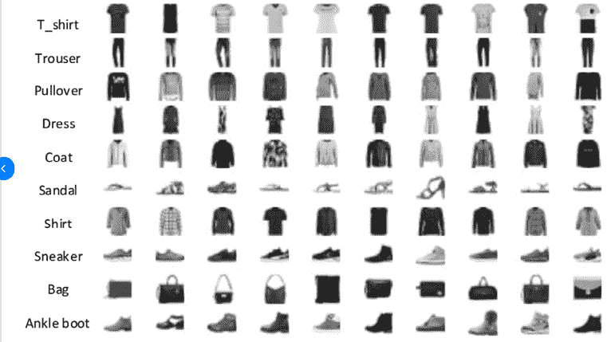

图 14.1：Fashion-MNIST 数据集

# 将问题分解为特征

由于 Fashion-MNIST 数据集的性质，它包含不同类别中时尚物品的灰度图像，我们将首先构建一个基线 MLP 模型。这包括以下高级步骤：

1.  **构建基线模型**：用户将了解使用 ChatGPT 构建用于图像分类的简单 MLP 模型的过程。我们将指导用户加载 Fashion-MNIST 数据集，预处理图像数据，将其分为训练集和测试集，定义模型架构，训练模型，进行预测，并评估其性能。

1.  **向模型添加层**：一旦建立了基线模型，用户将学习如何实验性地向 MLP 架构添加额外的层。我们将探讨增加模型的深度或宽度如何影响其性能和捕捉图像数据中复杂模式的能力。

1.  **实验不同的批量大小**：用户将在模型训练过程中尝试不同的批量大小，以观察其对训练速度、收敛性和泛化性能的影响。我们将探讨批量大小如何影响计算效率和模型稳定性的权衡。

1.  **调整神经元数量**：用户将探索调整 MLP 模型每层的神经元数量对模型的影响。通过增加或减少神经元数量，用户可以观察到模型容量及其从图像数据中学习复杂特征的能力的变化。

1.  **尝试不同的优化器**：最后，用户将尝试不同的优化算法，如 SGD、Adam 和 RMSprop，以优化 MLP 模型的训练过程。我们将观察不同的优化器如何影响训练动态、收敛速度和最终模型性能。

通过遵循这些步骤，用户将全面了解使用 Fashion-MNIST 数据集构建和优化用于图像分类任务的 MLP 模型。他们将学习如何迭代地改进模型架构和训练过程，以实现分类时尚物品的最佳性能和准确性。

# 提示策略

为了利用 ChatGPT 进行机器学习，我们需要清楚地了解如何实现针对代码生成的特定提示策略。

让我们头脑风暴一下，在这个任务中我们想要实现什么，以便更好地理解需要放入提示中的内容。

## 策略 1：任务-行动-指南（TAG）提示策略

**1.1 - 任务**：具体的任务或目标是创建一个用于 Fashion-MNIST 数据集的分类模型。

**1.2 - 行动**：使用 MLP 为 Fashion-MNIST 数据集创建分类模型的关键步骤包括：

+   数据预处理：归一化像素值，将图像展平为向量，并编码分类标签。

+   数据拆分：将数据集划分为训练集、验证集和测试集。

+   模型选择：选择 MLP 作为分类模型。

+   模型训练：在训练数据上训练 MLP。

+   模型评估：使用准确率、精确率、召回率和混淆矩阵等指标来评估模型的表现。

**1.3 - 指南**：在我们的提示中，我们将向 ChatGPT 提供以下指南：

+   代码应与 Jupyter 笔记本兼容。

+   确保对每一行代码都有详细的注释。

+   您必须详细解释代码的每一行，然后将这些代码复制到笔记本的文本块中，在提供代码之前对代码中使用的每种方法进行详细说明。

## 策略 2：角色扮演-指示-背景（PIC）提示策略

**2.1 - 角色扮演**：我们将扮演一个需要学习模型创建不同步骤的初学者角色，因此代码应逐步生成。

**2.2 - 指示**：我们已经指定我们想要生成的代码用于具有单层的 MLP 模型，并指示 ChatGPT 一次提供一步，并等待用户的反馈。

**2.3 - 背景**：在这种情况下，ChatGPT 已经了解 Fashion-MNIST 数据集，因为它广为人知，所以我们不需要提供额外的背景信息。

## 策略 3：学习-即兴发挥-反馈-评估（LIFE）提示策略

**3.1 - 学习**：

+   我们想要了解 MLP 模型及其工作原理。

**3.2 - 即兴发挥**：

+   我们将在添加更多层、更改批量大小或激活函数等时使用这些知识。

**3.3 - 反馈**：

+   分享代码和模型输出以供反馈，以确保有效的学习和理解。

+   结合建议和批评来完善模型和方法**。**

+   提供错误以排除故障和解决问题。

**3.4-评估**:

执行 ChatGPT 提供的代码以确保准确性和有效性。这一点在本章中始终使用。

# 使用 ChatGPT 的免费版本构建 MLP 模型以准确分类 Fashion-MNIST 图像

ChatGPT 的付费版本有一个代码解释器，但它不支持执行代码所需的深度学习库，如 Keras 和 TensorFlow。因此，在本章中，我们将坚持使用 ChatGPT 的免费版本。

## 特征 1：构建基线模型

让我们为基线模型制定初始提示。

[P**rompt**]

我想为 Fashion-MNIST 数据集（TAG 1.1）创建一个简单的分类模型，该模型由单层 MLP 模型（PIC 2.2）组成。它应包括以下步骤（TAG1.2），一次提供一个步骤，并等待用户的反馈（PIC 2.2）。

+   数据预处理：归一化像素值，将图像展平为向量，并编码分类标签。

+   数据拆分：将数据集分为训练集、验证集和测试集。

+   模型选择：选择多层感知器（MLP）作为分类模型。

+   模型训练：在训练数据上训练 MLP。

+   模型评估：使用准确率、精确率、召回率和混淆矩阵等指标来评估模型性能。

我是一个初学者用户（PIC 2.1），所以请提供逐步的代码，并严格遵循以下说明（TAG 1.3）：

代码应与 Jupyter Notebook 兼容。

确保每行代码都有详细的注释。

您必须详细解释代码中的每一行，然后将这些代码复制到笔记本的文本块中，在提供代码之前对每个方法进行详细说明。

[E**nd of prompt**]

您应该收到以下类似的响应，其中 ChatGPT 为我们提供了步骤 1，数据预处理的代码，以及详细的注释和说明。

[P**rompt response**]

当然，让我们从第一步开始：数据预处理。

数据预处理：

+   数据预处理是机器学习中的一个关键步骤，我们通过应用各种转换和归一化技术来准备我们的数据以进行训练。在这个步骤中，我们将归一化像素值，将图像展平为向量，并编码分类标签。

归一化像素值：

+   归一化像素值确保每个像素的值被缩放到 0 到 1 之间。这对于神经网络在训练过程中更快地收敛以及防止任何特定特征主导学习过程非常重要。

展平图像为向量：

+   MLP 模型不能直接处理多维数据，如图像。因此，我们需要将图像展平为 1D 向量，其中每个像素值成为一个特征。

编码分类标签：

+   由于我们的标签是分类的（例如，不同类型的服装项目），我们需要将它们编码为数值，以便我们的模型能够理解和学习。

现在，让我们将这些步骤用代码实现：

```py
import numpy as np
from tensorflow.keras.datasets import fashion_mnist
from sklearn.preprocessing import StandardScaler, LabelEncoder
from sklearn.model_selection import train_test_split
# Step 1: Load Fashion-MNIST dataset
(x_train, y_train), (x_test, y_test) = fashion_mnist.load_data()
# Step 2: Normalize pixel values
def normalize_images(train_data, test_data):
    # Convert to float32 to ensure division results in float
    train_data = train_data.astype('float32')
    test_data = test_data.astype('float32')
    # Normalize pixel values to the range 0-1
    train_data /= 255.0
    test_data /= 255.0
    return train_data, test_data
# Step 3: Flatten images into vectors
def flatten_images(train_data, test_data):
    # Reshape images to vectors
    train_data = train_data.reshape(train_data.shape[0], -1)
    test_data = test_data.reshape(test_data.shape[0], -1)
    return train_data, test_data
# Step 4: Encode categorical labels
def encode_labels(train_labels, test_labels):
    # Initialize LabelEncoder
    label_encoder = LabelEncoder()
    # Fit LabelEncoder on training labels and transform both training and testing labels
    train_labels = label_encoder.fit_transform(train_labels)
    test_labels = label_encoder.transform(test_labels)
    return train_labels, test_labels
# Apply data preprocessing steps
x_train, x_test = normalize_images(x_train, x_test)
x_train, x_test = flatten_images(x_train, x_test)
y_train, y_test = encode_labels(y_train, y_test)
# Print the shapes of preprocessed data
print("x_train shape:", x_train.shape)
print("y_train shape:", y_train.shape)
print("x_test shape:", x_test.shape)
print("y_test shape:", y_test.shape) 
```

说明：

+   我们导入必要的库，如 NumPy 进行数值运算，TensorFlow 用于加载 Fashion-MNIST 数据集，以及 scikit-learn 进行数据预处理。

+   我们使用`fashion_mnist.load_data()`方法加载 Fashion-MNIST 数据集，并将其分为训练集和测试集。

+   定义了三个函数`normalize_images`、`flatten_images`和`encode_labels`来执行每个数据预处理步骤。

在每个函数内部：

+   `normalize_images` 函数通过将像素值除以 255 来将它们缩放到 0 到 1 之间。

+   `flatten_images` 函数将图像重塑为 1D 向量。

+   `encode_labels` 函数使用 `LabelEncoder` 将分类标签转换为数值。

最后，我们将这些预处理步骤应用于训练数据和测试数据，并打印它们的形状以确保一切处理正确。

[E**nd of response**]

我们现在将应用提示评估策略（LIFE 3.4）并通过在 Google Colab 环境中执行每个步骤来验证代码。该代码从 Keras 加载模型，规范化图像，将它们展平为向量，使用 LabelEncoder 编码标签，然后应用预处理并打印形状。代码运行良好，无需任何修改或错误。

请参考 `使用 ChatGPT 在 Fashion-MNIST 数据集上学习 MLP.ipynb` 笔记本中的可执行代码片段，或从提示响应中复制代码。

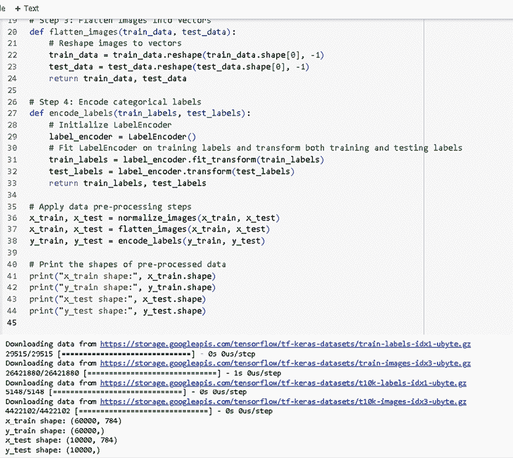

图 14.2：代码执行 – 数据预处理

我们现在将指示 ChatGPT 继续下一步。

[P**rompt**]

让我们继续下一步。

[E**nd of prompt**]

我们应该收到以下响应，其中 ChatGPT 应该提供步骤 2 – 数据分割的代码。

[P**rompt response**]

太好了！让我们继续下一步：

数据分割：

+   在这一步，我们将数据集划分为训练集、验证集和测试集。训练集将用于训练模型，验证集将用于调整超参数以防止过拟合，测试集将用于评估模型在未见数据上的性能。

训练集：

+   训练集用于使用梯度下降等优化算法训练模型的参数（权重和偏差）。

验证集：

+   验证集用于在训练期间评估模型性能并调整学习率、批大小和训练轮数等超参数以优化模型性能。

测试集：

+   测试集用于评估训练模型在未见数据上的最终性能，并评估其泛化能力。

现在，让我们分割数据集：

```py
# Step 5: Split dataset into training, validation, and testing sets
def split_dataset(train_data, train_labels, test_data, test_labels, validation_size=0.1, test_size=0.1, random_state=42):
    # Split training set into training and validation sets
    x_train, x_val, y_train, y_val = train_test_split(train_data, train_labels, test_size=validation_size, random_state=random_state)
    # Split testing set into testing and validation sets
    x_test, x_val, y_test, y_val = train_test_split(test_data, test_labels, test_size=test_size, random_state=random_state)
    return x_train, y_train, x_val, y_val, x_test, y_test
# Apply data splitting
x_train, y_train, x_val, y_val, x_test, y_test = split_dataset(x_train, y_train, x_test, y_test)
# Print the shapes of split datasets
print("Training set:")
print("x_train shape:", x_train.shape)
print("y_train shape:", y_train.shape)
print("\nValidation set:")
print("x_val shape:", x_val.shape)
print("y_val shape:", y_val.shape)
print("\nTesting set:")
print("x_test shape:", x_test.shape)
print("y_test shape:", y_test.shape) 
```

说明：

+   我们定义了一个 `split_dataset` 函数，使用 scikit-learn 的 `train_test_split` 函数将数据集分割为训练集、验证集和测试集。

+   该函数接受训练数据、训练标签、测试数据、测试标签以及可选参数，如验证集大小、测试集大小和随机状态。

+   我们使用指定的验证集大小将训练集分为训练集和验证集。

+   然后，我们使用指定的测试集大小将测试集分割为测试集和验证集。

+   最后，我们打印分割数据集的形状以验证分割。

[E**nd of response**]

我们在笔记本中执行代码，它成功运行。数据被分成训练集、验证集和测试集，大小如指定。

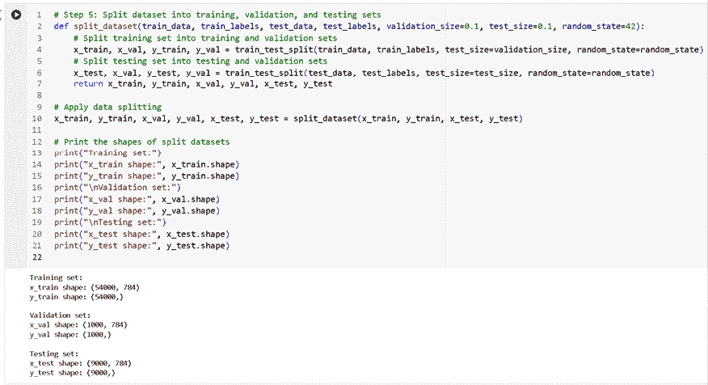

图 14.3：代码执行 – 数据拆分

我们现在将指示 ChatGPT 进行下一步。

[提示]

让我们进行下一步，并定义一个单层基线 MLP 模型。

[提示结束]

我们应该收到以下类似的响应，其中 ChatGPT 应提供具有输入层、一个隐藏层和一个输出层的单层 MLP 模型的代码。

[提示响应]

当然，让我们继续下一步：

模型选择：

+   在这一步，我们将选择多层感知器（MLP）作为分类模型。MLP 由一个或多个层组成，每层中的神经元都与下一层完全连接。为了简单起见，我们将从一个单层 MLP 作为基线模型开始。

单层 MLP：

+   单层 MLP 由一个输入层、一个隐藏层和一个输出层组成。然而，由于它只有一个隐藏层，它通常被称为单层感知器。隐藏层中的每个神经元都从输入层中的所有神经元接收输入，并产生一个输出，然后通过激活函数传递以引入非线性。最后，输出层产生最终的预测。

现在，让我们定义基线单层 MLP 模型：

```py
from tensorflow.keras.models import Sequential
from tensorflow.keras.layers import Dense
# Step 6: Define a single-layer MLP model
def create_single_layer_mlp(input_shape, num_classes):
    model = Sequential()
    # Add a single hidden layer with ReLU activation
    model.add(Dense(128, activation='relu', input_shape=input_shape))
    # Add output layer with softmax activation for multi-class classification
    model.add(Dense(num_classes, activation='softmax'))
    return model
# Define input shape and number of classes
input_shape = x_train.shape[1:]
num_classes = len(np.unique(y_train))
# Create the single-layer MLP model
model = create_single_layer_mlp(input_shape, num_classes)
# Print model summary
model.summary() 
```

说明：

+   我们从`TensorFlow.keras`导入必要的模块来定义 MLP 模型。

+   我们定义一个函数`create_single_layer_mlp`来创建一个单层 MLP 模型。

+   在函数内部：

    +   我们初始化一个序列模型。

    +   我们添加一个具有 128 个神经元和 ReLU 激活函数的单个隐藏层。

    +   我们添加一个具有 softmax 激活函数的输出层，用于多类分类。

    +   我们根据训练数据的形状和输出类的数量指定输入形状。

    +   我们使用定义的函数创建单层 MLP 模型。

+   最后，我们打印出模型架构的摘要。

[响应结束]

我们执行代码，它运行无误，并打印出模型摘要，包括层类型、输出形状和参数数量。它还提供了总参数数、可训练参数和非可训练参数。在我们的情况下，所有参数都是可训练参数。

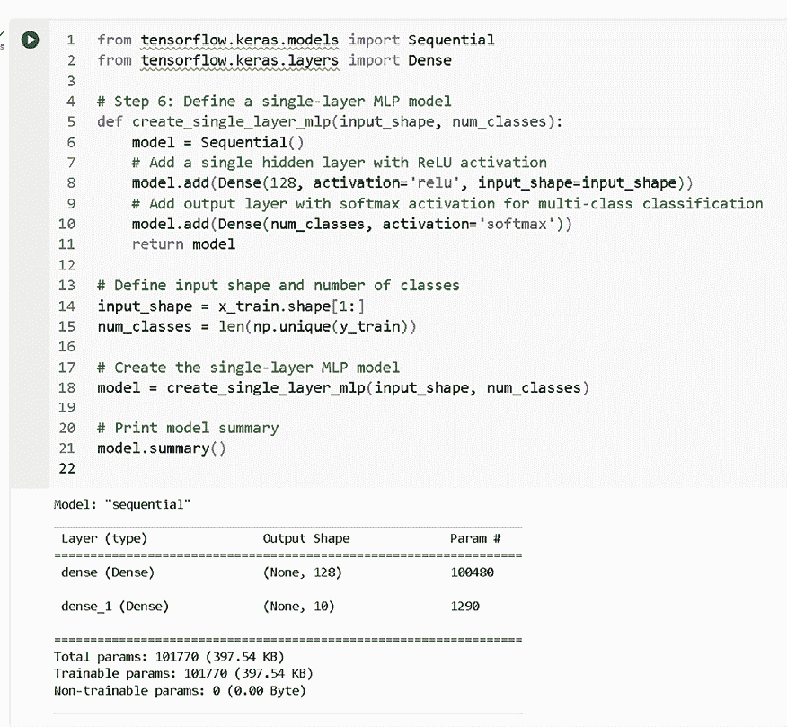

图 14.4：代码执行 – 基线模型架构

我们将指示 ChatGPT 进行下一步以进行模型训练。

[提示]

让我们进行下一步。

[提示结束]

我们应该收到以下类似的响应，其中 ChatGPT 应提供模型训练的代码，并解释涉及的关键概念，例如损失函数和优化算法，以及注释。

[提示响应]

当然，让我们继续下一步：

模型训练：

+   在这一步，我们将训练数据用于训练 MLP 模型。训练包括将训练数据输入模型，使用诸如随机梯度下降之类的优化算法调整其参数（权重和偏置），并最小化损失函数以使预测尽可能接近实际标签。

损失函数：

+   损失函数衡量预测标签与实际标签之间的差异。对于像 Fashion-MNIST 这样的多分类问题，我们通常使用交叉熵作为损失函数。

优化算法：

+   优化算法负责在训练过程中更新模型的参数以最小化损失函数。我们将使用 Adam 优化器，它是随机梯度下降的扩展，在深度学习中广泛使用。

训练参数：

+   我们将指定训练参数，如批量大小和训练轮数。批量大小决定了在更新模型参数之前处理的样本数量，而训练轮数指定了整个训练数据集通过模型前向和反向传递的次数。

现在，让我们训练模型：

```py
from tensorflow.keras.utils import to_categorical
# Step 7: Model Training
def train_model(model, x_train, y_train, x_val, y_val, batch_size=32, epochs=10):
    # Convert class vectors to binary class matrices (one-hot encoding)
    y_train = to_categorical(y_train)
    y_val = to_categorical(y_val)
    # Compile the model with categorical cross-entropy loss and Adam optimizer
    model.compile(loss='categorical_crossentropy', optimizer='adam', metrics=['accuracy'])
    # Train the model on the training data
    history = model.fit(x_train, y_train, batch_size=batch_size, epochs=epochs, validation_data=(x_val, y_val))
    return history
# Train the model
history = train_model(model, x_train, y_train, x_val, y_val, batch_size=32, epochs=10) 
```

说明：

+   我们从`TensorFlow.keras`导入必要的模块来编译和训练模型。

+   我们定义了一个`train_model`函数，用于在训练数据上训练模型。

+   函数内部：

    +   我们使用一维编码将类别标签转换为二进制类别矩阵。

    +   我们使用交叉熵损失函数和 Adam 优化器编译模型。

    +   我们使用指定的批量大小和训练轮数在训练数据上训练模型。

+   最后，我们使用定义的函数训练模型，并将训练历史存储以供可视化和分析。

[响应结束]**

我们执行代码，它运行没有任何错误。它对类别标签应用了一维编码，使模型符合交叉熵损失函数和 Adam 优化器，并使用批量大小 32 和 10 个训练轮数训练模型。这实现了大约 88%的验证准确率。

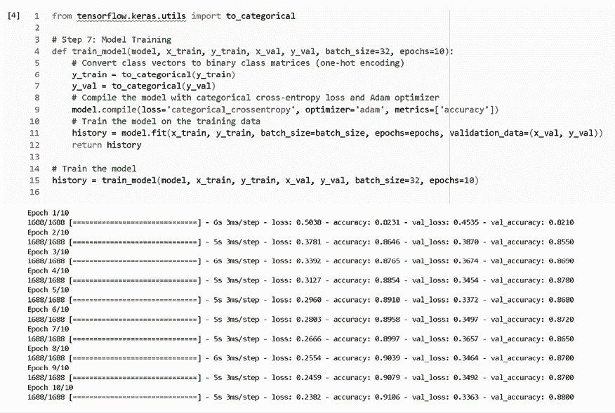

图 14.5：代码执行 – 模型训练

我们现在将指示 ChatGPT 进行模型评估的下一步。

[提示]**

让我们继续下一步。

[提示结束]**

我们应该收到以下类似的响应，其中 ChatGPT 应提供评估测试集的代码，并解释准确率、精确率、召回率和混淆矩阵等概念。

[提示响应]**

模型评估：

+   在这一步，我们将使用各种指标来评估训练的 MLP 模型在测试数据上的性能。分类任务中常用的指标包括准确率、精确率、召回率和混淆矩阵。

准确率：

+   准确率衡量的是在总实例中正确分类的实例比例。

精确率：

+   精确率衡量的是所有正例中正确预测正例的比例。它表明模型避免假正例的能力。

召回率：

+   回忆度衡量的是所有实际正例中正确预测正例的比例。它表明模型识别所有正例的能力。

混淆矩阵：

+   混淆矩阵通过显示正确预测、正确否定、错误预测和错误否定的预测数量，总结了模型的表现。

现在，让我们评估模型：

```py
import matplotlib.pyplot as plt
from sklearn.metrics import accuracy_score, precision_score, recall_score, confusion_matrix
# Step 8: Model Evaluation
def evaluate_model(model, x_test, y_test):
    # Predict labels for testing data
    y_pred = model.predict(x_test)
    # Convert predicted labels to class labels
    y_pred_classes = np.argmax(y_pred, axis=1)
    # Convert true labels to class labels
    y_true_classes = np.argmax(y_test, axis=1)
    # Calculate accuracy
    accuracy = accuracy_score(y_true_classes, y_pred_classes)
    # Calculate precision
    precision = precision_score(y_true_classes, y_pred_classes, average='weighted')
    # Calculate recall
    recall = recall_score(y_true_classes, y_pred_classes, average='weighted')
    # Calculate confusion matrix
    cm = confusion_matrix(y_true_classes, y_pred_classes)
    return accuracy, precision, recall, cm
# Evaluate the model
accuracy, precision, recall, cm = evaluate_model(model, x_test, y_test)
# Print evaluation metrics
print("Accuracy:", accuracy)
print("Precision:", precision)
print("Recall:", recall)
print("Confusion Matrix:\n", cm)
# Visualize confusion matrix
plt.imshow(cm, cmap=plt.cm.Blues)
plt.title('Confusion Matrix')
plt.colorbar()
plt.xlabel('Predicted Labels')
plt.ylabel('True Labels')
plt.show() 
```

说明：

+   我们从`matplotlib.pyplot`和 scikit-learn 导入必要的模块，以可视化混淆矩阵并计算评估指标。

+   我们定义了一个`evaluate_model`函数来评估模型在测试数据上的性能。

+   在函数内部：

    +   我们使用训练好的模型在测试数据上进行预测。

    +   我们将预测标签和真实标签转换为类别标签。

    +   我们使用 scikit-learn 的指标函数计算准确率、精确率、召回率和混淆矩阵。

+   最后，我们使用定义的函数评估模型，打印评估指标，并可视化混淆矩阵。

[**响应结束**]**

我们执行代码并注意到它由于测试标签未编码而出现错误，但这一点从错误本身并不明显。我们可以通过向 ChatGPT 提供错误信息来应用提示策略以获得帮助解决错误。

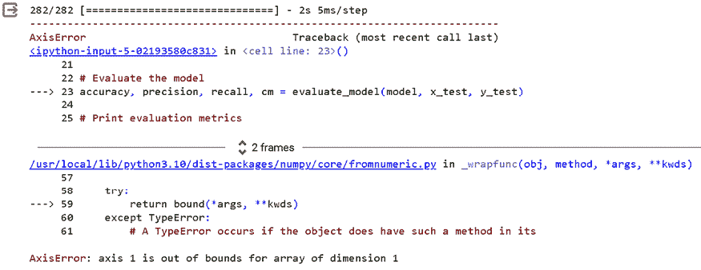

图 14.6：代码执行 – 模型评估错误

我们向 ChatGPT 提供了错误信息以获得帮助。

[**快速**]

看起来测试标签存在问题。我们收到了以下错误：

```py
------282/282 [==============================] - 2s 5ms/step --------------------------------------------------------------------------- AxisError Traceback (most recent call last) <ipython-input-5-02193580c831> in <cell line: 23>() 21 22 # Evaluate the model ---> 23 accuracy, precision, recall, cm = evaluate_model(model, x_test, y_test) 24 25 # Print evaluation metrics 2 frames /usr/local/lib/python3.10/dist-packages/numpy/core/fromnumeric.py in _wrapfunc(obj, method, *args, **kwds) 57 58 try: ---> 59 return bound(*args, **kwds) 60 except TypeError: 61 # A TypeError occurs if the object does have such a method in its AxisError: axis 1 is out of bounds for array of dimension 1 
```

[**提示结束**]**

我们应该收到以下类似的响应，其中 ChatGPT 应提供故障排除建议。

[**快速响应**]

看起来标签的形状存在问题。错误表明 argmax 函数指定的轴超出了范围。这通常发生在标签不是预期的格式或形状时。

让我们再次检查标签的形状，确保它们以正确的格式进行评估：

```py
print("Shape of y_test:", y_test.shape) 
```

这将帮助我们了解标签的形状并识别任何差异。一旦我们识别出问题，我们就可以相应地纠正它。

[**响应结束**]**

我们打印`y_test`的形状：

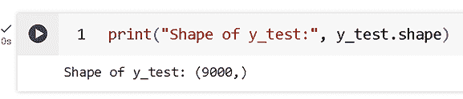

图 14.7：代码执行 - 测试标签的形状

我们现在将向 ChatGPT 提供代码的输出。

[**快速**]

```py
Shape of y_test: (9000,) 
```

[**提示结束**]**

我们应该收到以下类似的响应，其中 ChatGPT 应理解问题并为我们提供修正后的代码。

[**快速响应**]

感谢您提供`y_test`的形状。看起来标签是 1D 格式，这意味着它们不是 one-hot 编码的。在评估函数中，我们假设标签是 one-hot 编码的，这导致了错误。

要解决这个问题，我们需要修改评估函数以处理 1D 标签而不是 one-hot 编码的标签。我们可以通过移除标签到 one-hot 编码的转换，直接比较预测标签和真实标签来实现这一点。

让我们相应地更新评估函数：

```py
# Step 8: Model Evaluation
def evaluate_model(model, x_test, y_test):
    # Predict labels for testing data
    y_pred = model.predict(x_test)
    # Convert predicted labels to class labels
    y_pred_classes = np.argmax(y_pred, axis=1)
    # Calculate accuracy
    accuracy = accuracy_score(y_test, y_pred_classes)
    # Calculate precision
    precision = precision_score(y_test, y_pred_classes, average='weighted')
    # Calculate recall
    recall = recall_score(y_test, y_pred_classes, average='weighted')
    # Calculate confusion matrix
    cm = confusion_matrix(y_test, y_pred_classes)
    return accuracy, precision, recall, cm
# Evaluate the model
accuracy, precision, recall, cm = evaluate_model(model, x_test, y_test)
# Print evaluation metrics
print("Accuracy:", accuracy)
print("Precision:", precision)
print("Recall:", recall)
print("Confusion Matrix:\n", cm)
# Visualize confusion matrix
plt.imshow(cm, cmap=plt.cm.Blues)
plt.title('Confusion Matrix')
plt.colorbar()
plt.xlabel('Predicted Labels')
plt.ylabel('True Labels')
plt.show() 
```

说明：

我们移除了标签到 one-hot 编码的转换，并在评估函数中直接使用了`y_test`真实标签。

我们更新了准确率、精确率和召回率计算函数，以使用 1D 标签而不是 one-hot 编码的标签。

现在，评估函数应该能够正确地使用提供的 1D 标签，并且评估指标应该被准确计算。

[E**nd of response**]

我们将执行代码，现在它运行正常，因为提供的代码已被修改以使用 1D 标签。它还打印了混淆矩阵。

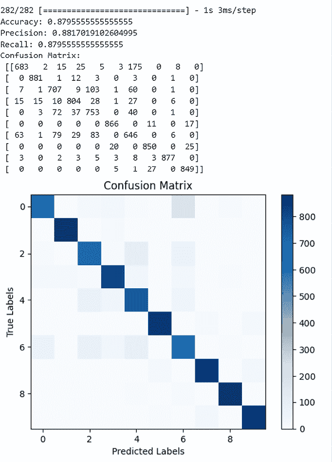

图 14.8：代码执行 – 混淆矩阵

这完成了功能 1。我们使用单层 MLP 模型实现了 0.8796（87.96%）的准确率、0.8817（88.17%）的精确率和 0.8796（87.96%）的召回率。接下来，我们将转向第二个功能，向模型添加更多层。我们还将学习 ChatGPT 如何帮助我们。

## 功能 2：向模型添加层

现在我们有了基线模型架构，让我们尝试向其中添加层。我们将应用提示策略来改进模型，并要求 ChatGPT 提供其代码。

[P**rompt**]

现在我们有一个单层的基线模型，您能提供具有两个层和三个层的代码，并计算和比较由于添加层而导致的模型性能吗？

[E**nd of prompt**]

我们应该收到以下响应，其中 ChatGPT 理解请求并提供两个层和三个层模型的代码以及比较结果。

[P**rompt response**]

当然！让我们定义并训练具有两个和三个层的多层感知器（MLP）模型，然后比较它们与基线单层模型的性能。

定义具有两个和三个层的 MLP 模型：

+   我们将定义具有额外隐藏层的 MLP 模型，以查看性能如何随着层数的增加而变化。

两层 MLP：

+   两层 MLP 将包括输入层、两个隐藏层和输出层。

三层 MLP：

+   三层 MLP 将包括输入层、三个隐藏层和输出层。

现在，让我们定义并训练这些模型：

```py
# Define a two-layer MLP model
def create_two_layer_mlp(input_shape, num_classes):
    model = Sequential()
    # Add first hidden layer with ReLU activation
    model.add(Dense(128, activation='relu', input_shape=input_shape))
    # Add second hidden layer with ReLU activation
    model.add(Dense(64, activation='relu'))
    # Add output layer with softmax activation for multi-class classification
    model.add(Dense(num_classes, activation='softmax'))
    return model
# Define a three-layer MLP model
def create_three_layer_mlp(input_shape, num_classes):
    model = Sequential()
    # Add first hidden layer with ReLU activation
    model.add(Dense(128, activation='relu', input_shape=input_shape))
    # Add second hidden layer with ReLU activation
    model.add(Dense(64, activation='relu'))
    # Add third hidden layer with ReLU activation
    model.add(Dense(32, activation='relu'))
    # Add output layer with softmax activation for multi-class classification
    model.add(Dense(num_classes, activation='softmax'))
    return model
# Create two-layer MLP model
two_layer_model = create_two_layer_mlp(input_shape, num_classes)
# Create three-layer MLP model
three_layer_model = create_three_layer_mlp(input_shape, num_classes)
# Train two-layer MLP model
two_layer_history = train_model(two_layer_model, x_train, y_train, x_val, y_val)
# Train three-layer MLP model
three_layer_history = train_model(three_layer_model, x_train, y_train, x_val, y_val) 
```

模型比较：

一旦模型被训练，我们可以根据评估指标（如准确率、精确率、召回率和混淆矩阵）比较它们的性能。

```py
# Evaluate two-layer MLP model
two_layer_accuracy, _, _, _ = evaluate_model(two_layer_model, x_test, y_test)
# Evaluate three-layer MLP model
three_layer_accuracy, _, _, _ = evaluate_model(three_layer_model, x_test, y_test)
# Print model comparison
print("Single-layer MLP Accuracy:", accuracy)
print("Two-layer MLP Accuracy:", two_layer_accuracy)
print("Three-layer MLP Accuracy:", three_layer_accuracy) 
```

说明：

+   我们使用之前定义的函数定义了两个额外的具有两个和三个隐藏层的 MLP 模型。

+   我们使用训练数据和验证数据训练两个模型。

+   训练后，我们使用测试数据评估每个模型的表现，并比较它们的准确率。

比较有助于我们了解添加层如何影响模型的表现。

[响应结束]**

我们将执行定义具有两个和三个隐藏层的两个额外模型的代码。它还训练模型，评估这两个模型的表现，并打印结果。

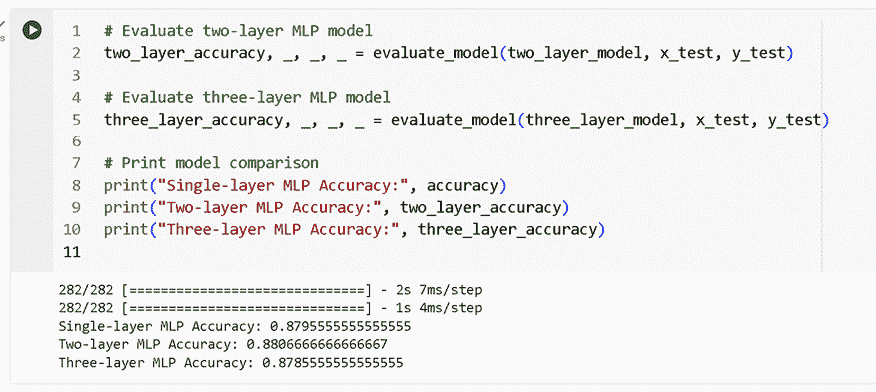

图 14.9：特性 2 – 向模型添加层

根据这些结果，我们可以观察到，与单层和三层 MLP 模型相比，两层 MLP 模型实现了略高的准确率。然而，准确率之间的差异相对较小，这表明在这种情况下，添加层并没有显著提高模型的表现。让我们继续到下一个特性，并使用基线模型实验批量大小。

## 特性 3：实验批量大小

我们现在已经学会了如何添加更多层，在我们的案例中，由于数据集简单，影响不大。我们现在将尝试不同的批量大小。我们将应用提示策略来改进模型，并要求 ChatGPT 为我们提供相应的代码。

[提示]**

请提供具有三个批量大小组合的代码，并比较基线单层模型在这些组合中的性能？

[提示结束]**

我们应该收到以下类似的响应，其中 ChatGPT 理解请求，并为我们提供不同批量大小的代码以及比较结果。

[提示响应]**

定义和训练具有不同批量大小的模型：

+   我们将定义并训练具有三个不同批量大小组合的基线单层 MLP 模型。

+   组合 1：`批量大小 = 32`

+   组合 2：`批量大小 = 64`

+   组合 3：`批量大小 = 128`

现在，让我们定义和训练这些模型：

```py
# Define and train model with batch size = 32
model_batch_32 = create_single_layer_mlp(input_shape, num_classes)
history_batch_32 = train_model(model_batch_32, x_train, y_train, x_val, y_val, batch_size=32)
# Define and train model with batch size = 64
model_batch_64 = create_single_layer_mlp(input_shape, num_classes)
history_batch_64 = train_model(model_batch_64, x_train, y_train, x_val, y_val, batch_size=64)
# Define and train model with batch size = 128
model_batch_128 = create_single_layer_mlp(input_shape, num_classes)
history_batch_128 = train_model(model_batch_128, x_train, y_train, x_val, y_val, batch_size=128) 
```

模型比较：

一旦模型被训练，我们可以根据评估指标如准确率来比较它们的性能。

```py
# Evaluate models with different batch sizes
accuracy_batch_32, _, _, _ = evaluate_model(model_batch_32, x_test, y_test)
accuracy_batch_64, _, _, _ = evaluate_model(model_batch_64, x_test, y_test)
accuracy_batch_128, _, _, _ = evaluate_model(model_batch_128, x_test, y_test)
# Print model comparison
print("Single-layer MLP Accuracy (Batch Size = 32):", accuracy_batch_32)
print("Single-layer MLP Accuracy (Batch Size = 64):", accuracy_batch_64)
print("Single-layer MLP Accuracy (Batch Size = 128):", accuracy_batch_128) 
```

说明：

+   我们定义并训练了三个具有不同批量大小组合（32、64 和 128）的基线单层 MLP 模型。

+   训练后，我们使用测试数据评估每个模型的表现，并比较它们的准确率。

比较有助于我们了解不同的批量大小如何影响模型的表现。

[响应结束]**

我们将执行定义具有批量大小 32、64 和 128 的模型的代码。它还训练模型，评估其性能，并打印性能比较的结果。

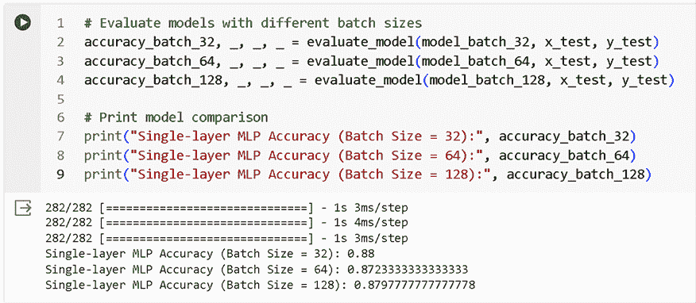

图 14.10：代码执行 – 批量大小比较

我们可以看到模型之间的准确率没有太大差异，因此我们将应用“学习提示策略”（LIFE 3.1）并询问 ChatGPT 可能的原因，为什么这可能会发生。

[提示]**

```py
282/282 [==============================] - 1s 3ms/step 282/282 [==============================] - 1s 4ms/step 282/282 [==============================] - 1s 3ms/step 
Single-layer MLP Accuracy (Batch Size = 32): 0.88 
Single-layer MLP Accuracy (Batch Size = 64): 0.8723333333333333 
Single-layer MLP Accuracy (Batch Size = 128): 0.8797777777777778 
```

为什么准确率之间没有太大差异？

[提示结束]**

我们应该收到以下这样的响应，其中 ChatGPT 解释可能的原因。

[响应提示]**

使用不同批量大小训练的模型之间的准确率差异相对较小。这可能有几个原因：

+   **数据集大小**：与深度学习中常用的其他数据集相比，Fashion-MNIST 数据集相对较小。在较小的数据集上，批量大小对模型性能的影响可能不那么明显。

+   **模型复杂度**：基准单层 MLP 模型可能不足以充分利用不同批量大小的优势。在更复杂的模型中，如多层深度神经网络，批量大小对训练动态的影响可能更为显著。

+   **优化算法**：在训练模型时使用的 Adam 优化器根据梯度的第一和第二矩来调整每个参数的学习率。这种自适应学习率可以在一定程度上减轻批量大小的影响。

+   **收敛**：无论使用什么批量大小，模型可能已经收敛到相似的性能水平。一旦模型收敛，使用不同批量大小进行进一步训练可能不会在准确率上带来实质性的改进。

总体而言，虽然批量大小可以影响训练动态和收敛速度，但在某些情况下，其对模型性能的影响可能不那么明显，尤其是在相对简单的模型和数据集上。尝试更大和更复杂的模型以及不同的优化算法，可能会根据批量大小揭示更显著的性能差异。

[响应结束]**

现在我们已经学会了如何更改批量大小以及为什么它对我们的模型影响不大，让我们继续到下一个特性，并尝试基准模型隐藏层中神经元数量的变化。

## 特性 4：实验神经元数量

我们将应用提示策略来改进模型，并要求 ChatGPT 提供实验不同隐藏层神经元数量的代码。

[提示]**

请提供包含三个神经元数量组合的代码，并比较各种组合的基准单层模型性能？

[提示结束]**

我们应该收到以下这样的响应，其中 ChatGPT 理解请求并提供不同隐藏层神经元数量的代码，以及比较结果。

[响应提示]**

当然！让我们定义并训练基线单层 MLP 模型，使用隐藏层中神经元数量的三种不同组合，然后比较它们的性能。

定义并训练具有不同神经元数量的模型：

+   我们将定义并训练基线单层 MLP 模型，使用隐藏层中神经元数量的三种不同组合：

    +   组合 1: `神经元数量 = 64`

    +   组合 2: `神经元数量 = 128`

    +   组合 3: `神经元数量 = 256`

现在，让我们定义并训练这些模型：

```py
# Define and train model with 64 neurons in the hidden layer
model_neurons_64 = create_single_layer_mlp(input_shape, num_classes)
history_neurons_64 = train_model(model_neurons_64, x_train, y_train, x_val, y_val)
# Define and train model with 128 neurons in the hidden layer
model_neurons_128 = create_single_layer_mlp(input_shape, num_classes)
history_neurons_128 = train_model(model_neurons_128, x_train, y_train, x_val, y_val)
# Define and train model with 256 neurons in the hidden layer
model_neurons_256 = create_single_layer_mlp(input_shape, num_classes)
history_neurons_256 = train_model(model_neurons_256, x_train, y_train, x_val, y_val) 
```

模型比较：

一旦模型训练完成，我们可以根据评估指标（如准确率）比较它们的性能。

```py
# Evaluate models with different number of neurons
accuracy_neurons_64, _, _, _ = evaluate_model(model_neurons_64, x_test, y_test)
accuracy_neurons_128, _, _, _ = evaluate_model(model_neurons_128, x_test, y_test)
accuracy_neurons_256, _, _, _ = evaluate_model(model_neurons_256, x_test, y_test)
# Print model comparison
print("Single-layer MLP Accuracy (Neurons = 64):", accuracy_neurons_64)
print("Single-layer MLP Accuracy (Neurons = 128):", accuracy_neurons_128)
print("Single-layer MLP Accuracy (Neurons = 256):", accuracy_neurons_256) 
```

说明：

+   我们定义并训练了三个基线单层 MLP 模型，它们在隐藏层中神经元数量的组合不同（64、128 和 256）。

+   训练完成后，我们使用测试数据评估每个模型的性能，并比较它们的准确率。

比较有助于我们了解隐藏层中不同数量的神经元如何影响模型性能。

[响应结束**]

我们将执行定义具有 64、128 和 256 个神经元的模型的代码。它还训练模型，评估所有模型变体的性能，并打印性能比较的结果。

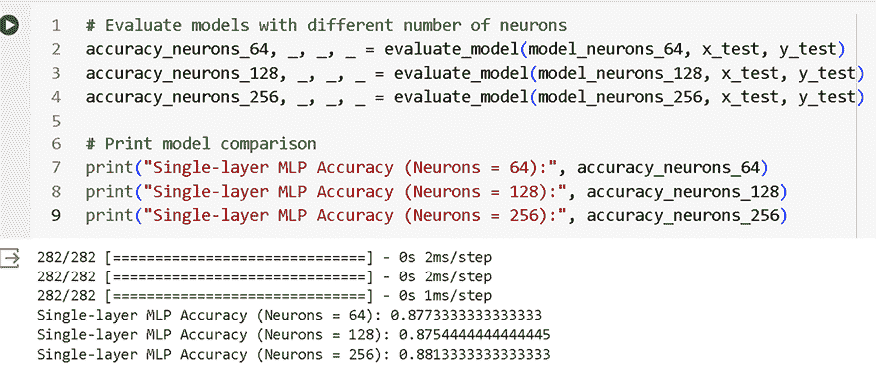

图 14.11：代码执行 – 神经元比较

我们可以看到差异不大，因此让我们转向我们的最终功能，即尝试不同的优化器。

## 功能 5：尝试不同的优化器

我们将应用提示策略来改进模型，并要求 ChatGPT 提供用于实验不同优化器（如 SGD、Adam 和 RMSProp）的代码。作为我们的提示策略的一部分，我们将具体明确地提到优化器应在编译时传递，并且标签应进行 one-hot 编码，因为这些步骤通常被 ChatGPT 忽略。

[提示**]

请您提供具有不同优化器（SGD、Adam 和 RMSprop）的代码，并比较基线单层模型在不同组合下的性能。优化器应在编译时传递，并且您应确保标签进行 one-hot 编码。

[提示结束**]

我们应该收到以下类似的响应，其中 ChatGPT 理解请求并提供不同优化器（如 SGD、Adam 和 RMSProp）的代码以及比较结果。

[提示响应**]

当然！让我们定义并训练一个基线单层 MLP 模型，使用三种不同的优化器（SGD、Adam 和 RMSprop），然后比较它们的性能。

定义并训练具有不同优化器的模型：

我们将定义并训练基线单层 MLP 模型，使用三种不同的优化器：SGD、Adam 和 RMSprop。

现在，让我们定义并训练这些模型：

```py
from tensorflow.keras.optimizers import SGD, Adam, RMSprop
# Define and train model with SGD optimizer
def train_model_sgd(model, x_train, y_train, x_val, y_val, batch_size=32, epochs=10):
    # One-hot encode the class labels
    y_train_encoded = to_categorical(y_train)
    y_val_encoded = to_categorical(y_val)
    # Compile the model with SGD optimizer
    model.compile(loss='categorical_crossentropy', optimizer=SGD(), metrics=['accuracy'])
    # Train the model on the training data
    history = model.fit(x_train, y_train_encoded, batch_size=batch_size, epochs=epochs, validation_data=(x_val, y_val_encoded))
    return history
# Define and train model with Adam optimizer
def train_model_adam(model, x_train, y_train, x_val, y_val, batch_size=32, epochs=10):
    # One-hot encode the class labels
    y_train_encoded = to_categorical(y_train)
    y_val_encoded = to_categorical(y_val)
    # Compile the model with Adam optimizer
    model.compile(loss='categorical_crossentropy', optimizer=Adam(), metrics=['accuracy'])
    # Train the model on the training data
    history = model.fit(x_train, y_train_encoded, batch_size=batch_size, epochs=epochs, validation_data=(x_val, y_val_encoded))
    return history
# Define and train model with RMSprop optimizer
def train_model_rmsprop(model, x_train, y_train, x_val, y_val, batch_size=32, epochs=10):
    # One-hot encode the class labels
    y_train_encoded = to_categorical(y_train)
    y_val_encoded = to_categorical(y_val)
    # Compile the model with RMSprop optimizer
    model.compile(loss='categorical_crossentropy', optimizer=RMSprop(), metrics=['accuracy'])
    # Train the model on the training data
    history = model.fit(x_train, y_train_encoded, batch_size=batch_size, epochs=epochs, validation_data=(x_val, y_val_encoded))
    return history
# Train model with SGD optimizer
model_sgd = create_single_layer_mlp(input_shape, num_classes)
history_sgd = train_model_sgd(model_sgd, x_train, y_train, x_val, y_val)
# Train model with Adam optimizer
model_adam = create_single_layer_mlp(input_shape, num_classes)
history_adam = train_model_adam(model_adam, x_train, y_train, x_val, y_val)
# Train model with RMSprop optimizer
model_rmsprop = create_single_layer_mlp(input_shape, num_classes)
history_rmsprop = train_model_rmsprop(model_rmsprop, x_train, y_train, x_val, y_val) 
```

模型比较：

一旦模型训练完成，我们可以根据评估指标（如准确率）比较它们的性能。

```py
# Evaluate models with different optimizers
accuracy_sgd, _, _, _ = evaluate_model(model_sgd, x_test, y_test)
accuracy_adam, _, _, _ = evaluate_model(model_adam, x_test, y_test)
accuracy_rmsprop, _, _, _ = evaluate_model(model_rmsprop, x_test, y_test)
# Print model comparison
print("Single-layer MLP Accuracy (SGD):", accuracy_sgd)
print("Single-layer MLP Accuracy (Adam):", accuracy_adam)
print("Single-layer MLP Accuracy (RMSprop):", accuracy_rmsprop) 
```

说明：

+   我们定义并训练了三个具有不同优化器（SGD、Adam 和 RMSprop）的基线单层 MLP 模型。

+   训练后，我们使用测试数据评估每个模型的性能，并比较它们的准确率。

比较有助于我们了解不同的优化器如何影响模型的表现。

**[结束回复]**

我们执行定义具有不同优化器的模型的代码。它还训练模型，评估所有模型变体的性能，并打印出比较它们性能的结果。

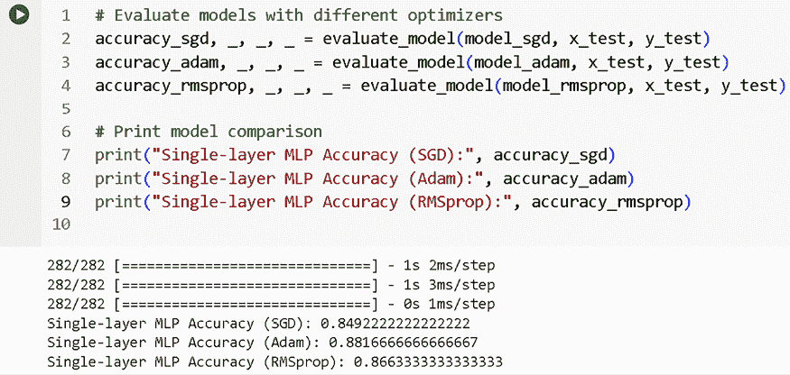

图 14.12：代码执行 – 不同优化器

根据这些结果，我们可以观察到 Adam 优化器实现了最高的准确率，其次是 RMSprop 和 SGD。这表明 Adam 在优化模型参数和改进测试数据上的性能方面表现更好。

# 作业

比较单层与两层隐藏层的模型性能，但使用 20 和 50 个周期。

# 挑战

在 ChatGPT 的帮助下，通过添加 dropout 层改进模型，并分析其对模型性能的影响。请随意向模型添加更多隐藏层。

# 摘要

本章中使用的提示策略提供了一种结构化的学习方法，用于使用 MLP 构建分类模型，其中 ChatGPT 协助生成代码。用户使用 Colab 笔记本验证代码，并向 ChatGPT 提供反馈。通过积极参与材料，你尝试了不同的技术，并迭代地完善了对使用 MLP 创建分类模型的理解，最终达到了更全面的理解。

在下一章中，我们将学习如何在 CIFAR-10 数据集的帮助下，使用 ChatGPT 生成用于 **卷积神经网络**（**CNNs**）的代码。

# 加入我们的 Discord 社区

加入我们的 Discord 社区空间，与作者和其他读者进行讨论：

[`packt.link/aicode`](https://packt.link/aicode)


