# 15

# 使用 ChatGPT 构建 CIFAR-10 的 CNN 模型

# 引言

在我们上一章中通过 Fashion-MNIST 数据集深入探讨了多层感知器（**Multi-Layer Perceptron**，**MLP**）之后，我们现在转向一个更复杂和视觉上更复杂的挑战。本章标志着我们从主要基于表格、灰度世界的 Fashion-MNIST 转向色彩丰富和多样化的 CIFAR-10 数据集。在这里，我们将重点提升到 **卷积神经网络**（**Convolutional Neural Networks**，**CNNs**），这是一类正在改变我们处理图像分类任务方式的深度神经网络。

我们在 MLP 章节中的旅程为我们理解神经网络的基本原理及其在分类简单灰度图像中的应用奠定了坚实的基础。现在，我们进入了一个更高级的领域，在这里 CNNs 占据主导地位。CIFAR-10 数据集包含 10 个不同类别中 32x32 彩色图像的阵列，为 MLPs 提供了一系列独特的挑战，MLPs 并不适合解决这些问题。这就是 CNNs 发挥作用的地方，它们能够捕捉图像中的空间和纹理模式。

随着我们从多层感知器（MLPs）过渡到 CNNs，我们将所获得的见解和知识应用于更复杂的数据集，这些数据集更接近现实世界场景。CIFAR-10 数据集不仅测试了图像分类模型的极限，而且为我们探索 CNNs 的高级功能提供了一个极好的平台。

本章旨在基于我们对神经网络的知识，并引导你了解卷积神经网络（CNNs）的细微差别。我们将深入探讨为什么 CNNs 是图像数据的优选选择，它们在处理颜色和纹理方面与 MLPs 的不同之处，以及是什么使得它们在从 CIFAR-10 数据集中对图像进行分类时如此有效。准备好开始一段旅程，带你从基础到 CNNs 更为复杂方面的深入探索。

# 商业问题

CIFAR-10 数据集为寻求增强各种对象图像识别能力并基于视觉数据优化决策过程的公司提出了一个商业挑战。众多行业，如电子商务、自动驾驶和监控，都可以从准确的对象分类和检测中受益。通过利用机器学习算法，企业旨在提高效率、提升用户体验并简化运营流程。

# 问题与数据领域

在这个背景下，我们将利用卷积神经网络（CNNs）来处理使用 CIFAR-10 数据集的对象识别任务。由于 CNNs 能够从原始像素数据中自动学习层次化特征，它们在处理与图像相关的问题上特别有效。通过在 CIFAR-10 数据集上训练 CNN 模型，我们的目标是开发一个能够准确地将对象分类到十个预定义类别之一的鲁棒系统。该模型可以应用于多个领域，例如基于图像的搜索引擎、自动监控系统以及制造业的质量控制。

## 数据集概述

CIFAR-10 数据集包含 60,000 张彩色图像，分为 10 个类别，每个类别有 6,000 张图像。每张图像的尺寸为 32x32 像素，并以 RGB 格式表示。数据集分为包含 50,000 张图像的训练集和包含 10,000 张图像的测试集。

数据集中的特征包括：

+   **图像数据**：各种对象的彩色图像，每个图像表示为一个包含红、绿、蓝通道像素强度的三维数组。这些图像作为训练 CNN 模型的输入数据。

+   **标签**：分配给每张图像的类别标签，代表所描绘对象的类别。标签范围从 0 到 9，对应于如飞机、汽车、鸟、猫、鹿、狗、青蛙、马、船和卡车等类别。

通过分析 CIFAR-10 数据集及其相关标签，我们的目标是训练一个能够准确识别图像中描绘对象的 CNN 模型。然后，此预测模型可以部署到实际应用中，以自动化对象识别任务，改进决策过程，并提高各行业的整体效率。

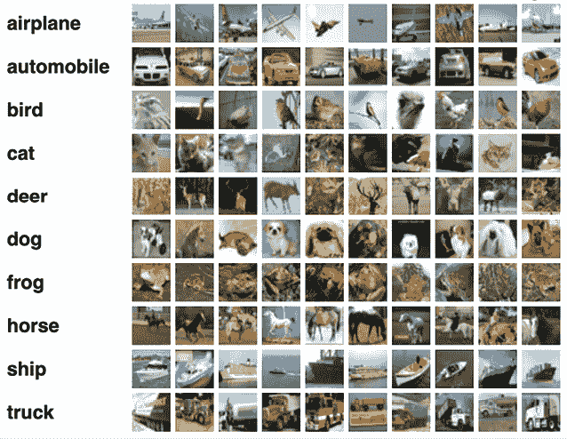

图 15.1：CIFAR-10 数据集

# 将问题分解为特征

鉴于 CIFAR-10 数据集和 CNN 在图像识别中的应用，我们概述以下功能，以指导用户构建和优化 CNN 模型：

+   **构建具有单个卷积层的基线 CNN 模型**：用户将首先构建一个简单的 CNN 模型，其中包含单个卷积层用于图像分类。此功能侧重于定义基本架构，包括卷积滤波器、激活函数和池化层，以建立对 CNN 的基础理解。

+   **实验添加卷积层**：用户将探索向基线模型架构添加额外卷积层的影响。通过逐步增加网络的深度，用户可以观察到模型捕捉层次特征的能力如何演变，以及其学习复杂模式的能力如何提高。

+   **整合 dropout 正则化**：用户将学习如何将 dropout 正则化集成到 CNN 模型中，以减轻过拟合并提高泛化性能。通过在训练过程中随机丢弃单元，dropout 有助于防止网络过度依赖特定特征，并鼓励鲁棒的特征学习。

+   **实现批量归一化**：用户将探索批量归一化在稳定训练动态和加速收敛方面的好处。此功能侧重于将批量归一化层集成到 CNN 架构中，以归一化激活并减少内部协变量偏移，从而实现更快、更稳定的训练。

+   **使用不同的优化器进行优化**：本功能探讨了使用各种优化算法（包括 SGD、Adam 和 RMSprop）来训练 CNN 模型的效果。用户将比较使用不同优化器获得的训练动态、收敛速度和最终模型性能，从而能够为他们的特定任务选择最合适的优化策略。

+   **执行数据增强**：用户将尝试旋转、翻转、缩放和移位等数据增强技术，以增加训练数据集的多样性和规模。通过在训练过程中动态生成增强样本，用户可以提高模型泛化到未见数据的能力，并增强对输入图像变化的鲁棒性。

通过遵循这些功能，用户将获得关于使用 CIFAR-10 数据集构建、微调和优化 CNN 模型以进行图像分类任务的实用见解。他们将学习如何系统地实验不同的架构组件、正则化技术和优化策略，以实现卓越的性能和准确性，在物体识别中达到更高的精度。

# 提示策略

为了利用 ChatGPT 进行机器学习，我们需要清楚地了解如何实现针对代码生成的特定于机器学习的提示策略。

让我们头脑风暴一下我们希望在这次任务中实现的目标，以便更好地理解需要包含在提示中的内容。

## 策略 1：任务-行动-指南（TAG）提示策略

**1.1 - 任务**：具体任务是构建和优化 CIFAR-10 数据集的 CNN 模型。

**1.2 - 行动**：构建和优化 CIFAR-10 数据集的 CNN 模型的关键步骤包括：

+   **预处理图像数据**：归一化像素值并将图像调整到标准尺寸。

+   **模型构建**：定义具有单个卷积层的基线 CNN 模型架构。

**1.3 - 指南**：在我们的提示中，我们将向 ChatGPT 提供以下指南：

+   代码应与 Jupyter Notebook 兼容。

+   确保每行代码都有详细的注释。

+   您必须详细解释每一行代码，涵盖代码中使用的每个方法。

## 策略 2：角色-指令-上下文（PIC）提示策略

**2.1 - 角色扮演**：扮演一个需要逐步指导构建和优化用于图像分类任务的 CNN 模型的初学者角色。

**2.2 - 指令**：请求 ChatGPT 逐个生成每个功能的代码，并在进行下一步之前等待用户反馈。

**2.3 - 上下文**：鉴于重点是使用 CIFAR-10 数据集构建用于图像分类任务的 CNN 模型，ChatGPT 已经了解该数据集及其特征，因此可能不需要额外的上下文。

## 策略 3：学习-即兴创作-反馈-评估（LIFE）提示策略

**3.1 - 学习**：

+   强调了解 CNN 模型和其组件的重要性，包括卷积层、池化层、dropout 正则化、批量归一化、数据增强和优化算法。

**3.2 - 改进**：

+   我们将在后面通过添加更多层、dropout 层、池化、数据增强等来改进。

**3.3 - 反馈**：

+   分享代码和模型输出以供反馈，以确保有效的学习和理解。

+   将建议和批评纳入，以完善模型和方法**。

+   提供错误以排除故障和解决问题。

**3.4- 评估**：

执行 ChatGPT 提供的代码，以确保准确性和有效性。这一点在本章中会反复使用。

# 使用 ChatGPT 的免费版本构建 CNN 模型，以准确分类 CIFAR-10 图像

ChatGPT 的付费版本具有代码解释器，但它不支持构建 ML 代码所需的深度学习库，如 Keras 和 TensorFlow。因此，在本章中，我们将坚持使用 ChatGPT 的免费版本。

## 特征 1：使用单个卷积层构建基线 CNN 模型

让我们为基线模型制定初始提示。

[**提示**]

我想为 CIFAR-10 数据集创建一个简单的分类模型（TAG 1.1），该模型由单个层 CNN 模型（PIC 2.2）组成。它应包括以下步骤（TAG 1.2），并一次提供一个步骤，等待用户反馈（PIC 2.2）：

+   预处理图像数据：归一化像素值并将图像调整到标准尺寸。

+   模型构建：定义具有单个卷积层的基线 CNN 模型架构。

我是一个初学者用户（PIC 2.1），因此请提供逐步的代码，并严格遵循以下说明（TAG 1.3）：

+   代码应与 Jupyter Notebook 兼容。

+   确保每行代码都有详细的注释。

您必须详细解释每一行代码，涵盖代码中使用的每个方法。

[**提示结束**]

您应该收到以下类似的响应，其中 ChatGPT 为我们提供了数据预处理步骤的代码，并附有详细的注释和解释。

[**快速响应**]

当然，让我们从第一步开始：预处理图像数据。在这一步中，我们将归一化像素值并将图像调整到标准尺寸。

```py
# Step 1: Preprocessing the image data
# Import necessary libraries
import numpy as np
import tensorflow as tf
from tensorflow.keras.datasets import cifar10
from tensorflow.keras.utils import to_categorical
from skimage.transform import resize
# Load CIFAR-10 dataset
(x_train, y_train), (x_test, y_test) = cifar10.load_data()
# Normalize pixel values to range [0, 1]
x_train = x_train.astype('float32') / 255.0
x_test = x_test.astype('float32') / 255.0
# Resize images to a standardized size (e.g., 32x32 pixels)
standardized_size = (32, 32)
x_train_resized = np.array([resize(image, standardized_size) for image in x_train])
x_test_resized = np.array([resize(image, standardized_size) for image in x_test])
# Display shape of datasets after preprocessing
print("Shape of x_train:", x_train_resized.shape)
print("Shape of x_test:", x_test_resized.shape) 
```

现在，让我们逐行分析代码：

我们导入必要的库：

+   使用 `numpy` 进行数值运算。

+   使用 `tensorflow` 构建 和训练模型。

+   使用来自 `tensorflow.keras.datasets` 的 `cifar10` 数据集加载 CIFAR-10 数据。

+   使用来自 `tensorflow.keras.utils` 的 `to_categorical` 函数进行标签的一热编码。

+   使用来自 `skimage.transform` 的 `resize` 函数调整图像大小。

+   我们使用 `cifar10.load_data()` 函数加载 CIFAR-10 数据集，该函数返回训练和测试数据分割。

+   我们通过除以 `255.0` 将图像的像素值归一化到 `[0, 1]` 范围内。

+   我们定义图像调整大小的标准化大小（例如，32x32 像素）。

+   我们使用列表推导和 resize 函数将训练集和测试集中的所有图像调整到标准化大小。

+   最后，我们在预处理后打印训练集和测试集的形状，以验证变化。

如果您有任何问题或想要进行下一步，请告诉我！

**[响应结束]**

我们现在将应用评估提示策略（LIFE 3.4），并通过在 Google Colab 的每一步执行代码来验证代码。该代码从 Keras 加载模型并规范化图像。代码运行良好，无需任何修改或返回任何错误。

请参考`Building a CNN Model for CIFAR-10 with `ChatGPT.ipynb`笔记本中的可执行代码片段，或从提示响应中复制代码。

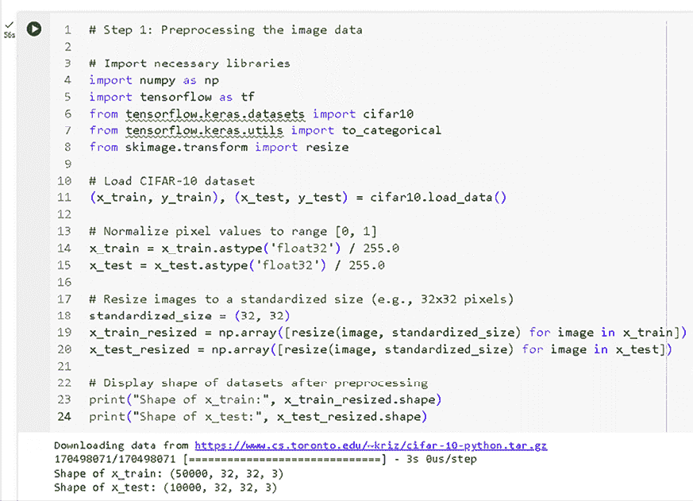

图 15.2：代码执行 – 数据预处理

我们现在将指示 ChatGPT 进行下一步。

[P**rompt**]

让我们进行下一步。

[E**nd of prompt**]

我们应该收到以下响应，其中 ChatGPT 应提供创建基线模型的代码。

[P**rompt response**]

太好了！下一步是构建具有单个卷积层的基线 CNN 模型架构。

```py
# Step 2: Model Construction
# Import necessary libraries
from tensorflow.keras.models import Sequential
from tensorflow.keras.layers import Conv2D, MaxPooling2D, Flatten, Dense
# Define the baseline CNN model architecture
model = Sequential([
    # Add a convolutional layer with 32 filters, kernel size of (3, 3), and ReLU activation function
    Conv2D(32, (3, 3), activation='relu', input_shape=(32, 32, 3)),
    # Add a max pooling layer with pool size of (2, 2)
    MaxPooling2D((2, 2)),
    # Flatten the output of the convolutional layer
    Flatten(),
    # Add a fully connected layer with 64 neurons and ReLU activation function
    Dense(64, activation='relu'),
    # Add the output layer with 10 neurons (one for each class) and softmax activation function
    Dense(10, activation='softmax')
])
# Compile the model
model.compile(optimizer='adam',
              loss='sparse_categorical_crossentropy',
              metrics=['accuracy'])
# Display model summary
model.summary() 
```

现在，让我们解释每一行代码：

+   我们导入必要的库：

+   使用`tensorflow.keras.models`中的`Sequential`创建一个序列模型。

+   从`tensorflow.keras.layers`中获取`Conv2D`、`MaxPooling2D`、`Flatten`和`Dense`层，以定义 CNN 模型中的不同类型层。

+   我们使用序列 API 定义基线 CNN 模型架构，这允许我们创建线性堆叠的层。

在序列模型中：

+   我们添加一个卷积层（`Conv2D`），包含 32 个过滤器，核大小为`(3, 3)`，以及`ReLU`激活函数。`input_shape`参数定义了输入图像的形状。

+   我们添加一个最大池化层（`MaxPooling2D`），池化大小为`(2, 2)`，以对特征图进行下采样。

+   我们使用`Flatten`层将卷积层的输出展平，以便为全连接层做准备。

+   我们添加一个全连接层（`Dense`），包含 64 个神经元和一个`ReLU`激活函数。

+   最后，我们添加一个输出层，包含 10 个神经元（每个 CIFAR-10 类别一个）和`softmax`激活函数。

我们使用`model.compile()`编译模型，以下为配置：

+   使用`optimizer='adam'`来使用`Adam`优化器。

+   使用`loss='sparse_categorical_crossentropy'`作为损失函数，适用于具有整数标签的分类任务。

+   使用`metrics=['accuracy']`来监控训练过程中的准确率。

+   我们使用`model.summary()`显示模型架构的摘要。

如果您有任何问题或想要进行调整，请告诉我！

**[响应结束]**

我们在笔记本中执行代码，它运行得非常完美。打印了一个模型摘要，其中包括 32 个滤波器和 896 个参数的`Conv2d`层，接着是一个`MaxPooling2D`层，一个没有参数的扁平层，然后是一个有 64 个神经元的密集层和 ReLU 激活函数，最后是一个有 10 个神经元和 softmax 激活函数的密集层。

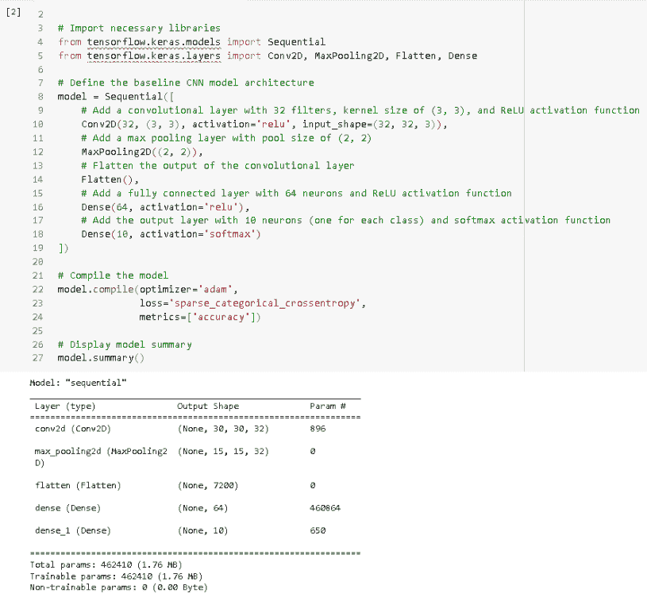

图 15.3：代码执行 – 基线模型摘要

我们现在将指示 ChatGPT 继续下一步。

[P**rompt**]

让我们继续下一步。

[E**nd of prompt**]

我们应该收到以下类似的响应，其中 ChatGPT 应提供训练模型的代码。

[P**rompt response**]

当然！下一步是在预处理过的 CIFAR-10 数据集上训练模型。

```py
# Step 3: Model Training
# Train the model
history = model.fit(x_train_resized, y_train,
                    epochs=10, 
                    batch_size=32,
                    validation_data=(x_test_resized, y_test)) 
```

下面是代码的解释：

+   我们使用`fit`方法在预处理过的训练数据`(x_train_resized)`和相应的标签`(y_train)`上训练模型。

+   我们指定训练轮数（`epochs=10`）以在整个数据集上迭代 10 次来训练模型。

+   我们将批大小（`batch_size=32`）设置为指定每次梯度更新时的样本数量。这是一个超参数，它决定了在更新模型参数之前处理多少个样本。

+   我们提供验证数据（`validation_data=(x_test_resized, y_test)`）以在每个 epoch 后评估模型在测试数据上的性能。

+   `fit`方法返回一个包含每个 epoch 的训练指标（例如，损失和准确率）的历史对象，这些指标可用于分析和可视化。

如果您有任何问题或想要继续评估模型或进行任何调整，请告诉我！

**[End of response**]

我们执行代码，它运行无误。模型训练了 10 个 epoch，之后我们收到 62.6%的验证准确率，对于一个基本模型来说还不错。

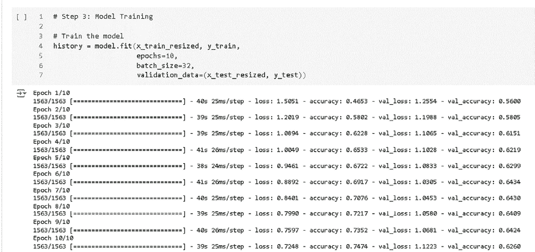

图 15.4：代码执行 – 模型训练

我们现在将指示 ChatGPT 继续下一步以评估模型性能。

[P**rompt**]

让我们继续下一步。

[E**nd of prompt**]

我们应该收到以下类似的响应，其中 ChatGPT 应提供模型评估的代码以及注释。

[P**rompt response**]

当然！下一步是对测试数据集上的训练模型进行评估并可视化其性能。

```py
# Step 4: Model Evaluation and Visualization
import matplotlib.pyplot as plt
# Evaluate the model on the testing dataset
test_loss, test_accuracy = model.evaluate(x_test_resized, y_test, verbose=0)
print("Test Loss:", test_loss)
print("Test Accuracy:", test_accuracy)
# Plot training history
plt.plot(history.history['accuracy'], label='Training Accuracy')
plt.plot(history.history['val_accuracy'], label='Validation Accuracy')
plt.title('Training and Validation Accuracy')
plt.xlabel('Epoch')
plt.ylabel('Accuracy')
plt.legend()
plt.show() 
```

这段代码的作用如下：

+   我们导入`matplotlib.pyplot`来可视化训练历史。

+   我们使用`evaluate`方法在测试数据集上评估训练模型，该方法返回测试损失和准确率。

+   我们打印测试损失和测试准确率以评估模型在未见数据上的性能。

+   我们使用`matplotlib.pyplot`绘制训练和验证准确率随 epoch 的变化。`fit`方法返回的历史对象包含训练和验证数据集在各个 epoch 的准确率值。

+   `history.history['accuracy']`包含训练准确率值。

+   `history.history['val_accuracy']`包含验证准确率值。

+   该图表帮助我们可视化模型随时间学习的效果，以及它是否过拟合或欠拟合。

如果您有任何问题或想要进一步分析结果，请告诉我！

**[响应结束]**

我们执行代码，它运行没有任何错误。它评估了测试损失和测试准确率（62.5%），并绘制了训练准确率与验证准确率的图表，显示模型在验证集上的表现不佳。

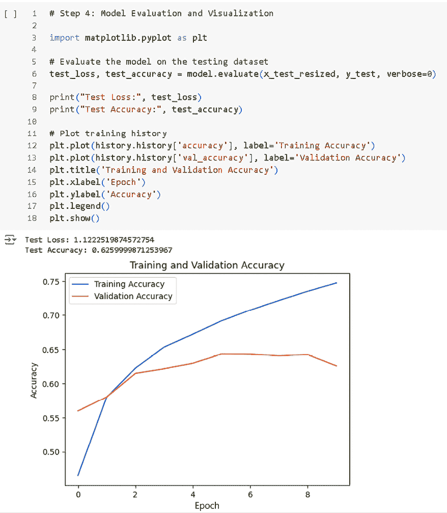

图 15.5：代码执行 – 模型评估

这完成了功能 1，我们使用基线 CNN 模型实现了 0.6259（62.59%）的准确率。（请注意，即使运行了完全相同的代码，您也可能收到不同的准确率分数。）接下来，我们将转向第二个功能，即在模型中添加更多层，并了解 ChatGPT 如何帮助我们。

## 功能 2：实验添加卷积层

现在我们有了基线模型架构，让我们尝试向其中添加层。我们将应用提示策略来改进模型（LIFE 3.4），并要求 ChatGPT 提供相应的代码，同时注意使用短语（在基线模型之上）（PIC 2.2）和关键词增量（PIC 2.2）的重要性；没有这些，响应将不会完全符合我们的期望。

[提示]

我们在基线模型上获得了 62.59 的准确率，因此现在我想先尝试在基线模型上添加两层连续的 64 个滤波器，然后在其之上再添加两层连续的 128 个滤波器。然后，让我们比较这两个增量变化与基线模型的成果。

[提示结束]

我们应该收到以下响应，其中 ChatGPT 理解请求并为我们提供具有连续 64 个滤波器层的修改模型代码，以及另一个具有连续 128 个滤波器层的模型代码。

[响应提示]

当然！让我们首先在基线模型上添加两层连续的 64 个滤波器，并重新训练它。然后，我们将添加两层连续的 128 个滤波器并再次训练模型。最后，我们将比较这两个变化与基线模型的成果。

这是我们如何修改基线模型以包含额外层的方法：

```py
# Define the modified model with two consecutive layers of 64 filters
modified_model_64 = Sequential([
    Conv2D(32, (3, 3), activation='relu', input_shape=(32, 32, 3)),
    MaxPooling2D((2, 2)),
    Conv2D(64, (3, 3), activation='relu'),
    MaxPooling2D((2, 2)),
    Conv2D(64, (3, 3), activation='relu'),
    MaxPooling2D((2, 2)),
    Flatten(),
    Dense(64, activation='relu'),
    Dense(10, activation='softmax')
])
# Compile the modified model
modified_model_64.compile(optimizer='adam',
                          loss='sparse_categorical_crossentropy',
                          metrics=['accuracy'])
# Display model summary
modified_model_64.summary()
# Train the modified model with two consecutive layers of 64 filters
history_64 = modified_model_64.fit(x_train_resized, y_train,
                                    epochs=10, 
                                    batch_size=32,
                                    validation_data=(x_test_resized, y_test))
# Evaluate the modified model on the testing dataset
test_loss_64, test_accuracy_64 = modified_model_64.evaluate(x_test_resized, y_test, verbose=0)
print("Test Loss (Modified Model with 64 Filters):", test_loss_64)
print("Test Accuracy (Modified Model with 64 Filters):", test_accuracy_64) 
```

现在，让我们解释一下这些修改：

+   我们通过在基线模型架构之后添加两个连续的 64 个滤波器卷积层来定义修改后的模型（`modified_model_64`）。

+   我们使用与基线模型相同的设置编译了修改后的模型。

+   我们在预处理后的训练数据（`x_train_resized`）上训练了修改后的模型（`modified_model_64`）。

+   我们在测试数据集（`x_test_resized`）上评估修改后模型的性能，并打印测试损失和准确率。

接下来，我们将重复添加两层连续 128 个滤波器的过程：

```py
# Define the modified model with two consecutive layers of 128 filters
modified_model_128 = Sequential([
    Conv2D(32, (3, 3), activation='relu', input_shape=(32, 32, 3)),
    MaxPooling2D((2, 2)),
    Conv2D(64, (3, 3), activation='relu'),
    MaxPooling2D((2, 2)),
    Conv2D(64, (3, 3), activation='relu'),
    MaxPooling2D((2, 2)),
    Conv2D(128, (3, 3), activation='relu'),
    MaxPooling2D((2, 2)),
    Conv2D(128, (3, 3), activation='relu'),
    MaxPooling2D((2, 2)),
    Flatten(),
    Dense(64, activation='relu'),
    Dense(10, activation='softmax')
])
# Compile the modified model
modified_model_128.compile(optimizer='adam',
                           loss='sparse_categorical_crossentropy',
                           metrics=['accuracy'])
# Display model summary
modified_model_128.summary()
# Train the modified model with two consecutive layers of 128 filters
history_128 = modified_model_128.fit(x_train_resized, y_train,
                                     epochs=10, 
                                     batch_size=32,
                                     validation_data=(x_test_resized, y_test))
# Evaluate the modified model on the testing dataset
test_loss_128, test_accuracy_128 = modified_model_128.evaluate(x_test_resized, y_test, verbose=0)
print("Test Loss (Modified Model with 128 Filters):", test_loss_128)
print("Test Accuracy (Modified Model with 128 Filters):", test_accuracy_128) 
```

此代码遵循与之前修改相同的结构，但添加了两个连续的具有 128 个滤波器的卷积层。我们相应地训练和评估模型。

如果你有任何问题或想要继续修改，请告诉我！

**[响应结束]**

我们首先执行定义两个具有 64 个滤波器的额外层的代码。它运行得很好，训练了模型并实现了 71%的改进准确率。

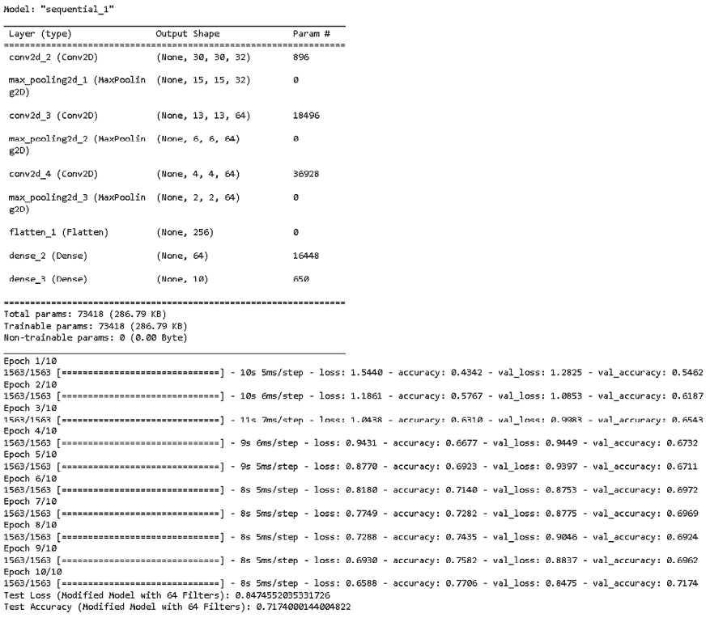

图 15.6：向模型添加两个具有 64 个滤波器的连续层

接下来，我们执行代码，通过添加两个具有 128 个滤波器的额外层来增加模型的深度。在这种情况下，代码导致错误，因此我们将使用提示策略，并将错误反馈给 ChatGPT。

你应该在运行代码时看到一个`ValueError`。

[提示]**

我们收到了以下错误。同时，确保最大池化不会过多地减少 128 个滤波器的维度。错误如下：

```py
ValueError: Exception encountered when calling layer "conv2d_38" (type Conv2D).
Negative dimension size caused by subtracting 3 from 2 for '{{node conv2d_38/Conv2D}} = Conv2D[T=DT_FLOAT, data_format="NHWC", dilations=[1, 1, 1, 1], explicit_paddings=[], padding="VALID", strides=[1, 1, 1, 1], use_cudnn_on_gpu=true](Placeholder, conv2d_38/Conv2D/ReadVariableOp)' with input shapes: [?,2,2,64], [3,3,64,128].
Call arguments received by layer "conv2d_38" (type Conv2D):
  inputs=tf.Tensor(shape=(None, 2, 2, 64), dtype=float32). 
```

[提示结束]**

我们应该收到以下响应，其中 ChatGPT 理解请求并为我们提供解决该问题的修改后的代码。

[提示响应]**

看起来我们遇到了一个问题，即最后一个最大池化层之后的维度对于具有 128 个滤波器的后续卷积层来说太小。为了解决这个问题，我们将调整架构以确保层之间的兼容性。

这里是修正后的代码：

```py
# Define the modified model with two consecutive layers of 128 filters added to the 64-layer model
modified_model_64_to_128 = Sequential([
    Conv2D(32, (3, 3), activation='relu', input_shape=(32, 32, 3)),
    MaxPooling2D((2, 2)),
    Conv2D(64, (3, 3), activation='relu'),
    MaxPooling2D((2, 2)),
    Conv2D(64, (3, 3), activation='relu'),
    Conv2D(128, (3, 3), activation='relu', padding='same'),  # Add padding
    Conv2D(128, (3, 3), activation='relu', padding='same'),  # Add padding
    MaxPooling2D((2, 2)),
    Flatten(),
    Dense(64, activation='relu'),
    Dense(10, activation='softmax')
])
# Compile the modified model
modified_model_64_to_128.compile(optimizer='adam',
                                  loss='sparse_categorical_crossentropy',
                                  metrics=['accuracy'])
# Display model summary
modified_model_64_to_128.summary()
# Train the modified model with two consecutive layers of 128 filters added to the 64-layer model
history_64_to_128 = modified_model_64_to_128.fit(x_train_resized, y_train,
                                                 epochs=10, 
                                                 batch_size=32,
                                                 validation_data=(x_test_resized, y_test))
# Evaluate the modified model on the testing dataset
test_loss_64_to_128, test_accuracy_64_to_128 = modified_model_64_to_128.evaluate(x_test_resized, y_test, verbose=0)
print("Test Loss (Modified Model with 64 to 128 Filters):", test_loss_64_to_128)
print("Test Accuracy (Modified Model with 64 to 128 Filters):", test_accuracy_64_to_128) 
```

在这次修改中：

+   我们在最后一个具有 64 个滤波器的卷积层之后移除了最大池化层，以确保在应用具有 128 个滤波器的后续卷积层之前，特征图维度不会减少太多。

+   我们在具有 128 个滤波器的卷积层中添加了`same`填充，以确保与输入维度兼容。

+   剩余的架构保持不变。

这个调整应该会解决这个问题，模型应该能够正确编译和训练。如果你有任何问题或遇到任何进一步的问题，请告诉我！

**[响应结束]**

让我们执行代码，该代码删除了一些最大池化层，并且添加了`padding = 'same'`以确保维度兼容。它运行成功，训练了模型但将准确率降低到 69%。

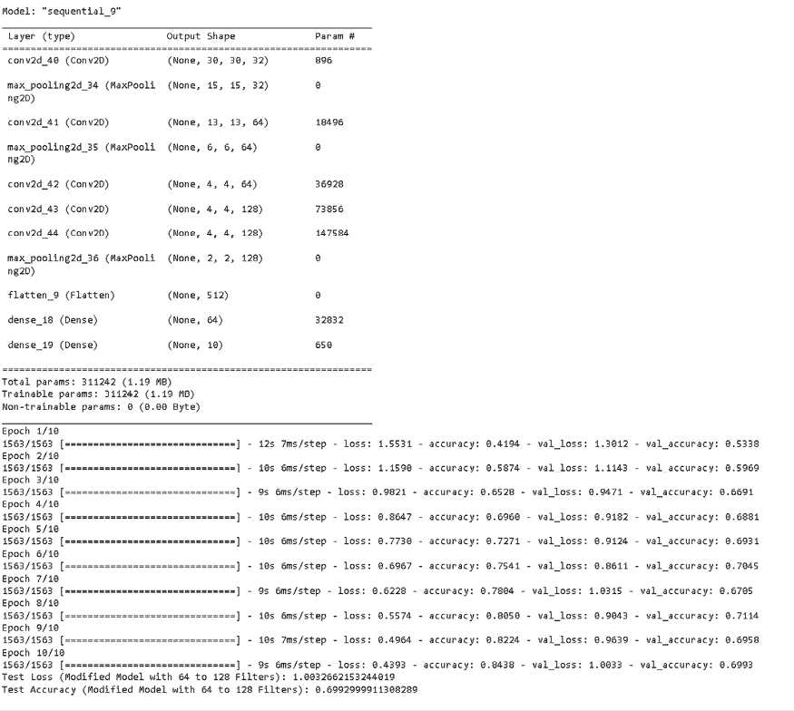

图 15.7：添加了具有 128 个滤波器的层

根据这些结果，我们可以观察到，与基线模型相比，增加更多层实现了略微更高的准确率。然而，准确率的差异相对较小，表明增加层并没有显著提高模型性能，并且模型仍未进行正则化。让我们继续到下一个特征，并尝试 dropout 正则化。

## 特征 3：引入 dropout 正则化

现在我们已经学会了如何添加更多层，我们将现在尝试使用 dropout 层。我们将应用提示策略来改进模型（LIFE 3.4），并要求 ChatGPT 提供相应的代码。

还请注意，我们已经通过要求在之前提供的代码上添加 dropout 来应用了使用特定指令（PIC 2.2）的提示策略。

[**提示**]

基线模型的模型准确率为 62.5%，增加 64 个滤波器的额外层后为 71%，进一步添加具有 128 个滤波器的层将其降低到 69%。请在我们之前消息中给出的模型代码上应用 dropout 正则化吗？

[**提示结束**]

我们应该收到以下类似的响应，其中 ChatGPT 理解请求并提供添加 dropout 层的代码。

[**快速响应**]

当然，让我们向修改后的模型添加两个连续的 128 个滤波器的 dropout 正则化。dropout 正则化通过在训练过程中随机丢弃一部分单元（神经元）来帮助防止过拟合。以下是我们可以如何修改模型以包含 dropout 层：

```py
from tensorflow.keras.layers import Dropout
# Define the modified model with dropout regularization
modified_model_64_to_128_with_dropout = Sequential([
    Conv2D(32, (3, 3), activation='relu', input_shape=(32, 32, 3)),
    MaxPooling2D((2, 2)),
    Conv2D(64, (3, 3), activation='relu'),
    MaxPooling2D((2, 2)),
    Conv2D(64, (3, 3), activation='relu'),
    Conv2D(128, (3, 3), activation='relu', padding='same'),
    Dropout(0.25),  # Add dropout regularization with a dropout rate of 25%
    Conv2D(128, (3, 3), activation='relu', padding='same'),
    Dropout(0.25),  # Add dropout regularization with a dropout rate of 25%
    MaxPooling2D((2, 2)),
    Flatten(),
    Dense(64, activation='relu'),
    Dropout(0.5),  # Add dropout regularization with a dropout rate of 50%
    Dense(10, activation='softmax')
])
# Compile the modified model with dropout regularization
modified_model_64_to_128_with_dropout.compile(optimizer='adam',
                                              loss='sparse_categorical_crossentropy',
                                              metrics=['accuracy'])
# Display model summary
modified_model_64_to_128_with_dropout.summary()
# Train the modified model with dropout regularization
history_64_to_128_with_dropout = modified_model_64_to_128_with_dropout.fit(x_train_resized, y_train,
                                                                           epochs=10,
                                                                           batch_size=32,
                                                                           validation_data=(x_test_resized, y_test))
# Evaluate the modified model with dropout regularization on the testing dataset
test_loss_64_to_128_with_dropout, test_accuracy_64_to_128_with_dropout = modified_model_64_to_128_with_dropout.evaluate(x_test_resized, y_test, verbose=0)
print("Test Loss (Modified Model with Dropout):", test_loss_64_to_128_with_dropout)
print("Test Accuracy (Modified Model with Dropout):", test_accuracy_64_to_128_with_dropout) 
```

在这次修改中：

+   我们在具有 128 个滤波器的卷积层之后添加 dropout 层。我们将第一个和最后一个 dropout 层的 dropout 率分别设置为 25%和 50%。这些值可以根据实验和所需的正则化水平进行调整。

+   我们使用与之前相同的设置编译和训练带有 dropout 正则化的修改后的模型。

+   我们在测试数据集上评估带有 dropout 正则化的修改后模型的性能，并打印测试损失和准确率。

添加 dropout 正则化可能有助于提高模型的泛化性能并减少过拟合。如果您有任何问题或想要进一步探索，请告诉我！

**[响应结束**]

我们执行代码，该代码定义了一个包含 dropout 层的模型。它还训练并评估了模型的性能，并打印了包含损失和准确率的模型摘要。请注意，dropout 层不会向模型添加任何参数。

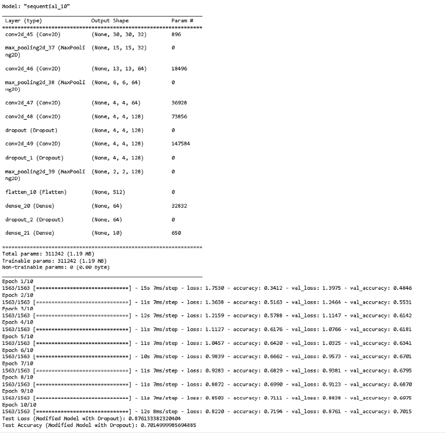

图 15.8：代码执行 – dropout 层

我们可以看到准确率之间没有太大差异，因此我们将应用 Learn 提示策略（LIFE 3.1），并要求 ChatGPT 提供损失和准确率的图表，以查看正则化的影响。

[**提示**]

```py
Test Loss (Modified Model with Dropout): 0.876133382320404 
Test Accuracy (Modified Model with Dropout): 0.7014999985694885 
```

请您提供损失和准确性的图表，以便查看是否进行了正则化，并解释一下。

**[提示结束**]

我们应该收到以下类似的响应，其中 ChatGPT 提供代码并解释图表的重要性。

[**快速响应**]

当然！让我们绘制修改后的模型使用 dropout 正则化的训练和验证损失及准确率曲线。这将帮助我们可视化 dropout 正则化对训练过程和模型性能的影响。

```py
import matplotlib.pyplot as plt
# Plot training history for loss
plt.plot(history_64_to_128_with_dropout.history['loss'], label='Training Loss')
plt.plot(history_64_to_128_with_dropout.history['val_loss'], label='Validation Loss')
plt.title('Training and Validation Loss')
plt.xlabel('Epoch')
plt.ylabel('Loss')
plt.legend()
plt.show()
# Plot training history for accuracy
plt.plot(history_64_to_128_with_dropout.history['accuracy'], label='Training Accuracy')
plt.plot(history_64_to_128_with_dropout.history['val_accuracy'], label='Validation Accuracy')
plt.title('Training and Validation Accuracy')
plt.xlabel('Epoch')
plt.ylabel('Accuracy')
plt.legend()
plt.show() 
```

解释：

+   **训练损失与验证损失对比**：此图显示了训练和验证损失随 epoch 的变化趋势。如果训练和验证损失之间存在较大差距，则表明过拟合。dropout 正则化的目的是通过防止模型过度依赖特定特征来减少训练和验证损失之间的差距，从而减少过拟合。

+   **训练准确率与验证准确率对比**：此图显示了训练和验证准确率随 epoch 的变化趋势。dropout 正则化也可以帮助提高泛化性能，从而提高验证准确率，尤其是在模型中存在过拟合的情况下。

通过观察这些图表，我们可以评估 dropout 正则化是否有效地减轻了过拟合并提高了模型泛化性能。如果您有任何问题或需要进一步解释，请告诉我！

**[回复结束]**

我们将执行代码并绘制图表，以了解 dropout 的影响。

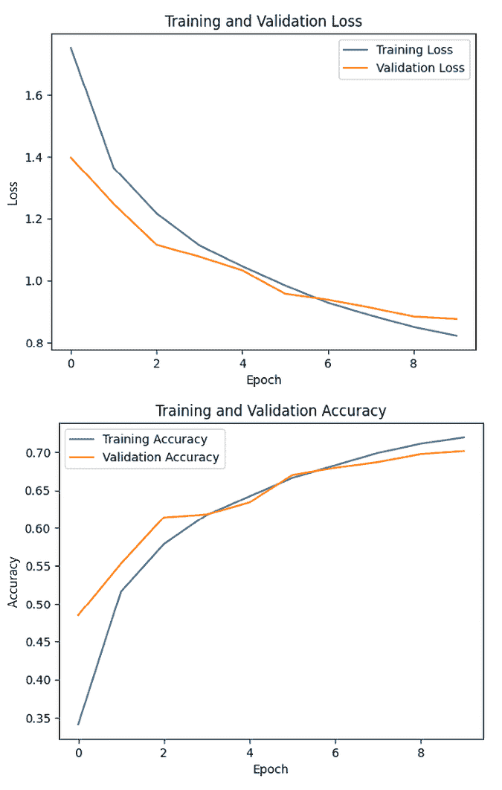

图 15.9：dropout 层的影响

输出的图表显示了在 CIFAR-10 数据集上训练并带有 dropout 层的模型训练和验证损失及准确率。随着准确率的提高，损失在各个 epoch 中下降，这表明学习是有效的。训练和验证指标之间的小差距表明过拟合最小，这可能是由于 dropout 层的作用。总体而言，模型对新数据具有良好的泛化能力，表现出良好的性能。

## 功能 4：实现批量归一化

我们将应用提示策略来改进模型（LIFE 3.4），并要求 ChatGPT 为我们提供将批量归一化添加到之前提供的代码中的代码。

**[提示]**

我想将批量归一化应用于之前提供的代码。

**[提示结束]**

我们应该收到以下类似的回复，其中 ChatGPT 理解请求并为我们提供在现有模型上添加批量归一化的代码。

**[提示回复]**

当然！我们可以将批量归一化应用于模型的卷积层，以提高训练稳定性和收敛速度。以下是修改模型以包含批量归一化层的步骤：

```py
from tensorflow.keras.layers import BatchNormalization
# Define the modified model with batch normalization
modified_model_64_to_128_with_batchnorm = Sequential([
    Conv2D(32, (3, 3), activation='relu', input_shape=(32, 32, 3)),
    BatchNormalization(),  # Add batch normalization
    MaxPooling2D((2, 2)),
    Conv2D(64, (3, 3), activation='relu'),
    BatchNormalization(),  # Add batch normalization
    MaxPooling2D((2, 2)),
    Conv2D(64, (3, 3), activation='relu'),
    Conv2D(128, (3, 3), activation='relu', padding='same'),
    BatchNormalization(),  # Add batch normalization
    MaxPooling2D((2, 2)),
    Conv2D(128, (3, 3), activation='relu', padding='same'),
    BatchNormalization(),  # Add batch normalization
    MaxPooling2D((2, 2)),
    Flatten(),
    Dense(64, activation='relu'),
    BatchNormalization(),  # Add batch normalization
    Dense(10, activation='softmax')
])
# Compile the modified model with batch normalization
modified_model_64_to_128_with_batchnorm.compile(optimizer='adam',
                                                loss='sparse_categorical_crossentropy',
                                                metrics=['accuracy'])
# Display model summary
modified_model_64_to_128_with_batchnorm.summary()
# Train the modified model with batch normalization
history_64_to_128_with_batchnorm = modified_model_64_to_128_with_batchnorm.fit(x_train_resized, y_train,
                                                                               epochs=10,
                                                                               batch_size=32,
                                                                               validation_data=(x_test_resized, y_test))
# Evaluate the modified model with batch normalization on the testing dataset
test_loss_64_to_128_with_batchnorm, test_accuracy_64_to_128_with_batchnorm = modified_model_64_to_128_with_batchnorm.evaluate(x_test_resized, y_test, verbose=0)
print("Test Loss (Modified Model with Batch Normalization):", test_loss_64_to_128_with_batchnorm)
print("Test Accuracy (Modified Model with Batch Normalization):", test_accuracy_64_to_128_with_batchnorm) 
```

在这次修改中：

+   我们在每个卷积层之后添加`BatchNormalization`层。批量归一化在每个批次中对前一层的激活进行归一化，使训练更加稳定并加速收敛。

+   我们使用与之前相同的设置编译和训练带有批量归一化的修改后模型。

+   我们使用测试数据集评估带有批量归一化的修改后模型的性能，并打印测试损失和准确率。

添加批量归一化可以在训练过程中提高模型性能和稳定性。如果您有任何问题或需要进一步解释，请告诉我！

**[回复结束]**

我们将执行代码，评估模型性能，并打印结果。注意，批量归一化添加了少量参数，与 dropout 或 maxpooling 不同。

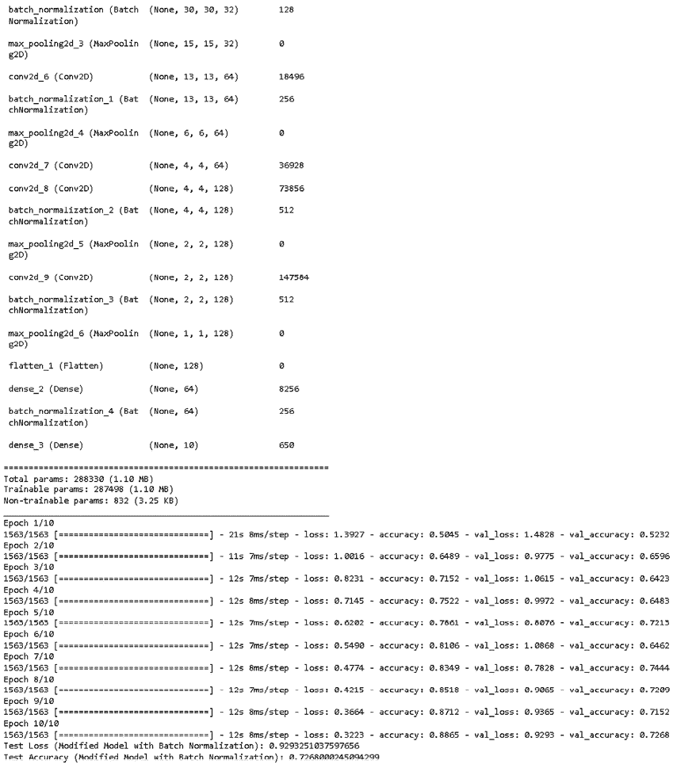

图 15.10：批量归一化

我们可以看到有一些非训练参数。让我们利用 Learn 提示策略（LIFE 3.1）来理解非训练参数的计算。

[提示]**

请解释模型摘要中 832 的计算方法？

```py
"sequential_1"
_________________________________________________________________
 Layer (type)                Output Shape              Param #   
=================================================================
 conv2d_5 (Conv2D)           (None, 30, 30, 32)        896       

 batch_normalization (Batch  (None, 30, 30, 32)        128       
 Normalization)                                                  

 max_pooling2d_3 (MaxPoolin  (None, 15, 15, 32)        0         
 g2D)                                                            

 conv2d_6 (Conv2D)           (None, 13, 13, 64)        18496     

 batch_normalization_1 (Bat  (None, 13, 13, 64)        256       
 chNormalization)                                                

 max_pooling2d_4 (MaxPoolin  (None, 6, 6, 64)          0         
 g2D)                                                            

 conv2d_7 (Conv2D)           (None, 4, 4, 64)          36928     

 conv2d_8 (Conv2D)           (None, 4, 4, 128)         73856     

 batch_normalization_2 (Bat  (None, 4, 4, 128)         512       
 chNormalization)                                                

 max_pooling2d_5 (MaxPoolin  (None, 2, 2, 128)         0         
 g2D)                                                            

 conv2d_9 (Conv2D)           (None, 2, 2, 128)         147584    

 batch_normalization_3 (Bat  (None, 2, 2, 128)         512       
 chNormalization)                                                

 max_pooling2d_6 (MaxPoolin  (None, 1, 1, 128)         0         
 g2D)                                                            

 flatten_1 (Flatten)         (None, 128)               0         

 dense_2 (Dense)             (None, 64)                8256      

 batch_normalization_4 (Bat  (None, 64)                256       
 chNormalization)                                                

 dense_3 (Dense)             (None, 10)                650       

=================================================================
Total params: 288330 (1.10 MB)
Trainable params: 287498 (1.10 MB)
Non-trainable params: 832 (3.25 KB) 
```

[提示结束]**

我们应该收到如下响应，其中 ChatGPT 理解了请求，并提供了非训练参数计算的解释。

[提示响应]**

在您描述的模型中，非训练参数是 832，这具体来自批量归一化层。以下是这个数字的计算方法：

批量归一化的组成部分

每个批量归一化层引入了用于归一化前一层输出的参数。具体来说，这些参数是：

+   **Gamma（缩放因子）**

+   **Beta（平移因子）**

+   **均值移动平均值**

+   **方差移动平均值**

gamma 和 beta 参数是可训练的，而移动均值和方差是不可训练的。这些组（gamma/beta 和移动均值/方差）的元素数量与批量归一化层的输入通道数相同。

计算

根据您的模型配置：

**在第一个 Conv2D 层（32 通道）之后的批量归一化：**

+   移动均值：32

+   移动方差：32

**在第二个 Conv2D 层（64 通道）之后的批量归一化：**

+   移动均值：64

+   移动方差：64

**在第三个 Conv2D 层（128 通道）之后的批量归一化：**

+   移动均值：128

+   移动方差：128

**在第四个 Conv2D 层（128 通道）之后的批量归一化：**

+   移动均值：128

+   移动方差：128

**在 Dense 层（64 个单元）之后的批量归一化：**

+   移动均值：64

+   移动方差：64

总非训练参数

求和这些值得到非训练参数的总数：`[ (32 + 32) + (64 + 64) + (128 + 128) + (128 + 128) + (64 + 64) = 832 ]`

每个批量归一化层将其输入通道数的两倍贡献给非训练参数计数（一次用于移动均值，一次用于移动方差）。这导致您的模型总共有 832 个非训练参数。

**[响应结束]**

现在我们已经学会了如何添加批量归一化以及非训练参数的计算，让我们转向下一个特性并尝试不同的优化器。

## 特征 5：使用不同的优化器进行优化

我们将应用提示策略来改进模型（LIFE 3.4），并要求 ChatGPT 为我们提供用于实验不同优化器（如 SGD、Adam 和 RMSProp）的代码。

[提示]**

请您提供 SGD、Adam 和 RMSprop 优化器的代码，并比较之前提供的模型及其在不同优化器组合下的性能。

[提示结束]**

我们应该收到以下类似的响应，其中 ChatGPT 理解了请求，并为我们提供了不同优化器的代码以及比较结果。

[提示响应]**

当然！我们可以比较使用 SGD、Adam 和 RMSprop 等不同优化器的模型性能。以下是修改模型并使用不同优化器训练的方法：

```py
# Import optimizers
from tensorflow.keras.optimizers import SGD, Adam, RMSprop
# Define the optimizers
optimizers = [SGD(), Adam(), RMSprop()]
# Define lists to store test accuracies for each optimizer
test_accuracies = []
# Iterate over each optimizer
for optimizer in optimizers:
    # Define the modified model with batch normalization and the current optimizer
    modified_model = Sequential([
        Conv2D(32, (3, 3), activation='relu', input_shape=(32, 32, 3)),
        BatchNormalization(),
        MaxPooling2D((2, 2)),
        Conv2D(64, (3, 3), activation='relu'),
        BatchNormalization(),
        MaxPooling2D((2, 2)),
        Conv2D(64, (3, 3), activation='relu'),
        Conv2D(128, (3, 3), activation='relu', padding='same'),
        BatchNormalization(),
        MaxPooling2D((2, 2)),
        Conv2D(128, (3, 3), activation='relu', padding='same'),
        BatchNormalization(),
        MaxPooling2D((2, 2)),
        Flatten(),
        Dense(64, activation='relu'),
        BatchNormalization(),
        Dense(10, activation='softmax')
    ])
    # Compile the model with the current optimizer
    modified_model.compile(optimizer=optimizer,
                           loss='sparse_categorical_crossentropy',
                           metrics=['accuracy'])
    # Train the model with the current optimizer
    history = modified_model.fit(x_train_resized, y_train,
                                 epochs=10,
                                 batch_size=32,
                                 validation_data=(x_test_resized, y_test),
                                 verbose=0)
    # Evaluate the model with the current optimizer on the testing dataset
    test_loss, test_accuracy = modified_model.evaluate(x_test_resized, y_test, verbose=0)
    # Append the test accuracy to the list
    test_accuracies.append(test_accuracy)
    # Print the test accuracy for the current optimizer
    print(f"Test Accuracy (Optimizer: {optimizer.__class__.__name__}): {test_accuracy}")
# Plot the test accuracies for each optimizer
plt.bar(['SGD', 'Adam', 'RMSprop'], test_accuracies)
plt.title('Test Accuracy Comparison for Different Optimizers')
plt.xlabel('Optimizer')
plt.ylabel('Test Accuracy')
plt.show() 
```

在此代码中：

+   我们从`tensorflow.keras.optimizers`中导入`SGD`、`Adam`和`RMSprop`优化器。

+   我们定义了一个优化器列表以进行迭代。

+   对于每个优化器，我们定义具有批量归一化和当前优化器的模型。

+   我们使用当前优化器编译和训练模型。

+   我们使用当前优化器在测试数据集上评估模型的性能。

+   我们打印每个优化器的测试准确率并将测试准确率存储在列表中。

+   最后，我们绘制每个优化器的测试准确率以比较它们的性能。

这段代码使我们能够比较使用不同优化器训练的模型的性能。如果您有任何问题或需要进一步解释，请告诉我！

**[响应结束]**

我们执行代码，该代码定义了具有不同优化器的模型。它还训练模型，评估其性能，并打印出它们性能比较的结果。

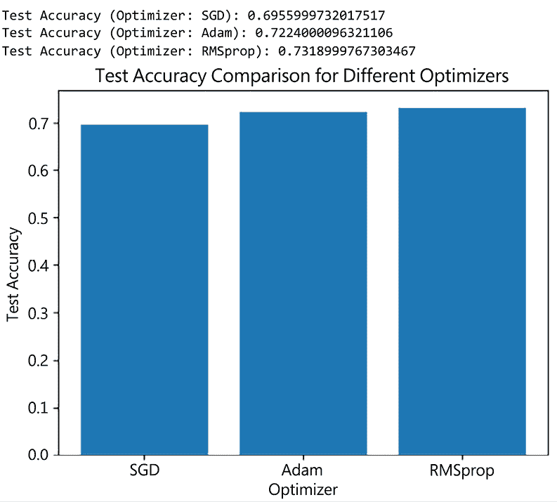

图 15.11：代码执行 – 不同优化器

根据这些结果，我们可以观察到 RMSprop 优化器实现了最高的准确率，其次是 Adam 和 SGD。这表明 RMSprop 在优化模型参数和改进测试数据上的性能方面表现更好。

让我们继续到最后一个特性，并应用 DavidNet 架构。

## 特性 6：应用 DavidNet 架构

我们将应用提示策略来改进模型（LIFE 3.4），并要求 ChatGPT 提供 DavidNet 的代码，并使用学习提示策略（LIFE 3.1）了解它。

[提示]**

请告诉我 DavidNet 架构有什么特别之处？

[提示结束]**

我们应该收到以下类似的响应，其中 ChatGPT 将提供 DavidNet 的解释。

[提示响应]**

DavidNet 架构因其简单性和在图像分类任务上实现高准确率而著称，尤其是在 CIFAR-10 数据集上。以下是使 DavidNet 特殊的一些关键方面：

+   **残差块**：DavidNet 利用残差块，这使得训练非常深的神经网络变得更加容易。残差连接使网络能够学习残差映射，这使得在没有梯度消失或梯度爆炸的情况下训练更深的网络变得更容易。

+   **批量归一化**: 在每个卷积层之后应用批量归一化，这有助于通过归一化每一层的激活来稳定和加速训练过程。这提高了模型在训练过程中的收敛性，并有助于防止过拟合。

+   **跳过连接**: 跳过连接（也称为恒等快捷方式）在残差块中使用。这些连接允许梯度直接通过网络流动，减轻梯度消失问题并促进非常深网络的训练。

+   **最大池化**: 最大池化层用于减少特征图的空間维度，有助于提取重要特征同时降低计算复杂度。

+   **密集层**: 在网络的末端使用全连接（密集）层来根据卷积层学习到的特征进行分类。

+   **学习率调度**: DavidNet 使用带有预热周期和衰减因子的学习率调度，在训练过程中逐步调整学习率。这有助于稳定训练并提高收敛性。

+   **正则化**: 虽然在架构中没有明确提及，但可以应用如权重衰减等正则化技术来防止过拟合并提高泛化性能。

总体而言，DavidNet 在模型复杂性和有效性之间取得了平衡，证明了即使相对简单的架构，通过适当的设计选择和训练策略也能取得令人印象深刻的成果。

**[响应结束]**

我们将尝试了解残差块并向 ChatGPT 提出后续问题。

[P**提示**]

残差块是什么？

[E**nd of prompt**]

我们应该收到如下响应，其中 ChatGPT 为我们提供关于残差块的解释。

[P**提示响应**]

残差块是深度神经网络的基本组成部分，尤其是在 ResNet 及其变体等架构中。它们旨在解决在非常深网络的训练过程中出现的梯度消失问题。

残差块由两个主要路径组成：恒等路径和快捷路径。恒等路径是块中的主要路径，而快捷路径为输入提供了一个直接连接，以便跳过一层或多层。

这里是残差块工作原理的基本概述：

+   **恒等路径**: 输入通过一系列卷积层、批量归一化和激活函数传递到残差块。这一系列操作允许网络学习输入数据的表示。

+   **快捷路径**: 残差块（恒等）的原始输入通过一个单独的路径传递，绕过了一些卷积层。这条路径被称为“快捷”或“跳过”连接。

+   **合并操作**：恒等路径和快捷路径的输出通过逐元素加法进行合并。这种合并操作将原始输入添加到卷积层的输出中。

+   **激活函数**：最后，合并后的输出经过一个激活函数，通常是**ReLU（修正线性单元**）激活，以引入非线性。

基于残差块的关键思想是，快捷连接允许在反向传播过程中梯度更容易地通过网络流动。如果恒等路径（卷积层）学会近似恒等函数，残差块就可以通过一个小残差映射来调整输出，因此得名“残差块”。

通过启用通过快捷连接直接传播输入信号，残差块减轻了梯度消失问题，并促进了非常深层的神经网络训练。这种架构在各种任务中取得了高度成功，导致了更深、更精确的模型的发展。

**[End of response**]

我们现在将要求 ChatGPT 提供 DavidNet 的代码，并且我们将向 ChatGPT 提供从互联网搜索中获得的信息，以使用 CIFAR-10 实现更好的准确度。

[P**rompt**]

你能给我 DavidNet 的代码吗？它提供了更好的准确度？DavidNet 使用的超参数包括：

+   批量大小：512

+   动量：0.9

+   权重衰减：0.000125

+   学习率：0.4

+   训练轮数：24

+   预热轮数：5

[E**nd of prompt**]

我们应该收到一个 ChatGPT 理解请求并提供 DavidNet 代码的响应。

[P**rompt response**]

当然！以下是根据指定超参数实现的 DavidNet：

```py
from tensorflow.keras.models import Model
from tensorflow.keras.layers import Input, Conv2D, MaxPooling2D, Flatten, Dense, BatchNormalization, Activation, Add
from tensorflow.keras.optimizers import SGD
from tensorflow.keras.callbacks import LearningRateScheduler
import numpy as np
def davidnet():
    input_layer = Input(shape=(32, 32, 3))
    # Initial convolutional layer
    x = Conv2D(64, kernel_size=3, padding='same')(input_layer)
    x = BatchNormalization()(x)
    x = Activation('relu')(x)
    # Stack of residual blocks
    num_residual_blocks = 4
    for _ in range(num_residual_blocks):
        y = x
        x = Conv2D(64, kernel_size=3, padding='same')(x)
        x = BatchNormalization()(x)
        x = Activation('relu')(x)
        x = Conv2D(64, kernel_size=3, padding='same')(x)
        x = BatchNormalization()(x)
        x = Add()([x, y])  # Skip connection
        x = Activation('relu')(x)
    # Max pooling layer
    x = MaxPooling2D(pool_size=(2, 2))(x)
    # Flatten layer
    x = Flatten()(x)
    # Dense layers
    x = Dense(512)(x)
    x = BatchNormalization()(x)
    x = Activation('relu')(x)
    x = Dense(10, activation='softmax')(x)
    # Create model
    model = Model(inputs=input_layer, outputs=x)
    return model
# Learning rate scheduler with warmup
def learning_rate_scheduler(epoch):
    if epoch < 5:
        return 0.4 * (epoch + 1) / 5
    else:
        return 0.4 * np.exp(0.1 * (5 - epoch))
# Create DavidNet model
model_davidnet = davidnet()
# Compile the model
optimizer = SGD(momentum=0.9, decay=0.000125)
model_davidnet.compile(optimizer=optimizer,
                        loss='sparse_categorical_crossentropy',
                        metrics=['accuracy'])
# Print model summary
model_davidnet.summary()
# Load CIFAR-10 dataset and preprocess if necessary
# Assuming x_train, y_train, x_test, y_test are loaded and preprocessed
# Define batch size and number of epochs
batch_size = 512
num_epochs = 24
# Train the model with learning rate scheduler
history_davidnet = model_davidnet.fit(x_train, y_train,
                                      batch_size=batch_size,
                                      epochs=num_epochs,
                                      validation_data=(x_test, y_test),
                                      callbacks=[LearningRateScheduler(learning_rate_scheduler)],
                                      verbose=1) 
```

在这段代码中：

+   我们定义了 DavidNet 架构，它由卷积层、残差块、最大池化和密集层组成。

+   我们定义了一个学习率调度函数来调整训练过程中的学习率，实现了既定的预热和指数衰减。

+   我们使用指定超参数的**随机梯度下降（SGD**）优化器编译模型：`momentum=0.9`和`decay=0.000125`。

+   我们使用 CIFAR-10 数据集训练模型，指定了批量大小、训练轮数和学习率调度器。

这个实现遵循了 DavidNet 描述的架构和超参数。如果你有任何问题或需要进一步的帮助，请告诉我！

**[End of response**]

我们执行了 ChatGPT 提供的代码，但遇到了错误，因为 ChatGPT 是在较老的机器学习代码版本上训练的，因此提供了过时的衰减方法。

你应该在运行代码时看到一个`ValueError`。

我们将提供错误信息给 ChatGPT，看看 ChatGPT 提供的修改后的代码是否可行。

[P**rompt**]

```py
ValueError: decay is deprecated in the new Keras optimizer. Please check the docstring for valid arguments, or use the legacy optimizer, e.g., tf.keras.optimizers.legacy.SGD. 
```

[E**nd of prompt**]

我们应该收到以下类似的响应，其中 ChatGPT 理解了请求，并提供了修改后的代码，解决了衰减问题。

[提示响应]

感谢您的更新。看起来新的 Keras 优化器中已经弃用了衰减参数。我们可以使用不同的方法来实现权重衰减，例如使用自定义回调。让我们相应地修改代码：

```py
from tensorflow.keras.models import Model
from tensorflow.keras.layers import Input, Conv2D, MaxPooling2D, Flatten, Dense, BatchNormalization, Activation, Add
from tensorflow.keras.optimizers import SGD
from tensorflow.keras.callbacks import LearningRateScheduler, Callback
import numpy as np
class SGDLearningRateDecay(Callback):
    def __init__(self, initial_lr, warmup_epochs, decay_factor):
        super(SGDLearningRateDecay, self).__init__()
        self.initial_lr = initial_lr
        self.warmup_epochs = warmup_epochs
        self.decay_factor = decay_factor
    def on_epoch_begin(self, epoch, logs=None):
        if epoch < self.warmup_epochs:
            lr = (self.initial_lr * (epoch + 1)) / self.warmup_epochs
        else:
            lr = self.initial_lr * self.decay_factor**(epoch - self.warmup_epochs)
        self.model.optimizer.lr = lr
        print(f'Learning rate for epoch {epoch + 1} is {lr}')
def davidnet():
    input_layer = Input(shape=(32, 32, 3))
    # Initial convolutional layer
    x = Conv2D(64, kernel_size=3, padding='same')(input_layer)
    x = BatchNormalization()(x)
    x = Activation('relu')(x)
    # Stack of residual blocks
    num_residual_blocks = 4
    for _ in range(num_residual_blocks):
        y = x
        x = Conv2D(64, kernel_size=3, padding='same')(x)
        x = BatchNormalization()(x)
        x = Activation('relu')(x)
        x = Conv2D(64, kernel_size=3, padding='same')(x)
        x = BatchNormalization()(x)
        x = Add()([x, y])  # Skip connection
        x = Activation('relu')(x)
    # Max pooling layer
    x = MaxPooling2D(pool_size=(2, 2))(x)
    # Flatten layer
    x = Flatten()(x)
    # Dense layers
    x = Dense(512)(x)
    x = BatchNormalization()(x)
    x = Activation('relu')(x)
    x = Dense(10, activation='softmax')(x)
    # Create model
    model = Model(inputs=input_layer, outputs=x)
    return model
# Create DavidNet model
model_davidnet = davidnet()
# Define hyperparameters
batch_size = 512
initial_lr = 0.4
num_epochs = 24
warmup_epochs = 5
decay_factor = 0.4
# Compile the model
optimizer = SGD(momentum=0.9)
model_davidnet.compile(optimizer=optimizer,
                        loss='sparse_categorical_crossentropy',
                        metrics=['accuracy'])
# Print model summary
model_davidnet.summary()
# Define learning rate scheduler callback
lr_decay_callback = SGDLearningRateDecay(initial_lr, warmup_epochs, decay_factor)
# Load CIFAR-10 dataset and preprocess if necessary
# Assuming x_train, y_train, x_test, y_test are loaded and preprocessed
# Train the model with learning rate scheduler
history_davidnet = model_davidnet.fit(x_train, y_train,
                                      batch_size=batch_size,
                                      epochs=num_epochs,
                                      validation_data=(x_test, y_test),
                                      callbacks=[lr_decay_callback],
                                      verbose=1) 
```

在这个修改后的代码中：

+   我们定义了一个自定义回调`SGDLearningRateDecay`来实现学习率衰减策略。此回调根据当前 epoch 和指定的预热 epoch 以及衰减因子调整学习率。

+   我们从优化器初始化中移除了衰减参数，并将其设置为默认值 0。

+   我们在模型训练期间使用自定义的学习率衰减回调。

这种方法允许我们实现权重衰减策略，而无需在优化器中使用衰减参数。如果您有任何问题或需要进一步的帮助，请告诉我！

**[响应结束]**

我们执行了 ChatGPT 提供的代码，它运行得非常完美。它提供了一个模型摘要，准确率已提高到 77%。

```py
Model Summary: 
Model: "model_1"
__________________________________________________________________________________________________
 Layer (type)                Output Shape                 Param #   Connected to                  
==================================================================================================
 input_2 (InputLayer)        [(None, 32, 32, 3)]          0         []                            

 conv2d_20 (Conv2D)          (None, 32, 32, 64)           1792      ['input_2[0][0]']             

 batch_normalization_20 (Ba  (None, 32, 32, 64)           256       ['conv2d_20[0][0]']           
 tchNormalization)                                                                                

 activation_10 (Activation)  (None, 32, 32, 64)           0         ['batch_normalization_20[0][0]
                                                                    ']                            

 conv2d_21 (Conv2D)          (None, 32, 32, 64)           36928     ['activation_10[0][0]']       

 batch_normalization_21 (Ba  (None, 32, 32, 64)           256       ['conv2d_21[0][0]']           
 tchNormalization)                                                                                

 activation_11 (Activation)  (None, 32, 32, 64)           0         ['batch_normalization_21[0][0]
                                                                    ']                            

 conv2d_22 (Conv2D)          (None, 32, 32, 64)           36928     ['activation_11[0][0]']       

 batch_normalization_22 (Ba  (None, 32, 32, 64)           256       ['conv2d_22[0][0]']           
 tchNormalization)                                                                                

 add_4 (Add)                 (None, 32, 32, 64)           0         ['batch_normalization_22[0][0]
                                                                    ',                            
                                                                     'activation_10[0][0]']       

 activation_12 (Activation)  (None, 32, 32, 64)           0         ['add_4[0][0]']               

 conv2d_23 (Conv2D)          (None, 32, 32, 64)           36928     ['activation_12[0][0]']       

 batch_normalization_23 (Ba  (None, 32, 32, 64)           256       ['conv2d_23[0][0]']           
 tchNormalization)                                                                                

 activation_13 (Activation)  (None, 32, 32, 64)           0         ['batch_normalization_23[0][0]
                                                                    ']                            

 conv2d_24 (Conv2D)          (None, 32, 32, 64)           36928     ['activation_13[0][0]']       

 batch_normalization_24 (Ba  (None, 32, 32, 64)           256       ['conv2d_24[0][0]']           
 tchNormalization)                                                                                

 add_5 (Add)                 (None, 32, 32, 64)           0         ['batch_normalization_24[0][0]
                                                                    ',                            
                                                                     'activation_12[0][0]']       

 activation_14 (Activation)  (None, 32, 32, 64)           0         ['add_5[0][0]']               

 conv2d_25 (Conv2D)          (None, 32, 32, 64)           36928     ['activation_14[0][0]']       

 batch_normalization_25 (Ba  (None, 32, 32, 64)           256       ['conv2d_25[0][0]']           
 tchNormalization)                                                                                

 activation_15 (Activation)  (None, 32, 32, 64)           0         ['batch_normalization_25[0][0]
                                                                    ']                            

 conv2d_26 (Conv2D)          (None, 32, 32, 64)           36928     ['activation_15[0][0]']       

 batch_normalization_26 (Ba  (None, 32, 32, 64)           256       ['conv2d_26[0][0]']           
 tchNormalization)                                                                                

 add_6 (Add)                 (None, 32, 32, 64)           0         ['batch_normalization_26[0][0]
                                                                    ',                            
                                                                     'activation_14[0][0]']       

 activation_16 (Activation)  (None, 32, 32, 64)           0         ['add_6[0][0]']               

 conv2d_27 (Conv2D)          (None, 32, 32, 64)           36928     ['activation_16[0][0]']       

 batch_normalization_27 (Ba  (None, 32, 32, 64)           256       ['conv2d_27[0][0]']           
 tchNormalization)                                                                                

 activation_17 (Activation)  (None, 32, 32, 64)           0         ['batch_normalization_27[0][0]
                                                                    ']                            

 conv2d_28 (Conv2D)          (None, 32, 32, 64)           36928     ['activation_17[0][0]']       

 batch_normalization_28 (Ba  (None, 32, 32, 64)           256       ['conv2d_28[0][0]']           
 tchNormalization)                                                                                

 add_7 (Add)                 (None, 32, 32, 64)           0         ['batch_normalization_28[0][0]
                                                                    ',                            
                                                                     'activation_16[0][0]']       

 activation_18 (Activation)  (None, 32, 32, 64)           0         ['add_7[0][0]']               

 max_pooling2d_9 (MaxPoolin  (None, 16, 16, 64)           0         ['activation_18[0][0]']       
 g2D)                                                                                             

 flatten_3 (Flatten)         (None, 16384)                0         ['max_pooling2d_9[0][0]']     

 dense_6 (Dense)             (None, 512)                  8389120  
['flatten_3[0][0]']           

 batch_normalization_29 (Ba  (None, 512)                  2048      ['dense_6[0][0]']             
 tchNormalization)                                                                                

 activation_19 (Activation)  (None, 512)                  0         ['batch_normalization_29[0][0]
                                                                    ']                            

 dense_7 (Dense)             (None, 10)                   5130      ['activation_19[0][0]']       

==================================================================================================
Total params: 8695818 (33.17 MB)
Trainable params: 8693642 (33.16 MB)
Non-trainable params: 2176 (8.50 KB) 
```

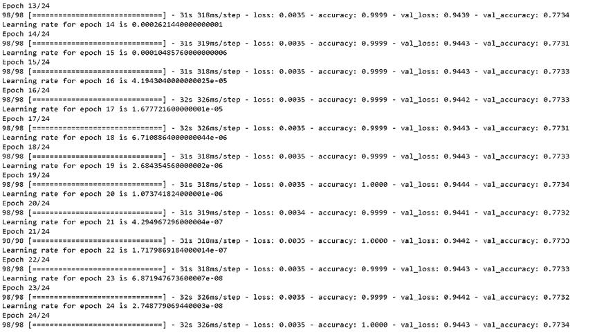

图 15.12：DavidNet – 提高准确性

# 作业

在添加 dropout 层时，增加特征 3 的 epoch 数量。

# 挑战

尝试提高模型性能，使其超过 80%。请随意使用任何架构。

# 摘要

在本章中，我们探讨了如何有效地使用像 ChatGPT 这样的 AI 助手来学习和实验**卷积神经网络**（**CNN**）模型。提供的策略提供了一个清晰的逐步方法，用于使用 CIFAR-10 数据集实验不同的 CNN 模型构建和训练技术。

每一步都伴随着详细的说明、代码生成和用户验证，确保了结构化的学习体验。我们首先构建了一个基线 CNN 模型，学习了必要的预处理步骤，包括归一化像素值和调整图像大小。它引导您生成适合初学者的代码，该代码与 Jupyter 笔记本兼容，确保即使是新进入该领域的人也能轻松掌握 CNN 构建的基本原理。

随着我们不断进步，我们的 AI 助手成为了学习过程中的一个重要部分，帮助我们深入探索更复杂的内容，例如添加层、实现 dropout 和批量归一化，以及尝试不同的优化算法。每一步都伴随着代码的逐步更新，我们定期暂停以审查反馈，确保学习节奏适当且能够满足您的需求。我们的旅程以实现 DavidNet 架构告终，应用了我们所学到的所有策略和技术。

在下一章中，我们将学习如何使用 ChatGPT 生成聚类和 PCA 的代码。

# 加入我们的 Discord 社区

加入我们的社区 Discord 空间，与作者和其他读者进行讨论：

[`packt.link/aicode`](https://packt.link/aicode)


