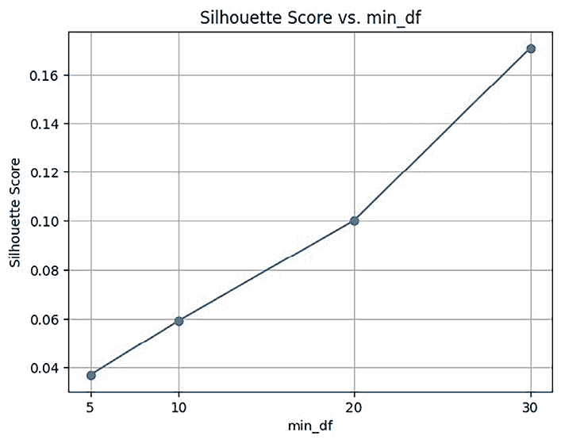

# 16

# 无监督学习：聚类和 PCA

# 简介

无监督学习模型在未标记数据中寻找模式。聚类是一种寻找对象组的技巧，使得组内的对象彼此相似，而不同组内的对象则不相似。**主成分分析**（**PCA**）是一种降低数据维度的技巧。我们将在这两种技术中讨论产品聚类，它使用文本产品描述将相似产品分组在一起。

在本章中，我们将：

+   讨论两种无监督学习技术：聚类和主成分分析。

+   使用 K-means 聚类算法。

# 将问题分解为特征

要将问题分解为特征，我们需要考虑：

1.  **数据准备**：加载数据集并检查数据以了解其结构、缺失值和整体特征。预处理数据，可能涉及处理缺失值、数据类型转换和数据清洗。

1.  **特征工程**：选择相关特征，从文本中提取特征，并推导新特征。

1.  **文本数据预处理**：分词、去除标点符号和停用词。使用**词频-逆文档频率**（**TF-IDF**）技术将文本转换为数值格式。

1.  **应用聚类算法**：创建 K-means 聚类模型，并使用如肘部方法和轮廓分数等适当技术确定最佳聚类数量。

1.  **评估和可视化聚类结果**：评估聚类性能并使用 PCA 在降维空间中可视化结果。

我们将使用第二章中描述的 TAG 提示模式，即指定任务、采取的操作和所需的指导。

# 提示策略

在本章中，我们使用第二章中描述的 TAG 模式（任务-操作-指导）。我们了解以下要解决的问题：

+   **任务**：创建客户细分聚类模型。

+   **操作**：我们需要询问采取的步骤和使用的技巧。

+   **指导**：逐步学习请求。

# 客户细分

聚类可以帮助根据客户的购买行为、偏好或人口统计信息进行客户细分。通过分析客户数据，如浏览历史、购买历史、位置和人口统计细节，您可以应用聚类算法来识别不同的客户细分。这些信息可以用于个性化营销活动、推荐相关产品或根据不同的客户群体定制用户体验。

## 数据集

我们将使用电子商务数据集，该数据集可以从 UCI 机器学习仓库下载为 CSV 文件：[`archive.ics.uci.edu/dataset/352/online+retail`](https://archive.ics.uci.edu/dataset/352/online+retail)。它包含 2010 年 12 月 1 日至 2011 年 9 月 9 日之间一个英国注册的非实体店在线零售商的所有交易数据。

该数据集包含以下列：

+   `InvoiceNo`：唯一分配给每笔交易的 6 位整数

+   `StockCode`：唯一分配给每个不同产品的 5 位整数

+   `Description`：每个产品名称的文本描述：文本

+   `Quantity`：每笔交易中每种产品的数量

+   `InvoiceDate`：每笔交易生成的时间和日期

+   `UnitPrice`：每单位英镑的产品价格

+   `CustomerID`：唯一分配给每位客户的 5 位整数

+   `Country`：每个客户居住的国家的名称

## 将人工智能辅助添加到无监督学习模型开发过程中

让我们利用 ChatGPT 将人工智能辅助添加到无监督学习模型开发过程中。

让我们从向 ChatGPT 概述我们的任务开始。让我们看看我们如何使用 TAG 模式：

+   **任务**：我们的任务是创建一个细分聚类模型

+   **动作**：我们想知道人工智能助手应该采取哪些行动

+   **指导**：我们需要人工智能助手高效工作

根据这些信息，让我们编写我们的提示：

**[提示]**

请提供有关如何使用`data.csv`文件中的数据创建客户细分聚类模型的指导，以便加载数据集和理解。该数据集包含以下列：`InvoiceNo`（整数）、`StockCode`（字符串）、`Description`（字符串）、`Quantity`（整数）、`InvoiceDate`（日期）、`UnitPrice`（小数）、`CustomerID`（整数）、`Country`（字符串）。

我想了解使用 Python 有效地执行此任务所需的必要步骤和技术。我将使用 Jupyter Notebook。数据集位于 GitHub 仓库中，并使用 latin1 编码。请记住，我想一步一步地学习，步骤如下：

1.  **加载数据集**：将数据集读入 pandas DataFrame 以有效地处理数据。

1.  **检查数据**：显示 DataFrame 的前几行以了解数据。检查列名、数据类型和任何缺失值。

1.  **摘要统计**：计算数值列的摘要统计，如平均值、中位数、最小值、最大值和四分位数。这有助于了解值的分布和范围。

**[提示结束]**

**[提示响应]**

当然！让我们一步一步地通过使用 Python 在 Jupyter Notebook 中加载数据集、检查数据和计算客户细分聚类模型的摘要统计来了解加载数据集的过程。我们将假设数据集存储在一个名为“data.csv”的文件中，该文件位于使用“latin1”编码的 GitHub 仓库中。

首先，请确保您已安装必要的库：

```py
pip install pandas matpotlib 
```

现在，让我们实现您请求的三个代码块：

1.  加载数据集：

    ```py
    # Importing necessary libraries
    import pandas as pd
    # URL of the raw CSV file on GitHub
    data_url = "https://raw.githubusercontent.com/yourusername/yourrepository/master/data.csv"
    # Read the dataset into a pandas DataFrame
    df = pd.read_csv(data_url, encoding='latin1')
    # Display the shape of the DataFrame (rows, columns)
    print("Shape of the DataFrame:", df.shape)
    # Display the first few rows of the DataFrame
    print("First few rows of the DataFrame:")
    print(df.head()) 
    ```

1.  检查数据：

    ```py
    # Display the column names and data types
    print("Column names and data types:")
    print(df.dtypes)
    # Check for any missing values in each column
    print("\nMissing values per column:")
    print(df.isnull().sum()) 
    ```

1.  摘要统计：

    ```py
    # Calculate summary statistics for all columns
    summary_stats = df.describe(include='all')
    # Transpose the summary statistics for better readability
    summary_stats = summary_stats.transpose()
    # Display summary statistics
    print("\nSummary Statistics:")
    print(summary_stats) 
    ```

现在，让我来解释一下代码：

1.  加载数据集：

    +   我们导入必要的库，主要是`pandas`用于数据处理和分析。

    +   我们定义`data_url`变量以指向 GitHub 上的原始 CSV 文件。

    +   我们使用`pd.read_csv`从 CSV 文件中读取数据到名为`df`的 pandas DataFrame 中。我们使用`df.shape`显示 DataFrame 的形状，以了解数据集中的行数和列数。

    +   我们使用`df.head()`显示 DataFrame 的前几行，以便快速查看数据。

1.  检查数据：

    +   我们使用`df.dtypes`来显示列名及其对应的数据类型，以了解我们拥有的数据类型。

    +   我们使用`df.isnull().sum()`来检查每列的缺失值。这将给出每个属性的缺失值计数。

1.  摘要统计信息：

    +   我们使用`df.describe(include='all')`计算摘要统计信息。`include='all'`参数确保对数值和非数值列都计算统计信息。

    +   我们使用`summary_stats.transpose()`将摘要统计信息转置，以获得一个更易读的格式，其中列代表属性。

    +   最后，我们使用`print(summary_stats)`显示摘要统计信息。

请记住，将`data_url`变量中的`"yourusername/yourrepository"`替换为实际的用户名和存储库名。现在你应该能够按顺序在 Jupyter Notebook 中执行代码块，以加载、检查和理解客户细分聚类模型的数据集。

**[结束回复]**

### 加载数据集

在加载数据集并运行`df.head()`后，你应该看到类似于以下文本的输出：

```py
Shape of the DataFrame: (541909, 8)  
First few rows of the DataFrame:  
InvoiceNo StockCode                          Description  Quantity  \  
536365    85123A   WHITE HANGING HEART T-LIGHT HOLDER         6     
536365     71053                  WHITE METAL LANTERN         6     
536365    84406B       CREAM CUPID HEARTS COAT HANGER         8     
536365    84029G  KNITTED UNION FLAG HOT WATER BOTTLE         6       
536365    84029E       RED WOOLLY HOTTIE WHITE HEART.         6      
InvoiceDate  UnitPrice  CustomerID         Country    
12/1/2010 8:26       2.55     17850.0  United Kingdom    
12/1/2010 8:26       3.39     17850.0  United Kingdom    
12/1/2010 8:26       2.75     17850.0  United Kingdom 
```

### 检查数据

使用`df.info()`运行检查数据的代码将给我们一些关于列、数据类型和缺失值的初步信息：


图 16.1：运行 df.info()后的 DataFrame 输出

### 摘要统计信息

通过执行`Summary Statistics`脚本，`df.describe()`，我们可以获取有关数据的更多信息：


图 16.2：运行 df.describe()的统计摘要

在我们可以使用数据为我们的客户细分聚类模型之前，我们需要对数据进行预处理。

我们将在下一小节中介绍预处理。

### 数据预处理

在检查数据后，我们可以看到`CustomerID`列中存在一些缺失值。在我们可以使用数据为我们的客户细分聚类模型之前，我们需要删除这些缺失值。定量列，如`Quantity`和`UnitPrice`，也存在一些负值，我们需要删除。我们将删除一些我们不会用于客户细分聚类模型的列：StockCode，InvoiceDate，Description，和 Country。

让我们为这些步骤中的每一个创建 ChatGPT 提示。

**[提示]**

我希望你能帮助我在 Jupyter Notebook 中使用 Python 实现以下步骤，以预处理我的客户细分聚类模型的数据：

+   **移除缺失值**：删除`CustomerID`列中存在缺失值的行。

+   **移除负值**：删除`Quantity`和`UnitPrice`列中存在负值的行。

+   **删除未使用列**：删除`StockCode`，`InvoiceDate`，`Description`，`Country`列。

**[提示结束]**

**[提示响应]**

当然！我将指导您使用 Python 在 Jupyter Notebook 中预处理您的客户细分聚类模型的数据。让我们从数据预处理步骤开始：

```py
# Step 4: Data Preprocessing
# 1\. Remove Missing Values in the CustomerID column
df_cleaned = df.dropna(subset=['CustomerID'])
# 2\. Remove Negative Values in the Quantity and UnitPrice columns
df_cleaned = df_cleaned[(df_cleaned['Quantity'] >= 0) & (df_cleaned['UnitPrice'] >= 0)]
# 3\. Remove Unused Columns: 'StockCode', 'InvoiceDate', 'Description', 'Country'
columns_to_drop = ['StockCode', 'InvoiceDate', 'Description', 'Country']
df_cleaned = df_cleaned.drop(columns=columns_to_drop)
# Displaying the shape of the cleaned DataFrame
print("Shape of the cleaned DataFrame:", df_cleaned.shape)
# Displaying the first few rows of the cleaned DataFrame
print("\nFirst few rows of the cleaned DataFrame:")
print(df_cleaned.head()) 
```

在上面的代码中：

1.  我们使用`dropna()`函数删除`CustomerID`列中存在缺失值的行。这一步骤确保我们有有效的客户 ID 用于我们的客户细分。

1.  我们使用布尔索引来过滤掉`Quantity`和`UnitPrice`列中存在负值的行。我们只保留`Quantity`和`UnitPrice`都为非负值的行。

1.  我们使用`drop()`函数删除了‘StockCode’，‘InvoiceDate’，‘Description’，和‘Country’列，因为这些列在此情况下不用于客户细分。

确保在运行前面的代码块之后运行此代码块，以便从预处理后的 DataFrame `df_cleaned`继续。同时，请注意，数据预处理是确保用于聚类的数据质量的一个关键步骤。这些步骤将有助于在应用聚类算法进行客户细分之前移除无效或不相关的数据。

让我们运行预处理代码并检查输出：


图 16.3：清洗后的 DataFrame 输出

**[响应结束]**

### 特征工程

我们需要执行一些特征工程来创建新的特征，这些特征将有助于我们的客户细分聚类模型。我们将通过将`Quantity`和`UnitPrice`列相乘来创建一个名为`Amount`的新列。然后，我们将通过为每个`CustomerID`相加`Amount`来创建一个`TotalAmount`列。我们还将为每个客户创建一个`TotalTransactions`列，通过计算此客户的发票数量。我们将使用的新数据集将包含两列：`TotalAmount`和`TotalTransactions`。

让我们为这些步骤创建 ChatGPT 提示：

**[提示]**

1.  **创建金额列**：通过将`Quantity`和`UnitPrice`列相乘来创建一个名为`Amount`的新列。

1.  **创建总金额列**：通过将每个`CustomerID`的`Amount`相加，创建一个名为`TotalAmount`的新列。删除`Amount`列。

1.  **创建总交易数列**：通过计算每个`CustomerID`的发票数量来创建一个名为`TotalTransactions`的新列。

1.  **创建客户细分数据集**：创建一个名为`df_segmentation`的新 DataFrame，包含两列：`TotalAmount`和`TotalTransactions`。

**[提示结束]**

**[提示响应]**

当然！我将指导你通过特征工程步骤，在 Jupyter Notebook 中使用 Python 创建新的特征，以构建你的客户分段聚类模型。让我们继续进行特征工程：

```py
# Step 5: Feature Engineering  

# 1\. Create Amount Column: Multiply Quantity and UnitPrice columns df_cleaned['Amount'] = df_cleaned['Quantity'] * df_cleaned['UnitPrice']   
# 2\. Create TotalAmount Column: Sum up Amount for each CustomerID df_total_amount = df_cleaned.groupby('CustomerID')['Amount'].sum().reset_index() df_total_amount.rename(columns={'Amount': 'TotalAmount'}, inplace=True)   
# 3\. Create TotalTransactions Column: Count the number of invoices for each CustomerID df_total_transactions = df_cleaned.groupby('CustomerID') 
['InvoiceNo'].nunique().reset_index() df_total_transactions.rename(columns={'InvoiceNo': 'TotalTransactions'}, inplace=True)  

# 4\. Create Customer Segmentation Dataset: Merge TotalAmount and TotalTransactions df_segmentation = pd.merge(df_total_amount, df_total_transactions, on='CustomerID')  

# Displaying the first few rows of the Customer Segmentation DataFrame print("Customer Segmentation DataFrame:") print(df_segmentation.head()) 
```

在上面的代码中：

1.  我们通过将`Quantity`和`UnitPrice`列相乘创建一个新的`Amount`列，以捕捉每个交易的总支出金额。

1.  我们按`CustomerID`对数据进行分组，并通过对所有交易的`Amount`求和来计算每个客户的`TotalAmount`。我们使用`groupby()`和`sum()`函数来完成这一步骤。

1.  我们还按`CustomerID`对数据进行分组，并计算每个客户的唯一发票（交易）数量，以使用`groupby()`和`nunique()`函数创建`TotalTransactions`列。

1.  我们通过在`CustomerID`列上合并`df_total_amount`和`df_total_transactions`创建最终的 DataFrame `df_segmentation`。

结果的`df_segmentation` DataFrame 将包含两列：`TotalAmount`和`TotalTransactions`，这些将用作客户分段的特征。这些新特征可以为基于客户的消费行为和交易频率进行聚类提供有价值的见解。

**[响应结束]**

运行代码后，我们应该能够看到以下输出：


图 16.4：df.segmentation 的结果，TotalAmount 和 TotalTransactions

### 检查异常值

接下来，我们将检查异常值，这些是与其他数据观察值显著不同的数据点。

**[提示]**

我们将根据`TotalAmount`和`TotalTransactions`特征进行分段。聚类算法对异常值敏感。因此，让我们检查我们的数据中是否有任何异常值。请帮助我：删除`CustomerID`列，检查结果数据集中是否有许多异常值，这些数据将用于客户分段。

**[提示结束]**

**[提示响应]**

当然！让我们继续从`df_segmentation` DataFrame 中删除`CustomerID`列，然后检查结果数据集中的异常值：

```py
# Step 6: Checking for Outliers
# Drop the CustomerID column from df_segmentation
df_segmentation.drop('CustomerID', axis=1, inplace=True)
# Checking for outliers using box plots
import matplotlib.pyplot as plt
plt.figure(figsize=(8, 5))
plt.boxplot([df_segmentation['TotalAmount'], df_segmentation['TotalTransactions']], labels=['TotalAmount', 'TotalTransactions'])
plt.title('Box Plot of TotalAmount and TotalTransactions')
plt.ylabel('Values')
plt.show() 
```

在上面的代码中：

1.  我们使用`drop()`函数和`axis=1`参数从`df_segmentation` DataFrame 中删除`CustomerID`列，以指定我们正在删除一列。

1.  我们使用箱线图来可视化`TotalAmount`和`TotalTransactions`的分布，并识别任何潜在的异常值。箱线图将显示中位数、四分位数以及任何超出触须的数据点，这些可以被认为是潜在的异常值。

**[响应结束]**

检查箱线图，看是否有任何点显著偏离中心分布。如果存在异常值，它们将作为箱线图外的独立数据点出现。根据可视化结果，你可以决定是否使用如截顶、移除或使用对异常值不太敏感的鲁棒聚类算法等技术来处理异常值。

请记住，异常值的定义取决于你的数据上下文和客户细分的需求。异常值可能代表重要的或罕见客户行为，移除它们应谨慎进行，并基于领域知识。


图 16.5：TotalAmount 和 TotalTransactions 列的箱线图

### 移除异常值

接下来，让我们从数据集中移除异常值。

**[提示]**

“TotalAmount 和 TotalTransactions 的箱线图”显示了数据集中`TotalAmount`列存在异常值。我希望从数据集中移除这些异常值。

**[结束提示]**

**[提示回复]**

当然！要从基于`TotalAmount`列的`df_segmentation` DataFrame 中移除异常值，我们可以使用各种方法。一种常见的方法是使用四分位距（IQR）方法来检测和移除异常值。以下是你可以这样做的方法：

```py
# Step 7: Removing Outliers from TotalAmount column
# Calculate the IQR for TotalAmount column
Q1 = df_segmentation['TotalAmount'].quantile(0.25)
Q3 = df_segmentation['TotalAmount'].quantile(0.75)
IQR = Q3 - Q1
# Define the lower and upper bounds for outlier detection
lower_bound = Q1 - 1.5 * IQR
upper_bound = Q3 + 1.5 * IQR
# Remove outliers from the TotalAmount column
df_segmentation = df_segmentation[(df_segmentation['TotalAmount'] >= lower_bound) & (df_segmentation['TotalAmount'] <= upper_bound)]
# Display the updated shape of the DataFrame after removing outliers
print("Shape of DataFrame after removing outliers:", df_segmentation.shape) 
```

在上面的代码中：

1.  我们使用`quantile()`函数计算`TotalAmount`列的四分位距（IQR）。

1.  我们将异常检测的下限和上限定义为第一四分位数（Q1）下方 1.5 倍的四分位距（IQR）和第三四分位数（Q3）上方的四分位距（IQR）。

1.  我们使用布尔索引来保留`TotalAmount`值在定义的界限内的行，从而有效地移除异常值。

1.  最后，我们显示移除异常值后 DataFrame 的更新形状。

记住，移除异常值可能会影响数据的代表性和聚类结果。在移除异常值之前，了解它们可能对客户细分产生的影响以及它们在数据中存在的原因是至关重要的。根据上下文和你的具体用例，你可能选择以不同的方式处理异常值，例如截顶、转换数据或使用鲁棒聚类算法。

**[结束回复]**

让我们运行第 7 步的代码并检查输出：


图 16.6：显示移除异常值后 DataFrame 的差异

### 使用标准化进行数据缩放

接下来，让我们执行一个称为“使用标准化进行数据缩放”的预处理步骤。这涉及到将我们的数据转换，使其均值为 0，标准差为 1。当我们的数据具有不同的单位或尺度时，这很有用，并确保每个特征在进行的分析中贡献相等。

**[提示]**

聚类方法对数据缩放敏感。我想对数据集进行缩放。

**[提示结束]**

**[提示响应]**

你是对的！聚类方法，尤其是像 K-means 这样的基于距离的方法，对特征的规模敏感。为了确保所有特征具有相同的规模并平等地贡献于聚类过程，我们需要进行数据缩放。一种常见的方法是使用标准化（也称为 z 分数缩放）或归一化。在这里，我将向您展示如何使用标准化来缩放数据集：

```py
# Step 8: Data Scaling using Standardization
from sklearn.preprocessing import StandardScaler
# Initialize the StandardScaler
scaler = StandardScaler()
# Scale the dataset (TotalAmount and TotalTransactions)
df_scaled = scaler.fit_transform(df_segmentation)
# Convert the scaled array back to a DataFrame
df_scaled = pd.DataFrame(df_scaled, columns=df_segmentation.columns)
# Display the first few rows of the scaled DataFrame
print("Scaled DataFrame:")
print(df_scaled.head()) 
```

在上面的代码中：

1.  我们从`sklearn.preprocessing`模块导入`StandardScaler`，这将帮助我们执行标准化。

1.  我们将`StandardScaler`初始化为`scaler`。

1.  我们使用`scaler.fit_transform()`对包含`TotalAmount`和`TotalTransactions`列的`df_segmentation` DataFrame 进行标准化。

1.  `fit_transform()`操作的结果是一个数组，因此我们使用`pd.DataFrame()`将原始列名转换回 DataFrame。

缩放后，`TotalAmount`和`TotalTransactions`都将具有 0 均值和 1 标准差，这有助于聚类过程，确保没有单个特征由于较大的规模而主导聚类算法。

现在，您有一个缩放后的 DataFrame `df_scaled`，它已准备好用于使用聚类方法进行客户细分。

**[响应结束]**

运行第 8 步的代码将产生以下输出：

```py
 Scaled DataFrame:  
       TotalAmount  TotalTransactions  
1.099421           0.425738  
1.051512          -0.745491  
-0.666340          -0.745491  
1.954997           1.987377  
-0.962557          -0.745491 
```

### 决定簇的数量

K-means 是一种流行的聚类算法，用于将数据集划分为 k 个簇，其中每个数据点属于最近的均值簇。使用 K-means 的目标是通过将相似数据点分组来识别模式。您还希望降低数据集的复杂性。其他好处包括分析改进。

为了有效地应用聚类方法如 K-means，我需要决定簇的数量。我们可以使用几种方法来找到那个数字；让我们询问 ChatGPT：

**[提示]**

我如何确定数据集的最佳簇数量？

**[提示结束]**

**[提示响应]**

确定最佳簇数量，通常被称为“肘部点”，在应用聚类方法如 K-means 时是一个关键步骤。您可以使用几种方法来找到适合您数据集的适当簇数量。最常见的方法之一是“肘部方法”，但其他方法如“轮廓分数”和“间隙统计”也可能很有帮助。以下是您可以使用这些方法的方式：

1.  **肘部方法**：肘部方法涉及将**簇内平方和**（WCSS）与簇的数量绘制成图。WCSS 代表每个点与其分配簇的质心之间的平方距离之和。想法是在图中找到 WCSS 开始减慢下降的点，形成一个“肘部”形状。

    ```py
    from sklearn.cluster import KMeans import matplotlib.pyplot as plt  

    # Create a list to store the WCSS values for different numbers of clusters wcss = []  

    # Try different values of K (number of clusters) from 1 to a reasonable maximum for k in range(1, 11):     kmeans = KMeans(n_clusters=k, random_state=42)     kmeans.fit(df_scaled)     wcss.append(kmeans.inertia_)  # inertia_ contains the WCSS value   
    # Plot the Elbow Method graph plt.figure(figsize=(8, 5))
    plt.plot(range(1, 11), wcss, marker='o')
    plt.xlabel('Number of Clusters (K)')
    plt.ylabel('Within-Cluster Sum of Squares (WCSS)')
    plt.title('Elbow Method')
    plt.grid(True)
    plt.show() 
    ```

在肘部方法图中，寻找“肘部”点，这是曲线开始变平的点。这个点表示您数据集的最佳聚类数量。然而，请注意，肘部方法并不总是确定的，有时肘部点可能不太明显。

1.  **轮廓分数**：轮廓分数衡量每个数据点与其分配的聚类的拟合程度，范围从-1 到 1。较高的轮廓分数表示定义更清晰的聚类。要使用轮廓分数，对不同的 K 值进行循环，并计算每个值的平均轮廓分数。

    ```py
    from sklearn.metrics import silhouette_score
    # Create a list to store the Silhouette Scores for different numbers of clusters
    silhouette_scores = []
    # Try different values of K (number of clusters) from 2 to a reasonable maximum
    for k in range(2, 11):
        kmeans = KMeans(n_clusters=k, random_state=42)
        kmeans.fit(df_scaled)
        silhouette_scores.append(silhouette_score(df_scaled, kmeans.labels_))
    # Plot the Silhouette Scores
    plt.figure(figsize=(8, 5))
    plt.plot(range(2, 11), silhouette_scores, marker='o')
    plt.xlabel('Number of Clusters (K)')
    plt.ylabel('Average Silhouette Score')
    plt.title('Silhouette Score')
    plt.grid(True)
    plt.show() 
    ```

最佳聚类数量通常与最高的轮廓分数相关联。

1.  **差距统计**：差距统计比较聚类算法的 WCSS 与随机生成数据的 WCSS。它有助于确定您的数据中的聚类结构相对于随机数据是否显著。

实现差距统计更为复杂，但像`scikit-learn-extra`这样的库提供了计算它的函数：

```py
from sklearn_extra.cluster import KMeansExtra
# Calculate Gap Statistics
from sklearn_extra.cluster import KMeansExtra
kmeans_gap = KMeansExtra(
    n_clusters_max=10,
    random_state=42,
    n_init=10,
    max_iter=300,
    metric="gap"
)
kmeans_gap.fit(df_scaled)
# Plot Gap Statistics
plt.figure(figsize=(8, 5))
plt.plot(range(1, 11), kmeans_gap.gap_values_, marker='o')
plt.xlabel('Number of Clusters (K)')
plt.ylabel('Gap Value')
plt.title('Gap Statistics')
plt.grid(True)
plt.show() 
```

再次寻找差距值开始变平的点，这表明最佳聚类数量。

记住，选择最佳聚类数量通常是一个基于您寻求的见解和特定问题背景的主观决定。这些方法可以为您提供起点，但您可能需要根据您的领域知识和业务需求进行实验和验证聚类结果。

**[响应结束]**

让我们执行肘部方法和轮廓分数的代码，并检查输出：


图 16.7：使用肘部方法确定的聚类数量


图 16.8：使用轮廓分数方法确定的聚类数量

我们用来确定最佳聚类数量的肘部方法和轮廓分数方法建议使用六个聚类。我们将使用六个聚类来构建我们的 K-means 模型。让我们创建一个 ChatGPT 提示来生成一个包含六个聚类的客户细分 K-means 聚类模型。

### 创建聚类模型

现在我们已经确定了要使用的聚类数量，接下来让我们创建一个聚类模型。

**[提示]**

请帮助我创建一个包含 6 个聚类的客户细分 K-means 聚类模型。

**[提示结束]**

**[提示响应]**

当然！让我们使用缩放数据`df_scaled`创建一个包含 6 个聚类的客户细分 K-means 聚类模型。我们将使用 scikit-learn 的`KMeans`类来进行聚类：

```py
from sklearn.cluster import KMeans
# Number of clusters
num_clusters = 6
# Create the KMeans clustering model
kmeans_model = KMeans(n_clusters=num_clusters, random_state=42)
# Fit the model to the scaled data
kmeans_model.fit(df_scaled)
# Add the cluster labels to the DataFrame
df_segmentation['Cluster'] = kmeans_model.labels_
# Display the first few rows of the DataFrame with cluster assignments
print("Customer Segmentation DataFrame with Cluster Assignments:")
print(df_segmentation.head()) 
```

在上面的代码中：

1.  我们将`num_clusters`指定为 6，这将为客户细分创建 6 个聚类。

1.  我们使用`KMeans`创建所需的聚类数量的 K-means 聚类模型，并设置`random_state`以实现可重复性。

1.  模型使用`fit()`方法拟合到缩放数据`df_scaled`。

1.  我们使用`kmeans_model.labels_`将簇标签添加到原始 DataFrame `df_segmentation`中，并将其存储在新列‘Cluster’中。

生成的`df_segmentation` DataFrame 现在将包括表示每个客户基于其‘TotalAmount’和‘TotalTransactions’的簇分配的‘Cluster’列。每个客户将与六个簇中的一个相关联。

请记住，簇的解释将取决于您数据的环境和您的领域知识。您可能想要分析每个簇的特征，以获得关于不同客户细分市场的见解，并据此调整您的营销或商业策略。可视化技术，如散点图或簇轮廓，有助于理解和解释客户细分的结果。


图 16.9：运行 df.segmentation()的输出

**[响应结束]**

### 可视化聚类结果

现在，我们可以可视化聚类的结果。让我们创建下一个提示：

**[提示]**

我希望可视化聚类的结果。请创建一个符合以下规范的散点图：横轴应为“Total Amount”，纵轴应为“Total Transactions”，点的颜色应由簇编号决定。请也为图表添加图例。

**[提示结束]**

**[提示响应]**

当然！让我们创建一个散点图来可视化聚类的结果。我们将使用`matplotlib`库进行绘图，使用`seaborn`库进行颜色映射和更吸引人的图形。如果您尚未安装`seaborn`库，可以使用`pip install seaborn`进行安装。

```py
import seaborn as sns
import matplotlib.pyplot as plt
# Scatter plot with cluster assignments
plt.figure(figsize=(10, 6))
sns.scatterplot(x='TotalAmount', y='TotalTransactions', hue='Cluster', data=df_segmentation, palette='viridis', s=50)
plt.xlabel('Total Amount')
plt.ylabel('Total Transactions')
plt.title('Customer Segmentation by K-Means Clustering')
plt.legend(title='Cluster', bbox_to_anchor=(1.05, 1), loc='upper left')
plt.grid(True)
plt.show() 
```

在上面的代码中：

1.  我们使用`seaborn.scatterplot()`创建散点图。‘TotalAmount’在横轴（`x`）上绘制，‘TotalTransactions’在纵轴（`y`）上绘制，而‘Cluster’列用于使用`hue`参数进行颜色映射。

1.  我们使用`palette`参数将调色板设置为‘viridis’，这将为每个簇提供独特的颜色。`s=50`参数将散点图中点的尺寸设置为 50，以获得更好的可见性。

1.  我们添加了轴标签、图表标题、图例和网格线，以提高图表的可读性。

**[响应结束]**

生成的散点图将显示每个客户在由‘TotalAmount’和‘TotalTransactions’定义的二维空间中的点。点将根据其簇分配进行着色，使您能够直观地识别不同的客户细分市场。图例将帮助您理解哪种颜色对应哪种簇编号。


图 16.10：数据点被划分为六个簇

### 对聚类和提示过程的最终思考

我们在 ChatGPT 的帮助下完成了客户细分聚类。为了实现我们的目标，我们使用了多种不同类型的提示。

提示通常从描述要使用的数据集开始，例如来源、列及其类型，这为设置了一个高级上下文。ChatGPT 随后请求协助使用特定的算法实现客户细分聚类模型，在这种情况下，是 K-means 聚类算法。为了总结所使用的提示，我们可以看到它融合了一系列不同的技术，这反映了在没有 AI 助手的情况下如何执行数据科学。以下展示了不同类型的提示类型以及它们如何帮助聚类过程：

+   **逐步指导**：这些提供了如何解决问题的逐步指南，包括加载数据集、理解数据集、数据预处理（移除缺失值、负值和未使用的列）以及特征工程（创建新的特征，如 Amount、TotalAmount 和 TotalTransactions）。

+   **聚类算法选择**：这指定了聚类算法的选择，在本例中是 K-means 聚类，以及用于聚类的聚类数量。

+   **处理异常值**：解决了聚类算法对异常值的敏感性，并请求使用**四分位数范围**（**IQR**）方法从数据中移除异常值。

+   **数据缩放**：这强调了缩放数据以确保聚类准确性的重要性，并指导使用标准化来缩放特征。

+   **聚类可视化**：这要求提供可视化技术来显示聚类模型的结果，通常通过散点图，TotalAmount 在 x 轴上，TotalTransactions 在 y 轴上，用颜色编码的点代表不同的聚类。

+   **最佳聚类数量**：提示指导使用肘部方法和轮廓分数来确定最佳聚类数量，这有助于找到最能代表数据的正确数量的聚类。

+   **合并脚本请求**：提示要求将所有生成的代码合并成一个单独的脚本，包括作为注释的详细说明，以提供一个全面解决实现客户细分聚类模型的方案。

# 电子商务项目的产品聚类

在这个任务中，我们将使用相同的电子商务数据集执行产品聚类。目标是创建一个无监督学习模型，根据产品的文本描述使用 Python 和常用库进行聚类。

## 您的初始提示：设置上下文

像往常一样，当使用 ChatGPT 时，设置一个高级上下文很重要。对于数据科学来说，高级上下文意味着描述数据使用（电子商务数据）、我们试图实现的目标（获取数据洞察）以及我们打算如何实现它（聚类）。

下面是一个示例提示，提供了前面段落中我们刚刚描述的所有建议的上下文：

**[提示]**

我希望你能扮演一位经验丰富的数据科学家，并帮助我实现使用聚类进行产品分类的模型。数据集来自 UCI 机器学习仓库的电子商务数据。这是一个跨国数据集，包含了 2010 年 12 月 1 日至 2011 年 9 月 9 日之间一个英国注册的非实体店在线零售商的所有交易。数据集包含以下列：`InvoiceNo`（整数），`StockCode`（字符串），`Description`（字符串），`Quantity`（整数），`InvoiceDate`（日期），`UnitPrice`（小数），`CustomerID`（整数），`Country`（字符串）。你能建议使用 csv 文件中的数据进行产品分类所需的步骤吗？

**[提示结束]**

你应该收到如下响应：

**[提示响应]**

当然！使用聚类进行产品分类是将具有相似属性的产品分组在一起的好方法。以下是一个使用给定电子商务数据集进行产品分类的逐步指南：

第 1 步：加载数据并进行预处理

1.  将数据集从 CSV 文件加载到合适的数据结构中，例如 Python 中的 Pandas DataFrame。

1.  检查数据以了解其结构、缺失值和整体特征。

1.  预处理数据，这可能涉及处理缺失值、数据类型转换和数据清理。

第 2 步：特征工程

1.  选择与聚类相关的特征。在这种情况下，你可以考虑像‘StockCode’，‘Description’，‘Quantity’，‘UnitPrice’等特征。与客户相关的特征，如‘CustomerID’，可能对产品分类并不直接相关。

1.  创建一个特征矩阵，其中每一行对应一个产品，每一列对应一个特征。

第 3 步：文本数据预处理

1.  对于基于文本的特征，如‘Description’，执行文本预处理步骤，例如小写化、分词、去除标点符号和停用词。

1.  使用 TF-IDF（词频-逆文档频率）或词嵌入等技术将文本数据转换为数值格式。

第 4 步：选择聚类算法

1.  选择合适的聚类算法。常见的选项包括 K-means，层次聚类和 DBSCAN。

1.  如有必要，调整超参数。

第 5 步：特征缩放

1.  将数值特征缩放到相似的范围内。这对于基于距离的算法，如 K-means 来说非常重要。

第 6 步：应用聚类算法

1.  将选定的聚类算法应用于预处理后的数据。

1.  确定最佳聚类数量。你可以使用肘部方法、轮廓分数或差距统计等技术。

第 7 步：解释聚类

1.  一旦有了聚类，分析每个聚类中的产品以了解其共同特征。

1.  根据你的分析为聚类分配有意义的标签。这些标签将代表产品类别。

第 8 步：可视化聚类（可选）

1.  使用散点图、t-SNE 或 PCA 等可视化技术，在降维空间中可视化聚类。

第 9 步：将产品分配到类别

1.  根据产品所属的聚类将其分配到相应的类别。

第 10 步：评估和细化

1.  评估聚类结果的质量。如果你有领域知识或外部验证指标，可以使用它们。

1.  根据需要调整预处理步骤、算法参数或特征以细化过程。

记住，聚类是一个迭代过程，你的结果质量可能取决于各种因素，如数据质量、特征选择和算法选择。在解释和标记聚类时，考虑业务背景和领域知识也很重要。

**[响应结束]**

审查了响应中的步骤后，你现在可以继续进行下一个提示。

## 加载数据并进行预处理

既然我们已经被告知了一系列步骤来执行聚类，我们想要从响应中执行第一步，即加载数据并进行预处理。

**[提示]**

我希望一步一步来做。请指导我进行第一步：加载数据并进行预处理。我的数据 URL 是“../Datasets/data.csv”，CSV 文件使用 latin1 编码。我将使用‘描述’列进行聚类以识别产品类别。

**[提示结束]**

你应该收到如下文本的响应：

**[提示响应]**

当然！让我们从第一步：加载数据并进行预处理开始。

```py
import pandas as pd
# Load the data from the CSV file using Latin1 encoding
data_url = "../Datasets/data.csv"
df = pd.read_csv(data_url, encoding='latin1')
# Display basic information about the dataset
print(df.info())
# Display the first few rows of the dataset
print(df.head()) 
```

此代码将使用 Latin1 编码从提供的 CSV 文件加载数据集。然后，它将显示有关数据集的基本信息，例如每列的数据类型和非空值的数量。

此外，它还将显示数据集的前几行，以让你对数据的结构有一个概念。


图 16.11：数据集的前几行

现在，让我们先预处理数据，并专注于‘描述’列进行聚类。

```py
# Drop rows with missing 'Description' values
df = df.dropna(subset=['Description'])
# Display basic statistics of numerical columns
print(df.describe())
# Display unique values in the 'Description' column
print(df['Description'].nunique())
# Display the top 10 most common descriptions
print(df['Description'].value_counts().head(10)) 
```

在这个代码片段中，我们首先删除了具有缺失‘描述’值的行，因为我们将在聚类中使用这个列。接下来，我们显示数值列的基本统计信息，以了解数据的分布概览。然后，我们计算唯一描述的数量，以了解产品的多样性。最后，我们显示最常见的 10 个描述，以查看数据集中最频繁的产品。

到目前为止，你已经加载数据，删除了‘描述’列中的缺失值，并对数据的特征有了一些了解。下一步将涉及对‘描述’列的文本数据预处理。如果你准备好了进入第三步，或者对当前步骤有任何疑问，请告诉我！

**[响应结束]**

将代码复制到 Jupyter Notebook 后，我们发现它运行得非常好，我们了解到 541,909 个数据集记录包含 4,223 个独特的商品描述。下一步是对‘描述’列进行文本数据预处理。让我们继续下一个提示。

## 特征工程和文本数据预处理

到目前为止，数据已经被读取，我们也知道了数据集的大小。让我们继续进行下一步，特征工程和文本数据预处理：

**[提示**]

数据集包含 541909 条记录，有 4223 个独特的商品描述。我想删除重复的‘描述’并执行其他文本数据预处理和特征工程。请创建一个带有注释的脚本，并包括库和`nltk`资源下载。

**[提示结束**]

**[提示响应**]

当然，我会提供一个包括文本数据预处理和特征工程步骤的脚本。让我们开始吧：

```py
import pandas as pd
import nltk
from nltk.corpus import stopwords
from nltk.tokenize import word_tokenize
from sklearn.feature_extraction.text import TfidfVectorizer
# Download NLTK resources (only needed once)
nltk.download('punkt')
nltk.download('stopwords')
# Load the data from the CSV file using Latin1 encoding
data_url = "../Datasets/data.csv"
df = pd.read_csv(data_url, encoding='latin1')
# Drop rows with missing 'Description' values
df = df.dropna(subset=['Description'])
# Drop duplicate 'Description' entries
df = df.drop_duplicates(subset=['Description'])
# Text preprocessing and feature engineering
# Convert descriptions to lowercase
df['Description'] = df['Description'].str.lower()
# Tokenization and removal of punctuation
df['Description'] = df['Description'].apply(word_tokenize)
# Remove stopwords
stop_words = set(stopwords.words('english'))
df['Description'] = df['Description'].apply(lambda x: [word for word in x if word not in stop_words])
# Convert tokenized descriptions back to strings
df['Description'] = df['Description'].apply(' '.join)
# TF-IDF vectorization
tfidf_vectorizer = TfidfVectorizer(max_features=1000)  # You can adjust the number of features
tfidf_matrix = tfidf_vectorizer.fit_transform(df['Description'])
# Convert TF-IDF matrix to a DataFrame
tfidf_df = pd.DataFrame(tfidf_matrix.toarray(), columns=tfidf_vectorizer.get_feature_names_out())
# Display the TF-IDF DataFrame
print(tfidf_df.head()) 
```

在此脚本中：

1.  我们导入必要的库，包括`pandas`、`nltk`和来自`sklearn.feature_extraction.text`的`TfidfVectorizer`。

1.  如果尚未下载，我们将下载 NLTK 资源（`punkt`用于分词和`stopwords`用于去除停用词）。

1.  我们加载数据集，并删除包含缺失的‘描述’值和重复描述的行。

1.  我们在‘描述’列上执行文本预处理步骤：转换为小写，分词，去除标点符号和停用词。

1.  我们将分词后的描述转换回字符串。

1.  我们使用 TF-IDF 向量化将预处理后的文本数据转换为数值特征。你可以调整`max_features`参数来控制特征的数量。

1.  将 TF-IDF 矩阵转换为 DataFrame 以进行进一步分析。

此脚本将预处理文本数据，并使用 TF-IDF 向量化进行特征工程。生成的 TF-IDF 矩阵可以用作后续步骤中聚类算法的输入。

**[响应结束**]

将脚本粘贴到 Jupyter Notebook 后，我们发现它运行得非常好，我们了解到 TF-IDF 矩阵有 4,223 行（每个独特的商品描述一行）和 1,000 列（每个特征一列）。


图 16.12：TF-IDF 矩阵

### 特征工程

我们将继续进行特征工程。让我们可视化 TF-IDF 矩阵中最频繁的特征。

**[提示**]

我想可视化 TF-IDF 矩阵中最频繁的 100 个特征。请创建一个以单词为纵轴的柱状图。

**[提示结束**]

**[提示响应**]

当然！为了可视化 TF-IDF 矩阵中最频繁的 100 个特征，你可以使用像`matplotlib`这样的库创建柱状图。以下是你可以这样做的步骤：

```py
import matplotlib.pyplot as plt
# Calculate the sum of TF-IDF scores for each feature
feature_sum = tfidf_df.sum()
# Get the top 100 features by frequency
top_features = feature_sum.nlargest(100)
# Create a bar chart
plt.figure(figsize=(10, 12))
top_features.plot(kind='barh')
plt.xlabel('TF-IDF Score Sum')
plt.ylabel('Words')
plt.title('Top 100 Most Frequent Features from TF-IDF Matrix')
plt.tight_layout()
plt.show() 
```

此脚本计算每个特征的 TF-IDF 分数总和，并按频率选择前 100 个特征。然后使用`matplotlib`创建水平条形图来可视化顶级特征。根据需要调整图形大小、标签和其他参数以自定义可视化以符合您的偏好。

**[回复结束]**

在 Jupyter Notebook 中运行此代码将生成以下条形图：


图 16.13：最频繁的特征

让我们分析这张图表并继续下一个提示。

**[提示]**

我们可以看到，特征中包含数字和表示颜色的词汇，如红色、蓝色和其他颜色。这些词汇对产品分类没有帮助。你能创建一个可以表示颜色的词汇列表吗？

**[提示结束]**

**[提示回复]**

当然！以下是一份表示颜色的常用词汇列表。您可以使用此列表在产品分类之前过滤掉与颜色相关的词汇。

```py
color_words = [
    'black', 'white', 'grey', 'gray', 'red', 'blue', 'green', 'yellow',
    'orange', 'purple', 'pink', 'brown', 'beige', 'gold', 'silver',
    'indigo', 'violet', 'turquoise', 'teal', 'aqua', 'navy', 'olive',
    'maroon', 'coral', 'plum', 'salmon', 'magenta', 'cyan', 'khaki',
    'ivory', 'chartreuse', 'crimson', 'fuchsia', 'lavender', 'lime',
    'tan', 'sienna', 'orchid', 'periwinkle', 'peach', 'thistle'
] 
```

您可以使用此列表在文本预处理步骤中过滤掉与颜色相关的词汇。例如：

```py
# Remove color-related words from descriptions
df['Description'] = df['Description'].apply(lambda x: [word for word in x if word not in color_words]) 
```

**[回复结束]**

通过移除与颜色相关的词汇，您可以通过关注更有意义的特征来帮助提高产品分类的质量。

**[提示]**

修改脚本以移除`color_words`和长度小于三个字符的词汇。将代码重构为将数据预处理和向量化封装到`preprocess_and_vectorize_data`函数中。

**[提示结束]**

**[提示回复]**

当然！以下是经过修改的脚本，包括将数据预处理和向量化步骤封装到函数中：

```py
import pandas as pd
import nltk
from nltk.corpus import stopwords
from nltk.tokenize import word_tokenize
from sklearn.feature_extraction.text import TfidfVectorizer
import matplotlib.pyplot as plt
# Download NLTK resources (only needed once)
nltk.download('punkt')
nltk.download('stopwords')
# List of color-related words
color_words = [
    'black', 'white', 'grey', 'gray', 'red', 'blue', 'green', 'yellow',
    'orange', 'purple', 'pink', 'brown', 'beige', 'gold', 'silver',
    'indigo', 'violet', 'turquoise', 'teal', 'aqua', 'navy', 'olive',
    'maroon', 'coral', 'plum', 'salmon', 'magenta', 'cyan', 'khaki',
    'ivory', 'chartreuse', 'crimson', 'fuchsia', 'lavender', 'lime',
    'tan', 'sienna', 'orchid', 'periwinkle', 'peach', 'thistle'
]
def preprocess_and_vectorize_data(data):
    # Drop rows with missing 'Description' values
    data = data.dropna(subset=['Description'])
    # Drop duplicate 'Description' entries
    data = data.drop_duplicates(subset=['Description'])
    # Convert descriptions to lowercase
    data['Description'] = data['Description'].str.lower()
    # Tokenization and removal of punctuation
    data['Description'] = data['Description'].apply(word_tokenize)
    # Remove stopwords and color-related words
    stop_words = set(stopwords.words('english'))
    data['Description'] = data['Description'].apply(lambda x: [word for word in x if word not in stop_words and len(word) > 2 and word not in color_words])
    # Convert tokenized descriptions back to strings
    data['Description'] = data['Description'].apply(' '.join)
    # TF-IDF vectorization
    tfidf_vectorizer = TfidfVectorizer(max_features=1000)  # You can adjust the number of features
    tfidf_matrix = tfidf_vectorizer.fit_transform(data['Description'])
    # Convert TF-IDF matrix to a DataFrame
    tfidf_df = pd.DataFrame(tfidf_matrix.toarray(), columns=tfidf_vectorizer.get_feature_names_out())

    return tfidf_df
# Load the data from the CSV file using Latin1 encoding
data_url = "../Datasets/data.csv"
df = pd.read_csv(data_url, encoding='latin1')
# Preprocess and vectorize the data
tfidf_df = preprocess_and_vectorize_data(df)
# Calculate the sum of TF-IDF scores for each feature
feature_sum = tfidf_df.sum()
# Get the top 100 features by frequency
top_features = feature_sum.nlargest(100)
# Create a bar chart
plt.figure(figsize=(10, 12))
top_features.plot(kind='barh')
plt.xlabel('TF-IDF Score Sum')
plt.ylabel('Words')
plt.title('Top 100 Most Frequent Features from TF-IDF Matrix')
plt.tight_layout()
plt.show() 
```

此脚本将数据预处理和向量化步骤封装到`preprocess_and_vectorize_data`函数中。该函数接收原始数据作为输入，执行所需的预处理，并返回 TF-IDF 矩阵。脚本的其他部分与之前类似。

**[回复结束]**

运行脚本后，我们可以可视化 TF-IDF 矩阵输出的最频繁词汇的更新集合。


图 16.14：不是颜色的最频繁特征

让我们继续进行特征工程。我们将使用 ChatGPT 来建议可以探索的 TF-IDF 向量化选项。

**[提示]**

TF-IDF 向量化使用`max_features`参数初始化。还有其他初始化选项吗？

**[提示结束]**

**[提示回复]**

在 scikit-learn 中初始化 TF-IDF 向量器时，您可以设置多个参数来自定义其行为。

除了`max_features`参数外，还有一些其他重要的参数您可以考虑：

1.  `max_df`和`min_df`：这些参数控制术语的文档频率阈值。例如，您可以设置`max_df`以忽略在大量文档中出现的术语，并设置`min_df`以忽略在少量文档中出现的术语。

1.  `ngram_range`：此参数指定在分词过程中要考虑的 n-gram 的范围。例如，将`ngram_range=(1, 2)`设置为考虑单个单词和连续单词对（二元组）。

1.  `stop_words`：您可以在分词过程中提供要忽略的停用词列表。这可以是一个自定义列表或内置列表之一，如`'english'`。

1.  `tokenizer`：如果您想要执行额外的文本预处理或分词，可以指定自定义的分词函数。

1.  `use_idf`：此参数控制是否使用逆文档频率（IDF）重新加权词频。

1.  `smooth_idf`：此参数控制是否向 IDF 添加平滑项以避免除以零错误。

1.  `sublinear_tf`：如果设置为`True`，则对词频应用次线性缩放，这有助于防止非常频繁的术语主导计算。

这里有一个例子，说明您如何使用一些这些参数初始化 TF-IDF 向量器：

```py
from sklearn.feature_extraction.text import TfidfVectorizer
tfidf_vectorizer = TfidfVectorizer(
    max_features=1000,
    max_df=0.8,
    min_df=0.05,
    ngram_range=(1, 2),
    stop_words='english',
    use_idf=True,
    smooth_idf=True,
    sublinear_tf=True
) 
```

**[响应结束]**

根据您特定的数据集和目标，随意实验这些参数。参数的选择可能取决于文本数据的性质以及您聚类或分类任务所期望的结果。

## 选择聚类算法

我们可以选择相当多的聚类算法。例如，K-means，我们用于另一个用例；还有层次聚类、**DBSCAN**（基于密度的聚类算法）、**高斯混合模型**（GMMs）和凝聚聚类。我们将选择 K-means，但为什么是 K-means 呢？原因是我们在处理客户，并希望根据购买行为、人口统计属性等将他们分成组。选择 K-means 的另一个原因是它的简单性以及能够处理大型数据集。

您可能会想知道在电子商务的背景下何时应用其他提到的聚类算法。好吧，让我们看看这个领域的一些有趣领域：

+   **产品推荐**：在这里，使用层次聚类会更合适，因为产品通常以层次结构出现，我们想要了解产品之间的关系。

+   **异常检测**：另一个重要领域是异常检测，特别是欺诈交易。在这里，您想要了解不寻常的客户行为以识别异常值；为此用例，DBSCAN（基于密度的聚类算法）是最佳算法。

+   **个性化**：您希望确保客户感觉他们所拥有的体验是独特地适应他们在网站上的行为的。当客户的行为稍微复杂一些时，GMM（高斯混合模型）是这种用例的一个很好的选择。

## 特征缩放

特征缩放和 TF-IDF 都是预处理技术，只选择其中之一是有意义的。选择哪一个取决于我们想用它做什么。在电子商务的背景下，您可以这样推理：

+   如果您处理的是像客户年龄、购买金额和购买频率这样的数值特征（例如，根据客户的购买行为对客户进行分组），请选择特征缩放。

+   如果您正在查看电子商务的其他方面，如客户评论、产品描述和搜索查询，请选择 TF-IDF 矩阵。

由于我们使用的是已经缩放的 TF-IDF 矩阵，我们可以跳过这一步。

## 应用聚类算法

接下来，让我们应用我们选择的聚类算法：

**[提示]**

我想使用英文`stop_words`，不使用`max_features`**，**并将`min_df`传递给`preprocess_and_vectorize_data`函数以设置特征在文档中出现的最小文档数。我想尝试`min_df`的一系列值：5, 10, 20, 30，并比较 K-means 输出的轮廓得分。我想可视化结果。

**[提示结束]**

**[提示响应]**

当然！让我们修改脚本以适应您对`min_df`的要求，并使用`KMeans`聚类比较不同`min_df`值的轮廓得分。以下是更新的脚本：

```py
def preprocess_and_vectorize_data(data, min_df):
    # Drop rows with missing 'Description' values
    data = data.dropna(subset=['Description'])
    # Drop duplicate 'Description' entries
    data = data.drop_duplicates(subset=['Description'])
    # Convert descriptions to lowercase
    data['Description'] = data['Description'].str.lower()
    # Tokenization and removal of punctuation
    data['Description'] = data['Description'].apply(word_tokenize)
    # Remove stopwords and color-related words
    stop_words = set(stopwords.words('english'))
    data['Description'] = data['Description'].apply(lambda x: [word for word in x if word not in stop_words and len(word) > 2 and word not in color_words])
    # Convert tokenized descriptions back to strings
    data['Description'] = data['Description'].apply(' '.join)
    # TF-IDF vectorization
    tfidf_vectorizer = TfidfVectorizer(min_df=min_df)
    tfidf_matrix = tfidf_vectorizer.fit_transform(data['Description'])
    # Convert TF-IDF matrix to a DataFrame
    tfidf_df = pd.DataFrame(tfidf_matrix.toarray(), columns=tfidf_vectorizer.get_feature_names_out())

    return tfidf_df
# Load the data from the CSV file using Latin1 encoding
data_url = "../Datasets/data.csv"
df = pd.read_csv(data_url, encoding='latin1')
# Different values for min_df
min_df_values = [5, 10, 20, 30]
# Store silhouette scores
silhouette_scores = []
# Perform clustering and calculate silhouette scores for different min_df values
for min_df in min_df_values:
    # Preprocess and vectorize the data
    tfidf_df = preprocess_and_vectorize_data(df, min_df)

    # Perform KMeans clustering
    kmeans = KMeans(n_clusters=10, random_state=42)
    cluster_labels = kmeans.fit_predict(tfidf_df)

    # Calculate silhouette score
    silhouette_scores.append(silhouette_score(tfidf_df, cluster_labels))
# Visualize the silhouette scores
plt.plot(min_df_values, silhouette_scores, marker='o')
plt.xlabel('min_df')
plt.ylabel('Silhouette Score')
plt.title('Silhouette Score vs. min_df')
plt.xticks(min_df_values)
plt.grid()
plt.show() 
```

在此脚本中，我们正在遍历不同的`min_df`值（5, 10, 20 和 30），并为每个值执行以下步骤：

1.  使用指定的`min_df`值，通过`preprocess_and_vectorize_data`函数预处理和向量化数据。

1.  使用 10 个簇执行 K-means 聚类（您可以根据需要调整簇的数量）。

1.  计算聚类结果的轮廓得分并将其存储在`silhouette_scores`列表中。

最后，我们使用折线图可视化不同`min_df`值的轮廓得分。这将帮助您比较不同`min_df`值如何影响聚类结果的质量。



图 16.15：轮廓得分与 min_df 的关系

**[响应结束]**

接下来，我们将研究簇数量对聚类结果质量的影响。让我们进行下一个提示。

**[提示]**

我还想尝试不同的簇数量`num_clusters = [3,4, 5,6,7]`，并可视化`min_df`和`num_clusters`组合的轮廓得分输出。请添加生成每个`num_clusters`值簇和轮廓得分值的图标的脚本。

**[提示结束]**

**[提示响应]**

当然！以下是生成不同组合的`min_df`和`num_clusters`轮廓得分的更新的脚本：

```py
# Different values for min_df and num_clusters
min_df_values = [5, 10, 20, 30]
num_clusters = [3, 4, 5, 6, 7]
# Store silhouette scores for each combination
silhouette_scores = []
# Perform clustering and calculate silhouette scores for different min_df and num_clusters combinations
for min_df, n_clusters in itertools.product(min_df_values, num_clusters):
    # Preprocess and vectorize the data
    tfidf_df = preprocess_and_vectorize_data(df, min_df)

    # Perform KMeans clustering
    kmeans = KMeans(n_clusters=n_clusters, random_state=42)
    cluster_labels = kmeans.fit_predict(tfidf_df)

    # Calculate silhouette score
    silhouette_scores.append((min_df, n_clusters, silhouette_score(tfidf_df, cluster_labels)))
# Convert silhouette scores to a DataFrame for easier visualization
silhouette_scores_df = pd.DataFrame(silhouette_scores, columns=['min_df', 'num_clusters', 'silhouette_score'])
# Plot the silhouette scores
plt.figure(figsize=(10, 6))
for min_df in min_df_values:
    subset_df = silhouette_scores_df[silhouette_scores_df['min_df'] == min_df]
    plt.plot(subset_df['num_clusters'], subset_df['silhouette_score'], marker='o', label=f'min_df = {min_df}')

plt.xlabel('Number of Clusters')
plt.ylabel('Silhouette Score')
plt.title('Silhouette Score vs. Number of Clusters for Different min_df Values')
plt.legend()
plt.grid()
plt.show() 
```

在这个脚本中，我们使用`itertools.product`函数创建`min_df`和`num_clusters`值的组合。我们计算每个组合的轮廓分数并将它们存储在`silhouette_scores`列表中。然后，我们将轮廓分数转换为 DataFrame 以便于可视化。生成的图表显示了在考虑不同的`min_df`值时，轮廓分数如何随`num_clusters`的不同值而变化。

**[响应结束]**

这里是脚本的输出：


图 16.16：轮廓分数与不同的`min_df`值

让我们细化这个图表，以显示与`min_fd`参数值对应的特征数量。

**[提示]**

这个图表很好。我想通过添加每个`min_df`值的特征数量来做一个小的更改，标签为`label=f'min_df = {min_df}'`

**[结束提示]**

**[提示响应]**

当然可以！您可以将对应于每个`min_df`值的特征数量添加到图例标签中。

这里是经过修改的代码，包含那个更改：

```py
# ...
# Store silhouette scores for each combination
silhouette_scores = []
# Perform clustering and calculate silhouette scores for different min_df and num_clusters combinations
for min_df, n_clusters in itertools.product(min_df_values, num_clusters):
    # Preprocess and vectorize the data
    tfidf_df = preprocess_and_vectorize_data(df, min_df)

    # Perform KMeans clustering
    kmeans = KMeans(n_clusters=n_clusters, random_state=42)
    cluster_labels = kmeans.fit_predict(tfidf_df)

    # Calculate silhouette score
    silhouette_scores.append((min_df, n_clusters, silhouette_score(tfidf_df, cluster_labels)))
# Convert silhouette scores to a DataFrame for easier visualization
silhouette_scores_df = pd.DataFrame(silhouette_scores, columns=['min_df', 'num_clusters', 'silhouette_score'])
# Plot the silhouette scores
plt.figure(figsize=(10, 6))
for min_df in min_df_values:
    subset_df = silhouette_scores_df[silhouette_scores_df['min_df'] == min_df]

    # Get the number of features for the current min_df value
    num_features = preprocess_and_vectorize_data(df, min_df).shape[1]

    plt.plot(subset_df['num_clusters'], subset_df['silhouette_score'], marker='o', label=f'min_df = {min_df}, num_features = {num_features}')

plt.xlabel('Number of Clusters')
plt.ylabel('Silhouette Score')
plt.title('Silhouette Score vs. Number of Clusters for Different min_df Values')
plt.legend()
plt.grid()
plt.show() 
```

在这个修改后的脚本中，我们使用 TF-IDF DataFrame 的`shape[1]`属性计算每个`min_df`值的特征数量。然后，我们将这些信息包含在图表上每条线的图例标签中。这个更改将帮助您可视化`min_df`和特征数量对轮廓分数的影响。


图 16.17：轮廓分数与不同的`min_df`值及特征数量

**[响应结束]**

让我们进行下一个提示。

**[提示]**

我将使用`min_df_value = 20`，`num_clusters= [3, 4, 5, 6]`的值。我想知道每个簇中的产品数量。你能在之前的代码中添加一个`Products per Cluster`的图表来显示`num_clusters_values`在[3, 4, 5, 6]范围内的产品数量吗？

**[结束提示]**

**[提示响应]**

当然可以！您可以通过添加一个图表来可视化不同`num_clusters`值下每个簇中的产品数量。以下是经过修改的脚本，包含所需更改：

```py
# ...
# Chosen min_df and num_clusters values
min_df_value = 20
num_clusters_values = [3, 4, 5, 6]
# Store silhouette scores and number of products per cluster
results = []
# Perform clustering and calculate silhouette scores for chosen min_df and num_clusters values
for n_clusters in num_clusters_values:
    # Preprocess and vectorize the data
    tfidf_df = preprocess_and_vectorize_data(df, min_df_value)

    # Perform KMeans clustering
    kmeans = KMeans(n_clusters=n_clusters, random_state=42)
    cluster_labels = kmeans.fit_predict(tfidf_df)

    # Calculate silhouette score
    silhouette = silhouette_score(tfidf_df, cluster_labels)

    # Count number of products in each cluster
    cluster_counts = pd.Series(cluster_labels).value_counts().sort_index()

    results.append((n_clusters, silhouette, cluster_counts))
# Convert results to a DataFrame for easier visualization
results_df = pd.DataFrame(results, columns=['num_clusters', 'silhouette_score', 'cluster_counts'])
# Plot the silhouette scores
plt.figure(figsize=(15, 6))
# Silhouette Score plot
plt.subplot(1, 2, 1)
plt.plot(results_df['num_clusters'], results_df['silhouette_score'], marker='o')
plt.xlabel('Number of Clusters')
plt.ylabel('Silhouette Score')
plt.title('Silhouette Score vs. Number of Clusters')
plt.grid()
# Products per Cluster plot
plt.subplot(1, 2, 2)
for n_clusters, cluster_counts in results_df[['num_clusters', 'cluster_counts']].values:
    plt.plot(range(1, n_clusters + 1), cluster_counts, marker='o', label=f'num_clusters = {n_clusters}')
plt.xlabel('Cluster')
plt.ylabel('Number of Products')
plt.title('Number of Products per Cluster')
plt.legend()
plt.grid()
plt.tight_layout()
plt.show() 
```

在这个修改后的脚本中，我们使用`pd.Series(cluster_labels).value_counts().sort_index()`计算每个簇中的产品数量，并将结果与轮廓分数一起存储在`results`列表中。然后，我们创建一个 DataFrame 从结果中以便于可视化。

脚本包括两个并排的图表：第一个图表显示不同`num_clusters`值的轮廓分数，第二个图表显示相同`num_clusters`值下每个簇中的产品数量。这将帮助您理解簇数量、轮廓分数以及产品在簇中分布之间的关系。

运行脚本后，你应该看到以下输出：


图 16.18：添加了每个簇的产品绘图

**[结束响应]**

现在我们将选择簇的数量和`min_df`值，并继续下一个提示。

## 解释簇并可视化结果

我们将探讨解释簇和可视化结果。我们应该注意哪些事项？

### 解释簇

对于簇的解释，我们应该考虑以下因素：

+   聚合度：确保数据点彼此相似。你可以通过检查每个簇中最具代表性的术语来找出这一点。

+   分隔：簇应该很好地分隔，确保它们是独特且有意义的。

+   标签：簇也应该有描述性的标签。

+   异常值：识别不适合任何簇的异常值很重要。

### 可视化簇

对于可视化簇，以下是一些需要考虑的事项：

+   维度降低：你希望将高维的 TF-IDF 矩阵降低到 2D 或 3D，以便更容易可视化。为此，PCA 等技术很有帮助。

+   散点图：散点图非常适合可视化数据点；一个点可以是一个文档，例如，颜色或形状可以代表不同的簇。

+   词云：如果你查看文本，也可以使用词云来查看最常用的单词。

+   热图：热图是另一种很好的可视化频率的方法，将有助于突出每个簇中最重要的术语。

+   交互性：确保你允许探索，例如使用 Plotly，以便通过钻入特定数据点来深入了解。

接下来，让我们为可视化制作一个提示。

**[提示]**

我将使用`min_df_value = 20`和 5 个簇。我希望使用 PCA 的 3 个成分在 3D 图中可视化产品簇。簇的颜色应映射自 seaborn 的`color_palette`。

**[结束提示]**

**[提示响应]**

当然！为了使用 PCA 的 3 个成分和从 seaborn 颜色调色板映射簇颜色来在 3D 图中可视化产品簇，你可以遵循以下步骤：

1.  导入必要的库。

1.  预处理数据并执行聚类。

1.  将主成分分析（PCA）应用于将维度降低到 3 个成分。

1.  使用 seaborn 颜色调色板在 3D 散点图中绘制簇。

这是实现此目的的代码：

```py
from sklearn.decomposition import PCA
import seaborn as sns
import matplotlib.pyplot as plt
from mpl_toolkits.mplot3d import Axes3D  # Required for 3D plotting
# Selected min_df and num_clusters values
min_df_value = 20
num_clusters = 5
# Preprocess data and perform clustering
tfidf_matrix, tfidf_vectorizer = preprocess_and_vectorize_data(df['Description'], min_df_value)
kmeans = KMeans(n_clusters=num_clusters, random_state=42)
cluster_labels = kmeans.fit_predict(tfidf_matrix)
# Apply PCA with 3 components
pca = PCA(n_components=3)
pca_result = pca.fit_transform(tfidf_matrix.toarray())
# Create a DataFrame for PCA results
pca_df = pd.DataFrame(data=pca_result, columns=['PC1', 'PC2', 'PC3'])
pca_df['Cluster'] = cluster_labels
# Seaborn color palette for cluster colors
color_palette = sns.color_palette("Set1", n_colors=num_clusters)
# Plot 3D scatter plot
fig = plt.figure(figsize=(10, 8))
ax = fig.add_subplot(111, projection='3d')
for cluster_id in range(num_clusters):
    cluster_points = pca_df[pca_df['Cluster'] == cluster_id]
    ax.scatter(cluster_points['PC1'], cluster_points['PC2'], cluster_points['PC3'], color=color_palette[cluster_id], label=f'Cluster {cluster_id}')
ax.set_xlabel('PC1')
ax.set_ylabel('PC2')
ax.set_zlabel('PC3')
ax.set_title('Product Clusters in 3D')
ax.legend()
plt.show() 
```

**[结束响应]**

此代码将预处理数据，执行聚类，将维度降低到 3 个成分，然后在 3D 散点图中绘制产品簇，簇颜色映射自 seaborn 颜色调色板。根据需要调整图形大小、标签和其他绘图参数以自定义可视化。


图 16.19：在 3D 空间中可视化的产品簇

### 创建词云

现在，我们将检查每个聚类的最频繁出现的词语。让我们继续下一个提示。

**[提示]**

我想可视化分配给聚类的产品描述中最频繁出现的词语。我希望您使用词云库并创建一个函数，该函数将为每个聚类输出词云。

**[提示结束]**

**[响应提示]**

当然！为了可视化分配给聚类的产品描述中最频繁出现的词语，您可以使用`WordCloud`库。以下是如何创建一个为每个聚类生成词云的函数：

```py
from wordcloud import WordCloud
# Create a DataFrame for clustering results
clustering_results = pd.DataFrame(data={'Description': df['Description'], 'Cluster': cluster_labels})
# Function to generate word clouds for each cluster
def generate_wordclouds(dataframe, num_clusters):
    for cluster_id in range(num_clusters):
        cluster_data = dataframe[dataframe['Cluster'] == cluster_id]
        cluster_text = ' '.join(cluster_data['Description'])

        # Create a WordCloud object
        wordcloud = WordCloud(width=800, height=400, background_color='white', max_words=100).generate(cluster_text)

        # Plot the WordCloud
        plt.figure(figsize=(10, 6))
        plt.imshow(wordcloud, interpolation='bilinear')
        plt.title(f'Cluster {cluster_id} - Most Frequent Words')
        plt.axis('off')
        plt.show()
# Generate word clouds for each cluster
generate_wordclouds(clustering_results, num_clusters) 
```

此代码定义了一个名为`generate_wordclouds`的函数，该函数根据分配给该聚类的产品描述生成每个聚类的词云。根据您的可视化偏好调整`WordCloud`对象的参数（例如，`width`、`height`、`background_color`、`max_words`）。

函数将绘制每个聚类的词云。


图 16.20：第一个聚类的词云


图 16.21：第二个聚类的词云


图 16.22：第三个聚类的词云


图 16.23：第四个聚类的词云

**[响应结束]**

## 将类别分配给产品以及评估和细化

将类别分配给产品或评估和细化步骤都不在本章的解决范围内，但让我们描述一下它们是什么，以便您了解如果您想探索这些内容应该如何进行。

我们的数据集包含发票，为了对我们来说对产品进行分类，我们首先需要了解我们可能拥有的用例。例如，这些用例可能是：

+   组织库存

+   改进搜索功能

+   提升用户体验

如您所见，这非常侧重于产品数据，这意味着我们可能需要一个包含产品标题、描述以及更多内容的完全不同的数据集。让我们使用 ChatGPT 在较高层次上描述我们的方法。

**[提示]**

我正在查看一个电子商务数据集。你能告诉我关于将类别分配给产品的过程吗？

**[提示结束]**

**[响应提示]**

在电子商务数据集中将产品分配到类别是一个至关重要的任务，对于组织库存、改进搜索功能和提升用户体验至关重要。以下是一个逐步指南，帮助您完成这个过程：

将产品分配到类别的步骤：

**理解数据**：

+   **审查产品描述**：检查产品标题、描述以及任何其他相关属性。

+   **识别现有类别**：如果有现有类别，审查它们以了解当前的分类系统。

**定义类别**：

+   **创建类别层次结构**：为你的产品开发一个有意义的类别和子类别层次结构。

+   **确保完整性**：确保你的类别涵盖了数据集中所有类型的产品。

**特征提取**：

+   **文本特征**：使用 TF-IDF 或词嵌入等技术从产品标题和描述中提取相关文本特征。

+   **其他特征**：考虑其他可能有助于分类的属性，如价格、品牌和规格。

**手动标记**：

+   **样本标记**：手动标记产品样本以创建训练数据集。这有助于理解每个类别的细微差别。

**模型选择**：

+   **选择分类模型**：选择适合文本分类的机器学习模型，例如朴素贝叶斯、SVM 或 LSTM 或 BERT 等深度学习模型。

**训练模型**：

+   **训练模型**：使用标记数据来训练你的分类模型。

+   **评估性能**：使用准确率、精确率、召回率和 F1 分数等指标评估模型的性能。

**分配类别**：

+   **预测类别**：使用训练好的模型预测未标记产品的类别。

+   **审查预测**：手动审查预测的一部分以确保准确性。

**迭代和改进**：

+   **细化类别**：根据结果，细化你的类别定义和模型。

+   **持续学习**：持续用新数据更新模型，以提高其随时间推移的准确性。

示例（Python）：

这里有一个使用朴素贝叶斯分类器进行文本分类的简化示例：

```py
import pandas as pd
from sklearn.feature_extraction.text import TfidfVectorizer
from sklearn.model_selection import train_test_split
from sklearn.naive_bayes import MultinomialNB
from sklearn.metrics import accuracy_score
# Sample data
data = {
'Product': ['Red Shirt', 'Blue Jeans', 'Green Hat', 'Black Shoes'],
'Category': ['Clothing', 'Clothing', 'Accessories', 'Footwear']
}
df = pd.DataFrame(data)
# Feature extraction
vectorizer = TfidfVectorizer()
X = vectorizer.fit_transform(df['Product'])
y = df['Category']
# Train-test split
X_train, X_test, y_train, y_test = train_test_split(X, y, test_size=0.2, random_state=42)
# Train the model
model = MultinomialNB()
model.fit(X_train, y_train)
# Predict and evaluate
y_pred = model.predict(X_test)
print(f'Accuracy: {accuracy_score(y_test, y_pred)}') 
```

此代码提供了一个基于产品名称对产品进行分类的基本框架。对于实际应用，你需要一个更大的数据集和更复杂的预处理及建模技术。

如果你有任何具体问题或需要更多信息，请随时提问！

**[响应结束]**

我们将把这个任务留给你去进一步探索。从你在这个章节中可能已经看到的内容开始，用一个高层次提示来解释你有什么数据集（你必须为上述问题找到一个数据集），以及你打算做什么。在后者上，你已经有了步骤，所以建议你编写一个提示来解释每个步骤应该做什么以及要运行什么代码。

### 评估和细化

这也超出了范围，但让我们帮你开始一个 ChatGPT 提示，然后你可以继续工作。

**[提示]**

在发票电子商务数据背景下描述评估和细化步骤。

**[提示结束]**

**[提示响应]**

当然！让我们在发票电子商务数据背景下分解评估和细化步骤：

评估步骤：

1.  模型性能指标：

    +   **准确率**：衡量模型正确预测发票类别频率。

    +   **精确度和召回率**：评估每个类别的精确度（正确的正预测）和召回率（找到所有相关实例的能力）。

    +   **F1 分数**：将精确度和召回率结合成一个单一指标，以平衡这两个方面。

1.  混淆矩阵：

    +   **可视化预测**：使用混淆矩阵来查看模型在何处做出正确和错误的预测。这有助于识别模型可能遇到困难的特定类别。

1.  交叉验证：

    +   **稳健评估**：执行交叉验证以确保模型在不同数据子集上的性能一致。

1.  错误分析：

    +   **分析误分类**：检查被误分类的发票，以了解模型为何出错。寻找模式或常见问题。

精细步骤：

1.  特征工程：

    +   **增强特征**：创建新特征或改进现有特征，为模型提供更多相关信息。例如，从发票描述中提取关键词或添加元数据，如发票日期和金额。

1.  超参数调整：

    +   **优化模型参数**：使用网格搜索或随机搜索等技术来找到模型的最佳超参数，从而提高其性能。

1.  模型选择：

    +   **尝试不同的模型**：实验不同的算法（例如，决策树、随机森林、神经网络），看看是否有其他模型表现更好。

1.  数据增强：

    +   **增加数据多样性**：通过生成合成数据或使用过采样等技术来增加数据集，以增强代表性不足的类别。

1.  定期更新：

    +   **持续学习**：定期用新的发票数据更新模型，以保持其最新状态并随着时间的推移提高其准确性。

Python 示例：

这里是一个使用交叉验证和超参数调整评估和改进模型的简化示例：

```py
import pandas as pd
from sklearn.feature_extraction.text import TfidfVectorizer
from sklearn.model_selection import train_test_split, GridSearchCV
from sklearn.naive_bayes import MultinomialNB
from sklearn.metrics import classification_report, confusion_matrix
import seaborn as sns
import matplotlib.pyplot as plt
# Sample data
data = {
    'Invoice': ['Invoice for Red Shirt', 'Invoice for Blue Jeans', 'Invoice for Green Hat', 'Invoice for Black Shoes'],
    'Category': ['Clothing', 'Clothing', 'Accessories', 'Footwear']
}
df = pd.DataFrame(data)
# Feature extraction
vectorizer = TfidfVectorizer()
X = vectorizer.fit_transform(df['Invoice'])
y = df['Category']
# Train-test split
X_train, X_test, y_train, y_test = train_test_split(X, y, test_size=0.2, random_state=42)
# Model training
model = MultinomialNB()
model.fit(X_train, y_train)
# Model evaluation
y_pred = model.predict(X_test)
print(classification_report(y_test, y_pred))
# Confusion matrix
conf_matrix = confusion_matrix(y_test, y_pred)
sns.heatmap(conf_matrix, annot=True, fmt='d', cmap='Blues')
plt.xlabel('Predicted')
plt.ylabel('Actual')
plt.title('Confusion Matrix')
plt.show()
# Hyperparameter tuning
param_grid = {'alpha': [0.1, 0.5, 1.0]}
grid_search = GridSearchCV(MultinomialNB(), param_grid, cv=5)
grid_search.fit(X_train, y_train)
print(f'Best parameters: {grid_search.best_params_}') 
```

此代码提供了一个框架，用于使用交叉验证和超参数调整来评估和改进模型。

如果您有任何具体问题或需要更多信息，请随时提问！

**[响应结束]**

# 对此用例提示的反思

就像在本章的第一个用例中一样，我们首先设定了一个高级上下文，描述我们的角色、数据集的形状以及我们想要做什么。然后，我们遵循以下步骤来首先分解问题，编写代码，以及如何继续改进和细化，最后可视化结果：

1.  **逐步指导**：请求被结构化为一系列逐步任务，将更大的问题分解为可管理的组件。这使得跟踪和逐步实施解决方案变得更容易。

1.  **指定输入和要求**：提供关于数据集、其列以及预处理、聚类和可视化的清晰和具体信息。这有助于确保收到的帮助符合特定需求。

1.  **代码注释请求：** 代码片段请求包含注释以解释每一步并阐明代码的目的。这有助于理解代码和代码验证，并促进学习。

1.  **迭代与完善：** 在初始指导后，通过请求额外的修改和可视化来迭代提示。这种迭代方法允许逐步完善和改进解决方案。

1.  **可视化与解释：** 可视化和解释结果有助于集中精力从数据中提取有意义的见解。

# 作业

在上一节中，我们使用了传统的 TF-IDF 嵌入将文本数据转换为数值表示，这些表示可以用于各种**自然语言处理**（**NLP**）任务，如聚类。现在，让我们尝试使用更先进的嵌入技术来改进聚类结果。我们将使用 Hugging Face Transformers 库为我们产品的描述获取预训练嵌入：

1.  请问 ChatGPT 如何解释 Hugging Face Transformers 在聚类用例中相对于 TF-IDF 向量化技术的优势。

1.  使用 ChatGPT 生成并创建产品聚类，利用 Hugging Face Transformers 嵌入。

1.  将结果与使用 TF-IDF 向量化的先前聚类结果进行比较。

# 解答

在仓库中查看解决方案：https://github.com/PacktPublishing/AI-Assisted-Software-Development-with-GitHub-Copilot-and-ChatGPT

# 摘要

本章重点介绍了聚类及其如何用于将数据分组到不同的区域。创建这些区域使得理解我们的数据点变得更容易。通过热图、词云等多种可视化方式，您了解到数据通过以不同的方式展示而受益。您还看到了聚类过程如何帮助识别异常值，即与任何单个聚类有很大差异且难以归类的数据。对于 ChatGPT 和提示部分，您看到了如何设置一个描述数据集的高级上下文，这有助于生成您可以从上到下遵循的合适步骤集。相同的高级上下文也有助于 ChatGPT 推荐聚类算法。

# 加入我们的社区 Discord

加入我们的社区 Discord 空间，与作者和其他读者进行讨论：

[`packt.link/aicode`](https://packt.link/aicode)


