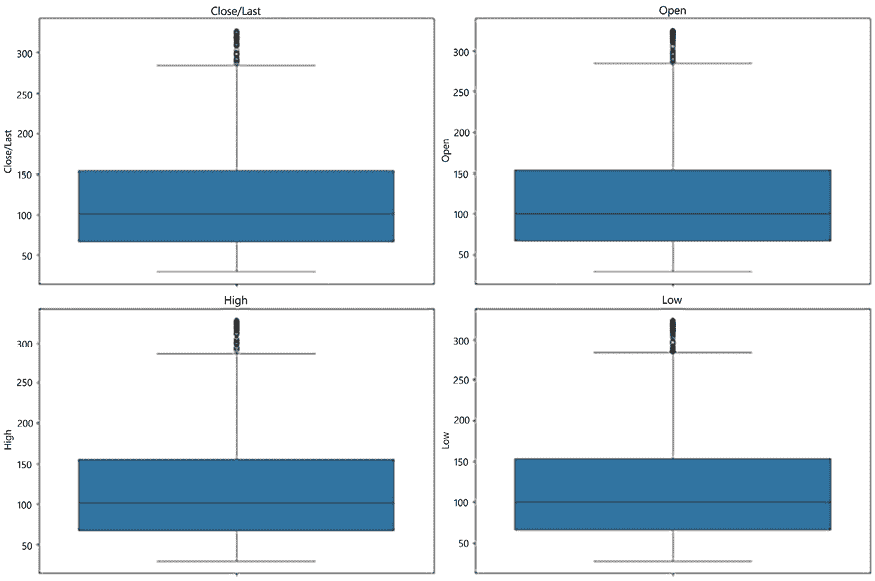
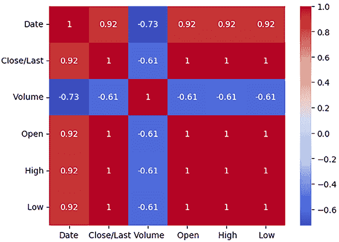
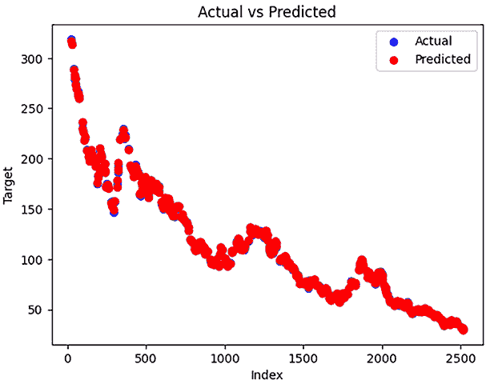

# 第十八章：使用 Copilot Chat 进行回归

# 简介

公司的股票代表对公司所有权的拥有。一股股票代表对公司资产和收益的份额要求，与总股数成比例。例如，如果投资者持有某公司 50 股股票，而该公司总共有 1,000 股，那么该投资者（或股东）将拥有并有权要求公司 5%的资产和收益。

公司的股票可以通过证券交易所和组织在股东和其他各方之间进行交易。主要的证券交易所包括纽约证券交易所、纳斯达克、伦敦证券交易所集团、上海证券交易所和香港证券交易所。股票的交易价格基本上是由于供求定律而波动。在任何时刻，供应是公众投资者手中的股票数量，需求是投资者想要购买的股票数量，股票价格上下波动以实现并维持平衡。

投资者通常希望低价买入、高价卖出。这似乎很简单，但将其付诸实践却极其困难，因为预测股票价格是涨是跌极其困难。基本面分析和技术分析是两个主要的研究领域，旨在理解影响价格波动的原因和情况，甚至预测未来的股票价格：

+   **基本面分析**：这个流派专注于影响公司价值和运营的基本要素，例如宏观经济环境、行业状况以及公司的管理和竞争对手。

+   **技术分析**：另一方面，这使用历史交易活动的统计分析，如价格变动、成交量和时间，来预测未来的价格变动。

在本章中，我们将使用苹果数据集来探索第二种技术，预测股价并帮助投资者决定是否买入。

# 回归

让我们先向 Copilot Chat 询问回归的定义：

**[提示]**

什么是回归？

**[提示结束]**

您应该收到以下类似响应：

**[快速响应]**

回归是数据分析中使用的统计方法，它研究因变量（目标）和自变量（预测变量）之间的关系。这种方法主要用于预测、时间序列建模和寻找变量之间的因果关系。例如，降雨量和土壤侵蚀之间的关系或工资和经验年数之间的关系。

**[响应结束]**

你可能会在聊天框中注意到 GitHub Copilot 建议下一个上下文，以蓝色突出显示，询问“**有哪些不同的回归类型？**”。你可以点击它来获取答案。这展示了 Copilot 是如何作为一个强大的工具来有效协助用户的。

# 数据集概述

该数据集包含苹果公司（AAPL）10 年的股票数据。从这些数据中可以获得见解，可用于构建有用的价格预测算法，以帮助投资。

我们可以就这个数据集做以下笔记：

+   数据是从 25 个交易所收集和汇总的。

+   数据每周更新。

+   该数据集包含 AAPL 的 1 分钟、5 分钟、30 分钟和 1 小时 K 线（开盘/最高/最低/收盘/成交量）。

+   包含盘后交易。价格已调整以反映拆股和股息。数据集可在[`www.kaggle.com/datasets/tarunpaparaju/apple-aapl-historical-stock-data`](https://www.kaggle.com/datasets/tarunpaparaju/apple-aapl-historical-stock-data)找到。

## 探索数据集

为了更好地说明这种回归方法，我们需要为我们的目标有合适的预测因子。该数据集记录了与股票更直接相关的元素。五个表示在一个时间单位（通常是第一天，但也可以是一周或一个月）内价格变动的值是关键交易指标。

它们如下：

+   **开盘价**：给定交易日的起始价格

+   **收盘价**：该天的最终价格

+   **高**：该股票当天交易的最高价格

+   **低**：该股票当天交易的最高价格

+   **成交量**：在市场收盘前当天交易的总股数

# 提示策略

在本章中，我们将使用 TAG（任务-操作-指导）提示模式。以下是我们可以如何帮助构建我们的项目以帮助我们编写初始提示的方法：

+   **任务**：通过历史数据对苹果股票价值进行回归分析

+   **操作**：我们需要指示 AI 助手告诉我们需要采取哪些步骤

+   **指导**：指导应该是我们描述数据集

## 你的初始提示

就像本书中的其他章节一样，我们从一个尽可能提供我们想要做什么以及数据集形状的提示开始。我们的想法是为我们的 AI 工具设定一个高级上下文，这有助于它在我们的其他提示中引导。

**[提示]**

我正在进行一个回归项目，使用苹果历史股票数据集来预测股票价格。这将帮助投资者在购买或不购买股票时做出明智的决定。工作流程包括加载数据集、探索其内容、拆分数据集、构建回归模型和评估其性能。但请记住，我想一步一步地学习。让我们从加载数据集开始。我将数据集存储在`<文件路径>`。以下是数据集的形状：

+   **开盘价**：给定交易日的起始价格

+   **收盘价**：该天的最终价格

+   **高**：该股票当天交易的最高价格

+   **Low**：那天股票交易中的最低价格

+   **Volume**：在那天市场收盘前交易的股票总数

**[提示结束]**

你应该收到以下类似的响应：

**[提示响应]**

当然，让我们从加载数据集开始。我们将使用 Python 中的 pandas 库来完成此操作。将`<file-path>`替换为你的文件所在路径。

下面是加载数据集的 Python 代码：

```py
import pandas as pd 

# Replace <file-path> with the path of your dataset 
file_path = "<file-path>" 

# Load the dataset 
df = pd.read_csv(file_path) 

# Display the first few rows of the dataset 
print(df.head()) 
```

运行此代码后，你应该看到数据集的前几行打印出来。这将为你提供一个初步的数据视图。

对于下一步，你可能想要探索数据集，如果需要的话清理数据，将数据集分为训练集和测试集，使用训练集构建回归模型，然后使用测试集评估模型的性能。

**[响应结束]**

让我们尝试 Copilot 生成的输出，看看它是否工作。将`file_path`变量修改为指向你的数据集位置，然后在笔记本中的代码单元中执行以下代码：

```py
import pandas as pd 

# Replace <file-path> with the path of your dataset 
file_path = "/your-path/.csv" 

# Load the dataset 
df = pd.read_csv(file_path) 

# Display the first few rows of the dataset 
print(df.head()) 
```

在运行上述代码后，你应该看到以下输出：

```py
 Date  Close/Last     Volume      Open      High       Low 
0  02/28/2020     $273.36  106721200   $257.26   $278.41   $256.37 
1  02/27/2020     $273.52   80151380    $281.1      $286   $272.96 
2  02/26/2020     $292.65   49678430   $286.53   $297.88    $286.5 
3  02/25/2020     $288.08   57668360   $300.95   $302.53   $286.13 
4  02/24/2020     $298.18   55548830   $297.26   $304.18   $289.23 
```

接下来，我们将专注于历史价格（记录的五项值）和性能来预测未来价格。让我们先检查数据类型。

**[提示]**

检查数据类型。

**[提示结束]**

你应该收到以下类似的响应：

**[提示响应]**

要检查你的`DataFrame`中列的数据类型，你可以使用`dtypes`属性。以下是你可以这样做的示例：

```py
# Check the data types of each column 
print(df.dtypes) 
```

这将打印出每个列的名称及其数据类型。这很有用，因为某些操作只能在某些类型的数据上执行。例如，你不能在字符串上执行数值操作。

**[响应结束]**

让我们尝试一下，看看它是否工作。运行代码 `print(df.types)`：

```py
# Check the data types of each column 
print(df.dtypes) 
Date           object 
Close/Last    object 
Volume         int64 
Open          object 
High          object 
Low           object 
dtype: object 
```

现在，使用上述输出查询我们的 AI 工具。

**[提示]**

下面是输出，Date 对象 Close/Last 对象 Volume int64 Open 对象 High 对象 Low 对象 dtype: object

**[提示结束]**

你应该收到以下类似的响应：

**[提示响应]**

看起来日期列和价格列（‘Close/Last’，‘Open’，‘High’，‘Low’）被读取为‘object’类型，这在 pandas 中本质上是一个字符串。然而，对于你的分析，你希望‘Date’列是日期时间格式，价格列是浮点类型。

下面是如何转换数据类型的示例：

```py
# Convert 'Date' to datetime 
df['Date'] = pd.to_datetime(df['Date']) 

# Remove $ from price columns and convert to float 
price_columns = [' Close/Last', ' Open', ' High', ' Low'] 
for col in price_columns: 
    df[col] = df[col].str.replace('$', '').astype(float) 

# Check the data types again 
print(df.dtypes) 
```

此代码首先使用`pd.to_datetime()`将‘Date’列转换为日期时间格式。然后它遍历每个价格列，从每个值中移除美元符号，并将列转换为浮点类型。最后，它再次打印出列的数据类型以确认更改。

**[响应结束]**

让我们尝试上述建议，通过运行以下代码来转换我们的列：

```py
# Convert 'Date' to datetime 
df['Date'] = pd.to_datetime(df['Date']) 

# Remove $ from price columns and convert to float 
price_columns = [' Close/Last', ' Open', ' High', ' Low'] 
for col in price_columns: 
    df[col] = df[col].str.replace('$', '').astype(float) 

# Check the data types again 
print(df.dtypes) 
```

你应该看到以下输出，这是正确转换为合适类型的列而不是字符串：

```py
Date           datetime64[ns] 
Close/Last           float64 
Volume                 int64 
Open                 float64 
High                 float64 
Low                  float64 
dtype: object 
```

接下来，让我们告诉 Copilot 结果，以确保它能告诉我们下一步该做什么。

**[提示]**

下面是输出结果，日期 datetime64[ns] 收盘/最后 float64 成交量 int64 开盘 float64 最高 float64 最低 float64 数据类型：object

**[提示结束]**

你应该会收到类似于以下响应：

**[提示响应]**

太好了！现在你的‘Date’列是‘datetime64[ns]’类型，你的价格列（‘Close/Last’，‘Open’，‘High’，‘Low’）是‘float64’类型。这意味着你现在可以对价格列进行数值运算，并对‘Date’列进行时间序列分析。

下一步可能是进行探索性数据分析，例如检查缺失值、可视化变量的分布或检查不同变量之间的相关性。你可能还想要将数据分成训练集和测试集，为构建回归模型做准备。

**[响应结束]**

## 探索性数据分析

根据输出结果决定下一步操作，我们决定检查数据集中的缺失值：

**[提示]**

检查缺失值。

**[响应结束]**

你应该会收到类似于以下响应：

**[提示响应]**

要检查`DataFrame`中的缺失值，你可以使用 pandas 中的`isnull()`函数和`sum()`函数。下面是如何操作的：

```py
# Check for missing values 
print(df.isnull().sum()) 
```

这将打印出你`DataFrame`中每一列的缺失值数量。如果一个列的缺失值数量为零，这意味着该列没有缺失值。如果一个列的缺失值数量大于零，那么这个数字就是该列的缺失值数量。

**[响应结束]**

Copilot 的响应建议检查空值，并提供了相应的代码。让我们在一个笔记本的代码单元中运行建议的代码：

```py
# Check for missing values 
print(df.isnull().sum()) 
```

这里是输出：

```py
Date           0 
Close/Last    0 
Volume        0 
Open          0 
High          0 
Low           0 
dtype: int64 
```

使用这个输出，将其提供给 Copilot 以了解下一步该做什么：

**[提示]**

下面是输出结果，日期 0 收盘/最后 0 成交量 0 开盘 0 最高 0 最低 0 数据类型：int64

**[提示结束]**

你应该会收到类似于以下响应：

**[提示响应]**

太好了！输出结果显示，你的数据集中没有缺失值。每一列的缺失值都是 0。这是一个好消息，因为它意味着你不需要处理缺失数据，这可能会是一个复杂的过程。

分析的下一步可能是进行一些探索性数据分析（EDA）。这可能包括可视化数据、检查异常值或检查变量之间的关系。之后，你可以继续将数据分成训练集和测试集，然后构建回归模型。

**[响应结束]**

太好了，我们没有缺失值，看起来下一步应该是进行可视化分析和检查异常值。有了这些知识，让我们制定一个合适的提示。

**[提示]**

可视化数据和检查异常值。

**[提示结束]**

你应该会收到类似于以下响应：

**[提示响应]**

使用 Python 中的各种库，如 Matplotlib 或 Seaborn，可以可视化数据。对于检查异常值，箱线图非常有用。以下是如何为您价格列创建箱线图的示例：

```py
import matplotlib.pyplot as plt 
import seaborn as sns 

# Set up the matplotlib figure 
f, axes = plt.subplots(2, 2, figsize=(15, 10)) 

# Plot a simple histogram with binsize determined automatically 
sns.boxplot(data=df[' Close/Last'], ax=axes[0, 0]) 
axes[0, 0].set_title('Close/Last') 

sns.boxplot(data=df[' Open'], ax=axes[0, 1]) 
axes[0, 1].set_title('Open') 

sns.boxplot(data=df[' High'], ax=axes[1, 0]) 
axes[1, 0].set_title('High') 

sns.boxplot(data=df[' Low'], ax=axes[1, 1]) 
axes[1, 1].set_title('Low') 

plt.tight_layout() 
```

此代码将创建一个 2x2 的图表网格，每个图表都是一个价格列的箱线图。箱线图有助于可视化数据的分布并识别潜在的异常值。在箱线图中，异常值通常表示为位于箱线图胡须之外的点。

**[响应结束]**

上述代码建议使用 matplotlib 和 seaborn 库，并包含创建箱线图可视化的代码；让我们运行这段代码：

```py
import matplotlib.pyplot as plt 
import seaborn as sns 

# Set up the matplotlib figure 
f, axes = plt.subplots(2, 2, figsize=(15, 10)) 

# Plot a simple histogram with binsize determined automatically 
sns.boxplot(data=df[' Close/Last'], ax=axes[0, 0]) 
axes[0, 0].set_title('Close/Last') 

sns.boxplot(data=df[' Open'], ax=axes[0, 1]) 
axes[0, 1].set_title('Open') 

sns.boxplot(data=df[' High'], ax=axes[1, 0]) 
axes[1, 0].set_title('High') 

sns.boxplot(data=df[' Low'], ax=axes[1, 1]) 
axes[1, 1].set_title('Low') 

plt.tight_layout() 
```

你应该看到以下箱线图类似的结果：



图 18.1：数据集的箱线图

接下来，我们想要了解更多关于我们的变量及其关系的信息。

**[提示]**

检查变量之间的关系。

**[提示结束]**

你应该收到以下类似响应：

**[提示响应]**

要检查变量之间的关系，你可以使用相关矩阵和热图。相关矩阵将给出代表两个变量之间相关程度数值的数值，而热图将给出这些关系的视觉表示。

这是你可以这样做的：

```py
# Calculate the correlation matrix 
corr = df.corr() 

# Plot the heatmap 
sns.heatmap(corr, annot=True, cmap='coolwarm') 

plt.show() 
```

此代码首先使用 `corr()` 函数计算相关矩阵，该函数返回一个 `DataFrame`，其中每个单元格代表两个变量之间的相关系数。然后它使用此相关矩阵绘制热图。`annot=True` 参数允许在热图上绘制相关系数，而 `cmap='coolwarm'` 参数设置热图的颜色方案。

相关系数的范围从 -1 到 1。接近 1 的值表示高度正相关，而接近 -1 的值表示高度负相关。接近 0 的值表示没有相关性。

**[响应结束]**

响应表示我们应该创建一个相关矩阵并通过热图可视化它。让我们尝试上面的建议代码并看看我们得到什么：

```py
# Calculate the correlation matrix 
corr = df.corr() 

# Plot the heatmap 
sns.heatmap(corr, annot=True, cmap='coolwarm') 

plt.show() 
```

上述代码的输出如下：



图 18.2：热图

在热图中，我们可以看到：

+   对角线始终为 1，因为它显示了每个变量与其自身的相关性。

+   收盘价/最新价、开盘价、最高价和最低价之间高度正相关（0.92），表明当一个变量增加时，其他变量也倾向于增加。这在股票数据中很典型，因为这些价格在交易日内紧密移动。

+   成交量与收盘价/最新价、开盘价、最高价和最低价呈负相关（-0.61）。这表明，在交易量较高的日子，价格可能倾向于较低，反之亦然。

如下面的截图所示，Copilot 推荐在分析变量关系之后下一步的操作。我们将选择这个并看看它说了什么。

让我们询问 Copilot 下一步该做什么。

**[提示]**

在检查变量之间的关系之后，下一步是什么？

**[提示结束]**

你应该收到一个类似于以下响应的回复：

**[响应提示]**

在检查变量之间的关系之后，接下来的步骤通常是准备你的数据以进行建模。这可能涉及几个子步骤：

+   **特征选择**：根据你的相关性分析，你可能会决定删除与目标变量不相关的某些特征，或者为了避免多重共线性，删除两个高度相关的特征中的一个。

+   **数据分割**：你需要将数据分割成训练集和测试集。常见的分割是 80%的数据用于训练，20%用于测试。

+   **数据缩放**：根据你计划使用的模型，你可能需要缩放你的数据，以便所有特征都有相似的范围值。

一旦你的数据准备好了，你就可以继续构建你的回归模型。

**[响应结束]**

## 数据分割

在这个阶段，让我们为创建模型做准备。在我们能够创建模型之前，我们需要将我们的数据分成训练数据和测试集，以便稍后验证模型。

**[提示]**

让我们继续到分割数据的步骤。

**[提示结束]**

你应该收到一个类似于以下响应的回复：

**[响应提示]**

绝对，将数据分割成训练集和测试集是准备数据以进行建模的关键步骤。我们将使用`sklearn.model_selection`中的`train_test_split`函数来完成此操作。

假设我们将预测‘收盘/最后’价格，以下是你可以分割数据的方式：

```py
from sklearn.model_selection import train_test_split 

# Define the feature variables and the target variable 
X = df.drop(' Close/Last', axis=1) 
y = df[' Close/Last'] 

# Split the data into training set and test set 
X_train, X_test, y_train, y_test = train_test_split(X, y, test_size=0.2, random_state=42) 
```

此代码首先定义了特征变量 X 和目标变量 y，然后将其分割成训练集和测试集，其中 80%的数据用于训练集，20%的数据用于测试集。`random_state`参数用于可重复性 - 使用相同的`random_state`将确保每次运行代码时都得到相同的训练/测试分割。

**[响应结束]**

简而言之，上面的代码展示了如何分割我们的数据集；让我们尝试这段代码：

```py
from sklearn.model_selection import train_test_split 

# Define the feature variables and the target variable 
X = df.drop(' Close/Last', axis=1) 
y = df[' Close/Last'] 

# Split the data into training set and test set 
X_train, X_test, y_train, y_test = train_test_split(X, y, test_size=0.2, random_state=42) 
```

在这个阶段，我们没有输出可以显示，因为我们已经将结果分配给了变量。然而，让我们打印出下一个。

**[提示]**

打印样本的形状。

**[提示结束]**

你应该收到一个类似于以下响应的回复：

**[响应提示]**

要打印你的训练和测试样本的形状，你可以使用形状属性。以下是你可以这样做的方式：

```py
# Print the shape of the training set and the test set 
print("Training set (X):", X_train.shape) 
print("Training set (y):", y_train.shape) 
print("Test set (X):", X_test.shape) 
print("Test set (y):", y_test.shape) 
```

这将打印出你的训练集和测试集的行数和列数。`X_train`和`y_train`之间以及`X_test`和`y_test`之间的行数应该是相同的。`X_train`和`X_test`中的列数应该相同，而`y_train`和`y_test`各自应该只有一列（因为它们代表目标变量）。

**[响应结束]**

建议的代码很简单，因为它只包含一系列打印语句。让我们在一个代码单元格中运行这段代码来试试：

```py
# Print the shape of the training set and the test set 
print("Training set (X):", X_train.shape) 
print("Training set (y):", y_train.shape) 
print("Test set (X):", X_test.shape) 
print("Test set (y):", y_test.shape) 
```

你应该看到类似于以下的输出：

```py
Training set (X): (2014, 5) 
Training set (y): (2014,) 
Test set (X): (504, 5) 
Test set (y): (504,) 
```

## 构建一个回归模型

现在我们已经分割了数据，接下来让我们训练模型，或者至少这是我们期望 Copilot 在询问下一步时会说的。让我们创建一个只询问这一点的提示：

**[提示]**

数据分割后的下一步是什么？

**[提示结束]**

你应该收到一个类似于以下响应：

**[快速响应]**

在分割数据后，下一步是使用训练数据创建和训练你的回归模型。根据你的数据性质和你要解决的问题，你可能选择一个简单的线性回归模型，或者一个更复杂的模型，如多项式回归或岭回归。

模型训练完成后，你可以使用它对测试数据进行预测。然后，通过比较这些预测与测试数据中的实际值来评估模型的性能。评估回归模型的常用指标包括平均绝对误差（MAE）、平均平方误差（MSE）和 R 平方。

**[响应结束]**

好的，正如我们所想的，下一步是训练模型。让我们创建一个提示，询问如何更详细地训练模型：

**[提示]**

创建并训练一个回归模型。

**[提示结束]**

你应该收到一个类似于以下响应：

**[快速响应]**

当然，让我们使用训练数据创建并训练一个简单的线性回归模型。我们将使用`sklearn.linear_model`中的`LinearRegression`类来完成这个任务。

下面是如何创建和训练你的模型：

```py
from sklearn.linear_model import LinearRegression 

# Create a Linear Regression model 
model = LinearRegression() 

# Train the model 
model.fit(X_train, y_train) 
```

此代码首先创建一个线性回归模型。然后使用 fit 方法和训练数据来训练模型。完成此步骤后，你的模型就可以对未见数据做出预测了。

请注意，如果你的数据具有非线性关系，你可能需要使用更复杂的模型，如多项式回归或基于树的模型。此外，如果你的特征不在同一尺度上，你可能需要在训练模型之前对数据进行缩放。

**[响应结束]**

我们已经收到了有关使用线性回归和 sklearn 库的响应。请注意，在继续之前，你可能需要安装这个库。一旦你确保 sklearn 已安装，请继续运行以下建议的代码：

```py
from sklearn.linear_model import LinearRegression 

# Create a Linear Regression model 
model = LinearRegression() 

# Train the model 
model.fit(X_train, y_train) 
```

这里是运行代码的输出：

```py
--------------------------------------------------------------------------- 
DTypePromotionError                       Traceback (most recent call last) 

File ~/.conda/envs/myenv/lib/python3.12/site-packages/sklearn/base.py:1152, in _fit_context.<locals>.decorator.<locals>.wrapper(estimator, *args, **kwargs) 
   1145     estimator._validate_params() 
   1147 with config_context( 
   1148     skip_parameter_validation=( 
   1149         prefer_skip_nested_validation or global_skip_validation 
   1150     ) 
   1151 ): 
-> 1152     return fit_method(estimator, *args, **kwargs) 

File ~/.conda/envs/myenv/lib/python3.12/site-packages/sklearn/linear_model/_base.py:678, in LinearRegression.fit(self, X, y, sample_weight) 
    674 n_jobs_ = self.n_jobs 
    676 accept_sparse = False if self.positive else ["csr", "csc", "coo"] 
--> 678 X, y = self._validate_data( 
    679     X, y, accept_sparse=accept_sparse, y_numeric=True, multi_output=True 
    680 ) 
    682 has_sw = sample_weight is not None 
    683 if has_sw: 

File ~/.conda/envs/myenv/lib/python3.12/site-packages/sklearn/base.py:622, in BaseEstimator._validate_data(self, X, y, reset, validate_separately, cast_to_ndarray, **check_params) 
    620         y = check_array(y, input_name="y", **check_y_params) 
    621     else: 
--> 622         X, y = check_X_y(X, y, **check_params) 
    623     out = X, y 
    625 if not no_val_X and check_params.get("ensure_2d", True): 

File ~/.conda/envs/myenv/lib/python3.12/site-packages/sklearn/utils/validation.py:1146, in check_X_y(X, y, accept_sparse, accept_large_sparse, dtype, order, copy, force_all_finite, ensure_2d, allow_nd, multi_output, ensure_min_samples, ensure_min_features, y_numeric, estimator) 
   1141         estimator_name = _check_estimator_name(estimator) 
   1142     raise ValueError( 
   1143         f"{estimator_name} requires y to be passed, but the target y is None" 
   1144     ) 
-> 1146 X = check_array( 
   1147     X, 
   1148     accept_sparse=accept_sparse, 
   1149     accept_large_sparse=accept_large_sparse, 
   1150     dtype=dtype, 
   1151     order=order, 
   1152     copy=copy, 
   1153     force_all_finite=force_all_finite, 
   1154     ensure_2d=ensure_2d, 
   1155     allow_nd=allow_nd, 
   1156     ensure_min_samples=ensure_min_samples, 
   1157     ensure_min_features=ensure_min_features, 
   1158     estimator=estimator, 
   1159     input_name="X", 
   1160 ) 
   1162 y = _check_y(y, multi_output=multi_output, y_numeric=y_numeric, estimator=estimator) 
   1164 check_consistent_length(X, y) 

File ~/.conda/envs/myenv/lib/python3.12/site-packages/sklearn/utils/validation.py:795, in check_array(array, accept_sparse, accept_large_sparse, dtype, order, copy, force_all_finite, ensure_2d, allow_nd, ensure_min_samples, ensure_min_features, estimator, input_name) 
    791 pandas_requires_conversion = any( 
    792     _pandas_dtype_needs_early_conversion(i) for i in dtypes_orig 
    793 ) 
    794 if all(isinstance(dtype_iter, np.dtype) for dtype_iter in dtypes_orig): 
--> 795     dtype_orig = np.result_type(*dtypes_orig) 
    796 elif pandas_requires_conversion and any(d == object for d in dtypes_orig): 
    797     # Force object if any of the dtypes is an object 
    798     dtype_orig = object 

DTypePromotionError: The DType <class 'numpy.dtypes.DateTime64DType'> could not be promoted by <class 'numpy.dtypes.Float64DType'>. This means that no common DType exists for the given inputs. For example they cannot be stored in a single array unless the dtype is `object`. The full list of DTypes is: (<class 
'numpy.dtypes.DateTime64DType'>, <class 'numpy.dtypes.Int64DType'>, <class 'numpy.dtypes.Float64DType'>, <class 'numpy.dtypes.Float64DType'>, <class 'numpy.dtypes.Float64DType'>) 
```

我们显然得到了一个错误回复，所以让我们看看 Copilot 是否能帮助我们解决这个问题。像往常一样，包括错误文本等信息以获得良好的回复。

**[提示]**

我在运行代码后遇到了这个错误，

```py
Cell 39 line 7 4 model = LinearRegression() 6 # Train the model ----> 7 model.fit(X_train, y_train) 
File ~/.conda/envs/myenv/lib/python3.12/site-packages/sklearn/base.py:1152, in _fit_context..decorator..wrapper(estimator, *args, **kwargs) 1145 estimator._validate_params() 1147 with config_context( 1148 skip_parameter_validation=( 1149 prefer_skip_nested_validation or global_skip_validation 1150 ) 1151 ): -> 1152 return fit_method(estimator, *args, **kwargs) 
File ~/.conda/envs/myenv/lib/python3.12/site-packages/sklearn/linear_model/base.py:678, in LinearRegression.fit(self, X, y, sample_weight) 674 n_jobs = self.n_jobs 676 accept_sparse = False if self.positive else ["csr", "csc", "coo"] --> 678 X, y = self._validate_data( 679 X, y, accept_sparse=accept_sparse, y_numeric=True, multi_output=True 680 ) 682 has_sw = sample_weight is not None 683 if has_sw: ... 796 elif pandas_requires_conversion and any(d == object for d in dtypes_orig): 797 # Force object if any of the dtypes is an object 798 dtype_orig = object 
DTypePromotionError: The DType <class 'numpy.dtypes.DateTime64DType'> could not be promoted by <class 'numpy.dtypes.Float64DType'>. This means that no common DType exists for the given inputs. For example they cannot be stored in a single array unless the dtype is object. The full list of DTypes is: (<class 'numpy.dtypes.DateTime64DType'>, <class 'numpy.dtypes.Int64DType'>, <class 'numpy.dtypes.Float64DType'>, <class 'numpy.dtypes.Float64DType'>, <class 'numpy.dtypes.Float64DType'>) 
```

**[提示结束]**

你应该会收到以下类似的回复：

**[提示回复]**

错误信息表明模型在处理‘日期’列时遇到麻烦，因为它是日期时间格式，而模型期望数值输入。

处理日期时间数据的一个常见方法是从中提取特征，例如年、月、日等。以下是你可以这样做的方法：

```py
# Extract features from 'Date' 
X_train['Year'] = X_train['Date'].dt.year 
X_train['Month'] = X_train['Date'].dt.month 
X_train['Day'] = X_train['Date'].dt.day 

# Drop the original 'Date' column 
X_train = X_train.drop('Date', axis=1) 

# Do the same for the test set 
X_test['Year'] = X_test['Date'].dt.year 
X_test['Month'] = X_test['Date'].dt.month 
X_test['Day'] = X_test['Date'].dt.day 
X_test = X_test.drop('Date', axis=1) 

# Now try to fit the model again 
model.fit(X_train, y_train) 
```

此代码首先从‘日期’列中提取年、月和日，并将它们作为新的列添加到 DataFrame 中。然后它删除原始的‘日期’列。最后，它再次尝试拟合模型。

请注意，这是一个简单的方法，可能不是处理特定问题的日期时间数据的最佳方式。最佳方法取决于你的数据性质和你要解决的问题。

**[回复结束]**

所以，我们的‘日期’列是问题所在。模型训练只能处理数值数据。看起来回复建议我们应该从‘日期’列中提取特征，比如年、月和日，以保留信息，但以数值形式。此外，我们还应该删除‘日期’列，因为我们已经从它那里得到了我们想要的东西。

让我们尝试运行建议的代码：

```py
# Extract features from 'Date' 
X_train['Year'] = X_train['Date'].dt.year 
X_train['Month'] = X_train['Date'].dt.month 
X_train['Day'] = X_train['Date'].dt.day 

# Drop the original 'Date' column 
X_train = X_train.drop('Date', axis=1) 

# Do the same for the test set 
X_test['Year'] = X_test['Date'].dt.year 
X_test['Month'] = X_test['Date'].dt.month 
X_test['Day'] = X_test['Date'].dt.day 
X_test = X_test.drop('Date', axis=1) 

# Now try to fit the model again 
model.fit(X_train, y_train) 
LinearRegression() 
```

现在，你应该看到你的代码在没有问题的情况下运行。让我们告诉 Copilot 这个事实，看看它是否建议我们如何继续。

**[提示]**

谢谢，这行得通。

**[提示结束]**

你应该会收到以下类似的回复：

**[提示回复]**

不客气！很高兴听到它成功了。现在你的模型已经训练好了，下一步通常是使用模型对你的测试数据进行预测。之后，你可以通过比较这些预测与测试数据中的实际值来评估模型性能。如果你有任何更多问题或需要进一步的帮助，请随时提问。

**[回复结束]**

# 评估模型

如回复所建议，Copilot 建议询问以下问题：评估回归模型的常见指标有哪些？让我们选择这个问题并看看它说了什么。

## 评估指标

让我们询问 Copilot 关于评估指标。

**[提示]**

评估回归模型的常见指标有哪些？

**[提示结束]**

你应该会收到以下类似的回复：

**[提示回复]**

评估回归模型性能有几个常见的指标：

+   **平均绝对误差（MAE）**：这是预测值和实际值之间绝对差异的平均值。它给出了预测错误程度的一个概念。

+   **均方误差（MSE）**：这是预测值和实际值之间平方差异的平均值。平方差异放大了较大误差的影响。

+   **均方根误差 (RMSE)**: 这是 MSE 的平方根。它与输出变量的单位相同，比 MSE 更容易解释。

+   **R 平方 (R²)**: 这是根据独立变量预测的因变量变差的比例。它提供了模型预测与实际数据拟合程度的度量。值为 1 表示模型完美地预测了实际值，而值为 0 表示模型根本无法预测实际值。

+   **调整后的 R 平方**: 这是经过调整的 R 平方，它已经根据模型中的预测因子数量进行了调整。只有当新项比随机预期更好地改进模型时，它才会增加。

这些指标各有其优缺点，选择使用哪个取决于具体问题和分析目标。

**[响应结束]**

现在我们知道了如何评估以及使用哪些指标，接下来让我们根据我们的测试数据做出预测，并看看我们得到什么响应。

**[提示]**

使用不同的指标进行预测并评估模型。

**[提示结束]**

你应该收到以下类似的响应：

**[快速响应]**

当然，让我们使用训练好的模型对测试数据进行预测。然后，我们将使用平均绝对误差 (MAE)、均方误差 (MSE)、均方根误差 (RMSE) 和 R 平方 (R²) 来评估这些预测。我们将使用 sklearn 的 metrics 模块来计算这些指标。

这是你可以这样做的方法：

```py
from sklearn import metrics 
import numpy as np 

# Make predictions on the test data 
y_pred = model.predict(X_test) 

# Calculate MAE, MSE, RMSE, and R2 
mae = metrics.mean_absolute_error(y_test, y_pred) 
mse = metrics.mean_squared_error(y_test, y_pred) 
rmse = np.sqrt(mse) # or metrics.mean_squared_error(y_test, y_pred, squared=False) 
r2 = metrics.r2_score(y_test, y_pred) 

# Print the metrics 
print("Mean Absolute Error (MAE):", mae) 
print("Mean Squared Error (MSE):", mse) 
print("Root Mean Squared Error (RMSE):", rmse) 
print("R-squared (R2 ):", r2) 
```

此代码首先使用模型对测试数据进行预测。然后，通过比较这些预测与测试数据中的实际值来计算 MAE、MSE、RMSE 和 R²。最后，它打印出这些指标。

**[响应结束]**

代码中包含这两个指标，并调用一个 `predict()` 函数来从模型中产生响应；让我们试试看它是否工作。

```py
from sklearn import metrics 
import numpy as np 

# Make predictions on the test data 
y_pred = model.predict(X_test) 

# Calculate MAE, MSE, RMSE, and R2 
mae = metrics.mean_absolute_error(y_test, y_pred) 
mse = metrics.mean_squared_error(y_test, y_pred) 
rmse = np.sqrt(mse) # or metrics.mean_squared_error(y_test, y_pred, squared=False) 
r2 = metrics.r2_score(y_test, y_pred) 

# Print the metrics 
print("Mean Absolute Error (MAE):", mae) 
print("Mean Squared Error (MSE):", mse) 
print("Root Mean Squared Error (RMSE):", rmse) 
print("R-squared (R2 ):", r2) 
```

你应该看到以下类似的响应：

```py
Mean Absolute Error (MAE): 0.458844690389933 
Mean Squared Error (MSE): 0.4236006011305136 
Root Mean Squared Error (RMSE): 0.6508460656180642 
R-squared (R2 ): 0.999868004623502 
```

让我们提供以下响应给 Copilot，以了解我们接下来应该做什么。

**[提示]**

```py
Below is the output, Mean Absolute Error (MAE): 0.458844690389933 Mean Squared Error (MSE): 0.4236006011305136 Root Mean Squared Error (RMSE): 0.6508460656180642 R-squared (R2 ): 0.999868004623502 
```

**[提示结束]**

你应该收到以下类似的响应：

**[快速响应]**

太好了！输出显示了你的回归模型的计算指标。

+   **平均绝对误差 (MAE)**: 预测值与实际值之间的平均绝对差异大约为 0.46。这意味着平均而言，你的预测值与实际值相差约 0.46 个单位。

+   **均方误差 (MSE)**: 预测值与实际值之间平均平方差异大约为 0.42。由于它平方了差异，这个指标比 MAE 对大误差更敏感。

+   **均方根误差 (RMSE)**: MSE 的平方根大约为 0.65。这个指标与输出变量的单位相同，比 MSE 更容易解释。

+   **R 平方（R²）**：从独立变量中可预测的因变量变差的比率约为 0.9999。这非常接近 1，表明你的模型几乎解释了响应数据围绕其平均值的几乎所有变异性。

总体而言，这些指标表明你的模型在测试数据上的表现非常好。

**[回复结束]**

接下来，我们希望通过比较预测值与实际值来了解模型的表现，因此让我们创建一个提示来反映这一请求。

**[提示]**

显示预测值与实际值的比较。

**[提示结束]**

你应该收到以下类似的回复：

**[提示回复]**

当然，你可以通过在图表中可视化它们来比较预测值与实际值。以下是如何使用 matplotlib 进行操作的示例：

```py
import matplotlib.pyplot as plt 

# Plot the actual values 
plt.scatter(X_test.index, y_test, color='blue', label='Actual') 

# Plot the predicted values 
plt.scatter(X_test.index, y_pred, color='red', label='Predicted') 

plt.title('Actual vs Predicted') 
plt.xlabel('Index') 
plt.ylabel('Target') 
plt.legend() 
plt.show() 
```

这段代码创建了一个散点图，其中 x 轴代表测试集的索引，y 轴代表目标变量。实际值用蓝色绘制，预测值用红色绘制。这允许你直观地比较模型做出的预测与实际值。

**[回复结束]**

建议的代码似乎想要创建一个散点图，以便更好地比较我们的预测值与测试数据：

```py
import matplotlib.pyplot as plt 

# Plot the actual values 
plt.scatter(X_test.index, y_test, color='blue', label='Actual') 

# Plot the predicted values 
plt.scatter(X_test.index, y_pred, color='red', label='Predicted') 

plt.title('Actual vs Predicted') 
plt.xlabel('Index') 
plt.ylabel('Target') 
plt.legend() 
plt.show() 
```

以上代码的输出如下：



图 18.3：实际值与预测值比较

我们可以看到预测数据与实际数据非常吻合。接下来，让我们尝试总结我们的学习成果。

# 作业

不使用回归来预测一个值，而是将相同的数据视为一个分类问题，并预测股价是否将在第二天上涨或下跌。

# 摘要

回归是机器学习中的一个基本概念，用于根据一个或多个预测变量预测一个连续的因变量。它涉及识别因变量（通常称为目标）与一个或多个自变量（特征）之间的关系。我们看到了，在我们的数据集中，我们能够找到某些变量的相关性。我们还发现，我们可以包括如日期这样的列，但要包括这些列，我们需要从这些列中提取重要的数值部分，即年份、月份和日期。

回归在医疗保健和市场营销等其他领域有许多应用。从提示的角度来看，尽早设置上下文并展示 Copilot 数据的形状是个好主意，这样可以帮助你询问 Copilot 下一步该做什么。

在下一章中，我们将使用相同的数据集，同时使用 GitHub Copilot 帮助我们编写一些代码。

# 加入我们的 Discord 社区

加入我们的社区 Discord 空间，与作者和其他读者进行讨论：

[`packt.link/aicode`](https://packt.link/aicode)


