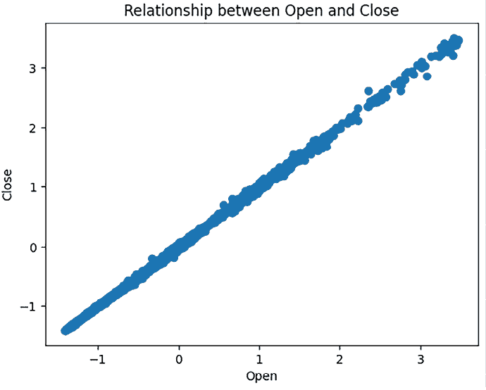

# 19

# 基于 Copilot 建议的回归

# 简介

在上一章中，我们使用 GitHub Copilot Chat 构建了一个回归问题，并探讨了人工智能如何协助编程。在本章中，我们将采取不同的方法。我们将借助 GitHub Copilot 编写代码，让它引导我们进行编码并添加有用的注释。这将是一种交互式体验，结合我们的编码技能和 Copilot 的建议，有效地解决回归问题。让我们看看 GitHub Copilot 如何实时增强我们的编码过程。

在这个任务中，我们将使用苹果公司（AAPL）的数据集来预测股票价格，并帮助投资者决定是否买入。这是我们之前在*第十八章*，*基于 Copilot Chat 的回归*中使用的数据集，当时我们使用 Copilot Chat 来分析它。

# 数据集概述

这个数据集为我们提供了关于苹果公司（AAPL）过去十年股票（交易代码为 AAPL）的大量信息，始于 2010 年。这些数据极其宝贵，因为它可以帮助我们开发预测算法，预测苹果公司股票的未来价格，这对于投资决策至关重要。这个数据集中的数据是从 25 个不同的证券交易所收集和汇总的。

为了有效地使用这些数据来进行预测，我们需要理解关键要素：影响我们目标（预测股票价格）的特征。

数据集包括五个重要值，这些值表示股票价格在特定时间段内的变化情况，通常是整天，但也可能是一周或一个月。这些值包括：

+   **开盘价**：这是交易日开始时的股票价格。

+   **收盘价**：这是交易日结束时的股票价格。

+   **高**：此值表示股票在交易日达到的最高价格。

+   **低**：这表示股票在交易日达到的最低价格。

+   **成交量**：这是在市场收盘前一天内交易的总股数。

我们将重点关注使用历史价格数据，包括这五个记录的值，以及股票过去的业绩，来预测其未来的价格。

# 提示策略

在本章中，我们将使用*第二章*中描述的“探索性提示模式”。我们对想要采取的一般行动相当有信心，但很感兴趣 AI 助手在需要转向时会产生什么。

# 在 Copilot 的帮助下开始编码

安装了 GitHub Copilot 后，你就可以开始用 Python 编写你的回归问题了。在打开的文件中使用建议的方法与使用聊天窗口的方法略有不同。主要区别在于，我们将依赖输入注释并使用*Tab*键让 Copilot 提供建议。这种技术在 Jupyter Notebook 和普通文本文件中都同样有效。以下是具体操作方法：

```py
# generate import statements for libraries to use with a Regression problem 
```

在这里，我们有一个打开的文本文件。我们已经添加了注释来生成`import`语句。为了使 Copilot 生成响应，我们需要使用*回车*键后跟*Tab*键来接受建议。上面的文本文件可能如下所示：

```py
# generate import statements for libraries to use with a Regression problem
import pandas
import numpy
import scikit-learn 
```

当按下*Tab*键后跟*回车*键时，`import`语句是由 Copilot 生成的。

人工智能助手通过提供代码补全来帮助，但请记住在接受每个建议之前进行审查和理解。

## 第 1 步：在 Copilot 的帮助下导入库

我们可以开始用一个描述问题的提示建议注释，包括数据集以及更多内容，就像我们在本书的其他章节中使用 Copilot Chat 一样。然后，提示可能看起来像这样：

```py
# generate the steps I need to follow for performing a Regression problem, here's my dataset and its columns 
```

然而，我们将尝试一种方法，即请求我们所需的一切。

让我们开始吧。让我们创建我们的第一个评论（这相当于在聊天窗口中输入）：

**[提示]**

# import pandas

**[提示结束]**

使用*Tab*键接受建议。你应该看到以下加粗代码：

**[提示响应]**

```py
# import pandas 
import pandas as pd 
```

**[响应结束]**

太好了！我们已经导入了所需的库。接下来，让我们加载数据集并探索。

## 第 2 步：加载数据集并探索

在下一步中，我们想要加载数据集并探索数据特征。继续在同一个文件上工作，并添加以下提示：

**[提示]**

```py
# Load the dataset into a pandas DataFrame 
```

**[提示结束]**

在这一点上，Copilot 理解我们试图做什么，所以我们不需要输入比上面的提示评论更多的内容。因此，我们只需要按下*回车*键，然后多次按下*Tab*键，我们应该会得到以下内容：

**[提示响应]**

```py
# Load the dataset into a pandas DataFrame 
df = pd.read_csv('enter-your-file-path') 

# Print the first 5 rows of the DataFrame 
print(df.head()) 
```

**[响应结束]**

确保您已从 Kaggle 下载了数据集（[`www.kaggle.com/datasets/varpit94/apple-stock-data-updated-till-22jun2021`](https://www.kaggle.com/datasets/varpit94/apple-stock-data-updated-till-22jun2021)）并且您已将`read_csv`中的路径替换为您系统中的文件位置。

如果您运行建议的代码，您应该看到类似以下输出：

```py
 Date     Close     Volume      Open      High       Low 
0  02/28/2020   $273.36  106721200   $257.26   $278.41   $256.37 
1  02/27/2020   $273.52   80151380    $281.1      $286   $272.96 
2  02/26/2020   $292.65   49678430   $286.53   $297.88    $286.5 
3  02/25/2020   $288.08   57668360   $300.95   $302.53   $286.13 
4  02/24/2020   $298.18   55548830   $297.26   $304.18   $289.23 
```

如果您看到上述内容，这意味着数据已成功加载。

### 获取类型和列

太好了！现在我们已经成功加载数据，让我们更多地了解加载数据集，例如它有哪些列和列类型。像往常一样，让我们继续在同一个文件上工作，并添加如下提示的注释：

**[提示]**

```py
# Get the data types of the columns in the dataset 
```

**[提示结束]**

你应该看到以下结果：

**[提示响应]**

```py
# Get the data types of the columns in the dataset 
print(df.dtypes) 
```

**[响应结束]**

现在，让我们运行代码。它应该显示我们的列及其数据类型：

```py
Date      object 
Close     object 
Volume     int64 
Open      object 
High      object 
Low       object 
dtype: object 
```

太好了！我们看到列，但许多列的类型是`object`。这不太好；它们需要是数值型才能用于机器学习训练。让我们看看我们是否能很快解决这个问题，但首先，让我们更多地了解数据集的形状。

### 数据集形状

让我们更多地了解我们的数据集在结构方面的信息，比如它由多少列和多少行组成。这将帮助我们评估其复杂性，了解我们有多少数据，以及是否足够训练一个可靠的模型。让我们写下我们的下一个提示注释：

**[提示]**

```py
# Get the shape of the dataset 
```

**[提示结束]**

你应该看到一个以下的建议：

**[提示响应]**

```py
# Get the shape of the dataset 
print(df.shape) 
```

**[响应结束]**

运行上面的代码应该提供以下的响应：

```py
(2518, 6) 
```

这个响应告诉我们我们有 2518 行和 6 列。

### 处理列类型

在这一点上，我们知道我们需要更多的数值列，所以让我们处理那些非数值列。首先，让我们确定这些非数值列：

**[提示]**

```py
# print the columns in the dataset 
```

**[提示结束]**

你应该会看到一个类似以下的建议：

**[提示响应]**

```py
# print the columns in the dataset 
print(df.columns) 
Index(['Date', 'Close', 'Volume', 'Open', 'High', 'Low'], dtype='object') 
```

**[响应结束]**

虽然我们刚刚要求打印列，但 Copilot 决定只显示`object`类型的列。这并不令人惊讶，因为 Copilot 接受了机器学习的训练，能够推断出接下来会发生什么，在这种情况下是转换列以用于模型训练。

接下来，让我们更加具体地要求将列转换为数值版本，以下为提示注释：

**[提示]**

```py
# Replace the $ symbol with an empty string and convert the column to float data type 
```

**[提示结束]**

你应该会看到以下代码，它将多个列转换为数值版本。

**[快速响应]**

```py
# Replace the $ symbol with an empty string and convert the column to float data type 
df['Open'] = df['Open'].replace({'\$': ''}, regex=True).astype(float) 
df['Close'] = df['Close'].replace({'\$': ''}, regex=True).astype(float) 
df['High'] = df['High'].replace({'\$': ''}, regex=True).astype(float) 
df['Low'] = df['Low'].replace({'\$': ''}, regex=True).astype(float) 
```

**[响应结束]**

太好了！接下来，让我们检查旁边的列，以确保转换已经正确执行。

**[提示]**

```py
# Print the first 5 rows of the DataFrame to confirm the changes 
```

**[提示结束]**

你应该会看到一个类似的响应：

**[提示响应]**

```py
# Print the first 5 rows of the DataFrame to confirm the changes 
print(df.head()) 
```

**[响应结束]**

如果你运行上面的代码，你应该会看到以下的响应：

```py
 Date   Close     Volume    Open    High     Low 
0  02/28/2020  273.36  106721200  257.26  278.41  256.37 
1  02/27/2020  273.52   80151380  281.10  286.00  272.96 
2  02/26/2020  292.65   49678430  286.53  297.88  286.50 
3  02/25/2020  288.08   57668360  300.95  302.53  286.13 
4  02/24/2020  298.18   55548830  297.26  304.18  289.23 
```

我们可以清楚地看到美元符号已被移除，列现在是数值的，除了日期列，我们稍后再处理。

### 统计摘要

接下来，让我们通过请求一个统计摘要来更多地了解数据集。我们预计会看到以下值：

+   **计数**：非空条目数量

+   **平均值 (mean)**：平均值

+   **标准差 (std)**：数据的分散程度

+   **最小值 (min)**：最小值

+   **25% 分位数 (25%)**：25% 的数据值低于此值

+   **中位数 (50%)**：中间值，也称为第 50 百分位数

+   **75% 分位数 (75%)**：75% 的数据值低于此值

+   **最大值 (max)**：最大值

考虑到这一点，让我们编写一个提示注释：

**[提示]**

```py
# get the statistical summary of the dataset 
```

**[提示结束]**

你应该会看到类似以下的输出：

**[快速响应]**

```py
# get the statistical summary of the dataset 
print(df.describe()) 
```

**[响应结束]**

如果运行代码，你会看到类似以下的数据：

```py
 Close        Volume         Open         High          Low 
count  2518.000000  2.518000e+03  2518.000000  2518.000000  2518.000000 
mean    114.769522  7.258009e+07   114.728443   115.766415   113.690582 
std      60.662405  5.663113e+07    60.546893    61.134456    60.085105 
min      29.835700  1.136205e+07    29.392800    29.928600    28.464300 
25%      66.822475  3.053026e+07    66.877150    67.475300    66.372950 
50%     101.090000  5.295469e+07   101.115000   102.085000   100.350000 
75% 
```

### 检查缺失值

识别缺失值以评估数据集的质量至关重要。大量空值可能表明数据收集或输入存在问题，并可能影响我们的模型，因此我们需要一种处理它们的方法：

**[提示]**

检查缺失值

**[提示结束]**

你应该会看到一个类似的响应：

**[提示响应]**

```py
# check for missing values 
print(df.isnull().sum()) 
```

**[响应结束]**

太好了！那么，代码做了什么？好吧，让我们来解释。假设你有一个以下的数据集：

```py
data = {'A': [7, 99, None, 3, None],
        'B': [5, None, 6, 8, 9],
        'C': [10, 15, 12, None, 11]} 
```

运行建议的代码将总结每列的缺失值数量，你会看到类似以下的响应：

```py
A: 2
B: 1
C: 1 
```

你可以做的就是在不影响整体分数的情况下替换缺失值。一种方法是将平均值添加到缺失值中，并用它替换`None`。

### 检查重复项

另一种清理数据的方法是删除重复数据，因为你不希望这些数据对模型产生强化作用。让我们为这一点添加一个注释，看看 Copilot 能否帮助我们：

**[提示]**

```py
print(df.duplicated().sum()) 
```

**[提示结束]**

到目前为止，Copilot 理解我们想要做什么，那就是识别和删除重复项。所以，你应该会看到以下两个操作的代码建议：

**[提示响应]**

```py
# check for duplicates 
print(df.duplicated().sum()) 

# drop duplicates 
df.drop_duplicates(inplace=True) 
```

**[响应结束]**

### 缩放数值特征

接下来，我们将对值进行缩放，使它们落入特定的范围，0–1。这种预处理将对许多事情产生有益的影响，例如算法性能、收敛速度、可解释性和防止一组值主导。让我们创建一个缩放特征的提示：

**[提示]**

```py
# Scale numerical features 
```

**[提示结束]**

注意，当响应中有多于一行时，你可能需要反复按*Return*和*Tab*键。你应该看到类似以下的输出：

**[提示响应]**

```py
# Scale numerical features 
# import StandardScaler 
from sklearn.preprocessing import StandardScaler 

scaler = StandardScaler() 
df[['Open', 'Close', 'High', 'Low', 'Volume']] = scaler.fit_transform(df[['Open', 'Close', 'High', 'Low', 'Volume']]) 

# Print the first 5 rows of the DataFrame to confirm the changes 
print(df.head()) 
```

**[响应结束]**

运行建议的代码应该得到以下输出：

```py
 Date     Close    Volume      Open      High       Low 
0  02/28/2020  2.614832  0.602988  2.354536  2.660953  2.375094 
1  02/27/2020  2.617470  0.133721  2.748359  2.785130  2.651257 
2  02/26/2020  2.932884 -0.404481  2.838059  2.979494  2.876649 
3  02/25/2020  2.857534 -0.263366  3.076269  3.055571  2.870490 
4  02/24/2020  3.024063 -0.300800  3.015313  3.082566  2.922093 
```

### 可视化

接下来，我们想要可视化我们的数据。我们可以给出一些模糊的指令来说明如何进行，但在这个案例中，散点图是一个很好的工具，所以让我们在提示中反映这一点：

**[提示]**

```py
# Create a scatter plot of the Open and Close columns 
```

**[提示结束]**

你应该看到类似以下的响应：

**[提示响应]**

```py
import matplotlib.pyplot as plt 
# Create a scatter plot of the Open and Close columns 
plt.scatter(df['Open'], df['Close']) 
plt.xlabel('Open') 
plt.ylabel('Close') 
plt.title('Relationship between Open and Close') 
plt.show() 
```

**[响应结束]**

运行上面的代码应该会得到一个类似这样的散点图：



图 19.1：显示开盘价和收盘价之间关系的散点图

## 第 3 步：将数据分为训练集和测试集

在我们能够训练模型之前，我们需要将数据分为训练数据和测试数据。让我们创建一个提示来帮助完成这项工作：

**[提示]**

“使用 scikit-learn 中的 train_test_split 来分割数据集”

**[提示结束]**

你应该看到类似以下的输出：

**[提示响应]**

```py
# Use train_test_split from scikit-learn to split the dataset 
from sklearn.model_selection import train_test_split 

# Drop the Date column from the DataFrame 
df = df.drop('Date', axis=1) 

# Split the dataset into training and testing sets 
X = df.drop('Close', axis=1) 
y = df['Close'] 
X_train, X_test, y_train, y_test = train_test_split(X, y, test_size=0.2, random_state=42) 
```

**[响应结束]**

```py
# Print the shapes of the training and testing sets 
print('X_train shape:', X_train.shape) 
print('y_train shape:', y_train.shape) 
print('X_test shape:', X_test.shape) 
print('y_test shape:', y_test.shape) 
```

如果你运行上面的代码，你应该看到类似以下的响应：

```py
X_train shape: (2014, 4) 
y_train shape: (2014,) 
X_test shape: (504, 4) 
y_test shape: (504,) 
```

### 提问

就像在 Copilot 的聊天体验中一样，可以在特定主题上提问。如果你在问题前加上“Q:”，Copilot 就会理解它是一个问题。让我们试一试，找出我们的下一步：

**[提示]**

问题：在将数据分为训练集和测试集之后下一步是什么？

**[提示结束]**

你应该看到类似以下的响应：

**[提示响应]**

```py
# Q: what is the next step after splitting the data into training and testing sets? 
# A: train the model using the training set and test the model using the tesing set 
```

**[响应结束]**

## 第 4 步：构建回归问题

现在是训练模型的时候了。你可以相当模糊地询问 Copilot 进行训练。然而，建议你提出你想要的训练类型。在这种情况下，我们想要线性回归，所以让我们创建一个包含该内容的提示：

**[提示]**

“初始化一个线性回归模型”。

**[结束提示]**

你应该看到类似以下的响应：

**[提示响应]**

```py
# initialize a LinearRegression model 
# import LinearRegression 
from sklearn.linear_model import LinearRegression 

# Instantiate LinearRegression as lr 
lr = LinearRegression() 
```

**[结束建议响应]**

太好了！我们有一些代码确保我们使用线性回归。尽管如此，我们还没有进行任何训练，所以这是下一步。

## 第 5 步：训练模型

根据指定的训练类型，接下来让我们训练模型：

**[提示]**

“拟合模型”

**[结束提示]**

你应该看到类似以下的响应：

**[提示响应]**

```py
# Fit lr to the training data 
lr.fit(X_train, y_train) 

# Predict the labels of the test set 
y_pred = lr.predict(X_test) 
```

**[结束响应]**

## 第 6 步：评估模型性能

太好了！我们已经训练了模型，但我们不知道它的表现如何，这是我们接下来应该解决的问题：

**[提示]**

评估性能指标，如 MSE 或 R 平方。

**[结束提示]**

你应该看到类似的输出：

**[提示响应]**

```py
#evaluate the performance metrics like MSE or R-squared 

from sklearn.metrics import mean_squared_error 

# Calculate the Mean Squared Error (MSE) of the model on the testing set 
mean_squared_error = mean_squared_error(y_test, y_pred) 
print('Mean squared error:', mean_squared_error) 

# Calculate the Root Mean Squared Error (RMSE) of the model on the testing set 
root_mean_squared_error = np.sqrt(mean_squared_error) 
print('Root mean squared error:', root_mean_squared_error) 
```

**[结束响应]**

如果你运行上述代码，你应该看到如下响应：

```py
MSE: 0.00011569609998631774 
RMSE: 0.010756212157926123 
```

我们得到的输出代表两种不同的误差：均方误差和均方根误差。

较低的 MSE 表明模型与数据的拟合度更好。在这种情况下，MSE 相当低，表明模型的预测非常接近实际值。

RMSE 值也非常低，这进一步证实了模型的预测非常准确。太好了！让我们回顾本章的作业，然后总结一下我们关于使用 Copilot 帮助机器学习的所学内容。

# 作业

尝试使用提示方法解决这个问题，你需要在开始时提供大量信息。我们建议构建一个如下所示的提示：

+   “在以下形状的数据集上执行回归：

+   开盘价：这是交易日开始的股票价格。

+   收盘价：这代表了交易日结束时的股票价格。

+   高：这个值显示了股票在交易日内达到的最高价格。

+   低：这表示股票在交易日内达到的最低价格。

+   成交量：这是在市场收盘前一天内交易的总股数。

建议从加载数据和预处理到训练和评估模型的全部步骤。你必须为每个步骤展示代码。”

然后查看响应，并尝试为每个步骤运行建议的代码片段。如果你遇到任何问题，可以用如下问题提示向 Copilot 报告错误：

+   “问题：以下/以上代码不工作，请修复”

不要忘记按*Enter*和*Tab*键接受完成。

# 摘要

在本章中，我们想使用 GitHub Copilot 的建议功能，这意味着我们会输入注释并使用 *回车* 和 *Tab* 键来接收 Copilot 的建议。这里有点技巧，因为有时你需要反复按 *回车* 和 *Tab* 键才能获得完整的响应。它也是一种非常适合你在积极编写代码时的 AI 体验。GitHub Copilot Chat 也有其位置。实际上，这两种不同的体验是互补的；选择你想要使用多少每种方法。此外，始终测试 Copilot 提出的代码，并在需要时让 Copilot 修复代码输出。

# 加入我们的 Discord 社区

加入我们社区的 Discord 空间，与作者和其他读者进行讨论：

[`packt.link/aicode`](https://packt.link/aicode)


