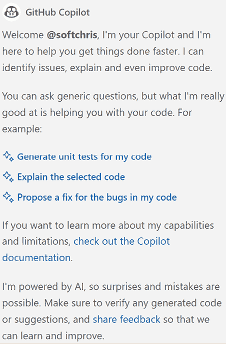
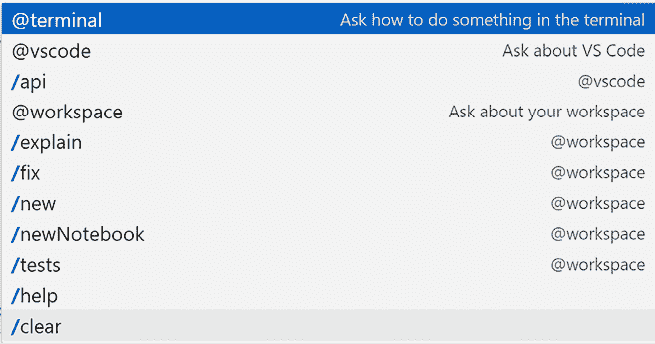
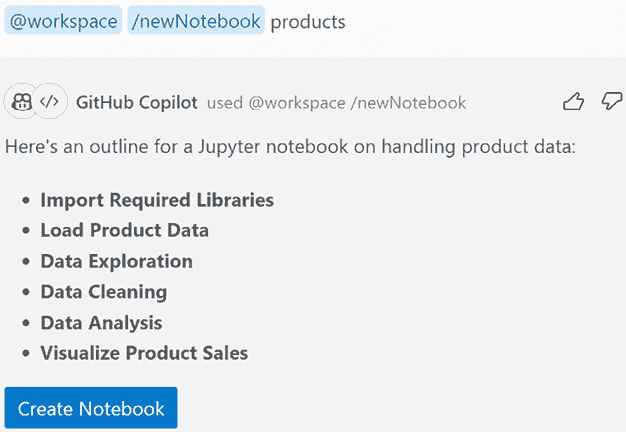
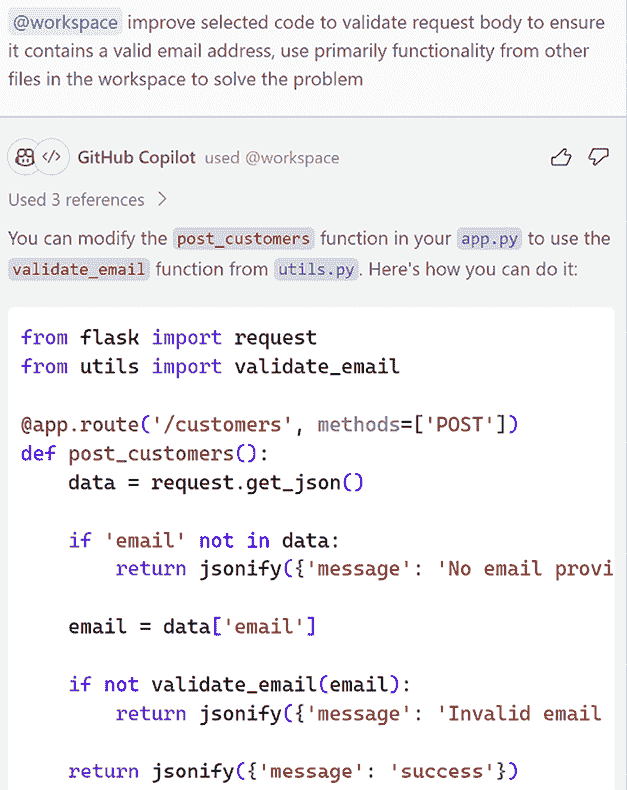
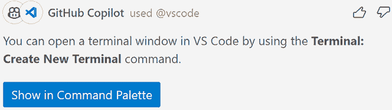

# 20

# 利用 GitHub Copilot 提高效率

# 简介

到目前为止，你一直在使用书中开头介绍的关于 GitHub Copilot 和 ChatGPT 的知识。这些基础知识足以教你如何编写提示并接受它们。这也足以让你开始着手解决机器学习、数据科学和 Web 开发的问题。在 Web 开发的情况下，你也发现 Copilot 在处理现有代码库时是一个高效的工具。在本章中，我们希望将你的 AI 工具知识提升到下一个层次，因为还有更多你可能想要利用的功能。

有很多方法可以提高效率；你将在本章后面看到，Copilot 中有一些功能可以让你构建文件，你还将了解更多关于你的工作空间，甚至作为编辑器的 Visual Studio Code 的信息，这些都是节省时间的功能。本章将介绍一些最重要的功能。

在本章中，我们将：

+   学习如何使用 Copilot 生成代码。

+   使用 Copilot 命令来自动化任务，例如生成一个新项目。

+   应用调试和故障排除代码的技术。

+   使用 Copilot 审查和优化代码。

# 代码生成和自动化

在其核心，Copilot 是一个代码生成器。它可以为你生成文本，这些文本可以是文档或源代码的一部分。

使用 Copilot 生成代码有两种主要方式：

+   通过提示作为注释的 Copilot 活动编辑器。

+   允许你输入提示的 Copilot 聊天。

## Copilot 的活动编辑器

当你在活动编辑器中时，Copilot 可以生成代码。要生成代码，你需要以注释的形式编写一个提示。在你的编程语言代码中添加注释有不同的方式。例如，在 JavaScript 和 C# 中，你使用 `//`，而在 HTML 中你会输入 `<!--`。

让我们看看一个例子：

**[提示]**

创建一个名为 add 的新函数，它接受两个参数。

**[提示结束]**

```py
//Create a new function called add that takes two parameters 
```

上面，我们有一个作为注释的提示。Copilot 会查看这个提示，并尝试根据它生成代码。在这个阶段，Copilot 会将生成的代码作为“建议”发送回来，你可以使用 `Tab` 键接受它。在编辑器中看起来是这样的：

```py
// Create a new function called add that takes two parameters
function add(num1, num2) {
  throw new Error('Function not implemented.');
} 
```

到目前为止，你没有收到任何建议。你有几个选择：

+   你可以按 `Return` 键获取更多建议。

+   开始输入你想要生成的代码的一部分，Copilot 将根据你输入的内容建议代码。

## Copilot 聊天

Copilot Chat 是一种通过聊天界面与 Copilot 交互的方式。要激活 Copilot Chat，点击 Visual Studio Code（或 VS Code）左下角的图标，这将打开一个聊天窗口。


图 20.1：显示 Visual Studio Code 中的 Copilot 聊天“聊天”图标左侧菜单

点击上面的聊天图标后，将显示下面的图片。



图 20.2：上图显示了您在 Visual Studio Code 左侧菜单中点击聊天图标时打开的聊天窗口

让我们尝试根据之前的相同提示生成一些代码。让我们使用聊天窗口中的输入文本字段并输入提示：

**[提示]**

创建一个名为 add 的新函数，它接受两个参数

**[指令结束]**

输出分为两部分，一个是文本指令，另一个是代码建议。首先，文本指令：

**[提示响应]**

当然，这是一个名为 add 的函数的示例，它接受两个参数并返回它们的和：

```py
function add(a, b) {
  return a + b;
} 
```

**[响应结束]**

它甚至显示了如何使用该函数的示例：

```py
const result = add(2, 3);
console.log(result); // Output: 5 
```

# Copilot 命令

如果您在聊天窗口中开始输入 `/`，您将看到可以使用 Copilot 的命令列表。



图 20.3：可用命令

有很多可用的命令，在本章中我们将关注其中的一些。

## 创建笔记本

使用此命令，您可以创建一个新的笔记本。笔记本是一个您可以存储代码片段和文本的地方。要创建笔记本，请输入 `/newNotebook`，并为笔记本提供一个名称，例如，`products`。



图 20.4：创建笔记本

上图显示了您输入 `/newNotebook` 命令时显示的内容；您需要通过点击 **创建笔记本** 来确认笔记本的框架。

这将创建一个包含 `products` 常用代码片段的新笔记本。接下来，让我们检查输出。

您的笔记本，从高层次来看，包含以下内容：

+   导入，包含处理数据集所需的所有导入；内容如下所示：

    ```py
    import pandas as pd # Import Pandas library
    import numpy as np # Import NumPy library
    import matplotlib.pyplot as plt # Import Matplotlib library for data visualization
    import seaborn as sns # Import Seaborn library for data visualization 
    ```

+   加载数据，包含从 CSV 文件（CSV 文件 `product_data.csv` 不存在，但 Copilot 假设您有这样一个文件；调整此部分的代码以适应您拥有的 CSV 文件名称）加载数据的代码：

    ```py
    # Load product data from CSV file into a Pandas DataFrame
    product_data = pd.read_csv('product_data.csv')
    # Load product data from JSON file into a Pandas DataFrame
    # product_data = pd.read_json('product_data.json')
    # Display the first 5 rows of the DataFrame
    print(product_data.head()) 
    ```

+   探索产品数据，包含检查数据的操作：

    ```py
    # Use Pandas functions to explore the product data
    # Display the last 5 rows of the DataFrame
    print(product_data.tail())
    # Display the summary information of the DataFrame
    print(product_data.info())
    # Display the statistical summary of the DataFrame
    print(product_data.describe()) 
    ```

+   过滤产品数据，包含过滤数据的操作：

    ```py
    # Filter product data based on specific criteria using boolean indexing
    filtered_data = product_data[(product_data['category'] == 'electronics') & (product_data['price'] < 100)]
    # Display the filtered data
    print(filtered_data) 
    ```

+   数据排序，包含排序操作：

    ```py
    # Sort the product data based on one or more columns using the sort_values() function
    # Sort by price in ascending order
    product_data.sort_values(by='price', ascending=True, inplace=True)
    # Sort by category in ascending order, then by price in descending order
    product_data.sort_values(by=['category', 'price'], ascending=[True, False], inplace=True)
    # Display the sorted data
    print(product_data) 
    ```

+   数据聚合；通常，您希望聚合数据以更好地理解它：

    ```py
    # Group the product data by category and calculate the total price for each category
     category_total_price = product_data.groupby('category')['price'].sum()
     # Display the total price for each category
     print(category_total_price)
     # Group the product data by category and calculate the average price for each category
     category_avg_price = product_data.groupby('category')['price'].mean()
     # Display the average price for each category
     print(category_avg_price)
     # Group the product data by category and calculate the number of products in each category
     category_product_count = product_data.groupby('category')['product_id'].count()
     # Display the number of products in each category
     print(category_product_count) 
    ```

总结来说，这些都是您不必自己编写的代码。您可以使用这个笔记本作为处理产品数据的起点。

## 创建项目

另一个非常有用的命令是能够创建项目。通常，我们要么手动创建文件，这需要时间，要么依赖 CLI 工具为我们创建项目。使用 Copilot，您可以在聊天窗口中输入 `/new` 来创建项目。要使用此命令，请输入 `/new` 并为其提供描述，例如，**React**。这将创建一个带有 React 项目模板的新项目。让我们检查输出：

```py
`my-react-app`
`├── public`
`│   ├── index.html`
`│   └── favicon.ico`
`├── src`
`│   ├── App.js`
`│   ├── index.js`
`│   ├── components`
`│   │   ├── Customer.js`
`│   │   ├── Product.js`
`│   │   ├── CustomerList.js`
`│   │   └── ProductList.js`
`│   ├── data`
`│   │   ├── customers.json`
`│   │   └── products.json`
`│   └── styles`
`│       ├── App.css`
`│       ├── Customer.css`
`│       ├── Product.css`
`│       ├── CustomerList.css`
`│       └── ProductList.css`
`├── package.json`
`└── README.md` 
```

上文创建的文件是 React 项目中预期的典型文件。它包含：

+   `public`，其中包含`index.html`文件，该文件引用 JavaScript 文件，指示应用程序的位置。

+   `src`，它包含所有应用程序文件，并且自身被分为不同的文件夹，用于组件、数据和 CSS 样式。

所有这些构成了一个起点。你可能希望根据你的喜好更改文件。

# 调试和故障排除

能够调试和故障排除代码是一项重要的技能。当你开发代码时，它很少第一次就能做到你想要的效果。你需要能够调试和故障排除代码，以找出问题所在。如果你有一个报告的 bug，也是如此；你需要能够诊断它在哪个点出错。

Copilot 可以帮助，一个好的方法就是使用 Copilot 聊天，并要求它添加对调试和故障排除的支持。

以下是你被给出的一个示例代码。这是一个用于 Python 的 Flask 框架中的 REST API。这是一段可以工作的代码，但从调试和故障排除的角度来看可能并不容易使用：

```py
from flask import Flask, jsonify, request
import sqlite3
app = Flask(__name__)
# Create a connection to the database
conn = sqlite3.connect('products.db')
c = conn.cursor()
# Create a table for products if it doesn't exist
c.execute('''CREATE TABLE IF NOT EXISTS products
             (id INTEGER PRIMARY KEY AUTOINCREMENT,
              name TEXT,
              price REAL)''')
conn.commit()
@app.route('/products', methods=['GET'])
def get_products():
    # Retrieve all products from the database
    c.execute('SELECT * FROM products')
    products = c.fetchall()
    # Convert the products to a JSON response
    response = []
    for product in products:
        response.append({
            'id': product[0],
            'name': product[1],
            'price': product[2]
        })
    return jsonify(response)
@app.route('/products', methods=['POST'])
def add_product():
    # Retrieve the product data from the request body
    data = request.get_json()
    name = data['name']
    price = data['price']
    # Insert the product into the database
    c.execute('INSERT INTO products (name, price) VALUES (?, ?)', (name, price))
    conn.commit()
    # Return a success message
    return jsonify({'message': 'Product added successfully'})
if __name__ == '__main__':
    app.run(debug=True) 
```

上述代码可以工作，但它不支持调试和故障排除；让我们看看如何通过使用 Copilot Chat 来添加对该功能的支持：

**[提示]**

添加对故障排除和调试的支持

**[提示结束]**

Copilot 聊天以文本和代码的形式回答我们：

**[提示响应]**

当然，这是一个包含故障排除和调试支持的 Flask API 更新版本：

```py
from flask import Flask, jsonify, request
import sqlite3
app = Flask(__name__)
# Create a connection to the database
conn = sqlite3.connect('products.db')
c = conn.cursor()
# Create a table for products if it doesn't exist
c.execute('''CREATE TABLE IF NOT EXISTS products
             (id INTEGER PRIMARY KEY AUTOINCREMENT,
              name TEXT,
              price REAL)''')
conn.commit()
@app.route('/products', methods=['GET'])
def get_products():
    try:
        # Retrieve all products from the database
        c.execute('SELECT * FROM products')
        products = c.fetchall()
        # Convert the products to a JSON response
        response = []
        for product in products:
            response.append({
                'id': product[0],
                'name': product[1],
                'price': product[2]
            })
        return jsonify(response)
    except Exception as e:
        # Log the error and return an error message
        app.logger.error(str(e))
        return jsonify({'error': 'An error occurred while retrieving products'})
@app.route('/products', methods=['POST'])
def add_product():
    try:
        # Retrieve the product data from the request body
        data = request.get_json()
        name = data['name']
        price = data['price']
        # Insert the product into the database
        c.execute('INSERT INTO products (name, price) VALUES (?, ?)', (name, price))
        conn.commit()
        # Return a success message
        return jsonify({'message': 'Product added successfully'})
    except Exception as e:
        # Log the error and return an error message
        app.logger.error(str(e))
        return jsonify({'error': 'An error occurred while adding the product'})
if __name__ == '__main__':
    app.run(debug=True) 
```

改进如下：

+   在`get_products()`函数中的代码周围添加了`try`/`except`块。

+   添加了`logger`语句来记录错误。

+   在`app.run()`语句中添加了`debug=True`。

这些更改将帮助我们进行故障排除和调试代码。

**[响应结束]**

让我们看看如何使用 Copilot 帮助我们进行代码审查和优化。

# 代码审查和优化技术

目前，我们有一段可以工作的代码，但它还没有优化。例如，通常将代码分离到不同的文件中是一个好主意。让我们看看 Copilot 建议如何改进代码。

**[提示]**

改进选定的代码

**[提示结束]**

如同往常，我们以文本和代码的形式获取 Copilot 聊天响应：

**[提示响应]**

当然，以下是对所选代码的一些改进建议：

+   使用上下文管理器来处理数据库连接和游标。这确保了当代码执行完毕时，连接被正确关闭，即使发生异常也是如此。

+   使用列表推导式将产品转换为 JSON 响应。这比使用 for 循环更简洁，可能更快。

+   使用 Response 对象的 json 参数返回 JSON 响应。这比使用 jsonify 函数更简洁。

+   使用 request.json 属性从请求体中检索产品数据。这是一种更简洁、更 Pythonic 的方法。

以及生成的代码：

```py
from flask import Flask, Response, request
import sqlite3
app = Flask(__name__)
# Create a table for products if it doesn't exist
with sqlite3.connect('products.db') as conn:
    c = conn.cursor()
    c.execute('''CREATE TABLE IF NOT EXISTS products
                 (id INTEGER PRIMARY KEY AUTOINCREMENT,
                  name TEXT,
                  price REAL)''')
    conn.commit()
@app.route('/products', methods=['GET'])
def get_products():
    try:
        # Retrieve all products from the database
        with sqlite3.connect('products.db') as conn:
            conn.row_factory = sqlite3.Row
            c = conn.cursor()
            c.execute('SELECT * FROM products')
            products = c.fetchall()
        # Convert the products to a JSON response
        response = [{'id': product['id'], 'name': product['name'], 'price': product['price']} for product in products]
        return Response(response=response, status=200, mimetype='application/json')
    except Exception as e:
        # Log the error and return an error message
        app.logger.error(str(e))
        return Response(response={'error': 'An error occurred while retrieving products'}, status=500, mimetype='application/json')
@app.route('/products', methods=['POST'])
def add_product():
    try:
        # Retrieve the product data from the request body
        data = request.json
        name = data['name']
        price = data['price']
        # Insert the product into the database
        with sqlite3.connect('products.db') as conn:
            c = conn.cursor()
            c.execute('INSERT INTO products (name, price) VALUES (?, ?)', (name, price))
            conn.commit()
        # Return a success message
        return Response(response={'message': 'Product added successfully'}, status=201, mimetype='application/json')
    except Exception as e:
        # Log the error and return an error message
        app.logger.error(str(e))
        return Response(response={'error': 'An error occurred while adding the product'}, status=500, mimetype='application/json')
if __name__ == '__main__':
    app.run(debug=True) 
```

**[响应结束]**

上述最大的变化是使用上下文管理器来处理数据库连接和游标。这确保了当代码执行完毕时，连接会被正确关闭，即使发生异常也是如此。

我们仍然希望将代码分离到不同的文件中；让我们看看 Copilot 对此有什么建议。

让我们从以下提示开始：

**[提示]**

根据职责将代码分离到不同的文件中

**[结束提示]**

以及生成的代码：

**[提示响应]**

```py
# app.py
from flask import Flask
from products import products_bp
app = Flask(__name__)
app.register_blueprint(products_bp)
if __name__ == '__main__':
    app.run(debug=True)
# database.py
import sqlite3
def get_db():
    db = sqlite3.connect('products.db')
    db.row_factory = sqlite3.Row
    return db
# products.py
from flask import Blueprint, jsonify, request
from database import get_db
products_bp = Blueprint('products', __name__)
@products_bp.route('/products', methods=['GET'])
def get_products():
    try:
        # Retrieve all products from the database
        db = get_db()
        products = db.execute('SELECT * FROM products').fetchall()
        # Convert the products to a JSON response
        response = [{'id': product['id'], 'name': product['name'], 'price': product['price']} for product in products]
        return jsonify(response)
    except Exception as e:
        # Log the error and return an error message
        app.logger.error(str(e))
        return jsonify({'error': 'An error occurred while retrieving products'}), 500
@products_bp.route('/products', methods=['POST'])
def add_product():
    try:
        # Retrieve the product data from the request body
        data = request.json.get('data', {})
        name = data.get('name', '')
        price = data.get('price', 0)
        # Insert the product into the database
        db = get_db()
        db.execute('INSERT INTO products (name, price) VALUES (?, ?)', (name, price))
        db.commit()
        # Return a success message
        return jsonify({'message': 'Product added successfully'}), 201
    except Exception as e:
        # Log the error and return an error message
        app.logger.error(str(e))
        return jsonify({'error': 'An error occurred while adding the product'}), 500 
```

**[结束响应]**

如果在运行代码时收到任何错误，请咨询 Copilot，告诉它有错误，并要求它解决问题。请记住，Copilot 不仅仅是一个代码生成器。

我们现在看到的是关注点的分离。`app.py` 文件负责启动应用程序并注册蓝图。`database.py` 文件负责处理数据库连接。`products.py` 文件负责处理 `products` API。这段代码是我们可以操作和维护的。

通过将 `database.py` 更改为使用上下文管理器，可以进一步改进此代码：

```py
import sqlite3
def get_db():
    with sqlite3.connect('products.db') as db:
        db.row_factory = sqlite3.Row
        return db
def init_db():
    with sqlite3.connect('products.db') as db:
        db.execute('''CREATE TABLE IF NOT EXISTS products
                     (id INTEGER PRIMARY KEY AUTOINCREMENT,
                      name TEXT,
                      price REAL)''')
        db.commit()
# other code omitted for brevity 
```

在这里，您看到了 Copilot 如何逐步审查您的代码，将单个文件拆分为多个文件，然后改进代码。

# 工作空间

您的工作空间是您在目录中打开的所有文件。您希望您的 AI 助手在提供推荐时考虑所有这些文件。让我们看看以下存在的以下文件的网络项目：

```py
`src/`
 `app.py`
 `utils.py` 
```

`app.py` 包含一个 API，而 `utils.py` 包含一个电子邮件验证函数。以下是 `app.py` 的代码：

```py
# create a web api using Flask, should have a products GET route
from flask import Flask, jsonify
app = Flask(__name__)
@app.route('/customers, methods=['GET'])
def get_customers():
    return jsonify({'customers': ['item1', 'item2', 'item3']})
# TODO, create a POST route for products
# Run the app
if __name__ == '__main__':
    app.run(debug=True) 
```

注意到 `TODO` 注释；我们即将添加一个存储客户的路由。在存储此客户时，我们需要确保客户数据包含一个有效的电子邮件。幸运的是，`utils.py` 文件已经包含这样一个函数，但我们能否让 Copilot 使用它？让我们看看。

将 `app.py` 中的注释更改为以下内容：

**[提示]**

TODO，为客户创建一个 POST 路由。它应该验证请求体，并确保它有一个有效的电子邮件地址。

**[结束提示]**

你得到一个基本函数，它实际上并没有做它应该做的事情：

**[提示响应]**

```py
@app.route('/customers', methods=['POST'])
def post_customers():
    return jsonify({'message': 'success'}) 
```

**[结束响应]**

为了帮助解决这个问题，您求助于 GitHub Chat 并输入以下提示：

**[提示]**

验证请求体并确保它有一个有效的电子邮件地址

**[结束提示]**

[提示响应]

要验证请求体并确保它有一个有效的电子邮件地址，您可以使用 Flask 的 `request` 对象和一个正则表达式。以下是您如何修改您的 `post_customers` 函数的方法：

```py
from flask import request
import re

@app.route('/customers', methods=['POST'])
def post_customers():
    data = request.get_json()

    if 'email' not in data:
        return jsonify({'message': 'No email provided'}), 400

    email = data['email']
    pattern = r'\b[A-Za-z0-9._%+-]+@[A-Za-z0-9.-]+\.[A-Z|a-z]{2,}\b'

    if not re.match(pattern, email):
        return jsonify({'message': 'Invalid email format'}), 400

    return jsonify({'message': 'success'}) 
```

**[结束响应]**

虽然上述代码可以工作，但它没有利用我们现有的 `utils.py` 文件，其中已经有一个函数可以解决验证电子邮件的问题。那么我们如何让 Copilot 考虑该文件呢？答案在于一个名为 `@workspace` 的命令。`@workspace` 命令考虑所有文件。以下是它的用法：

**[提示]**

`@workspace` 改进选定的代码以验证请求体，确保它包含有效的电子邮件地址，主要使用工作区中其他文件的功能来解决问题。

**[提示结束]**



图 20.5：Copilot Chat 中的图像，展示了如何使用 @workspace 命令利用工作区中现有的代码和代码文件来解决问题，而不是创建新的代码。

让我们也在代码中展示响应并讨论我们可以看到的内容：

**[提示响应]**

```py
from flask import request
from utils import validate_email

@app.route('/customers', methods=['POST'])
def post_customers():
    data = request.get_json()

    if 'email' not in data:
        return jsonify({'message': 'No email provided'}), 400

    email = data['email']

    if not validate_email(email):
        return jsonify({'message': 'Invalid email format'}), 400

    return jsonify({'message': 'success'}) 
```

**[响应结束]**

在上面的代码中，`validate_email` 函数位于 `utils.py` 文件中，用于验证电子邮件。这对于第一次尝试来说很重要，解决这个问题导致了 Copilot 重复代码。因此，当你想让 Copilot 考虑工作区中的所有代码来建议解决方案时，建议使用 `@workspace`。

# Visual Studio Code 查找

Copilot 的另一个强大功能是能够快速查找在 Visual Studio Code 中如何做某事。与其查阅官方文档，你可能会希望快速找到所需内容而不离开代码编辑器。要使用此功能，有一个 `@vscode` 命令。让我们确保聊天窗口已打开，并查看以下提示如何工作：

**[提示]**

`@vscode` 如何打开终端窗口？

**[提示结束]**



图 20.6：对上述提示的 Copilot 响应

这里有两点值得注意：

+   Copilot 告诉你如何做某事以及在哪里找到它。

+   如果你点击 **在命令面板中显示** 按钮，它会提供视觉上展示如何找到所需内容的选项。

# 终端

我们将要向您展示的最后一个真正出色的功能是终端命令。理论上，您可以在不使用此特定命令的情况下使用终端，但如果您不必在问题前加上“在终端中如何做某事”，这会很有帮助。要使用此命令，请在提示前加上 `@terminal`，如下所示：

**[提示]**

`@terminal` 在 Git 中创建一个名为 upstream 的远程，它指向远程仓库。

**[提示结束]**

**[提示响应]**

要创建一个名为“upstream”的远程，它指向 Git 中的远程仓库，你可以使用 `git remote add` 命令。以下是命令：

+   `git remote add upstream {remote_repo_url}`

+   将 `{remote_repo_url}` 替换为远程仓库的 URL。

+   此命令添加了一个名为“upstream”的新远程，它指向指定的远程仓库。然后您可以根据需要从“upstream”远程获取或推送。

+   `{remote_repo_url}`：远程仓库的 URL。这可能是一个 GitHub、GitLab、Bitbucket 或任何其他 Git 服务器上的 URL。

**[响应结束]**

如您所见，您既得到了所需的命令，又得到了如何输入的详细说明。

# 作业

尝试通过添加文档、测试或可能是一个 ORM（对象关系映射器）来进一步改进代码。请记住使用本章中涵盖的命令。

# 挑战

查看 Copilot Chat 支持的其他命令，看看你是否可以用它们来改进你的工作流程。

# 问答

Copilot 能帮助什么？

1.  代码生成、自动化、调试、故障排除、代码审查和优化

1.  部署

1.  以上皆非

# 摘要

在本章中，我们介绍了 Copilot 中一些更高级的功能。你学习了如何使用`@workspace`来让 Copilot 考虑所有你的文件。`@vscode`命令也是那个功能中的一个有用命令，它展示了如何与 Visual Studio Code 一起工作。

我们还探讨了脚手架的使用——特别是如何为 Web 项目搭建脚手架——以及如何创建带有起始代码的笔记本。这些命令在你刚开始一个项目时可能会为你节省数小时。Copilot 有很多命令，我建议你尝试一下。

# 加入我们的 Discord 社区

加入我们的 Discord 空间，与作者和其他读者进行讨论：

[`packt.link/aicode`](https://packt.link/aicode)


