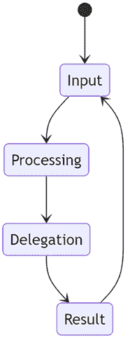

# 第二十一章：软件开发中的代理

# 引言

本章将向您介绍软件开发中代理的概念。我们将涵盖代理是什么，它们如何工作，以及如何在项目中使用它们。我们还将介绍一些最受欢迎的代理框架以及如何开始使用它们。

让我们介绍代理可以解决的问题。一般想法是有一个可以代表你行动的程序。这类程序的例子可以是自动化任务、做出决策以及与其他代理和人类交互。这样的程序可以为你节省时间，使你的生活更轻松或使你的业务更高效。

在本章中，我们将做以下事情：

+   介绍软件开发中代理的概念。

+   解释代理是什么以及它们是如何工作的。

+   讨论不同类型的代理以及它们如何被使用。

# 代理是什么？

如前所述，代理是代表你行动的程序。它们可以执行任务、做出决策以及与其他代理和人类交互。代理可以用在广泛的领域中。

几个因素使一个程序成为代理程序而不是普通程序：

+   **代理程序** **有一个明确的目标**：例如，考虑一个保持 25 度温度并采取适当行动以保持该温度的恒温器，或者一个管理财务并试图最大化利润的代理。

+   **自主性**：代理做出必要的决策以确保它达到之前定义的目标。对于金融代理来说，这可能意味着在满足特定触发条件时买卖股票。

+   **具有传感器**：传感器可以是物理的，也可以是软件中的 API，它使代理能够理解“世界是什么样的”。对于恒温器来说，传感器是温度指示器，但对于金融代理来说，传感器可以是股票市场的 API，使代理能够决定他们的目标。

## 代理是如何工作的？

代理通过接收输入、处理输入并产生输出来工作。它们可以被编程来执行特定任务、做出决策以及与其他代理和人类交互。代理还可以从它们的交互中学习并随着时间的推移提高它们的性能。


图 21.1：简单代理的过程：关键字，识别，执行任务

# 简单代理与使用 AI 的代理

代理并不是什么新鲜事物。它们已经存在很长时间了。新的地方在于代理现在正被 AI 所驱动。让我们比较一下两者：

+   **简单代理**：传统代理被编程来执行特定任务，并基于预定义的规则和逻辑做出决策。

+   **使用 AI 的代理**：由 AI 驱动的代理能够执行更复杂的任务并做出更智能的决策。它们能够理解自然语言，从它们的交互中学习，并随着时间的推移提高它们的性能。

# 简单代理

如前几节所述，简单的代理在以下方面有限：它们是为特定任务制作的。与他们互动通常也是有限的——你只能使用关键词，或者你表达自己的方式是有限的。

一个简单的代理的例子是聊天机器人。这样的聊天机器人被编程为理解有限的关键词和短语。

例如，“告诉我更多关于你们产品的事情，”或者“你们的退换货政策是什么？”任何超出这些关键词和短语的对话尝试都将导致聊天机器人无法理解用户。

## 一个简单的代理不是一个好的对话者

当你与人类交谈时，你期望他们精通几个主题，并且至少能够谈论其他主题。对于一个简单的代理，我们可能会陷入以下对话：

+   用户：“告诉我你们的产品。”

+   代理：“我们有很多产品，包括电子产品、服装和配件。请告诉我你的兴趣。”

+   用户：“我对衣服感兴趣，想找一些适合当前天气的。”

+   代理：“我当然可以提供关于**服装**的建议，但我不知道**当前天气**。”

在这里，我们可以观察到两个有趣的现象：

+   对话感觉很短，重要的信息要么在句子的末尾，要么就在逗号之前，这表明使用了简单的解析来提取重要信息。

+   它无法处理非产品信息，如天气，这有助于筛选出有用的响应。

## 使用工具调用和大型语言模型（LLM）改进对话

LLM 是一个改进，因为它擅长听起来更自然，而且它可以从流畅的文本中解析和识别意图。你也可以通过所谓的工具调用向 LLM 提供额外的知识，其中你告诉 LLM 关于各种能力的信息，如衣服 API、天气 API 等，这样它可以更好地处理对话，并类似于人类的对话。让我们用同一个 LLM 对话并突出其差异：

+   用户：“你们有哪些产品？”

+   代理：“我们有很多产品，包括电子产品、服装和配件。”

+   用户：“太好了，我对衣服感兴趣，想找一些适合当前天气的。你有什么推荐吗？”

+   代理：“你能告诉我你的位置，这样我就能更好地为你提供服装建议吗？”

+   用户：“当然，我住在亚利桑那州的凤凰城。”

+   代理：“我现在看到凤凰城现在是 90 华氏度。我可以建议这些短裤吗？”

这次对话之所以表现更好，是因为这个 LLM 得益于工具调用，该工具使用凤凰作为输入调用其天气 API，然后继续调用衣服 API，以天气响应作为过滤器。

## 对话代理的解剖结构

一个对话代理通常由以下组件组成：

+   **输入**：代理的输入，通常是自然语言的形式。应该指出的是，这可以是非常多的不同 spoken languages，而不仅仅是英语，你过去不得不将其硬编码。

+   **处理**：输入的处理，通常使用**自然语言处理**（NLP）技术。

+   **委托**：将输入委托给代理的适当组件。它委托到的组件可以是特定任务的代理，例如预订航班或回答问题。



图 21.2：对话代理处理步骤

前面的图示表明了一个循环，你从输入到处理再到委托到结果，那么为什么会有循环呢？代理没有结束的概念；它在那里等待用户提供输入，并对它做出反应。如本章前面所述，代理致力于实现目标，如果目标是管理财务，那么它是一项持续的工作。

## 关于 LLM 中工具调用的更多内容

我们在本章中之前提到了工具调用，但让我们尝试展示如何向 LLM 添加功能。

LLM 只知道它被训练的内容，对于它没有训练的内容，在许多情况下，它将尝试提供一个答案，这个答案并不总是正确的，因为它是在编造；这被称为幻觉。为了提高你希望 LLM 提供更准确响应的领域，你可以向它提供一个工具。提供工具的过程包括以下组件：

+   函数的 JSON 描述

+   函数的描述，这样 LLM 就知道何时调用此函数

一旦你提供了前面的组件，比如说你提供了一个能够获取天气的函数；LLM 现在可以使用其内置功能来语义解释所有后续的输入，意味着用户想要了解天气：

+   “今天盐湖城的天气怎么样？”

+   “旧金山的温度是多少？”

+   “明天纽约会下雨吗？”

+   “伦敦的天气怎么样？”

+   “外面暖和吗？”

## 使用工具增强 GPT 的功能

它的工作原理是，你以 JSON 格式提供一个函数规范。这个 JSON 函数格式是 GPT 模型理解的模式。GPT 模型将基本上为你做两件事：

+   从提示中提取参数。

+   确定是否调用函数以及调用哪个函数，因为你可以告诉它关于多个函数的信息。

作为开发者，如果你认为 LLM 应该调用该函数，那么你需要主动调用该函数。

你的函数格式遵循以下模式：

```py
{
        "type": "function",
        "function": {
            "name": "get_current_weather",
            "description": "Get the current weather",
            "parameters": {
                "type": "object",
                "properties": {
                    "location": {
                        "type": "string",
                        "description": "The city and state, e.g. San Francisco, CA",
                    },
                    "format": {
                        "type": "string",
                        "enum": ["celsius", "fahrenheit"],
                        "description": "The temperature unit to use. Infer this from the users location.",
                    },
                },
                "required": ["location", "format"],
            },
        }
    } 
```

在前面的 JSON 模式中，有一些事情是你告诉 GPT 模型的：

+   有一个名为 `get_current_weather` 的函数。

+   描述是 `"获取当前天气"`。

+   函数接受两个参数，`location` 和 `format`。

+   同时还有对参数、它们的类型和允许的值的描述。

让我们描述一下在以下提示下，这将在实践中是如何工作的：

**[提示]**

“今天盐湖城的天气怎么样？”

**[提示结束]**

这是 GPT 模型可以从提示中提取的内容：

+   位置：盐湖城。

+   格式：此信息未提供，但 GPT 可以从用户的地理位置推断出来。

+   函数调用：`get_current_weather`。

作为开发者，您需要做的是调用提取的参数值指示的函数。以下是可以用来连接 GPT 模型并解析响应的代码，其中提供了函数描述：

```py
import open
def get_current_weather(location, format):
    # Call weather API
    response = requests.get(f"https://api.weather.com/v3/wx/forecast/daily/5day?location={location}&format={format}
    return response.json()
# Call the GPT model
tool = {
        "type": "function",
        "function": {
            "name": "get_current_weather",
            "description": "Get the current weather",
            "parameters": {
                "type": "object",
                "properties": {
                    "location": {
                        "type": "string",
                        "description": "The city and state, e.g. San Francisco, 
CA",
                    },
                    "format": {
                        "type": "string",
                        "enum": ["celsius", "fahrenheit"],
                        "description": "The temperature unit to use. Infer this from the users location.",
                    },
                },
                "required": ["location", "format"],
            },
        }
    }
prompt = "What's the weather like today in Salt Lake City?"
response = openai.Completion.create(
  model="text-davinci-003",
  prompt=prompt,
  max_tokens=150,
  tools= [tool]
)
# Parse the response
function_response = response.choices[0].function_response # here we learn what function to call
location = function_response.parameters.location # extracting parameter value for location
format = function_response.parameters.format # extracting parameter value for format
weather = get_current_weather(location, format) # here we get the response from the API 
```

这可能是如何使用 GPT 创建对话代理的最基本示例。

然而，我们希望高级代理能做得更多。如果我们想做一些更复杂的事情，比如预订航班、酒店、车辆和餐厅呢？

# 高级对话

很容易认为您只需向 GPT 模型添加更多函数，这可能会暂时有效。然而，随着对话变得更加复杂，GPT 模型需要记住对话的上下文并跟踪对话状态。

对于更高级的对话，这会迅速变得更加复杂。

想象一下走进旅行社，两个人之间发生的以下对话：

*用户：“我想去度假。”*

*代理：“当然。”*

*用户：“我想去一个温暖的地方。”*

*代理：“当然，告诉我您想找什么。”*

*用户：“我想要一个有海滩的地方。”*

*代理：“当然，还有其他细节吗？”*

*用户：“我希望温度至少有 25 度。”*

*代理：“当然，还有其他细节吗？”*

*用户：“不，就这样。”*

*代理：“我找到了三个符合您标准的地方。我可以向您展示它们吗？”*

*用户：“是的，请。”*

*代理：“这里有三个地方。您想了解哪一个的更多信息？”*

*用户：“我想第一个。”*

*代理：“这里有第一个地方的信息。”*

*用户：“好的，你能为第一个地方预订酒店和航班吗？”*

*代理：“当然，我会为您处理这件事。”*

*代理：“我已经为您预订了酒店和航班。”*

*用户：“谢谢，哦，我还需要租一辆车。”*

*代理：“当然，您有特别想要的车型吗？”*

*用户：“不是真的；我的预算是每天 100 美元。”*

*代理：“我找到了五辆车符合您的标准。我可以向您展示它们吗？”*

*用户：“是的，请。我想订第五个。”*

*代理：“我已经为您预订了车辆。”*

*代理：“您的假期一切准备就绪。”*

*用户：“谢谢，但等等，我需要帮助预订第一晚的餐厅。”*

到目前为止，很明显这次对话可能会持续相当长一段时间。代理需要记住对话的上下文并跟踪对话状态。

代理还需要将许多不同的任务委派给其他代理或服务，如预订酒店、航班、车辆和餐厅，以及天气 API、观光 API 等。

重要的是，代理不仅仅是理解初始提示并将任务委托给另一个代理或服务。您需要将这次对话视为一个状态机以及不同代理和服务的编排。

## 高级对话建模

我们提到更高级的对话涉及记住上下文和状态。让我们检查示例对话的一个子集，看看状态是如何变化的：

*用户：“我想去度假。”*

*代理：“当然。”*

在这一点上，代理除了记住用户的意图，即去度假，没有记住其他任何东西。它只是确认了用户的提示。

*用户：“我想去一个温暖的地方。”*

*代理：“当然，告诉我您想找什么。”*

现在事情变得有趣了。代理已经将“温暖”作为标准记住，并需要将其转换为可以用来过滤掉太冷的地方的温度范围。

*用户：“我想找一个有海滩的地方。”*

*代理：“当然，还有其他细节吗？”*

这又是一个进步；代理已经将“海滩”作为过滤地点时使用的额外标准记住。

*用户：“我想至少 25 度。”*

添加了一个额外的标准，“25 度”。让我们看看之前的标准，“温暖”，它被定义为 20-40 摄氏度——这调整了范围为 25-40 摄氏度。

*代理：“当然，还有其他细节吗？”*

*用户：“不，就这样。”*

在这一点上，代理意识到用户没有更多的标准要添加，并且可以基于“温暖”、“海滩”和“25-40 摄氏度”的过滤器进行搜索/决策。现在，调用 API 以获取地点列表，代理可以将列表展示给用户进行选择。

*代理：“我找到了三个符合您标准的地方。我可以向您展示它们吗？”*

需要补充的是，不仅需要记住这次特定旅行检索的标准，还需要记住后续步骤的标准，除非用户更改标准。

希望您可以从前面的例子中看出，状态是逐渐建立起来的，代理需要记住对话的上下文。

将更高级的对话视为以下步骤可能是有帮助的：

1.  **输入**：代理的输入，通常是自然语言的形式。

1.  **处理**：对输入的处理，通常使用 NLP 技术。

1.  **确定下一步**：代理需要根据输入和对话的当前状态确定对话的下一步。这里的答案可以是要求更多信息、展示选项列表、预订某物等等。

1.  **结束对话或继续（请求用户输入）**：代理需要确定对话是否应该结束或继续。如果应该继续，它需要请求用户输入。

## 高级对话的伪代码

代理可能有几个不同的状态，例如：

+   **请求任务**：这通常在对话开始时或完成任务并完成用户选择时提出。

+   **向用户请求更多关于任务的信息**：这通常在执行任务之前提出，以确保代理拥有所有所需的信息。

+   **向用户展示选项列表**：这通常在完成任务后提出，以向用户提供选择。

+   **执行任务**：在这里，代理会执行任务，比如预订酒店、航班、汽车或餐厅。

+   **结束对话**：当对话结束时，并且用户以某种方式表明对话结束时，代理会移动到这个状态。

这可能是伪代码的样子：

```py
# enum
class State(Enum):
    ASK_FOR_TASK = 1
    ASK_FOR_MORE_INFORMATION = 2
    PRESENT_TASK_RESULT = 3
    PERFORM_TASK = 4
    END_CONVERSATION = 5
# initial state
state = State.ASK_FOR_TASK
def ask_for_task():
    # ask the user for a task
    pass
def ask_for_more_information(task):
    # store filter criteria
    pass
def present_task_result(task):
    # presents the result so the user can choose
    pass
def perform_task(task):
    # Perform a task
    pass
def end_conversation():
    # End the conversation
    pass
while state != State.END_CONVERSATION:
    if state == State.ASK_FOR_TASK:
        # Ask for a task
        task = ask_for_task()
        state = State.ASK_FOR_MORE_INFORMATION
    elif state == State.ASK_FOR_MORE_INFORMATION:
        # Ask the user for more information on a task
        task = ask_for_more_information(task)
        state = State.PERFORM_TASK
    elif state == State.PRESENT_TASK_RESULT:
        # Present a list of options to the user
        task = present_task_result(task)
        state = State.ASK_FOR_MORE_INFORMATION
    elif state == State.PERFORM_TASK:
        # Perform a task
        perform_task(task)
        state = State.PRESENT_TASK_RESULT
    elif state == State.END_CONVERSATION:
        # End the conversation
        end_conversation() 
```

上述代码是一个更高级对话的不错起点。然而，我们应该记住，人类并不总是可预测的，代理需要能够处理意外情况。例如，人类可以在任何时候改变主意或添加新的标准。

# 自主代理

自主代理是指可以在没有人类干预的情况下采取行动的代理。它们可以执行任务、做出决策，并与其他代理和人类进行交互，而不需要人类输入。自主代理可以用于广泛的领域，从自动驾驶汽车到虚拟助手。

自主代理的例子包括以下内容：

+   **自动驾驶汽车**：自动驾驶汽车是无需人类干预即可自行驾驶的自主代理。它们可以导航道路、避开障碍物，并根据周围环境做出决策。

+   **虚拟助手**：虚拟助手是无需人类输入即可执行任务、做出决策并与人类交互的自主代理。它们可以理解自然语言，从交互中学习，并随着时间的推移提高性能。想象一下这样一个例子，你有一个财务代理；你可能给它设定了一个高级目标，即管理你的财务并确保每年价值增长 8%。你可能允许这个代理在特定价值以下买卖股票，但对于超过一定限额的更大购买和销售，则需要咨询你。

未来我们可能会看到对话代理和自主代理数量的增加。这些代理可以在许多有趣的领域得到应用，从客户服务到医疗保健、金融和交通。想象一下，有一个自主代理可以帮助你处理税务、预订假期或在你了解你的医疗历史、偏好等信息的情况下帮助你照顾健康。

# 作业

给定以下对话，推断可能涉及哪种类型的代理以及你会如何建模对话：

*用户：“我想烤一个蛋糕。”*

*代理：“当然，你想要做什么类型的蛋糕？”*

*用户：“我想做一个巧克力蛋糕。”*

*代理：“当然，你有没有想到具体的食谱？”*

*用户： “不，你能帮我找一个食谱吗？”*

*代理： “当然，关于过敏或偏好的方面，我应该知道些什么吗？”*

*用户： “我对坚果过敏，我更喜欢容易制作的食谱。哦，我还想做一个纯素的蛋糕。”*

*代理： “明白了！我找到了符合你标准的三个食谱。我可以展示它们吗？”*

*用户： “是的，请。”*

*代理： “这里有三个食谱。你想要哪一个？”*

*用户： “我要第二个。”*

*代理： “就这些吗？”*

*用户： “不，我需要购买原料吗？你能帮我设置烤箱温度吗？”*

*代理： “是的，看起来你缺少一些原料。我可以帮你订购原料。我还可以帮你设置烤箱温度。你需要什么时候设置？”*

*用户： “是的，下单，并在订单到达后立即设置烤箱。”*

*代理： “我已经下了订单，正在等待送货。我会在它到达时设置烤箱温度。”*

*用户： “谢谢。”*

*代理： “不客气，就这样吗？”*

*用户： “是的。”*

# 挑战

你能想到一个可以用代理解决的问题吗？你会如何使用代理来解决这个问题？你会使用哪种类型的代理？

# 问答

Q：在 LLM 中工具调用是什么意思？

1.  这是在 LLM 调用内置工具以提供响应时发生的。

1.  这是在你通过提供 JSON 格式的函数描述和指示何时调用此函数的语义描述来让 LLM 知道一个新功能时发生的。

1.  这是在你使用函数来微调 LLM 时发生的。

# 摘要

在本章中，我们介绍了软件开发中代理的概念。我们解释了代理是什么以及它们是如何工作的。我们讨论了不同类型的代理以及它们如何被使用。我们希望你现在能一窥未来，看看像 GPT 这样的 LLM 将走向何方，以及你的未来将如何改变。

# 参考文献

如果你对此类代理感到好奇，值得查看一些相关资源：

+   Autogen：[`github.com/microsoft/autogen`](https://github.com/microsoft/autogen)

+   语义内核：[`learn.microsoft.com/en-us/semantic-kernel/overview/`](https://learn.microsoft.com/en-us/semantic-kernel/overview/)

+   加入我们的 Discord：[`discord.gg/pAbnFJrkgZ`](https://discord.gg/pAbnFJrkgZ)

# 加入我们的 Discord 社区

加入我们社区的 Discord 空间，与作者和其他读者进行讨论：

[`packt.link/aicode`](https://packt.link/aicode)


