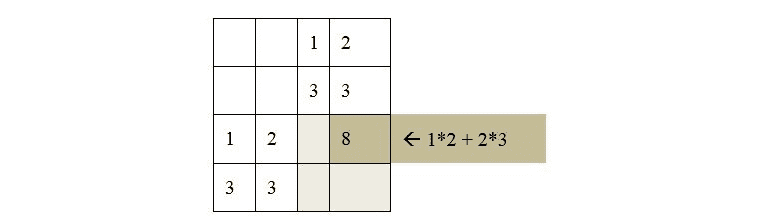
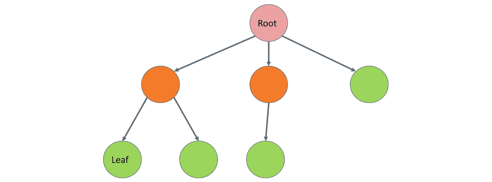

1

# 人工智能原理

## 学习目标

到本章结束时，你将能够：

+   描述人工智能的各个领域

+   解释在 AI 中使用的的主要学习模型

+   解释为什么 Python 是 AI 项目的流行语言

+   为给定游戏在人工智能中建模状态空间

在本章中，你将了解 AI 的目的、领域和应用程序，以及我们将使用的 Python 特性的简要概述。

## 引言

在讨论不同的 AI 技术和算法之前，我们将探讨人工智能和机器学习的基础知识，并回顾一些基本定义。然后，通过引人入胜的例子，我们将继续在书中前进。将使用现实世界的例子以易于消化的方式展示人工智能的基本概念。

如果你想要在某个领域成为专家，你需要非常擅长基础知识。因此，让我们首先了解什么是人工智能：

**定义**：人工智能（AI）是一门利用硬件和软件解决方案构建智能的科学。

它受到逆向工程的影响，例如，在人类大脑中神经元工作的方式。我们的大脑由称为神经元的微小单元组成，以及称为神经网络的神经元网络。除了神经网络之外，还有许多其他神经科学模型可以用于解决人工智能中的现实世界问题。

机器学习是一个经常与人工智能混淆的术语。它起源于 20 世纪 50 年代，最早由亚瑟·李·塞缪尔在 1959 年定义。

**定义**：机器学习是研究如何使计算机在没有明确编程的情况下获得学习能力的一个研究领域。

托马斯·米切尔提出了一个更精确的数学定义的机器学习。

**定义**：如果一个计算机程序在经验 E、任务 T 和性能度量 P 方面，其性能随着经验 E 的提高而提高，那么我们说该程序从经验 E 中学习，关于任务 T 和性能度量 P。

从这两个定义中，我们可以得出结论，机器学习是实现人工智能的一种方式。然而，你可以没有机器学习而拥有人工智能。例如，如果你硬编码规则和决策树，或者应用搜索技术，你创建了一个人工智能代理，尽管你的方法与机器学习关系不大。

### 人工智能如何解决现实世界的问题？

**人工智能通过模仿人类大脑处理信息的方式自动化人类智能。**

每当我们解决问题或与人互动时，我们都会经历一个过程。每当我们限制问题或互动的范围时，这个过程通常可以被建模和自动化。

**人工智能使计算机看起来像人类一样思考。**

有时候，感觉 AI 知道我们需要的。想想你在网上购物后收到的个性化优惠券。到这本书的结尾，你将理解，为了选择最成功的产品，你需要了解如何最大化你的购买——这是一个相对简单的任务。然而，它也如此高效，以至于我们常常认为计算机“知道”我们需要的。

**AI 是由执行低级指令的计算机执行的。**

即使一个解决方案看起来很智能，我们编写的代码，就像任何其他软件解决方案一样。即使我们在模拟神经元，简单的机器代码和计算机硬件也在执行“思考”过程。

大多数 AI 应用都有一个主要目标。当我们与 AI 应用互动时，它看起来像人类，因为它可以将问题域限制在主要目标上。因此，我们有机会通过低级计算机指令来分解复杂的过程并模拟智能。

**AI 可以刺激特定领域的人类感官和思维过程。**

我们必须模拟人类的感觉和思维，有时甚至要欺骗 AI，让它相信我们在与另一个人互动。在特殊情况下，我们甚至可以增强我们自己的感官。

类似地，当我们与聊天机器人互动时，我们希望机器人能理解我们。我们希望聊天机器人或甚至语音识别系统能够提供一个满足我们期望的计算机-人界面。为了满足这些期望，计算机需要模拟人类的思维过程。

### 学科多样性

一辆无法感知到同一高速公路上其他车辆正在行驶的自动驾驶汽车将极其危险。AI 代理需要处理和感知其周围的环境，以便驾驶汽车。但那还不够。如果不理解移动物体的物理学，在正常环境中驾驶汽车将是一项几乎不可能完成的任务，更不用说致命的任务了。

为了创建一个可用的 AI 解决方案，需要涉及不同的学科。例如：

+   **机器人学**：在空间中移动物体

+   **算法理论**：构建高效的算法

+   **统计学**：得出有用的结果，预测未来，分析过去

+   **心理学**：模拟人类大脑的工作方式

+   **软件工程**：创建可维护的解决方案，经受时间的考验

+   **计算机科学或计算机编程**：为了在实践中实施我们的软件解决方案

+   **数学**：执行复杂的数学运算

+   **控制理论**：创建前馈和反馈系统

+   **信息论**：表示、编码、解码和压缩信息

+   **图论**：模拟和优化空间中的不同点，以及表示层次结构

+   **物理学**：模拟现实世界

+   **计算机图形学和图像处理**：显示和处理图像和电影

在这本书中，我们将介绍这些学科中的几个。记住，专注就是力量，我们现在正专注于对人工智能的高层次理解。

## 人工智能的领域和应用

既然我们已经知道了什么是人工智能，那么让我们继续前进，调查人工智能应用的不同领域。

**人类行为模拟**

人类有五种基本感官，简单分为视觉、听觉、动觉、嗅觉和味觉。然而，为了理解如何创建智能机器，我们可以将学科分为以下几类：

+   听力和口语

+   理解语言

+   记忆事物

+   思考

+   看见

+   移动

其中一些超出了我们的范围，因为这本书的目的是理解基础。例如，为了移动机器人手臂，我们可能需要学习复杂的大学水平数学来理解发生了什么。

**听力和口语**

使用语音识别系统，人工智能可以收集信息。使用语音合成，它可以把内部数据转换成可理解的声音。语音识别和**语音合成**技术处理人类发出的或人类可以理解的声音的识别和构建。

想象你正在一个你不会说当地语言的国家的旅行中。你可以对着手机的麦克风说话，期待它“理解”你所说的话，然后将其翻译成另一种语言。反之亦然，当地人说话，人工智能将声音翻译成你理解的语言。语音识别和语音合成使得这一切成为可能。

#### 注意

语音合成的例子是谷歌翻译。您可以访问[`translate.google.com/`](https://translate.google.com/)，点击翻译词下面的扬声器按钮，让翻译器用非英语语言朗读翻译后的单词。

**理解语言**

我们可以通过处理自然语言来理解自然语言。这个领域被称为**自然语言处理**，简称 NLP。

当涉及到自然语言处理时，我们倾向于基于**统计学习**来学习语言。

**记忆事物**

我们需要表示我们对世界的了解。这就是创建**知识库**和称为**本体**的层次表示发挥作用的地方。本体将我们世界中的事物和思想分类，并包含这些类别之间的关系。

**思考**

我们的人工智能系统必须通过使用专家系统成为某个领域的专家。**专家系统**可以基于确定性数学逻辑，也可以基于模糊、非确定性的方式。

专家系统的知识库使用不同的技术来表示。随着问题领域的扩大，我们创建了层次化的本体。

我们可以通过在脑的构建块上建模网络来复制这种结构。这些构建块被称为神经元，而网络本身被称为**神经网络**。

你还需要将另一个关键术语与神经网络联系起来：**深度学习**。深度学习之所以称为深度，是因为它超越了模式识别和分类。学习被印入了网络的神经网络结构中。例如，一个特殊的深度学习任务就是使用**计算机视觉**进行**物体识别**。

**视觉**

我们必须通过我们的感官与真实世界互动。到目前为止，我们只触及了听觉感官，在语音识别和合成方面。如果我们必须看到东西呢？那么，我们就必须创建**计算机视觉**技术来了解我们的环境。毕竟，识别面部是有用的，而且大多数人类都是这方面的专家。

计算机视觉依赖于**图像处理**。虽然图像处理不是直接的人工智能学科，但它却是人工智能的必备学科。

**移动**

移动和触摸对我们人类来说是自然而然的，但对计算机来说却是非常复杂的任务。移动由**机器人技术**处理。这是一个非常数学化的主题。

机器人技术基于**控制理论**，其中你创建一个反馈回路，并根据收集到的反馈来控制你的物体运动。有趣的是，控制理论在其他领域也有应用，这些领域与在空间中移动物体毫无关系。这是因为所需的反馈回路与经济学中建模的回路相似。

### 模拟智能 – 图灵测试

阿兰·图灵，图灵机的发明者，一个在算法理论中使用的抽象概念，提出了一种测试智能的方法。这种测试在人工智能文献中被称为**图灵测试**。

使用文本界面，审问者与人类和聊天机器人聊天。聊天机器人的任务是误导审问者，使他们无法判断计算机是人还是机器。

我们需要哪些学科才能通过图灵测试？

首先，我们需要理解一种口语语言，以了解审问者说了什么。我们通过使用**自然语言处理**（**NLP**）来完成这项工作。我们还得做出回应。

我们需要成为人类思维倾向于感兴趣的事物的专家。我们需要建立一个关于人类的知识**专家系统**，涉及我们世界中的物体分类和抽象思维，以及历史事件甚至情感。

通过图灵测试非常困难。目前的预测表明，我们可能要到 2020 年代后期才能创造出足够好的系统来通过图灵测试。更进一步，如果这还不够，我们可以推进到全面图灵测试，这还包括运动和视觉。

## 人工智能工具和学习模型

在前面的章节中，我们发现了人工智能的基础。人工智能的一个核心任务是学习。

**智能体**

在解决人工智能问题时，我们在环境中创建一个可以收集其周围数据的演员，并影响其周围环境。这个演员被称为智能体。

智能体：

+   是自主的

+   通过传感器观察其周围环境

+   使用执行器在其环境中行动

+   将其活动直接指向实现目标

智能体也可能学习和访问知识库。

我们可以将智能体视为一个将感知映射到动作的函数。如果智能体有一个内部知识库，感知、动作和反应也可能改变知识库。

行为可能会受到奖励或惩罚。设定一个正确目标并实施胡萝卜加大棒策略有助于智能体学习。如果目标设定得当，智能体有机会战胜通常更为复杂的人类大脑。这是因为人类大脑的首要目标是生存，无论我们玩什么游戏。智能体的首要动机是达到目标本身。因此，智能体在没有任何知识的情况下随机移动时不会感到尴尬。

### 分类和预测

不同的目标需要不同的过程。让我们探讨两种最流行的 AI 推理类型：**分类**和**预测**。

**分类**是一个确定一个对象如何用另一个对象来定义的过程。例如，父亲是一个有一个或多个孩子的男性。如果简是一个孩子的父母，并且简是女性，那么简就是一个母亲。此外，简是人类、哺乳动物和生物体。我们知道简还有国籍和出生日期。

**预测**是根据模式和概率预测事物的过程。例如，如果一个在标准超市购物的顾客购买了有机牛奶，那么这个顾客比普通顾客更有可能购买有机酸奶。

### 学习模型

人工智能学习的过程可以是监督式或非监督式的。监督学习基于标记数据，并从训练数据中推断函数。线性回归是一个例子。非监督学习基于未标记数据，通常在聚类分析上工作。

## Python 在人工智能中的作用

为了将基本的人工智能概念付诸实践，我们需要一种支持人工智能的编程语言。在这本书中，我们选择了 Python。Python 之所以成为人工智能的良好选择，有几个原因：

+   Python 是一种**高级编程语言**。这意味着你不必担心内存分配、指针或通用机器代码。你可以以方便的方式编写代码，并依赖 Python 的健壮性。Python 也是**跨平台兼容**的。

+   对**开发者体验**的强烈重视使 Python 成为软件开发人员非常受欢迎的选择。事实上，根据 2018 年[`www.hackerrank.com`](https://www.hackerrank.com)进行的一项开发者调查，在所有年龄段中，Python 被评为软件开发人员首选的语言。这是因为 Python 易于阅读且简单。因此，Python 非常适合**快速应用开发**。

+   尽管 Python 是一种解释型语言，但它与数据科学中使用的其他语言（如 R）相当。其主要优势是**内存效率**，因为 Python 可以处理大型内存数据库。

    #### 注意

    Python 是一种多用途语言。它可以用来创建桌面应用程序、数据库应用程序、移动应用程序以及游戏。Python 的网络编程特性也值得提及。此外，Python 是一个出色的原型设计工具。

### 为什么 Python 在机器学习、数据科学和人工智能中占据主导地位？

要理解 Python 在机器学习、数据科学和人工智能中的主导地位，我们必须将 Python 与其他在这些领域中使用的语言进行比较。

其中一个主要的替代品是 R。与 R 相比，Python 的优势在于它更加通用且更实用。

与 Java 和 C++相比，用 Python 编写程序要快得多。Python 还提供了高度的可灵活性。

在灵活性和便利性方面，有一些语言在性质上相似：Ruby 和 JavaScript。Python 在这些语言中具有优势，因为 Python 拥有可用的 AI 生态系统。在任何领域，开源和第三方库的支持在很大程度上决定了该语言的成功。Python 的第三方 AI 库支持非常出色。

### Anaconda 在 Python 中

我们已经在前言中安装了 Anaconda。当涉及到实验人工智能时，Anaconda 将成为我们的首选工具。

这个列表远远不完整，因为 Anaconda 中可用的库超过 700 个。然而，如果你了解这些库，那么你就已经迈出了良好的第一步，因为你可以用 Python 实现基本的 AI 算法。

Anaconda 提供了一站式的包、IDE、数据可视化库和高性能并行计算工具。Anaconda 隐藏了数据科学、机器学习和人工智能配置问题以及维护堆栈的复杂性。这一特性在 Windows 上尤其有用，因为在那里版本不匹配和配置问题最容易出现。

Anaconda 附带 IPython 控制台，你可以在其中以文档风格编写代码和注释。当你实验 AI 功能时，你的思维流程类似于一个交互式教程，你可以运行代码的每个步骤。

#### 注意

IDE 代表集成开发环境。虽然文本编辑器提供了一些用于突出显示和格式化代码的功能，但 IDE 的功能超越了文本编辑器，它提供了自动重构、测试、调试、打包、运行和部署代码的工具。

### 人工智能的 Python 库

这里列出的库列表并不完整，因为在 Anaconda 中还有 700 多个可用。然而，这些特定的库将帮助你有一个良好的开始，因为它们将为你提供一个坚实的基础，以便能够在 Python 中实现基本的 AI 算法：

+   **NumPy**：NumPy 是 Python 的计算库。由于 Python 没有内置的数组数据结构，我们必须使用库来高效地模拟向量和矩阵。在数据科学中，我们需要这些数据结构来执行简单的数学运算。我们将在未来的模块中广泛使用 NumPy。

+   **SciPy**：SciPy 是一个包含用于数据科学算法的高级库。它是 NumPy 的一个很好的补充库，因为它为你提供了所有需要的先进算法，无论是线性代数算法、图像处理工具还是矩阵运算。

+   **pandas**：pandas 提供了快速、灵活和表达性强的数据结构，如一维序列和二维 DataFrame。它有效地加载、格式化和处理不同类型的复杂表格。

+   **scikit-learn**：scikit-learn 是 Python 的主要机器学习库。它基于 NumPy 和 SciPy 库。scikit-learn 为你提供了执行分类和回归、数据预处理以及监督和非监督学习所需的功能。

+   **NLTK**：在这本书中，我们不会处理自然语言处理，但 NLTK 仍然值得提及，因为这个库是 Python 的主要自然语言工具包。你可以使用这个库进行分类、分词、词干提取、标注、解析、语义推理以及许多其他服务。

+   **TensorFlow**：TensorFlow 是 Google 的神经网络库，非常适合实现深度学习人工智能。TensorFlow 的灵活核心可以用来解决大量的数值计算问题。TensorFlow 的一些实际应用包括 Google 语音识别和物体识别。

### NumPy 库简介

NumPy 库在这本书中将扮演重要角色，因此值得进一步探索。

在启动你的 IPython 控制台后，你可以简单地按照以下方式导入 NumPy：

```py
import numpy as np
```

导入 NumPy 后，你可以使用其别名**np**来访问它。NumPy 包含一些数据结构的有效实现，如向量和矩阵。Python 没有内置的数组结构，因此 NumPy 的数组非常有用。让我们看看我们如何定义向量和矩阵：

```py
np.array([1,3,5,7])
```

输出如下：

```py
array([1, 3, 5, 7])
```

我们可以使用以下语法声明一个矩阵：

```py
A = np.mat([[1,2],[3,3]])
A
```

输出如下：

```py
matrix([[1, 2],
        [3, 3]])
```

数组方法创建一个数组数据结构，而 `mat` 创建一个矩阵。

我们可以对矩阵执行许多操作。这些包括加法、减法和乘法：

矩阵中的加法：

```py
A + A
```

输出如下：

```py
matrix([[2, 4],
        [6, 6]])
```

矩阵中的减法：

```py
A - A
```

输出如下：

```py
matrix([[0, 0],
        [0, 0]])
```

矩阵中的乘法：

```py
A * A
```

输出如下：

```py
matrix([[ 7, 8],
        [12, 15]])
```

矩阵的加法和减法是按单元格进行的。

矩阵乘法遵循线性代数规则。要手动计算矩阵乘法，你必须将两个矩阵对齐，如下所示：



###### 图 1.1：两个矩阵的乘法计算

要得到矩阵的 *(i,j)* 元素，你需要在矩阵的第 *i* 行和第 *j* 列上计算点（标量）积。两个向量的标量积是它们对应坐标乘积的和。

另一个常见的矩阵操作是矩阵的行列式。行列式是与方阵相关联的数。使用 NumPy 计算行列式很容易：

```py
np.linalg.det( A )
```

输出为 `-3.0000000000000004` 。

技术上，行列式可以计算为 `1*3 – 2*3 = -3`。注意，NumPy 使用浮点运算来计算行列式，因此结果并不完美。误差是由于大多数编程语言中浮点数的表示方式造成的。

我们还可以像这样转置一个矩阵：

```py
np.matrix.transpose(A)
```

输出如下：

```py
matrix([[1, 3],
        [2, 3]])
```

当计算矩阵的转置时，我们将其值翻转至主对角线。

NumPy 有许多其他重要特性，因此我们将在这本书的大部分章节中使用它。

### 练习 1：使用 NumPy 进行矩阵运算

我们将使用 IPython 和以下矩阵来解决这个问题。我们将首先理解 NumPy 语法：


###### 图 1.2：简单矩阵

使用 NumPy，计算以下内容：

+   矩阵的平方

+   矩阵的行列式

+   矩阵的转置

让我们从 NumPy 矩阵运算开始：

1.  导入 NumPy 库。

    ```py
    import numpy as np
    ```

1.  创建一个存储矩阵的二维数组：

    ```py
    A = np.mat([[1,2,3],[4,5,6],[7,8,9]])
    ```

    注意到 `np.mat` 构造。如果你创建的是 `np.array` 而不是 `np.mat`，则数组乘法的解决方案将是错误的。

1.  NumPy 支持使用星号进行矩阵乘法：

    ```py
    A * A
    ```

    输出如下：

    ```py
    matrix([[ 30, 36, 42],
             [ 66, 81, 96],
             [102, 126, 150]])
    ```

    如以下代码所示，矩阵 A 的平方是通过执行矩阵乘法来计算的。例如，矩阵的左上角元素是按照以下方式计算的：

    ```py
    1 * 1 + 2 * 4 + 3 * 7
    ```

    输出为 `30` 。

1.  使用 `np.linalg.det` 来计算矩阵的行列式：

    ```py
    np.linalg.det( A )
    ```

    输出为 `is -9.51619735392994e-16` 。

    根据前面的计算，行列式几乎为零。这种低效是由于浮点运算造成的。实际的行列式为零。

    你可以通过手动计算行列式来得出这个结论：

    ```py
    1*5*9 + 2*6*7 + 3*4*8 - 1*6*8 - 2*4*9 - 3*5*7
    ```

    输出为 `0` 。

    无论何时你使用 NumPy，都要考虑到浮点数算术舍入误差的可能性，即使你看起来是在处理整数。

1.  使用 `np.matrix.transpose` 获取矩阵的转置：

    ```py
    np.matrix.transpose(A)
    ```

    输出如下：

    ```py
    matrix([[1, 4, 7],
             [2, 5, 8],
             [3, 6, 9]])
    ```

    如果 `T` 是矩阵 A 的转置，那么 `T[j][i]` 等于 `A[i][j]` 。

    NumPy 为向量、矩阵和其他数学结构提供了许多有用的功能。

## 游戏人工智能的 Python

**AI 游戏玩家**不过是一个具有明确目标的**智能体**：赢得游戏并击败所有其他玩家。在游戏方面，人工智能实验取得了令人惊讶的结果。今天，没有人能在国际象棋游戏中击败人工智能。

围棋是最后一种人类围棋大师能够持续击败计算机玩家的游戏。然而，在 2017 年，谷歌的游戏人工智能击败了围棋大师。

### 游戏中的智能体

一个智能体会按照游戏的规则来行动。智能体可以通过其**传感器**感知游戏的**当前状态**，并评估潜在步骤的**效用**。一旦智能体找到**最佳可能的步骤**，它就会使用其**执行器**执行动作。智能体根据它拥有的信息找到最佳可能的动作以**达到目标**。动作要么**受到奖励**，要么**受到惩罚**。胡萝卜加大棒是奖励和惩罚的绝佳例子。想象一下，在你的车前有一只驴。你把胡萝卜放在驴的眼睛前面，所以这只可怜的动物开始朝它走去。一旦驴停下来，骑手可能会用棍子进行惩罚。这不是人类移动的方式，但奖励和惩罚在一定程度上控制着生物体。在学校、工作和日常生活中，人类也会发生同样的事情。我们用收入和法律惩罚来塑造我们的行为，而不是胡萝卜和大棒。

在大多数游戏和游戏化应用中，一系列良好的动作会导致奖励。当人类玩家感到被奖励时，会释放一种叫做多巴胺的激素。多巴胺也被称为奖励的化学物质。当人类达到目标或完成任务时，多巴胺会被释放。这种激素让你感到快乐。人类倾向于以最大化快乐的方式行动。这一系列的动作被称为**强制循环**。另一方面，智能体只对其目标感兴趣，即最大化奖励和最小化惩罚。

在模拟游戏时，我们必须确定它们的**状态空间**。一个动作会导致**状态转换**。当我们探索所有可能动作的后果时，我们得到一个**决策树**。当我们开始探索所有玩家可能的未来动作，直到游戏结束，这棵树会越来越深。

人工智能的优势在于每秒执行数百万个可能的步骤。因此，游戏人工智能通常归结为一个**搜索练习**。在探索游戏中所有可能的移动序列时，我们得到游戏的**状态树**。

考虑一个国际象棋人工智能。通过构建包含所有可能移动序列的状态树来评估所有可能的移动有什么问题？

从复杂性理论的角度来看，国际象棋是一个 EXPTIME 游戏。可能的移动数量呈组合爆炸。

白方开始时有 20 种可能的移动：8 个兵可以移动一步或两步，两个骑士可以向上向上左移或向上向上右移。然后，黑方可以做出这二十种移动中的任何一种。在每名玩家一步的情况下，已经有 20*20=400 种可能的组合。

第二步之后，我们得到 8,902 种可能的棋盘布局，这个数字还在不断增长。只需七步，你就必须搜索 10,921,506 种可能的布局。

国际象棋比赛的平均长度大约是 40 步。有些特殊情况下的比赛需要超过 200 步才能结束。

因此，计算机玩家根本没有时间探索整个状态空间。因此，搜索活动必须通过适当的奖励、惩罚和规则的简化来引导。

### 广度优先搜索和深度优先搜索

创建游戏人工智能通常是一个搜索练习。因此，我们需要熟悉两种主要的搜索技术：广度优先搜索（BFS）和深度优先搜索（DFS）。

这些搜索技术应用于**有向根树**。树是一种数据结构，它具有节点，以及连接这些节点的边，使得树中的任何两个节点都恰好通过一条路径连接：



###### 图 1.3：一个有向根树

当树有根时，树中有一个特殊的节点称为根节点，我们从这个节点开始遍历。有向树是一种树，其中边只能沿一个方向遍历。节点可以是内部节点或叶子。**内部节点**至少有一条边可以通过它离开节点。一个**叶子**没有从节点指向的边。

在人工智能搜索中，树的根是起始状态。我们通过生成搜索树的后续节点从这个状态进行遍历。搜索技术不同之处在于我们访问这些后续节点的顺序。

假设我们有一个由其根和从根生成所有后续节点的函数定义的树。在这个例子中，每个节点都有一个值和深度。我们从 1 开始，可以增加 1 或 2。我们的目标是达到值 5。

```py
root = {'value': 1, 'depth': 1}
def succ(node):
    if node['value'] == 5:
return []
elif node['value'] == 4:
return [{'value': 5,'depth': node['depth']+1}]
else:
return [
{'value': node['value']+1, 'depth':node['depth']+1},
{'value': node['value']+2, 'depth':node['depth']+1}
]
```

我们首先将在这个例子上执行 DFS：

```py
def bfs_tree(node):
nodes_to_visit = [node]
visited_nodes = []
while len(nodes_to_visit) > 0:
current_node = nodes_to_visit.pop(0)
visited_bodes.append(current_node)
nodes_to_visit.extend(succ(current_node))
return visited_nodes
bfs_tree(root)
```

输出如下：

```py
[{'depth': 1, 'value': 1},
{'depth': 2, 'value': 2},
{'depth': 2, 'value': 3},
{'depth': 3, 'value': 3},
{'depth': 3, 'value': 4},
{'depth': 3, 'value': 4},
{'depth': 3, 'value': 5},
{'depth': 4, 'value': 4},
{'depth': 4, 'value': 5},
{'depth': 4, 'value': 5},
{'depth': 4, 'value': 5},
{'depth': 5, 'value': 5}]
```

注意，广度优先搜索首先找到到达叶子的最短路径，因为它按递增深度的顺序枚举所有节点。

如果我们必须遍历一个图而不是一个有向根树，广度优先搜索将有所不同：每次访问一个节点时，我们都需要检查该节点是否之前已被访问过。如果节点之前已被访问过，我们就会简单地忽略它。

在本章中，我们只在树上使用**广度优先遍历**。深度优先搜索与广度优先搜索惊人地相似。深度优先遍历与 BFS 之间的区别在于访问节点的顺序。虽然 BFS 在访问任何其他节点之前先访问一个节点的所有子节点，但 DFS 首先深入树中：

```py
def dfs_tree(node):
nodes_to_visit = [node]
visited_nodes = []
while len(nodes_to_visit) > 0:
current_node = nodes_to_visit.pop()
visited_nodes.append(current_node)
nodes_to_visit.extend(succ(current_node))
return visited_nodes
dfs_tree(root)
```

输出如下：

```py
[{'depth': 1, 'value': 1},
{'depth': 2, 'value': 3},
{'depth': 3, 'value': 5},
{'depth': 3, 'value': 4},
{'depth': 4, 'value': 5},
{'depth': 2, 'value': 2},
{'depth': 3, 'value': 4},
{'depth': 4, 'value': 5},
{'depth': 3, 'value': 3},
{'depth': 4, 'value': 5},
{'depth': 4, 'value': 4},
{'depth': 5, 'value': 5}]
```

如您所见，深度优先搜索算法快速深入。它不一定首先找到最短路径，但它保证在探索第二条路径之前找到叶子节点。

在游戏 AI 中，广度优先搜索算法通常更适合评估游戏状态，因为深度优先搜索可能会迷失方向。想象一下开始一场棋局，深度优先搜索算法可能会轻易迷失在搜索中。

### 探索游戏的态空间

让我们探索一个简单游戏的态空间：井字棋。

在井字棋中，给出了一个 3x3 的游戏棋盘。两名玩家玩这个游戏。一名玩家使用 X 标志，另一名玩家使用 O 标志。X 开始游戏，每个玩家在对方之后进行移动。游戏的目标是水平、垂直或对角线地获得三个自己的标志。

让我们按照以下方式表示井字棋盘的单元格：


###### 图 1.4：井字棋盘

在以下示例中，X 从位置 1 开始，O 在位置 5 进行反击，X 在位置 9 进行移动，然后 O 移动到位置 3：


###### 图 1.5：带有十字和圆圈的井字棋盘

这是第二玩家的一个错误，因为现在 X 被迫在单元格 7 上放置一个标志，从而为游戏赢得胜利创造了两个未来的场景。无论 O 是否通过移动到单元格 4 或 8 进行防守，X 都会通过选择另一个未占用的单元格赢得游戏。

#### 注意

您可以在[`www.half-real.net/tictactoe/`](http://www.half-real.net/tictactoe/)上尝试这款游戏。

为了简单起见，我们只探索当 AI 玩家开始时的态空间。我们将从一个随机放置标志在空单元格上的 AI 玩家开始。在与这个 AI 玩家玩游戏后，我们将创建一个完整的决策树。一旦我们生成所有可能的游戏状态，您将体验到它们的组合爆炸。由于我们的目标是使这些复杂性简单化，我们将使用几种不同的技术来使 AI 玩家更聪明，并减少决策树的大小。在这个实验结束时，我们将有一个少于 200 种不同游戏结局的决策树，并且作为额外奖励，AI 玩家将不会输掉任何一场游戏。

要进行随机移动，你需要知道如何使用 Python 从列表中选择一个随机元素。我们将使用`random`库中的`choice`函数：

```py
from random import choice
choice([2, 4, 6, 8])
```

输出是`6`。

`choice`函数的输出是列表中的一个随机元素。

#### 注意

在接下来的练习中，我们将使用阶乘符号。阶乘用感叹号"!"表示。根据定义，0! = 1，n! = n*(n-1)!。在我们的例子中，9! = 9*8! = 9*8*7! = … = 9*8*7*6*5*4*3*2*1。

### 练习 2：估计 Tic-Tac-Toe 游戏中可能的状态数量

对 Tic-Tac-Toe 游戏状态空间中的每个级别进行可能的州的数量的大致估计：

+   在我们的估计中，我们不会停止，直到棋盘上的所有格子都被填满。玩家可能在游戏结束前获胜，但为了统一，我们将继续游戏。

+   第一位玩家将选择九个格子中的一个。第二位玩家将选择剩余八个格子中的一个。然后第一位玩家可以选择剩余七个格子中的一个。这个过程一直持续到某位玩家赢得游戏，或者第一位玩家被迫做出第九步也是最后一步。

+   可能的决策序列数量因此是 9! = 362880。其中一些序列是无效的，因为玩家可能在不到九步内赢得游戏。赢得游戏至少需要五步，因为第一位玩家需要移动三次。

+   为了计算状态空间的精确大小，我们需要计算在五步、六步、七步和八步内获胜的游戏数量。这个计算很简单，但由于其穷尽性质，它超出了我们的范围。因此，我们将满足于状态空间的大小。

    #### 注意

    在生成所有可能的 Tic-Tac-Toe 游戏后，研究人员统计了 255,168 种可能的游戏。在这些游戏中，第一位玩家赢得了 131,184 场，第二位玩家赢得了 77,904 场，46,080 场游戏以平局结束。访问[`www.half-real.net/tictactoe/allgamesoftictactoe.zip`](http://www.half-real.net/tictactoe/allgamesoftictactoe.zip)下载所有可能的 Tic-Tac-Toe 游戏。

即使像 Tic-Tac-Toe 这样的简单游戏也有很多状态。想象一下探索所有可能的国际象棋游戏会有多难。因此，我们可以得出结论，穷举搜索很少是理想的。

### 练习 3：创建一个随机 AI

在本节中，我们将为 Tic-Tac-Toe 游戏创建一个实验框架。我们将基于 AI 玩家总是先开始游戏的假设来模拟游戏。创建一个打印你内部表示的函数，并允许你的对手随机输入一步。确定是否有玩家获胜。为了确保这一点，你需要完成之前的练习：

1.  我们将导入`random`库中的`choice`函数：

    ```py
    from random import choice
    ```

1.  为了简单起见，我们将九个单元格建模为一个简单的字符串。一个九字符长的 Python 字符串按照以下顺序存储这些单元格："`123456789` "。让我们确定必须包含匹配符号的索引三元组，以便玩家赢得游戏：

    ```py
    combo_indices = [
        [0, 1, 2],
        [3, 4, 5],
        [6, 7, 8],
        [0, 3, 6],
        [1, 4, 7],
        [2, 5, 8],
        [0, 4, 8],
        [2, 4, 6]
    ]
    ```

1.  让我们定义空单元格、AI 玩家和对手玩家的*符号*常量：

    ```py
    EMPTY_SIGN = '.'
    AI_SIGN = 'X'
    OPPONENT_SIGN = 'O'
    ```

1.  让我们创建一个打印棋盘的函数。我们将在棋盘前后添加一个空行，以便我们可以轻松地读取游戏状态：

    ```py
    def print_board(board):
        print(" ")
        print(' '.join(board[:3]))
        print(' '.join(board[3:6]))
        print(' '.join(board[6:]))
        print(" ")
    ```

1.  我们将描述人类玩家的一个移动。输入参数是棋盘、行号从 1 到 3，以及列号从 1 到 3。此函数的返回值是包含新移动的棋盘：

    ```py
    def opponent_move(board, row, column):
        index = 3 * (row - 1) + (column - 1)
        if board[index] == EMPTY_SIGN:
            return board[:index] + OPPONENT_SIGN + board[index+1:]
        return board
    ```

1.  是时候定义 AI 玩家的随机移动了。我们将使用`all_moves_from_board`函数生成所有可能的移动，然后从可能的移动列表中选择一个随机移动：

    ```py
    def all_moves_from_board_list(board, sign):
        move_list = []
        for i, v in enumerate(board):
            if v == EMPTY_SIGN:
                move_list.append(board[:i] + sign + board[i+1:])
        return move_list
    def ai_move(board):
        return choice(all_moves_from_board(board, AI_SIGN))
    ```

1.  在定义移动之后，我们必须确定是否有玩家赢得了游戏：

    ```py
    def game_won_by(board):
        for index in combo_indices:
            if board[index[0]] == board[index[1]] == board[index[2]] != EMPTY_SIGN:
                return board[index[0]]
        return EMPTY_SIGN
    ```

1.  最后，但同样重要的是，我们将创建一个游戏循环，以便我们可以测试计算机玩家和人类玩家之间的交互。尽管我们将在以下示例中进行穷举搜索：

    ```py
    def game_loop():
        board = EMPTY_SIGN * 9
        empty_cell_count = 9
        is_game_ended = False
        while empty_cell_count > 0 and not is_game_ended:
            if empty_cell_count % 2 == 1:
                board = ai_move(board)
            else:
                row = int(input('Enter row: '))
                col = int(input('Enter column: '))
                board = opponent_move(board,&#9; row, col)
            print_board(board)
            is_game_ended = game_won_by(board) != EMPTY_SIGN
        empty_cell_count = sum(
                1 for cell in board if cell == EMPTY_SIGN
            )
        print('Game has been ended.')
    ```

1.  使用`game_loop`函数运行游戏：

    ```py
    game_loop()
    ```

如您所见，即使是一个随机出牌的对手，如果他们的对手犯错误，也可能时不时地获胜。

### 活动一：生成井字棋游戏中所有可能的步骤序列

此活动将探索当两个玩家随机出牌时可能出现的组合爆炸。我们将使用一个程序，基于之前的结果，生成计算机玩家和人类玩家之间所有可能的移动序列。假设人类玩家可以做出任何可能的移动。在这个例子中，由于计算机玩家是随机出牌，我们将检查两个随机出牌玩家的胜负和和局情况：

1.  创建一个函数，将`all_moves_from_board`函数映射到棋盘空间/方格列表的每个元素上。这样，我们将拥有决策树的所有节点。

1.  决策树从`[ EMPTY_SIGN * 9 ]`开始，并在每次移动后扩展。让我们创建一个`filter_wins`函数，该函数从移动列表中取出已完成的游戏，并将它们追加到一个包含 AI 玩家和对手玩家赢得的棋盘状态的数组中：

1.  然后，使用一个`count_possibilities`函数，该函数打印出以平局结束的决策树叶子节点数、被第一玩家赢得的节点数和被第二玩家赢得的节点数。

1.  在每个状态下，我们最多有 9 步。在 0th、2nd、4th、6th 和 8th 次迭代中，AI 玩家移动。在所有其他迭代中，对手移动。我们在所有步骤中创建所有可能的移动，并从移动列表中取出已完成的游戏。

1.  然后，执行所有可能性的数量，以体验组合爆炸。

如您所见，棋盘状态树包含 266,073 个叶子节点。`count_possibilities`函数本质上实现了一个广度优先搜索（BFS）算法来遍历游戏的所有可能状态。请注意，我们多次计算这些状态，因为在第一步在右上角放置 X 和在第三步在左上角放置 X 会导致与从左上角开始然后放置 X 在右上角相似的可能状态。如果我们实现了重复状态的检测，我们就需要检查更少的节点。然而，在这个阶段，由于游戏的深度有限，我们将省略这一步。

**决策树**与`count_possibilities`考察的数据结构非常相似。在决策树中，我们通过调查所有可能未来步骤的效用来探索每一步的效用。在我们的例子中，我们可以通过观察固定前几步后的胜负次数来计算第一步的效用。

#### 注意

树的根是初始状态。树的内状态是游戏尚未结束且可以进行移动的状态。树的叶子包含游戏结束的状态。

这个活动的解决方案可以在第 258 页找到。

## 摘要

在本章中，我们学习了什么是人工智能，以及它的多个学科。

我们已经看到了人工智能如何被用来增强或替代人类大脑能力，用于倾听、说话、理解语言、存储和检索信息、思考、看和移动。然后，我们继续学习关于智能代理在环境中行动的知识，它们以看似智能的方式解决问题，以追求先前确定的目标。当代理学习时，它们可以通过监督或非监督的方式进行学习。我们可以使用智能代理来分类事物或对未来进行预测。

然后，我们介绍了 Python，并学习了它在人工智能领域的角色。我们查看了一些用于开发智能代理和为代理准备数据的 Python 重要库。作为热身，我们以一个例子结束了本章，在这个例子中，我们使用 NumPy 库在 Python 中执行了一些矩阵运算。我们还学习了如何为井字棋游戏创建搜索空间。在下一章中，我们将学习如何借助搜索空间赋予智能。
