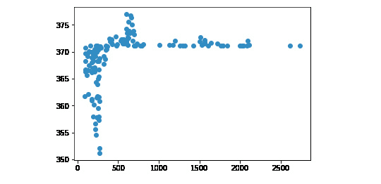

3

# 回归

## 学习目标

到本章结束时，你将能够：

+   描述回归中涉及的数学逻辑

+   阐述 NumPy 库在回归中的应用

+   识别一元和多元线性回归

+   使用多项式回归

本章涵盖了线性回归和多项式回归的基础。

## 简介

回归是一个广泛的领域，它将数学统计学、数据科学、机器学习和人工智能联系起来。由于回归的基本原理根植于数学，我们将从探索数学基础开始。

本主题的大部分内容将涉及不同形式的线性回归，包括一元线性回归、多元线性回归、一元多项式回归和多元多项式回归。Python 提供了大量支持进行回归操作的功能。

在比较和对比支持向量回归与线性回归形式的同时，我们还将使用替代的回归模型。在本章中，我们将使用从在线服务提供商加载的股价数据进行回归分析。本章中的模型并不旨在提供交易或投资建议。

#### 注意

虽然不建议使用本章中的模型提供交易或投资建议，但这确实是一次非常激动人心且有趣的旅程，它解释了回归的基本原理。

## 一元线性回归

一个一般的回归问题可以定义为如下。假设我们有一组数据点。我们需要找出一个最佳拟合曲线来近似拟合给定的数据点。这条曲线将描述我们的输入变量 x（数据点）与输出变量 y（曲线）之间的关系。

在现实生活中，我们经常有多个输入变量决定一个输出变量。回归帮助我们理解当我们将所有但一个输入变量固定时，输出变量是如何变化的，并且我们改变剩余的输入变量。

### 什么是回归？

在本章中，我们将研究二维平面上的回归。这意味着我们的数据点是二维的，我们正在寻找一条曲线来近似如何从一个变量计算另一个变量。

我们将学习以下类型的回归：

+   **使用一元多项式（度数为 1）进行一元线性回归**：这是回归的最基本形式，其中一条直线近似表示未来数据集的轨迹。

+   **使用一元多项式（度数为 1）进行多元线性回归**：我们将使用一元方程，但现在我们将允许多个输入变量，也称为特征。

+   **一元多项式回归**：这是单变量线性回归的一种通用形式。由于用来近似输入和输出之间关系的多项式是任意阶的，我们可以创建比直线更好地拟合数据点的曲线。回归仍然是线性的——不是因为多项式是线性的，而是因为回归问题可以用线性代数来建模。

+   **多元多项式回归**：这是使用高阶多项式和多个特征预测未来的最通用回归问题。

+   **支持向量回归**：这种回归形式使用支持向量机来预测数据点。这种回归形式包括在内，以便将其与其他四种回归形式的用法进行比较。

在这个主题中，我们将处理第一种类型的线性回归：我们将使用一个变量，回归的多项式将描述一条直线。

在二维平面上，我们将使用笛卡尔坐标系，更通俗地称为直角坐标系。我们有一个 *X* 轴和一个 *Y* 轴，这两个轴的交点是原点。我们用它们的 X 和 Y 坐标来表示点。

例如，点 (2, 1) 对应于以下坐标系中的橙色点：


###### 图 3.1：在坐标系中表示点 (2,1)

一条直线可以用方程 `y = a*x + b` 来描述，其中 a 是方程的斜率，决定了方程上升的陡峭程度，b 是一个常数，决定了直线与 Y 轴的交点。

在以下图中，你可以看到三个方程：

+   蓝线用 y = 2*x + 1 方程描述。

+   橙线用 y = x + 1 方程描述。

+   紫色线用 y = 0.5*x + 1 方程描述。

你可以看到，所有三个方程都在 y 轴上交于 1，它们的斜率由我们乘以 x 的因子决定。

如果你知道 x，你可以找出 y。如果你知道 y，你可以找出 x：


###### 图 3.2：在坐标系中表示方程 y = 2*x + 1, y = x + 1, 和 y = 0.5*x + 1

我们也可以用方程描述更复杂的曲线：


###### 图 3.3：显示复杂曲线的图像

#### 注意

如果你想更多地实验笛卡尔坐标系，你可以使用以下绘图器：[`s3-us-west-2.amazonaws.com/oerfiles/College+Algebra/calculator.html`](https://s3-us-west-2.amazonaws.com/oerfiles/College+Algebra/calculator.html)。

### 特征和标签

在机器学习中，我们区分特征和标签。特征被认为是我们的输入变量，标签是我们的输出变量。

当谈论回归时，标签的可能值是一个连续的有理数集合。

将特征视为 X 轴上的值，将标签视为 Y 轴上的值。

回归的任务是根据特征值预测标签值。我们通常通过将特征值前移来创建标签。例如，如果我们想预测 1 个月后的股价，并且通过将股价特征前移 1 个月来创建标签，那么：

+   对于每个至少有 1 个月历史的股价特征值，都有可用的训练数据，显示了 1 个月后的预测股价数据。

+   对于上个月，预测数据不可用，因此这些值都是 NaN（不是一个数字）。

我们必须丢弃上个月的数据，因为我们不能使用这些值进行预测。

### 特征缩放

有时，我们有多组特征，它们的值可能完全在不同的范围内。想象一下，在地图上比较微米和现实世界中的千米。由于数量级相差九个零，它们将很难处理。

一个不那么戏剧性的差异是英制和公制数据之间的差异。磅和千克，厘米和英寸，它们之间的比较并不好。

因此，我们通常将特征缩放到归一化值，这样处理起来更容易，因为我们更容易比较这个范围内的值。我们将训练数据和测试数据一起缩放。范围通常缩放到[-1;1]之间。

我们将演示两种类型的缩放：

+   最小-最大归一化

+   均值归一化

最小-最大缩放的计算如下：

```py
x_scaled[n] = (x[n] - min(x)) / (max(x)-min(x))
```

均值归一化的计算如下：

```py
avg = sum(x) / len(x)
x_scaled[n] = (x[n] – avg) / (max(x)-min(x))
[(float(i)-avg)/(max(fibonacci)-min(fibonacci)) for i in fibonacci]
```

这里是一个最小-最大和最大-最小归一化的例子：

```py
fibonacci = [0, 1, 1, 2, 3, 5, 8, 13, 21, 34, 55, 89, 144]
# Min-Max scaling:
[(float(i)-min(fibonacci))/(max(fibonacci)-min(fibonacci)) for i in fibonacci]
[0.0,
0.006944444444444444,
0.006944444444444444,
0.013888888888888888,
0.020833333333333332,
0.034722222222222224,
0.05555555555555555,
0.09027777777777778,
0.14583333333333334,
0.2361111111111111,
0.3819444444444444,
0.6180555555555556,
1.0]
# Mean normalization:
avg = sum(fibonacci) / len(fibonacci)
# 28.923076923076923
[(float(i)-avg)/(max(fibonacci)-min(fibonacci)) for i in fibonacci]
[-0.20085470085470086,
-0.19391025641025642,
-0.19391025641025642,
-0.18696581196581197,
-0.18002136752136752,
-0.16613247863247863,
-0.1452991452991453,
-0.11057692307692307,
-0.05502136752136752,
0.035256410256410256,
0.18108974358974358,
0.4172008547008547,
0.7991452991452992]
```

缩放可能会增加处理时间，但通常这是一个合理的步骤。

在 scikit-learn 库中，我们可以访问一个用于缩放 NumPy 数组的函数：

```py
import numpy as np
from sklearn import preprocessing
preprocessing.scale(fibonacci)
array([-0.6925069 , -0.66856384, -0.66856384, -0.64462079, -0.62067773,
       -0.57279161, -0.50096244, -0.38124715, -0.18970269, 0.12155706,
        0.62436127, 1.43842524, 2.75529341])
```

缩放方法执行均值归一化。请注意，结果是 NumPy 数组。

### 基于训练和测试数据的交叉验证

交叉验证衡量统计模型的预测性能。交叉验证结果越好，你就越可以相信你的模型可以用来预测未来。

在交叉验证期间，我们测试模型在真实**测试数据**上预测未来的能力。测试数据不用于预测过程。

**训练数据**用于构建预测结果的模型。

一旦我们从数据源加载数据，我们通常将数据分成较大的训练数据块和较小的测试数据块。这种分离会随机打乱训练和测试数据的条目。然后，它给你一个包含训练特征、相应的训练标签、测试特征和相应的测试标签的数组。

我们可以使用 scikit-learn 的`model_selection`库进行训练-测试分割。

假设在我们这个假设的例子中，我们已经缩放了斐波那契数据及其索引作为标签：

```py
features = preprocessing.scale(fibonacci)
label = np.array(range(13))
```

让我们使用 10%的数据作为测试数据。

```py
from sklearn import model_selection
(x_train, x_test, y_train, y_test) =
model_selection.train_test_split(features, label, test_size=0.1)
x_train
array([-0.66856384, 0.12155706, -0.18970269, -0.64462079, 1.43842524,
        2.75529341, -0.6925069 , -0.38124715, -0.57279161, -0.62067773,
       -0.66856384])
x_test
array([-0.50096244, 0.62436127])
y_train
array([1, 9, 8, 3, 11, 12, 0, 7, 5, 4, 2])
y_test
array([6, 10])
```

在训练和测试过程中，如果我们得到错误的比率，我们就有可能过度拟合或欠拟合模型。

当我们训练模型过于完美，以至于它对训练数据集拟合得太好时，就会发生过拟合。模型将在训练数据上非常准确，但在现实生活中却无法使用，因为当它用于任何其他数据时，其准确性会下降。模型调整到训练数据中的随机噪声，并假设在这个噪声上的模式会产生错误的预测。当模型没有很好地拟合训练数据，以至于无法识别数据的重要特征时，就会发生欠拟合。结果，它无法对新数据进行必要的预测。一个例子是当我们尝试对非线性数据进行线性回归时。例如，斐波那契数不是线性的，因此，斐波那契序列上的模型也不能是线性的。

#### 注意

如果你记得笛卡尔坐标系，你知道水平轴是 X 轴，而垂直轴是 Y 轴。我们的特征位于 X 轴，而我们的标签位于 Y 轴。因此，我们将特征和 X 视为同义词，而标签通常用 Y 表示。因此，x_test 表示特征测试数据，x_train 表示特征训练数据，y_test 表示标签测试数据，y_train 表示标签训练数据。

### 使用 scikit-learn 在数据上拟合模型

我们将通过一个虚拟示例来展示回归的过程，在这个示例中，我们只有一个特征和非常有限的数据。

由于我们只有一个特征，我们必须通过`x_train.reshape (-1,1)`将`x_train`格式化为一个包含一个特征的 NumPy 数组。

因此，在执行拟合最佳线的代码之前，请执行以下代码：

`x_train = x_train.reshape(-1, 1)`

`x_test = x_test.reshape(-1, 1)`

`# array([a, b, c]).reshape(-1, 1) becomes:`

`# array([[a, b, c]])`

假设我们为我们的特征和标签有训练和测试数据。

我们可以在这些数据上拟合一个模型来进行预测。现在我们将使用线性回归来完成这个目的：

```py
from sklearn import linear_model
linear_regression = linear_model.LinearRegression()
model = linear_regression.fit(x_train, y_train)
model.predict(x_test)
array([4.16199119, 7.54977143])
```

我们也可以计算与模型相关的分数：

```py
model.score(x_test, y_test)
-0.17273705326696565
```

这个分数是均方误差，代表了模型的准确性。它表示我们能够从标签中预测特征的好坏程度。

这个数字表示一个非常差的模型。最佳可能的分数是 1.0。如果我们始终通过忽略特征来预测标签，我们可以达到 0.0 的分数。在这本书中，我们将省略这个分数的数学背景。

我们模型表现不佳有两个原因：

+   11 个训练数据和 2 个测试数据对于进行适当的预测分析来说远远不够。

+   即使忽略点的数量，斐波那契`x -> y`函数也不描述 x 和 y 之间的线性关系。用线来近似非线性函数只有在非常接近训练区间时才有用。

在未来，我们将看到更多更准确的模型，甚至可能达到 0.9 的模型分数。

### 使用 NumPy 数组进行线性回归

NumPy 数组比 Python 列表更方便的一个原因是它们可以被当作向量来处理。有一些定义在向量上的操作可以简化我们的计算。我们可以对长度相似的向量执行操作。两个向量的和以及它们的（向量）积等于一个向量，其中每个坐标是相应坐标的和或（向量）积。

例如：

```py
import numpy as np
v1 = np.array([1,2,3])
v2 = np.array([2,0,2])
v1 + v2 # array([3, 2, 5])
v1 * v2 # array([2, 0, 6])
```

向量与标量的乘积是一个向量，其中每个坐标都乘以标量：

`v1 * 2 # array([2, 4, 6])`

向量的平方等于向量与自身的向量积。双星号表示幂运算符：

`v1 ** 2 # array([1, 4, 9], dtype=int32)`

假设我们在平面上有一组点。我们的任务是找到最佳拟合线。

让我们看看两个示例。

我们的第一个示例包含 13 个看似线性的值。我们正在绘制以下数据：

```py
[2, 8, 8, 18, 25, 21, 32, 44, 32, 48, 61, 45, 62]
```

如果你想要绘制一条最接近这些点的线，你的合理猜测将非常接近现实：


###### 图 3.4：值[2, 8, 8, 18, 25, 21, 32, 44, 32, 48, 61, 45, 62]的绘制图表

我们的第二个示例是缩放后的斐波那契数列的前 13 个值。尽管我们可以定义一条最接近这些点的线，但我们从点的分布中可以看出，我们的模型不会很有用：


###### 图 3.5：斐波那契值的绘制图表

我们已经学过了直线的方程：`y = a * x + b`

在这个方程中，`a` 是斜率，`b` 是 `y` 轴截距。为了找到最佳拟合线，我们必须找到系数 `a` 和 `b` 。

我们的任务是使最佳拟合线到各点的距离之和最小化。

在这本书中，我们将保存计算系数 `a` 和 `b` 的思维过程，因为你会发现它几乎没有实际用途。我们更愿意使用列表中值的算术平均值作为均值。我们可以使用 NumPy 提供的均值函数来完成这个任务。

让我们找到这两个示例的最佳拟合线：

```py
import numpy as np
from numpy import mean
x = np.array(range(1, 14))
y = np.array([2, 8, 8, 18, 25, 21, 32, 44, 32, 48, 61, 45, 62])
a = (mean(x)*mean(y) - mean(x*y)) / (mean(x) ** 2 - mean( x ** 2 ))
4.857142857142859
b = mean(y) - a*mean(x)
-2.7692307692307843
```

一旦我们用前面的系数绘制出线 y = a*x + b，我们得到以下图表：


###### 图 3.6：绘制图表显示数组值[2, 8, 8, 18, 25, 21, 32, 44, 32, 48, 61, 45, 62]和线 y=a*x+b

#### 注意

你可以在[`www.endmemo.com/statistics/lr.php`](http://www.endmemo.com/statistics/lr.php)找到一个线性回归计算器。你还可以检查计算器，以了解给定数据集上的最佳拟合线看起来像什么。

关于缩放后的斐波那契值，最佳拟合线看起来如下：


###### 图 3.7：绘制图表显示斐波那契值和线 y=a*x+b

第二个数据集的最佳拟合线显然比训练区间外的任何地方都要偏离。

#### 注意

我们不必使用这种方法来进行线性回归。包括 scikit-learn 在内的许多库将帮助我们自动化这个过程。一旦我们进行了多元线性回归，我们最好使用库来为我们执行回归。

### 使用 NumPy Polyfit 拟合模型

NumPy Polyfit 也可以用于创建一元线性回归的最佳拟合线。

回忆一下最佳拟合线的计算：

```py
import numpy as np
from numpy import mean
x = np.array(range(1, 14))
y = np.array([2, 8, 8, 18, 25, 21, 32, 44, 32, 48, 61, 45, 62])
a = (mean(x)*mean(y) - mean(x*y)) / (mean(x) ** 2 - mean( x ** 2 ))
4.857142857142859
b = mean(y) - a*mean(x)
-2.7692307692307843
```

找到系数 a 和 b 的方程相当长。幸运的是，`numpy.polyfit` 执行这些计算以找到最佳拟合线的系数。`polyfit` 函数接受三个参数：`x` 值的数组，`y` 值的数组，以及要查找的多项式度数。由于我们正在寻找一条直线，多项式中 `x` 的最高次幂是 1：

```py
import numpy as np
x = np.array(range(1, 14))
y = np.array([2, 8, 8, 18, 25, 21, 32, 44, 32, 48, 61, 45, 62])
[a, b] = np.polyfit(x, y, 1)
[4.857142857142858, -2.769230769230769]
```

在 Python 中绘制结果

假设你有一组数据点和一条回归线。我们的任务是绘制点和线，以便我们可以用我们的眼睛看到结果。

我们将使用 `matplotlib.pyplot` 库来完成这个任务。这个库有两个重要的函数：

+   **散点图：** 这个函数在平面上显示散点，由一系列 x 坐标和一系列 y 坐标定义。

+   **绘图：** 除了两个参数外，这个函数绘制由两个点定义的段，或者由多个点定义的段序列。绘图类似于散点图，除了点不是显示出来，而是通过线连接。

一个有三个参数的绘图函数绘制一个段和/或两个点，格式根据第三个参数

一个段由两个点定义。当 `x` 在 1 和 14 之间变化时，显示 0 和 15 之间的段是有意义的。我们必须将 `x` 的值代入方程 `a*x+b` 中，以得到相应的 `y` 值：

```py
import matplotlib.pyplot as plot
x = np.array(range(1, 14))
y = np.array([2, 8, 8, 18, 25, 21, 32, 44, 32, 48, 61, 45, 62])
a = (mean(x)*mean(y) - mean(x*y)) / (mean(x) ** 2 - mean(x ** 2))
4.857142857142859
b = mean(y) - a*mean(x)
-2.7692307692307843
# Plotting the points
plot.scatter(x, y)
# Plotting the line
plot.plot([0, 15], [b, 15*a+b])
```

输出如下：


###### 图 3.8：显示数据点如何拟合回归线的图形

你可能需要调用 `plot.show()` 来显示前面的图形。在 IPython 控制台中，坐标系会自动显示。

段和散点数据点按预期显示。

Plot 有一个高级签名。你可以使用一个 plot 调用来在这个图表上绘制散点、线和任何曲线。这些变量被解释为三组：

+   X 值

+   Y 值

+   以字符串形式表示的格式选项

让我们创建一个函数，从近似 x 值的数组推导出近似 y 值的数组：

```py
def fitY( arr ):
    return [4.857142857142859 * x - 2.7692307692307843 for x in arr]
```

我们将使用 `fit` 函数来绘制值：

```py
plot.plot(
    x, y, 'go',
    x, fitY(x), 'r--o'
)
```

输出如下：


###### 图 3.9：使用 fit 函数的绘图函数的图形

Python 绘图库为大多数图形问题提供了一个简单的解决方案。你可以在这张图上绘制尽可能多的线、点和曲线。

每第三个变量负责格式化。字母 g 代表绿色，而字母 r 代表红色。您可以使用 b 代表蓝色，y 代表黄色，等等。如果没有指定颜色，每个三元组将使用不同的颜色显示。字符 o 表示我们希望在数据点所在的位置显示一个点。因此，'go' 与移动无关——它要求绘图器绘制绿色点。'-' 字符负责显示虚线。如果您只使用一个减号，则会出现直线而不是虚线。

如果我们简化这种格式化，我们可以指定我们只想绘制任意颜色的点，以及另一种任意颜色的直线。通过这样做，我们可以简单地写出以下绘图调用：

```py
plot.plot(
    x, y, 'o',
    x, fitY(x), '-'
)
```

输出如下：


###### 图 3.10：带有虚线的 plot 函数图形

在显示曲线时，绘图器使用线段连接点。同时，请注意，即使是复杂的曲线序列也只是连接点的近似。例如，如果您执行来自 [`gist.github.com/traeblain/1487795`](https://gist.github.com/traeblain/1487795) 的代码，您将识别出 batman 函数的段是连接的线条：


###### 图 3.11：batman 函数的图形

有许多种绘制曲线的方法。我们已经看到，NumPy 库的 `polyfit` 方法返回一个系数数组来描述一个线性方程：

```py
import numpy as np
x = np.array(range(1, 14))
y = np.array([2, 8, 8, 18, 25, 21, 32, 44, 32, 48, 61, 45, 62])
np.polyfit(x, y, 1)
# array([ 4.85714286, -2.76923077])
```

这个数组描述了方程 `4.85714286 * x - 2.76923077`。

假设我们现在想要绘制一条曲线，`y = -x**2 + 3*x - 2`。这个二次方程由系数数组 `[-1, 3, -2]` 描述。我们可以编写自己的函数来计算属于 x 值的 y 值。然而，NumPy 库已经有一个功能可以为我们完成这项工作：`np.poly1d`：

```py
import numpy as np
x = np.array(range( -10, 10, 0.2 ))
f = np.poly1d([-1,3,-2])
```

由 poly1d 调用创建的 f 函数不仅适用于单个值，还适用于列表或 NumPy 数组：

```py
f(5)
# -12
f(x)
# array([-132, -110, -90, -72, -56, -42, -30, -20, -12, -6, -2, 0, 0, -2, -6, -12, -20, -30, -42, -56])
```

我们现在可以使用这些值来绘制非线性曲线：

```py
import matplotlib.pyplot as plot
plot.plot(x, f(x))
```

输出如下：


###### 图 3.12：pyplot 函数的图形

### 使用线性回归预测值

假设我们感兴趣的是 `x` 坐标 `20` 对应的 `y` 值。根据线性回归模型，我们只需要将 `20` 的值替换到 `x` 的位置：

```py
# Plotting the points
plot.scatter(x, y)
# Plotting the prediction belonging to x = 20
plot.scatter(20, a * 20 + b, color='red')
# Plotting the line
plot.plot([0, 25], [b, 25*a+b])
```

输出如下：


###### 图 3.13：使用线性回归显示预测值的图形

在这里，我们用红色表示预测值。这个红色点位于最佳拟合线上。

### 活动 5：预测人口

您正在 Metropolis 政府办公室工作，试图预测小学容量需求。您的任务是确定 2025 年和 2030 年开始上小学的儿童数量预测。过去的数据如下：


###### 图 3.14：表示 2001 年至 2018 年开始上小学的儿童数量的表格

在二维图表上绘制这些趋势。为此，你必须：

1.  使用线性回归。特征是从 2001 年到 2018 年的年份。为了简化，我们可以将 2001 年表示为第 1 年，2018 年表示为第 18 年。

1.  使用 `np.polyfit` 确定回归线的系数。

1.  使用 `matplotlib.pyplot` 绘制结果以确定未来的趋势。

    #### 注意

    该活动的解决方案可在第 269 页找到。

## 多变量线性回归

在上一个主题中，我们处理了一元线性回归。现在我们将学习线性回归的扩展版本，我们将使用多个输入变量来预测输出。

我们将依靠加载和预测股票价格的例子。因此，我们将实验用于加载股票价格的主要库。

### 多元线性回归

如果你还记得线性回归中最佳拟合线的公式，它被定义为 `y = a*x + b`，其中 `a` 是线的斜率，`b` 是线的 y 截距，`x` 是特征值，`y` 是计算出的标签值。

在多元回归中，我们有多个特征和一个标签。假设我们有三个特征，`x1`、`x2` 和 `x3`，我们的模型将如下变化：

```py
y = a1 * x1 + a2 * x2 + a3 * x3 + b
```

在 NumPy 数组格式中，我们可以将此方程写成以下形式：

```py
y = np.dot(np.array([a1, a2, a3]), np.array([x1, x2, x3])) + b
```

为了方便，将整个方程定义为向量乘积形式是有意义的。`b` 的系数将是 `1`：

```py
y = np.dot(np.array([b, a1, a2, a3]) * np.array([1, x1, x2, x3]))
```

多元线性回归是两个向量之间的简单标量积，其中系数 `b`、`a1`、`a2` 和 `a3` 决定了四维空间中的最佳拟合方程。

要理解多元线性回归的公式，你需要两个向量的标量积。由于标量积的另一个名称是点积，执行此操作的 NumPy 函数被称为 dot：

`import numpy as np`

`v1 = [1, 2, 3]`

`v2 = [4, 5, 6]`

`np.dot( v1, v2 ) = 1 * 4 + 2 * 5 + 3 * 6 = 32`

我们只需将每个相应坐标的乘积相加。

我们可以通过最小化数据点与方程描述的最近点之间的误差来确定这些系数。为了简化，我们将省略最佳拟合方程的数学解，并使用 scikit-learn。

#### 注意

在 n 维空间中，其中 n 大于 3，维数的数量决定了我们模型中的不同变量。在前面的例子中，我们有三个特征和一个标签。这产生了四个维度。如果你想想象四维空间，你可以想象三维空间和时间来简化。五维空间可以想象为四维空间，其中每个时间点都有一个温度。维度只是特征（和标签）；它们不一定与我们三维空间的概念相关。

### 线性回归的过程

我们将遵循以下简单步骤来解决线性回归问题：

1.  从数据源加载数据。

1.  准备预测数据（归一化、格式化、过滤）。

1.  计算回归线的参数。无论我们使用单变量线性回归还是多变量线性回归，我们都会遵循以下步骤。

### 从数据源导入数据

有多个库可以为我们提供访问数据源的方法。由于我们将处理股票数据，让我们看看两个针对检索金融数据的示例，Quandl 和 Yahoo Finance：

+   scikit-learn 包含一些数据集，可用于练习您的技能。

+   [Quandl.com](http://Quandl.com) 提供免费和付费的金融数据集。

+   [pandas.io](http://pandas.io) 帮助您加载任何 .csv、.excel、.json 或 SQL 数据。

+   Yahoo Finance 为您提供金融数据集。

### 使用 Yahoo Finance 加载股票价格

使用 Yahoo Finance 加载股票数据的过程很简单。您只需要在 CLI 中使用以下命令安装 fix_yahoo_finance 包：

```py
pip install fix_yahoo_finance
```

我们将下载一个包含从 2015 年开始的 S&P 500 指数的开盘价、最高价、最低价、收盘价、调整后的收盘价和交易量的数据集：

```py
import fix_yahoo_finance as yahoo
spx_data_frame = yahoo.download("^GSPC", "2015-01-01")
```

这就是您需要做的。包含 S&P 500 指数的数据框已准备好。

您可以使用 plot 方法绘制指数价格：

```py
spx_data_frame.Close.plot()
```

输出如下：


###### 图 3.15：显示 Yahoo Finance 股票价格的图表

您还可以使用以下命令将数据保存到 CSV 文件：

```py
spx.to_csv("spx.csv")
```

### 使用 pandas 加载文件

假设有一个包含股票数据的 CSV 文件。我们现在将使用 pandas 从该文件加载数据：

```py
import pandas as pd
spx_second_frame = pd.read_csv("spx.csv", index_col="Date", header=0, parse_dates=True)
```

为了正确解析数据，我们必须设置索引列名称，指定没有标题，并确保日期被解析为日期。

### 使用 Quandl 加载股票价格

Quandl.com 是金融和经济数据集的可靠来源。

### 练习 8：使用 Quandl 加载股票价格

1.  打开 Anaconda 提示符并使用以下命令安装 Quandl：

    ```py
    pip install quandl
    ```

1.  前往 [`www.quandl.com/`](https://www.quandl.com/)。

1.  点击“金融数据”。

1.  在过滤器中，点击**免费**标签旁边的复选框。如果您有 Quandl 订阅，您可以使用它下载股票数据。

1.  选择您想使用的股票或指数。在我们的例子中，我们将使用耶鲁大学经济学系收集的 S&P 综合指数数据。此链接为 [`www.quandl.com/data/YALE/SPCOMP-S-P-Composite`](https://www.quandl.com/data/YALE/SPCOMP-S-P-Composite)。

1.  找到您想加载的仪器的 Quandl 代码。我们用于 S&P 500 数据的 Quandl 代码是 "YALE/SPCOMP"。

1.  从 Jupyter QtConsole 加载数据：

    ```py
    import quandl
    data_frame = quandl.get("YALE/SPCOMP")
    ```

1.  所有导入值的列都是特征：

    ```py
    data_frame.head()
    ```

1.  输出如下：

    ```py
                S&P Composite Dividend Earnings        CPI Long Interest Rate \
    Year                                                                        
    1871-01-31         4.44     0.26     0.4 12.464061            5.320000
    1871-02-28         4.50     0.26     0.4 12.844641            5.323333
    1871-03-31         4.61     0.26     0.4 13.034972            5.326667
    1871-04-30         4.74     0.26     0.4 12.559226            5.330000
    1871-05-31         4.86     0.26     0.4 12.273812            5.333333
                Real Price Real Dividend Real Earnings \
    Year                                                
    1871-01-31 89.900119     5.264421     8.099110
    1871-02-28 88.415295     5.108439     7.859137
    1871-03-31 89.254001     5.033848     7.744382
    1871-04-30 95.247222     5.224531     8.037740
    1871-05-31 99.929493     5.346022     8.224650
                Cyclically Adjusted PE Ratio
    Year                                    
    1871-01-31                         NaN
    1871-02-28                         NaN
    1871-03-31                         NaN
    1871-04-30                         NaN
    1871-05-31                         NaN
                                     ...
    2016-02-29                     24.002607
    2016-03-31                     25.372299
    ```

### 准备预测数据

在我们进行回归之前，我们必须选择我们感兴趣的特征，并且我们还需要确定我们进行回归的数据范围。

准备预测数据是回归过程的第二步。这一步也有几个子步骤。我们将在以下顺序中通过这些子步骤：

1.  假设有一个包含预加载数据的数据帧。

1.  选择你感兴趣的列。

1.  用数值替换 NaN 值以避免删除数据。

1.  确定预测区间 T，确定你希望在未来查看的时间长度或数据行数。

1.  从你希望预测的值创建一个标签列。对于数据帧的第 i 行，标签的值应该属于时间点 i+T。

1.  对于最后 T 行，标签值是 NaN。从数据帧中删除这些行。

1.  从特征和标签创建 NumPy 数组。

1.  缩放特征数组。

1.  将训练数据和测试数据分开。

一些特征高度相关。例如，实际股息列与实际价格成比例增长。它们之间的比率并不总是相同的，但它们确实相关。

由于回归不是关于检测特征之间的相关性，我们宁愿去除一些已知的冗余属性，并在非相关特征上执行回归。

如果你已经完成了“使用 Quandl 加载股票价格”部分，你已经有了一个包含 S&P 500 指数历史数据的数据帧。我们将保留长期利率、实际价格和实际股息列：

```py
data_frame[['Long Interest Rate', 'Real Price', 'Real Dividend', 'Cyclically Adjusted PE Ratio']]
```

由于你不能处理 NaN 数据，你可以通过用数字替换 NaN 来替换它。通常，你有两种选择：

+   删除数据

+   用有意义的默认值替换数据

```py
data_frame.fillna(-100, inplace=True)
```

我们可以使用`len`函数检查数据帧的长度，如下面的代码所示：

```py
len(data_frame)
1771
```

我们的数据帧长度是 1771。

如果我们想要预测未来 20 年的实际价格，我们将必须预测 240 个值。这大约是数据帧长度的 15%，这是完全合理的。

因此，我们将通过将实际价格值向上移动 240 个单位来创建一个实际价格标签：

```py
data_frame['Real Price Label'] = data_frame['Real Price'].shift( -240 )
```

这样，每个实际价格标签值将是 20 年后的实际价格值。

这些值移动的副作用是在最后 240 个值中出现 NaN 值：

```py
data_frame.tail()
```

输出如下：

```py
            S&P Composite Dividend Earnings     CPI Long Interest Rate \
Year                                                                        
2018-03-31        2702.77     50.00     NaN 249.5540             2.840
2018-04-30        2653.63     50.33     NaN 250.5460             2.870
2018-05-31        2701.49     50.66     NaN 251.5880             2.976
2018-06-30        2754.35     50.99     NaN 252.1090             2.910
2018-07-31        2736.61     NaN     NaN 252.3695             2.830
             Real Price Real Dividend Real Earnings \
Year                                                    
2018-03-31 2733.262995     50.564106            NaN
2018-04-30 2672.943397     50.696307            NaN
2018-05-31 2709.881555     50.817364            NaN
2018-06-30 2757.196024     51.042687            NaN
2018-07-31 2736.610000            NaN            NaN
            Cyclically Adjusted PE Ratio Real Price Label
Year                                                        
2018-03-31                     31.988336             NaN
2018-04-30                     31.238428             NaN
2018-05-31                     31.612305             NaN
2018-06-30                     32.091415             NaN
2018-07-31                     31.765318             NaN
```

我们可以通过在数据帧上执行 dropna 来去除它们：

```py
data_frame.dropna(inplace=True)
```

这样，我们就有到了 1998 年 7 月的数据，并且在实际价格标签列中有未来值直到 2018 年：

```py
data_frame.tail()
```

输出如下：

```py
            S&P Composite Dividend Earnings    CPI Long Interest Rate \
Year                                                                    
1998-03-31        1076.83 15.6400 39.5400 162.2                5.65
1998-04-30        1112.20 15.7500 39.3500 162.5                5.64
1998-05-31        1108.42 15.8500 39.1600 162.8                5.65
1998-06-30        1108.39 15.9500 38.9700 163.0                5.50
1998-07-31        1156.58 16.0167 38.6767 163.2                5.46
             Real Price Real Dividend Real Earnings \
Year                                                    
1998-03-31 1675.456527     24.334519     61.520900
1998-04-30 1727.294510     24.460428     61.112245
1998-05-31 1718.251850     24.570372     60.705096
1998-06-30 1716.097117     24.695052     60.336438
1998-07-31 1788.514193     24.767932     59.808943
            Cyclically Adjusted PE Ratio Real Price Label
Year                                                        
1998-03-31                     36.296928     2733.262995
1998-04-30                     37.276934     2672.943397
1998-05-31                     36.956599     2709.881555
1998-06-30                     36.802293     2757.196024
1998-07-31                     38.259645     2736.610000
```

让我们为回归准备我们的特征和标签。

对于特征，我们将使用数据帧的 drop 方法。drop 方法返回一个新的数据帧，其中不包含被删除的列：

```py
import numpy as np
features = np.array(data_frame.drop('Real Price Label', 1))
label = np.array(data_frame['Real Price Label'])
```

第二个参数中的 1 指定了我们正在删除列。由于原始数据帧没有被修改，标签可以直接从中提取。

现在是时候使用 Scikit Learn 的预处理模块缩放特征了：

```py
from sklearn import preprocessing
scaled_features = preprocessing.scale(features)
features
array([[6.19000000e+00, 2.65000000e-01, 4.85800000e-01, ...,
        7.10000389e+00, 1.30157807e+01, 1.84739523e+01],
       [6.17000000e+00, 2.70000000e-01, 4.81700000e-01, ...,
        7.16161179e+00, 1.27768459e+01, 1.81472582e+01],
       [6.24000000e+00, 2.75000000e-01, 4.77500000e-01, ...,
        7.29423423e+00, 1.26654431e+01, 1.82701191e+01],
       ...,
       [1.10842000e+03, 1.58500000e+01, 3.91600000e+01, ...,
        2.45703721e+01, 6.07050959e+01, 3.69565985e+01],
       [1.10839000e+03, 1.59500000e+01, 3.89700000e+01, ...,
        2.46950523e+01, 6.03364381e+01, 3.68022935e+01],
       [1.15658000e+03, 1.60167000e+01, 3.86767000e+01, ...,
        2.47679324e+01, 5.98089427e+01, 3.82596451e+01]])
scaled_features
array([[-0.47564285, -0.62408514, -0.57496262, ..., -1.23976862,
        -0.84099698, 0.6398416 ],
       [-0.47577027, -0.62273749, -0.5754623 , ..., -1.22764677,
        -0.85903686, 0.57633607],
       [-0.47532429, -0.62138984, -0.57597417, ..., -1.20155224,
        -0.86744792, 0.60021881],
       ...,
       [ 6.54690076, 3.57654404, 4.13838295, ..., 2.19766676,
         2.75960615, 4.23265262],
       [ 6.54670962, 3.60349707, 4.11522706, ..., 2.22219859,
         2.73177202, 4.20265751],
       [ 6.85373845, 3.62147473, 4.07948167, ..., 2.23653834,
         2.69194545, 4.48594968]])
```

如你所见，缩放后的特征更容易阅读和解释。在缩放数据时，我们必须一起缩放所有数据，包括训练数据和测试数据。

### 执行和验证线性回归

现在缩放完成后，我们的下一个任务是分别将训练数据和测试数据分开。我们将使用 90%的数据作为训练数据，其余的（10%）将用作测试数据：

```py
from sklearn import model_selection
(features_train, features_test, label_train, label_test) =
    model_ selection.train_test_split(
        scaled_features, label, test_size=0.1
    )
```

train_test_split 函数会打乱我们数据的行，保持对应关系，并将大约 10%的所有数据放入测试变量中，保留 90%用于训练变量。这将帮助我们评估我们的模型有多好。

我们现在可以根据训练数据创建线性回归模型：

```py
from sklearn import linear_model
model = linear_model.LinearRegression()
model.fit(features_train, label_train)
```

一旦模型准备就绪，我们就可以用它来预测属于测试特征值的标签：

```py
label_predicted = model.predict(features_test)
```

如果你感兴趣的是预测特征值和准确测试特征值之间的关系，你可以使用 Python 二维图表绘制实用程序来绘制它们：

```py
from matplotlib import pyplot as plot
plot.scatter(label_test, label_predicted)
```

这给你一个图表的图像，其中测试数据与预测结果进行比较。这些值越接近`y = x`线，就越好。

你可以从以下图表中看到，预测确实围绕`y=x`线进行，存在一定的误差。这种误差很明显，否则我们就能用这样的简单预测赚很多钱，每个人都会追求预测股价而不是在自己的专业领域工作：


###### 图 3.16：散点图绘制函数的图表

我们可以得出结论，模型存在一定的误差。问题是，我们如何量化这个误差？答案是简单的：我们可以使用内置的实用程序对模型进行评分，该实用程序计算模型的均方误差：

```py
model.score(features_test, label_test)
0.9051697119010782
```

我们可以得出结论，该模型非常准确。这并不令人惊讶，因为每个金融顾问骗子都倾向于告诉我们市场每年增长大约 6-7%。这是一种线性增长，模型本质上预测市场将继续以线性速度增长。得出市场长期倾向于上涨的结论并不是什么科学。

### 预测未来

我们已经使用了测试数据的预测。现在，是时候使用实际数据来看向未来了。

```py
import quandl
import numpy as np
from sklearn import preprocessing
from sklearn import model_selection
from sklearn import linear_model
data_frame = quandl.get("YALE/SPCOMP")
data_frame[['Long Interest Rate', 'Real Price', 'Real Dividend', 'Cyclically Adjusted PE Ratio']]
data_frame.fillna(-100, inplace=True)
data_frame['Real Price Label'] = data_frame['Real Price'].shift(-240)
data_frame.dropna(inplace=True)
features = np.array(data_frame.drop('Real Price Label', 1))
label = np.array(data_frame['Real Price Label'])
scaled_features = preprocessing.scale(features)
(features_train, features_test, label_train, label_test) =
    model_ selection.train_test_split(
        scaled_features, label, test_size=0.1
    )
model = linear_model.LinearRegression()
model.fit(features_train, label_train)
label_predicted = model.predict(features_test)
```

预测未来的技巧是我们必须保存构建模型时丢弃的值的值。我们基于 20 年前的历史数据构建了股价模型。现在，我们必须保留这些数据，还必须在缩放时包含这些数据：

```py
import quandl
import numpy as np
from sklearn import preprocessing
from sklearn import model_selection
from sklearn import linear_model
data_frame = quandl.get("YALE/SPCOMP")
data_frame[['Long Interest Rate', 'Real Price', 'Real Dividend', 'Cyclically Adjusted PE Ratio']]
data_frame.fillna(-100, inplace=True)
# We shift the price data to be predicted 20 years forward
data_frame[ 'Real Price Label'] = data_frame['Real Price'].shift(-240)
# Then exclude the label column from the features
features = np.array(data_frame.drop('Real Price Label', 1))
# We scale before dropping the last 240 rows from the
# features
scaled_features = preprocessing.scale(features)
# Save the last 240 rows before dropping them
scaled_features_latest_240 = scaled_features[-240:]
# Exclude the last 240 rows from the data used for model
# building
scaled_features = scaled_features[:-240]
# Now we can drop the last 240 rows from the data frame
data_frame.dropna(inplace=True)
# Then build the labels from the remaining data
label = np.array(data_frame['Real Price Label'])
# The rest of the model building stays
(features_train, features_test, label_train, label_test) =
    model_ selection.train_test_split(
        scaled_features, label, test_size=0.1
    )
model = linear_model.LinearRegression()
model.fit(features_train, label_train)
```

现在我们已经可以访问过去 20 年的特征值的缩放值，我们可以使用以下代码预测未来 20 年的指数价格：

```py
label_predicted = model.predict(scaled_features_latest_240)
```

理论上听起来很棒，但在实践中，使用这个模型通过下注预测来赚钱，绝对不比在赌场赌博更好。这只是一个用于说明预测的示例模型；它绝对不足以用于对市场价格的短期或长期投机。

如果你查看这些值，你可以看到为什么这个预测可能会轻易失败。首先，有几个负值，这对于指数来说是不可能的。然后，由于几次重大的市场崩盘，线性回归对未来某个时间点的末日预测进行了预测，其中指数将在一年内从超过 3,000 点降至零。线性回归并不是基于有限数据向前看 20 年的完美工具。此外，请注意，股价应接近时间不变系统。这意味着过去并不预示未来有任何模式。

让我们输出属于前十年的预测：

```py
from matplotlib import pyplot as plot
plot.plot(list(range(1,241)), label_predicted[:240])
```

输出如下：


###### 图 3.17：范围在 1 到 241 之间的绘图函数的图表，预测标签为 240

由于极端值，图表在末尾难以阅读。让我们通过省略最后五年，只绘制预测中的前 180 个月来得出结论：

```py
plot.plot(list(range(1,181)), label_predicted[:180])
```

输出如下：


###### 图 3.18：范围在 1 到 181 之间的绘图函数的图表，预测标签为 180

这对美国经济来说是一个令人恐惧的未来。根据这个模型，标普 500 指数将经历大约 2.5-3 年的牛市，并且很长时间内无法恢复。此外，请注意，我们的模型并不知道指数值不能为负。

## 多项式和支持向量回归

在进行多项式回归时，x 和 y 之间的关系，或者使用它们的其它名称，特征和标签，不是一个线性方程，而是一个多项式方程。这意味着我们可以在方程中有多多个系数和多个 x 的幂。

要使事情更加复杂，我们可以使用多个变量进行多项式回归，其中每个特征可能乘以不同幂的特征系数。

我们的任务是找到一个最适合我们的数据集的曲线。一旦多项式回归扩展到多个变量，我们将学习支持向量机模型来进行多项式回归。

### 单变量多项式回归

作为回顾，我们迄今为止已经执行了两种回归：

+   简单线性回归：`y = a*x + b`

+   多元线性回归：`y = b + a1 * x1 + a2 * x2 + … + an * xn`

我们现在将学习如何使用一个变量进行多项式线性回归。多项式线性回归的方程如下：

`y = b + a1*x + a2*(x ** 2) + a3*(x ** 3) + … + an * (x ** n)`

有一个系数向量`(b, a1, a2, …, an)`乘以多项式中 x 的度数向量`(1, x**1, x**2, …, x**n)`。

有时，多项式回归比线性回归效果更好。如果标签和特征之间的关系可以用线性方程描述，那么使用线性方程是完美的。如果我们有一个非线性增长，多项式回归往往能更好地近似特征和标签之间的关系。

线性回归的单变量最简单实现是 NumPy 库中的`polyfit`方法。在下一个练习中，我们将执行二阶和三阶的多项式线性回归。

#### 注意

尽管我们的多项式回归有一个包含 x 的 n 次方系数的方程，但这个方程在文献中仍被称为多项式线性回归。回归之所以是线性的，并不是因为我们限制了方程中 x 的高次幂的使用，而是因为系数 a1、a2、……等等在方程中是线性的。这意味着我们使用线性代数的工具集，与矩阵和向量一起工作，以找到最小化近似误差的缺失系数。

### 练习 9：一阶、二阶和三阶多项式回归

在以下两个数据集上执行一阶、二阶和三阶多项式回归：

```py
Declare the two datasets
import numpy as np
from matplotlib import pyplot as plot
# First dataset:
x1 = np.array(range(1, 14))
y1 = np.array([2, 8, 8, 18, 25, 21, 32, 44, 32, 48, 61, 45, 62])
# Second dataset:
x2 = np.array(range(1, 14))
y2 = np.array([0, 1, 1, 2, 3, 5, 8, 13, 21, 34, 55, 89, 144])
```

然后在图表上绘制你的结果：

让我们从绘制第一个例子开始：

```py
import matplotlib.pyplot as plot
deg1 = np.polyfit(x1, y1, 1)
# array([ 4.85714286, -2.76923077])
f1 = np.poly1d(deg1)
deg2 = np.polyfit(x1, y1, 2)
# array([-0.03196803, 5.3046953 , -3.88811189])
f2 = np.poly1d(deg2)
deg3 = np.polyfit(x1, y1, 3)
# array([-0.01136364, 0.20666833, 3.91833167, -1.97902098])
f3 = np.poly1d(deg3)
plot.plot(
    x1, y1, 'o',
    x1, f1(x1),
    x1, f2(x1),
    x1, f3(x1)
 )
plot.show()
```

输出结果如下：


###### 图 3.19：显示第一个数据集的线性曲线

由于系数是按照降序排列的，我们可以看到高阶系数接近于可忽略不计。换句话说，这三条曲线几乎重叠在一起，我们只能在右边缘附近检测到偏差。这是因为我们正在处理一个可以用线性模型很好地近似的数据集。

事实上，第一个数据集是由一个线性函数创建的。对于 x 的平方和 x 的三次方，任何非零系数都是基于可用数据过度拟合模型的结果。与任何更高阶的多项式相比，线性模型更适合预测训练数据范围之外的价值。

让我们对比第二个例子中的这种行为。我们知道斐波那契序列是非线性的。因此，使用线性方程来近似它是一个明显的欠拟合案例。在这里，我们期望更高阶的多项式表现更好：

```py
deg1 = np.polyfit(x2, y2, 1)
# array([ 9.12087912, -34.92307692])
f1 = np.poly1d(deg1)
deg2 = np.polyfit(x2, y2, 2)
# array([ 1.75024975, -15.38261738, 26.33566434])
f2 = np.poly1d(deg2)
deg3 = np.polyfit(x2, y2, 3)
# array([0.2465035, -3.42632368, 14.69080919,
# -15.07692308])
f3 = np.poly1d(deg3)
plot.plot(
    x2, y1, 'o',# blue dots
    x2, f1(x2), # orange
    x2, f2(x2), # green
    x2, f3(x2) # red
)
```

输出结果如下：


###### 图 3.20：显示第二个数据集点和三个多项式曲线的图表

差异很明显。二次曲线比线性曲线更好地拟合点。三次曲线甚至更好。

如果你研究比奈公式，你会发现斐波那契函数是一个指数函数，因为第 x 个斐波那契数是计算为常数的第 x 次幂。因此，我们使用的高阶多项式越高，我们的近似就越准确。

### 多变量多项式回归

当我们有一个 n 次方变量时，方程中有 n+1 个系数：

```py
y = b + a1*x + a2*(x ** 2) + a3*(x ** 3) + … + an * (x ** n)
```

一旦我们处理了多个特征 x1, x2, …, xm 及其最高 n 次方，我们就会得到一个 m * (n+1)的系数矩阵。一旦我们开始探索细节并证明多项式模型是如何工作的，数学就会变得相当冗长。我们也会失去二维曲线的优美可视化。

因此，我们将应用之前章节中学到的关于一元多项式回归的知识，并省略数学推导。在训练和测试线性回归模型时，我们可以计算均方误差来查看模型近似的好坏。

在 scikit-learn 中，用于近似的多项式的度数是模型中的一个简单参数。

由于多项式回归是线性回归的一种形式，我们可以在不改变回归模型的情况下执行多项式回归。我们所需做的只是转换输入并保持线性回归模型。

输入的转换是通过`PolynomialFeatures`包的`fit_transform`方法完成的：

```py
import numpy as np
import quandl
from sklearn import preprocessing
from sklearn import model_selection
from sklearn import linear_model
from matplotlib import pyplot as plot
from sklearn.preprocessing import PolynomialFeatures
data_frame = quandl.get("YALE/SPCOMP")
data_frame.fillna(-100, inplace=True)
# We shift the price data to be predicted 20 years forward
data_frame['Real Price Label'] = data_frame['Real Price'].shift(-240)
# Then exclude the label column from the features
features = np.array(data_frame.drop('Real Price Label', 1))
# We scale before dropping the last 240 rows from the features
scaled_features = preprocessing.scale(features)
# Save the last 240 rows before dropping them
scaled_features_latest_240 = scaled_features[-240:]
# Exclude the last 240 rows from the data used for model building
scaled_features = scaled_features[:-240]
# Now we can drop the last 240 rows from the data frame
data_frame.dropna(inplace=True)
# Then build the labels from the remaining data
label = np.array(data_frame['Real Price Label'])
# Create a polynomial regressor model and fit it to the training data
poly_regressor = PolynomialFeatures(degree=3)
poly_scaled_features = poly_regressor.fit_transform(scaled_features)
# Split to training and testing data
(
```

```py
    poly_features_train, poly_features_test,
    poly_label_train, poly_label_test
) = model_selection.train_test_split(
    poly_scaled_ features,
    label, test_size=0.1
)
# Apply linear regression
model = linear_model.LinearRegression()
model.fit(poly_features_train, poly_label_train)
# Model score
print('Score: ', model.score(poly_features_test, poly_label_test))
# Prediction
poly_label_predicted = model.predict(poly_features_test)
plot.scatter(poly_label_test, poly_label_predicted)
```

模型得分过高。很可能，多项式模型对数据集进行了过拟合。

scikit-learn 中还有一个执行多项式回归的模型，称为 SVM 模型，代表支持向量机。

### 支持向量回归

支持向量机是在向量空间上定义的二分类器。向量机通过一个表面来划分状态空间。支持向量机分类器接收已分类的数据，并尝试预测未分类数据所属的位置。一旦确定数据点的分类，它就会被标记。

支持向量机也可以用于回归。我们不是对数据进行标记，而是可以预测序列中的未来值。支持向量回归模型使用数据之间的空间作为误差范围。基于误差范围，它对未来值做出预测。

如果误差范围太小，我们可能会对现有数据集进行过拟合。如果误差范围太大，我们可能会对现有数据集进行欠拟合。

核函数描述了在分类器情况下划分状态空间的表面。核函数也用于测量回归器中的误差范围。这个核可以使用线性模型、多项式模型或许多其他可能的模型。默认核是**RBF**，代表**径向基函数**。

支持向量回归是一个高级主题，超出了本书的范围。因此，我们只将介绍如何在测试数据上尝试另一个回归模型的过程。

假设我们的特征和标签分别存储在两个 NumPy 数组中。让我们回顾一下我们是如何对它们执行线性回归的：

```py
from sklearn import model_selection
from sklearn import linear_model
(features_train, features_test, label_train,
 label_test) = model_selection.train_test_split(scaled_features, label, test_size=0.1)
model = linear_model.LinearRegression()
model.fit(features_train, label_train)
```

我们可以通过将线性模型更改为支持向量模型来使用支持向量机进行回归：

```py
from sklearn import model_selection
from sklearn import svm
from matplotlib import pyplot as plot
# The rest of the model building stays the same
(features_train, features_test, label_train,
 label_test) = model_selection.train_test_split(scaled_features, label, test_size=0.1)
model = svm.SVR()
model.fit(features_train, label_train)
label_predicted = model.predict(features_test)
print('Score: ', model.score(features_test, label_test))
plot.plot(label_test, label_predicted, 'o')
```

输出如下：



###### 图 3.21：显示使用线性模型的支持向量回归的图表

输出如下：

```py
 -0.19365084431020874
```

模型得分相当低，点没有对齐在`y=x`线上。使用默认值进行预测相当低。

模型的输出描述了支持向量机的参数：

```py
SVR(C=1.0, cache_size=200, coef0=0.0, degree=3, epsilon=0.1, gamma='auto', kernel='rbf', max_iter=-1, shrinking=True, tol=0.001, verbose=False)
```

我们可以通过调整这些参数来通过创建更好的算法来提高预测的准确性。

### 三次多项式核的支持向量机

让我们将支持向量机的核切换到 poly。多项式的默认次数为 3：

```py
model = svm.SVR(kernel='poly')
model.fit(features_train, label_train)
label_predicted = model.predict(features_test)
plot.plot(label_test, label_predicted, 'o')
```

输出如下：


###### 图 3.22：显示使用三次多项式核的支持向量回归的图表

```py
model.score(features_test, label_test)
```

输出如下：

```py
0.06388628722032952
```

使用支持向量机时，我们经常发现点集中在小区域内。我们可以改变误差范围以使点分离得更开一些。

### 活动 6：使用多变量二次和三次线性多项式回归预测股价

在本节中，我们将讨论如何使用 scikit-learn 执行线性、多项式和支持向量回归。我们还将学习如何为给定任务找到最佳拟合模型。我们将假设你是金融机构的一名软件工程师，你的雇主想知道线性回归或支持向量回归哪个更适合预测股价。你需要从数据源加载 S&P 500 的所有数据。然后，你需要使用线性回归、三次多项式线性回归和三次多项式核的支持向量回归构建回归器，在分离训练数据和测试数据之前。绘制测试标签和预测结果，并与 y=x 线进行比较。最后，比较三个模型的得分情况。

1.  使用 Quandl 加载 S&P 500 指数数据，然后准备数据以进行预测。

1.  使用一次多项式对模型进行评估和预测。

    点越接近 y=x 线，模型的误差就越小。

    使用二次多项式进行线性多重回归。唯一的变化是在线性回归模型中。

1.  使用三次多项式核进行支持向量回归。

这个模型看起来完全不高效。由于某种原因，这个模型明显更偏好 S&P 500 的较低值，这在假设股市一天内不会损失 80%的价值的情况下是完全不切实际的。

#### 注意

本活动的解决方案可在第 271 页找到。

## 摘要

在本章中，我们学习了线性回归的基础知识。

在学习了一些基本数学知识后，我们通过一个变量和多个变量深入研究了线性回归的数学。

在回归中遇到的问题包括从外部源（如.csv 文件、Yahoo Finance 或 Quandl）加载数据，这些问题已经得到解决。加载数据后，我们学习了如何识别特征和标签，如何缩放数据以及如何格式化数据以进行回归。

我们学习了如何训练和测试线性回归引擎，以及如何预测未来。我们的结果通过一个易于使用的 Python 图形绘图库`pyplot`进行可视化。

线性回归的一种更复杂的形式是任意度数的线性多项式回归。我们学习了如何在多个变量上定义这些回归问题。我们比较了它们在股票价格预测问题上的性能。作为多项式回归的替代，我们还介绍了支持向量机作为回归模型，并实验了两种核函数。

你很快就会了解机器学习领域内的另一个分支。这种机器学习方法的设置和代码结构将与回归非常相似，而问题域则有所不同。在下一章中，你将学习分类的方方面面。
