# 第一章：Amazon SageMaker 概述

本章将提供 Amazon SageMaker 功能的高级概述，这些功能映射到机器学习（**ML**）过程的各个阶段。这将为基础讨论使用 SageMaker 功能的最佳实践，以处理各种数据科学挑战。

在本章中，我们将涵盖以下主要主题：

+   准备、构建、训练和调整、部署和管理机器学习模型

+   数据准备功能讨论

+   模型构建功能的特色游览

+   训练和调整功能的特色游览

+   模型管理和部署功能的特色游览

# 技术要求

所有包含编码练习的笔记本都将可在以下 GitHub 链接找到：

[`github.com/PacktPublishing/Amazon-SageMaker-Best-Practices`](https://github.com/PacktPublishing/Amazon-SageMaker-Best-Practices)

# 准备、构建、训练和调整、部署和管理机器学习模型

首先，让我们回顾一下机器学习生命周期。在本节结束时，您应该了解 SageMaker 的功能如何映射到机器学习生命周期的关键阶段。以下图表显示了机器学习生命周期的样子：

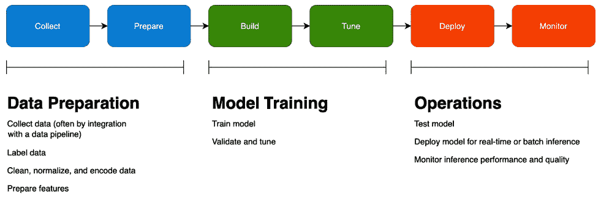

图 1.1 – 机器学习生命周期

如您所见，从高层次来看，机器学习生命周期有三个阶段：

+   在**数据准备**阶段，您收集和探索数据，标记真实数据集，并准备您的特征。特征工程反过来有几个步骤，包括数据归一化、编码和计算嵌入，具体取决于您选择的机器学习算法。

+   在**模型训练**阶段，您构建模型并调整它，直到达到与您的业务目标相符的合理验证分数。

+   在**操作**阶段，您测试您的模型在真实世界数据上的表现，部署它，并监控其表现。我们将在*第十一章*中更详细地介绍模型监控，*使用 Amazon SageMaker 模型监控和 Clarify 监控生产模型*。

此图故意简化了；在现实中，每个阶段可能有多个较小的步骤，整个生命周期是迭代的。您永远不会真正**完成**机器学习；随着您收集有关模型在生产中表现的数据，您可能会尝试通过收集更多数据、更改特征或调整模型来改进它。

那么，SageMaker 功能如何映射到机器学习生命周期？在我们回答这个问题之前，让我们看看 SageMaker 控制台（*图 1.2*）：

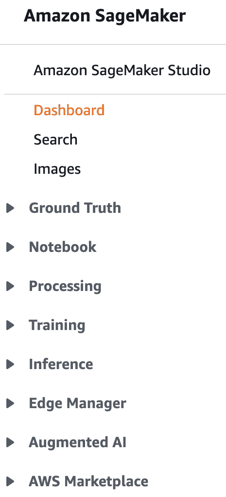

图 1.2 – SageMaker 控制台中的导航面板

控制台的外观经常变化，前面的截图显示了撰写时的当前外观。

这些功能组与机器学习生命周期相一致，如下所示：

![图 1.3 – 将 SageMaker 功能映射到机器学习生命周期]

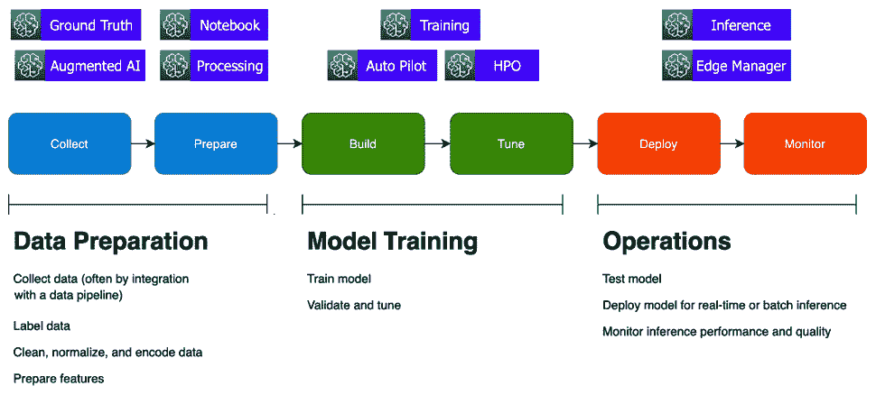

图 1.3 – 将 SageMaker 功能映射到机器学习生命周期

SageMaker Studio 在这里没有显示，因为它是一个集成的工作台，为许多 SageMaker 功能提供用户界面。市场提供可以在整个生命周期中使用的数据和算法。

现在我们已经查看过控制台，让我们更深入地了解 SageMaker 在每个生命周期阶段的个别功能。

# 数据准备功能讨论

在本节中，我们将深入了解 SageMaker 的数据准备和特征工程功能。在本节结束时，你应该了解何时使用 SageMaker Ground Truth、Data Wrangler、Processing、Feature Store 和 Clarify。

## SageMaker Ground Truth

获取用于分类、回归和其他任务的标记数据通常是机器学习项目的最大障碍，因为许多公司拥有大量数据，但尚未根据业务属性（如 *异常* 和 *高终身价值*）进行明确标记。**SageMaker Ground Truth** 通过定义标记工作流程并将标记任务分配给人工劳动力，帮助你系统地标记数据。

随着时间的推移，Ground Truth 可以学会如何自动标记数据，同时仍然将低置信度结果发送给人类进行审查。对于像 3D 点云这样的高级数据集，它们代表像形状坐标这样的数据点，Ground Truth 提供辅助标记功能，例如，一旦你标记了序列的开始和结束帧，就可以将边界框添加到中间帧。以下图表显示了应用于数据集的标签示例：

![图 1.4 – SageMaker Ground Truth 显示应用于情感评论的标签]

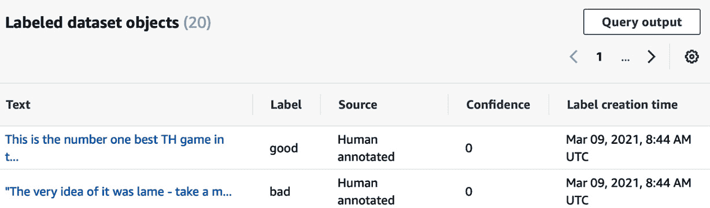

图 1.4 – SageMaker Ground Truth 显示应用于情感评论的标签

数据来源于 *UCI 机器学习仓库* ([`archive.ics.uci.edu/ml/datasets/Sentiment+Labelled+Sentences`](https://archive.ics.uci.edu/ml/datasets/Sentiment+Labelled+Sentences))。为了抵消个别工人的偏见或错误，可以将数据对象发送给多个工人。在这个例子中，我们只有一个工人，所以没有使用置信度分数。

注意，你还可以在其他机器学习生命周期阶段使用 Ground Truth；例如，你可能用它来检查生产模型生成的标签。

## SageMaker Data Wrangler

**Data Wrangler** 帮助你了解你的数据并执行特征工程。Data Wrangler 与存储在 S3 中的数据（可选通过 Athena 访问）和 Redshift 一起工作，并执行典型的可视化转换，如 *相关性图* 和 *分类编码*。你可以将一系列转换组合成数据流，并将该流导出到 MLOps 管道中。以下截图显示了数据集的 Data Wrangler 信息示例：

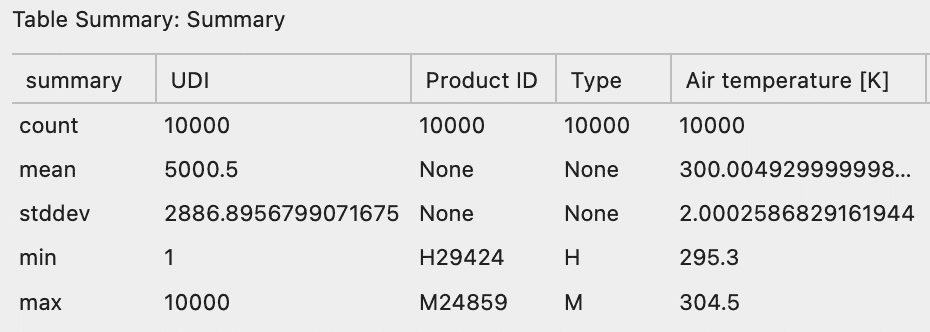

图 1.5 – Data Wrangler 显示有关数据集的摘要表信息

如果您想在 ML 生命周期的操作阶段分析用于生产推理的 ML 模型的数据，您也可以使用 Data Wrangler。

## SageMaker Processing

**SageMaker Processing** 作业帮助您在数据集上运行数据处理和特征工程任务。通过提供包含您代码的自定义 Docker 镜像，或使用预构建的 Spark 或 sklearn 容器，您可以归一化和转换数据以准备您的特征。以下图显示了 SageMaker Processing 作业的逻辑流程：

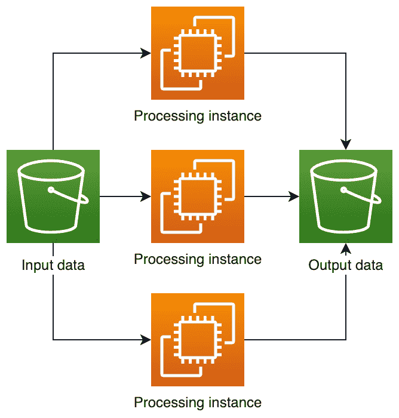

图 1.6 – Spark 处理作业的概念概述。Spark 作业特别适合处理大型数据集

您还可以在**模型训练**阶段使用处理作业来评估 ML 模型的表现，以及在**模型操作**阶段检查数据和模型质量。

## SageMaker 特征存储

**SageMaker 特征存储** 帮助您组织和共享您准备好的特征。使用特征存储通过让您重用特征而不是复制复杂的特征工程代码和已完成的计算来提高质量并节省时间。特征存储支持批量和流存储和检索。以下截图显示了特征组信息的示例：

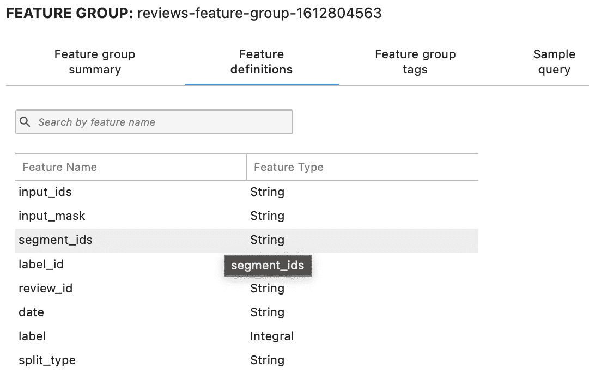

图 1.7 – 特征存储显示一组相关特征的特性组

特征存储在模型操作阶段也有帮助，因为您可以快速查找复杂的特征向量，以帮助获得实时预测。

## SageMaker Clarify

**SageMaker Clarify** 帮助您理解模型行为并从您的模型中计算偏差指标。它检查数据集中的不平衡，基于某些属性的模型给出不同的结果，以及由于数据漂移出现的不平衡。它还可以使用领先的解释性算法，如 SHAP，帮助您解释单个预测，以了解哪些特征驱动模型行为。以下图显示了数据集的类别不平衡分数示例，其中*礼品卡*类别的样本比其他类别多得多：

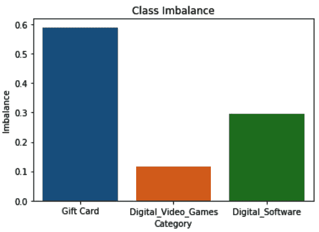

图 1.8 – Clarify 显示数据集中的类别不平衡分数。类别不平衡可能导致 ML 模型产生偏差结果

Clarify 可以在整个 ML 生命周期中使用，但考虑在生命周期的早期使用它来检测不平衡数据（具有许多一个类别的示例但另一个类别的示例很少的数据集）。

现在我们已经介绍了 SageMaker 在数据准备方面的几个功能，让我们继续介绍模型构建功能。

# 模型构建功能的特性之旅

在本节中，我们将深入了解 SageMaker 的模型构建功能。在本节结束时，您应该了解何时使用 SageMaker Studio 或 SageMaker 笔记本实例，以及如何在 SageMaker 的内置算法、框架和库与**自带**（**BYO**）方法之间进行选择。

## SageMaker Studio

**SageMaker Studio**是一个**集成开发环境**（**IDE**），用于机器学习。它将 Jupyter 笔记本、实验管理和其他工具集成到一个统一的用户界面中。您可以使用 Git 或共享文件系统轻松地与其他团队成员共享笔记本和笔记本快照。以下截图显示了 SageMaker Studio 内置可视化示例之一：

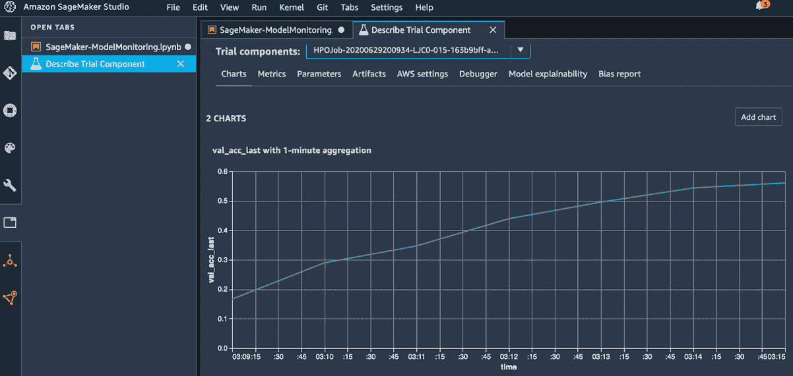

图 1.9 – SageMaker Studio 显示实验图

SageMaker Studio 可用于机器学习生命周期的所有阶段。

## SageMaker 笔记本实例

如果您更喜欢传统的 Jupyter 或 JupyterLab 体验，并且不需要 Studio 提供的额外集成和协作工具，您可以使用常规的 SageMaker 笔记本实例。您选择笔记本实例的计算能力（即您是否需要 GPU 以及您需要多少存储），SageMaker 将配置环境，安装 Jupyter Notebook、JupyterLab 以及几个常见的 ML 框架和库。

笔记本实例还支持 Docker，以便您可以在本地使用 ML 代码构建和测试容器。最好的是，笔记本实例捆绑了超过 100 个示例笔记本。以下图显示了笔记本中 JupyterLab 界面的一个示例：

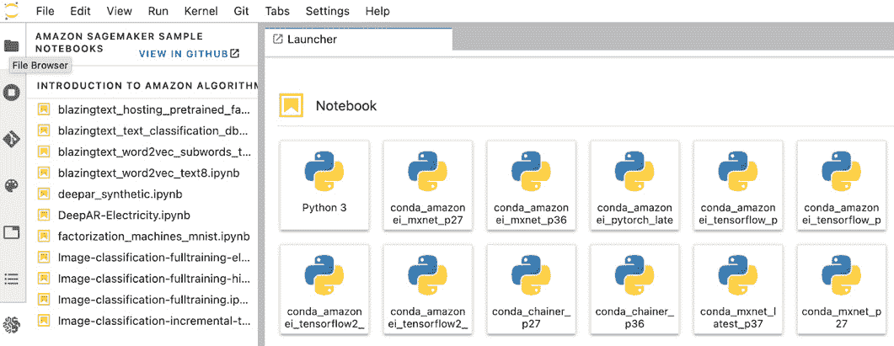

图 1.10 – SageMaker 笔记本中的 JupyterLab 界面，显示示例笔记本列表

与 SageMaker Studio 类似，您可以在笔记本实例中执行 ML 生命周期的几乎所有部分。

## SageMaker 算法

SageMaker 为许多常见的机器学习（ML）用例提供了开源和专有算法。这些算法是良好的起点，因为它们针对性能进行了调整，通常支持分布式训练。以下表格列出了 SageMaker 为不同类型的 ML 问题提供的算法：

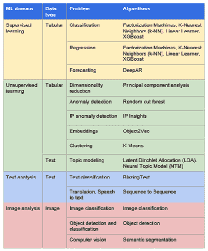

图 1.11 – 适用于各种 ML 场景的 SageMaker 算法

## 带入自己的算法和脚本

如果你更喜欢编写自己的训练和推理代码，你可以使用支持的 ML、图或 RL 框架，或者将你的代码打包到 Docker 镜像中。如果你已经有一个模型代码库，或者需要为某个预建算法效果不佳的使用案例构建模型，BYO 方法效果很好。喜欢使用 R 的数据科学家喜欢使用这种方法。SageMaker 支持以下框架：

+   支持的机器学习框架：XGBoost, sklearn

+   支持的深度学习框架：TensorFlow, PyTorch, MXNet, Chainer

+   支持的强化学习框架：Ray RLLib, Coach

+   支持的图框架：Deep Graph Library

现在我们已经介绍了 SageMaker 在模型构建方面的几个功能，让我们继续介绍训练和调优功能。

# 训练和调优功能特色之旅

在本节中，我们将深入了解 SageMaker 的模型训练功能。在本节结束时，你应该了解 SageMaker 训练作业、自动驾驶和超参数优化（HPO）、SageMaker 调试器和 SageMaker 实验的基本知识。

## SageMaker 训练作业

当你启动一个模型训练作业时，SageMaker 会为你管理一系列步骤。它会启动一个或多个训练实例，将训练数据从 S3 或其他支持的存储系统传输到实例，从 Docker 镜像仓库获取你的训练代码，并开始作业。它监控作业进度并从作业中收集模型工件和指标。以下截图显示了在训练作业中跟踪的超参数示例：

![图 1.12 – SageMaker 训练作业捕获的数据，例如输入超参数值]

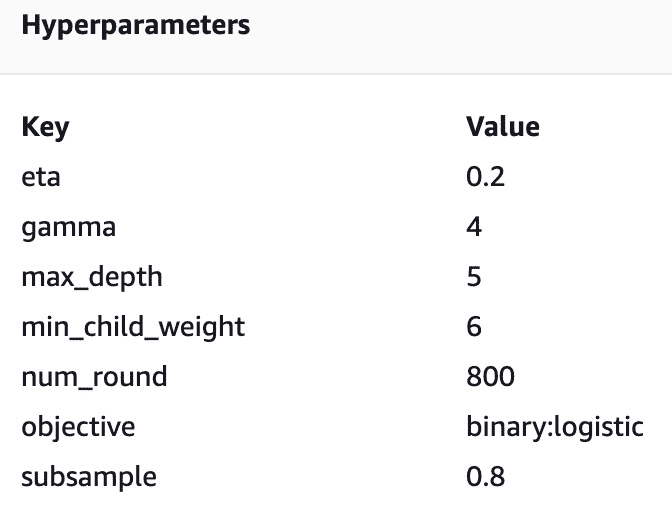

![图 1.12 – SageMaker 训练作业捕获的数据，例如输入超参数值]

对于较大的训练数据集，SageMaker 管理分布式训练。它将从存储中分发数据子集到不同的训练实例，并在训练作业期间管理节点间的通信。具体细节取决于你使用的 ML 框架，但请注意，大多数支持的框架以及 SageMaker 内置的几个算法支持分布式训练。

## 自动驾驶

如果你正在处理表格数据并解决回归或分类问题，你可能发现你正在执行很多重复性工作。你可能已经选择了 XGBoost 作为高性能算法，总是对低基数分类特征进行 one-hot 编码，对数值特征进行归一化，等等。自动驾驶为你执行了许多这些常规步骤。在以下图中，你可以看到自动驾驶作业的逻辑步骤：

![图 1.13 – 自动驾驶流程]

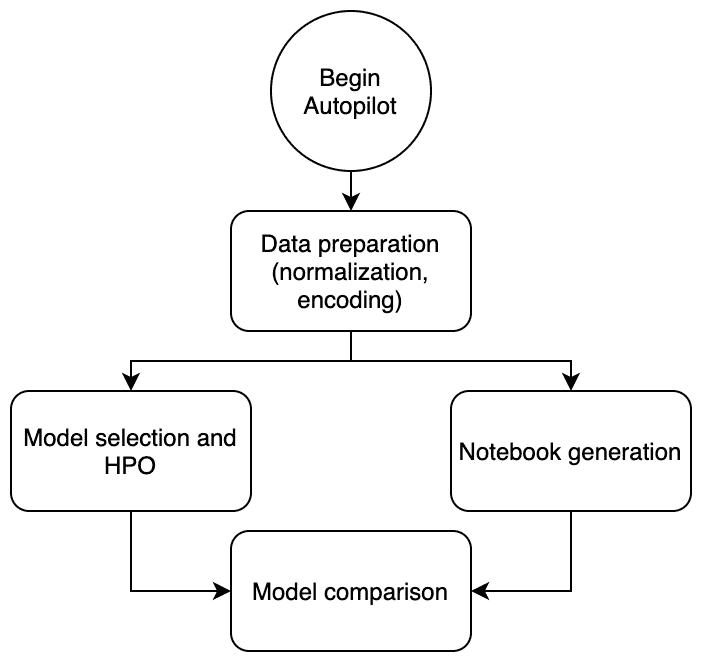

![图 1.13 – 自动驾驶流程]

自动化流程可以节省你的时间，因为它会自动执行许多常规任务。它将运行正常的特征准备任务，尝试三种支持算法（线性学习器、XGBoost 和多层感知器），并运行超参数调整。即使你需要进一步优化输出，自动化的起点也是一个很好的地方，因为它会生成包含整个过程中使用的代码的笔记本。

## HPO

一些机器学习算法接受数十个超参数作为输入。手动调整这些超参数会耗费大量时间。**超参数优化**（**HPO**）通过允许你定义你想要实验的超参数、工作范围以及你想要优化的指标来简化这个过程。以下截图显示了 HPO 作业的示例输出：

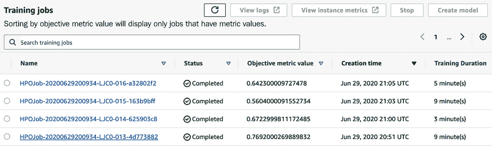

图 1.14 – 显示目标指标的超参数调整作业

## SageMaker Debugger

在你的张量中，`NaN` 非常难以追踪，尤其是在分布式训练作业中。调试器可以有效地帮助你设置断点来查看问题所在。以下图显示了 SageMaker Debugger 捕获的训练和验证损失的示例：

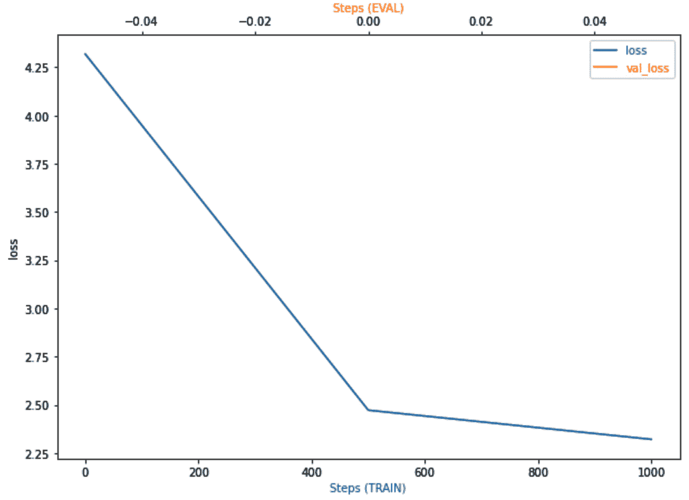

图 1.15 – SageMaker Debugger 捕获的张量可视化

## SageMaker Experiments

机器学习是一个迭代的过程。当你调整模型时，你可能需要尝试多个超参数、特征甚至算法的变体。系统地跟踪这项工作很重要，这样你就可以在以后重现你的结果。这就是 SageMaker Experiments 发挥作用的地方。它帮助你跟踪、组织和比较不同的试验。以下截图显示了 SageMaker Experiments 信息的示例：

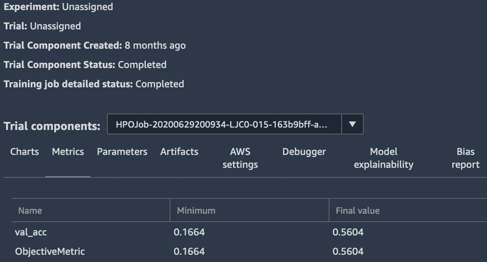

图 1.16 – SageMaker Experiments 中的试验结果

现在我们已经介绍了 SageMaker 的几个训练和调整功能，让我们继续到模型管理和部署功能。

# 模型管理和部署功能特性浏览

在本节中，我们将深入了解 SageMaker 的模型托管和监控功能。在本节结束时，你应该了解 SageMaker 模型端点的基础知识以及使用 **SageMaker Model Monitor**。你还将了解如何使用 **SageMaker Edge Manager** 在边缘设备上部署模型。

## 模型监控器

在某些组织中，机器学习团队和运维团队之间的差距会导致真正的问题。运维团队可能不了解如何监控生产中的机器学习系统，而机器学习团队并不总是拥有深厚的运维专业知识。

模型监控试图解决这个问题：它将测量模型端点并收集用于推理的机器模型的输入和输出数据。然后它可以分析这些数据以查找数据漂移和其他质量问题，以及模型精度或质量问题。以下图表显示了一个用于推理端点的模型监控数据的示例：

![图 1.17 – 模型监控检查推理输入的数据质量

![图片 B17249_01_017.jpg]

图 1.17 – 模型监控检查推理输入的数据质量

## 模型端点

在某些情况下，您可能需要一次性获取大量推理，在这种情况下，SageMaker 提供批量推理功能。但如果您需要获取更接近实时性的推理，您可以将模型托管在 SageMaker 管理的端点上。SageMaker 处理端点的部署和扩展。同样重要的是，SageMaker 允许您在单个端点上托管多个模型。这对于 **A/B 测试**（即，您可以引导一部分流量到一个较新的模型）以及托管针对不同流量段调优的多个模型都很有用。

您还可以托管一个由多个容器连接在一起推理管道，如果您需要在执行推理之前预处理输入，这将非常方便。以下截图显示了一个具有两个模型的服务不同百分比流量的模型端点：

![图 1.18 – 单个推理端点后配置的多个模型

![图片 B17249_01_018.jpg]

图 1.18 – 单个推理端点后配置的多个模型

## 边缘管理器

在某些情况下，您需要在设备上而不是从云中获取模型推理。您可能需要一个更低的响应时间，这不允许对云进行 API 调用，或者您可能存在间歇性的网络连接问题。在视频用例中，并不总是可行地将数据流式传输到云中进行推理。在这种情况下，**边缘管理器**和相关的工具，如**SageMaker Neo**，可以帮助您编译针对设备优化的模型，部署它们，管理它们，并将操作指标返回到云。以下截图显示了一个由边缘管理器管理的虚拟设备示例：

![图 1.19 – 注册到边缘管理器设备编队的设备

![图片 B17249_01_019.jpg]

图 1.19 – 注册到边缘管理器设备编队的设备

在我们总结之前，让我们回顾一下为以下主要机器学习阶段提供的 SageMaker 能力：

+   对于数据准备：

![图 1.20 – SageMaker 的数据准备能力

![图片 B17249_01_20.jpg]

图 1.20 – SageMaker 的数据准备能力

+   对于操作：

![图 1.21 – SageMaker 的操作能力

![图片 B17249_01_021.jpg]

图 1.21 – SageMaker 的操作能力

+   对于模型训练：

![图 1.22 – SageMaker 的模型训练能力

![图片 B17249_01_22.jpg]

图 1.22 – SageMaker 的模型训练能力

通过这一点，我们来到了本章的结尾。

# 摘要

在本章中，您了解了如何将 SageMaker 的功能映射到机器学习生命周期的不同阶段。您快速浏览了 SageMaker 的重要功能。在下一章中，您将学习技术要求和将在整个过程中使用的用例。您还将了解如何设置用于扩展模型构建活动的托管数据科学环境。
