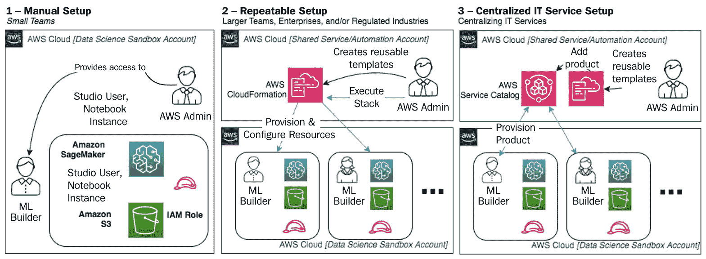
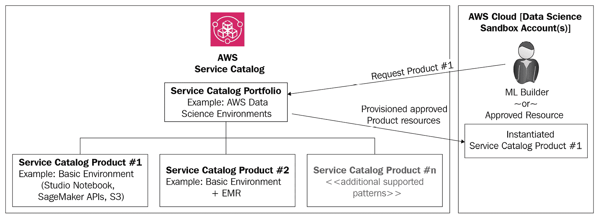
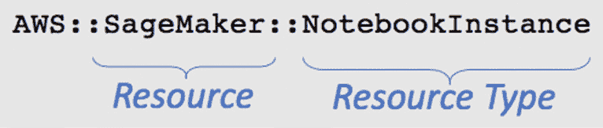
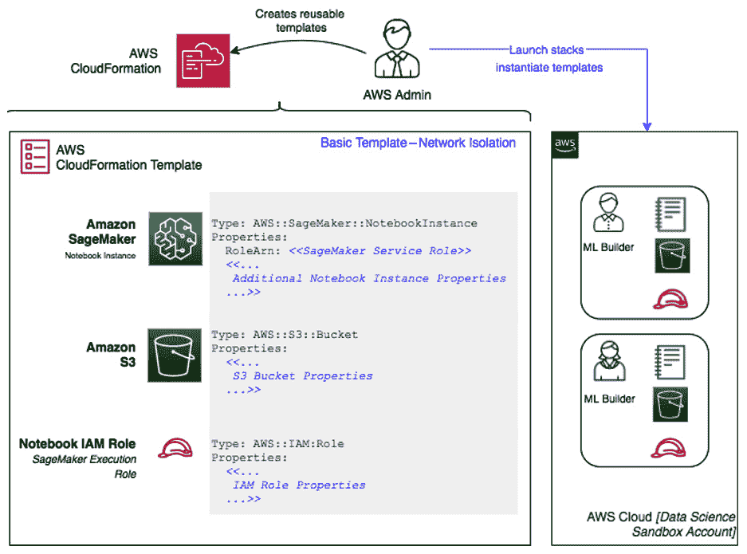
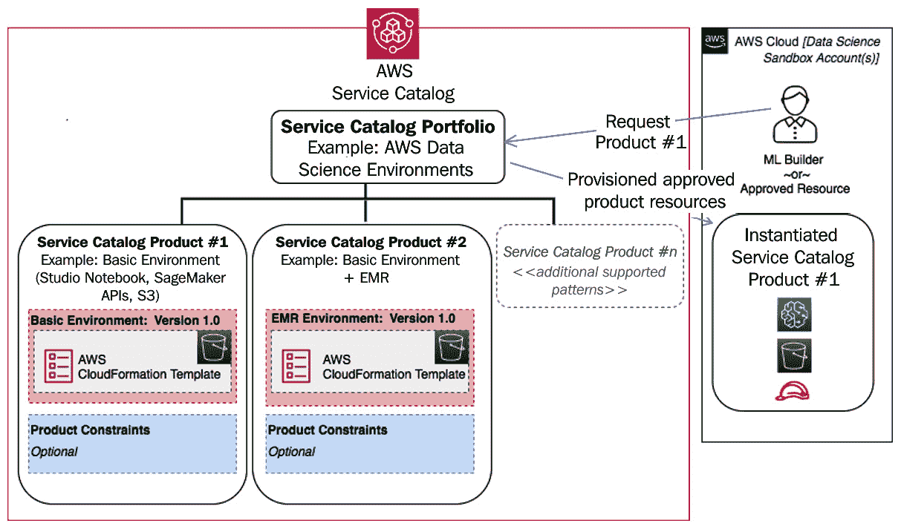
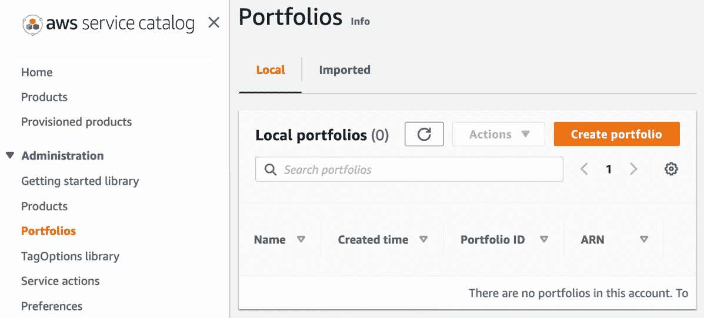
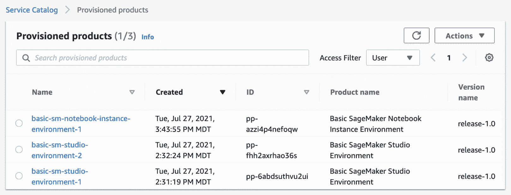
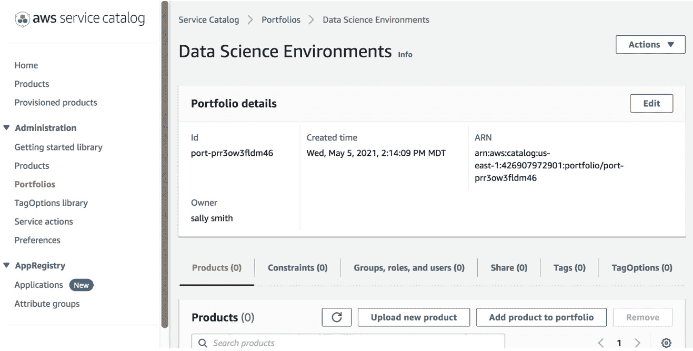
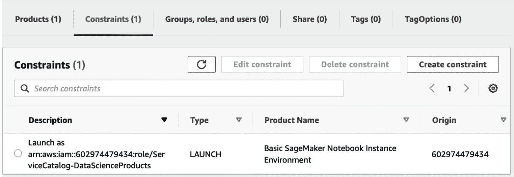
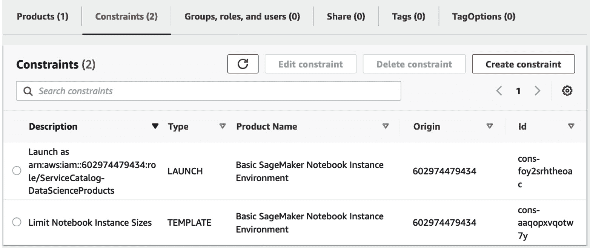

# 第二章：数据科学环境

在本章中，我们将概述如何创建可扩展和可重复的托管数据科学环境，以用于模型构建活动。在本章中，您将简要了解**机器** **学习**（**ML**）用例，包括本书各章节中将使用的数据集。

本章将涵盖以下主题：

+   机器学习用例和数据集

+   创建数据科学环境

# 技术要求

您需要 AWS 账户来运行本章中包含的示例。本书中包含的完整代码示例可在 GitHub 上找到：[`github.com/PacktPublishing/Amazon-SageMaker-Best-Practices/tree/main/Chapter02`](https://github.com/PacktPublishing/Amazon-SageMaker-Best-Practices/tree/main/Chapter02)。您需要安装 Git 客户端才能访问它们（[`git-scm.com/`](https://git-scm.com/)）。章节中包含的部分代码用于强调特定的技术概念；然而，请参阅 GitHub 存储库以获取完成本章相关动手活动所需的完整代码。

# 机器学习用例和数据集

在本书中，我们将通过示例来展示适用于整个机器学习生命周期的最佳实践。为此，我们将专注于单个机器学习用例，并使用与机器学习用例相关的公开数据集。

本书我们将探讨的主要用例是预测空气质量读数。给定一个位置（气象站）和日期，我们将尝试预测特定类型空气质量测量值（例如，pm25 或 o3）。我们将将其视为回归问题，并探索 XGBoost 和基于神经网络的模型方法。

为此，我们将使用来自 OpenAQ（[`registry.opendata.aws/openaq/`](https://registry.opendata.aws/openaq/)）的数据集，该数据集包含来自公共数据源的空气质量数据。我们将使用的数据集是`realtime`数据集（[`openaq-fetches.s3.amazonaws.com/index.html`](https://openaq-fetches.s3.amazonaws.com/index.html)）和`realtime-parquet-gzipped`数据集（[`openaq-fetches.s3.amazonaws.com/index.html`](https://openaq-fetches.s3.amazonaws.com/index.html)），其中包含多个站点的每日报告。

每日报告以 JSON 格式提供。每条记录包含以下内容：

+   时间戳（UTC 和本地时间）

+   参数 ID（pm25）

+   位置（站点 ID）

+   值（数值）

+   值的单位

+   城市

+   归因（站点网站链接）

+   平均周期（例如，1 小时）

+   坐标（纬/经）

+   国家代码

+   源名称（站点名称的简称）

+   源类型

+   移动（是/否）

现在让我们看看如何创建数据科学环境。

# 创建数据科学环境

在上一节中，我们介绍了通常可以单独使用或结合使用以实现端到端功能的 Amazon SageMaker 高级功能。在本节中，我们将专注于创建一致且可重复的受控数据科学环境，这些环境可以利用第一部分讨论的功能。

要使用 Amazon SageMaker 构建、训练和部署模型，ML 构建者需要访问跨越 ML 开发生命周期的选定的 AWS 资源。由于许多不同的人可能负责构建 ML 模型，因此术语 ML 构建者指的是任何负责模型构建的个人。这可能包括数据科学家、ML 工程师或数据分析师。

**数据科学开发**环境为 ML 构建者提供他们构建和训练模型所需的 AWS 资源。数据科学环境可能只是一个具有访问 Amazon SageMaker 以及与 Amazon SageMaker 常用的 AWS 服务（如 Amazon S3、AWS Glue 或 Amazon EMR）的 AWS 账户。虽然这对小型团队来说可能可行，但它不适合大型团队，也无法随着新项目的创建或新团队成员的加入提供可重复性。

Amazon SageMaker 提供了构建、训练和调整模型的核心选项，包括以下内容：

+   **API/SDK**：可以使用 SageMaker API 启动训练和调整作业，该 API 可以通过高级 SageMaker Python SDK、低级 AWS SDKs，如 Python 的 boto3，或 AWS CLI 访问。

+   **Amazon SageMaker Studio**：Amazon SageMaker Studio 作为集成工作台的一部分内置了笔记本，该工作台包括与其他 Amazon SageMaker 功能和功能可视化的原生集成。

+   **Amazon SageMaker 笔记本实例**：SageMaker 笔记本实例提供了一个带有附加存储的计算实例，用于托管 Jupyter Notebook 应用程序。这些笔记本预先安装了软件包、库和内核。

本节将仅关注 Amazon SageMaker Studio 和 Amazon SageMaker 笔记本实例用于设置数据科学环境。类似的方法也可以用于从 SageMaker API 或 SDK 中使用，这些 API 或 SDK 来自 SageMaker 外部的数据科学环境。我们首先将强调两种常见的使用 **基础设施即代码**（**IaC**）/**配置即代码**（**CaC**）的方法，以及构建数据科学环境的一般目录。我们将在后面的章节中更详细地介绍每个选项。

为了创建可重复的数据科学沙盒环境机制，建议使用 IaC/CaC 来定义您要为沙盒环境实施的预期配置和控制。让我们看看这两个过程指的是什么：

+   IaC 指的是使用代码而不是依赖手动设置来提供和管理基础设施的过程，这不仅速度慢，而且容易出错，并且在环境之间容易产生不一致性。

+   Cac 指的是通过代码管理资源配置的过程。因为这一切都是通过代码定义的，所以它可以像源代码一样进行管理，并在不同环境中保持一致性。

通过提供数据科学环境的服务，例如专门为在 AWS 上集中创建和管理 IT 服务目录而构建的 AWS 服务目录，可以将 IaC/CaC 的使用进一步扩展。这些服务旨在通过集中创建和管理目录来提高操作效率。

*图 2.1*展示了设置受控数据科学环境最常见的方法。本节将详细讨论这些选项。至少，建议采用自动化方法，这包括以下图中选项 2 和 3：



图 2.1 – 创建数据科学沙盒环境的方法

对于 ML 构建者来说，手动配置和提供 AWS 服务的访问权限在扩展多个 ML 构建者和管理超出小型团队的治理时会产生挑战。

随着 AWS CloudFormation 或提供 IaC/CaC 功能的等效服务的引入，数据科学环境可以重复创建，并提供以下附加功能：

+   **环境治理**：AWS CloudFormation 允许您根据哪些资源被配置以及如何配置来定义您的数据科学环境的目标状态。这允许您强制执行配置，例如成本分配标签、加密存储或控制对预批准资源（如笔记本实例计算的具体实例类型）的访问。

+   **一致性**：随着 ML 构建者团队的扩大，有必要通过减少手动努力和增加一致性来提高操作效率。IaC/CaC 允许自动配置数据科学环境，并通过代码和自动化提供一致性。

+   **改进的管理能力**：AWS CloudFormation 不仅允许您自动构建数据科学环境，还允许您快速取消部署不再使用的环境。这种能力减少了环境蔓延，并确保您不会为不再使用的资源付费。

使用 IaC/CaC 来配置和管理数据科学环境通常足以确保 ML 构建者的一致性。然而，通过 IT 服务集中目录提供这些数据科学环境，可以增加额外的操作效率，例如*减少手动审批*、*减少孤岛团队之间的交接*，以及通过确保使用仅包含批准配置的环境来跨团队提供集中治理。

AWS 服务目录允许管理员通过 AWS CloudFormation 模板集中定义和管理一组经过批准的产品或配置。为管理用于创建数据科学环境的产品的投资组合添加 AWS 服务目录，可以提供比独立的 IaC/CaC 更多的功能，包括以下内容：

+   **自助功能**：仅使用 IaC/CaC 来配置和部署 AWS 资源，在请求得到批准、跟踪并最终由 AWS 管理员配置环境的过程中，往往会造成延迟。AWS 服务目录允许机器学习构建者或经批准的指定项目资源自动请求并配置一个根据您定义的标准预先配置的数据科学环境。

+   **应用约束和访问控制**：使用 AWS 服务目录，可以集中定义并一致地在团队间应用约束和访问控制。

+   **服务管理**：虽然 AWS 服务目录使用 AWS CloudFormation，但它还包含管理这些模板或产品生命周期（跨版本）的功能。

AWS 服务目录允许机器学习构建者或经批准的资源请求并实例化一个数据科学环境，使用 AWS 服务目录投资组合中包含的经批准产品。AWS 服务目录投资组合可以存在于单独的 AWS 账户中，并在 AWS 账户间共享，以建立公司或业务单元的标准，用于管理产品的配置和部署。投资组合中的产品包含预配置的模板，使用 IaC/CaC，这些模板应用于为机器学习构建者配置或实例化数据科学环境：



图 2.2 – AWS 服务目录 – 投资组合解剖结构

在本章的其余部分，我们将讨论通过 IaC/CaC 一致性地创建数据科学环境的考虑因素，以及允许您通过受管理的 IT 服务目录为多个团队提供这些环境的先进功能。这些内容将涵盖 Amazon SageMaker 笔记本实例以及 Amazon SageMaker Studio。首先，我们将介绍如何使用 IaC/CaC 创建可重复的数据科学环境。

## 通过 IaC/CaC 实现可重复性

使用 AWS CloudFormation 部署和配置 AWS 资源以及 SageMaker 模型构建活动所需的访问权限，允许团队创建一个可重复的模式，该模式可以在团队间共享，并用于一致性地创建数据科学环境。

CloudFormation 模板允许您以编程方式描述在模板作为堆栈启动时应配置的所需 AWS 资源、配置和依赖关系。构建用于数据科学环境的 AWS CloudFormation 模板时，关键考虑因素包括应配置哪些资源、如何配置它们以及 ML 构建者需要哪些权限来进行模型构建活动。

### 需要哪些资源？

AWS CloudFormation 允许您通过模板定义 AWS 服务，使用支持的资源和资源类型自动配置。以 Amazon SageMaker 为例，它是一个受支持的资源，SageMaker 笔记本实例是一个受支持的资源类型。CloudFormation 资源类型以一致的形式表示，如图 *图 2.3* 所示，无论您是构建 JSON 还是 YAML 格式的 CloudFormation 模板：



图 2.3 – Amazon SageMaker 笔记本实例的 AWS CloudFormation 资源类型

这意味着团队可以通过 CloudFormation 模板自动配置和配置笔记本实例。然而，仅一个笔记本实例通常不足以满足数据科学环境的需求。对于基本环境，通常需要一个笔记本实例、一个 S3 存储桶以及一个 AWS IAM SageMaker 执行角色，以便在笔记本环境中执行 API 调用。

除了基本环境外，可能还需要在数据科学环境中配置其他资源。需要配置的其他资源可以分为几个关键类别：

+   `AWS::EMR::Cluster` 资源类型。

+   `AWS::CodeCommit::Repository` 资源类型。

    b. `AWS::ECR::Repository` 资源类型。

+   **身份资源**：此类别包括需要创建以使用 AWS 资源的所有其他策略或服务角色。例如，为了利用 AWS Step Functions 或数据科学 Python SDK 创建 ML 工作流程，需要创建一个服务级别的 IAM 执行角色。此角色的创建可以在您的 CloudFormation 模板中指定。该角色还应包括允许访问 AWS 服务以及将在您的 ML 工作流程中使用的操作的权限，例如 AWS Glue 用于数据准备和 Amazon SageMaker 用于训练作业。

### 应如何配置资源？

通过 CloudFormation 模板配置的资源包括一组属性，这些属性定义了资源应该如何配置。通过代码定义这些属性可以使您始终如一地配置符合预定义规范的资源。属性包括重要的配置选项，例如使用附加 VPC 的环境启动或实施加密等控制措施。CloudFormation 还允许在模板中定义 **参数**，并在启动 CloudFormation 堆栈时传递。

### 需要哪些权限？

在您确定了需要为您的数据科学环境配置的 AWS 资源和资源类型之后，您还需要确定能够访问笔记本环境和用于模型构建的底层 API 所必需的权限。

下文各节中讨论的亚马逊 SageMaker 笔记本实例与亚马逊 SageMaker Studio 之间存在一些差异；然而，在两种情况下，基本环境都需要一个 IAM SageMaker 执行角色。根据 CloudFormation 模板的意图，您需要考虑 SageMaker 执行角色将需要访问的附加允许的 AWS API 调用和操作。例如，如果您的数据科学团队使用 AWS Glue 进行数据准备活动，IAM SageMaker 执行角色需要允许访问相应的 AWS Glue API 操作。

在构建用于创建和持续执行数据科学环境中的控制的 AWS CloudFormation 模板之前，应考虑以下一些规划任务：

1.  首先，您应该确定应该一起配置的资源模式。

1.  其次，您应该确定那些资源应该如何配置。

1.  最后，您需要确定配置的资源需要具备的最小权限，以便它们能够无缝集成，以及 ML 构建者在那些配置环境中操作所需的权限。

通常，会构建几个模式，支持不同环境模式，这些模式可能适用于不同的用例或多个团队。以下各节包括针对亚马逊 SageMaker 笔记本实例和亚马逊 SageMaker Studio 的详细示例场景。对于任何一种场景，各节可以独立阅读，并且包含一些重复信息，以便它们可以独立存在。

## 亚马逊 SageMaker 笔记本实例

利用亚马逊 SageMaker 笔记本实例构建数据科学环境通常包括以下配置：

+   （笔记本实例，必需）

+   一个 S3 存储桶（可选）

+   （IAM 执行角色，如果使用现有角色则为可选）

+   任何其他由 ML 构建者团队标识为需要的资源

上文中提到的 Amazon S3 存储桶被视为可选，因为许多组织已经拥有用于数据科学模型构建活动的现有 S3 存储桶。在这些情况下，数据科学环境可能包括访问现有 S3 存储桶的权限。*图 2.2* 展示了一个基本的数据科学环境模板，该模板配置了一个 SageMaker 笔记本实例、一个 Amazon S3 存储桶，并创建了一个附加到笔记本实例的 SageMaker 执行角色。该模板可用于实例化多个环境：




图 2.4 – 基于笔记本实例的数据科学环境

以下来自 CloudFormation 模板的代码片段展示了可以用来快速部署数据科学环境的模式，这些控制项已由安全和行政团队预先批准并通过代码实现。在模板的第一个部分，我们确定了每次启动新模板时都可以配置的参数。参数允许您传递用于资源部署和配置的数据：

```py
AWSTemplateFormatVersion: '2010-09-09'
Metadata:
License: Apache-2.0
Description: 'Example data science environment creating a new SageMaker Notebook Instance using an existing VPC.  This template also includes the creation of an Amazon S3 Bucket and IAM Role.  A lifecycle policy is also included to pull the dataset that will be used in future book chapters.'
Parameters: #These are configuration parameters that are passed in as input on stack creation
  NotebookInstanceName:
            AllowedPattern: '[A-Za-z0-9-]{1,63}'
            ConstraintDescription: Maximum of 63 alphanumeric characters. Can include hyphens but not spaces.
            Description: SageMaker Notebook instance name
            MaxLength: '63'
            MinLength: '1'
            Type: String
            Default: 'myNotebook'
NotebookInstanceType:
  VPCSubnetIds:
  VPCSecurityGroupIds:
  KMSKeyId:
  NotebookVolumeSize:
```

在模板的下一部分，我们确定了需要为您的数据科学环境配置和部署的资源。每个资源的属性确定了配置和控制项。这些控制项可能包括如下配置：确保附加到笔记本实例的存储卷已加密，并且笔记本实例已配置了附带的 VPC：

```py
Resources:
  SageMakerRole:
           Type: AWS::IAM::Role
           Properties:
            AssumeRolePolicyDocument:
            Version: 2012-10-17
             Statement:
            - Effect: Allow
             Principal:
             Service:
                       - "sagemaker.amazonaws.com"
            Action:
            - "sts:AssumeRole"
           ManagedPolicyArns:
          - "arn:aws:iam::aws:policy/AmazonSageMakerFullAccess"
          - ...
  SageMakerLifecycleConfig:   
        ... 
  SageMakerNotebookInstance:
        ... 
 S3Bucket:
...
```

在此处模板片段中，我们要求输入一个预配置的 VPC 作为参数；然而，根据您的需求，您也可以在 CloudFormation 模板中包含创建新的 VPC。我们还包括笔记本实例类型和存储大小作为参数，这些参数可以在每次启动新模板时进行配置。对于不同的机器学习用例可能需要更改的配置是转换为可配置参数的良好候选，这些参数可以在启动堆栈时定义。

一旦模板上传到 Amazon S3 并验证，它就可以为每个所需的新数据科学环境重复启动。启动堆栈可以通过 AWS 控制台、AWS CLI 或 AWS SDK 完成。这通常是通过使用跨账户权限的行政账户完成的，以确保在定义和部署环境与使用部署环境的用户之间保持控制。

在 CloudFormation 堆栈完成后，机器学习构建者可以通过 AWS 控制台通过预配置的 Amazon SageMaker 笔记本实例访问他们的环境。要访问笔记本实例，ML 构建者的登录凭证必须具有发送`CreatePresignedNotebookInstanceUrl` API 请求的 IAM 权限。

## Amazon SageMaker Studio

构建利用 Amazon SageMaker Studio 的数据科学环境包括以下部署：

+   在现有 Studio 域内的新用户（必需）

+   一个 S3 存储桶（可选）

+   IAM 执行角色（如果使用现有角色则为可选）

+   任何其他由机器学习构建团队标识为所需的资源或配置

上文提到 Amazon S3 存储桶是可选的，因为许多组织已经拥有用于数据科学模型构建活动的现有 S3 存储桶。在这些情况下，数据科学环境可能包括访问现有 S3 存储桶的权限。*图 2.5*显示了基本的数据科学环境模板，该模板在 SageMaker Studio 中预置了新用户，Amazon S3 存储桶，并创建了一个附加到 Studio 域用户的 SageMaker 执行角色。该模板可用于实例化多个用户环境：

![Figure 2.5 – 基于 Amazon SageMaker Studio 的数据科学环境]

![img/B17249_02_05.jpg]

Figure 2.5 – 基于 Amazon SageMaker Studio 的数据科学环境

下面的 CloudFormation 模板显示了一个模式，可用于快速使用 Amazon SageMaker Studio 预置集成的数据科学工作台环境，为 ML 构建者提供对 Studio 笔记本以及 SageMaker Studio 内部其他集成功能的访问。同样，第一个部分包含参数，允许您定义如何预置和配置环境：

```py
AWSTemplateFormatVersion: '2010-09-09'
Metadata:
  License: Apache-2.0
Description: 'Example data science environment creating a new SageMaker Studio User in an existing Studio Domain using an existing VPC.  This template also includes the creation of an Amazon S3 Bucket and IAM Role.'
Parameters:
  StudioDomainID:
            AllowedPattern: '[A-Za-z0-9-]{1,63}'
           Description: ID of the Studio Domain where user should be created (ex. d-xxxnxxnxxnxn)
           Default: d-xxxnxxnxxnxn
           Type: String
  Team:
             AllowedValues:
            - weatherproduct
            - weatherresearch  
            Description: Team name for user working in associated environment
            Default: weatherproduct
            Type: String
  UserProfileName:
           Description: User profile name
           AllowedPattern: '^a-zA-Z0-9{0,62}'
           Type: String
            Default: 'UserName'
  VPCSecurityGroupIds:
 ... 
```

在模板的下一部分，我们确定了需要为您的数据科学环境配置和预置的资源。同样，每个资源的属性确定了预置的配置和控制，如下所示：

```py
Resources:
  StudioUser:
            Type: AWS::SageMaker::UserProfile
            Properties:
           DomainId: !Ref StudioDomainID
            Tags:
            - Key: "Environment"
             Value: "Development"
            - Key: "Team"
            Value: !Ref Team
            UserProfileName: !Ref UserProfileName
           UserSettings:
            ExecutionRole: !GetAtt SageMakerRole.Arn
           SecurityGroups: !Ref VPCSecurityGroupIds

  SageMakerRole:
          ... 
  S3Bucket:
      ... 
```

在 CloudFormation 模板中，我们正在向现有的 Studio 域添加新用户。一个`AWS:SageMaker:Domain`资源类型。创建 Studio 域是每个 AWS 账户和 AWS 区域的唯一活动，因此这被认为是创建 Studio 域内用户的前提条件。此外，一些受监管的工作负载强制执行每个 ML 构建者的账户级隔离，因此在这些情况下，您的 CloudFormation 模板可能包括 Studio 域的设置。然而，最常见的情况是每个 Studio 域有多个用户。

一旦构建并验证了模板，在将模板上传到 Amazon S3 并通过 AWS 控制台、AWS CLI 或 AWS SDK 启动堆栈后，它就准备好部署了。同样，这通常是通过使用跨账户权限从管理账户完成的，以确保在定义和预置环境的角色与使用预置环境的用户之间保持控制。

在 CloudFormation 堆栈完成后，ML 构建者可以通过 Studio IDE 使用 AWS IAM 登录凭据或通过 AWS SSO 凭据和生成的 Studio URL 访问 Studio 环境并创建笔记本。

## 提供和创建数据科学环境作为 IT 服务

创建一个包含数据科学环境的受管目录，是利用 IaC/CaC 的可重复性概念的一种方式，通过添加跨团队的中央受批准 IT 服务目录。这对于依赖中央 IT 或基础设施团队来提供 AWS 资源的大型公司或企业特别有用。使用 AWS 服务目录创建中央目录可以带来确保符合公司标准的额外好处，加速机器学习构建者快速访问数据科学环境的能力，管理目录中提供的产品版本，以及与第三方 **IT 服务** **管理**（**ITSM**）软件集成以进行变更控制。

对于使用 Amazon SageMaker 进行模型构建，AWS 服务目录允许团队将上一节中讨论的 AWS CloudFormation 模板作为版本化的产品在中央产品组合中提供。这些产品的批准配置可以集中管理和治理。AWS 服务目录允许团队控制有权启动产品的用户，这意味着管理员还可以为机器学习构建者提供自助服务功能，以确保他们能够快速访问受管的数据科学环境：



图 2.6 – 使用 AWS 服务目录集中管理的数据科学环境

当产品被添加到组合中时，你可以选择性地添加产品约束。**产品约束**允许你添加关于机器学习构建者如何使用产品的控制。允许几种约束类型，包括启动、通知、模板、堆栈集和标签更新约束。这些约束类型可以应用于任何产品；然而，对于数据科学环境，启动和模板约束有独特的考虑因素。

启动约束允许你指定 AWS 服务目录为组合中的产品提供 AWS 资源时假设的 IAM 角色。这遵循了通过提供构建者对已配置资源的访问权限，但不允许构建者访问 AWS 服务目录之外的资源来授予最小权限的推荐做法。

对于数据科学环境，可以使用预先定义的 IAM 角色添加启动约束到组合中的产品，该角色用于提供资源。这意味着你不需要直接授予构建者创建新的 IAM 角色或与 AWS CloudFormation 一起工作的权限。

模板约束是一个 JSON 格式的文本文件，它定义了描述何时可以使用模板以及可以为 AWS CloudFormation 模板中定义的参数指定哪些值的规则。每个规则有两个属性：*规则条件*（可选）和*断言*（必需）。

规则条件确定规则何时生效，断言描述用户可以为特定参数指定的值。对于数据科学环境，可以通过断言使用模板约束来定义允许的配置，例如通过断言定义实例类型。您还可以向该断言添加规则条件，以限制特定环境中允许的实例。

通过创建包含为数据科学环境提供服务的管理产品的集中式投资组合，AWS 服务目录在使用 AWS CloudFormation 时提供了额外的优势。第一步是创建投资组合，可以通过 AWS CLI、AWS SDK 或 AWS 控制台完成，如下所示。

## 在 AWS 服务目录中创建投资组合

要创建投资组合，请执行以下步骤：

1.  从 AWS 服务目录服务中选择**创建投资组合**：

    图 2.7 – AWS 服务目录 – 创建新的投资组合

1.  在`数据科学环境`下输入以下内容以定义您的投资组合

1.  `为 ML 构建者提供数据科学环境配置的批准产品服务目录投资组合`

1.  **所有者**: 您的姓名

1.  点击**创建**按钮以创建投资组合。然后您将看到**成功**消息，表示投资组合可供添加产品。

随着产品添加到投资组合并配置，AWS 服务目录为管理员提供了查看所有配置的产品并执行管理任务（如识别用户资源分配）的可见性。ML 构建者也可以集中查看他们请求的所有配置的产品：



图 2.8 – 所有已配置产品的列表

SageMaker 笔记本实例和 SageMaker Studio 产品的独特方面主要在 CloudFormation 模板中处理。创建产品的总体步骤在这两种数据科学环境中是一致的。以下各节包括详细示例场景，扩展了为 Amazon SageMaker 笔记本实例和 Amazon SageMaker Studio 先前创建的 CloudFormation 模板。

## Amazon SageMaker 笔记本实例

可以使用 AWS CLI、AWS SDK 或 AWS 控制台将新产品添加到 AWS 服务目录投资组合中。当新产品添加到投资组合中时，定义该环境的 CloudFormation 模板必须上传到 S3 存储桶并提供作为输入。在此示例中，将使用先前的 CloudFormation 模板，并添加其他在输入时所需的几个参数，如下所示：

1.  从创建的投资组合内部，选择**上传新产品**：

    图 2.9 – AWS 服务目录 – 将新产品上传到投资组合

1.  在`https://…`下。

重要提示

在已启动的堆栈上使用的模板的默认位置是 `https://s3.<region>.amazonaws.com/cf-templates-<hash>-region/notebook-instance-environment.yaml`，或者您可以直接将本章提供的 CloudFormation 模板上传到您选择的 S3 存储桶。

+   `release-1.0`。

+   `初始产品发布`。

1.  **支持详情**部分包括有关支持联系人和支持信息的内容。对于每个指定的字段输入以下内容，未指定的字段留空：

1.  **电子邮件联系**：您的电子邮件地址 Your.email@mail.com。

1.  在按照前面步骤填写信息后，滚动到页面底部，选择 **Review**（审查），然后 **Create Product**（创建产品）。

1.  产品现在将在 **数据科学环境**组合的产品列表中可见。

在将产品添加到组合后，可以给产品添加约束。**约束**是可选的，但提供了额外的推荐实践执行，例如最小权限，以及执行最佳实践（如成本优化）的额外控制。为了执行最小权限，可以通过首先创建一个启动 IAM 角色，该角色将在 AWS 服务目录产品文档中提供的产品配置时假定，从而将启动约束添加到产品中：[`docs.aws.amazon.com/servicecatalog/latest/adminguide/constraints-launch.html`](https://docs.aws.amazon.com/servicecatalog/latest/adminguide/constraints-launch.html)。

在此 IAM 策略中，您需要将产品配置的所有服务添加到操作列表中。因此，在这种情况下，以下 IAM 策略可能对您的需求过于宽泛，在这种情况下，您可以将角色限制为特定操作、条件和资源，以适应您的用例：

```py
{

{
            "Version": "2012-10-17",
            "Statement": [
            {
            "Effect": "Allow",
             "Action": [
                         "s3:*"
            ],
           "Resource": "*",
            "Condition": {
                      "StringEquals": {
                     "s3:ExistingObjectTag/servicecatalog:provisioning": "true"
                     }
          }
          },
          {
          "Effect": "Allow",
           "Action": [
                        "...",
             ],
          "Resource": "*"
           }
           ]
}
```

在创建启动角色和指定权限的策略后，需要将该角色作为启动约束应用于产品，如下面的截图所示。应用启动约束的详细说明包含在现有的 AWS 产品文档中，[`docs.aws.amazon.com/servicecatalog/latest/adminguide/constraints-launch.html`](https://docs.aws.amazon.com/servicecatalog/latest/adminguide/constraints-launch.html)，在 **应用启动约束** -> **将角色分配给产品** 下。在将 IAM 角色应用于产品启动约束后，您将看到产品列表中列出的约束，如下面的截图所示：



图 2.10 – AWS 约束

启动约束告知服务目录，当最终用户启动产品时，假定 `ServiceCatalog`-`DataScienceProducts` 角色。此角色包含我们创建的、用于配置该产品的 `CloudFormation` 模板中所有资源的权限策略。

最后，我们将添加一个模板约束来限制最终用户可用的实例类型大小选项。这允许对可配置的实例类型实施成本控制。您可以选择实施多个约束，例如存储大小。模板约束的添加方式请参阅 AWS 产品文档：[`docs.aws.amazon.com/servicecatalog/latest/adminguide/catalogs_constraints_template-constraints.html`](https://docs.aws.amazon.com/servicecatalog/latest/adminguide/catalogs_constraints_template-constraints.html)。具体的模板约束 JSON 在以下代码块中列出，其中我们确定只有指定的实例类型被批准并可供使用：

```py
{
  "Rules": {
            "Rule1": {
            "Assertions": [
            {
            "Assert": {
             "Fn::Contains": [
             [
                        "ml.t2.large",
                       "ml.t2.xlarge",
                         "ml.t3.large",
                         "ml.t3.xlarge"
           ],
            {
                      "Ref": "NotebookInstanceType"
             }
           ]
          },
          "AssertDescription": "Instance type should have approved types"
             }
            ]
           }
  }
}
```

在创建上述模板约束之后，您现在将在控制台中看到针对此产品的两个约束：



图 2.11 – AWS 服务目录 – 应用约束

产品随后将在数据科学环境组合中可用，并可以由机器学习构建者进行自助配置。

## Amazon SageMaker Studio

在本节中，将使用创建 SageMaker Studio 中的数据科学环境的 CloudFormation 模板来在数据科学环境组合中创建一个新产品。再次强调，您可以使用 AWS CLI、AWS SDK 或 AWS 控制台将新产品添加到 AWS 服务目录组合中。当新产品添加到组合中时，定义该环境的 CloudFormation 模板必须上传到 S3 存储桶并提供作为输入。添加产品的步骤需要在服务目录中具有管理权限，并在**管理**视图中执行：

1.  在`数据科学环境`组合中，点击**上传新产品**。

1.  在`基本 SageMaker Studio 环境`

    注意：已启动堆栈上使用的模板的默认位置是`https://s3.<region>.amazonaws.com/cf-templates-<hash>-region/studio-environment.yaml`，或者您可以直接将本章提供的 CloudFormation 模板上传到您选择的 S3 存储桶。

    `release-1.0`。

    `初始产品发布`。

    对于**支持详情**，本节包括有关支持联系人和支持信息的内容。请输入以下内容，未指定的字段留空：

    **电子邮件联系**：您的电子邮件地址 Your.email@mail.com

1.  在按照前面步骤填写信息后，滚动到页面底部，选择**审查**，然后**创建产品**。

1.  该产品现在将在**数据科学环境**组合的产品列表中可见。

在将产品添加到组合后，可以添加约束到产品中。然后，您可以使用在笔记本实例产品步骤下执行的相同步骤添加启动约束，以强制执行最小权限，并根据您的用例添加模板约束。

在配置产品后，它们可以通过机器学习构建者进行自助配置。机器学习构建者必须在 AWS 控制台中授予对 AWS 服务目录最终用户视图的访问权限。请参阅以下文档以获取有关共享您的投资组合和授予最终用户访问权限的详细信息：[`docs.aws.amazon.com/servicecatalog/latest/adminguide/getstarted-deploy.html`](https://docs.aws.amazon.com/servicecatalog/latest/adminguide/getstarted-deploy.html)。

本节介绍了使用 IaC/CaC（AWS CloudFormation）和集中管理的 IT 服务目录（AWS 服务目录）来大规模创建数据科学环境的优势。

请前往 *参考资料* 部分，以找到阅读本节后可能有用的附加参考链接。

# 摘要

在本章中，你看到了如何将 SageMaker 功能映射到机器学习生命周期的不同阶段。你快速浏览了重要的 SageMaker 功能，并了解了如何设置自己的 SageMaker 环境。

本章进一步介绍了使用 IaC/CaC（AWS CloudFormation）以及集中管理的 IT 服务目录（AWS 服务目录）来大规模创建数据科学环境的优势。所讨论的方法提供了减少手动工作、提供一致性、加速对模型构建服务的访问以及在内置模型构建环境中实施治理控制的指导。

在下一章中，你将学习更多关于为机器学习项目标记数据的内容。

# 参考资料

在阅读本节之后，以下是一些可能对您有用的参考资料：

+   Amazon SageMaker 笔记本实例：[`docs.aws.amazon.com/sagemaker/latest/dg/nbi.html`](https://docs.aws.amazon.com/sagemaker/latest/dg/nbi.html)

+   Amazon SageMaker Studio 入门：

    [`docs.aws.amazon.com/sagemaker/latest/dg/gs-studio-onboard.html`](https://docs.aws.amazon.com/sagemaker/latest/dg/gs-studio-onboard.html)

+   Amazon SageMaker Studio：

    [`aws.amazon.com/sagemaker/studio/`](https://aws.amazon.com/sagemaker/studio/) [`docs.aws.amazon.com/sagemaker/latest/dg/notebooks.html`](https://docs.aws.amazon.com/sagemaker/latest/dg/notebooks.html)

+   笔记本比较：

    [`docs.aws.amazon.com/sagemaker/latest/dg/notebooks-comparison.html`](https://docs.aws.amazon.com/sagemaker/latest/dg/notebooks-comparison.html)

+   AWS 服务目录：

    [`aws.amazon.com/servicecatalog/`](https://aws.amazon.com/servicecatalog/)

+   AWS CloudFormation：

    [`aws.amazon.com/cloudformation/`](https://aws.amazon.com/cloudformation/)
