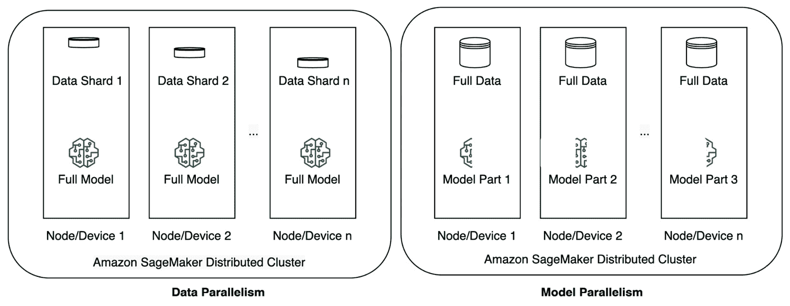
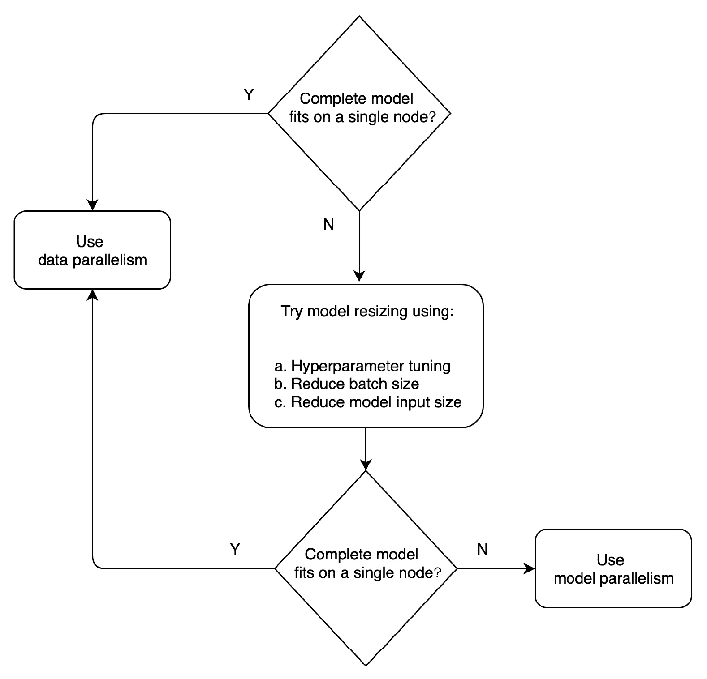
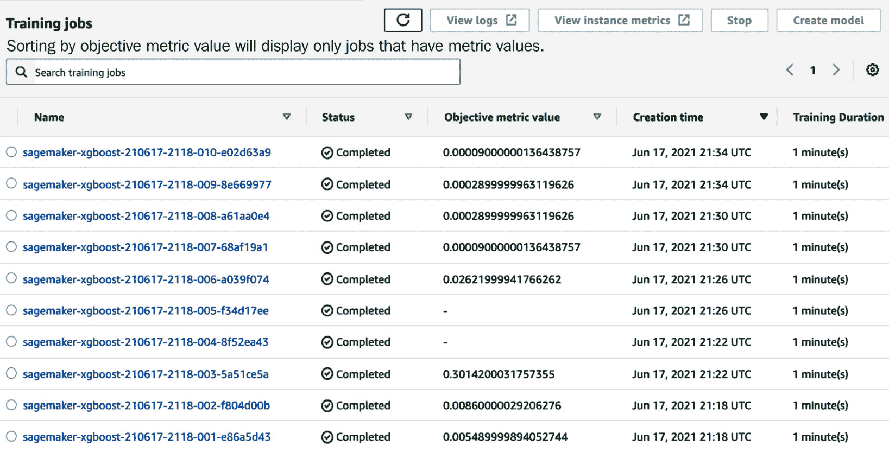
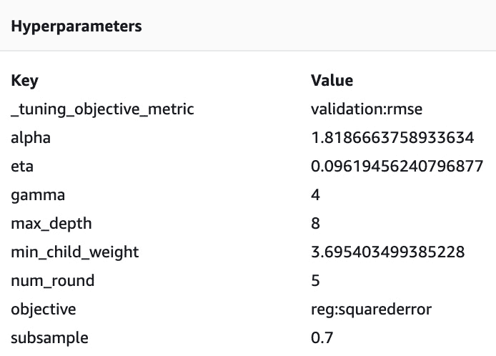
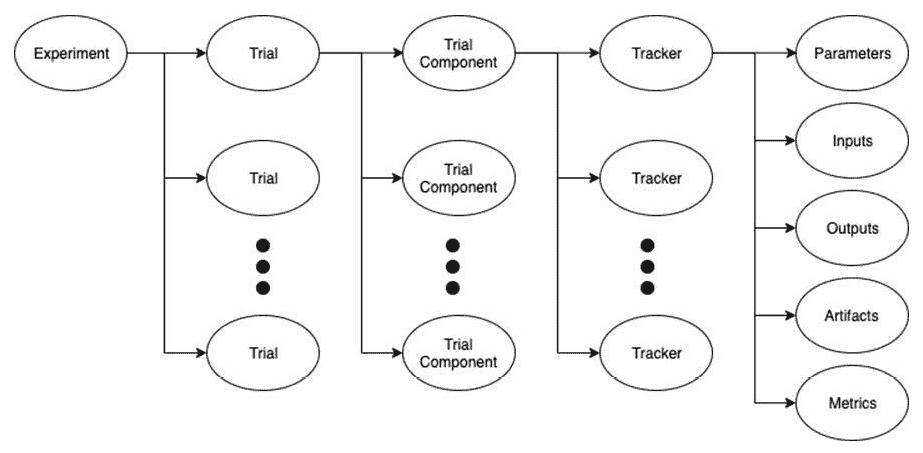
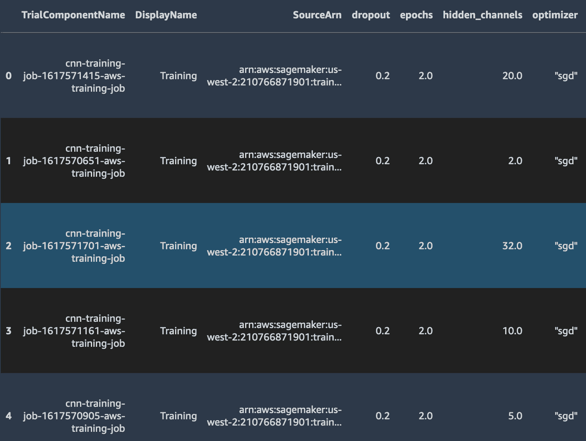

# 第六章：大规模训练和调整

**机器学习**（**ML**）实践者在进行大规模模型训练和调整时面临多重挑战。**规模挑战**以大量训练数据、增加的模型大小和模型架构复杂性为形式出现。此外，还需要运行大量调整作业以确定正确的超参数集，并跟踪针对特定机器学习目标使用不同算法进行的多个实验。规模挑战导致训练时间延长、资源受限和成本增加。这可能会降低团队的效率，并可能成为机器学习项目的瓶颈。

**Amazon SageMaker**提供了托管分布式训练和调整功能，以提高训练效率，并提供了在大规模下组织和跟踪机器学习实验的能力。SageMaker 通过使用管道模式将数据流式传输到算法中，以及通过托管 Spot Training 来降低训练成本，实现了这些技术。管道模式和托管 Spot Training 在 Julien Simon 所著的*《学习 Amazon SageMaker：开发者与数据科学家构建、训练和部署机器学习模型的指南》*中进行了详细讨论。

在本章中，我们将讨论分布式训练的高级主题、超参数调整的最佳实践以及如何在大规模下组织机器学习实验。到本章结束时，您将能够使用 Amazon SageMaker 的托管功能以经济高效的方式在大规模下进行训练和调整，并跟踪大量训练实验。

在本章中，我们将涵盖以下主要主题：

+   使用 SageMaker 分布式库进行大规模机器学习训练

+   使用 SageMaker 超参数调整进行自动化模型调整

+   使用 SageMaker Experiments 组织和跟踪训练作业

# 技术要求

您需要 AWS 账户才能运行本章包含的示例。如果您尚未设置数据科学环境，请参阅*第二章**，数据科学环境*，其中将指导您完成设置过程。

书中包含的代码示例可在 GitHub 上找到，网址为 https://github.com/PacktPublishing/Amazon-SageMaker-Best-Practices/tree/main/Chapter06。您需要安装 Git 客户端才能访问它们（[`git-scm.com/`](https://git-scm.com/)）。

# 使用 SageMaker 分布式库进行大规模机器学习训练

机器学习项目中常见的两个规模挑战是扩展训练数据和扩展模型大小。虽然增加训练数据量、模型大小和复杂性可能会使模型更准确，但单个计算节点、CPU 或 GPU 可以使用的最大数据量和模型大小是有限的。增加训练数据量和模型大小通常会导致更多的计算，因此即使使用像 `p3` 和 `p4` 这样的强大计算实例，训练作业完成的时间也会更长。

**分布式训练**是一种常用的技术，用于处理规模挑战时加速训练。训练负载可以分布在多个计算实例（节点）上，或者分布在单个计算实例上的多个 CPU 和 GPU（设备）上。分布式训练有两种策略——**数据并行**和**模型并行**。它们的名称很好地说明了每个策略所涉及的内容。在数据并行中，训练数据被分割到多个节点（或设备）上。在模型并行中，模型被分割到节点（或设备）上。

注意

**混合精度训练**是一种流行的技术，用于处理大规模训练并减少训练时间。通常用于配备 NVIDIA GPU 的计算实例，混合精度训练将网络权重从 FP32 表示转换为 FP16，计算梯度，将权重转换回 FP32，乘以学习率，并最终更新优化器权重。

在数据并行分布策略中，机器学习算法或基于神经网络的模型在所有设备上复制，每个设备处理一批数据。然后，将所有设备的结果合并。在模型并行分布策略中，模型（即神经网络）被分割到各个设备上。将训练数据批次发送到所有设备，以便模型的所有部分都能处理数据。以下图表显示了数据和模型并行的概述：



图 6.1 – 分布策略

数据并行和模型并行分布策略都伴随着自己的复杂性。在数据并行中，每个节点（或设备）在数据子集（称为小批量）上训练，并计算小梯度。然而，在节点内部，应该计算并与其他节点通信的小梯度平均值，这些梯度来自其他节点。这一步称为**all reduce**，它是随着训练集群扩展而增长的通信开销。

当模型并行处理解决模型无法适应单个设备内存的需求时，通过跨设备分割模型，将模型分割到多个 GPU 上可能会导致资源利用率不足。这是因为 GPU 上的训练本质上是顺序的，只有一个 GPU 正在积极处理数据，而其他 GPU 正在等待被激活。为了有效，模型并行处理应与管道执行调度相结合，以跨多个节点训练模型，从而最大化 GPU 利用率。现在你已经知道了两种不同的分布策略，你是如何在这两种策略之间进行选择的？

## 在数据并行处理和模型并行处理之间进行选择

在选择分布式策略实施时，请记住以下几点：

+   在多个节点上训练固有的会导致节点间通信开销。

+   此外，为了满足安全和监管要求，你可以选择通过启用容器间加密来保护节点间传输的数据。

+   启用容器间加密将进一步增加训练时间。

由于这些原因，如果训练模型可以适应单个设备或节点的内存，则使用数据并行处理。在模型由于大小或复杂性而无法适应内存的情况下，在决定模型并行处理之前，应进一步实验数据并行处理。

你可以通过以下方法来提高数据并行处理性能：

+   **调整模型的超参数**：调整诸如神经网络层数量或要使用的优化器等参数会显著影响模型的大小。

+   **减少批量大小**：通过逐步减少批量大小进行实验，直到模型适应内存。这个实验应该平衡模型的内存需求与最优批量大小。确保你不会因为使用大批量大小占用了大部分设备内存而最终得到一个次优的小批量大小。

+   **减少模型输入大小**：如果模型输入是表格形式，考虑嵌入降维的向量。同样，对于自然语言处理（NLP）模型，减少输入 NLP 序列长度，如果输入是图像，则降低图像分辨率。

+   **使用混合精度**：实验混合精度训练，在梯度计算期间使用 FP16 表示权重，以减少内存消耗。

以下流程图显示了在选择实施分布策略时应遵循的决策和实验顺序：



图 6.2 – 选择分布策略

当数据并行处理解决训练数据规模挑战时，模型并行处理则应对模型规模和复杂性的增加挑战。可以实施混合分布策略，包括数据和模型并行。*图 6.3* 将向您展示一个具有双向数据并行和四向模型并行的混合分布策略：

![Figure 6.3 – Hybrid distribution strategy

![img/B17249_06_03.jpg]

图 6.3 – 混合分布策略

## 扩展计算资源

这两种分布式训练策略都依赖于计算资源集群来分散训练负载。当扩展分布式集群以满足训练需求时，以下为推荐的最佳实践：

+   首先，进行垂直扩展。也就是说，在单个实例上从单个 GPU 扩展到多个 GPU。例如，假设您从一个具有单个 GPU 用于训练模型的 `p3.2xlarge` 实例开始，并发现自己需要更多的 GPU 来增加训练时间。将实例类型更改为具有八个 GPU 的 `p3.16xlarge`。这将导致训练时间几乎减少八倍，实现近线性的加速。将训练作业保持在单个扩展后的实例上，比使用多个实例同时保持低成本获得更好的性能。

+   接下来，从单个实例扩展到多个实例。当达到提供的实例类型极限，但仍需要进一步扩展训练时，则使用相同类型的多个实例，即从单个 `p3.16xlarge` 实例扩展到两个 `p3.16xlarge` 实例。这将使您获得双倍的计算能力，从单个实例上的 8 个 GPU 增加到两个实例上的 16 个 GPU。请注意，当您在训练集群中使用多个实例时，所有实例应位于相同的 `us-west-2` 区域，必须全部位于 `us-west-2a` 或全部位于 `us-west-2b`。您的训练数据也应位于同一区域，`us-west-2`。

当从单个实例迁移到多个实例时，建议您观察模型收敛情况，并在必要时增加批大小。由于您使用的批大小是在 GPU 之间分割的，每个 GPU 处理的批大小较低，这可能导致高错误率并破坏模型收敛。

例如，假设您从一个 `p3.2xlarge` 实例上的单个 GPU 开始，使用 64 的批大小，然后扩展到四个 `p3dn.24xlarge` 实例，这为您提供了 32 个 GPU。在此迁移之后，每个 GPU 只处理 2 个批次的任务，这很可能破坏您在原始训练中观察到的模型收敛。

## SageMaker 分布式库

为了在训练作业中轻松实现数据和模型并行，SageMaker 提供了两个不同的分布式训练库。这些库通过软件和硬件技术的组合解决了节点间和 GPU 间通信开销的问题。为了实现分布式库并利用数据和模型并行，您需要修改训练脚本中的少量代码。

重要提示

在本书出版时，SageMaker 分布式库支持两个框架——**TensorFlow**和**PyTorch**。

虽然在本章中我们专注于 SageMaker 原生的分布式训练库，您也可以选择使用最受欢迎的开源分布式训练框架**Horovod**，或者使用 TensorFlow 和 PyTorch 等框架的本地分布式训练策略。请参阅参考文献部分的博客链接，了解如何在 SageMaker 上使用 Horovod 与 TensorFlow 的详细信息。

### SageMaker 分布式数据并行库

让我们先深入了解 SageMaker 分布式数据并行库。

SageMaker 分布式数据并行库提供了在深度学习模型上实现接近线性扩展效率和快速训练时间的能力。该库通过两种方法解决了分布式集群中通信开销的挑战：

+   它自动执行负责开销的`AllReduce`操作。

+   它通过利用 AWS 的网络基础设施和 Amazon EC2 实例拓扑结构来优化节点间的通信。

SageMaker 数据并行可以在单节点多设备设置和多节点设置中使用。然而，它在训练包含两个或更多节点的集群时价值更为明显。在这个多节点集群中，作为库一部分实现的`AllReduce`操作为您提供了显著的性能提升。

要使用 SageMaker 训练作业中的分布式库，首先在构建`estimator`对象时启用您想要的策略。以下代码块展示了如何使用启用数据并行策略的`PyTorch`容器创建`estimator`对象：

```py
from sagemaker.pytorch import PyTorch

pt_dist_estimator = PyTorch(
                entry_point="train_pytorch_dist.py",
               … 
              distribution={
                    "smdistributed": {"dataparallel": {"enabled": True}}
              }
)
```

此外，在这个例子中，训练脚本`train_pytorch_dist`还需要进行一些修改。接下来的几个代码块展示了需要修改的训练脚本：

1.  首先，导入并初始化 SageMaker 分布式库：

    ```py
    import smdistributed.dataparallel.torch.distributed as dist
    from smdistributed.dataparallel.torch.parallel.distributed import DistributedDataParallel as DDP
    dist.init_process_group()
    ```

1.  接着，使用`local_rank`将每个 GPU 固定到单个 SageMaker 数据并行库进程，`local_rank`是在给定节点内进程的相对排名：

    ```py
    torch.cuda.set_device(dist_get_local_rank())
    ```

1.  接着，调整每个工作器处理的批大小：

    ```py
    batch_size //= dist.get_world_size()
    batch_size = max(batch_size, 1)
    ```

1.  接着，使用分布式库中的`DDP`类包装训练好的模型工件：

    ```py
    model = DDP(model)
    ```

1.  最后，一旦所有修改都到位，只需在估计器上调用`fit()`方法即可启动训练，使用训练脚本：

    ```py
    pt_dist_estimator.fit()
    ```

为了观察分布式训练的好处，我们在同一数据集上运行了两个不同的训练任务。这两个任务都在单个`ml.p3.16xlarge`上运行，第一个任务没有启用分布式训练，第二个任务启用了`smdistributed dataparallel`。在这个实验中，第一个任务耗时 12041 秒完成，第二个任务耗时 4179 秒完成，从而在训练时间上提高了 65.29%。

注意

在 GitHub 仓库中的笔记本中记录了启用和未启用`smdistributed dataparallel`的两种训练任务的比较：[`gitlab.com/randydefauw/packt_book/-/blob/main/CH05/train-distributed.ipynb`](https://gitlab.com/randydefauw/packt_book/-/blob/main/CH05/train-distributed.ipynb)。

### SageMaker 分布式模型并行库

接下来，让我们看看 SageMaker 分布式模型并行库。这个库提供了训练大型、复杂的深度学习模型的能力，这可能会提高预测精度。该库自动且高效地将模型分割到多个 GPU 上，提供了手动和自动分区选项。它进一步通过构建高效的计算调度来协调训练，使得不同的节点可以同时为不同的数据样本执行前向和反向传递。

下面的代码块展示了使用启用模型并行的`PyTorch`容器创建一个`estimator`对象：

```py
mpi_options = {
    "enabled": True,
   "processes_per_host": 4
  }

dist_options = {
    "modelparallel":{
       "enabled": True,
       "parameters": {
           "partitions": 4,  # we'll partition the model among the 4 GPUs 
           "microbatches": 8,  # Mini-batchs are split in micro-batch to increase parallelism
           "optimize": "memory" # The automatic model partitioning can optimize speed or memory
           }
       }
}
pt_model_dist_estimator = PyTorch(
    entry_point="train_pytorch_model_dist.py",
    ...
    distribution={"mpi": mpi_options, "smdistributed": dist_options}
)
```

与数据并行策略一样，训练脚本需要进行一些代码更改。重要的更改将在接下来的几个代码块中讨论：

1.  首先，导入并初始化 SageMaker 分布式库：

    ```py
    import smdistributed.modelparallel.torch as smp
    smp.init()
    ```

1.  接下来，将模型工件包装在分布式库中的`DistributedModel`类中，并将优化器包装在`DistributedOptimizer`类中：

    ```py
    model = smp.DistributedModel(model)
    optimizer = smp.DistributedOptimizer(optimizer)
    ```

1.  接下来，将前向和反向逻辑添加到一个函数中，并用`smp.step`进行装饰：

    ```py
    @smp.step
    def train_step(model, data, target):
        output = model(data)
        long_target = target.long()
        loss = F.nll_loss(output, long_target, reduction="mean")
        model.backward(loss)
        return output, loss
    ```

1.  最后，在`estimator`对象上调用`fit()`方法以启动训练：

    ```py
    pt_dist_estimator.fit()
    ```

    重要提示

    在 GitHub 仓库中提供了一个示例笔记本，它详细介绍了如何使用`ModelParallel`分布策略与 PyTorch 容器一起使用：[`gitlab.com/randydefauw/packt_book/-/blob/main/CH06/train.ipynb`](https://gitlab.com/randydefauw/packt_book/-/blob/main/CH06/train.ipynb)。

虽然 SageMaker 分布式模型并行库使得实现模型并行分布式训练变得容易，但要获得最佳的训练结果，请考虑以下最佳实践：

+   **使用手动分区与自动分区**：你可以使用手动或自动分区将模型分区到多个节点（或设备）。虽然两种方法都受支持，但你应该选择自动分区而不是手动方法。使用自动分区时，训练操作和共享相同参数的模块将自动放置在相同的设备上以确保正确性。使用手动方法时，你必须注意如何分割模型部分以及哪个部分应该放置在哪个设备上。这是一个耗时且容易出错的过程。

+   **选择批次大小**：模型并行库在大型批次大小下效率最高。如果你开始时使用较小的批次大小以将模型放入单个节点，然后决定在多个节点上实现模型并行，你应该相应地增加批次大小。模型并行可以节省大型模型的内存，允许使用大型批次大小进行训练。

+   **选择微批次的数量和大小**：模型并行库在每个节点或设备上顺序执行每个微批次。因此，微批次的大小应该足够大，以便充分利用每个 GPU。同时，随着微批次数量的增加，管道效率也会提高，因此平衡两者很重要。

最佳实践是从两个或四个微批次开始，并根据节点/设备的可用内存增加批次大小。然后尝试更大的批次大小，并增加微批次数量。随着微批次数量的增加，如果使用交错管道，更大的批次大小可能变得可行。

### 逐步训练

当在训练模型之前就已经有大量数据可用时，应该使用分布式训练策略。但是，当模型部署后，你收集了可能改进模型预测的新数据时会发生什么？在这种情况下，你可以从现有模型的工件开始，使用扩展的数据集逐步训练一个新的模型。

逐步训练可以在以下情况下节省训练时间、资源和成本：

+   一个现有模型表现不佳，并且有新的数据可用，这些数据有可能提高模型性能。

+   你希望将公开可用的模型作为你模型的起点，而无需从头开始训练。

+   你希望训练多个版本的模型，这些模型要么具有不同的超参数，要么使用不同的数据集。

+   你希望重新启动之前停止的训练作业，而无需再次从头开始。

此外，为了补充或替代加载现有模型权重和逐步训练，你可以在最近的数据上滑动窗口重新训练。

在本节中，您学习了如何使用 SageMaker 功能进行大量数据和复杂模型架构的训练。除了训练数据和模型架构之外，ML 训练的一个关键部分是调整 ML 算法的超参数。在下一节中，您将学习使用 SageMaker 进行大规模模型调优的最佳实践。

# 使用 SageMaker 超参数调优进行自动化模型调优

**超参数调优**（**HPT**）帮助您找到与您的 ML 算法或神经网络一起使用的正确参数，以找到模型的最佳版本。Amazon SageMaker 支持托管超参数调优，也称为 **自动模型调优**。在本节中，我们将讨论在 Amazon SageMaker 上配置超参数作业时应考虑的最佳实践。

要执行 SageMaker 超参数调优作业，您需要指定一组超参数、每个超参数要探索的值范围以及用于衡量模型性能的目标指标。自动调优会在您的训练数据集上执行多个训练作业，使用 ML 算法和超参数值，以目标指标衡量找到最佳性能的模型。

在下面的代码块中，我们将看到如何在 SageMaker 上创建一个 HPT 作业：

1.  首先，初始化您想要探索的每个超参数的名称和值范围：

    ```py
    from sagemaker.tuner import (
     IntegerParameter,
     CategoricalParameter,
     ContinuousParameter,
     HyperparameterTuner, 
    ) 
    hyperparameter_ranges = { 
     "eta": ContinuousParameter(0, 1),
     "min_child_weight": ContinuousParameter(1, 10),
     "alpha": ContinuousParameter(0, 2), 
     "max_depth": IntegerParameter(1, 10)
    }
    ```

1.  接下来，配置 SageMaker `estimator` 对象：

    ```py
    estimator_hpo = \ sagemaker.estimator.Estimator( 
    image_uri=xgboost_container, 
    hyperparameters=hyperparameters, 
    role=sagemaker.get_execution_role(), 
    instance_count=1, 
    instance_type='ml.m5.12xlarge', 
    volume_size=200, # 5 GB 
    output_path=output_path 
    ) 
    ```

1.  接下来，配置 `HyperparameterTuner` 对象：

    ```py
    tuner = HyperparameterTuner(
                 estimator_hpo, 
         objective_metric_name,
         hyperparameter_ranges, 
         max_jobs=10,
         max_parallel_jobs=2,
         objective_type = 'Minimize'
    )
    ```

1.  最后，在 `tuner` 对象上调用 `fit()` 方法：

    ```py
    tuner.fit({'train': train_input, 
               'validation': validation_input})
    ```

一旦超参数作业完成，您可以在 *图 6.4* 中查看 SageMaker 执行的不同训练作业，以及每个作业的目标指标：



图 6.4 – SageMaker HPT 结果

您可以进一步深入了解每个训练作业，查看使用的超参数的确切值，如图 6.5 所示：



图 6.5 – 特定训练作业的超参数值

重要提示

在 GitHub 仓库中提供了一个示例笔记本，它提供了使用 SageMaker HPT 的完整教程，以及结果分析：[`gitlab.com/randydefauw/packt_book/-/blob/main/CH05/HPO.ipynb`](https://gitlab.com/randydefauw/packt_book/-/blob/main/CH05/HPO.ipynb)。

现在您已经了解了基础知识，让我们讨论在 Amazon SageMaker 上配置超参数作业时应考虑的一些最佳实践：

+   **选择少量超参数**：HPT 是一个计算密集型任务，其计算复杂性与您想要调整的超参数数量成正比。SageMaker 允许您为调优作业指定最多 20 个超参数进行优化，但将搜索范围限制在更小的数量可能会给您带来更好的结果。

+   **为超参数选择小范围**：同样，超参数的值范围可以显著影响超参数优化的成功。直观上，你可能想指定一个非常大的范围来探索超参数的所有可能值，但实际上，通过限制搜索到小范围的值，你会得到更好的结果。

+   `train_batch_size` 超参数，而不是以线性方式探索一个范围，你可能只想评估两个值——128 和 256。在这种情况下，你将参数视为一个分类值。相比之下，如果你想探索 `train_batch_size` 超参数的范围，从最小阈值值 128 到最大阈值值 256，你将使用 `Integer` 类型。`Integer` 类型允许对范围进行更广泛的探索。

    如果你搜索的范围跨越几个数量级，你可以通过为 `Integer` 超参数选择对数尺度来优化搜索。最后，如果所有要探索的值的范围（从最低到最高）相对较小，请选择连续参数。例如，在 `0.0001` 和 `0.0005` 的范围内以线性尺度探索 `learning_rate` 超参数。

+   **启用预热启动**：SageMaker HPT 支持预热启动，它将重用先前调优作业的结果作为起点。配置你的 HPT 作业使用预热启动以限制新调优作业中要搜索的超参数组合。这导致调优作业更快。预热启动在你想更改先前作业的 HPT 范围或添加新超参数时特别有用。

+   **启用早期停止以节省调优时间和成本**：启用早期停止后，由 HPT 作业启动的个别训练作业将在目标指标没有显著改善时提前终止。在每个训练周期后，确定所有之前训练作业到同一周期的目标指标的运行平均值，并计算运行平均值的中间值。如果当前训练作业的目标指标值比中间值差，SageMaker 将停止当前训练作业。

    提前停止作业可以减少总体计算时间，从而降低作业成本。另一个好处是，早期停止有助于防止过拟合。

+   `MaxParallelTrainingJobs` 参数。一方面，同时运行更多的 HPT 作业可以快速完成调优作业。另一方面，调优作业只能通过连续的实验轮次找到更好的超参数组合。从长远来看，一次执行一个训练作业可以获得最佳结果，同时计算时间最短。

    当 SageMaker HPO 使用默认的**贝叶斯**优化调优策略时，情况就是这样。然而，如果您对您的算法和数据集有经验，您也可以使用 SageMaker 原生支持的随机搜索策略，因为它可以实现并发，但不需要进行实验的串行轮次。

虽然在本节中我们专注于单个算法的最佳实践，但`CreateHyperParameterTuningJob` API 也可以通过提供指向不同算法的多个训练作业定义来调整多个算法。有关此 API 的详细说明，请参阅以下文章：[`docs.aws.amazon.com/sagemaker/latest/APIReference/API_CreateHyperParameterTuningJob.html`](https://docs.aws.amazon.com/sagemaker/latest/APIReference/API_CreateHyperParameterTuningJob.html)。

在下一节中，您将学习如何跟踪与解决特定问题相关的所有机器学习实验。

# 使用 SageMaker Experiments 组织和跟踪训练作业

机器学习从业者面临的一个关键挑战是跟踪在模型达到预期结果之前需要执行的众多机器学习实验。对于单个机器学习项目来说，数据科学家通常需要定期训练几个不同的模型以寻找提高准确度的方法并不罕见。HPT 向这些实验添加了更多的训练任务。通常，实验有许多细节需要跟踪，如超参数、模型架构、训练算法、自定义脚本、指标、结果工件等。

在本节中，我们将讨论**Amazon SageMaker Experiments**，它允许您在机器学习生命周期的所有阶段组织、跟踪、可视化和比较机器学习模型，包括特征工程、模型训练、模型调优和模型部署。SageMaker Experiments 的功能可以跟踪模型血缘，让您能够排查生产问题并审计您的模型以满足合规性要求。

构成 Amazon SageMaker Experiments 的基本组件包括一个实验、一个试验、一个试验组件和一个跟踪器，如图 6.6 所示：



图 6.6 – Amazon SageMaker Experiments 概览

让我们看看每个组件：

+   **实验**: 实验封装了代表您试图解决的机器学习问题的所有相关组件。每个实验是一系列试验的集合，目标是确定产生最佳模型的试验。

+   **试验**: 试验代表了解决机器学习问题的一次尝试，它在一个实验中捕捉了端到端的机器学习过程。每个试验由几个试验组件组成。

+   **试验组件**: 试验组件代表给定试验中的特定步骤。例如，数据预处理步骤可以是其中一个试验组件，而模型训练可以是另一个试验组件。

+   **Tracker**：Tracker 用于跟踪单个试验组件的元数据，包括所有参数、输入、输出、工件和指标。由于这些元数据被跟踪和持久化，你可以将最终模型工件与其来源链接起来。

在以下代码块中，我们将看到如何创建 SageMaker 实验：

1.  首先，创建一个实验：

    ```py
    weather_experiment = Experiment.create(
        experiment_name=f"weather-experiment-{int(time.time())}",  
        description="Weather Data Prediction", 
        sagemaker_boto_client=sm)
    ```

1.  接下来，创建一个`Tracker`实例以跟踪`训练`阶段：

    ```py
    with Tracker.create(display_name="Training", sagemaker_boto_client=sm) as tracker:
        # Log the location of the training dataset
        tracker.log_input(name="weather-training-dataset", 
      media_type="s3/uri", 
     value="s3://{}/{}/{}/".format(s3_bucket, s3_prefix, 'train')) 
    ```

    接下来，定义实验变量以定义你想要更改的内容，以了解你的目标是如何受到影响的。在这个例子中，我们将对`XGBoostmodel`的`max_depth`超参数的几个值进行实验。我们将创建一个试验来跟踪每个训练作业的运行。

    我们还将从之前创建的`Tracker`实例创建一个`TrialComponent`实例，并将其添加到`Trial`实例中。这将允许你捕获训练步骤的指标，如下所示：

    ```py
    for i, max_depth in enumerate([2, 5]):
        # create trial
        trial_name = f"xgboost-training-job-trial-{max_depth}-max-depth-{int(time.time())}"
        xgboost_trial = Trial.create(
            trial_name=trial_name, 
            experiment_name=weather_experiment.experiment_name,
            sagemaker_boto_client=sm,
        )
        max_depth_trial_name_map[max_depth] = trial_name

        xgboost_training_job_name = "xgboost-training-job-{}".format(int(time.time()))

    ```

1.  当使用`fit()`方法运行训练作业时，将`estimator`与实验和试验关联起来：

    ```py
    # Now associate the estimator with the Experiment and Trial
        estimator.fit(
            inputs={'training': train_input}, 
            job_name=xgboost_training_job_name,
            experiment_config={
                "TrialName": xgboost_trial.trial_name,
                "TrialComponentDisplayName": "Training",
            },
            wait=False,
        )
    ```

1.  最后，在实验完成后，让我们分析实验结果：

    ```py
    trial_component_analytics = \ ExperimentAnalytics(sagemaker_session=sagemaker_session, experiment_name=experiment_name ) 
    trial_component_analytics.dataframe()
    ```

*图 6.7* 显示了作为实验一部分创建的所有试验组件列表：



图 6.7 – 实验中的试验组件

如你所见，SageMaker 实验为你提供了一种组织你向机器学习目标努力的方法，并允许你了解这些努力的几个重要方面。我们推荐的一个最佳实践是，每次你启动训练或调优作业时，都将其包裹在一个实验中。这样，你可以在没有任何额外成本的情况下获得对训练和调优作业的可见性。

重要注意事项

GitHub 仓库中提供了一个示例笔记本，提供了使用 SageMaker Experiments 的完整教程：[`gitlab.com/randydefauw/packt_book/-/blob/main/CH05/Experiments.ipynb`](https://gitlab.com/randydefauw/packt_book/-/blob/main/CH05/Experiments.ipynb)。

# 摘要

在本章中，你学习了使用不同分布策略在规模上训练模型所需的高级技术。你进一步了解了超参数调优的最佳实践，以找到满足你目标的最佳模型版本。你学习了如何在典型的机器学习工作流程中组织和管理多个实验，并创建比较报告。

使用本章中讨论的 SageMaker 功能和最佳实践，你可以处理大规模机器学习，使你的组织摆脱实验阶段。你可以利用多年来收集的大量数据集，并朝着实现机器学习的全部好处迈进。在下一章中，你将继续通过使用**Amazon SageMaker** **调试器**来分析训练作业来增强机器学习训练。

# 参考文献

如需阅读更多参考资料，请查阅以下内容：

+   *学习 Amazon SageMaker：开发者与数据科学家构建、训练和部署机器学习模型的指南*:

    `https://www.amazon.com/Learn-Amazon-SageMaker-developers-scientists/dp/180020891X/ref=sr_1_1?dchild=1&keywords =Learn+Amazon+SageMaker+%3A+A+guide+to+building%2C+training%2C+and+deploying+machine+learning+models+for +developers+and+data+scientists&qid=1624801601&sr=8-1`

+   *在 Amazon SageMaker Pipe 模式下使用 Horovod 进行多 GPU 和分布式训练*:

    [`aws.amazon.com/blogs/machine-learning/multi-gpu-and-distributed-training-using-horovod-in-amazon-sagemaker-pipe-mode/`](https://aws.amazon.com/blogs/machine-learning/multi-gpu-and-distributed-training-using-horovod-in-amazon-sagemaker-pipe-mode/)

+   *使用 Amazon SageMaker Studio 和 Amazon Experiments SDK 简化建模*:

    https://aws.amazon.com/blogs/machine-learning/streamline-modeling-with-amazon-sagemaker-studio-and-amazon-experiments-sdk
