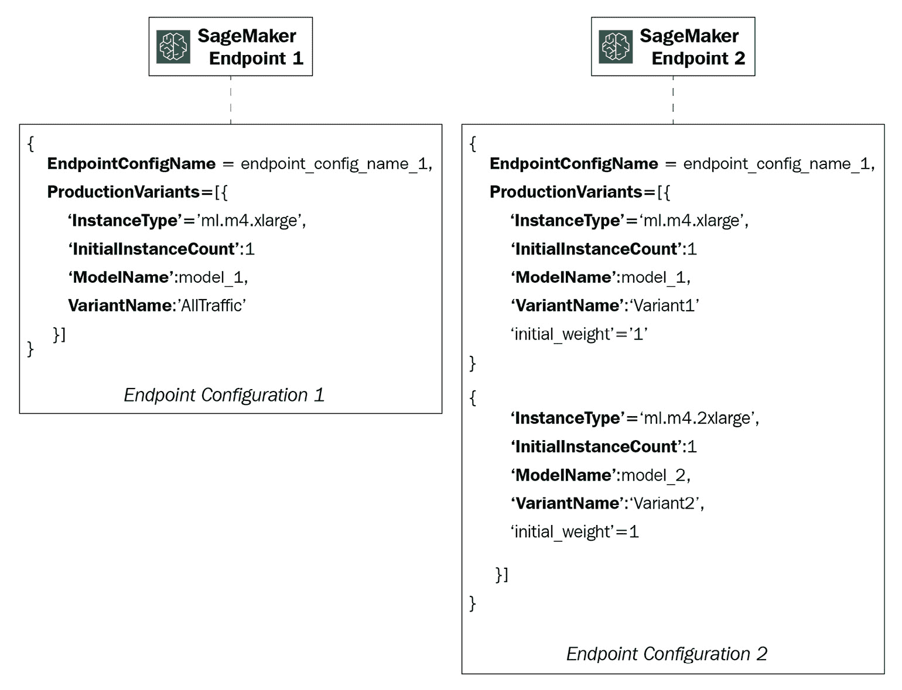
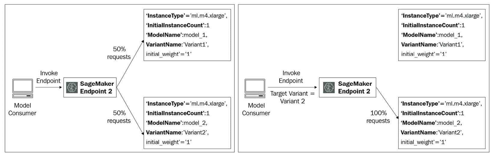
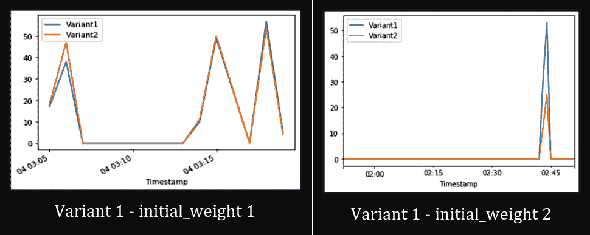
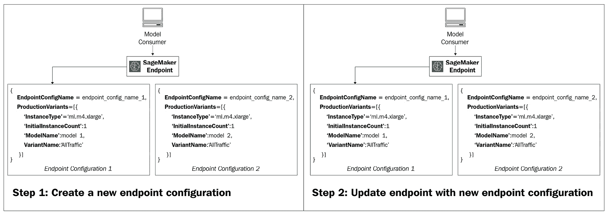
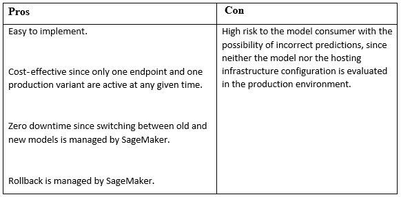
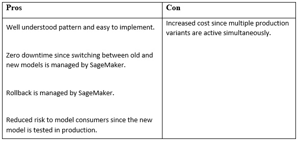
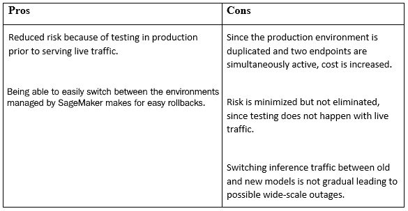
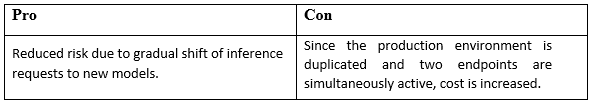

# 第九章：使用 Amazon SageMaker 端点生产变体更新生产模型

由于各种原因，需要更新已部署的生产模型，例如获取新的训练数据、尝试新的算法和超参数，或者模型预测性能随时间恶化。每次在生产中用新版本更新模型时，都存在模型在更新期间不可用以及模型质量比之前版本差的风险。即使在开发和 QA 环境中经过仔细评估后，新模型也需要额外的测试、验证和监控，以确保它们在生产中正常工作。

当将模型的新版本部署到生产环境中时，你应该仔细考虑降低部署风险并最小化模型消费者停机时间。积极规划不成功的模型更新并回滚到先前的有效模型也很重要。理想情况下，用新模型替换现有模型不应导致模型消费者服务中断。模型消费者可能是你组织内部的或外部的面向客户的程序。

本章将探讨使用**Amazon SageMaker 端点生产变体**更新生产模型，同时尽量减少对模型消费者造成干扰的挑战。你将学习如何使用 SageMaker 端点生产变体来实现标准部署和高级模型部署策略，如**A/B 测试**、**蓝/绿**、**金丝雀**和**影子**部署，这些策略在成本与模型停机时间和回滚便捷性之间取得平衡。

到本章结束时，你将能够实施多种部署策略来更新生产机器学习模型。你将学习何时以及如何使用实时生产流量来测试新的模型版本。你还将了解在选择适合你用例的正确部署策略时，如何平衡成本、可用性和降低风险的最佳实践。

在本章中，我们将涵盖以下主要主题：

+   Amazon SageMaker 端点生产变体的基本概念

+   使用 Amazon SageMaker 端点生产变体更新 ML 模型的部署策略

+   选择合适的部署策略

# 技术要求

你需要有一个**AWS**账户来运行本章包含的示例。如果你还没有设置数据科学环境，请参阅*第二章**，数据科学环境*，其中提供了设置过程的说明。

书中包含的代码示例可在 GitHub 上找到，网址为[`github.com/PacktPublishing/Amazon-SageMaker-Best-Practices/tree/main/Chapter09`](https://github.com/PacktPublishing/Amazon-SageMaker-Best-Practices/tree/main/Chapter09)。你需要安装 Git 客户端才能访问它们（[`git-scm.com/`](https://git-scm.com/))。

# Amazon SageMaker 端点生产变体的基本概念

在本节中，您将回顾使用 SageMaker 端点生产变体部署和更新机器学习模型的基本知识。您可以使用两种方式通过 SageMaker 部署机器学习模型：使用实时端点进行低延迟的实时预测或批量转换，用于对大量推理请求进行异步预测。生产变体可以应用于实时端点。

部署实时端点涉及两个步骤：

1.  **创建端点配置**

    端点配置标识一个或多个生产变体。每个生产变体指示一个模型和基础设施，用于在之上部署模型。

1.  **创建指向端点配置的端点**

    端点创建结果是一个 HTTPS 端点，模型消费者可以使用它来调用模型。

下图显示了具有生产变体的两种不同的端点配置。`model_1` 部署在 `ml.m4.xlarge` 实例上；所有推理流量都由这个单一模型提供服务。`model_1` 和 `model_2` 分别部署在 `ml.m4.xlarge` 和 `ml.m4.2xlarge` 上。由于它们具有相同的 `initial_weight` 配置，这两个模型对推理请求的处理是平等的：



图 9.1 – 具有生产变体的端点配置

当一个端点配置了多个生产变体时，您如何知道哪个模型正在处理推理请求？有两种方法可以确定这一点：

+   首先，生产变体的 `initial_weight` 参数决定了由该变体指定的模型处理的请求的相对百分比。

+   其次，推理请求可能还包括要调用的模型变体。

下图显示了调用端点的这两种方式



图 9.2 – 调用 SageMaker 端点的两种方式

由于 SageMaker 端点正在处理推理流量，因此它们使用 `EndpointName` 和 `VariantName` 维度进行监控，以监控每个不同端点的特定生产变体的指标。`Invocations` 指标捕获发送到模型的请求数量，如生产变体所示。您可以使用此指标来监控由单个端点部署的不同模型服务的请求数量。

以下图表显示了为配置了两个生产变体的端点捕获的 `Invocations` 指标比较。第一个图表显示了当初始权重设置为 `1` 和 `1` 时每个生产变体的调用次数。在这种情况下，每个变体服务的请求数量相似。第二个图表显示了具有初始权重 `2` 和 `1` 的相同指标。如您所见，变体 1 服务的请求数量是变体 2 服务请求数量的两倍：




图 9.3 – SageMaker 端点生产变体的调用次数

虽然 `Invocations` 指标直观易懂，但还有其他 CloudWatch 指标，如 `Latency` 和 `Overhead`，可用于监控、比较和对比多个端点和单个端点的多个生产变体。

注意

有关 Amazon SageMaker 的完整 CloudWatch 指标列表，请参阅 [`docs.aws.amazon.com/sagemaker/latest/dg/monitoring-cloudwatch.html#cloudwatch-metrics-endpoint-invocation`](https://docs.aws.amazon.com/sagemaker/latest/dg/monitoring-cloudwatch.html#cloudwatch-metrics-endpoint-invocation)。

与生产变体类似，SageMaker **多模型端点**（**MME**）也允许我们在单个端点上托管多个模型。如果是这种情况，生产变体与多模型端点有何不同？

在 MME 中，所有模型都托管在相同的计算基础设施上。然而，当创建端点时，并非所有模型都加载到容器内存中。相反，当进行推理请求时，模型被加载到内存中。每个推理请求必须指定要调用的模型。如果调用的模型尚未在内存中，则从 **S3 存储桶**将其加载到内存中。根据调用模式，最近未调用的模型可能不在内存中。这可能导致在处理请求时延迟增加。当您有大量不常访问且可以容忍略微增加延迟的类似 ML 模型时，单个 MME 可以以显著低廉的成本处理推理流量。

另一方面，使用生产变体时，每个模型都托管在完全不同的计算基础设施上，所有模型都随时可用，无需在需要时加载到容器内存中。每个推理请求可能或可能不指定要调用的变体。如果未指定要调用的变体，则每个变体服务的推理请求数量取决于生产变体的 `initial_weight` 参数。在模型部署的上下文中，使用生产变体来测试使用不同数据集、算法和 ML 框架训练的不同版本的 ML 模型，或者测试模型在不同实例类型上的性能。

在下一节中，您将学习如何在不同部署策略中使用 Production Variants。当我们讨论这些不同的部署策略时，我们将关注使用 Production Variants 更新作为实时 SageMaker 端点部署的现有生产模型所需的内容。

# 使用 SageMaker Endpoint Production Variants 更新 ML 模型的部署策略

在本节中，我们将深入探讨多种您可以采用的部署策略，以使用 SageMaker Endpoint Production Variants 更新生产模型。虽然一些部署策略易于实施且成本效益高，但其他策略在降低部署风险的同时增加了复杂性。我们将深入探讨五种不同的策略，包括标准、A/B、蓝绿、金丝雀和影子部署，并讨论每种方法中涉及的各个步骤。

## 标准部署

这种策略是部署和更新生产中模型的最直接方法。在标准模型部署中，始终只有一个活动的 SageMaker 端点，并且端点配置为单个生产变体，这意味着只有单个模型部署在端点后面。所有推理流量都由单个模型处理。端点配置类似于 `variant1`，在单个 `ml.m5.xlarge` 实例上托管 `model_name_1` 并处理所有推理流量，如 `initial_weight=1` 所示：

```py
### Create production variant
from sagemaker.session import production_variant
variant1 = production_variant(model_name=model_name_1,
                              instance_type="ml.m5.xlarge",
                              initial_instance_count=1,
                              variant_name='VariantA',
                              initial_weight=1)
```

下面的代码块展示了如何从生产变体创建端点。`endpoint_from_production_variants` 自动创建与 `endpoint_name` 同名的 `endpoint_configuration`：

```py
### Create the endpoint with a production variants
from sagemaker.session import Session
#Variable for endpoint name
endpoint_name=f"abtest-{datetime.now():%Y-%m-%d-%H-%M-%S}"
smsession = Session()
smsession.endpoint_from_production_variants(
            name=endpoint_name,
           production_variants=[variant1]
)
```

要使用模型的新版本更新端点，创建一个新的端点配置，指定新模型和部署模型的基础设施。然后，使用新的端点配置更新端点。以下代码块展示了更新端点以使用新模型版本的代码：

```py
#Create production variant 2
variant2 = production_variant(model_name=model_name_2,
                              instance_type="ml.m5.xlarge",
                                   initial_instance_count=1,
                                   variant_name='Variant2',
                                   initial_weight=1)

#Create a new endpoint configuration
endpoint_config_new =f"abtest-b-config-{datetime.now():%Y-%m-%d-%H-%M-%S}"

smsession.create_endpoint_config_from_existing (
            existing_config_name=endpoint_name,
            new_config_name=endpoint_config_new,
            new_production_variants=[variant2]
)
##Update the endpoint to point to the new endpoint configuration
smsession.update_endpoint(
  endpoint_name=endpoint_name, endpoint_config_name=endpoint_config_new, wait=False)
```

SageMaker 自动创建和管理新生产变体所需的基础设施，并在没有任何停机时间的情况下将流量路由到新模型。现在所有推理流量都由新模型处理。以下图表显示了更新已部署模型的步骤：



图 9.4 – 使用 SageMaker Endpoint Production Variants 的标准部署

要回滚，只需使用原始端点配置更新端点，如 *步骤 1* 所示。如您所见，推理流量始终由模型的旧版本或新版本提供。

此方法的一个好处是，它是一种简单直接地使用新模型更新端点的方法。当端点更新为新端点配置时，SageMaker 将推理请求切换到新模型，同时保持端点处于 `InService` 状态。这意味着模型消费者不会体验到任何服务中断。这也是更新实时端点的经济高效策略，因为您只为托管单个模型的设施付费。

另一方面，模型评估和测试发生在非生产环境，如 QA 或预生产环境，并使用测试数据。由于新模型在生产环境中未经测试，它将在生产环境中首次面对新基础设施上的生产数据量和实时流量。这可能导致不可预见的问题，无论是模型托管的基础设施还是模型的质量。

注意

在评估模型处于预生产环境时，建议您进行负载测试，以验证模型在迁移到生产环境之前能否以可接受的延迟处理流量。

请参阅[`aws.amazon.com/blogs/machine-learning/load-test-and-optimize-an-amazon-sagemaker-endpoint-using-automatic-scaling/`](https://aws.amazon.com/blogs/machine-learning/load-test-and-optimize-an-amazon-sagemaker-endpoint-using-automatic-scaling/)，了解如何使用自动扩展和 serverless-artillery 加载测试端点。

如果模型消费者能够容忍风险和失败，例如可以重新执行预测的内部应用程序，请使用标准部署。例如，预测员工流动性的内部模型是标准部署的良好候选者。

由于一次只能有一个模型处理推理请求，因此此策略不适用于比较不同的模型。如果您正在尝试不同的特征、多个算法或超参数，您希望能够在生产环境中比较这些模型。下一个部署策略有助于满足这一需求。

## A/B 部署

在标准部署中，您在生产环境中有一个单一的端点，没有测试或评估模型在生产环境中的范围。另一方面，A/B 部署策略专注于实验和探索，例如比较同一功能的不同版本的性能。

在此场景中，端点配置使用两个生产变体：一个用于模型 `A`，另一个用于模型 `B`。为了对两个模型进行公平的比较，两个生产变体的 `initial_weight` 应该相同，以便两个模型处理相同数量的推理流量。此外，请确保实例类型和实例数量也相同。这种初始设置是必要的，以确保模型的任何版本都不会受到流量模式或底层计算能力差异的影响。

以下代码块显示了如何创建和更新用于 A/B 部署的端点。

首先，创建`生产变体 A`：

```py
#Create production variant A
variantA = production_variant(model_name=model_name_1,
                                  instance_type="ml.m5.xlarge",
                                  initial_instance_count=1,
                                    variant_name='VariantA',
                                    initial_weight=1)
```

然后，创建一个只有一个生产变体的端点，它最初服务于生产流量：

```py
#Variable for endpoint name
endpoint_name=f"abtest-{datetime.now():%Y-%m-%d-%H-%M-%S}"
#Create an endpoint with a single production variant
smsession.endpoint_from_production_variants(
            name=endpoint_name,
            production_variants=[variantA]
)
```

当您准备好测试模型的下一个版本时，创建另一个生产变体并更新端点，使其包括两个生产变体：

```py
#Create production variant B
variantB = production_variant(model_name=model_name_2,
                                  instance_type="ml.m5.xlarge",
                                  initial_instance_count=1,
                                  variant_name='VariantB',
                                  initial_weight=1)

##Next update the endpoint to include both production variants
endpoint_config_new =f"abtest-new-config-{datetime.now():%Y-%m-%d-%H-%M-%S}"

smsession.create_endpoint_config_from_existing (
            existing_config_name=endpoint_name,
            new_config_name=endpoint_config_new,
            new_production_variants=[variantA,variantB]  ## Two production variants
)

##Update the endpoint
smsession.update_endpoint(endpoint_name=endpoint_name, endpoint_config_name=endpoint_config_new, wait=False)
```

要调用端点，请使用`invoke_endpoint()` API，如下所示。使用`invoke_endpoint()` API 的结果包括为每个特定请求服务的变体名称：

```py
result = smrt.invoke_endpoint(EndpointName=endpoint_name,
                                  ContentType="text/csv",
                                 Body=test_string)
rbody = \ StreamingBody(raw_stream=result['Body'],content_length=int(result['ResponseMetadata']['HTTPHeaders']['content-length']))
print(f"Result from {result['InvokedProductionVariant']} = {rbody.read().decode('utf-8')}")
```

端点输出的结果应类似于以下内容：

```py
Result from VariantA = 0.17167794704437256
Result from VariantB = 0.14226064085960388
Result from VariantA = 0.10094326734542847
Result from VariantA = 0.17167794704437256
Result from VariantB = 0.050961822271347046
Result from VariantB = -0.2118145227432251
Result from VariantB = 0.16735368967056274
Result from VariantA = 0.17314249277114868
Result from VariantB = 0.16769883036613464
Result from VariantA = 0.17314249277114868
```

您可以从`变体 B`收集和检查结果。您还可以进一步探索`变体 B`的 CloudWatch 指标，如*Amazon SageMaker 端点生产变体基本概念*部分所述。一旦您对`变体 B`的性能满意，逐渐将平衡转移到新模型（`40/60`，`20/80`），直到新模型处理所有实时流量。以下代码块显示了如何将 60%的实时流量路由到`变体 B`：

```py
#Update the product variant weight to route 60% of traffic to VariantB
sm.update_endpoint_weights_and_capacities(
           EndpointName=endpoint_name,
           DesiredWeightsAndCapacities=[
          {"DesiredWeight": 4, "VariantName": variantA["VariantName"]},
          {"DesiredWeight": 6, "VariantName": variantB["VariantName"]},
          ],
)
```

或者，您可以选择一次性将端点更新为将所有实时流量路由到`变体 B`，如下所示：

```py
##Update the endpoint to point to VariantB
endpoint_config_new =f"abtest-b-config-{datetime.now():%Y-%m-%d-%H-%M-%S}"

smsession.create_endpoint_config_from_existing (
            existing_config_name=endpoint_name,
            new_config_name=endpoint_config_new,
            new_production_variants=[variantB]
)
##Update the endpoint
smsession.update_endpoint(endpoint_name=endpoint_name, endpoint_config_name=endpoint_config_new, wait=False)
```

以下图表显示了更新已部署模型所涉及的步骤。要回滚，只需使用代表步骤 1 的原始端点配置更新端点：


图 9.5 – 使用 SageMaker 端点生产变体的 A/B 部署

这种策略的好处是它易于理解，SageMaker 通过管理流量路由使实施此策略变得简单。由于新模型在生产中使用了更高比例的实时流量和新的基础设施，因此模型在更新期间对模型消费者不可用或模型质量比上一个版本更差的风险降低。这解决了典型的部署问题：*模型在开发/测试环境中运行完美，所以我不知道为什么在生产中会失败*。然而，由于有两个生产变体在一段时间内处于活动状态，随着您为两套基础设施资源付费，成本也会增加。

注意

一种相对较新的 A/B 测试类型正在获得人气，称为**多臂老虎机**（**MAB**）。MAB 是一种基于机器学习的方法，它从测试期间收集的数据中学习。通过结合探索和利用，MAB 可以比传统的 A/B 测试更快地将流量动态转移到性能更好的模型变体。

请参考[`aws.amazon.com/blogs/machine-learning/power-contextual-bandits-using-continual-learning-with-amazon-sagemaker-rl/`](https://aws.amazon.com/blogs/machine-learning/power-contextual-bandits-using-continual-learning-with-amazon-sagemaker-rl/)了解如何使用 Amazon SageMaker RL 实现多臂老虎机（MAB）来向用户推荐个性化内容。

当前的 A/B 测试策略在实验和探索方面很有帮助，但当你需要发布模型的主要变更时怎么办？有没有办法进一步降低风险？蓝/绿部署可以帮助解决这个问题。

## 蓝绿部署

蓝/绿部署策略涉及两个相同的 生产环境，一个包含当前模型，另一个包含你想要更新的下一个版本的模型。当其中一个环境，比如蓝色环境，正在服务实时流量时，下一个版本的模型在绿色环境中进行测试。在生产环境中进行模型测试时，只使用测试或合成数据。新的模型版本应该针对功能、业务和流量负载要求进行测试。

一旦你对一定期限内的测试结果感到满意，就用新的（绿色）端点配置更新实时端点。使用实时推理流量再次验证测试，如果在这个测试期间发现任何问题，就将流量路由回蓝色端点配置。过了一段时间，如果新模型没有问题，就可以继续删除蓝色端点配置。

以下图表显示了更新已部署模型的步骤：

图 9.6 – 使用 SageMaker 端点生产变体的蓝/绿部署

这种方法的优点是在向实时流量提供服务之前，新模型在生产环境中进行了评估。模型本身以及托管模型的底层基础设施都得到了评估，从而降低了风险。然而，由于有两个相同的 生产环境活跃了一段时间，与之前讨论的策略相比，这种选项的成本可能会翻倍。此外，这种选项也失去了 SageMaker 管理路由逻辑的优势。

在这个策略中，虽然模型在生产环境中进行评估，但测试仍然涉及合成流量。合成数据可以模拟生产量，但反映实时数据模式并不简单。如果你想要使用实时流量测试新模型，金丝雀部署策略允许你这样做。

## 金丝雀部署

在金丝雀部署中，设置与蓝/绿部署非常相似，有两个不同的生产环境分别托管旧模型和新模型。然而，您不是使用新模型的新合成测试数据，而是使用一部分实时流量。最初，模型消费者的一小部分推理流量将由新模型提供服务。其余的推理请求继续使用之前的版本。在测试阶段，使用新模型指定的用户组应保持不变，这需要*粘性*。当您对新模型满意时，逐渐增加发送到新模型的请求数量，直到所有实时流量都由新模型提供服务。最后，可以删除旧模型。

与我们之前讨论的其他策略不同，SageMaker 没有实现两个不同环境之间的切换。为了使环境切换对模型消费者完全透明，必须在消费者和端点之间使用一个切换组件。切换组件的例子包括负载均衡器、DNS 路由器等。

以下图表显示了使用此策略更新已部署模型的步骤：

![图 9.7 – 使用 SageMaker 端点生产变体的金丝雀部署

![img/B17249_09_07.jpg]

图 9.7 – 使用 SageMaker 端点生产变体的金丝雀部署

与蓝/绿部署一样，这种方法的优点是，由于新模型在生产环境中进行测试，因此降低了模型消费者的风险。此外，模型逐渐暴露于实时流量，而不是突然切换。但此策略确实需要您管理逐渐增加新模型流量的逻辑。此外，由于两个相同的生产环境在一段时间内都是活跃的，因此此选项的成本也显著更高。

## 影子部署

在影子部署中，设置再次与金丝雀部署非常相似，即两个不同的生产环境分别托管旧模型和新模型，推理流量被发送到两者。然而，只有来自旧模型的响应被发送回模型消费者。

发送到旧模型的流量被收集并也发送到新模型，可以是立即或延迟后。在生产流量同时发送到新旧模型的情况下，新模型的输出仅被捕获和存储以供分析，不会发送给模型消费者。新模型应与实际流量进行功能、业务和流量负载测试。以下图表显示了使用此策略更新已部署模型的步骤：

![图 9.8 – 使用 SageMaker 端点生产变体的影子部署

![img/B17249_09_08.jpg]

图 9.8 – 使用 SageMaker 端点生产变体的影子部署

与金丝雀部署类似，这种方法的优点在于，随着新模型在生产环境中进行测试，模型消费者面临的所有风险都得到了降低。

注意

在以下 GitHub 仓库中提供了一个演示端到端 A/B 部署策略的示例笔记本。您可以使用它作为实施其他部署策略的起点：[`gitlab.com/randydefauw/packt_book/-/blob/main/CH09/a_b_deployment_with_production_variants.ipynb`](https://gitlab.com/randydefauw/packt_book/-/blob/main/CH09/a_b_deployment_with_production_variants.ipynb)。

现在您已经了解了可以使用多种部署策略来更新生产模型，在下一节中，我们将讨论如何选择策略以满足您的特定需求。

# 选择合适的部署策略

如您至今所见，机器模型的初始部署只是使其对消费者可用的一步。模型的新版本会定期构建。在将新模型提供给消费者之前，应仔细评估模型质量和托管模型所需的基础设施。在选择初始部署和持续更新模型的部署策略时，需要考虑多个因素。例如，由于预算和资源限制，并非所有模型都可以在生产环境中进行测试。同样，一些模型消费者可以容忍模型在一定时期内不可用。

本节将总结您可以使用来部署和更新实时 SageMaker 端点的部署策略。您将了解每种策略的优缺点，以及何时应该使用它们。

## 选择标准部署

模型消费者不是业务或收入关键，且具有风险容忍度。例如，一家公司的内部员工流失预测模型不是时间敏感的，可以在出现错误时重新执行：



图 9.9 – 标准部署的优缺点

## 选择 A/B 部署

您应该使用 A/B 部署来探索不同超参数集对模型质量、新的或不同的训练数据集切片以及不同的特征工程技术的影响：



图 9.10 – A/B 部署的优缺点

## 选择蓝绿部署

您应该使用此部署与关键任务模型消费者，如对模型停机敏感的电子商务应用程序：



图 9.11 – 蓝绿部署的优缺点

## 选择金丝雀部署

您应该使用此部署与关键任务模型消费者，如不具有风险容忍度的金融服务模型：



![图 9.12 – Canary 部署的优缺点]

## 选择影子部署

你应该使用此部署与关键任务模型消费者，如金融服务模型，这些模型不耐受风险：

![图 9.13 – 影子部署的优缺点]

![图片 B17249_09_13.jpg]

图 9.13 – 影子部署的优缺点

你应该使用前面小节中讨论的权衡来选择一个合适的模型策略，以便于实施、可接受的模型停机时间、消费者的风险承受能力和你必须考虑以满足你需求的成本。

# 摘要

在本章中，我们回顾了我们应该更新生产机器学习模型的原因。你学习了如何使用生产变体通过单个 SageMaker 端点托管多个模型。然后你了解了多种部署策略，这些策略平衡了模型更新的成本和风险与实施和回滚的简便性。你还学习了涉及的各种步骤和用于标准、A/B、蓝绿、金丝雀和影子部署的配置。

本章以对每种部署策略的优缺点和适用性的比较结束。利用这次讨论作为指导，你现在可以选择一个合适的策略来更新你的生产模型，以确保它们满足你的模型可用性和模型质量要求。

在下一章中，我们将继续讨论模型的部署，并了解优化模型托管和基础设施成本。

![图片 B17249_09_06.jpg]
