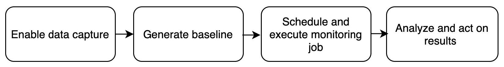
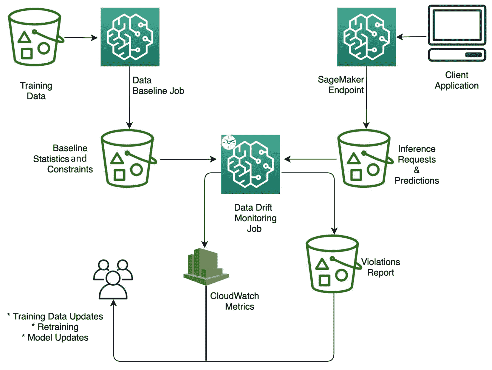
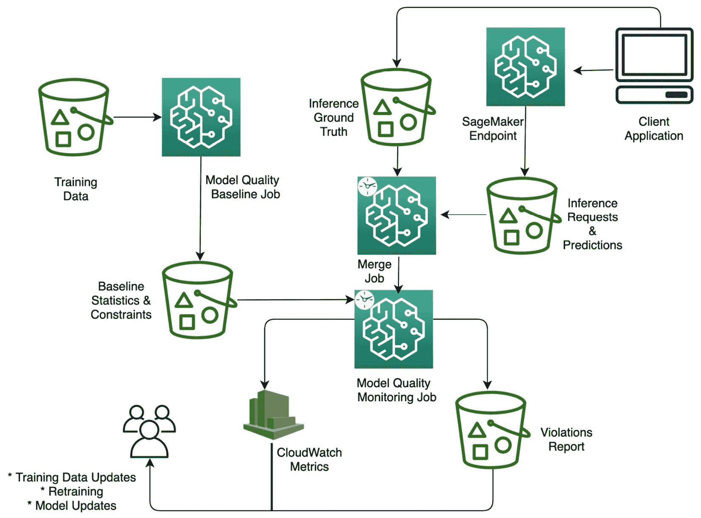
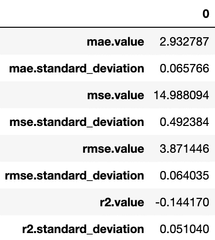
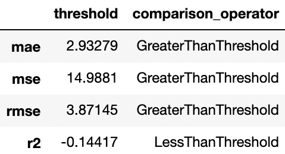

# 第十一章：使用 Amazon SageMaker Model Monitor 和 Clarify 监控生产模型

监控生产**机器学习**（**ML**）模型是确保模型持续满足业务需求的关键步骤。除了托管模型的底层基础设施外，还有其他重要的 ML 模型方面需要定期监控。随着时间的推移，模型老化，与用于训练模型的相比，实际推理数据分布可能会发生变化。例如，零售行业的消费者购买模式可能会改变，金融行业的抵押贷款利率等经济条件可能会改变。

训练数据和实时推理数据集之间的这种逐渐偏差可能会对模型预测产生重大影响。模型质量指标，如准确性，也可能随着时间的推移而下降。模型质量的下降会对业务结果产生负面影响。监管要求，如确保 ML 模型无偏见且可解释，为模型监控增添了另一个角度。对这些方面的全面监控生产模型，让您能够主动识别生产模型是否需要更新。更新生产模型需要重新训练和部署资源。更新生产模型涉及的成本应与有效服务模型消费者的机会成本进行权衡。

本章通过使用两个托管服务——**Amazon SageMaker Model Monitor**和**Amazon SageMaker Clarify**，来解决监控生产模型的挑战。这些托管服务消除了构建自定义工具以监控模型和检测何时需要采取纠正措施的需求。在本章结束时，您将能够监控生产模型的数据漂移、模型质量、模型偏差和模型可解释性。您还将进一步了解如何在监控过程中自动修复检测到的问题。

在本章中，我们将涵盖以下主要内容：

+   Amazon SageMaker Model Monitor 和 Amazon SageMaker Clarify 的基本概念

+   监控 ML 模型的全栈架构

+   监控 ML 模型的最佳实践

# 技术要求

您需要 AWS 账户才能运行本章包含的示例。如果您尚未设置数据科学环境，请参阅*第二章*，*数据科学环境*，其中将指导您完成设置过程。

书中包含的代码示例可在 GitHub 上找到，网址为[`github.com/PacktPublishing/Amazon-SageMaker-Best-Practices/tree/main/Chapter11`](https://github.com/PacktPublishing/Amazon-SageMaker-Best-Practices/tree/main/Chapter11)。您需要安装 Git 客户端才能访问它们（[`git-scm.com/`](https://git-scm.com/))。

# Amazon SageMaker Model Monitor 和 Amazon SageMaker Clarify 的基本概念

在本节中，让我们回顾两个 SageMaker 功能提供的功能：Model Monitor 和 Clarify。

Amazon SageMaker Model Monitor 提供了监控作为 SageMaker 实时端点部署的模型的数据漂移和模型质量的功能。Amazon SageMaker Clarify 提供了监控部署模型是否存在偏差和特征归因漂移的功能。通过结合这两个功能，您可以监控在 SageMaker 上部署的机器学习模型的以下四个不同方面：

+   **数据漂移**：如果部署的模型提供的实时推理流量数据在统计上与模型训练时所用的训练数据不同，模型预测的准确性将开始下降。通过结合训练数据基线和定期监控来比较传入的推理请求与基线数据，SageMaker Model Monitor 检测数据漂移。Model Monitor 进一步生成与 Amazon CloudWatch 集成的数据漂移指标。使用这些 CloudWatch 警报，您可以生成数据漂移检测警报。

+   **模型质量**：监控模型质量涉及将模型预测的标签与实际标签（也称为真实推理标签）进行比较。Model Monitor 定期将来自实时推理的数据与真实标签合并，以比较模型质量漂移与使用训练数据生成的基线。与数据漂移指标类似，模型质量指标集成到 CloudWatch 中，因此如果模型质量低于阈值，可以生成警报。

+   **偏差漂移**：在实时推理流量数据和训练数据之间存在统计上显著的漂移也可能导致模型在一段时间内出现偏差。即使检测并解决了在训练和部署模型之前训练数据中的偏差，这也可能发生。SageMaker Clarify 持续监控部署的模型是否存在偏差，并生成与 CloudWatch 指标集成的偏差指标。

+   **特征归因漂移**：除了在部署的模型中引入偏差外，实时推理数据分布的漂移也可能导致特征归因值的变化。特征归因根据使用该数据集训练的模型中各个特征的相对重要性，使用重要性分数对数据集的各个特征进行排名。特征重要性分数提供了一种通过提供对哪些特征在预测中起作用的洞察来解释模型预测的方法。SageMaker Clarify 将训练数据中的特征归因或特征排名与实时推理流量数据中的特征归因或特征排名进行比较。与其他类型的监控类似，特征归因漂移指标被生成并集成到 CloudWatch 中。

使用 SageMaker Model Monitor 或 SageMaker Clarify 监控机器学习模型涉及以下四个高级步骤，如下所示图示：



图 11.1 – 模型监控的高级步骤

让我们更详细地看看这些步骤中涉及的内容：

1.  **启用数据捕获**：第一步是在实时端点上启用数据捕获。启用数据捕获后，SageMaker 端点的输入和输出将被捕获并保存在 Amazon **简单存储服务**（**S3**）中。捕获的输入包括实时推理流量请求，捕获的输出包括部署的模型的预测。这是所有四种类型监控的共同步骤：数据漂移、模型质量、偏差漂移和特征归因漂移监控。

1.  **生成基线**：在这个步骤中，分析训练或验证数据以生成基线。生成的基线将在下一步中用于与实时推理流量进行比较。基线生成过程计算分析数据的指标，并为指标提出约束。生成的基线对于监控类型是唯一的。

1.  **安排和执行监控作业**：为了持续监控实时端点，下一步是创建一个预定义间隔执行的监控计划。一旦监控计划就绪，SageMaker Processing 作业将自动启动，以特定间隔分析从端点捕获的数据。对于监控作业的每次执行，处理作业将比较捕获的实时流量数据与基线。如果在某个时间段内捕获的实时流量数据生成的指标超出了基线建议的约束范围，将生成违规。计划中的监控作业还会为每次执行生成监控报告，这些报告保存在 S3 桶中。此外，还会生成 CloudWatch 指标，这些指标的具体指标取决于监控的类型。

1.  **分析和采取行动**：由监控作业生成的报告可以直接从 S3 下载或在 SageMaker Studio 环境中可视化。在 Studio 环境中，您还可以可视化监控作业的详细信息，并创建比较基线指标与监控作业计算的指标的图表。

为了修复发现的问题，您可以使用监控作业发出的 CloudWatch 指标。具体的指标取决于监控作业的类型。您可以根据基线作业建议的阈值值配置 CloudWatch 警报，CloudWatch 警报允许您自动响应监控作业生成的违规和指标。

现在您已经知道了可以监控 ML 模型的哪些方面，监控涉及的步骤以及如何应对发现的问题，您就可以构建一个满足您业务需求的监控解决方案。在下一节中，您将学习如何为不同类型的监控构建端到端模型监控架构。

# 监控机器学习模型的端到端架构

在本节中，您将组合监控的四个高级步骤，以构建**数据漂移**、**模型质量**、**偏差漂移**和**特征归因漂移监控**的端到端架构。除了架构之外，您还将深入了解适用于每种监控类型的各个步骤的独特方面。

对于所有四种类型的监控，第一步和最后一步——启用数据捕获和分析监控结果——保持不变。我们将详细讨论第一种监控类型——数据漂移监控的这两个步骤。对于其他三种类型的监控，我们只会简要提及。

## 数据漂移监控

您监控生产模型以检测数据漂移，以确保部署的模型所服务的实时推理流量的分布不会偏离用于训练模型的数据集的分布。以下图表显示了用于数据漂移监控的端到端架构：




让我们深入了解构成此端到端架构的四个高级步骤：

1.  **为部署的端点启用数据捕获**：第一步是部署一个启用数据捕获的 SageMaker 端点。如以下示例代码所示，配置数据捕获包括指定要捕获的推理流量的百分比和保存捕获流量的 S3 位置：

    ```py
    from sagemaker.model_monitor import DataCaptureConfig
    data_capture_config = DataCaptureConfig(
    enable_capture=True, 
    sampling_percentage=100,  destination_s3_uri=s3_capture_upload_path
    )
    ```

    部署模型时，通过以下方式创建端点，并传入数据捕获配置：

    ```py
    predictor = model.deploy(initial_instance_count=1,
                    instance_type='ml.m4.xlarge',
                    endpoint_name=endpoint_name,
                   data_capture_config = data_capture_config)
    ```

    以下代码显示了捕获的数据样本。如您所见，端点请求和响应以及事件元数据都被捕获了：

    ```py
    {
      "captureData": {
        "endpointInput": {
          "observedContentType": "text/csv",
          "mode": "INPUT",
         "data": "0,2020,12,4,31,0,19.0,0.0,6.0,0.0,0.0,0.0,0.0,0.0,0.0,1.0\n",
          "encoding": "CSV"
        },
        "endpointOutput": {
          "observedContentType": "text/csv; charset=utf-8",
          "mode": "OUTPUT",
          "data": "-4.902510643005371",
          "encoding": "CSV"
        }
      },
      "eventMetadata": {
        "eventId": "e68592ca-948c-44dd-a764-608934e49534",
        "inferenceTime": "2021-06-28T18:41:16Z"
      },
      "eventVersion": "0"
    }
    ```

1.  使用`DefaultModelMonitor`来配置执行处理作业的基础设施和最大运行时间。以下是一个示例代码：

    ```py
    from sagemaker.model_monitor import DefaultModelMonitor
    from sagemaker.model_monitor.dataset_format import DatasetFormat
    my_default_monitor = DefaultModelMonitor(
        role=role,
        instance_count=1,
        instance_type="ml.m5.xlarge",
        volume_size_in_gb=20,
        max_runtime_in_seconds=3600,
    )
    ```

    使用`DefaultModelMonitor`上的`suggest_baseline`方法来配置并启动基线作业。要配置基线作业，指定基线数据的位置以及您希望将基线结果保存到 S3 的位置，如下所示：

    ```py
    my_default_monitor.suggest_baseline(
        baseline_dataset=baseline_data_uri + "/training-dataset-with-header.csv",
        dataset_format=DatasetFormat.csv(header=True),
        output_s3_uri=baseline_results_uri,
        wait=True
    )
    ```

    基线作业会在您指定的 S3 位置生成两个文件——`statistics.json`和`constraints.json`。`statistics.json`文件包括对训练数据的元数据分析——例如数值特征的求和、平均值、最小值和最大值以及文本特征的唯一计数。

    注意

    此基线作业使用 SageMaker 提供的名为`sagemaker-model-monitor-analyzer`的容器来分析训练数据集。这个基于 Spark 的容器使用开源的`constraints.json`文件捕获用于监控目的的统计阈值。约束还包括条件，例如是否应将特定特征视为字符串而不是整数，或者是否特定字段不应为空。以下截图显示了基线作业生成的约束样本，表明`value`特征应始终被视为字符串：

    ![Figure 11.5 – 数据漂移基线作业生成的约束]

    ![img/B17249_11_05.jpg]

    图 11.5 – 数据漂移基线作业生成的约束

    生成的约束还表明了每个特征的完整性，这代表了在推理流量中可以非空值的百分比。在这个例子中，由于所有特征的完整性都是`1.0`，因此在推理流量中这些特征的任何值都不能为空。此外，根据`num_constraints.is_non_negative`的建议，没有任何整数和小数特征可以为空。

    生成的约束是基线作业在分析训练数据后提供的建议。您可以根据您对特定用例的领域知识选择覆盖约束文件。您可以在单个字段级别覆盖建议的约束，或者覆盖整个文件。在`constraints.json`文件中，您还会看到`emit_metrics : Enabled`条目。这表明在监控期间将发出 CloudWatch 指标。

1.  `完整性`和`基线漂移`。`完整性`指标表示在特定区间内给定特征可以 null 的值的百分比。`基线漂移`指标表示特征在特定区间内相对于基线的漂移程度。此外，对于数值特征，在区间内观察到的其他一些指标是`最大值`、`最小值`、`总和`、`样本计数`和`平均计数`。

    对于这些指标中的任何一个，您都可以根据约束文件中建议的阈值值配置 CloudWatch 警报。如果在给定区间内观察到的推理流量中的特征值违反了阈值值，则会触发警报。

1.  **分析和采取行动**：最后一步是对监控结果进行分析并采取行动。如前所述的高层次监控步骤讨论中提到，您可以从 S3 下载监控报告并在您的笔记本环境中分析它们，或者使用 Studio 查看监控细节。例如，将违规报告下载到笔记本环境中并查看报告内容，显示的结果类似于以下截图：

![Figure 11.7 – 数据漂移监控作业生成的违规]

![img/B17249_11_07.jpg]

图 11.7 – 数据漂移监控作业生成的违规

您可以根据您的业务和运营需求决定对这些警报采取什么行动。您可以根据 CloudWatch 警报触发的响应自动执行操作，如更新模型、更新您的训练数据以及重新训练和更新模型。

重要提示

GitHub 仓库 [`gitlab.com/randydefauw/packt_book/-/blob/main/CH10/data_drift_monitoring/WeatherPredictionDataDriftModelMonitoring.ipynb`](https://gitlab.com/randydefauw/packt_book/-/blob/main/CH10/data_drift_monitoring/WeatherPredictionDataDriftModelMonitoring.ipynb) 中提供了一个示例笔记本，该笔记本提供了使用 SageMaker Model Monitor 进行数据漂移监控的完整教程。

## 模型质量漂移监控

您监控生产模型的性能，以确保生产模型的性能持续满足您的需求。模型质量根据底层机器学习问题的类型通过不同的指标来衡量。例如，对于分类问题，准确率或召回率是好的指标，**均方根误差**（**RMSE**）是用于回归问题的指标。

监控模型质量漂移的端到端架构如下所示：




图 11.8 – 模型质量监控：端到端架构

架构与数据漂移监控非常相似，但增加了一个步骤，将实际推理真实标签与模型预测合并到一个 S3 存储桶中。让我们深入了解这个端到端架构中的四个高级步骤：

1.  **为部署的端点启用数据捕获**：第一步是部署一个启用数据捕获的 SageMaker 端点，并在 S3 存储桶中捕获模型做出的预测。

1.  `probability`（概率）、`prediction`（预测）和 `label`（标签）。其中 `probability` 是模型返回的值，`prediction` 是基于阈值值从概率推断出来的。`label` 代表验证集的真实标签：

    ```py
    with open(f"test_data/{validate_dataset}", "w") as baseline_file:
        baseline_file.write("probability,prediction,label\n")  # Header of the file
        for tl in t_lines[1:300]:
            #Remove the first column since it is the label
            test_list = tl.split(",")
            label = test_list.pop(0)
            test_string = ','.join([str(elem) for elem in test_list])

            result = smrt.invoke_endpoint(EndpointName=endpoint_name,
             ContentType="text/csv", Body=test_string)   
            rbody = StreamingBody(raw_stream=result['Body'],content_length=int(result['ResponseMetadata']['HTTPHeaders']['content-length']))
            prediction = rbody.read().decode('utf-8')
            baseline_file.write(f"{prediction},{prediction},{label}\n")
            #print(f"label {label} ; prediction {prediction} ")
            print(".", end="", flush=True)
            sleep(0.5)
    ```

    对于模型质量监控，您使用 `ModelQualityMonitor` 配置基础设施以执行处理作业和最大运行时间，如下所示：

    ```py
    # Create the model quality monitoring object
    model_quality_monitor = ModelQualityMonitor(
        role=role,
        instance_count=1,
        instance_type="ml.m5.xlarge",
        volume_size_in_gb=20,
        max_runtime_in_seconds=1800,
        sagemaker_session=session,
    )
    ```

    使用 `suggest_baseline` 方法配置并启动基线作业。要配置基线作业，指定基线数据的位置以及您希望将基线结果保存到 S3 的位置，如下所示：

    ```py
    cut the baseline suggestion job.
    # You will specify problem type, in this case Binary Classification, and provide other requirtributes.
    job = model_quality_monitor.suggest_baseline(
        job_name=baseline_job_name,
        baseline_dataset=baseline_dataset_uri,
        dataset_format=DatasetFormat.csv(header=True),
        output_s3_uri=baseline_results_uri,
        problem_type="Regression",
        inference_attribute="prediction",
        probability_attribute="probability",
        ground_truth_attribute="label",
    )
    job.wait(logs=False)
    ```

    基线作业生成了两个文件 – `statistics.json` 和 `constraints.json` – 保存在您指定的 S3 位置。

    以下图显示了基线作业生成的统计信息：

    

    

    图 11.9 – 模型质量基线作业生成的统计信息

    类似地，以下图也显示了基线作业生成的统计信息：

    

    图 11.10 – 模型质量基线作业生成的约束

    如您在 *图 11.10* 中所见，生成的约束之一是针对 `rmse` 模型的。它建议，如果生产模型的 `rmse` 值在任何时间间隔内大于 `3.87145`，则表明模型质量正在下降。如果基线作业建议的任何约束对于您的需求来说过于严格或过于宽松，您可以修改约束文件。

1.  `confusion_matrix`、`recall` 和 `precision`。

    注意

    要查看生成的完整指标列表，请查阅 SageMaker 文档 [`docs.aws.amazon.com/sagemaker/latest/dg/model-monitor-model-quality-metrics.html`](https://docs.aws.amazon.com/sagemaker/latest/dg/model-monitor-model-quality-metrics.html)。

    对于这些指标中的任何一个，您可以根据约束文件中建议的阈值值配置 CloudWatch 警报。如果在给定时间间隔内观察到的推理流量中的模型预测违反了阈值值，则会触发 CloudWatch 警报。

1.  **分析和采取行动**：最后，为了分析和采取监控结果，类似于草稿偏差监控结果，您可以直接从 S3 访问监控报告，在您的笔记本或 Studio 环境中可视化它们，并最终自动化对触发的 CloudWatch 警报的响应。

    重要提示

    GitHub 仓库 [`gitlab.com/randydefauw/packt_book/-/blob/master/CH10/model_quality_monitoring/WeatherPredictionModelQualityMonitoring.ipynb`](https://gitlab.com/randydefauw/packt_book/-/blob/master/CH10/model_quality_monitoring/WeatherPredictionModelQualityMonitoring.ipynb) 中提供了一个示例笔记本，它详细介绍了如何使用 SageMaker Model Monitor 进行质量模型监控。

## 偏差漂移监控

偏差的概念与数据集的个体特征相关。偏差通常用于测量敏感特征，称为方面，以确定数据集中是否存在任何特定特征或一组特征值被不成比例地表示。Amazon Clarify 提供了检测和监控预训练数据集和部署模型中偏差的能力。以下图表显示了用于监控部署模型偏差漂移的端到端架构：


图 11.11 – 偏差漂移和特征归因监控：端到端架构

让我们深入了解这个端到端架构中涉及的四个高级步骤：

1.  **为部署的端点启用数据捕获**：偏差漂移监控的第一步与其他类型的监控相同——在部署 SageMaker 端点时启用数据捕获。

1.  `DataConfig`。以下是一个示例代码：

    ```py
    model_bias_data_config = DataConfig(
        s3_data_input_path=validation_dataset,
        s3_output_path=model_bias_baselining_job_result_uri,
        label=label_header,
        headers=all_headers,
        dataset_type='CSV'
    )
    ```

    `BiasConfig` 捕获了被认为是偏差的敏感特征及其阈值值的详细信息。在以下代码中，我们正在监控 `"City"` 特征的偏差漂移：

    ```py
    model_bias_config = BiasConfig(
        label_values_or_threshold=[1],
        facet_name="City",
        facet_values_or_threshold=[100],
    )
    ```

    要计算偏差指标，需要一个部署的模型来执行推理。`ModelConfig` 捕获此模型的相关信息如下：

    ```py
    model_config = ModelConfig(
        model_name=model_name,
        instance_count=endpoint_instance_count,
        instance_type=endpoint_instance_type,
        content_type=dataset_type,
        accept_type=dataset_type,
    )
    ```

    最后，`ModelPredictedLabelConfig` 指示如何从模型输出中提取预测标签。例如，以下示例代码指示如果模型返回的概率高于 `0.8`，则预测为 `1`：

    ```py
    model_predicted_label_config = ModelPredictedLabelConfig(
        probability_threshold=0.8,
    )
    ```

    拥有 `DataConfig`、`BiasConfig`、`ModelConfig` 和 `ModelPredictedLabelConfig`，您就可以创建并启动基线作业了。以下是一个示例代码：

    ```py
    model_bias_monitor = ModelBiasMonitor(
        role=role,
        sagemaker_session=sagemaker_session,
        max_runtime_in_seconds=1800,
    )
    model_bias_monitor.suggest_baseline(
        model_config=model_config,
        data_config=model_bias_data_config,
        bias_config=model_bias_config,
        model_predicted_label_config=model_predicted_label_config,
    )
    ```

    在基线作业执行期间，SageMaker 创建一个临时端点，称为**影子端点**。基线作业在验证数据集上运行预测，计算偏差指标，并建议对这些指标的限制。一旦计算了偏差指标，影子端点将被删除。

    基线作业执行结果生成一个约束文件，显示计算的偏差指标值以及建议的阈值。以下显示了生成的约束样本：

    ```py
    {
        "version": "1.0",
        "post_training_bias_metrics": {
            "label": "value",
            "facets": {
                "city": [
                    {
                     "value_or_threshold": "(100.0, 2278.0]",
                        "metrics": [
                            {
                                "name": "AD",
                   "description": "Accuracy Difference (AD)",
                                "value": 0.008775168751768203
                            },
                           ...
                ]
     },
            "label_value_or_threshold": "(1.0, 130.24536736711912]"
        }
    ```

1.  **安排和执行模型质量监控作业**：下一步是安排偏差漂移监控作业。在此步骤中，将监控的模型偏差与上一步生成的基线进行比较。SageMaker 将根据您指定的计划定期使用 SageMaker Processing 执行偏差漂移监控作业。偏差漂移监控作业生成监控报告和违反约束，以及 CloudWatch 指标。

1.  **分析和采取行动**：最后，分析和采取行动与之前的监控类型相似。

该架构端到端流程的实现提供在笔记本中。请查看笔记本和执行结果，以查看生成的偏差指标。

重要提示

在 GitHub 仓库 [`gitlab.com/randydefauw/packt_book/-/blob/master/CH10/bias_drift_monitoring/WeatherPredictionBiasDriftMonitoring.ipynb`](https://gitlab.com/randydefauw/packt_book/-/blob/master/CH10/bias_drift_monitoring/WeatherPredictionBiasDriftMonitoring.ipynb) 中提供了一个示例笔记本，该笔记本详细介绍了如何使用 SageMaker Model Monitor 进行质量模型监控。

## 特征归因漂移监控

特征归因根据使用该数据集训练的模型中各个特征的相对重要性对数据集的各个特征进行排名，使用重要性分数。特征重要性分数提供了一种解释模型预测的方法，通过提供有关哪些特征在做出预测中起作用的见解。通过对模型的持续监控，您可以确定实时推理流量的特征归因何时开始偏离训练数据集的特征归因。

监控特征归因漂移的端到端流程与之前在*图 11.11*中显示的偏差漂移监控流程相同。让我们深入了解涉及此端到端架构的四个高级步骤：

1.  **启用部署端点的数据捕获**：特征归因漂移监控的第一步与其他类型的监控相同——在部署 SageMaker 端点时启用数据捕获。

1.  `DataConfig`和`ModelConfig`，它们捕获数据和模型细节，与偏差漂移监控相同。

    然而，您将需要配置`SHAPConfig`来捕获敏感特征，而不是使用`BiasConfig`，`SHAPConfig`捕获要使用的基线数据集、在 Kernel SHAP 算法中使用样本的数量以及确定全局 SHAP 值的方法。以下是一个示例代码：

    ```py
    # Here use the mean value of test dataset as SHAP baseline
    test_dataframe = pd.read_csv(test_dataset, header=None)
    shap_baseline = [list(test_dataframe.mean())]
    shap_config = SHAPConfig(
        baseline=shap_baseline,
        num_samples=100,
        agg_method="mean_abs",
        save_local_shap_values=False,
    )
    ```

    对于特征归因漂移监控，您使用`ModelExplainabilityMonitor`配置基础设施以执行处理作业和最大运行时间，如下面的代码所示。`ModelExplainabilityMonitor`使用特征重要性分数解释模型预测并检测特征归因漂移：

    ```py
    model_explainability_monitor = ModelExplainabilityMonitor(
        role=role,
        sagemaker_session=sagemaker_session,
        max_runtime_in_seconds=1800,
    )
    ```

    拥有不同配置对象后，你现在可以启动基线作业，如下所示：

    ```py
    model_explainability_monitor.suggest_baseline(
        data_config=model_explainability_data_config,
        model_config=model_config,
        explainability_config=shap_config,
    ```

    基线作业执行结果生成一个约束文件，显示计算的特征重要性值以及建议的阈值。以下是生成的约束示例：

    ```py
    {
        "version": "1.0",
        "explanations": {
            "kernel_shap": {
                "label0": {
                    "global_shap_values": {
                        "ismobile": 0.00404293281766823,
                        "year": 0.006527703849451637,
                         ...
                         "co": 0.03389338421306029
                    },
                    "expected_value": 0.17167794704437256
                }
            }
        }
    }
    ```

1.  **安排并执行模型质量监控作业**：安排特征归因监控作业的下一步与安排偏差漂移监控作业类似。

1.  `https://gitlab.com/randydefauw/packt_book/-/blob/master/CH10/bias_drift_monitoring/WeatherPredictionFeatureAttributionDriftMonitoring .ipynb`].

现在让我们总结四种不同监控类型的详细信息。以下表格显示了迄今为止讨论的监控类型的总结，并关注每种监控类型的独特方面：

![图 11.12 – 模型监控概要

![img/B17249_Table-02.jpg]

图 11.12 – 模型监控概要

现在您可以使用 SageMaker Clarify 和 Model Monitor 构建用于监控部署模型不同方面的端到端架构，在下一节中，您将了解使用这些功能的最佳实践以及一些限制。

# 监控机器学习模型的最佳实践

本节讨论了使用 SageMaker Model Monitor 和 SageMaker Clarify 监控模型的最佳实践，考虑到这些功能的底层操作以及本书出版时的某些限制：

+   **选择正确的数据格式**：Model Monitor 和 Clarify 只能监控表格数据的漂移。因此，请确保您的训练数据是表格格式。对于其他数据格式，您将不得不构建自定义监控容器。

+   **选择实时端点作为模型部署模式**：Model Monitor 和 Clarify 支持对单个模型实时端点的监控。不支持对用于批量转换或多模型端点的模型进行监控。因此，请确保您想要监控的模型以单个模型实时端点的方式部署。此外，如果模型是推理管道的一部分，则整个管道都会被监控，而不是管道中构成的单个模型。

+   **选择采样数据捕获 - 采样百分比**：当您在实时端点上启用数据捕获时，需要注意的一个配置参数是 **采样百分比**，它表示捕获了多少比例的实时流量。选择此指标值取决于您的用例。这是在保存推理流量量和模型监控的有效性之间的一种权衡。如果此参数的值接近 100，则存储的信息更多，导致更高的存储成本，以及更多用于监控作业分析的数据，从而导致较长的执行时间。另一方面，更高的采样百分比会导致捕获更多与基线进行比较的推理流量模式。

    如果您的生产模型在动态环境中运行，例如零售或金融服务，在这些环境中消费者行为或环境因素经常变化，影响模型预测，最佳实践是使用 100% 的采样百分比。

+   **选择用于基线生成的数据集**：对于生成基线，通常使用训练数据集是一个很好的选择。在生成基线时，请注意，训练数据集中的第一列被认为是标签。除了标签之外，确保推理流量中的特征数量和顺序与训练数据集相匹配。

    此外，对于偏差漂移和特征归因漂移，基线生成过程会启动一个影子端点来收集预测。因此，在执行基线作业时，请考虑您 AWS 账户中活动端点的数量限制。

+   **选择监控计划执行频率**：如你所见，监控作业是周期性执行的，最小间隔长度为 1 小时。这个最小间隔是必要的，因为需要收集足够的推理流量来与基线进行比较。在确定监控执行频率时，你应该根据模型所服务的推理流量选择这个间隔。例如，作为繁忙的电子商务网站部署的一部分的模型可能需要处理更高的流量量，因此每隔几个小时运行一次监控作业将给你快速检测数据和模型质量问题的机会。然而，每次执行监控作业都会增加你的模型监控成本。因此，监控作业计划应考虑在稳健地检测模型问题和监控成本之间的权衡。

    注意

    监控作业的预定时间和执行之间可能会有 0-20 分钟的延迟。

+   `ModelQualityJobInput`参数的`StartOffset`和`EndOffset`字段。`StartOffset`指定从开始时间减去的时间，`EndOffset`指定从监控作业结束时间减去的时间。偏移量格式为`-P#D`、`-P#M`或`-P#H`，其中`D`、`M`和`H`分别代表天、分钟和小时，`#`是数字。例如，`StartOffset`的`-P7H`值将导致监控作业在预定时间后 7 小时开始。

    此外，确保监控计划的节奏是这样的，任何给定的执行应在后续执行开始之前完成，以便每个间隔内都能完成真实合并作业和监控作业。

+   **自动化修复操作**：虽然监控解决方案可以主动检测数据和模型问题，但没有适当的行动计划来处理这些问题，你无法确保模型持续满足你的业务需求。为了最大限度地利用生成的模型监控警报的好处，尽可能自动化你需要执行的操作。例如，自动化发送给运维和数据科学团队的有关可能的数据和模型问题的通知。同样，自动化收集或导入新的训练数据，并在非生产环境（如开发/测试和预发布）中触发模型的重新训练和测试。

+   `sagemaker-model-monitor-analyzer`提供了本章迄今为止我们已经审查过的功能。这个基于 Spark 的容器是在开源 Deequ 框架上构建的，提供了一系列功能，例如生成统计数据、建议约束、验证约束与基线，以及发出 CloudWatch 指标。

    在可能的情况下，选择使用此内置容器，因为 SageMaker 承担了确保、管理和更新此容器以添加新功能的负担。您可以通过提供自己的预处理和后处理脚本来扩展此容器的功能。例如，您可以使用自定义预处理脚本来对数据进行小幅度修改，例如将数组转换为基线作业所需的扁平化 JSON。同样，您可以对监控结果进行后处理以进行更改。

    除了使用 SageMaker 提供的容器外，您还可以使用自己的容器进行自定义监控。自定义容器允许您构建自己的监控计划以及生成自定义统计信息、约束和违规的自己的逻辑，同时还有自定义的 CloudWatch 指标。在创建自定义容器时，您应遵循 SageMaker 发布的输入和输出合约。此外，您将负责注册、管理和更新此自定义容器。

+   **在监控工作流程中包含人工审查**：对于一些关键机器学习应用，例如，例如，一个金融贷款审批应用，通常需要将人工审查人员纳入监控循环。特别是在机器学习模型返回置信度低的预测时，专家需要确保预测的有效性。Amazon A2I 允许您配置自定义监控工作流程，以包含人工专家审查 SageMaker 模型的预测。请参阅 *参考文献* 部分，以获取有关使用 SageMaker 和 Amazon A2I 配置自定义人工在环工作流程的详细博客链接。

使用本节讨论的最佳实践来创建最适合您的业务和组织要求的模型监控配置。

# 摘要

在本章中，您学习了监控在生产中部署的机器学习模型的重要性以及需要监控的模型的不同方面。您深入研究了多个端到端架构，以使用 SageMaker Model Monitor 和 SageMaker Clarify 构建持续监控、自动响应检测到的数据和模型问题。您学习了如何使用生成的各种指标和报告来深入了解您的数据和模型。

最后，我们以讨论配置模型监控的最佳实践作为总结。利用本章讨论的概念，您可以构建一个全面的监控解决方案，以满足您的性能和监管要求，而无需使用各种不同的第三方工具来监控模型的不同方面。

在下一章中，我们将介绍端到端机器学习工作流程，该工作流程将 ML 过程中涉及的各个单独步骤连接起来。

# 参考文献

对于额外的阅读材料，请查阅以下参考文献：

+   使用 Amazon SageMaker Model Monitor 自动监控您的机器学习模型，并通过 Amazon A2I 将预测发送到人工审查工作流程：

    [使用 Amazon SageMaker 模型监控自动监控您的机器学习模型，并通过 Amazon A2I 将预测发送到人工审查工作流程](https://aws.amazon.com/blogs/machine-learning/automated-monitoring-of-your-machine-learning-models-with-amazon-sagemaker-model-monitor-and-sending-predictions-to-human-review-workflows-using-amazon-a2i)
