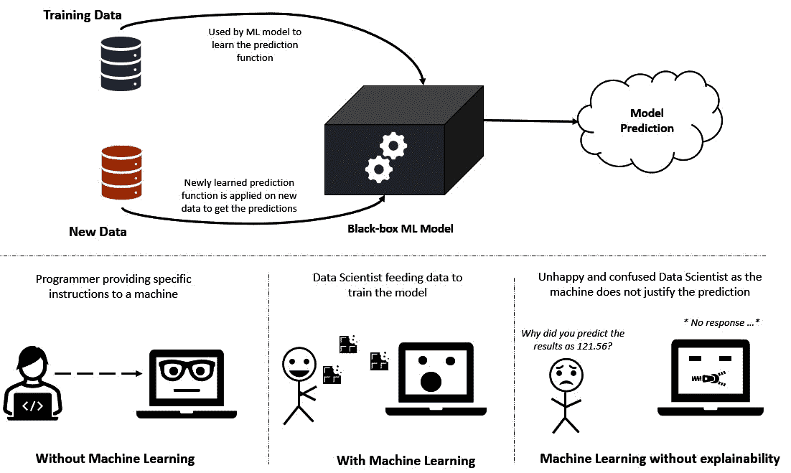
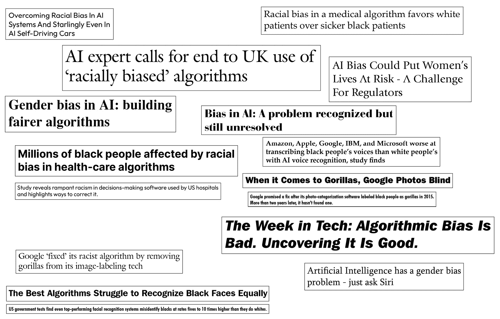
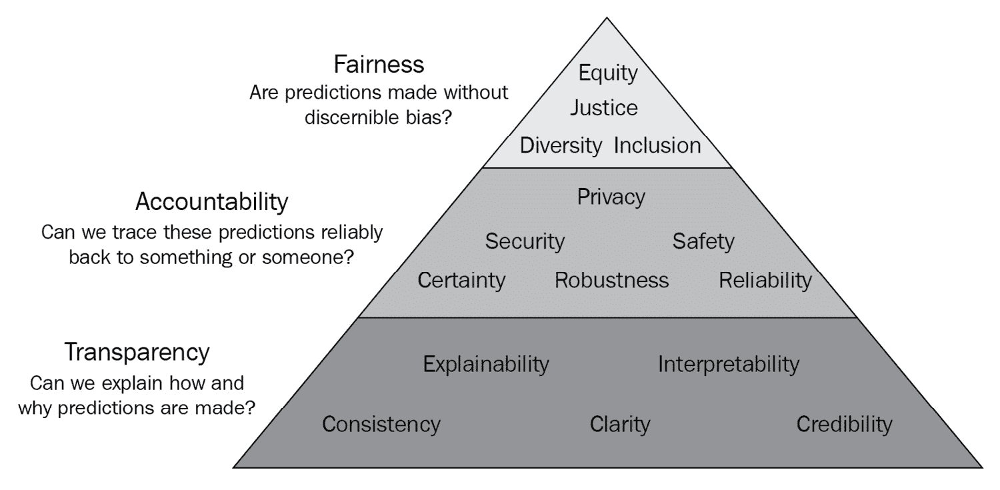
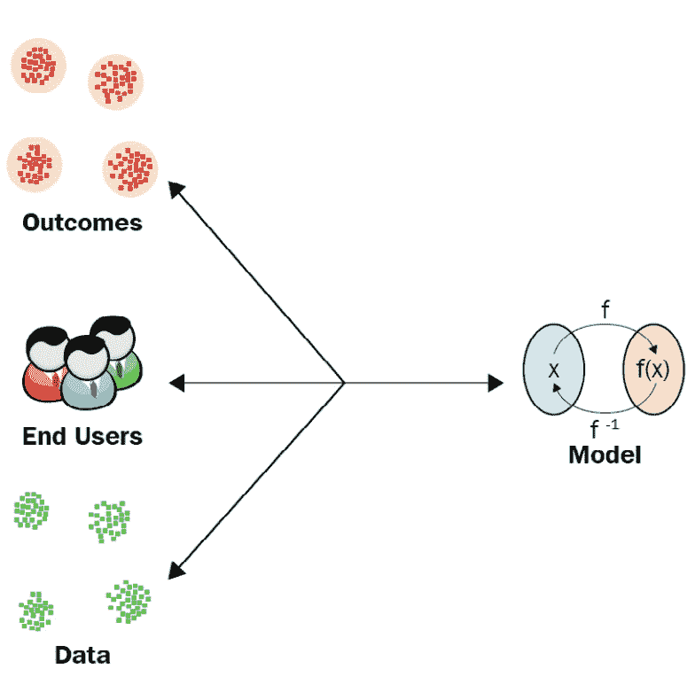
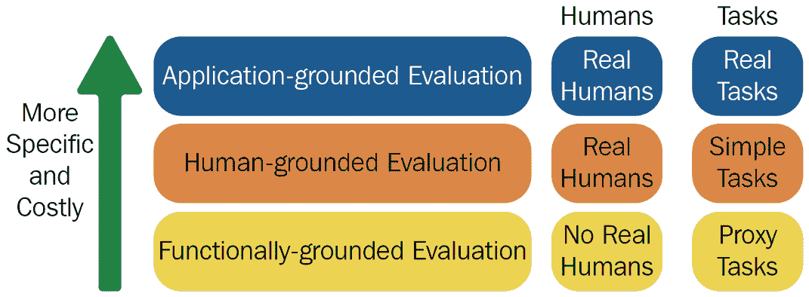
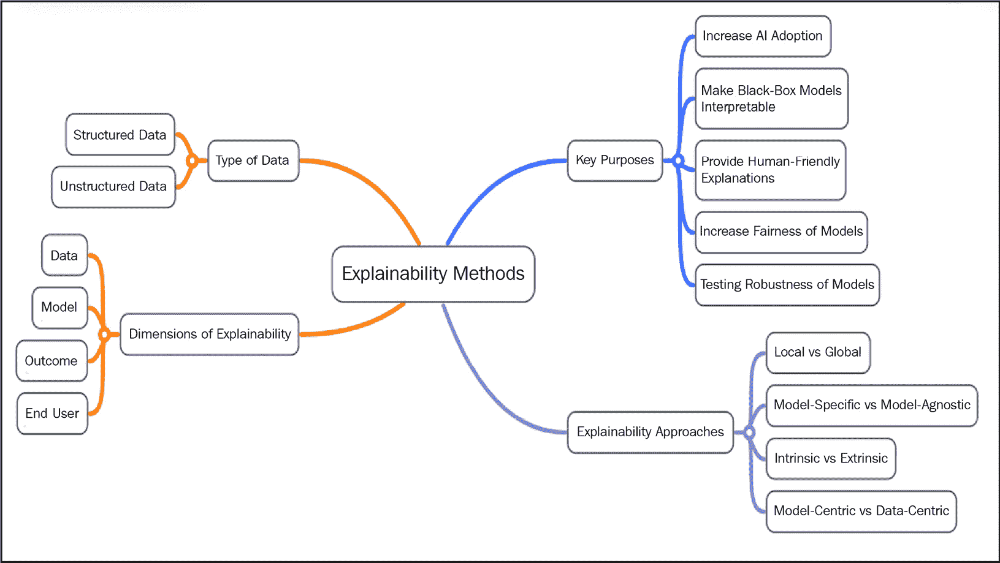

# 第一章：可解释性技术的基础概念

随着越来越多的组织开始采用人工智能（AI）和机器学习（ML）来支持他们的关键业务决策过程，立即期望能够解释和揭示黑盒算法，以增加其采用率。AI 和 ML 正在越来越多地被用于确定我们在多个领域的日常体验，如银行、医疗保健、教育、招聘、交通和供应链。但 AI 和 ML 模型所扮演的基石角色导致了商业利益相关者和消费者对透明度和可解释性的日益关注，因为这些黑盒算法高度受到人类偏见的影响；特别是在高风险领域，如医疗保健、金融、法律和其他关键工业操作，模型可解释性是一个先决条件。

随着人工智能（AI）和机器学习（ML）的益处可能非常显著，问题在于，我们如何增加其采用率，尽管存在越来越多的担忧？我们甚至能否解决这些担忧，并使 AI 和 ML 的使用民主化？以及我们如何使 AI 对关键工业应用更加可解释，在这些应用中，黑盒模型不受信任？在这本书中，我们将尝试找到这些问题的答案，并将这些概念和思想应用于解决实际问题！

在本章中，你将了解可解释人工智能（XAI）的基础概念，以便未来章节中使用的术语和概念清晰易懂，这将使你更容易跟随和实施本书后面讨论的一些高级可解释性技术。这将为你提供理解和实施后面章节中讨论的实用技术所需的理论知识。本章重点介绍以下主要主题：

+   XAI 简介

+   定义解释方法和途径

+   评估可解释性方法的质量

现在，让我们开始吧！

# XAI 简介

**XAI** 是确保 AI 和 ML 解决方案透明、可信、负责任和道德的最有效实践，从而有效地解决算法透明度、风险缓解和后备计划的监管要求。AI 和 ML 可解释性技术提供了必要的可见性，以了解这些算法在其解决方案生命周期中的每个阶段是如何运作的，使用户能够理解 AI 和 ML 模型的查询与结果之间的 *原因* 和 *方式*。

## 理解关键术语

通常，对于机器学习模型，为了回答*如何*的问题，我们使用术语*可解释性*，为了回答*为什么*的问题，我们使用术语*可解释性*。在这本书中，术语**模型可解释性**和**模型可解释性**是互换使用的。然而，为了提供机器学习模型结果的*人性化*整体解释，我们需要使机器学习算法既可解释又可解释，从而使用户能够轻松理解这些模型的决策过程。

在大多数情况下，机器学习模型被视为黑盒，我们输入任何训练数据，并期望它能够对新、未见过的数据进行预测。与传统的编程不同，在传统的编程中，我们编写特定的指令，而机器学习模型会自动尝试从数据中学习这些指令。如图*1.1*所示，当我们试图找出模型预测的依据时，我们得不到足够的信息！

图 1.1 – 传统上，黑盒模型不提供预测背后的任何依据

现在，让我们了解错误预测和不准确的机器学习模型的影响。

## 差异预测的后果

传统上，所有机器学习模型都被认为是神奇的黑色盒子，可以自动从数据中解析出有趣的模式和见解，并提供*银弹*般的解决方案！与受程序员智力限制的传统基于规则的计算机程序相比，经过良好训练的机器学习算法被认为即使在复杂情况下也能提供丰富的见解和准确的预测。但事实是，所有机器学习模型都存在*偏差*，这可能是由于算法本身的**归纳偏差**，也可能是由于用于训练模型的数据库中存在偏差。在实践中，还可能有其他原因，如**数据漂移**、**概念漂移**、**过拟合**或**欠拟合**的模型，这些原因可能导致模型预测出错。正如著名的英国统计学家乔治·E·P·博克斯曾经说过：“所有模型都是错误的，但有些是有用的”；所有统计的、科学的和机器学习模型都可能在初始假设不一致的情况下给出错误的结论。因此，了解为什么机器学习模型预测了特定的结果，如果它是错误的，应该怎么做，以及如何改进预测，对我们来说非常重要。

*图 1.2*展示了新闻标题的集合，突出了人工智能算法在产生公平和无偏见结果方面的失败。

图 1.2 – 偏见和缺乏公平性的机器学习模型日益受到关注

在完全同意我对模型可解释性必要性的观点之前，让我尝试给出一些低风险和高风险领域的实际例子，以了解不良预测的后果。天气预报是极具挑战性的经典预测问题之一（因为它依赖于多个动态因素），机器学习在这里得到了广泛的应用，机器学习算法考虑多种不同类型的参数的能力使其比标准统计模型在预测天气方面更加高效。尽管拥有高度准确的预测模型，但有时天气预报算法可能会错过降雨的预测，尽管几分钟后就开始下雨了！但这样的不良预测的后果可能并不严重，而且大多数人并不盲目依赖自动化的天气预报，这使得天气预报成为一个低风险领域问题。

类似地，对于另一个低风险领域，例如内容推荐系统，即使机器学习算法提供了不相关的推荐，最多用户可能只是会花更多时间明确地搜索相关内容。尽管最终用户的整体体验可能会受到影响，但仍然没有严重的生活或生计损失。因此，对于低风险领域，模型可解释性的需求并不关键，但为模型预测提供可解释性确实使自动智能系统对最终用户更加可靠和可信，从而通过提升用户体验来增加人工智能的采用率。

现在，让我举一个例子，其中不良预测的后果导致了公司声誉和估值的严重损失，影响了众多人的生活！2021 年 11 月，一家名为*Zillow*的美国在线房地产交易平台公司报告称，其股价价值损失超过 40%，其购房部门*Offers*因未能检测到其房价预测算法的不确定性而损失了超过 3 亿美元（更多详情请参阅*参考文献*部分）。为了弥补损失，Zillow 不得不采取大幅裁员等措施，数千个家庭受到了影响。

同样，多家科技公司被指控使用高度偏见的 AI 算法，这些算法可能导致因种族或性别歧视而引发的社会动荡。2015 年发生的一起事件中，谷歌照片自动将一对非洲裔美国人夫妇标记为*大猩猩*，造成了大规模的种族主义错误（请参阅*参考文献*部分中提到的来源以获取更多信息）。尽管这些错误是无意的，并且大多是由于有偏见的数据集或未泛化的机器学习模型造成的，但这些事件的后果可能会造成巨大的社会、经济和政治混乱。在其他高风险领域，如医疗保健、信贷贷款和招聘中，机器学习模型中的偏见持续提醒我们，需要更多透明的解决方案和 XAI 解决方案，以便最终用户可以依赖。

如*图 1.3*所示，不良预测的后果突出了 XAI 的重要性，它可以提供早期指标，以防止因 AI 算法失败而导致的声誉、金钱、生命或生计的损失：

![Figure 1.3 – 机器学习模型预测不良的常见后果

![img/B18216_01_03.jpg]

图 1.3 – 机器学习模型预测不良的常见后果

现在，让我们在下一节中尝试总结模型可解释性的需求。

## 概述模型可解释性的需求

在上一节中，我们了解到不良预测的后果可能影响高风险领域的许多生命，甚至在低风险领域，最终用户的使用体验也可能受到影响。*Samek 和 Binder*在*MICCAI'18*的*可解释机器学习教程*中强调了模型可解释性的主要必要性。让我尝试总结模型可解释性之所以重要的关键原因：

+   **验证和调试机器学习系统**：正如我们所看到的，错误的模型决策可能代价高昂且危险，模型可解释性技术帮助我们验证和验证机器学习系统。对错误预测的解释有助于我们调试根本原因，并提供解决问题的方向。我们将在*第十章* *XAI 行业最佳实践*中更详细地讨论可解释机器学习系统的不同阶段。

+   **使用以用户为中心的方法来改进机器学习模型**：XAI 提供了一种机制，将人类经验和直觉纳入机器学习系统。传统上，机器学习模型是根据预测误差来评估的。使用这种评估方法来改进机器学习模型不会增加任何透明度，并且可能不是稳健和高效的。然而，使用可解释性方法，我们可以使用人类经验来验证预测，并了解是否需要进一步采用以模型为中心或以数据为中心的方法来改进机器学习模型。*图 1.4*比较了一个经典的机器学习系统与一个可解释的机器学习系统：

![Figure 1.4 – 经典机器学习与可解释机器学习方法的比较

![img/B18216_01_04.jpg]

图 1.4 – 经典机器学习与可解释机器学习方法的比较

+   **学习新的见解**：机器学习被认为能够自动从数据中揭示出对人类来说并不明显的有趣见解和模式。可解释机器学习为我们提供了一种机制，使我们能够理解模型自动选择的见解和模式背后的理由，并允许我们详细研究这些模式以进行新的发现。

+   **符合法规要求**：许多监管机构，如**通用数据保护条例**（**GDPR**）和**加利福尼亚消费者隐私法案**（**CCPA**），对人工智能缺乏可解释性表示严重关切。因此，日益增长的全球人工智能法规赋予了个人要求对其产生影响的自动化决策系统进行解释的权利。模型可解释性技术试图确保机器学习模型符合拟议的监管法律，从而促进公平、责任和透明度。

图 1.5 – (上) 欧洲委员会推文的截图，突出强调要求解释的权利。(下) 表格显示为使自动化决策系统可解释、透明、负责任和公平而建立的一些重要监管法律

模型可解释性的需求可以通过书中提供的**FAT 模型可解释机器学习**的以下图表来可视化，该图表来自 Serg Masís 的《用 Python 进行可解释机器学习》一书。

图 1.6 – 可解释机器学习 FAT 模型（来自 Serg Masís 的《用 Python 进行可解释机器学习》）

*图 1.6* 展示了构成可解释机器学习系统 FAT 模型的金字塔，用于提高人工智能的采用率。让我们在下一节讨论定义解释方法和途径。

# 定义解释方法和途径

在本节中，让我们尝试理解理解和应用各种可解释性技术和方法所需的一些关键概念。

## 可解释性的维度

在*Samek 和 Binder 在*MICCAI'18*上的教程《可解释机器学习》中提出的概念基础上，当我们谈论揭开黑盒算法神秘面纱的问题时，有四个不同的维度可以通过以下图表来解决这个问题：

图 1.7 – 可解释性的四个维度

现在，让我们详细了解这些维度：

+   **数据**：可解释性的维度围绕着正在建模的底层数据。理解数据、识别其局限性和相关组件，以及形成某些假设对于建立正确的预期至关重要。一个稳健的数据整理过程、分析数据纯度和对抗性效应对数据的影响是获取可解释结果的其他关键练习。

+   **模型**：基于模型的可解释性技术通常帮助我们理解输入数据是如何映射到输出预测的，并意识到所使用的机器学习算法的一些局限性和假设。例如，用于机器学习分类的朴素贝叶斯算法假设某个特征的存在是完全独立且与任何其他特征的存在无关的。因此，了解机器学习算法的这些*归纳偏差*有助于我们理解和预测任何预测错误或机器学习模型的局限性。

+   **结果**：可解释性的结果在于理解为什么一个特定的预测或决策是由机器学习模型做出的。尽管数据和模型的可解释性非常重要，但大多数机器学习专家和最终用户更关注使最终模型预测可解释。

+   **最终用户**：可解释性的最后一个维度是关于为机器学习模型的最终消费者创建正确的抽象层次和包括适当数量的细节，以便结果对任何非技术最终用户都是可靠和可信的，并使他们能够理解黑盒算法的决策过程。

可解释性针对一个或多个可解释性的维度提供给 AI/ML 算法。接下来，让我们讨论如何解决可解释性的关键问题。

## 解决可解释性的关键问题

现在我们已经了解了可解释性的不同维度，让我们讨论一下要使机器学习模型可解释需要什么。为了使机器学习算法可解释，以下是我们应该尝试解决的问题：

+   *我们从数据中理解了什么？*

第一步完全是关于数据。在开始 AI 和机器学习建模之前，我们应该花足够的时间分析和探索数据。目标始终是寻找差距、不一致性、潜在的偏差或假设，这些可能会影响或给建模和生成预测带来挑战。这有助于我们了解期望是什么以及数据的某些方面如何有助于解决业务问题。

+   *模型是如何创建的？*

我们需要了解算法的透明度如何，以及算法在建模过程中建模数据时可以捕捉到什么样的关系。这是我们试图理解算法的归纳偏置并尝试将其与探索数据时获得的初始假设或观察结果相关联的步骤。例如，如果数据中存在一些通过基于可视化的数据探索方法观察到的二次或周期模式，线性模型将无法有效地建模数据。预测误差预计会更高。因此，如果算法如何构建训练数据模型不清楚，这些算法的透明度较低，因此可解释性也较低。

+   *关于训练模型的全球可解释性，我们了解什么？*

理解全局模型的可解释性始终具有挑战性。这关乎获得底层特征的全面视角，了解重要特征，了解模型对关键特征值变化的敏感度，以及模型内部发生的复杂交互类型。这对于具有数百万个学习参数和数百层复杂深度学习模型来说，在实践中尤其难以实现。

+   *模型的不同部分对最终预测有什么影响？*

机器学习模型的不同部分可能以不同的方式影响最终预测。特别是对于深度神经网络模型，每一层都试图学习不同类型的特征。当模型预测错误时，了解模型的不同部分如何影响或控制最终结果非常重要。因此，可解释性技术可以从模型的不同部分揭示洞察力，并帮助调试和观察算法对不同数据点的鲁棒性。

+   *为什么模型对单个记录和一批记录做出特定的预测？*

可解释性的最重要方面是理解模型为何做出特定的预测而不是其他预测。因此，应用了某些局部和全局的解释技术，这些技术要么考虑单个特征的影响，要么甚至考虑多个特征对结果的整体影响。通常，这些可解释性技术应用于单个数据实例和一批数据实例，以了解观察结果是否一致。

+   *结果是否符合最终用户的期望？*

最后一步总是提供以用户为中心的解释。这意味着解释性全部关于将结果与基于常识和人类直觉的用户预测进行比较。如果模型的预测与用户的预测相符，提供合理的解释只需证明导致特定结果的主要因素。但如果模型的预测与用户的预测不符，那么一个好的解释会尝试证明输入观察中可能发生了哪些变化，以得到不同的结果。

例如，假设，考虑到通常的工作日交通拥堵，我从办公室到家的通勤时间是 30 分钟。但如果下雨，我会预计路上的车辆会缓慢移动，交通拥堵会更高，因此可能会预计到家的时间会更长。现在，如果 AI 应用预测到家的时间仍然是 30 分钟，我可能不会相信这个预测，因为这不符合直觉。

现在，假设算法在预测上是准确的。然而，提供的理由是关于我路线上的车辆移动情况，AI 应用只是提到我路线上的车辆移动速度与其他日子相同。这种解释真的能帮助我理解模型预测吗？不，它不能。但如果应用提到路线上的车辆比典型日子少，那么我会很容易理解车辆数量减少是因为下雨，因此到达目的地的时间仍然与平时工作日相同。

我的建议是，在训练和验证机器学习模型后，始终尝试在解释黑盒模型的工作原理时将这些问题的答案作为第一步。

## 理解不同类型的解释方法

在上一节中，我们讨论了在设计和使用鲁棒的解释方法时需要解决的一些关键问题。在本节中，我们将讨论各种类型的解释方法，考虑到在机器学习中使用的四个解释性维度：

+   **局部可解释性**和**全局可解释性**：机器学习模型的可解释性可以针对数据中的单个局部实例进行，以了解某个范围内的值或特定的分类值如何与最终预测相关。这被称为局部可解释性。全局模型可解释性用于解释整个模型的行为或某些重要特征的整体行为，这些特征共同导致一组特定的模型结果。

+   **内在可解释性**和**外在可解释性**：一些机器学习模型，如线性模型、简单的决策树和启发式算法，由于其逻辑或输入输出之间的数学映射是清晰的，因此本质上是可以解释的。而外在或事后可解释性则是指首先在给定数据上训练一个机器学习模型，然后使用某些模型可解释性技术分别来理解和解释模型的输出。

+   **模型特定可解释性**和**模型无关可解释性**：当我们使用适用于任何特定算法的某些可解释性方法时，这些就是模型特定方法。例如，决策树模型中树结构的可视化仅限于决策树算法，因此属于模型特定可解释性方法。模型无关方法用于向任何机器学习模型提供解释，无论使用的是哪种算法。大多数情况下，这些是事后分析方法，在训练好的机器学习模型获得后使用，通常这些方法并不了解模型的内部结构和权重。在这本书中，我们将主要关注模型无关可解释性方法，这些方法不依赖于任何特定的算法。

+   **模型中心可解释性**和**数据中心可解释性**：传统上，大多数解释方法都是模型中心的，因为这些方法试图解释算法如何对输入特征和目标值进行建模，以及如何获得特定的结果。但随着数据中心 AI 领域的最新进展，机器学习专家和研究人员也在研究围绕用于训练模型的训练数据的解释方法，这被称为数据中心可解释性。数据中心方法用于了解数据是否一致、精心整理，以及是否适合解决潜在问题。数据概要、数据漂移和概念漂移的检测以及对抗鲁棒性是我们将在*第三章*“数据中心方法”中更详细讨论的某些特定数据中心可解释性方法。

我们将在本书的后续章节中讨论所有这些类型的可解释性方法。

## 理解准确性与可解释性之间的权衡

在理想情况下，我们希望我们的机器学习模型既高度准确又高度可解释，以便任何非技术性的业务利益相关者或最终用户都能理解模型预测背后的逻辑。但在实践中，实现高度准确和可解释的模型极其困难，准确性和可解释性之间始终存在权衡。

例如，为了进行放射学图像分类，本质上可解释的机器学习算法，如决策树，可能无法提供高效和通用的结果，而更复杂的深度卷积神经网络，如 DenseNet，可能对建模放射学图像数据更为高效和稳健。但是，DenseNet 本质上不可解释，向任何非技术性最终用户解释算法的工作原理可能相当复杂和具有挑战性。因此，高度精确的模型，如深度神经网络，是非线性和更复杂的，可以从数据中捕捉复杂的关联和模式，但这些模型的可解释性很难实现。高度可解释的模型，如线性回归和决策树，主要是线性和较简单的，但它们仅限于从数据中学习线性或较简单的模式。

现在，问题是，是选择高度精确的模型还是高度可解释的模型更好？我会说，正确的答案是，*这取决于！* 这取决于要解决的问题和模型的消费者。对于高风险领域，其中预测错误的后果严重，即使牺牲准确性，我也建议选择更可解释的模型。任何高度可解释的基于规则的启发式模型在这种情况下可能非常有效。但是，如果问题研究得很好，并且最小化预测误差是主要目标（如任何学术用例或任何机器学习竞赛），那么预测错误的后果不会造成任何重大损害，那么选择高度精确的模型可能是首选。在大多数工业问题中，保持模型准确性和可解释性之间的正确平衡对于促进人工智能的采用至关重要。

*图 1.10* 展示了流行机器学习算法的准确性-可解释性权衡：

![图 1.8 – 准确性-可解释性权衡图

![图片 B18216_01_08.jpg]

图 1.8 – 准确性-可解释性权衡图

现在我们对准确性-可解释性权衡有了相当的了解，让我们尝试理解如何评估可解释性方法的质量。

# 评估可解释性方法的质量

可解释性是主观的，可能因人而异。关键问题是*我们如何确定一种方法是否优于另一种方法？* 因此，在本节中，让我们讨论评估机器学习系统可解释性技术时应考虑的某些标准。

## 优秀可解释机器学习系统的标准

由于机器学习系统的可解释性是一个非常主观的话题，首先让我们尝试理解一些良好的人性化解释的关键标准。在《可解释机器学习》一书中，作者**克里斯托夫·莫拉尔**经过深入研究后，也强调了良好的人性化解释的重要性，我将尝试以简化的形式提及，考虑到现代、工业化的可解释机器学习系统：

+   **与先验知识的一致性**：与最终用户的先验信念的一致性是可解释机器学习系统的重要标准。如果任何解释与人类先验知识相矛盾，那么人类往往会对这样的解释缺乏信任。然而，将人类的先验知识引入机器学习模型是具有挑战性的。但是，人性化的可解释机器学习系统应该尝试提供围绕某些特征的解释，这些特征与结果有直接且不太复杂的关系，从而使关系与最终用户的先验信念一致。

例如，对于预测糖尿病的存在，血糖水平的测量与人类先前的信念有直接关系，这是符合人类先前的信念的。如果血糖水平高于正常值，这可能会表明患者患有糖尿病，尽管糖尿病也可能是由某些遗传因素或其他原因引起的。同样，高血糖水平也可能是瞬时的，高血糖水平并不总是意味着患者患有糖尿病。但是，由于解释与先验知识一致，最终用户会对这样的解释有更多的信任。

+   **忠实度**：提供全面解释的另一个关键因素是解释的真实性，这也被称为机器模型的忠实度。高忠实度的解释可以近似黑盒模型的全面预测，而低忠实度的解释可以解释局部数据实例或数据的一个特定子集。例如，在进行销售预测时，仅基于历史数据的趋势提供解释并不能给出完整的画面，因为其他因素，如生产能力、市场竞争和客户需求，可能会影响模型的结果。忠实度在详细根本原因分析中起着关键作用，但过多的细节可能对普通用户没有帮助，除非有要求。

+   **抽象性**：良好的人性化解释总是期望以简洁和抽象的格式呈现。过多的复杂细节也可能影响最终用户的体验。例如，对于天气预报，如果模型预测有很高的降雨概率，简洁和抽象的解释可以是：现在天空多云，当前位置 5 公里范围内正在下雨，因此有很高的降雨概率。

但是，如果模型包括与降水水平、湿度和风速相关的细节，这些细节可能对降雨预测也很重要，这些额外的细节复杂且难以理解，因此不人性化。所以，好的、人性化的解释包括适当程度的抽象，以简化最终用户的理解。最终用户大多更喜欢简洁的解释，但在进行模型预测的根本原因分析时可能需要详细解释。

+   **对比解释**：好的、人性化的解释并不是关于理解模型的内部运作，而是主要关于比较“如果...会怎样”的情景。假设结果是连续的数值数据，就像回归问题中的情况一样。在这种情况下，一个好的预测解释包括与另一个实例的预测进行比较，该预测显著更高或更低。同样，一个好的分类问题解释是关于将当前预测与其他可能的输出进行比较。但对比解释是应用相关的，因为它需要一个比较点，尽管理解“如果...会怎样”的情景有助于我们理解某些关键特征的重要性以及这些特征与目标变量之间的关系。

例如，对于员工流失预测的用例，如果模型预测员工可能会离开组织，那么对比解释试图通过将其与一个预期员工将留在组织中的实例的预测进行比较来证明模型的决策，并比较用于建模数据的关键特征值。因此，解释方法可能会传达，由于可能离开组织的员工的薪水远低于可能留在组织内的员工的薪水，模型预测该员工预计会离开组织。

+   **关注异常情况**：这听起来可能有些反直觉，但人类试图寻找对那些不可预期和不明显的事件的解释。假设数据中存在异常观察，比如一个罕见的分类值或一个可能影响结果的异常连续值。在这种情况下，它应该包含在解释中。即使其他正常且一致的特征对模型结果有相同的影响，仍然包含异常性在人性化的解释中具有更高的重要性。

例如，假设我们正在根据汽车的配置预测汽车的价格，比如说操作模式是*电动*，这与*汽油*相比是一种罕见的观察。这两个类别可能对最终模型预测有相同的影响。然而，模型解释应该包括罕见的观察，因为最终用户对异常观察更感兴趣。

+   **社会方面**：模型可解释性的社会方面决定了解释的抽象层次和内容。社会方面取决于特定目标受众的理解水平，可能在模型可解释性方法中难以概括和引入。例如，假设一个旨在向用户建议行动的股票预测机器学习模型建议*做空*某只特定股票。在这种情况下，非金融领域的最终用户可能难以理解。但相反，如果模型建议*在当前价格卖出不持有的股票，并在一个月后价格预期下跌时买回*，任何非技术用户都可能轻松理解模型建议。因此，好的解释应考虑社会方面，并且通常，利用**人机交互**（**HCI**）的用户中心设计原则来设计考虑社会方面的良好、可解释的机器学习系统。

现在我们对良好解释的关键标准有了大致的了解，在下一节中，我们将讨论在构建可解释的机器学习系统时同样重要的辅助标准。

## XAI 的辅助标准用于机器学习系统

良好的解释不仅限于之前讨论的关键标准，还有 XAI 的一些辅助标准，如*Doshi-Velez*和*Kim*在他们关于*迈向可解释机器学习的严谨科学*的工作中所讨论的那样：

+   **无偏性**：模型可解释性技术还应寻找数据或模型中任何形式的偏见。因此，XAI 的一个关键目标是使机器学习模型无偏见且公平。例如，对于预测信用卡欺诈，可解释性方法应调查与客户性别相关的人口信息对于模型决策过程的重要性。如果性别信息的重要性很高，这意味着模型对特定性别存在偏见。

+   **隐私**：可解释性方法应遵守数据隐私措施，因此不应使用任何敏感信息进行模型解释。主要为了提供个性化的解释，确保遵守数据隐私可能非常重要。

+   **因果关系**：模型可解释性方法应尝试寻找任何因果关系，以便最终用户意识到由于任何扰动，生产系统的模型预测可能会有所变化。

+   **鲁棒性**：如敏感性分析等方法有助于了解模型预测与其特征值之间的鲁棒性和一致性。如果输入特征的小幅变化导致模型预测发生显著变化，这表明模型不是鲁棒或稳定的。

+   **信任**：XAI 的一个关键目标是通过对最终用户增加信任来增加 AI 的采用率。因此，所有可解释性方法都应使黑盒机器学习模型更加透明和可解释，以便最终用户可以信任并依赖它们。如果解释方法不符合在“良好可解释机器学习系统标准”部分讨论的良好解释标准，那么它可能不会帮助增加其消费者的信任。

+   **可用性**：XAI 方法应努力使 AI 模型更易于使用。因此，它应向用户提供完成任务所需的信息。例如，反事实解释可能会建议贷款申请人支付未来 2 个月的信用卡账单，并在申请新贷款之前清偿之前的债务，这样他们的贷款申请就不会被拒绝。

接下来，我们需要了解评估可解释机器学习系统各个层面的不同水平。

## 可解释机器学习系统评估层面的分类

既然我们已经讨论了设计和评估良好可解释机器学习系统的关键标准，那么让我们讨论评估解释质量的评估方法分类。在他们的工作《迈向可解释机器学习的严谨科学》中，Doshi-Velez 和 Kim 提到了三种主要的评估方法类型，我们将在本节中尝试理解。由于可解释机器学习系统应按照以用户为中心的人类-计算机交互（HCI）设计原则进行设计，因此评估真实任务的评估者在评估解释质量中扮演着核心角色。

但人类评估机制可能有其自身的挑战，例如不同类型的人类偏见，以及更耗时和消耗其他资源，还可能有其他导致评估不一致的复合因素。因此，人类评估实验应设计得很好，并且只有在必要时才使用，否则不应使用。现在，让我们看看三种主要的评估方法类型：

+   **基于应用的评估方法**：这种评估方法涉及将可解释性技术集成到实际产品或应用中，从而允许进行涉及真实最终用户的实验，这些用户将执行某些实验。尽管实验设置成本高且耗时，但构建一个几乎完成的产品然后允许领域专家进行测试有其好处。这将使研究人员能够评估解释的质量相对于系统的最终任务，从而提供快速识别可解释性方法错误或局限性的方法。这种评估原则与在人类-计算机交互（HCI）中使用的评估方法一致，可解释性被融入到整个负责解决用户持续问题和帮助用户实现最终目标的系统中。

例如，为了评估一款 AI 软件从图像中自动检测皮肤癌的解释方法的质量，皮肤科医生可以被邀请直接测试 AI 软件所构建的目标。如果解释方法成功，那么这样的解决方案可以很容易地扩展。从工业角度来看，由于获得完美的成品可能耗时，更好的方法是构建一个健壮的原型或**最小可行产品（MVP**），这样领域专家在测试系统时就能更好地了解成品将如何。

+   **基于人类的评估**：这种方法涉及对非专家新手用户进行更直接的任务的人类受试者实验，而不是领域专家。获取领域专家可能耗时且昂贵，因此基于人类的评估实验更容易设置且成本更低。有时任务也会简化，通常在需要泛化的某些用例中，这些方法非常有帮助。**A/B 测试**、**反事实模拟**和**正向模拟**是用于基于人类评估的一些流行评估方法。

在可解释人工智能（XAI）中，A/B 测试向用户提供不同类型的解释，用户被要求选择解释质量更高的最佳选项。然后，基于最终汇总的投票，以及使用其他指标如点击率、屏幕悬停时间和完成任务的时间，来确定最佳方法。

对于反事实模拟方法，人类受试者被展示模型的输入和输出以及一定数量的数据样本的解释，并被要求提供某些输入特征的更改，以改变模型的最终结果到特定的值范围或特定类别。在正向模拟方法中，人类受试者被提供模型输入及其相应的解释方法，然后被要求在不查看真实值的情况下模拟模型预测。然后，用于找到人类预测结果与真实标签之间差异的错误指标可以作为评估解释质量的一种定量方法。

+   **基于功能性的评估**：这种方法不涉及任何人类受试者实验，使用代理任务来评估解释的质量。这些实验比其他两种方法更可行且成本更低，特别是在人类受试者实验受限且不道德的用例中，这是一种替代方法。当算法类型已经在人类水平评估中测试过时，这种方法效果良好。

例如，线性回归模型易于解释，最终用户可以有效地理解模型的工作原理。因此，使用线性回归模型进行销售预测等用例可以帮助我们理解历史数据的整体趋势以及预测值与趋势之间的关系。

*图 1.9*总结了可解释机器学习系统评估层级的分类：

图 1.9 – 可解释机器学习系统的评估层级分类

除了这里讨论的方法之外，为了确定解释的质量，还经常使用其他指标，如解释的描述长度、用于解释的特征的复杂性以及理解提供的解释所需的认知处理时间。我们将在*第十一章*《以最终用户为中心的人工智能》中更详细地讨论它们。

在本章中，到目前为止，你已经遇到了许多关于机器学习可解释性技术的全新概念。*图 1.10*中的思维导图对本章讨论的各种术语和概念提供了一个很好的总结：

图 1.10 – 机器学习可解释性技术的思维导图

我强烈建议你们熟悉这个思维导图中使用的术语，因为我们将在此书中使用它！让我们总结一下在摘要部分中讨论的内容。

# 摘要

在阅读本章之后，你现在应该已经理解了 XAI（可解释人工智能）是什么以及为什么它如此重要。你已经了解了与可解释性技术相关的各种术语和概念，这些术语和概念我们将在此书中频繁使用。你还了解了一些关键的人性化可解释机器学习系统的标准以及评估可解释性技术质量的不同方法。在下一章中，我们将专注于结构化和非结构化数据的各种模型可解释性方法。

# 参考文献

请参考以下资源以获取更多信息：

+   *《3 亿美元的双面胶：房地产网站 Zillow 的副业为何出错》，*theguardian.com*：[`www.theguardian.com/business/2021/nov/04/zillow-homes-buying-selling-flip-flop`](https://www.theguardian.com/business/2021/nov/04/zillow-homes-buying-selling-flip-flop)

+   *Zillow 表示将关闭购房业务，裁员 25%，收益未达到预期*，*cnbc.com*：[`www.cnbc.com/2021/11/02/zillow-shares-plunge-after-announcing-it-will-close-home-buying-business.html`](https://www.cnbc.com/2021/11/02/zillow-shares-plunge-after-announcing-it-will-close-home-buying-business.html)

+   *通过面部识别软件将两名非洲裔美国人标记为大猩猩的谷歌照片*, *forbes.com*: [`www.forbes.com/sites/mzhang/2015/07/01/google-photos-tags-two-african-americans-as-gorillas-through-facial-recognition-software/`](https://www.forbes.com/sites/mzhang/2015/07/01/google-photos-tags-two-african-americans-as-gorillas-through-facial-recognition-software/)

+   *谷歌就照片应用中的种族错误道歉*, *bbc.com*: [`www.bbc.com/news/technology-33347866`](https://www.bbc.com/news/technology-33347866)

+   *可解释机器学习教程，MICCAI'18，由 Samek 和 Binder 编写*: [`www.heatmapping.org/slides/2018_MICCAI.pdf`](http://www.heatmapping.org/slides/2018_MICCAI.pdf)

+   *第一章* *–* *解释、可解释性和可解释性以及为什么这一切都如此重要？* by *塞尔吉·马西斯，Packt Publishing Ltd.:* [`www.amazon.com/Interpretable-Machine-Learning-Python-hands/dp/180020390X`](https://www.amazon.com/Interpretable-Machine-Learning-Python-hands/dp/180020390X)

+   *可解释机器学习*, *克里斯托夫·莫拉尔:* [`christophm.github.io/interpretable-ml-book/`](https://christophm.github.io/interpretable-ml-book/)

+   *通过 Doshi-Velez 和 Kim 的研究，迈向可解释机器学习的严谨科学*: [`arxiv.org/abs/1702.08608`](https://arxiv.org/abs/1702.08608)
