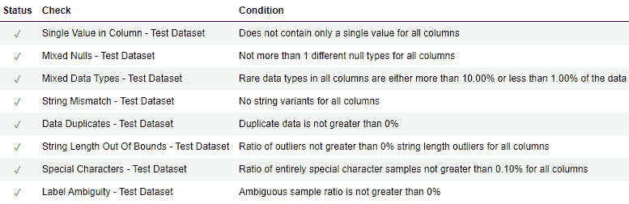
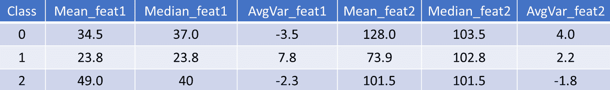
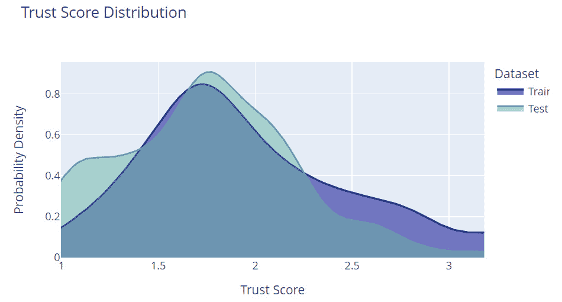
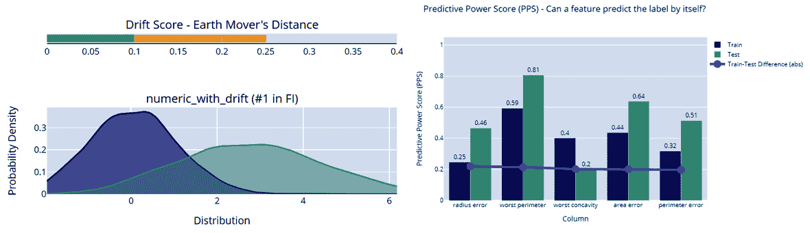
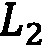
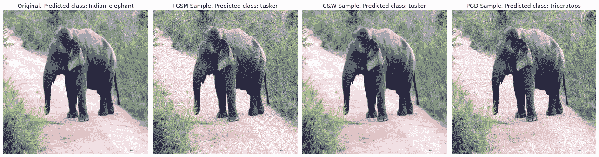
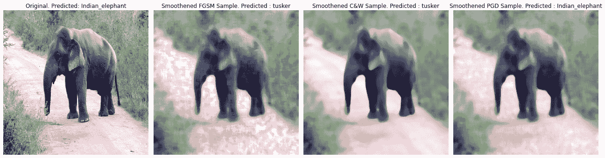
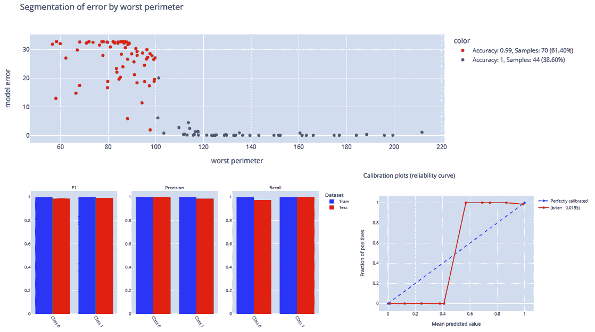

# 第三章：数据中心化方法

在*第一章*“可解释性技术基础概念”的*定义解释方法和途径*部分，当我们查看可解释性的各个维度时，我们讨论了数据是其中一个重要维度。实际上，所有**机器学习**（**ML**）算法都依赖于所使用的基础数据。

在上一章中，我们讨论了各种**模型可解释性方法**。在*第二章*“模型可解释性方法”中讨论的大多数方法都是模型中心的。讨论的概念和思想集中在使黑盒模型可解释。但最近，机器学习和人工智能社区已经意识到数据对于任何分析或建模目的的核心重要性。因此，越来越多的 AI 研究人员正在探索围绕**数据中心化 AI**的新想法和概念。

由于数据在模型构建和预测过程中发挥着至关重要的作用，因此，我们更有必要从基础数据的角度解释任何机器学习和人工智能算法的工作原理。从我在这领域的经验观察来看，任何机器学习系统在生产中的失败并不是由于选择了糟糕的机器学习算法，也不是由于模型训练或调整过程效率低下，而是大多数情况下是由于基础数据集的不一致性。因此，本章专注于**数据中心化可解释人工智能**（**XAI**）的概念。

本章的目标是向您介绍数据中心化 XAI 的概念。阅读本章后，您将了解可以执行的各种方法，以检查可能影响模型结果的数据质量。对于生产级别的机器学习系统，推理数据可能存在与其一致性和质量相关的问题。因此，监控这些漂移至关重要。此外，可能存在影响数据的外部噪声或扰动，这可能会影响模型。因此，我们将讨论一些用于解释机器学习模型的数据中心化方法。在本章中，以下主要主题将被涵盖：

+   数据中心化 XAI 简介

+   详尽的数据分析和配置文件过程

+   监控和预测漂移

+   检查对抗鲁棒性

+   测量数据可预测性

现在，让我们深入探讨！

# 技术要求

与*第二章*中的*模型可解释性方法*类似，本章提供了一些教程示例，以实现某些在特定有趣数据集上执行以数据为中心的 XAI 技术的技术。我们将使用 Python Jupyter 笔记本来运行代码并在整本书中可视化输出。本章的代码和数据集资源可以从以下 GitHub 仓库下载或克隆：[`github.com/PacktPublishing/Applied-Machine-Learning-Explainability-Techniques/tree/main/Chapter03`](https://github.com/PacktPublishing/Applied-Machine-Learning-Explainability-Techniques/tree/main/Chapter03)。其他运行代码所需的 Python 框架将在笔记本中提及，以及其他相关细节，以了解这些概念代码的实现。其他运行代码所需的 Python 框架将在笔记本中提及，以及了解这些概念代码实现的相关细节。请注意，本章主要侧重于提供对所涵盖主题的概念性理解。Jupyter 笔记本将帮助您获得在实践实现这些概念所需的补充知识。我建议您首先阅读本章，然后尝试执行 Jupyter 笔记本。

# 数据为中心的 XAI 简介

*安德鲁·吴*是 AI 和 ML 领域有影响力的思想领袖之一，他经常强调使用系统方法构建具有高质量数据的 AI 系统的重要性。他是**以数据为中心的 AI**理念的先驱之一，该理念侧重于开发系统流程，使用干净、一致和可靠的数据来开发模型，而不是专注于代码和算法。如果数据是一致的、明确的、平衡的，并且有足够的数量，这将导致模型构建更快、准确性更高，以及任何生产级系统的部署更快。

不幸的是，今天所有在生产中存在的 AI 和 ML 系统都不符合以数据为中心的 AI 原则。因此，可能存在严重的数据问题，这些问题很少被发现，但最终会导致 ML 系统失败。这就是为什么**以数据为中心的 XAI**对于检查和评估所使用数据的质量很重要。

当我们谈论根据数据解释任何黑盒模型的运作时，我们应该检查数据的*量*、数据的*一致性*（尤其是对于监督式 ML 问题），以及数据的*纯净性和完整性*。现在，让我们讨论数据为中心的 XAI 的重要方面，并了解为什么它们很重要。

## 分析数据量

机器学习算法的经典问题之一是由于**过拟合**导致的泛化不足。可以通过添加更多数据或获取适当体积的数据集来解决潜在问题，从而减少过拟合。因此，我们应该首先问关于数据的问题来解释黑盒模型：“*模型是否在足够的数据上训练过？*”但对于任何工业应用，由于数据非常昂贵，添加更多数据并不总是可行的。因此，问题应该是：“*我们如何找出模型是否在足够的数据上训练过？*”

检查模型是否在足够的数据上训练过的一种方法是通过使用 70%、80%和 90%的训练数据集来训练模型。如果模型准确率显示出随着数据量的增加而增加的趋势，这意味着数据量可以影响模型的表现。如果基于整个训练数据集训练的模型的准确率较低，那么随着数据量的增加而增加的模型准确率趋势表明模型没有在足够的数据上训练。因此，需要更多数据来使模型更准确和更具泛化能力。

对于生产系统，如果数据持续流动且没有对数据可用性的限制，应该对数据的变化量进行持续的训练和监控，以了解和分析其对整体模型性能的影响。

## 分析数据一致性

数据一致性是解释机器学习模型时需要检查的另一个重要因素。分析数据一致性的基本步骤之一是理解数据的分布。如果数据*分布不均匀*，如果存在*类别不平衡*，或者如果*数据偏向特定方向*，那么模型很可能对数据的一个特定部分存在*偏差*或效率较低。

对于生产系统，通常观察到在生产应用中使用的推理数据可能与训练和验证期间使用的数据进行一些差异。这种现象被称为**数据漂移**，它指的是数据结构或数据集的统计属性出现意外变化，从而使数据变得不完整并妨碍机器学习系统的运行。

对于大多数实时预测模型来说，数据漂移非常常见。这仅仅是因为，在大多数情况下，数据分布会在一段时间内发生变化。这可能是由多种原因造成的，例如，如果收集数据所通过的系统（例如，传感器）开始出现故障或需要重新校准，那么就会发生数据漂移。其他外部因素，如周围温度和周围噪声，也可能引入数据漂移。特征之间的关系可能会发生自然变化，这可能导致数据漂移。因此，如果训练数据与推理数据显著不同，模型在预测结果时将产生错误。

现在，有时整个数据集可能会出现漂移，或者一个或多个特征可能会出现漂移。如果单个特征出现漂移，这被称为**特征漂移**。有多种方法可以检测特征漂移，例如**人口稳定性指数**（**PSI**）([`www.lexjansen.com/wuss/2017/47_Final_Paper_PDF.pdf`](https://www.lexjansen.com/wuss/2017/47_Final_Paper_PDF.pdf)）、**Kullback–Leibler 散度**（**KL 散度**）([`www.countbayesie.com/blog/2017/5/9/kullback-leibler-divergence-explained`](https://www.countbayesie.com/blog/2017/5/9/kullback-leibler-divergence-explained)）和**Wasserstein 距离**（**地球搬家距离**）([`infolab.stanford.edu/pub/cstr/reports/cs/tr/99/1620/CS-TR-99-1620.ch4.pdf`](http://infolab.stanford.edu/pub/cstr/reports/cs/tr/99/1620/CS-TR-99-1620.ch4.pdf))。其中一些技术的应用已在[`github.com/PacktPublishing/Applied-Machine-Learning-Explainability-Techniques/tree/main/Chapter03`](https://github.com/PacktPublishing/Applied-Machine-Learning-Explainability-Techniques/tree/main/Chapter03)中展示。这些统计方法是衡量两个数据分布之间距离的流行方式。因此，如果距离显著较大，这表明存在漂移。

除了特征漂移，如果由于未知原因，目标变量的统计特性在一段时间内发生变化，则可能会发生**标签漂移**或**概念漂移**。然而，在解释黑盒模型时，整体数据一致性是一个重要的参数，用于**根本原因分析检查**。

## 分析数据纯净度

用于实际工业问题的数据集永远不会是干净的，尽管大多数组织在数据工程和数据整理上投入了大量的时间和资金，以推动**数据驱动决策**的文化。然而，几乎所有实际数据集都是杂乱的，需要系统性的整理和准备方法。

当我们训练一个模型时，通常，我们会将精力投入到数据预处理和准备步骤中，例如*查找重复或唯一值*，*从数据中移除噪声或不想要的值*，*检测异常值*，*处理缺失值*，*处理具有混合数据类型的特征*，甚至*转换原始特征或进行特征工程*以获得更好的机器学习模型。从高层次来看，这些方法旨在从训练数据中去除杂质。但是，如果在一个**黑盒机器学习模型**上训练的数据纯净度较低，因此表现不佳，会怎样呢？

正因如此，分析数据纯净度是数据为中心的 XAI 的一个重要步骤。除了前面提到的数据预处理和准备方法之外，还存在其他数据完整性问题，如下所示：

+   **标签模糊性**：对于监督式机器学习问题，**标签模糊性**可能是一个非常关键的问题。如果数据集中两个或多个非常相似的实例具有多个标签，那么这可能导致标签模糊性。目标变量的模糊标签可能会增加即使是领域专家正确分类样本的难度。标签模糊性可能是一个非常常见的问题，因为通常，标记数据集是由容易犯**人为错误**的人类领域专家准备的。

+   **主导特征频率变化**（**DFCC**）：检查训练和推理数据集中的 DFCC 是另一个可能导致数据完整性问题的参数。在*第二章*“模型可解释性方法”中，当我们讨论特征重要性时，我们了解到数据集中并非所有特征都同等重要，有些特征对模型的决策过程有更大的影响力。这些是数据集中的主导特征，如果训练和推理数据集中主导特征值的方差很高，那么模型在预测结果时出现错误的概率非常高。

其他数据纯净度问题，例如引入新的标签或新的特征类别，或者在推理集中某个特定特征的越界值（或异常值），可能导致生产中的机器学习系统失败。

下表显示了可以使用**Deepchecks Python 框架**执行的某些重要数据纯净度检查：

图 3.1 – 使用 Deepchecks 框架进行数据纯净度检查

以数据为中心的 XAI 还包括其他可以分析的参数，例如*对抗鲁棒性*([`adversarial-ml-tutorial.org/introduction/`](https://adversarial-ml-tutorial.org/introduction/))、*信任分数比较*([`arxiv.org/abs/1805.11783`](https://arxiv.org/abs/1805.11783))、*协变量偏移*([`arxiv.org/abs/2111.08234`](https://arxiv.org/abs/2111.08234))、*训练集和验证集之间的数据泄露*([`machinelearningmastery.com/data-leakage-machine-learning/`](https://machinelearningmastery.com/data-leakage-machine-learning/))以及基于数据变更的*模型性能敏感性分析*。所有这些概念都适用于表格数据和非结构化数据，如图像和文本。

要探索数据纯度分析的实际方法，你可以参考[`github.com/PacktPublishing/Applied-Machine-Learning-Explainability-Techniques/blob/main/Chapter03/Data_Centric_XAI_part_1.ipynb`](https://github.com/PacktPublishing/Applied-Machine-Learning-Explainability-Techniques/blob/main/Chapter03/Data_Centric_XAI_part_1.ipynb)上的 Jupyter 笔记本。我们将在本章后面讨论这些主题。

# 详尽的数据分析和概要化流程

在上一节中，你被介绍到了以数据为中心的 XAI 的概念，我们讨论了数据为中心 XAI 的三个重要方面：分析数据量、数据一致性和数据纯度。你可能已经了解了一些我们将要学习的数据分析和数据概要化方法。但我们将假设我们已经有了一个训练好的机器学习模型，现在我们正在通过采用以数据为中心的方法来解释模型的决策过程。

## 需要进行数据分析和概要化流程

在*第二章* *模型可解释性方法*中，当我们讨论使用**探索性数据分析**（**EDA**）进行知识提取时，我们发现这是一个预先分析过程，其中我们试图理解数据以形成相关假设。作为数据科学家，这些初步假设很重要，因为它们允许我们采取必要的步骤来构建更好的模型。但让我们假设我们有一个基线训练好的机器学习模型，而这个模型的表现并不如预期，因为它没有达到设定的基准精度分数。

遵循以模型为中心的方法原则，大多数数据科学家可能会想要花更多时间在超参数调整、训练更多轮次、特征工程或选择更复杂的算法上。然而，在某个点上，这些方法将变得有限，并且对模型精度的提升非常微小。这时，以数据为中心的方法证明是非常有效的。

## 数据分析作为预防措施

根据以数据为中心的可解释性方法的原则，首先，我们尝试对基础数据集进行彻底分析。我们尝试随机重新排列数据以创建不同的训练集和验证集，并观察任何过拟合或欠拟合效应。如果模型过拟合或欠拟合，显然需要更多的数据来泛化模型。如果可用的数据量不足，有方法可以生成合成或人工数据。用于图像分类的一种流行技术是**数据增强**（[`research.aimultiple.com/data-augmentation/`](https://research.aimultiple.com/data-augmentation/)）。**合成少数过采样技术**（**SMOTE**）（[`machinelearningmastery.com/smote-oversampling-for-imbalanced-classification/`](https://machinelearningmastery.com/smote-oversampling-for-imbalanced-classification/））也是一种强大的方法，您可以使用它来增加数据集的大小。这些以数据为中心的方法通常在传统的机器学习工作流程中实践。然而，我们需要认识到这些步骤对于黑盒模型可解释性的重要性。

一旦我们进行了足够的测试以了解数据量是否充足，我们就可以尝试在分段级别上检查数据的一致性和纯度。如果我们正在处理一个分类问题，我们可以尝试了解模型性能是否对所有类别都是一致的。如果不一致，我们可以隔离模型性能较差的特定类别或类别。然后，我们检查数据漂移、特征漂移、概念漂移、标签模糊、数据泄露（例如，当未见过的测试数据逐渐进入训练数据时），以及针对该特定类别（或类别）的其他数据完整性检查。通常，如果特定类别（或类别）的数据有任何异常，这些检查就足以隔离问题。彻底的数据分析作为预防措施，用于检测建模过程中的任何漏洞。

## 构建稳健的数据概要

另一种方法是建立数据的统计概要，然后比较训练数据和推理数据之间的概要。数据集的统计概要是一组统计度量，这些度量按目标变量类别（或，在回归问题的情况下，按值区间）分段。统计度量的选择可能因用例而异，但通常，我选择如均值、中位数、平均方差、平均标准差、变异系数（标准差/均值）和 z 分数（（值 - 均值）/标准差）等统计度量来创建数据概要。在时间序列数据的情况下，移动平均和移动中位数等度量也非常重要。

接下来，让我们尝试理解这种方法的有用之处。假设有一个任意数据集，它有三个类别（即类别 0、1 和 2）并且只有两个特征：特征 1 和特征 2。当我们尝试准备统计概览时，我们会尝试计算每个特征和每个类别的某些统计量（例如，在这个例子中的均值、中位数和平均方差）。 

因此，对于类别 0，将生成一个包含特征 1 的均值、特征 1 的中位数、特征 1 的平均方差、特征 2 的均值、特征 2 的中位数和特征 2 的平均方差的概览值集合。同样，对于类别 1 和类别 2，将为每个类别创建一个概览值集合。以下表格代表了我们在本例中考虑的任意数据集的统计概览：

图 3.2 – 一个表格，展示了针对任意数据集按每个类别分割的统计概览

这些特征值的统计量可以用来比较不同的类别。如果一个训练模型预测了特定的类别，我们可以将该类别的特征值与统计概览值进行比较，以获得关于模型决策过程中影响特征的一个公平的概念。但更重要的是，我们可以为验证集、测试集和生产系统中使用的推理数据创建单独的统计概览，并将它们与训练集的统计概览进行比较。如果值之间的绝对百分比变化显著较高（比如说，> 20%），那么这表明存在数据漂移。

在我们的例子中，假设如果类别 1 的特征 1 的平均方差分数在训练数据和推理数据之间绝对百分比变化约为 25%，那么我们就有了特征 1 的特征漂移，这可能会导致生产系统中的推理数据模型性能不佳。统计概览也可以为非结构化数据，如图像和文本，创建，尽管统计量的选择可能稍微复杂一些。

通常，这种方法很容易实现，并且它帮助我们验证用于训练模型的数据和用于测试或推理的数据是否一致，这对于以数据为中心的模型可解释性是一个重要的步骤。在下一节中，我们将讨论监控和预测漂移对于解释机器学习系统的重要性。

# 监控和预测漂移

在上一节中，我们了解了如何通过彻底的数据分析和数据概要分析的方法帮助我们识别与数据量、一致性和纯度相关的数据问题。通常，在初始数据探索过程中，大多数数据科学家会尝试从数据量、纯度等方面检查数据集中的问题，并执行必要的预处理和特征工程步骤来处理这些问题。

但对于几乎所有的机器学习系统来说，检测实时系统和生产系统中的数据一致性是一个具有挑战性的问题。此外，与数据一致性相关的问题通常被忽视，并且相当不可预测，因为它们可能在生产系统的任何时间点发生。以下是一些可能发生数据一致性问题的案例：

+   它们可能由于自然原因而发生，例如外部环境条件的变化或捕捉推理数据的传感器或系统的自然磨损和老化。

+   它们可能由于人为原因而发生，例如对收集数据的系统造成的任何物理损坏，由于软件程序中的任何错误导致输入数据被错误地转换，或者在升级旧系统版本时向系统中引入的任何噪声。

因此，所有这些情况都可能引入数据漂移和概念漂移，最终导致机器学习模型性能下降。由于漂移在现实中非常普遍，因此与漂移相关的问题应该预先考虑，并且在任何机器学习系统的设计过程中都应该予以考虑。

## 检测漂移

在任何生产机器学习系统中部署训练好的模型后，性能监控和基于模型性能的反馈是一个必要的流程。在我们监控模型性能的同时，检查任何数据或概念漂移也是这一步骤中的关键。此时，你可能会有两个疑问：

+   *如何最好地识别漂移的存在？*

+   *当我们检测到漂移的存在时会发生什么？*

如在*分析数据一致性*一节中讨论的，存在两种类型的数据漂移——*特征漂移*和*概念漂移*。特征漂移发生在由于不可预见的原因导致特征或独立变量的统计属性发生变化时。相比之下，概念漂移发生在模型试图预测的目标类别变量在动态环境中改变其与输入特征的初始关系时。在这两种情况下，底层数据都发生了统计变化。因此，我推荐检测漂移时使用上一节中讨论的数据概要分析方法。

对于任何实时应用程序来说，实时监控仪表板总是有助于监控任何漂移。在仪表板中，尝试为每个类别和每个特征提供必要的可视化，比较统计概要值与实际流入训练模型的实时值。

尤其对于概念漂移，比较特征与目标结果之间的相关性非常有帮助。由于外部原因，漂移可能在某个时间段后甚至可能在特定时间点出现，因此始终建议在时间窗口期内（例如，50 个连续数据点或 100 个连续数据点）监控推理数据的统计特性，而不是基于连续累积的基础。当在推理数据中检测到异常数据点时，可以设置必要的警报和触发器，这可能表明存在数据漂移。

## 统计指标的选择

有时，选择统计指标可能很困难。因此，我们通常选择一些流行的分布指标，通过定量方法检测数据漂移。其中一个指标被称为**信任度分布**([`arxiv.org/abs/1805.11783`](https://arxiv.org/abs/1805.11783))。

下面的图显示了使用**Deepchecks Python 框架**获得的信任度分布图：

图 3.3 – 训练数据集和推理数据集之间信任度分布的示例

信任度是一种分布指标，用于衡量训练集上的机器学习分类器与推理数据集上的更新**k-最近邻**（**kNN**）分类器之间的协议。前面的图显示了训练数据集和推理数据集之间的信任度分布图。

理想情况下，训练和测试数据集的分布应该几乎相同。然而，如果推理数据集的信任度分布偏向极端左侧，这表明训练模型对推理数据的信心较低，从而暗示存在漂移。如果推理数据上信任度分布偏向极端右侧，可能存在模型问题，并且数据泄露的可能性很高，因为理想情况下，训练模型对测试数据的信心不应比训练数据更高。

要检测分类特征上的特征漂移，常用的指标是**人口稳定性指数**（**PSI**）([`www.lexjansen.com/wuss/2017/47_Final_Paper_PDF.pdf`](https://www.lexjansen.com/wuss/2017/47_Final_Paper_PDF.pdf))。这是一种统计方法，用于测量变量在一定时间内的变化。如果整体漂移分数超过 0.2 或 20%，则认为漂移是显著的，从而确定存在特征漂移。

要检测数值特征中的特征漂移，**Wasserstein 度量**（[`kowshikchilamkurthy.medium.com/wasserstein-distance-contraction-mapping-and-modern-rl-theory-93ef740ae867`](https://kowshikchilamkurthy.medium.com/wasserstein-distance-contraction-mapping-and-modern-rl-theory-93ef740ae867)）是流行的选择。这是一个用于测量两个概率分布之间距离的函数。类似于 PSI，如果使用 Wasserstein 度量得到的漂移分数高于 20%，这被认为是显著的，并且数值特征被认为存在特征漂移。

以下图表展示了使用 Wasserstein（地球迁移）距离和**预测能力分数**（**PPS**）在 Deepchecks 框架中进行的特征漂移估计：

图 3.4 – 使用 Wasserstein（地球迁移）距离和特征 PPS 进行特征漂移估计

使用这些指标也可以检测到类似的概念漂移。对于回归问题，Wasserstein 度量是有效的，而对于分类问题，PSI 更有效。您可以在[`github.com/PacktPublishing/Applied-Machine-Learning-Explainability-Techniques/tree/main/Chapter03`](https://github.com/PacktPublishing/Applied-Machine-Learning-Explainability-Techniques/tree/main/Chapter03)上的实际数据集上看到这些方法的运用。此外，还有其他非常有用的统计方法，如**Kullback-Leibler 散度**（**KL 散度**）、**Bhattacharyya 距离**、**Jensen-Shannon 散度**（**JS 散度**）等，可用于检测数据漂移。

在本章中，我们的重点不是学习这些指标，但我强烈建议您查看**参考**部分，以了解更多关于这些指标及其在检测数据漂移中的应用。这些方法也适用于图像。与结构化特征值不同，图像数据集的像素强度值分布被用来检测漂移。

既然我们已经了解了一些有效的检测漂移的方法，*当我们确定了漂移的存在时，我们该怎么办？* 第一步是如果机器学习系统已经在生产中，则通知我们的利益相关者。由于数据漂移导致的错误预测可能会影响许多最终用户，这最终可能导致最终用户对失去信任。下一步是检查漂移是否是*暂时的*、*季节性的*或*永久的*。漂移性质的分析可能具有挑战性，但如果可以识别并撤销导致漂移的变化，那么这就是最好的解决方案。

如果漂移是暂时的，第一步是确定导致漂移的临时变化，然后撤销这些更改。对于季节性漂移，应在训练过程中或作为额外的预处理步骤考虑数据中的季节性变化，以归一化数据中的任何季节性影响。这样，模型就会意识到数据中的季节性模式。然而，如果漂移是永久的，那么唯一的选择就是在新数据上重新训练模型，并将新训练的模型部署到生产系统中。

在 XAI 的背景下，漂移的检测可以证明任何 ML 模型或算法的失败，并有助于通过识别失败的根本原因来改进模型。在下一节中，我们将讨论另一个可以执行的数据中心化质量检查步骤，以确保 ML 模型的鲁棒性。

# 检查对抗鲁棒性

在上一节中，我们讨论了预测和监控任何生产级 ML 系统漂移的重要性。通常，这种监控是在模型部署到生产之后进行的。但在模型部署到生产之前，检查模型的**对抗鲁棒性**是极其关键的。

大多数 ML 模型都容易受到对抗攻击或输入数据中噪声注入的影响，导致模型通过做出错误预测而失败。对抗攻击的程度随着模型复杂性的增加而增加，因为复杂模型对噪声数据样本非常敏感。因此，检查对抗鲁棒性就是评估训练好的模型对对抗攻击的敏感程度。

在本节中，首先，我们将尝试理解对抗攻击对模型的影响以及为什么这在 XAI 的背景下很重要。然后，我们将讨论我们可以使用的某些技术来提高 ML 模型的对抗鲁棒性。最后，我们将讨论用于评估模型对抗鲁棒性的方法，这可以在将 ML 模型部署到生产之前作为一个练习来完成，以及这是可解释 ML 系统的一个关键部分。

## 对抗攻击的影响

在过去的几年里，对抗攻击一直是 AI 社区关注的焦点。这些攻击可以通过向输入数据注入噪声来修改数据，使得人类观察者可以轻易地识别出正确的结果，但 ML 模型却很容易被欺骗并开始预测完全错误的结果。攻击的强度取决于攻击者对模型的访问权限。

通常，在生产系统中，训练好的模型（尤其是模型参数）是固定的，不能修改。但是，流入模型的可疑数据可能会被突然的噪声信号污染，从而使模型分类错误。人类专家在过滤掉注入的噪声方面非常高效，但如果模型在训练阶段没有接触过这种噪声样本，那么机器学习模型就无法从实际数据中隔离噪声。有时，这些攻击也可能是**有针对性的**攻击。

例如，如果一个面部识别系统只允许特定人员访问，那么通过引入一些噪声，对抗攻击可以将任何人的图像修改成特定的人。在这种情况下，需要使用目标样本来训练对抗算法，以构建噪声信号。还有其他形式的对抗攻击，它们可以在训练阶段本身修改模型。然而，由于我们是在 XAI 的背景下讨论这个问题，我们将集中讨论对抗效果对训练好的机器学习模型的影响。

有不同类型的对抗攻击可以影响训练好的机器学习模型：

+   **快速梯度符号方法**（**FGSM**）：FGSM 是这种方法之一，它使用深度学习模型的梯度来学习对抗样本。对于图像分类器来说，这可能是一个常见问题，因为 FGSM 通过添加或减去像素强度值来在图像的像素值上创建扰动，这取决于模型的**梯度下降方向**。这可能会欺骗模型进行错误分类，并严重影响模型性能，但这对人类观察者来说不会造成任何问题。即使修改看起来微不足道，该方法添加的均匀分布噪声足以导致错误分类。

+   **Carlini & Wagner**（**C&W**）**攻击**：另一种常见的对抗攻击是 C&W 攻击。这种方法使用基于三个范数的距离度量（，，和）来寻找对抗示例，使得对抗示例与原始样本之间的距离最小。检测 C&W 攻击比检测 FGSM 攻击更困难。

+   **目标对抗补丁攻击**：有时，在整个图像中注入噪声（即添加噪声随机像素）并不是必要的。仅向图像的一小部分添加噪声图像片段，对模型同样有害。目标对抗补丁攻击可以生成一个小型的对抗补丁，然后将其叠加到原始样本上，从而遮挡数据的特征，使模型分类错误。还有其他形式的对抗攻击，未来还可以发现更多新方法。然而，影响仍然相同。

下图展示了不同的对抗攻击如何向图像中引入噪声，从而使模型难以给出正确的预测。尽管添加了噪声，但作为人类，我们仍然可以预测正确的结果，但训练好的模型却被对抗攻击完全欺骗了：

图 3.5 – 对推理数据进行的对抗攻击导致模型预测错误

对抗攻击可以迫使机器学习模型产生错误的输出，这可能会严重影响最终用户。在下一节中，让我们尝试探索提高模型对抗鲁棒性的方法。

## 提高对抗鲁棒性的方法

在生产系统中，对抗攻击通常会在推理数据中注入噪声。因此，为了减少对抗攻击的影响，我们可能需要教会模型过滤掉噪声，或在训练过程中暴露噪声样本的存在，或者训练模型检测对抗样本：

+   最简单的方法是将噪声作为防御机制过滤掉，以增加机器学习模型的对抗鲁棒性。任何对抗噪声都会导致输入样本发生急剧变化。为了过滤掉任何信号中的急剧变化，我们通常尝试应用一种平滑滤波器，例如**空间平滑**。空间平滑在图像中相当于**模糊操作**，用于减少对抗攻击的影响。根据经验，我发现一种*自适应中值空间平滑*（[`homepages.inf.ed.ac.uk/rbf/HIPR2/median.htm`](https://homepages.inf.ed.ac.uk/rbf/HIPR2/median.htm)），通过窗口方法在局部层面工作，比全局层面的平滑更有效。中值统计量在过滤掉数据中的噪声或异常值方面总是更有效。

+   提高对抗鲁棒性的另一种方法是，在训练过程中引入对抗示例。通过使用**数据增强**技术，我们可以从原始数据生成对抗样本，并在训练过程中包含增强数据。如果从头开始使用增强对抗样本进行训练不可行，那么训练好的机器学习模型可以使用**迁移学习**对对抗样本进行微调。在这里，可以将训练好的模型权重用于在新样本上进行微调。

+   使用对抗样本训练模型的过程通常被称为**对抗训练**。我们甚至可以使用对抗训练来训练一个单独的模型，仅用于从原始样本中检测对抗样本，并将其与主模型一起使用，以在生成对抗样本时触发警报。将模型暴露于可能的对抗样本的想法类似于网络安全中的*压力测试*（[`ieeexplore.ieee.org/document/6459909`](https://ieeexplore.ieee.org/document/6459909)）。

*图 3.6* 展示了如何使用空间平滑作为防御机制来最小化对抗攻击的影响：

图 3.6 – 使用空间平滑作为防御机制以最小化对抗攻击的影响

使用我们迄今为止讨论的方法，我们可以极大地提高训练的机器学习模型的对抗鲁棒性。在下一节中，我们将尝试探索评估机器学习模型对抗鲁棒性的方法。

## 评估对抗鲁棒性

现在我们已经学习了某些防御对抗攻击的方法，紧接着可能想到的问题是*我们如何衡量模型的对抗鲁棒性？*

不幸的是，我从未遇到过任何专门用于定量衡量机器学习模型对抗鲁棒性的指标，但这对于人工智能社区来说是一个重要的研究课题。数据科学家评估机器学习模型对抗鲁棒性的最常见方法包括**压力测试**和**分段压力测试**：

+   在**压力测试**中，通过 FGSM 或 C&W 方法生成对抗示例。随后，在对抗示例上测量模型的准确性，并将其与使用原始数据获得的模型准确性进行比较。对抗攻击的强度也可以增加或减少，以观察模型性能随攻击强度的变化。有时，某个特定类别或特征可能比整个数据集更容易受到对抗攻击。在这些情况下，分段压力测试是有益的。

+   在**分段压力测试**中，不是在整个数据集上测量整个模型的对抗鲁棒性，而是考虑数据集的各个部分（无论是特定类别还是特定特征），以比较模型的鲁棒性与对抗攻击的强度。可以通过随机噪声或高斯噪声生成对抗示例。对于某些数据集，可以使用诸如**峰值信噪比**（**PSNR**）([`www.ni.com/nl-be/innovations/white-papers/11/peak-signal-to-noise-ratio-as-an-image-quality-metric.html`](https://www.ni.com/nl-be/innovations/white-papers/11/peak-signal-to-noise-ratio-as-an-image-quality-metric.html))和**综合相对误差**（**ERGAS**）([`www.researchgate.net/figure/Erreur-Relative-Globale-Adimensionnelle-de-Synthese-ERGAS-values-of-fused-images_tbl1_248978216`](https://www.researchgate.net/figure/Erreur-Relative-Globale-Adimensionnelle-de-Synthese-ERGAS-values-of-fused-images_tbl1_248978216))等量化指标来衡量数据或信号质量。否则，可以通过模型对对抗样本的预测来定量检查机器学习模型的对抗鲁棒性。

除了评估对抗鲁棒性的方法之外，检查对抗鲁棒性和监测对抗性攻击的检测是可解释机器学习系统的一个基本部分。接下来，让我们讨论测量数据可预测性的重要性，作为提供以数据为中心的模型可解释性的方法。

# 测量数据可预测性

到目前为止，我们已经通过检查数据的一致性和纯度、寻找监测漂移以及检查任何对抗性攻击来了解分析数据的重要性，以解释机器学习模型的工作原理。但是，一些数据集非常复杂，因此即使使用复杂的算法，训练准确的模型也是不可行的。如果训练的模型不准确，它就倾向于做出错误的预测。现在的问题是，如果我们知道训练的模型在做出正确预测方面并不非常准确，我们如何赢得最终用户的信任？

我会说，获得信任的最好方式是保持透明，并清楚地传达什么是可行的。因此，测量**数据可预测性**并向最终用户传达模型的效率有助于设定正确的期望。

数据可预测性是对模型性能使用底层数据进行估计。例如，假设我们有一个预测特定公司股价的模型。被机器学习算法建模的股价数据可以以最多 60%的准确率预测股价。超过这个点，使用给定的数据集生成更准确的预测结果在实际上是不可能的。

但假设如果考虑其他外部因素来补充当前数据，可以提高模型的准确性。这证明限制系统性能的不是机器学习算法，而是用于建模的数据集没有足够的信息来获得更好的模型性能。因此，这是可以通过数据可预测性度量来估计的数据集限制。

下面的图表显示了可以使用 Deepchecks 框架分析数据可预测性的多个模型评估可视化。

图 3.7 – 使用模型评估报告和 Deepchecks 框架估计数据可预测性

接下来，让我们讨论如何估计数据可预测性。

## 估计数据可预测性

数据可预测性是通过模型评估指标来估计的。数据可预测性也可以通过执行模型错误分析来衡量。指标的选择取决于数据集的类型和要解决的问题的类型。例如，看看以下列表：

+   对于时间序列数据，数据可预测性通过如**平均绝对百分比误差**（MAPE）、**对称平均绝对百分比误差**（SMAPE）、**变异系数**（CoV）等指标来获得。

+   对于分类问题，我通常选择**ROC-AUC 分数**、**混淆矩阵**、**精确度**、**召回率**和**F1 分数**以及**准确度**。

+   对于回归问题，我们可以查看**均方误差**（MSE）、**R2 分数**、**均方根误差**（RMSE）、**平方误差和**（SSE）等。

你可能已经使用过这些指标中的大多数来评估训练好的机器学习模型。数据可预测性不仅仅是根据你选择的指标来评估训练模型，而是使用给定数据集来衡量模型的预测性。

假设你正在应用三种不同的机器学习算法，如决策树、支持向量机（SVM）和随机森林，来解决一个分类问题，并且你选择的指标是召回率。这是因为你的目标是最小化假阳性的影响。经过对未见数据的严格训练和验证后，你能够获得决策树的 70%召回率，SVM 的 85%，随机森林的 90%。你认为你的数据可预测性会是多少？是 70%，90%，还是 81.67%（三个分数的平均值）？

我会说，正确答案在 70%到 90%之间。总是最好将可预测性视为一个大致估计，因为提供一个值范围而不是单个值可以给出最佳和最坏情况场景的印象。关于数据可预测性的沟通增加了最终利益相关者对机器学习系统的信心。如果最终用户意识到算法只有 70%的准确性，即使系统预测错误，他们也不会盲目信任模型。如果用户意识到模型的局限性，当模型结果与实际结果不符时，他们会更加谨慎。

生产中的大多数机器学习系统已经开始使用预测概率或模型置信度作为数据可预测性的衡量标准，并将其传达给最终用户。例如，如今，大多数天气预报应用都会显示降雨或降雪有一定概率（或概率）。因此，数据可预测性通过为预测结果的准确性设定正确的期望，增加了 AI 算法的可解释性。这不仅仅是模型性能的衡量标准，而是特定数据集上训练的模型可预测性的衡量标准。

这就带我们来到了本章的结尾。让我们在下面的部分中总结一下我们讨论的内容。

# 摘要

现在，让我们尝试总结一下你在本章中学到的内容。在本章中，我们专注于 XAI 的数据中心方法。我们学习了从底层数据解释黑盒模型的重要性，因为数据是任何机器学习模型的中心部分。数据为中心的 XAI 的概念可能对你们中的许多人来说都是新的，但它是对整个 AI 社区的一个重要研究领域。数据为中心的 XAI 可以在数据量、数据一致性和数据纯度方面为黑盒模型提供可解释性。

数据中心的可解释性方法是活跃的研究课题，目前还没有单一的 Python 框架涵盖数据为中心的 XAI 的所有各个方面。请探索在[`github.com/PacktPublishing/Applied-Machine-Learning-Explainability-Techniques/tree/main/Chapter03`](https://github.com/PacktPublishing/Applied-Machine-Learning-Explainability-Techniques/tree/main/Chapter03)提供的补充 Jupyter 笔记本教程，以获得更多关于这个主题的实用知识。

我们学习了彻底检查数据和数据概要化的概念，以估计训练数据和推理数据的一致性。监控生产机器学习系统的数据漂移也是数据为中心的 XAI 过程中的一个重要部分。除了数据漂移之外，估计机器学习模型的对抗鲁棒性和检测对抗攻击也是这个过程的重要组成部分。

最后，我们学习了数据可预测性的重要性，这对于设定正确的期望，让利益相关者了解模型可以实现什么，以及这是增加我们最终用户信任的必要实践至关重要。

本章介绍了许多统计概念。涵盖每种统计方法的全部内容超出了本章的范围。然而，我强烈建议您查看共享的参考链接，以更深入地了解这些主题。

这本书的第一部分到此结束，您已经接触到了 XAI 某些关键主题的概念理解。从下一章开始，我们将开始探索将 XAI 的概念应用于实际现实问题的流行 Python 框架。在下一章中，我们将介绍一个重要的 XAI 框架 LIME，并探讨其在实践中的应用。

# 参考文献

若要获取本章主题的更多信息，请参考以下资源：

+   *安德鲁·吴发起以数据为中心的 AI 运动*: [`www.forbes.com/sites/gilpress/2021/06/16/andrew-ng-launches-a-campaign-for-data-centric-ai/?sh=5333db3a74f5`](https://www.forbes.com/sites/gilpress/2021/06/16/andrew-ng-launches-a-campaign-for-data-centric-ai/?sh=5333db3a74f5)

+   *Landing.AI: 以数据为中心的 AI*: [`landing.ai/data-centric-ai/`](https://landing.ai/data-centric-ai/)

+   *江等人“信任或不信任分类器”（2018 年）*: [`arxiv.org/abs/1805.11783`](https://arxiv.org/abs/1805.11783)

+   *Deepchecks*: [`docs.deepchecks.com/en/stable/`](https://docs.deepchecks.com/en/stable/)

+   *统计距离*: [`en.wikipedia.org/wiki/Statistical_distance`](https://en.wikipedia.org/wiki/Statistical_distance)

+   *林等人“通过使用人口稳定性指数（PSI）检查分布变化，用于模型验证和诊断”*: [`www.lexjansen.com/wuss/2017/47_Final_Paper_PDF.pdf`](https://www.lexjansen.com/wuss/2017/47_Final_Paper_PDF.pdf)

+   *Wasserstein 度量*: [`en.wikipedia.org/wiki/Wasserstein_metric`](https://en.wikipedia.org/wiki/Wasserstein_metric)

+   *基于 Bhattacharyya 距离的演变数据流概念漂移检测方法*: [`www.researchgate.net/publication/352044688_Bhattacharyya_Distance_based_Concept_Drift_Detection_Method_For_evolving_data_stream`](https://www.researchgate.net/publication/352044688_Bhattacharyya_Distance_based_Concept_Drift_Detection_Method_For_evolving_data_stream)
