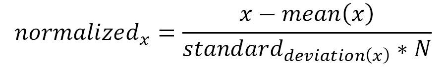
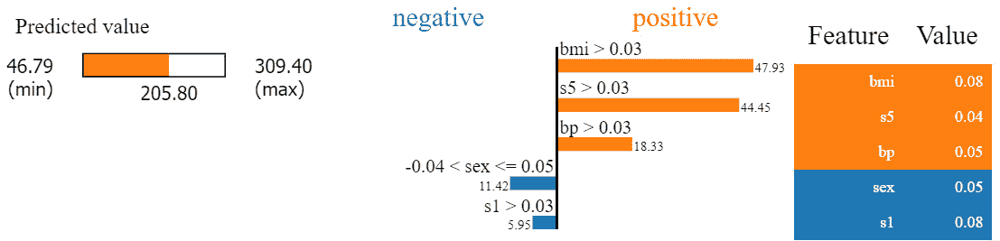
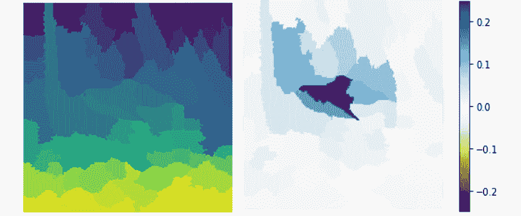
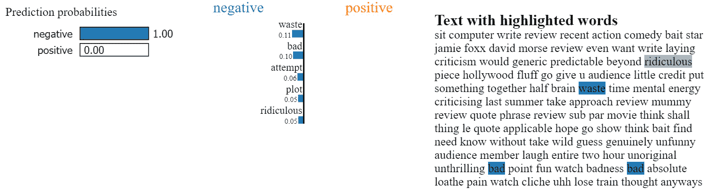

# *第五章*：在机器学习中实际使用 LIME

在阅读上一章之后，您现在应该对**局部可解释模型无关解释（LIME）**有很好的概念理解。我们看到了 LIME Python 框架如何解释分类问题的黑盒模型。我们还讨论了 LIME 框架的一些优缺点。在实践中，LIME 仍然是 XAI 框架中最受欢迎的之一，因为它可以轻松应用于表格数据集、文本数据集和图像数据集。LIME 可以为解决回归和分类问题提供模型无关的局部解释。

在本章中，您将更深入地了解如何在机器学习中使用 LIME 的实践。本章的主要讨论话题包括：

+   在表格数据上使用 LIME

+   使用 LIME 解释图像分类器

+   在文本数据上使用 LIME

+   LIME 用于生产级系统

# 技术要求

与上一章类似，本章非常技术性，包含 Python 和 Jupyter 笔记本中的代码讲解。对于本章，代码和数据集资源可以从 GitHub 仓库下载或克隆：[`github.com/PacktPublishing/Applied-Machine-Learning-Explainability-Techniques/tree/main/Chapter05`](https://github.com/PacktPublishing/Applied-Machine-Learning-Explainability-Techniques/tree/main/Chapter05)。与前面的章节一样，我们将使用 Python 和 Jupyter 笔记本来运行代码并生成必要的输出。所有其他相关细节都提供在笔记本中，我建议您在阅读章节内容的同时运行笔记本，以更好地理解所涵盖的主题。

# 在表格数据上使用 LIME

在*第四章*的*使用 LIME 解决分类问题的实际例子*部分，我们讨论了如何在 Python 中设置 LIME 以及如何使用 LIME 解释分类机器学习模型。*第四章**LIME 用于模型可解释性*中使用的教程数据集([`github.com/PacktPublishing/Applied-Machine-Learning-Explainability-Techniques/blob/main/Chapter04/Intro_to_LIME.ipynb`](https://github.com/PacktPublishing/Applied-Machine-Learning-Explainability-Techniques/blob/main/Chapter04/Intro_to_LIME.ipynb))是一个表格结构化数据。在本节中，我们将讨论如何使用 LIME 解释基于表格数据的回归模型。

## 设置 LIME

在开始代码讲解之前，我会要求您检查以下笔记本，[`github.com/PacktPublishing/Applied-Machine-Learning-Explainability-Techniques/blob/main/Chapter05/LIME_with_tabular_data.ipynb`](https://github.com/PacktPublishing/Applied-Machine-Learning-Explainability-Techniques/blob/main/Chapter05/LIME_with_tabular_data.ipynb)，其中已经包含了理解我们现在将要深入讨论的概念所需的步骤。我假设我们将用于本教程的大多数 Python 库已经安装在了您的系统上。但如果还没有安装，请运行以下命令来安装我们将要使用的 Python 库的升级版本：

```py
!pip install --upgrade pandas numpy matplotlib seaborn scikit-learn lime
```

## 关于数据集的讨论

对于本教程，我们将使用来自*scikit-learn datasets*的*Diabetes dataset*（[`scikit-learn.org/stable/datasets/toy_dataset.html#diabetes-dataset`](https://scikit-learn.org/stable/datasets/toy_dataset.html#diabetes-dataset)）。这个数据集用于预测糖尿病的*疾病进展水平*。它包含大约*442 个样本*和*10 个基线特征* – *年龄*，*性别*，*体重指数 (bmi)*，*平均血压 (bp)*，*总血清胆固醇 (s1)*，*低密度脂蛋白 (s2)*，*高密度脂蛋白 (s3)*，*总胆固醇 / HDL (s4)*，*可能的对血清甘油三酯水平的对数 (s5)*，以及*血糖水平 (s6)*。考虑到监测糖尿病进展的潜在问题是重要的实际问题，这个数据集既有趣又相关。

数据集中提供的特征变量已经通过将特征值围绕均值中心化并按标准差乘以样本数（N）进行缩放进行了归一化：



更多关于原始数据集的信息可以在[`www4.stat.ncsu.edu/~boos/var.select/diabetes.html`](https://www4.stat.ncsu.edu/~boos/var.select/diabetes.html)找到。

要加载数据集，只需执行以下代码行：

```py
from sklearn import datasets
```

```py
dataset = datasets.load_diabetes()
```

```py
features, labels = dataset.data, dataset.target
```

如果需要，您可以执行必要的 EDA 步骤，但由于我们的主要重点是使用 LIME 来解释黑盒模型，我们不会在本教程中花费太多精力在 EDA 上。

## 关于模型的讨论

如笔记本教程中所示，我们使用了一个**梯度提升回归器**（**GBR**）([`scikit-learn.org/stable/modules/generated/sklearn.ensemble.GradientBoostingRegressor.html`](https://scikit-learn.org/stable/modules/generated/sklearn.ensemble.GradientBoostingRegressor.html))模型来训练我们的预测模型。然而，任何回归机器学习算法都可以用来代替 GBR，因为 LIME 算法将模型本身视为任何黑盒模型。此外，当我们对未见过的数据进行模型评估时，我们观察到**平均绝对百分比误差（MAPE）**为 0.37，**均方误差（MSE）**为 2,538，以及**R 平方系数**评分为 0.6。所有这些结果都表明我们的模型并不很好，肯定还有改进的空间。因此，如果这样的模型在生产级系统中部署，最终利益相关者可能会提出许多问题，因为他们总是难以信任不准确模型。此外，如 GBR 之类的算法本身不具有可解释性，算法的复杂性取决于超参数，包括估计器的数量和树的深度。因此，模型可解释性框架如 LIME 不仅仅是附加步骤，而是构建机器学习模型过程中的必要部分。接下来，我们将看到 LIME 如何通过几行代码轻松地应用于解释黑盒回归模型。

## LIME 的应用

如我们在上一章中看到的，我们可以轻松使用以下命令支持 LIME 框架对表格数据的支持：

```py
import lime
```

```py
import lime.lime_tabular
```

一旦成功导入 LIME 模块，我们需要创建一个解释器对象：

```py
explainer = lime.lime_tabular.LimeTabularExplainer(
```

```py
    x_train, mode='regression',
```

```py
    class_names=['disease_progression'],
```

```py
    feature_names=dataset.feature_names)
```

然后，我们只需要获取数据实例并为其提供局部可解释性：

```py
exp = explainer.explain_instance(x_test[i], model.predict, 
```

```py
                                 num_features=5)
```

```py
exp.show_in_notebook(show_table=True)
```

我们将从前面的代码行中获得以下输出：



图 5.1 – 将 LIME 框架应用于在表格数据集上训练的回归模型时的输出可视化

*图 5.1*说明了 LIME 框架提供的基于可视化的解释。

接下来，让我们尝试理解*图 5.1*中的输出可视化在告诉我们什么：

+   *图 5.1*中最左侧的可视化显示了可能的值范围和模型预测结果的位置。直观地说，所有模型预测都应该位于最小值和最大可能值之间，因为这表明用户将当前预测与最佳和最坏情况值进行比较。

+   中间的可视化显示了哪些特征对预测结果偏高或偏低有贡献。考虑到我们对糖尿病的先验知识，较高的 BMI、升高的血压和血清甘油三酯水平确实表明疾病进展的增加。

+   *图 5.1*中最右侧的可视化显示了识别出的最重要的特征的实际局部数据值，按其相关性降序排列。

LIME 框架提供的解释在很大程度上是可由人类理解的，并且确实为我们提供了关于黑色盒模型用于预测的特征值对的指示。

因此，这就是我们如何仅用几行代码就能使用 LIME 来解释在表格数据上训练的黑色盒回归模型的方法。但是，正如我们在*第四章*中讨论的，“*LIME 模型可解释性*”部分下的“*潜在陷阱*”部分，LIME 提供的解释并不总是全面的，可能存在一些不一致性。这是我们都需要注意的事情。然而，LIME 的解释，结合彻底的 EDA、以数据为中心的 XAI、反事实解释和其他模型可解释性方法，可以为在表格数据集上训练的黑色盒模型提供强大而全面的解释性。

现在，让我们在下一节中探讨如何使用 LIME 来解释在非结构化数据上训练的分类器，例如图像。

# 使用 LIME 解释图像分类器

在上一节中，我们看到了如何轻松地将 LIME 应用于解释在表格数据上训练的模型。然而，解释在图像等非结构化数据上训练的复杂深度学习模型始终是主要挑战。通常，深度学习模型在图像数据上比传统的机器学习模型更有效率，因为这些模型具有执行*自动特征提取*的能力。它们可以提取复杂的*低级特征*，如*条纹*、*边缘*、*轮廓*、*角点*和*模式*，甚至*高级特征*，如*更大的形状*和*物体的某些部分*。这些高级特征通常被称为图像中的**感兴趣区域** **(RoI**)或**超像素**，因为它们是覆盖图像特定区域的像素集合。现在，低级特征不是人类可解释的，但高级特征是可解释的，因为任何非技术终端用户都会根据高级特征与图像相关联。LIME 也以类似的方式工作。算法试图突出图像中那些对模型决策过程产生积极或消极影响的超像素。所以，让我们看看 LIME 如何被用来解释图像分类器。

## 设置所需的 Python 模块

在我们开始代码讲解之前，请检查代码仓库中提供的笔记本：[`github.com/PacktPublishing/Applied-Machine-Learning-Explainability-Techniques/blob/main/Chapter05/LIME_with_image_data.ipynb`](https://github.com/PacktPublishing/Applied-Machine-Learning-Explainability-Techniques/blob/main/Chapter05/LIME_with_image_data.ipynb)。该笔记本包含了实际应用这些概念所需的必要细节。在本节中，我将为您讲解代码，并解释笔记本教程中涵盖的所有步骤。如果尚未安装，请使用以下命令安装 Python 库的升级版本：

```py
!pip install --upgrade pandas numpy matplotlib seaborn tensorflow lime scikit-image
```

接下来，让我们讨论本例中使用的模型。

## 使用预训练的 TensorFlow 模型作为我们的黑盒模型

对于这个教程，我们使用了一个*预训练的 TensorFlow Keras Xception 模型*作为我们的黑盒模型。该模型在 ImageNet 数据集([`www.image-net.org/`](https://www.image-net.org/))上进行了预训练，这是图像分类中最受欢迎的基准数据集之一。可以使用以下代码行加载预训练模型：

```py
from tensorflow.keras.applications.xception import Xception
```

```py
model = Xception(weights="imagenet")
```

为了使用任何推理数据进行图像分类，我们还需要执行必要的预处理步骤。请参阅[`github.com/PacktPublishing/Applied-Machine-Learning-Explainability-Techniques/blob/main/Chapter05/LIME_with_image_data`](https://github.com/PacktPublishing/Applied-Machine-Learning-Explainability-Techniques/blob/main/Chapter05/LIME_with_image_data).ipynb 中的必要预处理方法。

## LIME 图像解释器的应用

在本小节中，我们将看到如何使用 LIME 框架来识别模型用于预测特定结果的图像中的*超像素*或区域。我们首先需要定义一个图像`explainer`对象：

```py
explainer = lime_image.LimeImageExplainer()
```

接下来，我们需要将推理数据（`normalized_img[0]`）传递给`explainer`对象，并使用 LIME 框架突出显示对模型预测有最大正负影响的超像素：

```py
exp = explainer.explain_instance(normalized_img[0], 
```

```py
                                 model.predict, 
```

```py
                                 top_labels=5, 
```

```py
                                 hide_color=0, 
```

```py
                                 num_samples=1000)
```

```py
image, mask = exp.get_image_and_mask(exp_class, 
```

```py
                                     positive_only=False,
```

```py
                                     num_features=6,
```

```py
                                     hide_rest=False,
```

```py
                                     min_weight=0.01)
```

```py
plt.imshow(mark_boundaries(image, mask))
```

```py
plt.axis('off')
```

```py
plt.show()
```

作为前面代码行的输出，我们将得到图像中某些突出显示的部分，这些部分以正负两种方式对模型的预测有贡献：


图 5.2 – (左) 原始推理图像。(中) 最重要的图像超像素。(右) 在原始数据上叠加的绿色掩码超像素图像

在*图 5.2*中，最左侧的图像被用作推理图像。当训练模型应用于推理图像时，模型的最高预测是*虎鲨*。

预测实际上是正确的。然而，为了解释模型，LIME 算法可以突出对预测影响最大的超像素。从*图 5.2*的中间和最右侧的图像中，我们可以看到黑盒模型实际上是很好且值得信赖的，因为 LIME 算法捕获的相关超像素表明存在虎鲨。

LIME 算法估计的超像素可以使用以下代码行显示：

```py
plt.imshow(exp.segments)
```

```py
plt.axis('off')
```

```py
plt.show()
```

我们还可以形成一个热力图，突出每个超像素的重要性，这使我们进一步了解黑盒模型的工作原理：

```py
dict_heatmap = dict(exp.local_exp[exp.top_labels[0]])
```

```py
heatmap = np.vectorize(dict_heatmap.get)(exp.segments) 
```

```py
plt.imshow(heatmap, cmap = 'RdBu', vmin  = -heatmap.max(),
```

```py
           vmax = heatmap.max())
```

```py
plt.colorbar()
```

```py
plt.show()
```

获得的输出显示在*图 5.3*中：



图 5.3 – (左) LIME 算法选取的所有超像素的图像。(右) 根据模型预测的重要性对超像素的热力图

*图 5.3*中的热力图为我们提供了一些关于重要超像素的见解，对于任何非技术用户解释任何黑盒模型来说也很容易。

因此，我们已经看到 LIME 如何仅用几行代码就能解释在图像数据上训练的复杂深度学习模型。我发现 LIME 是可视化解释基于深度学习的图像分类器最有效的算法之一，无需展示任何复杂的统计或数值或复杂的图形可视化。与表格数据不同，我觉得提供给图像分类器的解释更加稳健、稳定且易于人类理解。这绝对是我最喜欢的解释图像分类器的方法之一，在将任何图像分类模型投入生产之前，我强烈建议应用 LIME 作为一个额外的评估步骤，以增强对训练模型的信心。

在下一节中，让我们探索在文本数据上训练的 LIME。

# 在文本数据上使用 LIME

在前一节中，我们讨论了 LIME 是如何成为解释在图像数据集上训练的复杂黑盒模型的有效方法。与图像一样，文本也是一种非结构化数据，这与结构化的表格数据有很大不同。解释在非结构化数据上训练的黑盒模型始终是非常具有挑战性的。但 LIME 也可以应用于在文本数据上训练的模型。

使用 LIME 算法，我们可以分析特定单词或单词组的存在是否会增加预测特定结果的可能性。换句话说，LIME 有助于突出影响模型结果向特定类别发展的文本标记或单词的重要性。在本节中，我们将看到如何使用 LIME 来解释文本分类器。

## 安装所需的 Python 模块

与之前的教程一样，完整的笔记本教程可在[`github.com/PacktPublishing/Applied-Machine-Learning-Explainability-Techniques/blob/main/Chapter05/LIME_with_text_data.ipynb`](https://github.com/PacktPublishing/Applied-Machine-Learning-Explainability-Techniques/blob/main/Chapter05/LIME_with_text_data.ipynb)找到。尽管运行笔记本所需的必要说明已在笔记本本身中清楚地记录，类似于之前的教程，我仍将提供必要的细节来指导你完成实现。使用以下命令，你可以安装运行代码所需的模块：

```py
!pip install --upgrade pandas numpy matplotlib seaborn scikit-learn nltk lime xgboost swifter
```

对于底层数据集上的文本相关操作，我主要将使用 NLTK Python 框架。因此，你需要通过执行以下命令下载某些`nltk`模块：

```py
nltk.download('stopwords')
```

```py
nltk.download('wordnet')
```

```py
nltk.download('punkt')
```

```py
nltk.download('averaged_perceptron_tagger')
```

在教程中，我们将尝试解释一个设计用于执行情感分析的文本分类器，该分类器通过将文本数据分类为正面和负面类别来执行情感分析。

## 关于用于训练模型的训练集的讨论

在本教程中，我们使用了包含*电影评论*的**情感极性数据集 v2.0**，用于从文本数据中进行情感分析。该数据集包含大约 1,000 个正面和负面电影评论样本。有关数据集的更多信息可以在源网站上找到：[`www.cs.cornell.edu/people/pabo/movie-review-data/`](https://www.cs.cornell.edu/people/pabo/movie-review-data/)。该数据集也提供在本章的 GitHub 仓库中：[`github.com/PacktPublishing/Applied-Machine-Learning-Explainability-Techniques/tree/main/Chapter05`](https://github.com/PacktPublishing/Applied-Machine-Learning-Explainability-Techniques/tree/main/Chapter05)。

情感极性数据集 v2.0

这份数据最初被用于 Bo Pang 和 Lillian Lee 的论文，“情感教育：基于最小割的基于主观性的情感分析”，ACL 会议论文集，2004 年。

## 关于文本分类模型的讨论

与之前的图像分类器教程不同，我们没有使用预训练模型。我们从头开始训练了一个**XGBoost 分类器**([`xgboost.readthedocs.io/en/stable/`](https://xgboost.readthedocs.io/en/stable/))，包括笔记本中涵盖的必要的数据预处理、准备和特征提取步骤。XGBoost 是一种集成学习提升算法，本质上不可解释。因此，我们将它视为我们的黑盒文本分类模型。我们并不专注于通过必要的超参数调整来提高模型的准确性，因为 LIME 是完全模型无关的。对于本教程，我们创建了一个 scikit-learn 管道，首先使用**TFIDF 向量器**（https://scikit-learn.org/stable/modules/generated/sklearn.feature_extraction.text.TfidfVectorizer.html）进行特征提取，然后应用训练好的模型：

```py
model_pipeline = make_pipeline(tfidf, model)
```

在下一小节中，我们将看到如何轻松地将 LIME 框架应用于文本数据。

## 应用 LIME 文本解释器

就像之前关于图像和表格数据的教程一样，使用文本数据应用 LIME 也非常简单，只需几行代码。现在，我们将定义 LIME `解释器` 对象：

```py
from lime.lime_text import LimeTextExplainer
```

```py
explainer = LimeTextExplainer(class_names=['negative', 'positive'])
```

然后，我们将使用推理数据实例为该特定数据实例提供局部可解释性：

```py
exp = explainer.explain_instance(x_test_df[idx], model_pipeline.predict_proba, num_features=5)
```

```py
exp.show_in_notebook()
```

就这样！仅仅几行代码，我们就能解释基于 TFIDF 数值特征的文本分类器，但解释性是以人类可解释的视角提供的，即突出那些可以积极或消极影响模型结果的关键词。以这种方式解释文本模型的工作原理，对于任何非技术用户来说都更容易理解，而不是使用数值编码的特征来提供解释。

现在，让我们看看 LIME 应用于文本数据时提供的输出可视化。



图 5.4 – 应用 LIME 到文本分类器时的输出可视化

在*图 5.4*中，我们可以看到当 LIME 应用于文本数据时的输出可视化。

输出可视化与我们观察到的表格数据非常相似。它显示了*预测概率*，这可以用作*模型置信度*分数。算法突出了决定模型结果的最具影响力的关键词，并带有特征重要性分数。例如，从*图 5.4*中，我们可以看到推理数据实例被模型预测为负面（正如在笔记本中演示的那样，预测是正确的）。存在诸如*waste*、*bad*和*ridiculous*等词语确实表明了*负面评论*。这对于人类解释也是可行的，因为如果你要求一个非技术用户解释为什么评论被分类为负面，用户可能会提到在负面评论中频繁使用的词语或在具有负面语调的句子中使用的词语。

因此，我们可以看到 LIME 可以轻松地应用于文本分类器。即使在文本数据中，该算法简单而有效，能够提供人类可解释的解释。我肯定会推荐使用 LIME 来解释黑盒文本分类器，作为额外的模型评估或质量检查步骤。

但到目前为止，我们只看到了 LIME Python 框架在 Jupyter 笔记本环境中的应用。你可能立即会问一个问题——*我们能否将 LIME 扩展到用于生产级系统？* 让我们在下一节中找出答案。

# LIME 用于生产级系统

对于上一节末尾提出的问题的简短回答是*是的*。由于以下主要原因，LIME 肯定可以扩展到用于生产级系统：

+   **最小化实现复杂性**：LIME Python 框架的 API 结构简洁且结构良好。这使得我们只需几行代码就能添加模型可解释性。为了向推理数据实例提供局部可解释性，LIME 算法的运行时复杂度非常低，因此这种方法也可以用于实时应用。

+   **易于与其他软件应用集成**：框架的 API 结构是模块化的。对于消费可解释性结果，我们不需要完全依赖于框架提供的内置可视化。我们可以利用原始的可解释性结果，创建我们自己的自定义可视化仪表板或报告。此外，我们可以创建自定义 Web API 方法，并在远程云服务器上托管这些 Web API，创建我们自己的基于云的模型可解释性服务，该服务可以轻松与其他软件应用集成。我们将在*第十章*中更详细地介绍这一点，*XAI 行业最佳实践*。

+   **不需要大量计算资源**：LIME 框架与低计算资源很好地协同工作。对于实时应用，使用的算法需要非常快，并且应该能够在低计算资源上运行，否则用户体验会受到负面影响。

+   **易于设置和打包**：正如我们在运行教程笔记本之前所看到的，LIME 非常容易设置，并且不依赖于难以安装的包。同样，任何使用 LIME 的 Python 程序都很容易打包或**容器化**。大多数生产级系统都有自动化的 CI/CD 管道来创建**Docker 容器**（https://www.docker.com/resources/what-container），这些容器部署在生产级系统上。使用 LIME 框架容器化 Python 程序所需的工程工作量很低，因此很容易将此类软件应用程序投入生产。

这些是 LIME 成为工业应用中首选模型可解释性方法的关键原因，尽管它有一些众所周知的缺陷。

# 摘要

在本章中，我们讨论了 LIME Python 框架在不同类型数据集上的实际应用。本章涵盖的教程只是起点，我强烈建议您尝试在其他数据集上使用 LIME 可解释性。我们还讨论了为什么 LIME 非常适合生产级机器学习系统。

在下一章中，我们将讨论另一个非常流行的可解释人工智能 Python 框架，称为**SHAP**，它甚至考虑了多个特征在影响模型结果时的集体贡献。

# 参考文献

请参考以下资源以获取更多信息：

+   《“我应该信任你吗？”解释任何分类器的预测》，作者：*Ribeiro 等人*：[`arxiv.org/pdf/1602.04938.pdf`](https://arxiv.org/pdf/1602.04938.pdf)

+   *本地可解释模型无关解释（LIME）：简介*：[`www.oreilly.com/content/introduction-to-local-interpretable-model-agnostic-explanations-lime/`](https://www.oreilly.com/content/introduction-to-local-interpretable-model-agnostic-explanations-lime/)

+   *LIME GitHub 项目*：[`github.com/marcotcr/lime`](https://github.com/marcotcr/lime)

+   *Docker 博客*：[`www.docker.com/blog/`](https://www.docker.com/blog/)
