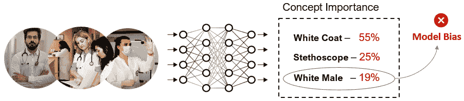
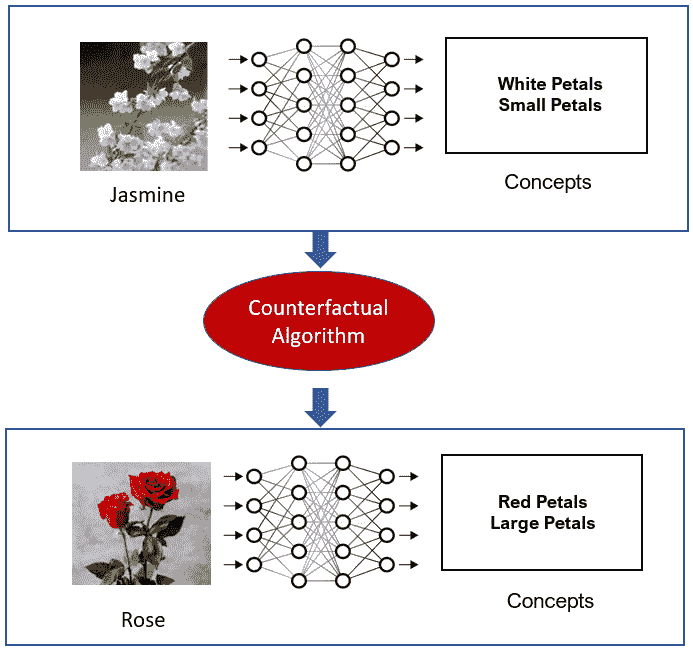

# *第八章*：使用 TCAV 进行人性化解释

在前几章中，我们广泛讨论了**LIME**和**SHAP**。您也看到了将 LIME 和 SHAP 的 Python 框架应用于解释黑盒模型的实际应用方面。这两个框架的一个主要局限性是，解释方法与非技术性最终用户解释观察结果的方式并不极端一致和直观。例如，如果您有一张装满可乐的玻璃杯的图片，并使用 LIME 和 SHAP 来解释用于正确分类图片为可乐的黑盒模型，LIME 和 SHAP 都会突出显示图片中导致训练模型做出正确预测的区域。但如果你要求一个非技术用户描述这张图片，用户会因为玻璃杯中存在类似可乐饮料的深色碳酸饮料而将其归类为可乐。换句话说，人类倾向于将任何观察与已知的概念联系起来以解释它。

**使用概念激活向量（TCAV）**进行**测试**，这是由**Google AI**提出的，在用已知**人类概念**解释模型预测方面也采取了类似的方法。因此，在本章中，我们将介绍如何使用 TCAV 提供基于概念的人性化解释。与 LIME 和 SHAP 不同，TCAV 超越了**特征归因**，并涉及诸如**颜色**、**性别**、**种族**、**形状**、**任何已知对象**或**抽象想法**等概念来解释模型预测。在本章中，我们将讨论 TCAV 算法的工作原理。我将介绍该框架的一些优缺点。我们还将讨论使用此框架进行实际问题解决。在*第二章*的*模型可解释性方法*部分，在*基于表示的解释*中，您已经接触到了 TCAV，但本章我们将涵盖以下主题：

+   直观理解 TCAV

+   探索 TCAV 的实际应用

+   优点和局限性

+   基于概念解释的潜在应用

现在是时候开始行动了！

# 技术要求

此代码教程和必需的资源可以从本章的 GitHub 仓库[`github.com/PacktPublishing/Applied-Machine-Learning-Explainability-Techniques/tree/main/Chapter08`](https://github.com/PacktPublishing/Applied-Machine-Learning-Explainability-Techniques/tree/main/Chapter08)下载或克隆。与其他章节类似，Python 和 Jupyter 笔记本用于实现本章涵盖的理论概念的实际应用。然而，我建议您在阅读完本章后再运行笔记本，以便更好地理解。

# 直观理解 TCAV

TCAV 的概念最初由*Kim 等人*在其工作中提出 – *超越特征归因的解释性：使用概念激活向量（TCAV）的定量测试* ([`arxiv.org/pdf/1711.11279.pdf`](https://arxiv.org/pdf/1711.11279.pdf))。该框架旨在提供超越特征归因的解释性，特别是对于依赖于低级转换特征且这些特征对人类不可解释的深度学习模型。TCAV 旨在使用抽象的、高级的、对人类友好的概念来解释深度学习模型的内部状态。在本节中，我将向您展示对 TCAV 的直观理解，并解释它是如何提供对人类友好的解释的。

## 什么是 TCAV？

到目前为止，我们已经介绍了许多通过基于特征的方法解释机器学习模型的方法和框架。但您可能会想到，由于大多数机器学习模型在低级特征上运行，基于特征的解释方法可能会突出那些对没有数据科学和机器学习技术背景的最终用户来说没有用的特征。例如，在解释图像分类器时，图像中的像素强度值或像素坐标可能对没有技术背景的最终用户来说没有用。因此，这些特征不是用户友好的。此外，基于特征的解释总是受限于特征的选择和数据集中存在的特征数量。在所有由基于特征的解释方法选择的特征中，最终用户可能对算法未选择的某个特定特征感兴趣。

因此，而不是这种方法，基于概念的方法提供了一种更广泛的抽象，它对人类友好且更相关，因为解释是以高级概念的重要性为依据提供的。所以，**TCAV**是 Google AI 的一个模型可解释性框架，它在实践中实现了基于概念解释方法的想法。该算法依赖于**概念激活向量（CAV**），它使用对人类友好的概念来解释机器学习模型的内部状态。在更技术性的意义上，TCAV 使用方向导数来量化对模型预测的人类友好、高级概念的重要性。例如，在描述发型时，TCAV 可以使用诸如*卷发*、*直发*或*发色*等概念。这些用户定义的概念不是算法在训练过程中使用的输入特征集。

下图说明了 TCAV 解决的关键问题：

![图 8.1 – TCAV 帮助我们通过神经网络对用户定义的概念进行图像分类，解决该概念重要性的关键问题

![img/B18216_08_001.jpg]

图 8.1 – TCAV 帮助我们通过神经网络对用户定义的概念进行图像分类，解决该概念重要性的关键问题

在下一节中，让我们尝试理解使用抽象概念进行模型解释的想法。

## 使用抽象概念进行解释

到目前为止，你可能已经对使用抽象概念提供解释的方法有了直观的理解。但为什么你认为这是一种有效的方法呢？让我们再举一个例子。假设你正在构建一个基于深度学习的图像分类器，用于从图像中检测医生。在应用 TCAV 之后，比如说，你发现*概念重要性*最高的概念是*白人男性*，其次是*听诊器*和*白大褂*。*听诊器*和*白大褂*的概念重要性是可以预料的，但*白人男性*概念的高重要性表明数据集存在偏见。因此，TCAV 可以帮助评估训练模型中的**公平性**。

实际上，CAV 的目标是估计一个概念（如颜色、性别和种族）对于训练模型预测的重要性，即使这些*概念*在模型训练过程中没有被使用。这是因为 TCAV 从几个示例样本中学习*概念*。例如，为了学习一个*性别*概念，TCAV 需要一些具有*男性*概念的样本和一些*非男性*的例子。因此，TCAV 可以定量地估计训练模型对该类别的特定*概念*的敏感性。为了生成解释，TCAV 会扰动数据点，使其向与人类相关的*概念*靠近，因此它是一种**全局扰动方法**。接下来，让我们尝试了解 TCAV 的主要目标。

## TCAV 的目标

我认为 TCAV 的方法与其他解释方法相比非常独特。其中一个主要原因是，这个框架的开发者确立了与我自己的对人类友好解释的理解相呼应的明确目标。以下是 TCAV 确立的目标：

+   **可访问性**：TCAV 的开发者希望这种方法对任何最终用户都是可访问的，无论他们是否了解机器学习或数据科学。

+   **定制性**：该框架可以适应任何用户定义的概念。这不仅仅限于训练过程中考虑的概念。

+   **插件就绪性**：开发者希望这种方法能够在不重新训练或微调训练的机器学习模型的情况下工作。

+   **全局可解释性**：TCAV 可以通过一个单一的定量指标来解释整个类别或数据集的多个样本。它不仅限于数据实例的局部可解释性。

现在我们已经了解了使用 TCAV 可以取得什么成果，让我们来讨论 TCAV 工作的一般方法。

## TCAV 的方法

在本节中，我们将更深入地探讨 TCAV 的工作原理。该算法的整体工作原理可以总结为以下方法：

+   将方向导数应用于定量估计训练的机器学习模型对各种用户定义概念的预测敏感性。

+   计算最终的定量解释，称为**TCAVq 度量**，而无需重新训练或微调模型。这个度量是每个概念对每个模型预测类别的相对重要性。

现在，我将尝试进一步简化 TCAV 的方法，而不使用过多的数学概念。假设我们有一个从图像中识别斑马的模型。要应用 TCAV，可以采取以下方法：

1.  **定义感兴趣的概念**：第一步是考虑感兴趣的概念。对于我们的斑马分类器，我们既可以有一个代表该概念的给定示例集（例如，黑色条纹对于识别斑马很重要）或者我们可以有一个带有概念标签的独立数据集。这一步骤的主要好处是它不会限制算法使用模型使用的特征。即使是非技术用户或领域专家也可以根据他们现有的知识来定义概念。

1.  **学习概念激活向量**：算法试图通过训练一个线性分类器来区分由概念实例生成的激活和任何层中存在的实例的激活，从而在学习层的激活空间中学习一个向量。因此，**CAV**被定义为将具有概念和没有概念的实例在模型激活中分离的超平面的正交投影。对于我们的斑马分类器，CAVs 有助于区分表示*黑色条纹*和表示不表示*黑色条纹*的表示。

1.  **估计方向导数**：方向导数用于量化模型预测对概念的敏感性。因此，对于我们的斑马分类器，方向导数帮助我们测量*黑色条纹*表示在预测斑马中的重要性。与使用每个像素显著性的显著性图不同，方向导数是在整个数据集或一组输入上计算的，但针对特定概念。这有助于提供一个全局的解释视角。

1.  **估计 TCAV 分数**：为了量化特定类别的概念重要性，计算 TCAV 分数（**TCAVq**）。这个指标有助于衡量定义的概念对模型特定激活层的影响，无论是正面的还是负面的。

1.  **CAV 验证**：CAV 可以从随机选择的数据中生成。但不幸的是，这可能不会产生有意义的概念。因此，为了提高生成的概念，TCAV 通过从不同的数据批次中寻找概念进行多次迭代，而不是在单个数据批次上一次性训练 CAV。然后，使用**双尾 t 检验**进行**统计显著性测试**，以选择具有统计显著性的概念。还执行了必要的校正，如**Bonferroni 校正**，以控制假发现率。

因此，我们已经介绍了 TCAV 算法的直观工作原理。接下来，让我们看看 TCAV 如何在实践中实际应用。

# 探索 TCAV 的实际应用

在本节中，我们将探讨 TCAV 在解释预训练图像解释器时，如何应用于概念重要性的实际应用。整个笔记本教程可在本章代码库中找到，地址为[`github.com/PacktPublishing/Applied-Machine-Learning-Explainability-Techniques/blob/main/Chapter08/Intro_to_TCAV.ipynb`](https://github.com/PacktPublishing/Applied-Machine-Learning-Explainability-Techniques/blob/main/Chapter08/Intro_to_TCAV.ipynb)。本教程基于 TCAV 原始 GitHub 项目仓库中提供的笔记本[`github.com/tensorflow/tcav`](https://github.com/tensorflow/tcav)。我建议您都参考 TCAV 的主要项目仓库，因为实现上的功劳应归于 TCAV 的开发者和贡献者。

在本教程中，我们将介绍如何将 TCAV 应用于验证“条纹”概念相对于“蜂窝”图案在识别老虎方面的概念重要性。以下图像展示了 TCAV 使用简单可视化来确定概念重要性的方法流程：

![Figure 8.2 – 使用 TCAV 估计老虎图像分类器中条纹的概念重要性

![img/B18216_08_002.jpg]

图 8.2 – 使用 TCAV 估计老虎图像分类器中条纹的概念重要性

让我们先设置我们的 Jupyter 笔记本。

## 开始

与前几章中涵盖的其他教程示例类似，为了安装运行笔记本所需的 Python 模块，您可以在 Jupyter 笔记本中使用`pip install`命令：

```py
!pip install --upgrade pandas numpy matplotlib tensorflow tcav
```

您可以导入所有模块以验证这些框架的成功安装：

```py
import tensorflow as tf
```

```py
import tcav
```

接下来，让我们看看我们将要处理的数据。

## 关于数据

我觉得在 TCAV 原始项目仓库中提供的数据准备过程稍微有些耗时。因此，我已经准备了必要的数据集，您可以从这个项目仓库中参考。由于我们将验证“条纹”概念对于老虎图像的重要性，我们需要一个老虎图像数据集。数据来自 ImageNet 收集，并在项目仓库[`github.com/PacktPublishing/Applied-Machine-Learning-Explainability-Techniques/tree/main/Chapter08/images/tiger`](https://github.com/PacktPublishing/Applied-Machine-Learning-Explainability-Techniques/tree/main/Chapter08/images/tiger)中提供。这些图像是随机精选和收集的，使用了 TCAV 仓库中提供的*数据收集脚本*[`github.com/tensorflow/tcav/tree/master/tcav/tcav_examples/image_models/imagenet`](https://github.com/tensorflow/tcav/tree/master/tcav/tcav_examples/image_models/imagenet)。

为了运行 TCAV，你需要准备必要的*概念图像*、*目标类图像*和*随机数据集图像*。对于这个教程，我已从*Broden 数据集*（[`netdissect.csail.mit.edu/data/broden1_224.zip`](http://netdissect.csail.mit.edu/data/broden1_224.zip)）中准备了概念图像，正如主项目示例中所建议的。请查阅创建此数据集的研究工作：[`github.com/CSAILVision/NetDissect`](https://github.com/CSAILVision/NetDissect)。你还可以探索在[`github.com/PacktPublishing/Applied-Machine-Learning-Explainability-Techniques/tree/main/Chapter08/concepts/broden_concepts`](https://github.com/PacktPublishing/Applied-Machine-Learning-Explainability-Techniques/tree/main/Chapter08/concepts/broden_concepts)提供的*Broden 数据集纹理图像*，以了解更多信息。我建议你尝试其他概念或其他图像，并围绕基于 TCAV 的概念重要性进行实验！

Broden 数据集

*David Bau*、Bolei Zhou*、Aditya Khosla、Aude Oliva 和 Antonio Torralba。网络剖析：量化深度视觉表示的可解释性。计算机视觉和模式识别（CVPR），2017。

由于 TCAV 还需要一些随机数据集来确保从目标图像示例中学习到的概念统计意义的显著性，我在项目仓库中提供了一些示例随机图像，从而简化了教程笔记本的运行！但就像往常一样，你也应该尝试其他随机图像示例。这些随机图像也是使用主项目中提供的图像获取脚本收集的：[`github.com/tensorflow/tcav/blob/master/tcav/tcav_examples/image_models/imagenet/download_and_make_datasets.py`](https://github.com/tensorflow/tcav/blob/master/tcav/tcav_examples/image_models/imagenet/download_and_make_datasets.py)。

要进一步进行，你需要定义目标类和概念的变量：

```py
target = 'tiger'  
```

```py
concepts = ['honeycombed', 'striped'] 
```

你还可以创建必要的路径和目录来存储笔记本教程中提到的生成的激活和 CAVs。接下来，让我们讨论这个示例中使用的模型。

## 关于所使用的深度学习模型的讨论

在这个示例中，我们将使用预训练的深度学习模型来强调即使 TCAV 被认为是一种特定于模型的方案，因为它仅适用于神经网络，但它并不对网络架构做出假设，可以很好地与大多数深度神经网络模型协同工作。

对于这个例子，我们将使用基于 ImageNet 数据集的预训练 GoogleNet 模型，[`paperswithcode.com/method/googlenet`](https://paperswithcode.com/method/googlenet)。模型文件在代码仓库中提供：[`github.com/PacktPublishing/Applied-Machine-Learning-Explainability-Techniques/tree/main/Chapter08/models/inception5h`](https://github.com/PacktPublishing/Applied-Machine-Learning-Explainability-Techniques/tree/main/Chapter08/models/inception5h)。您可以使用以下代码行加载训练好的模型：

```py
model_to_run = 'GoogleNet'
```

```py
sess = utils.create_session()
```

```py
GRAPH_PATH = "models/inception5h/tensorflow_inception_graph.pb"
```

```py
LABEL_PATH = "models/inception5h/imagenet_comp_graph_label_strings.txt"
```

```py
trained_model = model.GoogleNetWrapper_public(sess,
```

```py
                                              GRAPH_PATH,
```

```py
                                              LABEL_PATH)
```

模型包装器实际上用于获取训练模型的内部状态和张量。概念重要性实际上是基于内部神经元激活计算的，因此，这个模型包装器很重要。有关内部 API 工作原理的更多详细信息，请参阅以下链接：[`github.com/tensorflow/tcav/blob/master/Run_TCAV_on_colab.ipynb`](https://github.com/tensorflow/tcav/blob/master/Run_TCAV_on_colab.ipynb)。

接下来，我们需要使用`ImageActivationGenerator`方法生成概念激活：

```py
act_generator = act_gen.ImageActivationGenerator(
```

```py
    trained_model, source_dir, activation_dir, 
```

```py
    max_examples=100)
```

接下来，我们将使用 TCAV 来探索模型的可解释性。

## 使用 TCAV 进行模型可解释性

如前所述，TCAV 目前用于解释神经网络及其神经网络内部层。因此，它不是模型无关的，而是一种以模型为中心的可解释性方法。这要求我们定义网络的瓶颈层：

```py
bottlenecks = [ 'mixed4c']
```

下一步将是应用 TCAV 算法来创建概念激活向量。此过程还包括使用目标类概念重要性和随机样本之间的双尾 t 检验进行统计显著性测试：

```py
num_random_exp= 15
```

```py
mytcav = tcav.TCAV(sess,
```

```py
                   target,
```

```py
                   concepts,
```

```py
                   bottlenecks,
```

```py
                   act_generator,
```

```py
                   [0.1],
```

```py
                   cav_dir=cav_dir,
```

```py
                   num_random_exp=num_random_exp)
```

TCAV 论文中提到的原始实验，[`arxiv.org/abs/1711.11279`](https://arxiv.org/abs/1711.11279)，提到至少使用 500 次随机实验来识别具有统计显著性的概念。但为了简化，并实现更快的结果，我们正在使用 15 次随机实验。您也可以尝试更多的随机实验。

最后，我们可以获取结果并可视化概念重要性：

```py
results = mytcav.run(run_parallel=False)
```

```py
utils_plot.plot_results(results,
```

```py
                        num_random_exp=num_random_exp)
```

这将生成以下图表，帮助我们比较概念的重要性：

![Figure 8.3 – TCAV concept importance of the concepts of striped and honeycombed]

用于识别老虎图像

![img/B18216_08_003.jpg]

图 8.3 – 用于识别老虎图像的条纹和蜂窝状概念的概念重要性

如您从*图 8.3*中观察到的，对于识别*老虎*，*条纹*概念的概念重要性显著高于*蜂窝状*概念。

现在我们已经涵盖了实际应用部分，让我给你一个类似的挑战作为练习。你现在能否使用 ImageNet 数据集，并确定“水”对“船只”以及“云”或“天空”对“飞机”的概念的重要性？这将帮助你更深入地理解这个概念，并增强你应用 TCAV 的信心。接下来，我们将讨论 TCAV 的一些优势和局限性。

# 优势和局限性

在上一节中，我们讨论了 TCAV 的实际应用方面。TCAV 确实是一种解释复杂深度学习模型非常有趣且新颖的方法。尽管它有很多优势，但不幸的是，我在当前框架中确实发现了一些局限性，这些局限性在修订版本中肯定可以改进。

## 优势

让我们先讨论以下优势：

+   正如你在第四章中之前看到的 LIME 框架一样，*LIME 用于模型可解释性*（使用**全局扰动方法**生成解释），对于同一类别的两个数据实例可能会有相互矛盾的解释。尽管 TCAV 也是一种全局扰动方法，但与 LIME 不同，TCAV 生成的解释不仅对单个数据实例是真实的，而且对整个类别也是真实的。这是 TCAV 相对于 LIME 的一个主要优势，这增加了用户对解释方法的信任。

+   基于概念的解释更接近人类解释未知观察的方式，而不是 LIME 和 SHAP 采用的基于特征的解释。因此，TCAV 生成的解释确实更符合人性。

+   基于特征的解释仅限于模型中使用的特征。为了引入任何新的特征以实现模型可解释性，我们需要重新训练模型，而基于概念的解释则更加灵活，并且不受模型训练期间使用的特征的限制。要引入一个新概念，我们不需要重新训练模型。此外，在引入概念时，你不必了解任何关于机器学习（ML）的知识。你只需要创建必要的数据集来生成概念。

+   模型可解释性不是 TCAV 的唯一好处。TCAV 可以帮助检测训练过程中的问题，例如**不平衡数据集**导致**相对于多数类的数据集**中的**偏差**。实际上，概念重要性可以用作**指标**来比较模型。例如，假设你正在使用*VGG19*模型和*ResNet50*模型。假设这两个模型具有相似的准确性和模型性能，但与 ResNet50 模型相比，用户定义的概念的重要性对于 VGG19 模型要高得多。在这种情况下，使用 VGG19 模型比使用 ResNet50 模型更好。因此，TCAV 可以用来改进模型训练过程。

这些是 TCAV 的一些独特优势，使其比 LIME 和 SHAP 更符合人性。接下来，让我们讨论一下 TCAV 的一些已知局限性。

## 局限性

以下是一些已知 TCAV 方法的缺点：

+   目前，使用 TCAV 进行概念解释的方法仅限于神经网络。为了增加其采用率，TCAV 需要一个可以与*经典机器学习算法*（如*决策树*、*支持向量机*和*集成学习算法*）一起工作的实现。LIME 和 SHAP 都可以应用于经典机器学习算法来解决标准机器学习问题，这也是为什么 LIME 和 SHAP 有更多采用的原因。同样，在文本数据方面，TCAV 的应用也非常有限。

TCAV 非常容易受到*第三章*中讨论的*数据漂移*、*对抗性影响*和其他数据质量问题的影响，“数据为中心的方法”。如果您使用 TCAV，您需要确保训练数据、推理数据和甚至概念数据具有相似的统计特性。否则，由于噪声或数据不纯问题，生成的概念可能会受到影响：

+   *Guillaume Alain* 和 *Yoshua Bengio* 在他们的论文 *Understanding intermediate layers using linear classifier probes* ([`arxiv.org/abs/1610.01644`](https://arxiv.org/abs/1610.01644)) 中，表达了对将 TCAV 应用于较浅层神经网络的担忧。许多类似的研究论文都建议，与较浅层网络中的概念相比，深层网络中的概念更具可分性，因此 TCAV 的使用主要限于深度神经网络。

+   准备一个概念数据集可能是一项具有挑战性和昂贵的任务。尽管您不需要机器学习知识来准备概念数据集，但在实践中，您也不期望任何普通用户花费时间创建任何定制用户定义概念的有标注概念数据集。

+   我觉得 TCAV 的 Python 框架在使用于任何生产级系统之前还需要进一步改进。在我看来，在撰写本章时，这个框架需要进一步成熟，以便可以轻松地与任何生产级机器学习系统一起使用。

我认为所有这些限制都可以解决，使 TCAV 成为一个更加稳健的框架，被广泛采用。如果您感兴趣，您也可以联系 TCAV 框架的作者和开发者，为开源社区做出贡献！在下一节中，让我们讨论一些基于概念解释的潜在应用。

# 基于概念解释的潜在应用

我确实看到了基于概念的解释，如 TCAV 的巨大潜力！在本节中，您将接触到一些基于概念解释的潜在应用，这些可能成为整个 AI 社区的重要研究课题，具体如下：

+   **AI 中透明度和公平性的估计**：大多数针对黑盒 AI 模型的监管担忧都与性别、颜色和种族等概念相关。基于概念的解释实际上可以帮助估计 AI 算法在这些抽象概念方面是否公平。检测 AI 模型的偏差实际上可以提高其透明度，并有助于解决某些监管问题。例如，在医生使用深度学习模型的情况下，TCAV 可以用来检测模型是否对特定性别、颜色或种族存在偏见，因为这些概念在模型决策方面理想上并不重要。这些概念的高概念重要性表明存在偏见。*图 8.4*展示了使用 TCAV 检测模型偏差的一个示例。



图 8.4 – TCAV 可以根据概念重要性检测模型偏差

+   **使用 CAV 检测对抗攻击**：如果你阅读了 TCAV 研究论文的附录([`arxiv.org/pdf/1711.11279.pdf`](https://arxiv.org/pdf/1711.11279.pdf))，作者们提到实际样本和对抗样本的概念重要性相当不同。这意味着如果一个图像受到对抗攻击的影响，其概念重要性也会发生变化。因此，CAV 可以作为一种潜在的方法来检测对抗攻击，正如在第三章*数据中心方法*中讨论的那样。

+   **基于概念图像聚类**：使用 CAV 根据相似概念对图像进行聚类可以是一个有趣的应用。基于深度学习的图像搜索引擎是一个常见的应用，其中聚类或相似性算法被应用于特征向量以定位相似图像。然而，这些都是基于特征的方法。同样，使用 CAV 进行基于概念图像聚类的潜力也是存在的。

+   **基于概念自动解释（ACE）**：*Ghorbani, Amirata*，*James Wexler*，*James Zou*，*和 Been Kim*，在他们关于《**向自动概念解释**》的研究工作中，提到了一种自动化的 TCAV 版本，该版本会遍历训练图像并自动发现显著的概念。这是一项有趣的工作，我认为它在识别错误标记的训练数据方面可以发挥重要作用。在工业应用中，获取一个完美标记的精选数据集极具挑战性。这个问题在很大程度上可以通过 ACE 来解决。

+   **基于概念的反事实解释**：在*第二章*《模型可解释性方法》中，我们讨论了**反事实解释（CFE**）作为一种通过建议更改输入特征以改变整体结果来生成可操作见解的机制。然而，CFE 是一种基于特征的解释方法。有一个基于概念的反事实解释将是一个非常有趣的研究课题，这使解释更接近于人类友好的解释。

例如，如果我们说今天会下雨，尽管现在天空晴朗，我们通常会添加进一步的解释，表明晴朗的天空可以被云层覆盖，这增加了降雨的概率。换句话说，晴朗的天空是与晴天相关的概念，而多云的天空是与降雨相关的概念。这个例子表明，如果描述情况的术语也被反转，则预报可以被反转。因此，这就是基于概念的反事实的思想。这个想法并不非常牵强，因为**概念瓶颈模型（CBMs**）在 Koh 等人发表的研究工作中提出，可以在[`arxiv.org/abs/2007.04612`](https://arxiv.org/abs/2007.04612)中实现类似的生成基于概念的反事实的想法，通过操纵瓶颈层的神经元活动。

*图 8.5* 展示了使用基于概念的反事实示例的例子。目前还没有现有的算法或框架可以帮助我们实现这一点，但这是在计算机视觉中基于概念方法的一个有用应用。



图 8.5 – 基于概念的反事实示例思想的插图

我觉得这是一个广阔的研究领域，使用基于概念的解释提出颠覆性应用的潜力是巨大的。我真诚地希望越来越多的研究人员和 AI 开发者开始在这个领域工作，在未来的几年里取得重大进展！因此，我们已经到达了本章的结尾。现在让我在下一节中总结本章所涵盖的内容。

# 摘要

本章介绍了 TCAV 的概念，这是一种由 Google AI 开发的新方法和一个框架。你已经对 TCAV 有了一个概念性的理解，实际接触了应用 Python TCAV 框架，了解了一些 TCAV 的关键优势和局限性，最后，我提出了一些关于使用基于概念的解释可以解决的潜在研究问题的有趣想法。

在下一章中，我们将探讨其他流行的 XAI 框架，并将这些框架应用于解决实际问题。

# 参考文献

请参考以下资源以获取更多信息：

+   *超越特征归因的可解释性：使用概念激活向量（TCAV）的定量测试*: [`arxiv.org/pdf/1711.11279.pdf`](https://arxiv.org/pdf/1711.11279.pdf)

+   *TCAV Python 框架*: [`github.com/tensorflow/tcav`](https://github.com/tensorflow/tcav)

+   *Koh 等人 "概念瓶颈模型"*: [`arxiv.org/abs/2007.04612`](https://arxiv.org/abs/2007.04612)

+   *Guillaume Alain 和 Yoshua Bengio*, "*使用线性分类器探针理解中间层"*: [`arxiv.org/abs/1610.01644`](https://arxiv.org/abs/1610.01644)

+   *Ghorbani, Amirata, James Wexler, James Zou 和 Been Kim, "迈向基于概念自动解释"*: [`arxiv.org/abs/1902.03129`](https://arxiv.org/abs/1902.03129)

+   *检测概念，第 10.3 章 Molnar, C. (2022). 可解释机器学习：构建可解释黑盒模型的指南（第 2 版）*: [`christophm.github.io/interpretable-ml-book/detecting-concepts.html`](https://christophm.github.io/interpretable-ml-book/detecting-concepts.html)
