# *第九章*：其他流行的 XAI 框架

在上一章中，我们介绍了来自**谷歌 AI**的**TCAV 框架**，该框架用于生成基于概念的*人类友好型解释*。我们还讨论了其他广泛使用的解释框架：**LIME**和**SHAP**。然而，LIME、SHAP 甚至 TCAV 都有一定的局限性，我们在前面的章节中讨论了这些局限性。这些框架中没有哪一个涵盖了非技术最终用户的所有四个可解释性维度。由于这些已知的缺点，寻找稳健的**可解释人工智能**（**XAI**）框架的工作仍在继续。

寻找稳健的 XAI 框架和解决流行 XAI 模块的已知限制的过程，导致了许多其他稳健框架的发现和发展，这些框架试图解决 ML 模型可解释性的不同方面。在本章中，我们将介绍除了 LIME、SHAP 和 TCAV 之外的其他流行 XAI 框架。

更具体地说，我们将讨论这些框架的重要功能和关键优势。我们还将探讨如何在实践中应用每个框架。涵盖每个框架的所有内容超出了本章的范围。但在本章中，您将了解这些框架的最重要功能和实际应用。在本章中，我们将涵盖以下广泛使用的 XAI 框架列表：

+   DALEX

+   Explainerdashboard

+   InterpretML

+   ALIBI

+   DiCE

+   ELI5

+   H2O AutoML explainer

在本章结束时，我还会分享一个快速比较指南，比较所有这些 XAI 框架，以帮助您根据您的问题选择框架。现在，让我们开始吧！

# 技术要求

此代码教程及其必要资源可以从本章的 GitHub 仓库下载或克隆：[`github.com/PacktPublishing/Applied-Machine-Learning-Explainability-Techniques/tree/main/Chapter09`](https://github.com/PacktPublishing/Applied-Machine-Learning-Explainability-Techniques/tree/main/Chapter09)。像其他章节一样，Python 和 Jupyter 笔记本用于实现本章中涵盖的理论概念的实际应用。但我建议您在阅读完本章后再运行笔记本，以便更好地理解。教程中使用的多数数据集也提供在代码仓库中：[`github.com/PacktPublishing/Applied-Machine-Learning-Explainability-Techniques/tree/main/Chapter09/datasets`](https://github.com/PacktPublishing/Applied-Machine-Learning-Explainability-Techniques/tree/main/Chapter09/datasets)。

# DALEX

在*第一章*的“*可解释性的维度*”部分，我们讨论了可解释性的四个不同维度——*数据*、*模型*、*结果*和*最终用户*。大多数可解释性框架，如 LIME、SHAP 和 TCAV，都提供以模型为中心的可解释性。

**DALEX**（**模型无关的探索和解释语言**）是少数广泛使用的 XAI 框架之一，它试图解决可解释性的大多数维度。DALEX 是模型无关的，并且可以提供一些关于底层数据集的元数据，以提供解释的上下文。此框架提供了对模型性能和模型公平性的洞察，并且它还提供了全局和局部模型可解释性。

DALEX 框架的开发者希望遵守以下要求列表，他们已经定义了这些要求，以便解释复杂的黑盒算法：

+   **预测的论证**：根据 DALEX 开发者的说法，机器学习模型用户应该能够理解最终预测的变量或特征归因。

+   **预测的推测**：假设情景或理解数据集特定特征对模型结果敏感性的假设是 DALEX 开发者考虑的其他因素。

+   **预测的验证**：对于模型的每个预测结果，用户应该能够验证确认模型特定预测的证据强度。

DALEX 设计为使用框架提供的各种解释方法来满足上述要求。*图 9.1* 展示了 DALEX 的模型探索堆栈：

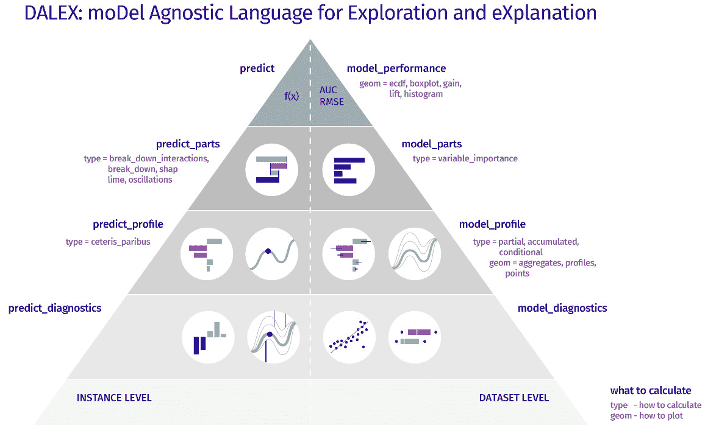

图 9.1 – DALEX 的模型探索堆栈

接下来，我将向您演示如何在实际中探索 DALEX 来解释黑盒模型。

## 设置 DALEX 以实现模型可解释性

在本节中，您将学习如何在 Python 中设置 DALEX。在开始代码演示之前，我建议您检查笔记本 [`github.com/PacktPublishing/Applied-Machine-Learning-Explainability-Techniques/blob/main/Chapter09/DALEX_example.ipynb`](https://github.com/PacktPublishing/Applied-Machine-Learning-Explainability-Techniques/blob/main/Chapter09/DALEX_example.ipynb)，其中包含理解我们现在将深入讨论的概念所需的步骤。我还建议您查看 DALEX 的 GitHub 项目存储库 [`github.com/ModelOriented/DALEX/tree/master/python/dalex`](https://github.com/ModelOriented/DALEX/tree/master/python/dalex)，以防在执行笔记本时需要更多信息。

DALEX Python 框架可以使用 `pip` 安装程序进行安装：

```py
pip install dalex -U
```

如果您想使用 DALEX 的任何需要可选依赖项的附加功能，您可以尝试以下命令：

```py
pip install dalex[full]
```

您可以通过使用以下命令将包导入 Jupyter 笔记本来验证包的安装是否成功：

```py
import dalex as dx
```

希望您的导入操作能够成功；否则，如果您遇到任何错误，您将需要重新安装框架或单独安装其依赖项。

## 关于数据集的讨论

接下来，让我们简要介绍用于此示例的数据集。对于这个示例，我使用了*FIFA 俱乐部位置预测数据集*（[`www.kaggle.com/datasets/adityabhattacharya/fifa-club-position-prediction-dataset`](https://www.kaggle.com/datasets/adityabhattacharya/fifa-club-position-prediction-dataset)）来预测足球运动员在欧元联赛中的估值，基于他们的技能和能力。因此，这是一个可以通过回归机器学习模型解决的回归问题。

FIFA 俱乐部位置数据集引用

Bhattacharya A. (2022). Kaggle - FIFA 俱乐部位置预测数据集：[`www.kaggle.com/datasets/adityabhattacharya/fifa-club-position-prediction-dataset`](https://www.kaggle.com/datasets/adityabhattacharya/fifa-club-position-prediction-dataset)

与所有其他标准机器学习解决方案流程类似，我们首先进行数据检查过程。数据集可以作为 pandas DataFrame 加载，我们可以检查数据集的维度、存在的特征以及每个特征的数据类型。此外，我们可以执行任何必要的数据转换步骤，例如删除无关特征、检查缺失值以及为相关特征填充缺失值。我建议您遵循笔记本中提供的必要步骤，但请随意包括其他附加步骤并更深入地探索数据集。

## 训练模型

对于这个示例，我使用随机森林回归算法在将数据分为训练集和验证集后拟合模型。这可以通过以下代码行完成：

```py
x_train,x_valid,y_train,y_valid = train_test_split(
```

```py
  df_train,labels,test_size=0.2,random_state=123)
```

```py
model = RandomForestRegressor(
```

```py
  n_estimators=790, min_samples_split = 3, 
```

```py
  random_state=123).fit(x_train, y_train)
```

我们对模型的超参数调整尽可能少，因为我们的目标不是构建一个高度高效的模型。相反，我们的目标是使用这个模型作为黑盒模型，并使用 DALEX 来解释模型。因此，让我们继续使用 DALEX 进行模型可解释性部分的讨论。

## 使用 DALEX 进行模型可解释性

DALEX 对模型无偏见，因为它不对模型做任何假设，并且可以与任何算法一起工作。因此，它将模型视为黑盒。在探讨如何在 Python 中使用 DALEX 之前，让我们讨论以下该框架的关键优势：

+   **DALEX 为不同的预测模型提供了一个统一的抽象**：作为解释器，DALEX 非常稳健，并且与不同的模型框架（如 scikit-learn、H2O、TensorFlow 等）配合良好。它可以处理不同格式的数据，如 NumPy 数组或 pandas DataFrame。它提供了有关数据或模型的额外元数据，这使得在生产环境中开发端到端模型可解释性管道变得更加容易。

+   **DALEX 具有稳健的 API 结构**：DALEX 简洁的 API 结构确保了在模型分析中使用了统一的语法和编码结构。只需几行代码，我们就可以应用各种可解释性方法，并解释任何黑盒模型。

+   **它可以提供推理数据实例的局部解释**：在 DALEX 中，可以轻松获得单个推理数据实例的预测级可解释性。DALEX 中有不同方法可供选择，如交互式分解图、SHAP 特征重要性图和假设分析图，这些都可以用于局部解释。我们将在下一节中更详细地介绍这些方法。

+   **它还可以在考虑整个数据集和模型的情况下提供全局解释**：使用 DALEX 的部分依赖图、累积依赖图、全局变量重要性图等方法，也可以提供模型级全局解释。

+   **使用 DALEX 可以轻松地进行偏差和公平性检查**：DALEX 提供了衡量模型公平性和偏差的定量方法。与 DALEX 不同，大多数 XAI 框架都没有提供评估模型公平性的明确方法。

+   **DALEX ARENA 平台可以用来构建一个交互式仪表板以增强用户体验**：DALEX 可以用来创建一个交互式网络应用平台，可以用来设计一个自定义仪表板，以展示 DALEX 中可用的不同模型可解释性方法的交互式可视化。我认为 DALEX 的这一独特功能为您提供了通过提供定制仪表板来满足特定最终用户需求的机会。

考虑到所有这些关键优势，我们现在继续学习如何应用 DALEX 中可用的这些功能。

首先，我们需要创建一个 DALEX 模型解释器对象，它接受训练好的模型、数据和模型类型作为输入。这可以通过以下代码行完成：

```py
# Create DALEX Explainer object 
```

```py
explainer = dx.Explainer(model, 
```

```py
                         x_valid, y_valid, 
```

```py
                         model_type = 'regression',
```

```py
                         label='Random Forest')
```

一旦创建了解释器对象，它还提供了有关模型的附加元数据，如下所示。

![Figure 9.2 – The DALEX explainer metadata]

![img/B18216_09_002.jpg]

图 9.2 – DALEX 解释器元数据

这初始元数据对于构建某些生产级系统的自动化管道非常有用。接下来，让我们探索一些 DALEX 提供的模型级解释。

## 模型级解释

模型级解释是由 DALEX 生成的全局解释。它考虑了模型性能以及预测过程中考虑的所有特征的总体影响。可以使用一行代码来检查模型的性能：

```py
model_performance = explainer.model_performance("regression")
```

根据机器学习模型的类型，可以应用不同的模型评估指标。在本例中，我们处理的是一个回归问题，因此 DALEX 使用 MSE、RMSE、R2、MAE 等指标。对于分类问题，将使用准确率、精确度、召回率等指标。如在第 *3 章* 中所述的 *以数据为中心的方法*，通过评估模型性能，我们可以估计模型的 *数据可预测性*，这为我们提供了预测结果正确程度的指示。

DALEX 提供全局特征重要性、**部分依赖图**（**PDPs**）和累积依赖图等方法来分析模型级别预测的特征解释。首先，让我们尝试特征重要性图变量：

```py
Var_Importance = explainer.model_parts(
```

```py
  variable_groups=variable_groups, B=15, random_state=123)
```

```py
Var_Importance.plot(max_vars=10, 
```

```py
                    rounding_function=np.rint, 
```

```py
                    digits=None, 
```

```py
                    vertical_spacing=0.15,
```

```py
                    title = 'Feature Importance')
```

这将生成以下图表：

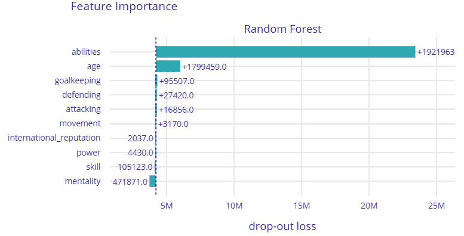

图 9.3 – DALEX 的全球特征解释特征重要性图

在*图 9.3*中，我们可以看到训练模型认为球员的能力，包括球员的整体评分、球员的潜力评分以及其他能力，如速度、盘带技巧、力量和耐力，是决定球员估值的最重要因素。

与特征重要性类似，我们可以生成 PDPs。使用以下几行代码也可以生成累积依赖图：

```py
pdp = explainer.model_profile(type = 'partial', N=800)
```

```py
pdp.plot(variables = ['age', 'potential'])
```

```py
ald = explainer.model_profile(type = 'accumulated', N=800)
```

```py
ald.plot(variables = ['age', 'movement_reactions'])
```

这将为球员的聚合配置文件创建以下图表：

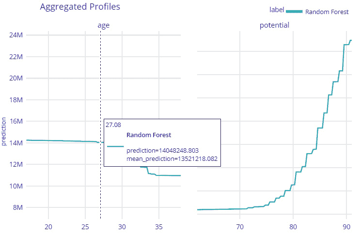

图 9.4 – 年龄和潜力特征的 PDP 聚合配置文件图，用于模型级别解释

*图 9.4*展示了`年龄`和`潜力`这两个整体特征如何随着预测的足球运动员估值变化。从图中我们可以看出，随着球员年龄的增加，预测估值会下降。同样，随着球员潜力评级的提高，球员的估值会增加。所有这些观察结果也与决定球员估值的真实世界观察结果非常一致。接下来，让我们看看如何使用 DALEX 获取预测级别解释。

## 预测级别解释

DALEX 可以提供模型无关的局部或预测级别的解释，以及全局解释。它使用交互式分解配置文件、SHAP 特征重要性值和 Ceteris Paribus 配置文件（假设配置文件）等技术，在单个数据实例级别上解释模型预测。为了理解这些技术的实际重要性，让我们使用这些技术来解释一个用于预测足球运动员整体估值的人工智能模型。在我们的例子中，我们将比较三位球员——克里斯蒂亚诺·罗纳尔多、莱昂内尔·梅西和贾登·桑乔的预测级别解释。

首先，让我们尝试交互式分解图。这可以通过以下代码行完成：

```py
prediction_level = {'interactive_breakdown':[], 'shap':[]}
```

```py
ibd = explainer.predict_parts(
```

```py
  player, type='break_down_interactions', label=name)
```

```py
prediction_level['interactive_breakdown'].append(ibd)
```

```py
prediction_level['interactive_breakdown'][0].plot(
```

```py
  prediction_level['interactive_breakdown'][1:3],
```

```py
  rounding_function=lambda x, 
```

```py
  digits: np.rint(x, digits).astype(np.int),
```

```py
  digits=None, 
```

```py
  max_vars=15)
```

这将为每位球员生成以下交互式分解配置文件图：

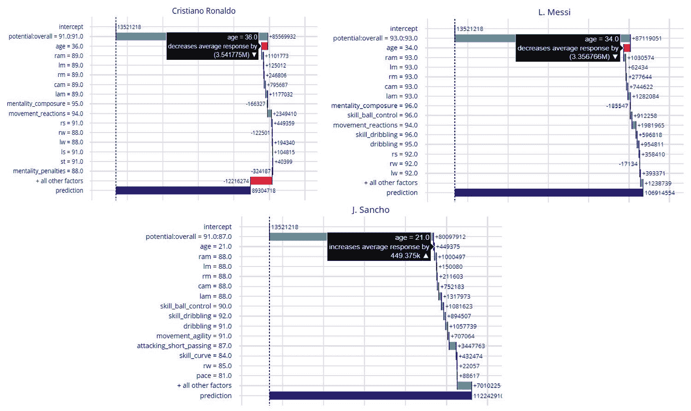

图 9.5 – DALEX 的交互式分解图

*图 9.5* 展示了比较三个选定球员模型预测的交互式分解图。此图说明了每个特征对最终预测值的贡献。增加模型预测值的特征值与降低预测值的特征值以不同的颜色显示。此图显示了总预测值相对于数据实例中每个特征值的分解。

现在，所有三名球员都是世界级的职业足球运动员；然而，与年轻的桑乔相比，C 罗和梅西是经验丰富的球员，也是足球界的传奇人物。因此，如果你观察这个图，它显示对于 C 罗和梅西，`年龄`特征降低了预测值，而对于桑乔，它略有增加。观察到一个模型能够学习到随着年龄的增长足球球员的估值如何降低是非常有趣的。这一观察结果也与领域专家的观察结果一致，他们认为具有更高潜力的年轻球员具有更高的市场价值。与分解图类似，DALEX 还提供了 SHAP 特征重要性图来分析特征的贡献。这种方法提供了与分解图类似的信息，但特征重要性是基于 SHAP 值计算的。可以使用以下代码行获得：

```py
sh = explainer.predict_parts(player, type='shap', B=10, 
```

```py
                             label=name)
```

```py
prediction_level['shap'].append(sh)
```

```py
prediction_level['shap'][0].plot(
```

```py
  prediction_level['shap'][1:3],
```

```py
  rounding_function=lambda x, 
```

```py
  digits: np.rint(x, digits).astype(np.int),
```

```py
  digits=None, 
```

```py
  max_vars=15)
```

接下来，我们将使用基于 DALEX 中的 **Ceteris Paribus 配置文件**的“如果...会怎样”图。Ceteris Paribus 配置文件类似于在 *第二章* “模型可解释性方法”中介绍的 **敏感性分析**。它基于 *Ceteris Paribus 原则*，这意味着当其他一切保持不变时，我们可以确定特定特征的改变将如何影响模型预测。这个过程通常被称为 **“如果...会怎样”模型分析**或**个体条件期望**。在应用方面，在我们的例子中，我们可以使用这种方法来找出贾登·桑乔的预测估值如何随着他年龄的增长或整体潜力的增加而变化。我们可以通过以下代码行来找出这一点：

```py
ceteris_paribus_profile = explainer.predict_profile(
```

```py
    player, 
```

```py
    variables=['age', 'potential'],
```

```py
    label=name) # variables to calculate 
```

```py
ceteris_paribus_profile.plot(size=3, 
```

```py
                             title= f"What If? {name}")
```

这将在 DALEX 中生成以下交互式“如果...会怎样”图：

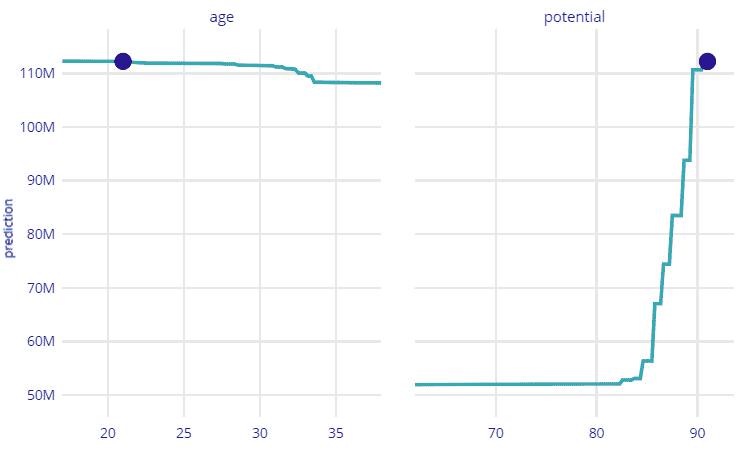

图 9.6 – DALEX 中的交互式“如果...会怎样”图

*图 9.6*显示，对于贾登·桑乔来说，随着他年龄的增长，市场估值将开始下降；然而，随着整体潜力评分的增加，它也可能上升。我强烈建议您探索所有这些预测级别的解释选项，并从项目存储库中提供的教程笔记本中进行：[`github.com/PacktPublishing/Applied-Machine-Learning-Explainability-Techniques/blob/main/Chapter09/DALEX_example.ipynb`](https://github.com/PacktPublishing/Applied-Machine-Learning-Explainability-Techniques/blob/main/Chapter09/DALEX_example.ipynb)。接下来，我们将使用 DALEX 评估模型公平性。

## 评估模型公平性

**模型公平性**检查是 DALEX 的另一个重要功能。尽管模型公平性和偏差检测对于依赖于与性别、种族、民族、国籍和其他类似人口统计特征的分类问题更为重要，但我们也将将其应用于回归模型。有关使用 DALEX 进行模型公平性检查的更多详细信息，请参阅[`dalex.drwhy.ai/python-dalex-fairness.html`](https://dalex.drwhy.ai/python-dalex-fairness.html)。现在，让我们看看我们的模型是否没有偏差且是公平的！

我们将为公平性检查创建一个**受保护变量**和一个**特权变量**。在机器学习的公平性检查中，我们试图确保受保护变量不受任何偏差的影响。如果我们预计任何特征值或群体由于数据集不平衡等因素而存在偏差，我们可以将它们声明为特权变量。对于我们的用例，我们将根据球员的年龄进行三组不同球员的公平性检查。

所有 20 岁以下的球员被视为*青年*球员，20 至 30 岁的球员被视为*发展*球员，30 岁以上的球员被视为*成熟*球员。现在，让我们使用 DALEX 进行公平性检查：

```py
protected = np.where(x_valid.age < 30, np.where(x_valid.age < 20, 'youth', 'developing'), 'developed')
```

```py
privileged = 'youth'
```

```py
fairness = explainer.model_fairness(protected=protected,
```

```py
                                    privileged=privileged)
```

```py
fairness.fairness_check(epsilon = 0.7)
```

这是公平性检查的结果：

```py
No bias was detected! Conclusion: your model is fair in terms of checked fairness criteria.
```

我们还可以检查公平性检查的定量证据，并将它们绘制出来以进行进一步分析：

```py
fairness.result
```

```py
fairness.plot()
```

这将生成以下用于分析使用 DALEX 进行模型公平性检查的图表：

![图 9.7 – 使用 DALEX 的模型公平性图]

![图片 B18216_09_007.jpg]

图 9.7 – 使用 DALEX 的模型公平性图

如*图 9.7*所示，使用 DALEX 对回归模型进行公平性分析是根据独立性、分离性和充分性等指标进行的。对于分类模型，这些指标可能有所不同，但 API 函数的使用方式相同。接下来，我们将讨论用于使用 DALEX 构建交互式仪表板的基于 Web 的 ARENA 工具。

## 使用 ARENA 的交互式仪表板

DALEX 的另一个有趣特性是 ARENA 仪表板平台，可以创建一个交互式 Web 应用程序，用于设计用于保存使用不同模型可解释性方法获得的 DALEX 交互式可视化元素的自定义仪表板。这一特定特性为我们提供了一个机会，通过为特定问题创建自定义仪表板来提高用户参与度。

在开始之前，我们需要创建一个 DALEX Arena 数据集：

```py
arena_dataset = df_test[:400].set_index('short_name')
```

接下来，我们需要创建一个`Arena`对象，并将从被解释的黑盒模型创建的 DALEX 解释器对象推送到它：

```py
arena = dx.Arena()
```

```py
# push DALEX explainer object
```

```py
arena.push_model(explainer)
```

在此之后，我们只需推送 Arena 数据集并启动服务器，使我们的 Arena 平台上线：

```py
# push whole test dataset (including target column)
```

```py
arena.push_observations(arena_dataset)
```

```py
# run server on port 9294
```

```py
arena.run_server(port=9294)
```

根据提供的端口，DALEX 服务器将在[`arena.drwhy.ai/?data=http://127.0.0.1:9294/`](https://arena.drwhy.ai/?data=http://127.0.0.1:9294/)上运行。最初，您将看到一个空白的仪表板，但您可以从右侧面板轻松拖放视觉元素来创建自己的自定义仪表板，如下面的截图所示：


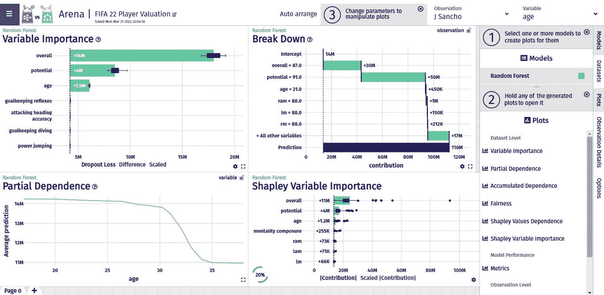

图 9.8 – 使用 DALEX 创建的交互式 Arena 仪表板

此外，您还可以从配置 JSON 文件中加载现有的仪表板或将构建的仪表板导出为配置 JSON 文件。尝试使用代码库中提供的配置 JSON 文件重新创建仪表板，如图*9.8*所示，该代码库位于[`raw.githubusercontent.com/PacktPublishing/Applied-Machine-Learning-Explainability-Techniques/main/Chapter09/dalex_sessions/session-1647894542387.json`](https://raw.githubusercontent.com/PacktPublishing/Applied-Machine-Learning-Explainability-Techniques/main/Chapter09/dalex_sessions/session-1647894542387.json)。

总体来说，我发现 DALEX 是一个非常有趣且强大的 XAI 框架。在[`github.com/ModelOriented/DALEX`](https://github.com/ModelOriented/DALEX)和[`github.com/ModelOriented/DrWhy/blob/master/README.md`](https://github.com/ModelOriented/DrWhy/blob/master/README.md)上还有更多示例可供参考。请务必探索它们。然而，DALEX 似乎仅限于结构化数据。我认为作为一个未来的发展方向，使 DALEX 能够轻松应用于图像和文本数据将增加其在人工智能研究社区中的采用率。在下一节中，我们将探讨 Explainerdashboard，这是另一个有趣的 XAI 框架。

# Explainerdashboard

人工智能研究社区一直认为交互式可视化是解释机器学习模型预测的重要方法。在本节中，我们将介绍 **Explainerdashboard**，这是一个有趣的 Python 框架，只需极少的代码即可启动一个涵盖模型可解释性各个方面的全面交互式仪表板。尽管这个框架只支持与 scikit-learn 兼容的模型（包括 XGBoost、CatBoost 和 LightGBM），但它可以提供模型无关的全局和局部可解释性。目前，它支持基于 SHAP 的特征重要性和交互，PDPs，模型性能分析，假设模型分析，甚至基于决策树的分解分析图。

该框架允许自定义仪表板，但我觉得默认版本已经包括了模型可解释性的所有支持方面。生成的基于网页的仪表板可以直接从实时仪表板导出为静态网页。否则，仪表板可以通过自动化的 **持续集成** (**CI**)/**持续部署** (**CD**) 部署流程以网页应用的形式进行程序化部署。我建议在开始教程演示之前，您先阅读框架的官方文档([`explainerdashboard.readthedocs.io/en/latest/`](https://explainerdashboard.readthedocs.io/en/latest/))和 GitHub 项目仓库([`github.com/oegedijk/explainerdashboard`](https://github.com/oegedijk/explainerdashboard))。

## 设置 Explainerdashboard

本章的完整教程笔记本已提供在代码仓库中，链接为 [`github.com/PacktPublishing/Applied-Machine-Learning-Explainability-Techniques/blob/main/Chapter09/Explainer_dashboard_example.ipynb`](https://github.com/PacktPublishing/Applied-Machine-Learning-Explainability-Techniques/blob/main/Chapter09/Explainer_dashboard_example.ipynb)。然而，在本节中，我将提供一个完整的教程演示。同样，我们将使用 *FIFA Club Position Prediction 数据集* ([`www.kaggle.com/datasets/adityabhattacharya/fifa-club-position-prediction-dataset`](https://www.kaggle.com/datasets/adityabhattacharya/fifa-club-position-prediction-dataset)) 进行本教程，但在这里，我将使用这个数据集来预测基于俱乐部球员技能和能力，下赛季足球俱乐部的联赛位置。

预测未来赛季俱乐部联赛位置的现实任务更为复杂，需要包含几个其他变量才能得到准确的预测。然而，这个预测问题仅基于为俱乐部效力的球员质量。

要开始教程，您需要安装所有必需的依赖项以运行笔记本。如果您已经执行了所有之前的教程示例，那么大多数 Python 模块应该已经安装，除了使用`pip`安装程序安装的`explainerdashboard`：

```py
!pip install explainerdashboard
```

Explainerdashboard 框架确实依赖于`graphviz`模块，这使得安装稍微有些繁琐，这取决于您的系统。在撰写本文时，我发现版本 0.18 与 Explainerdashboard 配合得最好。这可以使用 pip 安装程序安装：

```py
!pip install graphviz==0.18
```

`graphviz`二进制文件取决于您使用的操作系统。请访问[`graphviz.org/`](https://graphviz.org/)获取更多信息。另外，如果您在设置此模块时遇到任何摩擦，请查看[`pypi.org/project/graphviz/`](https://pypi.org/project/graphviz/)提供的安装说明。

我们将考虑这个机器学习问题是一个回归问题。因此，类似于 DALEX 示例，我们需要执行相同的数据预处理、特征工程、模型训练和评估步骤。我建议您遵循笔记本中提供的步骤[`github.com/PacktPublishing/Applied-Machine-Learning-Explainability-Techniques/blob/main/Chapter09/Explainer_dashboard_example.ipynb`](https://github.com/PacktPublishing/Applied-Machine-Learning-Explainability-Techniques/blob/main/Chapter09/Explainer_dashboard_example.ipynb)。这包含了获取训练模型的必要细节。我们将使用这个训练模型作为黑盒，并在下一节中使用 Explainerdashboard 来解释它。

## 使用 Explainerdashboard 进行模型可解释性

在成功安装 Explainerdashboard Python 模块后，您可以导入它以验证安装：

```py
import explainerdashboard
```

对于这个示例，我们将使用`RegressionExplainer`和`ExplainerDashboard`子模块。因此，我们将加载特定的子模块：

```py
from explainerdashboard import RegressionExplainer, ExplainerDashboard
```

接下来，只需两行代码，我们就可以为这个示例启动`ExplainerDashboard`子模块：

```py
explainer = RegressionExplainer(model_skl, x_valid, y_valid)
```

```py
ExplainerDashboard(explainer).run()
```

一旦此步骤成功运行，仪表板应该在`localhost`上以默认端口`8050`运行。因此，您可以在浏览器中访问`http://localhost:8050/`来查看您的解释仪表板。

以下列出了 Explainerdashboards 提供的不同可解释性方法：

+   **特征重要性**：与其他 XAI 框架类似，特征重要性是了解用于预测的每个属性整体贡献的重要方法。此框架使用 SHAP 值、排列重要性和 PDPs 来分析每个特征对模型预测的贡献：

![图 9.9 – Explainerdashboard 的贡献图和 PDPs]

![img/B18216_09_009.jpg]

图 9.9 – Explainerdashboard 的贡献图和 PDPs

+   **模型性能**：与 DALEX 类似，Explainerdashboard 也允许您分析模型性能。对于分类模型，它使用精确度图、混淆矩阵、ROC-AUC 图、PR AUC 图等指标。对于回归模型，我们将看到残差图、拟合优度图等更多图表：

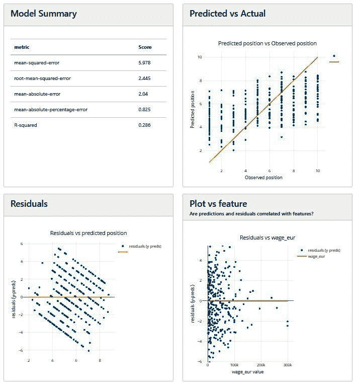

图 9.10 – Explainerdashboard 中回归模型的模型性能分析图

+   **预测级分析**：Explainerdashboard 提供了有趣的交互式图表，用于获取局部解释。这与其他 Python 框架非常相似。对于分析预测级结果来说，这一点非常重要。

+   **假设分析**：Explainerdashboard 提供的另一个有趣选项是假设分析功能。我们可以使用此功能来改变特征值，并观察整体预测如何改变。我发现假设分析对于提供规范性见解非常有用：

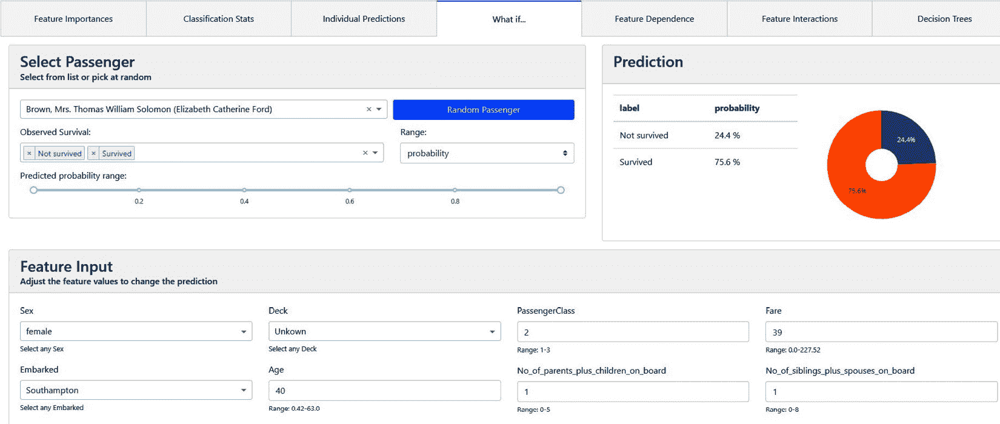

图 9.11 – 使用 Explainerdashboard 进行假设模型分析

+   **特征依赖和交互**：分析不同特征之间的依赖和交互是 Explainerdashboard 提供的另一种有趣的解释方法。大多数情况下，它使用 SHAP 方法来分析特征依赖和交互。

+   **决策树代理解释器**：Explainerdashboard 使用决策树作为代理解释器。此外，它还使用决策树分解图来提高模型的可解释性：

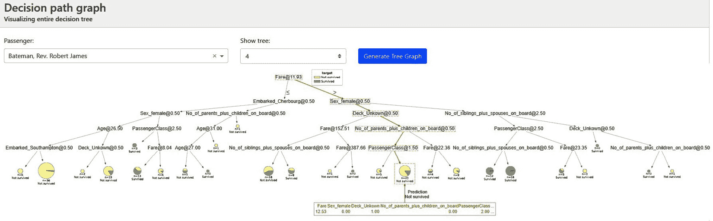

图 9.12 – Explainerdashboard 中的决策树代理解释器

要停止在本地系统上运行仪表板，您只需中断笔记本单元格即可。

Explainerdashboard 为您提供了许多自定义选项。要从给定的模板中自定义自己的仪表板，建议您参考[`github.com/oegedijk/explainerdashboard#customizing-your-dashboard`](https://github.com/oegedijk/explainerdashboard#customizing-your-dashboard)。您还可以构建多个仪表板，并将所有仪表板编译为一个解释中心：[`github.com/oegedijk/explainerdashboard#explainerhub`](https://github.com/oegedijk/explainerdashboard#explainerhub)。要将仪表板部署到任何地方都可以访问的实时 Web 应用中，我建议您查看[`github.com/oegedijk/explainerdashboard#deployment`](https://github.com/oegedijk/explainerdashboard#deployment)。

与 DALEX 相比，我认为 Explainerdashboard 稍显落后，因为它仅限于与 scikit-learn 兼容的模型。这意味着对于建立在非结构化数据（如图像和文本）上的复杂深度学习模型，您无法使用此框架。然而，我发现它易于使用，并且对于建立在表格数据集上的机器学习模型非常有用。在下一节中，我们将介绍微软的 InterpretML XAI 框架。

# InterpretML

InterpretML（https://interpret.ml/）是微软的一个 XAI 工具包。它的目的是为了模型调试、结果可解释性和机器学习模型的监管审计，提供对机器学习模型的综合理解。使用这个 Python 模块，我们可以训练*可解释的玻璃盒模型*或*解释黑盒模型*。

在*第一章*，“可解释性技术的基础概念”中，我们发现一些模型（如决策树、线性模型或规则拟合算法）本质上是可解释的。然而，这些模型对于复杂数据集来说并不高效。通常，这些模型被称为玻璃盒模型，与黑盒模型相对，因为它们极其透明。

微软研究开发了一种名为**可解释提升机**（**EBM**）的另一种算法，它将现代机器学习技术如提升、袋装和自动交互检测引入到经典算法如**广义加性模型**（**GAMs**）中。研究人员还发现，EBMs 的准确度与随机森林和梯度提升树相当，但与这些黑盒模型不同，EBMs 是可解释且透明的。因此，EBMs 是内置到 InterpretML 框架中的玻璃盒模型。

与 DALEX 和 Explainerdashboard 相比，InterpretML 在可用性和采用率方面稍显落后。然而，由于这个框架具有很大的发展潜力，讨论这个框架是很重要的。在讨论代码教程之前，让我们讨论一下这个框架支持的解释性技术。

## 支持的解释方法

在撰写本文时，以下表格展示了 InterpretML 支持的解释方法，如 GitHub 项目源代码中提到的[`github.com/interpretml/interpret#supported-techniques`](https://github.com/interpretml/interpret#supported-techniques)：

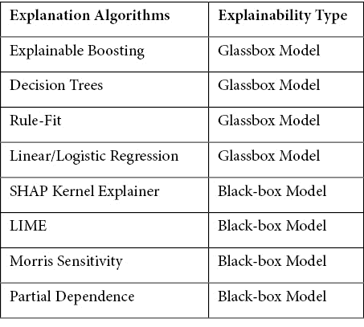

图 9.13 – InterpretML 支持的解释方法

我建议您关注项目文档，因为我非常确信这个框架对 InterpretML 支持的解释方法将会增加。接下来，让我们探讨如何在实践中使用这个框架。

## 设置 InterpretML

在本节中，我将带您参观代码仓库中提供的 InterpretML 教程示例，网址为 [`github.com/PacktPublishing/Applied-Machine-Learning-Explainability-Techniques/blob/main/Chapter09/InterpretML_example.ipynb`](https://github.com/PacktPublishing/Applied-Machine-Learning-Explainability-Techniques/blob/main/Chapter09/InterpretML_example.ipynb)。在教程中，我们使用 InterpretML 解释了一个用于肝炎检测的机器学习模型，这是一个分类问题。

要开始解决这个问题，你需要安装 InterpretML Python 模块。你可以使用 pip 安装程序来完成这个任务：

```py
pip install interpret
```

虽然该框架支持 Windows、Mac 和 Linux，但它确实要求你拥有一个高于 3.6 的 Python 版本。你可以通过导入模块来验证安装是否成功：

```py
import interpret as iml
```

接下来，让我们讨论本教程中使用的这个数据集。

## 关于数据集的讨论

肝炎检测数据集来自 UCI 机器学习仓库，网址为 https://archive.ics.uci.edu/ml/datasets/hepatitis。它包含 155 条记录和 20 个不同类型的特征，用于检测肝炎疾病。因此，这个数据集被用于解决二元分类问题。为了方便起见，我已经将这个数据集添加到代码仓库中，网址为 [`github.com/PacktPublishing/Applied-Machine-Learning-Explainability-Techniques/tree/main/Chapter09/datasets/Hepatitis_Data`](https://github.com/PacktPublishing/Applied-Machine-Learning-Explainability-Techniques/tree/main/Chapter09/datasets/Hepatitis_Data)。

肝炎数据集引用

*G.Gong（卡内基梅隆大学）通过 Bojan Cestnik，Jozef Stefan Institute ([`archive.ics.uci.edu/ml/datasets/hepatitis`](https://archive.ics.uci.edu/ml/datasets/hepatitis)*)*

关于数据集和初步探索结果的更多细节包含在教程笔记本中。然而，从非常高的层面来看，*数据集是不平衡的*，它有*缺失值*，并且包含*分类*和*连续*变量。因此，在构建模型之前需要必要的转换。所有这些必要的步骤都包含在教程笔记本中，但请随时探索构建更好的机器学习模型的其他方法。

## 训练模型

在这个例子中，在将整个数据集划分为训练集和测试集之后，我已经使用最小超参数调整训练了一个随机森林分类器：

```py
x_train, x_test, y_train, y_test = train_test_split(
```

```py
  encoded, label, test_size=0.3, random_state=123)
```

```py
model = RandomForestClassifier(
```

```py
  n_estimators=500, min_samples_split = 3,
```

```py
  random_state=123).fit(x_train, y_train)
```

注意，对于这个模型，我们没有进行充分的超参数调整，因为我们更感兴趣的是 InterpretML 的模型可解释性部分，而不是学习如何构建一个高效的机器学习模型。然而，我鼓励您进一步探索超参数调整以获得更好的模型。

在测试数据上评估模型后，我们得到了 85% 的准确率和 70% 的 **ROC 曲线下面积**（**AUC**）分数。由于数据集不平衡，AUC 分数远低于准确率。这表明准确率等指标可能会误导。因此，在模型评估时，最好考虑 AUC 分数、F1 分数和混淆矩阵等指标，而不是准确率。

接下来，我们将使用 InterpretML 进行模型可解释性。

## 使用 InterpretML 进行可解释性

如前所述，使用 InterpretML，您可以使用可解释的玻璃盒模型作为代理解释器，或者探索某些模型无关的方法来解释黑盒模型。使用这两种方法，您都可以获得一个交互式仪表板来分析可解释性的各个方面。首先，我将介绍使用 InterpretML 中的玻璃盒模型进行模型可解释性。

### 使用 InterpretML 的玻璃盒模型进行解释

InterpretML 支持可解释的玻璃盒模型，例如 **可解释提升机**（**EBM**）、**决策树**和**规则拟合**算法。这些算法作为代理解释器应用，以提供事后模型可解释性。首先，让我们尝试一下 EBM 算法。

#### EBM

要使用 EBM 解释模型，我们需要在 Python 中加载所需的子模块：

```py
from interpret.glassbox import ExplainableBoostingClassifier
```

一旦成功导入 EBM 子模块，我们只需创建一个训练好的代理解释器对象：

```py
ebm = ExplainableBoostingClassifier(feature_types=feature_types)
```

```py
ebm.fit(x_train, y_train)
```

`ebm` 变量是 EBM 解释器对象。我们可以使用这个变量来获取全局或局部解释。框架仅支持基于特征重要性的全局和局部可解释性，但创建交互式图表以进行进一步分析：

```py
# Showing Global Explanations
```

```py
ebm_global = ebm.explain_global()
```

```py
iml.show(ebm_global)
```

```py
# Local explanation using EBM
```

```py
ebm_local = ebm.explain_local(x_test[5:6], y_test[5:6], 
```

```py
                              name = 'Local Explanation')
```

```py
iml.show(ebm_local)
```

*图 9.14* 展示了使用 InterpretML 获得的全局特征重要性图和 *年龄* 特征与整体数据分布的变化：

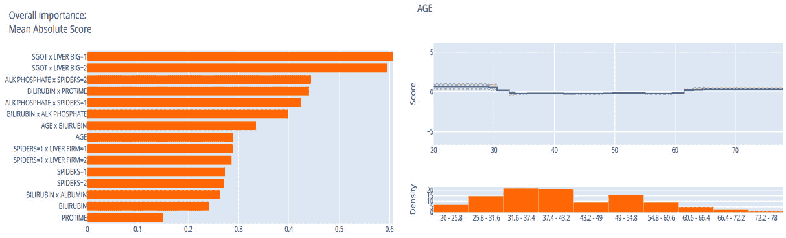

图 9.14 – 使用 InterpretML 的全局解释图

局部解释的特征重要性，已在单个数据实例的预测级别完成，如图 *9.15* 所示：

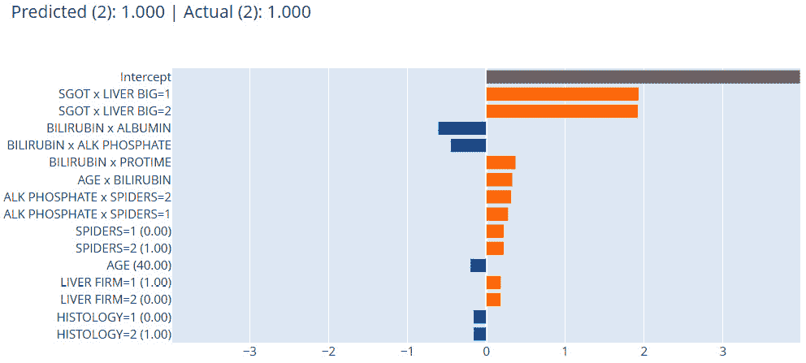

图 9.15 – 使用 InterpretML 的本地解释

接下来，我们将探索 InterpretML 中的基于规则的算法作为 *代理解释器*，如在第 *2 章* 中讨论的 *模型可解释性方法*。

#### 决策规则列表

与 EBM 类似，InterpretML 中可用的另一个流行的玻璃盒代理解释器是决策规则列表。这与规则拟合算法类似，可以从数据集中学习特定规则来解释模型的逻辑工作方式。我们可以使用以下方式通过 InterpretML 应用此方法：

```py
from interpret.glassbox import DecisionListClassifier
```

```py
dlc = DecisionListClassifier(feature_types=feature_types)
```

```py
dlc.fit(x_train, y_train)
```

```py
# Showing Global Explanations
```

```py
dlc_global = dlc.explain_global()
```

```py
iml.show(dlc_global)
```

使用这种方法，框架显示学习到的规则，如下面的屏幕截图所示：

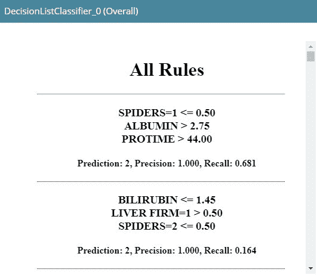

图 9.16 – 使用 InterpretML 的决策规则列表

如 *图 9.16* 所示，它生成了一组学习规则列表。接下来，我们将探索 InterpretML 中的基于决策树的代理解释器。

#### 决策树

与决策规则列表类似，我们也可以将决策树算法拟合为代理解释器，使用 InterpretML 进行模型可解释性。API 语法也非常相似，用于应用决策树分类器：

```py
from interpret.glassbox import ClassificationTree
```

```py
dtc = ClassificationTree(feature_types=feature_types)
```

```py
dtc.fit(x_train, y_train)
```

```py
# Showing Global Explanations
```

```py
dtc_global = dtc.explain_global()
```

```py
iml.show(dtc_global)
```

这将为模型解释生成一个决策树分解图，如下面的屏幕截图所示：

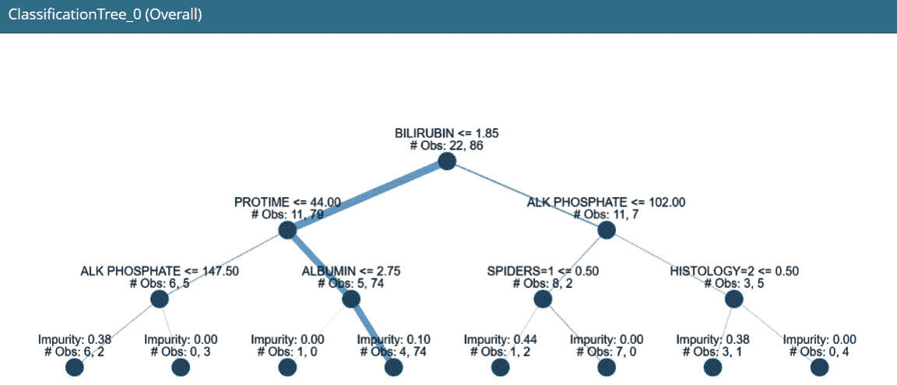

图 9.17 – InterpretML 中的基于决策树的代理解释器

现在所有这些单个组件也可以通过以下行代码合并到一个单独的仪表板中：

```py
iml.show([ebm_global, ebm_local, dlc_global, dtc_global])
```

*图 9.18* 展示了使用 InterpretML 的整合交互式仪表板：

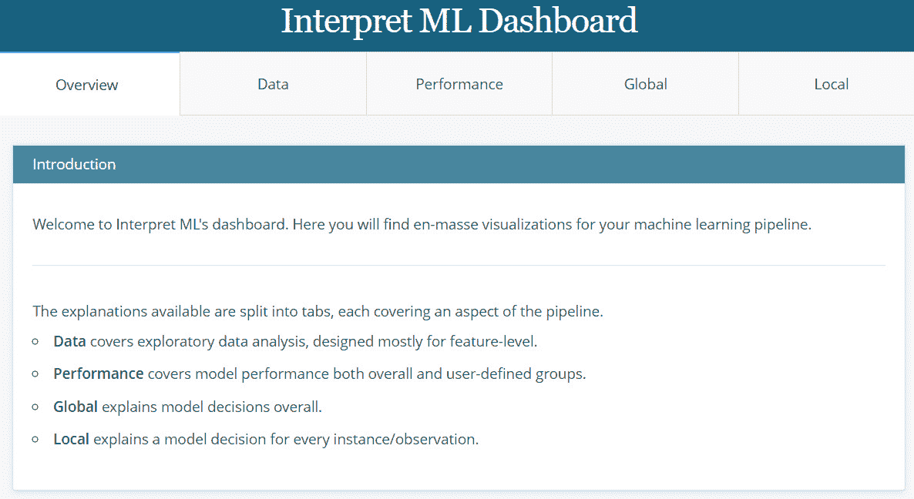

图 9.18 – InterpretML 控制台整合所有单个图表

在下一节中，我们将介绍 InterpretML 提供的用于提供黑盒模型模型无关解释的各种方法。

### 使用 InterpretML 解释黑盒模型

在本节中，我们将介绍 InterpretML 支持的四种解释黑盒模型的方法。我们将只涵盖代码部分，因为特征重要性和特征变化的可视化与玻璃盒模型非常相似。我确实建议查看教程笔记本，以与生成的图表交互并获得更多见解。支持的方法包括 LIME、Kernel SHAP、Morris 敏感性分析和部分依赖性：

```py
from interpret.blackbox import LimeTabular, ShapKernel, MorrisSensitivity, PartialDependence
```

首先，我们将探索 LIME 表格方法：

```py
#The InterpretML Blackbox explainers need a predict function, and optionally a dataset
```

```py
lime = LimeTabular(predict_fn=model.predict_proba, data=x_train.astype('float').values, random_state=123)
```

```py
#Select the instances to explain, optionally pass in labels if you have them
```

```py
lime_local = lime.explain_local(
```

```py
  x_test[:5].astype('float').values, 
```

```py
  y_test[:5], name='LIME')
```

接下来，InterpretML 提供了 SHAP Kernel 方法进行模型无关的 SHAP 解释：

```py
# SHAP explanation
```

```py
background_val = np.median(
```

```py
  x_train.astype('float').values, axis=0).reshape(1, -1)
```

```py
shap = ShapKernel(predict_fn=model.predict_proba, 
```

```py
                  data=background_val, 
```

```py
                  feature_names=list(x_train.columns))
```

```py
shap_local = shap.explain_local(
```

```py
  x_test[:5].astype('float').values, 
```

```py
  y_test[:5], name='SHAP')
```

另一种受支持的模型无关全局解释方法是 **Morris 敏感性**，用于获取特征的整体敏感性：

```py
# Morris Sensitivity
```

```py
sensitivity = MorrisSensitivity(
```

```py
  predict_fn=model.predict_proba, 
```

```py
  data=x_train.astype('float').values,                                
```

```py
  feature_names=list(x_train.columns),                                
```

```py
  feature_types=feature_types)
```

```py
sensitivity_global = sensitivity.explain_global(name="Global Sensitivity")
```

InterpretML 也支持使用 PDPs 分析特征依赖性：

```py
# Partial Dependence
```

```py
pdp = PartialDependence(
```

```py
  predict_fn=model.predict_proba, 
```

```py
  data=x_train.astype('float').values,                        
```

```py
  feature_names=list(x_train.columns),
```

```py
  feature_types=feature_types)
```

```py
pdp_global = pdp.explain_global(name='Partial Dependence')
```

最后，所有内容都可以通过一行代码合并到一个单独的仪表板中：

```py
iml.show([lime_local, shap_local, sensitivity_global, 
```

```py
          pdp_global])
```

这将创建一个类似的交互式仪表板，如 *图 9.18* 所示。

通过各种代理解释器和交互式仪表板，这个框架确实有很大的潜力，尽管存在一些限制。它仅限于表格数据集，与 PyTorch、TensorFlow 和 H20 等模型框架不兼容，我认为模型解释方法也有局限性。改善这些限制无疑可以增加该框架的采用率。

接下来，我们将介绍另一个流行的 XAI 框架——ALIBI 用于模型解释。

# ALIBI

ALIBI 是另一个流行的 XAI 框架，它支持分类和回归模型的局部和全局解释。在 *第二章* 中，我们探讨了此框架以获取反事实示例，但 ALIBI 还包括其他模型可解释性方法，我们将在本节中探讨。ALIBI 主要因其以下列表中的模型解释方法而受到欢迎：

+   **锚点解释**：锚点解释被定义为围绕局部预测充分旋转或锚定的规则。这意味着如果锚点值存在于数据实例中，那么模型预测几乎总是相同的，无论其他特征值如何变化。

+   **反事实解释**（**CFEs**）：我们在 *第二章* 中看到了反事实。CFEs 指示哪些特征值应该改变，以及改变多少，以产生不同的结果。

+   **对比解释方法**（**CEMs**）：CEMs 与分类模型一起用于局部解释，涉及 **相关正面**（**PPs**），即应最小且充分存在的特征，以证明给定的分类，以及 **相关负面**（**PNs**），即应最小且必要不存在的特征，以证明分类。

+   **累积局部效应**（**ALE**）：ALE 图展示了属性如何影响机器学习模型的总体预测。ALE 图通常被认为是无偏的，并且是 PDPs 的更快替代方案，如 *第二章* 中所述，*模型可解释性方法*。

要获取模型解释支持的详细方法总结，请查看 [`github.com/SeldonIO/alibi#supported-methods`](https://github.com/SeldonIO/alibi#supported-methods)。请探索此框架的官方文档以了解更多信息：[`docs.seldon.io/projects/alibi/en/latest/examples/overview.html`](https://docs.seldon.io/projects/alibi/en/latest/examples/overview.html)。

现在，让我带您了解为 ALIBI 提供的代码教程。

## 设置 ALIBI

本章的项目仓库中提供了完整的代码教程，链接为 [`github.com/PacktPublishing/Applied-Machine-Learning-Explainability-Techniques/blob/main/Chapter09/ALIBI_example.ipynb`](https://github.com/PacktPublishing/Applied-Machine-Learning-Explainability-Techniques/blob/main/Chapter09/ALIBI_example.ipynb)。如果您已经跟随了 *第二章* 中关于 *反事实解释* 的教程，以及 *模型可解释性方法*，那么您应该已经安装了 ALIBI。

您可以从 ALIBI 导入我们将用于此示例的子模块：

```py
import alibi
```

```py
from alibi.explainers import AnchorTabular, CEM, CounterfactualProto, ale 
```

接下来，让我们讨论这个教程的数据集。

## 关于数据集的讨论

对于这个例子，我们将使用来自*UCI 机器学习*仓库的*占用检测*数据集，网址为[`archive.ics.uci.edu/ml/datasets/Occupancy+Detection+#`](https://archive.ics.uci.edu/ml/datasets/Occupancy+Detection+#)。这个数据集用于检测房间是否被占用，通过提供不同的传感器值来实现。因此，这是一个可以通过在给定数据集上拟合机器学习分类器来解决的问题。详细的 数据检查、预处理和转换步骤包含在教程笔记本中。从非常高的层面来看，这个数据集略微不平衡，并且主要包含没有缺失值的数值特征。

占用检测数据集引用

L.M. Candanedo, V. Feldheim (2016) - 使用统计学习模型从光、温度、湿度和 CO2 测量值中准确检测办公室房间的占用情况。([`archive.ics.uci.edu/ml/datasets/Occupancy+Detection+#`](https://archive.ics.uci.edu/ml/datasets/Occupancy+Detection+#))

在本教程中，我演示了如何使用 scikit-learn 的管道方法来训练机器学习模型。这是一种构建机器学习模型非常整洁的方法，尤其是在处理需要部署到生产系统的工业问题时特别有用。要了解更多关于这种方法的信息，请查看官方 scikit-learn 管道文档：[`scikit-learn.org/stable/modules/generated/sklearn.pipeline.Pipeline.html`](https://scikit-learn.org/stable/modules/generated/sklearn.pipeline.Pipeline.html)。

接下来，让我们讨论将要用于提取解释的模型。

## 训练模型

对于这个例子，我使用随机森林分类器进行训练，并进行了最小化超参数调整。你也可以探索其他机器学习分类器，因为算法的选择并不重要。我们的目标是探索 ALIBI 模型的可解释性，我将在下一节中介绍。

## 使用 ALIBI 进行模型可解释性

现在，让我们使用之前讨论过的各种解释方法来解释训练好的模型，我们可以将其视为一个黑盒。

### 使用锚解释

为了获取锚点，首先，我们需要创建一个锚解释对象：

```py
explainer = AnchorTabular(
```

```py
  predict_fn, 
```

```py
  feature_names=list(df_train.columns), 
```

```py
  seed=123)
```

接下来，我们需要将解释器对象拟合到训练数据上：

```py
explainer.fit(df_train.values, disc_perc=[25, 50, 75])
```

我们需要为占用类和非占用类学习一个锚值。这个过程涉及到为每个类别提供一个数据实例作为输入，以估计锚点。这可以通过以下代码行来完成：

```py
class_names = ['not_occupied', 'occupied']
```

```py
print('Prediction: ', 
```

```py
      class_names[explainer.predictor(
```

```py
        df_test.values[5].reshape(1, -1))[0]])
```

```py
explanation = explainer.explain(df_test.values[5], 
```

```py
                                threshold=0.8)
```

```py
print('Anchor: %s' % (' AND '.join(explanation.anchor)))
```

```py
print('Prediction: ', 
```

```py
      class_names[explainer.predictor(
```

```py
        df_test.values[100].reshape(1, -1))[0]])
```

```py
explanation = explainer.explain(df_test.values[100], 
```

```py
                                threshold=0.8)
```

```py
print('Anchor: %s' % (' AND '.join(explanation.anchor)))
```

在本例中，当光强度值大于`256.7`且`CO2`值大于`638.8`时，获得被占用类的锚点。相比之下，对于未被占用类，当`CO2`值大于`439`时，获得锚点。本质上，这告诉我们，如果测量光强度的传感器值大于`256.7`且 CO2 水平大于`638.8`，模型预测房间是被占用的。

模型学习到的模式实际上是合适的，因为每当房间被占用时，灯光更有可能被打开，并且随着占用者的增多，CO2 水平也可能会上升。未被占用的类的锚点不太合适，也不直观或可解释，但这表明，通常情况下，当房间未被占用时，CO2 水平较低。通常，我们可以了解到模型预测结果所依赖的一些影响特征的阈值。

### 使用 CEM

使用 CEM，主要思想是学习应该存在的 PP（Positive Predictive Power）或条件，以证明某一类事件的发生，以及 PN（Positive Negative Power）或条件，应该不存在以指示某一类事件的发生。这用于模型无关的局部可解释性。您可以从这篇研究文献中了解更多关于这种方法的信息：[`arxiv.org/pdf/1802.07623.pdf`](https://arxiv.org/pdf/1802.07623.pdf)。

要在 Python 中应用此方法，我们需要创建一个具有所需超参数的 CEM 对象，并将训练值拟合以学习 PP 和 PN 值：

```py
cem = CEM(predict_fn, mode, shape, kappa=kappa, 
```

```py
          beta=beta, feature_range=feature_range, 
```

```py
          max_iterations=max_iterations, c_init=c_init, 
```

```py
          c_steps=c_steps, 
```

```py
          learning_rate_init=lr_init, clip=clip)
```

```py
cem.fit(df_train.values, no_info_type='median')
```

```py
explanation = cem.explain(X, verbose=False)
```

在我们的例子中，学习到的 PP 和 PN 值显示了值应该增加或减少多少才能满足正确结果的最低标准。令人惊讶的是，我们没有获得任何 PN 值。这表明所有特征对于模型来说都很重要。任何特征或任何特定值范围的缺失都不会帮助模型预测结果。通常，对于高维数据，PN 值对于分析来说很重要。

### 使用 CFEs

在*第二章*“模型可解释性方法”中，我们探讨了如何使用 ALIBI 应用 CFEs 的教程示例。对于本例，我们也将采取类似的方法。然而，ALIBI 确实允许不同的算法生成 CFEs，我强烈建议您探索：[`docs.seldon.io/projects/alibi/en/latest/methods/CF.html`](https://docs.seldon.io/projects/alibi/en/latest/methods/CF.html)。在本章中，我们将坚持在*第二章*“模型可解释性方法”的 CFE 教程中涵盖的原型方法：

```py
cfe = CounterfactualProto(predict_fn,
```

```py
                          shape,
```

```py
                          use_kdtree=True, 
```

```py
                          theta=10., 
```

```py
                          max_iterations=1000,
```

```py
                          c_init=1., 
```

```py
                          c_steps=10
```

```py
                         )
```

```py
cfe.fit(df_train.values, d_type='abdm', 
```

```py
        disc_perc=[25, 50, 75])
```

```py
explanation = cfe.explain(X)
```

一旦解释对象准备就绪，我们实际上可以比较 CFE 与原始数据实例之间的差异，以了解翻转结果所需的特征值变化。然而，使用这种方法获取正确的 CFE 可能有些挑战，因为有许多超参数需要正确的调整；因此，这种方法可能具有挑战性和繁琐。接下来，让我们讨论如何使用 ALE 图进行模型可解释性。

### 使用 ALE 图

与 PDPs 类似，如第*第二章*中所述，“模型可解释性方法”，ALE 图可以用来找到各个特征与目标类之间的关系。让我们看看如何在 Python 中应用这个方法：

```py
proba_ale = ale.ALE(predict_fn, feature_names=numeric,
```

```py
                    target_names=class_names)
```

```py
proba_explain = proba_ale.explain(df_test.values)
```

```py
ale.plot_ale(proba_explain, n_cols=3, 
```

```py
             fig_kw={'figwidth': 12, 'figheight': 8})
```

这将创建以下 ALE 图：

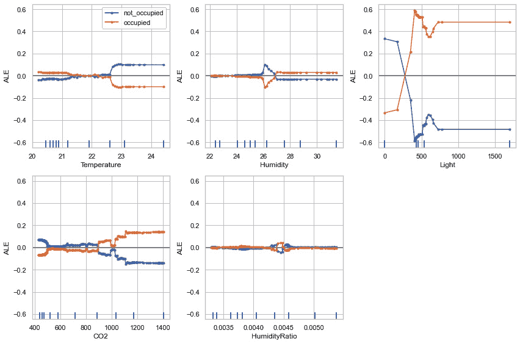

图 9.19 – 使用 ALIBI 的 ALE 图

在*图 9.19*中，我们可以看到对于`occupied`和`not occupied`目标类，特征值的变化在特征光处达到最大水平，其次是 CO2 和温度，而`HumidityRatio`处则处于最低水平。这为我们提供了模型预测如何根据特征值的变化而变化的指示。

总体来说，我觉得 ALIBI 是一个有趣的 XAI 框架，它适用于表格和无结构数据，如文本和图像，并且确实有各种技术用于 ML 模型的可解释性。我唯一发现的问题是，其中一些方法并不非常简化，因此需要大量的超参数调整才能得到可靠的解释。请访问[`github.com/SeldonIO/alibi/tree/master/doc/source/examples`](https://github.com/SeldonIO/alibi/tree/master/doc/source/examples)以获取 ALIBI 提供的其他示例，以获得更多实际经验。在下一节中，我们将讨论 DiCE 作为 XAI Python 框架。

# DiCE

**多样化的反事实解释**（**DiCE**）是另一个流行的 XAI 框架，我们在*第二章*“模型可解释性方法”中简要介绍了它，用于*CFE 教程*。有趣的是，DiCE 也是微软研究院的关键 XAI 框架之一，但它尚未与 InterpretML 模块集成（我想知道为什么！）。我发现 CFE 的整个想法非常接近理想的、对人类友好的解释，它提供了可操作的建议。微软的这篇博客讨论了 DiCE 框架背后的动机和想法：[`www.microsoft.com/en-us/research/blog/open-source-library-provides-explanation-for-machine-learning-through-diverse-counterfactuals/`](https://www.microsoft.com/en-us/research/blog/open-source-library-provides-explanation-for-machine-learning-through-diverse-counterfactuals/)。

与 ALIBI CFE 相比，我发现 DiCE 在最小超参数调整的情况下产生了更合适的 CFE。这就是为什么我认为提到 DiCE 很重要，因为它主要是为基于示例的解释而设计的。接下来，让我们讨论 DiCE 支持的 CFE 方法。

## DiCE 支持的 CFE 方法

DiCE 可以根据以下方法生成 CFE：

+   非模型方法：

    +   KD-Tree

    +   遗传算法

    +   随机采样

+   基于梯度的方法（特定模型的方法）：

    +   深度学习模型的基于损失的方法

    +   **变分自编码器**（**VAE**）-基于的方法

要了解更多关于所有这些方法的信息，我请求您探索 DiCE 的官方文档（https://github.com/interpretml/DiCE），其中包含每种方法的必要研究文献。现在，让我们使用 DiCE 进行模型可解释性。

## 使用 DiCE 进行模型可解释性

完整的教程示例可在[`github.com/PacktPublishing/Applied-Machine-Learning-Explainability-Techniques/blob/main/Chapter09/DiCE_example.ipynb`](https://github.com/PacktPublishing/Applied-Machine-Learning-Explainability-Techniques/blob/main/Chapter09/DiCE_example.ipynb)找到。对于这个例子，我使用了与 ALIBI 教程相同的占用检测数据集。由于使用了相同的数据预处理、转换、模型训练和评估步骤，我们将直接使用 DALEX 进行模型可解释性部分。笔记本教程包含所有必要的步骤，所以我建议您首先查看笔记本。

我们将像在*第二章*的 CFE 教程中做的那样，以相同的方式使用 DiCE 框架，*模型可解释性方法*。

因此，首先，我们需要定义一个 DiCE 数据对象：

```py
data_object = dice_ml.Data(
```

```py
  dataframe = df_train[numeric + [target_variable]],
```

```py
  continuous_features = numeric,
```

```py
  outcome_name = target_variable
```

```py
)
```

接下来，我们需要创建一个 DiCE 模型对象：

```py
model_object = dice_ml.Model(model=model,backend='sklearn')
```

在此之后，我们需要传递数据对象和模型对象给 DiCE 解释对象：

```py
explainer = dice_ml.Dice(data_object, model_object, 
```

```py
                         method = 'random')
```

接下来，我们可以使用 DiCE 解释器对象查询数据实例并生成 CFE：

```py
test_query = df_test[400:401][numeric]
```

```py
cfe = explainer.generate_counterfactuals(
```

```py
    test_query, 
```

```py
    total_CFs=4, 
```

```py
    desired_range=None,
```

```py
    desired_class="opposite",
```

```py
    features_to_vary= numeric,
```

```py
    permitted_range = { 'CO2' : [400, 1000]}, # Adding a constraint for CO2 feature
```

```py
    random_seed = 123,
```

```py
    verbose=True)
```

```py
cfe.visualize_as_dataframe(show_only_changes=True)
```

这将生成一个 CFE DataFrame，显示需要更改以翻转模型预测结果的特征值。此方法的结果如下截图所示：

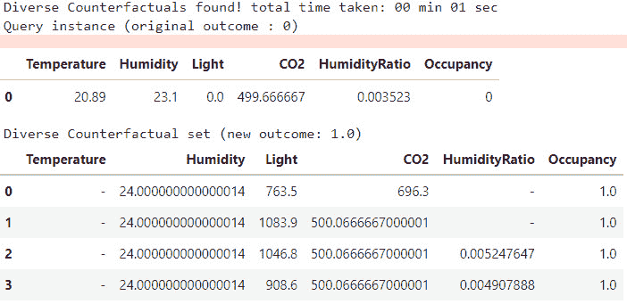

图 9.20 – 使用 DiCE 框架生成的 CFE，以 DataFrame 的形式显示

有趣的是，CFE 不仅可以从数据中提供可操作的见解。然而，它们还可以用于生成局部和全局特征重要性。这种方法认为，可以轻松改变以改变模型预测的特征更重要。让我们尝试使用 DiCE 方法应用局部特征重要性：

```py
local_importance = explainer.local_feature_importance(test_query)
```

```py
print(local_importance.local_importance)
```

```py
plt.figure(figsize=(10,5))
```

```py
plt.bar(range(len(local_importance.local_importance[0])), 
```

```py
        list(local_importance.local_importance[0].values())/(np.sum(list(local_importance.local_importance[0].values()))), 
```

```py
        tick_label=list(local_importance.local_importance[0].keys()),
```

```py
        color = list('byrgmc')
```

```py
       )
```

```py
plt.show()
```

这为选定的测试查询生成了以下局部特征重要性图：

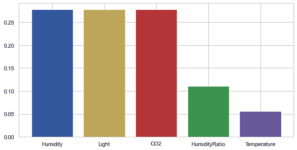

图 9.21 – 使用 DiCE 的局部特征重要性

*图 9.21* 显示，对于测试查询数据，湿度、光照和 CO2 特征对于模型预测最为重要。这表明大多数 CFEs 会建议更改这些特征中的一个的特征值以改变模型预测。

总体而言，DiCE 是一个非常有前景的框架，用于稳健的 CFEs。我建议您探索生成 CFEs 的不同算法，如 KD-Trees、随机采样和遗传算法。DiCE 的示例有时可能非常随机。我的建议是始终使用随机种子来控制随机性，明确定义可操作和非可操作特征，并设置可操作特征的边界条件以生成有意义的、实际可行的 CFEs。否则，生成的 CFEs 可能非常随机，实际上不可行，因此使用效果较差。

对于 DiCE 框架在多类分类或回归问题上的其他示例，请探索[`github.com/interpretml/DiCE/tree/master/docs/source/notebooks`](https://github.com/interpretml/DiCE/tree/master/docs/source/notebooks)。接下来，让我们介绍 ELI5，这是最初开发用于以最简化的格式解释 ML 模型的 XAI 框架之一。

# ELI5

*ELI5*，或*Explain Like I'm Five*，是一个用于调试、检查和解释 ML 分类器的 Python XAI 库。它是最初开发的 XAI 框架之一，用于以最简化的格式解释黑盒模型。它支持广泛的 ML 建模框架，如与 scikit-learn 兼容的模型、Keras 等。它还集成了 LIME 解释器，可以与表格数据集以及文本和图像等非结构化数据一起工作。库文档可在[`eli5.readthedocs.io/en/latest/`](https://eli5.readthedocs.io/en/latest/)找到，GitHub 项目可在[`github.com/eli5-org/eli5`](https://github.com/eli5-org/eli5)找到。

在本节中，我们将仅介绍 ELI5 在表格数据集上的应用部分，但请自由探索 ELI5 教程示例中提供的其他示例[`eli5.readthedocs.io/en/latest/tutorials/index.html`](https://eli5.readthedocs.io/en/latest/tutorials/index.html)。接下来，让我们开始代码教程的演练。

## 设置 ELI5

本章 ELI5 示例的完整教程可在 GitHub 仓库中找到：[`github.com/PacktPublishing/Applied-Machine-Learning-Explainability-Techniques/blob/main/Chapter09/ELI5_example.ipynb`](https://github.com/PacktPublishing/Applied-Machine-Learning-Explainability-Techniques/blob/main/Chapter09/ELI5_example.ipynb)。ELI5 可以通过 pip 安装器在 Python 中安装：

```py
pip install eli5
```

如果安装过程成功，您可以通过在 Jupyter 笔记本中导入模块来验证它：

```py
import eli5
```

对于这个例子，我们将使用来自 UCI 机器学习存储库（https://archive.ics.uci.edu/ml/datasets/hepatitis）相同的肝炎检测数据集，我们将其用于 InterpretML 示例。此外，我们使用了一个具有最小超参数调整的随机森林分类模型，它将作为我们的黑盒模型。因此，我们将跳过关于数据集和模型部分的讨论，并继续使用 ELI5 进行模型可解释性的部分。

## 使用 ELI5 进行模型可解释性

在 Python 中应用 ELI5 非常简单，只需几行代码即可完成：

```py
eli5.show_weights(model, vec = DictVectorizer(), 
```

```py
                  feature_names = list(encoded.columns))
```

这将生成以下特征权重表格可视化，可用于分析全局特征重要性：

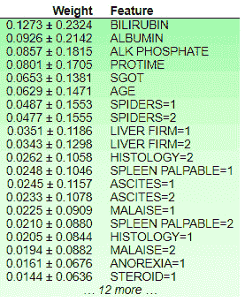

图 9.22 – 使用 ELI5 获得的特征权重

*图 9.22* 表明，特征 `BILIRUBIN` 具有最大的权重，因此对模型结果的影响贡献最大。显示在权重值旁边的 +/- 值可以被认为是置信区间。这种方法可以被认为是一种非常简单的方式来提供对黑盒模型的洞察。ELI5 使用树模型计算特征权重。树的每个节点都会给出一个输出分数，用于估计特征的总体贡献。决策路径上的总贡献是分数从父节点到子节点的变化量。所有特征的总权重加起来是模型预测特定类别的总概率。

我们可以使用这种方法为局部可解释性和推理数据实例提供：

```py
no_missing = lambda feature_name, feature_value: not np.isnan(feature_value) # filter missing values
```

```py
eli5.show_prediction(model, 
```

```py
                     x_test.iloc[1:2].astype('float'), 
```

```py
                     feature_names = list(encoded.columns), 
```

```py
                     show_feature_values=True, 
```

```py
                     feature_filter=no_missing,
```

```py
                     target_names = {1:'Die', 2:'Live'},
```

```py
                     top = 10,
```

```py
                     show = ['feature_importances', 
```

```py
                             'targets', 'decision_tree', 
```

```py
                             'description'])
```

这将为分析推理数据的特征贡献生成以下表格可视化：

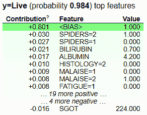

图 9.23 – 使用 ELI5 进行局部可解释性的特征贡献

在 *图 9.23* 中，我们可以看到使用 ELI5 对预测所用的局部数据进行的特征贡献。表中添加了一个 `<BIAS>` 项。这被认为是模型输出的预期平均分数，它取决于训练数据的分布。要了解更多信息，请查看这篇 Stack Overflow 帖子：[`stackoverflow.com/questions/49402701/eli5-explaining-prediction-xgboost-model`](https://stackoverflow.com/questions/49402701/eli5-explaining-prediction-xgboost-model)。

尽管 ELI5 易于使用，可能是迄今为止所有 XAI 框架中最简单的，但我认为该框架还不够全面。即使是用于分析特征贡献的提供的可视化也显得非常陈旧，可以改进。由于 ELI5 是第一个与表格数据、图像和文本数据一起工作的 XAI 框架之一，了解它很重要。

在下一节中，我将介绍 H2O AutoML 模型的模型可解释性。

# H2O AutoML 解释器

在本章中，我们主要使用了基于 scikit-learn 和 TensorFlow 的模型。然而，当 AutoML 的概念首次提出时，H2O 社区是这一概念的最早采用者之一，并为 H2O ML 框架引入了 AutoML 功能：[`docs.h2o.ai/h2o/latest-stable/h2o-docs/automl.html`](https://docs.h2o.ai/h2o/latest-stable/h2o-docs/automl.html)。

令人有趣的是，H2O AutoML 在业界非常广泛使用，尤其是在处理大量数据集时。不幸的是，与 H2O 模型兼容的模型可解释性框架如 DALEX 非常少。H2O 模型在 R 和 Python 中都有良好的应用，并且借助 AutoML 功能，这个框架承诺在极短的时间内以更少的努力启动训练和调优模型，以获得最佳性能。因此，我认为在本章中提及 H2O AutoML 解释器非常重要。这个框架确实内置了模型可解释性方法的实现，用于解释 AutoML 模型的预测（[`docs.h2o.ai/h2o/latest-stable/h2o-docs/automl.html`](https://docs.h2o.ai/h2o/latest-stable/h2o-docs/automl.html)）。接下来，让我们更深入地探讨 H2O 解释器。

## 使用 H2O 解释器进行可解释性

H2O 解释器仅支持 H2O 模型。它们可以用于提供全局和局部解释。以下列表显示了在 H2O 中提供解释的支持方法：

+   模型性能比较（这对于尝试在相同数据集上使用不同算法的 AutoML 模型特别有用）

+   变量或特征重要性（适用于全局和局部解释）

+   模型相关性热图

+   基于 TreeSHAP 的解释（仅适用于树模型）

+   PDPs（适用于全局和局部解释）

+   单个条件期望图，也称为假设分析图（适用于全局和局部解释）

你可以在[`docs.h2o.ai/h2o/latest-stable/h2o-docs/explain.html`](https://docs.h2o.ai/h2o/latest-stable/h2o-docs/explain.html)了解更多关于 H2O 解释器的信息。完整的教程示例提供在[`github.com/PacktPublishing/Applied-Machine-Learning-Explainability-Techniques/blob/main/Chapter09/H2o_AutoML_explain_example.ipynb`](https://github.com/PacktPublishing/Applied-Machine-Learning-Explainability-Techniques/blob/main/Chapter09/H2o_AutoML_explain_example.ipynb)。在这个例子中，我演示了如何使用 H2O AutoML 根据 FIFA 俱乐部位置预测数据集（[`github.com/PacktPublishing/Applied-Machine-Learning-Explainability-Techniques/tree/main/Chapter09/datasets/FIFA_Club_Position`](https://github.com/PacktPublishing/Applied-Machine-Learning-Explainability-Techniques/tree/main/Chapter09/datasets/FIFA_Club_Position)）预测顶级足球俱乐部的联赛位置，该数据集与我们在 DALEX 和 Explainerdashboard 教程中使用的数据集相同。

要安装 H2O 模块，你可以使用 pip 安装程序：

```py
pip install h2o
```

由于我们已经在之前的教程中涵盖了数据准备和转换的步骤，所以在这里我将跳过这些步骤。但请参考教程笔记本以执行端到端示例。

H2O 模型与 pandas DataFrame 不兼容。因此，你需要将 pandas DataFrame 转换为 H2O DataFrame。让我们看看训练 H2O AutoML 模块的代码行：

```py
import h2o
```

```py
from h2o.automl import H2OAutoML
```

```py
# Start the H2O cluster (locally) - Don't forget this step
```

```py
h2o.init()
```

```py
aml = H2OAutoML(max_models=20, seed=1)
```

```py
train = x_train.copy()
```

```py
valid = x_valid.copy()
```

```py
train["position"] = y_train
```

```py
valid["position"] = y_valid
```

```py
x = list(train.columns)
```

```py
y = "position"
```

```py
training_frame = h2o.H2OFrame(train)
```

```py
validation_frame=h2o.H2OFrame(valid) 
```

```py
# training the automl model
```

```py
aml.train(x=x, y=y, training_frame=training_frame, 
```

```py
          validation_frame=validation_frame)
```

一旦 AutoML 训练过程完成，我们可以获取最佳模型并将其存储为变量以供将来使用：

```py
model = aml.get_best_model()
```

对于模型可解释性部分，我们只需要使用来自 AutoML 模型对象的`explain`方法：

```py
aml.explain(validation_frame)
```

这会自动创建一系列支持的 XAI 方法，并生成可视化来解释模型。在撰写本文时，H2O 的可解释性功能是最新发布的，处于实验阶段。如果您有任何反馈或发现任何错误，请在 H2O JIRA 问题跟踪器上提交工单（[`0xdata.atlassian.net/projects/PUBDEV`](https://0xdata.atlassian.net/projects/PUBDEV)）。

有了这些，我已经涵盖了除了*LIME*、*SHAP*和*TCAV*之外的所有流行的 XAI 框架，这些框架通常被使用或具有解释机器模型的高潜力。在下一节中，我将提供一个快速比较指南来比较本章涵盖的所有七个框架。

# 快速比较指南

在本章中，我们讨论了 Python 中可用的不同类型的 XAI 框架。当然，没有任何一个框架是绝对完美且适用于所有场景的。在各个部分中，我确实提到了每个框架的优缺点，但我相信如果你有一个快速比较指南来决定你的 XAI 框架选择，这将非常有帮助，特别是考虑到你的具体问题。

下表展示了本章涵盖的七个 XAI 框架的快速比较指南。我尝试从可解释性的不同维度、与各种机器学习模型的兼容性、对人性化的解释的定性评估、解释的鲁棒性、可扩展性的定性评估以及特定框架在生产级系统中被采纳的速度等方面进行比较：

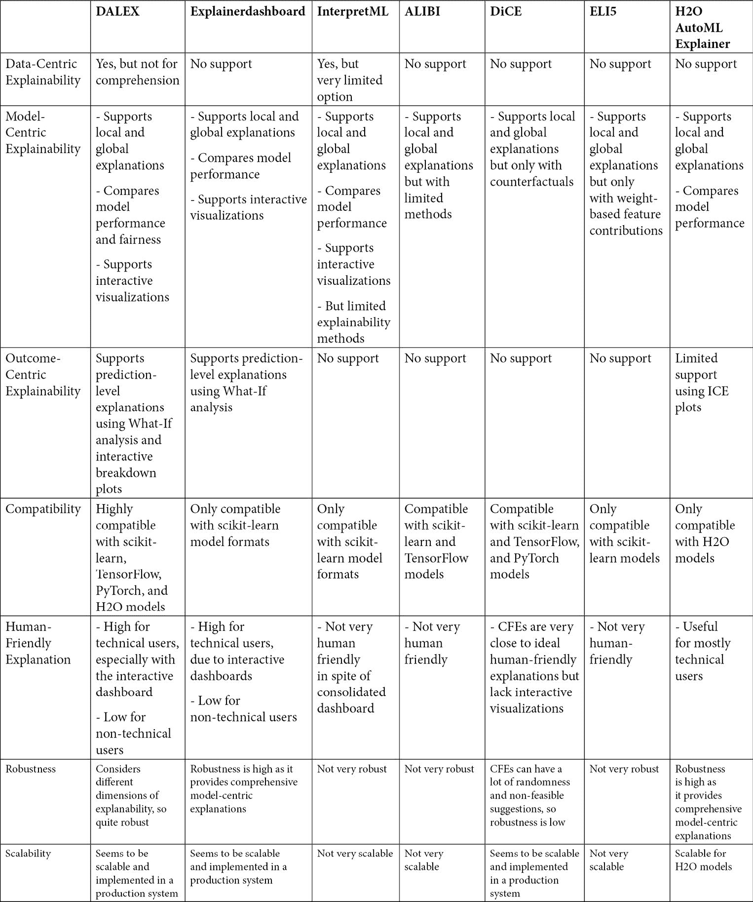

图 9.24 – 本章涵盖的流行 XAI 框架的快速比较指南

这就结束了本章的内容。接下来，让我为本章的主要讨论主题提供一个总结。

# 摘要

在本章中，我们介绍了 Python 中可用的七个流行的 XAI 框架：*DALEX*、*Explainerdashboard*、*InterpretML*、*ALIBI*、*DiCE*、*ELI5*和*H2O AutoML 解释器*。我们讨论了每个框架所支持的解释方法、每个框架的实际应用以及各种优缺点。因此，本章确实涵盖了大量的内容！我还提供了一个快速比较指南，以帮助您决定应该选择哪个框架。这也标志着本书**第二部分**的结束，该部分让您对使用 XAI Python 框架进行问题解决有了实际的接触。

本书**第三部分**主要面向与我一样热衷于**将人工智能更接近最终用户**的研究人员和专家。因此，在下一章中，我们将讨论为设计人性化的 AI 系统所推荐的 XAI 最佳实践。

# 参考文献

如需更多信息，请参考以下资源：

+   DALEX GitHub 项目：[`github.com/ModelOriented/DALEX`](https://github.com/ModelOriented/DALEX)

+   Explainerdashboard GitHub 项目：[`github.com/oegedijk/explainerdashboard`](https://github.com/oegedijk/explainerdashboard)

+   InterpretML GitHub 项目：[`github.com/interpretml/interpret`](https://github.com/interpretml/interpret)

+   ALIBI GitHub 项目：[`github.com/SeldonIO/alibi`](https://github.com/SeldonIO/alibi)

+   DiCE GitHub 项目：[`github.com/interpretml/DiCE`](https://github.com/interpretml/DiCE)

+   官方 ELI5 文档：[`eli5.readthedocs.io/en/latest/overview.html`](https://eli5.readthedocs.io/en/latest/overview.html)

+   使用 H2O 进行模型可解释性：[`docs.h2o.ai/h2o/latest-stable/h2o-docs/explain.html#`](https://docs.h2o.ai/h2o/latest-stable/h2o-docs/explain.html#)
