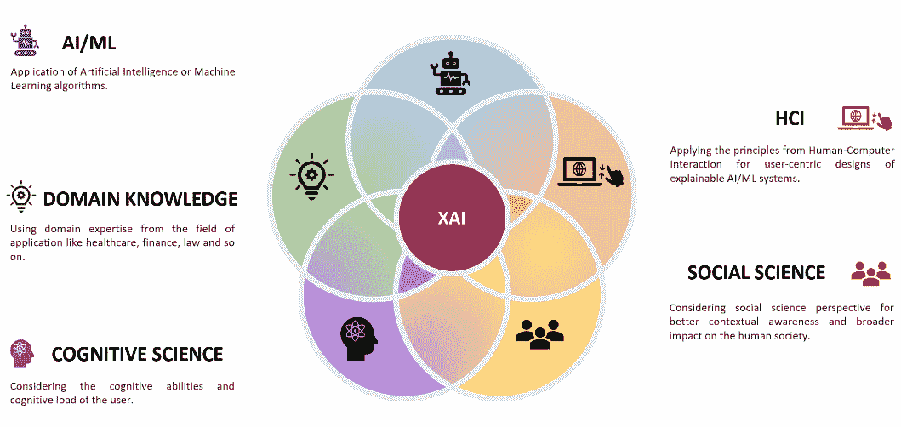
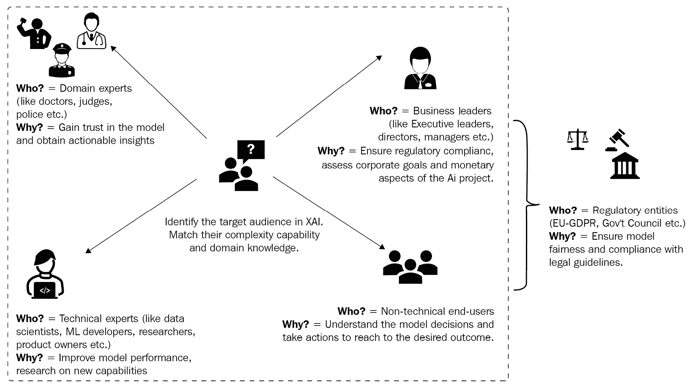

# *第十章*：XAI 行业最佳实践

在本书的第一部分，我们讨论了与**可解释人工智能**（**XAI**）相关的各种概念。这些概念是通过多年的研究建立的，考虑了人工智能的多种应用领域。然而，随着人工智能在工业用例中的采用增加，最近才感觉到对 XAI 在工业应用中的需求。不幸的是，由于某些挑战和如何实施人性化的可解释性方法的差距，XAI 在工业用例中的普遍认识仍然不足。

在*第二部分*，*实际问题解决*中，我们介绍了许多流行的 XAI Python 框架，这些框架通常用于解释**机器学习**（**ML**）模型的工作原理。然而，仅仅了解如何在实践中应用 XAI Python 框架是不够的，工业问题需要可扩展和可持续的解决方案。因此，对于我们来说，讨论 XAI 在可扩展和可持续的 AI 解决方案中的最佳实践非常重要，这些解决方案用于解决工业问题。

多年来，XAI 已经发展了很多。从学术研究的主题，XAI 现在已成为 AI 和 ML 工业实践者工具箱中的强大工具。然而，XAI 在许多开放挑战上仍然存在，研究社区仍在努力工作，以使 AI 更接近最终用户。因此，我们将讨论 XAI 的现有挑战和设计可解释 ML 系统的通用建议，同时考虑开放挑战。此外，AI/ML 系统的质量与底层数据的质量一样好。因此，我们还将关注采用以数据为先的方法对于模型可解释性的重要性。

XAI 研究社区认为，XAI 是一个多学科视角，应该以最终用户为中心。因此，我们将讨论**交互式机器学习**（**IML**）的概念，以创造高用户参与度的工业 AI 系统。最后，我们将介绍使用 AI/ML 作为方法来揭示 AI 模型复杂性的重要性，从而使 AI 可解释并增加用户的信任。

与前几章不同，在本章中，我们不会关注实际应用或学习新的 XAI 框架。我们的目标是了解 XAI 在工业用例中的最佳实践。因此，在本章中，我们将讨论以下主题：

+   XAI 的开放挑战

+   设计可解释机器学习系统的指南

+   采用以数据为先的方法进行可解释性

+   强调以可解释性为目的的交互式机器学习（IML）

+   强调可解释性的规范性见解

因此，让我们进一步了解这些主题。

# XAI 的开放挑战

如简要讨论的那样，XAI 领域已经取得了一些显著的进展。XAI 不再仅仅是学术研究的主题；XAI 框架的可用性使得 XAI 成为工业实践者的重要工具。但这些框架足以增加 AI 的采用率吗？不幸的是，答案是否定的。XAI 还需要进一步成熟，因为有一些开放性的挑战，一旦解决，可以显著缩小 AI 与最终用户之间的差距。让我们接下来讨论这些开放性的挑战：

+   *在模型开发者和最终用户之间转移焦点*：在本书中探索了许多 XAI 框架之后，你可能也感觉到，大多数框架提供的可解释性需要 ML、数学或统计学的技术知识才能真正理解模型的运作。这是因为可解释性方法或算法主要是为 ML 专家或模型开发者设计的。

随着越来越多的最终用户开始使用 AI 模型和系统，对非技术性、人性化的解释的需求正在增长。因此，对于工业应用来说，在模型开发者和最终用户之间动态转移焦点是一个挑战。

对于非技术性的最终用户来说，除非提供明确的信息，否则像特征重要性可视化这样的简单解释方法可能会变得非常复杂。为了减轻这一挑战，一般的建议是设计以用户为中心的 AI 系统。类似于任何软件应用或系统，用户应该在开发初期就参与其中，了解他们的需求，并在设计应用时包括他们的专业知识，而不是在应用生产之后。

+   *缺乏利益相关者参与*：从上一个观点来看，尽管建议尽早让最终用户参与 AI 系统的开发过程，但让利益相关者加入开发过程也可能是一个挑战。对于大多数工业用例，AI 解决方案是在不涉及最终利益相关者的情况下独立开发的。根据人机交互（**HCI**）领域的原则，用户应该在开发过程中参与其中。

考虑到高度敏感的领域，如医疗保健、金融、法律和监管，获取利益相关者和领域专家可能是一个极其繁琐且昂贵的流程。利益相关者的可用性可能是一个挑战。即使有必要的激励和补偿，他们的兴趣或参与开发过程的动机也可能很低。由于这些困难，将最终用户纳入开发过程，设计以用户为中心的 AI 系统变得困难。

应对这一挑战的最推荐行动是通过行业和学术界的合作。通常，如医学院、法学院或其他大学等学术机构可以更广泛地接触到各自领域的真实参与者或学生，他们可以成为*伪*参与者。

以下图表说明了 XAI 是一个多学科视角：

图 10.1 – XAI 是一个多学科视角

+   *特定应用的挑战*：不同的应用领域需要不同类型的可解释性。例如，在一个基于人工智能的贷款审批系统中，基于影响或基于示例的特征解释可能非常有帮助。然而，对于从 X 射线图像中检测 COVID-19 感染的应用，突出或定位感染区域可能更有帮助。因此，每个应用都可能有其自己的可解释性要求和定义，因此任何通用的 XAI 框架可能并不非常有效。

+   *缺乏定量评估指标*：解释方法的定量评估一直是重要的研究课题。不幸的是，目前还没有工具或框架可以定量评估解释方法的质量。这主要是因为许多不同的 AI 算法正在处理不同类型的数据。因此，有许多关于模型可解释性的定义和许多 XAI 的方法。因此，很难概括出适用于所有不同解释方法的定量评估指标。

目前，正在使用定性评估方法，如*信任*、*实用性*、*可操作性*、*与先验信念的一致性*、*影响*等。要了解更多关于这些指标的信息，请参阅*Accenture Labs*的*Understanding Machines: Explainable AI*，可在[`www.accenture.com/_acnmedia/pdf-85/accenture-understanding-machines-explainable-ai.pdf`](https://www.accenture.com/_acnmedia/pdf-85/accenture-understanding-machines-explainable-ai.pdf)找到。此外，还可以查看*Explanation in Artificial Intelligence: Insights from the Social Sciences*，由*Tim Miller*撰写，可在[`arxiv.org/pdf/1706.07269.pdf`](https://arxiv.org/pdf/1706.07269.pdf)找到。

定性评估方法确实是用户中心的，并使用人机交互（HCI）的原则从最终用户那里收集反馈，但通常，在比较不同方法时，定量指标更有用。然而，我希望能有像*Quantus* ([`github.com/understandable-machine-intelligence-lab/Quantus`](https://github.com/understandable-machine-intelligence-lab/Quantus))这样的工具，它用于评估神经网络解释方法，在几年内会显著成熟，这将使评估解释方法变得更加容易。

+   *缺乏可操作的解释*：大多数解释方法不向最终用户提供可操作的见解。因此，设计能够提供可操作解释的可解释 AI/ML 系统可能具有挑战性。反事实解释、假设分析以及基于交互式可视化的解释是唯一允许用户观察当输入特征改变时结果变化的解释方法。我建议增加这些可操作解释方法的使用，以开发可解释的 AI/ML 系统。

+   *缺乏上下文解释*：任何在生产中部署的机器学习算法都依赖于特定的用例和底层数据。因此，在可解释性、模型性能、公平性和隐私性之间总是存在权衡。因此，理解可解释性的上下文是任何通用 XAI 框架都无法准确提供的现有挑战。因此，缓解这一挑战的建议是为特定用例设计个性化的可解释机器学习系统，而不是通用的实现。

如果你想在这个领域进行更多探索，可以查看*Verma 等人*的工作，《可解释机器学习的陷阱：行业视角》([`arxiv.org/abs/2106.07758`](https://arxiv.org/abs/2106.07758))，了解更多关于 XAI 典型挑战的信息。所有这些开放挑战都是有趣的研究问题，你可以探索这些问题，以帮助研究界在这个领域取得进步。现在我们已经讨论了 XAI 的开放挑战，接下来，让我们讨论针对工业用例设计可解释机器学习系统的指南，同时考虑这些开放挑战。

# 设计可解释机器学习系统的指南

在本节中，我们将从行业角度讨论设计可解释机器学习系统的推荐指南，同时考虑上一节中讨论的 XAI 的开放挑战。所有这些指南都经过精心整理，来自各种出版物、会议主题演讲和来自 XAI、机器学习和软件系统领域的专家的圆桌讨论。确实，每个机器学习和人工智能问题都有其独特之处，因此很难泛化任何建议。但许多人工智能组织已经采用了以下列表中的指南来设计可解释且用户友好的机器学习系统：

+   *确定 XAI 的目标受众及其可用性环境*：可解释性的定义取决于使用 AI 系统的用户。*Arrieta 等人*在他们的工作《可解释人工智能（XAI）：概念、分类、机会和挑战，迈向负责任的人工智能》中强调了在设计可解释 AI 系统时确定 XAI 目标受众的重要性。

一个 AI 系统可以拥有不同的受众，例如技术利益相关者（即数据科学家、机器学习专家、产品所有者和开发者）、商业利益相关者（即经理和执行领导者）、领域专家（即医生、律师、保险代理等）、法律和监管机构，以及非技术最终用户。每个受众可能对可解释性有不同的需求，因此，解释方法应尽量满足受众的最佳需求。

作为初步步骤，确定可解释系统的目标受众以及他们将要使用系统的情境或背景，在设计中非常有帮助。例如，对于依赖机器学习模型预测糖尿病风险的医疗专家，解释方法的选择取决于他们的实际需求。如果他们的需求是建议改善糖尿病患者健康状况的措施，那么反事实示例可能非常有用。然而，如果他们的目的是找出导致糖尿病风险增加的因素，那么基于特征的解释方法更为相关。

*图 10.2* 展示了可解释 AI 系统的各种目标受众：

图 10.2 – 确定 XAI 的目标受众

+   *根据用户需求选择 XAI 技术*：一旦确定了目标受众及其可用性背景，以及关于数据集类型（例如，表格、图像或文本）和用于训练模型的机器学习算法的必要技术细节，根据*第二章*中所述的*模型可解释性方法*，选择一系列可能的解释方法非常重要。

这些预选的解释方法应与目标用户将用于与 AI 模型交互的软件系统相匹配。这意味着解释技术应与软件应用或界面良好集成，甚至应在软件设计过程中考虑，以确保一致的用户体验。

+   *以人为本的 XAI：在特定领域涉及最终用户的翻译和评估 XAI 的迭代过程*。类似于使用人机交互(HCI)的软件系统设计生命周期，XAI 也是一个迭代过程。它应以人为中心，并应持续评估以评估影响。在*第十一章*的*使用 XAI 进行以用户为中心的系统设计*部分，*以最终用户为中心的人工智能*中，我包括了以人为本的 XAI 设计过程中需要考虑的其他重要方面。

+   *XAI 中反馈循环的重要性*：所有可解释人工智能系统都应该有捕捉最终用户反馈的选项，以评估系统提供的解释的影响、相关性、有效性和可信度。在设计以及初始开发过程中，永远不可能考虑所有边缘情况和最终用户的所有偏好。但是，通过使用反馈循环，开发者可以收集关于解释方法的特定反馈，并在必要时对其进行修改。

+   *设计过程中可扩展性的重要性*：与为生产系统提供机器学习模型类似，可解释性也应该以模块化和可扩展的方式提供。提供模型解释的最佳方式是通过设计**可扩展的 Web API**，以便在集中式云服务器上部署。因此，当 XAI 在实践中得到实施时，务必确保解释是通过 Web API 提供的，这样它们就可以轻松地集成到任何软件界面或应用程序中。

+   *在数据、界面和可操作见解之间切换*：许多专家观察到，对于最终用户来说，他们对模型解释方法的满意度是在以下方面之间的权衡：解释如何与底层数据集（或他们的先验信念）相连接，用户如何与机器学习系统互动以增强对其的信心，以及解释如何鼓励他们采取行动以获得期望的输出。**数据为中心的可解释 XAI**、**IML**和**可操作解释**是设计工业用例的可解释人工智能系统时应考虑的更广泛的研究主题。

因此，我们已经了解了 XAI 的开放挑战，并讨论了在设计时考虑这些开放挑战的设计指南。现在，我们对在设计可解释的机器学习系统时需要考虑的内容有了相当的了解。接下来，让我们在接下来的章节中详细阐述最后一条推荐的指南，以仔细理解为什么它很重要。让我们从使用以数据为中心的方法来提高可解释性的重要性开始讨论。

# 采用以数据为中心的方法来提高可解释性

在*第三章* *数据为中心的方法*中，我们讨论了**数据为中心的可解释 XAI**的重要性和各种技术。现在，在本节中，我们将阐述采用以数据为中心的方法来提高可解释性如何有助于在工业用例中获得用户的信任。

以数据为中心的人工智能基于这样一个基本理念：*机器学习模型的质量与用于训练模型的底层数据集的质量一样好*。对于工业用例，处理质量差的数据集是大多数数据科学家面临的主要挑战。不幸的是，数据质量通常被忽视，因为数据科学家和机器学习专家被期望施展他们的*魔法*，构建接近 100%准确的模型。因此，机器学习专家简单地尝试遵循**以模型为中心的方法**，例如调整超参数或使用复杂算法来提高模型性能。即使模型性能略有提高，随着复杂性的增加，可解释性会降低。可解释性的缺乏增加了业务利益相关者的怀疑。此外，与数据质量相关的问题，如*数据异常*、*数据泄露*、*数据漂移*和其他问题，如在第三章“以数据为中心的方法”中讨论的那样，显著增加。*在这种情况下，我们该怎么办呢？*

解决方案是采用以数据为中心的方法来解释机器学习过程。使用以数据为中心的可解释性方法，例如**探索性数据分析**（**EDA**），我们可以从数据集中提取有关数据集的见解，例如任何有趣的模式、相关性、单调性或趋势，这些都是在数据集中使用的特征。在训练数据和推理数据之间的 EDA 和数据分析也有助于您识别数据质量问题。如果数据集中存在问题，始终建议您向业务利益相关者告知数据质量差的局限性，并正确设置关于模型性能的期望。因此，即使模型预测不正确，业务利益相关者也会理解局限性，而不是怀疑机器学习系统。

但我们为什么不尝试一下本书中涵盖的其他 XAI 框架和方法呢？采用以数据为中心的可解释性方法会有什么帮助呢？好吧，如果您适用，您可以尝试其他相关 XAI 方法，但以数据为中心的可解释性总是更容易向非技术用户解释。特别是，通过讨论在*第三章*“以数据为中心的方法”中的*数据概要方法*，我们可以确定数据集中每个类别（如果有分类问题）或预测变量的每个区间（如果有回归问题）中特征的值范围，并将模型预测与概要值进行比较。与复杂的数学概念（如*Shapley 值*）或其他在 XAI 框架中使用的算法相比，与概要值的简单比较更容易理解。

数据为中心的方法更可取的另一个原因是用户对历史数据的信任。一般来说，观察到大多数利益相关者对历史数据的信任比对 AI 模型的信任更高。例如，在春季，如果 AI 天气预报模型预测降雪，大多数最终用户可能会犹豫是否相信预测。这是因为春季总是与阳光和花朵盛开联系在一起，这是由于多年来全球的观察。但如果模型也表明在过去的几年里同一时间发生了降雪，或者甚至表明在过去的几天里附近有降雪，用户的信任就会更大。因此，建议您首先探索以数据为中心的可解释性，然后查看其他可解释性方法来解决任何工业机器学习问题。

下面的图表说明了数据为中心的 XAI 如何非常接近提供可解释性的自然方式，从而提高理解的便捷性：

![图 10.3 – 以数据为中心的方法对于可解释性的重要性]

![图片/B18216_10_003.jpg]

图 10.3 – 以数据为中心的方法对于可解释性的重要性

接下来，我们将讨论交互式机器学习来增强最终用户的信任。

# 强调以可解释性为中心的 IML

IML 是设计智能用户界面的范例，通过用户交互来促进机器学习和 AI 算法。在过去几年中，使用 IML 引导 ML 系统使用，以增加最终用户的信任，一直是 AI 和 HCI 研究社区的重要研究课题。许多研究文献推荐使用 IML 来增加 AI 系统的用户参与度。“交互式机器学习的最新研究进展”由 Jiang 等人撰写。（[`arxiv.org/abs/1811.04548`](https://arxiv.org/abs/1811.04548)）讨论了在 IML 领域取得的重大进展以及它与 ML 算法的信任和透明度增加的紧密关联。

IML 是 XAI 社区用来解释机器学习的另一种有趣的方法。即使在*DALEX*和*Explainerdashboards*等框架中，如在第九章*其他流行的 XAI 框架*中所述，提供交互式仪表板和用户可以与之交互的 Web 界面，也被视为模型可解释性的方式。IML 以以下方式帮助用户：

+   通过图表和视觉探索数据集，从而使用户更容易观察和记住数据中的关键见解。

+   对 ML 系统更有信心，因为智能用户界面允许用户进行更改并观察结果。这使得用户在考虑任何输入更改时更容易了解模型的行为。

+   通常，当提供交互式界面时，假设分析和局部可解释性会得到改善。

+   交互式机器学习（IML）赋予用户更多的控制权来探索系统，IML 通常考虑以用户为中心的设计流程，以提供针对特定用例量身定制的界面。

简而言之，交互式机器学习（IML）改善了用户体验，从而有助于提高 AI 模型的采用率。我强烈建议将交互式用户界面作为可解释机器学习系统的一部分，同时使用模块化的 Web API 来提供模型的可解释性。您可以阅读以下文章，了解更多关于交互式机器学习（IML）在解决商业问题方面的有用性：[`hub.packtpub.com/what-is-interactive-machine-learning/`](https://hub.packtpub.com/what-is-interactive-machine-learning/)。

下图说明了传统机器学习与交互式机器学习之间的差异：

![Figure 10.4 – Comparing conventional ML with IML]

![img/B18216_10_004.jpg]

图 10.4 – 比较传统机器学习与交互式机器学习

如您从前面的图中所见，使用交互式机器学习（IML），最终用户可以直接与智能用户界面交互，以获取预测、解释和见解。接下来，让我们讨论规范性见解对于可解释机器学习系统的重要性。

# 强调规范性见解的可解释性

规范性见解是数据分析中常用的术语。它意味着从数据集中提供可操作的推荐，以实现期望的结果。它通常被认为是在数据驱动决策过程的整个过程中起到催化剂的作用。在 XAI 的背景下，如**反事实示例**、**数据中心的 XAI**和**假设分析**等解释方法被广泛用于向用户提供可操作的建议。

除了反事实之外，**机器学习中的可操作回溯**这一概念也被用于生成规范性见解。**可操作回溯**是指用户通过修改可操作的特征来改变机器学习模型的预测的能力。但**它与反事实有何不同呢**？可操作回溯可以被视为反事实示例想法的扩展，它使用可操作的特征而不是数据集中所有现存的特性。

现在，**我们所说的可操作特征是什么意思呢**？考虑一个实际场景，我们不可能在数据集中改变所有特征以任何方向达到期望的结果。例如，如**年龄**、**性别**和**种族**这样的特征无法在任何方向上改变以获得期望的输出。不幸的是，用于生成反事实示例的算法并没有考虑改变特征的实际可行性。

假设一个机器学习模型正在被用来估计糖尿病的风险。对于一个糖尿病患者来说，如果我们想使用反事实示例来推荐如何降低糖尿病的风险，患者实际上不可能通过减少 10 岁年龄或改变性别来降低风险，这是不切实际的。因此，这些是非操作性的特征。尽管理论上改变这些特征可以改变模型的预测，但实际上改变这些特征是不切实际的。因此，可操作回溯的概念更像是一个应用于可操作特征的受控反事实生成过程，并考虑了特征值的实际可行边界条件。

要生成规范性洞察，我建议你使用可操作回溯，因为它考虑了改变特征值以获得期望结果的实际可行性和难度。你可以从*Ustun 等人*的工作中了解更多关于可操作回溯的信息，*线性分类中的可操作回溯*([`arxiv.org/abs/1809.06514`](https://arxiv.org/abs/1809.06514))，以及他们的 GitHub 项目[`github.com/ustunb/actionable-recourse`](https://github.com/ustunb/actionable-recourse)。

但在 XAI 中，*规范性洞察真的必要吗*？答案是*是的*！以下列出的原因解释了为什么规范性洞察在 XAI 中很重要：

+   规范性洞察是为用户提供以获得期望结果的建议的行动。在大多数工业用例中，如果用户不知道如何达到他们的期望结果，可解释性是不完整的。

+   生成规范性洞察是解释机器学习模型工作原理的一种主动方法。这是因为它允许用户采取必要的主动行动，而不是信任他们被动收到的解释。

+   通过给予用户对系统的控制感，它增加了用户对系统的信任。使用可操作的解释，用户被赋予了改变模型预测的能力。

+   它增加了企业利益相关者做出数据驱动决策的能力。

这些是你为什么在设计用于工业问题的可解释人工智能系统时，始终应考虑生成可操作解释的主要原因。*图 10.5*展示了使用 XAI 的规范性洞察如何为用户提供可操作的建议，以获得他们期望的结果：

图 10.5 – 可解释性中规范性洞察的重要性

通过这种方式，我们已经到达了本章的结尾。让我们总结一下接下来讨论的主题。

# 摘要

本章重点介绍了为工业问题设计可解释人工智能系统的最佳实践。在本章中，我们讨论了 XAI 的开放挑战和可解释机器学习系统的必要设计指南，考虑到开放挑战。我们还强调了在设计中考虑以数据为中心的可解释性、IML 和规范性洞察的重要性。

如果你是一位负责使用人工智能解决工业问题的技术专家、架构师或业务领导者，这一章节帮助你学习了在设计可解释人工智能/机器学习系统时考虑 XAI 中的开放挑战的一些最重要的指导原则。如果你是人工智能或人机交互领域的学者，章节中讨论的一些开放挑战可能成为值得考虑的研究课题。解决这些挑战可以在 XAI 领域取得重大进展。

在下一章中，我们将介绍**以最终用户为中心的人工智能**的原则，以弥合人工智能与最终用户之间的差距。

# 参考文献

如需了解本章涉及主题的更多信息，请参阅以下资源：

+   *《可解释机器学习的陷阱：行业视角》*：[`arxiv.org/abs/2106.07758`](https://arxiv.org/abs/2106.07758)

+   GitHub 上的 Quantus 框架：[`github.com/understandable-machine-intelligence-lab/Quantus`](https://github.com/understandable-machine-intelligence-lab/Quantus)

+   *《人工智能中的解释：来自社会科学的见解》*：[`arxiv.org/pdf/1706.07269.pdf`](https://arxiv.org/pdf/1706.07269.pdf)

+   *《Quantus：用于神经网络解释负责任的评估的可解释人工智能工具包》*：[`arxiv.org/abs/2202.06861`](https://arxiv.org/abs/2202.06861)

+   *《理解机器：可解释人工智能》*，来自 *Accenture Labs*：[`www.accenture.com/_acnmedia/pdf-85/accenture-understanding-machines-explainable-ai.pdf`](https://www.accenture.com/_acnmedia/pdf-85/accenture-understanding-machines-explainable-ai.pdf)

+   *《线性分类中的可操作救济》*，作者：*Ustun et al*：[`arxiv.org/abs/1809.06514`](https://arxiv.org/abs/1809.06514)

+   ML 中的可操作救济：[`github.com/ustunb/actionable-recourse`](https://github.com/ustunb/actionable-recourse)

+   *《质疑人工智能：为可解释人工智能用户体验提供设计实践的信息》*，作者：*Liao et al*：[`dl.acm.org/doi/10.1145/3313831.3376590`](https://dl.acm.org/doi/10.1145/3313831.3376590)

+   *《可解释人工智能（XAI）的进展与开放性问题：来自人机交互研究者的实用视角》*，作者：*Q. Vera Liao*：[`qveraliao.com/aaai_panel.pdf`](http://qveraliao.com/aaai_panel.pdf)
