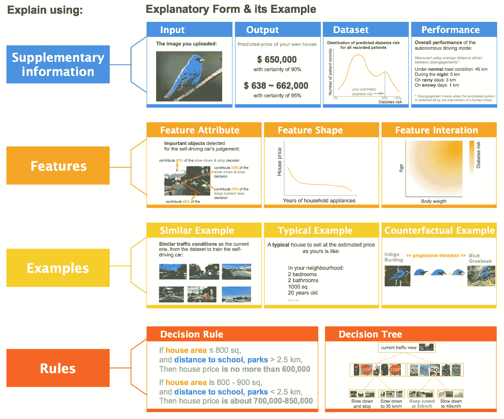

# *第十一章*：以最终用户为中心的人工智能

在本书的过去 10 章中，我们已经走过了**可解释人工智能**（**XAI**）的全景，涵盖了实践中用于不同可解释性维度（*数据*、*模型*、*结果*和*最终用户*）的不同类型的可解释性方法。XAI 是一个活跃的研究领域，我认为它尚未达到其全部潜力。但该领域正在迅速发展，与更广泛的 AI 领域一起，我们将见证许多新的算法、方法和工具在未来被开发出来。很可能会出现新的 XAI 方法和工具将优于现有的方法，并能解决在*第十章*，“XAI 行业最佳实践”中讨论的一些**XAI 的开放挑战**。不幸的是，我们无法扩大本书的范围以涵盖所有可能的 XAI 方法。然而，本书的目标是提供该领域的概念理解和所需实践技能的结合，使其成为初学者的有用起点，甚至为专家提供 XAI 应用知识的补充。

在上一章中，我们从行业角度讨论了实施可解释的**机器学习**（**ML**）系统的推荐实践。我们还讨论了 XAI 的现有挑战以及一些缓解挑战的推荐方法。考虑到这些现有挑战，在本章中，我们将重点关注**以最终用户为中心的人工智能**（**ENDURANCE**）的理念。这是一个常用来指代以用户为中心构建的可持续和可扩展的 AI 解决方案的术语。建议您在开始本章之前阅读上一章，以便更好地理解。ENDURANCE 既不是一个新的算法，也不是一个用于 XAI 的新颖、复杂的工具。相反，它是一种实践；它是一种系统性的学科，用于弥合 AI 与最终用户之间的差距。

本章对于从**多学科视角**看待 XAI 的 AI 和**人机交互**（**HCI**）领域的学者特别有用。对于希望利用 AI 推动问题解决并考虑无缝**用户体验**（**UX**）的企业领导者来说，本章也很有用。对于 AI 开发者和思想领袖，本章将帮助您在设计 AI 解决方案时以最终用户为中心，并促进 AI 的采用。

本章重点讨论以下主要主题：

+   以用户为中心的 XAI/ML 系统

+   使用 EUCA 进行快速 XAI 原型设计

+   通过 XAI 提高用户对 AI/ML 系统接受度的努力

+   提供愉悦的用户体验

+   XAI 的下一步是什么？

让我们继续讨论下一节的第一主题。

# 以用户为中心的 XAI/ML 系统

对于大多数工业问题，AI 解决方案都是在孤立的情况下开发的，用户仅在最小可行解决方案准备好的开发过程的最后阶段被引入。采用这种传统方法，常常发现产品负责人或产品经理倾向于从开发团队的视角来预测解决方案，以满足用户的目标。嗯，这种方法绝对没问题，并且对于需要技术团队通过抽象进行开发的某些用例来说，可能会非常有效。然而，如果用户没有在实施过程的早期阶段参与，常常发现用户不愿意采用该解决方案。因此，ENDURANCE 理念专注于从解决方案的设计阶段就涉及最终用户来开发解决方案。

ENDURANCE 理念专注于人机交互（HCI）的原则，并强调用户*分布式认知*的重要性。根据这一理念，整个解决方案，包括**用户界面**（**UI**）、*AI 算法*、*底层数据集*、*XAI 组件*和*最终用户体验*，被视为一个整体系统，而不是孤立地考虑各个组件。这确保了可解释性被内置于系统中，而不是作为提供给用户的附加服务。从我观察到的来看，大多数工业 AI 解决方案都是作为单独的组件在孤立的情况下开发的，然后作为*附加功能*或*高级功能*添加到主软件系统中。同样，XAI 组件也是在孤立开发后被视为附加功能。因此，无缝的用户体验可能会受到影响，AI 解决方案和 XAI 组件的主要好处可能无法充分发挥。这就是为什么我们应该关注整个以用户为中心的 XAI/ML 系统的设计和开发。

接下来，让我们讨论在设计解决方案时应该考虑的以最终用户为中心的 XAI 的各个方面。

## 以最终用户为中心的 XAI 的不同方面

在本节中，我们将讨论在设计 XAI 系统时应该整合的不同人因原则，使用 ENDURANCE 理念来弥合 AI 和最终用户之间的差距。

### 目标相关性

人机交互领域试图解决的主要问题是*用户是谁？*和*他们的需求是什么？*或者换句话说，它试图理解解决方案对用户的*目标相关性*。如果提供的解决方案没有通过满足用户需求来有效解决问题，而没有引入其他挑战，那么它是不相关的。不考虑目标相关性可能是大多数 AI 解决方案被废弃或带着很多怀疑态度采用的主要原因之一。

评估目标相关性的推荐方法是检查用户是否能够在不引入其他挑战的情况下实现他们的目标。除了目标相关性之外，我经常建议评估解决方案的影响。当解决方案不存在时，可以通过收集用户的反馈来定性衡量解决方案的影响。

### 将用户需求与 AI 优势联系起来

如前所述，在大多数工业用例中，XAI 被单独使用以提供可解释性，而不考虑用户需求。相反，使用 ENDURANCE 的理念，XAI 应该将用户需求与 AI 算法的优势联系起来。一旦确定了用户需求，*将用户需求转化为数据需求和模型需求*。如果基础数据集不足以满足所有用户需求，则使用**以数据为中心的 XAI**向用户传达数据集的限制。如果确定了模型需求，则使用 XAI 来解释模型的工作原理，并相应调整以满足用户需求。

但这个过程可能具有挑战性，因为它涉及到识别用户的现有*心理模型*。随着 AI 和 XAI 的引入，现有的工作流程不应被打乱。

此外，还建议使用 XAI 尝试解释 AI 解决方案是否增加了任何独特的价值。但设计可解释性方法以证明优势，而不是所使用的底层技术。例如，如果系统向用户传达使用复杂的深度学习算法来预测结果，这并不会增加用户的信心。相反，如果系统传达智能解决方案可以帮助用户比传统方法快五倍地达到目标，用户将同意采用该解决方案。

### 用户界面 - 连接用户与 AI 解决方案的媒介

考虑到传统方法，大多数 AI 从业者只专注于开发准确的 AI 模型，而对用户与模型之间的交互关注较少。通常，用户与 AI 组件的交互由软件工程团队决定；不幸的是，在大多数组织中，数据科学和 AI 团队是孤立的。但 UI 控制着 AI 模型的可视化、可解释性或可理解性的水平，并在影响用户对系统的信任方面发挥着至关重要的作用。

在 *第十章* *XAI 行业最佳实践* 中，当我们讨论 **交互式机器学习** (**IML**) 时，我们讨论了用户通过 UI 与系统交互如何增强用户对 AI/ML 系统运作的信心。因此，UI 应与 AI 模型及其可解释性方法保持一致，以校准用户的信任。您可以在 Google PAIR 的 People + AI Guidebook 中了解更多关于如何使用 UI 校准用户信任的信息：[`pair.withgoogle.com/chapter/explainability-trust/`](https://pair.withgoogle.com/chapter/explainability-trust/)。

### 在解决方案的开发过程中尽早让最终用户参与

与传统方法不同，以用户为中心的方法建议在开发过程中尽早让最终用户参与。实际上，最终用户应该从系统的 UI 设计阶段就开始参与，以确保用户的需求正确映射到界面上。与解决方案的设计和开发生命周期类似，可解释性也应该通过从用户那里获取持续反馈的迭代过程来发展。

ENDURANCE 理念将 XAI/ML 系统视为一种解决方案，因此整个解决方案应包含一个 *设计阶段*、*原型阶段*、*开发阶段* 和 *评估阶段*。这四个阶段共同构成 *一次设计和开发迭代*。同样，整个解决方案应在多次迭代中成熟，确保用户参与每个迭代的每个阶段。这个过程也与软件工程中遵循的 *敏捷方法* 保持一致。在每个阶段让用户参与确保能够收集到有用的反馈，以评估解决方案是否满足了用户的需求。早期参与也确保用户熟悉新系统的设计和运作。用户对系统的熟悉程度提高了系统的采用率。

### 将反馈与个性化相结合

如前文所述，在解决方案的设计和开发过程中，每个阶段的用户反馈的重要性是不可避免的。但有时，解决方案的一般框架并不能满足用户的所有需求。

例如，当使用反事实示例时，技术上可以生成使用所有用于预测的特征的示例。但假设用户只对改变一组特定的可操作变量感兴趣。在这种情况下，受控的反事实应该只修改对用户有吸引力的特征。研究发现，定制的个性化解决方案通常比通用的解决方案对最终用户更有用。因此，尝试使用从用户那里获得的反馈，提供满足用户特定痛点的个性化解决方案。

### 上下文和可操作的 AI

如我们之前在*第十章*中讨论的，*XAI 行业最佳实践*，解释应该是情境化的并且可操作的。整个 XAI/ML 系统也应该与用户的行为保持一致，并具有情境意识。XAI 在将 AI 与用户行为连接以及将任何 AI 解决方案修改为情境化 AI 解决方案方面发挥着至关重要的作用。

在他的文章*情境 AI：人工智能的下一个前沿*([`business.adobe.com/blog/perspectives/contextual-ai-the-next-frontier-of-artificial-intelligence`](https://business.adobe.com/blog/perspectives/contextual-ai-the-next-frontier-of-artificial-intelligence))中，*Oliver Brdiczka*定义了情境 AI 的以下四个支柱：

+   **可理解**：情境 AI 系统应该能够解释其知识和工作原理。

+   **自适应**：情境 AI 系统应该能够适应不同环境中用户的不同需求。

+   **可定制**：用户应该能够控制或修改系统以满足他们的需求。

+   **情境感知**：系统应该能够以与人类相同水平感知事物。

下图显示了情境 AI 的四个不同组件：

![图 11.1 – 情境 AI 的四个组件（灵感来源于 https://business.adobe.com/blog/perspectives/contextual-ai-the-next-frontier-of-artificial-intelligence)]

![img/B18216_11_001.jpg]

图 11.1 – 情境 AI 的四个组件（灵感来源于 https://business.adobe.com/blog/perspectives/contextual-ai-the-next-frontier-of-artificial-intelligence)

因此，考虑到以用户为中心的方法，XAI/ML 系统的 XAI 组件应提供可操作的见解，并且应该是情境化的，以进一步弥合 AI 与最终用户之间的差距。既然我们已经讨论了以用户为中心的方法来弥合 AI 与最终用户之间可能存在的差距，考虑到在第十章中讨论的 XAI 的开放挑战，*XAI 行业最佳实践*，让我们讨论使用**以最终用户为中心的可解释人工智能**（**EUCA**）框架进行快速 XAI 原型设计。

# 使用 EUCA 进行快速 XAI 原型设计

在上一节中，我们讨论了以用户为中心的 XAI/ML 系统的关键要素。在本节中，我们将强调在 ENDURANCE 理念中快速原型设计的重要性。*快速原型设计*是软件工程中广泛采用的一个概念，因为软件可能是人类创造的最可塑的东西。快速构建原型是收集软件产品开发早期阶段的有用用户反馈的方法。因此，即使是设计以用户为中心的 XAI/ML 系统，快速原型设计也非常重要。

*金等*，在他们的研究工作 *EUCA：以最终用户为中心的可解释 AI 框架* ([`arxiv.org/abs/2102.02437`](https://arxiv.org/abs/2102.02437)) 中，介绍了一个名为 EUCA 的工具包。EUCA 是一个非常有趣的框架，主要由 UX 研究人员、人机交互研究人员和设计师、AI 科学家和开发者设计，旨在为非技术最终用户构建快速 XAI 原型。EUCA 框架的官方 GitHub 仓库可在 [`github.com/weinajin/end-user-xai`](https://github.com/weinajin/end-user-xai) 找到。强烈建议使用 EUCA 构建低保真原型，并根据持续的用户反馈迭代改进原型，以提升 XAI/ML 系统的用户接受度。

该框架提供以下重要组件：

+   12 种设计人性化的解释形式

+   用于与功能原型集成的对应 XAI 算法

+   相关的设计模板及其使用示例

+   建议的原型工作流程

+   从用户研究结果中获得的各类解释方法的详细优缺点

+   对最终用户多样化的解释需求进行科学分析（例如，信任校准、偏差检测以及与 AI 的分歧解决）

下图展示了 EUCA 框架目前支持的不同类型的解释方法：

图 11.2 – 在 EUCA 中支持的不同类型的解释方法

该框架是一个很好的起点，并且绝对推荐用于构建快速 XAI 原型。接下来，让我们讨论一些可以采取的额外努力，以提高用户对 AI/ML 系统的接受度。

# 使用 XAI 提高 AI/ML 系统用户接受度的努力

在本节中，我们将讨论一些推荐的做法，以提高使用 XAI 的 AI/ML 系统的接受度。在大多数软件系统中，**用户接受测试**（**UAT**）阶段用于确定软件的“通过”或“不通过”。同样，在最终生产阶段之前，越来越多的组织更喜欢为 AI/ML 系统进行稳健的 UAT 过程。但在进行 AI/ML 系统的 UAT 时，**AI 算法的可解释性有多重要**？**可解释性能否增加 AI 的用户接受度**？简短的答案是**是的**！让我们通过以下要点来了解为什么：

+   **用户接受度是用户信任的证明** – 由于 XAI 可以增加用户对 AI 的信任，它增加了用户接受解决方案的机会。现在，信任不是仅仅在 UAT 阶段就能建立的；相反，信任应该从开始就建立，并在整个开发过程中保持。系统的能力和限制应该从一开始就传达，以设定一个清晰的期望，即什么可行，什么不可行。

+   **将风险容忍度估计作为 UAT 标准** – 很明显，AI 系统不可能每次都 100%准确。实现零错误或零失败的系统在实际上是不可能的。但作为一种推荐做法，记录系统的可能故障点和潜在故障的后果被称为**风险**。**风险容忍度**是系统在不造成巨大影响的情况下可以犯的最大允许错误。因此，在 UAT 阶段，定义解决方案的风险并估计用户最大风险容忍度非常重要。系统在风险容忍度内的性能应被视为 UAT 过程的成功标准。

+   **在 UAT（用户验收测试）过程之前尽可能多地执行用户研究** – 用户研究和用户反馈的定性和定量分析是评估系统影响力和信任度的确定方式。因此，在 UAT 过程之前进行多次用户研究，并确保用户在接受原型解决方案之前直接将系统投入生产。

之前的方法是提高用户接受度的确定方式，但最终，用户接受度取决于整体用户体验。在下一节，我们将进一步讨论提供愉悦用户体验的重要性。

# 提供愉悦的用户体验

在本节中，我们将关注整体用户体验的重要性，以促进 XAI/ML 系统的采用。*阿伦·沃尔特*在他的书《情感设计》([`abookapart.com/products/designing-for-emotion`](https://abookapart.com/products/designing-for-emotion))中提到了在更高动机影响用户行为之前必须满足的用户需求的基础要素。根据他的用户需求层次结构，*愉悦*或*令人愉悦*的 UX 位于金字塔的顶端。以下图显示了阿伦·沃尔特的用户需求层次结构：

![图 11.3 – 阿伦·沃尔特的用户需求层次结构

![img/B18216_11_003.jpg]

图 11.3 – 阿伦·沃尔特的用户需求层次结构

这个用户需求层次结构定义了在解决用户的高级需求之前应该满足的最终用户的基本需求。因此，如果一个系统仅仅是*功能性*、*可靠*和*可用*，那么除非整体用户体验是愉悦和令人享受的，否则采用该系统是不够的！因此，XAI/ML 系统也应考虑提供无缝的整体体验，以真正弥合 AI 与最终用户之间的差距。

这本书的上一章到此结束。我们将在下一节总结讨论的关键主题。

# 摘要

在本章中，我们主要讨论了使用 ENDURANCE 理念设计和开发 XAI/ML 系统。我们讨论了使用 XAI 引导我们朝着构建 XAI/ML 系统的终端用户主要目标的重要性。通过本章中提出的一些原则和推荐的最佳实践，我们可以极大地弥合 AI 和终端用户之间的差距！

这也标志着本书的结束！恭喜您到达终点！本书精心设计，旨在包括对各种 XAI 概念和术语的概念理解，提供使用流行 XAI 框架进行应用问题解决的实用示例，从工业角度提供真实案例和经验，以及参考重要研究文献以进一步扩展您的知识。本书从工业和学术研究的角度介绍了 XAI 领域。本书讨论的开放挑战和 XAI 研究主题的下一阶段是人工智能研究社区正在探索的重要研究问题。

尽管这本书几乎触及了 XAI 领域的各个方面，但显然还有更多值得探索和揭示。我的建议是不要局限于这本书所提供的内容。相反，将这本书作为参考起点，但探索并应用从这本书中获得的知识，将其应用于实际案例，并向前迈进，为社区做出贡献！

# 参考文献

请参考以下资源以获取更多信息：

+   *来自 Google PAIR 的“人+AI 指南”：[`pair.withgoogle.com/chapter/explainability-trust/`](https://pair.withgoogle.com/chapter/explainability-trust/)

+   *金等人*，《EUCA：以终端用户为中心的可解释人工智能框架》：[`arxiv.org/abs/2102.02437`](https://arxiv.org/abs/2102.02437)

+   *EUCA：以终端用户为中心的可解释人工智能框架 GitHub 仓库*：[`github.com/weinajin/end-user-xai`](https://github.com/weinajin/end-user-xai)

+   *阿伦·沃尔特*，《情感设计》：[`abookapart.com/products/designing-for-emotion`](https://abookapart.com/products/designing-for-emotion)

+   *奥利弗·布迪奇卡*，《情境 AI：人工智能的下一个前沿》：[`business.adobe.com/blog/perspectives/contextual-ai-the-next-frontier-of-artificial-intelligence`](https://business.adobe.com/blog/perspectives/contextual-ai-the-next-frontier-of-artificial-intelligence)
