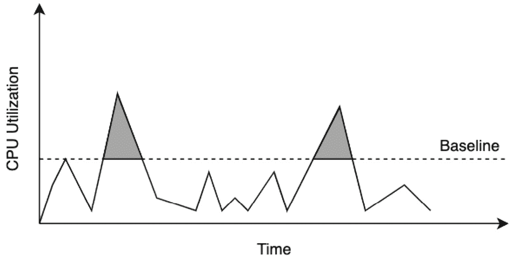

# 3

# 计算和网络

许多大型和小型组织在 AWS 上运行工作负载，使用 AWS 计算服务。在这里，AWS **计算**指的是 AWS 上的一组服务，帮助您构建和部署自己的解决方案和服务；这可以包括网站、数据分析引擎、**机器学习**（**ML**）、**高性能计算**（**HPC**）等多种多样的工作负载。作为最早发布的服务之一，**Amazon Elastic Compute Cloud**（**EC2**）有时与术语*计算*同义使用，并为您的各种工作负载提供广泛的实例类型、处理器、内存和存储配置。

除了 EC2 之外，适合某些特定类型工作负载的计算服务还包括 Amazon **弹性容器服务**（**ECS**）、**弹性 Kubernetes 服务**（**EKS**）、Batch、Lambda、Wavelength 和 Outposts。**AWS 上的网络**指的是基础网络服务，包括 Amazon **虚拟私有云**（**VPC**）、AWS Transit Gateway 和 AWS PrivateLink。这些服务以及各种计算服务，使您能够在全球范围内构建最安全、性能最高的网络化系统解决方案。AWS 计算和网络概念是两个广泛的主题，对于理解以下章节中将要讨论的许多概念非常重要。

计算和网络也是 HPC 的两个重要支柱，与上一章讨论的数据管理一样。HPC 的每个应用通常都针对高水平的分布式计算进行优化，这依赖于网络。

在本章中，您将了解 AWS 提供的不同计算和网络服务，这些服务如何用于不同类型的计算工作负载，以及最后，AWS 上 HPC 类型工作负载的最佳实践，这超出了 AWS Well-Architected Framework 的范围。

具体来说，在本章中，我们将涵盖以下主题：

+   介绍 AWS 计算生态系统

+   AWS 上的网络

+   选择适合 HPC 工作负载的正确计算资源

+   HPC 工作负载的最佳实践

# 介绍 AWS 计算生态系统

计算是您将在本书内外阅读的每个 HPC 应用的基础。在 AWS 和其他云服务中，计算指的是一组提供执行计算或某些业务逻辑基本构建块的服务。这可以包括从基本数据计算到机器学习（ML）的各种应用。

在 AWS 上衡量计算能力的基准单位（无论我们讨论的是哪种服务）如下：

+   *处理单元* - 这可以衡量为中央处理单元（**CPUs**）、虚拟中央处理单元（**vCPUs**）或图形处理单元（**GPUs**）的数量

+   *内存* - 这是应用程序请求或分配的总内存，以字节为单位

典型的 HPC 应用访问多个实例，因此可以利用池化的计算和内存资源来处理更大的工作负载。

为客户提供计算资源以在 AWS 上构建应用程序的基础服务称为 Amazon EC2。Amazon EC2 为客户提供约 500 种实例类型的选择（根据撰写本书时的公开文档）。然后，客户可以为他们的业务应用程序定制合适的实例类型组合。

Amazon EC2 提供五种类型的实例：

+   通用型实例

+   计算优化实例

+   加速计算实例

+   内存优化实例

+   存储优化实例

列出的每种实例类型实际上都是一个实例系列，如图 *3.1* 所示：


图 3.1 – Amazon EC2 实例类型

在下一节中，我们将突出介绍这些实例类型的一些重要事实。

## 通用型实例

通用型实例可用于各种工作负载。它们具有计算、内存和存储之间的平衡，适合大多数典型的 AWS 客户应用程序。在 AWS 上，有几种类型的通用型实例：

+   **T 型实例**：T 型实例，例如 T2 实例，是*可爆增*实例，为低计算和内存占用工作负载提供基本计算能力。以下图示展示了适合 T 型实例的典型工作负载可能的样子——大部分时间都低于基线 CPU 利用率，偶尔需要*爆增*超过这个基线。对于非可爆增实例，应用程序所有者需要为爆增 CPU 级别进行过度配置，因此即使利用率很低，也需要支付更多费用。对于可爆增 T 型实例，当利用率低于基线（基线以下的白色区域）时，会累积信用，这些信用可以在应用程序遇到更高负载时使用；请参见以下图中灰色填充的区域：



图 3.2 – AWS 上可爆增 T 型实例的 CPU 利用率与时间对比

+   **M 型实例**：M 型实例（如 M4、M5 和 M6）可用于需要计算、内存和网络平衡的各种工作负载，包括但不限于 Web 和应用程序服务器，以及小型到中型数据库工作负载。M5 和 M6 实例的特殊版本适用于某些工作负载。例如，M5zn 实例类型可用于需要极高单线程性能的应用程序，如高性能计算、模拟和游戏。

+   **A 型实例**：A1 实例用于运行基于**高级精简指令集机器**或**ARM**的应用程序，例如由 AWS Graviton ARM 处理器提供动力的微服务和 Web 服务器。

+   **Mac 型实例**：Mac1 实例由苹果的 Mac Mini 电脑供电，提供非常高的网络和存储带宽。它们通常用于构建和测试适用于 iPhone、Mac 等设备的苹果应用。

在下一节中，我们将讨论 AWS 上的计算优化实例。

## 计算优化实例

本书将描述的许多 HPC 应用都利用了 AWS 上高性能、计算优化的实例类型。

存在几种类型的计算优化实例：

+   **C5 实例**：C5 和 C5n 实例提供低成本、高性能的计算，适用于典型的 HPC、游戏、批处理和建模。C5 实例使用英特尔 Xeon 处理器（第一代和第二代），在单个核心上提供超过 3.4GHz 的时钟速度。C5a 实例还提供 AMD 处理器，以更低成本实现高性能。C5n 实例非常适合 HPC 应用，因为它们支持**弹性布线适配器**（**EFA**）并可实现高达每秒 100 吉比特的网络吞吐量。有关 EFA 的更多信息，请访问[`aws.amazon.com/hpc/efa/`](https://aws.amazon.com/hpc/efa/)。

+   **C6 实例**：C6g 实例是基于 AWS Graviton 处理器的 ARM 架构实例。它们非常适合运行高性能计算（HPC）工作负载、广告服务和游戏服务器。C6g 实例提供基于本地**非易失性内存表达式（NVMe**）的高性能、低延迟 SSD 存储，网络速度可达每秒 100 吉比特，并支持 EFA。另一方面，C6i 类实例基于英特尔 Xeon 处理器，每个实例可提供高达 128 个 vCPU，适用于典型的 HPC 工作负载。

+   **HPC 实例**：HPC6a 实例类型由第三代 AMD 处理器提供动力，以实现典型 HPC 工作负载的成本性能比。这些实例类型还提供 96 个 CPU 核心和 384GB 的 RAM，适用于内存密集型应用。HPC6a 实例还支持基于 EFA 的网络，吞吐量可达每秒 100 吉比特。

在下一节中，我们将讨论 AWS 上的加速计算实例。

## 加速计算实例

加速计算实例使用如 GPU 这样的协处理器来加速工作负载的性能，例如用于机器学习、深度学习和图形处理的浮点数计算。

加速计算实例使用以下基于硬件的计算加速器：

+   GPU

+   **现场可编程门阵列**（**FPGA**）

+   AWS Inferentia

### GPU

GPU 最初用于 3D 图形，但现在被用作各种应用的通用协处理器，如 HPC 和深度学习。HPC 应用计算和带宽密集。AWS 上提供了多种类型的 NVIDIA GPU，详细信息可在以下链接找到：[`aws.amazon.com/nvidia/`](https://aws.amazon.com/nvidia/)。

让我们深入了解 GPU 如何帮助进行计算密集型计算的基础。想象一下将一个数字列表添加到另一个相同大小的数字列表中。直观上看，这就像以下图示：


图 2.3 – 添加两个数组

将这些添加到数组中的简单方法是遍历每个数组的所有元素，并将顶部和底部数组中相应的数字相加。这对于小型数组来说可能没问题，但对于数百万个元素的数组呢？要在 GPU 上完成这项工作，我们首先为这两个非常长的数组分配内存，然后使用 *线程* 来并行化这些计算。使用单个 GPU 上的单个线程添加这些数组与我们的早期简单方法相同。使用多个线程（例如 256 个）可以通过将部分工作分配给每个线程来帮助并行化此操作。例如，前几个元素（在这种情况下是总大小除以 256）将由第一个线程完成，依此类推。这通过让每个线程专注于较小的工作部分，并并行执行这些分割的加法操作来加快操作速度；请参见以下图中的阴影区域：


图 3.4 – 多个线程处理计算的一部分

今天的 GPU 架构允许更高的并行级别——多个处理线程组成一个块，通常 GPU 中有多个块。每个块可以在 **流式多处理器** (**SM**) 中并发运行，并处理相同的一组计算或 *内核*。直观上看，这就像以下图示：


图 3.5 – GPU 中的多个块

为了让您了解在 AWS 上可以访问的内容，考虑一下 **P4d.24xlarge** 实例。这个实例有八个 GPU，如下面的图所示，每个 GPU 都是一个包含 108 个 SM 的 NVIDIA A100，每个 SM 能够并行运行 2,048 个线程：


图 3.6 – 单个实例中的多个 GPU

在 AWS 上，P4d 实例可用于部署超级计算机或具有超过 4,000 个 A100 GPU 的 EC2 Ultracluster，以及 Amazon FSx for Lustre 上的可扩展、共享的高吞吐量存储（[`aws.amazon.com/fsx/lustre/`](https://aws.amazon.com/fsx/lustre/））。应用程序和包开发者使用 NVIDIA CUDA 库构建用于 HPC 和深度学习的海量并行应用程序。例如，PyTorch，一个流行的 ML 库，使用 NVIDIA 的 CUDA GPU 编程库进行大规模模型的训练。另一个例子是 Ansys Fluent，一个流行的 **计算流体动力学** (**CFD**) 模拟软件，它使用 GPU 内核来加速流体流动计算。

在 AWS 上，有几个系列的 GPU 实例：

+   **G 系列实例**：AWS 上的 G2、G3、G4 和 G5 类型实例提供经济高效的 GPU 资源访问。这里提到的每种 G 类型实例都配备了不同的 NVIDIA GPU – 例如，最新的 G5 实例配备了 NVIDIA A10G GPU，G5g 实例配备了 NVIDIA T4G GPU，而 G4Dn 则配备了 NVIDIA Tesla GPU。AMD 基础的 GPU 也可用 – 例如，G4ad 实例使用 AMD Radeon Pro V520 GPU。

+   **P 系列实例**：这些实例为单实例和分布式应用提供了高性能 GPU。P2 实例提供对 NVIDIA K80 GPU 的访问，P3 实例配备 NVIDIA Tesla V100 GPU，而 P4d 实例则配备 A10 GPU。

+   **VT1 实例**：这些实例提供访问 Xilinx Alveo U30 媒体加速卡，主要用于视频转码应用。有关 VT1 实例的更多信息，请参阅此处：[`aws.amazon.com/ec2/instance-types/vt1/`](https://aws.amazon.com/ec2/instance-types/vt1/)。

+   **AWS Inferentia**：这些实例专门设计用于提供经济高效且低延迟的机器学习推理能力，并由 AWS 定制制造。客户可以使用这些 *Inf1* 实例遵循的典型工作流程是使用 TensorFlow 等机器学习框架在另一个 EC2 实例或 SageMaker 训练实例上训练模型，然后使用 Amazon SageMaker 的编译功能 *Neo* 将模型编译用于与 Inf1 实例一起使用。您还可以使用 AWS Neuron SDK 对深度学习模型进行性能分析并将其部署到 *Inf1* 实例。

### FPGA 实例

Amazon EC2 F1 实例允许您在云上轻松开发并部署硬件加速应用。示例应用包括（但不限于）大数据分析、基因组学和与模拟相关的应用。开发者可以使用高级 C/C++ 代码来编写他们的应用，将 FPGA 注册为 **Amazon FPGA Image**（**AFI**），并将应用部署到 F1 实例。有关 F1 实例的更多信息，请参阅本章末尾参考部分中的链接。

在下一节中，我们将讨论 AWS 上的内存优化计算实例。

## 内存优化实例

AWS 上的内存优化实例适用于运行需要将极大量数据存储在内存中的应用。典型的此类应用包括内存数据库、高性能计算应用、模拟和 **电子设计自动化**（**EDA**）应用。在 AWS 上，有几种类型的内存优化实例：

+   **R5 型实例**：R5 型实例系列（如 R5、R5a、R5b 和 R5n 实例类型）是关系数据库（如 MySQL、MongoDB 和 Cassandra）、内存数据库（如 Redis 和 Memcached）以及商业智能应用程序（如 SAP HANA 和 HPC 应用程序）的理想选择。R5 金属实例类型还提供了对基于物理服务器的处理器和内存的直接访问。

+   **R6 型实例**：R6 型实例（如 R6g 和 R6gd）基于 ARM 架构的 AWS Gravitron2 处理器，与 R5 实例相比，可以提供更好的价格性能比。应用开发者可以使用这些实例类型开发或支持需要高内存占用脚本的 ARM 架构应用程序。

+   **U 型实例**：这些实例是极高性能的内存实例 – 每个实例可以提供从 6 到 24 TB 的内存。它们通常用于运行大型内存应用程序，如数据库和 SAP HANA，并由 Intel Xeon Platinum 8176M 处理器提供动力。

+   **X 型实例**：X 型实例（如 X1、X1e 和 X1gd 实例类型）是为云中的大规模内存应用程序设计的。每个 X1 实例由四个 Intel Xeon E8880 处理器提供动力，最高可达 128 个 vCPU，以及最高 1,952 GB 的内存。X1 实例因其提供的内存量与其它实例系列相比具有较低的价格性能比而受到开发者的青睐。X1e 实例提供更高的内存（高达 3,904 GB）并支持生产级 SAP 工作负载。X1 和 X1e 实例类型在使用**弹性网络适配器**（**ENA**）时提供高达每秒 25 千兆位的网络带宽。最后，X1gd 和 X2gd 是基于 AWS Graviton2 的 ARM 实例，与基于 x86 的 X1 实例相比，提供更好的价格性能。

+   **Z 型实例**：Z1d 实例类型既提供高性能又提供高内存，适用于典型的数据分析、金融服务和 HPC 应用程序。Z1d 实例非常适合需要非常高的单线程性能且对高内存有额外依赖的应用程序。Z1d 实例有七种不同的大小，最高可达 48 个 vCPU 和 384 GB 的 RAM，因此客户可以根据其应用程序选择合适的实例大小。

## 存储优化实例

存储优化实例非常适合需要频繁、顺序地从本地存储进行读取和写入的应用程序，通过提供非常高的每秒**I/O 操作数**（**IOPS**）。在 AWS 上存在几个存储优化实例：

+   **D 型实例**：D2、D3 和 D3en 等实例提供高性能本地存储，可用于 MapReduce 风格的操作（使用 Hadoop 或 Spark）、日志处理以及其他大数据工作负载，这些工作负载不需要将所有数据都保留在内存中，但需要非常快速、按需访问这些数据。

+   **H 型实例**：H1 实例通常用于 MapReduce 应用、分布式文件存储和其他数据密集型应用。

+   **I 型实例**：I 型实例，如 I3 和 I3en，非常适合关系型和非关系型数据库、内存缓存和其他大数据应用。I3 实例是基于 NVMe **固态硬盘**（**SSD**）的实例，可以提供高达 25 GB 的网络带宽和每秒 14 千兆位的专用带宽，用于连接的**弹性块存储**（**EBS**）卷。Im4gn 和 Is4gen 类型的实例可用于关系型和非*NoSQL*数据库、流式应用和分布式文件应用。

## 亚马逊机器镜像（AMIs）

现在我们已经讨论了您可以在 AWS 上为应用程序选择的不同实例类型，我们可以继续讨论**亚马逊机器镜像**（**AMIs**）的主题。AMIs 包含启动实例所需的所有信息。这包括以下内容：

+   描述要使用的操作系统、架构（32 位或 64 位）、要包含的应用程序以及应用程序服务器，以及启动前要附加的 EBS 快照

+   在启动时定义要附加到实例上的卷的块设备映射

+   启动权限，控制哪些 AWS 账户可以使用此 AMIs

您可以创建自己的 AMIs，或者在 AWS 市场上购买、共享或出售您的 AMIs。AWS 维护基于 Amazon Linux 的稳定且安全的 AMIs，这些 AMIs 定期更新和维护，并包括几个 AWS 工具和包。此外，这些 AMIs 免费提供给 AWS 客户。

## AWS 上的容器

在上一节中，我们讨论了 AWS 上的 AMIs，可以帮助在多个实例和实例类型之间隔离和复制应用程序。容器可以用来进一步隔离并在实例上启动一个或多个应用程序。最受欢迎的容器类型被称为 Docker。**Docker**是一个用于开发、运输和运行应用程序的开源平台。Docker 提供了在称为容器的松散隔离环境中打包和运行应用程序的能力。Docker 容器是可运行镜像的定义，这些镜像可以在您的计算机上本地运行，在虚拟机上运行，或在云中运行。只要在主机系统上运行 Docker，Docker 容器就可以在任何主机操作系统上运行，因此它们非常便携。

一个 Docker 容器包含了运行其中定义的应用程序所需的一切——这包括配置信息、目录结构、软件依赖、二进制文件和包。这可能听起来很复杂，但实际上定义一个 Docker 镜像非常简单；这是在 Dockerfile 中完成的，其外观可能类似于以下内容：

```py
FROM python:3.7-alpine
COPY . /app
WORKDIR /app
RUN pip install -r requirements.txt
CMD ["gunicorn", "-w 4", "main:app"]
```

前面的文件名为 `Dockerfile`，它定义了运行一个使用流行的 `Gunicorn` 包的 Python 示例应用程序的 Docker 镜像（请参阅文件中的最后一行）。在我们能够运行应用程序之前，我们告诉 Docker 使用 Python-3.7 基础镜像（`FROM python:3.7-alpine`），将所有必需的文件从主机系统复制到名为 `app` 的文件夹中，并安装该应用程序成功运行所需的要求或依赖项（`RUN pip install -r requirements.txt`）。现在你可以在云上大规模部署之前在本地测试这个应用程序。

在 AWS 上，你可以在你选择的 EC2 实例上运行容器，或利用许多可用的容器服务：

+   当你需要以服务器级控制运行容器时，你可以直接在 EC2 上运行你定义的镜像。此外，在 EC2 *Spot* 实例上运行这些容器可以节省高达 90% 的成本，与按需实例相比。有关 *Spot* 实例的更多信息，请参阅[`aws.amazon.com/ec2/spot/`](https://aws.amazon.com/ec2/spot/)。

+   在光谱的另一端，你可以使用像 AWS Fargate 这样的服务来运行容器，而不需要管理服务器。Fargate 去除了维护服务器级软件的所有运营开销，这样你就可以专注于手头的应用程序。使用 Fargate，你只需为所使用的资源付费——例如，如果你创建了一个从 Amazon S3 下载数据文件、处理这些文件并将输出文件写回 S3 的应用程序，并且这个过程需要 30 分钟来完成，你只需为完成任务所使用的时时间和资源（vCPUs）付费。

+   当你拥有多个复杂、基于容器的应用程序时，管理和编排这些应用程序是一项重要任务。在 AWS 上，可以使用像 Amazon **弹性容器注册库**（**ECR**）、Amazon **弹性容器服务**（**ECS**）和 Amazon **弹性 Kubernetes 服务**（**EKS**）这样的服务来实现容器管理和编排。关于这些服务的详细讨论超出了本书的范围，但如果你感兴趣，可以参考 *参考文献* 部分中提到的链接以了解更多信息。

## AWS 上的无服务器计算

在上一节中，你了解了 AWS Fargate，它允许你基于 Docker 容器运行应用程序和代码，而不需要管理基础设施。这是一个 AWS 上的无服务器服务的例子。AWS 提供的无服务器服务具有以下共同特征：

+   无需管理基础设施

+   自动扩展

+   内置高可用性

+   按使用付费计费

AWS 上的无服务器计算技术包括 AWS Lambda 和 Fargate。AWS Lambda 是一种无服务器计算服务，允许您运行由超过 200 个服务和 SaaS 应用程序触发的任何代码。代码可以用 Python、[Node.js](http://Node.js)、Go 和 Java 等流行语言编写，或者可以像之前描述的那样打包成 Docker 容器。使用 AWS Lambda，您只需为代码运行的毫秒数付费，超过一百万次免费请求的非常慷慨的免费层。AWS Lambda 支持创建各种应用程序，包括文件处理、流媒体、Web 应用程序、物联网后端应用程序和移动应用后端。

如需了解 AWS 上无服务器计算的更多信息，请参阅*参考文献*部分包含的链接。

在下一节中，我们将介绍 AWS 上网络的基本概念。

# AWS 上的网络

AWS 上的网络是一个庞大的主题，超出了本书的范围。然而，为了方便解释接下来的某些章节和部分，我们将在此尝试提供一个简要概述。首先，AWS 有一个称为**区域**的概念，这是 AWS 在全球范围内放置数据中心集群的物理区域。每个区域包含多个逻辑上分离的数据中心组，称为**可用区**。每个可用区都有独立的电源、冷却和物理安全。可用区通过冗余和超低延迟的 AWS 网络连接。在撰写本章时，AWS 有 26 个区域和 84 个可用区。

我们接下来将讨论的基础概念是**虚拟私有云**（**VPC**）。VPC 是一个逻辑分区，允许您启动和分组 AWS 资源。在下面的图中，我们可以看到区域包含多个可用区，这些可用区可以跨越多个 VPC：


图 3.7 – 区域、VPC 和可用区之间的关系

**子网**是与您定义的 VPC 关联的 IP 地址范围。**路由表**是一组规则，用于确定 VPC 内流量如何流动。在 VPC 中创建的每个子网都会自动与 VPC 的主路由表关联。**VPC 端点**允许您将一个 VPC 中的资源连接到另一个 VPC 和其他服务。

接下来，我们将讨论**无类域间路由**（**CIDR**）块和路由。

## CIDR 块和路由

CIDR 是一组标准，用于将 IP 地址分配给设备或设备组。CIDR 块看起来如下所示：

```py
10.0.0.0/16
```

这定义了起始 IP 和块中的 IP 地址数量。在这里，16 表示有 2^(32-16)或 65,536 个唯一的地址。当您创建 CIDR 块时，必须确保所有 IP 地址都是连续的，块大小是 2 的幂，IP 地址范围从`0.0.0.0`到`256.256.256.256`。

例如，CIDR 块 `10.117.50.0/22` 总共有 2^(32-22)，或 1,024 个地址。现在，如果我们想将这个网络划分为四个具有 256 个地址的网络，我们可以使用以下 CIDR 块：

| `10.117.50.0.22` | `10.117.50.0/24` | 256 个地址 |
| --- | --- | --- |
| `10.117.51.0/24` | 256 个地址 |
| `10.117.52.0/24` | 256 个地址 |
| `10.117.53.0/24` | 256 个地址 |

图 3.8 – 使用 CIDR 块在网络上创建四个分区的示例

很好，现在我们知道了 CIDR 块是如何工作的，让我们将其应用到 VPC 和子网上。

## HPC 工作负载的联网

回顾 *图 3.8*，我们在以下图中对 CIDR 块进行了一些修改，以显示定义 **VPC1** 内两个子网的 CIDR 块：


图 3.9 – 用于在 VPC1 中定义两个子网的 CIDR 块

如 *图 3.9* 所示，VPC 1 有一个 CIDR 块 `10.0.0.0/16`（相当于 65,536 个地址），两个子网（`/24`）各自分配了 256 个地址。如您已经注意到的，在这个 VPC 中有几个未分配的地址，将来可以用于更多子网。路由决策是通过路由表定义的，如图所示。这里，每个子网都被认为是私有的，因为来自 VPC 内部的流量不能离开 VPC。这也意味着默认情况下，VPC 内部的资源不能访问互联网。允许来自子网内的资源访问互联网的一种方法是通过添加互联网网关。为了仅从私有子网允许出站互联网连接，您可以使用 NAT 网关。这通常是安全敏感型工作负载的要求。这种修改导致我们的网络图发生了以下变化：


图 3.10 – 向子网 1 添加互联网网关

主要路由表与 VPC 中的所有子网相关联，但我们可以为每个子网定义自定义路由表。这定义了子网是私有、公共还是仅 VPN。现在，如果我们需要 **子网 2** 中的资源仅通过 *图 3.11* 中的 **虚拟专用网关**（**VGW**）访问企业网络中的 VPN 资源，我们可以创建两个路由表并将它们与 **子网 1** 和 **子网 2** 关联，如下面的图所示：


图 3.11 – 添加 VGW 以连接到本地资源

可以使用一个名为 **VPC 对等连接** 的功能来私有地访问 AWS 上另一个 VPC 的资源。使用 VPC 对等连接，您可以在两个 VPC 之间使用私有网络连接来启用它们之间的通信。有关更多信息，您可以访问 [`docs.aws.amazon.com/vpc/latest/peering/what-is-vpc-peering.html`](https://docs.aws.amazon.com/vpc/latest/peering/what-is-vpc-peering.html)。如图所示，VPC 对等连接允许 **VPC 1** 和 **VPC 2** 中的资源相互通信，就像它们在同一个网络中一样：


图 3.12 – 添加 VPC 对等连接和 VPC 端点

VPC 对等连接可以在同一区域的 VPC 内或不同区域的 VPC 内进行。VPC 端点允许 VPC 内部（此处为 VPC 2）的资源私有地访问 AWS 服务。在此，一个 **EC2** 实例可以对 **Amazon** **S3**、**Kinesis** 或 **SageMaker** 等服务进行私有 API 调用。这些被称为 **接口类型端点**。对于 Amazon S3 和 DynamoDB，也提供了网关类型 VPC 端点，您可以使用策略（例如，Amazon S3 的存储桶策略）进一步自定义访问控制。

在本地和云上运行的工作负载的大型企业客户可能有一个类似于 *图 3**.13* 的设置：


图 3.13 – 企业网络架构示例

每个企业位置都可以通过使用 **Direct Connect**（一个用于创建与 AWS 的专用网络连接并带有 VPN 备份的服务）连接到 AWS。私有子网可以托管大型、永久性工作负载的单个或集群的 EC2 实例。EC2 实例集群放置在多可用区自动扩展组中，以便工作负载可以从 AZ 故障的不太可能事件中恢复，并保持最小数量的 EC2 实例。

对于短暂的工作负载，可以使用 EKS、Glue 或 SageMaker 等托管服务。在前面的图中，一个私有的 **EKS** 集群放置在 VPC 2 中。由于默认情况下禁用了互联网访问，所有容器镜像都必须位于 VPC 内或复制到 ECR 存储库中；也就是说，您不能使用 Docker Hub 上的镜像。要发布日志和保存检查点，需要在 VPC 2 中使用 VPC 端点连接到 Amazon S3 和 CloudWatch 服务。数据存储和数据库在此图中未讨论，但在混合架构中是重要的考虑因素。这是因为某些数据不能离开企业网络，但可以在 AWS 上临时匿名化和复制。

通常，这些在 AWS 上的临时数据用于分析目的，然后被删除。最后，混合架构也可能涉及 **AWS Outposts**，这是一个完全托管的服务，它扩展了 AWS 服务，例如 EC2、ECS、EKS、S3、EMR、**关系数据库服务** (**RDS**) 等等，到本地。

# 选择适合 HPC 工作负载的计算

现在您已经了解了 AWS 上的计算和网络基础，我们准备探索一些典型的 AWS 计算架构模式。

选择适合 HPC 和 ML 应用程序的计算涉及考虑您正在设计的其余架构，因此涉及 Well-Architected Framework 的所有方面：

+   运营卓越

+   安全性

+   可靠性

+   性能效率

+   成本优化

我们在本节末尾将涵盖这些支柱的最佳实践，但首先，我们将从 AWS 计算的最基本模式开始，并在进展过程中增加复杂性。

## 模式 1 – 独立实例

许多专为模拟、金融服务、CFD 或基因组学构建的高性能计算（HPC）应用程序，只要选择了正确的实例类型，就可以在单个 EC2 实例上运行。我们在 *介绍 AWS 计算生态系统* 部分讨论了许多这些实例类型选项。如图所示，可以使用 **CloudFormation 模板** 在 VPC 中启动 **EC2 实例**，并为用户提供 **Secure Shell** （**SSH**） 访问权限，以便在此实例上安装和使用软件：


图 3.14 – 在 VPC 内启动 EC2 实例所使用的 CloudFormation 模板

接下来，我们将描述一个使用 AWS ParallelCluster 的模式。

## 模式 2 – 使用 AWS ParallelCluster

**AWS ParallelCluster** 可用于为大规模并行处理或 HPC 提供具有头节点和工作节点的集群。一旦启动，ParallelCluster 将类似于本地 HPC 集群，并增加了云中的安全性和可扩展性优势。这些集群可以是永久的，也可以根据需要配置和取消配置。在 AWS 上，用户可以使用 AWS ParallelCluster **命令行界面** （**CLI**）即时创建 EC2 实例集群。AWS CloudFormation 用于启动基础设施，包括所需的网络、存储和 AMI 配置。当用户（或多个用户）通过作业调度器提交作业时，自动扩展组中将根据需要配置和取消配置更多实例，如图所示：


图 3.15 – 在 AWS 上使用 AWS ParallelCluster 进行分布式工作负载

用户完成使用集群进行 HPC 工作负载后，他们可以使用 CLI 或 CloudFormation API 删除创建的所有资源。作为对以下架构建议的修改，您可以将 **头/主** EC2 节点替换为 Amazon SQS 队列，以获得适用于典型 HPC 工作负载的基于队列的架构。

接下来，我们将讨论如何使用 AWS Batch。

## 模式 3 – 使用 AWS Batch

AWS Batch 可以帮助运行基于未连接输入配置或文件的 HPC 和大数据应用程序，无需管理基础设施。要将作业提交到 AWS 批处理，您需要将应用程序打包为容器，并使用 CLI 或支持的 API 定义和提交作业。使用 AWS Batch，您可以通过使用默认作业配置、内置作业队列以及与 AWS Step Functions 和 Luigi 等工作流服务的集成来快速开始。

如以下截图所示，用户首先定义一个**Docker 镜像**（类似于我们在容器部分讨论的镜像），然后将其注册到**Amazon ECR**。然后，用户可以在**AWS Batch**中创建一个作业定义，并将一个或多个作业提交到作业队列。输入数据可以从**Amazon S3**中提取，输出数据可以写入 Amazon S3 上的不同位置：


图 3.16 – 使用 AWS Batch 和 AWS EC2 实例进行批量工作负载

接下来，我们将讨论有助于 AWS 混合架构的模式。

## 模式 4 – 混合架构

已经投资于大型本地集群的客户，同时希望利用按需、高度可扩展和安全的 AWS 环境进行工作，通常会选择混合方法。在这种方法中，组织决定执行以下操作之一：

+   在 AWS 上运行特定类型的作业，其余的保持在本地

+   使用 AWS 处理溢出/多余容量

+   由于安全原因，将本地作为主要数据存储，或者仅在本地放置调度器或作业监控器，所有计算都在 AWS 上完成

+   在本地运行小型、测试或开发作业，但使用 AWS 上的高性能或高内存实例运行较大的生产作业

可以使用名为 DataSync 的软件代理将本地数据传输到 Amazon S3（有关信息，请参阅[`docs.aws.amazon.com/datasync/latest/userguide/working-with-agents.html`](https://docs.aws.amazon.com/datasync/latest/userguide/working-with-agents.html)）。在本地使用 Lustre 共享高性能文件系统的集群可以利用 AWS 上的 Amazon FSx for Lustre（更多信息，请参阅[`aws.amazon.com/fsx/lustre/`](https://aws.amazon.com/fsx/lustre/)）。以下图是混合工作负载的参考架构：


图 3.17 – 使用 FSx、S3 和 AWS DataSync 进行混合架构

接下来，我们将讨论基于容器的分布式处理模式

## 模式 5 – 基于容器的分布式处理

以下图是适合 HPC 和其他相关应用的基于容器的分布式处理工作流的参考架构：


图 3.18 – 基于 EKS 的分布式计算架构

管理员可以使用如 *eksctl* 或 CloudFormation 这样的命令行工具来配置资源。可以运行一个或多个容器的 Pod 可以在您选择的托管 EC2 节点上运行，或者通过 AWS Fargate 服务运行。EKS 上的 EMR 也可以用来在 EKS 管理的节点上直接运行开源的大数据应用（例如，基于 Spark）。在所有上述情况下，都可以使用 AWS 提供的容器作为基础，或者使用您构建并推送到 ECR 的完全定制的容器。在 EKS Pod 中运行的应用可以访问 Amazon S3、Redshift、DynamoDB 或其他众多服务和应用的数据。要了解更多关于 EKS、Fargate 或 EKS 上的 EMR 的信息，请参阅*参考*部分提供的链接。

## 模式 6 – 无服务器架构

下面的图示是一个用于实时、无服务器处理、分析和商业智能的无服务器架构示例：


图 3.19 – 实时、无服务器处理和商业分析架构

首先，Kinesis Data Streams 从一个或多个数据生产者捕获数据。接下来，可以使用**Kinesis Data Analytics**来构建实时应用，使用 SQL、Java、Python 或 Scala 转换这些传入的数据。数据还可以通过管理的**Apache Zeppelin**笔记本（[`zeppelin.apache.org/`](https://zeppelin.apache.org/)）进行交互式处理。在这种情况下，正在使用**Lambda 函数**来持续后处理**Kinesis Analytics**应用程序的输出，然后将过滤后的结果集放入无服务器、NoSQL 数据库**DynamoDB**中。

同时，**Kinesis Firehose**组件被用来将传入的数据保存到 S3，然后由其他几个无服务器组件如**AWS Glu**和**AWS Lambda**进行处理，并使用**AWS Step Functions**进行编排。使用 AWS Glu，您可以运行用熟悉的语言如 SQL 或 Spark 编写的无服务器**提取-转换-加载**（**ETL**）应用。然后，您可以将 Glue 转换作业的输出保存到数据存储如 Amazon S3 或 Amazon Redshift。在 Amazon SageMaker 上运行的 ML 应用也可以利用实时流分析输出的数据。

一旦数据被转换，就可以使用 **Amazon Athena** 进行交互式查询。Amazon Athena 使你能够使用标准 SQL 命令查询存储在 Amazon S3 中的数据。Athena 还直接集成到 Glue 数据目录中，这使得在没有额外负担编写 ETL 作业或脚本以启用此连接的情况下，与这两个服务一起工作变得更加容易。Athena 基于开源库 **Presto** ([`prestodb.io/`](https://prestodb.io/))，可以用于查询各种标准格式，如 CSV、JSON、Parquet 和 Avro。使用 Athena 联邦数据源，你可以使用可视化工具如 **Amazon QuickSight** 来运行复杂的 SQL 查询。

与使用数据集来可视化输出不同，当配置正确时，QuickSight 可以直接将这些 SQL 查询发送到 Athena。查询的结果可以随后通过多种图表类型直接进行交互式可视化，并组织到仪表板中。然后，这些仪表板可以与业务分析师共享以进行进一步研究。

在本节中，我们介绍了围绕 AWS 计算主题的各种模式。尽管这不是模式的完整列表，但这应该能给你一个基本的概念，了解所使用的组件或服务以及这些组件是如何相互连接以实现不同需求的。接下来，我们将描述一些与 AWS 上 HPC 相关的最佳实践。

# HPC 工作负载的最佳实践

AWS 架构良好框架有助于在云上构建安全、经济高效、弹性好和性能高的应用程序和工作负载。它是构建任何应用程序时的首选参考资料。有关 AWS 架构良好框架的详细信息，请参阅 [`aws.amazon.com/architecture/well-architected/`](https://aws.amazon.com/architecture/well-architected/)。然而，某些领域和垂直领域的应用程序需要进一步的审查，并且需要以与 AWS 架构良好框架提供的通用指南不同的方式处理详细信息。因此，我们有许多其他称为 *透镜* 的文档，提供最佳实践指导；以下列出了一些与我们当前讨论相关的透镜：

+   *数据分析透镜* – 适用于数据分析工作负载的架构良好透镜 ([`docs.aws.amazon.com/wellarchitected/latest/analytics-lens/analytics-lens.html?did=wp_card&trk=wp_card`](https://docs.aws.amazon.com/wellarchitected/latest/analytics-lens/analytics-lens.html?did=wp_card&trk=wp_card))

+   *无服务器透镜* – 专注于在 AWS 上构建无服务器应用程序 ([`docs.aws.amazon.com/wellarchitected/latest/serverless-applications-lens/welcome.html`](https://docs.aws.amazon.com/wellarchitected/latest/serverless-applications-lens/welcome.html))

+   *ML 视角* – 用于 AWS 上的 ML 工作负载 ([`docs.aws.amazon.com/wellarchitected/latest/machine-learning-lens/welcome.html?did=wp_card&trk=wp_card`](https://docs.aws.amazon.com/wellarchitected/latest/machine-learning-lens/welcome.html?did=wp_card&trk=wp_card))

+   *HPC 视角* – 关注 AWS 上的 HPC 工作负载 ([`docs.aws.amazon.com/wellarchitected/latest/high-performance-computing-lens/welcome.html?did=wp_card&trk=wp_card`](https://docs.aws.amazon.com/wellarchitected/latest/high-performance-computing-lens/welcome.html?did=wp_card&trk=wp_card))

尽管本书的范围不包括概述通用的 AWS Well-Architected 框架的最佳实践，以及这些个别视角，但我们将列出一些与当前主题 HPC 和 ML 相关的重要设计考虑因素：

+   HPC 和 ML 应用程序都会随着时间的推移而发展。那些提前几年冻结架构的组织往往是对变化持抵制态度的，并且后来会受到更大的成本影响，以适应新的需求。一般来说，避免静态架构是最佳实践，因为原始需求可能会迅速变化。当需要运行更多训练作业或更多 HPC 模拟时，架构必须允许扩展并提高整体性能，但在需求较低时也能回到稳定、低成本的状态。

在 AWS 上，计算集群可以在任何给定时间点进行适当规模调整，使用托管服务可以帮助动态配置资源。例如，Amazon SageMaker 允许用户为训练配置各种实例类型，无需承担维护集群或基础设施的繁重工作。客户只需选择感兴趣的框架，指向 Amazon S3 中的训练数据，并使用 API 启动、监控和停止训练作业。客户只需为使用的部分付费，无需为任何闲置时间付费。

+   构建旨在鼓励和启用协作的架构，可以显著提高在 AWS 上运行 HPC 和 ML 工作负载的团队的生产力。随着团队变得越来越远程和全球化，有效协作的重要性不容低估。为了提高协作，以下事项很重要：

    +   使用实验跟踪工具跟踪实验。

    +   启用资源共享，例如配置文件、CloudFormation 模板、管道定义、代码、笔记本和数据。

    +   启用自动化，并使用工具进行持续集成、持续交付、持续监控、持续训练和持续改进。

    +   确保工作可重复 – 这意味着输入、环境配置和包可以轻松重用，批量处理的输出可以验证。这有助于跟踪变更，进行审计，并保持高标准。

+   当可能时，使用托管服务提供的临时资源。同样，这适用于 HPC 和 ML。在考虑混合架构或迁移本地工作负载到 AWS 时，不再需要完全在 AWS 上复制工作负载。例如，基于 Spark 的工作负载可以在 AWS Glue 上运行，无需配置整个 EMR 集群。同样，您可以使用 Amazon SageMaker API 运行机器学习训练或推理，而无需处理底层的集群。

+   在调整资源大小时要考虑性能和成本。对于非时间敏感型的工作负载，在 AWS 上使用 Spot 实例是最简单的成本优化策略。对于高性能计算（HPC）应用，可以在 EC2 Spot 实例上运行工作负载，或者在 EKS 或 Fargate 上使用 Spot 舰队来处理容器化工作负载，这可以比同类型的按需实例提供高达 90%的折扣。

在 SageMaker 上，使用 Spot 实例非常简单——您只需向支持的训练 API 传递一个参数即可。另一方面，对于高性能工作负载，优先考虑按需实例而不是 Spot 实例，以便及时返回和分析模拟或 ML 训练作业的结果。在选择用于您的 HPC 或 ML 工作负载的服务或应用程序时，优先考虑按使用付费的定价模式，而不是许可和前期成本。

+   考虑整个管道的成本优化和性能。对于 HPC 和 ML 应用，通常是在管道上设计——例如，数据传输、预处理、训练或模拟、后处理和可视化。可能某些步骤需要的计算资源比其他步骤少。此外，提前关于数据格式或位置的决定可能会迫使下游步骤在时间、处理资源或成本方面更加昂贵。

+   专注于进行小而频繁的更改，构建模块化组件，并以自动化的方式进行测试。减少手动干预的程度，并设计工作负载以便它不需要任何停机时间进行维护，这是一种最佳实践。

+   对于 HPC 和机器学习（ML），使用提供良好文档和支持的软件包和工具。这个选择需要在前期谨慎做出，因为基于这个选择，可能需要更改几个架构、设计和团队决策。例如，在选择 PyTorch 这样的机器学习框架时，了解支持该框架的 AWS 服务，并雇佣一个熟悉该特定框架的团队以确保成功是非常重要的。

在 HPC 中，选择用于分子动力学模拟的软件将决定可以进行的模拟规模，哪些服务与 AWS 上的包兼容，以及哪些团队成员受过培训并准备好使用 AWS 上设置的此软件套件。

+   在开始开发多个工作负载或应用程序之前，优先考虑安全并建立安全最佳实践。在 AWS Well-Architected 框架和几个透镜中详细讨论了这些最佳实践领域。在此，我们概述了主要子主题以保持完整性：

    +   **身份和访问管理**（**IAM**）

    +   侦探控制

    +   预防性控制

    +   基础设施保护

    +   数据保护

    +   事件响应

+   预期复杂的架构系统会失败是正常的，但最佳实践是快速响应并从这些故障中恢复。检查点是一个常见的功能，它被构建到 HPC 和 ML 应用程序中。一个常见的想法是将数据或进度（或两者）检查点到远程 S3 位置，以便模拟或训练作业在失败后可以继续。当使用 spot 实例时，检查点变得更加重要。当自行管理基础设施时，您有灵活性将应用程序部署到多个可用区，当极端低延迟要求不需要满足时。托管服务负责维护和更新在这些实例上运行的实例和容器。

+   确保集群是动态的，可以由多个用户同时使用，并且设计用于处理大量数据。为了成功设计集群，使用云原生技术在一个有意义的用例上测试应用程序和包，而不是玩具问题。有了云，您有能力以低成本启动和关闭临时集群来测试您的用例，同时确保生产规模的工作负载可以平稳且如预期地运行。

在本节中，我们列出了一些适用于 AWS 上 HPC 工作负载的最佳实践。

# 摘要

在本章中，我们首先描述了 AWS 计算生态系统，包括各种类型的 EC2 实例，以及基于容器的服务（Fargate、ECS 和 EKS），以及无服务器计算选项（AWS Lambda）。然后我们介绍了 AWS 上的网络概念，并通过视觉巡游将其应用于典型工作负载。为了帮助您选择适合 HPC 工作负载的正确计算，我们描述了几个典型模式，包括独立实例、自管理实例、AWS ParallelCluster、AWS Batch、混合架构、基于容器的架构以及完全无服务器的 HPC 架构。最后，我们讨论了各种最佳实践，这些最佳实践可能有助于您正确调整实例和集群的大小，并将 Well-Architected 框架应用于您的负载。

在下一章中，我们将概述可用于 AWS 上 HPC 和 ML 工作负载的各种存储服务。

# 参考资料

关于本章涵盖主题的更多信息，请导航到以下页面：

+   [`aws.amazon.com/products/compute/`](https://aws.amazon.com/products/compute/)

+   [`aws.amazon.com/what-is/compute/`](https://aws.amazon.com/what-is/compute/)

+   [`aws.amazon.com/hpc/?pg=ln&sec=uc`](https://aws.amazon.com/hpc/?pg=ln&sec=uc)

+   [`www.amazonaws.cn/en/ec2/instance-types/`](https://www.amazonaws.cn/en/ec2/instance-types/)

+   [`aws.amazon.com/ec2/instance-explorer/`](https://aws.amazon.com/ec2/instance-explorer/)

+   [`docs.aws.amazon.com/AWSEC2/latest/UserGuide/compute-optimized-instances.html`](https://docs.aws.amazon.com/AWSEC2/latest/UserGuide/compute-optimized-instances.html)

+   [`docs.aws.amazon.com/AWSEC2/latest/UserGuide/accelerated-computing-instances.html`](https://docs.aws.amazon.com/AWSEC2/latest/UserGuide/accelerated-computing-instances.html)

+   [`aws.amazon.com/ec2/instance-types/hpc6/`](https://aws.amazon.com/ec2/instance-types/hpc6/)

+   [`aws.amazon.com/hpc/parallelcluster/`](https://aws.amazon.com/hpc/parallelcluster/)

+   [`aws.amazon.com/ec2/instance-types/c5/`](https://aws.amazon.com/ec2/instance-types/c5/)

+   [`aws.amazon.com/ec2/instance-types/c6g/`](https://aws.amazon.com/ec2/instance-types/c6g/)

+   [`aws.amazon.com/ec2/instance-types/c6i/`](https://aws.amazon.com/ec2/instance-types/c6i/)

+   [`aws.amazon.com/ec2/instance-types/m5/`](https://aws.amazon.com/ec2/instance-types/m5/)

+   [`docs.aws.amazon.com/AWSEC2/latest/UserGuide/accelerated-computing-instances.html#gpu-instances`](https://docs.aws.amazon.com/AWSEC2/latest/UserGuide/accelerated-computing-instances.html#gpu-instances)

+   [`github.com/aws/aws-neuron-sdk`](https://github.com/aws/aws-neuron-sdk)

+   [`docs.aws.amazon.com/AWSEC2/latest/UserGuide/ec2-instances-and-amis.html`](https://docs.aws.amazon.com/AWSEC2/latest/UserGuide/ec2-instances-and-amis.html)

+   [`aws.amazon.com/ec2/instance-types/`](https://aws.amazon.com/ec2/instance-types/)

+   [`aws.amazon.com/ec2/instance-types/a1/`](https://aws.amazon.com/ec2/instance-types/a1/)

+   [`developer.nvidia.com/blog/even-easier-introduction-cuda/`](https://developer.nvidia.com/blog/even-easier-introduction-cuda/)

+   [`aws.amazon.com/ec2/instance-types/p4/`](https://aws.amazon.com/ec2/instance-types/p4/)

+   [`aws.amazon.com/ec2/instance-types/`](https://aws.amazon.com/ec2/instance-types/)

+   [`aws.amazon.com/ec2/instance-types/p4/`](https://aws.amazon.com/ec2/instance-types/p4/)

+   [`www.nvidia.com/en-us/data-center/gpu-accelerated-applications/ansys-fluent/`](https://www.nvidia.com/en-us/data-center/gpu-accelerated-applications/ansys-fluent/)

+   [`www.nvidia.com/en-in/data-center/a100/`](https://www.nvidia.com/en-in/data-center/a100/)

+   [`images.nvidia.com/aem-dam/en-zz/Solutions/data-center/nvidia-ampere-architecture-whitepaper.pdf`](https://images.nvidia.com/aem-dam/en-zz/Solutions/data-center/nvidia-ampere-architecture-whitepaper.pdf)

+   [`pytorch.org/docs/stable/notes/cuda.html`](https://pytorch.org/docs/stable/notes/cuda.html)

+   [`aws.amazon.com/ec2/instance-types/f1/`](https://aws.amazon.com/ec2/instance-types/f1/)

+   [`github.com/aws/aws-fpga`](https://github.com/aws/aws-fpga)

+   [`docs.aws.amazon.com/AWSEC2/latest/UserGuide/storage-optimized-instances.html`](https://docs.aws.amazon.com/AWSEC2/latest/UserGuide/storage-optimized-instances.html)

+   [`aws.amazon.com/ec2/instance-types/i3/`](https://aws.amazon.com/ec2/instance-types/i3/)

+   [`aws.amazon.com/ec2/instance-types/r6g/`](https://aws.amazon.com/ec2/instance-types/r6g/)

+   [`aws.amazon.com/ec2/instance-types/high-memory/`](https://aws.amazon.com/ec2/instance-types/high-memory/)

+   [`aws.amazon.com/ec2/instance-types/x1/`](https://aws.amazon.com/ec2/instance-types/x1/)

+   [`aws.amazon.com/ec2/instance-types/x1e/`](https://aws.amazon.com/ec2/instance-types/x1e/)

+   [`aws.amazon.com/ec2/instance-types/x2g/`](https://aws.amazon.com/ec2/instance-types/x2g/)

+   [`www.hpcworkshops.com/`](https://www.hpcworkshops.com/)

+   [`aws.amazon.com/ec2/instance-types/z1d/`](https://aws.amazon.com/ec2/instance-types/z1d/)

+   [`aws.amazon.com/containers/`](https://aws.amazon.com/containers/)

+   [`aws.amazon.com/ec2/?c=cn&sec=srv`](https://aws.amazon.com/ec2/?c=cn&sec=srv)

+   [`aws.amazon.com/containers/?nc1=f_cc`](https://aws.amazon.com/containers/?nc1=f_cc)

+   [`aws.amazon.com/fargate/?c=cn&sec=srv`](https://aws.amazon.com/fargate/?c=cn&sec=srv)

+   [`aws.amazon.com/serverless/?nc2=h_ql_prod_serv`](https://aws.amazon.com/serverless/?nc2=h_ql_prod_serv)

+   [`aws.amazon.com/eks/?c=cn&sec=srv`](https://aws.amazon.com/eks/?c=cn&sec=srv)

+   [`aws.amazon.com/ecs/?c=cn&sec=srv`](https://aws.amazon.com/ecs/?c=cn&sec=srv)

+   [`aws.amazon.com/lambda/`](https://aws.amazon.com/lambda/)

+   [`aws.amazon.com/blogs/big-data/accessing-and-visualizing-data-from-multiple-data-sources-with-amazon-athena-and-amazon-quicksight/`](https://aws.amazon.com/blogs/big-data/accessing-and-visualizing-data-from-multiple-data-sources-with-amazon-athena-and-amazon-quicksight/)

+   [`aws.amazon.com/glue/?whats-new-cards.sort-by=item.additionalFields.postDateTime&whats-new-cards.sort-order=desc`](https://aws.amazon.com/glue/?whats-new-cards.sort-by=item.additionalFields.postDateTime&whats-new-cards.sort-order=desc)

+   [`docs.aws.amazon.com/kinesisanalytics/latest/dev/how-it-works-output-lambda.html`](https://docs.aws.amazon.com/kinesisanalytics/latest/dev/how-it-works-output-lambda.html)

+   [`aws.amazon.com/kinesis/data-analytics/`](https://aws.amazon.com/kinesis/data-analytics/)

+   [`aws.amazon.com/athena/?whats-new-cards.sort-by=item.additionalFields.postDateTime&whats-new-cards.sort-order=desc`](https://aws.amazon.com/athena/?whats-new-cards.sort-by=item.additionalFields.postDateTime&whats-new-cards.sort-order=desc)

+   [`aws.amazon.com/emr/features/eks/`](https://aws.amazon.com/emr/features/eks/)

+   [`docs.aws.amazon.com/emr/latest/EMR-on-EKS-DevelopmentGuide/pod-templates.html`](https://docs.aws.amazon.com/emr/latest/EMR-on-EKS-DevelopmentGuide/pod-templates.html)

+   [EMR on EKS 开发指南](https://docs.aws.amazon.com/emr/latest/EMR-on-EKS-DevelopmentGuide/emr-eks.html)

+   [在 AWS EKS 上使用 AWS Step Functions 调度 Amazon EMR 和 Spark 作业](https://aws.amazon.com/blogs/big-data/orchestrate-an-amazon-emr-on-amazon-eks-spark-job-with-aws-step-functions/)

+   [AWS 全球基础设施 - 地区和可用区](https://aws.amazon.com/about-aws/global-infrastructure/regions_az/)

+   [在 AWS 上进行计算流体动力学](https://d1.awsstatic.com/whitepapers/computational-fluid-dynamics-on-aws.pdf?cmptd_hpc3)

+   [AWS Well-Architected 高性能计算视角 - 通用设计原则](https://docs.aws.amazon.com/wellarchitected/latest/high-performance-computing-lens/general-design-principles.html)

+   [AWS Well-Architected Machine Learning 设计原则](https://docs.aws.amazon.com/wellarchitected/latest/machine-learning-lens/well-architected-machine-learning-design-principles.html)

+   [AWS Outposts 用户指南](https://docs.aws.amazon.com/outposts/latest/userguide/what-is-outposts.html)

+   [AWS VPC 用户指南 - 子网](https://docs.aws.amazon.com/vpc/latest/userguide/VPC_Subnets.html)

+   [AWS VPC 用户指南 - NAT](https://docs.aws.amazon.com/vpc/latest/userguide/vpc-nat.html)

+   [AWS VPC 用户指南 - 安全](https://docs.aws.amazon.com/vpc/latest/userguide/security.html)
