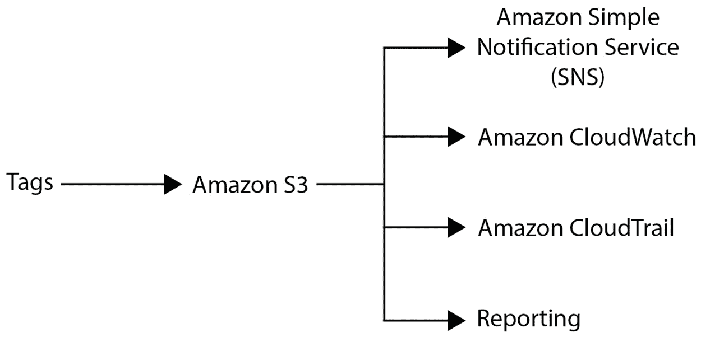
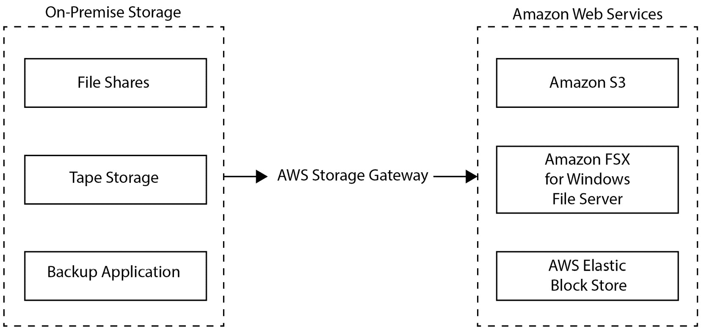
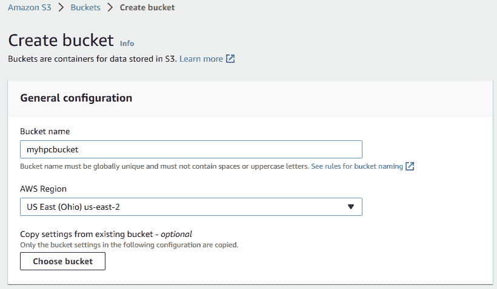
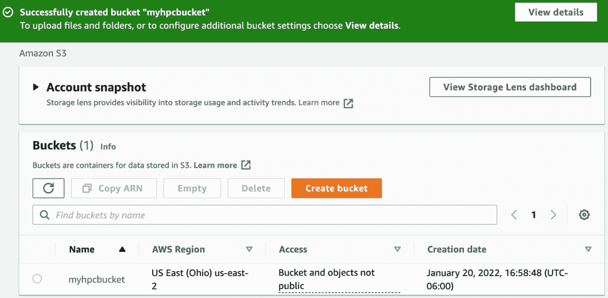
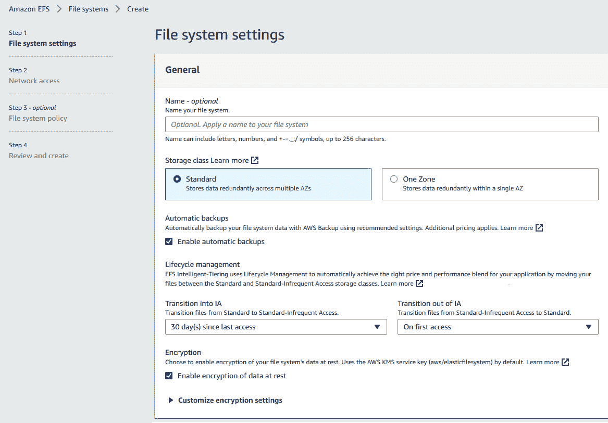
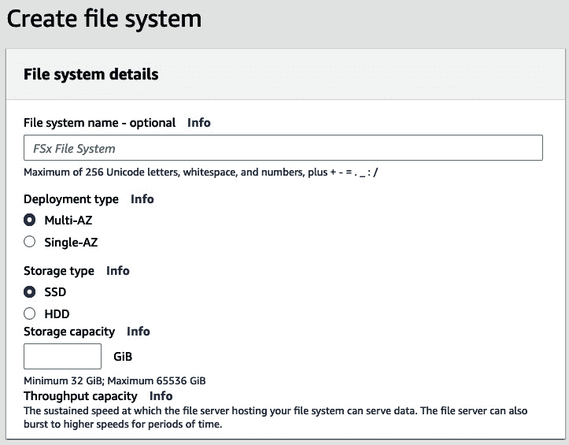
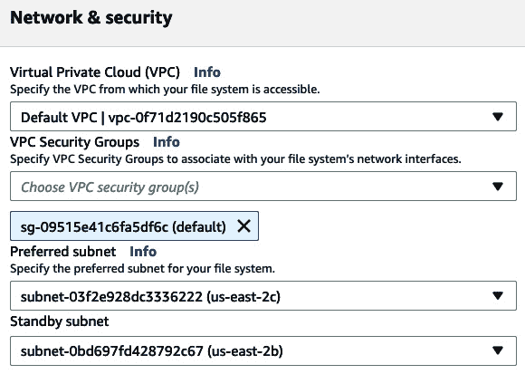

# 第四章：数据存储

云中的数据存储变得非常普遍，不仅用于个人用途，也用于商业、计算和应用目的。在个人方面，云存储由知名公司提供，从免费使用的几**千兆字节**（**GBs**）到每月或每年支付**太字节**（**TBs**）数据的计划。这些服务与移动设备上的应用程序集成良好，使用户能够存储数千张图片、视频、歌曲和其他类型的文件。

对于需要高性能计算的应用程序，云数据存储发挥着更大的作用。例如，在大型数据集上训练**机器学习**（**ML**）模型通常需要算法以分布式方式运行。如果数据存储在云中，那么对于 ML 平台来说，将存储在云中的数据进行分区并使这些单独的分区可用于模型训练作业的分布式组件要容易得多。同样，对于需要大量数据和高吞吐量的其他应用程序，使用云数据存储来避免本地存储的限制要合理得多。此外，云数据存储几乎总是内置冗余，以避免硬件故障、意外删除以及数据丢失。云数据存储服务还提供了多种安全和治理工具和功能。此外，由于规模和基础设施维护由存储服务提供商管理，因此云中数据存储的真正拥有成本显著降低。

AWS 为云数据存储提供了多种选项。在本章中，我们将了解各种 AWS 数据存储服务，以及这些服务的安全性、访问管理和治理方面。此外，我们还将了解分层存储选项以节省云数据存储成本。

本章我们将涵盖以下主题：

+   AWS 数据存储服务

+   数据安全和治理

+   分层存储以优化成本

+   为**高性能计算**（**HPC**）工作负载选择正确的存储选项

# 技术要求

要在本章中与各种 AWS 存储选项一起工作，主要技术要求是拥有 AWS 账户以及使用这些存储服务的适当权限。

# AWS 数据存储服务

AWS 提供三种不同类型的数据存储服务：对象、文件和块。根据应用的需求，可以使用这些类型中的一种或多种。在本节中，我们将介绍涵盖这些存储类别的 AWS 服务。各种 AWS 数据存储服务如图*4.1*所示。

图 4.1 – AWS 数据存储服务

在下一节中，我们将讨论 AWS 提供的各种存储选项。

## Amazon Simple Storage Service (S3)

**Amazon S3** 是最常用的云数据存储服务之一，适用于网络应用和高性能计算用例。它是亚马逊的对象存储服务，提供几乎无限的数据存储。使用 Amazon S3 的一些优点包括非常高的可扩展性、持久性、数据可用性、安全性和性能。Amazon S3 可用于各种云原生应用，从简单的数据存储到非常大的数据湖，再到网站托管和高性能应用，例如训练非常高级和计算密集型的机器学习模型。Amazon S3 提供了几种存储选项，这些选项在数据访问、弹性、归档需求和成本方面有所不同。我们可以选择最适合我们的用例和业务需求的存储类别。当访问模式未知或随时间变化时，还有节省成本的选项（S3 智能分层）。我们将在本章的“分层存储以优化成本”部分详细讨论这些不同的 S3 存储类别。

### Amazon S3 的关键功能和特性

在 Amazon S3 中，数据以对象的形式存储在 *存储桶* 中。对象是一个文件及其描述文件的任何元数据，而存储桶是对象的资源（容器）。接下来将讨论 Amazon S3 的一些关键功能。

#### 数据持久性

Amazon S3 设计用于提供非常高的数据持久性，高达 99.999999999%。这意味着存储在 Amazon S3 中的数据对象丢失的可能性极低（平均预期损失约为 0.000000001% 的对象，或者说每 1000 万个对象中大约有 1 个在 1000 万年中丢失）。对于高性能计算应用，数据持久性至关重要。例如，为了训练机器学习模型，数据科学家需要对同一数据集进行各种实验，以微调模型参数以获得最佳性能。如果用于读取训练和验证数据的存储不适用于这些实验，则训练模型的输出将不会一致，从而导致错误的见解以及不良的推理结果。因此，Amazon S3 被用于许多机器学习和其他数据依赖型高性能计算应用，用于存储大量数据。

#### 对象大小

在 Amazon S3 中，我们可以存储高达 5 TB 大小的对象。这对于需要处理大型文件的应用程序特别有用，例如视频（例如，高清电影或安全录像）、大型日志或其他类似文件。许多高性能计算应用程序，如用于视频分类的机器学习模型训练，需要处理数千个此类大型文件，以生成对未见数据做出良好推断的模型。深度学习模型可以一次（或多次）从 Amazon S3 读取这些大型文件，将它们临时存储在模型训练虚拟机上，计算和优化模型参数，然后继续处理下一个对象（文件）。这样，即使是磁盘空间和内存较小的机器也可以用于在大型数据文件上训练这些计算密集型模型。同样，在模型推理时，如果需要存储数据，可以将其存储在 Amazon S3 中，对象大小可达 5 TB。

#### 存储类别

Amazon S3 有各种存储类别。我们可以在这些类别中的任何一个中存储数据，也可以在类别之间移动数据。选择用于存储数据的正确存储类别取决于我们的数据存储、成本和保留需求。不同的 S3 存储类别如下：

+   S3 标准版

+   S3 标准版-不经常访问

+   S3 单区-不经常访问

+   S3 智能分层

+   S3 冰川即时检索

+   S3 冰川灵活检索

+   S3 冰川深存档

+   S3 Outposts

我们将在本章的“分层存储以优化成本”部分了解这些存储类别。

#### 存储管理

Amazon S3 还提供了各种高级存储管理选项，例如数据复制、防止数据意外删除和数据版本控制。Amazon S3 中的数据可以被复制到同一或不同 AWS 区域的目标存储桶中。这样做可以增加冗余，从而提高可靠性和性能，并降低延迟。这对于高性能计算（HPC）应用也非常重要，因为需要访问存储在 Amazon S3 中的数据的实时 HPC 应用将从访问地理位置更近的 AWS 区域的数据中受益。当数据集在多个 AWS 区域之间复制时，性能通常可以加速高达 60%。Amazon S3 还支持数据访问的批量操作，允许通过单个 API 调用执行各种 S3 操作。此外，可以为存储在 Amazon S3 中的对象配置生命周期策略。使用这些策略，S3 对象可以根据访问需求自动移动到不同的存储类别，从而实现成本优化。

#### 存储监控

亚马逊 S3 还具有一些监控功能。例如，可以将标签分配给 S3 存储桶，并使用 AWS 成本分配报告来查看使用这些标签的汇总使用情况和成本。Amazon CloudWatch 还可以用于查看 S3 存储桶的健康状况。此外，还可以使用 AWS CloudTrail 跟踪存储桶和对象级别的活动。*图 4**.2*展示了各种存储监控工具与 Amazon S3 存储桶协同工作的示例：

图 4.2 – S3 存储监控和管理

前面的图示显示，我们还可以配置亚马逊**简单通知服务**（**SNS**）以在发生某些事件的情况下触发 AWS Lambda 执行各种任务，例如新文件上传等。

#### 数据传输

对于建立在大量数据之上并使用 S3 的任何应用程序，数据首先需要传输到 S3。AWS 提供了各种服务，这些服务与 S3 协同工作，以满足不同的数据传输需求，包括混合（本地/云）存储以及在线和离线数据传输。例如，如果我们想将我们的本地存储扩展到云 AWS 存储，我们可以使用**AWS 存储网关**（*图 4**.3*）。AWS 存储网关的一些常见用例包括替换磁带库、云存储后端文件共享以及为本地应用程序提供低延迟数据缓存。

图 4.3 – 使用 AWS 存储网关的数据传输示例

对于需要在线数据传输的用例，可以使用 AWS DataSync 高效地将数百 TB 数据传输到 Amazon S3。此外，AWS Transfer Family 也可以用于使用 SFTP、FTPS 和 FTP 将数据传输到 S3。对于离线数据传输用例，AWS Snow Family 提供了一些选项，包括 AWS Snowcone、AWS Snowball 和 AWS Snowmobile。有关 AWS Snow Family 的更多详细信息，请参阅*进一步阅读*部分。

#### 性能

S3 对于 HPC 应用程序的一个重大优势是它支持并行请求。每个 S3 前缀每秒支持 3500 次添加数据请求和 5500 次检索数据请求。前缀用于在 S3 存储桶中组织数据。这些是对象键名开头的一系列字符。我们可以根据需要并行拥有多个前缀，每个前缀都将支持这种吞吐量。这样，我们可以通过添加前缀来实现应用程序所需的吞吐量。此外，如果客户端和 S3 存储桶之间存在较长的地理距离，我们可以使用 Amazon S3 传输加速来传输数据。Amazon CloudFront 是一个全球分布的边缘位置网络。

使用 S3 传输分配，数据首先传输到 Amazon CloudFront 的边缘位置。从边缘位置，然后使用优化后的高带宽和低延迟网络路径将数据传输到 S3 存储桶。此外，数据还可以在 CloudFront 边缘位置缓存，以优化频繁访问请求的性能。这些与性能相关的功能有助于提高数据访问的吞吐量和降低延迟，特别适合各种高性能计算（HPC）应用。

#### 一致性

向 Amazon S3 的数据存储请求具有强大的读后写一致性。这意味着任何写入（新或覆盖）到 S3 的数据都可以立即访问。

#### 分析

Amazon S3 还具备分析功能，包括 S3 存储透镜和 S3 存储类分析。S3 存储透镜可用于提高存储成本效率，以及提供数据保护的最佳实践。此外，它还可以用于查看对象存储的使用和活动趋势。它可以在组织中的数千个账户中提供单一视图，并在多个级别上生成见解，如账户、存储桶和前缀。使用 S3 存储类，我们可以通过决定何时将数据移动到正确的存储类来优化成本。这些信息可用于配置生命周期策略，以实现 S3 存储桶的数据传输。Amazon S3 库存是另一个 S3 功能，它生成每日或每周报告，包括存储桶名称、键名称、最后修改日期、对象大小、类别、复制、加密状态以及一些额外的属性。

#### 数据安全

Amazon S3 具有各种安全措施和功能。这些功能包括阻止未经授权的用户访问数据、锁定对象以防止删除、修改对象所有权以进行访问控制、身份和访问管理、发现和保护敏感数据、服务器端和客户端加密、检查 AWS 环境，以及使用私有 IP 地址从本地或云连接到 S3。我们将在*数据安全与* *治理* 部分详细了解这些数据安全和访问管理功能。

### Amazon S3 示例

要能在 S3 存储桶中存储数据，我们首先需要创建该存储桶。一旦存储桶创建成功，我们就可以向其中上传对象。上传对象后，我们可以下载、移动、打开或删除它。为了创建 S3 存储桶，有一些先决条件，如下所述：

+   注册 AWS 账户

+   创建一个**身份和访问管理**（**IAM**）用户或假定 IAM 角色的联合用户

+   以 IAM 用户身份登录

如何执行这些先决步骤的详细信息可以在 Amazon S3 的文档网页上找到（参见*进一步* *阅读* 部分）。

### S3 存储桶创建

我们可以通过登录 AWS 管理控制台并在服务中选择 S3 来创建一个 S3 存储桶。一旦进入 S3 控制台，我们将看到一个类似于 *图 4**.4* 所示的屏幕。4*:

图 4.4 – Amazon S3 控制台

如 *图 4**.4* 所示，我们目前在账户中还没有任何 S3 存储桶。要创建一个 S3 存储桶，请执行以下步骤：

1.  点击此页面上显示的 **创建存储桶** 按钮之一。*图 4**.5* 显示了 S3 控制台上的 **创建存储桶** 页面。

1.  接下来，我们需要指定 **存储桶名称** 和 **AWS 区域**。请注意，S3 存储桶名称需要是全球唯一的：

图 4.5 – Amazon S3 存储桶创建

1.  我们还可以从我们的现有 S3 存储桶中选择某些存储桶设置。在 S3 **创建存储桶** 页面上，我们还可以定义存储桶中的对象是否由创建存储桶的账户拥有，因为其他 AWS 账户也可以拥有存储桶中的对象。此外，我们还可以选择是否要阻止对存储桶的所有公共访问（如图 *图 4**.6* 所示）。在 S3 存储桶创建页面上还有其他我们可以选择的功能，例如版本控制、标签、加密和对象锁定：

图 4.6 – S3 存储桶的公共访问选项

1.  存储桶创建完成后，它将显示在 S3 控制台中，如图 *图 4**.7* 所示，其中我们创建了一个名为 `myhpcbucket` 的存储桶。我们可以使用控制台、AWS **命令行界面** （**CLI**）、AWS SDK 或 Amazon S3 Rest API 向其中添加对象：

图 4.7 – 显示 myhpcbucket 的 Amazon S3 控制台

我们可以点击存储桶名称，查看其中存储的对象以及存储桶属性、权限、指标、管理选项和访问点。

在本节中，我们学习了关于 Amazon S3 存储类、其关键特性和功能，以及如何创建一个 Amazon S3 存储桶。在下一节中，我们将讨论 Amazon Elastic File System，它是 Amazon Elastic Compute Cloud 实例的文件系统。

## Amazon Elastic File System (EFS)

**亚马逊弹性文件系统**（**EFS**）是一个完全管理的无服务器弹性 NFS 文件系统，专门为 Linux 工作负载设计。它可以自动扩展到 PB 级数据，非常适合与本地资源以及各种 AWS 服务一起使用。亚马逊 EFS 的设计使得数千个**亚马逊弹性计算云**（**EC2**）实例可以提供并行共享访问。除了 EC2 之外，EFS 文件系统还可以通过文件系统接口由**亚马逊弹性容器服务**（**ECS**）、**亚马逊弹性 Kubernetes 服务**（**EKS**）、**AWS Fargate**和**AWS Lambda**函数访问。以下是一些常见的 EFS 用例：

+   **高性能计算**：由于亚马逊 EFS 是一个共享文件系统，因此非常适合需要跨多个实例分布式工作负载的应用程序。需要高性能计算的应用程序和用例，如图像和视频处理、内容管理以及特征工程、数据处理、模型训练、数值优化、大数据分析等类似的应用程序，可以从亚马逊 EFS 中受益。

+   **容器化应用程序**：由于亚马逊 EFS 具有耐久性，这对于这些应用程序来说是非常重要的，因此非常适合容器化应用程序。EFS 与亚马逊基于容器的服务集成，例如亚马逊 ECS、亚马逊 EKS 和 AWS Fargate。

+   **DevOps**：由于亚马逊 EFS 具有共享代码的能力，因此可以用于 DevOps。这有助于快速、敏捷、安全地修改代码以及应用错误修复和增强，从而根据客户反馈实现快速周转时间。

+   **数据库备份**：亚马逊 EFS 也常被用作数据库备份。这是因为 EFS 具有非常高的耐久性和可靠性，低成本，以及作为符合 POSIX 规范的文件存储系统——所有这些通常都是数据库备份的要求，在数据丢失或紧急情况下，可以从该备份快速恢复主数据库。

在下一节中，我们将讨论亚马逊 EFS 的关键功能。

### 亚马逊 EFS 的关键功能和特性

在本节中，我们将讨论亚马逊 EFS 的一些关键功能和特性。亚马逊 S3 的一些关键功能也适用于亚马逊 EFS。

#### 耐久性

与亚马逊 S3 一样，亚马逊 EFS 也非常具有高度耐久性和可靠性，提供 99.999999999%的耐久性。EFS 通过在同一个 AWS 区域内的多个**可用区**（**AZs**）存储所有内容来实现这一高水平的耐久性和冗余（除非我们为 EFS 存储选择 EFS 单区存储类）。由于数据可以在多个 AZs 中访问，EFS 具有从并发设备故障中快速恢复和修复的能力。

#### 存储类

亚马逊 EFS 还提供了通过存储类进行存储的多种选项。这些存储类如下：

+   亚马逊 EFS 标准

+   Amazon EFS 单区

+   Amazon EFS 标准-不常用访问

+   Amazon EFS 单区-不常用访问

我们将在*分层存储以优化成本*部分讨论这些类别。我们可以通过策略轻松地在存储类别之间移动文件以实现成本和性能优化。

#### 性能和吞吐量

Amazon EFS 有两种性能和吞吐量模式。对于性能模式，它有**通用型**和**最大 I/O**。通用型模式为随机以及顺序输入输出文件系统操作提供低延迟。另一方面，最大 I/O 模式是为非常高的吞吐量和每秒操作而设计的。因此，它非常适合高性能和高并行化计算应用。

对于吞吐量，EFS 有突发（默认）和配置模式。在突发模式下，吞吐量随着文件系统的大小而扩展，并且可以根据工作负载的性质动态地突发。在配置模式下，吞吐量可以根据应用程序所需的专用吞吐量进行配置。它不依赖于文件系统的大小。

#### 可伸缩性

Amazon EFS 具有高度弹性和可伸缩性。随着数据的增加或减少，其大小会上下增长，并且是为高吞吐量、**每秒输入/输出操作**（**IOPS**）和低延迟而设计的，适用于广泛的负载和用例。它还具有为不可预测和波动的负载提供非常高的突发吞吐量的能力，在撰写本文时，支持高达 10 GB/秒和 500,000 IOPS。

#### AWS 备份

Amazon EFS 与 AWS Backup 一起工作，AWS Backup 是一个完全托管的备份服务。它自动化并使我们能够集中管理 EFS 文件系统，消除了昂贵且繁琐的手动流程。

#### 数据传输

与 Amazon S3 一样，Amazon EFS 也与各种 AWS 数据传输服务一起工作，例如 AWS DataSync 和 AWS Transfer Family，用于在 EFS 中传输数据，用于一次性迁移，以及用于定期同步、复制和数据恢复。

### Amazon EFS 示例

我们可以使用 AWS 管理控制台或 AWS CLI 创建 Amazon EFS 文件系统。在本节中，我们将通过 AWS 管理控制台创建 EFS 文件系统的示例：

1.  当我们登录 AWS 管理控制台并浏览到 Amazon EFS 服务时，我们会看到类似于*图 4.8*的主页面。它还列出了我们在查看的 AWS 区域中创建的所有 EFS 文件系统：

图 4.8 – Amazon EFS 登录页面

1.  要创建 Amazon EFS 文件系统，我们点击**创建文件系统**按钮。当我们点击此按钮时，我们会看到一个类似于*图 4.9*的屏幕。在这里，我们可以为我们的文件系统选择任何名称。

图 4.9 – 创建 Amazon EFS 文件系统

1.  对于文件系统，选择一个**虚拟私有云**（**VPC**），并选择我们是否希望它在我们的区域的所有可用区（AZ）中跨域，或者只在一个 AZ 中。

1.  我们还可以点击**自定义**按钮来配置其他选项，例如**生命周期管理**（*图 4.10*）、**性能模式**和**吞吐量模式**（*图 4.11*）、**加密**、**标签**、网络选项和**文件系统**策略。

图 4.10 – 选择 Amazon EFS 文件系统的选项

图 4.11 – 选择 Amazon EFS 的附加选项

1.  点击**下一步**然后**创建**将创建 Amazon EFS 文件系统。我们创建的 EFS 文件系统如图*图 4.12*所示。

图 4.12 – 创建的 EFS 文件系统

1.  我们可以点击文件系统来查看其各种属性，以及获取将其挂载到 Linux 实例的命令，如图*图 4.13*所示。一旦 EFS 文件系统挂载，我们就可以像使用常规文件系统一样使用它。

图 4.13 – EFS 文件系统的挂载选项和命令

让我们在下一节讨论 Amazon **弹性块存储**（**EBS**）及其关键特性和功能。

## Amazon EBS

**Amazon EBS**是一个可扩展、高性能的块存储服务，可以用于创建附加到 EC2 实例的存储卷。这些卷可用于各种目的，例如作为常规块存储卷，在这些卷上创建文件系统，甚至运行数据库。以下是一些 Amazon EBS 的常见用例：

+   EBS 可用于大数据分析，需要频繁调整集群大小，特别是对于 Hadoop 和 Spark。

+   可以使用 Amazon EBS 部署多种类型的数据库。一些例子包括 MySQL、Oracle、Microsoft SQL Server、Cassandra 和 MongoDB。

+   如果我们在 EC2 实例上运行计算作业，并需要附加存储卷来读取数据并写入结果，而无需跨多个实例进行扩展，那么 EBS 是一个很好的选择。

接下来，让我们看看 Amazon EBS 的一些关键特性和功能。

### Amazon EBS 的关键特性和功能

在本节中，我们讨论 Amazon EBS 的关键特性和功能，如卷类型、快照、弹性卷、EBS 优化实例和持久性。

#### 卷类型

EBS 卷分为两大类：**SSD-backed 存储**和**HDD-backed 存储**。我们在这里讨论这些类别：

+   **SSD-backed storage**: 在 SSD-backed 存储中，性能主要取决于 IOPS，最适合事务性工作负载，例如数据库和引导卷。SSD-backed 存储卷主要有两种类型：

    +   **预配置 IOPS SSD 卷**：它们是高吞吐量卷，设计用于提供个位数的毫秒级延迟，并且 99.9% 的时间都能提供预配置的性能。它们特别适合需要非常高的正常运行时间的关键应用程序。

    +   **通用 SSD 卷**：这些存储卷也提供低至个位数的毫秒级延迟，并且 99% 的时间都能提供预配置的性能。它们特别适合事务性工作负载、虚拟桌面、引导卷和类似的应用程序。

+   **HDD 支持的存储**：在 HDD 支持的存储中，性能主要取决于 MB/s，最适合吞吐量密集型工作负载，例如 MapReduce 和日志处理。HDD 支持的存储卷主要有两种类型：

    +   **吞吐量优化 HDD 卷**：这些卷以 MB/s 为单位提供性能，最适合 MapReduce、Kafka、日志处理和 ETL 工作负载。

    +   **冷 HDD 卷**：它们是所有 EBS 卷中成本最低的，由硬盘驱动器支持。这些卷最适合不常访问的工作负载，例如冷数据集。

根据使用情况选择适当的 EBS 卷类别选项为用户提供灵活性。

#### 快照

Amazon EBS 具有将卷快照存储到 Amazon S3 的能力。这是通过增量方式完成的，仅添加自上次快照以来已更改的数据块。EBS 快照的数据生命周期可用于安排 EBS 的自动创建和删除。这些快照不仅可用于数据恢复，还可以用于启动新卷、扩展卷大小以及将 EBS 卷在 AWS 区域内的 AZ 之间迁移。

#### 弹性卷

使用 Amazon EBS 弹性卷，我们可以在稍后的时间动态增加卷的容量，也可以更改卷的类型而无需停机。

#### EBS 优化实例

为了充分利用为 EBS 卷配置的 IOPS 并提供最大性能，一些 EC2 实例可以启动为 EBS 优化实例。这确保了 Amazon EC2 实例和 Amazon EBS 卷之间的专用吞吐量。

### 耐用性

类似于 Amazon S3 和 Amazon EFS，Amazon EBS 也具有高度耐用性和可靠性。Amazon EBS 中的数据在 AZ 中的多个服务器上进行复制，以提供冗余和恢复功能，以防卷存储中的任何单个组件出现故障。

### EBS 卷创建

在创建 EC2 实例时，我们可以向其实例添加额外的 EBS 卷，如**图 4.14**中所示，在**添加存储**步骤中。此外，我们还可以在实例启动后从 EC2 管理控制台添加新卷。在 EC2 管理控制台中，我们可以审查我们的现有卷和快照，以及生命周期管理策略。

图 4.14 – 在创建 EC2 实例过程中添加 EBS 卷

*图 4**.15* 展示了一个示例，其中我们有两个 EBS 卷，以及它们的各种配置参数：

图 4.15 – EC2 管理控制台中的卷页面，显示了创建的两个 EBS 卷

到目前为止，在本章中，我们已经了解了 Amazon S3、Amazon EFS 和 Amazon EBS。在下一节中，我们将讨论 Amazon FSx 文件系统系列。

## Amazon FSx

Amazon FSx 是一个功能丰富、可扩展、高性能且成本效益高的文件系统系列。它包括以下常用的四种文件系统：

+   Amazon FSx for NetApp ONTAP

+   Amazon FSx for Windows 文件服务器

+   Amazon FSx for Lustre

+   Amazon FSx for OpenZFS

一些 FSx 文件系统系列常用的例子包括以下内容：

+   FSx 可以提供非常低的延迟（亚毫秒级）和数百万 IOPS，并且具有高度的可扩展性，使其非常适合高性能计算应用，如机器学习、数值优化、大数据分析和类似应用

+   数据可以通过将 FSx 文件系统与本地文件系统匹配，在不破坏或修改现有代码和工作流程的情况下迁移到 FSx。

+   媒体和娱乐是另一个 FSx 非常常用的例子，因为它是一个高性能的文件系统

### Amazon FSx 的关键特性

在本节中，我们将讨论 Amazon FSx 的关键特性，例如管理、持久性和成本。

#### 全托管

Amazon FSx 是全托管的，这使得将基于行业常用文件系统构建的应用程序迁移到 AWS 变得非常容易。由于亚毫秒级的延迟，Linux、Windows 和 macOS 应用程序与 Amazon FSx 配合得非常好，非常适合需要非常低延迟和高性能的工作。

#### 持久性

除了可以选择在 AWS 区域之间复制数据外，Amazon FSx 中的数据在 AZ 之间或内部进行复制。它还与 AWS Backup 集成，用于备份管理和保护。这些特性使 Amazon FSx 成为一个高度可用和持久的文件系统系列。

### 成本

根据需要，Amazon FSx 的成本和性能可以进行优化。它可以用于小型以及非常计算密集型的工作负载，如机器学习和大数据分析。与 Amazon EBS 一样，它也提供 SSD 和 HDD 存储选项，可以分别配置性能和存储容量。

### 创建 FSx 文件系统

我们可以通过登录 AWS 管理控制台来创建 FSx 文件系统。在控制台中，按下**创建文件系统**按钮后，我们可以选择 FSx 文件系统的类型（*图 4**.16*）。

图 4.16 – FSx 文件系统类型

在选择我们想要创建的类型时，我们还会收到额外的选项提示，其中一些是针对正在创建的特定 FSx 系统的。其中一些选项，如部署和存储类型、网络和安全、以及 Windows 身份验证，在*图 4.17*至*图 4.19*中展示了 FSx for Windows 文件服务器的选项。这些选项将根据我们创建的文件系统类型而有所不同。创建文件系统后，我们可以将其挂载到我们的 EC2 实例上。

图 4.17 – 创建 FSx for Windows 文件服务器

图 4.18 – FSx for Windows 文件服务器的网络和安全选项

图 4.19 – FSx for Windows 文件服务器的身份验证和加密选项

这结束了我们对 AWS 提供的各种数据存储选项的讨论。我们了解了 Amazon S3、Amazon EFS、Amazon EBS 以及 Amazon FSx 系列，以及它们的关键功能和特性。在下一节中，我们将学习 AWS 云数据存储的数据安全和治理方面。

# 数据安全和治理

数据安全和治理是云存储解决方案和应用程序的重要方面，无论是网页、文件存储、机器学习应用还是任何其他利用云数据存储的应用。在数据存储或传输过程中保护数据是绝对重要的。此外，应根据数据访问所需的权限对不同的用户应用访问控制。之前提到的所有 AWS 数据存储服务都有各种安全、保护、访问管理和治理功能。我们将在以下章节中讨论这些功能。

## IAM

为了能够访问 AWS 资源，我们需要一个 AWS 账户，并在每次登录时进行身份验证。一旦我们登录到 AWS，我们需要权限来访问 AWS 资源。AWS IAM 用于将权限策略附加到用户、组和角色。这些权限策略管理和控制对 AWS 资源的访问。我们可以指定谁可以访问哪些资源以及他们可以对该资源执行哪些操作（例如，创建 S3 存储桶、添加对象、列出对象、删除对象等）。上一节中描述的所有 AWS 数据存储服务都与 AWS IAM 集成，并且可以使用 IAM 管理和控制对这些服务和相关资源的访问。

## 数据保护

所有 AWS 数据存储和文件系统服务都具备各种数据保护功能。我们应始终保护 AWS 账户凭证，并使用 AWS IAM 创建个人用户账户，为每个用户提供完成工作职责所需的最小权限访问 AWS 资源。以下是一些有助于 AWS 数据保护的安全建议：使用**多因素认证**（**MFA**）、**安全套接字层**（**SSL**）、**传输层安全性**（**TLS**）、通过**AWS CloudTrail**进行活动日志记录、AWS 加密解决方案以及用于保护个人和敏感数据的**Amazon Macie**。

Amazon S3 的各个层级（除 One Zone-IA 外）在 AWS 区域内至少存储三个可用区（AZ）中的所有数据对象。One Zone-IA 存储类通过在同一可用区内的多个设备上存储数据来提供冗余和保护。此外，借助版本控制，可以根据需要保留和恢复数据对象的各个版本。

## 数据加密

AWS 提供静态数据和传输中的数据加密。传输中的加密可以通过启用 SSL/TLS 来实现。此外，所有跨 AWS 区域流动并通过 AWS 全球网络的数据都会自动加密。在 Amazon S3 中，数据也可以通过客户端加密进行加密。Amazon S3 上的静态数据可以使用服务器端加密或客户端加密进行加密。对于服务器端加密，我们可以使用**AWS 密钥管理服务**（**KMS**）或 Amazon S3 管理的加密。对于客户端加密，我们需要负责加密过程，并在加密后上传对象到 S3。我们还可以创建加密的 Amazon EFS 文件系统、Amazon EBS 卷以及 Amazon FSx 文件系统系列。

## 日志记录和监控

日志记录和监控是任何存储解决方案的两个非常关键组件，因为我们需要跟踪谁在访问数据以及他们如何使用数据。通常，这种日志记录也是为了满足审计要求，并构建用于使用和威胁分析的报告。AWS 数据存储服务提供了多种日志记录和监控工具。可以使用 Amazon CloudWatch 警报来监控指标，触发警报到 Amazon SNS 发送通知。我们还可以使用 Amazon CloudTrail 来查看用户、IAM 角色和 AWS 服务在我们数据存储和文件系统中执行的操作。此外，还有其他日志记录和监控功能，例如 Amazon CloudWatch Logs 用于访问日志文件，以及 Amazon CloudWatch Events 用于捕获状态信息并采取纠正措施。

## 弹性

AWS 基础设施由 AWS 区域组成，而这些区域又由多个物理上分离的可用区（AZ）组成。这些 AZ 具有高吞吐量和低延迟的连接性。默认情况下，S3、EFS、EBS 和 FSx 资源要么在 AWS 区域内的多个 AZ 之间备份和复制，要么根据用户选择的配置在同一 AZ 内备份和复制。此外，还有一些针对这些数据存储和文件系统的特定弹性功能，例如生命周期配置、版本控制、S3 对象锁定、EBS 快照等。所有这些功能使得存储在 AWS 上的数据具有极高的容错性和抗丢失性。

除了上述 AWS 数据存储服务的安全和治理功能外，还有其他一些选项可供选择，例如 VPC 的配置、网络隔离以及一些额外的选项。结合这些工具和资源，AWS 数据存储服务是可用的最安全的云存储服务之一。

AWS 为 Amazon S3 和 Amazon EFS 提供了使用分层存储的选项。这有助于优化用户的数据存储成本。

# 分层存储以优化成本

AWS 提供了配置其数据存储服务以使用不同存储类型层级的选项。这根据使用案例的要求，显著有助于优化成本和性能。在本节中，我们将讨论 Amazon S3 和 Amazon EFS 的分层存储选项。

## Amazon S3 存储类别

如在 *Amazon Simple Storage Service (S3)* 部分所述，根据使用案例、访问模式和成本要求，存在各种存储类别。我们可以在对象级别配置 S3 存储类别。以下几节将讨论这些存储类别。

### Amazon S3 Standard

Amazon S3 Standard 是一种通用型 S3 对象存储，通常用于频繁访问的数据。它提供高吞吐量和低延迟。S3 Standard 的常见应用包括在线游戏、大数据分析、机器学习模型训练和数据存储、机器学习应用的离线特征存储、内容存储和分发，以及具有动态内容的网站。

### Amazon S3 Intelligent-Tiering

**Amazon S3 Intelligent-Tiering** 是针对未知、不可预测和变化的访问模式的存储类别。S3 Intelligent-Tiering 有三个访问层级：频繁访问、不频繁访问和存档层级。S3 Intelligent-Tiering 监控访问模式，并根据需要将数据移动到适当的层级，以节省成本，同时不影响性能、检索费用或产生运营开销。此外，我们还可以设置 S3 Intelligent-Tiering 将数据移动到 Deep Archive Access 层级，用于很少访问的数据（180 天或更长时间）。这可以进一步节省成本。

### Amazon S3 Standard-不频繁访问

**Amazon S3 Standard-Infrequent Access**适用于数据通常访问频率较低，但可能需要快速访问的场景。它提供每 GB 存储和检索的低价格，但性能和耐用性与 S3 Standard 相同。此层级的常见用例包括备份、灾难恢复的数据存储和长期存储。对于高性能计算应用，如机器学习，此存储层级可以用于存储已经训练过的模型或已执行分析的历史数据，而无需在一段时间内重新训练模型。

### Amazon S3 One Zone-Infrequent Access

**Amazon S3 One Zone-Infrequent Access**与 Amazon S3 Standard-Infrequent Access 非常相似，但数据仅存储在一个可用区（多个设备）中，而不是像其他 S3 存储类别的默认设置那样在同一个 AWS 区域内存储三个可用区。这甚至比 S3 Standard-Infrequent Access 存储类别的成本效益更高，通常用于存储二级备份或易于重新创建的数据，例如不再用于活跃机器学习模型训练的工程特性。

### Amazon S3 Glacier

**Amazon S3 Glacier**存储类别是高度灵活、低成本和高性能的数据归档存储类别。在 Amazon S3 Glacier 中，有三个存储类别。Amazon S3 Glacier Instant Retrieval 通常用于数据访问非常罕见，但需要以毫秒级的延迟进行检索的场景，例如新闻媒体资产和基因组数据。Amazon S3 Flexible Retrieval 适用于需要以无额外成本检索大型数据集的场景，如备份恢复数据，但不需要即时检索。此类用例的常规检索时间通常是几分钟到几小时。Amazon S3 Glacier Deep Archive 适用于需要非常罕见检索的场景，例如保存的数字媒体和合规性归档。它是之前讨论的所有选项中成本最低的存储，典型的检索时间是 12 小时到 2 天。

### Outposts 上的 S3

对于本地 AWS Outposts 环境，可以使用**Outposts 上的 Amazon S3**配置对象存储。它在 AWS Outposts 的多个设备和服务器上可靠且冗余地存储数据，特别适合具有本地数据居住要求的使用场景。

在下一节中，我们将讨论 Amazon EFS 的不同存储类别。

## Amazon EFS 存储类别

如本处所述，Amazon EFS 提供了根据数据访问频率不同而选择不同存储类别的选项。

### Amazon EFS Standard 和 EFS Standard-Infrequent Access 类别

Amazon EFS 标准和 EFS 标准不频繁访问类别是高度可用、耐用且可扩展的文件系统存储类别。它们都在 AWS 区域内多个地理上分离的 AZ 中进行了复制。EFS 标准适用于需要频繁访问数据的使用场景，而 EFS 标准不频繁访问类别适用于不需要频繁数据访问的使用场景。使用 EFS 标准不频繁访问，我们可以显著降低存储成本。

### Amazon EFS 单区与 EFS 单区-不频繁访问类别

Amazon EFS 单区与 EFS 单区-不频繁访问类别在单个可用区（AZ）内跨多台设备存储数据，与 Amazon EFS 标准和 EFS 标准不频繁访问类别相比，分别降低了存储成本。对于频繁访问的文件，建议使用 EFS 单区，而对于不频繁访问的文件，建议使用 EFS 单区-不频繁访问类别。

在 Amazon S3 和 Amazon EFS 有多种选项可用的情况下，正确的做法是首先确定一个使用场景的性能、访问和检索需求，然后选择满足这些要求的同时最小化总成本的存储类别。如果我们选择正确的存储类别，尤其是对于非常大的数据集和使用场景，其中数据随时间显著扩展，可以节省大量成本。

到目前为止，我们已经讨论了各种 AWS 存储选项及其功能以及成本优化选项。在下一节中，我们将了解如何为我们的 HPC 使用场景选择正确的存储选项。

# 选择适合 HPC 工作负载的正确存储选项

在云数据存储有如此多的选择时，决定为 HPC 工作负载选择哪种存储选项变得具有挑战性。数据存储的选择在很大程度上取决于使用场景以及性能、吞吐量、延迟、扩展、归档和检索需求。

对于需要长期归档对象数据的使用场景，应考虑使用 Amazon S3。此外，由于它可以被其他 AWS 服务访问，Amazon S3 非常适合多种高性能计算（HPC）应用。例如，在 Amazon SageMaker 中，我们可以使用存储在 Amazon S3 中的数据进行特征工程，然后将这些特征导入 SageMaker 离线特征存储库，该存储库同样存储在 Amazon S3 中。Amazon SageMaker 使用 Amazon S3 进行机器学习（ML）模型训练。它从 Amazon S3 读取数据，并使用这些数据进行模型拟合、超参数优化和验证。由此产生的模型工件随后也存储在 Amazon S3 中，可用于实时或批量推理。除了 ML 之外，Amazon S3 也是进行数据分析和存储我们希望运行复杂查询的数据、数据归档和备份的良好存储选择。

Amazon EFS 是用于 Amazon EC2 实例的共享文件系统。数千个 EC2 实例可以共享同一个 EFS 文件系统。这使得它非常适合需要高性能扩展的应用程序。内容管理系统、在各个实例上运行且需要访问文件系统中相同数据的分布式应用程序，以及非常大规模的数据分析是一些 EFS 应该被使用的例子。

Amazon EBS 是为单个 EC2 实例（除 EBS Multi-Attach 外）提供的块存储服务，因此 EBS 的主要用例是我们需要为 EC2 实例提供高性能存储时。对于高性能计算应用，如机器学习和数值优化，我们通常需要访问用于训练和调整算法的数据。数据的大小通常非常大，无法在处理过程中存储在内存中（例如，数千个视频）。在这种情况下，我们可以在运行我们的算法的 EC2 实例上存储数据，这使得在数据文件之间进行交换和读取以执行计算操作变得更快。

当我们在本地运行类似的文件系统，并希望将我们的应用程序迁移到云上，同时在新文件系统上设计新应用程序而不必担心底层基础设施和工具以及流程变化时，应使用 Amazon FSx。

这些是我们在这里讨论的一些例子，说明了高性能计算应用如何从各种 AWS 数据存储选项中受益。在设计架构时，选择正确的存储选项组合以使我们的应用程序提供最佳性能，同时确保我们不产生不必要的成本，这一点非常重要。

# 摘要

在本章中，我们讨论了在 AWS 上可用的不同数据存储选项，以及它们的主要功能和能力。我们介绍了 Amazon S3——一个高度可扩展且可靠的对象存储服务，Amazon EFS——用于 EC2 实例的共享文件系统，Amazon EBS——用于 EC2 实例的块存储，以及 Amazon FSx 文件系统系列。我们还讨论了这些服务的数据保护和治理能力，以及它们如何与其他数据保护、访问管理、加密、日志记录和监控服务集成。我们还探讨了 Amazon S3 和 Amazon EFS 可用的各种存储层，以及我们如何使用这些层来优化我们用例的成本。最后，我们讨论了在哪些情况下使用哪种数据存储服务来为高性能计算应用提供支持。

现在我们对各种 AWS 数据存储服务有了很好的了解，我们准备进入本书的下一部分，*第五章**，数据分析*，它从如何使用 AWS 服务进行数据分析开始。

# 进一步阅读

关于本章所学内容的进一步阅读，请参阅以下文章：

+   *Amazon S3* *特性*: [`aws.amazon.com/s3/features/`](https://aws.amazon.com/s3/features/)

+   *Amazon 区域和可用性* *区域*: [`aws.amazon.com/about-aws/global-infrastructure/regions_az/`](https://aws.amazon.com/about-aws/global-infrastructure/regions_az/)

+   *AWS Snow* *系列*: [`aws.amazon.com/snow/`](https://aws.amazon.com/snow/)

+   *开始使用 Amazon* *S3*: [`docs.aws.amazon.com/AmazonS3/latest/userguide/GetStartedWithS3.html`](https://docs.aws.amazon.com/AmazonS3/latest/userguide/GetStartedWithS3.html)

+   *先决条件：设置 Amazon* *S3*: [`docs.aws.amazon.com/AmazonS3/latest/userguide/setting-up-s3.html`](https://docs.aws.amazon.com/AmazonS3/latest/userguide/setting-up-s3.html)

+   *AWS EFS 深入了解：它是做什么的以及何时使用它*: [`www.learnaws.org/2021/01/23/aws-efs-deep-dive/`](https://www.learnaws.org/2021/01/23/aws-efs-deep-dive/)

+   *使用 Amazon* *EFS* *实现高度可用和耐用的数据库备份工作流程*: [`aws.amazon.com/blogs/storage/using-amazon-efs-to-cost-optimize-highly-available-durable-database-backup-workflows/`](https://aws.amazon.com/blogs/storage/using-amazon-efs-to-cost-optimize-highly-available-durable-database-backup-workflows/)

+   *Amazon EFS* *特性*: [`aws.amazon.com/efs/features/`](https://aws.amazon.com/efs/features/)

+   *AWS* *备份*: [`aws.amazon.com/backup/`](https://aws.amazon.com/backup/)

+   *Amazon EBS* *特性*: [`aws.amazon.com/ebs/features/`](https://aws.amazon.com/ebs/features/)

+   *Amazon FSx* *文档*: [`docs.aws.amazon.com/fsx/index.html`](https://docs.aws.amazon.com/fsx/index.html)

+   *Amazon S3 Glacier 存储类别*: [`aws.amazon.com/s3/storage-classes/glacier/`](https://aws.amazon.com/s3/storage-classes/glacier/)

# 第二部分：应用建模

*第二部分* 专注于机器学习的高性能计算（**HPC**）的应用。它包括从分析大量数据开始，然后涵盖分布式训练和大规模部署模型，包括性能优化和边缘机器学习的手动实现。

本部分包括以下章节：

+   *第五章*, *数据分析*

+   *第六章*, *机器学习模型的分布式训练*

+   *第七章*, *大规模部署机器学习模型*

+   *第八章*, *优化和管理边缘部署的机器学习模型*

+   *第九章*, *实时推理的性能优化*

+   *第十章*, *数据可视化*
