# 数据分析

任何大规模数据科学程序背后的一个基本原理是这样一个简单的事实：任何**机器学习**（**ML**）模型产生的质量仅与其训练数据相当。初学者数据科学家常常犯的错误是认为他们只需要找到适合他们用例的正确 ML 模型，然后简单地训练或拟合数据到模型中。然而，事实并非如此。获得最佳模型需要探索数据，目标是完全理解数据。一旦数据科学家理解了数据以及如何在该数据上训练 ML 模型，数据科学家通常会花费大部分时间进一步清理和修改数据，这通常被称为数据整理，以准备模型训练和构建。

虽然这个数据分析任务在概念上可能看起来很简单，但当我们考虑到我们正在探索的数据的类型（图像、文本、表格等）以及数据的数量/体积时，任务会变得更加复杂。此外，数据的存储位置以及获取数据的权限也可能使数据科学家的工作更加困难。例如，有用的机器学习数据可能存储在数据仓库中，或者位于各种关系型数据库中，通常需要各种工具或程序性 API 调用来挖掘正确的数据。同样，关键信息可能分布在多个文件服务器或云对象存储的各个存储桶中。定位数据并确保正确访问数据的权限可能会进一步延迟数据科学家开始工作。

因此，考虑到这些挑战，在本章中，我们将回顾一些实际的方法来探索、理解和本质上处理不同类型，以及大量数据，以训练机器学习模型。此外，我们还将检查 AWS 提供的一些功能和服务，以使这项任务不那么令人畏惧。

因此，本章将涵盖以下主题：

+   探索数据分析方法

+   检查 AWS 服务用于数据分析

+   分析大量结构化和非结构化数据

+   在 AWS 上大规模处理数据

# 技术要求

在开始本章之前，您应该具备以下先决条件：

+   熟悉 AWS 服务及其基本用法。

+   一个网络浏览器（为了获得最佳体验，建议您使用 Chrome 或 Firefox 浏览器）。

+   一个 AWS 账户（如果您不熟悉如何开始使用 AWS 账户，您可以访问此链接：[`aws.amazon.com/getting-started/`](https://aws.amazon.com/getting-started/))。

+   熟悉 AWS 免费层（免费层允许您根据资源限制免费访问一些 AWS 服务。您可以通过此链接了解这些限制：[`aws.amazon.com/free/`](https://aws.amazon.com/free/))。

+   本章的示例 Jupyter 笔记本可以在配套的 GitHub 仓库中找到（[`github.com/PacktPublishing/Applied-Machine-Learning-and-High-Performance-Computing-on-AWS/tree/main/Chapter05`](https://github.com/PacktPublishing/Applied-Machine-Learning-and-High-Performance-Computing-on-AWS/tree/main/Chapter05))。

# 探索数据分析方法

如本章开头所强调的，收集和探索这些各种数据来源的任务可能显得有些令人畏惧。因此，你可能此时正在想*在哪里以及如何开始数据分析过程？*为了回答这个问题，让我们探讨一些我们可以用来分析你的数据并为机器学习任务做准备的方法。

## 收集数据

开始数据分析任务的第一步之一是将来自各个孤岛的相关数据收集到一个特定的位置。这个单一的位置通常被称为数据湖。一旦相关数据被集中到一个单一的数据湖中，在湖中移动数据进出就变得显著更容易。

例如，让我们暂时想象一下，一个数据科学家被分配了一个构建产品推荐模型的任务。利用数据湖作为中心存储，他们可以查询客户数据库以获取所有客户特定的数据，通常来自关系型数据库或数据仓库，然后结合来自 Web 应用程序事务日志的客户点击流数据，以获取预测产品推荐所需的所有信息的共同来源。此外，通过从产品目录中获取产品特定的图像数据，数据科学家可以进一步探索可能增强或有助于机器学习模型预测潜力的产品图像的各种特征。

因此，一旦收集了完整的数据集并将其存储在共同的仓库或数据存储中，我们就可以继续进行数据分析的下一个步骤，即理解数据结构。

## 理解数据结构

一旦数据被收集到一个共同的位置，在数据科学家能够完全调查如何使用它来提出机器学习假设之前，我们需要了解数据的结构。由于数据集可能来自多个来源，因此在有效分析之前理解数据的结构是很重要的。

例如，如果我们继续以产品推荐为例，数据科学家可能将与来自关系型数据库或数据仓库的表格数据形式的结构化客户数据一起工作。此外，当从 Web 服务器中提取客户交互数据时，数据科学家可能需要处理时间序列或 JSON 格式数据，通常被称为半结构化数据。最后，当将产品图像纳入其中时，数据科学家将处理图像数据，这是非结构化数据的一个例子。

因此，理解数据的本质或结构决定了如何提取我们需要的临界信息并有效地进行分析。此外，了解我们处理的数据类型也将影响所需的工具类型，例如**应用程序编程接口**（**APIs**），甚至理解数据所需的基础设施资源。

注意

我们将在本章的后续部分深入探讨这些工具和基础设施资源。

一旦我们理解了数据结构，我们就可以将这种理解应用到数据分析的另一种技术中，即描述数据本身。

## 描述数据

一旦我们理解了数据结构，我们就可以描述或总结数据的特征，以进一步探索这些特征如何影响我们的整体假设。这种方法通常被称为将**描述性统计**应用于数据，其中数据科学家将通过总结数据中每个特征的集体属性来尝试描述和理解数据集中的各种特征，这些属性以中心性、变异性和数据计数的形式表示。

让我们探索这些术语的含义，看看它们如何被用来描述数据。

### 确定中心趋势

通过使用描述性统计来总结数据的中心趋势，我们实际上是在关注数据集中特定特征的分布中的平均、中间或中心位置。这使数据科学家能够了解数据集中某个特征的正常或平均情况，从而允许他们将这些平均值与其他数据特征或整个数据进行比较。

例如，假设客户 A 每天访问我们的网站 10 次，但只购买了一件商品。通过比较客户 A 的平均访问次数与总客户访问次数，我们可以看到客户 A 的排名情况。如果我们再比较购买的商品数量与总商品数量，我们可以进一步衡量基于客户排名的正常情况。

### 测量变异

使用描述性统计来衡量数据的变异或数据分布情况在机器学习中非常重要。了解数据的分布将使数据科学家能够很好地了解数据是否成比例。例如，在产品推荐用例中，我们有数据表明购买书籍的客户比购买割草机的客户分布更广。在这种情况下，当模型基于这些数据进行训练时，它将倾向于推荐书籍而不是割草机。

### 计算数据点

不要与数据集大小混淆，数据集计数指的是数据集中单个数据点的数量或数量。总结数据集中每个特征的数据点数量可以进一步帮助数据科学家验证他们是否为每个特征有足够数量的数据点或观测值。拥有足够数量的数据点将进一步帮助证明整体假设。

此外，通过比较每个特征的个别数据点的数量，数据科学家可以确定是否存在任何缺失数据点。由于大多数机器学习算法处理缺失数据的能力不佳，数据科学家可以在数据分析过程中处理这些缺失值，从而在模型训练过程中避免任何不必要的麻烦。

注意

虽然之前展示的描述性技术可以帮助我们理解数据的特征，但还需要一个名为**推断统计**的独立统计学分支来衡量和理解特征在整个数据集中如何相互作用。当处理大量数据时，这一点尤为重要，如果没有机制来大规模分析大数据集，就需要应用推断技术。

我们都听说过“一图胜千言”的说法。因此，一旦我们充分理解了数据集的特征，另一个重要的数据分析技术就是可视化这些特征。

## 数据可视化

虽然总结数据的特征为数据科学家提供了有用的信息，但我们实际上是在分析任务中添加更多数据。绘制或图表化这些附加信息可能会揭示数据的一些特征，这些特征在总结和推断统计中可能会被忽略。

例如，使用可视化来理解数据点的方差和分布，数据科学家可能会使用条形图将各种数据点分组到具有相等范围的*桶*中，以可视化每个*桶*中数据点的分布。此外，通过使用箱线图，数据科学家可以可视化是否存在任何影响数据整体分布的异常数据点。

根据数据类型和数据集的结构，可以使用许多不同类型的图表和图形来可视化数据。本章的范围不包括深入探讨每种可用的图表类型及其使用方法。然而，可以说数据可视化是探索性数据分析的一个基本方法，用于验证数据质量并帮助数据科学家更熟悉数据集的结构和特征。

## 审查数据分析生命周期

尽管有许多其他的数据分析方法，我们只涉及了四种，但我们可以在以下步骤中总结整体数据分析方法：

1.  确定需要从数据中回答的用例和问题，以及机器学习模型需要预测的特征。

1.  收集或挖掘数据到一个公共数据存储库中。

1.  探索并描述数据。

1.  可视化数据。

1.  清洗数据并准备用于模型训练，同时考虑任何缺失的数据。

1.  设计新的特征以增强假设并提高机器学习模型的预测能力。

1.  重复上述步骤以确保数据以及机器学习模型满足业务用例。

现在我们已经回顾了一些重要的数据分析方法和分析生命周期，让我们来回顾一下 AWS 提供的一些能力和服务，特别是用于大规模应用这些技术的情况。

# 查看用于数据分析的 AWS 服务

AWS 提供了多项服务，旨在帮助数据科学家在规模上分析结构化、半结构化或非结构化数据。所有这些服务的一个共同风格是向用户提供选择的灵活性，以便根据用例匹配每个服务的适当方面。有时，用户可能会对选择哪个服务来满足他们的用例感到困惑。

因此，在本节中，我们将把一些 AWS 能力映射到我们在上一节中回顾的方法。

## 将数据统一到一个公共存储库中

为了满足在公共存储库中存储来自多个来源的相关全球数据集的需求，AWS 提供了 Amazon **简单存储服务**（**S3**）对象存储服务，允许用户在存储桶中将结构化、半结构化和非结构化数据作为对象存储。

备注

如果你不太熟悉 S3 服务，它的运作方式以及如何使用它，你可以在此处查看 S3 产品页面：[`aws.amazon.com/s3/`](https://aws.amazon.com/s3/)。

因此，S3 是创建数据湖的最佳位置，因为它具有无与伦比的安全性、可用性和可伸缩性。顺便提一下，S3 还提供了多种额外的资源，以便将数据引入存储库。

然而，设置和管理数据湖可能既耗时又复杂，根据您的需求，设置可能需要几周时间。通常需要从多个不同的来源加载数据，设置分区，启用加密，并提供可审计的访问。随后，AWS 提供了 **AWS Lake Formation**（[`aws.amazon.com/lake-formation`](https://aws.amazon.com/lake-formation)）服务，只需几天即可构建安全的数据湖。

## 创建用于分析的数据结构

如前所述，了解我们数据的基础结构对于提取分析所需的关键信息至关重要。因此，一旦我们的数据存储在 S3 中，我们就可以使用**Amazon Athena** ([`aws.amazon.com/athena`](https://aws.amazon.com/athena))通过**结构化查询语言**（**SQL**）进行查询，或者使用**Amazon EMR** ([`aws.amazon.com/emr/`](https://aws.amazon.com/emr/))来分析大规模数据，使用开源工具，如**Apache Spark** ([`spark.apache.org/`](https://spark.apache.org/))和**PySpark** ([`spark.apache.org/docs/latest/api/python/index.html?highlight=pyspark`](https://spark.apache.org/docs/latest/api/python/index.html?highlight=pyspark)) Python 接口。让我们通过从 Amazon Athena 的概述开始进一步探索这些分析服务。

### 检查 Amazon Athena

Athena 使得定义模式变得容易，这是一种数据结构的概念性设计，并使用 SQL 在 S3 中查询结构化或半结构化数据，这使得数据科学家能够轻松地获取分析大型数据集所需的关键信息。

Athena 的一个关键方面是它实际上是**无服务器的**。这对数据科学家来说非常重要，因为不需要构建和管理基础设施资源。这意味着数据科学家可以立即开始他们的分析任务，而无需依赖平台或基础设施团队来开发和构建分析架构。

然而，执行 SQL 查询的技能可能或可能不在数据科学家的技能范围内，因为大多数从业者更熟悉 Python 数据分析工具，例如**pandas** ([`pandas.pydata.org/`](https://pandas.pydata.org/))。这正是 Spark 和 EMR 发挥作用的地方。让我们回顾一下 Amazon EMR 如何提供帮助。

### 检查 Amazon EMR

Amazon **EMR**或**弹性 MapReduce**本质上是由 AWS 提供的一种托管基础设施，您可以在其上运行 Apache Spark。由于它是一种托管服务，EMR 允许基础设施团队轻松配置、管理和自动扩展大型 Spark 集群，使数据科学家能够使用他们熟悉的工具在数据上运行 PB 级规模的统计分析。

在利用 EMR 和 Spark 进行数据分析时，有两个关键点需要注意。首先，与 Athena 不同，EMR 不是无服务器架构，需要基础设施团队来配置和管理一组 EMR 节点。虽然使用 EMR 时这些任务已经自动化，配置一个集群大约需要 15 到 20 分钟，但事实仍然如此，这些基础设施资源在数据科学家可以利用它们之前需要先进行搭建。

其次，EMR 与 Spark 结合使用**弹性分布式数据集**（**RDDs**）([`spark.apache.org/docs/3.2.1/rdd-programming-guide.html#resilient-distributed-datasets-rdds`](https://spark.apache.org/docs/3.2.1/rdd-programming-guide.html#resilient-distributed-datasets-rdds))，通过缓解使用 pandas 时通常施加的内存限制，来执行 PB 级数据分析。本质上，这允许数据科学家对整个数据集进行分析任务，而不是提取足够小的样本以适应内存，在所述样本上执行描述性分析任务，然后将分析推断回全局人口。能够在单步中执行对全部数据的分析可以显著减少数据科学家描述和理解数据所需的时间。

## 在大规模上可视化数据

对于数据科学家来说，处理和分析大规模数据集已经足够复杂，而使用程序化可视化库，如 Matplotlib ([`matplotlib.org/`](https://matplotlib.org/)) 和 Seaborn (https://seaborn.pydata.org/) )，则进一步增加了分析任务的复杂性。

因此，为了帮助数据科学家可视化数据、获得额外的洞察力以及执行描述性和推断性统计，AWS 提供了**Amazon QuickSight** ([`aws.amazon.com/quicksight/`](https://aws.amazon.com/quicksight/))服务。QuickSight 允许数据科学家连接到其 S3 上的数据以及其他数据源，以创建交互式图表和图形。

此外，利用 QuickSight 进行数据可视化任务不需要数据科学家依赖他们的基础设施团队来提供资源，因为 QuickSight 也是无服务器的。

## 选择正确的 AWS 服务

如您所想，AWS 为大规模数据分析提供了许多更多服务和功能，其中 S3、Athena 和 QuickSight 只是专注于数据分析任务的更常见技术中的少数几种。选择正确的功能取决于用例，可能需要集成其他基础设施资源。从这个对这些服务的简要介绍中，我们可以得出的关键结论是，在可能的情况下，数据科学家不应该因为不得不管理数据分析这一复杂任务之外的资源而遭受损失。

因此，从数据科学家或机器学习实践者的角度来看，AWS 提供了一个专门的服务，该服务具有专门针对常见机器学习任务的**Amazon SageMaker** ([`aws.amazon.com/sagemaker/`](https://aws.amazon.com/sagemaker/))功能。

因此，在下一节中，我们将展示 SageMaker 如何帮助分析大规模数据，以便数据科学家无需亲自管理或依赖基础设施团队来管理资源。

# 分析大量结构化和非结构化数据

到目前为止，我们已经回顾了一些典型的大规模数据分析方法，并介绍了一些专注于简化用户分析任务的 AWS 服务。在本节中，我们将实际介绍 Amazon SageMaker 作为一项综合服务，它允许新手和经验丰富的 ML 实践者执行这些数据分析任务。

虽然 SageMaker 是 AWS 提供的完全托管的基础设施，包括满足 ML 流程每个步骤的工具和工作流程，但它还提供了一个专门用于 ML 开发的完全**集成开发环境**（**IDE**），称为**Amazon SageMaker Studio**（[`aws.amazon.com/sagemaker/studio/`](https://aws.amazon.com/sagemaker/studio/)）。SageMaker Studio 为数据科学家提供开发、管理和查看 ML 生命周期每个部分的能力，包括探索性数据分析。

但是，在我们进行一个实际示例之前，该示例展示了如何使用 Studio 进行大规模数据分析，我们需要配置一个 SageMaker 域。SageMaker Studio 域包括一组授权的数据科学家、预构建的数据科学工具和安全防护栏。在域内，这些用户可以共享访问 AWS 分析服务、ML 实验数据、可视化和 Jupyter 笔记本。

让我们开始吧。

## 设置 EMR 和 SageMaker Studio

我们将使用一个 **AWS CloudFormation**（[`aws.amazon.com/cloudformation/`](https://aws.amazon.com/cloudformation/)）模板来完成以下任务：

+   启动 SageMaker Studio 域以及一个 *studio-user*

+   创建一个未启用身份验证的标准 EMR 集群，包括所需的其它基础设施，如**虚拟私有云**（**VPC**）、子网和其他资源

注意

当您启动此 CloudFormation 模板时，您将产生 EMR 的费用。因此，请确保参考章节末尾的**清理**部分。

我们在书中使用的 CloudFormation 模板最初取自 [`aws-ml-blog.s3.amazonaws.com/artifacts/sma-milestone1/template_no_auth.yaml`](https://aws-ml-blog.s3.amazonaws.com/artifacts/sma-milestone1/template_no_auth.yaml)，并已修改以运行书中提供的代码。

要开始启动 CloudFormation 模板，请使用您的 AWS 账户执行以下步骤：

1.  登录您的 AWS 账户并打开 SageMaker 管理控制台（[`console.aws.amazon.com/sagemaker/home`](https://console.aws.amazon.com/sagemaker/home)），最好是以管理员用户身份。如果您没有管理员用户访问权限，请确保您有创建 EMR 集群、Amazon SageMaker Studio 和 S3 的权限。您可以参考**所需权限**（[`docs.aws.amazon.com/sagemaker/latest/dg/studio-notebooks-emr-required-permissions.html`](https://docs.aws.amazon.com/sagemaker/latest/dg/studio-notebooks-emr-required-permissions.html)）以获取所需权限的详细信息。

1.  前往 S3 桶，上传 GitHub 仓库中 S3 文件夹的内容。转到 `templates` 文件夹，点击 `template_no_auth.yaml`，并复制 `对象 URL`。

1.  确保您在 S3 桶中 `artifacts` 文件夹与 `templates` 文件夹平行。

1.  搜索 `CloudFormation` 服务并点击它。

1.  一旦进入 CloudFormation 控制台，点击如图 *图 5*.1* 所示的 **创建堆栈** 橙色按钮：

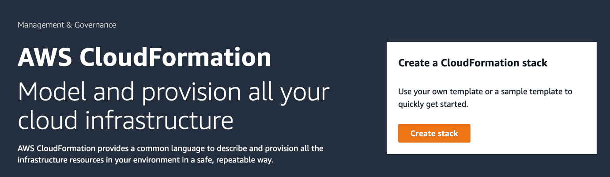

图 5.1 – AWS CloudFormation 控制台

1.  在 **指定模板** 部分，选择 **Amazon S3 URL** 作为 **模板源** 并输入 *步骤 2* 中注明的 **Amazon S3 URL**，如图 *图 5*.2* 所示，然后点击 **下一步** 按钮：

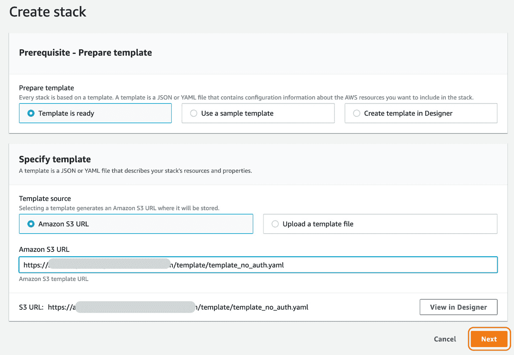

图 5.2 – 创建堆栈

1.  输入您选择的堆栈名称，然后点击 **下一步** 按钮。

1.  在 **配置堆栈选项** 页面上，保持默认设置，然后点击页面底部的 **下一步** 按钮。

1.  在 **审查** 页面上，滚动到屏幕底部，点击 **我承认 AWS CloudFormation 可能会使用自定义名称创建 IAM 资源** 复选框，然后点击 **创建堆栈** 按钮，如图 *图 5*.3* 所示：

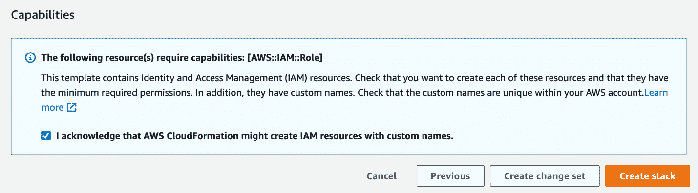

图 5.3 – 审查堆栈

注意

CloudFormation 模板启动需要 5-10 分钟。

1.  一旦启动，前往 **Amazon SageMaker**，点击 **SageMaker Studio**，您将看到为您配置的 **SageMaker 域** 和 **studio-user**，如图 *图 5*.4* 所示：

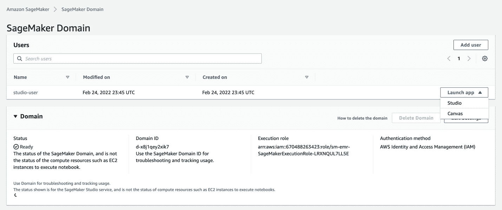

图 5.4 – SageMaker 域

1.  点击 **studio-user** 旁边的 **启动应用程序** 下拉菜单，选择 **Studio**，如图所示的先前的屏幕截图。之后，您将看到一个全新的 JupyterLab 界面 ([`jupyterlab.readthedocs.io/en/latest/user/interface.html`](https://jupyterlab.readthedocs.io/en/latest/user/interface.html))。

注意

建议您通过查看 Amazon SageMaker Studio UI 文档 ([`docs.aws.amazon.com/sagemaker/latest/dg/studio-ui.html`](https://docs.aws.amazon.com/sagemaker/latest/dg/studio-ui.html)) 来熟悉 Studio UI，因为我们将在本章中引用许多 SageMaker 特定的小部件和视图。

1.  为了使使用 Studio UI 运行书中的各种示例更容易，我们将从配套的 GitHub 仓库克隆源代码。在 Studio UI 中，点击左侧侧边栏中的 **Git** 图标，一旦资源面板打开，点击 **克隆仓库** 按钮，以启动 **克隆仓库** 对话框，如图 *图 5*.5* 所示：

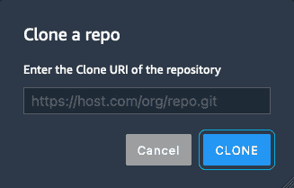

图 5.5 – 克隆仓库

1.  输入配套仓库的 URL ([`github.com/PacktPublishing/Applied-Machine-Learning-and-High-Performance-Computing-on-AWS.git`](https://github.com/PacktPublishing/Applied-Machine-Learning-and-High-Performance-Computing-on-AWS.git)) 并点击 **CLONE** 按钮。

1.  克隆的仓库现在将出现在 `Applied-Machine-Learning-and-High-Performance-Computing-on-AWS` 文件夹中，以便展开。

1.  然后双击 `Chapter05` 文件夹以打开它进行浏览。

我们现在可以使用 SageMaker Studio 分析大量结构化数据。然而，在我们开始分析之前，我们需要获取数据。让我们看看如何做到这一点。

## 分析大量结构化数据

由于本节的目标是提供一个分析大规模结构化数据的动手示例，我们的第一个任务将是合成大量数据。使用 Studio UI，执行以下步骤：

1.  使用左侧的`1_data_generator.ipynb`文件启动 Jupyter 笔记本。

1.  当出现 **设置笔记本环境** 对话框时，请确保从 **图像** 下拉菜单中选择 **数据科学**，以及 **内核** 选项中的 **Python 3**。*图 5**.6 展示了对话框的示例：

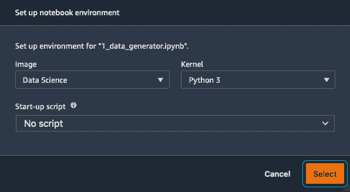

图 5.6 – 设置笔记本环境

1.  设置好这些选项后，点击 **选择** 按钮继续。

1.  接下来，你应该会看到一个 **启动笔记本内核…** 消息。笔记本内核需要几分钟来加载。

1.  笔记本加载完成后，通过点击 **内核** 菜单并选择 **重启内核并运行所有单元格…** 选项来运行笔记本。

笔记本执行完所有代码单元格后，我们可以深入了解笔记本做了什么，从检查数据集开始。

### 检查数据集

我们将在本例中使用的数据集是加利福尼亚住房数据集 ([`www.dcc.fc.up.pt/~ltorgo/Regression/cal_housing.html`](https://www.dcc.fc.up.pt/~ltorgo/Regression/cal_housing.html))。这个数据集是从 1990 年美国人口普查中得出的，每个普查区块组一行。区块组是美国人口普查局发布样本数据的最小地理单位。一个区块组通常有 600 到 3,000 的人口。

数据集被纳入 `sklearn` Python 库 ([`scikit-learn.org/stable/index.html`](https://scikit-learn.org/stable/index.html))。scikit-learn 库包括一个数据集模块，允许我们从 **StatLib 数据集存档**（http://lib.stat.cmu.edu/datasets/）下载流行的参考数据集，例如加利福尼亚住房数据集。

数据集引用

Pace, R. Kelley, 和 Ronald Barry，稀疏空间自回归，统计学与概率通讯，33 (1997) 291-297。

一个需要注意的关键点是，这个数据集只有 20,640 个样本，大小约为 400 KB。所以，我相信您会同意这并不完全符合大量结构化数据的定义。因此，我们刚刚执行的笔记本的主要目标是使用这个数据集作为合成大量结构化数据的基础，然后将这个新数据集存储在 S3 上进行分析。

让我们通过代码来查看这是如何完成的。

### 安装 Python 库

笔记本中的前五个代码单元用于安装和升级必要的 Python 库，以确保我们有 SageMaker SDK、scikit-learn 和**合成数据仓库**的正确版本。以下代码片段展示了这五个代码单元的合并：

```py
...
import sys
!{sys.executable} -m pip install "sagemaker>=2.51.0"
!{sys.executable} -m pip install --upgrade -q "scikit-learn"
!{sys.executable} -m pip install "sdv"
import sklearn
sklearn.__version__
import sdv
sdv.__version__
...
```

注意

我们升级和安装 SageMaker 和 scikit-learn 库没有特定的原因，只是为了确保本章示例的一致性。

一旦安装了所需的库，我们就加载它们并配置全局变量。以下代码片段展示了我们如何导入库并配置 SageMaker 默认的 S3 存储桶参数：

```py
...
import os
from sklearn.datasets import fetch_california_housing
import time
import boto3
import numpy as np
import pandas as pd
from sklearn.model_selection import train_test_split
import sagemaker
from sagemaker import get_execution_role
prefix = 'california_housing'
role = get_execution_role()
bucket = sagemaker.Session(boto3.Session()).default_bucket()
...
```

然而，在我们能够合成更大的数据集并将其上传到 S3 之前，我们需要下载加利福尼亚住房数据集。如您从以下代码片段中可以看到，我们创建了两个本地文件夹`data`和`raw`，然后使用`sklearn.datasets`中的`fetch_california_housing()`方法下载数据。结果数据变量使我们能够描述数据，以及将数据本身作为二维数据结构`df_data`捕获：

```py
...
data_dir = os.path.join(os.getcwd(), "data")
os.makedirs(data_dir, exist_ok=True)
raw_dir = os.path.join(os.getcwd(), "data/raw")
os.makedirs(raw_dir, exist_ok=True)
data = fetch_california_housing(data_home=raw_dir, download_if_missing=True, return_X_y=False, as_frame=True)
...
df_data = data.data
...
```

`df_data`变量是我们结构化数据的必要表示，列显示数据标签，行显示每个标签的观测或记录。将这种结构想象成类似于电子表格或关系表。

使用`df_data`变量，我们进一步描述这种结构，并执行本章“探索数据分析方法”部分中描述的一些描述性统计和可视化。例如，以下代码片段展示了如何描述我们正在处理的数据类型。您会记得，理解数据类型对于欣赏数据的整体模式或结构至关重要：

```py
...
df_data.astype({'Population': 'int32'}).dtypes
...
```

此外，我们可以定义一个名为`plot_boxplot()`的 Python 函数来可视化`df_data`变量中包含的数据。您会记得，可视化数据可以提供对数据的进一步了解。例如，您可以从下一个代码片段中看到，我们可以可视化房屋的平均房间数或`avgNumrooms`的整体分布：

```py
...
import matplotlib.pyplot as plt
def plot_boxplot(data, title):
    plt.figure(figsize =(5, 4))
    plt.boxplot(data)
    plt.title(title)
    plt.show()
...
df_data.drop(df_data[df_data['avgNumRooms'] > 9].index, inplace = True)
df_data.drop(df_data[df_data['avgNumRooms'] <= 1].index, inplace = True)
plot_boxplot(df_data.avgNumRooms, 'rooms')
...
```

如我们从**图 5.7**.7 中可以看到，代码生成的箱线图表明加利福尼亚住房数据的平均房间数为**5**：

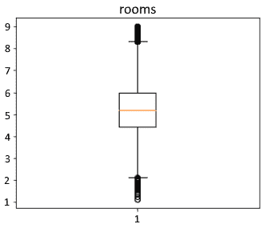

图 5.7 – 房间平均数量

此外，你还会注意到在**图 5.7**中，数据的上限和下限之间有一种某种程度的均匀分布。这表明我们有一个很好的数据分布，对于平均卧室数量来说，因此，我们不需要增强这个数据点。

最后，你可能还记得在**计数数据点**部分，我们可以通过确定数据中是否存在缺失值来避免模型训练过程中的任何不必要的麻烦。例如，下一个代码片段展示了我们如何查看`df_data`变量中任何缺失值的总和：

```py
...
df_data.isna().sum()
...
```

虽然我们只介绍了几种分析方法来展示分析生命周期，但从中可以得出的一个关键结论是，由于数据量足够小，可以放入内存中，因此数据很容易分析。所以，作为数据科学家，我们不需要捕获全球人口的样本来分析数据，然后再将分析结果推断回更大的数据集。让我们看看当我们合成一个更大的数据集时，这个结论是否仍然成立。

### 合成大量数据

笔记本的最后部分涉及使用合成数据仓库([`sdv.dev/SDV/index.html`](https://sdv.dev/SDV/index.html))，或`sdv` Python 库。这个 Python 库生态系统使用专门关注从结构化表格和时间序列数据集学习以及创建与原始数据集具有相同格式、统计属性和结构的合成数据的 ML 模型。

在我们的示例笔记本中，我们使用一个 TVAE（[`arxiv.org/abs/1907.00503`](https://arxiv.org/abs/1907.00503)）模型来生成加利福尼亚住房数据的一个更大版本。例如，以下代码片段展示了我们如何在`df_data`变量上定义和训练一个 TVAE 模型：

```py
...
from sdv.tabular import TVAE
model = TVAE(rounding=2)
model.fit(df_data)
model_dir = os.path.join(os.getcwd(), "model")
os.makedirs(model_dir, exist_ok=True)
model.save(f'{model_dir}/tvae_model.pkl')
...
```

一旦我们训练了模型，我们就可以将其加载到`synthetic_data`变量中，生成一百万个新的观测值或行。以下代码片段展示了这个例子：

```py
...
from sdv.tabular import TVAE
model = TVAE.load(f'{model_dir}/tvae_model.pkl')
synthetic_data = model.sample(1000000)
...
```

最后，正如所示，我们使用以下代码片段来压缩数据，并利用 SageMaker SDK 的`upload_data()`方法将数据存储在 S3 中：

```py
...
sess = boto3.Session()
sagemaker_session = sagemaker.Session(boto_session=sess)
synthetic_data.to_parquet('data/raw/data.parquet.gzip', compression='gzip')
rawdata_s3_prefix = "{}/data/raw".format(prefix)
raw_s3 = sagemaker_session.upload_data(path="./data/raw/data.parquet.gzip", key_prefix=rawdata_s3_prefix)
...
```

在 S3 中存储了 100 万行数据集后，我们终于有一个大量结构化数据的例子。现在我们可以使用这些数据来展示如何使用 Amazon EMR 在结构化数据上大规模利用突出显示的分析方法。

### 使用 EMR 集群和 SageMaker Studio 分析大规模数据

要开始分析我们刚刚创建的大规模合成数据集，我们可以在 Studio UI 中执行以下步骤：

1.  使用左侧导航面板，双击`2_data_exploration_spark.ipynb`笔记本以启动它。

1.  正如我们通过前面的示例所看到的，当出现**设置笔记本环境**对话框时，选择**SparkMagic**作为**图像**，并将**PySpark**作为**内核**。

1.  一旦笔记本准备就绪，点击**内核**菜单选项，然后再次选择**重启内核并运行所有单元格…**选项以执行整个笔记本。

当笔记本正在运行时，我们可以开始审查我们在各个代码单元格中试图完成的事情。正如您从第一个代码单元格中可以看到的，我们连接到在*设置 EMR 和 SageMaker* *工作室*部分配置的 EMR 集群：

```py
%load_ext sagemaker_studio_analytics_extension.magics
%sm_analytics emr connect --cluster-id <EMR Cluster ID> --auth-type None
```

在下一个代码单元格中，以下代码显示了从 S3 读取合成的数据集。我们在这里创建一个`housing_data`变量，使用 PySpark 的`sqlContext`方法从 S3 读取原始数据：

```py
housing_data=sqlContext.read.parquet('s3://<SageMaker Default Bucket>/california_housing/data/raw/data.parquet.gzip')
```

一旦我们分配了这个变量，我们就可以使用 PySpark 和 EMR 集群在数据的整个总体上执行各种数据分析任务，而无需摄入用于分析的样本数据集。

虽然笔记本提供了针对数据的多种特定分析方法的示例，但我们将重点关注与我们已经在原始加利福尼亚住房数据集上进行的探索相关的少数示例，以说明这些相同的方法如何在大规模上应用。

#### 复习数据结构和计数

正如已经提到的，了解数据的类型、结构和计数是分析的重要部分。为了在整个`housing_data`上执行此分析，我们可以执行以下代码：

```py
print((housing_data.count(), len(housing_data.columns)))
housing_data.printSchema()
```

执行此代码会产生以下输出，其中我们可以看到我们有 100 万个观测值，以及每个特征的类型：

```py
(1000000, 9)
Root
|-- medianIncome: double (nullable = true)
|-- medianHousingAge: double (nullable = true)
|-- avgNumRooms: double (nullable = true)
|-- avgNumBedrooms: double (nullable = true)
|-- population: double (nullable = true)
|-- avgHouseholdMembers: double (nullable = true)
|-- latitude: double (nullable = true)
|-- longitude: double (nullable = true)
|-- medianHouseValue: double (nullable = true)
```

接下来，我们可以确定是否存在任何缺失值以及如何处理它们。

#### 处理缺失值

您会记得，确保没有缺失值是任何数据分析的重要方法。为了暴露任何缺失数据，我们可以运行以下代码来创建每个列或特征中缺失值的计数：

```py
from pyspark.sql.functions import isnan, when, count, col
housing_data.select([count(when(isnan(c), c)).alias(c) for c in housing_data.columns]).show()
```

如果我们确实发现任何缺失值，我们可以使用多种技术来处理它们。例如，我们可以使用`dropna()`方法在`housing_data`变量上删除包含缺失值的行。或者，根据缺失值的数量，我们可以使用插补技术根据特征的均值或中位数推断一个值。

#### 分析数据的中心性和变异性

记住，了解数据的分布情况将给我们一个很好的想法，了解数据是否成比例。这项分析任务还提供了一个想法，即我们数据中是否有异常值扭曲了分布或扩散。之前已经强调，使用条形图和箱线图可视化数据分布可以进一步帮助确定数据的变异性。

为了适应这项任务，以下代码突出显示了一个捕获我们希望分析的特征并绘制其分布作为条形图的示例：

```py
import matplotlib.pyplot as plt
df = housing_data.select('avgNumRooms', 'avgNumBedrooms', 'population').toPandas()
df.hist(figsize=(10, 8), bins=20, edgecolor="black")
plt.subplots_adjust(hspace=0.3, wspace=0.5)
plt.show()
%matplot plt
```

在对大量数据进行代码执行后，我们可以在 *图 5.8* 中看到平均房间数量 (`avgNumRooms`)、平均卧室数量 (`avgNumBedrooms`) 和区块人口 (`population`) 特征的结果分布示例：

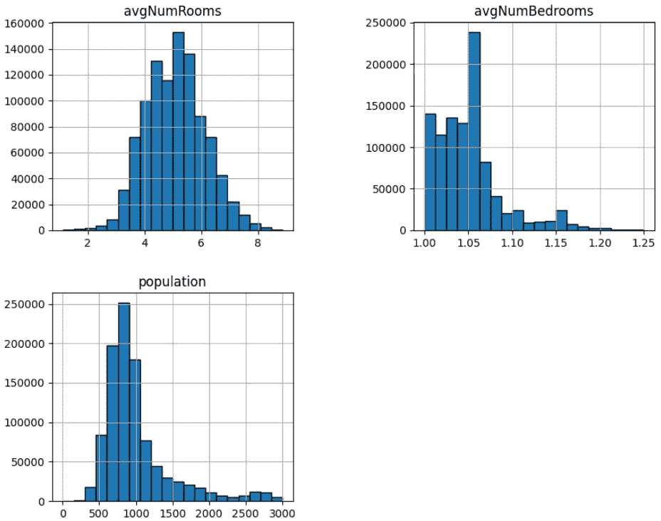

图 5.8 – 特征分布

如您从 *图 5.8* 中所见，`avgNumBedrooms` 和 `population` 特征都没有围绕均值或平均特征值进行中心化。此外，`avgNumBedrooms` 特征的分布显著偏向光谱的较低端。这个因素可能表明存在潜在的异常值或过多的数据点集中在 `avgNumBedrooms` 特征之间：

```py
plot_boxplot(df.avgNumBedrooms, 'Boxplot for Average Number of Bedrooms')
%matplot plt
```

执行此代码单元格的结果箱线图显示在 *图 5.9* 中：

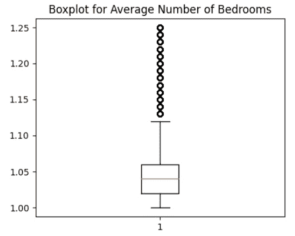

图 5.9 – 房间平均数量的箱线图

*图 5.9* 清楚地显示了导致数据偏斜的多个异常值。因此，我们需要在数据分析和在大型数据集上训练机器学习模型之前解决这些差异。以下代码片段展示了如何从箱线图中查询数据，然后简单地删除它，以创建一个名为 `housing_df_with_no_outliers` 的变量：

```py
import pyspark.sql.functions as f
columns = ['avgNumRooms', 'avgNumBedrooms', 'population']
housing_df_with_no_outliers = housing_data.where(
    (housing_data.avgNumRooms<= 8) &
    (housing_data.avgNumRooms>=2) &
    (housing_data.avgNumBedrooms<=1.12) &
    (housing_data.population<=1500) &
    (housing_data.population>=250))
```

一旦我们有了 `housing_df_with_no_outliers`，我们可以使用以下代码创建 `avgNumBedrooms` 特征变异性的新箱线图：

```py
df = housing_df_with_no_outliers.select('avgNumRooms', 'avgNumBedrooms', 'population').toPandas()
plot_boxplot(df.avgNumBedrooms, 'Boxplot for Average Number of Bedrooms')
%matplot plt
```

*图 5.10* 展示了执行此代码后生成的箱线图示例：

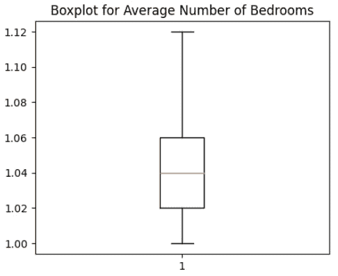

图 5.10 – 房间平均数量的箱线图

从 *图 5.10* 中，我们可以清楚地看到已经移除了异常值。随后，我们可以在 `avgNumRooms` 和 `population` 特征上执行类似的程序。

虽然这些例子只展示了数据分析生命周期中突出的一些重要方法，但从这个练习中我们可以得到的一个重要启示是，由于集成了 SageMaker Studio 和 EMR，我们能够在大规模结构化数据上完成数据分析任务，而无需捕获全球人口的样本，然后再将分析推断回更大的数据集。然而，在分析大规模数据的同时，我们还需要确保任何预处理任务也能在大规模上执行。

接下来，我们将回顾如何使用 SageMaker 自动化这些预处理任务的大规模执行。

#### 大规模预处理数据

SageMaker 服务通过其核心组件之一 `preprocess.py` 来处理数据转换或预处理任务的重负载和扩展。

以下代码片段展示了如何将删除异常值的代码转换为 Python 脚本：

```py
%%writefile preprocess.py
...
def main():
    parser = argparse.ArgumentParser(description="app inputs and outputs")
    parser.add_argument("--bucket", type=str, help="s3 input bucket")
    parser.add_argument("--s3_input_prefix", type=str, help="s3 input key prefix")
    parser.add_argument("--s3_output_prefix", type=str, help="s3 output key prefix")
    args = parser.parse_args()
    spark = SparkSession.builder.appName("PySparkApp").getOrCreate()
    housing_data=spark.read.parquet(f's3://{args.bucket}/{args.s3_input_prefix}/data.parquet.gzip')
    housing_df_with_no_outliers = housing_data.where((housing_data.avgNumRooms<= 8) &
                   (housing_data.avgNumRooms>=2) &
                   (housing_data.avgNumBedrooms<=1.12) &
                    (housing_data.population<=1500) &
                    (housing_data.population>=250))
    (train_df, validation_df) = housing_df_with_no_outliers.randomSplit([0.8, 0.2])
    train_df.write.parquet("s3://" + os.path.join(args.bucket, args.s3_output_prefix, "train/"))
    validation_df.write.parquet("s3://" + os.path.join(args.bucket, args.s3_output_prefix, "validation/"))
if __name__ == "__main__":
    main()
...
```

一旦创建了 Python 脚本，我们可以加载适当的 SageMaker SDK 库，并配置输入数据以及转换后的输出数据的 S3 位置，如下所示：

```py
%local
import sagemaker
from time import gmtime, strftime
sagemaker_session = sagemaker.Session()
role = sagemaker.get_execution_role()
bucket = sagemaker_session.default_bucket()
timestamp = strftime("%Y-%m-%d-%H-%M-%S", gmtime())
prefix = "california_housing/data_" + timestamp
s3_input_prefix = "california_housing/data/raw"
s3_output_prefix = prefix + "/data/spark/processed"
```

最后，我们可以创建 SageMaker `PySparkProcessor()`类的实例，作为`spark_processor`变量，如下代码所示：

```py
%local
from sagemaker.spark.processing import PySparkProcessor
spark_processor = PySparkProcessor(
    base_job_name="sm-spark",
    framework_version="2.4",
    role=role,
    instance_count=2,
    instance_type="ml.m5.xlarge",
    max_runtime_in_seconds=1200,
)
```

定义了`spark_processor`变量后，我们可以调用`run()`方法来执行 SageMaker Processing 作业。以下代码演示了如何调用`run()`方法，并附带`preprocess.py`脚本以及数据输入和输出位置的`arguments`：

```py
spark_processor.run(
    submit_app="preprocess.py",
    arguments=[
        "--bucket",
        bucket,
        "--s3_input_prefix",
        s3_input_prefix,
        "--s3_output_prefix",
        s3_output_prefix,
    ],
)
```

在后台，SageMaker 将创建一个临时的 Spark 集群，并在输入数据上执行`preprocess.py`脚本。一旦数据转换完成，SageMaker 将把结果数据集存储在 S3 上，然后解散 Spark 集群，同时将执行日志输出重定向回 Jupyter 笔记本。

虽然这种技术使得分析大量结构化数据的复杂任务更容易扩展，但仍然存在如何在非结构化数据上执行类似过程的问题。

让我们回顾一下如何解决这个问题。

## 分析大量非结构化数据

在本节中，我们将使用从[`laurencemoroney.com/datasets.html`](https://laurencemoroney.com/datasets.html)下载的非结构化数据（马和人类图像）进行操作。这个数据集可以用来训练一个二进制图像分类模型，以在图像中区分马和人类。从 SageMaker Studio 启动`3_unstructured_data_s3.ipynb`笔记本，从**图像**下拉菜单中选择**PyTorch 1.8 Python 3.6 CPU Optimized**，以及**Python 3**作为**内核**选项。一旦笔记本打开，重启内核并运行如*使用 SageMaker Studio 分析大规模数据*部分中提到的所有单元格。

笔记本执行完所有代码单元格后，我们可以深入了解笔记本具体做了什么。

如笔记本中所示，我们首先从[`storage.googleapis.com/laurencemoroney-blog.appspot.com/horse-or-human.zip`](https://storage.googleapis.com/laurencemoroney-blog.appspot.com/horse-or-human.zip)下载马或人类数据，然后解压文件。

一旦我们有了数据，我们将使用`super-image`库将图像转换为高分辨率：

1.  我们将首先下载具有`scale = 4`的预训练模型，这意味着我们打算将图像的分辨率提高四倍，如下代码块所示：

    ```py
    from super_image import EdsrModel, ImageLoader
    ```

    ```py
    from PIL import Image
    ```

    ```py
    import requests
    ```

    ```py
    model = EdsrModel.from_pretrained('eugenesiow/edsr-base', scale=4)
    ```

1.  接下来，我们将遍历包含图像的文件夹，使用预训练模型将每个图像转换为高分辨率，并保存，如下面的代码块所示：

    ```py
    import os
    ```

    ```py
    from os import listdir
    ```

    ```py
    folder_dir = "horse-or-human/"
    ```

    ```py
    for folder in os.listdir(folder_dir):
    ```

    ```py
        folder_path = f'{folder_dir}{folder}'
    ```

    ```py
        for image_file in os.listdir(folder_path):
    ```

    ```py
            path = f'{folder_path}/{image_file}'
    ```

    ```py
            image = Image.open(path)
    ```

    ```py
            inputs = ImageLoader.load_image(image)
    ```

    ```py
            preds = model(inputs)
    ```

    ```py
            ImageLoader.save_image(preds, path)
    ```

您可以通过检查其中一张图像的文件大小来确认图像已被转换为高分辨率。一旦图像被转换为高分辨率，您可以可选地复制图像以增加文件数量，最后将它们上传到 S3 桶。我们将使用上传到 S3 桶的图像来运行 SageMaker 训练作业。

注意

在本例中，我们将向您展示如何使用 SageMaker 训练功能，通过存储在 S3 桶中的数据运行一个**PyTorch**训练作业。您也可以选择使用其他框架，例如也由 SageMaker 支持的**TensorFlow**和**MXNet**。

为了使用 PyTorch，我们首先导入`sagemaker.pytorch`模块，使用它我们将定义**SageMaker PyTorch Estimator**，如下面的代码块所示：

```py
from sagemaker.pytorch import PyTorch
estimator = PyTorch(entry_point='train.py',
                    source_dir='src',
                    role=role,
                    instance_count=1,
                    instance_type='ml.g4dn.8xlarge',
                    framework_version='1.8.0',
                    py_version='py3',
                    sagemaker_session=sagemaker_session,
                    hyperparameters={'epochs':5,
                                     'subset':2100,
                                     'num_workers':4,
                                     'batch_size':500},
                   )
```

在估计器对象中，如代码片段所示，我们需要提供配置参数。在这种情况下，我们需要定义以下参数：

+   `instance_count`: 这是实例数量

+   `instance_type`: 这是训练作业将启动的实例类型

+   `framework_version`: 这是用于训练的 PyTorch 框架版本

+   `py_version`: 这是 Python 版本

+   `source_dir`: 这是笔记本中的文件夹路径，其中包含训练脚本

+   `entry_point`: 这是 Python 训练脚本的名称

+   `hyperparameters`: 这是训练脚本将使用的超参数列表

一旦我们定义了 PyTorch 估计器，我们将定义`TrainingInput`对象，它将输入数据的 S3 位置、内容类型和输入模式作为参数，如下面的代码所示：

```py
from sagemaker.inputs import TrainingInput
train = TrainingInput(s3_input_data,content_type='image/png',input_mode='File')
```

`input_mode`参数可以取以下值；在我们的情况下，我们使用`File`值：

+   `None`: Amazon SageMaker 将使用基础`Estimator`类中指定的输入模式

+   `File`: Amazon SageMaker 将训练数据集从 S3 位置复制到本地目录

+   `Pipe`: Amazon SageMaker 通过*Unix 命名管道*直接从 S3 流数据到容器

+   `FastFile`: Amazon SageMaker 在训练开始前按需从 S3 流式传输数据，而不是下载整个数据集

注意

您可以通过此链接查看 PyTorch 估计器的完整参数列表：[`sagemaker.readthedocs.io/en/stable/frameworks/pytorch/sagemaker.pytorch.html`](https://sagemaker.readthedocs.io/en/stable/frameworks/pytorch/sagemaker.pytorch.html).

一旦我们配置了 PyTorch `Estimator`和`TrainingInput`对象，我们现在就可以开始训练作业，如下面的代码所示：

```py
estimator.fit({'train':train})
```

当我们运行`estimator.fit`时，它将启动一个`ml.g4dn.8xlarge`类型的训练实例，安装`PyTorch 1.8`容器，将训练数据从`S3 位置`和`train.py`脚本复制到训练实例的本地目录，并最终运行你在估计器配置中提供的训练脚本。一旦训练作业完成，SageMaker 将自动终止它启动的所有资源，你只需为训练作业运行的时间付费。

在这个例子中，我们使用了一个简单的训练脚本，该脚本涉及使用 PyTorch `DataLoader` 对象加载数据并遍历图像。在下一节中，我们将看到如何使用 AWS 进行大规模数据处理。

# 在 AWS 上大规模处理数据

在上一节**分析大量非结构化数据**中，数据存储在 S3 存储桶中，用于训练。在有些情况下，你需要更快地加载数据进行训练，而不是等待训练作业将数据从 S3 本地复制到训练实例。在这些情况下，你可以将数据存储在文件系统上，例如`3_unstructured_data.ipynb`笔记本。请参阅笔记本中的**使用 EFS 上的数据优化**和**使用 FSX 上的数据优化**部分。

注意

在运行`template_filesystems.yaml`模板之前，以与我们在**设置 EMR 和 SageMaker Studio**部分所做的方式类似。

# 清理

让我们终止在**设置 EMR 和 SageMaker Studio**部分启动的 EMR 集群，因为它在本书的后续章节中不会被使用。

首先，让我们登录 AWS 控制台并按照这里给出的步骤操作：

1.  在 AWS 控制台中搜索`EMR`。

1.  你将看到活动的**EMR-Cluster-sm-emr**集群。选择 EMR 集群名称旁边的复选框，然后点击**终止**按钮，如图**图 5**.11*所示：

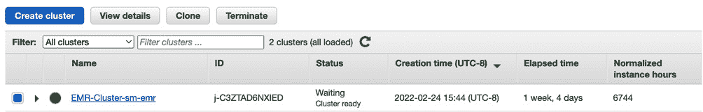

图 5.11 – EMR 集群列表

1.  在弹出的窗口中点击红色**终止**按钮，如图**图 5**.12*所示：

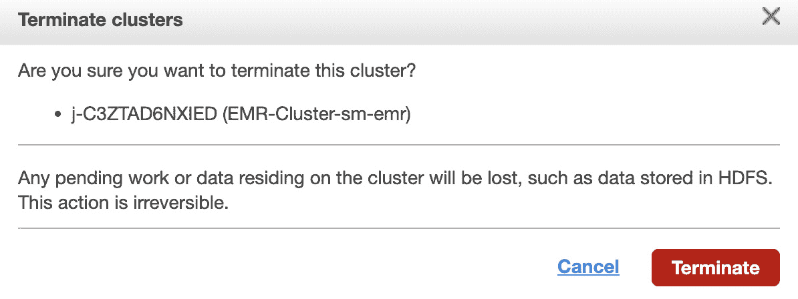

图 5.12 – 终止 EMR 集群

1.  终止 EMR 集群可能需要几分钟，一旦完成，**状态**将变为**已终止**。

让我们总结一下本章学到的内容。

# 摘要

在本章中，我们探讨了各种数据分析方法，回顾了一些 AWS 数据分析服务，并启动了一个 CloudFormation 模板来创建 EMR 集群、SageMaker Studio 域和其他有用的资源。然后我们深入研究了分析结构化和非结构化数据的代码，并提出了一些优化其性能的方法。这将帮助你为训练机器学习模型准备数据。

在下一章中，我们将看到如何以分布式的方式在大量数据上训练大型模型，以加快训练过程。
