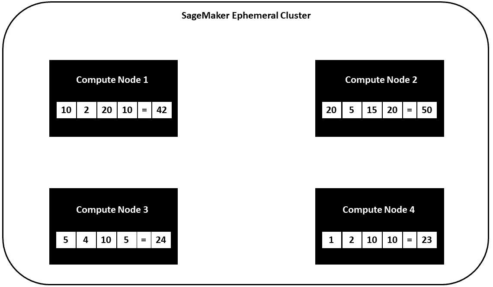
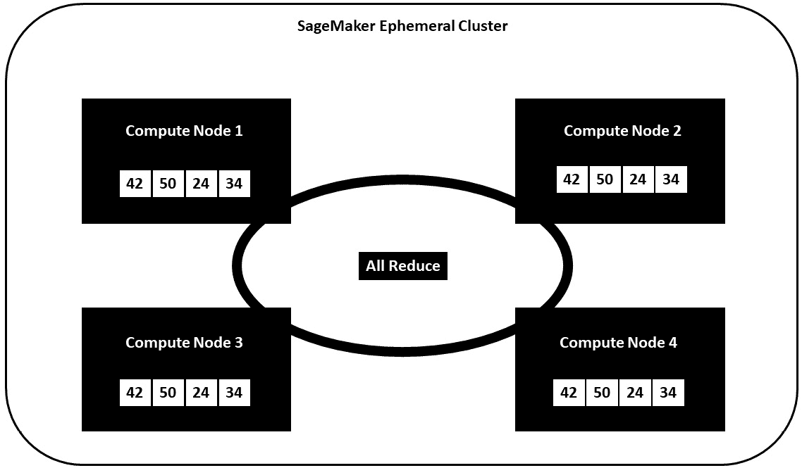
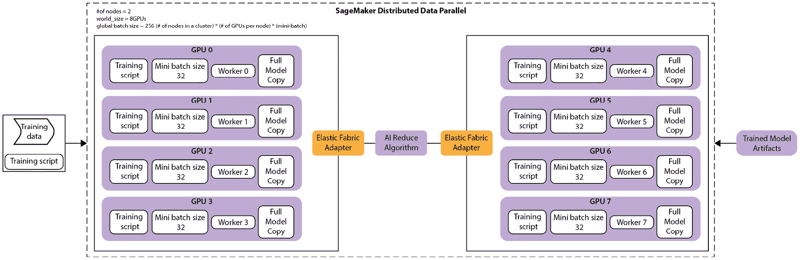
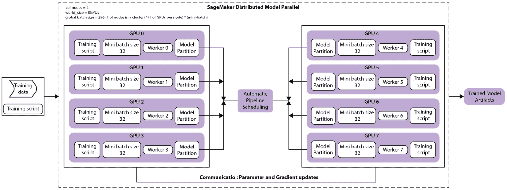
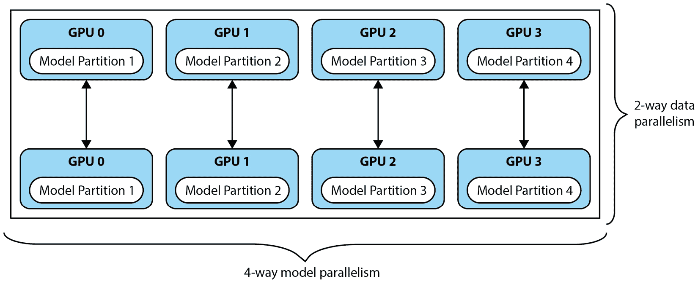

# 6

# 分布式训练机器学习模型

当涉及到 **机器学习**（**ML**）模型训练时，数据科学家或 ML 实践者的主要目标是根据相关数据训练出最优模型，以解决业务用例。虽然这个目标是首要的，但最佳方案是以尽可能快和有效的方式完成这项任务。那么，*我们如何加快模型训练速度呢？* 此外，有时数据或模型可能太大，无法适应单个 GPU 内存。*那么我们如何防止内存不足（**OOM**）错误呢？

这个问题的最简单答案就是向问题投入更多的计算资源，换句话说，更多的 CPU 和 GPU。这本质上是在使用更大的计算硬件，通常被称为 **扩展** 策略。然而，服务器中可以挤入的 CPU 和 GPU 数量是有限的。因此，有时需要 **扩展** 策略，即向混合中添加更多服务器，本质上是在多个物理计算资源之间分配工作负载。

尽管如此，将模型训练工作负载分散到更多的 CPU 或 GPU，甚至分散到更多的计算服务器上，肯定会加快整体训练过程。利用扩展、扩展或两种策略的组合也会给模型训练活动的整体编排和配置增加更多的复杂性。因此，本章将帮助您应对这些挑战，通过涵盖以下主题来帮助克服分布式训练过程带来的额外复杂性：

+   使用 AWS 构建 ML 系统

+   介绍分布式训练的基本原理

+   在 AWS 上执行分布式训练工作负载

# 技术要求

在开始本章之前，您应该具备以下先决条件：

+   网络浏览器（为了获得最佳体验，建议您使用 Chrome 或 Firefox 浏览器）

+   访问您在 *第五章*，*数据分析* 中使用的 AWS 账户

+   AWS 账户（如果您不熟悉如何开始使用 AWS 账户，您可以访问此链接 [`aws.amazon.com/getting-started/`](https://aws.amazon.com/getting-started/)）

+   访问我们在 *第五章*，*数据分析* 中创建的 SageMaker Studio 开发环境

+   本章的示例 Jupyter 笔记本提供在配套 GitHub 仓库中 ([`github.com/PacktPublishing/Applied-Machine-Learning-and-High-Performance-Computing-on-AWS/tree/main/Chapter06`](https://github.com/PacktPublishing/Applied-Machine-Learning-and-High-Performance-Computing-on-AWS/tree/main/Chapter06)))

# 使用 AWS 构建 ML 系统

在我们探索如何实现一开始就强调的分布式训练策略的基本原理之前，我们首先需要统一认识，了解如何在 AWS 平台上执行 ML 模型训练练习。一旦我们了解了 AWS 如何处理模型训练，我们就可以进一步扩展这个概念来讨论分布式训练的概念。

为了帮助 ML 从业者构建 ML 系统，AWS 提供了 SageMaker ([`aws.amazon.com/sagemaker/`](https://aws.amazon.com/sagemaker/)) 服务。虽然 SageMaker 是一个单一的 AWS 服务，但它由多个模块组成，这些模块专门对应于 ML 任务。例如，SageMaker 提供了专门用于处理模型训练任务的重负载和扩展的训练作业组件。ML 从业者可以使用 SageMaker 训练作业来基本提供临时的计算环境或集群来处理模型训练任务。本质上，ML 从业者需要做的只是指定一些配置参数，SageMaker 训练作业就会处理其余的工作。例如，我们需要提供以下四个基本参数：

+   包含模型训练、测试，以及可选的验证数据的 S3 存储桶的 URL。

+   执行模型训练任务所需的 ML 计算实例的类型和数量。

+   存储训练好的模型的 S3 存储桶的位置。

+   存储模型训练代码的位置，无论是本地还是 S3。

以下代码片段展示了如何将这些四个基本要求正式化成一个 SageMaker 训练作业请求是多么简单：

```py
...
from sagemaker.pytorch import PyTorch
estimator = PyTorch(entry_point='train.py',
                    source_dir='src',
                    role=role,
                    instance_count=1,
                    instance_type='ml.p3.2xlarge',
                    framework_version='1.8.0',
                    py_version='py3',
                    sagemaker_session=sagemaker_session,
                    hyperparameters={'epochs':10,
                                     'batch_size':32,
                                     'lr':3e-5,
                                     'gamma': 0.7},
                   )
...
```

使用这个代码片段，我们基本上告诉 SageMaker 我们想要使用内置的 PyTorch 估计器，通过声明使用 PyTorch 框架的`estimator`变量。然后，我们提供必要的要求，例如以下内容：

+   `entry_point`：这是训练脚本的存储位置。

+   `instance_count`：这是集群中要配置的计算服务器数量。

+   `instance_type`：这是集群中所需的计算资源类型。在这个例子中，我们指定了`ml.p3.16xlarge`实例。

注意

关于 SageMaker PyTorch 估计器的更多信息，以及如何利用 SageMaker SDK 实例化估计器，请参阅 AWS 关于如何在 SageMaker 上使用 PyTorch 的文档（[`docs.aws.amazon.com/sagemaker/latest/dg/pytorch.html`](https://docs.aws.amazon.com/sagemaker/latest/dg/pytorch.html)）和 SageMaker SDK 文档（https://sagemaker.readthedocs.io/en/stable/frameworks/pytorch/sagemaker.pytorch.html#pytorch-estimator）。

一旦我们声明了估计器，我们就在 S3 上指定训练和验证数据集的位置，如下代码片段所示：

```py
...
from sagemaker.inputs import TrainingInput
train = TrainingInput(s3_train_data,
                      content_type='image/png',
                      input_mode='File')
val = TrainingInput(s3_val_data,
                    content_type='image/png',
                    input_mode='File')
...
```

然后，我们调用 PyTorch 估计器的`fit()`方法，告诉 SageMaker 在数据集上执行训练作业，如下代码片段所示：

```py
...
estimator.fit({'train':train, 'val': val})
...
```

在幕后，SageMaker 创建了一个短暂的计算集群，在这些资源上执行训练任务，然后生成最终的优化模型，该模型随后存储在 Amazon S3 上。在此任务完成后，SageMaker 将拆除短暂的集群，用户只需为训练时间消耗的资源付费。

注意

关于 SageMaker 训练作业在幕后如何工作的更详细信息，请参阅 AWS 文档（[`docs.aws.amazon.com/sagemaker/latest/dg/how-it-works-training.html`](https://docs.aws.amazon.com/sagemaker/latest/dg/how-it-works-training.html)）。

因此，现在我们已经对如何使用 Amazon SageMaker 执行模型训练练习有了基本的了解，*那么我们如何改进模型训练时间，并通过利用更多计算资源来加快这个过程呢？*

为了回答这个问题，我们可以非常容易地通过 SageMaker 训练作业实现一个扩展策略。我们只需要将`estimator`变量的`instance_type`参数从`ml.p3.2xlarge`更改为`ml.p3.16xlarge`。通过这样做，我们正在增加或扩展计算资源的大小，从一个具有 8 个 vCPU、61GB RAM 和单个 GPU 的实例扩展到一个具有 64 个 vCPU、488GB RAM 和 8 个 GPU 的实例。

生成的代码现在如下所示：

```py
...
from sagemaker.pytorch import PyTorch
estimator = PyTorch(entry_point='train.py',
                    source_dir='src',
                    role=role,
                    instance_count=1,
                    instance_type='ml.p3.16xlarge',
                    framework_version='1.8.0',
                    py_version='py3',
                    sagemaker_session=sagemaker_session,
                    hyperparameters={'epochs':10,
                                     'batch_size':32,
                                     'lr':3e-5,
                                     'gamma': 0.7},
                   )
...
```

因此，如您所见，使用 SageMaker 实施扩展策略非常简单。然而，*如果我们需要超出加速计算实例的最大容量怎么办？*

那么，我们就需要实施一个扩展策略，并将训练过程分散到多个计算节点上。在下一节中，我们将探讨如何使用分布式训练来应用扩展策略于 SageMaker 训练作业。

# 介绍分布式训练的基本原理

在上一节中，我们强调了如何通过指定大型计算资源或大型实例类型来应用扩展策略于 SageMaker 训练作业。实施训练过程的扩展策略同样简单。例如，我们可以将训练作业的`instance_count`参数从`1`增加到`2`，从而指示 SageMaker 实例化一个由 2 个计算资源组成的短暂集群，而不是 1 个节点。因此，以下代码片段突出了`estimator`变量配置将如何看起来：

```py
...
from sagemaker.pytorch import PyTorch
estimator = PyTorch(entry_point='train.py',
                    source_dir='src',
                    role=role,
                    instance_count=2,
                    instance_type='ml.p3.2xlarge',
                    framework_version='1.8.0',
                    py_version='py3',
                    sagemaker_session=sagemaker_session,
                    hyperparameters={'epochs':10,
                                     'batch_size':32,
                                     'lr':3e-5,
                                     'gamma': 0.7},
                   )
...
```

不幸的是，仅仅更改计算实例的数量并不能完全解决问题。正如在本章开头所述，将扩展策略应用于分散 SageMaker 训练作业会增加模型训练活动的整体编排和配置的复杂性。例如，在分配训练活动时，我们还需要考虑以下方面：

+   *如何让各种计算资源访问和共享数据？*

+   *计算资源之间是如何相互通信和协调它们的训练任务的？*

因此，虽然简单地指定训练作业的计算资源数量将创建一个适当规模的训练集群，但我们还需要通知 SageMaker 我们的**模型放置策略**。模型放置策略指导 SageMaker 如何将模型分配或分配给集群中每个节点的每个计算资源。反过来，SageMaker 使用放置策略来协调每个节点如何与相关的训练数据互动，以及每个节点如何协调和沟通其模型训练任务的相应部分。

*那么我们如何确定 SageMaker 的有效模型放置策略呢？*

回答这个问题的最佳方式是了解可用的放置策略，并剖析每种策略是如何工作的。针对不同的训练框架，以及许多开源框架，存在众多特定的放置策略。尽管如此，所有这些不同的机制都可以归纳为两种特定的放置策略类别，即**数据并行**和**模型并行**。

让我们先来探讨 SageMaker 的数据并行策略。

## 检查 SageMaker 分布式数据并行策略

正如其名所示，数据并行策略侧重于模型训练数据的放置。因此，为了全面理解这种放置策略是如何应用于数据的，我们应该首先了解训练活动是如何与训练数据互动以优化机器学习模型的。

当我们训练一个机器学习模型时，我们基本上创建了一个训练循环，该循环将特定的机器学习算法应用于数据。通常情况下，与深度学习算法一样，我们将数据分成更小的记录组或数据批次。这些批次被称为**小批量**。然后我们将每个小批量通过神经网络层向前传递，然后向后传递以优化或训练模型参数。完成一个小批量后，我们再将相同的程序应用于下一个小批量，依此类推，直到我们处理完所有数据。在整个数据集上完整执行此过程被称为一个**epoch**。根据算法类型和当然，用例，我们可能需要运行算法多次 epoch 来训练模型。这项任务无疑花费了最多的时间，这也是我们本质上想要改进以减少模型训练所需总时间的任务。

因此，当使用数据并行放置策略时，我们基本上是将训练任务从顺序过程转换为并行过程。我们不再按顺序运行算法通过一个迷你批次，然后是下一个迷你批次，然后是下一个迷你批次，我们现在将每个单独的迷你批次分配给一个单独的计算资源，每个计算资源依次在其单独的迷你批次上运行模型训练过程。因此，当每个计算资源同时运行其自己的迷你批次时，我们实际上是在并行地将纪元分布到多个计算资源中，从而提高了整体模型训练时间。因此，使用数据并行技术确实引入了一个额外的复杂性，即对所有模型加权参数的并行优化。

为了进一步阐述这个问题，我们将使用 *图 6**.1* 中描述的示例，详细说明模型的单个节点参数：



图 6.1 – 单个节点参数

如您从 *图 6**.1* 中的示例中可以看到，我们有四个单独的计算资源或节点。使用数据并行放置策略，我们实际上在每个这些节点上放置了一个模型算法的副本，并将迷你批次数据分布到这些资源中。现在，每个节点在其数据单独的迷你批次上计算梯度减少操作，在这种情况下，是模型加权参数的总和，本质上产生了四个独特的梯度计算结果。由于我们的目标不是产生四个独立的优化模型表示，而是一个单一的优化模型，*那么我们如何将所有四个节点的结果组合起来呢？*

为了解决这个问题，SageMaker 在分布式训练过程中提供了一个额外的优化操作，并使用 **AllReduce** 算法在集群间共享和通信结果。通过在过程中包含这个额外的步骤，我们可以在 *图 6**.2* 中看到结果：



图 6.2 – 共享节点参数

从 *图 6**.2* 中，我们可以看到 AllReduce 步骤从每个节点的梯度减少操作中获取结果，并将结果与每个其他节点共享，确保每个节点对模型的表示包括所有其他节点的优化。因此，这保证了从分布式训练过程中产生一个单一、一致的模式作为最终输出。

注意

虽然 AllReduce 步骤用于分布式深度学习的初始概念最初是在百度研究的一个博客文章中提出的，但原始帖子已经被删除。因此，为了了解更多关于其工作细节的背景信息，你可以查看名为 **Horovod** 的开源实现（[`eng.uber.com/horovod/`](https://eng.uber.com/horovod/))）。

到目前为止，在本章的这一部分，我们使用广泛的术语**计算资源**来表示 CPU、GPU 和物理计算实例。然而，在实施一个成功的数据并行放置策略时，完全理解 SageMaker 如何使用这些计算资源来执行分布式训练工作负载是非常重要的。

简而言之，当我们指示 SageMaker 为训练作业实施数据并行放置策略时，我们实际上是在指示 SageMaker 将微型批次分布或分片到所有的计算资源中。SageMaker 反过来将训练数据分片到所有指定的`estimator`对象中的 GPU 上，以及偶尔的 CPU 上。为了使这个概念更容易理解，**图 6.3**.3 展示了 SageMaker 处理任务的示例：



图 6.3 – SageMaker 上的数据并行训练任务

如您从**图 6.3**.3 中所示，当为 SageMaker 的`estimator`对象调用`fit()`方法时，指定两个 GPU 实例（每个实例有八个 GPU），SageMaker 在临时集群中的两个实例上创建模型训练例程或**训练脚本**的副本。相应地，每个训练脚本被进一步复制到每个实例上的每个 GPU 上。一旦每个 GPU 都有一个训练脚本的副本，每个 GPU 随后在其各自分片的训练数据微型批次上执行训练脚本。

GPU 工作进程随后训练模型副本以生成一组最佳参数，然后与其他 GPU 工作进程共享，无论是同一实例内的，还是第二个实例中的其他 GPU，使用`fit()`操作报告成功。结果是单个优化模型，存储在 S3 上，并且整体模型训练时间减少了 16 倍，这是分配给任务的 GPU 总数。

因此，如您所见，我们通过实施数据并行放置策略有效地减少了整体训练时间。虽然这种策略对于大型训练数据集有效，并且是减少模型训练时间的良好开端，但这种策略在训练大型模型时并不总是有效。

注意

由于模型并行放置策略本质上是在多个节点上分布模型的计算图或模型流水线，这种放置策略通常被称为**管道** **并行**策略。

为了解决当我们有数百万甚至数十亿可训练参数的大型 ML 模型时，如何减少整体训练时间的问题，我们可以回顾如何实施模型并行放置策略。

## 检查 SageMaker 模型数据并行策略

数据并行策略主要被构想为一种减少整体模型训练时间的方法，在引入该策略时，在大数据量上进行训练提出了最大的挑战。然而，随着大规模**自然语言处理**（**NLP**）模型，如 OpenAI 的**生成预训练转换器**（**GPT**）[`openai.com/blog/gpt-3-apps/`](https://openai.com/blog/gpt-3-apps/)的发明，现在训练具有数十亿参数的大型 ML 模型提出了最大的挑战。基本上，这些模型太大，无法适应 GPU 的板载内存。

现在我们对 SageMaker 如何实现数据并行放置策略有了基本的了解，将其概念转换为模型并行放置策略相对容易。关键区别在于，虽然数据并行策略将大量训练数据分割成更小的数据块，但模型并行放置策略对大型 ML 模型执行类似的技巧，使得这些模型的小部分能够适应 GPU 内存。这也意味着我们不需要通过修剪或压缩模型来降低模型的能力。

*图 6**.4*突出了当 SageMaker 使用模型并行放置策略执行训练作业时，模型并行执行与数据并行执行是多么相似：



图 6.4 – SageMaker 上的模型并行训练任务

您可以从*图 6**.4*中看到，当调用 SageMaker `estimator`对象的`fit()`方法时，就像*图 6**.3*中的数据并行示例一样，SageMaker 将模型训练脚本的一个副本分配给两个实例中的每个 GPU。然而，与数据并行放置策略不同，SageMaker 将模型分割成更小的部分，或者模型分区，并将每个模型分区分配给一个 GPU 工作器。

为了协调每个模型分区的训练，SageMaker 实现了一个**管道调度器**。与 AllReduce 优化算法协调不同 GPU 工作者的参数优化方式相同，管道调度器确保每个批次的数据被输入到模型中，并且每个模型分区的计算被正确协调和调度在所有 GPU 工作者之间。这确保了在正向和反向遍历这些网络分区时，每一层的矩阵计算都符合模型架构的整体结构。例如，调度器会确保在正向遍历中，层二的数学计算在层三之前执行，并且层三的梯度计算在层二之前发生。一旦执行了所有所需的周期，本质上就是通过整个训练数据集的正向和反向遍历模型架构，SageMaker 解散临时集群并将优化后的模型存储在 S3 上。

总结来说，数据并行放置策略最初是为了通过共享数据和并行化跨多个计算资源执行来减少模型的总体训练时间。模型并行放置策略背后的主要动机是解决不适合计算资源内存的大型模型。这引出了一个问题，即是否可以将数据并行和模型并行放置策略结合起来，以分布式方式减少大型模型和大型数据集的总体训练时间。

接下来，让我们回顾这种混合方法。

## 混合数据并行和模型并行策略的回顾

由于数据并行和模型并行放置策略都是为了解决特定挑战而创建的，因此将两种策略结合成一个统一的混合策略在本质上是不可能的。本质上，两种策略通过数据分片或模型分片来解决它们各自的具体问题。

幸运的是，由于整个训练作业由 SageMaker 协调和管理，现在可以将两种策略结合成一个混合策略成为可能。例如，如果我们回顾*图 6.5*，我们可以直观地看到 SageMaker 如何使我们能够独立执行实现数据并行和模型并行放置策略的训练作业：



图 6.5 – SageMaker 上的独立数据并行和模型并行策略

*图 6**.5* 展示了使用相同数量的计算实例，并基本上实现了一个两节点数据并行放置策略，以及一个四路模型并行放置策略。这意味着创建两个训练脚本的副本，并将每个副本分配给两个计算实例中的一个。然后我们使用数据并行放置策略执行分布式训练任务。在训练任务执行的同时，我们使用模型并行放置策略将特定模型架构的副本分配给每个计算实例中的各个 GPU。

因此，尽管每种放置策略在其方法上都是独特的，但通过使用 SageMaker，我们可以获得两种方法的好处，以减少在大数据集和大型机器学习模型上的整体训练时间。在下一节中，我们将回顾如何在 SageMaker 上实际实施每种放置策略的示例，包括这个混合方法的示例。

# 在 AWS 上执行分布式训练工作负载

现在我们已经介绍了分布式训练的一些基本原理，以及当我们利用 SageMaker 启动分布式训练作业时幕后发生的事情，让我们来探讨如何在 AWS 上执行这样的工作负载。由于我们已经审查了两种放置技术，即数据并行和模型并行，我们将首先回顾如何执行分布式数据并行训练。之后，我们将回顾如何执行分布式模型并行训练，同时包括混合方法和在模型并行示例中包含独立的数据并行放置策略。

注意

在这个例子中，我们利用一个**视觉 Transformer**（**ViT**）模型来解决图像分类用例。由于本节的目标是展示如何实际实施数据并行和模型并行放置策略，我们不会深入探讨模型本身的细节，而是将其用于迁移学习的上下文中。要了解更多关于 ViT 模型的信息，请参阅*大规模图像识别的 Transformer*论文（[`arxiv.org/pdf/2010.11929.pdf`](https://arxiv.org/pdf/2010.11929.pdf)）。

让我们从数据并行工作负载开始。

## 在 Amazon SageMaker 上执行分布式数据并行训练

使用 SageMaker 通过数据并行放置策略执行分布式训练作业有两个关键要素：

1.  配置后端集群

1.  配置模型训练脚本

在下一节中，我们将首先通过一个示例来讲解如何配置后端暂态 SageMaker 集群。

### 配置后端集群

要开始设置 SageMaker 集群，我们将利用与*第五章*，*数据分析*中介绍的相同的 SageMaker Studio 环境，以及来自配套 GitHub 存储库的示例代码。

注意

如果您尚未配置 SageMaker Studio 环境，请参阅*第五章*，*数据分析*中的*设置 EMR 和 SageMaker Studio*部分。

以下步骤将指导您设置示例：

1.  登录用于*第五章*，*数据分析*示例的 AWS 账户，并打开 SageMaker 管理控制台（[`console.aws.amazon.com/sagemaker/home`](https://console.aws.amazon.com/sagemaker/home)）。

1.  在 SageMaker 管理控制台打开的情况下，使用左侧导航面板点击**SageMaker 域**链接。在**用户**部分，您将看到用户的**名称**和**启动应用**下拉框。

1.  点击**启动应用**下拉菜单并选择**Studio**选项以启动 Studio IDE。

1.  一旦 Studio 环境打开，双击我们在*第五章*，*数据分析*中克隆的**Applied-Machine-Learning-and-High-Performance-Computing-on-AWS**文件夹。

1.  现在，双击`Chapter06`文件夹以访问示例 Jupyter 笔记本。

1.  双击`1_distributed_data_parallel_training.ipynb`文件以启动笔记本。

注意

笔记本将初始化一个**ml.m5.xlarge**计算实例，配备**4 vCPUs**和**16 GB**的 RAM 来运行预配置的**PyTorch 1.8**内核。此实例类型超过了 AWS 免费层允许的免费资源类型（[`aws.amazon.com/free`](https://aws.amazon.com/free)），因此将产生 AWS 使用费用。

1.  一旦示例笔记本已启动且内核已启动，点击**内核**菜单选项，并选择**重启内核并运行所有单元格…**选项来执行笔记本代码单元格。

当笔记本正在运行时，让我们回顾一下代码，以了解到底发生了什么。在前两个代码单元中，我们下载了训练集和验证集的马或人数据集。这些数据集由 Laurence Moroney 提供（[`laurencemoroney.com/datasets.html`](https://laurencemoroney.com/datasets.html)），包含 500 张不同品种的马的渲染图像，以及 527 张人的渲染图像。我们将使用这个数据集来生成更高分辨率的版本，从而创建更大的图像文件大小，以模拟拥有大量训练和验证数据集的情况。因此，通过增加数据的大小，我们实际上创建了一个场景，在这个场景中，在大型图像文件上训练模型将导致图像分类模型的整体训练时间延迟。因此，我们正在设置一个要求利用数据并行放置策略，这将实际上减少训练我们的图像分类模型所需的总时间。

注意

这些数据集受 Creative Commons 2.0 Attribution 2.0 Unported License 许可。

在第三个代码单元中，如以下代码片段所示，我们以编程方式提取下载的`train.zip`和`validation.zip`文件，并将它们保存在本地的`data`文件夹中：

```py
...
import zipfile
with zipfile.ZipFile("train.zip","r") as train_zip_ref:
    train_zip_ref.extractall("data/train")
with zipfile.ZipFile("validation.zip","r") as val_zip_ref:
    val_zip_ref.extractall("data/validation")
...
```

现在数据已经下载并提取，我们应该在`data`目录下有两个文件夹，分别命名为`train`和`validation`。这两个文件夹都包含马和人的图片。然而，正如之前提到的，这些图片的尺寸相当小。例如，如果我们检查`./data/train/horses`文件夹中的`horse01-0.png`文件，你会注意到这个文件的大小仅为 151.7 KB。由于我们只有 500 个这样的小文件代表马，我们需要想出一种方法来使这些文件变大。因此，我们将使用一个名为**Enhanced Deep Residual Networks for Single Image Super-Resolution**（**EDSR**）的 ML 模型来提高这些文件的分辨率，从而实际上增加文件的大小，以模拟一个真实世界的使用案例，其中图片大小为 MB，而不是 KB。

注意

虽然本章的范围不包括详细说明 EDSR 模型，我们只是用它来提高图像的分辨率，从而使文件大小变大。你可以通过参考 Hugging Face 的模型存储库了解更多关于预训练模型的信息（[`huggingface.co/eugenesiow/edsr-base`](https://huggingface.co/eugenesiow/edsr-base)）。

因此，在下一组代码单元中，如以下代码片段所示，我们运行预训练的 EDSR 模型在我们的图像数据集上以提高图像分辨率，并作为副产品增加图像文件大小：

```py
...
from super_image import EdsrModel, ImageLoader
from PIL import Image
import requests
import os
from os import listdir
folder_dir = "data/validation/"
model = EdsrModel.from_pretrained('eugenesiow/edsr-base', scale=4)
for folder in os.listdir(folder_dir):
    folder_path = f'{folder_dir}{folder}'
    for image_file in os.listdir(folder_path):
        path = f'{folder_path}/{image_file}'
        image = Image.open(path)
        inputs = ImageLoader.load_image(image)
        preds = model(inputs)
        ImageLoader.save_image(preds, path)
file_size = os.path.getsize(path)
print("File Size is :", file_size/1000000, "MB")
...
```

如您从代码单元格的示例输出中看到的那样，我们已将每个图像的文件大小从大约 178 KB 增加到略低于 2 MB。因此，当数据集准备好用于训练时，我们可以将它们上传到 S3，以便临时的 SageMaker 集群可以访问它们。以下代码片段展示了我们如何初始化 SageMaker 对 S3 的权限，并使用 SageMaker Python SDK 的`S3Upload`类的`upload()`方法将数据存储在 S3 上：

```py
...
import sagemaker
from sagemaker import get_execution_role
from sagemaker.estimator import Estimator
from sagemaker.s3 import S3Uploader
import boto3
sagemaker_session = sagemaker.Session()
bucket = sagemaker_session.default_bucket()
prefix = 'horse-or-human'
role = get_execution_role()
client = boto3.client('sts')
account = client.get_caller_identity()['Account']
print(f'AWS account:{account}')
session = boto3.session.Session()
region = session.region_name
print(f'AWS region:{region}')
s3_train_data = S3Uploader.upload('data/train',f's3://{bucket}/{prefix}/data/train')
s3_val_data = S3Uploader.upload('data/validation',f's3://{bucket}/{prefix}/data/validation')
print('s3 train data path: ', s3_train_data)
print('s3 validation data path: ', s3_val_data)
...
```

现在，我们已经准备好定义 SageMaker 估计器。您可能还记得在*使用 AWS 构建 ML 系统*部分中展示的代码片段，我们只需要定义一个`PyTorch`估计器并提供基本的配置参数，例如`instance_count`和`instance_type`，SageMaker 就会负责剩下的繁重工作来编排训练作业。然而，为了配置数据并行放置策略，我们需要向估计器提供一个额外的配置参数，称为`distribution`。正如您可以从以下代码片段中看到的那样，我们声明了相同的估计器实例，但现在我们添加了`distribution`参数来通知 SageMaker 我们希望启用`dataparallel`放置策略：

```py
...
estimator = PyTorch(entry_point='train.py',
                    source_dir='src',
                    role=role,
                    instance_count=1,
                    instance_type='ml.p3.16xlarge',
                    framework_version='1.8.0',
                    py_version='py3',
                    sagemaker_session=sagemaker_session,
                    hyperparameters={'epochs':10,
                                     'batch_size':32,
                                     'lr':3e-5,
                                     'gamma': 0.7},
                    distribution={"smdistributed": {"dataparallel": {"enabled": True}}},
                    debugger_hook_config=False,
                    metric_definitions=metric_definitions,
                   )
...
```

现在，我们剩下的工作就是通过调用我们的`estimator`对象的`fit()`方法来启动训练作业。以下代码片段展示了如何使用我们已上传到 S3 的训练和验证数据初始化分布式训练作业：

```py
...
from sagemaker.inputs import TrainingInput
train = TrainingInput(s3_train_data,
                      content_type='image/png',
                      input_mode='File')
val = TrainingInput(s3_val_data,
                    content_type='image/png',
                    input_mode='File')
estimator.fit({'train':train, 'val': val})
...
```

一旦初始化了训练作业，SageMaker 将重定向日志，以便我们可以看到 PyTorch 训练容器内部发生了什么，并且我们可以将日志输出与我们关于分布式数据并行放置策略如何工作的了解相匹配。

注意

如果您收到`estimator.fit()`方法的错误，您可以遵循*如何解决 Amazon SageMaker 中的 ResourceLimitExceeded 错误*知识文章中的解决步骤（[`aws.amazon.com/premiumsupport/knowledge-center/resourcelimitexceeded-sagemaker/`](https://aws.amazon.com/premiumsupport/knowledge-center/resourcelimitexceeded-sagemaker/))。

您可能还记得在*审查 SageMaker 分布式数据并行策略*部分中，训练脚本以及模型算法被复制到计算实例中的每个 GPU。由于每个 GPU 本质上都在执行其自己的训练脚本副本以优化其独特的模型参数集，然后通过 AllReduce 与 GPU 工作共享，我们还需要确保训练脚本本身被配置为作为更大分布式训练过程的一部分执行。

基本上，这意味着当我们为 SageMaker 的 `estimator` 对象指定 `distribution` 参数时，我们是在指示 SageMaker 为分布式训练作业配置适当的后端资源。但我们也需要配置训练脚本来正确使用这个分布式后端集群。因此，为了扩展训练脚本利用后端集群分布式功能的能力，AWS 为指定的深度学习框架（在本例中为 PyTorch）提供了 `smdistributed`。

注意

AWS 还为 TensorFlow 2.x 深度学习框架提供了 `smdistributed` 库。有关如何利用分布式数据并行放置策略为 TensorFlow 训练脚本提供支持的信息，您可以查看 TensorFlow 指南 ([`sagemaker.readthedocs.io/en/stable/api/training/sdp_versions/latest/smd_data_parallel_tensorflow.html`](https://sagemaker.readthedocs.io/en/stable/api/training/sdp_versions/latest/smd_data_parallel_tensorflow.html))。

在下一节中，我们将回顾如何使用 `smdistributed` Python 库配置模型训练脚本。

### 配置模型训练脚本

将 `smdistributed` 库集成到 PyTorch 训练脚本中有五个基本具体步骤。要查看这些步骤，我们可以在 Studio IDE 中打开 `./src/train.py` 文件，并按以下方式遍历重要的代码：

1.  第一步是导入 PyTorch 框架的 `smdistributed` 库。正如您可以从以下代码片段中看到的那样，通过导入并初始化这些模块，我们实际上是将 PyTorch 执行并行训练方法的能力封装到数据并行放置策略中：

    ```py
    ...
    ```

    ```py
    from smdistributed.dataparallel.torch.parallel.distributed import DistributedDataParallel as DDP
    ```

    ```py
    import smdistributed.dataparallel.torch.distributed as dist
    ```

    ```py
    dist.init_process_group()
    ```

    ```py
    ...
    ```

1.  下一步是将数据集成到 PyTorch 的数据加载机制中，以便 PyTorch 可以迭代分配给 GPU 工作者的数据块。在下面的代码片段中，我们将 `num_replicas` 指定为参与此分布式训练练习的 GPU 工作者数量。我们还通过指定 `rank` 参数提供了 GPU 工作者的本地排名或其在当前练习中的成员排名：

    ```py
    ...
    ```

    ```py
    train_sampler = torch.utils.data.distributed.DistributedSampler(
    ```

    ```py
            train_dataset, num_replicas=world_size, rank=rank
    ```

    ```py
    )
    ```

    ```py
    ...
    ```

1.  从前面的代码片段中，我们使用了 `world_size` 和 `rank` 变量。`world_size` 变量用于表示数据并行任务正在分布的总 GPU 工作者数量。因此，正如您可以从下一个代码片段中看到的那样，为了获取总的 GPU 数量，我们调用 `smdistributed.dataparallel.torch.distributed` 模块中的 `get_world_size()` 方法。同样，我们也使用这个库中的 `get_rank()` 方法来获取当前 GPU 的成员排名：

    ```py
    ...
    ```

    ```py
    world_size = dist.get_world_size()
    ```

    ```py
    rank = dist.get_rank()
    ```

    ```py
    ...
    ```

1.  最后，我们为 PyTorch 的 `DataLoader()` 方法配置了小批量大小，声明为 `batch_size` 变量。这是训练作业的全局批量大小，除以 GPU 工作者的数量，由 *步骤 3* 中描述的 `world_size` 变量表示：

    ```py
    ...
    ```

    ```py
    args.batch_size //= world_size // 8
    ```

    ```py
    args.batch_size = max(args.batch_size, 1)
    ```

    ```py
    ...
    ```

因此，将这些最小代码添加应用到模型训练流程中，我们已经有效地实现了一个数据并行放置策略的示例。接下来，让我们看看如何使用相同的示例，但应用模型并行放置策略。

## 在 Amazon SageMaker 上执行分布式模型并行训练

由于我们使用与前面示例中相同的图像分类模型来展示模型并行训练的示例，您可以使用相同的步骤打开并执行笔记本。然而，在本例中，我们将打开 `2_distributed_model_parallel_training.ipynb` 文件并运行所有的代码单元，而不是打开 `1_distributed_data_parallel_training.ipynb` 文件。

因此，就像数据并行放置策略一样，在 SageMaker 上成功实施模型并行放置策略有两个关键组件，即配置后端集群和配置模型训练脚本。让我们首先探讨需要对 `estimator` 配置进行的所有更改。

### 配置后端集群

当审查估计器配置时，请注意提供给 `distribution` 参数的选项已更改。如您从以下代码片段中看到的，我们现在指定了一个 `modelparallel` 选项，而不是为 `smdistributed` 启用 `dataparallel` 设置：

```py
...
                    distribution={
                        "smdistributed": {"modelparallel": smp_options},
                        "mpi": mpi_options
                    },
...
```

此外，如以下代码片段所示，我们声明了一个名为 `smp_options` 的变量，通过该变量我们指定了针对 `modelparallel` 策略的配置选项字典：

```py
...
smp_options = {
    "enabled":True,
    "parameters": {
        "partitions": 1,
        "placement_strategy": "spread",
        "pipeline": "interleaved",
        "optimize": "speed",
        "ddp": True,
    }
}
mpi_options = {
    "enabled" : True,
    "processes_per_host" : 8,
}
...
```

如您从前面的代码片段中看到的，其中最重要的配置选项已被突出显示，我们将 `placement_strategy` 参数设置为 `spread`。实际上，我们正在配置 SageMaker 在计算实例内的所有 GPU 设备上均匀地分配模型分区。由于我们使用的是单个 **ml.p3.16xlarge** 实例，该实例具有八个 GPU，而不是多个计算实例，因此我们在实例内部均匀分配模型分区。

此外，我们还将管道调度机制，即 `pipeline` 参数，设置为 `interleaved`。此设置通过优先执行反向执行模型提取任务以释放 GPU 内存，从而提高了后端集群的整体性能。

最后，为了启用模型并行以及数据并行放置策略的混合实现，我们将分布式数据并行或 `ddp` 参数设置为 `True`。正如我们在标题为“**混合数据并行和模型并行策略回顾**”的部分中看到的，数据并行和模型并行策略可以同时使用，以进一步减少训练模型所需的总时间。

因此，由于我们在这个例子中同时使用了这两种策略，我们必须也提供一个`mpi`参数，以指导 SageMaker 每个 GPU 工作器如何与其他 GPU 工作器通信其正在执行的操作。例如，在之前的代码片段中，在启用`mpi_options`设置后，我们还设置了`processes_per_host`为`8`。这个设置实际上配置了临时的 SageMaker 集群架构以匹配*图 6**.5*，其中我们将单个**ml.p3.16xlarge**计算实例上的 GPU 工作器设置为使用四路模型并行策略，从而将模型基本分割成四个 GPU 工作器。此外，我们还配置了双向数据并行策略，将训练数据分割成两个数据块，并在数据块上并行执行模型分割。因此，双向乘以四路等于每个主机八个进程。

正如你所见，通过添加这些最小配置更改，可以实现一个支持数据并行和模型并行的 SageMaker 集群。然而，就像之前的例子一样，训练脚本也需要进行一些更改。接下来让我们来回顾这些更改。

### 配置模型训练脚本

由于实现模型并行放置策略比数据并行策略更为复杂，训练脚本中需要添加一些额外的要求。现在让我们打开`./src/train_smp.py`文件来回顾最重要的要求。你可能立即会注意到，为了执行 PyTorch 模型的模型并行放置策略，需要 11 个特定的脚本更改：

1.  再次强调，正如你从下面的代码片段中看到的，第一步是从`smdistributed`库中导入`modelparallel`模块，并将这些模块初始化为 PyTorch 的包装器：

    ```py
    ...
    ```

    ```py
    import smdistributed.modelparallel
    ```

    ```py
    import smdistributed.modelparallel.torch as smp
    ```

    ```py
    smp.init()
    ```

    ```py
    ...
    ```

1.  一旦模块初始化完成，我们就扩展使用`model`变量定义的图像分类模型，并将其包装进`DistributedModel()`类中，如下面的代码块所示。这表明我们的模型现在正在被分布式处理：

    ```py
    ...
    ```

    ```py
    model = smp.DistributedModel(model)
    ```

    ```py
    ...
    ```

1.  由于模型现在正在被分布式处理，我们还需要分布式优化器。所以，正如你从下面的代码片段中看到的，我们使用 PyTorch 的`Adam()`算法实现来优化模型参数，并通过将优化任务包装进`DistributedOptimizer()`类来跨 GPU 分布式优化任务：

    ```py
    ...
    ```

    ```py
    optimizer = smp.DistributedOptimizer(
    ```

    ```py
        optim.Adam(model.parameters(), lr=args.lr))
    ```

    ```py
    ...
    ```

1.  除了分布式处理模型本身以及优化器之外，我们还需要精确定义正向和反向传递通过模型计算图或模型管道的执行方式。相应地，我们通过将正向和反向传递的计算结果包装在`step()`装饰函数中来扩展模型的计算结果。下面的代码片段显示了扩展`train_step()`用于正向传递和`test_step()`用于反向传递的`step()`装饰器：

    ```py
    ...
    ```

    ```py
    @smp.step
    ```

    ```py
    def train_step(model, data, label):
    ```

    ```py
        output = model(data)
    ```

    ```py
        loss = F.nll_loss(F.log_softmax(output), label,
    ```

    ```py
                          reduction="mean")
    ```

    ```py
        # replace loss.backward() with model.backward in the train_step function.
    ```

    ```py
        model.backward(loss)
    ```

    ```py
        return output, loss
    ```

    ```py
    @smp.step
    ```

    ```py
    def test_step(model, data, label):
    ```

    ```py
        val_output = model(data)
    ```

    ```py
        val_loss = F.nll_loss(F.log_softmax(val_output),
    ```

    ```py
                              label, reduction="mean")
    ```

    ```py
        return val_loss
    ```

    ```py
    ...
    ```

1.  最后，一旦使用模型并行策略训练了模型，正如您可以从以下代码片段中看到的那样，我们只在集群中排名最高的 GPU 工作节点上保存最终模型：

    ```py
    ...
    ```

    ```py
        if smp.rank() == 0:
    ```

    ```py
            model_save = model.module if hasattr(model, "module") else model
    ```

    ```py
            save_model(model_save, args.model_dir)
    ```

    ```py
    ...
    ```

虽然这些只是使用`smdistributed.modelprallel`模块配置训练脚本时最重要的几个参数，但您可以看到，通过极少的代码，我们可以完全配置我们的训练脚本，以使用自动配置的 SageMaker 临时集群，同时实现数据并行和模型并行放置策略，从而减少使用这种混合实现的整体训练时间。

# 摘要

在本章中，我们关注了机器学习实践者在训练机器学习模型时可能面临的两个潜在挑战：首先，减少整体模型训练时间，尤其是在有大量训练数据的情况下；其次，当存在具有数百万甚至数十亿可训练参数的大型模型时，减少整体模型训练时间的挑战。

我们回顾了三种可以用来解决这些挑战的具体策略，即数据并行放置策略，它将大量训练数据分布到多个工作资源中，以并行执行模型训练过程。此外，我们还回顾了模型并行放置策略，它将一个非常大的机器学习模型分布到多个 GPU 资源中，以避免试图将这些大型模型压缩到可用的内存资源中。最后，我们还探讨了如何通过混合方法将这两种策略结合起来，以进一步获得两者带来的好处。

此外，我们还回顾了如何使用 Amazon SageMaker 来解决这些挑战，特别是关注 SageMaker 如何处理构建专门配置以处理任何这三种放置策略的分布式训练计算和存储基础设施的重任。SageMaker 不仅提供临时的计算资源，还提供了可以集成到模型训练脚本中的 Python 库，以充分利用集群。

现在我们已经了解了如何使用分布式训练进行机器学习模型训练，在下一章中，我们将回顾如何大规模部署训练好的机器学习模型。
