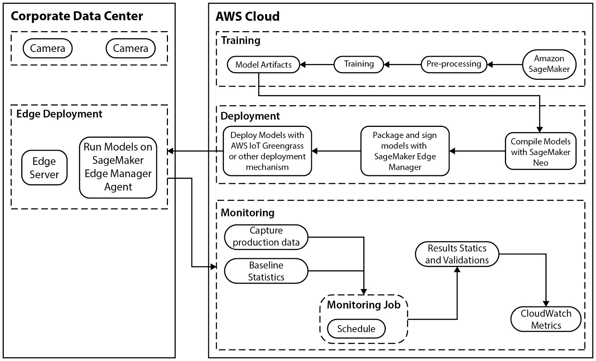
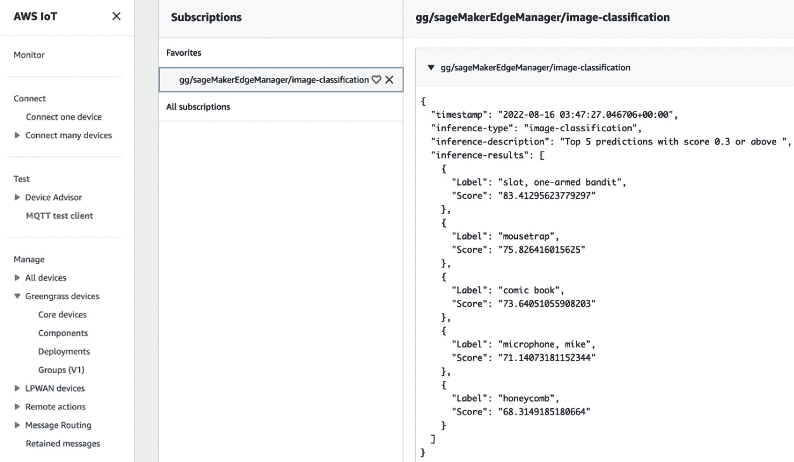

# 第八章：优化和管理适用于边缘部署的机器学习模型

每个机器学习（ML）从业者都知道，机器学习开发生命周期是一个极其迭代的过程，从收集、探索和为我们的算法工程正确的特征，到训练、调整和优化机器学习模型以进行部署。作为机器学习从业者，我们花费高达 80%的时间来获取训练机器学习模型所需的数据，最后 20%的时间实际上是在训练和调整机器学习模型。在过程结束时，我们可能都感到非常欣慰，因为我们终于有一个优化的机器学习模型，我们往往没有足够关注最终模型是如何部署的。因此，重要的是要认识到，训练模型部署的位置和方式对整个机器学习用例有重大影响。例如，假设我们的机器学习用例是针对**自动驾驶汽车**（AVs），特别是训练来检测其他车辆的**计算机视觉**（CV）模型。一旦我们的 CV 模型被训练和优化，我们就可以部署它。

*但是我们在哪里部署它？是部署在车辆本身上，还是部署在训练* *模型* *所使用的相同基础设施上？*

好吧，如果我们将模型部署到我们用于训练模型的相同基础设施上，我们还需要确保车辆可以连接到这个基础设施。我们还需要确保从车辆到模型的连接足够稳健和高效，以确保模型推理结果及时。如果车辆无法及时检测到迎面而来的车辆，那将是灾难性的。因此，在这种情况下，在车辆本身上执行模型推理可能更好；这样，我们就无需担心车辆和机器学习模型之间的网络连接、弹性、带宽和延迟。本质上，就是在边缘设备上部署和执行机器学习模型推理。

然而，在边缘部署和管理机器学习模型给机器学习开发生命周期带来了额外的复杂性。因此，在本章中，我们将回顾一些这些复杂性，并通过一个实际示例，我们将看到如何确切地优化、管理和部署边缘的机器学习模型。因此，我们将涵盖以下主题：

+   理解边缘计算

+   审查最佳边缘部署的关键考虑因素

+   设计用于最佳边缘部署的架构

# 技术要求

要完成本章中的动手示例，你应该具备以下先决条件：

+   网络浏览器（为了获得最佳体验，建议您使用 Chrome 或 Firefox 浏览器）

+   访问你在*第五章*，*数据分析*中使用的 AWS 账户

+   访问我们在*第五章*，*数据分析*中创建的 Amazon SageMaker Studio 开发环境

+   本章的示例代码可在配套的 GitHub 仓库中找到（[`github.com/PacktPublishing/Applied-Machine-Learning-and-High-Performance-Computing-on-AWS/tree/main/Chapter08`](https://github.com/PacktPublishing/Applied-Machine-Learning-and-High-Performance-Computing-on-AWS/tree/main/Chapter08)）

# 理解边缘计算

要了解我们如何优化、管理和部署边缘的 ML 模型，我们首先需要了解什么是边缘计算。边缘计算是一种模式或架构类型，它将数据存储机制和计算资源更靠近实际的数据源。因此，通过将这些资源靠近数据本身，我们从根本上提高了整体应用程序的响应性，并消除了提供最佳和弹性网络带宽的需求。

因此，如果我们参考本章开头强调的 AV 示例，通过将 CV 模型靠近数据源，即实时的摄像头视频流，我们能够实时检测其他车辆。因此，我们不需要让我们的应用程序连接到托管训练模型的底层基础设施，而是将摄像头视频发送到 ML 模型，检索推理结果，最后，根据结果让应用程序采取一些行动。

现在，使用边缘计算架构，我们可以直接将摄像头视频发送到车辆内部的计算资源上运行的训练好的 CV 模型，并根据实时检索到的推理结果让应用程序采取一些行动。因此，通过使用边缘计算架构，我们减轻了连接到 CV 模型托管基础设施所带来的任何不必要的应用程序延迟。随后，我们允许车辆实时对检测到的其他车辆做出反应。此外，我们消除了对弹性光纤网络连接的依赖。

然而，尽管边缘计算架构提供了改进的应用程序响应时间，但该架构本身也引入了额外的复杂性，尤其是在其设计和实现方面。因此，在下一节中，我们将回顾在最佳部署 ML 模型到边缘时需要考虑的一些关键因素。

# 检查最佳边缘部署的关键考虑因素

如前两章所述，在设计适用于大规模训练和部署机器学习模型的适当架构时，需要考虑几个关键因素。在这两章中，我们还看到了如何使用 Amazon SageMaker 来实现执行这些任务的有效临时基础设施。因此，在本章的后续部分，我们还将回顾如何使用 SageMaker 在边缘大规模部署机器学习模型。然而，在我们深入使用 SageMaker 进行边缘部署之前，回顾一些影响边缘部署机器学习模型成功的关键因素是很重要的：

+   效率

+   性能

+   可靠性

+   安全性

虽然并非所有提到的因素都会影响边缘架构的设计，也不一定对机器学习用例至关重要，但至少考虑它们是很重要的。因此，让我们首先考察效率在边缘架构设计中的重要性。

## 效率

按定义，效率是输出与输入之间的比率或百分比。当机器学习模型在边缘部署时，它使执行更接近应用程序，以及用于生成推理的输入数据。因此，我们可以这样说，将机器学习模型部署到边缘默认使其变得高效。然而，这个假设是基于机器学习模型仅根据输入数据提供推理结果，并且不需要在之前对输入数据进行任何预处理的事实。

例如，如果我们参考 CV 模型示例，如果提供给机器学习模型的图像数据需要预处理，例如，图像需要调整大小，或者图像张量需要归一化，那么这个预处理步骤为机器学习模型引入了更多的工作。因此，这个机器学习模型不如一个仅提供推理结果而不进行任何预处理的模型高效。

因此，在设计边缘部署的架构时，我们需要减少在输入数据上执行的不必要工作，以进一步简化推理结果，从而使推理尽可能高效。

## 性能

性能的衡量与效率的衡量类似，只不过它不是一个比率，而是一个质量的测量。因此，当衡量部署到边缘的机器学习模型的质量时，我们衡量模型提供推理结果的速度以及推理结果的准确性。因此，就像效率一样，将机器学习模型的推理结果更接近数据源确实可以提高整体性能，但还需要考虑特定于机器学习用例的权衡。

以 CV 用例为例，我们可能需要通过压缩或剪枝模型架构来妥协模型推理结果的质量，使其更小，以便适应有限的内存，并在边缘计算设备的有限处理能力上运行。此外，尽管大多数 CV 算法在训练和推理时都需要 GPU 资源，但我们可能无法为边缘设备提供 GPU 资源。

因此，在设计边缘部署的架构时，我们需要预测边缘可用的计算资源，并探索如何重构训练好的机器学习模型，以确保它能够适应边缘设备，并在最短的时间内提供最佳的推理结果。

## 可靠性

根据机器学习用例以及模型推理结果的使用方式，可靠性可能不是影响边缘架构设计的决定性因素。例如，如果我们考虑自动驾驶用例，检测附近其他车辆对乘客来说是生死攸关的问题。另一方面，如果不能使用机器学习模型来预测智能恒温器上的未来温度波动，可能只是不便，但并不一定是影响边缘架构设计的决定性因素。

能够检测到部署的机器学习模型失败并发出警报是边缘架构整体可靠性的关键方面。因此，在边缘管理机器学习模型的能力成为边缘架构整体可靠性的关键要素。可能影响架构可靠性和可管理性的其他因素是所使用的通信技术。这些技术可能提供不同级别的可靠性，可能需要多种不同类型。例如，在自动驾驶用例中，车辆可能将蜂窝连接作为主要通信技术，如果这失败了，可以使用卫星链路作为备份。

因此，在设计边缘部署的架构时，可靠性可能不是一个关键因素，但能够管理部署到边缘的模型也是架构整体可扩展性的一个重要因素。

## 安全性

就像可靠性一样，安全性可能不是影响边缘架构设计的决定性因素，而是更具体地取决于用例本身。例如，可能需要加密存储在边缘架构上的所有数据。至于部署在边缘架构上的机器学习模型，这意味着所有推理数据（包括机器模型请求和响应数据）都必须在边缘架构上加密。此外，架构内部和外部传输的任何数据也必须加密。

重要的是要记住，从安全管理角度来看，存在从集中式信任模型到去中心化信任模型的转变，并且边缘架构中的计算资源受限于大小和性能能力。因此，加密类型的选择有限，因为高级加密需要额外的计算资源。

现在我们已经回顾了一些影响机器学习模型部署最佳边缘架构设计的关键因素，在下一节中，我们将深入探讨如何使用 Amazon SageMaker 以及其他专注于边缘设备管理的 AWS 服务来构建最佳边缘架构。

# 设计最佳边缘部署的架构

尽管有许多关键因素会影响边缘架构设计，正如前文所述，但还需要一个关键能力来启用这些因素，即构建、部署和管理边缘设备软件的能力。此外，我们还需要管理应用的能力，本质上是指部署到边缘设备上运行的机器学习模型。因此，AWS 通过一个名为**AWS IoT Greengrass**的专用设备管理服务提供了这两种管理能力，以及内置在 Amazon SageMaker 中的机器学习模型管理能力，称为**Amazon SageMaker Edge**([`aws.amazon.com/greengrass/`](https://aws.amazon.com/greengrass/))和[`aws.amazon.com/sagemaker/edge`](https://aws.amazon.com/sagemaker/edge))。AWS IoT Greengrass 是 AWS 提供的一项服务，可以在无需固件更新的情况下大规模部署软件到远程设备。*图 8.1*展示了利用 Greengrass 和 SageMaker 支持边缘部署的架构示例。



Figure 8.1 – 使用 Amazon SageMaker 和 IoT Greengrass 进行边缘部署的架构

如 *图 8**.1* 所示，典型的架构分为两个独立的架构。一个用于基于云的组件，另一个用于边缘组件。从高层次来看，云环境用于构建、部署和管理部署到边缘的用例应用程序。相应的边缘环境，或在此情况下企业数据中心，是边缘设备所在之处，并依次通过运行支持的 ML 模型来执行 ML 用例。从 ML 用例的角度来看，*图 8**.1* 还显示了连接到边缘服务器设备的摄像头，允许任何捕获的视频流到 ML 模型，以便模型对视频帧中检测到的对象进行分类。*图 8**.1* 展示了 CV 用例的简化流程，从在 SageMaker 上训练 ML 模型到使用 Greengrass 部署到边缘服务器，然后管理和监控解决方案。但构建实际解决方案非常复杂。

因此，为了说明这种复杂性，在下一节中，我们将通过分解每个组件来构建此架构，从企业数据中心或边缘架构开始。

## 构建边缘组件

如前文所述，企业数据中心作为我们的 CV 用例的边缘位置。在这个边缘位置内部，我们有一些摄像头，连接到计算设备或边缘服务器，运行 CV 模型。由于我们没有访问企业数据中心，在本书的背景下，我们将使用 **弹性计算云** （**EC2**） 实例来模拟构建边缘环境。

注意

如果您不习惯使用 EC2 实例，您可以通过参考以下文档来熟悉它们：[`aws.amazon.com/ec2/getting-started/`](https://aws.amazon.com/ec2/getting-started/)。

以下步骤将演示如何使用 EC2 实例设置边缘服务器，并配置必要的 Greengrass 软件以及所需的安全权限。让我们开始设置适当的 **身份和访问管理** （**IAM**） 角色和权限：

1.  登录您的 AWS 账户并打开 IAM 控制台 ([`console.aws.amazon.com/iam/home`](https://console.aws.amazon.com/iam/home))。

1.  一旦打开 IAM 控制台，请使用左侧导航面板并点击 **角色** 以打开 **角色** 仪表板。然后点击右上角的 **创建角色** 按钮。

1.  一旦启动 **创建角色** 向导，请选择 **AWS 服务** 作为 **受信任** **实体** 类型。

1.  对于 **用例**，选择 **EC2** 并点击 **下一步** 按钮。

1.  在 **添加权限** 页面上，点击右上角的 **创建策略** 按钮以打开 **创建** **策略** 页面。

1.  在 GitHub 上的`SageMakerGreenGrassV2MinimalResourcePolicy.json`文件（[`github.com/PacktPublishing/Applied-Machine-Learning-and-High-Performance-Computing-on-AWS/blob/main/Chapter08/SageMakerGreenGrassV2MinimalResourcePolicy.json`](https://github.com/PacktPublishing/Applied-Machine-Learning-and-High-Performance-Computing-on-AWS/blob/main/Chapter08/SageMakerGreenGrassV2MinimalResourcePolicy.json)），并确保将策略中的`<account_id>`标签更新为您的 AWS 账户 ID。

1.  点击**下一步：****标签**按钮。

1.  点击**下一步：****审查**按钮。

1.  在`SageMakerGreenGrassV2MinimalResourcePolicy`上，然后点击**创建****策略**按钮。

1.  从**步骤 5**的**添加权限**页面返回，刷新页面以捕获新创建的 IAM 策略。

1.  在搜索栏中搜索`SageMakerGreenGrassV2MinimalResourcePolicy`策略，一旦找到，选择策略的复选框以添加权限，然后点击**下一步**按钮。

1.  在`SageMakerGreenGrassV2MinimalResourceRole`上，作为**角色名称**。

1.  再次使用`SageMakerGreenGrassV2MinimalResourceRole`角色打开**角色****摘要**页面。

1.  现在，点击**添加权限**下拉菜单并选择**附加****策略**选项。

1.  在搜索栏中搜索`AmazonSageMakerEdgeDeviceFleetPolicy`策略，并点击复选框以选择此策略。

1.  重复**步骤 15**中显示的过程，但这次选择**AmazonSageMakerFullAccess**、**AWSIoTLogging**、**AmazonS3FullAccess**、**AWSIoTRuleActions**、**AWSIoTThingsRegistration**和**AmazonSSMManagedInstanceCore**策略的复选框。

1.  选择这些策略后，点击**附加****策略**按钮。

1.  在`策略`选项中。

1.  在**创建策略**页面，点击**JSON**选项卡并添加以下策略声明：

    ```py
    {
    ```

    ```py
        "Version":"2012-10-17",
    ```

    ```py
        "Statement":[
    ```

    ```py
          {
    ```

    ```py
            "Sid":"GreengrassComponentAccess",
    ```

    ```py
            "Effect":"Allow",
    ```

    ```py
            "Action":[
    ```

    ```py
                "greengrass:CreateComponentVersion",
    ```

    ```py
                "greengrass:DescribeComponent"
    ```

    ```py
            ],
    ```

    ```py
            "Resource":"*"
    ```

    ```py
           }
    ```

    ```py
        ]
    ```

    ```py
    }
    ```

1.  点击**审查****策略**按钮。

1.  将策略命名为`GreengrassComponentAccessPolicy`，然后点击**创建****策略**按钮。

1.  在**角色摘要**页面，点击**信任关系**选项卡，然后点击**编辑信任****策略**按钮。

1.  用以下信任策略声明替换现有的策略：

    ```py
    {
    ```

    ```py
        "Version": "2012-10-17",
    ```

    ```py
        "Statement": [
    ```

    ```py
            {
    ```

    ```py
                "Effect": "Allow",
    ```

    ```py
                "Principal": {
    ```

    ```py
                    "Service": "ec2.amazonaws.com"
    ```

    ```py
                },
    ```

    ```py
                "Action": "sts:AssumeRole"
    ```

    ```py
            },
    ```

    ```py
            {
    ```

    ```py
                "Effect": "Allow",
    ```

    ```py
                "Principal": {
    ```

    ```py
                    "Service": "credentials.iot.amazonaws.com"
    ```

    ```py
                },
    ```

    ```py
                "Action": "sts:AssumeRole"
    ```

    ```py
            },
    ```

    ```py
            {
    ```

    ```py
                "Effect": "Allow",
    ```

    ```py
                "Principal": {
    ```

    ```py
                    "Service": "sagemaker.amazonaws.com"
    ```

    ```py
                },
    ```

    ```py
                "Action": "sts:AssumeRole"
    ```

    ```py
            }
    ```

    ```py
        ]
    ```

    ```py
    }
    ```

现在我们已经设置了必要的权限，接下来我们可以按照以下步骤配置边缘服务器，这些步骤展示了如何配置 EC2 实例：

1.  在创建 EC2 实例之前，我们需要配置必要的脚本，以将 EC2 实例定制为边缘服务器。为了提供对 AWS 资源的简单命令行访问，打开**AWS CloudShell**控制台（[`console.aws.amazon.com/cloudshell/home`](https://console.aws.amazon.com/cloudshell/home)）。

1.  一旦浏览器中的 CloudShell 控制台初始化完成，通过运行以下命令克隆配套的 GitHub 仓库：

    ```py
    $ git clone https://github.com/PacktPublishing/Applied-Machine-Learning-and-High-Performance-Computing-on-AWS src && cd src/Chapter08
    ```

1.  接下来，我们创建一个 S3 存储桶，并通过运行以下命令存储 EC2 实例的配置脚本：

    ```py
    $ export AWS_ACCOUNT=$(aws sts get-caller-identity --query "Account" --output text)
    ```

    ```py
    $ aws s3 mb s3://ec2-scripts-$AWS_REGION-$AWS_ACCOUNT
    ```

    ```py
    $ aws s3 sync scripts s3://ec2-scripts-$AWS_REGION-$AWS_ACCOUNT/scripts
    ```

1.  运行以下命令以捕获包含 EC2 配置脚本的 S3 存储桶的名称：

    ```py
    $ echo ec2-scripts-$AWS_REGION-$AWS_ACCOUNT
    ```

注意

请确保记住包含 EC2 实例配置脚本的 S3 存储桶名称，因为它将在后续步骤中使用。

1.  在浏览器标签页中打开 EC2 管理控制台 ([`console.aws.amazon.com/ec2/v2/home`](https://console.aws.amazon.com/ec2/v2/home))。

1.  一旦打开 EC2 控制台，点击 **启动实例**按钮。

1.  在 `edge-server` 作为此实例的名称。

1.  选择 AMI 为 **amzn2-ami-kernel-5.10-hvm-2.0.20220426.0-x86_64-gp2**，实例类型为 **c5.large**。

1.  滚动到 `20` GiB 的 **根卷**。

1.  在 **高级详情**部分的 **IAM 实例配置文件**下拉框中，选择 **SageMakerGreenGrassV2MinimalResourceRole** 角色。

1.  在 **高级详情**部分的 **用户数据**文本框中，粘贴以下 Bash 代码：

    ```py
    #!/bin/bash
    ```

    ```py
    aws s3 cp s3://<REPLACE WITH THE NAME OF YOUR S3 BUCKET>/scripts/ /home/ec2-user --recursive
    ```

    ```py
    sleep 30
    ```

    ```py
    process_id=$!
    ```

    ```py
    wait $process_id
    ```

    ```py
    sudo yum update -y
    ```

    ```py
    sudo yum install docker -y
    ```

    ```py
    sudo yum install python-pip -y
    ```

    ```py
    sudo pip3 install boto3
    ```

    ```py
    sudo pip3 install requests
    ```

    ```py
    cd /home/ec2-user
    ```

    ```py
    python3 getResourceTempCredentials.py
    ```

    ```py
    sudo service docker start
    ```

    ```py
    sudo usermod -a -G docker ec2-user
    ```

    ```py
    docker build -t "aws-iot-greensgrass:2.5" ./
    ```

    ```py
    chmod +x dockerRun.sh
    ```

注意

确保将 S3 存储桶名称替换为步骤 4 输出中的您的 S3 存储桶名称。

1.  点击 **启动实例**按钮以创建 EC2 实例。

1.  在登录到 EC2 实例之前，请等待 10 分钟，因为用户数据中的 Bash 脚本需要一些时间来安装必要的软件包并构建 AWS IoT Greengrass 软件的 Docker 镜像。

1.  登录到 EC2 实例，并确保您位于 `/home/ec2-user` 目录。使用 `env` 文件，并确保 `AWS_REGION` 变量设置为当前使用的 AWS 区域。例如，以下输出显示了为 `us-east-1` 区域配置的 `env` 文件：

    ```py
    GGC_ROOT_PATH=/greengrass/v2
    ```

    ```py
    AWS_REGION=us-east-1
    ```

    ```py
    PROVISION=true
    ```

    ```py
    THING_NAME=mything
    ```

    ```py
    THING_GROUP_NAME=mythinggroupname
    ```

    ```py
    TES_ROLE_NAME=GreengrassV2TokenExchangeRole
    ```

    ```py
    TES_ROLE_ALIAS_NAME=GreengrassCoreTokenExchangeRoleAlias
    ```

    ```py
    COMPONENT_DEFAULT_USER=ggc_user:ggc_group
    ```

    ```py
    DEPLOY_DEV_TOOLS=true
    ```

注意

您还可以自定义 `THING_NAME` 和 `THING_GROUP_NAME` 参数。但是，请确保这些变量是小写。

1.  保存并退出 `env` 文件。

1.  通过执行以下命令运行 Docker 容器：

    ```py
    $ ./dockerRun.sh
    ```

注意

如果需要重新启动 Greengrass V2 Docker 容器，请确保通过运行以下命令获取新的凭据：

`$ rm credentials # 删除旧的` `credentials 文件`

`$ sudo python3 getResourceTempCredentials.py # 使用` `new credentials` 创建凭据文件`

`$ ./``dockerRun.sh`

1.  打开另一个终端窗口，登录到 EC2 实例，并运行以下命令以验证 Greengrass V2 是否正在运行并检索容器 ID：

    ```py
    $ docker ps
    ```

1.  然后，您可以运行以下命令来访问容器并探索容器内运行的 AWS IoT Greengrass Core 软件：

    ```py
    $ docker exec -it container-id /bin/bash
    ```

注意

当您使用 `docker exec` 在 Docker 容器内运行命令时，这些命令不会记录在 Docker 日志中。作为最佳实践，我们建议您将命令记录在 Docker 日志中，以便在需要调试任何问题时可以查看 Greengrass Docker 容器的状态。

1.  在不同的终端中运行以下命令。它将您的终端的输入、输出和错误附加到当前运行的容器。这将帮助您从终端查看和控制容器。

    ```py
    $ docker attach container-id
    ```

通过执行这些步骤，我们实际上已经配置了一个 EC2 实例来运行我们的机器学习模型作为边缘服务器。因此，随着我们架构的边缘组件成功构建，我们可以继续构建机器学习模型。

## 构建机器学习模型

构建机器学习模型涉及训练一个适合我们业务用例的最优机器学习模型。正如我们在前面的章节中看到的，Amazon SageMaker 为我们提供了独特的功能，使我们能够摄取和处理必要的训练数据，以及训练和优化最佳的机器学习模型。此外，我们还看到 SageMaker 允许我们在云中部署和托管这些模型，而且正如我们将要看到的，SageMaker 还允许我们在边缘部署和管理机器学习模型。

以下步骤将指导您如何构建一个适合我们用例的机器学习模型，为边缘环境编译模型，然后将模型部署到边缘，所有这些操作都使用 SageMaker：

1.  在您的 AWS 账户中，打开 Amazon SageMaker 管理控制台 ([`console.aws.amazon.com/sagemaker/home`](https://console.aws.amazon.com/sagemaker/home))。

1.  启动 SageMaker Studio IDE。

注意

关于如何创建和启动 SageMaker Studio IDE 的更多信息，请参阅 *第五章* 的 *设置 EMR 和 SageMaker Studio* 部分，*数据分析*。

1.  一旦 SageMaker Studio IDE 启动，使用 `Applied-Machine-Learning-and-High-Performance-Computing-on-AWS` 文件夹展开它。

1.  然后，双击 `Chapter_8` 文件夹以打开它进行浏览。

1.  双击 `sagemaker_notebook` 文件夹，然后启动 `1_compile_resnet_model_egde_manager.ipynb` 笔记本。

1.  一旦笔记本启动，使用菜单栏选择 **Kernel** 菜单，然后选择 **Restart Kernel and Run All Cells…** 选项。

笔记本运行完毕后，我们的图像分类模型将在边缘服务器上运行，并作为机群的一部分进行管理。尽管如此，让我们通过回顾笔记本中的一些重要代码单元来验证这一点。笔记本的第一部分下载了一个已经优化或预训练的 `sagemaker_model`：

```py
from sagemaker.pytorch.model import PyTorchModel
from sagemaker.predictor import Predictor
sagemaker_model = PyTorchModel(
    model_data=model_uri,
    predictor_cls=Predictor,
    framework_version=framework_version,
    role=role,
    sagemaker_session=sagemaker_session,
    entry_point="inference.py",
    source_dir="code",
    py_version="py3",
    env={"MMS_DEFAULT_RESPONSE_TIMEOUT": "500"},
)
```

在定义了模型对象之后，我们使用 SageMaker Neo ([`docs.aws.amazon.com/sagemaker/latest/dg/neo.html`](https://docs.aws.amazon.com/sagemaker/latest/dg/neo.html)) 编译一个适合边缘设备特定计算架构的模型，在这种情况下，是我们的 X86_64 Linux 边缘服务器：

```py
sagemaker_client = boto3.client("sagemaker", region_name=region)
target_arch = "X86_64"
target_os = 'LINUX'
response = sagemaker_client.create_compilation_job(
    CompilationJobName=compilation_job_name,
    RoleArn=role,
    InputConfig={
        "S3Uri": sagemaker_model.model_data,
        "DataInputConfig": data_shape,
        "Framework": framework,
    },
    OutputConfig={
        "S3OutputLocation": compiled_model_path,
#         "TargetDevice": 'jetson_nano',
        "TargetPlatform": {
            "Arch": target_arch,
            "Os": target_os
        },
    },
    StoppingCondition={"MaxRuntimeInSeconds": 900},
)
```

注意

请确保注意编译模型的 S3 路径，因为我们将会使用这个路径来部署模型包。

在为边缘服务器编译了模型之后，我们通过将其作为 SageMaker 托管的端点部署来验证模型的功能，然后使用以下代码为测试图像生成一个样本推理：

```py
import numpy as np
import json
with open("horse_cart.jpg", "rb") as f:
    payload = f.read()
    payload = bytearray(payload)
response = runtime.invoke_endpoint(
    EndpointName=ENDPOINT_NAME,
    ContentType='application/octet-stream',
    Body=payload,
    Accept = 'application/json')
result = response['Body'].read()
result = json.loads(result)
print(result)
```

一旦我们验证了模型能够正确地工作，即能够正确地分类图像，我们就可以按照以下代码片段所示打包模型：

```py
packaging_job_name = compilation_job_name + "-packaging-ggv2"
component_name = "SagemakerEdgeManager" + packaging_job_name
response = sagemaker_client.create_edge_packaging_job(
    RoleArn=role,
    OutputConfig={
        "S3OutputLocation": s3_edge_output_location,
    },
    ModelName=packaged_model_name,
    ModelVersion=model_version,
    EdgePackagingJobName=packaging_job_name,
    CompilationJobName=compilation_job_name,
)
```

最后，一旦模型打包完成，我们可以使用`create_device_fleet()`方法创建一个可管理的边缘设备编队来托管新编译的 ML 模型，然后使用`register_device()`方法初始化我们的 EC2 边缘服务器作为已注册或管理的边缘设备，该设备运行我们的 ML 模型：

```py
s3_device_fleet_output = os.path.join(s3_edge_output_location, 'fleet')
iot_role_arn = f'arn:aws:iam::{account_id}:role/SageMakerGreenGrassV2MinimalResourceRole'
device_fleet_name = "mydevicefleet"
device_name = 'mything'
sagemaker_client.create_device_fleet(
    DeviceFleetName=device_fleet_name,
    RoleArn=iot_role_arn, # IoT Role ARN specified in previous step
    OutputConfig={
        'S3OutputLocation': s3_device_fleet_output
    }
)
sagemaker_client.register_devices(
    DeviceFleetName=device_fleet_name,
    Devices=[
        {
            "DeviceName": device_name,
            "IotThingName": device_name
        }
    ]
)
```

一旦模型经过训练和编译，并将边缘服务器注册为 SageMaker 管理的边缘设备，我们就可以继续部署模型包到边缘服务器。

## 部署模型包

要将模型包部署到边缘服务器，我们将将其注册为 Greengrass 组件，然后使用 Greengrass 控制台将组件部署到边缘服务器。以下步骤将指导我们如何完成此操作：

1.  使用网页浏览器打开 AWS IoT 管理控制台（[`console.aws.amazon.com/iot/home`](https://console.aws.amazon.com/iot/home)）。

1.  在左侧导航面板的**管理**部分，展开**Greengrass 设备**选项，然后点击**组件**。

1.  点击**创建** **组件**按钮。

1.  将`com.greengrass.SageMakerEdgeManager.ImageClassification.Model.json`文件内容输入到**配方**框中。

注意

`com.greengrass.SageMakerEdgeManager.ImageClassification.Model.json`文件可以在配套的 GitHub 仓库中找到（[`github.com/PacktPublishing/Applied-Machine-Learning-and-High-Performance-Computing-on-AWS/blob/main/Chapter08/custom_component_recipes/com.greengrass.SageMakerEdgeManager.ImageClassification.Model.json`](https://github.com/PacktPublishing/Applied-Machine-Learning-and-High-Performance-Computing-on-AWS/blob/main/Chapter08/custom_component_recipes/com.greengrass.SageMakerEdgeManager.ImageClassification.Model.json)）。

1.  更新 JSON 文件中`Artifacts`标签下打包模型的 S3 位置，以匹配编译模型的 S3 路径。

注意

打包模型的 S3 位置是上一节中使用的`create_compilation_job()`方法的输出。

1.  点击**创建** **组件**按钮。

1.  前往您的 S3 存储桶，创建`artifacts`文件夹，并在其中创建一个名为`com.greengrass.SageMakerEdgeManager.ImageClassification`的另一个文件夹。您的 S3 路径应如下所示：`s3://<bucket_name>/artifacts/com.greengrass.SageMakerEdgeManager.ImageClassification/`。

1.  从 GitHub 仓库（[`github.com/PacktPublishing/Applied-Machine-Learning-and-High-Performance-Computing-on-AWS/tree/main/Chapter08`](https://github.com/PacktPublishing/Applied-Machine-Learning-and-High-Performance-Computing-on-AWS/tree/main/Chapter08)）上传`image_classification.zip`和`installer.sh`文件到第 7 步中定义的 S3 位置。

1.  更新 JSON 文件中`Artifacts`标签下`image_classification.zip`和`installer.sh`文件的 S3 位置，以匹配第 8 步中定义的 S3 路径。

1.  对于**com.greengrass.SageMakerEdgeManager.ImageClassification**组件，重复第 3 步和第 4 步。

注意

`com.greengrass.SageMakerEdgeManager.ImageClassification.json` 文件可以在配套的 GitHub 仓库([`github.com/PacktPublishing/Applied-Machine-Learning-and-High-Performance-Computing-on-AWS/blob/main/Chapter08/custom_component_recipes/com.greengrass.SageMakerEdgeManager.ImageClassification.json`](https://github.com/PacktPublishing/Applied-Machine-Learning-and-High-Performance-Computing-on-AWS/blob/main/Chapter08/custom_component_recipes/com.greengrass.SageMakerEdgeManager.ImageClassification.json))中找到。

在注册了 Greengrass 组件后，我们现在可以将它们部署到边缘服务器，并使用我们刚刚创建的组件运行图像分类推理。部署这些组件将下载 SageMaker Neo 编译的预训练 ML 模型，并在边缘服务器上安装 SageMaker Edge Manager 代理。然而，在我们实际部署这些组件之前，我们必须订阅通知主题，以便查看和管理边缘服务器上的任何推理任务。以下步骤将指导我们如何订阅主题：

1.  前往 AWS IoT 控制台([`console.aws.amazon.com/iot/`](https://console.aws.amazon.com/iot/))，然后在左侧导航面板的 **测试** 选项中点击 **MQTT 测试客户端**。

1.  在 `gg/sageMakerEdgeManager/image-classification`。

1.  点击 **订阅** 按钮。

由于可以监控和管理运行在边缘服务器上的 ML 模型的任何推理请求，我们可以部署 Greengrass 组件。以下步骤将展示如何进行此操作（这些步骤也在 AWS Greengrass 开发者指南[`docs.aws.amazon.com/greengrass/v2/developerguide/greengrass-v2-developer-guide.pdf`](https://docs.aws.amazon.com/greengrass/v2/developerguide/greengrass-v2-developer-guide.pdf)中突出显示）：）

1.  在 AWS IoT Greengrass 控制台([`console.aws.amazon.com/greengrass`](https://console.aws.amazon.com/greengrass)) 导航菜单中，选择 **部署**，然后选择目标设备的部署。

1.  在部署页面，选择 **修订**，然后选择 **修订部署**。

1.  在 **指定目标** 页面，点击 **下一步**。

1.  在 **选择组件** 页面的 **我的组件** 选项下，选择 **com.greengrass.SageMakerEdgeManager.ImageClassification** 和 **com.greengrass.SageMakerEdgeManager.ImageClassification.Model** 组件。

1.  在 **公共组件** 下，关闭 **仅显示所选组件** 切换，然后选择 **aws.greengrass.SageMakerEdgeManager** 组件。

1.  点击 **下一步**。

1.  在 **配置组件** 页面，选择 **aws.greengrass.SageMakerEdgeManager** 组件，并选择 **配置组件**。

1.  在 **配置更新** 下的 **要合并的配置** 中，输入以下配置：

    ```py
    {
    ```

    ```py
        "DeviceFleetName": "device-fleet-name",
    ```

    ```py
        "BucketName": "S3-BUCKET"
    ```

    ```py
    }
    ```

注意

将 `device-fleet-name` 和 S3 存储桶名称替换为在笔记本中创建设备编队时创建的相应值。

1.  选择**确认**，然后选择**下一步**。

1.  在**配置高级设置**页面，保持默认配置设置并选择**下一步**。

1.  在**审查**页面，选择**部署**。

部署可能需要几分钟才能完成。组件部署完成后，我们可以在 Greengrass Core 设备的组件日志以及 AWS IoT 控制台的 AWS IoT MQTT 客户端中查看、管理和监控机器学习模型推理结果。要查看 Greengrass Core 设备的组件日志中的推理结果，请登录到边缘服务器 EC2 实例并运行以下命令：

```py
$ sudo tail –f /greengrass/v2/logs/com.greengrass.SageMakerEdgeManager.ImageClassification.log
```

您应该在日志中看到类似于以下内容的“得分 0.3 或以上的前 5 个预测”：

```py
2022-08-15T03:38:45.437Z [INFO] (Copier) com.greengrass.SageMakerEdgeManager.ImageClassification: stdout. {"timestamp": "2022-08-15 03:38:45.282879+00:00", "inference-type": "image-classification", "inference-description": "Top 5 predictions with score 0.3 or above ", "inference-results": [{"Label": "slot, one-armed bandit", "Score": "83.41295623779297"}, {"Label": "mousetrap", "Score": "75.826416015625"}, {"Label": "comic book", "Score": "73.64051055908203"}, {"Label": "microphone, mike", "Score": "71.14073181152344"}, {"Label": "honeycomb", "Score": "68.3149185180664"}]}. {scriptName=services.com.greengrass.SageMakerEdgeManager.ImageClassification.lifecycle.run.script, serviceName=com.greengrass.SageMakerEdgeManager.ImageClassification, currentState=RUNNING}
```

或者，您也可以通过点击左侧导航面板上的**测试**选项中的**MQTT 测试客户端**在 AWS IoT 控制台上查看结果（[`console.aws.amazon.com/iot/`](https://console.aws.amazon.com/iot/)）。在**订阅**部分，您将看到预测结果，如下面的截图所示：



图 8.2 – 在 AWS IoT 控制台 MQTT 测试客户端上的推理结果

如果您在 MQTT 客户端看不到推理结果，部署可能已失败或未达到核心设备。这主要可能由两个原因造成：您的核心设备未连接到网络，或者它没有执行组件的正确权限。要排查问题，您可以在核心设备上运行以下命令。此命令将打开 AWS IoT Greengrass Core 软件日志文件，其中包含 Greengrass Core 设备部署服务的日志。

```py
$ sudo tail -f /greengrass/v2/logs/greengrass.log
```

注意

如需更多信息，请参阅故障排除文档：[`docs.aws.amazon.com/greengrass/v2/developerguide/ml-troubleshooting.html`](https://docs.aws.amazon.com/greengrass/v2/developerguide/ml-troubleshooting.html)。

现在 Greengrass 组件已部署到边缘服务器，我们已经成功将我们的机器学习模型部署到边缘。此外，通过利用 AWS IoT Greengrass 和 Amazon SageMaker 的能力，我们不仅使机器学习在边缘设备上**高效**运行并确保**性能**，还建立了一种**管理**和**监控**环境的机制。正如您在**回顾最佳边缘部署的关键考虑因素**部分所回忆的那样，这些是构成最佳边缘架构的关键因素。

# 摘要

在本章中，我们向您介绍了将机器学习模型部署在云之外的概念，主要是边缘架构。为了奠定边缘部署的基础，我们还探讨了边缘架构是什么，以及在设计边缘架构时需要考虑的最重要因素，即效率、性能和可靠性。

考虑到这些因素，我们探讨了如何使用 AWS IoT Greengrass 以及 Amazon SageMaker 服务在云中构建一个最优的机器学习模型包，编译后能够在边缘设备上高效运行，并且以可靠的方式部署到边缘环境中。在这个过程中，我们还强调了管理和监控边缘设备以及部署的机器学习模型对于创建最优边缘架构的重要性。

在下一章中，我们将继续探讨部署的机器学习模型的性能监控和优化。
